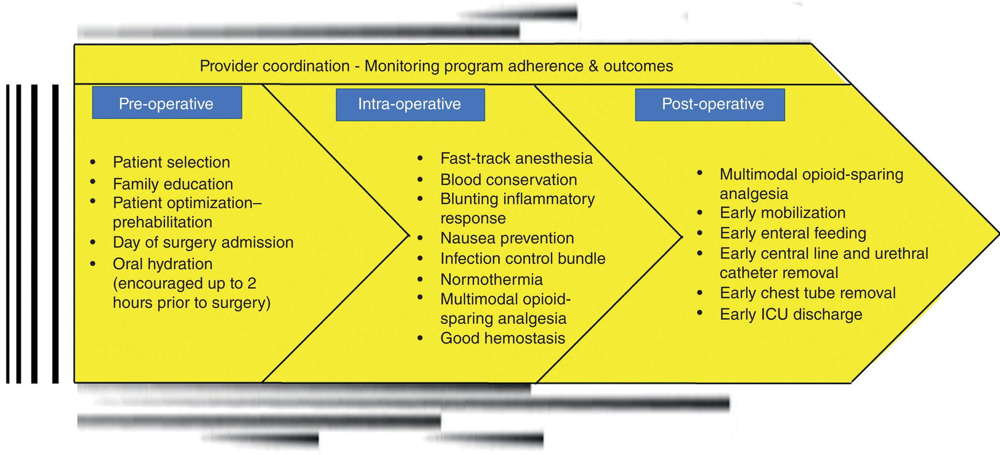
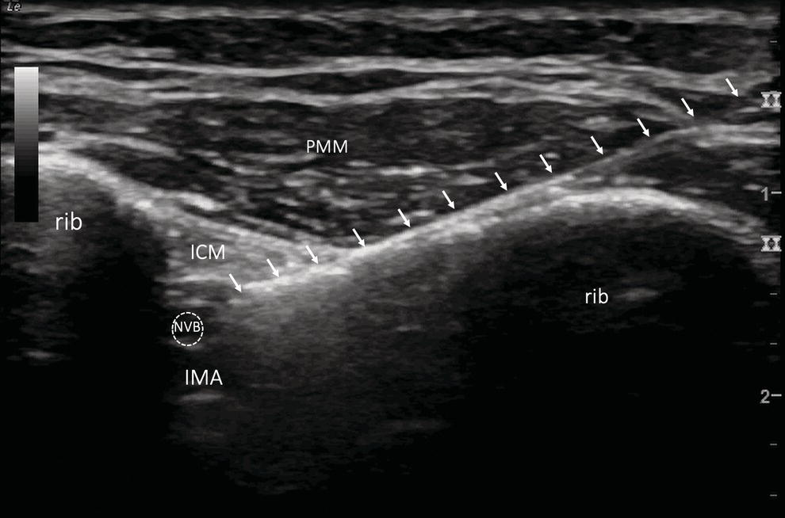
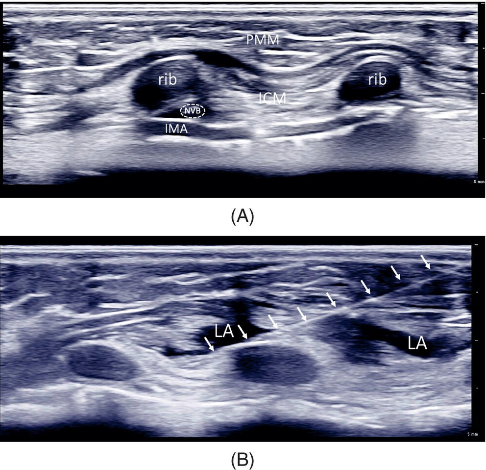
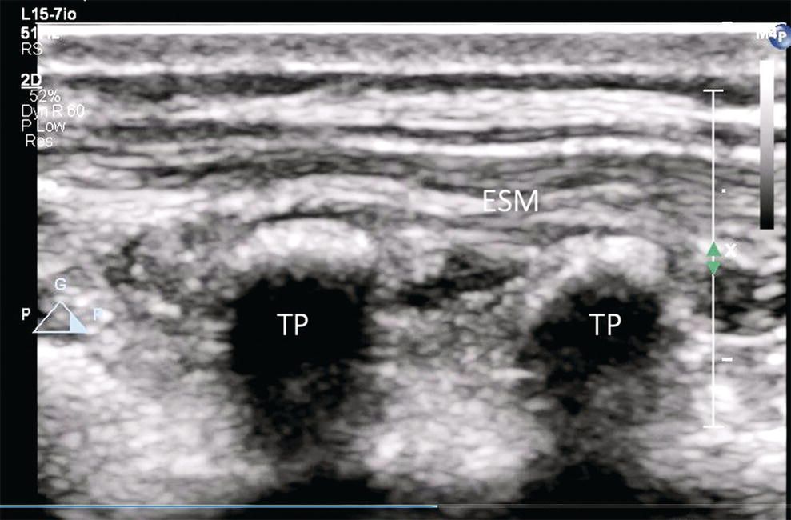
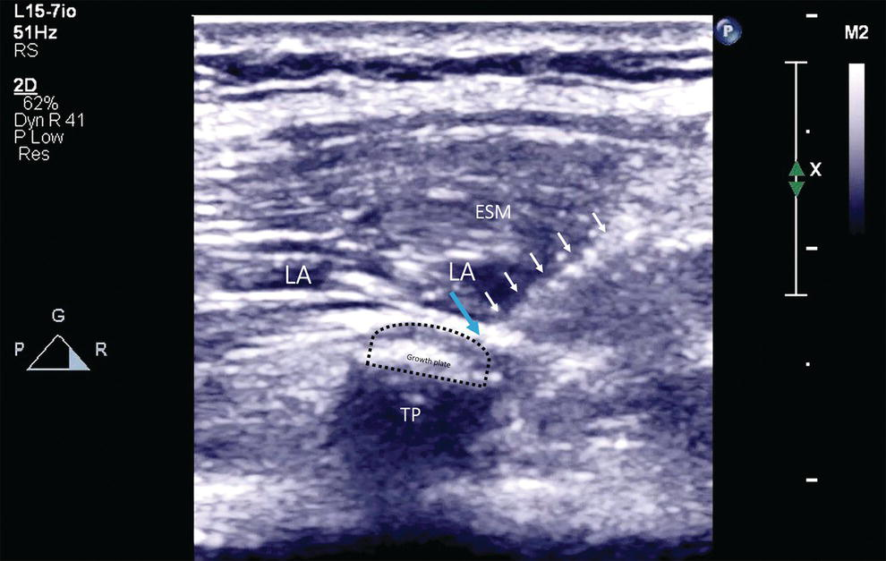
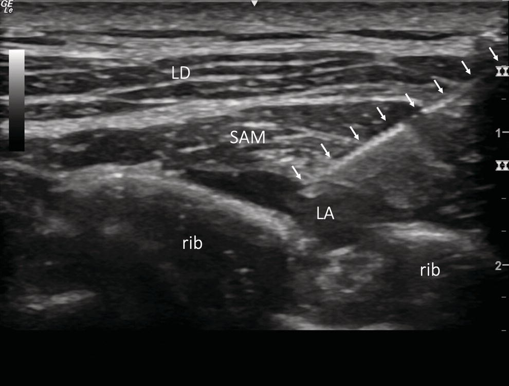

CHAPTER 24 Early Tracheal Extubation, Enhanced Recovery After Pediatric Cardiac Surgery, Regional Anesthesia and Postoperative Pain Management 

# CHAPTER 24  
Early Tracheal Extubation, Enhanced Recovery After Pediatric Cardiac Surgery, Regional Anesthesia and Postoperative Pain Management

_Alexander Mittnacht_

Department of Anesthesiology, Westchester Medical Center, Valhalla, NY, USA

* * *

-   [**Introduction**](#head-2-238)
-   [**Background and history**](#head-2-239)
-   [**Enhanced recovery after pediatric cardiac surgery**](#head-2-240)
-   [**Feasibility of fast‐tracking in congenital heart surgery**](#head-2-241)
-   [**Patient selection**](#head-2-242)
-   [**Implementation and maintaining fast‐tracking**](#head-2-243)
-   [**Anesthesia technique**](#head-2-244)
-   [**Surgery and CPB considerations**](#head-2-245)
-   [**Failed extubation and prolonged mechanical ventilation**](#head-2-246)
-   [**Benefits of fast‐tracking**](#head-2-248)
-   [**Concerns and safety of fast‐tracking**](#head-2-250)
-   [**Postoperative considerations**](#head-2-251)
-   [**Neuraxial techniques**](#head-2-252)
    -   [Single‐shot neuraxial techniques](#head-3-383)
    -   [Catheter‐based neuraxial techniques](#head-3-384)
    -   [Potential benefits of neuraxial techniques](#head-3-385)
    -   [Risks and complications of neuraxial techniques](#head-3-386)
-   [**Regional blocks**](#head-2-253)
-   [**Conclusions**](#head-2-254)
-   [**Selected references**](#head-2-255)

* * *

## Introduction

Today’s medical environment is marked by financial constraints. There is increasing pressure to optimize not only medical care but also resource utilization. This notion has also affected the way we approach the treatment of children requiring surgery for congenital heart disease (CHD). For example, reducing intensive care unit (ICU) and hospital length of stay (LOS) without compromising patient’s safety translates into much‐needed cost savings.

Although the overarching goal of providing efficient and safe care has not changed, not only the terminology but also the approach to achieving this goal has seen a significant evolution. The following chapter will focus on perioperative management, including early tracheal extubation, adequate postoperative pain control, rapid mobilization, and hospital discharge.

## Background and history

The focus on not only improving surgical techniques but also on providing efficient care to patients undergoing cardiac surgery was introduced in the mid‐1980s. Diagnosis‐related groups were implemented nationally into Medicare reimbursement in the United States in 1983. To slow down the rapidly increasing costs of providing medical care, this reimbursement model incentivized efficient resource use, and a shorter length of ICU and hospital stay was suddenly linked to financial benefits for the hospitals. At the same time, in congenital heart surgery (CHS), extubation at the end of the surgical procedure was almost a necessity, as reliable mechanical ventilators and sedatives with minimal side‐effects for small patients were not widely available.

In 1980, Barash et al. published their experience with _early extubation_ in 197 patients aged less than 3 years including neonates; of them, 61% were successfully extubated in the operating room (OR) \[1\]. The authors noted that “in this era of cost containment, any technique that allows maximal use of resources without jeopardizing patient safety is welcome.” The concept of the day of admission surgery, early‐extubation, ‐mobilization, and ‐hospital discharge became popular and eventually routine practice in adults undergoing cardiac surgery in the late 1990s. This was especially true when crowded ICUs slowed the expansion of cardiac surgery programs attempting to gain a share of the increasing number of coronary revascularizations being performed \[2\]. In 1994, Engelman et al. first coined the term “fast‐track” in their paper, describing a complete care plan for patients undergoing cardiac surgery, which was associated with reduced hospital LOS \[3\].

[**Figure 24.1**](#R_c24-fig-0001) Enhanced recovery after pediatric cardiac surgery pathway.

In the field of CHS, surgical techniques developed rapidly and palliation and repair of CHD in even younger and previously inoperable children became feasible. Reports about favorable effects of high‐dose opioid‐based anesthesia emerged in the early 1990s, promising to reduce stress response, morbidity, and mortality \[4, 5\]. Administering high doses of opioids subsequently became the standard anesthetic technique in children undergoing increasingly complex CHS. This opioid‐based anesthetic technique, however, necessitated prolonged postoperative mechanical ventilation (MV), and early tracheal extubation was no longer an option. Subsequently, shorter‐acting drugs and anesthetic agents with less pronounced hemodynamic effects were introduced and the benefit and need of a high‐dose opioid‐based anesthetic were challenged \[6, 7\]. More recently, bundled care payment models have been implemented for specific procedures, and healthcare providers are once more encouraged to efficiently manage costs. At the same time, not meeting quality of care measures is linked to financial penalties.

Many of these past and recent changes have led hospital administrators, as well as individual healthcare providers, to re‐think and investigate established, yet often inefficient, patient management strategies.

## Enhanced recovery after pediatric cardiac surgery

In line with these efforts, the term “enhanced recovery after surgery” or ERAS, originally coined by Henrik Kehlet for colorectal surgery in 1997 \[8\], was adopted by many surgical specialties, including cardiac and pediatric cardiac surgery \[9\]. This patient management strategy, paraphrased by the acronym ERACS (enhanced recovery after cardiac surgery), focuses on a patient‐centered, evidence‐based, multidisciplinary approach to cardiac, including pediatric cardiac, surgery. ERACS strategy includes many if not most of the elements of fast‐tracking children and adults undergoing surgery for CHD, that is, multidisciplinary approach, day of admission surgery, normothermia at the end of the procedure, multimodal pain management strategy, early ‐extubation, ‐mobilization, ‐enteral feeding, ‐ICU and –hospital discharge ([Figure 24.1](#c24-fig-0001)). The goals are also very similar, i.e., providing efficient, patient‐centered patient care, that would help accelerate functional recovery and minimize surgical stress, thereby reducing the LOS, improving patient outcomes, optimizing resource use, and reducing associated costs. It further emphasizes routine monitoring and reporting of quality metrics and patient outcomes, aimed at continuously improving the operational aspects of this approach. The American Association for Thoracic Surgery published a consensus document on enhanced recovery after pediatric cardiac surgery \[10\]. Key strategies that were identified for successfully implementing and maintaining an ERACS pathway include a multi‐disciplinary approach, appropriate patient selection, staff and patient/family education, protocol‐ and guideline‐driven practice. The task force concluded that ERACS does not increase morbidity and mortality after pediatric cardiac surgery. Patient and family satisfaction with perioperative care may be improved. Roy and colleagues described their initial experience after introducing ERACS to their CHS program \[11\]. Compared to a matched historical control group, ERACS implementation resulted in a slightly reduced time on mechanical ventilation and LOS in ICU, although, no difference in hospital LOS was noted.

## Feasibility of fast‐tracking in congenital heart surgery

The multidisciplinary approach behind fast‐tracking CHS patients typically includes an anesthetic technique that facilitates early tracheal extubation. Early extubation is not consistently defined, and the term is frequently used when the endotracheal tube is removed within 6 hours after surgery \[12, 13\], but spans from immediate extubation in the OR up to 24 hours after surgery \[10\].

The feasibility and safety of extubating children immediately or soon after complex CHS had already been demonstrated in the early days of CHS, mostly out of necessity \[1\]. Schuller et al. reported their experience with early extubation in 1984 \[14\]. In 209 consecutive children undergoing complex open‐heart surgery, 88% of those older than 12 months were extubated in the OR. In the same year, Heard et al. published an article on early extubation following CHS in 220 patients; of whom 147 (67%) were extubated in the OR or within 6 hours of entering the ICU \[15\]. None of the patients required reintubation. This was accomplished even though many of the anesthetic agents used at that time are obsolete in today’s practice.

Despite the increasing popularity of a high‐opioid anesthetic technique following these early reports, individual centers continued to pursue an early extubation strategy. The published reports and the recent changes in healthcare practice including ERAS pathways encouraged many institutions to adopt fast‐tracking for at least some of their patients. At the time of this writing, the feasibility of fast‐tracking including early extubation in children undergoing CHS has been demonstrated for most patients undergoing CHS. This includes neonates and young children \[16, 17\], complex surgeries \[18, 19\], children with single‐ventricle physiology \[20, 21\], patients with significant co‐morbidities, \[22\] and even in pediatric heart transplantation \[23\]. In a recent multicenter international survey spanning 144 pediatric cardiac surgery centers in 29 countries, extubation in the OR at the conclusion of surgery was practiced by 76% of the responding anesthesiologists, mostly for lower surgical risk procedures \[24\]. [Table 24.1](#c24-tbl-0001) summarizes the current literature on the feasibility of fast‐tracking and early extubation in pediatric patients undergoing CHS.

* * *

### KEY POINTS: FEASIBILITY OF FAST‐TRACKING IN CHS

-   Fast‐tracking is a multidisciplinary patient management strategy aiming for efficient resource use.
-   Early extubation is part of fast‐tracking and is typically defined as removal of the endotracheal tube within 6 hours of surgery.
-   The feasibility of fast‐tracking has been shown historically out of necessity and in contemporary patient cohorts.
-   Inclusion/exclusion criteria vary significantly between different centers.

* * *

## Patient selection

When it comes to planning fast‐tracking including early extubation for a specific patient or case, it seems prudent to understand the current evidence and have some guidance regarding who is a good candidate for such an approach. Some preoperative factors are almost universally viewed as contraindications for early extubation after CHS. For example, very few patients who have an endotracheal tube in place before the procedure will be good candidates for such a strategy. However, in many institutions, this practice is further limited to selected patients and is based on the anesthesiologist’s or surgeon’s preferences. While some centers consider early extubation only above a certain age and for simple procedures, others expand such a strategy to the majority of their patients. In many, if not all, of the published reports, specific exclusion criteria were applied, and it is not clear if patients who were not included could have been extubated early as well. As a matter of fact, there are reports showing successful early extubation in even the most complex procedures. Therefore, when interpreting study findings, it is important to notice not only the study design, inclusion and exclusion criteria, but also if extubation was attempted or deferred. A simple association between perioperative parameters and early extubation alone, without the specifics of extubation attempt, will not yield reliable data beyond individual practice or preferences.

The most consistent findings associated with deferred extubation are higher procedure complexity, younger age, longer aortic cross‐clamp and cardiopulmonary bypass (CPB) times, and high‐dose inotrope use \[30, 35–42\]. This has also been confirmed by prospective studies. Kin et al. found higher procedure complexity classified with the risk adjustment for congenital heart surgery (RACHS) score \[43\], surgery involving aortic cross‐clamping, young age, and trisomy 21 to be independent predictors of the decision to not attempt extubation at the end of the procedure \[32\]. Very few patients in that series failed extubation once attempted. At first glance, these findings seem to classify selection criteria in a very simplified scheme. All listed factors are known preoperatively, and the findings seem to indicate that intraoperative factors such as bleeding, cardiac dysfunction requiring high inotropic support, generalized edema, etc., many of which are frequently encountered, are not significantly contributing to predicting early extubation. However, procedure complexity seems to capture many of these factors. Complex surgeries are frequently associated with longer aortic cross‐clamp and CPB times, more pronounced inflammatory response, and associated findings such as a higher incidence of bleeding, generalized edema, and higher inotropic requirements, which prohibit early removal of the endotracheal tube all by themselves \[29, 44, 45\]. In a prospective observational study, Garg et al. \[34\] collected information on OR extubation and reasons for deferring extubation to a later time point in 1,000 pediatric patients undergoing surgery for CHD within an 8‐month time period. Overall, 87.1% of patients were extubated in the OR, resulting in significantly shorter ICU LOS compared to a historical control group. Factors associated with deferred extubation included poor oxygenation, open sternum, ongoing bleeding, high inotrope use, and other reasons necessitating further observation in the ICU.

Aside from complex procedures, young age is one of the most frequently listed reasons for not considering early extubation \[32\]. In retrospective analyses, young age is consistently associated with not being fast‐tracked. Davis et al., for example, assessed factors associated with early extubation following CHS. Children older than 6 months were much more likely to be extubated early compared with younger patients \[29\]. Winch et al. \[46\] found that children younger than 3 months were less likely to be extubated early. However, extubation practice varies significantly and even neonates have been extubated successfully immediately after CHS \[17\]. Age also needs to be assessed in the context of the planned procedure. Certain more complex procedures may be performed later in life, while a simple procedure in an infant may pose a much smaller risk for not qualifying for early extubation. The fact that age alone is not a good selection criterion for fast‐tracking is also supported by the published literature. Kin et al. \[32\], for example, found that the relationship between age and attempted OR extubation was inconsistent and not linear. Beyond the age of 2 years, however, age did not impact the likelihood of OR extubation. Similarly, in Garg’s study \[34\] representing a large number of patients and a high overall extubation rate (87.1%), OR extubation was accomplished in 40% of neonates, 69.7% of 1–3‐month‐olds, 85.5% of 3 months–1‐year‐olds, and leveled off thereafter. In general, these data indicate that successful extubation in the OR can be accomplished more reliably in children older than 2–3 months of age. Younger infants and neonates need not be excluded from such a strategy; however, the incidence of encountering contraindications to early extubation at the end of the procedure or soon after in the ICU is typically much higher at this very young age.

[**Table 24.1**](#R_c24-tbl-0001) Publications on fast‐tracking in children undergoing congenital heart surgery

| Reference | Study type | Patients enrolled | RACHS category | Findings |
| --- | --- | --- | --- | --- |
| Barash et al. \[1\] | R | 197 | 1–3 | 
-   61% extubated in OR, 11% shortly after ICU arrival, 4% reintubation
-   Longer CPB time associated with not extubating
-   Fewer pulmonary complications in early extubation group

 |
| Schuller et al. \[14\] | R | 209 | 1–5 | 

-   80% extubated in OR, 2.4% reintubation
-   Younger age, PAH, and severe preoperative heart failure, associated with not extubating in OR

 |
| Heard et al. \[15\] | R | 220 (1 day–16 years) | 1–3 | 

-   67% extubated in OR or within 6 hours after ICU arrival, no reintubation
-   Fewer pulmonary complications with early extubation
-   Longer CPB time associated with prolonged MV

 |
|  |  |  |  |  |
| Laussen et al. \[25\] | R | 102 | 1 (ASD only) | 

-   38% extubated in OR
-   OR extubation safe
-   Shorter hospital LOS, and lower costs associated with early extubation

 |
| Heinle et al. \[17\] | R | 56 (_<_90 days) | 1–6 | 

-   50% extubated in OR or within 3 hours in ICU
-   3 patients required reintubation
-   Patients extubated early had shorter ICU/hospital LOS, reduced costs

 |
| Vricella et al. \[26\] | R | 201 | 1–3 | 

-   87% extubated in OR, 94% within 4 hours after surgery, 2.6% required reintubation
-   Fast‐tracking in surgery for CHD is feasible and safe

 |
| Lofland \[27\] | P/O | 50 | 3 (bi–Glenn, Fontan only) | 

-   All patients extubated either in OR or within 1 hour postoperatively
-   Pain‐free spontaneous ventilation resulted in superior hemodynamics

 |
| Neirotti et al. \[19\] | R | 901 | 1–3 | 

-   73% extubated in OR, 2.5% reintubation
-   Younger age, lower weight were risk factors for deferring OR extubation
-   Simplified postoperative care and increased patient and family satisfaction

 |
| Kloth and Baum \[28\] | R | 102 (>2 months) | 1–6 | 

-   47% extubated in OR or on ICU arrival, no reintubation
-   Only RACHS 1–3 extubated early
-   Mild respiratory acidosis immediately following early extubation well tolerated
-   Young age, low weight, long CPB time, DHCA, high inotrope use, PAH, are among the factors why extubation was not attempted

 |
| Davis et al. \[29\] | R | 219 (≤36 months) | 1–6 | 

-   47% extubated within 24 hours
-   Age >6 months, no PAH, no CHF, gestational age >36 weeks, associated with early extubation
-   Intraoperative factors less important, except for the cross‐clamp time

 |
| Vida et al. \[22\] | R | 100 (median age 2.5 years) | 2 (VSD + PAH only) | 

-   65% extubated in OR, overall 90% extubated within 6 hours after surgery, two patients extubated early required reintubation
-   Trisomy 21 and longer CPB time are risk factors for postoperative complications and prolonged MV
-   PAH is not a contraindication for early extubation
-   Degree of PAH not associated with the incidence of postoperative complications, ICU and hospital LOS
-   Decreased ICU and hospital stay, reduced costs, lower in‐hospital mortality with early extubation

 |
| Mittnacht et al. \[30\] | R | 224 (>1 month, _<_18 years) | 1–4 | 

-   79% in OR, no reintubation for respiratory reasons
-   Younger age, longer CPB time, and high inotrope use associated with not extubating in OR

 |
| Morales et al. \[21\] | R | 112 | 3 (Fontan only) | 

-   34% extubated in OR, no reintubation
-   Lower inotrope use, shorter ICU and hospital LOS, and decreased costs with early extubation

 |
| Preisman et al. \[31\] | P/R/O | 50 (OR extubation)/50 (control) | 1–3 | 

-   No difference in mortality, morbidity, reintubation
-   Shorter ICU and hospital LOS in OR extubation group

 |
| Kin et al. \[32\] | P/O | Site 1: 275 (2 weeks–18 years, median 18 months)  
Site 2: 49 (median 25 months) | 1–3 | 

-   Site 1:89% extubated in OR (three patients required reintubation for respiratory reasons)
-   Site 2: 65% extubated in OR (no reintubation)
-   All patients with cross‐clamp and RACHS‐1 extubated in OR
-   RACHS, trisomy 21, age, independent predictors of OR extubation

 |
| Hamilton et al. \[33\]  
  
Garg et al. \[34\]  
  
Harris et al. \[35\]  
  
Varghese et al. \[18\]  
  
Varghese et al. \[20\]  
  
Shinkawa et al. \[36\]  
  
Fukunishi et al. \[37\]  
  
Wu et al. \[38\] | R  
  
  
P/O  
  
  
R  
  
  
R  
  
  
R  
  
  
R  
  
  
R  
  
  
R | 50 (OR extubation)/50  
(control)  
  
1,000 (1 day–18 years)  
  
  
613, including neonates  
  
  
148, neonates  
  
  
23, stage 1 palliation  
  
  
909, including neonates  
  
  
359 (1 month–18 years)  
  
  
2,060 (<18 years) | 1–3 | 

-   Lower inotrope use, and shorter hospital LOS in early extubation (OR) group
-   More reintubations in early extubation but statistically not significant

  
  
87% extubated in OR, shorter ICU stay, and lower resource use  
  
  
71% extubated in OR, 89% within 24 hours including neonates  
  
  
30.4% extubated in OR,  
  
  
5 patients extubated in OR, no difference in outcomes  
  
  
64.9% extubated in OR, decreased ICU LOS and costs, no difference in reintubation rate, longer OR turnover  
  
83% extubated in OR, lower RACHS‐1 score resulted in higher extubation rate  
  
  
65% extubated in OR, 16.1% within 6 hours, reintubation rate 2.0% |

R, retrospective; P, prospective; O, observational; ICU, intensive care unit; OR, operating room; RACHS, Risk Adjusted Congenital Heart Surgery Score; LOS, length of stay; CPB, cardiopulmonary bypass; PAH, pulmonary arterial hypertension; MV, mechanical ventilation.

Chromosomal abnormalities also account for patients not being considered for early extubation. While not a contraindication _per se_, patients with a genetic variation known to be associated with difficult airway instrumentation, or an increased risk of airway obstruction (e.g., trisomy 21), must be evaluated carefully before attempting early extubation. This is even more of a concern following a long CPB time, which is frequently associated with generalized edema possibly involving the upper airway.

Pre‐existing or worsening of pulmonary arterial hypertension (PAH) deserves particular attention. Many practitioners would not attempt early extubation in patients with pre‐existing PAH. However, this practice has been challenged, and there are reports of successful extubation following CHS even in patients with significant PAH \[22\]. In a retrospective analysis of factors associated with early extubation, PAH was not found to be an independent predictor of OR extubation \[30\], and preoperative PAH did not predict patients who were not extubated in the OR in a similar prospective study \[32\]. In the latter study, however, significant PAH following CPB was the most common reason for deferring extubation at the end of the procedure. While there is no question why PAH increases the risk for many adverse perioperative events \[47–50\], it is important to recognize that merely using the current definition of PAH (right‐sided pressures ≥20 mmHg) \[51\] does not accurately reflect such risks in children with CHD \[52\]. It is often difficult to predict the degree of PAH following surgical repair and, even more importantly, right ventricular failure merely by preoperative right‐sided pressures. Assessment of pulmonary vascular resistance (PVR), reactivity to pulmonary vasodilators, as well as the relationship between right‐sided pressures and systemic arterial pressure is typically included in the evaluation of PAH in children undergoing CHS \[53\]. Following weaning off CPB, patients can be reassessed, and even in the setting of pre‐existing PAH, patients can often be extubated as long as the right ventricular function is adequate, and no inhalational pulmonary vasodilators are required.

The likelihood of early extubation following CHS can be better predicted by combining several of the risk factors. Kin et al. developed a risk score model based on factors found to be independently associated with extubation in the OR following surgery \[32\]. All patients undergoing CPB surgery without aortic cross‐clamp and simple procedures (RACHS 1, for example, secundum atrial septal defect) were extubated in the OR. Higher RACHS scores and the addition of trisomy 21 as an additional risk factor increased the chance of deferring extubation. Similarly, Davis et al. found age _<_6 months, prematurity, congestive heart failure, and pulmonary hypertension to be associated with the chance of failing extubation within 24 hours after surgery. Adding individual factors increased the chance of failing early extubation \[29\]. Factors associated with early extubation in individual studies can be found in [Table 24.1](#c24-tbl-0001).

## Implementation and maintaining fast‐tracking

The cumulative experience of fast‐tracking patients undergoing pediatric cardiac surgery clearly highlights the multi‐disciplinary approach required for the successful implementation of such a strategy. Many institutions where fast‐tracking has been practiced successfully have started with low complexity cases and older children, and eventually adopted this approach to a broader patient population \[54\]. With the rebranding of fast‐tracking and adoption of ERACS protocols, more data will likely emerge on implementing and maintaining this strategy in pediatric cardiac surgery also. Roy et al. \[11\] described their initial experience with introducing an enhanced recovery after CHS program at their institution. Key elements for implementation included an initial assessment of the evidence based ERACS interventions in pediatric CHS, multidisciplinary consensus building and development of institutional ERACS guidelines, as well as monthly sharing of outcome data for continuous process improvement. Despite this, the authors comment on the suboptimal adherence to ERACS guidelines.

The Pediatric Heart Network Collaborative Learning Study used collaborative learning principles to implement early extubation guidelines across four active study sites and five control sites \[55\]. Overall compliance with early extubation guideline adoption was high. An increase in early extubation rates, from 11.7% before to 66.9% after guideline implementation, were seen for patients undergoing tetralogy of Fallot (TOF) repair. No change was noted for coarctation of aorta repair. There was no increase in the reintubation rate during the study period. Although all active sites reported a significant decrease in time to extubation, significant variability between sites was noted (i.e., magnitude of change: −73.3% to −99.2%) \[56\]. Following this initial rollout, the investigators assessed if this initiative also impacted extubation practice in patients not targeted in the initial trial; “spillover” \[57\]. One year after the initial practice guideline was implemented, one of the four active study sites also noted a significantly higher extubation rate in patients undergoing ventricular septal defect repair. No change was seen in patients undergoing higher complexity surgeries. The same group of investigators also looked at the sustainability of the observed change in early extubation rate in patients undergoing TOF \[58\]. One year after initial study completion, the early extubation rate declined from 67% to 30%, and the median time to first extubation attempt increased from 4.5 to 13.5 hours. Only one out of four hospitals maintained the extubation rate achieved during the initial study. Sustaining and even expanding an early extubation practice, without doubt, require continuous work from all stakeholders involved, including transparency and reporting of outcomes and resource use.

* * *

### KEY POINTS: PATIENT SELECTION FOR EARLY EXTUBATION

-   Preoperative factors can be used to help stratify patients who are good candidates for early extubation.
-   Many of the traditionally taught “contraindications” for early extubation have been successfully challenged.
-   The ultimate decision to extubate can only be made after the surgical procedure if extubation criteria are fulfilled.

* * *

## Anesthesia technique

Although certain predictors can help select patients who are good candidates for early extubation even preoperatively, the ultimate decision to attempt extubation will always be deferred to the end of the procedure or ICU. For the purpose of fast‐tracking and, in particular, early extubation, an ideal anesthetic would allow early extubation and at the same time provide stable hemodynamics, adequate analgesia, and sufficient blunting of the stress response. In the early days of CHS, the use of potent inhalational anesthetics allowed for early extubation at the end of, or within a few hours after surgery. However, a mainly inhalational anesthetic‐based technique is not always tolerated and can be associated with significant side effects at higher concentrations. An opioid‐based anesthetic provides stable hemodynamics and superior suppression of stress response, but typically requires prolonged MV. The addition of a neuraxial anesthetic is advocated by some practitioners and will be discussed in more detail later in this chapter. There are concerns, however, about adequate evidence regarding the safety of a neuraxial technique in the cardiac surgery setting.

Made possible in large part by the introduction of improved and new anesthetic agents such as modern inhalational anesthetics, short‐acting opioids, hypnotics, and sedatives with favorable pharmacodynamics and pharmacokinetic profiles, all the above‐mentioned goals can be accomplished, and the side‐effects of each individual technique minimized. Such a balanced anesthetic consisting of an inhalation‐based technique supplemented with a short‐acting opioid is the basis of most of the modern anesthetic techniques aiming for fast‐tracking CHS patients and will be discussed in more detail here.

Patients who qualify for fast‐tracking are often admitted on the day of surgery, and frequently intravenous (IV) access has not yet been established. Therefore, an inhalational induction technique with sevoflurane is typically chosen for induction and is well tolerated in most patients. If true contraindications to an inhalational induction technique apply, IV access should be established, and ketamine or etomidate can be used as induction agents. With a true inhalation‐based fast‐tracking technique, the inhalational agent is administered throughout the case, including on CPB. The CPB machine must therefore be equipped with a vaporizer. Alternatively, a continuous infusion of IV agents with hypnotic properties can be used during CPB. As a short‐acting hypnotic with favorable pharmacokinetic and pharmacodynamics properties, propofol is frequently used during CPB for patients who are fast‐tracked \[59\]. If, however, a decrease in systemic vascular resistance (SVR) must be avoided, a high‐dose opioid technique or the use of ketamine should be considered. Ketamine administered as a continuous infusion maintains stable hemodynamics in most CHS patients.

Regarding IV opioid use, shorter‐acting opioids such as fentanyl are preferred. Early extubation can still be accomplished as long as the cumulative dose is limited, and larger repetitive doses avoided toward the end of the procedure. Frequently, not more than 5–10 μg/kg fentanyl is given for the whole case \[25, 28, 30, 31\], which is significantly less than the doses used for a high‐dose opioid technique. Remifentanil is an ultra‐short‐acting opioid that is metabolized by non‐specific esterases in plasma and tissues and minimally affected by CPB \[60\]. The use of remifentanil allows conduction of a high‐dose opioid anesthetic with the benefits of reducing stress response, but with a fast recovery facilitating early extubation \[61–63\]. The challenge is to provide adequate analgesia after an infusion of remifentanil is discontinued due to its rapid elimination. A neuraxial technique, non‐opioid analgesics, and dexmedetomidine can be helpful for this purpose.

Dexmedetomidine is a sedative agent that confers sedation by selectively binding to central α2 adrenoceptors. Respiratory indices and upper airway patency are maintained during dexmedetomidine sedation in children \[64–67\]. In addition to sedative and analgesic‐sparing effects, dexmedetomidine use has also been reported to reduce stress response in patients undergoing cardiac surgery \[68\]. Additional favorable properties supporting dexmedetomidine’s role in the fast‐tracking setting are the reduced incidence of emergence delirium after inhalational anesthesia in children \[69–71\] and its possible role in reducing the incidence and even treatment of arrhythmias \[72\]. Additionally, emerging data mostly from in vitro studies show potential neuroprotective effects \[73, 74\]. Because of these favorable properties, dexmedetomidine is even used throughout the case by some practitioners and allows the reduction of opioid requirements for fast‐tracking purposes. Undesirable hemodynamic effects of dexmedetomidine such as bradycardia, hypotension, hypertension, decrease in cardiac output \[75\], as well as an increase in PVR, especially with high doses or fast bolus administration, have all been described. These side effects, however, are highly dose‐ and age‐dependent. Typically, dexmedetomidine is well tolerated in older children \[76\]; however, little data are available regarding safe doses in infants and particularly in neonates. There are data showing that dexmedetomidine clearance in neonates and infants is reduced \[77–80\], and accumulating drug levels causing bradycardic side effects may occur. In a recent pharmacokinetics and safety trial in neonates undergoing cardiac surgery, clearance was significantly reduced; however, dose adjustments resulted in a low incidence and severity of adverse events noted \[81\].

It must also be noted that at this point dexmedetomidine is still approved only by the US Food and Drug Administration (FDA) for use in adults for ICU sedation up to 24 hours. In clinical practice, however, dexmedetomidine has been widely used in children even for prolonged periods of time \[82\]. A Pediatric Postmarketing Pharmacovigilance and Drug Utilization Review can be found on the FDA web page \[83\].

In a Pediatric Heart Network‐sponsored multicenter Collaborative Learning Study, the change of anesthesia practice was compared before and after early extubation study guideline implementation \[84\]. Clinical practice guideline implementation aimed at early extubation in patients following repair of coarctation of the aorta or TOF was accompanied by a significant decrease in opioid and midazolam use, no change in intraoperative median volatile anesthetic use, and intraoperative dexmedetomidine administration was an independent predictor of early extubation.

In summary, fast‐tracking and early extubation are facilitated by modern anesthetic agents combined with strategies to provide good analgesia without significant respiratory depression.

* * *

### KEY POINTS: ANESTHESIA TECHNIQUE

-   A balanced, inhalational anesthetic‐based technique is usually chosen for fast‐tracking.
-   Opioid use is limited, and short‐acting opioids are preferred.
-   Non‐opioid analgesics and opioid‐sparing drugs such as dexmedetomidine are used to reduce opioid use.
-   Neuraxial techniques can supplement pain management, but their use is controversial.
-   Regional anesthesia techniques, particularly thoracic fascial plane blocks are increasingly being used to help reduce opioid use.

* * *

## Surgery and CPB considerations

Surgical and CPB techniques contribute significantly to the ability to fast‐track patients and have an impact on anesthetic management. Aside from the quality of the surgical repair, it is increasingly recognized that outcomes can be improved by reducing the inflammatory response \[85\] and limiting surgical trauma \[86\]. For example, avoiding or limiting prolonged periods of deep hypothermia \[87\] and circulatory arrest \[88\] reduces CPB duration and associated complications such as cardiac dysfunction, coagulopathy, and transfusion requirements \[89\]. Limiting the inflammatory response results in less generalized edema and improves pulmonary function \[90–92\], all important components to successfully fast‐tracking CHS patients. Minimally invasive surgical techniques \[93–95\], hybrid procedures \[96\], or alternate surgical access for selected CHD \[97\] can further contribute to limiting surgical trauma.

Significant changes have also been made to CPB and perfusion techniques. These improvements often benefit patients who are considered for fast‐tracking and include miniaturized CPB circuits \[98–100\], retrograde autologous priming \[101\], beating heart surgery techniques \[102\], less cooling \[103–105\], pulsatile CPB \[106\], and selective perfusion strategies \[107\]. Modified ultrafiltration (MUF) is also frequently part of a fast‐tracking protocol and has been shown to decrease edema and improve pulmonary and cardiac function \[108–110\]. Immediate effects on hematocrit and coagulation also help fast‐tracking \[111\]. Many of these techniques are controversial and not universally practiced, however, and the safety and possible outcome benefits are still being evaluated. Nevertheless, many of the currently ongoing changes to the practice of CHS promise to be beneficial to fast‐tracking.

* * *

### KEY POINTS: SURGERY AND CPB CONSIDERATIONS

-   Surgical and CPB techniques contribute significantly to fast‐tracking.
-   Measures to reduce inflammatory response are key to the ability to fast‐track.
-   Selective perfusion techniques avoid prolonged periods of circulatory arrest and profound cooling.

* * *

## Failed extubation and prolonged mechanical ventilation

It must be noted that selection criteria for patients who are good candidates for fast‐tracking and early extubation are not necessarily the same as the factors associated with extubation success and/or prolonged MV. Selection criteria that were discussed earlier can help guide physicians in planning an anesthetic, and based on prior studies, carefully selected patients will fulfill extubation criteria in most cases. However, assessment of extubation criteria and the decision to remove the endotracheal tube can only be made at the end of the procedure or in the ICU immediately prior to the planned extubation. Extubation success is only obvious once the patient can sustain spontaneous ventilation without significant respiratory support. And if a patient fails extubation or extubation was never attempted and requires prolonged ventilatory support, certain factors have been found to be associated with prolonged MV. These considerations will be discussed in more detail here.

If early extubation was planned but not attempted, the anesthesiologist together with the surgeon will have made this decision based on subjective as well as objective observations and findings. In general, extubation criteria have been defined, are relatively consistent between practitioners, often follow specialty society guidelines and recommendations, and are not different in the CHS setting. However, the reasons for deciding to proceed with attempting extubation may vary greatly between institutions. In a prospective observational study, almost all patients presenting for CHS who did not require mechanical support preoperatively were considered as candidates for extubation at the end of the surgery \[19\]. The authors further assessed the factors that made the practitioners decide not to attempt extubation immediately following surgery. Significant pulmonary hypertension following CPB, hypoxemia, bleeding/coagulopathy, airway compromise (edema), insufficient respiratory effort, hypothermia, and open chest were listed by the practitioners as the main reasons for diverting from the original plan to remove the endotracheal tube at the end of the procedure. Preisman et al. listed hemodynamic instability, open chest, hypoxemia, hyperlactatemia, inadequate urine output, and higher transfusion requirements as reasons why patients were excluded from planned early extubation \[31\], while Kloth et al. \[28\] listed young age, low weight, significant co‐morbidity, preoperative MV, high inotropic support, ongoing bleeding, airway concerns, significant PAH, and nitric oxide use.

Once the endotracheal tube is removed, extubation success is relatively high in most studies. Extubation failure is often defined as reintubation within 96 hours after extubation \[112, 113\]. Reintubation rates reported in patients following fast‐track CHS do not differ from those in children who were not fast‐tracked, or from any other major surgery setting, and typically do not exceed 4% in the majority of published studies \[19, 21, 26, 30, 114\]. A review of the literature and meta‐analysis confirmed these findings, and reintubation rates did not differ between patients who were extubated early vs. late \[13\]. In neonates and very young infants, however, extubation failure and reintubation may be higher \[17, 115\]. Higher surgical risk procedures were also associated with an increased incidence of reintubation \[54\]. In the Pediatric Cardiac Critical Care Consortium clinical registry, extubation failure defined as reintubation less than 72 hours after the first planned extubation was found in 11% of patients, the majority (61%) within 24 hours \[116\]. Extubation failure ranged from 5 to 22% between various centers, and in a secondary analysis \[117\], the staffing model and percentage of nursing staff with critical care certification were associated with lower odds of extubation failure.

Reasons for reintubation and factors associated with failed extubation have been listed by several investigators. Harrison et al. performed a retrospective chart review and analyzed independent predictors of reintubation within 24 hours after extubation in children aged 3 years or younger undergoing CHS \[45\]. Reintubation was required in 22 out of 219 surgeries, and trisomy 21, surgery with deep hypothermic circulatory arrest, and pulmonary hypertension as the strongest predictor were independently associated with failed extubation. Gupta et al. \[113\] evaluated extubation failure in infants undergoing the Norwood operation. Pulmonary complications, cardiac dysfunction, diaphragmatic paralysis, and airway‐related complications were the most common reasons why patients required reintubation. Almost identical causes of extubation failure were found in patients undergoing repair for TOF\[112\]. Another study evaluating extubation success following CHS found lung mechanics and associated abnormalities of respiratory function, such as increased work of breathing, as the main cause for failing extubation \[118\]. Other factors frequently identified as reasons why patients fail extubation are neurologic complications, cardiovascular insufficiency, inotrope score, poor oxygenation, and respiratory acidosis \[119, 120\]. When evaluating reintubation rates, it must be recognized that reintubation may be required for reasons other than not sustaining spontaneous ventilation. This is not a failure of an early extubation strategy _per se_. These patients would have been successfully extubated but required reintubations for other reasons, such as return to the OR for surgical intervention, sepsis, or pneumonia, and thus, in the context of fast‐tracking, reported reintubation rates must be interpreted accordingly.

The decision to continue MV in patients following surgery for a few hours or until the next day is often based on institutional preferences. Prolonged MV, however, often defined as MV beyond the third postoperative day, is usually secondary to a more complicated postoperative course. A prospective observational study found factors associated with prolonged MV to be inconsistent and heterogeneous and included pulmonary hypertensive events, delayed sternal closure, peritoneal dialysis, pulmonary complications, low cardiac output syndrome, neurological events, nitric oxide use, and tracheomalacia \[44\]. In a retrospective study, independent risk factors of prolonged MV were surgical complexity assessed with the RACHS score, nosocomial pneumonia, low cardiac output syndrome, postoperative positive fluid balance, and extubation failure \[121\]. Phrenic nerve injury, pleural effusions, pulmonary hypertension, and other airway complications are typical pulmonary complications that require prolonged MV \[122\]. Trisomy 21 is also frequently associated with a more complicated postoperative course, including prolonged MV \[123\].

[Box 24.1](#c24-fea-0001) summarizes common reasons for deferring planned extubation, early extubation failure, and prolonged MV following CHS.

* * *

### [Box 24.1](#R_c24-fea-0001) : Common reasons for deferring early extubation, extubation failure, and prolonged mechanical ventilation in patients undergoing congenital heart surgery

**Common reasons for deferring planned early extubation**

-   Preoperative mechanical ventilation
-   Pulmonary hypertension (pre‐and post‐CPB)
-   Pulmonary hypertension requiring nitric oxide
-   Insufficient respiratory effort
-   Airway compromise, generalized edema
-   Hypoxemia
-   Hemodynamic instability (high inotrope use, hyperlactatemia, open chest, extracorporeal membrane oxygenation (ECMO), hemodynamically significant arrhythmia)
-   Ongoing coagulopathy, increased transfusion requirements
-   Long CPB, aortic cross‐clamp time, deep hypothermic circulatory arrest (DHCA)
-   Young age, low weight
-   Hypothermia
-   Inadequate urine output
-   Chromosomal abnormalities (e.g., trisomy 21).

**Common reasons for failed early reintubation within 96 hours after extubation**

-   Pulmonary hypertension
-   Cardiovascular instability
-   Ongoing coagulopathy
-   Pulmonary: insufficient respiratory effort, increased work of breathing, hypoxemia
-   History of trisomy 21
-   Phrenic nerve paralysis
-   Pleural effusion
-   Other complications requiring surgical intervention

**Reasons for prolonged mechanical ventilation (>72 hours) following CHS**

-   Pulmonary hypertension (particularly nitric oxide use)
-   Pulmonary complications, pneumonia, phrenic nerve injury, tracheomalacia
-   Neurologic complications
-   Hemodynamic instability, low cardiac output syndrome, low urine output requiring dialysis
-   Open sternum

CPB, cardiopulmonary bypass; ECMO, extracorporeal membrane oxygenation; DHCA, deep hypothermic circulatory arrest.

* * *

* * *

### KEY POINTS: FAILED EXTUBATION AND PROLONGED MV

-   Deferring planned extubation to a later time point is different from failed extubation.
-   Extubation criteria do not differ from patients who are not fast‐tracked.
-   Reintubation rates in fast‐tracked and conservatively managed children are comparable.
-   Prolonged MV beyond the third postoperative day is unrelated to fast‐tracking, and associated factors comprise a wide spectrum of complications associated with CHS.

* * *

## Benefits of fast‐tracking

The benefits of fast‐tracking were noticed even in the early days of CHS when extubation at the end of a procedure was done more out of necessity than by choice. In 1979, Barash et al. noted fewer complications from MV, earlier patient mobilization, increased patient and parent satisfaction, and optimal resource use with possible cost benefits \[1\]. Further reports on early extubation in pediatric cardiac patients followed, and the increasing experience with this approach led to recognizing and reporting possible benefits in this patient population. Many of the initially reported benefits are still valid, and even though modern ventilator technology has significantly improved, avoiding prolonged periods of MV is usually preferred. Patients without MV typically require less sedation, which often leads to lower inotropic (hemodynamic) support, more rapid patient mobilization, decreased ICU and hospital LOS, and possibly decreased costs \[19, 31, 33\]. Aside from cost savings, a prolonged hospital stay can increase the risk of hospital‐acquired complications such as infections. The risk of hospital‐acquired infections cannot be underestimated and is one of the main reasons why fast‐tracking has been adopted, particularly in some of the developing countries with a higher surgical wound infection rate. Additionally, early extubation allows earlier mobilization and verbal communication between the child, parents, and hospital staff involved. Consequently, patient and parent satisfaction are increased in children who are extubated in the OR, or soon after ICU arrival. A large meta‐analysis on early extubation in CHS even found lower in‐hospital mortality, as well as a trend toward shorter ICU and hospital LOS, lower costs, and fewer respiratory complications in patients who were extubated early; however, it is not clear if selection bias can partially explain these findings \[13\]. Benefits found with early extubation are listed in [Table 24.1](#c24-tbl-0001) and [Box 24.2](#c24-fea-0002).

* * *

### [Box 24.2](#R_c24-fea-0002) : Benefits associated with fast‐tracking and early extubation

-   Fewer ventilator‐associated complications:
    -   Accidental extubation
    -   Laryngotracheal trauma
    -   Mucous plugging of the endotracheal tube
    -   The pulmonary hypertensive crisis from endotracheal suctioning
    -   Barotrauma from positive pressure ventilation
    -   Ventilator‐associated pulmonary infections and atelectasis
-   Reduced requirements for sedatives/analgesics
-   Greater hemodynamic stability
    -   Beneficial effects of spontaneous ventilation in stage 2 & 3 single‐ventricle palliation
    -   Lower inotrope use
-   More rapid patient mobilization
    -   Earlier ICU discharge
    -   Decreased hospital length of stay
-   Reduced costs
-   Greater parent and patient satisfaction

* * *

Certain types of CHS patients may benefit more than others from fast‐tracking, and in particular from early extubation and spontaneous ventilation. In patients with single‐ventricle physiology undergoing bi‐directional Glenn or Fontan procedure, early extubation and spontaneous ventilation have been associated with improved hemodynamics \[21, 27, 124, 125\]. Other reported benefits include lower inotropic support, earlier chest tube removal, and shorter ICU LOS \[126, 127\]. Lower intrathoracic pressure associated with spontaneous ventilation increases central venous blood return, which becomes the driving force of pulmonary blood flow across the pulmonary vascular bed and thus for maintaining left ventricular preload and cardiac output \[128, 129\]. In a study of 50 patients undergoing either bidirectional Glenn or Fontan operation who were extubated either in the OR or within 1 hour postoperatively, decreased pulmonary artery pressure and increased cardiac index were recorded following extubation \[27\]. Morales et al. \[21\] found mean pulmonary artery and atrial pressure to be lower and mean arterial blood pressure to be higher in patients who were extubated soon after surgery. In patients who were extubated in the OR, less inotropic support was required, the time to chest tube removal was shorter, and ICU/hospital stay and costs were reduced. In particular, for patients who have undergone a bidirectional Glenn surgery, mild hypercapnia frequently seen following early extubation should increase blood flow to the superior vena cava (SVC) and pulmonary circulation from cerebral vasodilation \[130–132\]. Hoskote et al. investigated the systemic and pulmonary hemodynamic effects of different CO2 tensions in patients following bidirectional Glenn anastomosis in a prospective trial \[133\]. Mild hypercarbia (PaCO2 up to 55 mmHg) resulted in improved systemic oxygenation, increased systemic (Qp) and pulmonary (Qp) blood flow (Qp/Qs unchanged), increased cerebral blood flow, and decreased SVR. PVR remained unchanged in this study. In another retrospective study in children following right heart bypass surgery, early extubation and spontaneous ventilation resulted in decreased PVR, lower mean pulmonary artery pressure, and fewer pulmonary complications such as pneumonia and atelectasis \[128\]. Despite the findings showing that mild permissive hypercapnia may be beneficial or at least well tolerated in patients following bidirectional Glenn and Fontan procedures, there remains widespread concern and controversy about the safety of fast‐tracking and early extubation in this patient population, particularly as the age of bidirectional Glenn patients continues to decrease and is often 2–3 months \[134\]. Kawaguchi and colleagues examined the impact of an institutional policy change on early extubation in patients undergoing Fontan palliation \[135\]. The policy change was associated with an impressive reduction in pediatric intensive care unit length of stay (PICU LOS) (average 4.1 days; 95% CI −1.2 to −6.9). Fluid balance did not differ, and although the rate of reintubation was statistically not different, hemodynamic instability was the main reason for reintubation prior to policy change and bleeding and respiratory etiology listed most commonly in the time period after.

Cost containment in healthcare has become more important than ever before and centers caring for children with CHD are not exempt from this. The strongest predictors of costs for patients undergoing cardiac surgery are usually intensive care and hospital LOS, OR time, and postoperative complications. Any technique resulting in earlier patient discharge without compromising patient’s safety should therefore result in cost savings. While many studies on patients undergoing CHS have shown a decrease in ICU and hospital LOS, as well as cost savings from shorter time on MV \[13, 17, 21, 22, 136\], overall cost benefits from fast‐tracking and early extubation, are not easily evaluated. Most studies reporting on cost savings acknowledge difficulties in comparing historical control groups with contemporary patient care. Results from randomized studies in adult cardiac surgery, however, clearly demonstrated cost benefits from fast‐tracking patients \[137–139\]. Most of those studies conclude that fast‐tracking results in shorter ICU and hospital LOS, and decreases in resource use, all of which led to decreased costs. While it may be difficult to compare costs between different institutions and patient populations, it is quite likely that at least some of these findings can be extended to CHS. Heinle et al. \[17\], for example, found significant cost reductions in patients who were extubated early due to shorter ICU/hospital LOS. Vida et al. showed that patients who were extubated early had significantly shorter ICU and hospital stays, and every additional day spent on the ICU increased overall costs of the procedure by 10% \[22\]. In patients undergoing atrial septal defect (ASD) repair, for example, Laussen et al. found similar ICU charges regardless of the time of extubation; however, combined ICU and OR charges were reduced mainly because of avoidance of postoperative MV \[25\].

Most of these reports on cost savings are based on retrospective analyses and are not from randomized, contemporary matched patient populations. When comparing costs using a historic control group, additional factors such as the experience of the surgeon, inflation, and increased costs due to new technologies must be considered and these factors are almost impossible to accurately account for. Lawrence et al. \[140\] compared their single‐institution experience of implementing fast‐tracking with outcomes from a large contemporary nationwide database for the same time periods. When fast‐tracking including early extubation (the goal was to extubate at the end of the procedure in the OR) was fully implemented, the median hospital LOS at their institution decreased by 1 day compared with the earlier time period, while nationally LOS remained unchanged. This translated into significant cost savings (33 and 35% for ASD and ventricular septal defects, respectively), whereas an increase in costs was noted nationally for the repair of both congenital heart defects in the same time period. A multiple regression analysis confirmed the decrease in both LOS and costs to be significantly greater at their institution compared with the nationwide database. Hospital mortality and 2‐week readmission rates remained unchanged and were not different from the national rates. This is particularly important, as an increase in postoperative complications associated with fast‐tracking and early extubation would outweigh the potential cost‐saving benefits. Similarly, any significant increase in turnover times in the OR could easily jeopardize cost savings.

Holowachuk et al. \[141\] performed a cost savings analysis after the implementation of an early extubation strategy for eight Society of Thoracic Surgeons (STS) benchmark operations at their institutions. Costs were compared to a large contemporary STS database cohort. Early extubation was associated with a mean cost savings of US$ 12,976 (range US$ 11,934–$14,059) per procedure; the majority of which were related to direct costs savings, i.e., resource utilization.

In the Pediatric Heart Network, Collaborative Learning Study, researchers also examined if the implementation of an early extubation clinical practice guideline in patients undergoing TOF and coarctation of aorta led to cost savings \[142\]. The change in total hospital costs adjusted for geographic region and inflation was evaluated both before and after guideline implementation and the change was compared between study and control sites. There was an overall 27% decrease in hospital costs (interquartile range, −41.5 to −13.2%) in patients undergoing TOF repair at the active sites and costs were unchanged at the control sites. Most cost savings were related to clinical services, including mechanical ventilation and respiratory services, pharmacy, and blood gas‐related costs. No change in costs was noted for patients undergoing coarctation of aorta repair. Although these results are in line with prior findings, this study also highlights that conclusion about potential cost savings cannot be easily generalized across the whole spectrum of CHS, and all institutions.

Early extubation is only one element in the multidisciplinary approach to fast‐tracking CHS patients. A meta‐analysis of randomized, controlled trials on fast‐tracking in patients undergoing coronary artery bypass grafting (CABG) showed that standardized perioperative care including an early extubation protocol and not just early extubation _per se_ was essential in reducing ICU and hospital LOS \[143\]. Avoiding postoperative complications such as bleeding, arrhythmias, cardiogenic shock, and renal failure is essential.

* * *

### KEY POINTS: BENEFITS OF FAST‐TRACKING

-   Many of the benefits associated with fast‐tracking are related to earlier patient mobilization, and shorter ICU and hospital LOS.
-   Reducing hospital‐acquired infections by reducing LOS is one of the main reasons for implementing fast‐tracking, particularly in developing countries.
-   There are increasing data supporting the proposition that fast‐tracking reduces costs.

* * *

## Concerns and safety of fast‐tracking

While fast‐tracking and early extubation can certainly be accomplished in children undergoing CHS, the debate continues as to whether such an approach is safe and whether it offers benefits over a traditional approach \[144–146\]. The individual patient’s response to CPB is unpredictable. The release of inflammatory mediators, the severity of lung injury, and changes in PVR are among many of the factors frequently cited in the discussion regarding early extubation. It must be noted, though, that improvements in the CPB technique help reduce the inflammatory response. Additionally, modern anesthetic agents, including short‐acting opioids, allow for adequate blunting of inflammatory mediator release without compromising an early extubation strategy. Concerns about the lack of data from randomized prospective studies show clear benefits of fast‐tracking and early extubation add further to the controversy. Some of the controversies come from the poorly defined definition of fast‐tracking and early extubation. Early extubation is typically part of a fast‐tracking approach to patient care with defined goals. However, this does not imply compromising patient safety, which has been clearly demonstrated in adult cardiac surgery where fast‐tracking is almost uniformly practiced. Early extubation should be viewed as reducing unnecessary time on MV, rather than removing the endotracheal tube regardless of the underlying patient’s condition. Commonly acknowledged extubation criteria, including adequate lung mechanics and oxygenation, and hemodynamic stability also apply to patients who are considered candidates for fast‐tracking and early extubation. This is regardless of whether the endotracheal tube is removed at the end of the procedure in the OR, or after a certain time in the ICU. For example, low cardiac output and decreased left ventricular function following CPB are usually considered contraindications for early extubation. MV decreases oxygen consumption and workload of the heart and is considered beneficial by many practitioners in this setting. If responsive to low inotropic support, however, mild cardiac dysfunction does not need to be an absolute contraindication for early extubation and many of these children can be fast‐tracked.

At this point, there is good evidence from multiple retrospective \[17, 19, 26, 30\] as well as prospective observational studies that fast‐tracking can be accomplished safely even in CHS \[34\]. Preisman et al. randomly allocated 100 consecutive children (aged 1 month–15 years) presenting for CHS to anesthetic management aiming for fast‐tracking and OR extubation or to a traditional approach with elective postoperative prolonged MV \[31\]. There was no significant difference in mortality, reintubation rate, reoperation for bleeding, infection, and other miscellaneous complications. The authors do acknowledge, though, that the study was not adequately powered to conclusively comment on the safety of fast‐tracking, something that could only be accomplished with a large multicenter study. A meta‐analysis of available studies on early extubation concluded that early extubation is associated with lower ICU and hospital LOS without increased morbidity or mortality \[13\].

Another measure of the safety of early extubation in CHS is the reintubation rate. As mentioned earlier, reintubation rates reported in the literature are low and they do not differ from those in fast‐tracked patients. Mild respiratory acidosis is frequently encountered in children who have been extubated early. This is typically well‐tolerated, normalizes within a few hours, and reintubation for respiratory depression is rarely necessary \[21, 25, 26, 28, 30, 39, 114\]. In case of mild airway obstruction or diminished respiratory effort, non‐invasive respiratory support such as nasal continuous positive airway pressure (CPAP) can be advantageous for a few hours following extubation. The use of CPAP preserves the advantages of spontaneous ventilation and helps avoid reintubation.

Additionally, hospital readmission rates and mortality need to be considered when assessing the safety of fast‐tracking CHS patients. Laurence et al. found no significant change in hospital mortality, and 2‐week readmission rates were unchanged after implementing fast‐tracking at their institution and were not different from the reported national rates \[140\].

* * *

### KEY POINTS: CONCERNS AND SAFETY OF FAST‐TRACKING

-   Published data on fast‐tracking support the safety of this strategy in CHS as well.
-   Reintubation and readmission rates are similar to non‐fast‐tracked patients.
-   Side‐effects of early extubation, such as mild hypercapnia, are usually transient and well‐tolerated.

* * *

## Postoperative considerations

The multidisciplinary approach required for the success of fast‐tracking CHS patients is particularly important in the postoperative arena, and the individual roles of all team members cannot be overemphasized. In general, standard postoperative considerations also apply to CHS patients who are fast‐tracked and include adequate pain control and sedation without compromising respiratory parameters. Adequate pain control without compromising respiratory effort shortly after surgery is key to the success of an early extubation strategy. This is typically accomplished with multi‐modal pain management and by limiting opioid use. The American Association for Thoracic Surgery consensus document on enhanced recovery after pediatric cardiac surgery also emphasizes the increasing role of opioid‐sparing strategies \[10\]. Pain management strategies recommended include patient and family education, non‐opioid analgesics, regional anesthesia, all a class IIa recommendation, as well as neuraxial techniques (IIb).

Intravenously administered opioids have been the mainstay of any pain regimen following surgery, including patients who are fast‐tracked. Intravenous acetaminophen has analgesic as well as antipyretic effects \[147\]. It is currently FDA‐approved for use in children older than 2 years \[148\], but off‐label use in younger children is almost ubiquitously practiced. Acetaminophen use for pain control seems attractive for fast‐tracking as it does not cause respiratory depression, hemodynamic instability, platelet dysfunction, or potential kidney injury. However, there is currently limited experience with parenteral application in the pediatric cardiac surgery setting in the United States \[149\]. Although not usually associated with serious hemodynamic effects, mild hypotension, that is, mean arterial pressure decrease 15% from baseline, was seen in 5% of critically ill children with cardiac disease \[150\]. Hepatic injury is a known serious side effect, and pediatric dosing and contraindications should be carefully considered. Systemic clearance in neonates and young infants is significantly reduced. Dose reductions of 33% (age, 1 month to _<_2 years), and 50% in neonates up to 28 days, are recommended by the drug manufacturer. Other IV non‐steroidal anti‐inflammatory drugs (NSAIDs), such as ketorolac and indomethacin, have been linked to side effects such as gastrointestinal bleeding, bronchospasm, and kidney injury, which is why their use is somewhat restricted in the cardiac surgery setting. In a small prospective study in children undergoing CHS, the use of ketorolac was not found associated with adverse events \[151\]. Similarly, in a retrospective study in 67 patients undergoing CHS, the use of NSAIDs including acetaminophen and ketorolac was associated with lower pain scores and morphine requirements, and no increase in renal dysfunction and bleeding was noted \[152\]. A large systemic review found inconclusive data to support or reject the use of ketorolac for postoperative pain in children \[153\]. Despite the acknowledged knowledge gap regarding the safety of ketorolac in pediatric cardiac surgery \[154\], ketorolac is frequently used in a multi‐modal opioid‐sparing pain management regimen. The use of dexmedetomidine in CHS has been discussed earlier. As part of a fast‐tracking strategy, it can help lower opioid use also in the postoperative period. In a large systemic review including five randomized controlled and nine observational studies and a total of 2,229 patients, dexmedetomidine was associated with lower requirements of postoperative fentanyl and morphine \[155\]. Dexmedetomidine is also frequently used for sedation in children following CHS \[156–159\]. It allows for sedation without significant respiratory depression and appears to be safe for use even beyond 24 hours; however, conclusive data from large randomized controlled studies are still lacking \[160\].

In the setting of fast‐tracking, it is particularly important to differentiate between emergence delirium or agitation and inadequate pain control, particularly in infants and small children. The presence of parental support cannot be underestimated also for sedation and pain management purposes. Early extubation and mobilization allow for early parental engagement.

## Neuraxial techniques

The addition of neuraxial techniques for pain management is advocated by some practitioners, while others vehemently oppose any neuraxial manipulation in patients undergoing CHS with CPB and full heparinization \[161, 162\]. Concerns persist about the safety of neuraxial manipulation in patients who are subsequently fully heparinized. Nevertheless, there is evidence that a neuraxial technique can be used safely and may offer benefits in the cardiac surgery setting. Epidural (including caudal) as well as intrathecal, single‐shot, and continuous catheter techniques are used. While a thorough review of the individual techniques would go beyond the scope of this text and has been presented in detail elsewhere \[163, 164\], each individual technique will be discussed in relation to benefits, concerns, and evidence regarding safety and outcome in the pediatric cardiac surgery setting. The use of neuraxial anesthesia in CHS studies is presented in [Table 24.2](#c24-tbl-0002). As data on the safety in patients undergoing CHS are limited, references from large prospective studies in the adult cardiac population providing further insight into the matter are also included in the following sections.

### Single‐shot neuraxial techniques

Single‐shot caudal techniques offer the advantage of simplicity and avoidance of manipulating a catheter in the epidural space. However, for procedures at the thoracic level, large volumes and higher doses of local anesthetics would be required to reach an adequate level from a caudal approach \[168, 178\]. Even then, the analgesic effect from a single shot local anesthetic would not last far into the postoperative period. Consequently, single‐shot caudal techniques include or are often limited to the administration of an opioid; most commonly, preservative‐free morphine. Morphine administered via the caudal space exhibits its peak analgesic effect within 4–7 hours \[179\] and its duration of action has been reported up to 24 hours \[166, 180\]. Typically, up to 100 μg/kg of preservative morphine is administered into the caudal space, with dose adjustments in the very young. Hydromorphone has also been tested, resulting in good pain control, and lower rates of opioid‐related side effects have been suggested; however, data are very sparse at this point \[181, 182\]. The analgesic effect of a single‐shot caudal is somewhat less predictable than a single‐shot intrathecal technique. This is probably due to septations in the caudal epidural space, and a higher failure rate mostly from inadvertent subcutaneous rather than epidural injection \[183\]. In a prospective randomized controlled study in 50 children undergoing CHS, the caudal epidural was compared to intravenous analgesia \[177\]. The hemodynamic response to surgery was less pronounced and pain scores were lower in the caudal group. A large systematic review of caudal anesthesia in CHS patients identified a total number of 2,159 patients from 17 studies \[184\]. There was significant heterogeneity with regard to intervention and study population. Lower pain scores and a possible reduction in stress response were noted in some studies; although, the overall data were inconclusive to make firm recommendations for or against caudal anesthesia use. In older children, a single‐shot subarachnoid (intrathecal) injection of preservative‐free morphine (5–10 μg/kg) can easily be accomplished. Typically, 5 –10 mcg/kg of intrathecal morphine is administered, and higher doses (up to 30 mcg/kg have been reported) are associated with a higher incidence of respiratory depression \[185, 186\]. The use of intrathecal local anesthetics in children undergoing cardiac surgery, including high spinal anesthesia, has been described \[167\]. Hypotension is less frequently observed than adult spinal anesthesia \[169\]; however, the duration of the block for pain management is usually inferior to an epidural continuous technique and is thus very infrequently practiced.

[**Table 24.2**](#R_c24-tbl-0002) Publications on neuraxial anesthesia in children undergoing congenital heart surgery

| Reference | Study type | Patients enrolled | Neuraxial | Findings |
| --- | --- | --- | --- | --- |
| Shayevitz et al. \[165\] | R | 27/27 | 
-   Lumbar epidural catheter morphine infusion, vs.
-   IV opioid | -   Shorter time to extubation, shorter ICU LOS, and earlier enteral feeding in the epidural group

 |
| Rosen & Rosen \[166\] | P/R | 32 (2–12 years) | 

-   Caudal morphine (75 μg/kg) | -   Lower pain scores and less supplemental IV morphine in the caudal group

 |
| Hammer et al. \[167\] | R | 25/25 | 

-   Single‐shot intrathecal morphine (7–10 μg/kg) + tetracaine, vs.
-   Epidural catheter bupivacaine + hydromorphone (7–8 μg/kg) | -   100% extubation in OR in both groups, no reintubation
-   Patients with single‐shot required more sedative/analgesics

 |
| Peterson et al. \[114\] | R | 220 | 

-   Single‐shot epidural, intrathecal, and epidural catheter techniques | -   89% extubated in OR, eight reintubations
-   Less adverse effects with thoracic epidural

 |
| Rojas‐Perez et al. \[168\] | P/R | 15/15 | 

-   Caudal (bupivacaine + morphine) + GA, vs.
-   GA alone | -   Shorter time to extubation in caudal group
-   Less intraoperative fentanyl requirement in caudal group

 |
| Finkel et al. \[169\] | P | 30 (7 months–13 years) | 

-   Intrathecal tetracaine + morphine | -   Good hemodynamic stability with spinal anesthesia
-   100% extubation in OR

 |
| Suominen et al. \[170\] | P/R/observer‐blinded | 35/36 | 

-   Intrathecal morphine (20 μg/kg) + GA, vs. GA alone | -   Time to first IV narcotic dose longer, and total dose of IV morphine lower in intrathecal group
-   No difference in time to extubation and ICU LOS

 |
| Humphreys et al. \[171\] | P/R | 30/30 (_<_2 years) | 

-   Intrathecal catheter (24–48 hours) morphine (20 μg/kg) and bupivacaine + GA, vs.
-   GA alone | -   Spinal anesthesia resulted in lower plasma norepinephrine, epinephrine, and lactate levels

 |
| Hammer et al. \[172\] | P/R | 20/20 | 

-   Single‐shot intrathecal morphine (7 μg/kg) + GA, vs. GA alone | -   Lower pain scores in intrathecal group
-   No difference in adverse events

 |
| Leyvi et al. \[173\] | R | 46/71 | 

-   Single‐shot caudal (bupivacaine + 70–110 μg/kg morphine), vs.
-   GA alone | -   No difference in ICU/hospital LOS and pain score
-   Shorter time to extubation and reduced time on mechanical ventilation in caudal group

 |
| Stuth et al. \[174\] | P/R/observer‐blinded | 64 (2–55 months)  
Stage 2 and 3 single‐ventricle palliation | 

-   Caudal group (100 μg/kg + bupivacaine), vs.
-   Control (placebo caudal) + postoperative IV morphine | -   In extubated children, caudal morphine delayed the need for rescue morphine in stage 3 palliation only
-   No significant difference in overall morphine requirements between active and placebo group

 |
| El‐Morsy et al. \[175\] | P/R/observer‐blinded | 60 (1–24 months) | 

-   Thoracic epidural, vs.
-   Paravertebral catheter | -   Comparable analgesia, pulmonary function, plasma cortisol levels
-   Higher failure rate and more complications in the epidural group

 |
| Nasr et al. \[176\]  
  
Samantaray et al. \[177\] | P/R/observer‐blinded | 20/20 | 

-   Caudal bupivacaine + dexmedetomidine (0.5 μg/kg), vs.
-   Caudal bupivacaine + fentanyl (1 μg/kg) | -   Serum cortisol levels lower in the dexmedetomidine group
-   Lower pain scores in dexmedetomidine group

 |

R, retrospective; P, prospective; O, observational; GA, general anesthesia; ICU, intensive care unit; OR, operating room; LOS, length of stay.

In general, epidurally and intrathecally administered opioids have been shown to provide excellent analgesia \[167, 187\], blunt the stress response to surgery and CPB \[188–190\], improve pulmonary function \[191\], and reduce time on MV \[122, 168, 173\].

In addition to the already discussed use of local anesthetics and opioids, α2‐receptor agonists such as clonidine \[192–194\], and more recently dexmedetomidine \[176, 195\], ketamine \[196, 197\], and magnesium \[198–201\], have all been added to minimize side‐effects from neuraxially administered opioids, such as respiratory depression, and to prolong analgesic effects. A systematic review of the current literature identified 20 randomized trials where clonidine had been added to local anesthetic for caudal regional anesthesia \[202\]. The addition of clonidine resulted in superior long‐lasting pain control and fewer patients requiring rescue analgesics, with no significant difference in complications. A similar review with ketamine added to caudal local anesthetics produced similar findings; however, the authors also indicated that the available data do not allow for conclusions regarding potential neurotoxic effects \[203\]. To date, the experience in the United States with these additives remains limited and they are not routinely used. Even though single‐shot techniques may provide somewhat inferior pain control when compared with a thoracic epidural catheter technique, they are quite popular among many practitioners as single‐shot techniques require less time and the potential risks associated with an indwelling catheter are avoided \[204\].

### Catheter‐based neuraxial techniques

Epidural catheter insertion for pain management in children undergoing CHS has been described. Similar to single‐shot neuraxial techniques, however, there are concerns about the safety in the cardiac surgery setting. Consequently, while individual centers routinely use epidural catheters and report good outcomes in the CHS setting, others object to epidural catheter manipulation in this patient population. Regardless of this ongoing controversy, lumbar epidural, caudal epidural, thoracic epidural, paravertebral, and even subarachnoid catheter insertion \[171\] have been reported in children undergoing cardiac surgery \[114\]. Compared with single‐shot neuraxial or IV analgesia, epidural catheter techniques promise superior analgesia \[172\]. Peterson et al., for example, compared caudal epidural, lumbar epidural, thoracic epidural, and intrathecal blocks using a combination of morphine or hydromorphone and local anesthetic \[114\]. The majority of patients were extubated in the OR, and the use of a thoracic epidural catheter technique provided superior pain control with overall fewer adverse events compared with other neuraxial techniques. It seems logical that injection at the thoracic level results in better analgesia for cardiac surgery, and catheter manipulation is minimized. Additionally, local anesthetic administration at the thoracic level provides the additional advantage of the sympathetic blockade and superior blunting of stress response otherwise not achieved by lower epidural single‐shot opioid‐only based techniques. The insertion of an epidural catheter at the lumbar or caudal level and advancement of the catheter cranially in order to achieve adequate blockade at the thoracic level are also being practiced \[165, 205–209\]. While this technique seems to offer the advantage of not manipulating a needle in the thoracic epidural space, the epidural canal is heavily vascularized and the risk of advancing a catheter over a longer distance may actually carry a higher risk of injuring an epidural vein compared with the thoracic approach. Also, the correct positioning of the catheter tip at the thoracic level is not always achieved without fluoroscopy and may explain why catheters placed in the thoracic region seem to provide superior pain control with fewer side effects. While there may be real and potential benefits to neuraxial catheter‐based analgesia compared with an IV analgesic regimen, the logistics associated with epidural catheter insertion and management are significantly more complex. Unlike adults, children usually do not tolerate awake catheter insertion. Day‐of‐admission surgery is routinely performed in the United States and is part of fast‐tracking CHS patients, preventing catheter insertion well ahead of surgery and systemic heparinization. Additionally, catheter removal in patients with ongoing coagulopathy after surgery is problematic. Even in patients with normal hemostasis, patient discharge from the ICU may be delayed for safe removal and subsequent observation. For many practitioners who oppose neuraxial and, in particular, catheter‐based techniques in patients with subsequent full heparinization, the risks outweigh the potential benefits.

### Potential benefits of neuraxial techniques

Some of the benefits have already been mentioned in the previous section and many are related to superior pain control and consequently reduction in systemically administered analgesic and sedation requirements. Several studies in patients undergoing CHS compared an IV pain medication regimen with a combined IV and neuraxial technique. Hammer et al. \[167\] performed a prospective, randomized trial in children undergoing CHS, assessing the effects of adding single‐shot subarachnoid tetracaine and morphine to an inhalational/remifentanil anesthetic. The analgesic effects of subarachnoid morphine were long‐lasting and 8‐ and 24‐hour pain scores and fentanyl requirements in the postoperative period were significantly lower in the spinal group compared with IV fentanyl only. Similarly, Rojas‐Perez et al. also found reduced fentanyl requirements in children undergoing cardiac surgery with caudal morphine and bupivacaine \[168\]. Suominen et al. \[144\] examined the effects of a single‐shot subarachnoid morphine (20 μg/kg) bolus in children undergoing CHS. In this prospective, randomized, and observer‐blinded study, intrathecal morphine was associated with superior pain control following surgery as evidenced by a longer time to first bolus administration and lower total IV morphine requirements. The IV drug‐sparing effects were observed for 12 hours after surgery. Interestingly, intrathecal morphine was not significantly associated with earlier extubation and shorter time in the ICU, which is frequently shown with epidural anesthesia. Another prospective study in children undergoing stage 2 and 3 palliations for single‐ventricle CHD compared a primarily caudal technique with an IV drug regimen \[145\]. Both parents and the postoperative care team were blinded to the analgesic regimen. The use of caudal morphine significantly delayed the need for postoperative rescue morphine only in stage 3 patients. Surprisingly, overall IV morphine requirements did not differ between the groups. Most studies in adult cardiac surgery confirm superior pain control with neuraxial anesthesia added to a general anesthetic \[210–212\].

Despite these findings, critics will rightfully say that adequate pain control can also be achieved with IV analgesic drug administration. What seems more important than actual pain control, however, is how the IV drug sparing effect translates into other outcome measures. For example, multiple studies report earlier extubation and less time on MV with neuraxial analgesia \[168, 211–217\], and associated benefits such as reduction in respiratory complications have been discussed in detail earlier in the chapter. Findings of earlier recovery of intestinal function with neuraxial anesthesia \[218\] may also translate to the CHS setting, particularly if patients are mobilized earlier and enteral feeding can be commenced. Additional information can be gained from the adult literature. A large meta‐analysis that included 1,178 patients from 15 randomized trials examining the effects of thoracic epidural anesthesia in CBP surgery found decreased pulmonary complications, dysrhythmias, and time to extubation \[219\]. While improved postoperative pulmonary function is also reported by several other adult studies \[217, 220, 221\], the largest prospective randomized trial to date was unable to demonstrate a benefit of neuraxial anesthesia in preventing pulmonary complications or mortality \[222\]. A meta‐analysis by the same author, however, included 31 randomized controlled trials with a total of 3,047 patients, comparing outcomes in adult patients undergoing cardiac surgery with either general anesthesia alone or in combination with thoracic epidural anesthesia \[223\]. This analysis confirmed a risk reduction for respiratory complications and supraventricular arrhythmias. Another large (1,543 patients) retrospective propensity score‐matched study, found intrathecal morphine to be associated with fewer pulmonary complications compared to intravenous analgesia \[224\].

The effect on ICU and hospital LOS is controversial, with some studies suggesting reduced LOS with a neuraxial technique \[225\], while others did not observe a difference \[212, 215, 216, 226–228\]. A large prospective observational study in adult cardiac surgery patients compared general anesthesia supplemented with a thoracic epidural technique with general anesthesia alone. The addition of thoracic epidural anesthesia resulted in a shorter time on MV and fewer postoperative complications, such as delirium, pneumonia, acute renal failure, and myocardial function, resulting in shorter ICU LOS as well as reduced cost \[225\].

Additional benefits of neuraxial anesthesia include blunting of the inflammatory response to surgery and CPB. In children undergoing CHS, plasma norepinephrine and epinephrine concentrations \[171\] and 24‐hour urinary cortisol excretion \[229\] were reduced with intrathecal drug administration. Additional benefits reported are less inotropic support requirements and greater hemodynamic stability \[230\], fewer arrhythmias \[212, 217, 231\], and improved ventricular function \[232\]. Data on biomarkers of myocardial injury in adult cardiac surgery were reduced in some studies \[233\], while others did not observe any difference when an epidural catheter was used \[234\]. Lee et al. \[235\] found that a total spinal with subarachnoid bupivacaine before induction of general anesthesia in adult cardiac surgery patients resulted in less β‐receptor dysfunction in response to CPB, lower catecholamine levels, a higher cardiac index, and a lower PVR index in the post‐CPB period. In adults undergoing cardiac surgery, the thoracic epidural blockade has also been shown to enhance coronary perfusion \[236–239\]; however, it is unclear if all these findings from the adult literature on neuraxial anesthesia can be transferred to children undergoing CHS.

Overall, the majority of studies in children as well as adults suggest that there are benefits in adding a neuraxial technique to the anesthetic regimen in patients undergoing cardiac surgery. Benefits supported by best evidence include superior pain control, less time on MV, and possibly fewer arrhythmias. With these and many of the additional benefits in mind, adding a neuraxial technique to the anesthetic regimen seems to be suited to facilitate fast‐tracking CHS patients.

### Risks and complications of neuraxial techniques

Many of the typical side effects of neuraxial anesthetics are not specific to cardiac surgery. Hemodynamic side‐effects such as hypotension and bradycardia typically seen with neuraxially administered local anesthetics in adults are less pronounced in children \[240\]. Nausea and vomiting occur less frequently and prevention with commonly used drugs such as serotonin 5‐HT3 receptor antagonists or a combination of drugs should be considered if very early extubation is planned \[241\]. Pruritus occurs in a very high percentage of cases, especially following intrathecal opioid administration. Diphenhydramine is a popular first‐line choice for treatment. Its effectiveness for pruritus related to neuraxial opioids is limited, however, and small amounts of naloxone \[242\] or even mild sedation, for example, with dexmedetomidine \[243\] or small amounts of propofol \[244\] are often more effective choices. Mild respiratory depression is common with neuraxial opioid administration. Mild hypercarbia and respiratory acidosis are frequently seen, especially following early extubation; however, this is usually very well tolerated and rarely requires reintubation. Close observation in a monitored unit is recommended for 24 hours after neuraxial morphine administration, which is rarely a problem in children undergoing CHS. CPAP can be applied nasally or via facemask to support respiratory efforts. Urinary retention is not a problem in this patient population as almost all cardiac patients, including children, have a urethral catheter inserted. Ideally, all neuraxially administered drugs should be labeled for neuraxial use by the manufacturer. Particular attention should be paid to avoid drugs with added preservatives, some of which have been found to be neurotoxic when injected via the neuraxial route \[245\]. Few drugs are approved specifically for neuraxial administration; however, off‐label use is common.

The most feared complication of a neuraxial regional anesthetic technique is an epidural hematoma. This is of particular concern in patients eventually undergoing full heparinization for CPB. Unlike in adults, the preoperative insertion of an epidural catheter in an awake child is rarely possible. Typically, neuraxial techniques are performed in the anesthetized child, prohibiting patient feedback during needle and catheter manipulation as well as injection. In order to perform a neuraxial technique safely, common considerations for neuraxial anesthetics must be followed, and careful attention to the most recent guidelines on neuraxial anesthesia in the setting of anticoagulant and antiplatelet agents is of paramount importance. Guidelines are published and regularly updated by the American Society of Regional Anesthesia (ASRA) \[246\]. Currently, the recommended time interval between neuraxial manipulation and full heparinization is 60 minutes. In practice, heparin is often administered earlier. For example, Weiner et al. \[247\] reviewed the medical records of 714 children who underwent CHS and who had either single‐shot caudal or intrathecal morphine as part of their anesthetic regimen (no catheter insertion). There were no cases of symptomatic spinal or epidural hematomas. Further analysis showed that the time interval between full heparinization and neuraxial technique was less than 1 hour in 466 patients. Specifically, 299 patients were heparinized less than 45 minutes following neuraxial technique, including 270 caudal and 29 spinal morphine administrations; in 86 patients, heparin was given less than 30 minutes after the neuraxial technique. While this case series is too small to draw conclusions about the safe timing of single‐shot neuraxial anesthesia and consequent heparinization, it provides further support that as long as the coagulation system is intact neuraxial manipulation can be performed safely. To date, there has only been one case of epidural hematoma reported in pediatric patients undergoing CHS. Rosen et al. reported a case of an adolescent who developed an epidural hematoma 2 days after surgery and epidural catheter placement. With the catheter still _in situ_, IV heparin was started for prosthetic valve thromboprophylaxis, and alteplase was administered additionally for management of a thrombosed central venous line \[248\]. The same group reviewed 750 records of children (52% infants) undergoing CHS who also had an epidural catheter placed as part of their anesthetic regimen and did not find any further neurologic complications \[39\].

While under‐reporting may occur, the actual number of cases performed in clinical practice also far outweighs published case numbers. Given the very low incidence of this serious complication, it would require well‐designed prospective studies with thousands of patients for an accurate risk calculation. To better assess current practice and the risk of neuraxial anesthesia in children, a multicenter database was created \[249\]. The Pediatric Regional Anesthesia Network database (PRAN) is a large multicenter registry collecting data on regional blocks performed at the participating institutions. The latest report from that database included over 104,393 blocks placed in children of all age groups, including 18,065 continuous catheters placed \[250\]. The majority of blocks (93.7%) were placed with the patient under general anesthesia. No permanent neurological complications were noted, and the risk of transient neurological deficits was calculated as 2.4:10,000 (95% CI, 1.6 to 3.6:10,000), with no difference between peripheral and neuraxial blocks. There were no cases of epidural hematomas seen with neuraxial catheters; one epidural hematoma was reported with a paravertebral catheter, and one epidural abscess was documented. From the same registry, Suresh et al. \[251\] focused on the safety of caudal blocks in children. Of the 18,650 children included, the estimated incidence of complications was estimated to be 1.9% (95% CI, 1.7–2.1%). Although this incidence seems relatively high, it must be noted that complications included the reporting of block failure, and otherwise were defined as blood aspiration, intravascular test dose injection, dural puncture, seizure, cardiac arrest, sacral pain, or neurological symptoms. No cases of permanent sequelae from complications were noted. Two additional large‐scale reviews are also worth mentioning, even though they did not specifically target cardiac surgery cases. Participating centers in France submitted data on regional anesthesia in children over a 1‐year period \[252\]. Data on 31,132 regional anesthetics were collected and analyzed. The overall complication rate was 0.12%; most were minor, and none resulted in permanent neurological damage. In Britain, data on epidural catheter analgesia in children were collected over a 5‐year period \[253\]. A total of 10,633 catheter insertions in children were reported. Serious complications occurred in five children (1/2,000) resulting in permanent damage in one child; low severity events were more frequent (1/189). Insertion of epidural catheters in neonates was associated with a higher risk.

Additional information can be gained from publications in adult patients undergoing cardiac surgery \[254\]. Chakravarthy et al. \[255\] presented an audit of 2,113 cardiac surgery thoracic epidural anesthesia cases over a 13‐year period with no permanent neurologic deficits, a 0.9% dural puncture rate, and 0.2% transient neurologic deficits. Jack et al. published their experience of thoracic epidural catheter placement in 2,837 patients undergoing cardiac surgery \[256\]. No epidural hematoma was seen in this series. Similar results were reported by Royse et al. \[257\], who reviewed 874 cardiac surgery cases involving epidural anesthesia over a 7‐year period with no complications attributable to epidural catheter use. Pastor et al. \[258\] reported 714 uneventful cases in patients undergoing CABG surgery over a 7‐year period. Overall, there are only very few cases of epidural hematomas associated with epidural anesthesia reported in adult cardiac surgery \[259\]. The vast majorities of studies are reassuring and confirm the safety of neuraxial anesthesia in adult cardiac surgery \[260–264\].

Several attempts have also been made to statistically estimate the actual and presumed risk of an epidural hematoma in patients undergoing cardiac surgery. A widely quoted estimation of the risk of epidural hematoma with thoracic epidural anesthesia in patients undergoing cardiac surgery is 1 in 12,000, with 95% confidence intervals (CI) of 1:2,100 to 1:68,000, and 1 in 1,000 with 99% confidence \[265\]. A risk assessment in cardiac surgery including source data up to 2012 found the risk of catheter‐related epidural hematoma estimated to be 1 in 5,493 (95% CI: 1/970–1/31,114), which is similar to the risk of catheter‐related epidural hematoma in the general surgery population (1 in 6,628; 95% CI: 1/1,170–1/37,552) \[266\]. Intrathecal risks from a different older source of risk assessment are quoted as 1 in 3,610 and 1 in 2,400, respectively \[267\].

In reviewing neurological complications associated with neuraxial anesthesia beyond the CHS setting, very few cases of epidural hematomas associated with neuraxial anesthesia have been reported. Not all of them are related to neuraxial manipulation \[268\] and even spontaneous epidural hematomas without the use of anticoagulants occur \[269–271\]. A report of four cases of permanent neurological injury in children undergoing general surgery cases did not reveal a common denominator \[271\].

In summary, available data on the safety of neuraxial anesthesia in patients undergoing CHS suggest that these techniques can be performed with minimal risk as long as current guidelines are followed. Additionally, when planning for neuraxial anesthesia, medico‐legal concerns should also be considered in some CHS with the known inherent risk of spinal cord injury (i.e., coarctation of aorta repair) \[272\].

## Regional blocks

Regional blocks have seen an increase in popularity including in pediatric cardiac surgery. As part of a multimodal pain management regimen suggested benefits include the ability to provide analgesia with fewer side effects. In the American Association for Thoracic Surgery document on enhanced recovery after pediatric cardiac surgery \[273\], peripheral regional anesthesia achieves a class IIa recommendation as an effective opioid‐sparing modality in CHS. Neuraxial anesthesia is also recognized to help reduce opioid use in the perioperative period (class of recommendation IIb). However, avoiding any neuraxial manipulation make regional blocks a potentially safer option compared to epidural or spinal anesthesia techniques, especially with systemic heparinization required for cardiopulmonary bypass. It must be noted though, that at the point of this writing high‐quality data from large, randomized trials regarding the safety of regional blocks in CHS are still missing.

Various regional techniques have been described, including interpleural infusion of local anesthetics \[274, 275\], and subcutaneous wound infiltration techniques \[276\]. However, the ultrasound‐guided fascial plane blocks that have recently seen a significant increase in use will be presented in the following paragraphs. Blocks can be administered prior to surgical incision, or after surgery, and single‐shot as well as catheter based techniques have been described.

The administration of local anesthetic at the sternum bilaterally in each intercostal space prior to sternotomy closure is typically referred to as _parasternal blocks_ or _intercostal nerve block (ICNB)_ and can easily be performed by the surgeon in the field. Chaudhary et al. conducted a double‐blind randomized trial in 30 children undergoing CHS, comparing 0.08 mL/kg/space of 0.5% ropivacaine with 0.9% saline injected in five parasternal spaces on each side before skin closure \[277\]. They reported no complications, improved pain scores, less postoperative opioid requirement, and shorter time to endotracheal extubation. Although local anesthetic can also be deposited in each intercostal space ultrasound‐guided after the closure of the sternotomy wound, fascial plane blocks are typically preferred \[278\].These fascial plane blocks target the anterior cutaneous branches of the intercostal nerves 2–6 at the sternum. The fascial plane between the transverse thoracic muscle and internal intercostal muscles also referred to as _Transverse Thoracic Muscle Plane Block_ (TTPB) ([Figure 24.2](#c24-fig-0002)), or more superficially the plane between the intercostal muscles and pectoralis major muscle (_Pecto‐Intercostal Fascial Block, PIFB_) are targeted ([Figure 24.3](#c24-fig-0003)). These blocks are similar to a parasternal block with regards to the analgesic effect; however, require fewer injections due to the local anesthetic spread in a fascial plane rather than a single intercostal space. In a prospective, double‐blind study 100 children undergoing sternotomy were randomized to TTPB using 0.2% ropivacaine versus normal saline \[279\]. Postoperative pain scores up to 24 hours, intraoperative fentanyl use, and postoperative rescue fentanyl requirements were lower in the ropivacaine group. These findings were confirmed in a similar prospective, randomized, double‐blind study in 80 children aged 2–12 years undergoing cardiac surgery \[280\]. Care must be taken to avoid puncture and inadvertent injection of local anesthetic into the vascular bundle underneath the ribs, and the internal mammary artery, the latter of which descends along the chest wall in the same fascial plane used for the transversus thoracis muscle plane block (TTPB).

_Paravertebral blocks_ \[281, 282\], as well as catheters \[283\], have also been used in children and CHS. El‐Morsy et al. \[284\] performed a prospective randomized study comparing thoracic epidural with paravertebral catheter placement in 60 children (age 1–24 months) undergoing CHS. Analgesia, serum cortisol level, and pulmonary function parameters were comparable; however, failure rate and complications were more frequent in the epidural group. In a review of the literature and meta‐analysis of epidural vs. paravertebral catheter insertion in adult patients undergoing thoracotomy, Davies et al. also found fewer side‐effects such as nausea, vomiting, and hypotension associated with a paravertebral technique \[175\]. Data from 100 children undergoing CHS with a paravertebral block were reviewed and matched with a historical control group \[285\]. Pain scores, fentanyl use, and time to first rescue analgesic were all lower in the paravertebral block group. Limited information is available regarding the risk of developing a hematoma in anticoagulated patients after a paravertebral block. It has therefore been recommended to follow the same guidelines used for neuraxial blockade \[246\].

[**Figure 24.2**](#R_c24-fig-0002) Ultrasound image of a _Transverse Thoracic Muscle Plane Block_ (TTPB) in an adult patient. (A) PMM, pectoralis major muscle; ICM, intercostal muscle; IMA, internal mammary artery; NVB, neurvascular bundle.

[**Figure 24.3**](#R_c24-fig-0003) Ultrasound image of a Pecto_‐Intercostal Fascial Block (PIFB_) in a 2‐year‐old patient. (A) PMM, pectoralis major muscle; ICM, intercostal muscle; IMA, internal mammary artery; NVB, neurovascular bundle. (B) Arrows indicate needle; LA, local anesthetic.

Recently, the _Erector Spinae Plane Block (ESPB)_ has been the subject of a number of publications for thoracotomy and chest wall surgery, and as a bilateral block for sternotomy procedures \[278\] ([Figures 24.4](#c24-fig-0004) and [24.5](#c24-fig-0005)). The presumed mechanism includes diffusion of local anesthetic into the paravertebral space (posterior paravertebral pathway), as well as anterior spread reaching the lateral cutaneous nerve branches (lateral pathway) \[286\]. In a prospective, but not blinded study, 80 children were randomized to ultrasound‐guided bilateral ESPB with 0.2% ropivacaine and a control group \[287\]. Postoperative pain scores were significantly lower in the block group up to 10 hours postoperatively. In another prospective, randomized, and double‐blinded study using bilateral ESPB catheters in 50 children undergoing sternotomy, patients were randomized and received programmed intermittent boluses of 0.2% ropivacaine versus normal saline \[288\]. Postoperative pain scores and 48 hours cumulative morphine requirements were significantly lower in the ropivacaine group.

[**Figure 24.4**](#R_c24-fig-0004) Ultrasound image of anatomy for Erector Spinae Plane Block (ESPB) in a 6‐week‐old patient. ESM, erector spinae muscle; TP, transverse process.

[**Figure 24.5**](#R_c24-fig-0005) Ultrasound image of Erector Spinae Plane Block (ESPB) in a 5‐year‐old patient. White small arrows indicate needle shaft, blue arrow indicates needle tip in contact with the head of the transverse process. The growth plate can be seen as an echodense line below the tip of the transverse process. ESM, erector spinae muscle; LA, local anesthetic.

The _Serratus Anterior Plane Block (SAPB)_ is another ultrasound‐guided fascial plane block; however, its effect is limited to the lateral chest wall, that is, lateral cutaneous nerve, and does not reach the terminal nerve endings near the sternum ([Figure 24.6](#c24-fig-0006)). In CHS, indications for a SAPB may include a lateral incision for surgical closure of a persistent ductus arteriosus, coarctation of aorta, or any lateral chest wall approach to cardiac surgery \[289–292\]. In a prospective, randomized, single‐blind study in 108 children undergoing CHS via a thoracotomy approach comparing ICNB, SAPB, and pectoral nerve block (PECS II), pain scores were similar in the three groups, with higher rescue fentanyl requirements in the ICNB \[293\]. Despite obvious limitations, the use of SAPB has been described for sternotomy in a small case series \[294\].

It must also be noted, that despite the promising results and most studies showing opioid‐sparing effects, superficial plane blocks are best suited as part of a multimodal regimen, and rarely provide adequate analgesia when used alone. A systemic review including 14 randomized trials and 605 patients found regional anesthesia to help reduce pain up to 24 hours after cardiac surgery \[295\]. The effective reduction in pain was equivalent to 2.1–2.9 on a scale from 0–10. No significant effect on nausea and vomiting, and major morbidity and mortality were noticed. For single‐shot techniques and administered after surgery, the analgesic effect typically lasts no longer than 12 hours, and this time can obviously be extended with catheter‐based techniques. Deeper structures, referred pain, positional pain, chest tube insertion and pleural pain, are frequent sources of post‐cardiac surgery pain. Often pain significantly subsides when chest tubes are removed in the postoperative course, demonstrating the limitation of regional blocks to the incision site. Chest tube pain can be somewhat mitigated by direct local anesthetic infiltration of the insertion sites, or a _Rectus Sheath Block (RSB)_ has been described for that purpose \[296\].

[**Figure 24.6**](#R_c24-fig-0006) Ultrasound image of a serratus anterior plane block (SAPB) in an adult patient. LD, latissimus dorsi; LA, local anesthetic; SAM, serratus anterior muscle. Arrows indicate needle.

Other risks and limitations include the laterality of a regional block necessitating bilateral blocks for midline procedures, also possibly increasing the risk for local anesthetic toxicity. Reassuring data come from several studies, including a study in 27 children undergoing cardiac surgery with and without cardiopulmonary bypass. The use of bilateral ESPB catheters in these children did not lead to signs of clinical local anesthetic toxicity, and plasma lidocaine levels were below toxic thresholds in both groups \[297\]. Although regional blocks and in particular ultrasound‐guided fascial plane blocks are considered a safer choice when compared to neuraxial techniques, for deeper blocks such as the ESPB, and blocks administered in areas with high vascularity, the current recommendations are to apply neuraxial guidelines \[246\].

The reader is referred to several excellent reviews for a more detailed discussion of neuraxial and regional anesthesia techniques \[278, 298\].

* * *

### KEY POINTS: NEURAXIAL AND REGIONAL TECHNIQUES

-   Multimodal pain management strategies include IV, as well as regional or even neuraxial techniques.
-   Regional techniques and in particular ultrasound‐guided fascial plane blocks are increasingly used as part of a multimodal pain management strategy.
-   Neuraxial manipulation with subsequent systemic heparinization for CPB is controversial.
-   There are increasing data showing that neuraxial techniques can be used safely in CHS.
-   The benefits of neuraxial anesthesia beyond superior pain control are increasingly recognized.
-   For deeper fascial plane blocks neuraxial guidelines should be applied.

* * *

## Conclusions

Fast‐tracking patients undergoing CHS has become a viable alternative to a more traditional approach of prolonged postoperative sedation and MV in CHS. Modern anesthetics allow early extubation and adequate pain control without compromising patient safety. In eligible patients, fast‐tracking can offer benefits. The overall success of fast‐tracking CHS patients requires careful patient selection, recognizing contraindications, and most importantly embracing the fact that this is a multidisciplinary approach that involves all specialties involved in CHS patient’s care \[299\]. Each individual component is equally important for the success of implementing and maintaining fast‐tracking in a CHS program.

## Selected references

_A full reference list for this chapter is available at:_

[http://www.wiley.com/go/andropoulos/congenitalheart](http://www.wiley.com/go/andropoulos/congenitalheart)

1.  10 Fuller S, Kumar SR, Roy N, et al. The American Association for Thoracic Surgery Congenital Cardiac Surgery Working Group 2021 consensus document on a comprehensive perioperative approach to enhanced recovery after pediatric cardiac surgery. J Thorac Cardiovasc Surg 2021; 162(3):931–54. Online ahead of print.PMID: 34059337. The American Association for Thoracic Surgery published a consensus document on enhanced recovery after pediatric cardiac surgery. Key strategies that were identified for successfully implementing and maintaining an enhanced recovery pathway include a multi‐disciplinary approach, appropriate patient selection, staff and patient/family education, protocol, and guideline‐driven practice. The task force concludes that enhanced recovery protocols do not increase morbidity and mortality after pediatric cardiac surgery. Patient and family satisfaction with perioperative care may be improved.
2.  13 Alghamdi AA, Singh SK, Hamilton BC, et al. Early extubation after pediatric cardiac surgery: systematic review, meta‐analysis, and evidence‐based recommendations. J Card Surg 2010; 25:586–95. Meta‐analysis and review of the literature of early extubation in children undergoing CHS. Early extubation was associated with lower mortality, shorter ICU and hospital LOS, fewer respiratory complications, and lower costs.
3.  21 Varghese J, Hammel JM, Ibrahimiye AN, et al. Outcomes related to immediate extubation after stage 1 Norwood palliation for hypoplastic left heart syndrome. J Thorac Cardiovasc Surg 2019; 157:1591–8. The feasibility of fast‐tracking including early extubation in children has been demonstrated for most patients undergoing congenital heart surgery. This single‐center series reports success in early extubation even after stage I Norwood palliation for hypoplastic left heart syndrome.
4.  32 Kin N, Weismann C, Srivastava S, et al. Factors affecting the decision to defer extubation after surgery for congenital heart disease – a prospective observational study. Anesth Analg 2011; 113:329–35. Prospective observational study to assess factors associated with OR extubation following CHS. Preoperatively known factors such as procedure complexity, CPB without aortic cross‐clamping, age, and trisomy 21, were predictors of OR extubation.
5.  55 Mahle WT, Nicolson SC, Hollenbeck‐Pringle D, et al. Utilizing a collaborative learning model to promote early extubation following infant heart surgery. Pediatr Crit Care Med 2016; 17:939–947. The Pediatric Heart Network Collaborative Learning Study used collaborative learning principles to implement early extubation guidelines across 4 active study sites and five control sites. Overall compliance with early extubation guideline adoption was high, and an increase in early extubation rates, from 11.7% before to 66.9% at the active sites, were seen for patients undergoing tetralogy of Fallot repair after guideline implementation. No change was noted for coarctation of aorta repair. There was no increase in the reintubation rate during the study period.
6.  126 Ono M, Georgiev S, Burri M, et al. Early extubation improves outcome following extracardiac total cavopulmonary connection. Interact Cardiovasc Thorac Surg 2019; 29(1):85–92. In patients with single‐ventricle physiology undergoing bi‐directional Glenn or Fontan procedure, early extubation and spontaneous ventilation have been associated with improved hemodynamics. This paper reports additional benefits including lower inotropic support, earlier chest tube removal, and shorter ICU LOS. Lower intrathoracic pressure associated with spontaneous ventilation increases central venous blood return, which becomes the driving force of pulmonary blood flow across the pulmonary vascular bed and thus for maintaining left ventricular preload and cardiac output.
7.  135 Kawaguchi A, Liu Q, Coquet S, et al. Impact and challenges of a policy change to early track extubation in the operating room for Fontan. Pediatr Cardiol 2016; 37:1127–36. An examination of the impact of an institutional policy change to early extubation in patients undergoing Fontan palliation. The policy change was associated with an impressive reduction in ICU LOS (average 4.1 days; 95% CI −1.2 to −6.9). Fluid balance did not differ, and although the rate of reintubation was statistically not different, hemodynamic instability was the main reason for reintubation prior to policy change, and bleeding and respiratory etiology listed most commonly in the time period after.
8.  140 Lawrence EJ, Nguyen K, Morris SA, et al. Economic and safety implications of introducing fast tracking in congenital heart surgery. Circ Cardiovasc Qual Outcomes 2013; 6:201–7. The impact of implementing fast‐tracking, including early extubation in patients undergoing CHS, was assessed and compared with a nationwide cohort. Shorter LOS and cost savings compared with national data were observed after the implementation of fast‐tracking.
9.  278 Mittnacht AJC, Shariat A, Weiner MM, et al. Regional techniques for cardiac and cardiac‐related procedures. J Cardiothorac Vasc Anesth 2019; 33:532–46. A comprehensive modern review of regional techniques, including erector spinae, serratus anterior, pectoral, and transversus thoracic plane blocks.
10.  288 Macaire P, Ho N, Nguyen V, et al. Bilateral ultrasound‐guided thoracic erector spinae plane blocks using a programmed intermittent bolus improve opioid‐sparing postoperative analgesia in pediatric patients after open cardiac surgery: a randomized, double‐blind, placebo‐controlled trial. Reg Anesth Pain Med 2020; 45:805–12. A prospective, randomized, and double‐blinded study using bilateral erector spinae plane block catheters in 50 children undergoing sternotomy, patients were randomized and received programmed intermittent boluses of 0.2% ropivacaine versus normal saline. Postoperative pain scores and 48 hours cumulative morphine requirements were significantly lower in the ropivacaine group.