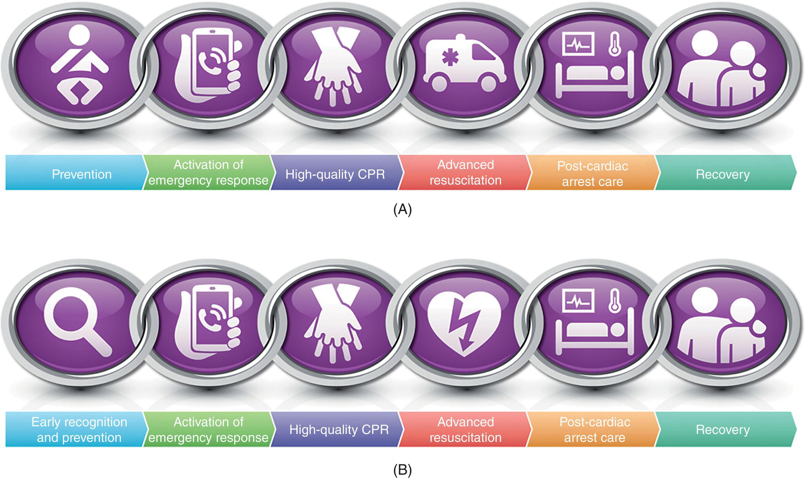
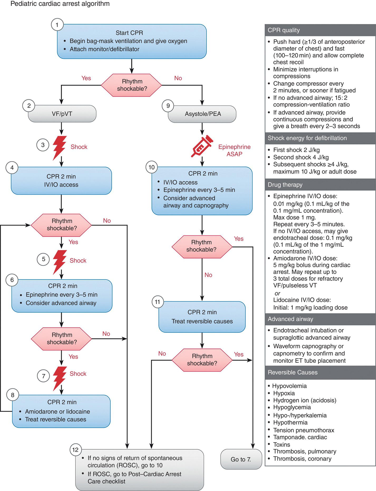
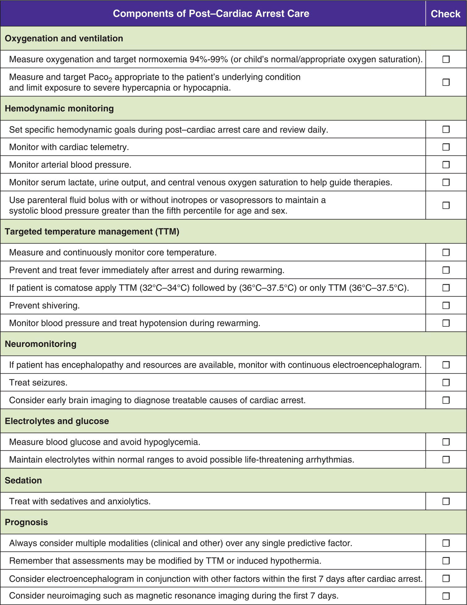
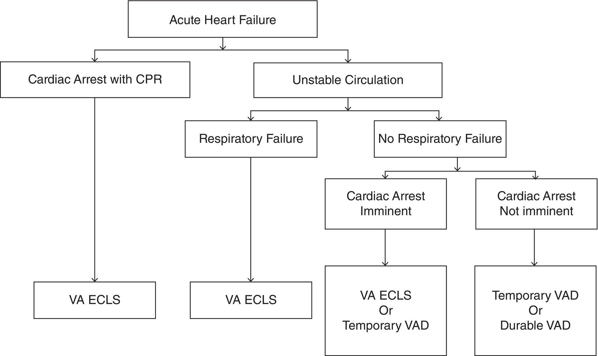

CHAPTER 25 Cardiopulmonary Resuscitation in the Patient with Congenital Heart Disease 

# CHAPTER 25  
Cardiopulmonary Resuscitation in the Patient with Congenital Heart Disease

_Javier J. Lasa1, Daniel Stromberg2, Sai S. Raju3, and Timothy P. Welch4_

1 Cardiovascular Intensive Care Unit, Texas Children’s Hospital, Baylor College of Medicine, Houston, TX, USA

2 Dell Children's Medical Center of Central Texas, The University of Texas at Austin Dell Medical School, Austin, TX, USA

3 Dell Children's Medical Center of Central Texas, The University of Texas at Austin Dell Medical School, Austin, TX, USA

4 Arthur S. Keats MD Division of Pediatric Cardiovascular Anesthesiology, Texas Children’s Hospital, Baylor College of Medicine, Houston, TX, USA

* * *

-   [**Epidemiology**](#head-2-256)
-   [**Overview of current CPR guidelines**](#head-2-257)
    -   [CPR techniques](#head-3-387)
    -   [Advanced airway interventions during CPR](#head-3-388)
    -   [Drug administration during CPR](#head-3-389)
    -   [Management of ventricular fibrillation and/or pulseless ventricular fibrillation](#head-3-390)
    -   [Pediatric resuscitation in patients with suspected or confirmed COVID‐19 infection](#head-3-391)
-   [**Phases of cardiac arrest**](#head-2-258)
    -   [Post‐cardiac arrest care](#head-3-392)
        -   [Neurologic monitoring and targeted neuroprotective management](#head-4-195)
        -   [Management of postarrest myocardial dysfunction](#head-4-196)
        -   [Management of acute kidney injury](#head-4-197)
        -   [Outcomes, prognosis, and follow‐up after cardiac arrest](#head-4-198)
-   [**Cardiopulmonary resuscitation for the congenital heart disease patient**](#head-2-259)
    -   [Left‐heart lesions](#head-3-393)
        -   [Mitral valve disease](#head-4-199)
        -   [Aortic valve disease](#head-4-200)
        -   [Right‐heart lesions](#head-4-201)
        -   [Total anomalous pulmonary venous connection](#head-4-202)
        -   [Single ventricle lesions](#head-4-203)
        -   [Superior cavo‐pulmonary connection (bidirectional Glenn, or stage 2 palliation)](#head-4-204)
        -   [Complete superior‐inferior cavo‐pulmonary connection (Fontan, stage 3 palliation)](#head-4-205)
        -   [Anomalous coronary syndromes](#head-4-206)
        -   [Mechanical circulatory support](#head-4-207)
    -   [The underlying disease states](#head-3-394)
        -   [Williams‐Beuren syndrome](#head-4-208)
        -   [Arrhythmias](#head-4-209)
        -   [Cardiomyopathies and myocarditis](#head-4-210)
        -   [Pulmonary hypertension](#head-4-211)
        -   [Open‐sternum CPR](#head-4-212)
    -   [Adjunctive CPR techniques for the CHD patient](#head-3-395)
        -   [Interposed abdominal compression CPR](#head-4-213)
        -   [Head‐up CPR](#head-4-214)
        -   [Intrathoracic pressure regulation: active compression decompression CPR and the impedance threshold device](#head-4-215)
        -   [CPR coaching](#head-4-216)
-   [**Simulation/education**](#head-2-260)
    -   [Team training](#head-3-396)
-   [**Selected references**](#head-2-261)

* * *

## Epidemiology

Although one of the most severe of adverse events related to anesthesia, cardiac arrest (CA) in the perioperative setting occurs infrequently, with rates of anesthesia‐related CA during pediatric anesthesia in the general population reported between 0.14 and 0.8% of anesthetics \[2–4\]. Significant variability in anesthesia‐related CA rates exists across the pediatric age and illness category spectrum; yet, there is clear evidence to support higher risks of periprocedural CA for patients with underlying CHD \[5\]. Children with CHD frequently undergo diagnostic and interventional procedures that require sedation or general anesthesia with over 45,000 noncardiac \[6\] and over 25,000 cardiac \[7\] surgical procedures performed every year across North America. In spite of these yearly procedural volumes for the CHD population, our understanding of the epidemiology and outcomes after anesthesia‐related CA remains limited to historical reports from CA registries and single‐center case series \[6, 8, 9\]. Clear limitations exist with volunteer registry reporting, including potential underreporting of events, which limits our understanding of true incidence as well as the risks associated with anesthesia during pediatric cardiac surgery, cardiac catheterizations, and noncardiac procedures in the CHD population.

Over the last three decades, several single and multicenter retrospective cross‐sectional efforts have provided a basic foundation for our understanding of the incidence and potential risk factors associated with anesthesia‐related CA in the CHD population. The Pediatric Perioperative Cardiac Arrest (POCA) registry, formed in 1994 to study the etiology and outcomes after perioperative CA in anesthetized children, has published two reports that focused on anesthesia‐related CA which spanned the first 10 years of this registry \[2, 8\]. Of 373 cases of anesthesia‐related CA reported to the registry between 1994 and 2005, 34% (_n_ = 127; acquired conditions included cardiomyopathy, pulmonary hypertension, arrhythmias, status‐post heart transplantation) were in children with congenital and/or acquired heart disease, of which 92% were in children with the American Society of Anesthesiologists (ASA) physical status III–V compared to 62% in children without heart disease. Of note, 47% of all CAs in children with CHD and acquired lesions occurred at the age of 6 months or younger, and 70% occurred in children aged ≤2 years. A slight majority of CAs occurred in the general operating room (OR) setting (54%) as compared to the cardiac OR (33%), cardiac catheterization laboratory (17%), and other imaging suites (3%). Again, younger age (<6 months old) was more commonly seen in the cardiac OR CA population (76%) as compared to general OR (38%) or catheterization laboratory (35%) \[8\]. In children with heart disease, those with single ventricle composed 19% of CAs, closely followed by patients with left‐to‐right shunts (e.g. VSD, PDA, AV canal, combined lesions; 18%), left‐sided obstructive lesions (e.g. aortic stenosis, coarctation of the aorta; 16%), acquired conditions (13%), Tetralogy of Fallot (12%), Truncus arteriosus (5%), and miscellaneous conditions (e.g. pulmonary hypertension, status‐post heart transplant, arrhythmias; 18%). Overall mortality in the heart disease CA population was 33%, with the highest mortality in left‐sided obstructive lesions and cardiomyopathy. Resuscitation details available for 68 patients with congenital and/or acquired heart disease revealed few instances of the use of extracorporeal cardiopulmonary resuscitation (E‐CPR; _n_ = 3), which would suggest lack of availability of this resource in many centers in the 1990s and early 2000s. Current evidence suggests that patients with underlying cardiac disease are the highest utilizers of E‐CPR \[10\], with an epidemiologic report of CA in the cardiac intensive care unit (CICU) from the Pediatric Cardiac Critical Care Consortium (PC4) reporting 27.2% of all CAs occurring in participating CICUs undergoing E‐CPR \[11\].

Amongst single‐center reports, Boston Children’s Hospital has maintained an extensive registry of CHD patients anesthetized in cardiac operating room and catheterization laboratories with reported frequencies of 0.79% (during cardiac surgery) and 0.96% (during cardiac catheterizations) \[4, 12\]. Within the cardiac catheterization laboratory, recent efforts to evaluate outcomes after risk adjustment have led to the inclusion of CA as a part of a larger group of severe adverse events (AEs) \[13, 14\]. These efforts have confirmed the findings by Odegard et al. that CA occurs infrequently during pediatric diagnostic and interventional catheterizations (0.8‐1.6%). Furthermore, in an analysis of the American Heart Association (AHA)’s Get With the Guidelines‐Resuscitation registry of in‐hospital cardiac arrest (IHCA) across 33 pediatric hospitals between 2005 and 2016, Lasa et al. described results of CA occurring in the cardiac catheterization laboratory by evaluating survival to hospital discharge and favorable neurologic outcomes \[15\]. Of 19,957 pediatric IHCA events, only 203 index CAs were reported to the registry as occurring within the cardiac catheterization laboratory. The survival to discharge rate for the overall cohort was 69% (141/203), of which the majority (69%) of deaths were observed in children <1 year of age.

* * *

### KEY POINTS: EPIDEMIOLOGY OF CARDIAC ARREST IN CHD

-   Cardiac arrest (CA) that occurs in the periprocedural arena related to anesthesia is an infrequent event occurring in 0.14–0.80% of anesthetics.
-   Children with underlying congenital and/or acquired heart disease are at a higher risk for CA with rates ranging from 0.8 to 1.0%, although limited by single center and/or historical registry data sources.
-   Within the CHD population, patients who are younger and/or with single ventricle anatomy/physiology are at the highest risk for periprocedural anesthesia‐related cardiac arrest.

* * *

## Overview of current CPR guidelines

Since serving as a co‐sponsor for the inaugural gathering of resuscitation researchers and healthcare providers at the Conference on Standards and Guidelines for Cardiopulmonary Resuscitation and Emergency Care in 1966, the AHA has continued to publish guidelines on the performance of CPR for both adult and pediatric patient populations. From 2015, the process of 5‐year updates was transitioned to an online format to allow significant changes in the science to be reviewed in an expedited manner and then incorporated directly into the guidelines if deemed appropriate.

AHA has released the latest 2020 guidelines with 491 updated recommendations for adult, pediatric and neonatal life support. For the purpose of the pediatric advanced life support guidelines, pediatric patients are infants, children, and adolescents up to 18 years of age, excluding newborns. Infant guidelines apply to infants younger than 1 year of age. Child guidelines apply to children from approximately 1 year of age until puberty. For those with signs of puberty and beyond, adult basic life support guidelines should be followed. Although pediatric IHCA outcomes have improved steadily since 2004, similar gains are not being seen in out‐of‐hospital cardiac arrest (OHCA). Much of the variation in survival rates is thought to be due to the strength of the chains of survival, the critical actions that must occur in rapid succession to maximize the chance of survival from CA (see [Figure 25.1](#c25-fig-0001)) \[16\]. A separate OHCA chain of survival has been created to distinguish the differences between OHCA and IHCA. In both the chains, a sixth link has been added to stress the importance of recovery \[16\].

The major new and updated recommendations in 2020 can be seen in [Table 25.1](#c25-tbl-0001) \[16\]. Rapid recognition of CA, immediate initiation of high‐quality chest compressions, and delivery of effective ventilations are critical to improve outcomes from CA. The 2020 AHA recommendations for high‐quality CPR can be seen in [Table 25.2](#c25-tbl-0002) \[16\]. New changes to ventilation rates include increases in recommended respiratory rates to 20–30 breaths/min for infants and children with an advanced airway during CPR or for those requiring rescue breathing with a pulse. The Pediatric Cardiac Arrest Algorithm as updated in the AHA 2020 Guidelines is also available in [Figure 25.2](#c25-fig-0002) \[16\].

[**Figure 25.1**](#R_c25-fig-0001) Pediatric chains of survival for out‐of‐hospital (A) and in‐hospital (B) cardiac arrest.

(Source: Topjian et al. \[16\]. Reproduced with permission from Wolters Kluwer Health, Inc.)

[**Table 25.1**](#R_c25-tbl-0001) Key CPR guidelines recommendations and differences noted between 2010 and 2020 publications

Source: Topjian et al. \[16\]. Reproduced with permission from Wolters Kluwer Health, Inc.

| Guidelines/recommendations | 2010 | 2020 |
| --- | --- | --- |
| Assisted ventilation rate: rescue breathing – in conditions where there is a palpable pulse but inadequate breathing. | Rate of 12–20  
(One breath every 3–5 seconds) | Rate of 20–30 breaths/min  
(One breath every 3–5 seconds) |
| Ventilation rate during CPR with an advanced airway | 10 breaths/min  
(one breath every 6 seconds) | 20–30 breaths/min accounting for age and clinical conditions. |
| Endo‐tracheal tubes (ETT) | Both cuffed and uncuffed ETTs are acceptable for intubating infants and children. | It is reasonable to choose cuffed ETTs over uncuffed ETTs for intubating infants and children. |
| Cricoid pressure during intubation | Insufficient evidence to recommend | Routine use is not recommended. |
| Epinephrine administration | Reasonable to administer epinephrine in pediatric cardiac arrest | Reasonable to administer the initial dose within 5 minutes from the start of chest compressions. |
| Invasive blood pressure monitoring to assess CPR quality | Reasonable for providers to use diastolic blood pressure to assess CPR quality (>25 mmHg in infants, >30 mmHg in children) | Reasonable for rescuers to use diastolic blood pressure to guide CPR quality. |
| Detecting and treating seizures after ROSC | It is recommended to treat clinical seizures following cardiac arrest | When resources are available, continuous EEG monitoring is recommended for the detection of seizures following cardiac arrest in patients with persistent encephalopathy. |
| Evaluation and support for cardiac arrest survivors |  | Rehabilitation services are recommended for survivors. Ongoing neurological evaluation for at least the first year after cardiac arrest. |

[**Table 25.2**](#R_c25-tbl-0002) Current CPR guidelines recommendations for all age groups

Source: Data from Topjian et al. \[16\].

| CPR guidelines | Infant | Children | Adult |
| --- | --- | --- | --- |
| Chest compression rate (per minute) | 100–120 | 100–120 | 100–120 |
| Depth of compression | One‐third of AP diameter of chest  
(4 cm/1.5 in.) | One‐third of AP diameter of chest  
(5 cm/2 in.) | At least 5 cm but not more than 6 cm (Once children have reached puberty) |
| Chest recoil | Allow the chest to recoil completely, after each compression |
| Rhythm check | Lasting no more than 10 seconds, approximately every 2 minutes |
| Respiratory rate with no advanced airway | Compression to ventilation ratio – single rescuer 30 : 2, two rescuers 15 : 2. | Compression to ventilation ratio – 30 : 2. |
| Respiratory rate with advanced airway | Reasonable to target respiratory rate of 1 breath every 2–3 seconds (20–30 breaths/min) | Provide breath every 2–3 seconds |

### CPR techniques

For infants, single rescuers should compress the sternum with two fingers or two thumbs placed just below the intermammary line. For two rescuers, the two‐thumb encircling hands technique is recommended. If the rescuer cannot physically encircle the victim's chest, the chest can be compressed with two fingers. If the rescuer is unable to achieve the guideline‐recommended depth, it may be reasonable to use the heel of one hand. For children, it may be reasonable to use either a one‐ or two‐hand technique to perform chest compressions.

### Advanced airway interventions during CPR

For OHCA, studies show similar rates of survival to discharge when comparing advanced airway interventions such as supraglottic airway or endotracheal tube with bag‐mask ventilation. Similarly, early placement of an invasive airway after IHCA was also not associated with improvement in survival to hospital discharge \[17\]. For IHCA there is insufficient evidence as of now to make any recommendation about advanced airway management \[18\].

### Drug administration during CPR

The new guidelines emphasize administration of epinephrine within 5 minutes from the start of chest compressions with repetition every 3–5 minutes until the return of spontaneous circulation (ROSC) is achieved. For shock refractory ventricular fibrillation (VF)/pulseless ventricular tachycardia (pVT), either amiodarone or lidocaine can be used. Routine use of sodium bicarbonate and calcium is not supported by the current data unless their administration is indicated in specific circumstances such as electrolyte imbalances and certain drug toxicities. [Table 25.3](#c25-tbl-0003) lists pharmacologic therapy, indications, and precautions for resuscitation.

### Management of ventricular fibrillation and/or pulseless ventricular fibrillation

Defibrillation is the definitive treatment of VF/pVT. An initial dose of 2 Joules per kilogram (J/kg) is recommended followed by an increase in the subsequent dose to 4 J/kg for the second shock. For subsequent shocks, higher energy levels may be considered but not to exceed 10 J/kg or the maximum dose for adults.

### Pediatric resuscitation in patients with suspected or confirmed COVID‐19 infection

Resuscitation in this population carries an added risk to healthcare workers as the chest compressions, positive pressure ventilation, and establishment of an advanced airway generate aerosols that can remain suspended in the air with a half‐life of ~1 hour. These aerosols can be inhaled by those nearby. To mitigate the risk of exposure to healthcare workers, emphasis should be placed on donning personal protective equipment (PPE) before entering the operation room/scene and limiting personnel in the room to only those essential for patient care. If an advanced airway is considered, pause chest compressions for intubation and use the intubator with the highest likelihood of first‐pass success. Intubate patients with a cuffed tube and connect the endotracheal (ET) tube to a ventilator with a high‐efficiency particulate air (HEPA) filter when available \[20\]. Protection against inhalation of the aerosolized virus with N95 mask or equivalent, eye protection, gown, and double gloving is important for suspected or confirmed COVID‐19 infection.

* * *

### KEY POINTS: CPR GUIDELINES

-   High‐quality cardiopulmonary resuscitation (CPR) is the foundation of resuscitation including the provision of adequate chest compression rate and depth, minimizing interruptions in CPR, allowing full chest recoil between compressions, and avoiding excessive ventilation.
-   New changes to ventilation rates include increases in recommended respiratory rates to 20–30 breaths/min for infants and children with an advanced airway during CPR or for those requiring rescue breathing with a pulse.

* * *

[**Figure 25.2**](#R_c25-fig-0002) Pediatric cardiac arrest algorithm as updated in the American Heart Association 2020 guidelines.

(Source: Topjian et al. \[16\]. Reproduced with permission from Wolters Kluwer Health, Inc.)

[**Table 25.3**](#R_c25-tbl-0003) Pharmacology: typical doses and indications

Source: Marino et al. \[19\]. Reproduced with permission from Wolters Kluwer Health, Inc.

| Medication | Dose | Indications | Cautions/precautions |
| --- | --- | --- | --- |
| Adenosine | Initial dose: 100 μg/kg (0.1 mg/kg; maximum single dose: 6 mg) rapid IV push; second dose can be double the first dose (i.e. give 200 μg/kg \[0.2 mg/kg\] for second dose, maximum 12 mg) | Atrioventricular node–dependent SVT | Adenosine will not effectively terminate atrioventricular node–independent tachycardias, such as atrial flutter, ectopic atrial tachycardia, or atrial fibrillation. Should not be administered for wide QRS complex tachycardia unless it is clear that the underlying rhythm is not atrial fibrillation or atrial flutter with associated antegrade accessory pathway conduction Expert consultation should be obtained before the administration of adenosine as a diagnostic and potentially therapeutic intervention for stable patients who have wide QRS complex tachycardia |
| Amiodarone | For VF/pulseless VT, in absence of known or suspected long‐QT syndrome: Initial dose: 5.0 mg/kg IV/IO bolus.  
Maximum single dose: 300 mg; can repeat to a total of three doses;  
total: 15 mg/kg/24 hours; in adolescents, maximum 2.2 g/24 hours  
For perfusing atrial or ventricular arrhythmias: Give loading dose of 5 mg/kg over 30–60 minutes[_a_](#c25-note-0002)  
Maximum single dose: 300 mg; can repeat to a maximum of three doses  
Total: 15 mg/kg/24 hours; in adolescents, maximum 2.2 g/24 hours  
If the patient is hemodynamically unstable or receiving other medications that lower heart rate, consider lower dose and slower infusion | Shock‐refractory cardiac arrest (VF/pulseless VT); atrial and ventricular arrhythmias; JET | Use lower dose and/or slower infusion if the patient is hemodynamically unstable or receiving other medications that lower heart rate; can cause hypotension; can prolong QT interval:
1.  Obtain expert consultation before administering, if known or suspected long‐QT syndrome.
2.  Routine administration in combination with procainamide or digoxin is not recommended without expert consultation

 |
| Atropine | For symptomatic bradycardia: 20 μg/kg (0.02 mg/kg); minimum single dose: 0.5 mg; maximum single dose: 500 μg (0.5 mg)  
For emergent preintubation bradycardia prophylaxis: 20 μg/kg (0.02 mg/kg) Intubation: No minimum dose; maximum single dose 500 μg (0.5 mg) | Vagal‐mediated bradycardia; primary atrioventricular block; emergent intubation bradycardia prophylaxis | Loss of constrictive pupillary reflex to light |
| Calcium chloride (10% = 100 mg/mL = 27.2 mg/mL elemental calcium) | 10–20 mg/kg; maximum single dose: 2 g | Hypocalcemia | Precipitates with sodium bicarbonate; rapid IV administration can cause hypotension, bradycardia, or asystole (particularly if the patient is receiving digoxin) |
| Calcium gluconate (10% = 100 mg/mL = 9 mg/mL elemental calcium) | 50–100 mg/kg; maximum single dose: 3 g | Hypocalcemia | Precipitates with sodium bicarbonate; rapid IV administration can cause hypotension, bradycardia, or asystole (particularly if the patient is receiving digoxin) |
| Dexmedetomidine | 0.5–1 μg/kg bolus; infusion 0.25–1 μg/kg/hour; titrate to effect | For sedation and mild analgesia | If at risk for heart block or symptomatic bradycardia, pacing capability should be available; can cause hypotension or bradycardia |
| Dobutamine | 2–20 μg/kg/min | Myocardial systolic dysfunction (i.e. as inotrope and/or vasodilator) | Titrate to effect; can produce hypotension or tachyarrhythmias |
| Dopamine | 2–20 μg/kg/min; if ≥20 μg/kg/min is required, consider using an alternative adrenergic agent | Systolic dysfunction; postoperative LCOS | Titrate to effect; can produce vasoconstriction and hypertension or tachyarrhythmias; increases myocardial oxygen consumption |
| Epinephrine | For pulseless cardiac arrest: Bolus: 10 μg/kg (0.01 mg/kg, or 0.1 mL/kg of 0.1 mg/mL) concentration during cardiac arrest; maximum dose: 1 mg  
For symptomatic bradycardia: Bolus: 10 μg/kg (0.01 mg/kg, or 0.1 mL/kg of 0.1 mg/mL) concentration; maximum dose: 1 mg  
For treatment of hypotension or persistent bradycardia with a pulse in the patient with an at‐risk myocardiurnt: Give low dose via central administration 1 μg/kg (0.001 mg/kg); continuous infusion: 0.01–0.2 μg/kg/min[_b_](#c25-note-0003) | Cardiac arrest; symptomatic bradycardia; systolic dysfunction; postoperative LCOS | Significant vasoconstriction at higher doses; increases myocardial oxygen consumption |
| Esmolol | Bolus: 100–500 μg/kg (0.1–0.5 mg/kg) over 1–2 minutes  
Infusion: 50–500 μg/kg/min | SVT; hypertension | Can cause bradycardia, hypotension, and/or hypoglycemia |
| Etomidate | Bolus: 0.2–0.4 mg/kg, over 30–60 seconds; maximum dose: 20 mg | Procedural sedation | Can cause apnea and adrenal suppression |
| Fentanyl | Bolus: 1–5 μg/kg continuous infusion for neonates and young infants: 0.5–5 μg/kg/hour  
Continuous infusion for older infants and children: 1–3 μg/kg/min | Analgesia | Can cause apnea and chest wall rigidity in the naive patient |
| Furosemide | 1 mg/kg; starting dose of up to 10 mg to naive patient | Diuresis | Can cause hypokalemia, hypochloremic metabolic acidosis, or hypotension if preload dependent |
| Heparin | Presumed shunt occlusion: 50–100 U/kg; anticoagulation before ECLS cannulation: 100 U/kg | Presumed shunt occlusion; ECLS cannulation | Can cause bleeding |
| Hydrocortisone | 1–2 mg/kg; maximum dose: 100 mg | LCOS not responsive to inotropic agents | Can cause hyperglycemia and/or hypokalemia |
| Isoproterenol | 0.05–2 μg/kg/min | Post–cardiac transplantation; long QT with torsade des pointes; primary atrioventricular block | Can cause hypotension, tachycardia, and increased myocardial oxygen consumption |
| Ketamine | 0.5–2 mg/kg | Procedural sedation | Can cause apnea and increased respiratory secretions; myocardial depressant at high doses |
| Levosimendan | Bolus: 12 μg/kg; infusion: 0.1 μg/kg/min | LCOS |  |
| Lidocaine | Bolus: 1 mg/kg. may repeat Infusion: 20–50 μg/kg/min (repeat bolus dose if infusion initiated >15 minutes after initial bolus dose) | VF/pulseless VT cardiac arrest; ventricular arrhythmias | Monitor QTc and lidocaine levels; can cause seizures at high levels |
| Magnesium sulfate | Pulseless VT with torsade des pointes; bolus: 25–50 mg/kg; maximum dose: 2 g VT with pulses: 25–50 mg/kg over 10–20 minutes; maximum dose: 2 g | VF/pulseless VT arrest with torsade des pointes; hypomagnesemia | Can cause hypotension with rapid administration |
| Midazolam | 0.05–0.2 mg/kg | Sedation | Can cause apnea or hypotension |
| Milrinone | Bolus: 50 μg/kg, administered over 10–60 minutes  
Maintenance infusion: 0.25–1.0 μg/kg/min | LCOS | Hypotension |
| Nitric oxide | Up to 40 ppm | Increased pulmonary vascular reactivity; pulmonary hypertension ± crisis | Methemoglobinemia |
| Norepinephrine | Infusion: 0.025–0.3 μg/kg/min | LCOS with low SVR; clinically significant vasodilation | Vasoconstriction; increases myocardial oxygen consumption |
| Oxygen | FiO2 = 21–100% | Alveolar desaturation | Pulmonary overcirculation with an unrestrictive aortopulmonary shunt |
| Phenylephrine | Bolus: 5–20 μg/kg; (0.005–0.020 mg/kg) Infusion: 0.1–0.5 μg/kg/min | Cyanotic spell in unrepaired tetralogy of Fallot; symptomatic hypotension because of low SVR; shunt obstruction; coronary hypoperfusion | Can cause vasoconstriction or hypertension |
| Propofol | Bolus: 1–3 mg/kg  
Infusion: 50–100 μg/kg/min | Sedation, amnesia | Hypotension; contraindicated in children with mitochondrial disease and not approved in children for prolonged sedation |
| Procainamide | Bolus: 15 mg/kg over 30–60 minutes; maximum dose: 100 mg  
Infusion: 20–60 μg/kg/min | JET; SVT; atrial fibrillation | Monitor ECG and procainamide and NAPA levels; can prolong QT interval:

1.  Obtain expert consultation before administering, if known or suspected long QT;
2.  Routine administration in combination with amiodarone is not recommended without expert consultation

 |
| Prostaglandin E1 | To establish ductal patency: 0.05–0.1 μg/kg/min, IV/IO infusion To maintain ductal patency: 0.01–0.05 to 0.01–0.02 μg/kg/min IV/IO infusion | Maintain patency of ductus arteriosus | Apnea; fever and hypotension |
| Sodium bicarbonate | Bolus: 1–2 mEq/kg slow IV push; dose adjusted to severity of base deficit; use 4.2% (0.5 mEq/L) concentration for neonates | Metabolic acidosis | Precipitates with calcium |
| Vasopressin | Infusion: 0.0005–0.01 U/kg/min | LCOS with low SVR; vasodilatory shock; diabetes insipidus | Hypertension and increased afterload; fluid retention |
| Verapamil | Bolus: 0.1–0.2 mg/kg  
Do not administer to infants <12 months of age without expert consultation | SVT | Hypotension; have calcium available; not to be administered to infants (can cause apnea, bradycardia, and hypotension); avoid in patients with WPW |

ECLS indicates extracorporeal life support; FiO2, fractional inspired oxygen; IO, intraosseous; IV, intravenous; JET, junctional ectopic tachycardia; LCOS, low cardiac output syndrome; NAPA, _N_‐acetylprocainamide; SVR, systemic vascular resistance; SVT, supraventricular tachycardia; VF, ventricular fibrillation; VT, ventricular tachycardia; and WPW, Wolff‐Parkinson‐White syndrome.

[a](#R_c25-note-0002) The time range for the administration of the loading dose of amiodarone for the child with a perfusing rhythm is slightly longer (i.e. 30–60 minutes) than the pediatric advanced life support (PALS) 2015 recommended time for administration (i.e. 20–60 minutes). The reason for this slight difference is that the child with cardiac disease is likely to be or is at risk for hemodynamic compromise.

[b](#R_c25-note-0003) For treatment of hypotension or persistent bradycardia with a pulse in the patient with an at‐risk myocardium, give low dose via central administration 1 μg/kg (0.001 mg/kg), which is one‐tenth the standard recommended resuscitation dose for symptomatic bradycardia in PALS 2015.

## Phases of cardiac arrest

Regardless of the location in which a CA occurs, the provision of high‐quality CPR is highly dependent on rapid, coordinated, team‐based actions that extend throughout the spectrum of care both before, during, and after hypoxic‐ischemic arrest states (no flow/low flow). The likelihood of ROSC, survival to hospital discharge, and neurologic survival are all improved when patients receive high‐quality CPR \[16\]. Measures of high‐quality CPR include the provision of chest compressions with appropriate depth, rate, and recoil; minimal interruptions in chest compressions (high chest compression fraction); appropriate ventilation and monitoring of adequacy of ventilation; and reversal of treatable causes. Resuscitation science has historically focused on these elements of CPR including logistics and management of chest compressions, assisted ventilation, defibrillation for shockable rhythms, and pharmaceutical reanimation measures. However, recent efforts by the international resuscitation community have extended this focus to include prearrest and postarrest care in light of the reports demonstrating a plateau in survival outcomes for IHCA and OHCA in the pediatric population \[21\]. Subgroup analyses for outcomes data surrounding anesthesia‐related CA for patients with CHD are limited although care processes across the CA spectrum should not be limited by patient or hospital‐level factors \[19\].

In order to emphasize the importance of the elements of pre‐/intra‐/post‐arrest care, the 2020 AHA Guidelines for Cardiopulmonary Resuscitation and Emergency Cardiovascular Care report highlighted the importance of each element of care along the CA spectrum by utilizing the Chains of Survival model (see [Figure 25.1](#c25-fig-0001)).

Prevention of CA in the in‐patient and/or peri‐anesthetic setting has traditionally been limited to anticipatory management of known high‐risk populations such as those with single‐ventricle CHD before/after Stage 1 repair, suprasystemic pulmonary hypertension, left‐ventricular outflow tract obstruction, and Williams syndrome \[5, 22\]. Recent quality improvement efforts by the PC4 have involved national implementation of a CA prevention bundle which identified high‐risk populations; standardized anticipatory care plan discussions twice a day; and provided ready access to resuscitation medications, sedation for noxious stimulation, and post‐arrest debriefing tools. Applying this methodology to the periprocedural environment presents challenges surrounding the predominantly nonmodifiable patient and procedure‐based factors that are presenting constant threats during operations and cardiac catheterizations. Ultimately, highly successful specialized teams with specific equipment, knowledge, and resources can rapidly respond to clinical decompensation events in the CHD population with precision and quality.

The 2020 updated algorithm and recommendations for the provision of high‐quality CPR are summarized in [Figure 25.2](#c25-fig-0002). Pediatric CPR is uncommon and thus very challenging to maintain excellent team skills, even in larger tertiary care children's hospitals. Increasingly, high‐fidelity chest compression and ventilation data have become available to provide real‐time guidance to care teams providing CPR. These CPR feedback devices, when paired with invasive arterial blood pressure and end‐tidal CO2 monitoring, are shifting the paradigm away from provider‐focused CPR training, to one that is patient physiology and hemodynamically focused \[23\]. Measuring these physiological parameters, which are often available to the anesthesiologist during surgical and/or catheterization procedures, can be used to trend CPR quality, guide therapies during CPR, and gauge likely outcomes like ROC. In retrospective fashion, these data also are available in aggregate to guide quality improvement and resuscitation science efforts.

Cardiopulmonary resuscitation that is prolonged and/or resistant to conventional CPR techniques may warrant rescue with mechanical circulatory support should the resources and expertise be available. E‐CPR is defined as the deployment and cannulation onto veno‐arterial extracorporeal membrane oxygenation (VA ECMO) during active conventional CPR. In the pediatric population, this resource‐intense therapy is highly dependent on the complex choreography of resuscitation teams and surgical staff (general/cardiothoracic surgeons) and often utilized in patients with underlying CHD \[10\]. Historically, E‐CPR began as a specific rescue modality after post‐cardiotomy cardiac arrest/cardiogenic shock in the pediatric CHD population \[24, 25\]. It has since evolved beyond the postoperative CHD population to include multiple populations of critically ill children including those with acute fulminant myocarditis, acute decompensated heart failure, and sepsis\[10\]. Activation of E‐CPR teams in the peri‐procedural arena may be less cumbersome than CAs occurring in other inpatient or outpatient settings; yet, excellent communication, multidisciplinary training, and resource allocation for perfusion/priming teams are crucial for effective E‐CPR in the current era \[26\].

### Post‐cardiac arrest care

Achieving ROSC with the resolution of no‐flow or low‐flow hemodynamic states has historically been the goal of providers during the high‐stress environment of a CA. However, since 2008, the international resuscitation community has recognized the role of ischemia‐reperfusion injury in the evolution of the disease state known as postcardiac arrest syndrome (PCAS) \[27\]. Also recognized in the pediatric population, PCAS is composed of several key pathophysiologic components: post‐CA brain injury, post‐CA myocardial dysfunction, systemic ischemia‐reperfusion response, and persistent precipitating pathophysiology \[28\]. Although a review of the unique pathophysiology of each phase is beyond the scope of this chapter, it is crucial for the cardiac anesthesiologist to consider the post‐return of circulation (ROC) management of the patient with CHD who has suffered a CA as a crucial and equally important time period as active CPR. [Figure 25.3](#c25-fig-0003) (reproduced with permission from Topjian et al. \[19\]) provides a standardized approach to help clinicians monitor for ongoing secondary organ injury while also providing them with therapeutic options to address the known pathophysiologic derangements, ultimately providing the best opportunity to mitigate brain and other organ injury post‐arrest. Excellent overviews of postarrest stabilization can be found in the AHA guidelines \[29\], and a more recent AHA Scientific Statement \[19\].

#### Neurologic monitoring and targeted neuroprotective management

The central nervous system is especially sensitive to hypoxic insult and reperfusion injury, and even with expeditious initiation of CPR, ischemic neuronal cell death rapidly occurs. Furthermore, there is a clear time‐weighted burden; with prolonged low‐flow states, irreversible injury is inevitable, and beyond 10–20 minutes, the likelihood of neurologically intact survival is low \[30\]. Neurologic management after CA, therefore, is focused on identifying actionable lesions, reducing cerebral metabolic demand, and optimizing both global and cerebral oxygen delivery.

Postarrest neurologic prognostication is challenged by conflicting evidence and lack of specific biomarkers with high predictive value. Diagnostic neuronal injury patterns may take time to develop, highlighting the general recommendation to avoid neuroimaging for the first 72 hours post‐arrest. However, it is sometimes reasonable to pursue early neuroimaging to characterize the extent of injury, and screen for pathology amenable to medical or surgical intervention, such as space‐occupying hemorrhage or cerebral edema indicating possible intracranial hypertension. In neonates with open fontanelle, this can be initially performed with cranial ultrasound, but in most children, the initial modality of choice will be head computed tomography (CT). It should be noted that while certain findings (e.g., loss of grey‐white differentiation, sulcal effacement, and reversal sign) are unambiguously associated with poor outcome \[31\], the negative predictive value of a normal scan for survival is only 68% \[32\]. Ultimately, the most informative prognostic data is obtained from brain magnetic resonance imaging (MRI), which can detect the extent and location of injury patterns, specifically the watershed ischemia/infarct that correlates with poor outcomes \[33\]. The anesthesiologist will often be called upon to transport and provide supportive care to these patients for imaging studies as well as for potentially urgent/emergent neurosurgical intervention; hence, it is essential to understand the principles of neuroprotective management.

[**Figure 25.3**](#R_c25-fig-0003) Post‐cardiac arrest care checklist. Source: Topjian et al. \[16\]. Reproduced with permission from Wolters Kluwer Health, Inc.

Neurologic monitoring is often imprecise and nonspecific, but it can afford the clinician useful data upon which to direct therapy. Electroencephalography (EEG), typically a continuous protocol with video monitoring, has become standard of care in the postarrest phase of intensive care unit (ICU) management. Since as many as half of therapeutically cooled post‐arrest patients will have seizures, most of which are subclinical/nonconvulsive \[34\], EEG serves an essential ongoing surveillance function. As seizures impose a substantial metabolic burden on an already vulnerable brain and are independently associated with mortality, it is critical to identify and treat them to mitigate secondary injury. Near‐infrared spectroscopy (NIRS) may be used to assess the adequacy of regional blood flow by providing trend data on brain tissue oxygen saturation, a surrogate for oxygen extraction. Monitoring indicators of flow, as opposed to pressure, is crucial after brain injury. Animal data from an experimental swine model has shown that the autoregulatory capacity of the cerebral vasculature, as assessed by NIRS‐derived indices, can be significantly altered following CA \[35\]. While various cerebral oxygenation saturation threshold targets have been proposed, unique caveats exist in the interpretation of NIRS values in children with CHD \[36\], as they must be considered in the context of the expected appropriate systemic arterial saturation unique to their specific underlying or palliated physiology (i.e. single ventricle anatomy with systemic to pulmonary artery shunts, cavopulmonary anastomoses, or mixing lesions, among others). Similar to the above is the selection of targets for oxygenation and ventilation, which must often be individualized to cardiac physiology. While hypoxemia is clearly detrimental, hyperoxia may also be deleterious in patients at risk for pulmonary overcirculation with an attendant decline in systemic and brain perfusion. Additionally, despite the cerebral vasodilatory effects of hypercapnia, normocapnia should be the default ventilation target for most patients \[28\].

In addition to diagnosing and treating nonconvulsive status epilepticus, and optimizing cerebral oxygen delivery, postarrest care is also focused on reducing cerebral metabolic demand through targeted temperature management. Fever/hyperthermia is commonly observed after CA, and aggressive control of fever and maintenance of normothermia with pharmacologic and/or mechanical measures is indicated. While improved seizure control has been shown with therapeutic hypothermia \[37\], there is equipoise on the superiority of directed therapeutic hypothermia on outcomes, with conflicting evidence from a recent large trial \[38\]. At present, the best evidence for comatose patients suggests either 5 days of strict normothermia, or alternatively, a 48‐hour period of 32–34 °C hypothermia, followed by 72 hours of normothermia \[39\].

#### Management of postarrest myocardial dysfunction

Like the brain, the myocardium is vulnerable to ischemia‐reperfusion injury, and both the precipitating CA as well as the therapies used during resuscitation can lead to significant ongoing ventricular systolic and diastolic dysfunction \[40\]. While catecholamines serve a critical role in augmenting coronary perfusion pressure, thereby directly improving the success of resuscitation, their vasopressor effects impose an increased afterload and can lead to myocardial oxygen supply:demand mismatch. Accordingly, excessive attention to inappropriately chosen blood pressure targets may not only lead to excessive or inappropriate resuscitation but also perpetuate ongoing myocardial dysfunction. Advanced hemodynamic monitoring technologies allow the clinician to measure and trend in real‐time more relevant physiologic data on global and regional blood flow, essential to optimal post‐arrest care. While the choice of inotropic, vasopressor, or vasodilator agent is often institution‐ and provider‐dependent, the most appropriate selection can and should be made based on objective and serial hemodynamic assessments. Using such modalities as NIRS, various invasive continuous cardiac output devices \[41\] and emerging integrative oxygen delivery platforms with predictive analytics \[42\] can facilitate a more individualized approach and provide early identification of response to therapy and of patients at risk for deterioration (See [Chapter 21](c21.xhtml) for additional discussion of hemodynamic support and monitoring).

Despite appropriate and timely goal‐directed and physiologically driven medical hemodynamic support, some patients postarrest will evidence severe and persistent ventricular dysfunction. In this population, veno‐arterial extracorporeal membrane oxygenation (ECMO), either as a bridge to recovery or to more durable long‐term mechanical circulatory support (MCS) such as ventricular assist device (VAD) can be considered. The selection criteria, indications, technical/surgical aspects, and management of the various devices are beyond the scope of this chapter though they are addressed elsewhere in this textbook (See [Chapter 37](c37.xhtml) for a detailed discussion of mechanical support). For a complete discussion of pediatric MCS, the reader is referred to two excellent recent reviews \[43, 44\]. Some fundamentals, however, warrant mention. First, and germane to the care of patients with CHD, is an understanding of the unique anatomic or physiologic features imposed by the underlying lesion that have implications on cannulation approach, type of device, and degree of support required (i.e. single or biventricular anatomy, among others) \[45\]. Second, the provision of such resource‐intensive rescue modalities must be reserved for patients with both a reversible cause of arrest and a reasonable probability of favorable neurologic recovery. As mentioned above, this is often a difficult or impossible assessment to make acutely, but there are instances where such support would clearly be futile. Finally, these therapies require significant multidisciplinary, institutional expertise to achieve excellent outcomes \[46\].

#### Management of acute kidney injury

The kidneys are also vulnerable to ischemia during different arrest states. Acute kidney injury (AKI), defined and staged by the Kidney Disease: Improving Global Outcomes (KDIGO) criteria based on creatinine and urine output parameters \[47\], can manifest following successful resuscitation and is independently associated with mortality \[48\]. Since early diagnosis may improve outcomes, the identification of predictive biomarkers is an area of active investigation. Urinary neutrophil gelatinase‐associated lipocalin (NGAL) has been shown in post‐cardiopulmonary bypass patients to predict the development of AKI in children and precede creatinine elevation \[49\], which may be unreliable during dynamic changes in renal function. This and other biomarkers may serve a similar diagnostic or prognostic role after pediatric cardiac arrest, but no conclusive evidence exists currently. There is no specific treatment for AKI; therapies are largely supportive and are aimed at maintaining overall cardiac output and adequate renal perfusion, avoiding fluid overload, and minimizing further secondary renal insult from nephrotoxic drugs. Continuous renal replacement therapy (CRRT) can be initiated whenever the solute and water excretion or acid‐base balance functions of the kidneys become insufficient. The presence of an extracorporeal circuit such as ECMO often allows the hemofilter to be placed as an in‐line shunt, facilitating immediate therapy when clinically indicated \[50\]; however, most other patients will require placement of a short‐term hemodialysis catheter. Once initiated, the patient’s metabolic status can be tightly controlled, and optimal fluid balance targeted precisely.

#### Outcomes, prognosis, and follow‐up after cardiac arrest

Several large cohort studies of pediatric CA have examined survival as well as midterm neurodevelopmental outcomes in survivors \[11, 21, 51\]. In general, cardiac surgical patients fare better than medical patients, and those with biventricular anatomy have better outcomes than those with single ventricle anatomy. Amongst pediatric survivors of IHCA following cardiac surgery, 5‐year survival has been reported as high as 66%, however, with demonstrably worse neurologic outcomes than age‐ and surgical risk‐matched controls. This study also found a linear correlation between both time‐to‐CPR initiation and total CPR duration and outcome \[52\].

Irreversible injury to the myocardium and kidneys can be managed with mechanical support or dialysis, respectively, and ultimately transplantation if not otherwise contraindicated. Children who suffer catastrophic brain injury following CA, conversely, cannot be salvaged in a similar manner for obvious reasons. Families of these children rightly wish for frank and evidence‐informed prognostication to assist them in making difficult decisions around the maintenance or cessation of life‐sustaining therapies. While neuroimaging has notable shortcomings in this regard, there is emerging interest in identifying serum brain‐specific biomarkers that may predict the outcome. Serum neuron‐specific enolase (NSE), S100b, and myelin basic protein (MBP) are specific to neurons, astrocytes, and myelin, respectively, and have been shown to correlate with mortality and functional neurologic outcome as assessed by the Pediatric Cerebral Performance Category scale \[53, 54\]. While these markers are not in widespread clinical practice, they may provide clinicians predictive data to guide discussions with families as well as to identify at‐risk patients whose clinical assessment may be obfuscated by neuroactive medication, critical illness, or equivocal imaging findings.

Survivors of pediatric cardiac arrest clearly are at risk of severe, permanent, and debilitating adverse neurodevelopmental outcomes. As such, many will need ongoing intensive neurorehabilitation care, and ultimately be rendered technology‐dependent. There are both immediate peri‐arrest and long‐term ethical considerations that this raises, and the defensible choice is not always congruent with the wishes of the family or even the entirety of the medical team. The complex medical and legal factors implicit in this will not be discussed here, but all providers of care to these children must be cognizant of this and strive to treat them and their families with compassion.

* * *

### KEY POINTS: POST CARDIAC ARREST CARE

-   Post‐CA syndrome, which results from ischemia‐reperfusion injury during CPR, is characterized by brain injury, myocardial dysfunction, and renal insufficiency. It may influence mortality from arrest and must be managed as expertly as CPR itself.
-   Neuroprotective care after CPR should include diagnosis and management of seizures, optimization of cerebral oxygen delivery, and reduction of cerebral metabolic demand.
-   Treatment of myocardial dysfunction should be individualized via advanced physiologic and hemodynamic monitoring to avoid myocardial oxygen supply: demand mismatch.
-   Outcomes from resuscitation are better in children after cardiac surgery versus medical admission, and children with biventricular hearts compared to single ventricle anatomy.

* * *

## Cardiopulmonary resuscitation for the congenital heart disease patient

While CPR outcomes have improved in recent years, it remains true that conventional CPR techniques have not advanced to provide more than half of normal cardiac output during an arrest \[55\]. Therefore, CPR avoidance via astute pre‐arrest management represents the best strategy for care of infants and children with CHD. However, cardiac patients are more prone to arrest \[56, 57\], and the pathogenesis of their events may be greatly influenced by their individual anatomy and physiology. Three functional conditions that limit the effectiveness of conventional CPR in cardiac patients are (i) limitation to stroke volume (for example, with atrioventricular valve regurgitation, left ventricular outflow tract obstruction, or low ventricular diastolic volume with restrictive myocardial physiology), (ii) limitation of pulmonary blood flow and oxygenation (with pulmonary valve/pulmonary arterial stenosis or pulmonary artery hypertension, or cavo‐pulmonary connection wherein superior vena cava flow is reduced), and (iii) limitation of arterial perfusion to cerebral or coronary vasculature (e.g. semilunar valve regurgitation or aorto‐pulmonary runoff, and/or low “diastolic” blood pressure (BP) during chest compression relaxation with poor coronary perfusion pressure) \[58\]. The response of heart patients to pharmacological interventions such as epinephrine may also vary by lesion, the degree of heart failure, or preoperative or postoperative condition.

Once an arrest has occurred, emphasis upon the performance of high‐quality CPR – to include the provision of adequate chest compression rate and depth, minimization of interruptions in CPR, allowance for full chest recoil between compressions, and avoidance of excessive ventilation ‐ is paramount, just as in the noncardiac population \[59\]. Use of adjunctive CPR techniques that ameliorate physiologic difficulties with CPR in the cardiac population, such as interposed abdominal compression CPR (IAC‐CPR), may be considered \[see sections below\]. Those failing to achieve sustained ROSC in specialized cardiac ICU environments should be placed on extracorporeal life support if the arrest etiology is potentially reversible or as a bridge to alternate therapy (usually durable mechanical circulatory support or heart transplantation).

Some lesion‐specific measures for arrest avoidance are mentioned in the sections below as well as considerations unique to the performance of CPR in that population.

### Left‐heart lesions

#### Mitral valve disease

Isolated mitral stenosis is uncommon in children and most often occurs in combination with additional left‐sided obstructive lesions or Shone’s complex (aortic coarctation, subaortic and/or aortic stenosis, and supra‐mitral ring or a dysplastic, parachute mitral valve) \[60\]. The poorly developed mitral valve may also be regurgitant. Whether through stenosis or regurgitation, high left atrial pressures may be present resulting in pulmonary edema, pulmonary venous hypertension, and reactive pulmonary artery hypertension (PAH). Over time, muscularization of pulmonary veins may progress causing pulmonary vascular resistance (PVR) to rise, further exacerbating PAH. Management of these patients prior to surgical intervention should entail avoidance of fluid overload, especially in the setting of left ventricle (LV) systolic or diastolic dysfunction, eschewing rapid administration of large volume boluses that might worsen left atrial hypertension (with mitral stenosis) or distend the mitral annulus and LV, worsening mitral regurgitation or elevating LV end‐diastolic pressure. Postoperatively, left atrial pressure should be monitored in addition to central venous pressure (CVP) to provide insight into hemodynamic derangements. Low left atrial pressure either represents hypovolemia (with low CVP) or elevated PVR (with high CVP). High left atrial pressure may indicate volume overload (with high CVP), residual mitral disease, or ventricular dysfunction irrespective of etiology. Withdrawal of several milliliters of blood in neonates may temporarily relieve left atrial hypertension from volume overload. Low cardiac output must be avoided using inotropic support and afterload reduction. Milrinone (an inotrope, vasodilator, and lusitrope) and mechanical ventilation with positive pressure (which lowers LV afterload) may both be useful.

Resuscitation of patients with mitral valve stenosis should proceed according to standard algorithms, although blood flows could be compromised by the limitation of preload to the left heart during chest compressions. High PVR and left atrial hypertension limit pulmonary blood flow (PBF), and mitral stenosis limits inflow to the LV. CPR patients with mitral regurgitation suffer from the inefficiency of regurgitant flow across the mitral valve that reduces cardiac output with each chest compression. Lack of response to early resuscitative efforts should prompt consideration of extracorporeal support.

#### Aortic valve disease

Aortic stenosis may be seen in isolation or as part of the aforementioned Shone’s complex. Left ventricular hypoplasia may also be present in more severe forms of this constellation, along with associated endocardial fibroelastosis indicative of subendocardial ischemia. These patients are at risk for left atrial hypertension (from poor ventricular compliance) and pulmonary edema formation. Assessment of the adequacy of left‐sided structures for two‐ventricle circulation becomes paramount. Intracardiac exploration of the mitral valve (opening <8 mm and an abnormal subvalvular apparatus) may suggest the need for single ventricle palliation \[61\] and the use of echocardiographic mitral and aortic Z‐scores \[62\] aid surgical decision‐making. Those who are likely to support a biventricular circulation may undergo either percutaneous balloon aortic valvuloplasty or surgical valvuloplasty, often with significant improvement in cardiac function \[63\]. Newborns with critical aortic stenosis require prostaglandin to maintain ductal patency for blood flow to the systemic circulation. They commonly present with LV dysfunction, with either a hypertrophied or dilated LV. These patients may remain unstable after their procedure and require inotropic support and/or afterload reduction. Prostaglandin should be weaned off and adequacy of circulation assessed.

Children with aortic valve regurgitation suffer from volume loading of the ventricle, which results in remodeling and progressive LV dilation and dysfunction. The occurrence of low diastolic BP may cause coronary insufficiency and myocardial ischemia, which further compromise LV function. Aortic valve repair or replacement becomes necessary with increasing severity of symptoms and LV dilation.

As with all cardiac patients who require resuscitation, high‐quality CPR is the mainstay of therapy. However, patients with aortic stenosis face the challenge of reduced stroke volume with chest compressions owing to obstruction to LV outflow. This compromise in cardiac output may worsen coronary perfusion to a hypertrophied myocardium resulting in ischemia. Moreover, a hypertrophied LV with poor compliance will fill poorly during CPR, which will also reduce stroke volume and cardiac output. Thus, the aortic stenosis population may contend with both poor filling and poor output during resuscitation. Not surprisingly, aortic stenosis has been found in adults to be a strong independent predictor of mortality and poor outcome after IHCA \[64\]. Patients with aortic insufficiency may experience limited cardiac output from chest compressions due to regurgitation of flow back into the LV. Low “diastolic” BP during chest recoil may also compromise coronary perfusion pressure. E‐CPR may be necessary if conventional techniques prove inadequate.

#### Right‐heart lesions

Patients with right ventricular (RV) outflow obstruction (for example, tetralogy of Fallot, double outlet RV with pulmonic stenosis, or pulmonic stenosis) and/or small right‐sided structures typically have varying degrees of pressure overload and resultant RV hypertrophy, which may necessitate outflow tract intervention. Ventriculotomy and muscle resection may affect systolic and diastolic ventricular performance, while postoperative pulmonary insufficiency (made worse by elevation in post‐bypass PVR) may represent an acute volume load. RV workload may also be increased by elimination of lower resistance outlets for flow, such as the closure of ventricular septal defects or tricuspid valve repairs which limit regurgitation. In this setting, RV function may be further harmed by positive pressure ventilation with elevated mean airway pressure, resulting in increased RV afterload. Loss of sinus rhythm with atrioventricular dyssynchrony may compromise the atrial contribution to ventricular filling and cause low cardiac output.

Once RV diastolic function deteriorates sufficiently, the RV may almost serve as a passive conduit in which there is persistent diastolic prograde flow into the pulmonary artery with atrial contraction. This is termed restrictive RV physiology. Systemic venous pressure becomes elevated with the increase in RV end‐diastolic pressure, which can lead to capillary leak, pleural and peritoneal fluid accumulation, renal insufficiency from abdominal compartment syndrome, and later feeding intolerance and chylous effusions. Drainage of the pleural compartment may avoid counterproductive increases in ventilator settings, and peritoneal catheter placement may avoid impairment of inferior vena cava flow. Having a peritoneal catheter in place could also facilitate dialysis with beneficial inflammatory mediator removal \[65\]. It is important to recognize that poor RV compliance may diminish RV preload and thus LV preload. An atrial level right‐to‐left shunt may ameliorate the situation by preserving LV preload and systemic output at the expense of systemic arterial saturation.

Treatment of the failing RV should be directed toward ventilator management that minimizes PVR, thus avoiding the extremes of hyperinflation and atelectasis, along with consideration of use of inhaled nitric oxide and early extubation (latter may be good for RV output, but this must be balanced against the potentially detrimental effects of respiratory distress and loss of airway patency). Secondly, the maintenance of adequate intravascular volume for RV filling is necessary. Third, the maintenance of AV synchrony is paramount, and this may entail atrial or AV sequential pacing or dysrhythmia management. Fourth, judicious use of inotropic support (such as low‐dose epinephrine and vasopressin) to preserve systolic and diastolic BP may be warranted. Titration of milrinone should be considered if blood pressures are sufficient. Lastly, heart rate control to optimize diastolic filling time should be considered. This may entail the use of adequate sedation and analgesia (i.e. dexmedetomidine) and early use of low dose esmolol infusion in patients not requiring ß‐agonist support.

Resuscitation of children with right‐sided outflow obstruction may be complicated by the limitation of PBF, resulting in poor LV preload and poor cardiac output. Even the repaired RV outflow tract may be compromised by chest compressions; hence, correct hand position on the lower half of the sternum should be utilized \[59\]. Patients with significant RV diastolic dysfunction may require fluid during CPR to achieve adequate ventricular filling, and full chest recoil should be employed to refill the thoracic compartment and right heart during CPR diastole. In the future, adjunctive measures to improve venous return to the right heart, such as IAC‐CPR or perhaps the impedance threshold device, may prove beneficial (see section below).

#### Total anomalous pulmonary venous connection

Total anomalous pulmonary venous connection (TAPVC) routes pulmonary venous blood to the right atrium resulting in dilated right‐sided chambers and small left‐sided structures. Whether supracardiac, cardiac, mixed‐type, or infracardiac, there is always some degree of obstruction experienced to venous return in comparison to normal pulmonary venous architecture. Severe obstruction may present in the newborn period and may be difficult to distinguish from neonatal pulmonary disease. Therefore, newborns on ECMO should be carefully evaluated for TAPVC. Presentation with pulmonary venous congestion, interstitial edema, and elevated RV pressure is a characteristic that may be associated with labile pulmonary hypertension. Preoperative management is complicated by the fact that prostaglandin for ductal patency and pulmonary vasodilators given to enhance oxygenation may worsen pulmonary edema. Surgical intervention is indicated, though the postoperative period may be difficult due to the small size and poor compliance of the chronically underfilled LV, presence of pulmonary hypertension, and respiratory failure. Pulmonary vasodilators in the form of oxygen, inhaled nitric oxide, and milrinone may be helpful postoperatively. Deterioration late in the convalescent period should warrant investigation for recrudescent pulmonary hypertension.

TAPVC patients who experience arrest should be treated for reversible causes of elevated PVR (e.g., arrhythmia, unintended interruption of vasodilator therapy, acidosis, hypoxia, hypercarbia, agitation) as well as common postoperative complications such as cardiac tamponade, accidental extubation, and others. High‐quality CPR may not generate adequate pulmonary blood flow due to high PVR, which may further compromise LV filling and cardiac output. Use of 100% oxygen, inhaled nitric oxide, and volume for LV preload is warranted. Despite these interventions, ECPR may be required.

#### Single ventricle lesions

Single ventricle physiology is characterized by the complete mixing of systemic and pulmonary venous return resulting in equal pulmonary and systemic arterial saturations. Total ventricular output (the sum of pulmonary blood flow, systemic blood flow, and atrioventricular regurgitant volume) is divided between parallel pulmonary and systemic circuits based upon relative pulmonary (PVR) and systemic (SVR) resistances. This inherently inefficient situation represents a significant burden for the volume‐loaded single ventricle, and surgery in the newborn period is often required for palliation. The goals of initial (Stage 1) palliation are as follows: (i) to open the atrial septum to allow egress of blood from the pulmonary venous atrium, (ii) to create an unobstructed path for systemic output, and (iii) to establish a stable, controlled source of pulmonary blood flow (either a modified Blalock‐Taussig‐Thomas (BTT) shunt or an RV to pulmonary artery “Sano” shunt).

Postoperative management after Stage 1 palliation is directed toward assurance of adequate oxygen delivery and cardiac output. This is assessed via estimates of the systemic venous oxygen saturation (using cerebral near‐infrared spectroscopy as a surrogate for superior vena cava saturation) and the arteriovenous saturation difference (using arterial pulse oximetry), and tracking of serum lactates. Clinical assessment of patient heart rate, BP, perfusion, urine output, and feeding tolerance, when applicable, are also critical. The ratio of pulmonary to systemic blood flow (which is subject to inaccuracies related to the estimation of pulmonary venous oxygen saturation) may also be determined to understand the balance between parallel circulations, with a goal ratio slightly below or near unity. Low cardiac output may manifest with decreased arterial saturation. As oxygen delivery worsens, an increased sympathetic tone may preserve systolic BP, and arterial runoff may preserve the ability to palpate pulses. However, low diastolic BP, high intracardiac filling pressures, and higher HR will lower coronary perfusion pressure and diastolic filling time and together may result in coronary ischemia. In the setting of low cardiac output, one must also be suspicious of residual lesions, particularly residual aortic obstruction or compromised coronary artery anatomy. These may be evaluated expeditiously by echocardiography and ECG. Hemodynamic compromise may often be reversed through manipulation of preload (volume or blood transfusion), inotropic support, mechanical ventilation (change in PVR), and titration of oxygen to optimize near‐infrared spectroscopy, or sedation/analgesia and afterload reduction (change in SVR).

It is known that arrest rates are high in the SV population due to the volume load on the single RV (especially if there is significant AV valve regurgitation), the imbalance between pulmonary and systemic blood flows, and the risk of shunt thrombosis \[19\] \[66\]. Survival may be influenced by anatomic variant (Hypoplastic left heart syndrome (HLHS), TAPVC, and pulmonary atresia/intact ventricular septum with RV‐dependent coronary circulation), significant semilunar or atrioventricular valve regurgitation, decreased single ventricle function, and comorbidities including prematurity and genetic syndromes \[19\] \[67\]. High‐quality conventional CPR is recommended in cardiac arrest, but this raises intrathoracic pressure during the compression cycle and may limit PBF. Low “diastolic” pressure during chest decompression may also reduce the driving pressure for PBF in the case of the modified BTT shunt, and low SVR may limit PBF in the Sano population. Thus, both groups may experience poor blood oxygenation as CPR progresses, with low systemic oxygen content. Hypoxemia coupled with poor coronary perfusion pressure from low diastolic BP and high filling pressures results in coronary ischemia. Not surprisingly, prolonged CPR is associated with worsened outcomes \[68\]. Shunt or stent compression during CPR is also possible \[69\] \[70\]. Change in hand position to the lower 25% of the sternum \[71\], hemodynamically targeted CPR to maintain diastolic BP above a designated threshold \[72\], or adjunctive interventions such as sternal reopening (early after surgery) or interposed abdominal compression may be considered. E‐CPR activation should be undertaken early. Once the decision is made to initiate extracorporeal circulatory support, repeated doses of epinephrine and vasopressin should be limited due to their persistent afterload effects upon a weakened myocardium.

#### Superior cavo‐pulmonary connection (bidirectional Glenn, or stage 2 palliation)

At approximately 3–6 months, the second stage of single ventricle palliation is undertaken which involves anastomosis of the superior vena cava (SVC) to the pulmonary artery. Postoperatively, these patients benefit hemodynamically from early extubation because of the negative intrathoracic pressure generated by spontaneous respiration. This augments cerebral venous return to the SVC, effective pulmonary blood flow, preload to the systemic ventricle and cardiac output. For those who require mechanical ventilation, hypoventilation with mild hypercapnia will decrease cerebral vascular resistance and augment cerebral blood flow more than hyperventilation and alkalosis augment PBF. Thus, hyperventilation impairs oxygenation despite a decrease in transpulmonary gradient \[73\] \[74\]. Patients who manifest desaturation after the superior cavo‐pulmonary anastomosis should be evaluated for anatomic causes of reduced PBF such as veno‐venous collaterals from the SVC to the pulmonary veins or inferior vena cava, pulmonary artery stenosis, or pulmonary arteriovenous malformations. Thought should also be given to the presence of ventricular dysfunction, atrioventricular valve regurgitation, arrhythmia with loss of atrioventricular synchrony, and pulmonary issues such as hemi‐diaphragmatic paralysis and atelectasis/infiltrate. Prior to the arrest, and in the presence of preserved lung function, one may consider a paracorporeal support system with atrial and aortic cannulation, and use of a centrifugal pump \[75\].

The response to conventional CPR in superior cavo‐pulmonary connection cardiac arrest is poor \[19\]. This may related to the diminution of cerebral blood flow that occurs with chest compressions and raised intrathoracic pressure (creating risk for neurologic injury), as well as the decrease in PBF that results downstream from the cerebral vasculature. Reduced PBF leads to a reduction in systemic ventricular preload and cardiac output. Atrio‐ventricular valve regurgitation or semilunar valve regurgitation may worsen cardiac output as well. Chest recoil during CPR becomes critical to allow for venous inflow to the lungs. The use of a CPR adjunct such as IAC‐CPR may hold future benefits through augmentation of cerebral blood flow, though this theory is untested at the present time. Results from ECPR in this population are challenged by difficulties with the site of venous cannulation to effectively decompress the heart and the Glenn circuit. If PVR remains low, it may be possible to support cardiac output via the inferior vena cava and aortic cannulation, while allowing superior vena cava flow to continue through the lungs for oxygenation.

#### Complete superior‐inferior cavo‐pulmonary connection (Fontan, stage 3 palliation)

This operation is typically accomplished between 2 and 4 years of age, with baffling of all systemic venous return to the pulmonary arteries. This requires passive flow through the lungs of all systemic ventricular preload. Thus, cardiac output is highly dependent upon low PVR and adequate ventricular function. Accordingly, Fontan patients benefit hemodynamically from early extubation postoperatively, but if mechanical ventilation is required, mean airway pressures should be minimized. Fenestration of the Fontan circuit (i.e. connection between the Fontan conduit and the atrium) may maintain ventricular preload at the expense of arterial saturation in the setting of elevated PVR. Non‐fenestrated patients with high PVR will appear highly saturated with evidence of poor perfusion and low output. Use of vasopressin preferentially for BP augmentation (due to its greater effect upon SVR than PVR), and for early postoperative venoconstriction to reduce the formation of effusions has been adopted in some centers \[76\].

Survival from CA in Fontan patients mirrors that in superior cavo‐pulmonary connection patients. Evaluation of the Society of Thoracic Surgeons database revealed a Fontan arrest mortality rate of 41.2% \[77\]. Resuscitative efforts are challenged by the fact that chest compressions reduce PBF, and limit oxygenation and preload to the systemic ventricle. Elevations in SVC pressure limit cerebral blood flow, again making chest recoil important to resuscitation physiology. Early institution of ECPR as a potential bridge to mechanical circulatory support or heart transplantation may provide a useful salvage pathway. [Tables 25.4](#c25-tbl-0004) and [25.5](#c25-tbl-0005) display the resuscitation profiles at the three stages of single ventricle surgical palliation, and the effect of respiratory manipulations on circulatory parameters at the three stages of palliation.

#### Anomalous coronary syndromes

Anomalous aortic origin of a coronary artery (AAOCA) is a rare congenital abnormality of the origin or course of an aberrant coronary artery, with both arising from the same aortic sinus of Valsalva, via either a single or dual ostia. The anomalous vessel can be either the right or left coronary, and exists on a wide spectrum, taking intraarterial, intramural, or intraconal/intraseptal courses. Disease severity seems to relate in part to this anatomic coursing, with intraarterial variants posing the most risk. AAOCA is the second leading cause of sudden cardiac death (SCD) in young athletes and has a prevalence range estimated between 0.1 and 1% of the population by large angiography database studies, and with a 3 : 1 male predominance \[78\]. As this disease is often clinically silent with the first presentation being sudden arrest during exercise, the initial arrest often occurs out of the hospital. While the genetic basis of AAOCA is not elucidated, there may be a familial inheritance, with clusters of sudden cardiac arrest (SCA) occurring in first‐degree relatives \[79\].

The mechanism of ischemia and SCD is hypothetical but thought to be due to ostial stenosis, vasospasm, and intramural compression between the great vessels, as well as a proarrhythmogenic process, either induced by ischemia or via a secondary mechanism triggering lethal arrhythmias. The AAOLCA variant, where the LCA takes its origin from the right sinus, seems to be a higher‐risk lesion, with a 6% 20‐year mortality risk amongst children and young adults \[80\].

[**Table 25.4**](#R_c25-tbl-0004) Resuscitation profiles for the structurally normal heart and those who have undergone single‐ventricle palliation

Source: Marino et al. \[19\]. Reproduced with permission from Wolters Kluwer Health, Inc.

| Physiology | Circulation description | Circulation of blood | Chest compressions | Chest recoil | Positive‐pressure ventilation |
| --- | --- | --- | --- | --- | --- |
| Structurally normal heart | Two‐ventricle series circulation without heart disease | Systemic veins – lungs – pulmonary veins – body | 
1.  RV compression results in PBF
2.  LV compression results in SBF

 | Increases the transthoracic gradient from the systemic veins to the RA, increasing RV filling | Decreases the transthoracic gradient from the systemic veins to the RA, decreasing RV filling |
| Stage 1 Norwood or shunted physiology | Single‐ventricle parallel circulation with shunt‐dependent PBF | Systemic veins – single ventricle – lungs (via shunt) or body | Single‐ventricle compression results in PBF (shunt ± PVR) and SBF (SVR) | Increases filling to the preload‐dependent single ventricle | Decreases filling to the preload‐dependent single ventricle |
| Bidirectional Glenn and hemi‐Fontan | Single‐ventricle parallel circulation with PBF dependent on multiple arteriolar vascular beds | IVC – single ventricle – body/brain – SVC – lungs – pulmonary veins – body | Single‐ventricle compression results in SBF | 

1.  Predominantly fills the RA from the IVC
2.  SVC flow dependent on cerebral vascular resistance and PVR

 | Decreases filling to the single ventricle by impeding SVC flow and IVC filling |
| Fontan | Single‐ventricle series circulation | Systemic veins – lungs – pulmonary veins – body | Single‐ventricle compression results in SBF | 

1.  Predominantly fills the PAs with IVC blood flow (PVR)
2.  SVC flow dependent on cerebral vascular resistance and PVR

 | Decreases filling to the single ventricle by impeding both SVC and IVC flow |

IVC indicates inferior vena cava; LV, left ventricle; PA, pulmonary artery; PBF, pulmonary blood flow; PVR, pulmonary vascular resistance; RA, right atrium; RV, right ventricle; SBF, systemic blood flow; SVC, superior vena cava; and SVR, systemic vascular resistance.

[**Table 25.5**](#R_c25-tbl-0005) Effect of respiratory manipulations on circulatory parameters at different stages of palliation of children with univentricular physiology

Source: Marino et al. \[19\]. Reproduced with permission from Wolters Kluwer Health, Inc.

| Stage and respiratory strategy (alveolar gas) | SaO2 | SvO2 | _Q_ p /_Q_s | TPG | AVO2D | VO2 | Lactate | CBF | rSO2C | rSO2S |
| --- | --- | --- | --- | --- | --- | --- | --- | --- | --- | --- |
| 0 |
| Hypocapnic |  |  |  |  |  |  |  |  |  |  |
| Hyperoxic |  |  |  |  |  |  |  |  |  |  |
| Hypercapnic56, 59 | **↑** | **↑** | **↓** |  | **↓** |  |  |  | **↑** |  |
| Hypoxic56, 59 | **↓** | **↓** | **↓** |  | **↔** |  |  |  | **↔** |  |
| 1 |
| Hypocapnic97 | **↔** | **↔** |  |  | **↔** |  |  |  |  |  |
| Hyperoxic97 | **↑** | **↑** |  |  | **↔** |  |  |  |  |  |
| Hypercapnic60, 94 | **↔** | **↔↑** | **↔** |  | **↓** | **↓** | **↓** | **↑** | **↑** | **↓** |
| Hypoxic |  |  |  |  |  |  |  |  |  |  |
| 2 |
| Hypocapnic58 | **↓** |  |  |  | **↔** |  |  |  | **↓** |  |
| Hyperoxic93 | **↑** |  |  |  |  |  |  |  |  |  |
| Hypercapnic58, 91–94 | **↑↑** |  | **↔** | **↑** | **↓** | **↓** | **↓** | **↑** | **↑** |  |
| Hypoxic |  |  |  |  |  |  |  |  |  |  |

Measured parameters in multiple studies are shown. Stage 0: Uncorrected/unpalliated ductal‐dependent parallel pulmonary and systemic circulations. Maintenance of ductal patency is necessary for systemic perfusion, and prostaglandin E1 is indicated. No human experimental data exist for measures such as hyperoxic or hypocapnic alveolar gas strategies that tend to reduce pulmonary vascular resistance, and such strategies should generally be avoided without significant monitoring of systemic oxygen delivery. The greatest improvement in systemic oxygenation occurs with the induction of hypercapnic ventilation. Stage 1: After surgical palliation of parallel circulation with relief of arch obstruction and limitation of pulmonary blood flow with a systemic‐to‐pulmonary artery shunt. Hypercapnia can improve cerebral more than systemic oxygen delivery. Stage 2: After superior cavopulmonary anastomosis. The cerebral and pulmonary circulations are in series, and hypercapnia can improve systemic arterial oxygen saturation and systemic oxygen delivery by increasing cerebral blood flow, superior vena cava flow, and therefore pulmonary blood flow. Stage 3: After superior and inferior cavopulmonary anastomoses (post‐Fontan). No systematic data exist for alveolar gas manipulation. See references for details.

AVO2D, arteriovenous oxygen saturation difference; CBF, cerebral blood flow; lactate, lactate or metabolic acid change; _Q_p/_Q_s, pulmonary/systemic blood flow ratio; rSO2C, cerebral oxygen saturation by near‐infrared spectroscopy; rSO2S, somatic oxygen saturation by near‐infrared spectroscopy; SaO2, arterial oxygen saturation; SvO2, systemic venous saturation; TPG, transpulmonary pressure gradient; VO2, oxygen consumption.

There are several large institutional and national registries of AAOCA patients, and the American Association for Thoracic Surgery (AATS) published evidence‐based consensus management guidelines in 2017 \[81\]. Typically, referral occurs following an episode of exertional chest pain, with ischemic findings on electrocardiogram. Initial diagnosis is made by echocardiography, with characteristic color flow Doppler pattern, but ultimately cardiac CT with coronary angiography is confirmatory. Surgical intervention is offered to patients with certain risk profiles, namely those with a history of survived arrest, syncope in the setting of ventricular arrhythmia, anginal chest pain, or positive inducible ischemia with provocative stress testing. Asymptomatic patients with intra‐arterial AAOLCA are always offered surgery due to the elevated risk of death with that variant. Asymptomatic patients with intra‐arterial AAORCA who wish to participate in sports were historically referred for surgery, but current AHA/ACC guidelines now recommend they can safely participate with close follow‐up after initial evaluation \[82\].

The surgical options depend on the type of lesion, and a full discussion is beyond the scope of this chapter, but includes coronary artery unroofing, pulmonary artery translocation, and direct coronary procedures such as reimplantation or osteoplasty \[81\]. Percutaneous coronary intervention and surgical bypass grafting play little to no role in the management of children and adolescents. Patients will require close lifetime surveillance, and even the following surgery remains at an increased risk of recurrent SCD \[83\]. If return to competitive athletics is considered, all patients with AAOCA should have an immediately available automated external defibrillator during these activities, as the most prevalent inciting event is malignant ventricular arrhythmia.

An anomalous left coronary artery from the pulmonary artery (ALCAPA) is a rare anomaly, affecting approximately 0.5% of children with CHD or around 1 in 300,000 live births. The embryology and clinicopathologic basis were first described in 1933 by Bland, White, and Garland, after whom the syndrome is sometimes named \[84\]. ALCAPA results from abnormal conotruncal septation, with anomalous development of the left coronary system, and can lead to chronic myocardial ischemia and early onset cardiomyopathy. Mortality is nearly 90% by age 1 year if left untreated, although there are rare case reports of individuals diagnosed in adulthood \[85\]. The mechanism of ischemia is multifactorial and dependent on which subtype is present. In the classic infant type, there is insufficient collateral coronary circulation, and severe early ischemia develops following the closure of the ductus arteriosus with a reduction in pulmonary vascular resistance and pulmonary artery pressure. These infants often present with failure to thrive from neonatal onset ischemic heart failure, or sudden death from lethal ventricular arrhythmias \[86\]. Much rarer is the adult type, wherein an extensive intracoronary collateral circulation develops from a dominant right coronary artery system. These patients may remain clinically silent for decades, although with ongoing subclinical ischemia and fibrosis, eventually developing anginal symptoms, mitral regurgitation, and decompensated left ventricular heart failure \[85\], although diagnosis is sometimes made at autopsy \[87\]. The sentinel event in some adults is ventricular tachycardia (VT) or ventricular fibrillation (VF) with exertion, highlighting the ischemic mechanism in this lesion. Surgical management is indicated in all patients and involves coronary revascularization with the closure of the left main orifice and coronary bypass grafting, or the Takeuchi procedure \[88\]. Additionally, the placement of an internal defibrillator‐cardioverters should be considered if provocative testing in the electrophysiology lab shows inducible ventricular dysrhythmias.

There are reports of successful resuscitation with ROSC in adult patients subsequently diagnosed with ALCAPA \[89\]. These authors comment on the unfavorable coronary anatomy in this disease as it relates to CPR. Specifically, aortic diastolic blood pressure is lowest during the recoil/non‐compression phase of CPR and is much closer to right atrial and coronary sinus pressure, and left coronary perfusion is retrograde from the RCA into the PA via the left coronary system. This anatomy places a significant portion of the myocardium at risk for malperfusion during conventional CPR. Also, as the inciting event is often a shockable malignant ventricular arrhythmia, immediate application of a defibrillator is essential. This has even been reported in successful bystander CPR of individuals presenting with out‐of‐hospital cardiac arrest, subsequently found to have ALCAPA \[90\] (See [Chapter 3](c03.xhtml) for further discussion of anomalous coronary artery lesions).

#### Mechanical circulatory support

MCS for those with advanced heart failure is increasingly used as either a bridge to a decision, heart transplantation, or destination therapy. The devices employed for such support differ by mechanism; thus, some are pulsatile in nature (e.g. Berlin Excor®), while some provide the continuous flow (e.g. Heartmate II® and Heartware®). The differences in flow determine aspects of the physical exam which are used to assess circulatory adequacy. Palpation of pulses commonly relied upon in the setting of native heart function may be untrustworthy or frankly absent in MCS patients who have a continuous flow device supporting the LV. Pulse oximetry may be inaccurate as well. Instead, the assessment of mean arterial pressure should be attempted using either non‐invasive BP or automated BP devices. A mean arterial BP >50 mmHg is typically deemed acceptable to sustain organ perfusion. Evaluation of extremity perfusion may also yield important information on circulatory adequacy. It is noteworthy that mechanical device function is influenced by preload and afterload. So, for example, PAH may decrease preload to an LV assist device, as would hypovolemia or pulmonary embolism. Increased afterload, in the form of systemic hypertension, may worsen cardiac output. Conversely, hypotension from septic shock or routine sedation may not be tolerated as devices have little ability to augment their output in the setting of lower SVR.

The two most common causes of pre‐arrest VAD failure are disconnection of the device from power or the driver, and failure of the driveline (the tube that passes through the skin to connect the pump to the external controller and power source). Therefore, in larger children on a continuous flow device, unresponsiveness or hypotension should prompt immediate assessment of all connections to power and examination of the power source itself. If connections are secure and batteries are charged, the use of an alternate controller should be considered. Thereafter, other causes of poor flow must be considered, such as RV dysfunction, cannula malposition, thrombosis, arrhythmia, etc. Inotropes can be used to treat RV dysfunction, just as anti‐arrhythmics and even cardioversion can be employed. In the case of the Berlin Excor VAD, the most commonly used device in children, a palpable peripheral pulse is expected due to the pneumatically driven pulsatility of the machine. Examination of device membrane movement should be performed, and if lacking, driveline and power connections should be checked. A hand pump can be used to provide flow from the Berlin Excor VAD while airway management is undertaken. Other patient‐related factors which may adversely affect circulation such as tension pneumothorax, pericardial tamponade, and PAH must also be considered \[91\].

Resuscitation of the continuous flow MCS patient who is deemed to have poor systemic perfusion after initial patient and VAD assessment should be managed according to standard resuscitation guidelines, to include chest compressions. Similarly, if the Berlin Excor patient does not have a palpable pulse with the use of the hand pump, chest compressions should be promptly started (see [Table 25.6](#c25-tbl-0006)). Administration of medications and defibrillation should proceed according to conventional Pediatric Advanced Life Support recommendations \[91\].

### The underlying disease states

In addition to specific concerns in the various anatomic categories of CHD, there is a wide spectrum of other diseases and syndromes with the propensity for CA. The unique pathophysiology of some of these diseases can influence both the efficacy of CPR and dictate unique considerations during an arrest. In this section, we will review some distinct resuscitation features in Williams‐Beuren syndrome, anomalous coronary syndromes, arrhythmias, cardiomyopathies, and pulmonary hypertension.

[**Table 25.6**](#R_c25-tbl-0006) Resuscitation management by device type

Source: Data from Pilarczyk et al. \[141\].

| Flow profile | Continuous | Pulsatile |
| --- | --- | --- |
| Common devices | Heartmate II, Heartware | Berlin Excor |
| ECG for rhythm | Yes | Yes |
| Pulse present | Only if good native contractility | Yes |
| NIBP feasible | Only if good native contractility | Yes |
| CPR chest compressions/meds | Yes | Yes |
| Defibrillation | Yes | Yes |
| Hand pump available | No | Yes |

#### Williams‐Beuren syndrome

First described in 1961, Williams syndrome (WS) is a genetic disease caused by a microdeletion of region q11.23 on chromosome 7. Amongst the gene deletions typically present, it is the hemizygosity for the elastin gene that leads to the classic connective‐tissue abnormalities and resultant arteriopathy that characterizes this syndrome. Most significantly, this manifests as supravalvular aortic stenosis (SVAS) as well as diffuse coronary stenosis, but biventricular outflow tract obstruction can also be present and adds to the risk profile. Importantly, while the typical phenotype is generally seen in older children, this disease may be occult in infants. Cases of recurrent unexplained cardiac arrests in young infants \[92\], rapidly progressive ischemic cardiomyopathy precipitating unprovoked CA \[93\], and sudden death during induction of anesthesia \[94\] have all been reported.

The mechanism of ischemia is multifactorial, but fundamentally, elastin loss creates inefficient hydrodynamics with widened pulse pressure, systolic hypertension, and diastolic hypotension. In addition, progressive intima‐media hyperplasia leads to obstructive aortic lesions near the sinotubular junction, reduced diastolic coronary perfusion, and intrinsic coronary insufficiency from aneurysmal dilatation; all these factors place the myocardium at risk for ischemia, worsened by omnipresent left ventricular hypertrophy \[95\]. Tachycardia, inadequate preload, and reduction in systemic vascular resistance (SVR) will all accelerate this pathophysiology, and the rapid fall in cardiac output and diastolic coronary flow serves to perpetuate the ongoing ischemic process

Diagnosis is often pursued when unexplained ischemic electrocardiogram findings and hemodynamic instability manifest in a young child, with echocardiographic findings of high left ventricular outflow tract (LVOT) pressure gradient by spectral Doppler. Hemodyamic catheterization and angiography confirm the cardiac lesions, and genetic testing is diagnostic. Perioperative management of these children centers on maintaining adequate preload, avoiding tachycardia, and preventing sustained reduction in SVR. Despite caution and proper planning, CAs can occur and should be treated with pure vasopressor agents, rapid‐acting beta‐blockers such as esmolol if tachycardic, and judicious volume loading. Resuscitation can be refractory to standard measures; however, even requiring ECMO as a rescue maneuver until definitive diagnoses can be made, and corrective cardiac surgery is undertaken \[94\]. It should also be noted that delayed sudden death has been reported remote from procedural or anesthetic care, thought in retrospect to be secondary to malignant arrhythmia \[96\]. It is for this reason that many centers will admit children with confirmed WS even following routine procedures for overnight observation. See [Chapters 8](c08.xhtml) and [27](c27.xhtml) for further discussion of Williams‐Beuren Syndrome.

#### Arrhythmias

Appropriate management of ventricular arrhythmias with cardioversion, defibrillation, and pharmacotherapy is a vital component of standard Advanced Cardiac Life Support (ACLS) and Pediatric Advanced Life Support (PALS) algorithms. However, there are specific arrhythmogenic conditions that both predispose patients to cardiac arrest and yet may be exacerbated or perpetuated by standard therapies used during resuscitation.

Catecholaminergic polymorphic ventricular tachycardia (CPVT) is a genetic disorder of cardiac calcium metabolism, caused by mutations in the RyR2 gene, among others\[97\]. It is a rare disorder with protean symptoms; universally present however is inducible rapid VT in children and young adults in response to catecholamines such as epinephrine. Presentation is generally unexpected syncope, convulsions, or sudden death, and the diagnosis is often elusive. Of note, this catecholamine trigger can be either _exogenous_, such as during vigorous exercise or stress, or _endogenous_ as in the treatment of the ensuing arrest with epinephrine. The latter scenario can be vexing to caregivers, as the VT will be refractory to epinephrine boluses, and in fact, maintained and worsened by it. The diagnosis is suggested in previously well patients following a cardiac arrest after physical activity, whose ECG shows ventricular extrasystoles made more frequent with epinephrine, or characteristic bidirectional VT \[98\]. Even predominantly alpha‐adrenergic vasopressor drugs such as norepinephrine used to treat post‐arrest vasoplegia, can trigger a CPVT storm due to their beta‐adrenergic effects \[99\]. Initial management should focus on the suppression of catecholamine drive with opioids and anesthetics. More directed treatment is beta blockers such as nadolol, antiarrhythmic therapy with flecainide, and ultimately placement of an ICD. Denervation procedures such as cardiac sympathectomy have also been employed with some success \[100\].

Another genetic disorder that can manifest malignant arrhythmias in response to stress or catecholamine trigger is the long QT syndrome (LQTS). There is a spectrum of different syndromes causing cardiac channelopathies, resulting in prolongation of the QT interval, with a predilection to the development of torsades‐de‐pointes and ventricular fibrillation. These congenital or hereditary variants of LQTS include Romano‐Ward syndrome (RWS), Jervell and Lange‐Nielson syndrome (JLNS), Timothy syndrome, Anderson‐Tawil syndrome, among others, all of which have distinct associated genetic bases and clinical features \[101\]. There are also acquired types of LQTS, commonly drug‐induced, but also related to profound electrolyte derangements, myocardial infarction, hypothyroidism; of note, these acquired risk factors also exacerbate the risk of cardiac events in patients with congenital LQTS. In some patients with CHD experiencing first episode syncope or arrest, the diagnosis of LQTS may be obfuscated by QTc‐prolonging medications given in the perioperative setting as well as pre‐existing right bundle branch block (RBBB), which can mask the prolonged QT interval \[102\]. Of particular concern for anesthesiologists caring for these patients are the numerous potential triggers that occur in the perioperative setting, many related to dynamic autonomic tone and reduced repolarization reserve. In addition to adequate analgesia, avoidance of hypothermia, and maintenance of cardioprotective electrolyte levels, attention must be paid to careful selection of anesthetic agents and other medications, as an exhaustive list has been implicated as triggers \[103\]. While propofol is generally thought to be safe, inhalational agents like sevoflurane can prolong the QTc, although they are commonly used without incident \[104\]. Finally, some consideration must be given to whether the LQTS is drug‐induced, in which case chemical pacing with isoproterenol may overdrive or suppress the VT, and congenital LQTS in which catecholamines will cause further sympathetic stimulation and exacerbate the ventricular arrhythmia. If any doubt exists, short‐acting titratable beta blockade with esmolol may be a safer option \[105\]. See [Chapter 22](c22.xhtml) for further discussion of arrhythmias and their treatment.

#### Cardiomyopathies and myocarditis

The cardiac anesthesiologist often is called to care for children with cardiomyopathies or presumed myocarditis and for imaging studies, cardiac catheterizations, and both cardiac and noncardiac surgery. These are often fragile patients, with limited cardiac reserve, and the potential for sudden cardiac arrest is omnipresent. Findings of increasing ectopy burden or declining systemic perfusion may signal acute decompensated heart failure with low cardiac output and a pre‐arrest state. Patients with dilated cardiomyopathy (DCM) already suffer from poor systolic function with reduced left ventricular ejection and diminished myocardial perfusion, often making successful resuscitation from cardiac arrest unlikely. Attempts to reduce oxygen consumption, reduce LV afterload, and improve myocardial contractility with inotropes should be initiated early in the clinical course. In those with hypertrophic and restrictive phenotypes, inotropic support can be deleterious as it increases myocardial oxygen demand and often induces tachycardia, further reducing diastolic filling time. Inotropes can also be arrhythmogenic in both myocarditis and some cardiomyopathies \[19\]. Clinicians should recognize that the timely institution of ECMO, as a semi‐elective procedure, may be lifesaving \[11, 106\]. As some types of cardiomyopathies and myocarditis may be reversible (i.e. if dysrhythmia‐induced or infectious), ECMO can be considered as a bridge‐to‐recovery therapy in these contexts or as an interval step toward durable mechanical support for irreversible disease. Similarly, ablation of sympathetic tone and reduction in preload, as can occur with induction of anesthesia and initiation of mechanical ventilation, can precipitate arrest in these patients. Patients in this vulnerable category are often best served by the preemptive mobilization of ECMO resources and personnel prior to such maneuvers (“wet pump” on stand‐by). As with many special scenarios, vigilance and prevention are preferable to salvage resuscitative efforts that may well be futile.

#### Pulmonary hypertension

Pulmonary hypertension (PH) is a significant cause of mortality in patients with CHD, specifically after cardiac surgery. In biventricular anatomy, it is defined as mean pulmonary artery pressure (mPAP) greater than 25 mmHg with indexed pulmonary vascular resistance (PVRI) of greater than 3 Wood units. In single ventricle patients, the definition can be modified to include a transpulmonary pressure gradient (TPG) of greater than 6 mmHg even with PAP below threshold values. PH from CHD can be broadly categorized into _pre‐capillary_ processes wherein increased pulmonary blood flow occurs from left‐to‐right shunt lesions (systemic to pulmonary shunts, ventricular septal defect, atrioventricular canal, etc.), or _post‐capillary_ elevations in PAP from left heart disease (intrinsic left ventricular dysfunction, severe left‐sided AV valve stenosis, cor triatriatum, etc.). In addition to CHD, a wide array of other noncardiac processes can lead to the development of PH, including severe interstitial or alveolar lung disease, intrinsic pulmonary arterial vascular disease, thromboembolism, and others. Modern categorization systems such as those from the World Symposium on Pulmonary Hypertension \[107\] and, more applicable to pediatric disease, the Panama Classification from the Pulmonary Vascular Research Institute Pediatric Task Force \[108\], reflect this heterogeneity.

Chronic management of PH is beyond the scope of this chapter, but it is discussed elsewhere in this textbook and reviewed in recent guidelines from the AHA and American Thoracic Society \[109\]. In brief, therapeutics are broadly vasodilators and/or antiproliferatives, with vasodilators directed at either the endothelin, nitric oxide, or prostacyclin pathways. Many severely affected patients will be on combination therapy regimens with an endothelin receptor antagonist (Bosentan, Ambrisentan), a phosphodiesterase‐5 inhibitor (Sildenafil, Tadalafil), and a synthetic prostacyclin analog (Epoprostenol, Treprostanil, Iloprost). It is critical to continue all maintenance medications throughout the perioperative period, as abrupt discontinuation, substitution, or dose reduction can be the precipitating factor in a deleterious and possibly fatal increase in PA pressure \[110, 111\].

The most feared sequelae of PH is the development of a PH crisis, which has a complex and dynamic pathophysiology. The highly muscularized and “reactive” pulmonary vascular bed in PH is vulnerable to many factors that can trigger this acute PVRI rise. Among them, pain, bronchospasm, acidosis, hypoxia, and hypercarbia \[112\] have been well‐studied, and can commonly occur in the perioperative setting. As with many high‐risk scenarios in congenital cardiac anesthesia, risk stratification and avoidance are preferable, highlighting the importance of careful planning. Once initiated, the process is rapidly progressive and can be quite challenging to rescue prior to cardiac arrest. These episodes are characterized by acute elevations in pulmonary vascular resistance index (PVRI) and pulmonary artery pressure (PAP), which ultimately precipitate right ventricular failure. The elevated RV afterload, coupled with decreased coronary perfusion from systemic hypotension, leads to myocardial ischemia. Subsequently, a multifactorial reduction in cardiac output occurs, as pulmonary blood flow and therefore LV preload fall, exacerbated by restricted filling from a shifting interventricular septum, and worsened by progressive ischemia. Abortive maneuvers to reverse this vicious cycle include inhaled pulmonary vasodilators, and systemic vasoconstrictors such as vasopressin to increase SVR and restore coronary perfusion.

There are unique features of a PH crisis that can render conventional CPR infective at restoring ROSC, specifically the challenge in generating sufficient pulmonary blood flow to fill the LV and produce systemic cardiac output. When cardiac arrest occurs in the context of a PH crisis outcomes are quite poor, with adult data suggesting a 6% survival \[113\]. Interestingly, however, a recent single‐center study in pediatric in‐hospital arrest found a 67% survival amongst those with echocardiographic evidence of PH, similar to the rate in children without PH in the study. Notably, there was a more than twofold higher use of inhaled nitric oxide in the PH cohort, highlighting the crucial importance of specific therapies directed at the underlying cause of the arrest \[114\]. Ventilation should be carefully managed; while acute hyperventilation may reduce unfavorable hypercarbia and acidosis, it may also increase mean airway pressures and end‐expiratory lung volumes, reducing RV filling through harmful cardiopulmonary interactions. In addition to standard resuscitative drugs, pulmonary vasodilator therapy, by either inhalational or intravenous routes, may be beneficial during the arrest. Ultimately, timely cannulation onto ECLS as a bridge to recovery or transplant should be considered if CPR is ineffective at restoring circulation. In this group of patients, once stabilized the creation of a restrictive atrial communication via septostomy in the catheterization lab can allow a right‐to‐left shunt to preserve cardiac output and systemic oxygen delivery, even in the absence of pulmonary blood flow. This may allow separation from ECMO, albeit with often marked hypoxemia; under investigation currently are devices that allow individualized flow regulation through the atrial shunt \[115\]. See [Chapter 33](c33.xhtml) for further discussion of PH.

[**Table 25.7**](#R_c25-tbl-0007) Cannulation strategies for ECPR[_a_](#c25-note-0008)

Source: Marino et al. \[19\]. Reproduced with permission from Wolters Kluwer Health, Inc.

| Physiology | Peripheral cannulation | Central cannulation | Comments |
| --- | --- | --- | --- |
| Venous | Arterial | Venous | Arterial |
| --- | --- | --- | --- |
| Biventricular circulation | Internal jugular or femoral | Common carotid or femoral | Systemic venous atrium | Aorta | Left atrial decompression may be required. |
| Single ventricle or shunted physiology | Internal jugular | Common carotid | Systemic venous or common atrium | Aorta | Shunt restriction may be required; for carotid cannulation with an MBTS, cannula position can result in shunt overcirculation or occlusion. |
| Superior cavopulmonary anastomosis | Internal jugular and/or femoral | Common carotid | SVC and/or systemic venous or common atrium | Aorta | An additional venous cannula may be required |
| Fontan | Internal jugular and/or femoral | Common carotid or femoral | Fontan baffle | Aorta | An additional venous cannula may be required; pulmonary venous atrial drainage may be required |

ECPR, extracorporeal life support to support failed cardiopulmonary resuscitation; MBTS, modified Blalock‐Taussig shunt; SVC, superior vena cava.

[_a_](#R_c25-note-0008)General principles for efficient use of extracorporeal life support (ECLS) to support cardiopulmonary resuscitation include the following (i) Venoarterial ECLS should be used in all cases, (ii) Knowledge of venous anatomy and previously occluded vessels is critical for successful and timely deployment of ECLS, (iii) Central (transthoracic) cannulation may be considered in patients who have undergone a recent sternotomy, (iv) Peripheral (percutaneous) cannulation may be preferred for patients without recent sternotomy, and (v) ECLS cannulas should be large enough to provide complete cardiac output (cardiac index >2.5 L/min/m2). If extracorporeal membrane oxygenation flow is limited by inadequate venous drainage, secondary drainage sites should be considered.

#### Open‐sternum CPR

In the operative cardiac surgery patient, the postoperative patient with the open sternum, or the E‐CPR patient who will undergo central ECMO cannulation, open cardiac massage is necessary to maintain as much cardiac output as possible while the surgeon cannulates the aorta and right atrium. Where possible the surgical assistant should perform an open cardiac massage while the primary surgeon prepares to cannulate. An arterial catheter is usually present and should guide the force of open cardiac massage. Additional resuscitative measures, that is, drugs and defibrillation, should be pursued while preparations for cannulation are occurring. Distraction from the resuscitation, with ineffective cardiac compressions because of cannulation preparation, or one surgeon attempting to perform both open cardiac massage and cannulate, should not occur. An organized, role‐based approach to CPR will reduce the period of no‐flow/low‐flow until ECMO or emergent CPB is established. This complex situation is particularly amenable to team simulation training. (See below). Cannulation strategies for ECPR according to physiology and stage of palliation are displayed in [Table 25.7](#c25-tbl-0007) and mechanical device support strategies are displayed in [Figure 25.4](#c25-fig-0004). See [Chapter 37](c37.xhtml) for further discussion of ECMO in CHD.

### Adjunctive CPR techniques for the CHD patient

#### Interposed abdominal compression CPR

As mentioned above, chest compressions during conventional CPR may impede venous return to either the right heart or pulmonary arteries, and in the setting of cavo‐pulmonary anastomoses, may limit cerebral blood flow. In addition, low diastolic BP during CPR, whether exacerbated by aortopulmonary shunts or pre‐arrest hypotension, may compromise coronary perfusion pressure. One CPR adjunct that may influence both of these conditions is IAC‐CPR.

IAC‐CPR is a technique in which force is applied to the abdomen during the recoil phase of chest compressions. It includes all elements of conventional CPR, thereby serving as an adjunct to traditional resuscitation. IAC‐CPR works by external force transmission through the abdomen to the aorta. This leads to an increase in aortic diastolic pressure and enhanced retrograde flow to the coronary arteries and prograde flow to the brain. Hemodynamic effects are similar to intra‐aortic balloon counterpulsation or external counterpulsation \[116\]. IAC‐CPR also results in hydrostatic compression of intra‐abdominal veins, which advance blood into the thoracic compartment during the relaxation phase of chest compressions. This refilling of the intrathoracic blood pool improves cardiac output with subsequent chest compressions. Finally, IAC‐CPR augmentation of baseline venous pressure coupled with maintenance of an adequate arteriovenous gradient overcomes capillary closing pressure and thereby improves vital organ perfusion \[117\].

[**Figure 25.4**](#R_c25-fig-0004) Mechanical circulatory support device strategy in rapidly deteriorating children with heart disease.4,8,35,81,144,271–276,283,298,302,303,312,325–327,331,386,650,659 Choice of ventricular assist device (VAD) depends on patient size and need for left ventricular or biventricular support. Examples of temporary VADs include centrifugal pump extracorporeal life support (ECLS) without oxygenator, Impella, and Tandem Heart. Examples of durable VADs include Berlin Heart EXCOR, Thoratec paracorporeal VAD, HeartMate, HeartWare, and total artificial heart/SynCardia. CPR indicates cardiopulmonary resuscitation; and VA ECLS, venoarterial ECLS.

IAC‐CPR has been evaluated in both animals and human adults. In a swine ventricular fibrillation model, animals receiving IAC‐CPR as opposed to conventional CPR during arrest demonstrated greater systolic and diastolic BP, coronary perfusion pressure, and end‐tidal CO2 (as a surrogate measure of cardiac output). Return of spontaneous circulation (ROSC) was greater in the IAC‐CPR cohort, and neurologic examinations in survivors who received IAC‐CPR were superior to those who underwent conventional CPR \[118\].

Human studies on IAC‐CPR have yielded similar benefits. Data from four randomized clinical trials of IAC‐CPR have shown improved resuscitation rates and survival for patients experiencing IHCA \[119\]. Formal meta‐analysis of randomized clinical trials of IAC‐CPR versus conventional CPR revealed improvement in the rate of ROSC by 10.7% (_p_ = 0.006) and a trend toward increased hospital discharge with the intact neurologic function of 8.7% (_p_ = 0.06). When meta‐analysis was limited to in‐hospital trials (_n_ = 279), ROSC was 52% with IAC‐CPR versus 26% with conventional CPR (_p_ < 0.0001). This suggests that only four patients would need to be treated with IAC‐CPR to achieve ROSC in one additional patient. IAC‐CPR has been recommended as an acceptable alternative to conventional CPR for in‐hospital resuscitation (Class IIb recommendation per AHA guidelines) \[120\]. However, as yet, no published pediatric data upon which to base recommendations exist. Resuscitation registry information comparing judicious use of IAC‐CPR and conventional CPR within the same patient at the discretion of the resuscitation team (including arterial waveforms, other monitor data, and outcomes) is being gathered.

In theory, IAC‐CPR could be beneficial in CHD patients who are dependent upon passive flow to the lungs, those who experience limitation of PBF through pulmonary obstruction or PAH, and those with elevated ventricular filling pressures. The technique’s ability to raise diastolic BP could augment cerebral blood flow and coronary perfusion pressure. This effect upon diastolic BP is thought to be critical to the achievement of ROSC in both adults and children. Paradis et al. found that adults who do not generate >16 mmHg diastolic BP during resuscitation do not experience ROSC \[121\]. Similarly, Berg et al. showed that the attainment of a threshold diastolic BP of 25 mmHg in children <1 year and 30 mmHg in those >1 year raised the probability of ROSC \[72\]. Preliminary mathematical modeling of single ventricle anatomy (personal communication) suggests that IAC‐CPR raises overall cardiac output during CPR, including cerebral blood flow, and does not augment PBF in single‐ventricle patients at the expense of systemic perfusion. That IAC‐CPR could compromise cerebral blood flow through increased venous pressures seems unlikely given the aforementioned animal findings, and the recently determined correlation of diastolic BP with cerebral blood flow during CPR microsphere experiments in pigs \[122\].

#### Head‐up CPR

CPR is typically performed with the patient in the supine position. However, some information in animal models of arrest has demonstrated that elevation of the head during CPR may have a beneficial effect upon intracranial pressure, cerebral perfusion pressure, and brain blood flow \[123\]. With the head up (usually around 30°) gravity helps to drain venous blood from the brain back to the heart, leading to greater intracardiac filling between chest compressions and lower intracranial pressure. This, in turn, lowers impedance to forward cerebral blood flow with subsequent chest compressions. These benefits have only been seen when using an impedance threshold device and/or active compression‐decompression device \[see below\] to generate more negative intra‐thoracic pressure and greater cardiac output, and they have not been uniformly validated \[124\]. Clinical studies, especially in pediatrics, have yet to be conducted.

#### Intrathoracic pressure regulation: active compression decompression CPR and the impedance threshold device

The ability to use the thorax as a compartment that fills and empties into the systemic circulation is referred to as the thoracic pump mechanism of CPR. This mechanism can be augmented to increase cardiac output through the manipulation of intrathoracic pressures. Reduction of intrathoracic pressure during CPR diastole encourages inflow to the thoracic cavity, and chest compressions which raise intrathoracic pressure to expel blood to arterial vessels. Active compression‐decompression CPR (ACD‐CPR) uses a suction device to repetitively pull up and push down on the chest. The upward suction enhances chest recoil, creating greater negative intrathoracic pressure. This results in augmentation of venous return to the heart and lungs and preload to the LV; it also lowers intracranial pressure and increases coronary and cerebral perfusion pressure. ACD CPR can be combined with the use of an impedance threshold device (ITD). The ITD works by transiently impeding airflow into the lungs during chest wall recoil (but not during positive pressure ventilation). This also creates negative intrathoracic pressure which pulls more venous return to the heart to augment cardiac output. Both these devices have been tested in animals and humans, with the combination demonstrating a survival benefit relative to conventional CPR, prompting Food and Drug Administration (FDA) approval \[125\]. Though studies of young animals have been conducted with ACD‐CPR plus the ITD, clinical investigation in children has not been accomplished to date.

#### CPR coaching

Emphasis on the performance of high‐quality CPR has prompted a recent investigation into the advisability of having a trained CPR coach present during resuscitation. Cheng et al. randomized CPR teams from four United States and Canadian centers to have a trained CPR coach vs. no CPR coach. CPR coaches were made responsible for providing real‐time verbal feedback regarding CPR performance to compressors, and caregivers had access to real‐time CPR quality data from the defibrillator. CPR coaching resulted in absolute improvements in mean chest compression depth compliance, mean chest compression fraction, and mean pre‐, post‐, and peri‐shock pause duration \[126\]. Kessler et al. then reviewed videotape from the simulated pediatric arrests in the Cheng study and performed a secondary analysis. CPR‐coached teams demonstrated improved verbalization before pauses, decreased pause duration, shorter pauses with intubation, and better task coordination than their counterparts \[127\]. Shorter pause duration is associated with higher rates of ROSC and survival to discharge \[128\], and current guidelines recommend limiting interruptions in chest compressions to <10 seconds due to adverse effects upon coronary perfusion pressure \[59\]. Though the studies to date on this subject have all utilized simulated scenarios, the notion that a coaching intervention can significantly improve team choreography, and perhaps CPR quality, is important. The effect upon real outcomes awaits investigation.

* * *

### KEY POINTS: ADJUNCTIVE CPR TECHNIQUES IN CHD

-   CPR avoidance via astute pre‐arrest management represents the best strategy for the care of infants and children with CHD.
-   Once an arrest has occurred, the tenets of high‐quality conventional CPR apply directly to the population with CHD, even as some heart defects and conditions may limit CPR effectiveness.
-   E‐CPR should be considered early in the course of resuscitation that has failed to achieve ROSC to obtain optimal outcomes.
-   Adjunctive CPR techniques, such as IAC‐CPR and CPR coaching, have theoretical benefits but require clinical validation in the pediatric cardiac population.

* * *

## Simulation/education

The education of patient caregivers is a key determinant of survival after CA. The current evidence supports that adherence to the guidelines during CPR improves patient survival. Unfortunately, in both simulated and real CAs, providers often fail to deliver the right depth, rate, and recoil of chest compressions \[129, 130\]. The current certification training programs from the AHA provide varying rates of skill acquisition. Poor skill performance of providers is seen even after 3 months of learning activity. Increasing the frequency of training may improve the efficacy of training, protect against skill deterioration, enhance performance during patient care, and improve patient outcomes.

In addressing this issue, the AHA’s Resuscitation Quality Improvement (RQI) program utilizes a spaced training design, where CPR skills are practiced at least every 3 months. In contrast with high‐dose, low‐frequency training, low‐dose, high‐frequency booster training is effective in improving retention\[131\]. Studies have shown that short‐duration just‐in‐time CPR training is more effective when performed monthly than quarterly \[132, 133\]. In pediatric residents, a short deliberate practice‐based training session was found effective in achieving mastery learning, and it was maintained in 90% of learners two months after training \[134\]. Training the learners in a variant of deliberate practice, called rapid cycle deliberate practice, has been associated with improved performance and shorter training times, along with a decrease in decay compared to a standard simulation approach \[135–137\].

### Team training

Team training has been a component of AHA’s resuscitation education since 2005. It is directed toward optimizing teamwork, communication, leadership, and other aspects of crisis resource management. IHCA is usually treated by a team of health care professionals. Code teams exposed to composite resuscitation team training are more likely to adhere to resuscitation guidelines \[138\]. The introduction of a CPR coach, a team member whose primary responsibility is to provide real‐time coaching and feedback on chest compression (CC) performance during cardiac arrest can improve the quality of CC during a simulated cardiopulmonary arrest when a CPR feedback device is in use \[126\].

With advances in technology and web‐based connectivity, there is an increasing focus on the use of new platforms and strategies for healthcare provider education. New gaming environments are available, which facilitate CPR skill training, retention, teamwork, and situational awareness \[139, 140\]. Screen‐based education delivery provides the advantage of consistency, the lack of a need for an instructor, lower cost, and flexibility with time and space for learning. With the increasing presence of medical professionals in social media, the incorporation of social media into educational frameworks provides opportunities for increased connectivity, engagement of learners in knowledge creation and dissemination, and reaching learners with varying learning styles through different modalities.

## Selected references

A full reference list for this chapter is available at:

[http://www.wiley.com/go/andropoulos/congenitalheart](http://www.wiley.com/go/andropoulos/congenitalheart)

1.  16 Topjian AA, Raymond TT, Atkins D, et al. Part 4: pediatric basic and advanced life support: 2020 american heart association guidelines for cardiopulmonary resuscitation and emergency cardiovascular care. Circulation 2020; 142(16\_suppl\_2):S469–523. This reference contains the 2020 American Heart Association guidelines for cardiopulmonary resuscitation for pediatric basic and advanced life support, excluding the newborn period. These guidelines and recommendations are based on the current best available resuscitation science. These guidelines are intended to be a resource for lay rescuers and health care providers to identify and treat infants and children in the pre‐arrest, intra‐arrest, and post‐arrest states.
2.  19 Marino BS, Tabbutt S, Mac Laren G, et al. Cardiopulmonary resuscitation in infants and children with cardiac disease: a scientific statement from the american heart association. Circulation 2018; 137(22):e691–782. This is a scientific statement from American Heart Association, written by an appointed group who reviewed the literature from 1966 to 2015, addressing resuscitation in children with heart disease. This statement is meant for caregivers of children with heart disease in the pre‐hospital and in‐hospital settings.
3.  23 Morgan RW, Kirschen MP, Kilbaugh TJ, et al. Pediatric in‐hospital cardiac arrest and cardiopulmonary resuscitation in the united states: a review. JAMA Pediatr 2021; 175(3):293–302. This is a narrative review summarizing the current knowledge and recommendations regarding pediatric in‐hospital cardiac arrest (IHCA) and cardiopulmonary resuscitation. Pediatric IHCA occurs frequently and has a high mortality rate. Early identification of risk, prevention, delivery of high‐quality CPR, and post cardiac arrest care can maximize the chances of achieving favorable outcomes.
4.  28 Topjian AA, de Caen A, Wainwright MS, et al. Pediatric post‐cardiac arrest care: a scientific statement from the american heart association. Circulation 2019; 140(6):e194–233. This is a scientific statement from American Heart Association on post‐cardiac arrest care and is a result of consensus process that included specialists across multiple disciplines who analyzed the past 20 years of pediatric cardiac arrest, adult cardiac arrest, and pediatric critical illness peer‐reviewed published literature. This statement summarizes the epidemiology, pathophysiology, management, and prognostication after return of sustained circulation after cardiac arrest and it provides consensus on the current evidence supporting elements of pediatric post‐arrest care.
5.  37 Cheng HH, Rajagopal SK, Sansevere AJ, et al. Post‐arrest therapeutic hypothermia in pediatric patients with congenital heart disease. Resuscitation 2018; 126 : 83–9. This study compared the safety/efficacy outcomes in post‐arrest congenital heart disease (CHD) patients treated with therapeutic hypothermia (TH) versus controls not treated with TH. The data from this study has shown that pediatric CHD patients who suffered cardiac arrest can be treated effectively and safely with TH, which may decrease the incidence of seizures.
6.  47 Khwaja A. KDIGO clinical practice guidelines for acute kidney injury. Nephron Clin Pract 2012; 120(4):c179–84. This is a clinical practice guideline for acute kidney injury (AKI), from the group – Kidney Disease Improving Global Outcomes (KDIGO). This guideline focused on four key domains (1) AKI definition, (2) prevention and treatment of AKI, (3) contrast induced AKI and (4) dialysis interventions for the treatment of AKI.
7.  81 Brothers JA, Frommelt MA, Jaquiss RDB, et al. Expert consensus guidelines: anomalous aortic origin of a coronary artery. J Thorac Cardiovasc Surg 2017; 153(6):1440–57. Anomalous aortic origin of a coronary artery is associated with sudden cardiac death. This reference provides the 2016 American Association for Thoracic Surgery evidence‐based guidelines for the management of anomalous aortic origin of a coronary artery.
8.  91 Peberdy MA, Gluck JA, Ornato JP, et al. Cardiopulmonary resuscitation in adults and children with mechanical circulatory support: a scientific statement from the American Heart Association. Circulation 2017; 135(24):e1115–34. This is a scientific statement from the American Heart Association which highlights the recognition and treatment of cardiovascular collapse or cardiopulmonary arrest in an adult or pediatric patient who has a ventricular assist device or total artificial heart. Expert consensus recommendations are provided for the role of external chest compressions in such patients.
9.  109 Abman SH, Hansmann G, Archer SL, et al. Pediatric pulmonary hypertension: guidelines from the American Heart Association and American Thoracic Society. Circulation 2015; 132(21):2037–99. Pulmonary hypertension is associated with diverse cardiac, pulmonary, and systemic diseases in neonates, infants, and older children and contributes to significant morbidity and mortality. In a joint effort from the American Heart Association and American Thoracic Society, a panel of experienced clinicians and clinician‐scientists was assembled to review the current literature and to make recommendations on the diagnosis, evaluation, and treatment of pediatric pulmonary hypertension. This publication presents the results of extensive literature reviews, discussions, and formal scoring of recommendations for the care of children with pulmonary hypertension.
10.  126 Cheng A, Duff JP, Kessler D, et al. Optimizing CPR performance with CPR coaching for pediatric cardiac arrest: a randomized simulation‐based clinical trial. Resuscitation 2018; 132 : 33–40. This is a multicenter, prospective randomized trial evaluating if integrating a trained CPR coach in resuscitation team can improve CPR quality during simulated pediatric cardiopulmonary arrest (CPA). This study demonstrated enhanced CPR quality metrics after integration of a trained CPR coach into resuscitation team while in the presence of CPR feedback technology.