CHAPTER 26 Anesthesia for Left‐to‐Right Shunt Lesions 

# CHAPTER 26  
Anesthesia for Left‐to‐Right Shunt Lesions

_Scott G. Walker_

Professor of Clinical Anesthesia, Indiana University School of Medicine, Division of Congenital Cardiac Anesthesia, Riley Hospital for Children at IU Health, Indianapolis, IN, USA

* * *

-   [**Introduction**](#head-2-262)
-   [**Patent ductus arteriosus**](#head-2-263)
    -   [Incidence, anatomy, and natural history](#head-3-397)
    -   [Pathophysiology](#head-3-398)
    -   [Surgical and transcatheter approaches and outcomes](#head-3-399)
    -   [Anesthetic considerations](#head-3-400)
-   [**Aortopulmonary window**](#head-2-264)
    -   [Incidence, anatomy, and natural history](#head-3-401)
    -   [Pathophysiology](#head-3-402)
    -   [Surgical and transcatheter approaches and outcomes](#head-3-403)
    -   [Anesthetic considerations](#head-3-404)
-   [**Atrial septal defects**](#head-2-265)
    -   [Incidence](#head-3-405)
    -   [Anatomy](#head-3-406)
    -   [Natural history](#head-3-407)
    -   [Pathophysiology](#head-3-408)
    -   [Surgical and transcatheter approaches and outcomes](#head-3-409)
    -   [Anesthetic considerations](#head-3-410)
-   [**Ventricular septal defects**](#head-2-266)
    -   [Incidence](#head-3-411)
    -   [Anatomy](#head-3-412)
    -   [Natural history](#head-3-413)
    -   [Pathophysiology](#head-3-414)
    -   [Surgical and transcatheter approaches and outcomes](#head-3-415)
    -   [Anesthetic considerations](#head-3-416)
-   [**Atrioventricular canal**](#head-2-267)
    -   [Incidence](#head-3-417)
    -   [Anatomy](#head-3-418)
    -   [Natural history](#head-3-419)
    -   [Pathophysiology](#head-3-420)
    -   [Surgical approaches and outcomes](#head-3-421)
    -   [Anesthetic considerations](#head-3-422)
-   [**Double outlet right ventricle**](#head-2-268)
    -   [Incidence](#head-3-423)
    -   [Anatomy](#head-3-424)
    -   [Natural history and pathophysiology](#head-3-425)
    -   [Surgical approaches and outcomes](#head-3-426)
    -   [Anesthetic considerations](#head-3-427)
-   [**Truncus arteriosus**](#head-2-269)
    -   [Incidence](#head-3-428)
    -   [Anatomy](#head-3-429)
    -   [Natural history](#head-3-430)
    -   [Pathophysiology](#head-3-431)
    -   [Surgical and transcatheter approaches and outcomes](#head-3-432)
    -   [Anesthetic considerations](#head-3-433)
-   [**Partial and total anomalous pulmonary venous return**](#head-2-270)
    -   [Incidence](#head-3-434)
    -   [Anatomy](#head-3-435)
    -   [Natural history and pathophysiology](#head-3-436)
    -   [Surgical approaches and outcomes](#head-3-439)
    -   [Anesthetic considerations](#head-3-440)
-   [**Selected references**](#head-2-271)

* * *

## Introduction

Left‐to‐right shunt lesions are the most common congenital heart defects, accounting for approximately 50% of all lesions. They are defined by a communication between the systemic and pulmonary circulations that allows shunting of well‐oxygenated (systemic) blood to the less‐oxygenated (pulmonary) circuit. This definition applies whether the associated structures are located on the left or right side anatomically. For instance, a child with a ventricular septal defect (VSD) and L‐transposition of the great arteries (ventricular inversion) will shunt blood from the right‐sided systemic ventricle to the subpulmonic, lower pressure left‐sided ventricle. The degree of shunting through a left‐to‐right shunt lesion may be limited by the size of the defect or the resistance to blood flow on either side. For example, shunting between high‐pressure systems like the ventricles through a large VSD is dependent on the ratio of pulmonary vascular resistance (PVR) to systemic vascular resistance (SVR). In contrast, left‐to‐right shunting through a large atrial septal defect (ASD) occurs primarily during atrial contraction and is dependent on the relative diastolic compliances of both right and left ventricles into which the atria eject. Hemoglobin concentration is another contributing factor to the amount of left‐to‐right shunting. Elevated blood viscosity, which rises with increasing hemoglobin concentration, increases both PVR and SVR. The net effect is a reduction in left‐to‐right shunting. The physiologic decline in hemoglobin concentration in the first 3 months of life is thought to have a substantial role in the normal fall of PVR after birth and may contribute to the exacerbation of symptoms related to left‐to‐right shunting.

All left‐to‐right shunts produce a volume burden on the cardiovascular system, the effects of which vary according to the location of the shunt. Chamber dilation and hypertrophy, be it left, right, atrial, or ventricular, occur in structures that are involved in the pathway of the shunted volume ([Figure 26.1](#c26-fig-0001)). Shunting at the atrial level, such as through an ASD, results in an increased volume load in both atria and the right ventricle. Shunting through a VSD results in an increased volume load in both ventricles and the left atrium.

Shunting at the level of the great arteries results in an increased pulmonary artery blood flow, which increases pulmonary venous return to the left atrium. The extra shunt volume dilates the left atrium and leads to increased left ventricular end‐diastolic volume and left ventricular stroke work by the Frank‐Starling mechanism. The left ventricle also gradually dilates and hypertrophies, producing increased left ventricular end‐diastolic pressure followed by increased left atrial pressure. Shunting at the level of the great arteries also produces a decrease in diastolic blood pressure from runoff of blood into the low‐pressure pulmonary circuit after the closure of the aortic valve. Low diastolic pressures decrease coronary perfusion, potentially creating ischemia from decreased myocardial oxygen delivery in the setting of increased oxygen demand from the hypertrophied ventricle. The final result is pulmonary edema from pulmonary venous congestion and left heart failure. While the right atrium and ventricle are spared the volume loading is seen in the left‐sided chambers, as PVR increases over time, there is an increased pressure burden on the right ventricle and eventual right heart failure.

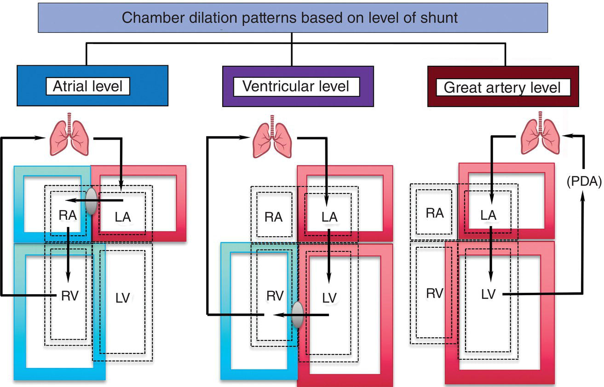

[**Figure 26.1**](#R_c26-fig-0001) Schematic diagram of heart chamber dilation patterns based on level of the shunt. Black arrows represent the flow pathway of left‐to‐right shunted blood. Dashed lines represent normal chamber size. Red or blue boxes represent chamber dilation. Abbreviations: LA, left atrium; LV, left ventricle; PDA, patent ductus arteriosus. RA, right atrium; RV, right ventricle.

Prolonged exposure of the pulmonary vasculature to increased flow and pressure results in a fixed increase in PVR. When PVR exceeds the SVR, the direction of the shunt can reverse and result in chronic cyanosis and erythrocytosis. Shunt reversal is more likely and occurs sooner with large defects distal to the tricuspid valve, but can be seen with any form of long‐standing left‐to‐right shunt. When the elevated PVR causing right‐to‐left shunting becomes irreversible, this is known as Eisenmenger syndrome.

[Figure 26.2](#c26-fig-0002) presents a schematic summary representation of the pathophysiology of the left‐to‐right shunting lesions and the factors that influence the degree of shunting at each level. Note that the four principal outcomes of RV failure, pulmonary edema, LV failure, and Eisenmenger physiology are possible with a long‐standing shunt at any level. For example, although shunting at the atrial level does not create a direct volume burden on the left ventricle, if it eventually produces pulmonary hypertension to a degree that right ventricle (RV) pressure exceeds left ventricle (LV) pressure, the ventricular septum will shift leftward and impair LV function.

The normal compensatory mechanisms that maintain systemic cardiac output and myocardial performance in the patient with a left‐to‐right shunt include the Frank‐Starling mechanism, the sympathetic nervous system, and hypertrophy of the myocardium. Manifestations of these compensatory mechanisms include sweating and tachycardia. Infants are also often tachypneic because of decreased lung compliance associated with increased pulmonary blood flow. Tachypnea impairs feeding, and growth failure develops from both decreased caloric intake and increased caloric utilization. Although significant left‐to‐right shunts can induce heart failure, infants rarely manifest peripheral edema or jugular venous distension like adults. The most consistent sign of right‐sided failure in an infant is hepatomegaly.

Anesthetic management for left‐to‐right shunt lesions should be individualized to the patient, but certain generalities do exist. Premedication with intravenous or oral drugs such as midazolam (0.05–0.1 mg/kg IV or 0.75–1.0 mg/kg PO) can be safely administered for the purpose of decreasing anxiety and providing more controlled induction of anesthesia \[1\]. Standard American Society of Anesthesiologists (ASA) monitors, along with the use of invasive arterial and central venous pressure monitoring and careful attention to urine output are recommended for all cases involving cardiopulmonary bypass (CBP). Trans‐esophageal echocardiography (TEE), cerebral oximetry, and cerebral blood flow monitoring are also useful monitoring adjuncts (see [Chapters 14](c14.xhtml) and [15](c15.xhtml) for a more detailed discussion). Rarely, patients will present with severe, poorly controlled congestive heart failure (CHF) and be intolerant to the myocardial depressant effects of inhalational anesthetics. For this group of patients, intravenous (IV) anesthesia is preferred, with common agents including fentanyl, midazolam, and dexmedetomidine \[2–5\]. In most situations, however, inhalation induction with sevoflurane is a viable option when IV access is not initially available.

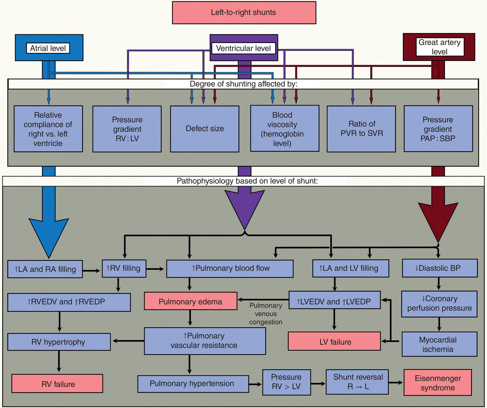

[**Figure 26.2**](#R_c26-fig-0002) Pathophysiology of left‐to‐right shunting lesions. The flow diagram depicts factors that affect left‐to‐right shunting at the atrial, ventricular, and great artery levels and the pathophysiology produced by these shunts. A large shunt at any level can result in RV failure, LV failure, and pulmonary edema. Increased pulmonary blood flow leads to pulmonary hypertension and eventually Eisenmenger syndrome, characterized by irreversible right‐to‐left shunting. Abbreviations: BP, blood pressure; LA, left atrium; LVEDP, left ventricular end‐diastolic pressure; LVEDV, left ventricular end‐diastolic volume; PAP, pulmonary artery pressure; PVR, pulmonary vascular resistance; R, right; L, left. See text for detailed discussion. RA, right atrium; RV, right ventricle; LV, left ventricle; RVEDP, right ventricular end‐diastolic pressure; RVEDV, right ventricular end‐diastolic volume; SBP, systemic blood pressure; SVR, systemic vascular resistance.

Additional anesthetic issues include avoidance of air bubbles in IV lines to prevent paradoxical emboli. The anesthesiologist must also be cognizant of the pulmonary vasodilatory effect of oxygen and hypocarbia and manipulate ventilation in order to balance the PVR and SVR. Such measures generally include minimizing the fraction of inspired oxygen (FiO2) and avoiding hyperventilation (maintaining the pressure of carbon dioxide (PaCO2) between 40 and 50 mmHg).

## Patent ductus arteriosus

### Incidence, anatomy, and natural history

Isolated persistent patent ductus arteriosus (PDA) occurs in approximately 1 in 2,500 to 1 in 5,000 live births. The incidence is higher for premature births and PDA is two to three times more common in females than in males \[6\]. PDA is also found as part of other complex CHDs and is usually the source for pulmonary or systemic blood flow in patients with a functional single ventricle before palliative repair.

The ductus arteriosus is a vascular communication between the descending aorta and pulmonary artery. Embryologically, it arises from the distal portion of one of the sixth paired aortic arches \[7\]. It most commonly originates from the aorta, just distal to the left subclavian artery, and attaches to the left pulmonary artery ([Figure 26.3](#c26-fig-0003)) \[8\].

The ductus arteriosus is an essential component in normal fetal circulation; it becomes functionally closed within 10–15 hours after birth and permanently closes by thrombosis, intimal proliferation, and fibrosis in the first 2–3 weeks. Functional closure is initiated by several mechanisms including aeration of the lungs, removal of prostaglandins produced in the placenta, increased arterial PO2, and release of vasoactive substances (bradykinins, thromboxanes, and endogenous catecholamines) \[6, 7, 9, 10\].

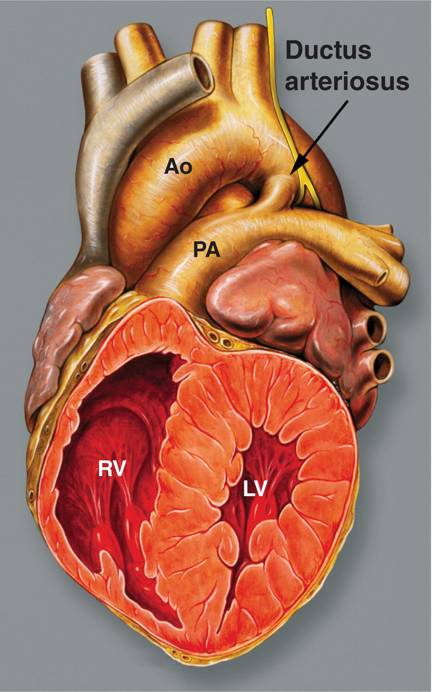

[**Figure 26.3**](#R_c26-fig-0003) Patent ductus arteriosus. Ao, aorta; LV, left ventricle; P, pulmonary artery; RV, right ventricle. The yellow structure is the recurrent laryngeal nerve.

(Source: Patrick J. Lynch, Medical Illustrator; C. Carl Jaffe, MD, Cardiologist / Wikimedia Commons / CC BY 2.5. https://en.wikipedia.org/wiki/File:Heart\_patent\_ductus\_arteriosus.jpg.)

The consequences of a PDA left untreated depend on many factors. A small PDA may be hemodynamically insignificant and unrecognized. The larger the PDA and left‐to‐right shunt, the more likely the progression to CHF, pulmonary hypertension, and if chronic and/or extreme, reversal of the shunt. In premature infants, PDA may result in increased morbidity from associated respiratory distress syndrome, necrotizing enterocolitis, and intracranial hemorrhage.

### Pathophysiology

As a PDA represents a shunt at the level of the great vessels, the degree of left‐to‐right shunting depends on the dimensions of the PDA, the ratio of PVR and SVR, the ratio of PA pressure to systemic blood pressure, and blood viscosity as determined by the hemoglobin level. Ductal dimensions of importance include diameter and length. Larger diameters and shorter lengths produce less resistance, with the potential to allow greater flow. In patients with large PDAs, the diastolic runoff into the pulmonary artery results in lowered aortic diastolic pressure, which may increase the risk of myocardial ischemia, especially in the presence of anemia or lowered SVR.

### Surgical and transcatheter approaches and outcomes

In premature newborns, the initial management of PDA is typically pharmacological closure using cyclo‐oxygenase inhibitors such as ibuprofen, indomethacin, or acetaminophen \[11, 12\]. Cyclo‐oxygenase inhibitors reduce the synthesis of prostaglandins, which would otherwise act to keep the PDA. Surgical treatment is usually reserved for patients who fail medical therapy. Surgical options include posterolateral thoracotomy with ligation or division of the PDA \[13\] ([Figure 26.4](#c26-fig-0004)), video‐assisted thoracoscopic surgery (VATS), and robotically assisted total endoscopic closure \[14\]. These approaches have mortality approaching 0% and minimum morbidity; however, mortality rates in premature neonates are slightly higher. Complications of surgical treatment include bleeding, chylothorax, vocal cord paralysis (injury to the recurrent laryngeal nerve), pneumothorax, atelectasis, recurrence of patency, and inadvertent ligation of the pulmonary artery or descending aorta. Advantages of VATS compared to thoracotomy include decreased pain, decreased hospital cost (secondary to decreased hospital stay), and avoidance of post‐thoracotomy syndrome (rib fusion, chest wall deformities, scoliosis, and compromise of pulmonary function). Disadvantages of VATS include intraoperative oxygen desaturation and hypercarbia, as well as higher morbidity during the surgical learning curve \[15–17\]. The use of robotic assistance achieves similar outcomes but with longer surgical times because of increased complexity \[14, 18\].

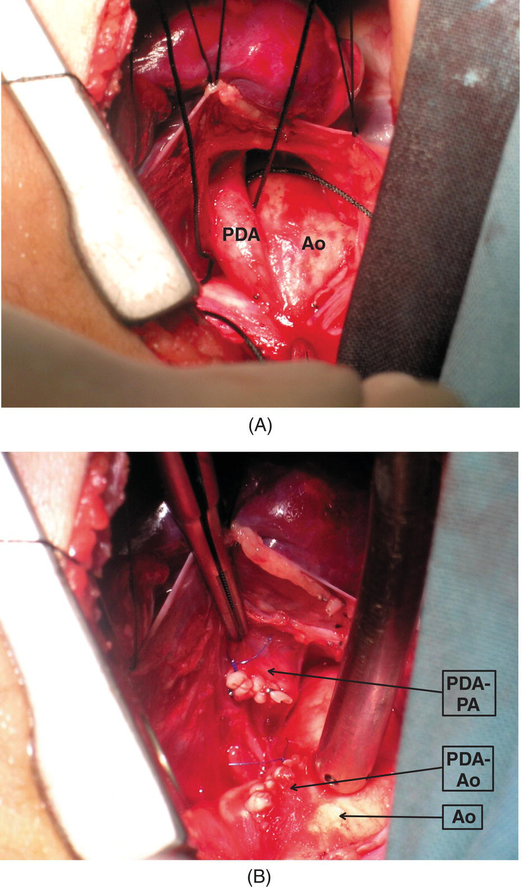

[**Figure 26.4**](#R_c26-fig-0004) Surgical ligation of a patent ductus arteriosus (PDA) via thoracotomy. (A) The PDA has been dissected and secured with ligatures, (B) Divided and oversewn PDA. Abbreviations: Ao, aorta; PDA‐Ao, aortic end of PDA; PDA‐PA, pulmonary artery end of PDA.

(Source: Reproduced with permission from [CTSNet.org](http://ctsnet.org).)

While surgical techniques are still employed, PDA closure is now most commonly accomplished in the cardiac catheterization laboratory. Techniques include the use of a variety of devices, including coils, vascular plugs, and umbrella‐type occluders. Risks of transcatheter approaches include arrhythmias, embolization of the device, and incomplete closure \[19–23\]. However, these methods are considered safe, efficacious, and cost‐effective when compared to surgical closure \[24, 25\]. Historically, there have been size limitations for use in small infants, but newer devices may allow for transcatheter closure in patients less than 1 kg with favorable anatomy \[18–23\]. See [Chapters 19](c19.xhtml) and 34 for further discussion of transcatheter PDA occlusion.

### Anesthetic considerations

The anesthetic management for PDA ligation depends on factors such as the patient's clinical condition, prematurity, coexisting disease, body weight, and surgical technique. Large volume venous access (which may be a 22‐ or 24‐gauge IV in a premature infant) and forced air‐warming devices are recommended. Pulse oximetry of both upper and lower extremities will assist in detecting inadvertent ligation of the descending aorta. For patients with coexisting disease, intra‐arterial pressure monitoring provides a method of assessing arterial blood gases, electrolytes, hematocrit, and acid‐base status. Whether by cuff or arterial line, blood pressure should be monitored in both an upper and lower extremity and observed carefully before and after ductal occlusion. Proper ductal occlusion will typically be accompanied by an increase in diastolic blood pressure consistent with the elimination of pulmonary runoff. Significantly decreased or absent blood pressure in the lower extremity indicates aortic rather than ductal occlusion. A gradient between the systolic pressure in the upper and lower extremities indicates the creation of aortic coarctation.

Although inhaled anesthetics can be safely used for many patients undergoing PDA ligation, neonates are prone to hemodynamic instability with exposure to inhaled anesthetics and benefit from an intravenous anesthetic technique using opioids such as fentanyl and possibly a benzodiazepine along with muscle relaxation.

Neonatal PDA ligation is often performed in the newborn intensive care unit (ICU) to avoid the additional risks of transport, need for ventilator changes, and hypothermic exposure. High spinal anesthesia, caudal and thoracic epidural techniques have all been described as safe and producing faster recovery \[26, 27\].

Lung isolation improves surgical exposure, especially through VATS surgical techniques, but it may require ventilation with 100% inspired oxygen to maintain acceptable oxygenation. Prior to lung isolation, FiO2 should be minimized and hypocarbia avoided in order to maintain pulmonary vascular tone and to limit the degree of left‐to‐right shunting. This technique is usually unnecessary for small infants, with either gentle retraction and packing in the case of open thoracotomy or gentle CO2 insufflation with retraction for VATS, being sufficient.

Infants having thoracotomy or VATS often require postoperative mechanical ventilation, especially if they are premature. Older patients or patients undergoing transcatheter closure are often extubated at the conclusion of the case \[17–27\].

* * *

### KEY POINTS: PATENT DUCTUS ARTERIOSUS

-   PDA is a relatively common congenital heart defect and is associated with prematurity.
-   Pathophysiology depends on the degree of shunting, which is greatest with a short ductus of large diameter.
-   Surgical closure may involve an open, thoracoscopic, or transcatheter technique.
-   Choice of anesthetic is unlimited in older, less symptomatic patients but often restricted to the opioid technique in premature infants.
-   Monitoring perfusion above and below the ductus is critical in recognizing inadvertent ligation of the aorta.
-   Immediate postoperative extubation is an option for healthy patients and/or transcatheter techniques, but postoperative mechanical ventilation is required for most neonates and infants.

* * *

## Aortopulmonary window

### Incidence, anatomy, and natural history

Aortopulmonary window (APW), also known as aortopulmonary (or aorticopulmonary) fistula, fenestration, or septal defect is a rare anomaly comprising approximately 0.1–0.6% of all congenital heart defects \[28–30\]. A total of 50–80% of patients with APW have associated defects including PDA (72%), a right pulmonary artery from the aorta (32%), anomalous origin of a coronary artery from the pulmonary artery (23%), VSD (20%), agenesis of the ductus arteriosus (20%), and other lesions \[28, 31\]. Embryologically, APW is thought to originate from nonfusion or malalignment of the aortopulmonary and truncal septi, or complete absence of the aortopulmonary septum \[28, 32\].

The basic anatomical defect in APW consists of a communication between the aorta and the pulmonary artery. Type I APW is a proximal defect located just above the sinus of Valsalva, a few millimeters above the semilunar valve. Type II is a distal APW located in the uppermost portion of the ascending aorta. Type III is a total defect involving the majority of the ascending aorta. Type IV or intermediate defects, which are neither proximal nor distal, are also designated in this system; these defects are noted for being conducive to device closure because of adequate superior and inferior rims ([Figure 26.5](#c26-fig-0005)) \[33\].

Uncorrected APW results in a reported 40% mortality in the first year of life, with a substantial proportion of survivors succumbing to CHF later in childhood \[32\].

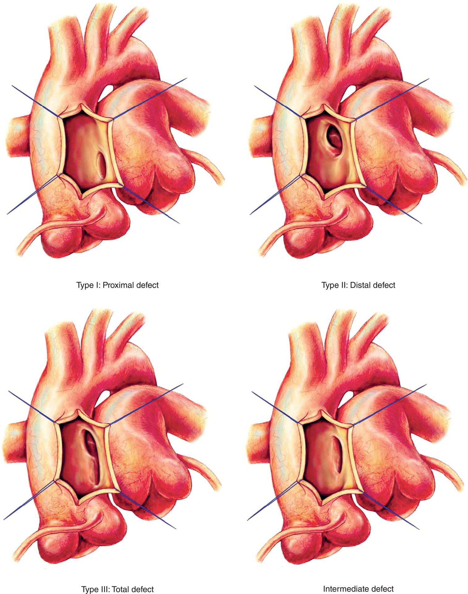

[**Figure 26.5**](#R_c26-fig-0005) Classification of aortopulmonary window variants (see text for explanation).

(Source: Backer \[33\]. Reproduced with permission of Elsevier.)

### Pathophysiology

The pressure gradient between the aorta and pulmonary artery will produce significant left‐to‐right shunting depending on the size of the defect and the relative resistances of the pulmonary and systemic vascular beds. A defect such as an APW is considered “restrictive” when it is small enough that there is a size‐related flow limitation across the defect indicated by a significant pressure gradient from one side to the other. Flow across a “non‐restrictive” APW is not limited by size; any pressure gradient across the defect is related only to the relative resistances of the pulmonary and systemic vascular beds. Coexisting cardiac anomalies may alter the pathophysiology. Pulmonary hypertension can develop as early as 12 days of age \[34\].

### Surgical and transcatheter approaches and outcomes

A variety of techniques have been described for repair of APW, including ligation and/or division with or without cardiopulmonary bypass, transaortic patch closure, complete separation, and reconstruction of both the aorta and pulmonary artery, and transcatheter closure \[33, 35–37\]. The repair is usually performed via median sternotomy with the use of cardiopulmonary bypass. Surgical repair of the aortic defect can be accomplished using a pulmonary artery flap with subsequent repair of the pulmonary artery with a pericardial patch \[38, 39\]. A Gore‐Tex® cardiovascular patch can also be used to close the defect \[33\] ([Figure 26.6](#c26-fig-0006)). Care must be taken to explore and repair associated anomalies of the pulmonary and coronary arteries and to repair coexisting cardiac abnormalities. Deep hypothermia and circulatory arrest may be required for the repair of large APW involving the proximal ascending aorta in neonates.

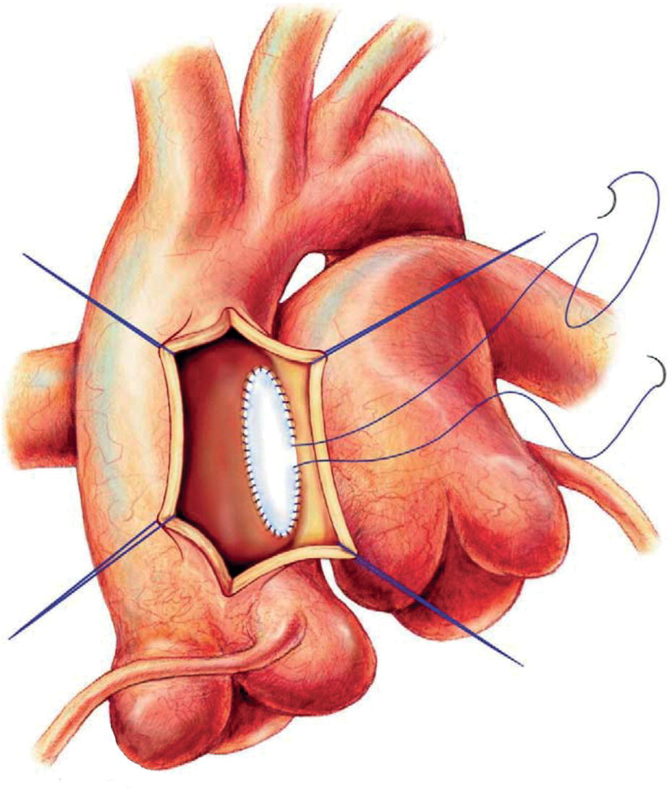

[**Figure 26.6**](#R_c26-fig-0006) Patch closure of type III aortopulmonary window (APW) total defect. Aortic cross‐clamp and cardiopulmonary bypass cannulas not shown

(Source: Backer \[33\]. Reproduced with permission of Elsevier.)

Actuarial survival after repair of APW is between 80 and 100%, with the most significant risk factor in the modern era being the presence of associated cardiac defects. Simply repaired APW lesions have a mortality approaching zero \[28\]. Transcatheter closure of APW is typically accomplished with an umbrella‐type occluding device \[36, 37, 40–42\]. Although transcatheter closure has generally been reserved for patients with restrictive defects, device closure has been reported in selected non‐restrictive defects as well \[43\].

### Anesthetic considerations

The anesthetic management of APW is similar to that of truncus arteriosus. Younger patients may have considerable diastolic runoff from low PVR. Prior to cardiopulmonary bypass, efforts should focus on maintaining pulmonary vascular tone. This can be accomplished by lowering the minute ventilation and restricting the FiO2 to maintain a moderate hypercarbic respiratory acidosis and an oxygen saturation level of 80–85%. In these cases, surgical snaring of the pulmonary artery prior to bypass may also be helpful. In contrast, patients undergoing later repair are likely to present with elevated PVR, and anesthetic management should include avoiding further increases in PVR.

Regardless of PVR at presentation, all patients with APW are at risk to develop perioperative pulmonary hypertension. The administration of inhaled nitric oxide, as well as other maneuvers described above, may be necessary to lower PVR. Patients exhibiting signs of pulmonary hypertension should initially be maintained under deep sedation with or without neuromuscular blockade during the immediate postoperative periods (see [Chapter 33](c33.xhtml)).

* * *

### KEY POINTS: AORTOPULMONARY WINDOW

-   APW is a rare lesion with a pathophysiology and management scheme that varies with the size and location of the defect.
-   Surgical and transcatheter approaches have been used; deep hypothermic bypass and circulatory arrest may be required.
-   High pulmonary blood flow and diastolic runoff into the pulmonary circulation should be mitigated by maintaining PVR through a lower oxygen saturation and moderate hypercarbia.
-   Pulmonary hypertension precautions should be observed in all patients with APW.

* * *

## Atrial septal defects

### Incidence

Atrial septal defects (ASDs) make up approximately 5–10% of all CHDs with the secundum ASD comprising nearly 80% of all ASDs. Isolated ASDs are more common in females than males by a factor of 2 : 1 \[9\]. A probe‐patent foramen ovale is found in approximately 30% of otherwise normal adult hearts \[44\]. When associated with other CHDs, an ASD may be a life‐saving communication allowing mixing of blood between the pulmonary and systemic circulations. Examples include total anomalous pulmonary venous return, tricuspid atresia, and transposition of the great arteries (TGA). In such cases, an ASD may be iatrogenically created as a palliative measure, often on an urgent or emergent basis (e.g. balloon atrial septostomy).

### Anatomy

The right and left atria are normally divided by the fusion of two septa: the septum primum and the septum secundum. The septum primum develops during the fourth week of gestation and the septum secundum during the fifth week \[7\]. The septum primum originates posteriorly and advances across the atrial midline. The opening it leaves by incompletely advancing to the endocardial cushion is the ostium primum, which later closes. A second opening, the ostium secundum, forms in the central portion of the septum primum. The septum secundum originates anteriorly and to the right of the septum primum and advances over the ostium secundum. Although traditionally the septum secundum has been described in terms similar to those of the septum primum in its formation and composition, it is instead to a large extent composed of an infolding of the superior margin of the atrium rather than an advancing wall of tissue \[45\]. It eventually develops a central opening called the foramen ovale. The septum primum forms the valve of the foramen ovale on the left atrial side \[7, 46\]. [Figure 26.7](#c26-fig-0007) illustrates the process of embryologic development of the atrial septum. Errors in this process form the basis for the five different types of ASDs: secundum, primum, sinus venosus, coronary sinus, and patent foramen ovale (PFO) ([Figure 26.8](#c26-fig-0008)) \[48\].

#### Secundum ASD

The secundum ASD is contained within the area bordered by the limbus of the fossa ovalis \[49\]. It results from abnormal reabsorption of the septum primum or defective formation or shortening of the septum secundum. Combinations of these abnormalities may contribute to large defects.

#### Primum ASD

The primum ASD results from abnormalities in the formation of the septum primum. It is frequently associated with atrioventricular canal (AVC) defects, especially partial atrioventricular canal (PAVCs) that include a cleft in the anterior leaflet of the left atrioventricular valve. AVC defects are due to abnormalities in the fusion of the endocardial cushions.

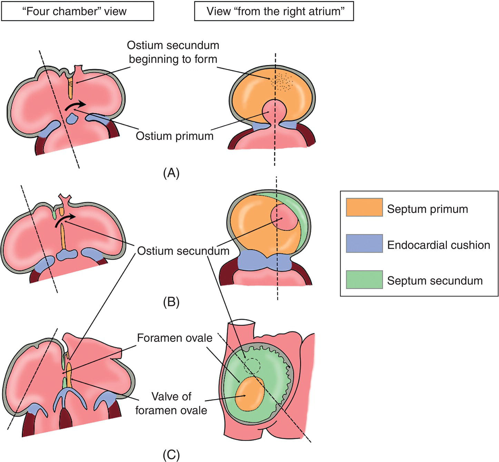

[**Figure 26.7**](#R_c26-fig-0007) Embryologic development of the interatrial septum. The left column is a long axis cross‐section similar to that of an echocardiographic four‐chamber view. The right column is the view from the right atrium with the right atrial free wall removed, looking at the right side of the developing atrial septum. (A) 29 days gestation. (B) 37 days gestation. (C) Birth.

(Source: Adapted from [Radiologykey.com](http://radiologykey.com).)

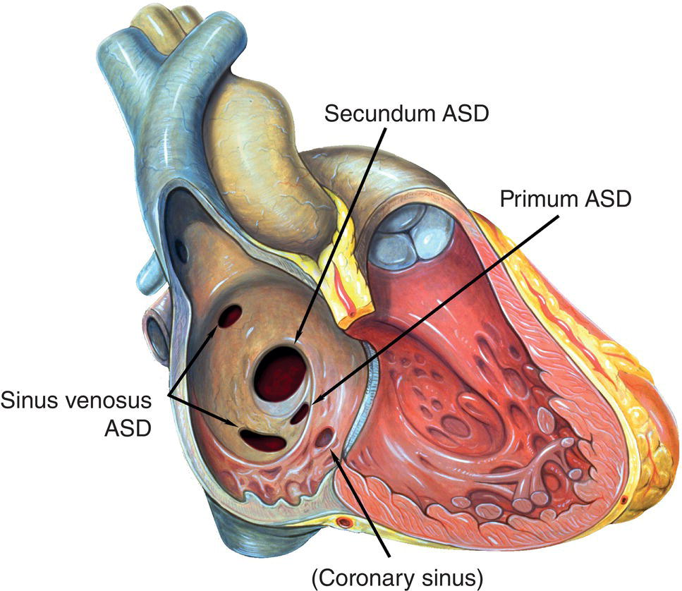

[**Figure 26.8**](#R_c26-fig-0008) Types of atrial septal defects. Coronary sinus ASDs are not typically visible from the right atrium, as they result from unroofing of the coronary sinus as it courses along the posterior wall of the left atrium. Also not shown is the patent foramen ovale (PFO), which is usually covered by the remnant of the septum primum.

(Source: Conti et al. \[179\]. Reproduced with permission of Elsevier.)

#### Sinus venosus ASD

Sinus venosus defects result from abnormal development of the septum secundum or the sinus venosus (the primitive venous collecting chamber). The most common type is located near the superior vena cava (SVC) orifice and is associated with partial anomalous pulmonary venous return involving the right upper and middle pulmonary veins. Defects near the orifice of the inferior vena cava (IVC) also exist and may involve partial anomalous pulmonary venous return of the right lower pulmonary vein.

#### Coronary sinus ASD

Coronary sinus ASD, also called an unroofed coronary sinus, results from an absence in the wall between the coronary sinus and the left atrium. This allows blood from the left atrium to drain into the right atrium via the coronary sinus. Persistent left SVC is also associated with this defect \[49\].

#### Patent foramen ovale

PFO results from failure of fusion of the septum primum to the limbus of the septum secundum. Patency of the foramen ovale is normal during fetal life and allows right‐to‐left shunting of blood in order to bypass the lungs in fetal circulation. Following birth, PVR decreases and SVR increases. Subsequent higher pressure in the left atrium causes the septum primum to close over the foramen ovale, but it may not completely fuse to the septum secundum.

### Natural history

Isolated ASDs are usually asymptomatic during infancy and childhood despite the increased volume load on the right ventricle. CHF usually occurs after the second or third decade of life due to chronic right ventricular volume overload. Pulmonary hypertension can occur in up to 13% of unoperated patients younger than 10 years of age; however, progression to Eisenmenger syndrome is unusual \[9\]. The risk of arrhythmia is increased with increasing shunt volume and atrial dilation. Patients with a Qp : Qs of 2 : 1 or less have an 11% incidence of atrial arrhythmia, compared to 38% in those with Qp : Qs of 3 : 1 or greater \[50\]. An ASD is sometimes discovered during a neurological work‐up for transient ischemic attacks or strokes from paradoxical emboli \[49\].

### Pathophysiology

The amount of left‐to‐right shunting at the atrial level is dependent on two factors: the size of the defect and the relative compliance of the right and left ventricles. Shunting occurs primarily during diastole and produces a volume burden on the cardiovascular system that is proportionate to the degree of shunting.

### Surgical and transcatheter approaches and outcomes

Surgical repair of an ASD is usually recommended between the ages of 3 and 5 years \[51\]. Spontaneous closure of small secundum type ASDs occurs in up to 87% of infants in the first year of life \[9\], and controversy exists regarding the closure of small ASDs that are asymptomatic. Conventional surgical treatment involves median sternotomy with the use of CPB to perform a primary repair or patch closure, with surgical mortality approaching 0% \[9, 52\]. Primum ASD repairs typically require patch closure as well as repair of the coexisting mitral valve cleft ([Figure 26.9](#c26-fig-0009)). Sinus venosus defects are usually repaired using a patch to close the ASD and baffle the anomalous pulmonary veins to the left atrium. The SVC may need to be translocated and anastomosed to the right atrial appendage to avoid baffle obstruction (Warden procedure). Many centers now favor partial sternotomy approaches because of the improved cosmetic result with similar morbidity and mortality to complete sternotomy \[53–55\]. Robotically assisted totally endoscopic ASD repair with remote access perfusion (using femoral cannulation) has been described in adults \[56\]. With conventional repair, postoperative dysrhythmias are reported in 23% of patients, and as many as 2% of patients may need a pacemaker following surgery \[9\].

Increased use of transcatheter ASD closure in the cardiac catheterization laboratory has dramatically reduced the number of operative repairs. While the several FDA‐approved devices that have been utilized differ in detail, the typical design consists of a catheter‐deployed expandable “double umbrella” type occluder, with a right and left atrial side ([Figure 26.9](#c26-fig-0009)) \[57\]. Nonsurgical transcatheter closure of PFO without an occluding device has also been described, using either radio frequency ablation or suture closure \[58, 59\]. Transcatheter ASD closure is usually performed under general anesthesia with the use of TEE to guide placement. However, intracardiac echocardiography using intravascular two‐dimensional imaging may eliminate the need for TEE and reduce the need for general anesthesia \[60\]. Transcatheter closure is safe, associated with decreased hospital stay, lack of a surgical scar, avoidance of CPB, and reduced anesthetic requirements. Limitations to transcatheter closure of ASD include patient size (introducer sheaths may be too large for smaller patients), type of ASD (usually limited to PFO or secundum), and the requirement for an adequate tissue rim to which the device can attach \[61\]. Occasionally, pre‐procedure transthoracic echocardiography does not provide complete information about septal tissue rim size or other requirements for device closure, and backup surgical repair can be arranged during the same anesthetic if the TEE examination reveals contraindications to a transcatheter procedure.

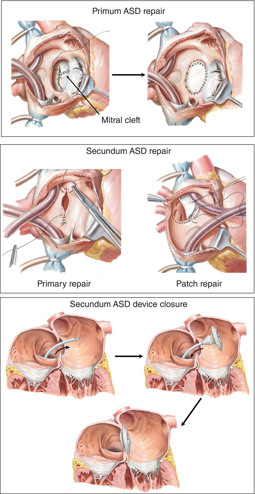

[**Figure 26.9**](#R_c26-fig-0009) Surgical repair of primum (top) and secundum (middle) atrial septal defect (ASD), and device closure of secundum ASD (bottom). A primum ASD requires closure of the mitral valve cleft (top left), followed by patch closure of the ASD (top right). A secundum ASD may be repaired by direct suture closure (middle left) or by patch closure (middle right). Secundum ASD closure device is delivered via catheter across the ASD, wherein the left atrial side of the device is opened. The device is then pulled back against the ASD, where the right atrial side is opened and the device is deployed from the catheter.

(Source: Conti et al. \[47\]. Reproduced with permission of Elsevier.)

### Anesthetic considerations

Patients with an isolated ASD are generally asymptomatic and do not have pulmonary hypertension. Therefore, the induction of anesthesia can be safely accomplished with either inhalation or intravenous techniques. Whenever possible, patients should have an intraoperative TEE performed prior to incision, because transthoracic echocardiographic studies are sometimes unable to exclude the possibility of a partial anomalous pulmonary venous return due to difficulty in visualizing all four pulmonary veins. During surgery, TEE can be helpful to assess the de‐airing of the left heart and adequacy of the repair. Most patients have a good myocardial function and do not require inotropic support perioperatively. Maintenance of anesthesia typically consists of a combination of inhaled and intravenous agents. Adjunct regional techniques are favored by some and may facilitate early extubation \[62–65\]. Tracheal extubation in the operating room (OR) has been shown to decrease patient charges without compromising patient care when compared to extubation in the ICU \[66, 67\]. Whatever technique is chosen, the primary goals for the uncomplicated ASD patient should include preparation for early extubation either in the OR or within the first 4 hours postoperatively.

* * *

### KEY POINTS: ATRIAL SEPTAL DEFECT

-   ASDs are a common congenital heart lesion and may be important in maintaining adequate intracardiac mixing in association with other life‐threatening heart defects.
-   Untreated ASDs may be asymptomatic until CHF, atrial arrhythmias, or strokes from paradoxical emboli occur, generally after the second or third decade of life.
-   Anesthesia for isolated ASD closure is generally well tolerated and early extubation is an important goal.
-   Transcatheter techniques for ASD closure have dramatically reduced the number of operative repairs.

* * *

## Ventricular septal defects

### Incidence

VSD is the most common CHD, occurring in 50% of all children with congenital heart disease and in 20% as an isolated lesion. The reported incidence ranges from 1.56 to 53.2/1,000 live births \[68\]. VSD is associated with a variety of inherited conditions, including trisomy 13, 18, and 21 as well as VACTERL (vertebral, anal, cardiac, tracheoesophageal fistula, renal, and limb anomalies) association and CHARGE (coloboma, heart defects, atresia choanal, retarded growth and development, and genital hypoplasia, and ear anomalies/deafness) syndrome \[69\].

### Anatomy

Embryologically, the primitive left ventricle is formed from the ventricular portion of the bulbus cordis and the primitive right ventricle is formed from the proximal portion at approximately 23–25 days gestation. Disruption of ventricular septation at a given point during primary morphogenesis is responsible for four different types of VSD: type I: subarterial; type II: perimembranous; type III: inlet; and type IV: muscular ([Figure 26.10](#c26-fig-0010)) \[69, 70\]. Each of these types has various synonyms, making VSD nomenclature somewhat complex. A thorough understanding of the anatomy of the normal ventricular septum is helpful in making sense of the various types and subtypes of VSDs. In this way, VSDs may be understood as those within the muscular portion of the ventricular septum (type IV) and those that exist at its margins near the tricuspid and pulmonary valves (types I–III).

#### Type I: subarterial VSD

The subarterial (also called _juxtaarterial, subpulmonary_, _supracristal_, _conal_, or _infundibular_) VSD is located just beneath the pulmonary valve, within the outlet septum, above the crista supraventricularis. The crista supraventricularis defines the inferior margin of the smooth‐walled muscular tube of tissue connecting the right ventricle to the pulmonary artery known as the _infundibulum_ or _conus arteriosus_. As a result of the location of this defect, a Venturi effect may be produced by the jet of blood flowing through the VSD causing the right or noncoronary aortic cusp of the aortic valve to prolapse toward the defect, producing aortic insufficiency \[68\]. This type of lesion is more common among VSDs found in the Asian population, occurring in about 30% of all VSDs versus in about 5% of the non‐Asian population \[71\].

#### Type II: perimembranous VSD

The perimembranous (also called _paramembranous_ or _conoventricular_) VSD is a communication adjacent to a portion of the membranous septum and the fibrous trigone of the heart, where the aortic, mitral, and tricuspid valves are in fibrous continuity. These infracristal defects (below the crista supraventricularis) are the most common VSD subtype, accounting for approximately 80% of VSDs.

#### Type III: inlet VSD

Inlet VSDs (also called _canal type_) are located in the posterior region of the septum beneath the septal leaflet of the tricuspid valve. These defects account for approximately 10% of VSDs.

#### Type IV: muscular VSD

Muscular VSDs are located anywhere within the muscular portion of the interventricular septum. These defects can be multiple and represent approximately 2–7% of VSDs.

### Natural history

Patients presenting with VSD may be asymptomatic or may exhibit signs and symptoms of CHF in varying degrees. The rate and extent of progression of symptomatology depend on the patient's age, size of the defect, and the degree of left‐to‐right shunting. Infants who have non‐restrictive VSDs typically develop symptoms of CHF by 3 months of age because of the physiologic decline in PVR that occurs during early postnatal life. If left untreated, 15% of patients with large VSDs develop pulmonary hypertension that will progress to the development of pulmonary vascular obstructive disease, shunt reversal, and cyanosis (Eisenmenger syndrome) by the age of 20 years \[72\]. The irreversible changes that lead to Eisenmenger syndrome may develop by age 2 years; therefore it is important to close large non‐restrictive VSDs within the first 2 years of life. However, these large defects often decrease in size over the first year, becoming restrictive and relatively asymptomatic, allowing avoidance of surgery through careful surveillance in some cases \[73\]. Spontaneous closure of small perimembranous and muscular VSDs occurs in as many as 50% of patients \[72, 74, 75\], and such patients are typically asymptomatic.

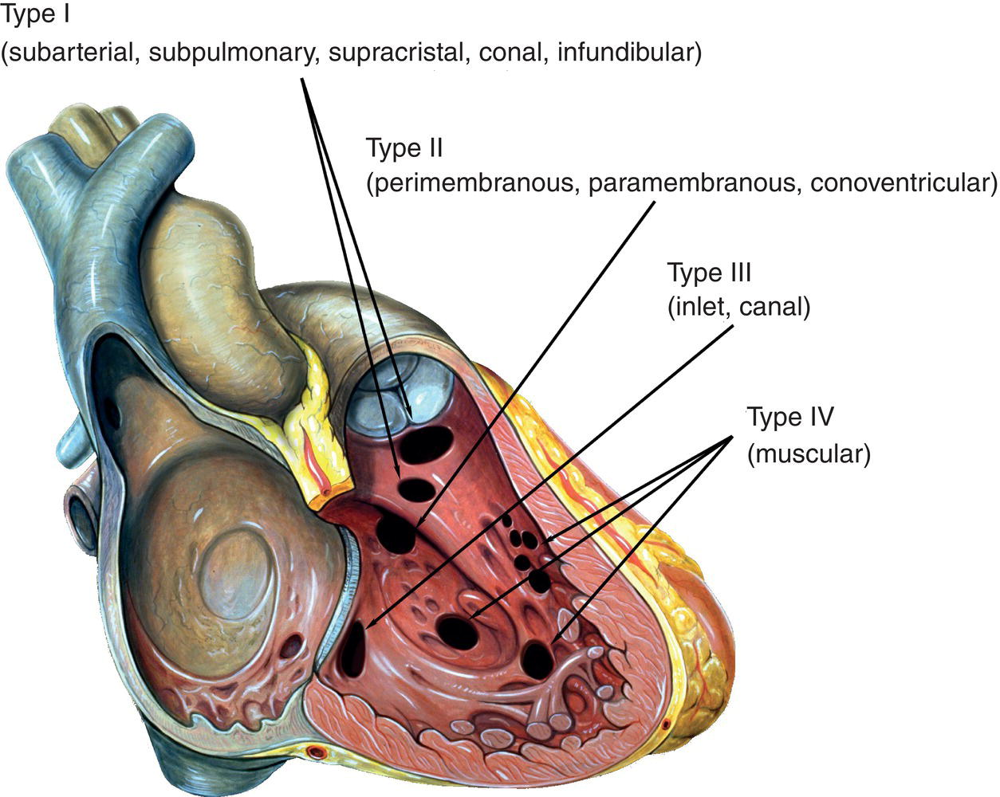

[**Figure 26.10**](#R_c26-fig-0010) Types of the ventricular septal defect.

(Source: Patrick J. Lynch, Medical Illustrator; C. Carl Jaffe, MD, Cardiologist / Wikimedia Commons / CC BY 2.5. https://commons.wikimedia.org/wiki/File:Heart\_right\_vsd.jpg.)

### Pathophysiology

Isolated VSDs produce left‐to‐right shunting at the ventricular level, predominantly during systole. In contrast to ASDs, in which ventricular dilation is isolated to the right ventricle, the volume load induced by shunting through a VSD affects both ventricles. A VSD may be restrictive or non‐restrictive, depending on size. A clear definition of a non‐restrictive defect is elusive. The presence of a pressure gradient across the defect is inadequate because a gradient generally exists even in non‐restrictive lesions related to the relative resistances of the pulmonary and systemic vascular beds. Proposed definitions involve the cross‐sectional ratio of the defect to the aortic orifice, defect size versus body surface area, or shunt flow velocity \[6\].

In addition to the pathophysiology associated with left‐to‐right shunting, VSDs may be associated with secondary structural cardiac anomalies not related to the shunt and resultant volume loading. An example is the aortic valve prolapse often associated with VSDs near the aortic valve, resulting in aortic insufficiency. Another is the phenomenon of a “double‐chambered right ventricle”, which occurs with some frequency in the setting of a VSD. In this lesion, mid‐cavity obstruction by hypertrophied muscle bands creates a high‐pressure proximal chamber and a low‐pressure distal chamber within the right ventricle. These lesions are also often associated with discrete subaortic stenosis \[76\].

### Surgical and transcatheter approaches and outcomes

Surgical repair of VSD is usually by patch closure and occasionally by primary closure using CPB via median sternotomy. Perimembranous and inlet VSDs are most commonly repaired via a right atriotomy, which may require detachment of the septal leaflet of the tricuspid valve for exposure \[77\] ([Figure 26.11](#c26-fig-0011)). Subarterial VSDs are most commonly repaired via the transpulmonary approach. Midmuscular VSDs are most commonly repaired via right atriotomy, and anterior or apical muscular VSD may be approached using right ventriculotomy. However, the use of a right ventriculotomy carries the risks of conduction disturbances and ventricular dysfunction later in life. Symptomatic patients with lesions that are not approachable via right atriotomy may be treated with pulmonary artery banding until the patient is larger, allowing transatrial repair. Pulmonary artery banding is also utilized for multiple muscular VSDs and in patients that are high‐risk candidates for CPB. Partial median sternotomies, as well as small right anterolateral thoracotomies, are advocated by some because of improved cosmetic results \[78, 79\]. Total thoracoscopic repair has also been described \[80\].

Timing for surgical repair varies depending on age at presentation and severity of signs and symptoms. Patients younger than 6 months of age are repaired if they manifest uncontrollable CHF and failure to thrive. Patients between 6 and 24 months of age undergo repair to treat CHF symptoms or pulmonary hypertension. Patients older than 24 months undergo repair if the Qp : Qs is greater than 2 : 1. Among patients with subarterial VSD, the presence of aortic insufficiency is an indication for surgical repair to prevent further progression of the valvular insufficiency \[81, 82\]. A defect size of greater than 5 mm is repaired to avoid progression to aortic cusp prolapse and aortic insufficiency, and defects less than 5 mm can be managed conservatively \[83\]. Finally, even small, otherwise asymptomatic VSDs are usually repaired because of the low risk of infective endocarditis.

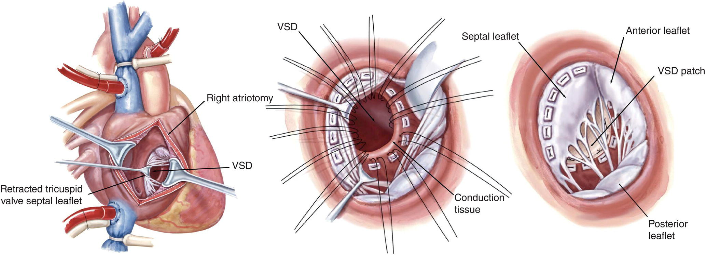

[**Figure 26.11**](#R_c26-fig-0011) Surgical repair of perimembranous ventricular septal defect (VSD). This technique, typically done through a right atriotomy, is similar to that for inlet VSD. Note exposure requires retraction or detachment of the septal leaflet of the tricuspid valve

(Source: Conti et al. \[47\]. Reproduced with permission of Elsevier.)

Mortality for uncomplicated VSD in older patients is less than 1–2% \[84\]. Mortality for VSD repair in infants during the first year of life is less than 5% \[85\].

Transcatheter closure of VSDs has been performed successfully since at least the late 1980s \[86–90\]. Indications for use of these devices include all types of muscular VSDs, including apical and multiple, as well as perimembranous VSDs. Transcatheter closure is typically performed in the catheterization laboratory via percutaneous access. However, “hybrid” techniques involving a sternotomy to place a device either by direct visualization on CPB or in a beating heart using perventricular transcatheter placement have also been described \[91\]. The major limitation in the application of percutaneous transcatheter techniques is related to the size of the sheaths necessary for device delivery, precluding use in infancy. Complications of device closure include the need for blood transfusion, tricuspid valve regurgitation, and device embolization \[86, 87\]. Heart block is a particular concern following device closure of perimembranous VSDs, sometimes occurring years after placement \[92–94\].

### Anesthetic considerations

Anesthetic management for patients with VSD is similar to that of ASD. Pulmonary hypertension may develop early, especially in patients with trisomy 21, and preoperative chest radiograph revealing decreased pulmonary vascular markings is indicative of pulmonary hypertension \[95–99\]. Such patients may respond to the use of inhaled nitric oxide prior to the termination of CPB and/or in the postoperative period. Right heart failure with decreased cardiac output may result if pulmonary hypertension is not controlled, and it may require the use of dopamine, milrinone, dobutamine, or isoproterenol.

Conduction disturbances may be transient or permanent. Atrioventricular heart block, formerly reported to occur in up to 10% of patients post‐VSD repair, is now a rare complication occurring in less than 1% of patients after VSD closure \[100\]. If heart block develops, treatment with atrioventricular synchronous pacing using temporary pacing wires is indicated. Junctional ectopic tachycardia is sometimes observed in patients younger than 1 year after surgery for lesions that involve VSD repair, most commonly after tetralogy of Fallot correction. Treatment includes cooling to 35 °C, increasing anesthetic depth, paralysis, procainamide, esmolol, or amiodarone \[101\].

Intraoperative use of TEE will allow recognition of residual VSDs and intracardiac air, as well as provide an assessment of ventricular volume and function. Small muscular VSDs often become apparent after the closure of larger VSDs. Frequently these smaller defects, especially if near the apex, may not be amenable to surgical repair or worth the risk of returning to CPB.

Patients with uncomplicated VSDs are good candidates for extubation in the OR or early after arrival in the ICU.

* * *

### KEY POINTS: VENTRICULAR SEPTAL DEFECT

-   VSDs are the most common congenital heart defects.
-   Both ventricles are affected by left‐to‐right shunting through a VSD.
-   The pulmonary vascular tone should be maintained in those patients with pulmonary overcirculation prior to repair.
-   Be prepared to treat arrhythmias, including heart block and junctional ectopic tachycardia, especially after repair.
-   Patients with uncomplicated VSDs should be considered for early extubation.

* * *

## Atrioventricular canal

### Incidence

Four to 5% of CHDs involve defects of the atrioventricular septum, and AVC defects occur in 0.19 in 1,000 live births \[99, 102\]. AVC is associated with multiple syndromes and occurs in approximately 20% of persons with trisomy 21. It accounts for 15% of congenital heart defects in persons with Noonan syndrome and nearly 50% in persons with Ellis–van Creveld syndrome \[103\].

### Anatomy

Atrioventricular canal defects result from failure of the endocardial cushions to fuse during the fifth week of fetal development \[7\]. AVC consists of three basic defects: (i) an ostium primum defect resulting in interatrial communication, (ii) abnormal atrioventricular valves, and (iii) an inlet VSD resulting in an interventricular communication. Three types of AVC exist: (i) partial, (ii) transitional, and (iii) complete \[104\].

#### Partial AVC

The PAVC defect consists of an ostium primum ASD and a cleft in the anterior leaflet of the mitral valve, usually resulting in some degree of insufficiency \[96\]. The tricuspid valve is often abnormal as well, and no VSD or other interventricular communication exists.

#### Transitional AVC

The transitional (also called _intermediate_) atrioventricular canal (TAVC) defect consists of an ostium primum ASD, abnormal atrioventricular valves that form two separate orifices, and a VSD, often restrictive, just below the atrioventricular valves \[104\]. Like the PAVC defect, the left atrioventricular valve is usually associated with a cleft and has some degree of insufficiency.

#### Complete AVC

The complete atrioventricular canal (CAVC) defect consists of an ostium primum ASD and a non‐restrictive VSD just below a common atrioventricular valve that bridges both the right and left sides of the heart to create a single valve orifice \[105\]. The left atrioventricular portion of the valve usually contains a cleft that is insufficient. Three classifications of CAVC defects exist based on the chordal attachments of the anterior bridging leaflet of the common atrioventricular valve and are commonly referred to as Rastelli types A, B, and C \[104, 105\] ([Figure 26.12](#c26-fig-0012)).

In Rastelli type A CAVC, which is the most common type, the anterior bridging leaflet is divided at the septum into right and left components and attached to the crest of the ventricular septum by thin chordae tendinae. Rastelli type B CAVC is rare and is characterized by anomalous papillary muscle attachment from the right side of the ventricular septum to the left side of the anterior bridging leaflet. Rastelli type C CAVC is defined by an anterior leaflet that lacks any ventricular septal attachments and “floats” above the septum \[104\]. The Rastelli type C defect may be associated with other major cardiac or extracardiac anomalies such as tetralogy of Fallot or trisomy 21 \[49\].

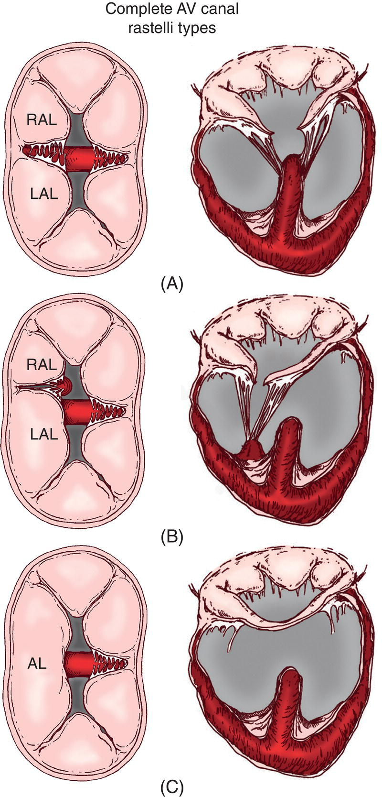

[**Figure 26.12**](#R_c26-fig-0012) Complete atrioventricular canal defects: Rastelli types A, B, and C. LAL, left anterior leaflet; RAL, right anterior leaflet.

(Sources: Jacobs et al. \[104\]. Reproduced with permission of Elsevier; Munoz et al. \[105\]. Reproduced with permission of Springer Nature.)

Other variants of AVC also exist, including right or left ventricular dominant types in which the common atrioventricular valve opens predominantly into one of the ventricles (“unbalanced” AVC). If one ventricle is hypoplastic the physiology produced by such lesions is similar to other single ventricle lesions (see [Chapter 30](c30.xhtml) for a detailed presentation). Many lesions occur in association with AVC, including PDA, Tetralogy of Fallot, coarctation of the aorta, subaortic stenosis, left SVC, asplenia, and polysplenia syndromes \[105\].

### Natural history

As with other left‐to‐right shunts, pulmonary hypertension may develop by 1 year of age and eventually lead to Eisenmenger syndrome \[106\]. The severity of CHF and symptoms will depend on the degree of left‐to‐right shunting and the severity of atrioventricular valve regurgitation. Among the forms of AVC, PAVC is the least symptomatic, CAVC the most, and TAVC intermediate. Patients with untreated PAVC may do well through childhood but have an increased likelihood of developing CHF in adulthood, especially as atrial dysrhythmias develop \[49\]. The presence of moderate to severe atrioventricular valve regurgitation leads to earlier development of CHF and higher morbidity and mortality if untreated. Those patients with PAVC presenting with CHF in the first year of life should be suspected of having additional lesions, most commonly left‐sided obstructive lesions \[107\]. Patients with CAVC develop CHF, failure‐to‐thrive, and frequent respiratory infections in the first year of life. During this same interval, 12% of these children will develop irreversible pulmonary hypertension. Those with trisomy 21 develop pulmonary hypertension earlier and with increased severity as compared to other children; however, this has not manifested as a risk factor in surgical repair or long‐term outcome \[96–98, 108–110\].

### Pathophysiology

A left‐to‐right shunt may occur at the atrial, ventricular, and atrioventricular valvar level, depending on the type of AVC present. This shunting, in addition to atrioventricular valve regurgitation, results in volume overload of both the atria and ventricles. Volume overload soon develops into CHF and may result in pulmonary hypertension as the ratio of pulmonary to systemic blood flow increases.

### Surgical approaches and outcomes

Surgical repair of PAVC is usually performed at age 2–5 years unless there are signs of CHF or other lesions that necessitate earlier repair. Patients with TAVC may be relatively asymptomatic and may tolerate surgical repair at an older age.

Primary complete surgical repair for patients with CAVC is performed between 1 and 6 months of age because it is safe, controls CHF, prevents the development of fixed pulmonary hypertension, and reduces annular dilation (a cause of atrioventricular valvar regurgitation) \[107, 111, 112\].

Surgical techniques vary, but generally consist of a right atriotomy with patch closure of the ASD, cleft closure in the anterior leaflet of the left atrioventricular valve, and closure of the VSD with a patch or, in the case of the TAVC, pledgetted sutures \[49, 111\]. A one‐ or two‐patch technique can be used. The one‐patch technique consists of a single patch closure of both the ASD and VSD ([Figure 26.13](#c26-fig-0013)) \[113, 114\]. Staged repair with initial pulmonary artery banding is reserved for cases of severe respiratory illness, sepsis, or anatomy not suitable for biventricular repair. The presence of associated cardiac anomalies such as Tetralogy of Fallot, double outlet right ventricle (DORV), left‐sided obstructive lesions, and unbalanced AVC (with a hypoplastic ventricle) further complicates the repair and results in higher mortality, especially in patients with a hypoplastic ventricle \[115, 116\].

Mortality for the repair of PAVC is less than 5%, and the mortality for the complete repair of CAVC is between 2.5 and 10.5% \[112, 117–119\]. The presence of preoperative pulmonary hypertension and increasing size of the VSD is associated with higher morbidity and mortality among patients undergoing complete repair of CAVC \[49, 117\].

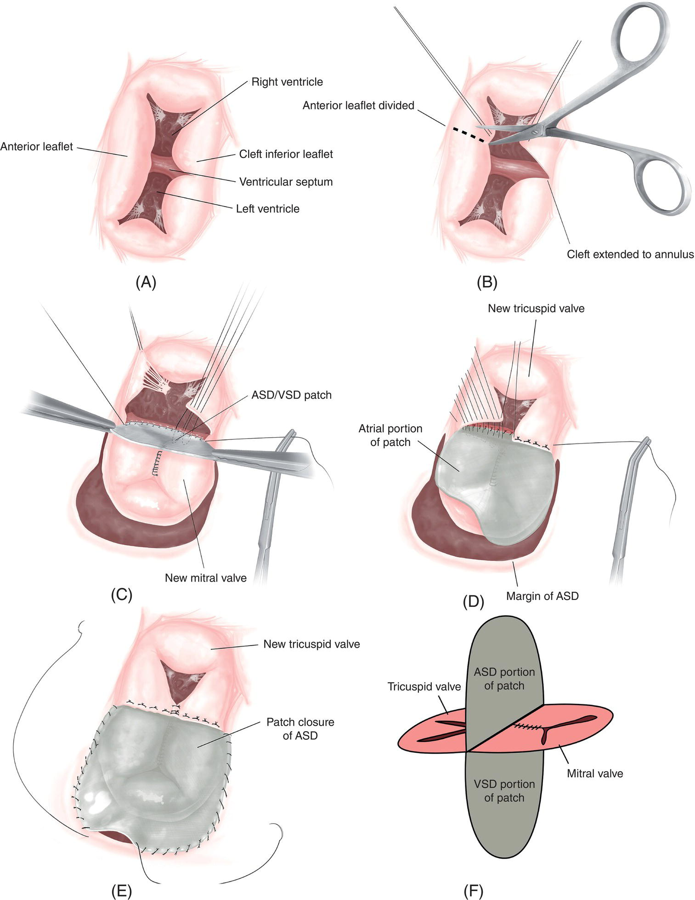

[**Figure 26.13**](#R_c26-fig-0013) One‐patch repair of a complete atrioventricular canal (AVC) defect. (A) The defect is exposed. (B) The anterior and posterior common valve leaflets are divided to separate the mitral and tricuspid sections. (C) The VSD is closed using the inferior portion of the patch. The mitral valve is rendered bicuspid by the closure of the anterior and posterior common leaflets on the mitral side, which had been natively separate, to create a functional mitral valve after being anchored to the patch. (D) The tricuspid valve leaflets are anchored to the mid‐portion of the patch. (E) The superior portion of the patch is used to close the atrial septal defect. (F) Schematic representation of the completed repair, showing the position of the patch and the newly created tricuspid and mitral valves. ASD, atrial septal defect; VSD, ventricular septal defect.

(Source: Razzouk et al. \[113\]. Reproduced with permission of Elsevier.)

### Anesthetic considerations

Anesthetic management of AVC defects depends primarily on the degree of left‐to‐right shunting and the presence and severity of pulmonary vascular hypertension. As with other septal defects, balancing the ratio of PVR to SVR and thereby limiting the amount of pulmonary overcirculation is paramount to successful management, and is usually accomplished by manipulations in FiO2 and ventilation (see above). TEE is very helpful in detecting residual intracardiac shunts, assessing atrioventricular valvar function, and determining ventricular function and volume following repair.

Surgical placement of left atrial and pulmonary arterial pressure lines may be used to guide the management of inotropes, use of inhaled nitric oxide, and volume replacement. Persistent elevation and acute increases in pulmonary arterial pressure contribute to right heart failure and increased mortality \[117\]. Pulmonary hypertension develops commonly in these patients and is treated with hyperventilation, 100% oxygen, systemic alkalinization, opioids, and inhaled nitric oxide. Increasing the pH is more effective than lowering the PaCO2 in controlling pulmonary pressures and may be accomplished by the administration of sodium bicarbonate \[120\]. Sildenafil has also been effective in this setting \[121\].

Most patients require inotropic support upon weaning from CPB, and those with residual atrioventricular valve regurgitation and/or VSD benefit from the use of milrinone or other afterload reduction. Hypotensive patients who have elevated left atrial pressures should be evaluated for the presence of severe residual left atrioventricular valve regurgitation or stenosis, residual VSD, left ventricular outflow tract obstruction, or left ventricular dysfunction. Intraoperative TEE is essential for the initial diagnosis of these conditions, and re‐initiation of CPB and repair may be necessary.

CAVC repair is associated with conduction abnormalities, especially atrioventricular and sinoatrial nodal dysfunction resulting in complete heart block. In this situation, atrioventricular sequential pacing is necessary to minimize atrioventricular valve regurgitation and to improve cardiac output \[105\].

* * *

### KEY POINTS: ATRIOVENTRICULAR CANAL

-   AVC is associated with trisomy 21, Noonan syndrome, and Ellis–van Creveld syndrome
-   AVC may be partial, transitional, or complete
-   Measures to maintain pulmonary vascular tone are necessary to avoid pulmonary overcirculation prior to repair
-   Following bypass, pulmonary hypertension is common and therapy may include inhaled nitric oxide, hyperventilation, 100% oxygen, systemic alkalinization, deep sedation, and neuromuscular blockade
-   Inotropic support is often needed post‐bypass
-   Residual defects and cardiac function are evaluated by TEE post‐repair
-   Dysrhythmias, including complete heart block, are common and temporary pacing may be required

* * *

## Double outlet right ventricle

### Incidence

DORV comprises approximately 1–1.5% of all patients with congenital heart disease with an incidence estimated at 1/10,000 live births \[122\]. Although DORV can occur with an intact ventricular septum, this is extremely rare \[123\]; almost all patients with DORV also have a VSD.

### Anatomy

DORV is a type of ventriculoarterial connection in which both great vessels arise either entirely or predominantly from the right ventricle. This definition is intended to simplify what is in fact a complex spectrum of defects ranging from morphology that mimics tetralogy of Fallot to that which resembles transposition of the great vessels. Embryologically, DORV is a bulboventricular malformation that results from failure of proper alignment of the conotruncus with the ventricular septum \[122\].

Characterization of the anatomy of DORV is crucial in understanding the physiologic consequences as well in determining the surgical approach for palliation or correction. Complete characterization of the anatomy will include (i) the relationship of the VSD to the great arteries, (ii) the relationship of the great arteries with respect to one another, (iii) the morphology of the ventricles and their outflow tracts, and (iv) the presence of associated anomalies \[123\]. Four different anatomic types of DORV are defined on the basis of the relationship of the VSD to the great arteries: (i) subaortic VSD, (ii) subpulmonary VSD, (iii) doubly committed VSD, and (iv) noncommitted VSD \[124, 125\] ([Figure 26.14](#c26-fig-0014)).

#### DORV with subaortic VSD

These lesions represent approximately 51–56% of DORV \[123, 126\] and are characterized by a VSD located beneath the aortic valve. The great vessels may be normally related or transposed. When this defect is associated with pulmonary stenosis, the resulting physiology is similar to that of tetralogy of Fallot \[122\].

#### DORV with subpulmonary VSD

DORV with subpulmonary VSD represents approximately 30% of DORV \[126, 127\]. Pulmonary stenosis is rare, but subaortic or aortic arch obstructions are common. The VSD is typically non‐restrictive. This lesion often occurs in the form of the _Taussig–Bing_ type, with D‐malposition of the great arteries in the absence of pulmonary stenosis \[122\]. The resulting physiology is similar to that of transposition of the great arteries.

#### DORV with doubly committed VSD

Three to 10% of patients with DORV have a doubly committed VSD \[126–128\]. The doubly committed VSD results from hypoplasia of the conal septum and variable degrees of override of the VSD by both great arteries \[122\].

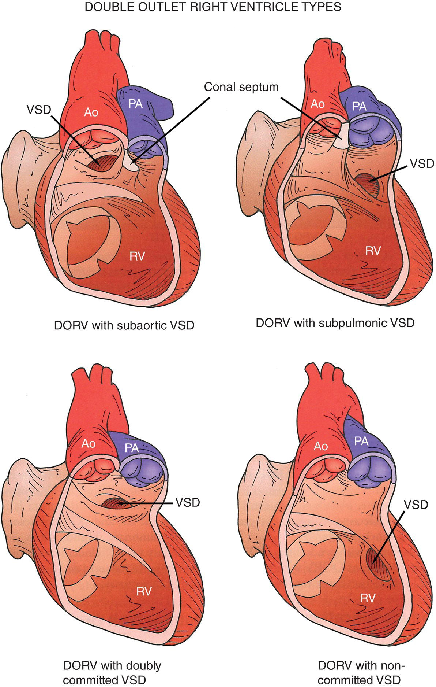

[**Figure 26.14**](#R_c26-fig-0014) Anatomic sub‐types of double outlet right ventricle (DORV), as determined by the position of the ventricular septal defect. Ao, aorta; PA, pulmonary artery; RV, right ventricle; VSD, ventricular septal defect.

(Source: Ungerleider et al. \[125\]. Reproduced with permission of Elsevier.)

#### DORV with noncommitted VSD

Twelve to 17% of patients with DORV have a non‐committed VSD \[123, 126\], and the VSD is an apical muscular or membranous‐inlet type. The VSD is remote from the great arteries and is frequently associated with AVC defects \[122\].

### Natural history and pathophysiology

The natural history and pathophysiology of DORV are dependent on the specific anatomy of the lesion and relative amounts of pulmonary versus aortic blood flow as well as the degree of mixing of pulmonary and systemic venous blood. Consideration of these variables serves to simplify the pathophysiology of DORV into three basic subtypes: VSD, Tetralogy of Fallot, and transposition of the great arteries \[129\].

DORV with a doubly committed or subaortic VSD without pulmonary stenosis produces physiology similar to that of a VSD. Because VSDs in this setting are usually non‐restrictive, the degree of left‐to‐right shunting will generally depend on the relative ratio of PVR to SVR.

DORV associated with pulmonary stenosis resembles the physiology of tetralogy of Fallot with varying degrees of cyanosis depending on the severity of pulmonic stenosis. These patients have right‐to‐left shunting across the VSD and may have hypercyanotic spells, erythrocytosis, and failure to thrive. Although there is a fixed component of obstruction, pulmonary blood flow may vary due to alterations in PVR. Pulmonary stenosis is present in approximately 50% of patients with DORV \[122\].

DORV with a subpulmonary VSD without pulmonary stenosis usually produces physiology similar to transposition of the great arteries. Streaming of pulmonary venous blood to the pulmonary artery and systemic venous blood toward the aorta results in variable degrees of mixing of oxygenated and deoxygenated blood. Patients can present early with both cyanosis and CHF followed by the development of pulmonary vascular occlusive disease if left untreated.

DORV may be associated with other anomalies that further affect pathophysiology, such as multiple VSDs, AVC defects, PDA, aortic arch obstruction, interrupted aortic arch, subaortic stenosis, hypoplastic ventricle, or mitral valve abnormalities \[126–132\].

### Surgical approaches and outcomes

The surgical approach to DORV varies depending on the type of DORV and the associated anomalies, and the preoperative delineation of anatomy is crucial to determine the operative strategy. However, echocardiography, angiography, and magnetic resonance imaging may still result in incomplete information due to the complexity and anatomic variations of this lesion \[131, 133\]. Three‐dimensional reconstruction using computed tomography and 3D printing can delineate complex anatomy and facilitate surgical planning ([Figure 26.15](#c26-fig-0015)) \[134, 135\]. Depending on the lesion, four surgical treatment options generally exist: (i) palliative procedures such as Blalock–Taussig shunts, coarctation repairs, and pulmonary artery banding; (ii) intraventricular repair with a baffle from the left ventricle to the aorta \[125, 136\]([Figure 26.16](#c26-fig-0016)); (iii) intraventricular baffle from the left ventricle to the pulmonary artery followed by the arterial switch; and (iv) bidirectional cavopulmonary shunt staged to the Fontan procedure (univentricular heart repair) \[126–132\].

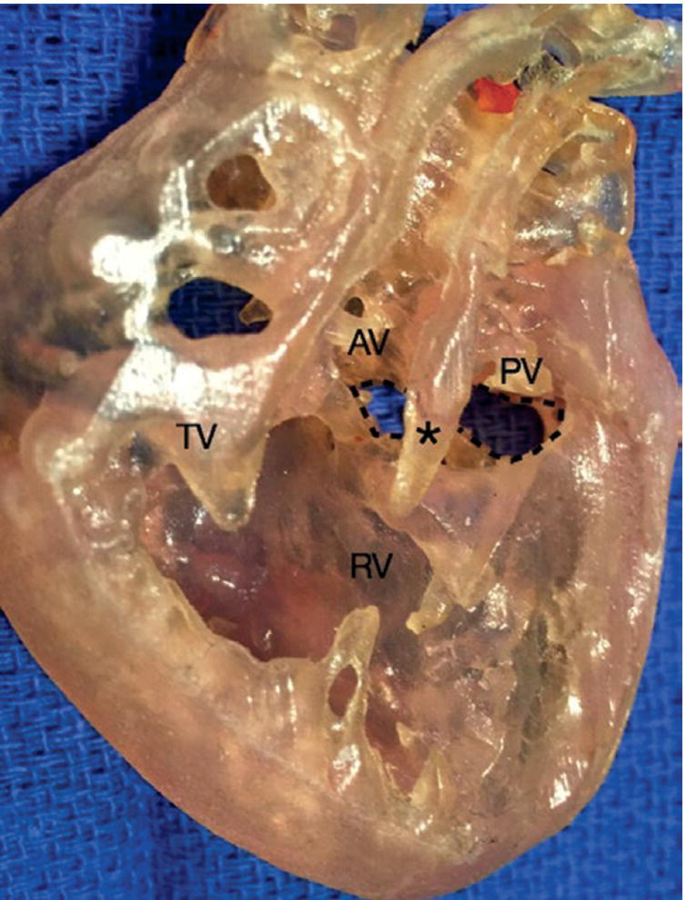

[**Figure 26.15**](#R_c26-fig-0015) A coronal plane three‐dimensional flexible polyjet‐printed model of a heart with the right ventricle free wall removed. This model is from a heart with a double outlet right ventricle and doubly committed ventricular septal defect, which is outlined by the black dashed line.

(Source: Bahtla et al. \[134\]. Reproduced with permission of John Wiley & Sons.)

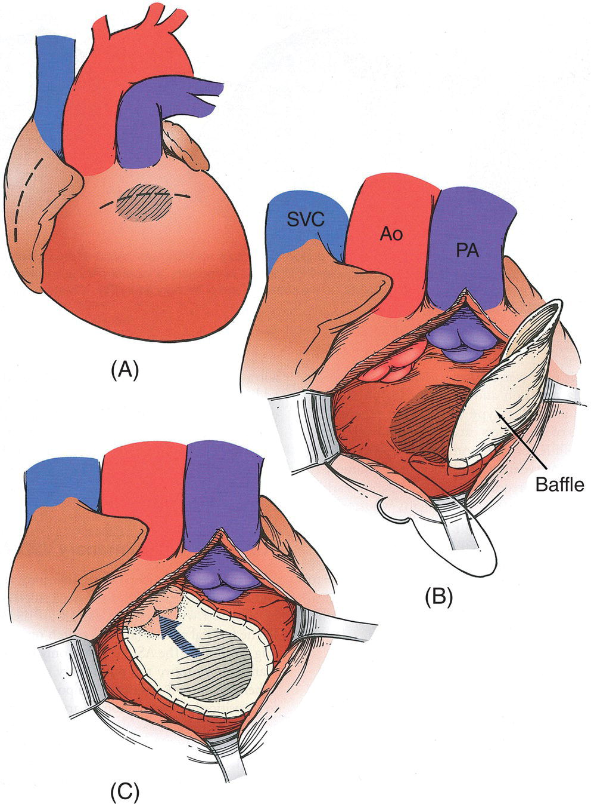

[**Figure 26.16**](#R_c26-fig-0016) Surgical repair of double outlet right ventricle without pulmonary stenosis. (A) The approach can be either by right atriotomy or ventriculotomy (dashed lines). (B and C) A baffle is used to close the ventricular septal defect and direct blood from the left ventricle to the aorta without obstructing flow from the right ventricle to the pulmonary artery.

(Source: Ungerleider et al. \[125\]. Reproduced with permission of Elsevier.)

The overall early mortality for the repair of DORV is approximately 9% \[126, 127, 132\]. Ten‐year survival is 81–86% \[126, 127\]. Significant risk factors for early mortality include congenital mitral valve anomalies, side‐by‐side great arteries, multiple VSDs, and age at operation _<_1 month \[126–130\]. Among patients with complex anatomy, Fontan palliation may be the procedure of choice as it has been associated with lower early mortality in this group compared to biventricular repair \[126\].

### Anesthetic considerations

Anesthetic management varies greatly depending on the specific type of DORV and associated anomalies. Management of palliative procedures, such as the modified Blalock–Taussig shunt, is reviewed in [Chapter 28](c28.xhtml). Patients with pulmonary stenosis who present with physiology similar to tetralogy of Fallot should be managed to minimize right‐to‐left shunting (see [Chapter 28](c28.xhtml)). Patients with subpulmonary VSD without pulmonary stenosis who have physiology similar to TGA should be managed as such (see [Chapter 29](c29.xhtml)). Subaortic and noncommitted VSDs without pulmonary stenosis produce physiology similar to that of a VSD and should be managed as described earlier in this chapter. Patients with complex DORV and other associated anomalies that proceed through the single ventricle staged palliation to the Fontan procedure are reviewed in [Chapter 30](c30.xhtml). In all patients with DORV, regardless of specific anatomy, intracardiac shunting must be balanced with manipulation of PVR and SVR to optimize systemic cardiac output and oxygen delivery.

Arrhythmias are common, especially with repairs involving baffling and enlargement of the VSD. Ventricular tachyarrhythmias and complete heart block can occur in as many as 9% of patients postoperatively and may require permanent pacing \[123, 126, 127\]. Frequently, repair of DORV is complex and requires periods of circulatory arrest. Patients may have residual VSDs, valvar insufficiency, outflow tract obstruction, or ventricular dysfunction. Postoperative TEE and left atrial pressure monitoring are helpful in determining the diagnosis and guiding management.

* * *

### KEY POINTS: DOUBLE OUTLET RIGHT VENTRICLE

-   The four anatomic sub‐types of DORV depend on the location of the VSD: subaortic, subpulmonary, doubly committed, and noncommitted
-   DORV with a doubly committed or noncommitted VSD is managed as a VSD
-   DORV associated with pulmonary stenosis is managed similarly to tetralogy of Fallot
-   DORV with subpulmonary VSD without pulmonary stenosis is managed similarly to transposition of the great vessels
-   Some patients require single ventricle staging to a Fontan
-   Postoperative arrhythmias are common
-   Inotropic support is often needed, especially after long bypass intervals

* * *

## Truncus arteriosus

### Incidence

Truncus arteriosus is an uncommon congenital heart defect representing less than 3% of all congenital heart defects \[137–139\]. Deletion of chromosome 22q11 is present in approximately 11–35% of patients with truncus arteriosus, and this chromosomal abnormality is associated with DiGeorge and velocardiofacial syndromes. Patients with these syndromes also have noncardiac anomalies such as aplasia or hypoplasia of the thymus and/or parathyroid glands, which can lead to T‐cell deficiency and/or hypocalcemia. Patients may also have palatal abnormalities, speech and learning disabilities, neuropsychological disorders, and craniofacial dysmorphia \[140–142\]. As many as 77% of patients with 22q11 deletion are immunocompromised \[142\].

### Anatomy

Truncus arteriosus is defined by the presence of a single great artery arising from the base of the heart that supplies the coronary, pulmonary, and systemic circulations. Embryologically, this defect results from the failure of the truncus arteriosus to divide into the aorta and pulmonary artery.

Truncus arteriosus has historically been classified by two main systems. The first and most widely used classification system was described by Collett and Edwards in 1949 and the second by Van Praagh and Van Praagh in 1965 \[143, 144\]. The Collett and Edwards classification is based on the embryologic arrested development of the pulmonary arteries from the sixth aortic arches and is categorized into four different subtypes. For the purpose of this chapter, the Collett and Edwards system will be used ([Figure 26.17](#c26-fig-0017)) \[143, 144\].

#### Type I truncus arteriosus

Type I truncus arteriosus accounts for 70% of truncus arteriosus lesions. It is defined by the origin of the main pulmonary artery from the truncus dividing into left and right pulmonary arteries.

#### Type II truncus arteriosus

Type II truncus arteriosus accounts for 30% and is defined by the separate origin of the left and right pulmonary arteries from the posterior surface of the truncus, with the branch pulmonary arteries arising very close to one another.

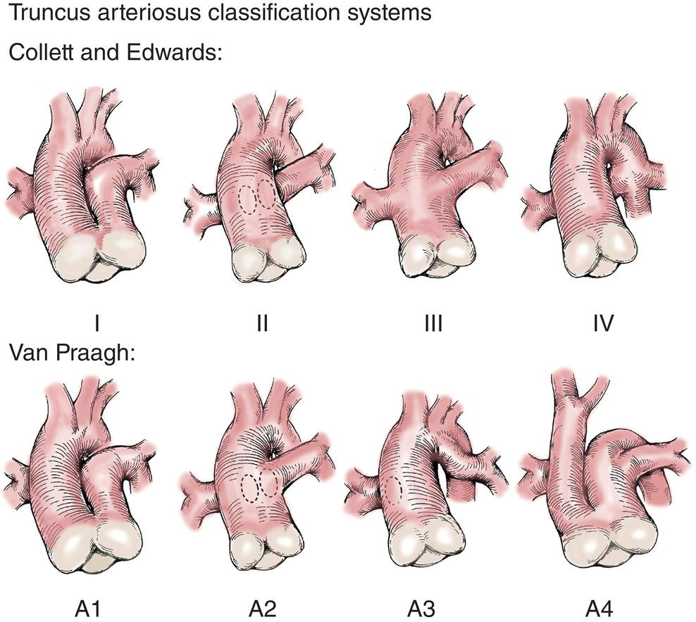

[**Figure 26.17**](#R_c26-fig-0017) Major classification systems for truncus arteriosus. The “A” in the Van Praagh system indicates the presence of a ventricular septal defect (rare cases of the intact ventricular septum are designated with a “B”). The Collett and Edwards system is used for the purposes of this chapter.

(Source: Jacobs et al. \[104\]. Reproduced with permission of Elsevier.)

#### Type III truncus arteriosus

Type III truncus arteriosus is also characterized by separate origin of the left and right pulmonary arteries, but in this case, the arteries arise from the lateral aspects of the truncus and are widely separated. This type accounts for approximately 1% of cases.

#### Type IV truncus arteriosus

Type IV is included for historical purposes but has been rejected as a true form of truncus arteriosus. It is now defined as a form of pulmonary atresia and VSD and is sometimes called “pseudotruncus.” There is a complete absence of the pulmonary arteries in this defect, with bronchial and collateral arteries of the descending aorta providing the blood supply to the lungs.

Truncus arteriosus is most commonly associated with a VSD but can occur with an intact ventricular septum. The truncal valve may be dysplastic and may have an abnormal number of leaflets, varying between two and six \[144\]. Truncal valve insufficiency is estimated to occur in 25–50% of patients; varying degrees of truncal valve stenosis may also occur \[144\]. Anomalies of the coronary arteries may also exist. Additionally, truncus arteriosus is associated with other cardiac anomalies such as aortic arch obstruction, ASDs (62%), right aortic arch (21–36%), aortic arch interruption (11–19%), PDA (18%), aberrant subclavian artery (4–10%), absence of one pulmonary artery (10%), and persistent left SVC (4–9%) \[137, 139\].

### Natural history

If left untreated, the early CHF and increased pulmonary blood flow associated with truncus arteriosus lead to the rapid development of pulmonary vascular occlusive disease in infancy. Patients without surgical treatment have a 74–100% mortality in the first year of life \[133, 136, 137\]. Surgical repair in patients older than 2 years is contraindicated when pulmonary vascular resistance (PVR) is greater than eight Wood units or when Eisenmenger syndrome is present \[137\].

### Pathophysiology

Truncus arteriosus by definition has a common arterial trunk that provides blood flow to the coronary, pulmonary, and systemic arteries. As PVR falls in the early neonatal period, pulmonary blood flow progressively increases and results in CHF. A variable degree of mixing of the systemic and pulmonary venous blood occurs at the ventricular level through the VSD. The large runoff provided by the pulmonary arteries results in low diastolic pressures, which may be worsened by the presence of truncal valve insufficiency. Low diastolic pressures in the face of increased myocardial work and increased ventricular pressures place the patient at risk of developing myocardial ischemia from coronary steal.

### Surgical and transcatheter approaches and outcomes

Definitive surgical repair is usually recommended in the neonatal period, although some centers time surgery on an individual basis, performing repair between 2 and 3 months of age \[137–139, 145\]. Early repair is indicated due to the rapid development of pulmonary hypertension and high mortality rate in patients in the first year of life if left untreated. Palliative surgery involving pulmonary artery banding has largely been abandoned except for those very few patients who are not suitable candidates for definitive repair \[139\]. Definitive surgical repair involves removal of the pulmonary arteries from the truncal root and closing the resulting defect either primarily or with a patch. The VSD is usually closed with a patch via a transatrial or transventricular approach. A right ventricle to pulmonary artery connection is provided by a valved homograft ([Figure 26.18](#c26-fig-0018)) \[146\]. Though direct anastomosis of the pulmonary artery with the right ventricle has been described, it may distort the pulmonary arterial architecture \[147\]. If high right ventricular pressures are anticipated, a small ASD may be created as a “pop‐off” for right‐to‐left shunting in order to improve cardiac output at the expense of arterial oxygen saturation \[137, 138, 145, 148\]. This ASD creation can be closed at a later date by a transcatheter technique in the cardiac catheterization laboratory. Moderate to severe truncal valve regurgitation is repaired by valvuloplasty, “double‐homograft” technique with coronary reimplantation, or mechanical valve implantation \[137, 149, 150\]. Valve repair has been successful even in neonates and avoids or delays serial truncal valve replacements \[150\]. Over time, the right ventricular to pulmonary artery conduit may become stenotic and/or regurgitant. This may necessitate repair or replacement either surgically or via percutaneous techniques using a transcatheter pulmonary valve \[151\]. Much of the long‐term pathophysiology after repair of truncus arteriosus is related to truncal valve dysfunction, particularly insufficiency. This contributes to the diminished physical health status of many of these patients in the second decade of life and beyond and may influence anesthetic management for later cardiac or non‐cardiac surgery \[152\]. Early mortality after repair of truncus arteriosus is 5–18% \[137, 138, 145, 148\], and mortality rates are higher in infants who weigh less than 3 kg or have other cardiac anomalies \[138, 148, 153\].

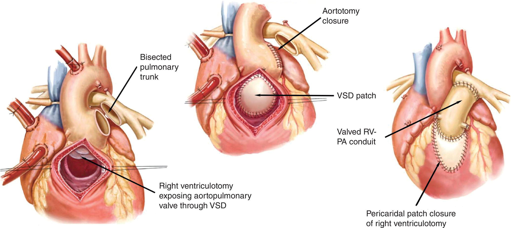

[**Figure 26.18**](#R_c26-fig-0018) Surgical repair of a type I truncus arteriosus. A right ventriculotomy allows patching of the ventricular septal defect and placement of a valved conduit from the right ventricle to the bisected pulmonary artery trunk.

(Source: Conti et al. \[47\]. Reproduced with permission of Elsevier.)

### Anesthetic considerations

Anesthetic management is dependent on the patient's anatomy and age at presentation. Depending on the severity of CHF, the patient may require preoperative inotropic support, and the induction of anesthesia should be accomplished with drugs that maintain SVR and preserve myocardial function. Ketamine or etomidate, often combined with fentanyl and/or midazolam, may be used to safely attain this goal. If an inhalational induction with sevoflurane is chosen, it should be performed with careful titration and extreme caution. Muscle relaxation may be achieved with any choice of a non‐depolarizing neuromuscular blocking agent. Maintenance of anesthesia often includes high‐dose fentanyl. Efforts to balance PVR and SVR to make the ratio of Qp : Qs approach 1 : 1 are essential. Care must be taken to avoid hyperventilation and excessive oxygenation, which lower PVR and may exacerbate pulmonary overcirculation and decrease diastolic blood pressure. Patients with truncal valve insufficiency combined with excessive pulmonary blood runoff will be particularly susceptible to myocardial ischemia, and it may be necessary for the surgeon to temporarily place a vessel snare around the pulmonary artery to limit pulmonary blood flow and increase diastolic blood pressure in the prebypass period. Occasionally this myocardial ischemia is heralded by ventricular fibrillation prior to bypass, and the anesthetic and surgical teams must be alert to this possibility and be prepared to intervene with external or internal defibrillation, open or closed cardiac massage, or emergent institution of bypass. Preoperative placement of external adhesive defibrillator pads is advisable. Those patients presenting late in infancy who have developed significant pulmonary hypertension from long‐standing pulmonary overcirculation may require increased FiO2 to maintain oxygen saturations between 80 and 90%. Unless ruled out by a chromosomal evaluation, patients with truncus arteriosus should be assumed to have DiGeorge syndrome and given irradiated blood products due to the high incidence of associated T‐cell deficiencies. An absent or hypoplastic thymus is often evident upon sternotomy. Upon weaning from CPB, most patients require inotropic support, afterload reduction, ventricular volume assessment, and efforts to minimize pulmonary arterial pressures in order to improve right heart function.

Pulmonary hypertension is commonly present after cardiopulmonary bypass. These patients have signs of right heart failure with high central venous pressures, desaturation, tachycardia, hypotension, acidosis, and oliguria. Management includes hyperventilation, 100% oxygen, correction of acidosis, and inhaled nitric oxide as needed. These patients are usually kept heavily sedated for at least 24 hours postoperatively to minimize early pulmonary hypertensive crises. Signs similar to right ventricular dysfunction may also occur from residual VSDs or truncal valve stenosis or regurgitation. VSD closure or right ventricular incision may produce complete right bundle branch block, complete heart block (3–5%), junctional ectopic tachycardia, atrial tachycardias, or atrioventricular block in the postoperative period \[82\]. After bypass, many patients benefit from calcium infusions because of the hypocalcemia associated with DiGeorge syndrome and citrate binding of ionized calcium from the administration of blood products.

* * *

### KEY POINTS: TRUNCUS ARTERIOSUS

-   TA is associated with DiGeorge and velocardiofacial syndromes.
-   Subtypes are defined by the relationship of the pulmonary arteries to the truncus.
-   The presence of DiGeorge syndrome may necessitate calcium infusions and irradiated blood products.
-   Pulmonary overcirculation requires maintenance of PVR pre‐bypass and pulmonary hypertension precautions post‐bypass.
-   Myocardial ischemia may occur due to coronary steal as PVR decreases in the first weeks of life.
-   Inotropic support is often necessary perioperatively.

* * *

## Partial and total anomalous pulmonary venous return

### Incidence

Both partial anomalous pulmonary venous return (PAPVR) and total anomalous pulmonary venous return (TAPVR) are rare cardiac lesions. Since PAPVR is often asymptomatic, its true incidence is unclear, but it has been reported as an incidental finding on autopsy in approximately 0.6% of the general population \[154\]. TAPVR represents less than 5% of congenital heart lesions \[155–157\].

Both PAPVR and TAPVR can be associated with other cardiac lesions. PAPVR is most commonly associated with sinus venosus type ASDs. Congenital mitral stenosis, DORV, VSD, tetralogy of Fallot, coarctation of the aorta, and PDA have all been described with PAPVR \[156\]. Nearly 33% of patients with TAPVR have other cardiac anomalies, such as CAVC, hypoplastic left heart syndrome or other single ventricle lesions, PDA, and transposition of the great arteries. Abnormalities of the atrial and visceral situs with heterotaxy syndrome, asplenia, and polysplenia are also common among patients with TAPVR \[156\]. Scimitar syndrome consists of either partial or complete anomalous drainage of the right pulmonary veins to the IVC, dextrocardia, and hypoplasia of the right lung. In these patients, the descending vertical vein resembles a scimitar, or Turkish sword, on a frontal chest radiograph \[156\].

### Anatomy

Partial anomalous pulmonary venous return (PAPVR) is an anomaly in which some, but not all, of the pulmonary veins, connect to the right atrium or to one or more of its venous tributaries. In TAPVR, all of the pulmonary veins connect anomalously to the right atrium. Although these lesions are sometimes referred to as anomalous pulmonary venous _connections_, the use of the term _return_ recognizes the fact that the pulmonary veins may be connected normally to the left atrium, but have an ASD anatomically configured to cause an abnormal return to the right atrium \[154\]. In either case, the pathophysiology is that of a left‐to‐right shunt.

The stage in embryologic development during which errors occur determines the various anatomic subtypes of abnormal pulmonary venous return. At 27–30 days of gestation, the pulmonary veins are derived from the splanchnic plexus that communicates with the cardinal and umbilicovitelline system of veins. Anomalous drainage to the left common cardinal system results in pulmonary venous connections to the coronary sinus or left innominate vein. Drainage to the right common cardinal system results in pulmonary venous connections to the SVC and/or the azygous vein. Drainage to the umbilicovitelline system results in pulmonary venous connection to the portal vein, ductus venous, or IVC. Early atresia of the common pulmonary vein, while primitive pulmonary–systemic venous connections are still present, results in TAPVR. If only the right or left portion of the common pulmonary vein becomes atretic, the persistence of the primitive pulmonary venous–systemic venous connection on that side leads to PAPVR \[156\].

#### Partial anomalous pulmonary venous return

Multiple types of PAPVR exist. The most common is the connection of the right pulmonary veins to the right SVC or right atrium which represents approximately 74% of patients. The next most common type is the connection of the right pulmonary veins to the IVC. The least common type is the connection of the left pulmonary veins to the left innominate vein or to the coronary sinus \[156\].

#### Total anomalous pulmonary venous return

Four different types of TAPVR exist based on the location of the anomalous connection: supracardiac, cardiac, infracardiac, and mixed ([Figure 26.19](#c26-fig-0019)) \[158, 159\]. A “stretched PFO” (70–80%) or true ASD (20–30%) is usually present in TAPVR.

#### Supracardiac TAPVR

Supracardiac connection comprises approximately 55% of cases of TAPVR. In this type, pulmonary venous drainage is to the SVC. In the most common form of this lesion, the two pulmonary veins from each lung converge posteriorly to the left atrium. A vertical vein then arises from the left side of the confluence and usually passes anterior to the left pulmonary artery and the left mainstem bronchus to drain into the left innominate vein, which then drains to the SVC. Pulmonary venous obstruction is unusual but may occur as a result of either intrinsic narrowing or extrinsic compression of the vertical vein. Although anomalous connection can occur to the SVC via a right‐sided vertical vein, this is much less common \[156\]. A stretched PFO or ASD is present to allow left heart filling; although this constitutes a right‐to‐left shunt, cyanosis is often mild due to the greater degree of left‐to‐right shunting.

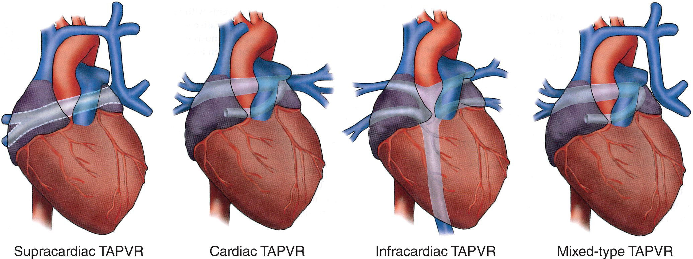

[**Figure 26.19**](#R_c26-fig-0019) Four major subtypes of total anomalous pulmonary venous return (TAPVR) (see text for further explanation).

(Source: Yuh et al. \[158\]. Reproduced with permission of McGraw Hill.)

#### Cardiac TAPVR

The cardiac type of TAPVR accounts for approximately 30% of cases. The pulmonary veins in this type drain into the coronary sinus or right atrium. Obstruction to the pulmonary veins was reported in 22% of patients in a series of TAPVR to the coronary sinus \[160\]. The coronary sinus is often “unroofed” prior to its drainage into the right atrium, allowing some pulmonary venous drainage into the left atrium; an ASD is usually present.

#### Infracardiac TAPVR

Infracardiac TAPVR comprises approximately 13% of cases and is commonly referred to as infradiaphragmatic TAPVR \[156\]. This type of connection usually involves a confluence of pulmonary veins from both lungs posterior to the left atrium. A descending vein then courses anterior to the esophagus through the diaphragm at the esophageal hiatus \[161\]. In 70–80% of patients, the descending vein then joins the portal venous system at either the splenic or the confluence of the splenic and superior mesenteric veins \[161\]. Nearly all patients with infracardiac TAPVR have obstructed pulmonary veins. This obstruction, which may be either intrinsic or extrinsic, can occur at any location along the pulmonary venous pathway. A stretched PFO or ASD is present in essentially all of these patients.

#### Mixed TAPVR

Mixed type TAPVR makes up approximately 2% of cases. This type of TAPVR consists of anomalous connections at two or more levels. The most common connection involves the left pulmonary veins draining into the left innominate vein and the right pulmonary veins draining to the right atrium or the coronary sinus \[156\]. Pulmonary venous obstruction has also been observed in these types of connections. A stretched PFO or ASD is usually present in this lesion.

### Natural history and pathophysiology

### Partial anomalous pulmonary venous return

PAPVR results in a variable amount of left‐to‐right shunting that depends on several factors: the number of anomalously draining veins as a percentage of the total pulmonary venous return, the pulmonary lobes or segments from which the anomalous veins originate, the relative resistances of the normally and anomalously drained pulmonary vascular beds, and the compliance of the receiving chambers. The left‐to‐right shunt leads to increased pulmonary blood flow and enlargement of the right atrium and ventricle as well as dilation of the pulmonary artery \[156\]. Most patients with an isolated single vein PAPVR and intact atrial septum are asymptomatic and have a normal life expectancy even if left untreated. Those patients with greater than 50% of the pulmonary veins draining anomalously or those with an associated ASD usually remain relatively asymptomatic until the third to fourth decades of life, when progressive symptoms of dyspnea, recurrent bronchitis, hemoptysis, chest pain, and palpitations with supraventricular arrhythmias can occur. These patients may also present with right heart failure or with pulmonary hypertension and cor pulmonale \[156\].

### Total anomalous pulmonary venous return

The natural history and pathophysiology of TAPVR depend largely on whether or not pulmonary venous return is obstructed. In the presence of obstructed pulmonary veins, pulmonary venous hypertension exists with associated pulmonary edema. It is commonly confused with intrinsic lung disease when a chest radiograph reveals bilateral infiltrates in the absence of cardiomegaly. Occasionally neonates with hypoxemic respiratory failure placed on extracorporeal membrane oxygenation are subsequently diagnosed with obstructed TAPVR. Pulmonary arteriolar vasoconstriction occurs as a compensatory mechanism to minimize pulmonary edema. As PVR increases, the right ventricular systolic and end‐diastolic pressures increase resulting in increased right atrial pressure and right‐to‐left shunting at the atrial level. Progressive systemic hypoxemia ensues with metabolic acidosis and multisystem organ failure. Left untreated, death occurs in the first few months of life \[156\].

In unobstructed TAPVR, the left‐to‐right shunt of pulmonary venous blood results in right atrial and ventricular enlargement with pulmonary overcirculation and subsequent right heart failure. The presence or absence of restrictive interatrial communication is another major determinant in the pathophysiology of TAPVR; 70–80% of infants have only a PFO, which restricts filling of the left atrium and ventricle. This causes tremendous pulmonary overcirculation, right‐sided dilation, and minimal left‐sided filling, which results in decreased size of the left atrium and ventricle. The abnormal displacement of the interventricular septum along with chronic underfilling of the left ventricle leads to decreased systemic cardiac output. Symptomatic CHF usually develops in the second month of life and may be partially or totally relieved by transvenous balloon atrial septostomy. Patients with a non‐restrictive interatrial communication, generally consisting of a secundum type ASD, have a large left‐to‐right shunt with increased pulmonary blood flow, but if left untreated may not develop signs of right heart failure or pulmonary hypertension until the third or fourth decade of life \[156, 162\].

### Surgical approaches and outcomes

The timing of surgical repair of PAPVR is dependent in part on symptomatology. Patients with a single anomalous pulmonary vein with an intact atrial septum may never require surgical treatment. Surgical therapy is generally reserved for those patients with (i) hemodynamically significant left‐to‐right shunting with Qp : Qs greater than 2 : 1; (ii) patients with recurrent pulmonary infections, especially those associated with Scimitar syndrome; (iii) patients having surgical repair of other major cardiac lesions; and (iv) patients with anomalous connections which affect surrounding structures by compression or obstruction \[156\]. Surgical technique for repair of PAPVR varies depending on the specific anatomy present. The repair can consist of a direct anastomosis of the anomalous veins to the left atrium, or more commonly an indirect communication may be developed utilizing a patch to baffle the anomalous veins to the left atrium while closing the ASD with the same patch. In configurations where the SVC is at risk for obstruction, it may be transected above the anomalous pulmonary veins and translocated to the right atrial appendage (Warden procedure). In cases of PAPVR in which there is a dual connection to the right and left atrium, which often presents as a connection to the right atrium via a vertical vein and to the left atrium as a “dormant” pulmonary vein, the anomalous connection (e.g. vertical vein) can be occluded via transcatheter techniques \[163\].

Obstructed TAPVR should be corrected emergently at the time of diagnosis \[164\]. Patients with unobstructed TAPVR with restrictive interatrial communications are urgently palliated with blade and/or balloon atrial septostomies. These patients (and those with unobstructed TAPVR and non‐restrictive interatrial communications) can be medically managed for elective surgical repair, usually in the first year of life.

Techniques for surgical repair of TAPVR depend on the specific anatomy involved. In some cases, a period of deep hypothermic circulatory arrest may be necessary. Surgical repair generally includes incision and enlargement of the anomalous pulmonary venous confluence and direct anastomosis with the left atrium \[165\]. Occasionally, a patch is needed to baffle the veins to the left atrium, particularly with cardiac‐type defects with drainage to the coronary sinus. So‐called “sutureless” techniques are intended to reduce the risk of acquired pulmonary vein stenosis by using marsupialization of pericardium or pleura to create the atrial anastomosis \[166, 167\]. Examples of surgical techniques employed based on TAPVR type are illustrated in [Figure 26.20](#c26-fig-0020) \[168\].

Operative mortality for the repair of asymptomatic PAPVR approaches zero \[169\], and in older symptomatic patients has been reported as less than 6% \[170\]. Operative mortality for patients with TAPVR is somewhat higher, between 7 and 9% \[171–173\]. Risk factors for operative mortality in TAPVR include heterotaxy syndrome and single ventricle \[171, 174\].

### Anesthetic considerations

Intraoperative considerations for patients with PAPVR are similar to the management of ASD. Minimizing pulmonary blood flow by control of ventilation and consideration for early extubation following repair should be the primary goals.

The prebypass management of the patient with obstructed TAPVR generally includes maximizing PaO2 with ventilatory support which may include significant levels of positive end‐expiratory pressure (PEEP), inspiratory pressures, and FiO2, avoiding metabolic acidosis, and maintaining hemodynamic stability with the use of inotropic medications as necessary. Pre‐bypass inhaled nitric oxide is contraindicated because the pulmonary arteriolar dilation and increased pulmonary blood flow in the face of a fixed distal anatomic obstruction will worsen pulmonary mechanics and often paradoxically worsen hypoxemia. TEE should be employed with caution due to the risk of further compression and obstruction to pulmonary veins even in the presence of nonobstructed TAPVR. Perioperative monitoring of central venous, left atrial, and pulmonary arterial pressures is helpful.

After bypass, inhaled nitric oxide should be used empirically in the case of obstructed TAPVR and should be readily available in unobstructed TAPVR. Perioperative pulmonary hypertension occurs in as many as 50% of patients and is a major risk factor for early mortality \[175, 176\]. Pulmonary hypertensive crises may be avoided by employing hyperventilation, use of 100% oxygen, systemic alkalinization, sedation, paralysis, and inhaled nitric oxide. Sildenafil, magnesium sulfate, and prostaglandin E1 have been used in some patients to treat severe pulmonary hypertension \[177\]. Paradoxical pulmonary hypertension with systemic hypotension has been reported from the postoperative use of inhaled nitric oxide in patients with preoperative atrial obstruction and a poorly compliant and dysfunctional left ventricle. This paradoxical pulmonary hypertension is thought to be due to acute increases in pulmonary blood flow and resultant excessive preload to the noncompliant left side \[178\].

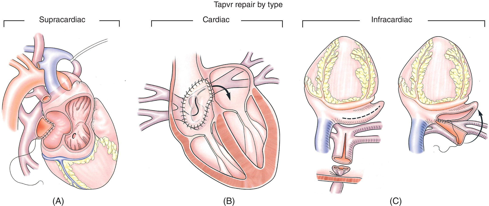

[**Figure 26.20**](#R_c26-fig-0020) Examples of surgical techniques for the repair of total anomalous pulmonary venous return (TAPVR). (A) Supracardiac TAPVR: a transverse right atriotomy is extended across the atrial septum at the level of the atrial septal defect (ASD) and through the posterior aspect of the left atrium. The common pulmonary vein is anastomosed to the posterior wall of the left atrium and the supracardiac connection is ligated. The ASD and right atriotomy are then closed. (B) Cardiac TAPVR: The ASD is enlarged, with unroofing of the coronary sinus into the left atrium. An ASD patch is then used to channel pulmonary venous return to the left atrium. (C) Infracardiac TAPVR: With the heart rotated superiorly, the vertical vein is ligated at the level of the diaphragm. The common pulmonary vein and the posterior wall of the left atrium are incised and anastomosed. The ASD may be closed through an atriotomy.

(Source: Gardner and Spray \[168\]. Reproduced with permission of Taylor & Francis.)

Pulmonary function may be compromised after bypass as a result of two pulmonary insults: (i) preoperative pulmonary edema secondary to pulmonary venous obstruction and (ii) the inflammatory response from cardiopulmonary bypass. Pulmonary compliance is decreased, and a large arterial‐to‐alveolar gradient develops. Pulmonary gas distribution may be optimized with the use of pressure control ventilation and altering PEEP to improve lung compliance.

Following repair, left atrial filling pressures may be elevated due to the small size and low compliance of the left atrium and ventricle. Accepting low blood pressures while weaning from CPB will help avoid overdistending the “unprepared” left side. Pulmonary artery pressures are frequently equal to or sometimes exceed, systemic pressures immediately after weaning from bypass. If the right ventricle is functioning adequately, this situation is often well tolerated for short periods as the PVR decreases in the first hour after bypass. Careful fluid management, optimization of heart rate and rhythm, and inotropic support will improve cardiac output. Temporary cardiac pacing may also be helpful. Perioperative dysrhythmias, especially supraventricular tachycardias, occur in as many as 20% of patients. If tolerated, an inovasodilator like milrinone will decrease left ventricular work and improve cardiac output. It is important to recognize that the Frank‐Starling curve is very flat in the small, noncompliant LV, and administration of even small amounts of fluid may cause the left ventricle to become overdistended and fail.

* * *

### KEY POINTS: PAPVR AND TAPVR

-   PAPVR is often asymptomatic but may be associated with heart failure.
-   PAPVR is managed similar to an ASD.
-   TAPVR exists in four subtypes based on the anomalous connection: supracardiac, cardiac, infracardiac, and mixed.
-   The pathophysiology of TAPVR is dependent on the presence and degree of pulmonary venous obstruction and the size of the interatrial communication.
-   Obstructed TAPVR patients are particularly cyanotic and require 100% oxygen and significant ventilatory support pre bypass; inhaled nitric oxide (iNO) should be avoided.
-   All TAPVR patients are at risk for post‐bypass pulmonary hypertension, especially obstructed patients, and iNO should be available.
-   TEE may cause or worsen the pulmonary venous obstruction.
-   The chronically underfilled left ventricle may respond poorly to overloading after repair.

* * *

## Selected references

_A full reference list for this chapter is available at:_

[http://www.wiley.com/go/andropoulos/congenitalheart](http://www.wiley.com/go/andropoulos/congenitalheart)

1.  5 Zuppa AF, Nicolson SC, Wilder NS, et al. Results of a phase I multicenter investigation of dexmedetomidine bolus and infusion in corrective infant cardiac surgery. Br J Anaesth 2019; 123:839–52. Dexmedetomine shows promise with regard to neurologic outcomes following heart surgery in children. This study sought to establish the safety and pharmacokinetics of dexmedetomidine in neonates and infants undergoing heart surgery, including VSD repair. The authors found a low incidence of adverse events and validated a PK model of value in determining appropriate dosing.
2.  22 Galexczka M, Szkutnik M, Bialkowski J, et al. Transcatheter patent ductus arteriosus closure: what have we learned after over 25 years? A single‐center experience with 1036 patients. Kardiol Pol 2021; 79:787–93. This report details the experience with a large cohort of patients undergoing transcatheter closure of PDA at a single institution. Outcomes are reported, and the observed major complication rate was 0.2%. Longitudinal follow‐up showed superior results with duct occluders compared to other devices, with 100% complete closure after 1 year.
3.  33 Backer CL, Mavroudis C. Surgical management of aortopulmonary window: a 40‐year experience. Eur J Cardiothorac Surg 2002; 21:773–9. The authors present their long‐term experience in the surgical management of patients with APW. Repair techniques and outcomes are presented for 22 patients with various types of APW. A summary of experience at other institutions, including overall mortality among a total of 142 patients, is included.
4.  45 Jensen B, Spicer DE, Sheppard MN, et al. Development of the atrial septum in relation to postnatal anatomy and interatrial communications. Heart 2017; 103:456–62. This review article details the embryologic development of the atrial septum and seeks to dispel common misunderstandings about the septum secundum in particular. Included are details about the etiology of different ASD types and speculation about the reasons behind the differences in atrial septal development among vertebrates.
5.  66 Laussen PC, Reid RW, Stene RA, et al. Tracheal extubation of children in the operating room after atrial septal defect repair as part of a clinical practice guideline. Anesth Analg 1996; 82:988–93. This report on the safety and cost efficacy of surgical ASD repair compares three cohorts of patients from before and after the implementation of a clinical practice guideline on early extubation. Extubation in the operating room was associated with lower overall hospital charges but similar clinical outcomes. This early study has been corroborated in the more recent era (see Peterson et al. \[62\]).
6.  76 Penny DJ, Vick GW. Ventricular septal defect. Lancet 2011; 377:1103–12. The authors of this review article detail the anatomy, pathophysiology, diagnosis, and medical and surgical management of patients with VSDs.
7.  110 Fudge JC, Li S, Jaggers J, et al. Congenital heart surgery outcomes in syndrome: analysis of a national clinical database. Pediatrics 2010; 126:315–22. This study utilizes the Society of Thoracic Surgery Congenital Heart Surgery Database to retrospectively analyze a large cohort of patients with (_n_ = 4,350) and without (_n_ = 41,229) Down syndrome undergoing surgical repair of various heart defects, including AVC. There were no statistically significant differences in in‐hospital mortality between groups. For AVC repair, there was a non‐statistically significant trend toward decreased in‐hospital mortality among Down syndrome patients compared with those without Down syndrome.
8.  126 Kleinert S, Sano T, Weintraub RG, et al. Anatomic features and surgical strategies in double‐outlet right ventricle. Circulation 1997; 96:1233–19. This report provides a detailed summary of the anatomical features and subtypes of DORV. Long‐term experience with surgical repair, including techniques and outcomes, is presented.
9.  152 O'Byrne ML, Mercer‐Rosa L, Zhao H, et al. Morbidity in children and adolescents after surgical correction of truncus arteriosus communis. Am Heart J 2013; 166: 512–8. This study of truncus arteriosus patients in the child and adolescent age range found that morbidity, including hospitalization, cardiac reintervention, and non‐cardiac operations, was highest in the first year of life. The authors also present evidence that comorbidities persist late after repair. These include truncal valve insufficiency and decreased indices of exercise tolerance (although mean right ventricular ejection fraction and end‐diastolic volume were normal in this cohort).
10.  173 Shi G, Zhu F, Wen C, et al. Single‐institution outcomes of surgical repair of infracardiac total anomalous pulmonary venous connection. J Thor Cardiovasc Surg 2021; 161:1408–17. This study considers the particularly at‐risk subtype of infracardiac TAPVR, which is historically associated with high rates of post‐repair pulmonary vein stenosis (PVS). The authors report their experience with 82 consecutive patients undergoing repair for this lesion. They found that the “sutureless” technique is associated with a lower risk of post‐repair PVS compared to a conventional technique. Overall mortality was less than 10%, with a non‐statistically significant trend toward lower mortality in the sutureless technique group.