CHAPTER 27 Anesthesia for Left–sided Obstructive Lesions 

# CHAPTER 27  
Anesthesia for Left–sided Obstructive Lesions

_James P. Spaeth1 and Andreas W. Loepke2_

1 Division of Cardiac Anesthesia, Cincinnati Children’s Hospital Medical Center, Cincinnati, OH, USA

2 Cardiac Anesthesiology, Children’s Hospital of Philadelphia, Philadelphia, PA, USA

* * *

-   [**Introduction**](#head-2-272)
-   [**Aortic valve stenosis**](#head-2-273)
    -   [Incidence, anatomy, and natural history](#head-3-441)
    -   [Pathophysiology](#head-3-442)
    -   [Surgical and transcatheter approaches and outcomes](#head-3-443)
    -   [Anesthetic considerations](#head-3-444)
-   [**Subvalvular AS**](#head-2-274)
    -   [Incidence, anatomy, and natural history](#head-3-445)
    -   [Pathophysiology](#head-3-446)
    -   [Surgical and transcatheter approaches and outcomes](#head-3-447)
    -   [Anesthetic considerations](#head-3-448)
-   [**Supravalvular AS**](#head-2-275)
    -   [Incidence, anatomy, and natural history](#head-3-449)
    -   [Pathophysiology](#head-3-450)
    -   [Surgical and transcatheter approaches and outcomes](#head-3-451)
    -   [Anesthetic considerations](#head-3-452)
-   [**Hypertrophic cardiomyopathy**](#head-2-276)
    -   [Incidence, anatomy, and natural history](#head-3-453)
    -   [Pathophysiology](#head-3-454)
    -   [Surgical and transcatheter approaches and outcomes](#head-3-455)
    -   [Anesthetic considerations](#head-3-456)
-   [**Coarctation of the aorta**](#head-2-277)
    -   [Incidence, anatomy, and natural history](#head-3-457)
    -   [Pathophysiology](#head-3-458)
    -   [Surgical and transcatheter approaches and outcomes](#head-3-459)
    -   [Anesthetic considerations](#head-3-460)
-   [**Interrupted or hypoplastic aortic arch**](#head-2-278)
    -   [Incidence, anatomy, and natural history](#head-3-461)
    -   [Pathophysiology](#head-3-462)
    -   [Surgical and transcatheter approaches and outcomes](#head-3-463)
    -   [Anesthetic considerations](#head-3-464)
-   [**Shone’s anomaly**](#head-2-279)
    -   [Incidence, anatomy, and natural history](#head-3-465)
    -   [Pathophysiology](#head-3-466)
    -   [Surgical and transcatheter approaches and outcomes](#head-3-467)
-   [**Anesthetic considerations**](#head-2-280)
-   [**Mitral stenosis**](#head-2-281)
    -   [Incidence, anatomy, and natural history](#head-3-468)
    -   [Pathophysiology](#head-3-469)
    -   [Surgical and transcatheter approaches and outcomes](#head-3-470)
    -   [Anesthetic considerations](#head-3-471)
    -   [Cor triatriatum](#head-3-472)
-   [**Selected references**](#head-2-282)

* * *

## Introduction

Left‐sided obstructive lesions of the heart can occur at various anatomic levels and with varying degrees of severity, ranging from a bicuspid aortic valve with minimal hemodynamic compromise to aortic atresia and hypoplastic left heart syndrome (HLHS) with profound hemodynamic derangements. Imbalances in systemic blood flow may occur due to a circumscribed obstruction at a single level, such as in hypertrophic cardiomyopathy; coarctation of the aorta; interrupted aortic arch; and subvalvular, valvular, or supravalvular aortic stenosis, or from obstructions at multiple levels, such as seen in patients with Shone’s complex. Depending on the specific type of left‐sided obstruction, the child may also be at risk for pulmonary hypertension and/or impaired coronary perfusion during anesthetic care. A clear understanding of the level and degree of the obstruction is therefore important for optimal anesthetic management.

## Aortic valve stenosis

### Incidence, anatomy, and natural history

A normal aortic valve has three leaflets and occupies an area of around 2 cm2/m2 of body surface area. Although by some estimates, isolated congenital valvular aortic stenosis occurs in only approximately 2 per 10,000 births \[1\], it is associated with other cardiac lesions in more than 5% of children suffering from congenital heart disease (CHD) and presents with three to four times higher prevalence in males \[2\]. Valvular aortic stenosis may be associated with aortic coarctation and/or hypoplasia of the ascending and transverse arch, due to decreased antegrade blood flow in the fetus, which prevents adequate development of these structures. Aortic stenosis (AS) has been described as part of Hunter’s, Hurler’s, and Turner’s syndromes. Structural variations from the customary tricuspid contour of the aortic valve are common and result in a bicuspid or monocuspid appearance of the valvular apparatus, whose formation starts during weeks 5–7 of embryonic development \[3, 4\]. The diseased valve leaflets are gelatinously or myxomatously malformed, and the commissures are often partially fused, leaving a diminished aortic orifice, which can be located eccentrically. Left ventricular myocardial hypertrophy is commonly observed, but non‐hypertrophied left ventricular dilation has also been reported \[5\]. The age of diagnosis, clinical presentation, treatment modality, and timing of intervention depend not only on the degree of valvular obstruction but also on concomitant cardiac lesions and left ventricular size and function. Only a small minority (approximately 2%) of asymptomatic patients will develop aortic valve dysfunction by adolescence, and progression of the lesion is usually slow \[6, 7\]. Conversely, neonates with ductal‐dependent critical AS may present in shock, requiring aggressive resuscitation and emergent intervention.

### Pathophysiology

The diagnosis is typically made using transthoracic echocardiography (TTE), which provides comprehensive information regarding valve anatomy, annular size, aortic root diameter, and ventricular function ([Table 27.1](#c27-tbl-0001)) \[8, 9\]. Continuous‐wave mean Doppler gradients adequately predict the peak‐to‐peak transvalvular gradient as measured during cardiac catheterization, whereas peak instantaneous Doppler gradients slightly overestimate the transvalvular gradient \[10, 11\]. However, correcting the peak Doppler gradient for pressure recovery, a phenomenon describing the kinetic energy being transformed back to pressure energy as the velocity decreases distal to the stenosis, significantly improves agreement with subsequently measured catheter gradients \[12\]. Depressed left ventricular function, however, can lead to a misleadingly low gradient.

In the most severe form of critical AS, presenting in the neonatal period, systemic blood flow and coronary perfusion can often be dependent on retrograde blood flow via a patent ductus arteriosus (PDA). After spontaneous ductal closure, the affected neonates frequently present with symptoms of significant congestive heart failure, metabolic acidosis, and mitral valve insufficiency, quickly progressing to cardiogenic shock. Aggressive hemodynamic, respiratory, and metabolic resuscitation as well as immediate treatment with prostaglandin E1 are essential to re‐establish adequate systemic perfusion. In infants with a less dramatic presentation, left ventricular stroke volume is often maintained for extended periods of time. Normal ventricular wall tension is maintained by concentric ventricular hypertrophy; however, increased left ventricular systolic and end‐diastolic pressures can result in impaired subendocardial perfusion and ischemia. In severe cases, this malperfusion leads to the replacement of the myocardium with a fibrous tissue, termed endocardial fibroelastosis, further impairing ventricular performance and diminishing survival \[13–15\].

[**Table 27.1**](#R_c27-tbl-0001) Grading of aortic stenosis severity

| Severity | Mild | Moderate | Severe |
| --- | --- | --- | --- |
| Mean echo pressure gradient \[mmHg\] | <20 | 20–40 | \>40 |
| Peak transvalvular velocity _V_max \[m/s\] | 2.0–2.9 | 3.0–3.9 | \>4.0 |
| Indexed aortic valve area \[cm2/m2\] | \>0.85 | 0.60–0.85 | <0.6 |
| Velocity ratio | \>0.50 | 0.25–0.50 | <0.25 |

### Surgical and transcatheter approaches and outcomes

Treatment options and timing for intervention depend on the acuity of the clinical presentation and the concomitant cardiac abnormalities, as valvular aortic stenosis can cover a wide anatomical and pathophysiological spectrum. Patients with mild AS can be followed conservatively, and if aortic valve repairs or replacements are performed, outcomes are generally excellent \[16\], especially if achieved without patches \[17\]. Neonates suffering from critical AS, on the other hand, require immediate intervention. In this population, important consideration is given to the size and adequacy of the left ventricle to tolerate a one‐ or two‐ventricle repair \[18\]. In order to predict a successful outcome with either biventricular or univentricular palliation (the latter is discussed in [Chapter 30](c30.xhtml)) in neonates with critical AS, several scoring systems have been developed ([Table 27.2](#c27-tbl-0002)) \[19\]. Unfortunately, a recent single‐center, retrospective study in 68 neonates did not find any of the binary score cutoffs to be predictive of successful biventricular _vs_. univentricular repair. In particular, the Rhodes and Discriminant scores predicted the need for a univentricular approach in most patients who successfully maintained biventricular circulation after neonatal aortic valve intervention.

[**Table 27.2**](#R_c27-tbl-0002) Predictive scores for successful biventricular repair of critical aortic stenosis

(Source: Sachdeva et al. \[19\]. Reproduced with permission from Cambridge University Press.)

| Scoring System | Formula | Severe |
| --- | --- | --- |
| Rhodes | 14 (BSA + 0.943 (indexed aortic root) + 4.78 (long‐axis ratio) + 0.157 (indexed mitral valve area) − 12.03 | ≥0.35 |
| CHSS 1 | 30.55 (inverse of age at study entry \[d\]–1) − 6.20 (aortic root z‐score) − 12.14 (echocardiographic grade of EFE) − 23.33 (logarithm of ascending aortic \[mm\]) − 28.30 (presence of moderate or severe tricuspid regurgitation) − 0.70 (LV long‐axis length _z_ score) − 86.47 | <0 |
| Discriminant | 10.98 (body surface area) − 0.56 (aortic annulus z‐score) − 5.89 (left ventricular to heart long‐axis ratio) − 0.79 (grade 2 or 3 EFE) − 6.78 | ≥–0.65 |
| CHSS 2 | Multivariable regression equation using BSA, mitral valve _z_ score, indexed heart long axis, minimum LVOT diameter, mid‐aortic arch indexed | <0 |
| 2 V | \[(Mitral valve annulus in 4Ch/aortic valve annulus in PSLA)/(Left ventricular length 4Ch/Right ventricular length 4Ch) + main pulmonary artery diameter\]/BSA | ≤16.2 |

BSA, body surface area; CHSS, Congenital Heart Surgeons’ Society; LV, left ventricular; LVOT, left ventricular outflow tract; 4Ch, four‐chamber; PSLA, parasternal long axis; BiV: biventricular; EFE: endocardial fibroelastosis; 2 V, two‐ventricle.

Given an adequate left ventricular size, the majority of pediatric cardiac centers currently favor percutaneous balloon valvuloplasty as the first treatment option for severe, ductal‐dependent congenital AS. Using a retrograde approach, the balloon sheath is most commonly advanced from the femoral, umbilical, or carotid arteries. However, femoral vascular complications are not uncommon using this technique \[20\]. An alternative, antegrade approach can be used, in which the balloon is usually inserted from the femoral or umbilical veins, via the foramen ovale, into the left atrium and ventricle. If left ventricular function is adequate, administration of a bolus of adenosine (0.3–0.5 mg/kg), rapid right ventricular overdrive pacing (rate of 220–240/min), or an infusion of esmolol (200 μg/kg bolus followed by titrated infusion) during balloon dilation prevents forceful ventricular contraction against the balloon‐occluded left ventricular outflow tract (LVOT) and ejection of the balloon from the aortic position with potential injury to the valve apparatus. In order to avoid post‐interventional aortic valve insufficiency, the selected balloon size usually should not exceed the diameter of the aortic root. Using these techniques, severe aortic valve insufficiency can be avoided in greater than 80% of patients immediately after intervention, and the 5‐year mortality typically remains below 20% \[20–24\]. If the left ventricle is of borderline size, significant aortic insufficiency would disqualify patients from single‐ventricle palliation. See [Chapter 34](c34.xhtml) for further discussion of percutaneous balloon aortic valvuloplasty.

Surgical options include primary surgical valvotomy, valvular repair, or replacement and depend on severity of the lesion and patient age. Advantages of an open approach include direct inspection and commissurotomy of the valve and the ability to address concomitant cardiac lesions such as PDA, ventricular septal defect (VSD), or aortic coarctation during the same procedure. However, the need for cardiopulmonary bypass (CPB) can increase morbidity for the patient. Historical case series using this approach have demonstrated an operative mortality of 0–18%, 5‐year survival of 60–100%, aortic valve competency in greater than 95% of patients, and a 10‐year freedom from reintervention of greater than 70% following surgical valvuloplasty \[22, 25–28\].

The Ross procedure, an aortic valve replacement with a pulmonary autograft combined with placement of a homograft in the pulmonary position, was introduced by Donald Ross in 1967 ([Figure 27.1](#c27-fig-0001)) \[30\]. The autograft can also be supported on the outside by a tube graft \[31\]. It can also be combined with enlargement of the LVOT, which is termed as the Ross–Konno procedure \[29\]. These procedures can be performed in neonates and infants, but have demonstrated better outcomes when performed in childhood or adolescence. Compared with prosthetic valve replacement, the Ross procedure uses autologous tissue and avoids the need for chronic anticoagulation. Long‐term outcomes have been favorable, with greater than 75% freedom from reoperation up to 10 years postoperatively \[32–35\]. Allograft or prosthetic valve replacement is usually reserved for adolescent patients after completion of much of their somatic growth, if they are candidates for chronic anticoagulation.

More recently, reconstruction of the aortic valve with pericardial tissue has been described by Ozaki and colleagues \[36\] ([Figure 27.2)](#c27-fig-0002). The diseased aortic leaflets are excised and replaced with three pieces of glutaraldehyde‐treated autologous pericardium trimmed to the size of the original leaflets, which are then attached to each annulus. Initial long and medium‐term results in adults and children have been encouraging \[37–39\]. [Table 27.3](#c27-tbl-0003) presents the outcomes after aortic valve surgery in children.

During the past two decades, transcatheter aortic valve replacement (TAVR) has evolved from compassionate use in high‐risk inoperable patients to an alternative modality to surgical valve replacement, even in lower risk patients \[41\]. A recent review in adult patients suggested a trend toward favoring a transcatheter over the surgical approach for aortic valve replacement, with a concomitant decline of in‐hospital mortality for TAVR. TAVR has also been utilized in pediatric patients down to 4 years of age who were suboptimal surgical candidates; however, data on valve longevity is not yet available \[42\].

Experimental treatment options for critical AS or aortic atresia have included fetal transcatheter valvuloplasty \[43\]. The rationale for intervention, despite the risks for both mother and fetus, is to avoid single‐ventricle palliation by preventing the natural progression of severe AS to HLHS. The treatment assumes that alleviating the restricted blood flow across the aortic valve will lead to improved growth and function of the left ventricle, thereby allowing a postnatal biventricular repair. However, fetal interventions for AS remain highly controversial and long‐term outcomes are unclear \[44, 45\]. See [Chapter 19](c19.xhtml) for further discussion of emerging treatment options.

### Anesthetic considerations

Neonates with critical AS can present with significant metabolic derangement and hemodynamic instability. Anesthetic management is directed toward meeting the increased oxygen requirement of the hypertrophied left ventricular myocardium and optimizing cardiac output. Physiologic goals include maintenance of preload, afterload, and contractility. A normal or, to some extent, decreased heart rate is preferred. Bradycardia, however, is not well tolerated in neonates, whose cardiac output is heart rate‐dependent given their fixed stroke volume, even without AS. Anesthetics that decrease systemic vascular resistance and/or increase heart rate must be used with caution to avoid myocardial ischemia and rapid deterioration of the patient’s status. Vasoconstrictors such as phenylephrine can be used in this clinical scenario. Dysrhythmias are not uncommon during cardiac catheterization and should be treated aggressively.

Inotropic support with a medication such as epinephrine may be required if myocardial function becomes depressed, but must be used with caution given its ability to increase heart rate and myocardial oxygen requirement. In unstable patients, a high‐dose opioid technique will facilitate both balloon valvuloplasty and surgical valvotomy. Occasionally, extracorporeal membrane oxygenation backup is arranged for selected high‐risk patients.

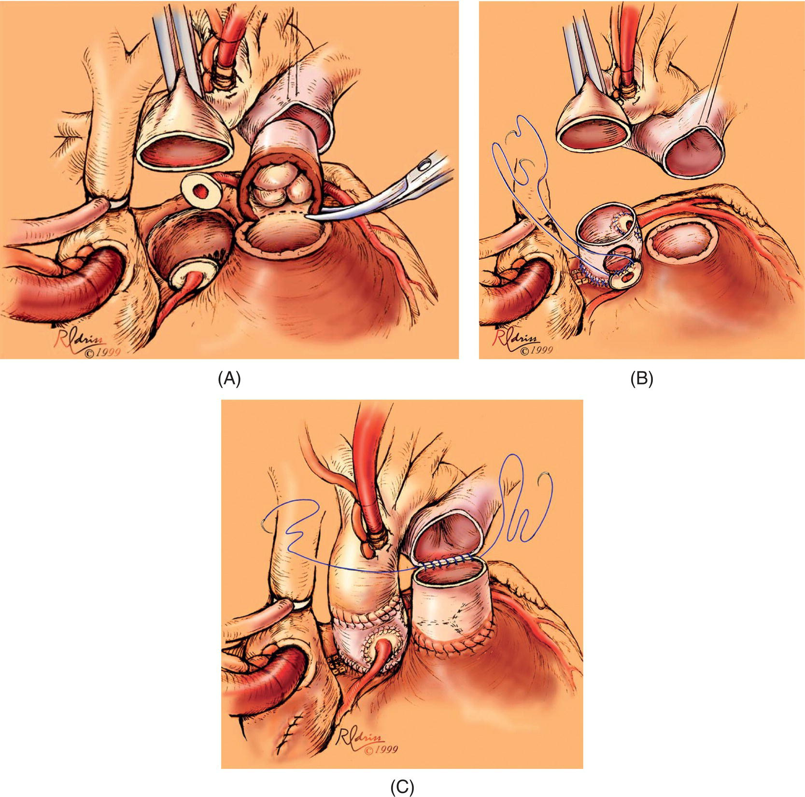

[**Figure 27.1**](#R_c27-fig-0001) The Ross procedure (pulmonary autograft). (A) Incisions on the aorta, pulmonary artery, and the coronary buttons. (B) Pulmonary autograft and reimplantation of the coronary arteries. (C) Completing operation with pulmonary artery conduit to replace the native pulmonary valve.

(Source: Mavroudis et al. \[29\]. Reproduced with permission from Cambridge University Press.)

* * *

### KEY POINTS: VALVULAR AS

-   Neonates may present in shock and require aggressive resuscitation prior to intervention.
-   Transcatheter valvuloplasty is usually the treatment of choice in the neonate with severe or critical AS and adequate left ventricular size, with the major technical risk being overaggressive dilatation with resultant aortic valve insufficiency.
-   Complications during balloon angiography include profound myocardial depression, bradycardia, asystole, and ventricular fibrillation.
-   Anesthetic management with an opioid‐based technique often facilitates maintenance of preload, afterload, contractility, and a low‐normal heart rate; significant bradycardia should be avoided in the neonate.

* * *

## Subvalvular AS

### Incidence, anatomy, and natural history

Subvalvular AS (subAS) is a fixed obstruction occurring within the LVOT and accounts for approximately 1% of patients with CHD. Patients with subAS usually become symptomatic after infancy, with a higher male predilection of 2:1 to 3:1 \[46\]. Most commonly, the anatomic correlate of the LVOT obstruction is either a thin, discrete membrane of endocardial or fibrous tissue or a fibromuscular ridge emanating from the crest of the interventricular septum. Less common manifestations include a circumferential, fibromuscular ring that originates from the anterior mitral valve leaflet and a diffuse, tunnel‐like fibromuscular obstruction. Other rare causes of subAS include anomalous attachments of mitral valve leaflets or mitral chordae. A variety of congenital heart lesions may exist in association with subAS and include bicuspid valves, AS, VSD, and aortic coarctation ([Table 27.4](#c27-tbl-0004)). SubAS can occasionally present in infancy as part of Shone’s complex or following the surgical closure of a VSD, but more commonly, the diagnosis is not made before the end of the first year of life and severity usually increases with age.

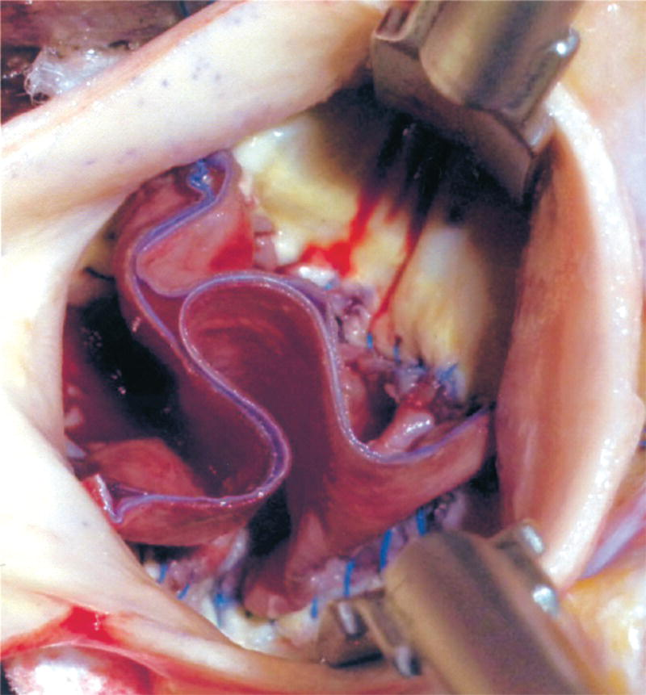

[**Figure 27.2**](#R_c27-fig-0002) The Ozaki procedure. View of the coaptation of the three new aortic valve leaflets constructed using autologous pericardium.

(Source: Ozaki et al. \[36\]. Reproduced with permission from Oxford University Press.)

[**Table 27.3**](#R_c27-tbl-0003) Outcomes after aortic valve surgery in children

Source: Buratto et al. \[40\]. Reproduced with permission from Elsevier.

|  | Neonates and infants | Older children |
| --- | --- | --- |
| Aortic valve repair | Early mortality: 3–4%  
10‐year survival: 94%  
10‐year freedom from reoperation: 66% | Early mortality: 0.4–1.8%  
10‐year survival: 94%  
10‐year freedom from reoperation: 70% |
| Ross operation | Early mortality: 10–17%  
10‐year survival: 79%  
10‐year freedom from reoperation: 62% | Early mortality: 0–4%  
10‐year survival: 96%  
10‐year freedom from reoperation: 90% |
| Ozaki aortic valve replacement | Not yet reported | Early mortality: 0%  
10‐year survival: not reported  
3‐year freedom from reoperation: 80% |
| Mechanical aortic valve replacement | Not feasible | Early mortality: 0.5–7%  
10‐year survival: 82%  
10‐year freedom from reoperation: 78% |
| Homograft aortic valve replacement | Not reported | Early mortality: 5–13%  
10‐year survival: 85%  
10‐year freedom from valve reoperation: 50–60% |

[**Table 27.4**](#R_c27-tbl-0004) Concurrent congenital anomalies in patients with subvalvular aortic stenosis

| Lesions | Percentage of patients |
| --- | --- |
| Bicuspid valves | 40 |
| Aortic stenosis | 28 |
| Ventricular septal defect | 24 |
| Coarctation of aorta | 12 |
| Patent ductus arteriosus | 12 |
| Atrial septal defect | 4 |

### Pathophysiology

Patients usually present with complaints of orthopnea, dyspnea on exertion, or exertional angina and syncope. A systolic ejection murmur is present, most notable in the left, second, and third parasternal spaces, and a carotid artery thrill can be palpated in a significant number of patients. The diagnosis is confirmed by color Doppler echocardiography, which allows assessment of the degree of stenosis, biventricular enlargement and function, and concomitant mitral and aortic regurgitation. Cardiac catheterization is usually only needed to assess patients with serial obstructions or a tunnel‐like stenosis. As the severity of subAS increases with age, progression of the LVOT obstruction may eventually lead to left ventricular diastolic dysfunction and pulmonary venous hypertension. Moreover, abnormal blood flow across the aortic valve can lead to thickening of the valve leaflets, causing valvular AS, left ventricular hypertrophy, damage to the aortic valve, and subsequent aortic insufficiency with progressive regurgitation. A higher LVOT gradient at diagnosis is an independent predictor for these adverse outcomes.

### Surgical and transcatheter approaches and outcomes

Currently, surgery is favored as an early intervention for LVOT peak pressure gradients exceeding 40 mmHg and consists of fibromuscular resection with or without myectomy through an aortotomy ([Figure 27.3](#c27-fig-0003)), but timing remains controversial. A study comparing early and late surgery in 83 patients with subAS found that the LVOT gradient was successfully reduced in both groups, but that the late surgery group had a much higher recurrence rate at 5 and 10 years (28 and 57%, respectively) compared with the early surgery group (6 and 0%, respectively) \[47\]. Failure to intervene early also increases the risk of developing aortic regurgitation, which does not necessarily improve following subaortic resection. Transcutaneous balloon dilation is usually ineffective due to only temporary relief of the stenosis. Surgical complications include newly developed or worsened aortic insufficiency and postoperative atrioventricular heart block. In patients with tunnel‐type subAS, an aortoventriculoplasty (Konno procedure) may be required or in the presence of aortic insufficiency, an aortic root replacement with a prosthetic valve or a Ross–Konno procedure is now favored. The Konno operation is still favored in patients with very small aortic annulus and involves an aortic incision above the aortic commissures and extended to the annulus and carried through the left and right ventricular outflow tracts, placement of a mechanical or bioprosthetic stented aortic valve, followed by closure with a pericardial or synthetic patch. Compared with the Konno operation, the Ross–Konno procedure requires less of an incision into the interventricular septum, limits right ventricular outflow tract distortion and potential injury to the conduction system (see also section on Shone’s Complex later in this chapter). The operation involves harvesting the pulmonary valvular autograft, resection of the diseased aortic valve with coronary button mobilization, implantation of the pulmonary autograft and neoaortic reconstruction with coronary button anastomoses, followed by implantation of a pulmonary homograft into the right ventricular outflow tract. The use of an autograft provides growth potential and freedom from anticoagulation regimens \[29\].

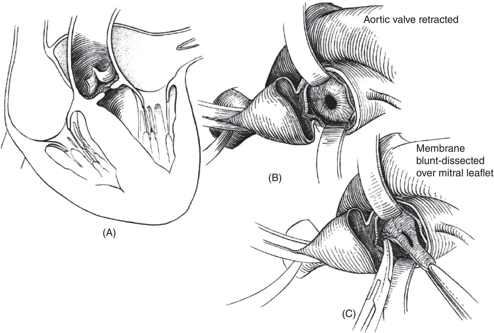

[**Figure 27.3**](#R_c27-fig-0003) Surgical repair of subaortic stenosis.

(Source: Adapted from Tworetzky et al. \[43\].)

### Anesthetic considerations

Anesthetic management of subvalvular stenosis aims at maintaining the oxygen requirements of the myocardium and other end organs. Accordingly, the goal is to decrease myocardial oxygen demand and preserve both preload and afterload while maintaining or allowing a slightly decreased heart rate. In this regard, the anesthetic management of the patient with subAS is very similar to that for valvular AS.

* * *

### KEY POINTS: SUBVALVULAR AS

-   Subvalvular AS usually consists of a discrete membrane in the LVOT presenting after infancy, but can also be seen as part of multi‐level left‐sided obstruction in patients with Shone’s complex.
-   Early surgical membrane resection with or without myectomy is favored over transcatheter approaches for an LVOT pressure gradient >40 mmHg.
-   Hemodynamic goals during anesthetic management are similar to AS, maintaining preload and afterload, and allowing a slightly decreased heart rate.

* * *

## Supravalvular AS

### Incidence, anatomy, and natural history

Congenital supravalvular AS is the least common fixed obstruction of the LVOT, accounting for less than 0.05% of CHD. However, caused by abnormalities in the elastin gene (ELN), supravalvular AS occurs in up to two‐thirds of patients with Williams–Beuren syndrome, also known as Williams syndrome, and as part of familial supravalvular AS \[48–51\]. The outflow tract obstruction frequently arises as a concentric narrowing of the ascending aorta at the superior margin of the sinuses of Valsalva, creating a typical hourglass deformity of the aorta \[52\]. Other manifestations include a diffuse narrowing along the entire ascending aorta or a fibrous semicircular membrane at the sinotubular junction. Supravalvular AS is a progressive disease, usually diagnosed after infancy, but may present earlier in life in patients with Williams syndrome. Coronary artery involvement, which is common in children with Williams syndrome, may include a reduction of the left coronary artery ostial size, ostial obstruction by fusion of the aortic cusp to the supravalvular ridge, or diffuse narrowing of the left coronary artery ([Figure 27.4](#c27-fig-0004)). In cases of mild supravalvular AS, one case series found spontaneous improvement in the obstruction with time in 16% of patients and complete resolution in another 12% \[53\].

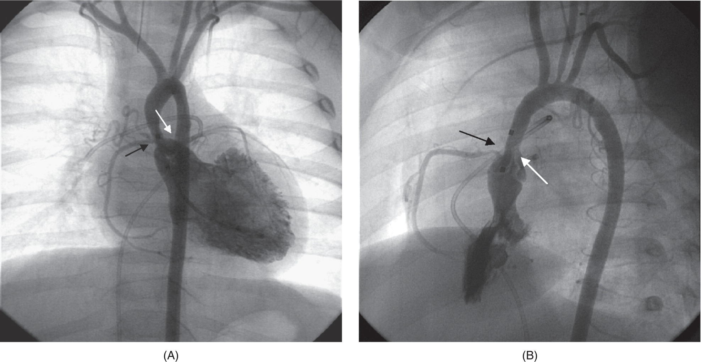

[**Figure 27.4**](#R_c27-fig-0004) Representative angiogram of a patient with Williams syndrome, demonstrating supravalvular aortic stenosis (black arrow) and left coronary artery ostial stenosis (white arrow). (A) Anteroposterior view. (B) Lateral view. Peak systolic gradient during catheterization was 70 mmHg.

(Source: Robert Beekman, MD. Reproduced with permission.)

### Pathophysiology

The underlying mechanism for supravalvular AS in Williams syndrome is an elastin arteriopathy, leading to a lack of elastic tissue in the walls of large arteries, increased amounts of collagen, and hypertrophy of smooth muscle cells \[54\]. Accordingly, pulmonary artery stenosis is also observed in over 30% of these patients, which can lead to biventricular hypertrophy \[50\]. Supravalvular AS may also be associated with a bicuspid aortic valve and aortic valvular stenosis in up to 50% of patients \[55\]. Concentric left ventricular hypertrophy can lead to myocardial ischemia, which is exacerbated by concomitant coronary artery stenosis. The risk of sudden death may only be slightly raised in patients with sporadic supravalvular AS, but is significantly increased in patients suffering from Williams syndrome, compared with the general population \[56, 57\]. A low‐pitched, crescendo–decrescendo, systolic murmur is commonly heard at the base of the heart, radiating to the right carotid artery. The diagnosis of supravalvular AS is routinely made using two‐dimensional echocardiography, and Doppler echocardiography can be utilized to determine the pressure gradient across the ascending aorta. Electrocardiograms usually show left ventricular hypertrophy with special attention given to potential ischemic ECG changes. Patients with Williams syndrome, occurring in approximately 1 in 20,000 live births, are easily recognized due to their characteristic facial dysmorphisms; common features include a wide mouth with full lips, micrognathia, dental malocclusion, widely spaced teeth, a short nose with a flat nasal bridge, and a long philtrum. They may also suffer from arterial hypertension, hypercalcemia with nephrolithiasis, esotropia, a hoarse voice, joint hyperelasticity, and sensorineural hearing loss. Although patients often exhibit cognitive impairment, they commonly have a characteristic desire for conversation and company with a lack of social inhibition \[50, 58\]. The suspected diagnosis of Williams syndrome can be verified even in neonates who do not yet exhibit the characteristic features, using genetic testing for karyotype and the fluorescent in situ hybridization (FISH) test for the 7q11.23 elastin gene deletion \[54\]. See [Chapter 8](c08.xhtml) for futher discussion of Williams Syndrome.

### Surgical and transcatheter approaches and outcomes

Infants with a peak pressure gradient of less than 20 mmHg across the supravalvular stenosis often remain stable and do not require intervention; however, a peak instantaneous pressure gradient of greater than 75 mmHg is usually an indication for surgical intervention \[40\]. Surgical techniques for repair of supravalvular stenosis include patch aortoplasty with one ([Figure 27.5](#c27-fig-0005)) or multiple patches \[59, 60\], complete excision of the stenotic ring with end‐to‐end anastomosis, or the Ross or Ross–Konno procedures \[55, 61\]. Significant coronary ostial obstruction may be relieved by a patch enlargement of the coronary os, excision of the obstructing aortic leaflet, or coronary artery bypass grafting \[62\]. Concomitant pulmonary artery stenosis in many patients with Williams syndrome is frequently addressed by balloon dilation of the right ventricular outflow tract stenosis prior to surgical repair of the LVOT obstruction.

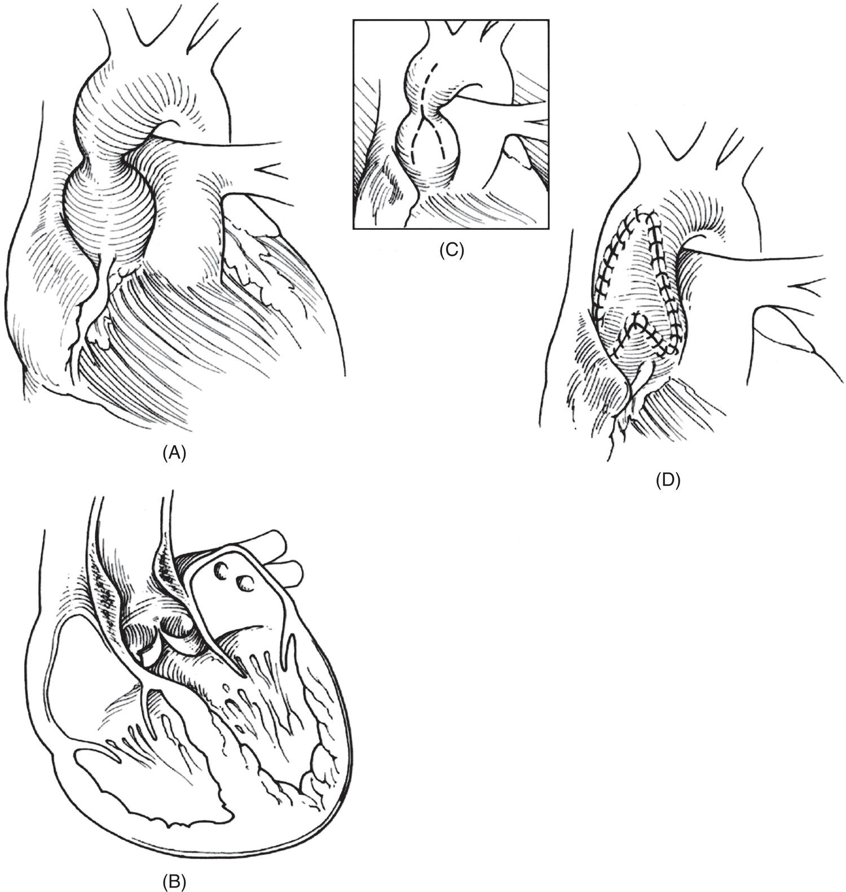

[**Figure 27.5**](#R_c27-fig-0005) Repair of supravalvular aortic stenosis. (A) External appearance. (B) Coronal plane view of the defect. (C) Inverted Y incision in the ascending aorta. (D) Placement of an autologous pericardial patch.

(Source: Chang et al. \[59\]. Reproduced with permission from Wolters Kluwer Health, Inc.)

### Anesthetic considerations

Supravalvular AS shares many of the pathophysiological characteristics and anesthetic management requirements of valvular and subvalvular stenosis. However, due to the potential combination of supravalvular AS, left ventricular hypertrophy, right ventricular outflow tract obstruction, and coronary artery disease, patients with Williams syndrome can be at significantly increased risk for anesthesia‐related complications. Accordingly, several reports have described perioperative fatalities in these patients, ranging from events during anesthesia induction or intubation to postoperative complications \[56, 63–67\]. The majority of these reported events seemed to be caused by myocardial ischemia. Maintaining afterload at slightly elevated levels is therefore paramount to preserve coronary perfusion pressure. Volatile anesthetics must be used with caution due to their myocardial depressive and vasodilatory effects. Intramuscular premedication with ketamine may facilitate the establishment of intravenous access, and high‐dose opioid techniques may accomplish the anesthetic goals. However, significant increases in heart rate, which can occur following administration of ketamine or vagolytic agents, are not well tolerated and need to be treated aggressively. Also, arrhythmias, such as those caused by catheter manipulation during cardiac catheterizations, are frequently poorly tolerated. It must be emphasized that the coronary arteries are frequently significantly involved, being partially obstructed or “hooded” from the abnormal surrounding connective tissue in the aorta, and the degree of coronary obstruction often does not correlate with the severity of the supravalvular AS. Other anesthetic complications, such as difficult mask ventilation or difficult tracheal intubation, may arise due to the concomitant facial deformities in this syndrome. Moreover, the potential development of abnormal skeletal muscle tissue with lipid deposits may lead to an increased sensitivity to muscle relaxants, thus warranting close monitoring of neuromuscular blockade \[68\]. Additional sources of perioperative morbidity include their predisposition to renal insufficiency and arterial hypertension, which need to be appropriately addressed in the anesthetic plan. Preoperative risk assessment is difficult, because adequacy of coronary blood flow is difficult to verify and the more reliably quantifiable degree of supraaortic stenosis does not necessarily correlate with the degree of coronary abnormalities. In particularly, for critical patients, extracorporeal membrane oxygenation (ECMO) or CPB backup may be advised as cardiopulmonary rescuscitation can be challenging in these patients.

* * *

### KEY POINTS: SUPRAVALVULAR AS

-   Supravalvular AS occurs in two‐thirds of patients with Williams syndrome and can be accompanied by coronary and ostial stenoses, substantially increasing the risk of coronary events and sudden death.
-   Maintain preload and afterload at high‐normal levels to preserve coronary perfusion pressure, and maintain heart rate and contractility at low‐normal levels.
-   Avoid anesthetic techniques that produce significant decreases in preload and afterload, e.g., high doses of volatile anesthetics and/or propofol.
-   Tachycardia is not well tolerated in patients with significant coronary stenosis and must be treated aggressively.

* * *

## Hypertrophic cardiomyopathy

### Incidence, anatomy, and natural history

Hypertrophic cardiomyopathy (HCM) is a cardiac disorder with significant heterogeneity of etiology, anatomic findings, and clinical presentation; in adults, it occurs with an estimated prevalence of 1:500 \[69, 70\]. This disease is diagnosed less commonly in children, but when identified, it carries a significant risk for adverse outcomes, with an overall survival of 97% at 5 years and 94% at 10 years \[71\]. Over the past decade, the increased availability of genetic and metabolic testing has improved the ability to identify the underlying etiology of HCM. While in both adults and children, the most common cause of HCM is a mutation in sarcomeric genes, in the pediatric population, the etiology is more heterogeneous and non‐sarcomeric causes represent up to 35% of cases of HCM \[72\] ([Table 27.5](#c27-tbl-0005)).

In one single‐center pediatric study, an affected family member, positive HCM gene panel mutation, metabolic disease, or genetic syndrome were identified in over 80% of patients with HCM. \[61\] Children presenting with HCM at less than 1 year of age carry a worse prognosis, and an inherited error of metabolism or malformation syndrome (e.g., RASopathies) is likely present \[72, 73\]. Genetics evaluation and testing is now recommended in all children diagnosed with HCM \[71\].

The characteristic gross morphologic feature in HCM is a hypertrophied and non‐dilated left ventricle, and the absence of other disease processes capable of causing this degree of hypertrophy (e.g., AS). There is significant heterogeneity with regard to the location and degree of cardiac hypertrophy, and in fact, even first‐degree relatives with familial HCM often exhibit different patterns of hypertrophy \[74, 75\]. Myocardial hypertrophy may occur in the anterior, posterior, and/or basal regions of the ventricular septum, and in the ventricular free wall. The hemodynamic severity is dependent on the particular region where hypertrophy is most prominent: significant hypertrophy of the anterior region of the ventricular septum compared with the posterior septum more commonly causes subaortic outflow obstruction \[76\]. Echocardiography is extremely helpful in determining the extent, location, and severity of the disease. Quantitative echocardiographic findings in patients with HCM include increased left ventricular wall thickness, decreased left ventricular end‐diastolic cavity size, and increased left ventricular fractional shortening \[77\]. Other important findings include the presence and severity of LVOT obstruction, systolic anterior motion of the mitral valve, and mitral regurgitation \[78\]. Cardiac Magnetic Resonance Imaging (CMR) is also commonly used for diagnosis, risk prediction, and pre‐surgical planning. This imaging modality provides extremely accurate information regarding LV wall thickness, ventricular chamber sizes, and the degree of myocardial fibrosis which has been shown to be a marker for increased risk for ventricular tachyarrhythmias and heart failure progression \[79\].

[**Table 27.5**](#R_c27-tbl-0005) Non‐sarcomeric causes of hypertrophic cardiomyopathy in children

Source: Monda et al. \[72\] / Frontiers Media S.A. / CC BY 4.0.

| Sarcomeric |  |
| --- | --- |
| Malformation syndromes: RASopathies | Noonan syndrome |
| Noonan syndrome with multiple lentigines |
| Costello syndrome |
| Cardiofaciocutaneous syndrome |
| Glycogen storage diseases | Pompe disease (glycogen storage disease type lla) |
| Danon disease (glycogen storage disease type llb) |
| Cori–Forbes disease (glycogen storage disease type III) |
| PRKAG2 syndrome |
| Lysosomal storage diseases | Mucopolysaccharidoses |
| Mitochondrial disorders |  |
| Fatty acid oxidation disorders | Very long‐chain acyl‐CoA dehydrogenase deficiency |
| Multiple‐acyl‐CoA dehydrogenase |
| Long‐chain hydroxyacyl‐CoA dehydrogenase |
| Carnitine‐acylcarnitine translocase |
| Carnitine palmitoyltransferase II |
| Carnitine‐acylcarnitine translocase deficiency |
| Endocrine disorders | Primary hyperinsulinism |
| Infant of a mother with diabetes mellitus |
| Acromegaly |

The natural history of this disease is dependent on multiple factors, including the underlying etiology, age at presentation, clinical signs and symptoms, and the presence of other co‐morbidities. Most patients with HCM, and neonates in particular, often remain asymptomatic for a long period of time. Many patients are not diagnosed until they present with symptoms of congestive heart failure, cardiac rhythm disturbances, or syncope or following a near‐death cardiac event \[70\]. HCM has become the leading cause of sudden cardiac death in young athletes \[74, 75\]. Even when the diagnosis is made prior to a catastrophic event, the clinical course of the disease is inconsistent and dependent on whether the HCM is obstructive or non‐obstructive. If obstructive, more than 25% of infants will develop symptoms of congestive heart failure manifested by feeding intolerance or failure to thrive \[80\].

### Pathophysiology

Hypertrophic cardiomyopathy is most commonly caused by mutations in genes encoding proteins of the myocardial sarcomere, and in fact over 50 mutations causing the disease have been identified, making it one of the most widespread genetic diseases of the myocardium. Depending on the specific mutation, abnormalities in the protein may lead to ineffective contraction of the sarcomere and the development of myocyte hypertrophy \[70\]. The histology of the left ventricle is remarkable for disarray of the hypertrophied cardiac muscle cells, myocardial scarring and fibrosis, and thickened walls in small intramural coronary arteries causing luminal narrowing \[76, 81\]. Although fiber disarray is present even in normal hearts, the extent to which this happens in the heart with HCM is significantly increased \[82\]. A minority of patients may progress to a secondary phase characterized by wall thinning in areas of previous hypertrophy, enlargement of cavity size, and impairment of ventricular function, a phenomenon likely related to myocardial ischemia and necrosis \[76\].

Hypertrophic cardiomyopathy also presents in infancy without sarcomeric protein gene mutations, such as in infants of insulin‐dependent diabetic mothers, children with malformation syndromes such as Noonan syndrome, or in patients with glycogen storage diseases such as Pompe disease. In Noonan syndrome, a genetic disorder commonly associated with congenital cardiac disease, approximately 15–20% of children have HCM, with less favorable outcomes than children with non‐syndromic HCM \[80, 83\]. Pompe disease represents a glycogen storage disease type II (GSD‐II) which is a rare autosomal recessive disorder occurring in 1 out of 40,000 live births, in which lysosomal glycogen accumulates in both cardiac and skeletal muscle due to a deficiency of acid α‐glucosidase \[84, 85\]. Children presenting with the infantile form of this disease exhibit severe HCM, and, if untreated, often die in the first year of life from respiratory or cardiac complications. Therapy with long‐term intravenous recombinant α‐glucosidase often leads to significant resolution of the cardiac hypertrophy and skeletal muscle weakness \[86\] Infants presenting for surgery prior to therapy with recombinant human α‐glucosidase are at a high risk for anesthetic complications \[87\]. In a retrospective review, 6% of patients with infantile‐onset Pompe disease receiving anesthetics developed an arrhythmia or cardiac arrest soon after induction of anesthesia \[88\]. Two‐thirds of these events were attributed to the use of sevoflurane or propofol.

The most common finding in patients with HCM is a hyperdynamic left ventricle with abnormal diastolic relaxation and compliance; LVOT obstruction is present in no more than 25% of patients \[89\] ([Figure 27.6)](#c27-fig-0006). The degree of outflow tract obstruction is a dynamic process and may be reduced or abolished by decreasing myocardial contractility, increasing preload, or increasing afterload. Conversely, the dynamic obstruction is increased during periods of increased ventricular contractility or sympathetic stimulation, as for instance, with exercise. The outflow tract gradient is felt to be caused in part by anterior movement of the mitral valve toward the ventricular septum during early systole, and more likely to occur in the setting of a hypertrophied anterior septum \[89\]. Anterior movement of the mitral valve may interfere with optimal valve closure, causing mitral regurgitation, occurring more commonly in the setting of LVOT obstruction. The combination of severe left ventricular hypertrophy, LVOT obstruction, and abnormalities of the intramural coronary arteries all place these patients at an increased risk of myocardial ischemia and ventricular arrhythmias.

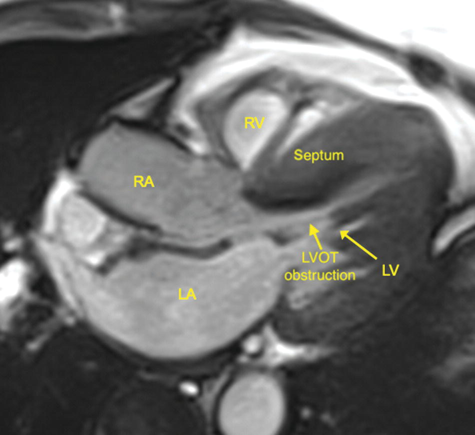

[**Figure 27.6**](#R_c27-fig-0006) MRI image of a patient with severe hypertrophic cardiomyopathy causing left ventricular outflow tract (LVOY) obstruction. RA, right atrium; RV, right ventricle; LA, left atrium; LV, left ventricle.

(Source: Courtesy of Michael Taylor, MD.)

### Surgical and transcatheter approaches and outcomes

Treatment modalities for HCM include medical therapy, surgical therapy, the use of pacing and/or implantable cardioverter‐defibrillators, and cardiac transplantation. Aggressiveness of therapy in any given patient depends on the risk factors for morbidity and mortality. Identified risk factors for patients with HCM include family history of sudden death or syncope, extreme septal hypertrophy, and LVOT obstruction \[90, 91\]. Asymptomatic patients with HCM may not require any therapy. When medical therapy is initiated, it usually consists of either a β‐blocker or calcium‐channel blocker, and can be guided by treadmill exercise testing or patient symptoms \[70\]. Another treatment option is dual‐chamber pacing, which has been used as an alternative to surgery with mixed results. Although pacing has been shown to be of benefit in some patients, randomized controlled trials showing long‐term improvement in outcomes are lacking. For patients with HCM that have had a sudden cardiac death event and/or sustained ventricular tachycardia/ventricular fibrillation, placement of an implantable cardioverter‐defibrillator is indicated \[79\].

Indications for surgical intervention include a left ventricular outflow gradient >60 mmHg, significant symptoms such as dyspnea, angina, or syncope unresponsive to medical therapy, and an increase in mitral regurgitation \[92\]. Septal myectomy is an effective treatment in both pediatric and adult patients \[76, 78\]. In pediatric patients with HCM undergoing septal myectomy at the Mayo Clinic over a 28‐year period, there were no early deaths and survival rates at 5 and 10 years were 97 and 95%, respectively. Late follow‐up was remarkable for 96% of patients remaining in New York Heart Association (NYHA) functional class I or II \[91\]. The surgical approach is commonly transaortic, and often technically challenging in smaller children. Transesophageal echocardiography (TEE) can be used to aid in the assessment of intracardiac anatomy before resection and of the adequacy of resection following myectomy. Despite an excellent surgical result with minimal residual left ventricular outflow gradient, these children remain at risk for cardiac arrhythmias and sudden death \[91\]. Patients with congestive heart failure, myocardial ischemia, and/or life‐threatening arrhythmias, despite optimal medical and surgical therapies, may be considered for cardiac transplantation.

### Anesthetic considerations

Patients with HCM are at a significant risk for cardiac complications during anesthesia and surgery. A recent retrospective study looking at the incidence of complications in children with HCM undergoing general anesthesia at a tertiary care pediatric center demonstrated a 0.6% mortality rate; minor complications were seen in 12% of patients \[92\]. One adult study was remarkable for 40% of patients experiencing at least one perioperative adverse cardiac event, and predictors of adverse outcome included major surgery and duration of surgery \[93\]. To avoid hemodynamic instability, anesthetic management should be tailored toward maintaining preload and afterload, decreasing myocardial contractility, and avoiding tachycardia. Maintenance of normovolemia prior to induction is vital, and the placement of an intravenous catheter and administration of intravenous fluids prior to surgery may be beneficial. While halothane meets many of the hemodynamic goals and has been well tolerated in such cases, it is no longer available \[94\]. Sevoflurane and desflurane, on the other hand, may cause significant increase in heart rate and reduction in systemic vascular resistance and should be used with caution. The use of an intravenous access for anesthetic induction allows for careful titration of anesthetic agents and for rapid treatment of hypotension and/or cardiac arrhythmias. High‐dose opioid anesthesia provides stable hemodynamics and maintenance of a normal to low heart rate. Remifentanil, a short‐acting potent opioid administered by continuous infusion, may be an excellent choice when extubation of the trachea following surgery is planned. For patients not already on β‐blocker therapy, esmolol can be used in the perioperative period to control heart rate and reduce cardiac contractility.

Depending on the procedure and severity of HCM, arterial vascular access and central venous access may be indicated. Patients with a critical LVOT gradient may benefit from pre‐induction placement of an arterial line for close monitoring of systemic blood pressure during anesthetic induction. However, one must carefully judge whether the increased anxiety and pain caused by the procedure might precipitate an adverse event. During placement of a central venous line the patient must be closely monitored for the occurrence of an atrial dysrhythmia. Rapid treatment of dysrhythmias is important, as hemodynamics may deteriorate swiftly. Central venous pressure may be significantly elevated in patients with HCM due to the hypertrophied non‐compliant ventricle.

* * *

### KEY POINTS: HYPERTROPHIC CARDIOMYOPATHY

-   Hypertrophic cardiomyopathy is a heterogeneous condition caused by multiple factors including mutations in genes encoding sarcomeric proteins, metabolic and mitochondrial disorders, and RASopathies such as Noonan and Costello syndrome.
-   Characteristic anatomic features include a hypertrophied left ventricle with hyperdynamic systolic function and abnormal diastolic relaxation.
-   Hypertrophic cardiomyopathy currently is the leading cause of sudden death in young athletes.
-   Anesthetic considerations include maintaining preload at high‐normal levels, decreasing myocardial contractility, and avoiding tachycardia.

* * *

## Coarctation of the aorta

### Incidence, anatomy, and natural history

Coarctation of the aorta denotes a narrowing of the aortic lumen and is most often located just distal to the opening of the left subclavian artery at the point of insertion of the ductus arteriosus ([Figure 27.7](#c27-fig-0007)). Although usually presenting as a discrete narrowing, the coarctation can also be a long‐segment stenosis or be associated with hypoplasia of the transverse aortic arch. Up to 8% of patients with CHD have an aortic coarctation, which is more prevalent in males than females by a 1.5:1 ratio \[2, 94\]. The etiology of the coarctation is a folding of the medial tissue of the aortic wall; the obstructing shelf is often composed of circumferential ductal tissue, and with ductal closure contraction of this tissue leads to aortic coarctation. Both proximal and distal transverse arch hypoplasia is common and defined as less than 60% or 50% respectively of the diameter of the ascending aorta \[95\]. When the coarctation is severe with limited anterograde flow from the transverse arch, blood flow to the distal aorta may be entirely dependent on a PDA. If the coarctation segment remains uncorrected for a prolonged period of time, collateral blood flow will develop, thus allowing for adequate perfusion distal to the aortic obstruction. Other congenital cardiac anomalies are present in about one‐half of patients with aortic coarctation and include ventricular septal and atrioventricular canal defects, valvular AS, and subvalvular AS.

If untreated, the natural history of aortic coarctation is primarily related to the severity of the obstruction. Over 90% of untreated patients with coarctation of the aorta die by the age of 50 \[96\]. Even with surgical repair, patients with aortic coarctation demonstrate an increased predilection for hypertension, coronary artery disease, stroke, heart failure, and ruptured aortic and cerebral aneurysms. Over 50% of patients have arterial hypertension at long‐term follow‐up, which is not necessarily related to the presence of a recurrent stenosis \[97\]. Patients who have undergone aortic coarctation repair during infancy without residual stenosis also exhibit abnormal left ventricular diastolic function and aortic elasticity as adults \[98\].

[**Figure 27.7**](#R_c27-fig-0007) Posterior‐anterior computed tomography imaging of an infant with an aortic coarctation located just distal to the left subclavian artery. L, patient’s left side; R, patient’s right side; CoA, coarctation; L Scl Art, left subclavian artery.

(Source: Courtesy of Michael Taylor, MD.)

### Pathophysiology

The neonate with a severe coarctation generally presents during the first few weeks of life with congestive heart failure, left ventricular systolic dysfunction, and, in some cases, cardiogenic shock. The closure of the ductus arteriosus causes an acute increase in left ventricular afterload, elevation of left ventricular end‐diastolic pressure, reduction in stroke volume, pulmonary venous congestion, and pulmonary artery hypertension \[2\]. The infant with a less severe coarctation may exhibit tachypnea and failure to thrive. Still, the asymptomatic child with an unrecognized coarctation is at an increased risk for developing systemic hypertension proximal to the coarctation and subsequent left ventricular failure.

The diagnostic feature of aortic coarctation is a systolic blood pressure difference between the upper and lower extremities. TTE \[99\] using a suprasternal long‐axis view typically shows a localized narrowing (“posterior shelf”) just distal to the left subclavian artery, and Doppler analysis aids in assessing the severity of the coarctation. Evaluating the heart for other associated lesions is important. Magnetic resonance imaging (MRI) and computed tomography (CT) angiography with three‐dimensional reconstruction are other modalities used to image the aortic arch, and are more commonly utilized in older children and adults where imaging by TTE is often suboptimal. A study comparing CT angiography with TTE for diagnosis of coarctation demonstrated that CT angiography was the more sensitive test (100% vs. 87.5%) \[100\]. Drawbacks to these modalities include the use of ionizing radiation with CT angiography and the necessity for anesthesia or sedation for MRI in younger children.

### Surgical and transcatheter approaches and outcomes

Therapeutic options for aortic coarctation include surgery, balloon dilation, and placement of endovascular stents. However, there continues to be significant debate regarding the optimal long‐term treatment strategy. At the present time, neonates and infants are thought to have a superior outcome with surgical repair, while older patients may benefit from balloon dilatation with or without stenting as the initial therapy \[101\]. A retrospective study comparing balloon angioplasty and surgery as the initial therapy for neonatal coarctation showed that over 80% of patients undergoing balloon angioplasty subsequently required surgery or repeat balloon dilation, while less than 20% of patients undergoing surgery required reintervention \[102\]. Another study comparing outcomes in children undergoing balloon angioplasty for native coarctation found that the incidence of restenosis and aneurysm formation was significantly increased in children _<_1 year of age \[101\]. The options for surgical repair include a subclavian flap aortoplasty, a resection of the narrowed portion of the aorta with a traditional end‐to‐end anastomosis, extended end‐to‐end or end‐to‐side reconstruction (aortic arch advancement technique), or an interposition tube graft ([Figure 27.8](#c27-fig-0008)). The aortic arch advancement technique is used when significant transverse arch hypoplasia is present and requires proximal extension of the anastomosis onto the underside of the transverse arch up to the level of the innominate artery \[103\] This operation can be performed through a left thoracotomy approach or median sternotomy with cardiopulmonary bypass (CPB). Indications for a median sternotomy and CPB include significant transverse hypoplasia and the need for repair of a concomitant cardiac lesion such as a ventricular septal defect. Repair through a left thoracotomy requires placement of a cross‐clamp just distal to the innominate artery, placing the patient at risk for cerebral hypoperfusion. Some controversy exists regarding the degree of transverse arch hypoplasia necessitating a median sternotomy approach. A recent single‐center retrospective study concluded that median sternotomy should be considered for patients with distal transverse arch z‐scores lower than −2.8 and proximal transverse arch z‐scores lower than ‐4.1, and that with the left thoracotomy approach there was a low mortality rate, reintervention rate, and incidence of hypertension \[104\]. Other perioperative complications from surgical repair of coarctation include recurrent laryngeal nerve or phrenic nerve injury, chylothorax, bleeding, and rarely paraplegia (0.4%) \[105\].

Restenosis after surgical repair of aortic coarctation is not uncommon, with an incidence that varies widely depending on the surgical technique, age of patient at time of repair, definition of recurrence, and length of follow‐up \[106\]. A study examining long‐term complications in a cohort of patients up to 27 years after repair found a restenosis rate of 11%, with restenosis defined as a systolic brachial–ankle blood pressure difference of greater than 20 mmHg \[97\]. Earlier studies showed a higher incidence of recoarctation if the operation was performed in the first 3 years of life; the recurrence rate was _<_3% if performed afterward \[107\]. A more recent study utilizing MRI in adults that had undergone aortic coarctation repair during childhood found re‐coarctation and local aneurysm formation in 48 and 21% of patients, respectively \[108\]. Current surgical techniques emphasizing aggressive excision of ductal tissue and the use of an extended end‐to‐end anastomosis in the setting of arch hypoplasia may lead to a lower incidence of restenosis. Because of the significant prevalence of hypertension and other long‐term sequelae following coarcation repair, many centers aggressively treat even mild recurrent stenosis in the interventional catheterization suite.

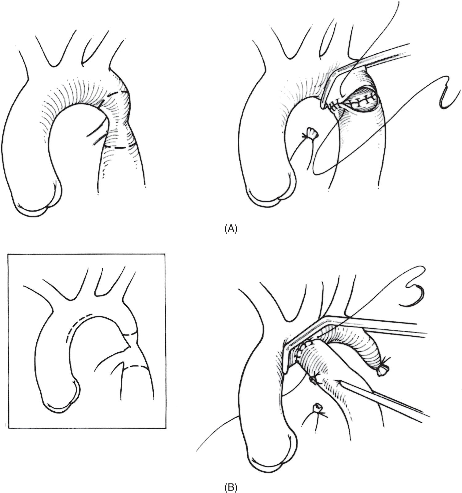

[**Figure 27.8**](#R_c27-fig-0008) Two surgical approaches for repair of coarctation of the aorta. (A) Resection of coarctation with end‐to‐end anastomosis. (B) End‐to‐side, or aortic arch advancement technique.

(Source: Chang et al. \[59\]. Reproduced with permission from Wolters Kluwer Health, Inc.)

The use of balloon angioplasty for initial treatment of discrete aortic coarctation in children frequently provides excellent immediate hemodynamic results \[99, 101, 109\]. Reluctance to use this approach in some centers is related to concerns about restenosis and aneurysm formation, which occur in 10–20% and 5–10% of patients, respectively \[100\]. Approximately 25% of children undergoing an initial balloon angioplasty will require a reintervention within 2 years \[99, 101\]. Balloon angioplasty is generally accepted as the first‐line therapy for restenosis following surgical repair of aortic coarctation, providing excellent immediate and long‐term results \[106, 110, 111\]. In approximately 80% of cases, the residual systolic pressure gradient can be reduced to less than 20 mmHg. Repeat balloon angioplasty or surgery is required in about 25% of these patients due to restenosis \[106\]. Complications related to balloon angioplasty include femoral artery thrombosis, aortic rupture, and stroke. The risk of femoral artery injury is greater in the smaller child. An increased mortality risk has been reported for patients undergoing angioplasty for recurrent coarcation versus native coarctation \[110\].

Balloon‐expandable endovascular stents provide an effective therapy for the treatment of native or recurrent coarctations occurring after surgery or balloon angioplasty \[112–115\] ([Figure 27.9](#c27-fig-0009)). In a study including 565 procedures from multiple institutions, 97.9% of patients had a successful reduction in the coarctation gradient at the time of the procedure \[112\]. Stents have been successfully used to treat patients with both discrete coarctation and transverse arch hypoplasia. Intermediate follow‐up in patients receiving stents shows that the incidence of restenosis is reduced compared to balloon angioplasty \[113–115\]. Stents allow for future redilation to a larger size to accommodate the growth of the child. This therapy is limited by the need for a large sheath (8–9 Fr) in the femoral artery, and is thus not utilized in some centers until a child reaches a certain size. Endovascular stents have been placed in smaller children using the carotid artery, thus requiring a surgical procedure to place a sheath in this vessel. Complications related to stent placement include aneurysm formation, aortic dissection, stent migration, balloon rupture, femoral artery injury, and stroke, and may occur in as many as 15% of patients \[116\]. The use of covered stents, currently investigational in the United States, may decrease the risk of arterial wall injury, particularly in older patients with increased aortic fragility. In a recent single‐center study, 56 patients (11–56 years of age) were treated with covered stents for complex coarctation of the aorta with a decrease in the systolic gradient from a mean of approximately 50 to around 5 mmHg \[117\]. Complications included one patient who was found to have an aortic dissection, which was treated conservatively, and one death during the postoperative period felt to be related to pre‐existing left ventricular dysfunction. Redilation of the stent due to a subsequent increase in the gradient was required in four patients.

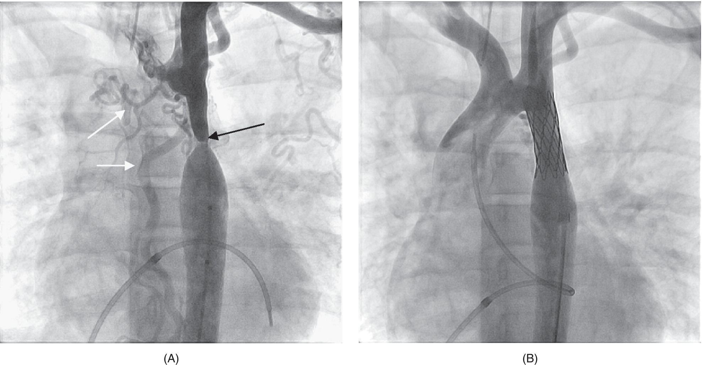

[**Figure 27.9**](#R_c27-fig-0009) (A) Angiograms of a 12‐year‐old patient with a native aortic coarctation (black arrow) and a long, moderately hypoplastic isthmus before placement of a stent. Note the multiple arterial collaterals (white arrows). (B) Angiogram after stent placement. The systolic gradient was reduced from 30 to 3 mmHg following stent placement.

(Source: Robert Beekman, MD. Reproduced with permission.)

### Anesthetic considerations

The medical management of infants with severe coarctation consists of inotropic support and diuretics. In infants younger than 1 month, intravenous prostaglandin is utilized to reopen the ductus arteriosus. Intubation may be necessary to decrease the work of breathing and reduce left ventricular demand. Metabolic acidosis should be corrected to improve left ventricular function.

The anesthetic management of the patient presenting for surgical repair of coarctation of the aorta should include a right‐sided upper extremity arterial catheter in addition to the usual anesthetic monitors. The placement of the right intra‐arterial catheter ensures that blood pressure will be monitored during the phase of the operation when the aorta, left carotid artery, and left subclavian artery may be clamped or compressed. The use of cerebral near‐infrared spectroscopy (NIRS) for continuous monitoring of bi‐hemispheric cerebral oxygenation allows the anesthesiologist to identify cerebral hypoperfusion related to aortic cross‐clamp position or inadequate cardiac output \[118\]. Central venous access may be indicated for initiation of inotropic support.

Induction of anesthesia can be accomplished by either intravenous or inhalational anesthesia; however, in the child with significant ventricular dysfunction, an opioid‐based induction may be preferable. The surgical repair is usually performed through a left thoracotomy, and lung retraction can impact ventilation. Single lung ventilation, especially in larger children, can facilitate access to the aorta. (See [Chapter 23](c23.xhtml) for further discussion of single lung ventilation). Close monitoring of arterial blood gases for adequacy of ventilation is vital. Inadequate ventilation causing severe acidosis in a critically ill neonate can worsen cardiac function and lead to cardiac arrest. There have been reports that infants with a core temperature greater than 38 °C are at an increased risk for spinal cord ischemia. Many centers choose to allow the child to cool to about 34–35 °C in order to protect against this complication \[119\]. The application of the aortic cross‐clamp usually causes upper body hypertension. This increase in arterial blood pressure is important for maintenance of blood flow to the lower body and spinal cord which is reliant on collateral flow that can vary depending on the anatomy of collateral blood vessels and arterial pressure. Some authors advocate for mainting upper extremity blood pressures of 100–120 mmHg in infants and 160–200 in older patients during this clamp period \[120\]. It is possible that the failing ventricle may be unable to maintain an appropriate cardiac output after cross‐clamp placement due to the sudden increase in afterload, in which case an inotropic agent may need to be administered \[121\]. If myocardial function is adequate, volatile anesthetics can be used to reduce the arterial pressure during aortic cross‐clamp. When aortic coarcation repair is performed in older children and adults, some centers advocate for placement of a lower extremity arterial line and maintenance of a mean arterial pressure >45 mmHg. If this pressure cannot be maintained the use of left heart bypass may be indicated. Prior to completion of the vascular anastomosis, the dose of volatile anesthetic is usually reduced and fluid boluses may be administered in anticipation of systemic hypotension following release of the aortic cross‐clamp.

The early postoperative period is often complicated by the onset of hypertension, which may be exacerbated in the setting of poor pain control. Greater than one‐half of patients who undergo repair of a coarctation experience significant increases in blood pressure for up to 2 weeks \[122\]. It has been postulated that the increase in blood pressure may be secondary to stimulation of the sympathetic system distal to the anastomotic site, with subsequent increases in plasma renin activity. Untreated hypertension can result in mesenteric arteritis \[123\]. Hypertension in the acute perioperative period is usually treated with infusions of sodium nitroprusside, nicardipine, or esmolol. Some centers utilize continuous epidural analgesia for control of pain following coarctation repair. Purported benefits of this technique compared with intravenous opioid therapy include better pain and blood pressure control and improved respiratory mechanics. Others avoid epidural analgesia because of the potential for confusion as to etiology in the rare instance of paraplegia after coarctation repair.

* * *

### KEY POINTS: COARCTATION OF THE AORTA

-   Coarctation of the aorta is commonly located immediately distal to the takeoff of the left subclavian artery and may be accompanied by hypoplasia of the transverse aortic arch.
-   Neonates with aortic coarctation may present with congestive heart failure due to left ventricular dysfunction and may require inotropic support and mechanical ventilation prior to surgical repair.
-   Maintaining myocardial contractility and a higher blood pressure during the aortic repair is important to provide perfusion to the spinal cord and subdiaphragmatic viscera. In older patients invasive monitoring of lower extremity blood pressure may be indicated.
-   Patients with a history of repaired aortic coarctation are at an increased risk for systemic hypertension, left ventricular systolic and/or diastolic dysfunction, and coronary artery disease.

* * *

## Interrupted or hypoplastic aortic arch

### Incidence, anatomy, and natural history

An interrupted aortic arch (IAA) exists in about 1% of patients with congenital malformations of the heart. The interruption may be divided into three anatomical variants: type A, which is characterized by a location just distal to the left subclavian artery (25% of IAA); type B, located in the space between the left subclavian artery and the left common carotid artery (70% of IAA); and type C, between the innominate and left common carotid arteries (5% of IAA) \[123, 124\] ([Figure 27.10](#c27-fig-0010)). The majority of patients with a type B IAA have DiGeorge syndrome (chromosome 22q11.2 deletion) \[125\]. Common features in the infant with DiGeorge syndrome include hypocalcemia, an absent thymus, and anomalies of the ears, face, and palate.

All types of IAA have a high incidence of associated congenital cardiac anomalies. A VSD is most prevalent and present in greater than 90% of type B interruptions and more than 50% of type A interruptions \[126\]. The VSD is usually posteriorly malaligned, leading to posterior deviation of the conal septum into the LVOT. Other concomitant cardiac defects include bicuspid aortic valve, truncus arteriosus, transposition of the great arteries, and double outlet right ventricle \[127\]. LVOT obstruction occurs in as many as 57% of patients with IAA, and is more commonly associated with type B interruption and anomalous right subclavian artery ([Table 27.6](#c27-tbl-0006)) \[128, 129\].

In children born with IAA, the prognosis for survival without surgical intervention is poor, with as many as 90% of patients dying within the first year of life \[130\]. Those who survive past the first year develop a collateral circulation that allows for adequate lower‐body perfusion despite the aortic interruption \[131\]. Even with surgical intervention during infancy, many children will require subsequent procedures later in life and should be closely followed by a congenital cardiologist \[132\]. The most common indications for surgical‐ or catheter‐based interventions following IAA repair are aortic arch obstruction and LVOT obstruction \[133\].

### Pathophysiology

Neonates suffering from IAA often remain asymptomatic initially after birth, but over the course of a few days or weeks, they can become precipitously ill following closure of the ductus arteriosus. As the duct constricts, blood flow to the lower body becomes compromised, drastically increasing the risk of shock. Congestive heart failure may develop as a greater proportion of blood flow is directed to the pulmonary circulation. Rapid diagnosis accompanied by initiation of prostaglandin therapy, treatment of metabolic acidosis, and respiratory and/or myocardial support may be lifesaving. Fetal echocardiography has led to improvements in early diagnosis and a reduction in the number of neonates presenting with circulatory collapse. Unlike the neonate with severe coarctation of the aorta, differential oxygen saturations between the right upper and lower extremities may not be present due to mixing of blood through a VSD.

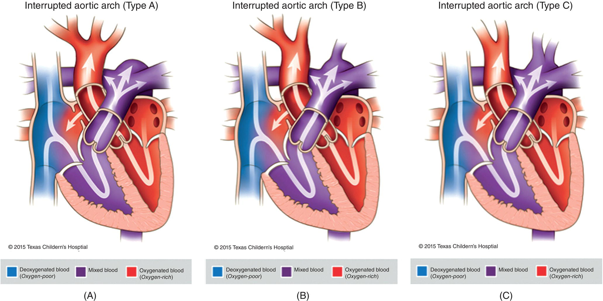

[**Figure 27.10**](#R_c27-fig-0010) Interrupted aortic arch. (A) Type A: interruption between the left subclavian artery and the ductus arteriosus. (B) Type B: interruption between the left carotid and left subclavian arteries. (C) Type C: interruption at the proximal aortic arch between the innominate and left carotid arteries.

(Source: Reproduced with permission from Texas Children’s Hospital.)

[**Table 27.6**](#R_c27-tbl-0006) Demographic and anatomic features associated with interrupted aortic arch

Source: Data from Oosterhof et al. \[127\].

| Variable | No. | Missing | Value | Deaths (_n_ = 186) |
| --- | --- | --- | --- | --- |
| Demographic characteristics |  |  |  |  |
| Age at admission (d, median and range) | 468 | 4 | 3 (birth‐30) |  |
| Demographic characteristics |  |  |  |  |
| Age at admission (d, median and range) | 468 | 4 | 3 (birth‐30) |  |
| Birth weight (kg, mean ± SD) | 190 | 282 | 3.04 ± 0.64 |  |
| Sex (female/male) | 471 | 1 | 234:237 | 80:106 |
| Noncardiac anomaly (No.) | 472 | 0 | 165 (35%) | 68 (41%) |
| DiGeorge syndrome (No.) | 472 | 0 | 86 (18%) | 33 (38%) |
| Morphologic characteristics (No.) |  |  |  |  |
| Type of IAA |  |  |  |  |
|   Type A | 468 | 0 | 130 (28%) | 33 (26%) |
|   Type B | 468 | 0 | 331 (70%) | 144 (44%) |
|   Type C | 468 | 0 | 7 (1%) | 7 (100%) |
| Major associated cardiac anomalies |  |  |  |  |
|   None – isolated VSD | 472 | 0 | 341 (72%) | 121 (35%) |
|   None – intact ventricular septum | 472 | 0 | 7 (1%) | 2 (29%) |
|   Aortopulmonary window | 472 | 0 | 20 (4%) | 3 (15%) |
|   Complete atrioventricular septal defect | 472 | 0 | 3 (<1%) | 3 (100%) |
|   Atrioventricular discordance | 472 | 0 | 2 (<1%) | 1 (50%) |
|   Double‐outlet right ventricle | 472 | 0 | 8 (2%) | 4 (50%) |
|   Partial anomalous pulmonary venous return | 472 | 0 | 1 (<1%) | 1 (100%) |
|   Single ventricle | 472 | 0 | 13 (3%) | 9 (69%) |
|   Transposition of great arteries with VSD | 472 | 0 | 26 (6%) | 9 (35%) |
|   Truncus arteriosus | 472 | 0 | 51 (11%) | 34 (67%) |
| Bicuspid aortic valve | 229 | 243 | 149 (65%) | 57 (38%) |
| Anomalous right subclavian artery | 427 | 45 | 108 (25%) | 45 (42%) |
| Left superior vena cava | 440 | 32 | 35 (8%) | 19 (54%) |
| Large patent ductus arteriosus | 281 | 191 | 251 (89%) | 94 (37%) |
| Large VSD | 392 | 80 | 322 (82%) | 123 (38%) |
| Multiple VSDs | 383 | 89 | 31 (8%) | 14 (45%) |
| Malalignment of VSD | 472 | 0 | 165 (35%) | 74 (32%) |

The diagnosis of IAA can usually be established with TTE, and cardiac catheterization is usually not indicated. MRI and CT angiography have also been used to delineate complex arch anatomy. Careful evaluation for additional cardiac anomalies, including the presence of LVOT obstruction, is important.

### Surgical and transcatheter approaches and outcomes

Surgical strategies for treatment have varied. A two‐stage approach involving initial repair of the aortic arch through a left thoracotomy accompanied by pulmonary artery banding allows for palliation without the use of CPB. This approach provides only limited exposure of the proximal aorta and does not allow the surgeon to address other coexisting lesions such as LVOT obstruction. A primary one‐stage repair using a midline sternotomy and CPB is now favored. This approach provides optimal exposure for aortic arch repair, and the ability to close the VSD and address other associated lesions. One multicenter study suggested that surgical approaches other than direct anastomosis with patch augmentation of the IAA may increase the risk for future aortic arch reintervention \[23\]. However, a subsequent study reported that 100% of patients required no arch reintervention at 5 years after direct anastomosis without patch augmentation when the descending thoracic aorta was circumferentially mobilized, ductal tissue aggressively excised, and a wide anastomosis made between the descending aorta and the posterior aspect of the distal ascending aorta \[134\]

In the setting of IAA with VSD and severe LVOT obstruction, an alternative surgical plan may be indicated. Alternative surgical strategies in the setting of severe LVOT obstruction include the Yasui procedure, which combines the interrupted arch repair with a Damus‐Kaye‐Stansel (DKS) \[135\]. A VSD patch baffle is utilized to connect the left ventricle to the DKS root and a right ventricle to pulmonary artery conduit is placed to provide pulmonary blood flow ([Figure 27.11](#c27-fig-0011)) \[136\]. This operation can be performed as the primary repair during the neonatal period or as a staged procedure in which a Norwood operation is the initial surgery. Another alternative strategy is to perform the Ross‐Konno procedure as the initial procedure or as subsequent operation for relief of LVOT obstruction.

Until the last decade, major aortic arch surgery required the use of deep hypothermia with circulatory arrest, which may adversely impact long‐term neurodevelopmental outcomes \[137\]. Many centers now use antegrade cerebral (ACP) and myocardial perfusion during arch repair providing continuous delivery of oxygen to the brain and minimizing myocardial ischemic time (see [Chapter 11](c11.xhtml)). Over the next decade, studies should elucidate whether these techniques improve survival and reduce long‐term morbidities.

Interrupted aortic arch continues to be associated with significant mortality during the perioperative period and subsequent long‐term follow‐up. A study reporting outcomes from 33 institutions between 1987 and 1997 found an overall survival of 60% at 21 years after initiation of study \[132\]. One‐third of patients in this study required one or more subsequent arch and/or LVOT procedures. Other studies found an overall perioperative mortality rate for procedures done since 1990 of 12%, compared with an overall mortality rate of 42% prior to 1985 \[138\]. One‐month survival of >92% following IAA repair has been reported at a number of centers \[128, 134\]. Risk factors reported to be associated with increased mortality include low birth weight, type B IAA, other major associated cardiac anomalies, DiGeorge syndrome, LVOT obstruction, and an episode of circulatory collapse prior to repair \[23, 127, 134\]. Several studies have questioned whether LVOT obstruction is a risk factor for increased operative mortality \[130, 134\].

Preoperative aortic root size has been shown to predict the need for reintervention for postoperative LVOT obstruction after single‐stage repair of IAA with VSD. In a single‐center study of 70 patients with IAA and VSD, 23% of patients required a reintervention for LVOT obstruction with a median time to reintervention of 1.2 years \[133\]. Subaortic resections were performed via a surgical approach, while aortic valve stenosis was treated with aortic balloon valvuloplasty. A recent publication recommended that in neonates with a preoperative aortic valve annulus diameter less than the patient’s weight in kilograms, the risk of LVOT obstruction after standard repair is high and some type of LVOT bypass procedure should be considered \[139\].

### Anesthetic considerations

Intravenous access will have been established in the neonate with IAA scheduled for surgery. Induction of general anesthesia is usually accomplished with an opioid and benzodiazepine in combination with a non‐depolarizing muscle relaxant. Inhaled anesthetic agents can be safely used as long as blood pressure is closely monitored and maintained. Management of ventilation following anesthetic induction and intubation is aimed toward optimizing systemic cardiac output. The use of a low inspired FiO2 and avoidance of hyperventilation reduces pulmonary overcirculation. The use of cerebral NIRS can help guide anesthetic management during this period.

The optimal position for placement of the arterial catheter requires careful consideration in the infant with IAA. The right subclavian artery may originate in an anomalous fashion from the descending aorta, especially in a type B IAA with associated subvalvular AS \[140\]. In one study, 15 of 49 patients with type B IAA had a coexisting anomalous right subclavian artery \[128\]. In some cases, the left subclavian artery may be utilized during the surgical repair. The use of an umbilical artery catheter is ideal in this setting. In the absence of an anomalous right subclavian artery, some centers prefer to have both a right upper extremity and lower body (UAC or femoral) arterial line. The right upper extremity arterial line allows for monitoring of arterial pressure to help guide flow rate during regional cerebral perfusion (See [Chapter 11](c11.xhtml) for detailed discussion). Central venous access is indicated for the infusion of inotropic agents and monitoring of intracardiac pressures. This can be accomplished by either percutaneous catheterization or placement of intracardiac lines by the surgeon prior to separating from CPB. Echocardiography using a pediatric TEE probe can effectively guide inotropic and fluid management, determine the adequacy of VSD closure, and assess the LVOT for any evidence of obstruction. Two intravenous catheters should be placed, as significant blood loss may occur following separation from CPB. The use of deep hypothermia places the infant at higher risk for significant bleeding after CPB; red blood cells, platelets, and cryoprecipate should be available. In the case of the infant with DiGeorge syndrome, the use of irradiated blood is necessary to avoid graft‐versus‐host reactions \[141\].

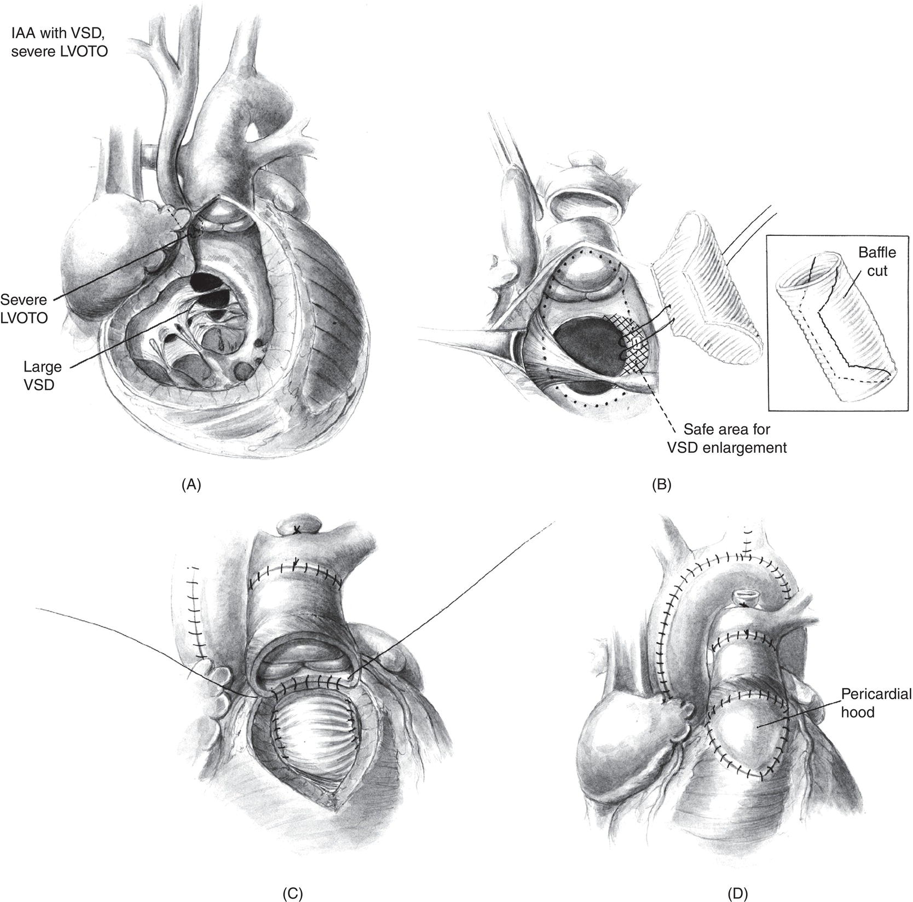

[**Figure 27.11**](#R_c27-fig-0011) Yasui operation. (A) This depicts a cutaway of the anatomy of a patient with type B interrupted aortic arch with severe left ventricular outflow tract obstruction (IAA/LVOTO). Commonly, these patients have aberrant origin of the right subclavian artery from the descending aorta. The left ventricular outflow tract obstruction is both muscular (subvalvular) as well as due to a hypoplastic aortic annulus and ascending aorta. A standard biventricular repair of interrupted aortic arch with VSD, consisting of VSD closure and repair of the arch, could result in significant postrepair left ventricular outflow tract obstruction. Although these patients can be managed with a neonatal Ross‐Konno procedure and arch repair, a Yasui operation is a useful alternative. IAA = interrupted aortic arch; LVOTO = left ventricular outflow tract obstruction; VSD = ventricular septal defect. (B) A Hemashield (Boston Scientific, Natick, MA) Dacron graft (usually 10 or 12 mm) is opened longitudinally and trimmed as shown in the inset. This is used to baffle the left ventricular outflow through the VSD to the pulmonary artery. At least half of the circumference of the graft is used to insure a generous unobstructed pathway through the VSD to the pulmonary valve. The superior tip of the baffle is typically at the most anterior portion of the right ventriculotomy and the inferior tip of the baffle is oriented just near the papillary muscle of Lancisi. A continuous 5/0 polypropylene suture is used for the majority of the baffle, keeping well on the right ventricular side of the VSD to avoid the area of the conduction tissue. The portion along the septal leaflet of the tricuspid valve is typically closed with interrupted pledgeted 5/0 polypropylene sutures with the pledgets on the atrial side of the tricuspid valve. This more easily can be done through the right atriotomy. VSD = ventricular septal defect. (C) The superior edge of the right ventriculotomy is sewn to the posterior wall of the proximal homograft with continuous 5/0 polypropylene incorporating the leading edge of the VSD patch into a portion of this anastomosis for hemostasis and security. (D) Right ventricular to homograft continuity is established with a roof of autologous pericardium using contin‐ uous 5/0 polypropylene to complete the repair.

(Source: Reproduced with permission from Kanter \[136\].)

Separation from CPB usually requires inotropic support and close monitoring of serum calcium levels. The infant with DiGeorge syndrome is prone to hypocalcemia and may benefit from a calcium infusion. Once the hemodynamics are stabilized and the bleeding is controlled, sternal closure may be attempted. Inotropic support, fluid management, and ventilation may need to be adjusted at this time. The patient should be closely monitored for pulmonary hypertension following repair and, if present, may benefit from inhaled nitric oxide. Should sternal closure result in unacceptable instability due to a reduction in cardiac output or pulmonary function, a polytetrafluoroethylene patch may be placed over the open chest for subsequent closure in 1–3 days.

* * *

### KEY POINTS: INTERRUPTED OR HYPOPLASTIC AORTIC ARCH

-   70% are type B (L common carotid‐subclavian artery; 90% VSD), 25% type A (distal to L subclavian artery; 50% VSD), 5% type C (innominate‐left common carotid)
-   Another important associated cardiac finding in the child with an interrupted arch includes LVOT obstruction.
-   Neonates with an IAA or severely hypoplastic aortic arch are dependent on patency of the ductus arteriosus for blood flow to major abdominal organs and the lower extremities.
-   IAA should be considered a chronic disease for which future interventions on the aortic arch and/or LVOT are common.
-   Management of ventilation prior to CPB includes the use of a low inspired FiO2 and avoidance of hyperventilation to increase pulmonary vascular resistance.

* * *

## Shone’s anomaly

### Incidence, anatomy, and natural history

Shone’s anomaly (or Shone’s complex) consists of a supravalvular mitral ring, parachute deformity of the mitral valve, subvalvular AS, and coarctation of the aorta, and was first described by Shone and colleagues in 1963. This complex of lesions causes multi‐level left heart obstruction and is variable in regard to the presence and severity of each lesion \[142, 143\]. In 30 consecutive patients with Shone’s anomaly, 73% had a supravalvular mitral ring, 87% had a parachute mitral valve, 87% had subvalvular AS, and 97% had coarctation of the aorta. Additional lesions also present in these patients were a bicuspid aortic valve (61%) and a VSD (67%) \[142\]. Hypoplasia of the left ventricle is generally not considered a component of Shone’s complex. The parachute mitral valve describes a mitral valve deformity where two mitral valve leaflets are supported by only one papillary muscle and the chordae are usually shortened and thickened \[144\] ([Figure 27.12](#c27-fig-0012)). Because the mitral leaflets are pulled together in proximity, the mitral valve can become stenotic. The supravalvular ring is a ridge of connective tissue arranged circumferentially on the atrial side of the mitral leaflets. Although this ring does not cause severe obstruction in the majority of cases, fibrous tissue can obtrude into the mitral inflow tract, causing obstruction. Although not classically considered part of Shone’s anomaly, “typical” congenital mitral stenosis with a small annular size has been noted in 25–50% of patients with Shone’s anomaly in two published series \[145, 146\]. Subvalvular AS is caused by either a discrete membranous thickening in the outflow tract or a more complex long‐segment “tunnel” stenosis. The coarctation is usually located in the descending aorta in proximity to the left subclavian artery.

Cor triatriatum must also be considered in the setting of left‐sided obstructive disease. The anomaly is characterized by the pulmonary venous return entering an accessory left‐sided chamber that connects with the left atrium through a slender passageway ([Figure 27.13](#c27-fig-0013)). The left atrial appendage and fossa ovalis are always distal to the obstructing membrane. In contrast, a supramitral stenosing ring, when present as part of Shone’s complex, leaves the left atrial appendage in connection with the upper portion of the left atrium and proximal to the stenosing formation \[147\].

The natural history of Shone’s anomaly is highly variable and dependent on the severity of the left‐sided obstructive lesions and the degree to which the obstructive lesions can be relieved. In particular, the degree of involvement of the left ventricular inflow tract is the major factor, which determines long‐term outcome. In a recent study of 45 children with Shone’s anomaly, the cumulative survival rate was 70% at 15 years following mitral valve repair, and risk factors for reoperation and mortality included the severity and type of mitral valve abnormalities, LVOT lesions, and pulmonary hypertension \[148\]. In another large retrospective single‐center study which followed 121 patients with Shone’s syndrome and a biventricular circulation, the transplant‐free survival was 86% \[139\]. These children required multiple surgical and catheter‐based interventions but showed significant left heart growth over the study period.

### Pathophysiology

Patient symptoms depend on the anatomic location of the most critical areas of obstruction. As many as two‐thirds of patients with Shone’s anomaly may present in the neonatal period with an aortic coarctation \[146\]. Assessment of the hemodynamic significance of lesions causing obstruction of the mitral valve or subaortic region can be very challenging in the context of a ductal‐dependent systemic circulation. After the repair of aortic coarctation, these infants are followed closely for signs of congestive heart failure often related to mitral valve abnormalities. Subvalvular AS is rarely significant in the neonatal period but can rapidly progress during infancy \[47\]. Those patients with a high degree of subvalvular AS will develop left ventricular hypertrophy.

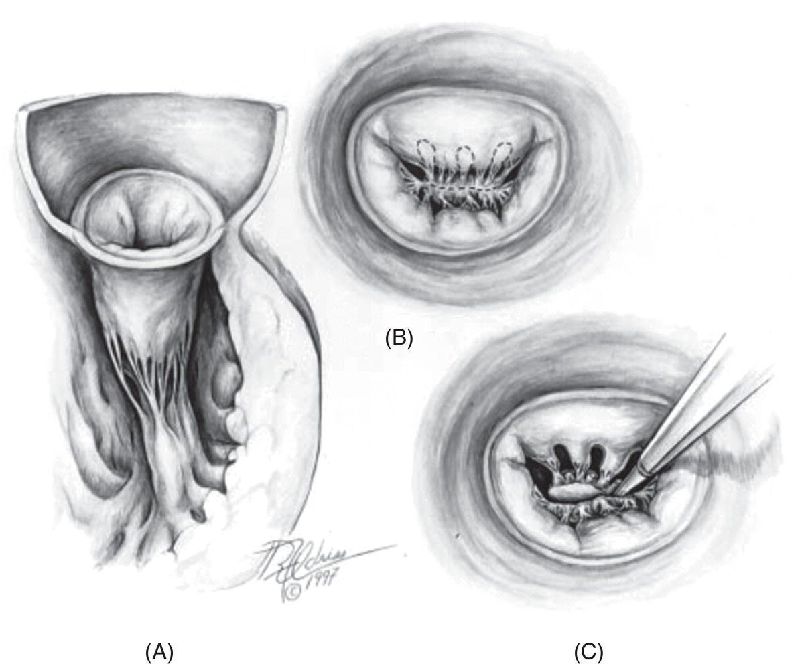

[**Figure 27.12**](#R_c27-fig-0012) Cut‐away atrioventricular view (A) and left atrial views (B, C) of a stenotic parachute mitral valve. (A) A single papillary muscle or fused papillary muscles usually arise from the posterior left ventricular wall. (B) The dotted lines show the areas of proposed leaflet fenestrations and papillary muscle incision to open the ven‐ tricular inlet. (C) Leaflet fenestrations are accomplished to maximize unrestricted blood flow into the left ventricle during diastole while preserving enough valvular tissue for effective coaptation during systole. The fused papillary muscle is being incised to facilitate valvular mobility.

(Source: Zias et al. \[144\]. Reproduced with permission from Elsevier.)

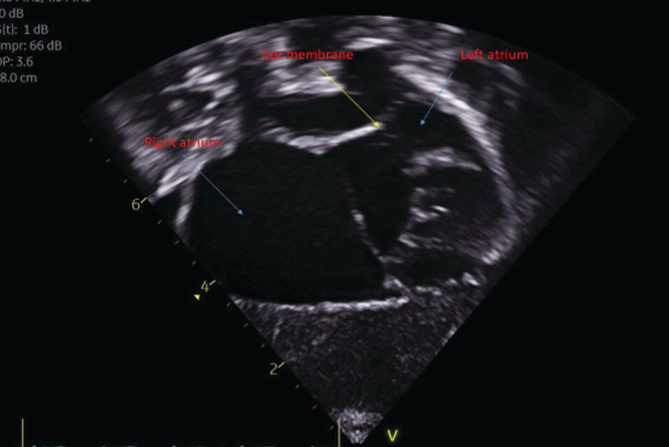

[**Figure 27.13**](#R_c27-fig-0013) Tranthoracic echocardiograpohic image of a patient with Cor Triatriatum.

(Source: Courtesy of Michael Taylor, MD.)

Echocardiography and cardiac catheterization with angiography are the primary diagnostic modalities for detecting and defining the extent of the Shone’s anomaly \[149\]. The presence of markedly elevated pulmonary vascular resistance at cardiac catheterization increases perioperative risk and worsens long‐term outcome. It is extremely important to be aware of all levels of obstruction, because the intraoperative repair of one obstruction may often reveal other less critical stenoses that continue to impede blood flow. Failure to recognize all levels of obstruction leads to increased perioperative risk for the patient.

### Surgical and transcatheter approaches and outcomes

The intracardiac surgical repair generally consists of resection of the supravalvular mitral ring, fenestration of the mitral valve tensor apparatus, repair or replacement of the mitral valve, and resection of any encroaching muscular tissue in the LVOT. When aortic arch obstruction is present, surgical repair of this lesion may be necessary during the neonatal period. Early mitral valve repair is advocated whenever possible, allowing for continued annular growth and avoidance of anticoagulation, and should occur before pulmonary hypertension develops \[146\]. When subvalvular AS is caused by a discrete membranous lesion, resection is performed through a transaortic approach and accompanied by ventricular septal myectomy, which is felt to reduce the incidence of recurrence \[150\]. A long‐segment “tunnel” type of subvalvular AS is commonly corrected with an aortoventriculoplasty (Konno procedure) \[151\] ([Figure 27.14](#c27-fig-0014)). The Konno operation is used to augment the left ventricular outflow tract and enlarge the aortic annulus and requires placement of a prosthetic aortic valve or a pulmonary autograft (Ross‐Konno) \[152\] ([Figure 27.15](#c27-fig-0015)). The modified Konno operation is performed when the aortic annulus is normal in size and placement of a prosthetic valve in the aortic position is not necessary \[153, 154\]. Intraoperative TEE is important for anatomic assessment before CPB and then following surgical repair. Surgical and long‐term outcomes for Shone’s anomaly depend on the age of presentation, severity of mitral valve disease, need for multiple surgical procedures, and presence of pulmonary hypertension \[142, 145, 146\]. Despite an initially satisfactory mitral valve repair, approximately one‐half of children with Shone’s anomaly will require a subsequent repair or mitral valve replacement \[148\].

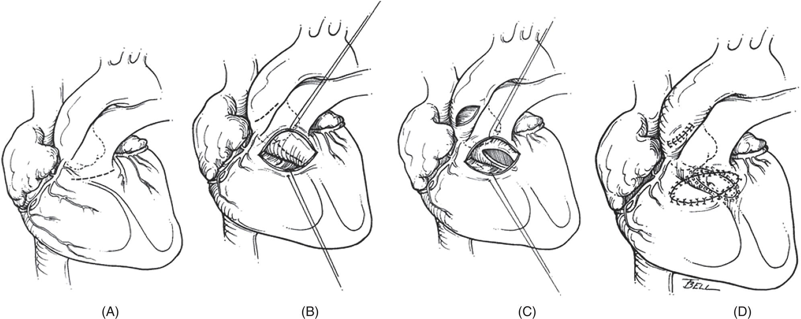

[**Figure 27.14**](#R_c27-fig-0014) The modified Konno operation. (A, B) Incisions are made in the ascending aorta (to assess outflow and protect aortic valve), infundibulum, and conal septum. (C, D) The outflow is enlarged with a polytetrafluoroethylene patch, and the infundibulotomy is also closed with a patch.

(Source: Takahashi & Hanzawa \[151\]. Reproduced with permission from Springer Nature.)

Diagnostic cardiac catheterization is often indicated in patients with Shone’s anomaly to better assess the relative hemodynamic significance of multi‐level left‐sided obstructive lesions and the degree of pulmonary hypertension. Catheter‐based interventions may also be indicated to address primary or recurrent aortic arch obstruction.

## Anesthetic considerations

The medical management of patients with Shone’s complex depends on the location of the most critical stenosis. Neonates with coarctation of the aorta will require prostaglandins to maintain patency of the ductus arteriosus and appropriate ventilatory strategies aimed at reducing pulmonary overcirculation. Children with dynamic LVOT obstruction may require β‐blockers to improve intracavitary laminar blood flow. Congestive heart failure is usually treated with diuretics and may require inotropic support. The presence of pulmonary hypertension before or after surgery for relief of a left sided obstructive lesion may require a phosphodiesterase inhibitor (such as milrinone) and nitric oxide \[155, 156\]. In the presence of a significant left‐sided obstructive lesion, the effects of nitric oxide can be variable, and this drug should be used with caution.

The anesthetic management of the patient with Shone’s anomaly requires an appreciation of all levels of stenosis and knowledge of the location of the dominant lesion. A patient with predominantly mitral stenosis requires sufficient preload to maintain left atrial pressure, and a normal to slow heart rate to optimize ventricular filling during diastole. In the patient primarily suffering from subvalvular AS and left ventricular hypertrophy, arterial pressure needs to be maintained for optimal myocardial perfusion. An anesthetic plan carefully tailored to meet these hemodynamic goals is vital for optimal outcome.

* * *

### KEY POINTS: SHONE’S ANOMALY

-   Shone’s anomaly consists of multiple left‐sided obstructive lesions, including a supravalvular mitral ring, parachute deformity of the mitral valve, subaortic stenosis, and coarctation of the aorta.
-   The presence of multiple levels of obstruction can make assessment of the degree of obstruction at each level extremely challenging.
-   Important principles of anesthetic management include maintaining sufficient preload, a normal to slow heart rate to optimize ventricular filling, and maintaining arterial blood pressure to assure optimal myocardial perfusion.

* * *

## Mitral stenosis

### Incidence, anatomy, and natural history

Mitral stenosis is most often observed as a component of a complex left‐sided malformation syndrome, i.e., Shone’s anomaly. Isolated congenital mitral valve stenosis is a rare lesion, occurring in well less than 1% of infants with CHD and a normal‐sized left ventricle \[157\]. The anatomical complexity of the mitral valve and its supporting apparatus, the papillary muscles and chordae tendineae, have led to several complicated schemata to describe abnormalities of the mitral valve \[157–159\]. One functional classification of mitral stenosis anatomy divides this lesion into type A, with a normal papillary muscle, which includes commissural fusion, a valvular or supravalvular ring, or an obstructive left superior vena cava, and type B, which consists of an abnormal papillary muscle producing a parachute, or a hammock mitral valve. \[159\]. The natural history of mitral valve stenosis is dependent on the severity of the stenosis and the feasibility of repair or replacement.

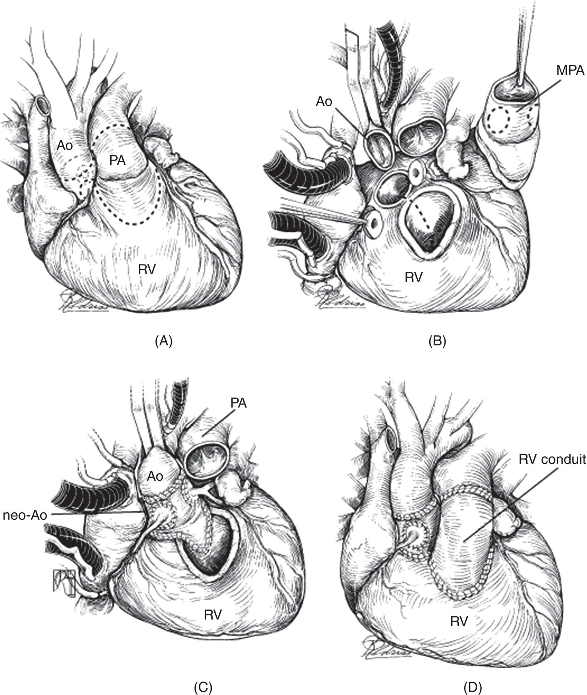

[**Figure 27.15**](#R_c27-fig-0015) Ross‐Konno operation. (A) Intended incision and excision boundaries en route to the Ross‐Konno Procedure. (B) After aortic cross‐clamping, antegrade and retrograde cardioplegic arrest, aortic resection, coronary mobilization, and main pulmonary artery harvest, the inter ventricular incision is noted by the dotted line. The pulmonary autograft was harvested, with an extra portion of right ventricle to be used for the ventriculoseptoplasty part of this operation. (C) The neoaortic left ventricular outflow recontruction is shown using the pulmonary autograft extension into the interventricular septum (“apron extension”). (D) The completed Ross‐Konno procedure is shown after separation from cardiopulmonary bypasss. Ao, aorta, aortic; MPA, main pulmonary artery; PA, pulmonary artery; RV right ventricle.

(Source: Tchervenkov et al. \[152\]. Reproduced with permission from John Wiley & Sons.)

### Pathophysiology

Depending on the degree of mitral stenosis, a progressive elevation in left atrial pressure can lead to pulmonary venous and then pulmonary arterial hypertension. This can result in interstitial pulmonary edema, “cardiac asthma,” frequent respiratory infections, tachypnea, poor feeding and poor growth. Significant pulmonary hypertension will be accompanied by elevated right ventricular pressures, right ventricular hypertrophy, and potentially diminished function. Left‐sided cardiac output will be restricted by diminution of blood flow into the left ventricle. A resultant tachycardia shortens diastolic filling time and can severely depress systemic cardiac output. Hypovolemia reduces left ventricular end‐diastolic volume and pressure, worsening the functional mitral stenosis. In patients with elevated pulmonary artery pressure and resistance, maneuvers to reduce PVR may paradoxically worsen the obstructive pulmonary symptoms by promoting increased pulmonary blood flow in the face of a fixed downstream obstruction. A frequently dilated left atrium predisposes to atrial arrhythmias such as atrial flutter, atrial fibrillation, or atrial tachycardia.

Anatomical diagnosis of mitral stenosis is often based solely on echocardiographic findings. Three‐dimensional echocardiography is particularly useful in defining the morphological complexity of the diseased mitral valve and its use is increasingly widespread \[160, 161\]. Decisions about intervening are made on the basis of increasing clinical symptomatology, such as frequent respiratory infections and failure to thrive despite optimal medical management.

### Surgical and transcatheter approaches and outcomes

When surgery is indicated, most congenital heart surgeons adopt a conservative approach, repairing the stenotic valve whenever possible \[162\]. There are a number of techniques employed, including resection of a supravalvular ring, commissurotomy, division or reconstruction of the papillary muscles, and reconstruction of the chordae tendineae \[159, 162\]. The main goal of surgery is to reduce the mitral stenosis without producing mitral regurgitation; the surgeon will often perform a test of the repair with the aorta cross‐clamped by rapidly instilling saline solution through the repaired valve to produce a normal end‐diastolic volume. Retention of this volume in the left ventricle signifies lack of significant mitral regurgitation. After separation from bypass, TEE is critical in assessing the adequacy of repair and the need for returning on bypass to improve the surgical result. Because of the potential morbidity from anticoagulation and the need for future replacement as a child grows, mitral valve replacement is performed only as a last resort in young children, when attempts at repair have failed. However, when a mitral valve repair cannot be successfully performed in these patients, a supra‐annular mitral valve replacement may be necessary in infants because of the small size of the annulus. Surgical outcomes are dependent on the specific abnormality and the feasibility of repair. The need for mitral valve replacement increases the risk of both short‐ and long‐term complications. In some cases, interventional catheter approaches have been successfully used to dilate a stenotic mitral valve \[163\].

### Anesthetic considerations

Hemodynamic goals in mitral stenosis include maintaining a low‐normal heart rate to enhance diastolic filling time for the left ventricle and maintaining preload to minimize the functional stenosis across the valve. Preserving ventricular contractility and afterload are important goals of any technique. Maintaining normal sinus rhythm is critical; therefore, prompt recognition and treatment of atrial dysrhythmias are important. With severe mitral stenosis, the patient will have significant pulmonary hypertension and care must be taken not to induce a pulmonary hypertensive crisis, e.g., due to a large catecholamine surge secondary to inadequate anesthetic depth. On the other hand, acutely lowering PVR with excessive FiO2 and hyperventilation will promote excessive pulmonary blood flow, often leading to worsening pulmonary function due to the fixed downstream obstruction at the level of the mitral valve.

During surgical repair, the left side of the heart will by necessity be opened, and there is the potential for retention of significant air in the heart during weaning from bypass. Accordingly, prolonged cardiac de‐airing maneuvers, assisted by TEE, may be required. Some surgeons will insufflate CO2 into the surgical field to improve the dissolution of any gas retained in the left side of the heart \[164\].

After bypass, a left atrial and possibly a pulmonary artery catheter may be placed by the surgeon. It is important to realize that pulmonary artery pressures may not be immediately reduced, and treatment with adequate depth of anesthesia and analgesia, milrinone, nitric oxide, high FiO2, and mild hyperventilation may be required for hours or days. Left atrial pressure should decrease with successful mitral valve repair in the face of normal left ventricular function. TEE is crucial to assess the immediate results of the surgical repair.

### Cor triatriatum

Cor triatriatum is a rare anomaly seen in about 0.1% of patients with CHD, consisting of a membrane or diaphragm in the left atrium, functionally dividing it into two chambers, where the pulmonary veins enter superior to the membrane \[165\] ([Figure 27.13](#c27-fig-0013)). Blood flows from the upper to the lower left atrial chamber through one or more orifices, and the patient’s symptoms and presentation depend on the degree of restriction of blood flow through these orifices, and can range from completely asymptomatic to severely restricted blood flow. This may result in severe left atrial hypertension, pulmonary venous and arterial hypertension, and low cardiac output, similar to that seen in severe mitral stenosis. Pulmonary symptoms such as wheezing are prominent and may be the only presenting complaint \[166\]. Most patients present in the first year of life, and 24–80% have associated cardiac anomalies such as anomalous pulmonary venous drainage, left superior vena cava, or HLHS. The surgical approach consists of resecting the membrane in the left atrium and repairing associated defects. Anesthetic considerations are identical to those for the patient with mitral stenosis.

* * *

### KEY POINTS: MITRAL STENOSIS/COR TRIATRIATUM

-   Hemodynamic goals include slow‐normal heart rate, and maintenance of normal sinus rhythm and adequate preload and afterload.
-   Severe obstruction from these lesions can result in significant left atrial hypertension, and pulmonary venous and arterial hypertension, which may need to be managed with inhaled nitric oxide after surgical repair.
-   In the face of severe obstruction pre‐bypass, nitric oxide and other maneuvers to decrease PVR can worsen the problems because they do not address the anatomic obstruction.

* * *

## Selected references

_A full reference list for this chapter is available at_: [http://www.wiley.com/go/andropoulos/congenitalheart](http://www.wiley.com/go/andropoulos/congenitalheart)

1.  11 Vlahos AP, Marx GR, McElhinney D, et al. Clinical utility of doppler echocardiography in assessing aortic stenosis severity and predicting need for intervention in children. Pediatr Cardiol 2008; 29:507–14. Comparison of echocardiographic and cardiac catheterization data in children with isolated valvular aortic stenosis to determine the optimal echocardiographic methodology for predicting the need for intervention.
2.  19 Sachdeva S, Kuhn E, Frommelt PC, Handler S. Role of echocardiographic scoring systems in predicting successful biventricular versus univentricular palliation in neonates with critical aortic stenosis. Cardiol Young 2020; 30:1702–7. Comparing the utility of different scoring systems to predict successful biventricular repair of severe aortic stenosis.
3.  23 McCrindle BW, Tchervenkov CI, Konstantinov IE, et al. Risk factors associated with mortality and interventions in 472 neonates with interrupted aortic arch: a congenital heart surgeons society study. J Thorac Cardiovasc Surg 2005; 129:343–50. A Congenital Heart Surgeons Society Study looking at oucomes following interrupted aortic arch repair.
4.  40 Buratto E, Konstantinov IE. Aortic valve surgery in children. J Thorac Cardiovasc Surg 2021; 161:244–50. Review of surgical treatment options for aortic stenosis and their outcomes.
5.  52 Gray JC, 3rd, Krazinski AW, Schoepf UJ, et al. Cardiovascular manifestations of Williams syndrome: imaging findings. J Cardiovasc Comput Tomogr 2013; 7:400–7. Contemporary review of imaging findings of cardiovascular manifestations of Williams syndrome, a disease with significantly increased prevalence of cardiac events and sudden death.
6.  72 Monda E, Rubino M, Lioncino M, et al. Hypertrophic cardiomyopathy in children: pathophysiology, diagnosis, and treatment of non‐sarcomeric causes. Front Pediatr 2021; 9:1–19. A contemporary review of hypertrophic cardiomyopathy in children.
7.  104 Gropler MRF, Marino BS, Carr MR, et al. Long‐term outcomes of coarctation repair throught left thoracotomy. Ann Thorac Surg 2019; 107:157–64. A single center retrospective review of surgical outcomes after coarctation repair and the impact of transverse arch hypoplasia on surgical approach.
8.  116 Ammar RI. Balloon angioplasty for native aortic coarctation in children and infants younger than 12 months: immediate and medium‐term follow‐up. J Invasive Cardiol 2012; 24:662–6. Immediate and medium‐term outcomes for balloon angioplasty of native aortic coarctation in infants <12 months of age.
9.  148 Delmo Walter EM, Van Praagh R, Miera O, et al. Repair of left ventricular inflow tract lesions in Shone's anomaly: valve growth and long‐term outcome. Ann Thorac Surg 2013; 95:948–55. Retrospective study of 45 chidren with Shone’s anomaly demonstrating that long‐term functional outcomes best correlate with successful mitral valve repair.