CHAPTER 28 Anesthesia for Right‐Sided Obstructive Lesions 

# CHAPTER 28  
Anesthesia for Right‐Sided Obstructive Lesions

_Michael L. Schmitz1, Destiny F. Chau2, R. Ryan Das3, Lorraine L. Thompson4, and Sana Ullah5_

1 Chief, Pediatric Cardiac Anesthesiology, Log A Load for Kids of Arkansas Endowed Chair in Congenital Cardiac Disorders, Pediatric Cardiothoracic Surgery, Pediatric Anesthesiology and Pain Medicine, Arkansas Children’s Hospital, University of Arkansas for Medical Sciences, Little Rock, AR, USA

2 Professor of Anesthesiology, Pediatric Cardiothoracic Anesthesiology, Arkansas Children’s Hospital, University of Arkansas for Medical Sciences, Little Rock, AR, USA

3 Associate Professor of Anesthesiology, Arkansas Children’s Hospital, University of Arkansas for Medical Sciences, Little Rock, AR, USA

4 Pediatric Anesthesiologist, Ellensburg, WA, USA

5 Associate Professor of Anesthesiology and Pain Management, Children’s Medical Center Dallas & UTSW Medical Center, Dallas, TX, USA

* * *

-   [**Introduction**](#head-2-283)
-   [**Ebstein anomaly**](#head-2-284)
    -   [Incidence, anatomy, and natural history](#head-3-473)
    -   [Pathophysiology](#head-3-474)
    -   [Surgical and transcatheter approaches and outcomes](#head-3-475)
    -   [Anesthetic considerations](#head-3-476)
-   [**Tetralogy of Fallot**](#head-2-285)
    -   [Incidence, anatomy, and natural history](#head-3-477)
    -   [Pathophysiology](#head-3-478)
    -   [Surgical and transcatheter approaches and outcomes](#head-3-479)
    -   [Anesthetic considerations](#head-3-480)
-   [**Pulmonary stenosis with intact ventricular septum**](#head-2-286)
    -   [Incidence, anatomy, and natural history](#head-3-481)
    -   [Pathophysiology](#head-3-482)
    -   [Surgical and transcatheter approaches and outcomes](#head-3-483)
    -   [Anesthetic considerations](#head-3-484)
-   [**Pulmonary atresia with intact ventricular septum**](#head-2-287)
    -   [Incidence, anatomy, and natural history](#head-3-485)
    -   [Pathophysiology](#head-3-486)
    -   [Surgical and transcatheter approaches and outcomes](#head-3-487)
    -   [Anesthetic considerations](#head-3-488)
-   [**Pulmonary atresia/ventriculoseptal defect/major aortopulmonary collateral arteries**](#head-2-288)
    -   [Incidence, anatomy, and natural history](#head-3-489)
    -   [Pathophysiology](#head-3-490)
    -   [Surgical and transcatheter approaches and outcomes](#head-3-491)
    -   [Anesthetic considerations](#head-3-492)
-   [**Summary**](#head-2-289)
-   [**Acknowledgements**](#head-2-290)
-   [**Selected references**](#head-2-291)

* * *

## Introduction

Right‐sided obstructive congenital heart disease (CHD) is extremely variable in presentation – both in severity and clinical signs and symptoms. In some cases, severe cyanosis and/or congestive heart failure (CHF) is immediately apparent in a neonate, whereas in other cases, a teenager or adult may present with mild complaints of fatigue or reduced exercise ability. Variations in the extent of malformations in the right heart and great vessels dictate the severity and timing of presentation. All right‐sided obstructive diseases can cause right‐to‐left shunting of blood flow.

Obstruction to blood flow in the right heart can result from malformations at a single anatomical area, such as the right atrioventricular (AV) valve, or multiple structural sites, as found in the tetralogy of Fallot (TOF). Failure of tissue formation and coordinated growth leads to poor development of valvar structures and incomplete septation of the right heart from the left. Impairment of normal hemodynamic blood pressures and flows from structural anomalies adds further malformations such as chamber dilation or hypertrophy as well as abnormal blood vessel growth and formation.

Right‐to‐left shunting is present in patients who manifest cyanotic right‐sided obstructive heart disease. Examples include deoxygenated blood passing to the left heart via a patent foramen ovale (PFO) or atrial septal defect (ASD) as might be found with severe Ebstein anomaly (EA) or a ventricular septal defect (VSD) in TOF. Those patients who do not present with neonatal cyanosis may manifest periodic cyanosis from variations in shunt direction, depending on the relative pressures between the right and left chambers of the heart. When right heart pressures are higher than left, the right‐sided hypertension can be partially relieved by the right‐to‐left blood flow when septal defects are present. With severely restrictive septal defects, inadequate relief of right‐sided hypertension manifests with CHF.

The degree of neonatal systemic hypoxemia that accompanies right‐sided obstruction is also dependent on the patency of the ductus arteriosus. Pulmonary blood flow (PBF) in the presence of severe obstructions of the right heart, such as with critical pulmonary stenosis (PS) or pulmonary atresia (PA), might be entirely dependent on a patent ductus arteriosus (PDA). Affected neonates can rapidly show signs of increasing hypoxemia, such as respiratory distress and deepening cyanosis when the ductus arteriosus begins to close shortly after birth unless the ductal patency is stabilized with exogenous prostaglandin E1 (PGE1).

Congenital malformations that impede blood flow through the right heart can occur at a single critical anatomical area or a combination of areas. These include the right AV valve, the outflow tract of the right ventricle (RV), the pulmonary valve (PV), and the main pulmonary artery (MPA) and/or branch pulmonary arteries (BPAs). Commonly, congenital malformations affect several of these critical areas simultaneously, such as in TOF. Malformations can occur directly as a result of aberrant movement of tissues during development or indirectly as a result of impaired flow hemodynamics due to misaligned structural anatomy. Often the resultant congenital heart deformity is a combination of both processes.

The physiology of right‐sided obstructive defects and the changes that occur with palliative or reparative intervention in the context of perioperative anesthetic care and planning for such patients are described in this chapter for:

-   EA
-   TOF
-   PS with intact ventricular septum (PS/IVS)
-   PA with intact ventricular septum (PA/IVS)
-   PA and VSD with major aortopulmonary collateral arteries (MAPCAs).

Other right‐sided obstructions such as those that result in a single functional ventricle (e.g. tricuspid atresia) are covered elsewhere in this book. See [Chapter 30](c30.xhtml).

## Ebstein anomaly

### Incidence, anatomy, and natural history

Although EA occurs in only 0.3–0.7% of CHD, it is the most common congenital malformation of the tricuspid valve (TV) \[1\]. The incidence is approximately 1/10,000 live births \[2\]. EA was first described by Ebstein in 1866 \[3\] from necropsy findings. Clinical diagnosis was not achieved until 1949 \[4\] because the clinical presentation of more severe cases with diminished PBF and cyanosis resembled TOF, and partial competence of the malformed TV often was enough to prevent signs of CHF until late in evolution of the disease \[5\]. EA is characterized by a malformed TV and RV \[6\] ([Table 28.1](#c28-tbl-0001)). With advent of cardiac catheterization and echocardiography, cardiologists were much more able to diagnose EA with certainty.

The highly varied range of dysplastic characteristics of EA causes extreme variations in clinical presentation from the neonate to the adult \[7–9\] ([Figures 28.1](#c28-fig-0001)–[28.2](#c28-fig-0002), [Table 28.1](#c28-tbl-0001)). The septal and posterior leaflets vary in the apical displacement of their attachments, and in approximately one third of cases the septal and/or posterior leaflets may remain adherent to the ventricular myocardium due to a failure of delamination. The anterior leaflet is attached at the functional annulus in a position superior to the other leaflets, but it is morphologically abnormal. Large with apparent redundant tissue, the leaflet frequently appears sail‐shaped, often with fenestrations, and with abnormal RV attachments at the boundary of the inlet and trabecular areas. The anterior leaflet and/or the shortened chordae/dysplastic papillary muscles can restrict blood flow from the atrium/atrialized RV to the trabecular RV. Slits or perforations in the abnormally fixed anterior leaflet can be a significant obstruction. The shortened chordae extend from dysplastic papillary muscles. The trabecular RV is small, and sometimes very small, lacking an inlet chamber. Trabecular RV myocardial function can be normal or impaired with thin walls. An interatrial shunt is almost invariably present as over one third will have an ASD and most of the remainder will have a PFO.

[**Table 28.1**](#R_c28-tbl-0001) Characteristics of the malformed tricuspid valve and right ventricle in Ebstein anomaly

<table border="1"><tbody class="tdcolor4"><tr><td class="left"><ul id="c28-list-0002"><li id="c28-li-0006">The septal and posterior leaflets of the tricuspid valve fail to separate from the underlying myocardium</li><li id="c28-li-0007">The functional annulus of the tricuspid valve is displaced toward the apex; the septal leaflet is most displaced followed by lesser displacement of the posterior leaflet and least displacement of the anterior leaflet.</li><li id="c28-li-0008">The anterior leaflet is large with redundant tissue, often with fenestrations, and is tethered.</li><li id="c28-li-0009">A portion of the right ventricle located below the right coronary sulcus and above the functional but displaced annulus (the “atrialized” right ventricle) is dilated with an often thin and dysplastic freewall.</li><li id="c28-li-0010">There is dilation of the atrioventricular junction, the location of the true tricuspid valve annulus.</li></ul></td></tr></tbody></table>

The line formed at the site of the distally displaced tricuspid leaflets serves as a functional TV ring and is the boundary between the trabecular and atrialized portions of the RV ([Figure 28.3](#c28-fig-0003)). Above this line of the distally displaced TV leaflets, the inlet portion of the anatomical RV serves as part of the RA. The atrialized portion of the RV is often thin and dilated with an abnormal ventricular electrical conduction pattern. Extreme thinning of the atrialized or inlet RV wall causes it to exhibit paradoxical movement with ventricular systole and dilation with RA contraction. The RA is dilated and sometimes massively dilated. The dilation of the atrialized RV creates an abnormal position for the interventricular septum, compromising left ventricular (LV) geometry and reducing the size of the LV chamber. There is increased fibrosis in both ventricles.

On prenatal ultrasound screening, the most severe forms of EA present with hydrops fetalis characterized by a massively enlarged heart and pulmonary hypoplasia. Lesser affected infants will have a neonatal course dependent on the severity of the EA defects, ranging from asymptomatic to cyanosis of varying degrees. Cyanotic neonates with severe obstruction will show signs of CHF that could lead to death. In general, cyanotic neonates with EA require intervention for survival. For lesser affected infants, the clinical presentation ranges from asymptomatic to progressive CHF depending on the degree of apical displacement of the TV. Diagnosis is sometimes delayed until symptoms present in older children or young adults, and less commonly in middle age or later. Generally, exercise tolerance is minimally impaired in the mildly affected unless the foramen ovale is not patent. Adults who present with CHF from long‐term effects of tricuspid regurgitation (TR) have a poor prognosis without definitive intervention. Severity cyanosis in children and young adults with EA is associated with a poor prognosis. Even milder forms of EA that present in late childhood, adolescence, or young adulthood often result in death from CHF in the second and third decades of life without surgical intervention. For those asymptomatic individuals who have not developed CHF, up to 20% may die of atrial and ventricular arrhythmias, sometimes as a sudden death. Paradoxical emboli, abscess formation, and less commonly endocarditis contribute to later fatalities \[10\].

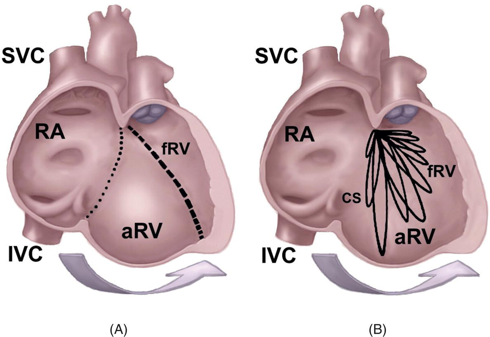

[**Figure 28.1**](#R_c28-fig-0001) (A) Normal tricuspid valve attachments at the atrioventricular junction (dotted line) and the direction of the hinge line (dashed line) of the valve in Ebstein malformation. (B) The location of the functional orifice of the abnormal valve (black ovals) as observed in the series of hearts examined by Schreiber et al. \[7\]. aRV, atrialized right ventricle; CS, coronary sinus; fRV, functional right ventricle; IVC, inferior vena cava; RA, right atrium; SVC, superior vena cava.

(Source: Dearani et al. \[8\]. Reproduced with permission of Cambridge University Press.)

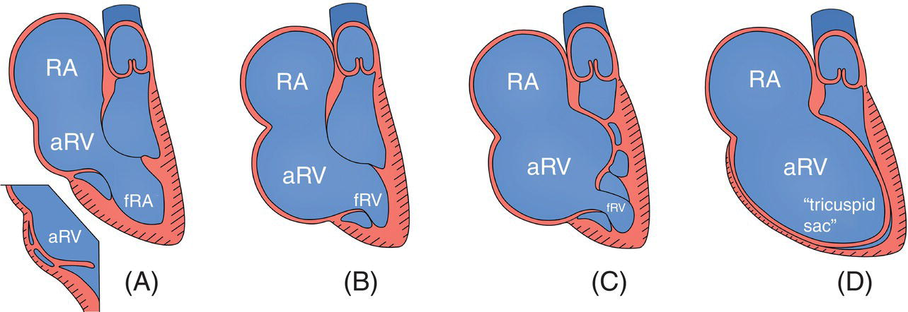

[**Figure 28.2**](#R_c28-fig-0002) Carpentier classifications of four anatomical types of Ebstein anomaly. (A) Small, contractile, atrialized chamber (the “atrialized right ventricle, aRV”) with mobile anterior leaflet with no or limited (inset drawing) obliteration of the interchordal space and moderate apical displacement of septal and posterior leaflets. (B) Large, noncontractile atrialized chamber with no or limited interchordal space obliteration and mobile anterior leaflet with marked apical displacement of septal and posterior leaflets. (C) Anterior leaflet with restricted motion due to obliteration of interchordal spaces and attachment of the inferior edge to the ventricle and fibrous bands attaching other leaflet areas to the infundibulum, marked displacement of septal and posterior leaflets that may be severely hypoplastic. Atrialized chamber is large with a thin, noncontractile wall. (D) Leaflet tissue forms a continuous sac adherent to the dilated right ventricle, creating a “tricuspid sac,” with obliterated interchordal spaces. RA: right atrium; RV: right ventricle.

(Source: Carpentier et al. \[9\]. Reproduced with permission of Elsevier.)

### Pathophysiology

The TR of EA and the degree of downward displacement of the TV variably impair adequate development of the heart. Diminished flow through the RV _in utero_ may play a role in the development of right ventricular outflow tract obstruction (RVOTO), PS, and even PA. Significant TR places a volume load on the RV that results in a largely dilated RV that impairs LV function. Severe TR produces a massively ballooned RA. As pulmonary vascular resistance (PVR) decreases and stabilizes to near adult values, forward flow in the neonatal right heart can cause EA signs to improve \[11, 12\]. A cyanotic neonate with an unrestrictive ASD may eventually become acyanotic with acceptable cardiac output (CO). However, an infant with a restrictive ASD can have a low CO due to LV impairment from malposition of the interventricular septum with paradoxical motion.

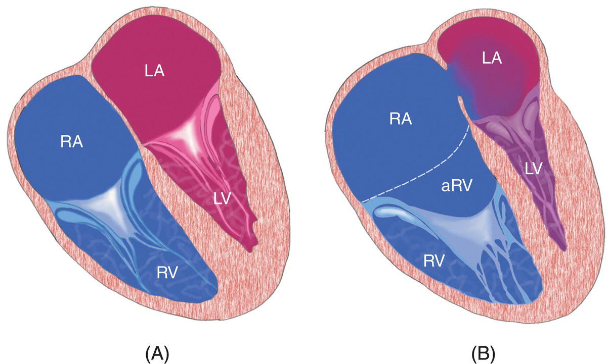

[**Figure 28.3**](#R_c28-fig-0003) (A) Normal heart, and (B) heart with Ebstein anomaly. Carpentier class A (dashed white line indicates level of atrioventricular junction). aRV, atrialized right ventricle; LA, left atrium; LV, left ventricle; RA, right atrium; RV, right ventricle.

(Source: Michael L. Schmitz, MD.)

The distortion of atrial and ventricular chambers with EA is associated with arrhythmias that can further impair function and be life‐threatening. As many as 25–30% of individuals will have atrial flutter, atrial fibrillation and paroxysmal supraventricular tachycardia. Other electrophysiological abnormalities are also frequently present \[1\] ([Table 28.2](#c28-tbl-0002)).

Familial genetically inherited forms of EA are sometimes associated with LV noncompaction cardiomyopathy. In fact, the type of CHD most associated with this myopathy is EA. This combination is associated with mutations in the B‐myosin heavy chain gene MYH7. Although autosomal dominant, gene penetrance is variable as some individuals do not have cardiac abnormalities \[13\]. Characteristics of LV noncompaction include prominent trabeculations with deep intratrabecular recesses that give the LV a spongy appearance on cardiac ultrasonography. Added risks of CHF, arrhythmias, thromboemboli, and sudden cardiac death occur with this combination \[14\]. Recent genetic analyses of patients with EA suggest multiple genetic associations with genes involved with myocardial development or function other than MYH7 including NKX2‐5, TTN, MYH6 as well as a number of various single nucleotide alterations, genetic locus deletions/duplications and copy number variants \[15\] not infrequently associated with cardiomyopathies.

[**Table 28.2**](#R_c28-tbl-0002) Major electrophysiologic abnormalities in Ebstein anomaly

<table border="1"><tbody class="tdcolor4"><tr><td class="left"><ul id="c28-list-0003"><li id="c28-li-0011">Intra‐atrial conduction disturbance: right atrial P‐wave abnormalities, PR prolongation</li><li id="c28-li-0012">Atrioventricular nodal conduction: PR interval prolongation</li><li id="c28-li-0013">Infranodal conduction<ul class="circle" id="c28-list-0004"><li id="c28-li-0014">Intra‐His or infra‐His conduction abnormalities</li><li id="c28-li-0015">Right bundle branch block</li><li id="c28-li-0016">Bizarre <i>second</i> QRS attached to preceding normal QRS</li></ul></li><li id="c28-li-0017">Type B Wolff–Parkinson–White pre‐excitation</li><li id="c28-li-0018">Supraventricular tachycardia</li><li id="c28-li-0019">Atrial fibrillation or flutter</li><li id="c28-li-0020">Arrhythmogenic atrialized right ventricle</li><li id="c28-li-0021">Deep Q waves in Leads V1–4 and in inferior leads</li></ul></td></tr></tbody></table>

Progressive right heart failure resulting from TR, an inadequately sized RV pumping chamber, and other right‐sided obstruction combined with the EA TV are sometimes indications for surgery in the infant or child. Otherwise, moderate CHF can be treated with diuretic therapy, perhaps combined with digoxin. Medical therapy and perhaps catheter ablation can be used to control some types of arrhythmias. However, if deterioration of the TV and RV appears progressive, long‐term outcome will be improved with earlier surgical intervention \[16\].

### Surgical and transcatheter approaches and outcomes

The timing of intervention for EA is determined by the degree of apical displacement of the functional TV, the competency of the TV, the presence of PA or circular shunting, and the age of the patient ([Figure 28.4](#c28-fig-0004)). Depending on the size of the trabecular RV, patients may undergo two ventricle repair or be palliated with one‐and‐one‐half (1.5) or single ventricle surgical pathways. Timing of intervention in neonates also takes into account potential RVOTO and allowance for PVR to resolve to near adult pressures. Only the most severely compromised infants are generally considered for cardiac transplantation \[11\] such as those with poor biventricular function and/or uncontrollable arrhythmias. Decision‐making for the type of surgical repair or palliation depends first on the age of the patient and secondly on two key elements: the TV morphology and the size of the trabeculated RV ([Figure 28.5](#c28-fig-0005)). A number of infants with adequate trabecular RVs have successfully undergone two ventricular repairs.

In 1958 after studying EA heart specimens, Hunter and Lillehei \[17\] suggested a potential repair for the TV but advances in valvuloplasty ultimately led to the first successful EA TV repair in 1963 \[18\]. From 1972 onward, further refinements in valvuloplasty by Danielson et al. \[19\] and others have improved survival for patients with EA ([Table 28.3](#c28-tbl-0003)).

Techniques for valvuloplasty of the EA TV have evolved for nearly 60 years. A technique introduced in 1972 altered the anterior leaflet of the TV such that it would approximate the ventricular septum or the small, malformed septal leaflet during systole. Coaptation of the TV was facilitated by plicating the TV annulus at the apical boundary of the atrialized RV to reduce annulus diameter \[19\]. Further modifications for mobilizing and fixing the anterior and posterior leaflets at the true tricuspid annulus while utilizing a valve ring ensued \[9\]. Some infants with adequately sized RVs have done well with an aggressive two‐ventricle repair that included reconstruction of a monocuspid TV from the anterior leaflet with or without translocation of the leaflets to the true annulus, ventriculorrhaphy, reduction atrioplasty, subtotal closure of the ASD, and repair of other associated defects \[20\]. Others have focused on a bicuspid TV repair without repositioning the valve to the true annulus \[21\].

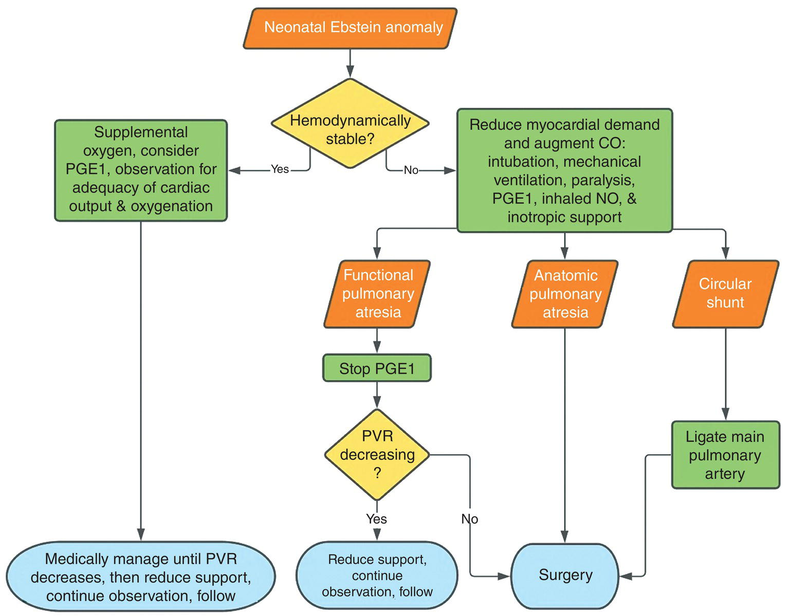

[**Figure 28.4**](#R_c28-fig-0004) Algorithm for treatment of neonatal Ebstein anomaly. CO, cardiac output; NO, nitric oxide; PGE1, prostaglandin E1; PVR, pulmonary vascular resistance.

(Source: Michael L. Schmitz, MD.)

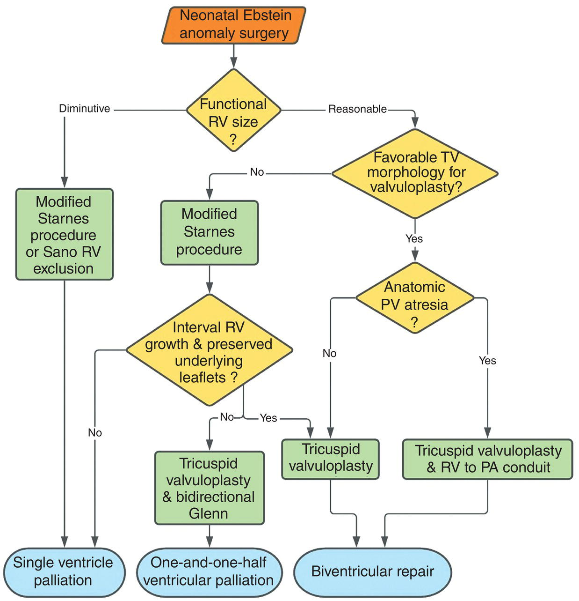

[**Figure 28.5**](#R_c28-fig-0005) Algorithm for neonatal Ebstein anomaly surgical intervention. PA, pulmonary artery; PV, pulmonary valve; RV, right ventricle; TV, tricuspid valve.

(Source: Michael L. Schmitz, MD.)

[**Table 28.3**](#R_c28-tbl-0003) Developments in the treatment of Ebstein anomaly

<table border="1"><tbody class="tdcolor4"><tr><td class="left"><ul id="c28-list-0005"><li id="c28-li-0022">Valvuloplasty techniques<ul class="circle" id="c28-list-1005"><li id="c28-li-0023">Improved TV coaptation, decreasing TR</li><li id="c28-li-0024">Relocation of the TV to the true, and often remodeled annulus</li><li id="c28-li-0025">Centralized flow in the remodeled TV with less impedance</li><li id="c28-li-0026">Delamination of valve tissue attached to RV wall or septum</li><li id="c28-li-0027">Use of the cone technique for those valves with suitable TV tissue</li><li id="c28-li-0028">Stabilization of the true TV annulus with rings and partial rings</li></ul></li><li id="c28-li-0029">Improvements in functional RV morphology by employing plication techniques to the atrialized RV</li><li id="c28-li-0030">Advances in electrophysiological ablation technology with improved success in ablating accessory conduction pathways</li></ul></td></tr></tbody></table>

Building on a previous technique, da Silva et al. \[22\] developed a method known as the cone reconstruction that enhances available valve tissue by surgically delaminating leaflets attached to the RV wall and septum. The cone reconstruction of the TV for EA began to be developed in 1989 and has evolved to become a successful option for patients with adequate available valvar tissue and trabecular RV chambers. The TV leaflets are mobilized and reattached to the true TV annulus. The anterior and posterior leaflets are sutured together into a cone shape, incorporating the septal leaflet into the cone when possible. The atrialized RV is longitudinally plicated. Flexible annuloplasty rings (partial rings for children to allow for growth) are sometimes used to add stability to the dilated TV annulus \[23\] ([Figure 28.6](#c28-fig-0006)). Although cone reconstruction has been successful in neonates \[24, 25\] and small infants \[26\], valve rings are not an option for these small patients. When tissue is found to be insufficient, leaflets can be augmented with patch material \[27, 28\] ([Figure 28.7](#c28-fig-0007)). The cone operation improves coaptation of the TV leaflets and allows for centralized flow.

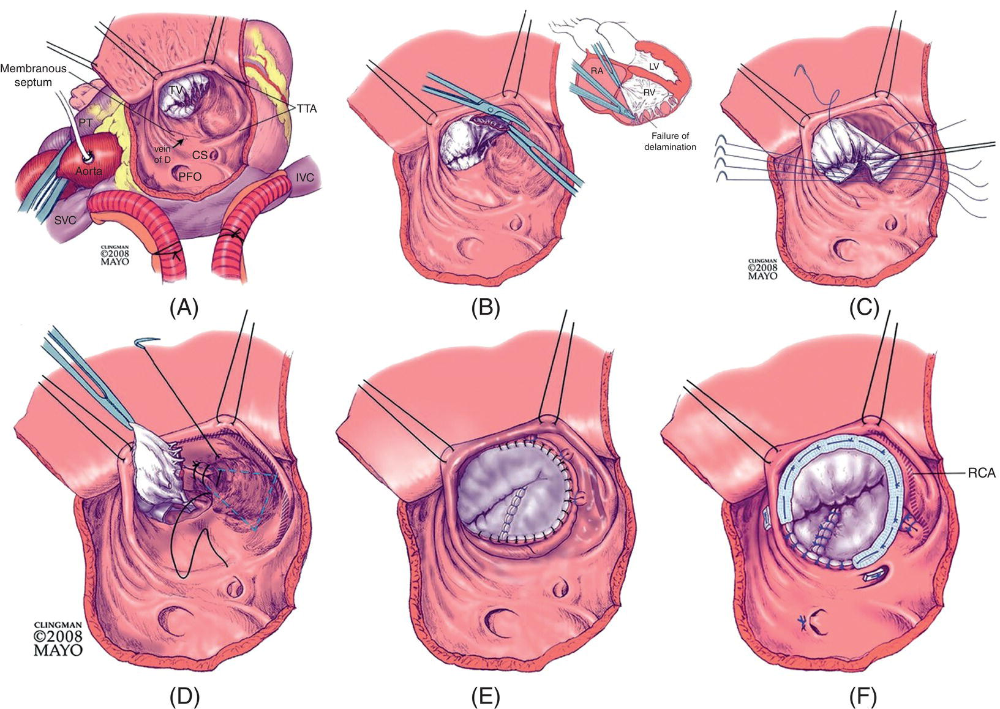

[**Figure 28.6**](#R_c28-fig-0006) Key components of the cone repair. (A) Standard aortic and bicaval cannulation. Right atriotomy is parallel to the atrioventricular (AV) groove. Anatomic examination of the tricuspid valve (TV) and the atrialized right ventricle (RV). Membranous septum and AV node are marked by small vein (vein of D). (B) Delamination of the TV. First incision is made at 12 o’clock in the anterior leaflet a few millimetres away from the true annulus. Surgical delamination is the division of the fibrous and muscular attachments between the body of the leaflet(s) and the free wall of the RV. Delamination must continue to all attachments between the AV groove and the leading edge of the leaflets (close to the RV apex) while keeping the attachments at the leading edge of the leaflet intact. (C) Rotation of leaflet tissue. Following mobilization of all leaflet tissue, the inferior leaflet, or most medial aspect of the anterior leaflet, is rotated clockwise to meet the mobilized septal leaflet. These leaflets are approximated with suture. At completion, the neo‐TV orifice should be composed of 360° of leaflet tissue. Prior to reattachment, the atrialized RV is examined to determine need for RV plication. (D) RV plication. Internal triangular plication of portions of the atrialized RV reduces tension on the repair, reduces size of the TV annulus, and eliminates noncontractile RV. Plication is started close to the RV apex and proceeds to the AV groove. Care must be taken to avoid injury to the right coronary artery. (E) Attachment of neo‐TV to the true annulus. The septal leaflet is reattached to the ventricular septum (just caudal/ventricular side of the true annulus). (F) Repair can be reinforced with either a felt band (in younger children) or an annuloplasty band (older children and adults). CS, coronary sinus; IVC, inferior vena cava; LV, left ventricle; PFO, patent foramen ovale; RA, right atrium; RCA, right coronary artery; SVC, superior vena cava; TTA, true tricuspid annulus.

Copyright © Mayo Foundation for Medical Education and Research. (Source: Holst et al. \[23\]. Reproduced with permission of Mayo Foundation for Medical Education and Research.)

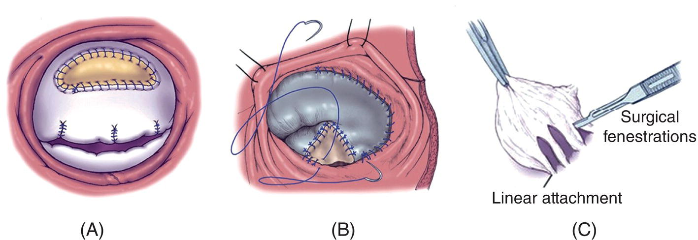

[**Figure 28.7**](#R_c28-fig-0007) Tricuspid valve (TV) leaflet augmentations for the cone repair. Leaflet augmentation can be accomplished with either autologous pericardium or CorMatrix membrane to increase the height of the anterior TV leaflet (A) or to increase the TV diameter at the annulus (B). When there is a linear attachment of the leading edge of the anterior TV leaflet to the right ventricular endocardium, autologous neochordae can be fabricated with surgical fenestrations (C).

(Source: Dearani et al. \[29\]. Reproduced with permission of Elsevier.)

Utilization of a semi‐functional RV by combining RV output to the MPA from the inferior vena cava (IVC) with a bidirectional Glenn (BDG) anastomosis in a 1.5 ventricular repair can be beneficial. Compared to patients converted to single ventricle physiology, 1.5 ventricular pulsatile flow to the pulmonary arterial tree might reduce MAPCA development while inclusion of hepatic venous flow to the pulmonary arterial tree might reduce formation of pulmonary arteriovenous malformations. Even a hypoplastic RV may increase CO with increased cardiac demand beyond what could occur with a Fontan circulation. The BDG can be used to reduce RV preload to hypoplastic EA RVs or those with moderate degrees of TV stenosis, allowing for closure of a coexisting ASD or PFO.

In some cases of severe EA, there may be no identifiable TV leaflet tissue available for reconstruction. In the absence of available leaflet tissue combined with a severely dilated dysfunctional RV and secondary LV compression, a fenestrated RV exclusion procedure with a systemic‐to‐pulmonary arterial shunt may be the best option for an infant \[30\]. The modified Starnes procedure is accomplished by placing a patch with a 5 mm fenestration at the level of the true tricuspid annulus while allowing the coronary sinus to remain on the RA side of the patch. The fenestration allows for thebesian venous drainage from the excluded RV to the RA. If there is pulmonary arterial insufficiency, the RV to pulmonary connection is interrupted. As with all single ventricle palliations, an unrestricted atrial communication is ensured. Later, the infant or child may advance to a BDG or Fontan palliation. A limited follow‐up for 12 patients has shown that the RV involutes sufficiently to allow improved geometry and function of the single LV \[31\]. The Sano RV exclusion technique \[32\] for EA is similar but employs an RV to pulmonary artery conduit rather than a systemic‐to‐pulmonary shunt to provide PBF. The advantage of the modified Starnes procedure over the Sano RV exclusion technique is that the already reduced functional RV myocardium is less compromised without the ventriculotomy required for the RV to pulmonary artery conduit.

Complications of the cone procedure are similar to other TV repairs for EA. Inadvertent tricuspid stenosis or suture dehiscence are possible. Sutures too near the AV node can cause third‐degree heart block. Distortion caused by plication of the atrialized RV and TV annulus can impair right coronary artery blood flow. Outcomes are compromised when neonatal EA is associated with RVOTO, PA, small pulmonary arteries, or any congenital disease that causes LV dysfunction.

Rhythm disturbances can occur at any time with EA. Temporary pacing wires should be placed on the RA and RV near the conclusion of surgery as postoperative pacing could be necessary. Generally, teenaged and adult patients who do not require postoperative pacemakers have fewer rhythm disturbances on follow up \[33\]. Wolff‐Parkinson‐white accessory pathways, often near the orifice of the TV, are present in 10–20% of EA.

Outcome studies are limited for the cone reconstruction. A follow‐up of 52 patients ranging in age from 0.25 to 49 years (mean 18.5 ± 13.8 years) showed that the cone repair maintained its integrity and there was an increase in RV function relative to body surface area indexing. Two of the 52 died postoperatively in‐hospital and one was lost to follow up resulting in a statistical survival of 86.2 ± 8%f at 7 years. Of the followed 49, four underwent TV revision (3, 4, 5, and 10 years postoperatively), one received a pacemaker for intermittent episodes of complete AV block 1 year after surgery, three had atrial arrhythmias (one successfully ablated and the other two medically controlled). Eleven had Wolff‐Parkinson‐White syndrome and had the anomalous bundle surgically sectioned; ten were successful and one had repeated ablations, developed TR, and then underwent TV revision 5 years postoperatively \[34\].

A single institution review of 151 EA patients with a mean age of 28 years (56 patients less than 18 years of age) who underwent either cone reconstruction (_n_ = 38, age 31 ± 19 years), conventional repairs (_n_ = 94, age 26 ± 18 years), or TV replacement (_n_ = 19, age 36 ± 21 years) presented mid‐term follow up comparisons for cone repair, conventional repairs, and TV replacement. Cardiopulmonary bypass (CPB) times as well as aortic cross clamp times were longer for cone repairs than either conventional repairs or TV replacement. Cone repair was more successful than conventional repairs at mid‐term follow up (8 years) with moderate or less TR (_p_ = 0.031) and a reduced incidence of post‐repair severe TR that did not reach clinical significance. Of note, most of the cone repairs were performed more recently than many of the conventional repairs \[35\].

In the largest series to date from the Mayo Clinic \[28\], 235 consecutive cone repairs for patients with EA and a median age of 15 years (range 6 months to 73 years) showed only one early death of a 50‐year‐old from low CO syndrome related to endocarditis from pacemaker leads. Extracorporeal membrane oxygenation (ECMO) was needed for the one adult early mortality patient and for 5 pediatric patients with severe preoperative RV dysfunction and dilation. Cone repair was the primary correction in 80% and a re‐repair in 12%. Early reoperation for recurrent TR occurred in 5.9% (7 children and 7 adults). TV replacement was ultimately required for 6/7 adults, but 6/7 children had a successful reoperation. Of those requiring reoperation, 11 of the 14 were in the first third of the series, suggesting a learning curve for a successful cone repair. Supplemental techniques were used in many, including the BDG anastomosis in approximately 20% (41 children and 5 adults), annuloplasty bands, leaflet augmentation, and use of neochordae.

In general, TV replacement is reserved for irreparable TV and RV anatomy as reoperation and repeat cardiotomy for TV replacements will likely be necessary for the patient’s lifetime. In addition, options for prosthetic valves are limited or non‐available for small infants and children. Some teenaged or adult patients with late diagnoses might have incurred TV leaflet damage from turbulent blood flow or endocarditis that preclude successful repair, and TV replacement may be the best option. For select patients such as the elderly, TV replacement might be considered if advantages of lessened CPB time outweigh the longer time needed for TV repair. Bioprosthetic valves are preferable in the tricuspid position due to their lower thrombogenicity over mechanical valves. When placing the prosthetic TV, care is exercised in avoiding the conduction system on the septal side and the right coronary artery on the anterior and inferior sides of the implanted TV as well as avoiding the right ventricular outflow tract (RVOT) and impingement of the valve struts on the AV node. Similar considerations will apply to future development of percutaneous TV replacement.

Older children and adults with preoperative paroxysmal atrial fibrillation or atrial flutter might be candidates for a modified right‐sided maze procedure or cavotricuspid isthmus ablation using either radiofrequency or cryoablation \[23\] ([Figure 28.8](#c28-fig-0008)). Those with continuous atrial fibrillation may do better with a biatrial maze \[36\].

### Anesthetic considerations

#### Preoperative

For neonatal presentation of EA, signs of right heart failure and systemic hypoxemia are most critical. Dyspnea, cyanosis, and hepatomegaly suggest that the infant should be supported such that demands on CO and oxygen consumption are minimized. The most severely affected infants benefit from intubation, mechanical ventilation, paralysis, and sedation to reduce work of breathing and demands on CO. Oxygen, inhaled nitric oxide (iNO, if pulmonary hypertension is suspected), inotropic support, and possibly PGE1 may increase oxygen delivery. For the less affected infant, signs of fatigue with feeding, feeding intolerance, irritability, diaphoresis, dyspnea, and episodic cyanosis with distress suggest a poorly functioning heart. Oxygen, milrinone, and possible PGE1 may be beneficial prior to anesthesia. Some neonates will manifest a gradual improvement in right heart forward flow and a reduction in right‐to‐left shunting and cyanosis as TR declines. Neonatal surgical intervention, when possible, is delayed until PVR has declined significantly.

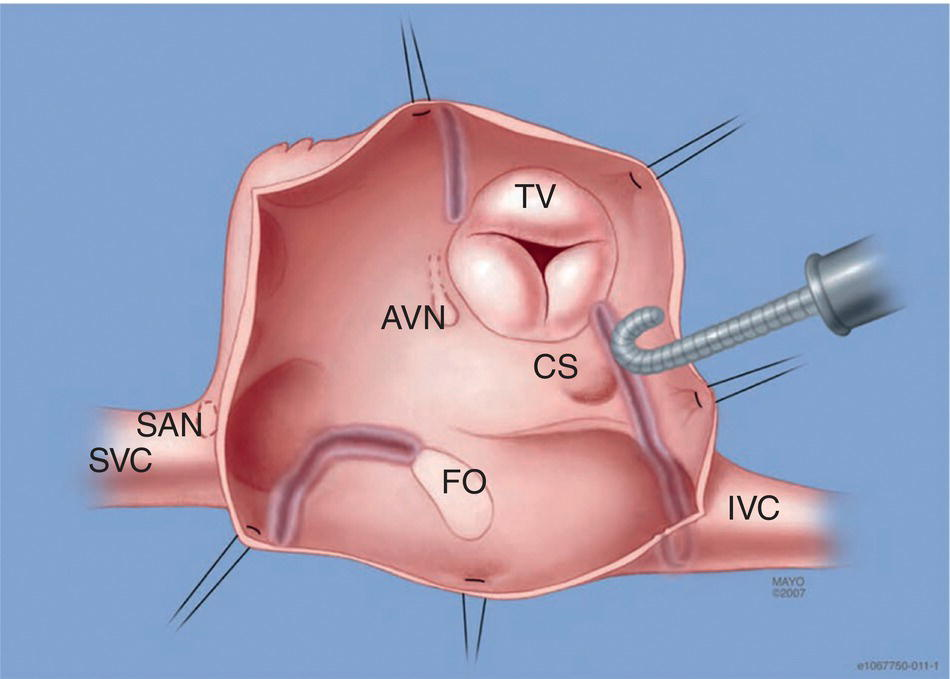

[**Figure 28.8**](#R_c28-fig-0008) Cryoablation for atrial flutter/fibrillation in Ebstein anomaly. AVN, atrioventricular node; CS, coronary sinus; FO, foramen ovale; IVC, inferior vena cava; SAN, sinoatrial node; SVC, superior vena cava; TV, tricuspid valve.

Copyright © Mayo Foundation for Medical Education and Research. (Source: Holst et al. \[23\]. Reproduced with permission of Mayo Foundation for Medical Education and Research.)

For the toddler, older child, adolescent, or even young adult, functional symptoms of dyspnea with exertion, excessive fatigue with daily activities or as compared to peers, and certainly signs of cyanosis as well as the trends in symptomatology in recent months give some insight into the severity of EA. In the older child and young adult, syncope, chest pain, and palpitations should be investigated for the presence of arrhythmias.

Physical examination often reveals a soft, high‐pitched systolic murmur, sometimes accompanied by triple or even quadruple heart sounds. A mid‐diastolic murmur is sometimes found at the left sternal border and apical areas and has a soft, scratchy sound. A persistently split‐second heart sound due to delayed emptying of the RV is usually present and varies little with respiration. Pediatric patients with myocardial failure are diaphoretic, tachypneic, and irritable. Chest auscultation can be notable for rales if LV function is impaired by a dilated RV. Abdominal examination often reveals hepatomegaly on palpation. Moderate to severe cardiomegaly is found on the chest radiograph, and pulmonary vascularity is reduced. The silhouette of the heart is globular due to the enlarged RA. In fact, the electrocardiogram (ECG) usually shows an increased duration for the P‐wave suggesting right atrial enlargement, an increased PR interval, and not unusually a complete or incomplete right bundle branch block. In at least 10–15% of patients, the pre‐excitation patterns of Wolff‐Parkinson‐White syndrome are present. An echocardiogram is usually diagnostic for EA, showing a large TV orifice with apical displacement of the septal leaflet \[29\] ([Figure 28.9](#c28-fig-0009)). Cardiac catheterization is seldom useful, even for the most commonly associated defects, and place the patient at risk for development of tachyarrhythmias. Magnetic resonance imaging (MRI) can be valuable in estimation of the size of the functional RV and accurately measuring the displacement of the TV leaflets ([Figure 28.10](#c28-fig-0010)). Though both MRI and echocardiography are useful in detecting associated defects, echocardiography may underestimate the degree of TR but is more effective in detecting small shunts from associated defects than MRI \[37\].

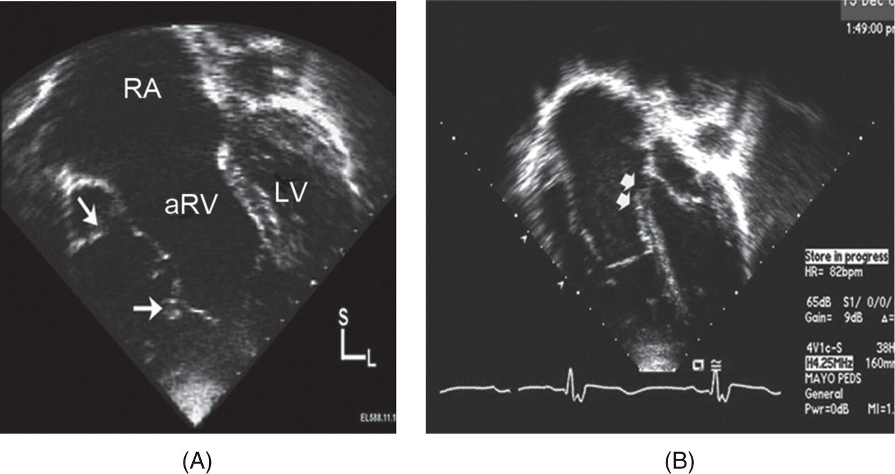

[**Figure 28.9**](#R_c28-fig-0009) Preoperative four‐chamber view echocardiogram evaluation for potential cone repair. (A) Multiple attachments between the anterior leaflet and the RV free wall from base to apex (arrows). (B) The undelaminated septal leaflet (arrows) suggests that this leaflet tissue can be recovered increasing the chances for a successful repair. aRV, atrialized right ventricle; LV, left ventricle; RA, right atrium.

(Source: Dearani et al. \[29\]. Reproduced with permission of Elsevier.)

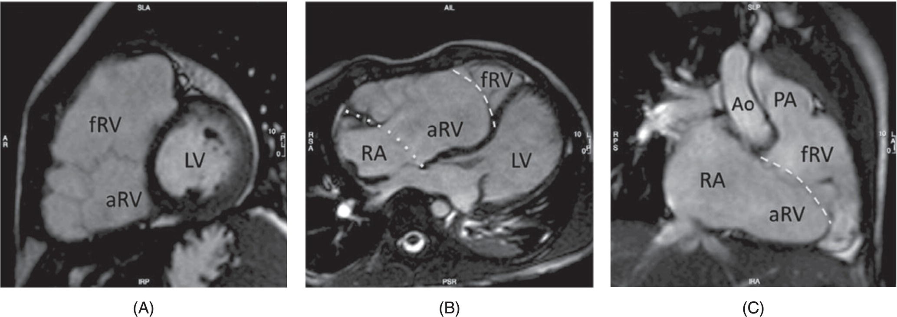

[**Figure 28.10**](#R_c28-fig-0010) Cardiac magnetic resonance imaging of Ebstein anomaly. (A) Short‐axis plan at mid‐ventricular level. (B) Four‐chamber view. (C) Right ventricular inflow‐outflow view. The atrioventricular junction (dotted line) and the functional tricuspid valve orifice (dashed line) define the basal and apical boundaries (respectively) of the atrialized right ventricle (aRV). The functional right ventricle (fRV) lies between the dashed line and the pulmonary valve. The anatomic RV includes both the aRV and fRV. The tricuspid valve functional orifice is rotated apically and superiorly towards the RV outflow tract. Ao, aorta; LV, left ventricle; PA, pulmonary artery; RA, right atrium.

(Source: Holst et al. \[23\]. Reproduced with permission of Mayo Foundation for Medical Education and Research.)

Hypoxemic neonates should be managed with interventions aimed to decrease and avoid increasing PVR. For the mechanically ventilated neonate, adequate tidal volumes and minute ventilation must be achieved with minimum airway pressures. Those infants with marginal heart function may benefit from iNO by reducing PVR and enhancing right heart to pulmonary artery flow. In addition, functional and anatomical obstructive components to PBF may be further defined by the addition of iNO as poor right heart function is anticipated to improve with iNO while anatomical obstructions in the RVOT, PV, and PAs will remain. In the first couple weeks after birth, pulmonary arterial blood flow may require augmentation with a PDA maintained with PGE1. However, too much flow through a large PDA can result in cardiac failure and loss of systemic and pulmonary perfusion with a phenomenon known as “circular shunt” \[38\] ([Figure 28.11](#c28-fig-0011)). Circular shunt results when generous flow to the pulmonary arterial system from the aorta via the PDA follows a retrograde path of least resistance when the PV and TV are incompetent and there is an interatrial communication. Sequentially, flow proceeds from the PDA, BPA, MPA, PV, RV, RA, ASD or PFO, LA, LV, and finally the aorta. Perfusion of the pulmonary capillary bed is diminished and CO to the vital organs is reduced. PGE1 should be discontinued so that the PDA becomes smaller and more resistant to flow, reducing the circular shunt and high output failure \[12\].

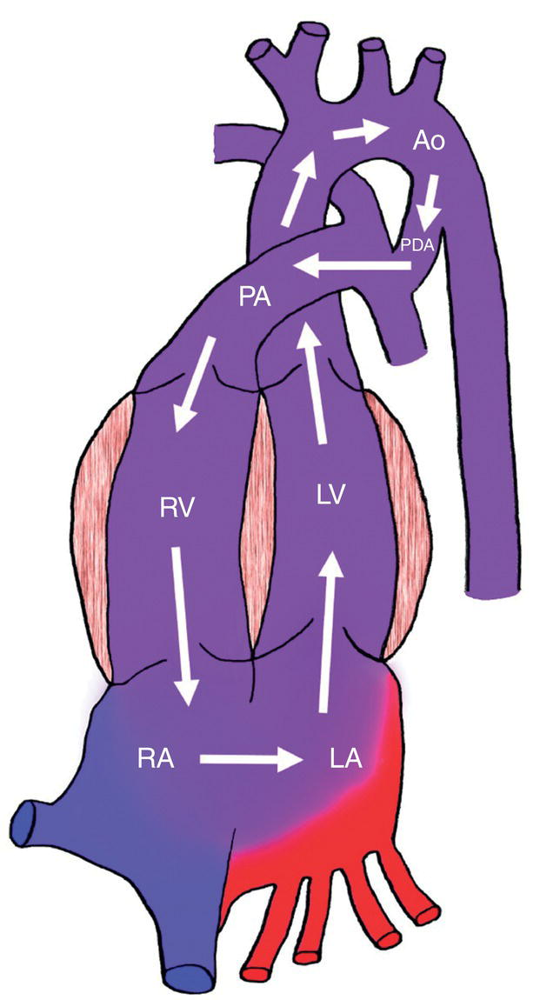

[**Figure 28.11**](#R_c28-fig-0011) Circular shunt: aortic blood enters the lower pressure pulmonary artery (PA) via the patent ductus arteriosus (PDA). Pulmonary insufficiency allows blood to continue retrograde into the right ventricle (RV), right atrium (RA), left atrium (LA), left ventricle (LV), and then again to the aorta (Ao).

(Source: Schmitz et al. \[38\]. Reproduced with permission of John Wiley & Sons.)

Most neonates and young infants may not require anxiolytic premedication. Older infants, those who have developed stranger anxiety (approximately 9 months of age), and children often benefit from anxiolytic administration of midazolam. Midazolam may be given orally (0.5–0.75 mg/kg up to 15–20 mg) or intravenously (IV) (0.1–0.15 mg/kg up to 2–4 mg). Anxiolysis can be helpful in reducing or avoiding decreases in PBF that can result with crying or breath‐holding during application of the mask anesthetic. In some cases, a sleeping child who has received dexmedetomidine can be safely transported and undergo a safe anesthetic induction, but this technique requires planning. Loading with 0.5 to 1.0 μg/kg IV over 10 minutes is often sufficient but requires monitored attention for potential bradycardia. For patients who do not yet have IV access and are to undergo a mask anesthetic induction or merely have a non‐stimulating procedure (such as a sedated transthoracic echocardiogram), intranasal dexmedetomidine is administered with a nasal atomizer (2–3 μg/kg, 100 μg/mL) often results in adequate sedation. The time required for mean onset of sufficient sedation is 10–24 minutes for 3 μg/kg \[39\]. Reducing ambient light and background noise while ensuring that the child is warm and comfortable facilitates the sedative effect. Relative contraindications for dexmedetomidine include poor CO, hypovolemia, bradycardia or risk for bradycardia, AV nodal block, or medications that delay AV conduction or increase vagal tone \[40\].

#### Intraoperative

An inhalational induction with nitrous oxide and sevoflurane is appropriate for infants and children with mild to moderate EA. Inhalational induction is slowed by interatrial left‐to‐right shunting as well as by decreased CO. Ketamine (1–4 mg/kg) or propofol (1–2 mg/kg) are IV induction alternatives for mild to moderate disease. For those with severe EA, hemodynamic stability is maintained in a euvolemic patient in most instances with IV ketamine (1–4 mg/kg) or etomidate (0.2–0.3 mg/kg) without inducing detrimental myocardial depression or afterload reduction.

Sufficient right heart preload must be maintained to maximize the EA right heart forward flow. As the anesthetic progresses, increases in vascular compliance are accommodated with replacement of intravascular volume, such as 5% albumin, crystalloid solutions, or in the anemic patient, packed red blood cells (PRBC). Muscle relaxants are selected based on the anticipated duration of the procedure and the occasional need for a modified rapid‐sequence induction. Rocuronium offers quick action for induction and intubation (0.6–1.2 mg/kg) as well as subsequent maintenance of muscle relaxation (0.1–0.2 mg/kg every 20–30 minutes). Pancuronium is another option with a longer duration of action (0.06–0.1 mg/kg for induction and approximately 0.01–0.02 mg/kg for redosing). Both muscle relaxants induce ganglionic blockade and vagolysis, effecting a higher baseline heart rate. For CPB cases, opioid‐based anesthetics combined with modest levels of potent inhalation agents such as sevoflurane or isoflurane are common. The relative balance of opioids and inhalation anesthetic is based on the patient’s ability to tolerate the myocardial depressant effects of higher ranges of inhaled halogenated agents and the plan for early versus delayed liberation from mechanical ventilation. For patients that will remain intubated with mechanical ventilation after arrival to the intensive care unit (ICU), fentanyl 10–15 μg/kg and 0.5–1.0 minimum alveolar concentrations (MAC) of halogenated agent may be used prior to CPB with a total fentanyl of perhaps 20–30 μg/kg combined with a morphine infusion of 30–35 μg/kg/hour started at the time of incision. If extubation in the operating room is anticipated, total fentanyl administration is approximately 10–20 μg/kg and halogenated agents are utilized at higher MAC as tolerated. A morphine infusion of 25 μg/kg/hour is started by the time of incision. For infants beyond the neonatal period, sedation with dexmedetomidine at 0.5 μg/kg/hour is added for sedation management in the postoperative period whether extubated in the operating room or later in the ICU. Plasmin–binding inhibitor antifibrinolytic drugs such as epsilon‐aminocaproic acid or tranexamic acid infused during surgery and in the immediate postoperative period can reduce overall blood loss.

Monitoring for rhythm changes, especially tachyarrhythmias in EA, can be accomplished with a five‐lead ECG and monitoring capable of displaying multiple tracings to facilitate identification of the arrhythmia. ST monitoring is helpful in identifying EA post‐repair right coronary artery compromise which may be identified by ST elevation in leads II, III, or AVF or reciprocal depression in I or AVL. Sometimes, temporary AV pacing may be necessary when complete heart block, junctional rhythms, or sinus node dysfunction present after removal of the aortic cross clamp in order to achieve hemodynamic function sufficient to separate from CPB. Depending upon the etiology of the rhythm disturbance, temporary pacing could be needed for a brief period after cessation of CPB, several hours, several days, or until a permanent pacemaker is placed. Other useful monitoring includes near‐infrared spectroscopy (NIRS) for monitoring brain and somatic oxygenation, especially during the non‐pulsatile flow of CPB. Near the end of CPB, intraoperative transesophageal echocardiography (TEE) is used to assess clearance of air bubbles in the systemic heart chambers, reconstructed TV function, ventricular contractility, and residual shunts in the immediate post‐CPB period. Transcranial Doppler (TCD) flow velocity is not commonly utilized due to the technical difficulty in maintaining its positioning on the patient, but it has the ability to follow changes in cerebral blood flow velocities in unilateral or bilateral anterior and/or middle cerebral arteries during surgery. The TCD can also be used to detect gaseous or particulate emboli that enter the cerebral circulation.

Patients with good biventricular function and mild TR can be candidates for immediate extubation at the end of surgery provided that the rhythm is normal sinus or stable in a paced mode and there are no concerns for postoperative surgical bleeding. Inhaled halogenated anesthetics are utilized primarily after CPB, and muscle relaxant and opioids employed sparingly. After the sternum is closed, reversal of muscle relaxation and initiation of pressure‐supported ventilation can begin. Adjunctive IV acetaminophen can be used to decrease opioid requirements at the end of surgery. Additional opioids can be titrated to the respiratory rate as surgical stimulation decreases and inhaled halogenated agents are weaned. Local analgesia administered by the surgery team decreases narcotic requirements at the end of the case. Dexmedetomidine sedation (0.3–0.5 μg/kg/hour) and morphine infusion (25 μg/kg/hour for extubated patients and 30–35 μg/kg/hour for mechanically ventilated patients) are continued upon transfer of the extubated patient to the ICU.

High risk patients, such as those who presented with severely dilated right hearts and compressed LVs, are not candidates for extubation in the OR. In addition to higher needs for inotropic support, such patients are at high risk for lethal ventricular arrhythmias in the post‐repair period, especially if they have undergone RV plication. Antiarrhythmic medications such as lidocaine and amiodarone need to remain readily available. Patients who manifest runs of ventricular tachycardia or other ventricular arrhythmias should be placed on amiodarone (3–5 mg/kg over 30 minutes, then 2 mg/kg/day, maximum 20 mg/kg/day or 2.1 g/day) or lidocaine (20–50 μg/kg/min) infusions in the early postoperative period. Prophylactic amiodarone infusions may be considered for patients who present with severe right heart cardiomegaly. Right heart forward flow can be augmented with infusions of milrinone (0.2–0.5 μg/kg/min) and low‐dose epinephrine 0.02–0.04 μg/kg/min. Preload to the right heart must be fastidiously maintained for a poorly functioning RV. In cases with elevated pulmonary vascular resistance, iNO can be instituted. Leaving the sternum open in highest risk patients facilitates access for ECMO in the case of cardiovascular collapse due to arrythmias, low cardiac output, or pulmonary hypertension.

#### Postoperative

In the ICU, continuous monitoring of the heart rhythm and arterial blood pressure is essential. Intravascular volume expansion options need to be readily available. Often, there may be post‐CPB papillary muscle dysfunction, possibly of ischemic etiology. Early ICU echocardiography can show poor coaptation of the TV leaflets, but as the papillary muscle bundle dysfunction resolves, later echocardiographic examinations can show improving TV leaflet coaptation.

Pain is controlled with morphine infusions of 25–30 μg/kg/hour for extubated opioid‐naïve patients and 30–40 μg/kg/hour for mechanically ventilated opioid‐naïve patients. Dexmedetomidine 0.3–0.5 μg/kg/hour is used for sedation rather than relying on narcotic infusions for sedation. For the patients with poorly functioning RVs, gradual recovery from sedation is appropriate to allow for recovery of myocardial function prior to increased CO demands of the fully awake patient. Morphine boluses (20 μg/kg) can be added for breakthrough pain, and dexmedetomidine boluses of 0.5 μg/kg over 10 minutes or lorazepam (0.05–0.1 mg/kg IV every 6 hours) can be added for periodic needs of additional sedation, especially for patients who remain intubated and mechanically ventilated.

Rhythm disturbances are common in the early post‐repair periods and in some instances extend as a late complication. Operative recovery can be complicated by supraventricular tachycardia, AV block (intermittent or persistent), and junctional rhythm. Temporary pacing enhances CO for patients with AV block or junctional rhythm in the early postoperative period. A return of normal sinus rhythm can result as myocardial edema resolves and cardiac conduction pathways recover. Ventricular arrhythmias and the risk for sudden death is greatest in the first month after repair with those patients who had perioperative ventricular tachycardia or ventricular fibrillation being at enhanced risk \[41\]. High‐risk patients who have had intermittent ventricular arrhythmias during their early ICU recovery and were treated with IV lidocaine or amiodarone infusions might benefit from continuing oral amiodarone for several months after surgery.

* * *

### KEY POINTS: EBSTEIN ANOMALY

-   Gradually, cyanosis and PBF will improve in symptomatic neonates as PVR decreases.
-   Depending on the potential for functional remodelling and relocation of the TV to the true annulus and the adequacy of RV morphology, EA may be remedied by a biventricular repair for less severe forms or palliated with a 1.5 or single‐ventricle physiology for more severely affected individuals.
-   Patients with extreme cardiomegaly or perioperative ventricular arrhythmias should receive prophylactic antiarrhythmic treatment, such as amiodarone.
-   Patients with poorly functioning RVs are dependent upon high filling pressures to maintain adequate CO.

* * *

## Tetralogy of Fallot

### Incidence, anatomy, and natural history

TOF is the most common cyanotic congenital heart disease with an estimated incidence of 1 in 2,500–3,000 live births \[2\]. Although reports of this abnormality can be dated back to 1671, it was Etienne Fallot in 1888 who reported the four cardinal distinguishing features and proposed clinicopathophysiologic correlations derived from extensive clinical and postmortem studies. This “blue malady or cardiac cyanosis” as Fallot referred it, was named “tetralogy of Fallot” in 1924 by Maude Abbott \[42\].

The first surgical treatment for TOF occurred in 1945, when the first Blalock‐Taussig shunt (BTS) was performed. The tetrad of TOF consists of ([Figure 28.12](#c28-fig-0012)):

1.  RVOT obstruction
2.  A large unrestrictive VSD
3.  Overriding aorta
4.  RV hypertrophy

One embryologic theory states that TOF results from uneven conotruncal spiral septation leading to a smaller MPA and a larger aorta. Another theory, van Praagh’s, suggests that the TOF stems from one abnormality – the underdevelopment of the subpulmonary infundibulum (infundibulum means “funnel” in latin). The hypoplastic infundibulum, in turn, affects the surrounding structures as follows: (i) the conoseptum is deviated anterior and leftward contributing to obstruction to flow, (ii) the aorta is shifted rightward over the ventricular septum facing the VSD and facilitates flow of the ejected RV blood into the systemic circulation, (iii) a VSD results from the malaligned conoseptal tissue failing to join the remainder of the ventricular septum, and (iv) postnatal RV muscle hypertrophy develops from cumulative work against the higher pressure load imposed by a stenotic outflow tract and systemic pressure transmitted across the VSD. The phenotype of TOF with PS varies from patient to patient. Although no two TOF cardiac anatomies are the same, physiologically they follow similar guiding precepts for management. Of note, the normal RV of a newborn infant has similar thickness to the LV because of exposure to systemic pressures. As normal cardiac development progresses, the RV becomes thinner relative to the LV as a result of their markedly different afterloads.

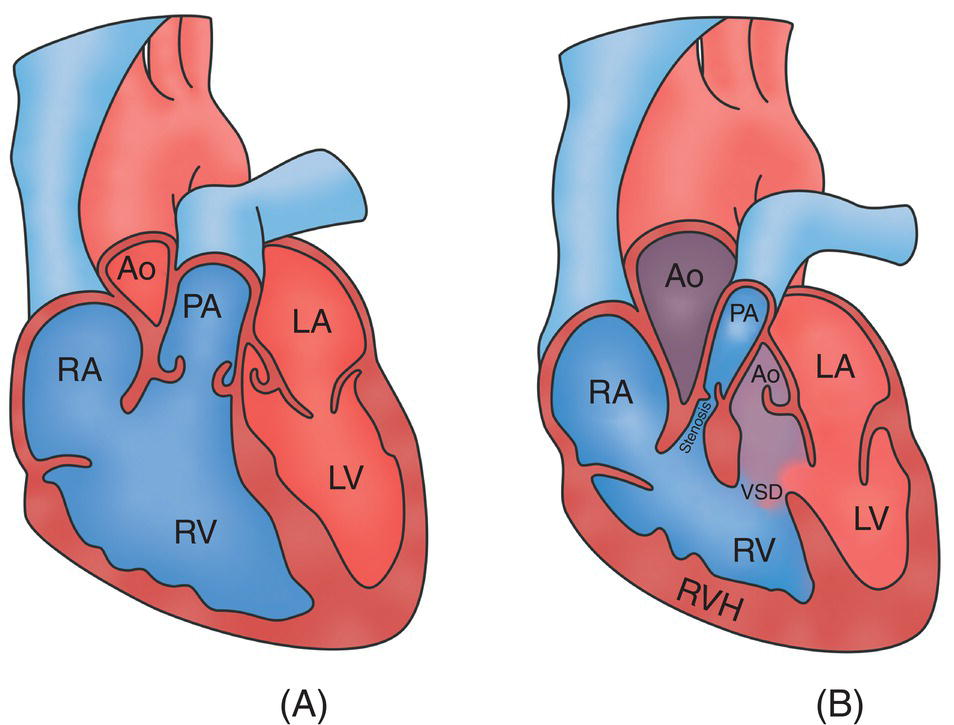

[**Figure 28.12**](#R_c28-fig-0012) Schematic illustration of tetralogy of Fallot. (A) Normal heart. (B) Tetralogy of Fallot demonstrating right ventricle infundibular stenosis (Stenosis), ventricular septal defect (VSD), overriding aorta (Ao), and right ventricular hypertrophy (RVH). LA, left atrium; LV, left ventricle; PA, pulmonary artery; RA, right atrium; RV, right ventricle.

(Source: Michael L. Schmitz, MD.)

In TOF, the RVOTO often occurs at several levels and has fixed and dynamic components. The fixed obstructions occur at the valvar and supravalvar levels. At the valvar level, the pulmonary annulus is frequently hypoplastic with a bicuspid valve that contains dysplastic leaflets. At the supravalvar level, hypoplasia of the MPA can be localized at the sinotubular ridge or be diffuse and extend into the BPAs. The RVOTO dynamic component comes from the hypertrophied subvalvar muscle bundles. The hypertrophy develops over time in response to the increased pressure load. This dynamic component is thought to play a major role during hypercyanotic episodes associated with TOF. The VSD is usually large and unrestrictive. The bundle of His courses at the posteroinferior edge of the defect, near the anteroseptal leaflet of the tricuspid valve, and can be inadvertently injured during VSD closure \[43, 44\] ([Figures 28.12](#c28-fig-0012)–[28.14](#c28-fig-0014)).

Other cardiac anomalies associated with TOF are found in about 40% of patients, and they have implications for the optimal surgical repair strategy \[44–56\] ([Table 28.4](#c28-tbl-0004)). Also, anatomical variations influence surgical conduct, e.g. degree of aortic override and location of conoseptum determine the patch size to close the VSD and baffle the LV flow to the aorta \[57\].

Unique TOF variants include TOF with PA/VSD/MAPCAS (7%) and TOF with absent PV (5%) \[58, 59\]:

-   In TOF with PA/VSD/MAPCAS, total lack of blood throughput leads to severe underdevelopment of the MPA and peripheral pulmonary artery branches such that the MPA may be completely absent, and the BPAs are hypoplastic, non‐confluent or even non‐existent. MAPCAs often develop to supply blood flow to the lungs. The lungs often show aberrant arborization, unless that side is supplied by a PDA. Some lung lobes have blood supply via BPAs, MAPCAs or both. The surgical approach to this variant varies significantly from that of classic TOF and is described later in this chapter.
-   In TOF with absent PV, the PV is ring‐like with valve cusp remnants which lead to both stenosis and free pulmonary insufficiency (PI). The MPA, BPAs, and distant peripheral pulmonary arteries are massively dilated, causing compression of the associated airway. The ductus is often absent. Significant tracheobronchial malacia, often with compression, is characteristic of this condition. In severe cases, the newborn presents in respiratory distress and often requires endotracheal intubation with high levels of positive end‐expiratory pressure (PEEP) to improve airway patency and decrease air trapping. Prone positioning can also be useful in respiratory management. During surgical repair, the TEE probe has been known to compress the large airways and worsen obstruction. Postoperatively, many patients require long‐term ventilatory management due to persistent tracheobronchomalacia and lung disease.

Typically, TOF presents as an isolated lesion, although in 15–30% of patients TOF can present with other abnormalities or as part of a syndrome \[60–62\]. The most common include the 22q11 microdeletion‐associated syndromes called DiGeorge, velocardiofacial syndrome, and conotruncal anomaly face syndrome. Other conditions include trisomy 21 and VACTERL association, among others \[60–71\] ([Table 28.5](#c28-tbl-0005)). There is a mild association of familial inheritance of TOF. Other genetic bases for TOF have been linked to mutations on NKX2‐5, JAG1, chromosome 20p12, chromosome 5q35, the GATA4 gene on chromosome 8p23, ZFPM2, TBX1, and GATA6 \[72\].

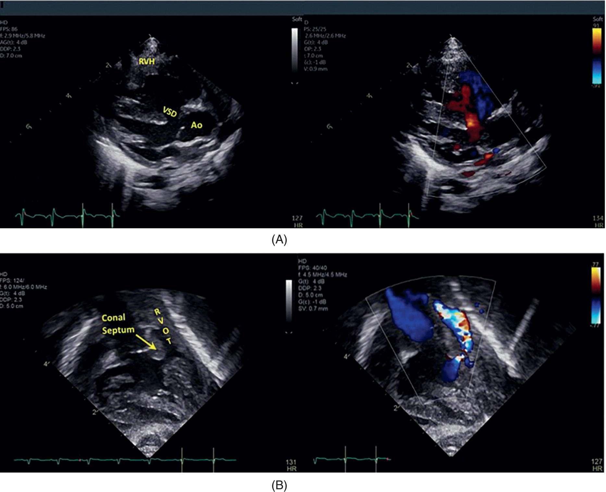

[**Figure 28.13**](#R_c28-fig-0013) Transthoracic echocardiography images of tetralogy of Fallot. (A) Left image shows ventricular septal defect (VSD), overriding aorta (Ao), and right ventricular hypertrophy (RVH). Right image shows Doppler color flow of left to right shunting through the VSD. (B) Left image reveals anterior deviation of the conal septum with narrowed right ventricular outflow tract (RVOT). Right image Doppler image shows turbulent flow seen through the narrow RVOT.

(Source: Destiny F. Chau, MD.)

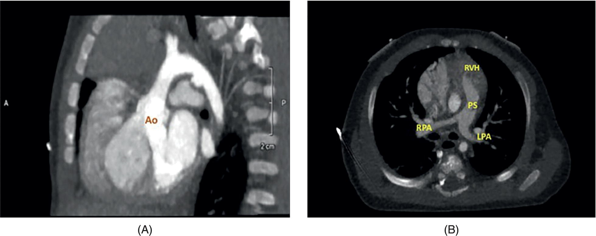

[**Figure 28.14**](#R_c28-fig-0014) Computed tomographic images of tetralogy of Fallot. (A) Sagittal view, demonstrating the overriding aorta (Ao) in brighter contrast. (B) Axial view, showing right ventricular hypertrophy (RVH), pulmonary stenosis (PS), and right pulmonary artery (RPA) hypoplasia. LPA, left pulmonary artery.

(Source: Destiny F. Chau, MD.)

[**Table 28.4**](#R_c28-tbl-0004) Cardiac anomalies associated with tetralogy of Fallot and their implications

|  | Description | Frequency | Surgical Significance | Other Considerations |
| --- | --- | --- | --- | --- |
| Coronary artery anomalies | Anomalous and variant coronary artery anatomy can limit options for RVOT patch placement | 4.3% anomalous coronary artery (usually the LAD),  
6% have a variant infundibular artery originating from RCA crossing the RVOT  
(Total 10.3%) | Presence of coronary artery over RVOT limits options for RVOT patch and may require RV to PA conduit placement | Direct visual inspection prior to RVOT incision. TTE is usually an adequate primary survey. CT scan can be definitive. |
| Pulmonary Valve | Frequently bicuspid with thickened leaflets tethered to the pulmonary artery wall | Over 50% are bicuspid | Pulmonary surgical valvotomy for relief of stenosis | Usually, valve will re‐stenose after balloon valvuloplasty |
| Multiple VSDs | Can occur in multiple locations, generally in the muscular septum | 5–14% | Suture placement can damage the conduction system. When multiple VSDs are present some may be missed, leading to repeat CPB run to close hemodynamically significant VSDs. | Residual VSDs can result in continued postoperative pulmonary overcirculation.  
Most muscular VSDs close spontaneously. |
| Discontinuous Pulmonary Arteries | The proximal LPA near the site of ductal insertion is a frequent location for stenosis. The LPA has ductal tissue that, once regressed, can lead to stenosis or discontinuity of LPA. |  | Restoration of continuity and/or augmentation of the branch pulmonary arteries is required. |  |
| ASD/PFO | Potential for postoperative atrial level shunting if not closed surgically | Almost always PFO or ASD is present | Often a small opening is left if anticipating postoperative RV dysfunction. | Occasionally included as the pentalogy of Fallot |
| Right Aortic Arch | Often present with associated abnormal branching of head and neck vessels | 25% | Placement of palliative shunts depend on spatial location of aortic branches to pulmonary artery |  |
| Others | 
-   Partial or total anomalous pulmonary venous return
-   Persistent LSVC
-   AV septal defect
-   PDA
-   Interrupted IVC
-   Anomalous aortic origin of the coronary artery
-   Aberrant origin of the right or left pulmonary artery

 |  | All might require modifications to the surgical repair, such as an additional venous drainage cannula for a LSVC |  |

ASD, atrial septal defect; AV, atrioventricular; CPB, cardiopulmonary bypass; IVC, inferior vena cava; LAD, left anterior descending artery; LSVC, left superior vena cava; PA, pulmonary artery; PDA, patent ductus arteriosus; PFO, patent foramen ovale; RCA, right coronary artery; RV, right ventricle; RVOT, right ventricular outflow tract; TTE, transthoracic echocardiogram; VSD, ventriculoseptal defect.

The natural course of uncorrected TOF reveals about 50% mortality in the first 5–10 years of life. Prolonged survival is enabled by the persistence of pulmonary flow via the PDA and /or collaterals, and by compensatory hypoxic mechanisms such as erythrocythemia. Uncorrected, it is rare for survival beyond the 4th decade of life. The morbidity and mortality are secondary to chronic hypoxemic ramifications such as thromboembolism, brain abscesses and endocarditis \[73\].

Modern operative mortality is low with an overall rate of less than 2% in developed countries \[74\], and less than 4% in low‐to‐middle income countries \[75\]. A report analyzing the only collaborative database of congenital heart surgery in low‐to‐middle income countries found that over half of the children undergoing primary TOF repair were over 1 year of age. Interestingly, age at primary repair was not a risk factor for mortality. Poor nutritional status and hypoxemia were associated with increased infection rates and mortality \[75\]. Athanasiadis et al. found that syndromic patients with TOF had an all‐cause mortality rate of 9.8% \[62\]. Long‐term survival 40 years after TOF repair has been quoted to be over 70% with late mortality from ventricular fibrillation and heart failure \[76\].

[**Table 28.5**](#R_c28-tbl-0005) Syndromes associated with tetralogy of Fallot

<table border="1"><tbody class="tdcolor4"><tr class="thcolor4"><td colspan="3">*Nearly 1 of 4 of patients with syndromic TOF undergo palliation prior to full repair</td></tr><tr class="thcolor4"><td class="left"><b>Syndrome</b></td><td class="left"><b>Frequency</b></td><td class="left"><b>Associated findings</b></td></tr><tr><td class="left">22q11.2 microdeletion, also known as DiGeorge syndrome, velocardiofacial syndrome and others</td><td class="left">  7.4–10.5% of all TOF patients  or  40–47.8% of the syndromic TOF patients</td><td class="left"><ul id="c28-list-0010"><li id="c28-li-0048">1 per 6000 live births</li><li id="c28-li-0049">Variable phenotype</li><li id="c28-li-0050">Conotruncal defect (TOF, PA/VSD, IAA, truncus arteriosus)</li><li id="c28-li-0051">Immunodeficiency</li><li id="c28-li-0052">Neonatal hypocalcemia</li><li id="c28-li-0053">Facial and velopharyngeal anomalies</li><li id="c28-li-0054">Psychiatric abnormalities</li></ul></td></tr><tr><td class="left">Trisomies: 21, 18, 13</td><td class="left"><ul id="c28-list-0011"><li id="c28-li-0055">Trisomies account for 5–7% of all TOF patients</li><li id="c28-li-0056">Trisomy 21 is the most common (5.2–5.8% of all TOF patients).</li><li id="c28-li-0057">Trisomy 21 was 29–42% of the syndromic TOF patients</li><li id="c28-li-0058">Trisomy 18 was 0.8% of the syndromic TOF patients</li><li id="c28-li-0059">Trisomy 13 was 0.2% of the syndromic TOF patients</li></ul></td><td class="left">Trisomy 21<ul id="c28-list-0012"><li id="c28-li-0060">1 per 700 live births</li><li id="c28-li-0061">Cardiac anomalies–the most common is AVC defect</li><li id="c28-li-0062">Developmental delay</li><li id="c28-li-0063">Congenital hypothyroidism</li><li id="c28-li-0064">Hearing loss</li><li id="c28-li-0065">Hypotonia</li></ul> Trisomy 18<ul id="c28-list-0013"><li id="c28-li-0066">1 per 6,000–8,000 live births</li><li id="c28-li-0067">Cardiac anomalies</li><li id="c28-li-0068">Respiratory insufficiency</li><li id="c28-li-0069">Horseshoe kidney</li><li id="c28-li-0070">GI–omphalocele, TEF</li><li id="c28-li-0071">CNS–cerebellar hypoplasia, corpus callosum agenesis, spina bifida</li><li id="c28-li-0072">Others–micrognathia, microphthalmia, coloboma.</li></ul> Trisomy 13<ul id="c28-list-0014"><li id="c28-li-0073">1.9 per 10,000 live births</li><li id="c28-li-0074">Cardiac anomalies</li><li id="c28-li-0075">Respiratory insufficiency</li><li id="c28-li-0076">Renal anomalies</li><li id="c28-li-0077">GI‐ dysphagia</li><li id="c28-li-0078">CNS – holoprosencephaly, arhinencephaly, microcephaly, spina bifida</li><li id="c28-li-0079">Others–Orofacial clefts, microphthalmia, coloboma</li></ul></td></tr><tr><td class="left">VACTERL association</td><td class="left"> 2.6% of the syndromic TOF patients</td><td class="left"><ul id="c28-list-0015"><li id="c28-li-0080">1 per 10,000–40,000 live births</li><li id="c28-li-0081">Vertebral defects</li><li id="c28-li-0082">Anal atresia</li><li id="c28-li-0083">Cardiac anomalies</li><li id="c28-li-0084">Tracheoesophageal fistula, esophageal atresia</li><li id="c28-li-0085">Radial and renal dysplasia</li><li id="c28-li-0086">Limb abnormalities</li></ul></td></tr><tr><td class="left">CHARGE Syndrome</td><td class="left"> 0.9% of all TOF patients</td><td class="left"><ul id="c28-list-0016"><li id="c28-li-0087">1 per 10,000–100,000 live births</li><li id="c28-li-0088">Coloboma</li><li id="c28-li-0089">Heart defects</li><li id="c28-li-0090">Choanal atresia</li><li id="c28-li-0091">Retardation of growth</li><li id="c28-li-0092">Genital hypoplasia</li><li id="c28-li-0093">Ear anomalies/ deafness</li></ul></td></tr><tr><td class="left">Alagille Syndrome</td><td class="left"> 0.4–1.3% of all TOF patients</td><td class="left"><ul id="c28-list-0017"><li id="c28-li-0094">1 per 30,000 live births</li><li id="c28-li-0095">Cardiac defects</li><li id="c28-li-0096">Hepatic (bile duct paucity)</li><li id="c28-li-0097">Renal anomalies</li><li id="c28-li-0098">Skeletal (butterfly vertebrae)</li><li id="c28-li-0099">Ophthalmologic findings</li><li id="c28-li-0100">Facial abnormalities</li></ul></td></tr><tr><td class="left">Holt‐Oram syndrome</td><td class="left"> 0.2% of the syndromic TOF patients</td><td class="left"><ul id="c28-list-0018"><li id="c28-li-0101">0.7–1 per 100,000 births</li><li id="c28-li-0102">Congenital heart defects</li><li id="c28-li-0103">Upper limb anomalies</li></ul></td></tr></tbody></table>

AVC, atrioventricular canal; CNS, central nervous system; GI, gastrointestinal; IAA, interrupted aortic arch; PA, pulmonary atresia; TEF, tracheoesophageal fistula; TOF, tetralogy of Fallot; VSD, ventriculoseptal defect.

### Pathophysiology

Patients with TOF manifest a wide spectrum of clinical presentations depending on the severity of RVOTO and degree of right‐to‐left shunting of venous blood into the systemic circulation. The unrestrictive VSD allows a near equalization of RV and LV pressures. Shunting direction will be determined by the balance of systemic vascular resistance (SVR) and RVOTO. Most patients are initially asymptomatic and acyanotic – the “pink tets.” Some of them have near‐normal sized pulmonary valvar and supravalvar areas with minimal RVOTO. As PVR drops, the increasing left‐to‐right shunting through the unrestrictive VSD leads to pulmonary overcirculation and even CHF. Cyanosis eventually presents at about 6–12 months when infundibular muscles become hypertrophied and RVOTO increases over time. In contrast, some babies present with severe cyanosis shortly after birth and need immediate medical management for stabilization of PBF while preparing for surgical intervention. In these patients, the main obstruction is usually at the level of the PV.

A number of patients develop acute hypercyanotic events or “tet spells,” a sudden and profound hypoxemic event that can result in loss of consciousness, stroke, or death. Typically, hypercyanotic episodes occur in association to periods of increased sympathetic activity such as crying, pain and fright. Other predisposing conditions include dehydration, acidosis, and fever – events which decrease SVR and promote right‐to‐left shunting with resulting arterial desaturation. Additionally, it is postulated that infundibular muscle spasms with acute worsening of RVOTO lead to right‐to‐left shunting and drastic PBF reduction. The resulting acidosis and hypoxemia decrease SVR, furthering the right‐to‐left shunting. Prompt aggressive treatment to halt the vicious cycle, reverse the shunt, and restore pulmonary flow is imperative. Treatment for hypercyanotic episodes is described later in the chapter. During these events, awake patients often hyperventilate, likely to mitigate the hypoxia and acidosis. Squatting behavior during the spell is also observed in older children. Squatting increases SVR from compression of the iliac arteries, increasing RV preload with enhanced venous return generated by elevating intraabdominal pressure and compressing veins in the leg musculature. The result of squatting is reduced right‐to‐left intracardiac shunting and increased PBF.

Progression of infundibular and RV hypertrophy from exposure to high pressure loads results in anatomical changes that complicate the perioperative course and contribute to postoperative RV dysfunction: (i) the RV becomes less compliant with abnormal diastolic relaxation, requiring high filling pressures for adequate CO, (ii) the hypertrophied RV and muscle bands increase surgical complexity, (iii) the increased RV muscle mass may reduce the myocardial protection of cardioplegia, a reduction in protection that in some instances is compounded by abnormal coronary artery distributions, and (iv) muscle resection or division is often required to relieve the RVOTO.

Presently, complete surgical correction is commonly performed in early infancy for most patients. Early repair is thought to prevent the development of RV hypertrophy, minimize the effects of cyanosis and polycythemia, allow improved pulmonary vascular development via greater PBF, and avoid the occurrence of hypercyanotic episodes.

Fetal ultrasonography can diagnose TOF prenatally. After birth, most neonates with TOF are acyanotic and present with non‐specific physical examination findings. Auscultation shows a crescendo–decrescendo systolic murmur best heard at the left upper sternal border prompting further investigation. Clubbing is not a feature at this stage; it only becomes apparent after prolonged periods of chronic hypoxemia. Ductal closure will uncover cyanosis in those with severe PS and ductal‐dependent PBF. The ECG reveals persistent RV hypertrophy and right axis deviation beyond the neonatal period. The chest radiograph shows a “boot‐shaped” cardiac silhouette, resulting from the RV hypertrophy displacing the apex upwards and the hypoplastic MPA creating a concave upper left heart border. Transthoracic echocardiography is effective at establishing the TOF diagnosis and demonstrating related important features: (i) extent and anatomical characteristics of RVOTO, (ii) VSD size, number and locations, (iii) coronary artery distribution, (iv) additional cardiac abnormalities including ASD and aortic arch‐sidedness, and (v) biventricular function.

Most children are diagnosed during infancy in countries with routine access to modern medicine. In regions of the world with limited access to care, it is common to see children with uncorrected TOF present at much older ages with advanced pathology.

### Surgical and transcatheter approaches and outcomes

#### Initial stabilization and planning for intervention

All infants born with TOF eventually require intervention as hypoxemia develops. Most patients can be monitored until meeting indications for surgery that occurs when the oxygen saturation declines below 75–80% or with the advent of hypercyanotic episodes. If delaying surgery is necessary, patients manifesting hypercyanotic episodes can sometimes be temporized with propranolol.

For patients with significant cyanosis who have contraindications to surgery, a palliative balloon dilation and/or stenting of the PDA or RVOT can be performed in the cardiac catheterization laboratory \[77\]. Surgical palliation via a modified BTS (mBTS) is also an option for patients who are deemed too high risk or have unfavorable anatomy to undergo early primary repair. A palliative shunt allows time for optimization of surgical conditions including time for corporal growth; complete repair is facilitated when performed on a larger‐sized heart and infant. This two‐stage repair (palliative systemic‐to‐pulmonary artery shunt followed by later full repair) comes with the risks associated with an additional thoracic surgery as well as risks of loss of shunt patency, imbalance of PBF to systemic blood flow ratio (Qp:Qs), and distortion of pulmonary arterial anatomy.

Factors influencing the surgical approach and timing are based on the patient’s symptomatology, cardiac anatomy, concomitant risk factors, the center’s capability and preferences, and contraindications to early complete repair. Elective complete repair in the neonate is currently performed in some centers. The smaller anatomy makes the operation more challenging; many use a ventriculotomy to facilitate surgical exposure as opposed to a transatrial or transpulmonary approach. Additionally, the neonate’s immature organ systems are subject to the negative effects of CPB. Other concerns of neonatal full repair are associated with increased longitudinal morbidity \[78, 79\]. For elective cases, some centers prefer the staged approach while other centers favor elective complete primary repair between 3 and 6 months of age \[78\]. Current survival rates after complete repair of TOF are over 98%. Although the optimal TOF repair strategy is unclear, the preservation of the PV and supporting structures while reducing RVOTO are key determinants for reducing long‐term morbidity. Morales et al. have proposed a surgical decision algorithm with the goal of preserving the RV and infundibulum \[80, 81\] ([Figure 28.15](#c28-fig-0015)). Results for this approach appear promising \[81, 82\].

#### Surgical and transcatheter palliation

Palliation, meaning “lessening the intensity of disease,” comes from the late Latin word “palliatus,” meaning to cloak or to mask. A palliative intervention does not offer correction but rather a relief for a condition, generally only temporary. For TOF, the first operative procedure was palliative, the classic BTS by Blalock in 1945, an end‐to‐side anastomosis of the subclavian artery to the right pulmonary artery branch, to provide a source of pulmonary flow. The anastomosis is usually performed on the side ipsilateral to the innominate artery. Direct anastomotic aorto‐pulmonary shunts, such as the now nearly obsolete Potts and Waterston shunts, are difficult to take down due to their anatomical locations. The mBTS is the most commonly used systemic‐to‐pulmonary shunt ([Figure 28.16](#c28-fig-0016)). It consists of prosthetic graft placed between the innominate artery or the subclavian artery and the ipsilateral BPA. When anatomy is unfavorable for a mBTS, a central shunt, comprising a graft placed between the ascending aorta and the MPA, may be placed. In TOF, the shunt augments PBF until complete primary repair can be achieved. The mBTS allows early palliation without sacrificing the subclavian artery. Resistance from the graft diameter (usually 3.5–4 mm) and length regulates PBF. The locations of the mBTS and central shunts allow exposure and maneuverability during subsequent repairs. A right‐sided mBTS is most common due to more favorable surgical exposure during take down and less risk of phrenic nerve injury compared to a left‐sided mBTS. Although mBTS was traditionally done via a thoracotomy, many centers are performing mBTS via median sternotomy. This approach also facilitates patch augmentation of narrowed BPAs with bypass support. A downside of a mBTS is that the shunt can frequently lead to stenosis and distortion of the BPA \[44\].

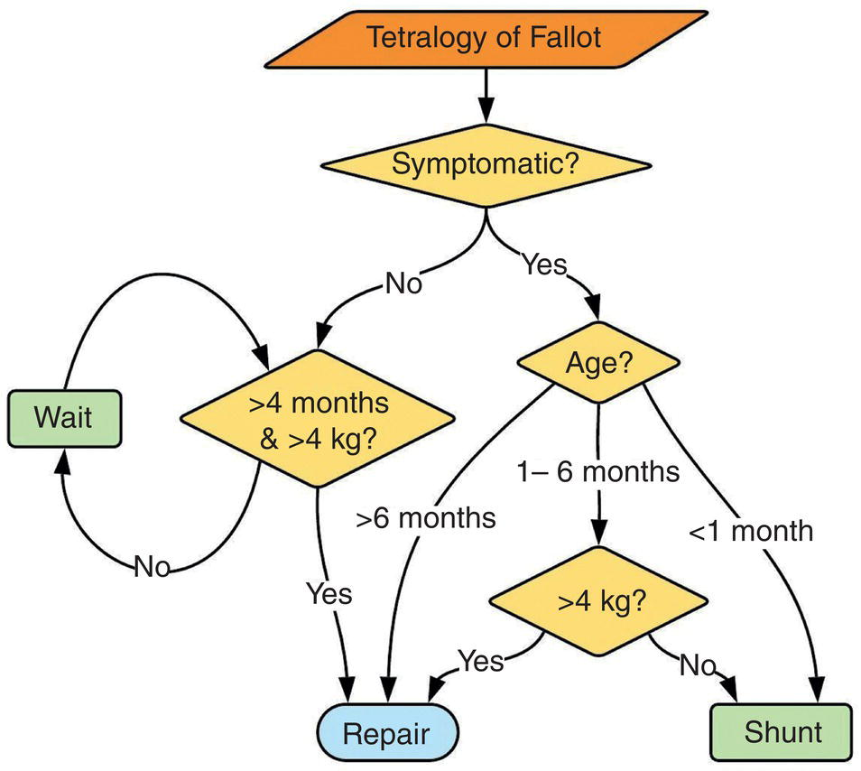

[**Figure 28.15**](#R_c28-fig-0015) Algorithm for treatment of TOF as described by Morales et al. \[80\].

(Source: Schmitz et al. \[38\]. Reproduced with permission of John Wiley & Sons.)

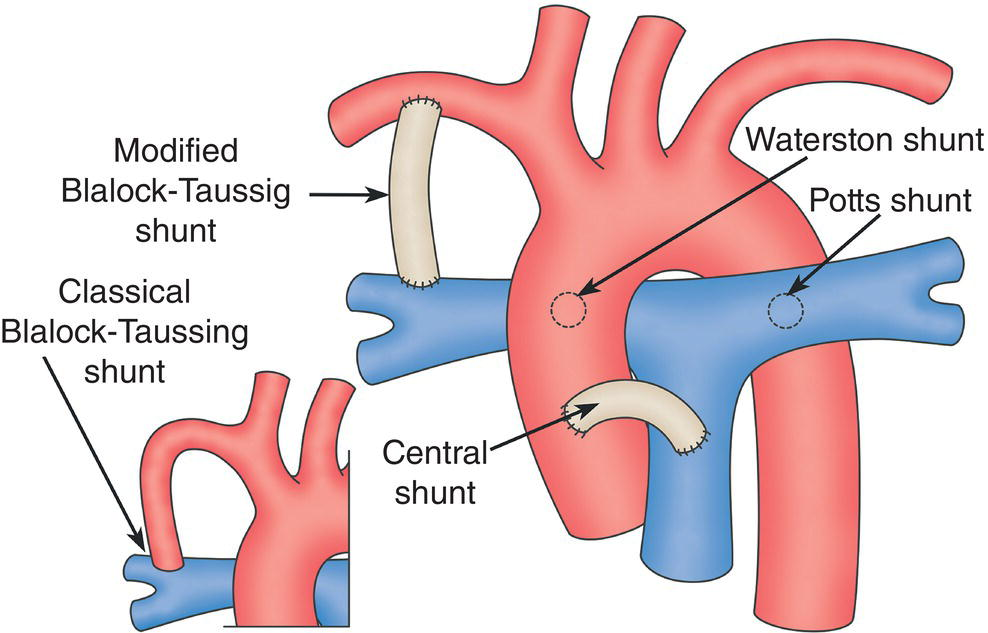

[**Figure 28.16**](#R_c28-fig-0016) Diagram showing the various types of shunts used to increase pulmonary blood flow. The modified Blalock–Taussig shunt and the central shunt are the only shunts used in the modern era.

(Source: Michael L. Schmitz, MD.)

Patients who are unsuitable candidates for surgical palliative shunts, often small and critically ill neonates or infants, can undergo the less invasive transcatheter palliative interventions such as pulmonary balloon valvuloplasty and stent placement in the RVOT or PDA to maintain PBF. Candidates for ductal stenting have an anatomically suitable ductus as well as an additional source of PBF. Pulmonary balloon valvuloplasty alone seldom produces long‐lasting improvement, as the dilated RVOT often returns to its original stenotic state. Cutting balloons or primary stent implants are associated with longer‐lasting improvement in relief of obstruction. Application of stents should be done in consultation with the cardiac surgeons as the stents impact the operative conduct of the full repair \[52, 83, 84\]. See [Chapters 19](c19.xhtml) and [34](c34.xhtml) for further discussion of RVOT and PDA stenting.

#### Surgical repair

Preoperative knowledge of pertinent anatomic TOF details is important for surgical planning and successful repair, including size and nature of RVOTO at the subvalvular, valvular, and supravalvular levels, coronary artery distribution, type and number of VSDs, and any other associated cardiac anomalies.

The first successful full repair of TOF was performed on a 10‐year‐old boy by Walton Lillehei in 1954. In the early era of TOF repair, the goals of surgery were relief of RVOTO and VSD closure via ventriculotomy while preserving RV function. In the 1960s, full repair was reserved for children 4–6 years of age because surgical mortality was too high for younger patients. Later, use of deep hypothermic circulatory arrest improved survival and opened the door for full primary repair during infancy.

Early repair has hemodynamic and anatomic advantages for the developing heart. Although some centers offer neonatal elective full repair, most centers prefer to perform elective full primary repair between 3 and 6 months of age and prior to 12 months for those with a palliative shunt. The increased duration of longitudinal postoperative follow‐up reveals that adults with repaired TOF exhibit medical and surgical sequelae such as impaired exercise capacity, atrial and ventricular arrhythmias, RV and LV dysfunction, cardiac failure, and sudden death. The pathophysiology of these late complications appears related to the effect of extensive ventriculotomy, coronary artery compromise and PV destruction. Findings from outcomes have led to changes in the surgical approach by emphasizing the preservation of the RVOT apparatus, sparing PV injury, minimizing ventriculotomy incisions, and reducing residual VSDs. Hence, transatrial and transpulmonary approaches with valve‐sparing techniques are emphasized with only selective use of transannular patches ([Figure 28.17](#c28-fig-0017)). The surgical approach is via median sternotomy with CPB‐assist. The thymus size is noted prior to subtotal excision due to association to 22q11.2 microdeletion syndromes with TOF.

Upon cardiac exposure, the coronary artery distribution is assessed. After CPB commencement and cardioplegia, the RVOT is examined through a right atriotomy via the TV, and the PV annulus is sized with calibrated dilators. Muscle bundles are divided as needed. A PV commissurotomy can be performed transatrially if exposure is adequate; otherwise, it can be accessed via a transpulmonary approach by a longitudinal incision in the MPA. If preservation of the PV is not feasible, a right ventriculotomy with placement of transannular patch will be done to augment the RVOT size. The VSD is closed using a patch, avoiding the AV node or bundle of His that passes adjacent to the VSD margin. The atrial level shunt is closed if present. If postoperative RV dysfunction is expected, a small atrial communication (“pop‐off”) is left to allow LV filling and preload with a degree of right‐to‐left shunting. Patch augmentation of BPA stenosis is performed as needed. In some patients, a RV‐to‐pulmonary artery conduit may be necessary to avoid injuring a coronary artery crossing the RVOT ([Figure 28.18](#c28-fig-0018)). TEE is used after separation of CPB to assess for adequacy of repair, residual shunts and defects, and ventricular function. An RV:LV pressure ratio greater than 0.7 usually indicates inadequate relief of RVOT obstruction, with the caveat that early post‐CPB pressure measurements do not always correlate to later measurements and might prompt unnecessary revisions. If residual shunts are suspected, a comparison of PaO2 from simultaneous blood gas measurements taken from the superior vena cava and the MPA can be helpful. Temporary atrial and ventricular pacing wires are placed prophylactically for the management of postoperative arrhythmias such as heart block and junctional ectopic tachycardia (JET) following TOF repair.

#### Long‐term surgical complications

Most patients with repaired TOF will live to adulthood; however, many will require reintervention before 30 years of age to address residual disease. The most common sequela is PI. Other sequelae include BPA stenosis, residual VSDs, and RVOT aneurysmal dilation. Chronic PI leads to RV volume overload, RV dilation and dysfunction, and ventricular arrhythmias. Eventually, these sequalae affect the LV and cause biventricular dysfunction and heart failure. Monitoring for symptomatology and progression of RV dilation is essential. An increasingly used monitoring modality is cardiac MRI for the longitudinal evaluation of volumetric ventricular measurement, PI fraction quantification, and RV functional status \[85\]. Ideally, a PV replacement is performed prior to irreversible RV dysfunction from the effects of PI but as late as possible to allow placement of an adult‐sized valve to decrease the number of re‐interventions needed in a patient’s lifetime. Bioprosthetic valves deteriorate over time, and most patients will require another replacement within a decade. For symptomatic patients, PV replacement is indicated. For asymptomatic patients, the timing and indications for PV replacement is unclear. Professional organizations have published criteria to guide these decisions \[86\].

[**Figure 28.17**](#R_c28-fig-0017) Surgically repaired hearts with tetralogy of Fallot, showing resection of right ventricular outflow tract (RVOT) muscle (dashed lines), patch closure of the ventricular septal defect (VSD), and patch arterioplasty: (A) supravalvular main pulmonary patch arterioplasty, RVOT muscle resection, VSD patch; (B) RVOT patch, RVOT muscle resection, VSD patch; (C) supravalvular main pulmonary patch arterioplasty, RVOT patch, RVOT muscle resection, VSD patch.

(Source: Michael L. Schmitz, MD.)

[**Figure 28.18**](#R_c28-fig-0018) (A) Normal coronary artery pattern, (B) Normal variant conal artery (first branch of right coronary artery) crossing the right ventricular outflow tract, (C) Aberrant left anterior descending artery arising from right coronary artery and crossing the right ventricular outflow tract.

(Source: Michael L. Schmitz, MD.)

#### Transcatheter pulmonary valve implantation

Multiple PV interventions are needed over the lifetime of the TOF patient. The most common late re‐intervention in the patient with repaired TOF is PV replacement. Nonsurgical options for PV replacement are currently available as transcatheter valve implants for patients with dysfunctional RV‐to‐pulmonary artery conduits, such as the Medtronic Melody valve (Medtronic, Inc., Minneapolis, MN), a stent‐mounted bovine jugular valve and the Edwards SAPIEN XT valve (Edwards Lifesciences Corporation, Irvine, CA), a stent‐mounted bovine pericardial valve. Pre‐stenting a RV‐to‐pulmonary artery conduit to prepare a landing zone for the PV to anchor is often necessary ([Figure 28.19](#c28-fig-0019)). Transcutaneous valves for the native RVOT without a circumferential conduit are under development. Knowledge of coronary artery location is necessary to avoid coronary artery compression during and after valve implantation. Other than coronary artery compression, complications include stent fracture, RV‐to‐pulmonary artery conduit tear, device dislodgement and infective endocarditis. This field continues to grow, and more transcutaneous device options will become available \[87\]. See [Chapter 34](c34.xhtml) for additional discussion of transcatheter PV implantation.

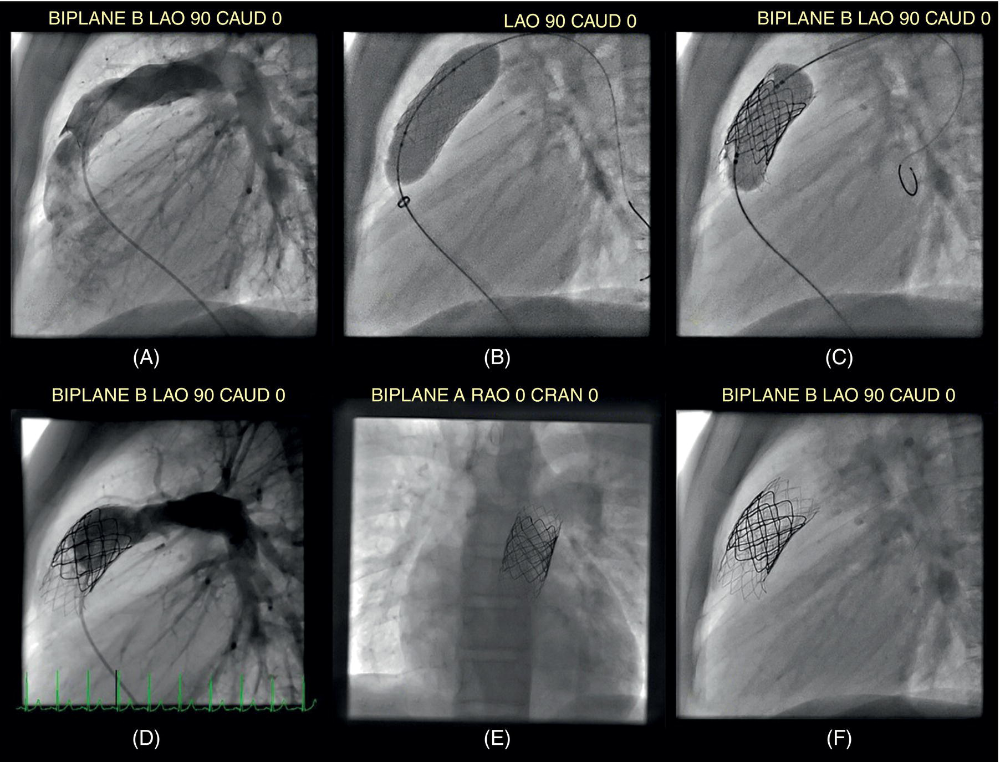

[**Figure 28.19**](#R_c28-fig-0019) Transcatheter Pulmonary Valve Implantation. (A) Contrast injection of right ventricle‐to‐pulmonary artery conduit showing pulmonary insufficiency and irregular luminal surface, lateral view. (B) Pre‐stenting of right ventricle‐to‐pulmonary artery conduit for improved landing surface for the pulmonary valve to anchor, lateral view. (C) Pulmonary valve deployment inside of right ventricle–pulmonary artery conduit pre‐stent, lateral view. (D) Contrast injection showing a competent pulmonary valve, lateral view. (E) Final pulmonary valve position, anterior to posterior view. (F) Final pulmonary valve position, lateral view.

(Source: Destiny F. Chau, MD.)

### Anesthetic considerations

#### Initial assessment and planning

Hypoxemia becomes progressive over time as PBF diminishes concordant to the increasing obstruction by the RVOT. Some patients experience hypercyanotic episodes when the oxygen saturation acutely drop to 20–30% or less. Since systolic pressure in the RV reflects the pressure in the LV and aorta, a decrease in systemic arterial pressure (as may occur with peripheral vasodilatation caused by anesthetic agents and sedative drugs, or prolonged fasting) results in decreased RV pressure and PBF. An increase in LV pressures, as induced by vasoactive agents and volume administration, can reverse shunting of blood from the RV into the LV and promote PBF. Close monitoring of blood pressure changes from anesthetic interventions can provide early physiological guidance for optimizing PBF and preventing hypercyanotic episodes.

Preoperative assessment should include the history of hypercyanotic episodes in patients who are not palliated or repaired. Patients with severe cyanosis present with failure to thrive and polycythemia unless they are anemic. Polycythemia actually enhances the “blueness” during hypercyanotic episodes due to higher levels of deoxygenated hemoglobin. Patients with stable and mild cyanosis often have had generous weight gain from frequent feedings given to prevent agitation and worsened cyanosis. Anticipation, early recognition, and management of potential hypercyanotic episodes are essential for avoiding cardiovascular collapse.

Preoperatively, the following factors are considered for preventing hypercyanotic episodes:

-   Minimize patient agitation to reduce tachycardia, increased infundibular tone and increased oxygen consumption. Keep the patient at ease by avoiding irritating events; use premedication in a monitored setting and comfort the infant as needed (e.g., judicious use of sugar drops or a pacifier may mitigate hunger).
-   Minimize dehydration by avoiding prolonged fasting. Offer clear fluids up to 1–2 hours prior to anesthesia induction or administer IV fluids if IV access is present.
-   Beta blocker therapy should be continued as prescribed.

Even under anesthesia, increased stimulation can incite infundibular spasm that enhances right‐to‐left shunting, precipitating a hypercyanotic episode. Anesthetic induction and times of surgical manipulation are especially vulnerable periods for occurrence of a hypercyanotic episode. Infants with unrepaired TOF may present for anesthetic care for non‐cardiac interventions such as cardiac catheterizations, MRI, and CT, or for surgical procedures that cannot be delayed until cardiac palliation or repair ([Table 28.6](#c28-tbl-0006)).

#### Management of hypercyanotic episodes

The primary goal is to improve PBF so that the hypoxemia can be reversed. PBF is increased by reducing acute RVOT obstruction promoted by the infundibular spasms, enhancing RV preload, and reversing right‐to‐left intracardiac shunting by increasing SVR relative to RV pressure. The objectives are to increase afterload to the left heart, reduce RV infundibular spasm, and augment RV preload ([Table 28.7](#c28-tbl-0007)).

[**Table 28.6**](#R_c28-tbl-0006) Overview of considerations and recommendations for the anesthetic management of patients with unrepaired tetralogy of Fallot (TOF), acyanotic or cyanotic, for non‐cardiac surgery

| Anesthesia considerations and recommendations for patients with unrepaired TOF undergoing non‐cardiac surgery |
| --- |
| Acyanotic, “Pink Tets,” at risk for pulmonary overcirculation | Cyanotic, “Blue Tets,” at risk for hypercyanotic spells |
| --- | --- |
| **Hemodynamic goal**:  
Maintain Qp:Qs near 1:1
1.  Avoid increased left to right shunt and worsening of pulmonary overcirculation.
2.  Maintain awareness that the shunt can reverse in situations of increased PVR (hypoxia, hypercarbia, acidosis, hypothermia)

 | **Hemodynamic goal**:  
Preserve PBF and avoid hypercyanotic episodes

1.  Avoid tachycardia, dehydration
2.  Maintain adequate preload to counteract stiff RV and decrease RVOTO
3.  Maintain SVR to minimize right to left shunt & promote PBF
4.  Avoid sudden catecholamine release, maintain appropriate anesthetic depth

 |
| **FiO** **2** **restrictions**‐ Avoid unnecessary hyperoxia as it increases PBF | **FiO** **2** **restrictions**‐ None |
| **PREOPERATIVE**

1.  Premedicate as needed for anxiolysis.
2.  Avoid prolonged fasting. Patients may be on diuretics for CHF.

 | **PREOPERATIVE**

1.  Premedicate as needed for anxiolysis to avoid hypercyanotic episodes prior to induction
2.  Avoid unnecessary fasting to maintain preload.

 |
| **INTRAOPERATIVE**  
**Monitors/Lines**

1.  Standard ASA monitors with 5‐lead ECG
2.  De‐air all lines to avoid paradoxical embolism.
3.  +/− invasive arterial line or central line as warranted by extent of surgery and anticipated hemodynamic perturbations.

  
**Anesthesia induction**

1.  Inhalation induction, sevoflurane +/− nitrous oxide, +/−IM ketamine and rocuronium as needed
2.  Place IV after induction.
3.  If IV → ketamine (1–2 mg/kg) +/− fentanyl (1–2 mcg/kg) +/− sevoflurane. Intubate after paralysis.

  
\*\*SBE prophylaxis as indicated  
**Anesthesia maintenance**

1.  Inhaled anesthetic agent (sevoflurane). Titrate dexmedetomidine.
2.  Volume replacement to maintain euvolemia. Used blood products as needed to compensate for surgical blood loss, maintain organ perfusion and optimize hemostasis

  
**Anesthesia emergence**

1.  If extubation planned, optimize pain control with adjuvant acetaminophen, regional block or local anesthetic infiltration. Titrate dexmedetomidine to adequate sedative effect.
2.  If postoperative mechanical ventilation planned, prepare for sedation for transport to ICU.

 | **INTRAOPERATIVE**  
**Monitors/Lines**

1.  Standard ASA monitors with 5‐lead ECG
2.  De‐air all lines to avoid paradoxical embolism.
3.  +/− invasive arterial line or central line as warranted by extent of surgery and anticipated hemodynamic perturbations.

  
**Anesthesia induction**

1.  Inhalation induction sevoflurane +/− nitrous oxide, +/−IM ketamine and rocuronium as needed
2.  Place IV after induction.
3.  If IV → ketamine (1–2 mg/kg) +/− fentanyl (1–2 mcg/kg) +/− sevoflurane. Intubate after paralysis.

  
\*\*SBE prophylaxis as indicated  
**Anesthesia maintenance**

1.  Inhaled anesthetic agent, sevoflurane. Titrate dexmedetomidine.
2.  Volume replacement often needed to maintain preload, with higher filling pressures for a stiff RV. Used blood products as needed to compensate for surgical blood loss, maintain organ perfusion and optimize hemostasis.

  
**Anesthesia emergence**

1.  If extubation planned, optimize pain control with adjuvant acetaminophen, regional block or local anesthetic infiltration. Titrate dexmedetomidine to adequate sedative effect.
2.  If postoperative mechanical ventilation planned, prepare for sedation for transport to ICU.

 |
| **Postoperative care**

1.  ICU or stepdown ICU if extubated
2.  ICU care if mechanically ventilated

 | **Postoperative care**

1.  ICU or stepdown ICU care if extubated
2.  ICU care if mechanically ventilated

 |

ASA, American Society of Anesthesiologists; CHF, congestive heart failure; ECG, electrocardiogram; IM, intramuscular; IV, intravenous; PBF, pulmonary blood flow; PVR, pulmonary vascular resistance; Qp, pulmonary blood flow; Qs, systemic blood flow; TOF, tetralogy of Fallot; RV, right ventricle; RVOTO, right ventricle outflow tract obstruction; SBE, subacute bacterial endocarditis; SVR, systemic vascular resistance.

[**Table 28.7**](#R_c28-tbl-0007) Treatment for a “tet spell” or hypercyanotic episode for patients with tetralogy of Fallot

<table border="1"><tbody class="tdcolor4"><tr><td class="left"><ul id="c28-list-0034"><li id="c28-li-0141">Increase RV preload – dilate the right ventricular outflow tract and improve cardiac output<ul class="circle" id="c28-list-0035"><li id="c28-li-0142">Give IV fluids</li><li id="c28-li-0143">Apply knee‐chest position or abdominal compression</li><li id="c28-li-0144">Directly compress aorta via open chest</li></ul> </li><li id="c28-li-0145">Increase SVR – Reverse right to left shunt<ul class="circle" id="c28-list-0036"><li id="c28-li-0146">Administer phenylephrine 5–10 mcg/kg IV</li><li id="c28-li-0147">Apply knee‐chest position or abdominal compression</li><li id="c28-li-0148">Directly compress aorta via open chest</li></ul> </li><li id="c28-li-0149">Decrease infundibular spasm via negative inotropic effects<ul class="circle" id="c28-list-0037"><li id="c28-li-0150">Administer sedatives</li><li id="c28-li-0151">Administer beta‐blocker drugs (e.g., esmolol 50 mcg/kg, and then titrate to effect)</li><li id="c28-li-0152">Increase depth of anesthesia; if inhaled agent, use sevoflurane</li></ul> </li><li id="c28-li-0153">Decrease pulmonary vascular resistance by reducing hypoxic pulmonary vasoconstriction<ul class="circle" id="c28-list-0038"><li id="c28-li-0154">Increase inhaled oxygen</li></ul> </li><li id="c28-li-0155">Avoid tachycardia – increase diastolic filling time and improve right ventricular preload<ul class="circle" id="c28-list-0039"><li id="c28-li-0156">Administer sedatives</li><li id="c28-li-0157">Administer beta‐blocker drugs</li></ul></li></ul></td></tr></tbody></table>

RV, right ventricle; IV, intravenous; SVR, systemic vascular resistance; ECMO, extracorporeal membrane oxygenation; CPB, cardiopulmonary bypass.

If the patient remains cyanotic despite these measures, ECMO should be considered as a lifesaving therapy. Sternotomy with manual compression of the aorta can be used to temporarily increase SVR and reverse right‐to‐left shunting while rapidly instituting CPB.

#### Perioperative anesthetic management for surgical palliation

Most neonates or infants needing surgical palliation are critically ill and dependent on PGE1 infusion to maintain ductal patency for augmenting PBF and managing hypoxemia. Some other infants become symptomatic shortly after discharge from the hospital as they develop cyanosis and fail to thrive. Anesthetic goals are to maintain PBF by limiting right‐to‐left intracardiac shunting and preserving adequate SVR. Induction of anesthesia can be successful with ketamine and/or fentanyl with an inhaled agent for maintenance. General anesthesia and potent inhaled agents have been demonstrated to depress ventricular function \[88, 89\]. Rivenes et al. showed that both sevoflurane and isoflurane have a dose‐dependent, albeit not statistically significant, decrease in CO and shortening fraction at 1 and 1.5 MAC. Isoflurane led to larger dose‐dependent increases in heart rate and decreases in SVR index compared to sevoflurane; thus, sevoflurane would be the better choice \[90\]. IV fluids and phenylephrine are useful to increase SVR. Inotropic drugs can increase heart rate and contractility and worsen infundibular spasms. In the absence of reliable IV access, inhalational induction with sevoflurane, and intramuscular ketamine and rocuronium as needed can provide adequate conditions for IV access and tracheal intubation. Central venous access is obtained for the infusion of fluids and vasoactive agents. An arterial line is placed for close hemodynamic monitoring and blood gas sampling. If placing a radial arterial line, it is recommended on the contralateral side of the anticipated mBTS, so that blood pressure assessment is unbiased by the run‐off from the ipsilateral innominate artery or by possible stenosis at the anastomotic site.

Although mBTS was traditionally done via a thoracotomy, the mBTS is now often performed via median sternotomy \[47\]. Median sternotomy permits exposure for conversion to a central shunt, institution of CPB in the event of severe hemodynamic instability or need to patch augment the BPAs, inspection of the coronary anatomy, division of the PDA while confirming adequacy of the shunt flow, and avoidance of a separate incision site after full repair. Median sternotomy also avoids the lung retraction required for exposure with thoracotomy. Heparin at 100 units/kg is given prior to shunt placement. Hypoxemia and hemodynamic instability can occur during the partial clamping for the graft anastomosis and is managed with vasoactive support, fluids, and ventilatory adjustment. Once the shunt is open, oxygen saturation acutely improves while blood pressure decreases. A widened pulse pressure gradient results due to low diastolic pressure secondary to blood run‐off to the lungs; insufficient diastolic blood pressure can compromise coronary perfusion. Management with normoventilation, low FiO2, volume, and vasopressors can temporize this problem. If a mBTS was done via a right thoracotomy and a PDA was present, the excessive diastolic run‐off may continue until the PDA closes. PGE1 infusion is discontinued when alternative PBF is established. A shunt flow approaching Qp:Qs of 1:1 under normal physiological conditions of normocarbia while breathing spontaneously in room air is ideal, resulting in an SpO2 of 80–85% in the absence of parenchymal lung disease. Intraoperatively, simulating normal physiological conditions as closely as possible is important for accurate clinical assessment of Qp:Qs. If the ductus is still open, the additional PBF must be considered in Qp:Qs. Otherwise, saturations too high or too low would indicate an imbalanced Qp:Qs. Lower than expected saturations, after ruling out reversible ventilatory impairments such as atelectasis or endobronchial intubation, may indicate that the shunt is inadequate. Some surgeons prefer the larger diameter shunts if physiologically tolerated to accommodate patient growth and associated increased PBF needs prior to the full repair. Platelet transfusions are avoided whenever possible due to an increased risk of shunt thrombosis.

#### Postoperative care for surgical palliation

In the ICU, the patient is supported with mechanical ventilation for the next 12–24 hours for stabilization, monitoring and management of ongoing physiologic changes. Potential complications include unilateral or bilateral pulmonary edema or hemorrhage from increased PBF. Also, low systemic diastolic blood pressure can compromise coronary artery flow during diastole, causing myocardial ischemia. Shunt thrombosis is always a potential risk, and heparin infusion at 6–10 units/kg/hour is commenced to maintain shunt patency after the risk of surgical bleeding subsides. A shunt murmur, reflecting presence of shunt blood flow, can be easily auscultated by pausing ventilation and placing the stethoscope at the end of the endotracheal tube; the murmur is transmitted via the endotracheal tube because the shunt is near the bronchus. Antiplatelet therapy is initiated with aspirin when enteral intake is started and continued until the time of complete repair. Other perioperative complications include recurrent laryngeal nerve and phrenic nerve damage and development of chylothorax from thoracic duct injury.

#### Perioperative anesthetic management for surgical repair

The pre‐CPB goal is the promotion of PBF, and post‐CPB goals are preservation of ventricular function and CO optimization. Monitors include central venous pressure and invasive arterial blood pressure. Cerebral oximetry is helpful. TEE is recommended post‐CPB to assess the surgical repair, but epicardial echocardiography can be used if TEE is not feasible.

Induction of anesthesia for complete repair can be similarly accomplished as for the palliative shunt placement. For patients at a low risk of hypercyanotic episodes, inhalational induction of anesthesia is generally safe. There are several described techniques for maintenance of anesthesia. If immediate extubation in the operating room or early extubation in the ICU (within 6 hours after surgery) is anticipated, then a multimodal low‐dose opioid technique is recommended. At the author’s institution, a technique of total fentanyl dose of 10–15 μg/kg supplemented with an inhalational agent, dexmedetomidine infusion 0.3–0.5 μg/kg/hour, morphine infusion 20–25 μg/kg/hour, local anesthetic wound infiltration and IV acetaminophen provide for adequate immediate extubation conditions after surgical closure. The extubated patient is transported to the cardiac ICU with continuation of the dexmedetomidine and morphine infusions, as well as a milrinone infusion. A report compared three anesthetic techniques in patients 30 days‐old to 3 years‐old undergoing TOF, AV canal or ASD repair: fentanyl 10 μg/kg vs. fentanyl 25 μg/kg vs. fentanyl 10 μg/kg plus dexmedetomidine at 1 μg/kg loading dose followed by 0.5 μg/kg/hour infusion, until separation from CPB. Adjuvant isoflurane was used in all three groups. It showed that the stress response, coagulopathy, transfusion requirements and postoperative opioid use were highest in the fentanyl 10 μg/kg group while the stress response was most blunted with the 25 μg/kg fentanyl dose. Adding dexmedetomidine to the low‐dose fentanyl group improved stress response blunting and provided better postoperative pain control. No difference in timing for fast track extubation was found amongst all three groups \[91\]. One institution described using a ketamine infusion and found more hemodynamic stability when compared with isoflurane due to preservation of SVR in the pre‐CPB period \[92\].

Considerations for separation from CPB include:

-   _RV dysfunction_ can occur especially if a ventriculotomy was performed. Pre‐existing RV hypertrophy and diastolic dysfunction may require high filling pressures to maintain CO. Management should target increasing preload, decreasing RV afterload, and adding inotropic support such as milrinone (0.375–0.75 μg/kg/min) and perhaps low dose epinephrine (0.02–0.04 μg/kg/min).
-   _A hyperdynamic RVOT_ may be observed especially during periods of tachycardia, limiting stroke volume. Management includes decreasing the heart rate with an esmolol infusion in the early postoperative period while maintaining adequate preload.
-   _Tachydysrhythmias_ occur frequently after complete TOF repairs. A recent review found an overall frequency of 19% in a multi‐institutional database of 7749 patients \[93\]. Surgical repair frequently disrupts the conduction system located in close proximity of the VSD. JET is a narrow complex tachydysrhythmia originating from the AV node and His bundle area; it often develops within 24 hours after repair and has been associated with increased length of stay \[94\]. JET is characterized by heart rates above 170/min and AV dissociation leading to significant hemodynamic instability. Risk factors include young age, long CPB and aortic cross clamp times, preoperative tachycardia, high inotropic requirements, and surgical intervention near the AV node. Treatment consists of sedation, electrolyte correction, cooling to 34–35 °C, and IV amiodarone \[56, 95\]. A meta‐analysis showed that a prophylactic dexmedetomidine infusion was effective in reducing postoperative JET \[96\]. Another study showed that dexmedetomidine has increased preventive effects when started preincision \[97\]. Prophylactic amiodarone has also been reported to reduce the incidence of JET \[98\]. Heart block is common after separation of CPB. The heart block may be transient due to inflammation around conduction fibers. A temporary pacemaker is helpful while awaiting recovery of normal cardiac conduction. In some patients, recovery is not seen until for 7–10 days; afterward, a permanent pacemaker is considered. Many patients demonstrate right bundle branch block on postoperative ECG, particularly those who underwent ventriculotomy.
-   _Coagulopathy and bleeding_ after separation of CPB is common after TOF repair. Hemodilution of coagulation factors and platelets, pronounced inflammatory effects of CPB and immature coagulation systems increase the risks for bleeding in small, young patients undergoing early TOF repair. Transfusion of multiple component blood products is almost always required for this patient group. It is not surprising that a recent Society for Thoracic Surgeons (STS) Congenital Heart Surgery database analysis showed a consistent median greater than 99% for intraoperative blood transfusion for all patients 30 days and younger and those aged 31 days to 12 months across 82 centers \[99\]. The use of antifibrinolytics such as epsilon‐aminocaproic acid or tranexamic acid have been shown to reduce post‐CPB bleeding and minimize the use of blood products. Aprotinin, a protease inhibitor antifibrinolytic, is no longer available in the US; however, it is available in Europe.
-   _Residual VSDs_ appear to be common. Small VSDs are usually hemodynamically insignificant and are likely to close spontaneously. If greater than 2–3 mm, excessive PBF will be poorly tolerated and it may be necessary to resume CPB for further VSD closures after quantification of the shunt magnitude by echocardiography and hemodynamic evaluation \[100, 101\]. Also, some VSDs that were undetected preoperatively due to equalization of ventricular pressures may be now visualized after relief of the RVOT obstruction. The degree of additional shunting and hemodynamic significance may indicate a return to CPB.

Indications for returning to CPB include coronary compromise by excessive traction or injury, residual VSDs, residual RVOT obstruction and TR.

An STS database report found that early extubation (within 6 hours after surgery) was performed in 31.5% (478 of 1,519) of children undergoing TOF repair between 2010–2013, in an aggregate of 92 centers \[102\]. An updated report from 2010–2017 found that 17.15% (705/4126,120 programs) of TOF repair patients were extubated before leaving the operating room \[103\]. Although early tracheal extubation has associated advantages such as avoidance of positive pressure ventilation and shorter lengths of ICU and hospital stay, patient selection and the implementation of strong strategies for managing postextubation pain, sedation, RV dysfunction, and pulmonary status are essential for successful early extubation and good outcomes. Reintubation after extubation failure is associated with increased morbidity, hospital stay and mortality. A factor that might contribute to extubation failure is delirium, a condition that often is treated with additional sedation and sometimes leading to inadequate ventilation \[104, 105\].

#### Postoperative care for surgical repair

After chest closure, the patient is prepared for planned immediate extubation after meeting extubation criteria. Otherwise, the patient remains intubated and ventilated while receiving adequate sedation during transport to the ICU. Regardless of whether the patient continues mechanical ventilation or is extubated, analgesia and adequate sedation can be provided with morphine (20–40 μg/kg/hour) and dexmedetomidine (0.3–0.7 μg/kg/hour) infusions at titrated doses.

* * *

### KEY POINTS: TETRALOGY OF FALLOT

-   Decreases in SVR and catecholamine surges can trigger hypercyanotic episodes. Anesthetic induction and periods of surgical manipulation are especially vulnerable times.
-   Hypercyanotic episodes are managed with IV fluids, oxygen, phenylephrine, increased anesthetic depth, and knee‐chest positioning or abdominal compression.
-   During mBTS placement, hypoxemia and hemodynamic instability often occur during the shunt placement. After shunt opening, hypotension with widened pulse pressure occurs.
-   Postoperative ventilation is recommended after mBTS placement due to the risk of pulmonary edema and coronary artery ischemia from diastolic hypotension.
-   Coronary arteries crossing the RVOT may preclude the option to use a transannular patch repair. A RV to pulmonary artery conduit is an alternative.
-   Patients with RV hypertrophy and diastolic dysfunction require high‐filling pressures to maintain adequate CO.
-   Following full repair, RV dysfunction, tachydysrhythmias, and bleeding should be anticipated.
-   Significant residual VSDs result in poorly tolerated excessive PBF.

* * *

## Pulmonary stenosis with intact ventricular septum

### Incidence, anatomy, and natural history

PS/IVS is a fairly common malformation, consisting of 10% of congenital heart defects \[2\]. The lesion can be further divided into three groups: valvar, subvalvar, or supravalvar. Valvar PS is the most common \[80–90% of reported cases of PS\] while subvalvar or supravalvar (including stenosis of the BPAs) varieties are less common \[106\]. Acuity can range from asymptomatic (mild valvar PS) to requiring urgent intervention (ductal‐dependent or “critical” PS).

The stenotic pulmonary valve may be unicuspid, bicuspid, or tricuspid and is dome‐shaped or dysplastic with a narrow, central opening. Obstruction to the RVOT may lead to hypertrophy of the infundibulum, eventually leading to diastolic dysfunction as ventricular compliance worsens \[107\]. Valvar PS is commonly associated with other defects such as Noonan syndrome, ASD, EA, double outlet RV, and transposition of the great arteries \[108\].

Subvalvar PS can be divided into two further subtypes: infundibular and subinfundibular. Infundibular PS is usually a part of TOF whereas subinfundibular PS occurs within the context of double‐chambered RV (DCRV). A DCRV is caused by an anomalous muscle band that runs between the anterior wall to the ventricular septum \[109\]. These muscle bands divide the RV cavity into a proximal high‐pressure chamber and a distal low‐pressure chamber that if not surgically corrected, may progressively worsen and lead to DCRV. Supravalvar PS is seen in many disorders such as congenital rubella, Williams, Noonan, Alagille, DiGeorge, and Leopard syndromes \[108\] ([Table 28.8](#c28-tbl-0008)). The stenosis can be localized to the MPA, as well as the bifurcation, and/or the BPAs proper. If the stenosis is located in the MPA, there is usually poststenotic dilation of the MPA and sometimes of the LPA as well.

### Pathophysiology

Newborns with critical PS may present with heart failure that results from suprasystemic RV pressure, significant TR and right‐to‐left shunting via an ASD or PFO. However, most patients have mild to moderate PS and are asymptomatic at birth, developing symptoms gradually. Many patients are initially discovered by the presence of a systolic ejection murmur on routine physical exam. Individuals with mild to moderate PS have been documented to survive well into their 4th decade of life \[108\]. Symptomatically, patients present with dyspnea, fatigue, and sometimes syncope. Patients with mild PS may have a normal ECG, whereas an ECG in a patient with severe stenosis may show right axis deviation and evidence of RV hypertrophy. Echocardiography with Doppler evaluation can be used to grade peak and mean gradients, location of the stenosis, presence of DCRV, and with the advent of 3D echocardiography, accurately estimate RV volume and ejection \[110\]. MRI can be used to study anatomy and establish the exact location of the stenosis (supravalvar, valvar, or subvalvar) as well as decrease exposure to ionizing radiation, as with multislice computed tomography (CT) scans. Limiting factors for MRI imaging include incompatibility with pacemakers and requirements for breath holds. Cardiac catheterization is utilized diagnostically to directly measure pressure gradients and evaluate anatomy via angiography but is used primarily for interventional options such as balloon valvuloplasty.

[**Table 28.8**](#R_c28-tbl-0008) Common genetic syndromes associated with pulmonary stenosis \[108\]

| Syndrome | Genetic defect | Cardiac features | Non‐cardiac features |
| --- | --- | --- | --- |
| Noonan | PTPN11, SOS1, aberrant RAS‐MAPK‐signaling, heterogenous trait | Dysplastic pulmonary valve stenosis, hypertrophic cardiomyopathy | Short stature, hypertelorism, downward eye slant, low set ears |
| Williams‐Beuren | 7Q11.23 deletions, autosomal dominant trait | Supravalvular aortic or pulmonary stenosis | Elfin face, short stature, impaired cognition and development, endocrine disorders, genitourinary abnormalities |
| Leopard | PTPN11, RAF‐1, autosomal dominant trait | Electrocardiographic abnormalities, supravalvular or valvular pulmonary stenosis | Lentigines, ocular hypertelorism, abnormal genitalia, retardation of growth, deafness |
| DiGeorge (velocardiofacial) | 22Q11 deletion, autosomal dominant trait | Conotruncal defects such as tetralogy of Fallot, interrupted aortic arch, truncus arteriosus, vascular rings and ASD/VSD | Hypertelorism, low set and posteriorly rotated ears, palatal abnormalities, micrognathia, developmental delay, hypoplastic thymus, hypocalcemia, variety of immunological abnormalities |
| Alagille | JAG‐1, NOTCH‐2, dominant trait | Peripheral pulmonary stenosis | Facial dysmorphias (triangular face, wide nasal bridge, deep set eyes), intrahepatic cholestasis, butterfly vertebrae |
| Keutel | MGP mutations, autosomal recessive trait | Multiple peripheral pulmonary stenoses | Abnormal cartilage calcifications, brachytelephalangy, subnormal IQ, hearing loss |
| Congenital rubella | – | Peripheral pulmonary stenosis, open ductus Botalli | Congenital cataract/glaucoma, deafness, pigmentary retinopathy |

ASD, atrial septal defect; VSD, ventricular septal defect.

### Surgical and transcatheter approaches and outcomes

Transcatheter balloon valvuloplasty is now considered the first‐line treatment for PS. The procedure is considered when patients exhibit symptoms, have a PV mean gradient greater than 40 mmHg while sedated, or have clinically significant PS with RV dysfunction on echocardiography \[108\]. Exceptions include cases involving a hypoplastic annulus, severely dysplastic valve, and other associated congenital cardiac lesions. In these cases, surgery may be the preferred initial option \[108\]. Percutaneous balloon valvuloplasty can be used serially for PV stenosis that recurs over time and is considered successful when the mean gradient is reduced to less than 30 mmHg. The incidence of PI after balloon valvuloplasty is 80%, but it is usually mild in clinical severity. In the past, postprocedural PI was noted with little concern, but correlations between long‐standing PI, RV dilation, and potential decreases in RV function have led some centers to utilize smaller balloons and tolerate some residual PS \[107\]. Complications, though rare, include transient bradycardia and hypotension with balloon inflation, transient/permanent AV block, tricuspid papillary muscle rupture and MPA rupture. However, with experienced providers, the risk of death/major complications is exceedingly low (0.24%/0.35%, respectively). Beta‐blockers may be needed infrequently to reduce contractility in a hyperdynamic RV after valvuloplasty.

If balloon valvuloplasty fails, or if there are more complicated lesions (usually sub‐ or supravalvar stenosis), surgical repair with CPB may be necessary. For valvar stenosis, open commissurotomy or valvulotomy is usually performed through a vertical incision in the pulmonary trunk. If necessary, a transannular patch of autologous pericardium can be placed. Subvalvar obstruction in the infundibular region can be excised and an MPA patch placed. If valve replacement is required (as in the case of severe postprocedural PI), implantation of a bioprosthetic valve is preferred as the risk of thrombosis in pulmonary mechanical valves is higher than in mechanical valves in the aortic position \[108\]. Pulmonary homograft or other bioprosthetic valves may be used. Patients with prior valve replacements that have developed stenosis or regurgitation can be candidates for percutaneous valve implantation.

Despite successful pulmonary balloon valvuloplasty, some neonates with critical PS may exhibit cyanosis with ductal closure, and a PGE1 infusion will need to be reinstated. As RV hypertrophy diminishes and RV compliance improves, PGE1 may be weaned. If the neonate remains ductal‐dependent for PBF after 2–3 weeks, a systemic‐to‐pulmonary arterial shunt or PDA stent may be required. About 15–20% of neonates with critical PS will eventually need surgical intervention.

### Anesthetic considerations

#### Periprocedural anesthesia for transcatheter pulmonary balloon valvuloplasty

Neonates with critical PS require PGE1 to maintain adequate PBF and urgently undergo PV transcatheter intervention. Often, these infants are supported prior to the procedure with mechanical ventilation and inotropic support. Anesthetic agents may include inhalational agents supplemented with low‐dose opioids and muscle relaxants. Procedural stimulation is limited beyond establishment of venous access for catheterization, so anesthetic requirements are minimal. Intraprocedural complications include temporary bradycardia and hypotension during balloon inflation and transient AV block. After sufficient PV dilation, an immediate reduction in the transvalvar gradient is observed with angiographic evidence of increased PBF. At the time of the sudden relief of PV obstruction, filling pressures will require immediate support with the administration of intravascular volume such as 5% albumin in order to maintain forward flow from the hypertrophic, low‐compliance RV. After establishing PBF through the PV, PGE1 is discontinued. The neonate returns to the ICU with mechanical ventilation for adjustments of inotropic support and ventilation.

Older infants and children with PS usually present electively for pulmonary balloon valvuloplasty. Inhalational anesthetic induction followed by establishment of intravenous access is generally well‐tolerated. The intraprocedural complications are similar to those above. Maintenance of anesthesia can be accomplished with inhaled anesthetic agents supplemented with low‐dose opioids as necessary. After successful pulmonary balloon valvuloplasty, some patients may have transient dynamic RVOTO secondary to infundibular hypertrophy. A beta‐blocker such as with an infusion of esmolol can reduce contractility and heart rate. Increasing right heart filling pressures with intravascular volume administration assists in enhancing right heart CO by increasing preload and overcoming RVOTO. After balloon valvuloplasty of severe PS, the sudden enhancement of PBF can result in reperfusion pulmonary edema, requiring adjustments of mechanical ventilation and especially PEEP. In most cases, the intraoperative course is uneventful, and the patient can be extubated at the conclusion of the catheterization procedure. Local anesthetic infiltration of the access sites, titration of dexmedetomidine for post‐procedural sedation and acetaminophen analgesia are usually sufficient for a smooth anesthetic emergence and recovery.

#### Perioperative anesthesia for surgical valvotomy

##### _Preoperative_

In the current era of transcatheter interventions, surgical valvotomy is reserved for those patients that have failed the transcatheter approach or have multilevel fixed RVOTO not amenable to transcatheter intervention. Patients are medically optimized prior to surgery, particularly those with PS complicated with CHF.

##### _Intraoperative_

Premedication, anesthetic induction, and intubation are tailored to the clinical status of the patient. Anesthetic management prior to CPB is directed towards preservation of ventricular function and optimization of PBF. Anesthetic induction can be accomplished with low‐dose fentanyl, with or without ketamine (depending on the presence of dynamic RVOTO), and low levels of anesthetic agent such as sevoflurane. Meticulous titration of inhaled anesthetic agent with sufficient muscle relaxation and opioid infusion is appropriate for anesthetic maintenance. Continuous arterial blood pressure monitoring with central venous access for central venous blood pressure monitoring and drug administration are established prior to surgery. Cerebral and somatic NIRS monitoring for regional tissue oxygenation and TEE for assessment of the RVOT status and cardiac function are useful.

After completion of the surgical valvotomy, a milrinone infusion can be used to facilitate RV relaxation and lower PVR. Generous RV preload will be necessary to accommodate a noncompliant hypertrophic RV. As the patient is weaned from CPB, the sudden increase in PBF can result in reperfusion pulmonary edema. Mechanical ventilation with sufficient PEEP will be required to maintain airway gas exchange. Transient RV dysfunction, especially after a right ventriculotomy approach, may require inotropic support such as with low‐dose epinephrine. Excessive inotropy can be detrimental if residual dynamic RVOTO is present. For a hyperdynamic RV, CO may actually be improved with an esmolol infusion by reducing dynamic RVOTO. Commonly, a residual pressure gradient with persist across the RVOT after surgical repair, improving over the first 24 postoperative hours.

##### _Postoperative_

If reperfusion pulmonary edema is evident or suspected, patients are best managed with postoperative mechanical ventilation with sufficient PEEP until the pulmonary vasculature has accommodated the increased PBF. Residual infundibular hypertrophy usually resolves over time with removal of the valvar obstruction. Effective postoperative analgesia and sedation are accomplished with opioid and dexmedetomidine infusions as well as IV acetaminophen. Early extubation is reserved for patients with mild PS, an uneventful intraoperative course, adequate ventricular function, and no evidence of reperfusion pulmonary edema.

* * *

### KEY POINTS: PULMONARY STENOSIS WITH INTACT VENTRICULAR SEPTUM

-   Valvar PS is most common at 80–90% of cases, with subvalvular and supravalvular types making up the remaining 10–20%.
-   Successful percutaneous balloon valvuloplasty results in a transvalvar gradient of less than 30 mmHg.
-   Beta‐blockers may be useful in reducing contractility in a hyperdynamic RV after percutaneous balloon valvuloplasty.
-   In the immediate period after repair, RV filling pressures must be adequate while avoiding high pulmonary artery pressures; adequate RV preload and pulmonary vasodilators are useful treatments.

* * *

## Pulmonary atresia with intact ventricular septum

### Incidence, anatomy, and natural history

PA/IVS is a rare (accounting for 3% of congenital heart defects) right heart obstructive lesion defined by the presence of an atretic PV and an IVS (absence of a VSD). Males are more likely to have PA/IVS with a male to female ratio of 1.5:1 \[111\]. Although the etiology of the defect is unknown, there is evidence to suggest that atresia of the PV may be a result of abnormal coronary arterial development \[112\]. Patients commonly develop TR or coronary fistulas in an effort to help decompress the hypertensive RV \[113\]. Typically, there is a PFO or secundum ASD that is restrictive in 5–10%. The TV is generally smaller than normal but can range from extremely stenotic to the dilated annulus of EA (5–10%). The RA is dilated proportionately to the degree of TR. The RV is hypertrophic with a reduced cavity. In about 50% of cases, there are endothelial‐lined blind channels within the RV myocardium known as sinusoids that may be remnants of vessels providing nutrients to the ventricles prior to the formation of coronary arteries. Sinusoids are in direct communication with the RV cavity and sometimes to the coronary arteries, becoming RV to coronary artery fistulae. Sinusoids may persist due to RV hypertension. In the least affected individuals, RV blood is sent as part of a dual blood supply to small areas of myocardium in tandem with normal aortocoronary flow. But approximately 20% of patients with PA/IVS have an absence of anterograde aortocoronary flow, a finding confirmed with either cardiac catheterization or computed tomography ([Figure 28.20](#c28-fig-0020)). In this circumstance, the coronary bed is perfused with poorly saturated systemic venous blood directly from the RV and the RV myocardium is chronically ischemic. In the most severely affected, aortocoronary connections will be absent and coronary cameral connections with the RV establish an RV‐dependent coronary circulation (RVDCC) that supplies the RV myocardium \[113\].

Sometimes the PV appears intact, but with fused commissures. Most often, there is fibrous tissue at the ventriculoarterial junction. The pulmonary arteries usually have normal branching and can be hypoplastic in about 6% of cases. There is almost always a PDA. The LA is enlarged and hypertrophic. Subaortic stenosis can result from bulging of the ventricular septum into the LV due to RV hypertension.

Without treatment, PA/IVS results in death in 50% of neonates, and in 85% of infants by 6 months of age. Fetuses with small, hypertrophied ventricles often survive to birth, whereas those with dilated RVs and severe TR may die in utero with fetal hydrops. Postnatal death is usually due to hypoxemia which is exacerbated by closure of the ductus arteriosus, and eventual myocardial ischemia and infarction \[114\].

### Pathophysiology

Many fetuses with PA/IVS succumb to intrauterine demise or develop hydrops fetalis from RV failure, but for some surviving neonates who have not developed hydrops fetalis, moderate TR may have allowed the RV pressure to remain low such that sinusoids and coronary fistulae have not developed. Alternatively, if TR is mild or the valve is competent, the neonatal RV will be small and hypertrophic with marked systolic hypertension. This subset, with a competent or nearly competent TV and suprasystemic RV pressure, is at higher risk for coronary artery abnormalities such as coronary cameral connections with the RV, coronary ostial stenosis and atresia, and absent aortocoronary connections. Coronary cameral connections with the RV, or RVDCC, perfuse the RV myocardium with blood at oxygen levels and pressures of the RV. The RVDCC are dependent on RV pressures while in turn, adequate RV pressure generation is reliant on myocardial perfusion/oxygenation by the RVDCC. Patients with RVDCC are at an elevated risk for myocardial ischemia and infarction, particularly if the high‐pressure RV becomes decompressed. RV decompression allows diastolic runoff from the aorta through the coronaries into the RV chamber at lower pressures, thereby creating coronary “steal” with resulting myocardial ischemia. RVDCC is present in 9–34% of patients with PA/IVS \[115\]. In addition, LV hypertrophy and dilation, and possible aortic root dilation may be present due to increased left heart flow across the foramen ovale in utero.

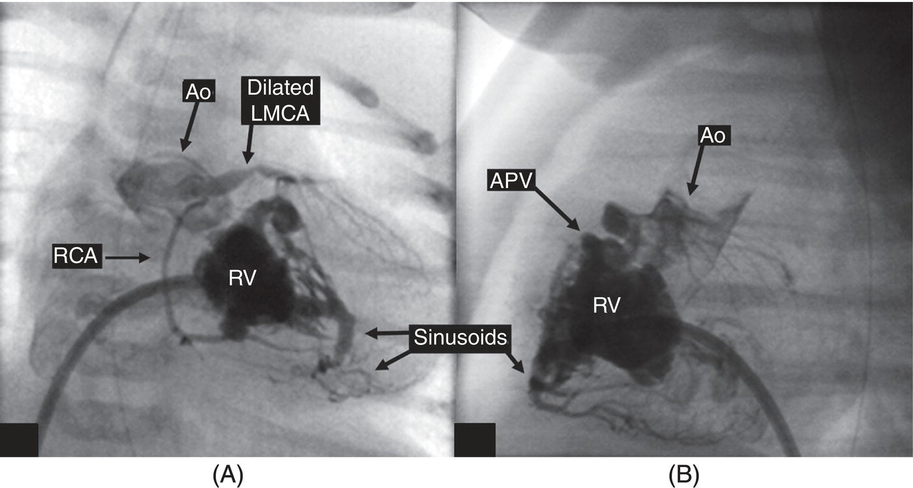

[**Figure 28.20**](#R_c28-fig-0020) Pulmonary atresia with intact ventricular septum in a 1‐day‐old infant. A National Institutes of Health (NIH) catheter has been placed prograde into the right ventricle (RV) via a hypoplastic tricuspid valve for a contrast hand injection. There is mild tricuspid regurgitation. Numerous coronary sinusoids from the RV cavity to both right coronary artery (RCA) and left coronary artery are demonstrated. Contrast faintly opacifies the aorta (Ao) retrograde through a dilated left main coronary artery (LMCA). (A) Frontal view. (B) Lateral view. RV outflow tract ends at the atretic pulmonary valve (APV).

(Source: Schmitz et al. \[38\]. Reproduced with permission of John Wiley & Sons.)

After birth, the PDA remains the sole source of PBF, and early initiation of PGE1 is key for survival to surgical repair or palliation. An atrial communication is necessary for right‐to‐left shunting of systemic venous return, mixing on the left side of the heart with oxygenated blood from the pulmonary veins. The newborn with PA/IVS demonstrates functional single ventricle physiology so that the distribution of systemic and PBF is dependent on PVR/SVR ratios. Thus, arterial saturation is principally obtained by three variables: Qp:Qs, systemic venous saturation, and pulmonary venous saturation.

The ECG reveals small RV forces and often a tall P wave, indicative of RA enlargement. The chest radiograph often shows decreased to normal pulmonary vascular markings depending on the amount of ductal flow. The cardiac silhouette is normal unless RA and RV enlargement occur due to severe TR. Echocardiography can define the atrial septum (adequacy of atrial communication), TV (size, function, and morphology), RV (evidence of hypertrophy and functional structure), RVOT (membranous vs muscular PA) and PDA (size and direction of blood flow). While proximal coronary artery anatomy and the presence of coronary cameral connections can be delineated by echocardiography, cardiac catheterization or computed tomography may be necessary to adequately visualize coronary artery abnormalities, with cardiac catheterization being the preferred tool to concurrently provide therapeutic interventions \[116\].

### Surgical and transcatheter approaches and outcomes

In the early 1960s, palliative shunts and closed pulmonary valvotomies were done. However, survival was dismal given that an estimated 2.5% of patients survived to 3 years of age. CPB‐assisted RV outflow procedures were combined with systemic‐to‐pulmonary arterial shunts in the 1970s. Since that time the therapeutic approach has been directed toward the following outcomes: biventricular circulation, single ventricle (including 1.5 ventricle) palliation, or cardiac transplantation, depending on RV size and anatomy (unipartite, bipartite, or tripartite), TV and PV size, subPV stenosis, TR, ventriculocoronary connections, and RVDCC \[113\] ([Figure 28.21](#c28-fig-0021)).

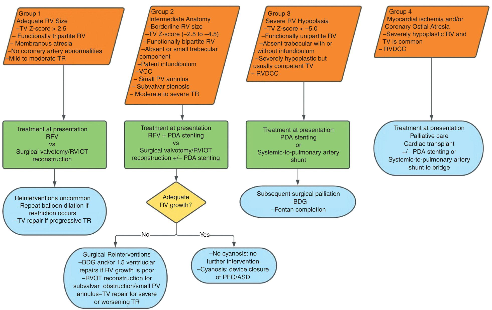

[**Figure 28.21**](#R_c28-fig-0021) Strategies for the management of variants of pulmonary atresia with intact ventricular septums from Chikkabyrappa et al. \[113\]. ASD, atrial septal defect; BDG, bidirectional Glenn; PDA, patient ductus arteriosus; PFO, patent foramen ovale; PV, pulmonary valve; RFV, radiofrequency valvotomy and balloon dilation; RV, right ventricle; RVDCC, right ventricle‐dependent coronary circulation; RVOT, right ventricular outflow tract; TR, tricuspid regurgitation; TV, tricuspid valve; VCC, ventriculocoronary connections.

(Source: Michael L. Schmitz, MD.)

Patients with PA/IVS are usually first evaluated via cardiac catheterization with hemodynamic measurements, coronary angiography, and possible intervention. Once the absence of RVDCC is confirmed, decompression of the RV via percutaneous pulmonary valvotomy with radiofrequency ablation, wire or laser and balloon dilation can be undertaken. Other interventions may include balloon atrial septostomy and balloon dilation or stenting the PDA.

Initial neonatal surgical options include:

-   RVOT reconstruction with surgical valvotomy
-   RVOT reconstruction with surgical valvotomy and PDA stenting
-   Systemic‐to‐pulmonary arterial shunt
-   Cardiac transplant or systemic‐to‐pulmonary arterial shunt as bridge to transplant

After the initial neonatal palliation, the decision about subsequent procedures and a biventricular repair vs. single ventricle palliation depends on similar initial considerations such as RV and TV size and function \[113, 117, 118\] ([Figure 28.21](#c28-fig-0021)). To evaluate for biventricular repair, oxygen saturations and potential for further RV growth are assessed. Within 6 months after the initial procedure, the systemic‐to‐pulmonary artery shunt and the ASD can be temporarily occluded in the cardiac catheterization laboratory. If oxygen saturations remain appropriate and the right atrial pressure remains below 12–15 mmHg with adequate CO, the patient may be a candidate for biventricular repair \[119\].

If biventricular repair is not feasible, the patient proceeds to a BDG. Patients with inadequate RV size retain an open ASD and proceed to Fontan palliation. Those who have intermediate RV size and some degree of RV outflow might proceed to a BDG with ASD closure, resulting in a 1.5 ventricle palliation. If tolerated, a 1.5 ventricle palliation may be preferable to a Fontan circulation as it may lead to a step‐down in pressure in the IVC and a step‐up in pulmonary artery pressures, avoiding the caval hypertension and potential pulmonary arterial hypotension with a Fontan circulation \[118\].

Surgical options for PA/IVS with RVDCC are more limited as procedures are limited to those that do not decompress the obstructed RV. Initial options include placement of a systemic‐to‐pulmonary artery shunt or ductal stent to provide a stable source of PBF with the ultimate goal of single ventricle palliation or cardiac transplant. As mortality exceeds 50% in infancy for patients undergoing single ventricle palliation, cardiac transplant may be a more viable option \[115\].

As Reddy and Hanley \[120\] stated more than two decades ago, the goals of initial surgical intervention for neonates with inadequate RV anatomy are to:

-   Minimize mortality
-   Promote growth of the RV to improve chances for a subsequent two ventricle repair
-   Minimize the requirement for later non‐definitive surgical intervention

The systemic‐to‐pulmonary artery shunt can be a non‐defining initial palliation with relatively low mortality and for neonates with small RVs without RVDCC and allowing the RV to decompress may allow for RV growth. The systemic‐to‐pulmonary artery shunt allows time to later estimate the ultimate functional potential of the RV, potential that is often unclear in neonatal PA/IVS.

### Anesthetic considerations

Despite the multitude of interventional and surgical options available for PS/IVS and PA/IVS, there are some general considerations for perioperative care \[118\] ([Table 28.9](#c28-tbl-0009)).

[**Table 28.9**](#R_c28-tbl-0009) Key considerations in the perioperative management of pulmonary atresia with intact ventricular septum (PA/IVS)

| Perioperative period | Key considerations |
| --- | --- |
| Preoperative | 
-   Neonates dependent on PGE1
    -   Appropriate physiologic monitoring
    -   Stable vascular access
-   Standard preoperative evaluation:
    -   ECG
    -   TTE
    -   Chest X‐ray
    -   Cardiac catheterization (to evaluate coronary anatomy and identify RVDCC

 |
| Intraoperative | 

-   Neonatal palliation
    -   Systemic‐pulmonary artery shunt
        -   Balance Qp:Qs
        -   Avoid diastolic blood pressure hypotension
        -   Monitor ECG closely for signs of myocardial ischemia
    -   RV decompression procedure (valvotomy or transannular patch)
        -   Maintain RV preload/filling pressure
        -   RV inotropic support
            -   Milrinone
            -   Dobutamine/epinephrine
            -   Nitric oxide to reduce RV afterload
-   2nd Stage BDCPA or 1.5‐ventricle palliation
    -   Adequate preload delivery to partially unloaded RV
    -   Avoid high PVR
    -   Mild hypercarbia post‐BDCPA
    -   Adequate oxygenation
-   3rd Stage Fontan circulation
    -   Maintain intravascular volume
    -   Ensure atrioventricular synchrony (sinus rhythm or AV pacing)
-   RVDCC (10% of PA/IVS patients)
    -   Cannot undergo procedure to decompress the obstructed RV
    -   Maintain RV pressures and avoid decompression
    -   CPB cases: second arterial cannula via the RA used to pressurize the RV
    -   Partial CPB flow with mechanical ventilation (reported option)

 |
| Postoperative | 

-   Early extubation
    -   Negative intrathoracic pressure reduces RV afterload and increases PBF
    -   RV inotropic support

 |

BDCPA, bidirectional cavopulmonary anastomosis; CPB, cardiopulmonary bypass; ECG, electrocardiogram; PA, pulmonary artery; PBF, pulmonary blood flow; PGE1, prostaglandin E1; PVR, pulmonary vascular resistance; Qp:Qs, pulmonary:systemic blood flow; RV, right ventricle; RVDCC, right ventricular‐dependent coronary circulation; TTE, transthoracic echocardiogram.

#### Cardiac catheterization laboratory

Postnatal TTE results can help guide anesthetic planning. If RV fistulas are a concern, maintenance of RV preload and systemic diastolic pressure are essential to preserve coronary perfusion pressure \[118\]. Risks involving cardiac catheterization should be anticipated, including difficulty with obtaining vascular access, injury to large vessels and myocardium, and hemorrhage.

#### Neonatal palliation

Neonates with PA/IVS may undergo systemic to pulmonary arterial shunt in isolation or combined with pulmonary valvotomy. (Patients with RVDCC will be discussed separately below.) Procedures may be performed with or without CPB via a sternotomy or thoracotomy. Monitoring should include arterial and central venous line access, NIRS, and TEE. Anesthetic induction and maintenance are performed with a combination of opioid, inhaled anesthetic agent and muscle relaxant. Careful consideration should be given to maintaining an appropriate Qp:Qs balance and diastolic BP to provide adequate CO and avoid myocardial ischemia respectively. For any patient with a small hypertrophic, hypertensive RV, RV filling pressures must be maintained such that the RV cavity does not collapse, and thus maintain CO. For patients undergoing RV decompression on CPB, preservation of filling pressures is essential as poor RV preload will compromise CO. This is particularly important in patients undergoing repairs leading to biventricular circulation. Inotropic RV support is often needed as RV dysfunction is commonly present after CPB. Optimizing ventilation pressures and utilizing pulmonary vasodilators with drugs such as milrinone (0.375–0.75 μg/kg/min) help to reduce RV afterload. If pulmonary hypertension was present prior to repair, iNO can be used to aid in pulmonary vasodilation until the vascular bed adjusts to the increased flow. Postoperatively, expedited tracheal extubation and resumption of spontaneous ventilation aid in improving PBF and reducing RV afterload. Narcotic infusions to ensure adequate analgesia will reduce oxygen demands from agitation.

For a few patients who undergo systemic‐to‐pulmonary artery shunt placement, low CO in the postoperative period could be caused by either unrecognized RVDCC or from a “circular shunt” (described earlier in this chapter). A circular shunt arises in patients who have had both a pulmonary valvotomy and a systemic‐to‐pulmonary arterial shunt and have significant PI. In this situation, blood ejected from the LV flows through the systemic‐to‐pulmonary arterial shunt and to the pulmonary circulation. Due to PV incompetence, blood proceeds retrograde along a declining pressure gradient to the RV, and depending on the competence of the TV, into the RA, and then the LA via the interatrial communication. The “steal” of blood from the systemic circulation causes systemic hypoperfusion with resulting metabolic acidosis. Raising the PVR and reducing the SVR may be helpful in improving systemic perfusion, but surgery is often needed to revise the shunt and treat TR.

#### Single ventricle palliation (including 1.5 ventricle palliation and Fontan procedure)

On initial presentation, infants unable to undergo biventricular repair (primarily those with severe RV/TV hypoplasia and/or RVDCC) instead have stabilization of their PBF by various mechanisms. With borderline RV size, PBF can be enhanced and stabilized by radiofrequency pulmonary valvotomy with PDA stenting, surgical pulmonary valvotomy and RVOT reconstruction with or without PDA stenting, or in the case of severe RV hypoplasia, PDA stenting or systemic‐to‐pulmonary artery shunt placement \[113\]. Monitoring is similar to that of neonatal palliation with care to place the arterial line monitoring on the contralateral side of systemic‐to‐pulmonary shunts utilizing innominate or subclavian arteries. For subsequent establishment of a bidirectional cavopulmonary anastomosis (BDCPA), central venous access is often placed in the right or left internal jugular vein to measure superior cavopulmonary pressure. For initial procedures on infants to stabilize PBF, the induction and maintenance of anesthesia is also similar to PS/IVS and performed via a combination of opioids, inhaled anesthetic agent, and muscle relaxants. For construction of the BDCPA, hyper‐ or hypocapnia and hypoxia are avoided and low PVR is maintained to provide adequate PBF. Early extubation and postoperative positioning with the upper body elevated 30 degrees can improve facilitate PBF. Intraoperative considerations for 1.5 ventricle palliation are similar to that of the single‐ventricle BDCPA with the caveat that the small RV will be very dependent on preload and require inotropic support including milrinone as described above. For a later Fontan procedure, anesthetic goals include early extubation with upper body elevation, maintenance of intravascular volume, adequate sedation and analgesia (e.g., dexmedetomidine and narcotic infusions as described previously) to reduce oxygen demands, and AV synchrony (sinus rhythm or AV pacing) and discussed in detail elsewhere in this volume.

#### RVDCC

Patients with RVDCC are tenuous from a hemodynamic standpoint and require constant communication with the surgical and perfusion teams for optimal care \[118\]. For procedures requiring CPB (including those mentioned above), RV pressure can be maintained through a second arterial cannula placed transmurally into the RA and secured with a purse string suture. Alternatively, partial CPB with continued mechanical ventilation can be employed to maintain RA pressure \[115\]. As mentioned previously, strategies to prevent RV decompression are critical in patients with RVDCC as it may lead to severe ischemia and death if not employed.

* * *

### KEY POINTS: PULMONARY ATRESIA WITH INTACT VENTRICULAR SEPTUM

-   Approximately 20% of patients with PA/IVS do not have anterograde aortocoronary flow and have a chronically ischemic myocardium with RVDCC.
-   Mortality in untreated infants is 50% by 1 month and 85% by 6 months of age.
-   For any patient with a small, hypertrophic, hypertensive RV, filling pressures must be maintained to prevent RV collapse.
-   Filling and RV pressure must be maintained for patients with RVDCC at all times to prevent “coronary steal” from the myocardium, even while on CPB.

* * *

## Pulmonary atresia/ventriculoseptal defect/major aortopulmonary collateral arteries

### Incidence, anatomy, and natural history

PA/VSD/MAPCAs or TOF/PA is a rare defect that involves features of TOF (infundibular hypertrophy, large misaligned VSD) with a lack of continuity between the RV and pulmonary trunk and varying levels of pulmonary arterial hypoplasia, thus causing heterogeneity in regards to PBF. The incidence is 0.7 per 10,000 live births for PA/VSD/MAPCAs \[121\]. The native MPA and BPAs are absent in 20–25% of patients, with significant abnormalities in the remaining 75–80% that do have intrapericardial native BPAs \[122\]. In the latter group, native BPAs are inevitably hypoplastic to varying degrees, likely due to lack of antegrade flow from the RV and retrograde flow from MAPCAs \[123\]. Lung parenchyma may be perfused singly by native BPAs or MAPCA flow, or redundantly by both. MAPCAS vary in number, size, and origin with the most common origin being the descending thoracic aorta, but not infrequently involving the innominate, subclavian, internal mammary, and coronary arteries as well, and usually traverse through the posterior mediastinum associating with the major airways and at times the esophagus \[123\]. Unfortunately, MAPCAs commonly develop stenosis at the point of their origin, causing the area supplied by the MAPCA to become underperfused without an alternate source of PBF. A classification system has been proposed, based on the morphology of the pulmonary arteries and MAPCAs, that can be useful for surgical decisions \[124\] ([Figure 28.22](#c28-fig-0022)). Of note chromosome 22q11 deletion may be present in >35% of patients with TOF/PA/MAPCAs \[125\].

Disease progression of TOF/PA is best done by organizing patients into three distinct groups based on PBF, each of which has differing mortality outcomes. The first group has a PDA as the source of PBF, and more than 50% die by 6 months of age and 90% by 1 year. In the second group MAPCAs are present with a PDA as PBF; 50% die by 3–5 years of age and 90% within 10 years. In the third group, multiple and large MAPCAs are present as the only source of PBF. In this group, only mild cyanosis may present on physical exam, without signs of CHF; when left untreated, patients usually live into the third decade, but eventually die from pulmonary vascular disease resulting in Eisenmenger syndrome \[126\].

### Pathophysiology

TOF/PA can be viewed as a mixed lesion with PBF determined by overall TR with highly variable sources of PBF. Approximately 90% of patients have nearly balanced Qp:Qs, with oxygen saturations between 75–90% while the remaining 10% present with either excess (O2 saturation >90%) or decreased (O2 saturation <75%) PBF leading to pulmonary congestion/CHF or metabolic acidosis respectively \[123\]. It is important to note that MAPCA patency is dynamic as proximal stenosis of the vessels is common and leads to ischemic loss of lung segments.

Fetal and neonatal echocardiography is useful to identify PA and presence of a VSD and MAPCAs; however, virtually all patients require cardiac catheterization and/or CT/MRI angiography to fully delineate the pulmonary artery and collateral artery anatomy and determine the appropriate surgical approach ([Table 28.10](#c28-tbl-0010)). MRI or CT with three‐dimensional reconstruction of the images is also useful in outlining complex anatomy ([Figure 28.23](#c28-fig-0023)). Three dimensional CT often is the better option for the fine resolution needed for infants ([Figure 28.24](#c28-fig-0024)).

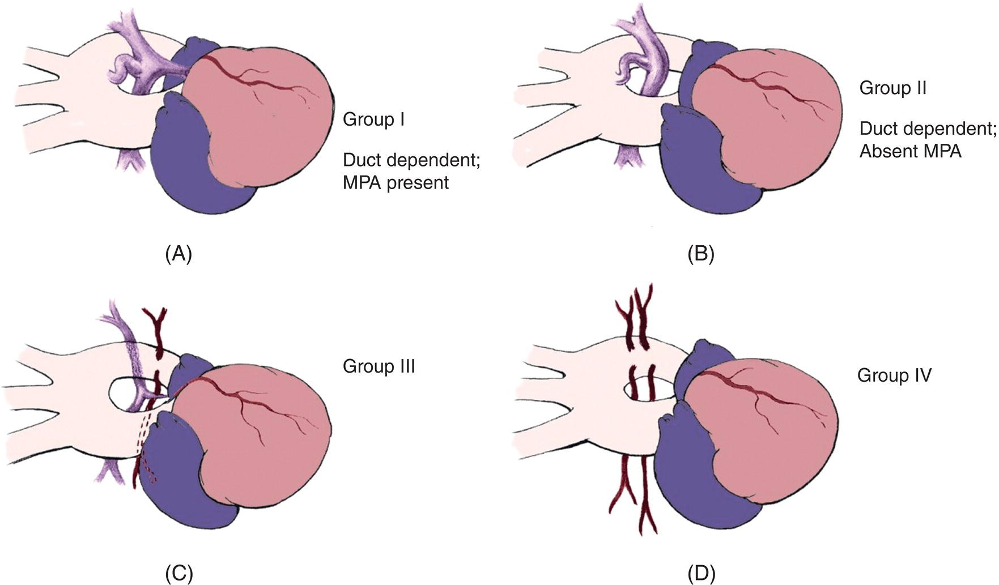

[**Figure 28.22**](#R_c28-fig-0022) Tetralogy of Fallot with pulmonary atresia occurs with much variation depending on the development of the true pulmonary arteries and aortopulmonary collateral arteries. (A) Group I: simple valvular or infundibular atresia. (B) Group II: ductal‐dependent branch pulmonary arteries and absence of the main pulmonary artery (MPA). (C) Group III: hypoplastic true pulmonary arteries with major aortopulmonary collateral arteries. (D) Group IV: true pulmonary arteries are absent, and all pulmonary blood supply is from major aortopulmonary collateral arteries.

(Source: Jonas \[124\]. Reproduced with permission of Taylor & Francis.)

[**Table 28.10**](#R_c28-tbl-0010) Factors contributing to the surgical plan for pulmonary atresia/ventricular septal defect/major aortopulmonary collateral arteries

<table border="1"><tbody class="tdcolor4"><tr><td class="left"><ul id="c28-list-0050"><li id="c28-li-0221">Size and morphology of the native pulmonary arteries</li><li id="c28-li-0222">Branching of the native pulmonary vasculature</li><li id="c28-li-0223">Quantity of pulmonary blood flow from all sources</li><li id="c28-li-0224">Age of the patient</li></ul></td></tr></tbody></table>

### Surgical and transcatheter approaches and outcomes

Ma et al. \[123\] note the approach to surgical repair is threefold:

1.  Achieve normal physiology and biventricular repair by minimizing TR with preservation and augmentation of the PBF, usually accomplished via early/complete unifocalization if needed. (see later in section for description of unifocalization procedure).
2.  Complete biventricular repair with atrial and VSD closure with placement of an RV to pulmonary artery valved conduit in patients with a RV systolic pressure that is 50% or less of the LV systolic pressure: Patients not meeting this pressure ratio receive a central shunt, and intracardiac repair is delayed until a RV/LV pressure ratio of 0.5 is achieved in follow‐up cardiac catheterization.
    
    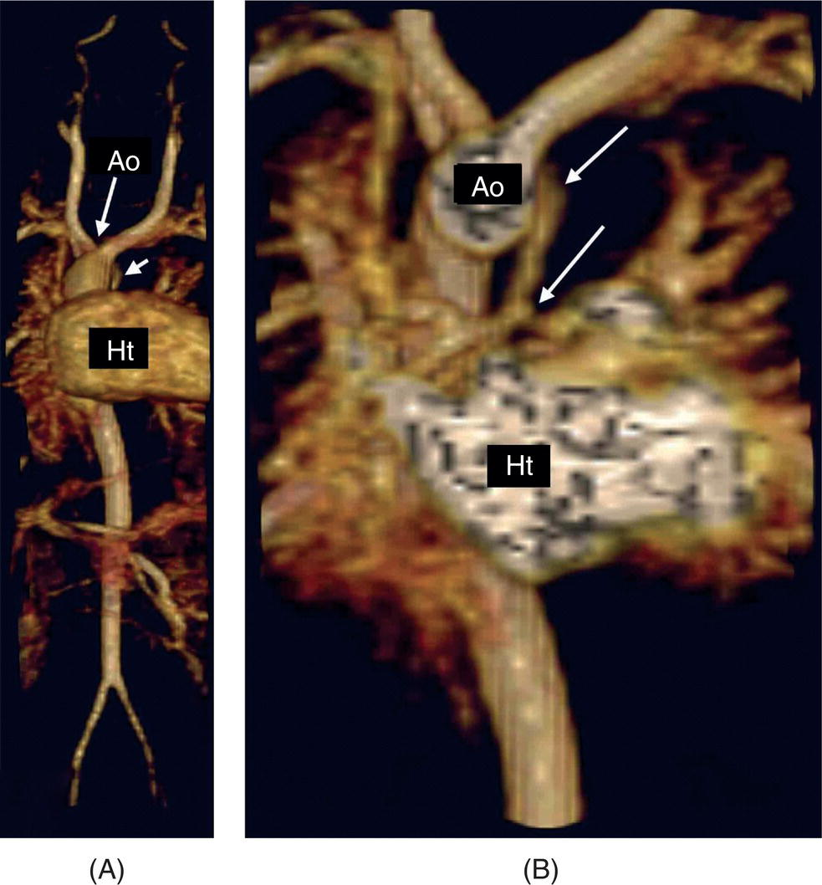
    
    [**Figure 28.23**](#R_c28-fig-0023) Gadolinium‐enhanced magnetic resonance angiogram of a 3‐day‐old, 2.5‐kg infant with tetralogy of Fallot, pulmonary atresia, and multiple aortopulmonary collateral arteries. (A) Anterior‐posterior view demonstrating a right aortic arch (Ao) and no visible pulmonary artery originating from the heart (Ht). The short arrow shows a large collateral artery originating from the left side of the aortic arch. (B) Same view as the left image, but with the ascending aorta removed. The upper arrow shows the same large collateral artery as seen in the left image descending to supply tiny branch pulmonary arteries (lower arrow).
    
    (Source: Schmitz et al. \[38\]. Reproduced with permission of John Wiley & Sons.)
    
3.  Periodic surveillance with indicated studies (CTA/MRI/cardiac catheterization) to assess the adequacy of PBF and decreases in PVR: Post repair, elective balloon angioplasty of recruited MAPCAs and pulmonary arteries as well as embolization of redundant MAPCAs can non‐surgically augment PBF ([Figure 28.25](#c28-fig-0025)).

Most patients (85%) are repaired at 3–6 months of age after further maturation of the trachea and secondary airways, decreasing postoperative pulmonary morbidity \[127\]. The remaining 15% of patients undergo repair in the neonatal period due to the following:

-   Unilateral lung perfusion by MAPCAs with contralateral lung perfusion by a PDA: The ductus can close in the neonatal period resulting in loss of ductal‐perfused lung. Unifocalization and intracardiac repair is performed with favorable MAPCAs, otherwise a ductal stent or surgical shunt to the ductal‐dependent lung is placed. The patient is then repaired later in infancy \[128\].
-   Normally arborized hypoplastic native pulmonary arteries (all lung segments supplied by native BPAs) with redundant blood flow by MAPCAs. MAPCAs are ligated in this situation, and an aortopulmonary anastomosis (Melbourne shunt) can be placed to encourage further pulmonary vascular bed growth \[128\].
    
    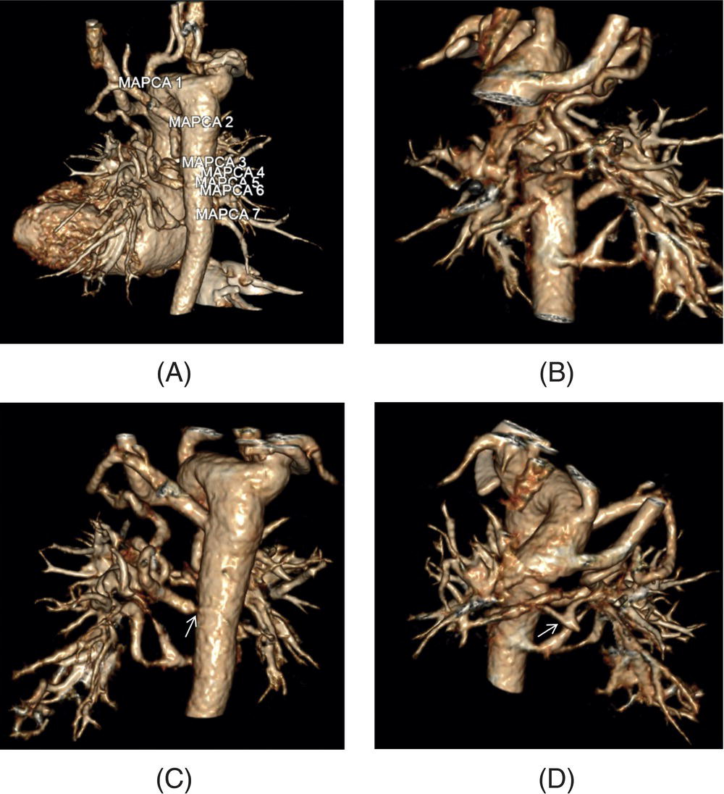
    
    [**Figure 28.24**](#R_c28-fig-0024) Three‐dimensional reconstruction of cardiovascular computed tomography scan of a patient with seven major aortopulmonary collateral arteries (MAPCAs). The posterior (A) and anterior (B) views show numerous MAPCAs supplying the lung fields. Proximal stenoses as seen in MAPCA 5 (C, arrow) are common. This patient had severely hypoplastic but confluent native pulmonary arteries (D, arrow).
    
    ![Schematic illustration of algorithm for management of newborns with tetralogy of Fallot and major aortopulmonary collateral arteries from Lucille Packard Children’s Hospital [123].](images/c28f025.jpg)
    
    [**Figure 28.25**](#R_c28-fig-0025) Algorithm for management of newborns with tetralogy of Fallot and major aortopulmonary collateral arteries from Lucille Packard Children’s Hospital \[123\]. Ao, aorta; AP, aortopulmonary; MAPCAs, major aortopulmonary collateral arteries; PA, pulmonary artery; PDA, patent ductus arteriosus; PBF, pulmonary blood flow; RV, right ventricle; VSD, ventricular septal defect.
    
    (Source: Michael L. Schmitz, MD.)
    
-   Significant pulmonary overcirculation resulting in severe failure to thrive: Unifocalization is usually done in this situation.
-   Profound hypoxia (usually due to proximal MAPCA stenoses with or without native BPAs): If patients have significant native BPA tissue, yet proximal stenoses in MAPCAs, surgical palliation may be accomplished via unifocalization. On the other hand, patients with limited native BPA tissue are poor surgical candidates for early complete palliation and future prognosis to obtain biventricular physiology is poor \[129\].

“Unifocalization” refers to the process of dividing MAPCAs from their aortic origin and anastomosing them directly to the native BPAs or to a homograft or tube graft conduit connecting to the pulmonary arteries \[124\] ([Figure 28.26](#c28-fig-0026)). As mentioned, unifocalization is usually performed in infancy but occasionally in the neonatal period. Midline sternotomy is the common approach, although thoracotomy (usually on the side of the descending aorta) may be necessary to initially access MAPCAs lying posteriorly or within lung fissures. Previously, multistage procedures were often performed with sequential bilateral thoracotomies followed by a midline sternotomy approach that might include intracardiac repair. Single‐stage unifocalization with or without an intial thoracotomy, sometimes including intracardiac repair, has shown excellent results \[130\]. In a review of patients who underwent single‐stage midline unifocalization, Mainwaring et al. identified predictors for later need for unifocalization revision. These predictors included increased PBF augmentation with a systemic‐to‐pulmonary artery shunt, a higher RV:aorta pressure ratio (0.44 ± 0.08 versus 0.33 ± 0.07), or absence of central pulmonary arteries (32.8% versus 13.4%) \[129\]. Regardless of approach, it is essential to isolate and control all significant MAPCAs with vessel loops prior to going on CPB as systemic and cerebral hypoperfusion can occur despite adequate CPB flow as blood volume is lost into the pulmonary vasculature via open MAPCAs. A single‐stage approach is not feasible in all patients (see neonatal repairs above); some require a systemic‐to‐pulmonary artery shunt or an RV‐to‐pulmonary artery conduit to allow growth before definitive repair.

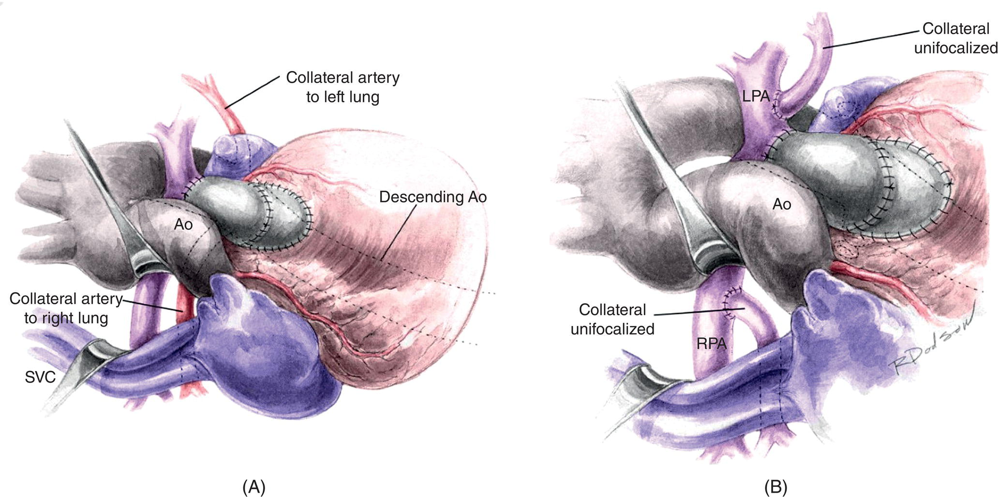

[**Figure 28.26**](#R_c28-fig-0026) Unifocalization of collateral arteries to true pulmonary arteries via a median sternotomy. (A) As the aorta (A0) is retracted to the left, a collateral artery to the right lung is seen posterior to the transverse sinus. (B) One collateral artery has been unifocalized to the true right pulmonary artery (RPA) and another collateral artery has been unifocalized to the left pulmonary artery (LPA). SVC, superior vena cava.

(Source: Jonas \[124\]. Reproduced with permission of Taylor & Francis.)

Several single‐center outcome analyses of surgical repair of TOF/PA have been published in the last decade. While some advocate using MAPCAs for reconstructing the pulmonary blood supply (MAPCA‐based PBF), others are against using MAPCAs due to concerns of long‐term reliability for PBF as they are prone to proximal stenosis. Therefore, two main management strategies have evolved: (i) to recruit all sources of PBF and focus on early intervention and midline single‐stage unifocalization \[123\] and (ii) to focus on native pulmonary arterial rehabilitation and not utilize MAPCAs. In the second strategy, a central connection via aortopulmonary shunt or RV‐pulmonary artery conduit is used to provide antegrade perfusion and hopeful future pulmonary vascular bed growth \[130\]. Serial balloon dilations and possible stenting are performed in the hopes of achieving appropriate RV/LV pressure ratio and subsequent intracardiac repair.

Of note, some centers have noted good early and late results regarding RV/LV pressure ratio utilizing MAPCA‐based PBF \[127\]. While historical analysis of MAPCA‐based circulations has shown poor late outcomes, it has been hypothesized that early intervention in the neonatal period and infancy (versus intervention at older ages) may lead to decreased arterial shear force and potential overcirculation, and thus improved late clinical outcomes \[123\].

### Anesthetic considerations

#### Preoperative

The anesthetic management is based on the surgical procedure, including a range from shunts and PDA stents to unifocalization via thoracotomy or midline sternotomy. Principles for induction, maintenance and monitoring are similar to those described above for repair/palliation of TOF, however there are unique considerations. Anesthetic management for central systemic‐to‐pulmonary artery shunts placement, PDA stenting, and RV‐to‐pulmonary artery conduit placement are discussed earlier. Anesthetic management for single‐stage palliation with unifocalization via median sternotomy follows.

Patients with TOF/PA/MAPCAs have variable complexity owing to severity of disease. Preoperative oxygenation, Qp:Qs, and cardiac function can be obtained from cardiac catheterization data \[131\]. Qp/Qs is largely influenced by MAPCA size and their associated PBF. Large, unobstructed MAPCAs can result in overcirculation to the point of CHF. On the other hand, tortuous MAPCAs and those with proximal stenoses can result in cyanosis and metabolic acidosis.

Chromosome 22q11 deletion is commonly present and may be associated with hypocalcemia as well as a difficult airway due to a small mouth opening, micrognathia, subglottic stenosis, glottic web, laryngeal paralysis, larygomalacia associated with bronchial malposition, and velopharyngeal and palate defects \[131–133\]. Basic laboratory data, including complete blood count with differential, basic metabolic panel; coagulation studies; ECG, chest radiograph, imaging as transthoracic echocardiography; CT and MRI results; cardiac catheterization data; and prior anesthetic records are reviewed prior to surgery \[134\].

#### Intraoperative

Most patients tolerate a slow, controlled inhalational induction with sevoflurane \[90\], with FiO2 adjusted to maintain an oxygen saturation of 75–85% to balance Qp:Qs. Standard monitors are utilized. Those with airway abnormalities should be anticipated, requiring advanced airway devices such as video laryngoscopy. As MAPCA development can be associated with tortuous peripheral vessel development, percutaneous vascular access can be difficult \[134\] but facilitated with bedside ultrasound guidance for both arterial and venous access.

Administration of anesthetic drugs during repair requires careful consideration. Considerable pulmonary runoff can occur from large MAPCAs; therefore, maintaining adequate systemic perfusion pressure is important to prevent systemic acidosis and hypoxemia from hypoperfused collateral arteries. A total or near‐total IV technique with various agents (narcotics, benzodiazepines, dexmedetomidine, neuromuscular blocker) may be preferred to avoid decreases in mean arterial blood pressure (MABP), SVR, and CO that can occur with inhaled anesthetic agents in a dose‐dependent fashion. Use of high dose narcotic anesthetic regimens (>50 μg/kg) as the primary anesthetic in congenital cardiac surgery can provide hemodynamic stability.

Dissection and ligation of collaterals is usually done off CPB to minimize total CPB time, provided the patient does not experience extreme hypoxia and metabolic acidosis \[134\]. This portion of the procedure may be prolonged (4–6 hours). With each MAPCA ligation, PBF is subtracted and redistributed to the systemic circulation, creating desaturation and hemodynamic changes. Careful monitoring of respiratory and hemodynamic parameters is required as large changes in oxygenation, ventilation, systemic perfusion, and cardiac arrhythmias may occur. A TEE probe may be placed, but if the patient is at risk for tracheobronchial compression, TEE should be omitted. Correction of metabolic and respiratory acidosis, maintenance of adequate circulating hemoglobin, and use of low‐dose inotropic drugs may be useful during off‐CPB dissection to maintain adequate oxygenation and perfusion.

Anesthetic management on CPB is similar to that of TOF (see previous section) with the caveat that residual open MAPCAs can cause hemodynamic instability on CPB due to shunting of arterial blood away from vital organs and loss of blood volume into the pulmonary vasculature. The target MABP is higher than usual for neonatal/infant repairs (60–70 mmHg) to ensure end‐organ perfusion. Evidence of adequate end‐organ perfusion is estimated by NIRS trends, urine output and ABG analysis. Some centers conduct an intraoperative PBF study to ensure appropriate RV/LV pressure ratios prior to intracardiac repair \[135\].

After cessation of CPB, reperfusion injury may occur in the lung segments that experienced low perfusion preoperatively which can impact hemostasis and worsen pulmonary compliance due to increased dead space ventilation from tracheobronchioalveolar pulmonary edema and intraparenchymal bleeding \[134\]. Frequent suction, aggressive pulmonary toilet and maintenance of appropriate PEEP may be useful to improve oxygenation and ventilation. Inotropic drugs as milrinone and epinephrine are commonly used to decrease PVR/improve lusitropy, and enhance CO respectively in a potentially stressed RV. To further reduce PVR, iNO may be necessary to improve oxygenation and CO. Blood loss can be significant secondary to extensive dissection, CPB time, and multiple suture lines. Ready transfusion with blood products to restore coagulation and replace hemoglobin losses is imperative.

#### Postoperative

Postoperatively, patients remain on mechanical ventilation with inotropic support. Aggressive pain control with opioid infusions and/or regional anesthesia and sedation with benzodiazepine and dexmedetomidine infusions are useful to minimize systemic and pulmonary hypertension. Continued aggressive management of postoperative bleeding is often necessary with prompt transfusion and correction of developing coagulopathies.

* * *

### KEY POINTS: PULMONARY ATRESIA/VENTRICULAR SEPTAL DEFECT/MAJOR AORTOPULMONARY COLLATERAL ARTERIES

-   Biventricular repair consists of constructing a pulmonary bed using various available sources of PBF, connecting the RV to the new pulmonary bed, and closing the VSD.
-   The successful post‐biventricular repair requires an RV systolic pressure ≤50% of LV systolic pressure.
-   Prepare for major blood loss and replacement.
-   Ventilation can be compromised from intrapulmonary and airway bleeding from multiple anastomoses and/or lung reperfusion injury.
-   RV dysfunction from increased afterload is treated with adequate preload, inotropic support, and ventilation adjustments/iNO to reduce PVR.

* * *

## Summary

Right‐sided obstructive congenital cardiac lesions comprise a range of heart defects associated with variable clinical manifestations. The pattern and severity of the structural anomalies determine the presentation of the patient on the symptomatology spectrum, from a neonate with cyanosis, CHF and ductal‐dependent circulation, to the young adult with mild to moderate exercise intolerance. The presence of a septal defect is nearly universal in this group of lesions and confers the potential for right‐to‐left intracardiac shunt. One lesion, TOF–the archetype of CHD, leads the way for the evolution of multifaceted diagnostic and therapeutic advances while charting the unknown territory of long‐term outcomes beyond survival. The optimal perioperative anesthetic management for the patient with a right‐sided obstructive congenital heart lesion requires an understanding of the anatomy and pathophysiology of the cardiac lesion, the implications of the proposed surgical maneuvers, and the effects of the anesthetic and ventilatory techniques in dynamic interaction with other factors. Most patients with CHD have limited cardiopulmonary reserve; thereby, anticipation of complications with preparation for prevention and rescue are critical for improved outcomes.

## Acknowledgements

We are grateful to our colleagues for their generous assistance in locating the following images:

-   Michael J. Angtuaco, M.D. – [Figure 28.13](#c28-fig-0013)
-   Shae A. Merves, M.D. – [Figure 28.19](#c28-fig-0019)
-   Eudice E. Fontenot, M.D. – [Figure 28.20](#c28-fig-0020)
-   S. Bruce Greenberg, M.D. – [Figure 28.23](#c28-fig-0023)
-   Markus S. Renno, M.D. – [Figure 28.24](#c28-fig-0024)

## Selected references

_A full reference list for this chapter is available at:_

[http://www.wiley.com/go/andropoulos/congenitalheart](http://www.wiley.com/go/andropoulos/congenitalheart)

1.  10 Hoffman JE (ed.) _The Natural and Unnatural History of Congenital Heart Disease_. West Sussex, UK: Wiley‐Blackwell, 2009. A rather unique textbook, Dr. Hoffman took on the enormous task of describing congenital heart disease in terms of what happens in the course of congenital heart disease with and without treatment. And, for those who underwent treatment, descriptions of the disease course are described based on the available treatments that were chosen.
2.  23 Holst KA, Connolly HM, Dearani JA. Ebstein’s anomaly. Methodist DeBakey Cardiovasc J 2019; 15:138–44. This is a thorough review of the preoperative evaluation including the kinds of details found on echocardiogram, computed tomography, and magnetic resonance imaging that impact the surgical plan. The surgical description of the cone procedure is the current state‐of‐the‐art with excellent details.
3.  75 Sandoval N, Carreño M, Novick WM, et al. Tetralogy of Fallot repair in developing countries: international quality improvement collaborative. Ann Thorac Surg. 2018; 106:1446–51. This report analyzed 2,164 patients undergoing TOF repair from a database of 32 centers in 20 low‐to‐middle income countries. Important metrics were identified for benchmarking and improving surgical outcomes in resource‐limited nations.
4.  80 Morales DL, Zafar F, Fraser CD. Tetralogy of Fallot repair: the right ventricle infundibulum sparing (RVIS) strategy. Semin Thorac Cardiovasc Surg Pediatr Card Surg Ann 2009; 12:54–8. The authors present a comprehensive strategy to repair TOF with the goals of preserving RVOT integrity to decrease the long‐term morbidity associated with the traditional approach of large ventriculotomy and transannular resection.
5.  96 Ghimire L, Chou F. Efficacy of prophylactic dexmedetomidine in preventing postoperative junctional ectopic tachycardia in pediatric cardiac surgery patients: a systematic review and meta‐analysis. Pediatr Anesth 2018; 28:597–606. This meta‐analysis found that prophylactic dexmedetomidine use was effective in decreasing the rate of junctional ectopic tachycardia following pediatric cardiac surgery without significant increases in adverse events.
6.  104 Winch P, Staudt A, Sebastian R, et al. Learning from experience: improving early tracheal extubation success after congenital cardiac surgery. Pediatr Crit Care Med 2016; 17:630–7. The authors analyzed early tracheal extubation failures after congenital cardiac surgery and found that re‐intubation was associated with increased morbidity, hospital stay and mortality. They observed that re‐intubation may be related to postoperative delirium and conclude that implementation of robust protocols to address delirium and pain are key to successful outcomes.
7.  108 Cuypers JAAE, Witsenburg M, van der Linde D, Roos‐Hesselink JW. Pulmonary stenosis: update on diagnosis and therapeutic options. Heart 2013; 99:339–47. A thorough review of clinical recommendations for diagnosis and treatment of patients with pulmonary stenosis.
8.  118 Gleich S, Latham GJ, Joffe D, Ross FJ. Perioperative and anesthetic considerations in pulmonary atresia with intact ventricular septum. Semin Cardiothorac Vasc Anesth 2018; 22:256–64. This article is a well written overview of perioperative and anesthetic management of patients with PA/IVS.
9.  123 Ma M, Mainwaring RD, Hanley FL. Comprehensive management of major aortopulmonary collaterals in the repair of tetralogy of Fallot. Semin Thorac Cardiovasc Surg Pediatr Card Surg Ann 2018; 21:75–82. This is an in‐depth review of evolution of surgical technique, comparison of management strategies, and discussion of long‐term outcomes and current clinical controversies for patients with TOF/MAPCAs.
10.  134 Quinonez ZA, Downey L, Abbasi RK, et al. Anesthetic management during surgery for tetralogy of Fallot with pulmonary atresia and major aortopulmonary collateral arteries. World J Pediatr Congenit Heart Surg 2018; 9:236–41. This article presents a clear synopsis of the complex anesthetic management of patients with TOF/PA/MAPCAs at a quaternary care referral center.