CHAPTER 29 Anesthesia for Transposition of the Great Arteries 

# CHAPTER 29  
Anesthesia for Transposition of the Great Arteries

_Valentine Woodham, Mariepi Manolis, Lucy Hepburn, and Angus McEwan_

Department of Anaesthesia, Great Ormond Street Hospital for Children NHS Foundation Trust, London, UK

* * *

-   [**Introduction**](#head-2-292)
-   [**Physiologically uncorrected TGA**](#head-2-293)
    -   [Incidence](#head-3-493)
    -   [Anatomy](#head-3-494)
    -   [Coronary artery anatomy](#head-3-495)
    -   [Natural history and pathophysiology](#head-3-496)
    -   [Shunting and effective pulmonary and systemic blood flow in TGA](#head-3-497)
    -   [Intercirculatory mixing](#head-3-498)
    -   [Clinical presentation and diagnostic features](#head-3-499)
    -   [Outcomes from balloon atrial septostomy](#head-3-500)
    -   [Anesthesia for balloon atrial septostomy](#head-3-501)
    -   [Surgical options](#head-3-502)
    -   [Indication and timing of ASO](#head-3-503)
    -   [Arterial switch operation](#head-3-504)
    -   [Other surgical procedures](#head-3-505)
    -   [Outcomes for ASO](#head-3-506)
    -   [Anesthetic considerations and perioperative management](#head-3-507)
-   [**Congenitally corrected TGA (L‐TGA)**](#head-2-294)
    -   [Incidence](#head-3-508)
    -   [Anatomy](#head-3-509)
    -   [Natural history](#head-3-510)
    -   [Pathophysiology](#head-3-511)
    -   [Clinical presentation and diagnostic features](#head-3-512)
    -   [Surgical options](#head-3-513)
    -   [Outcomes](#head-3-514)
-   [**Anesthetic considerations and perioperative management**](#head-2-295)
    -   [Preoperative assessment](#head-3-515)
    -   [Postoperative course and complications](#head-3-516)
-   [**Selected references**](#head-2-296)

* * *

## Introduction

Transposition of the great arteries (TGA) refers to a spectrum of conditions of discordant ventriculoarterial (VA) connections. The term TGA is most commonly used to denote concordant atrioventricular (AV) connection and discordant VA connection, where the aorta arises from the morphological right ventricle and the pulmonary artery from the morphological left ventricle. This is the most common anatomic form encountered in clinical practice and is referred to as dextro‐TGA, or d‐TGA. The term TGA also encompasses the hearts with discordant AV and VA connections known as congenitally corrected TGA (or ccTGA, levo‐ or l‐TGA) and more rarely, other forms of anomalous AV connections.

TGA is the second most common congenital cardiac lesion, which accounts for approximately 6% of all congenital heart defects \[1\]. It is frequently an isolated lesion with no other associated extracardiac anomalies. Medical and surgical advances in the past four decades have spectacularly improved the outcome for individuals born with these lesions, from what was a universally lethal condition, into one of expected survival with the ability to lead near‐normal lives.

Initial attempts at anatomical repair were associated with poor outcome, leading to the development of physiological repair by Mustard and Senning. Today, the arterial switch operation (ASO) is the mainstay of management of these patients, with excellent results. Surgical intervention requires the cardiac anesthesiologist to fully understand the pathophysiology, aims of treatment, surgical procedures, and postoperative consequences to form the perioperative management plan.

This chapter will address two main subcategories of transposition: physiologically uncorrected TGA (referred to as TGA or d‐TGA) and congenitally corrected TGA (ccTGA or l‐TGA).

* * *

### KEY POINTS: INTRODUCTION

-   TGA refers to a spectrum of conditions of discordant VA connections.
-   The two main categories are physiologically uncorrected (d‐TGA) and congenitally corrected (ccTGA or l‐TGA).
-   The outcome of d‐TGA is very good, with patients expecting to lead near‐normal lives.

* * *

## Physiologically uncorrected TGA

### Incidence

TGA accounts for 5–7% of all congenital heart defects with a prevalence of 0.2 per 1,000 live births \[1, 2\]. There is a male preponderance of 2–3:1, and sibling recurrence rates of between 0.27 and 1.8% have been noted \[3\].

### Anatomy

Physiologically uncorrected transposition of the great arteries is the most common anatomic form encountered in clinical practice and is referred to as TGA or d‐TGA. In other words, the normal connections of right atrium (RA) to right ventricle (RV) and left atrium (LA) to left ventricle (LV) are preserved, but there is VA discordance: the aorta arises from the RV rather than LV and the pulmonary artery (PA) from the LV ([Figure 29.1](#c29-fig-0001)).

This definition encompasses a spectrum of cardiac anomalies that can be further subdivided into either simple or complex TGA ([Figure 29.2](#c29-fig-0002)). In approximately 50–75% of cases children present with simple TGA in which there is isolated VA (VA) discordance with either a patent foramen ovale (PFO) or patent ductus arteriosus (PDA) or both. This is referred to as TGA with intact ventricular septum (TGA/IVS).

The lesion is considered a complex TGA when it has associated cardiac abnormalities. Complex TGA occurs in 25% of the patients with D‐TGA and requires alternative management and operative planning. Cardiac anomalies included in complex TGA are as follows:

-   Ventricular septal defect (VSD), 40%
-   Left ventricular outflow tract obstruction (LVOTO), 5%
-   Double outlet right ventricle and the Taussig–Bing malformation
-   Rarer abnormalities, which include TGA with VSD and coarctation of the aorta 5% or TGA with VSD and interrupted aortic arch.

The focus of this chapter will be on the most common and important clinical subsets:

-   TGA with intact ventricular septum (TGA/IVS)
-   TGA with VSD including the Taussig–Bing malformation
-   TGA with LVOTO
-   TGA and pulmonary vascular obstructive disease

In the normal heart, the position of the aorta is posterior and to the right of the pulmonary trunk. There is a subpulmonary muscular infundibulum, and the annulus of the aortic valve is in fibrous continuity with the mitral valve annulus. In the most common manifestation of TGA, a right sided right atrium connects via a right sided tricuspid valve and RV to a right sided and anterior aorta. There is a subaortic muscular infundibulum. On the left, a left‐sided atrium connects via the mitral valve and LV to a left‐sided and posterior PA. As a result, there is fibrous continuity between the mitral and pulmonary valves, but no fibrous continuity between the tricuspid and aortic valves \[4, 5\]. This anatomical manifestation is commonly referred to as d‐ or dextro‐TGA with the position of the aorta being anterior and to the right of the pulmonary trunk. However, in strict anatomical terms, d‐ or dextro‐TGA describes patients who have \[S,D,D\] segmental anatomy, meaning situs solitus \[S\], d‐loop ventricles \[D\], and d‐loop great arteries \[D\].

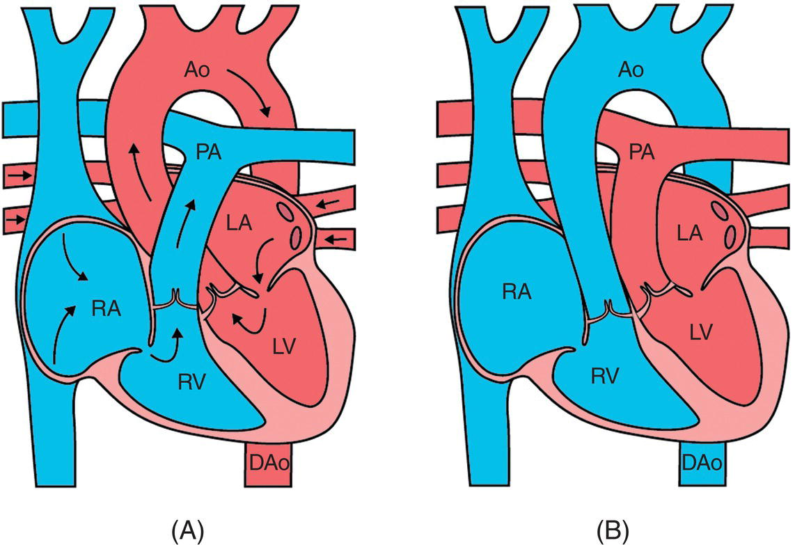

[**Figure 29.1**](#R_c29-fig-0001) Dextro‐transposition of the great arteries (d‐TGA). (A) Normal anatomy. (B) d‐TGA anatomy. Ao, aorta; PA, pulmonary artery; RA, right atrium; LA, left atrium; RV, right ventricle; LV, left ventricle; DAo, descending aorta.

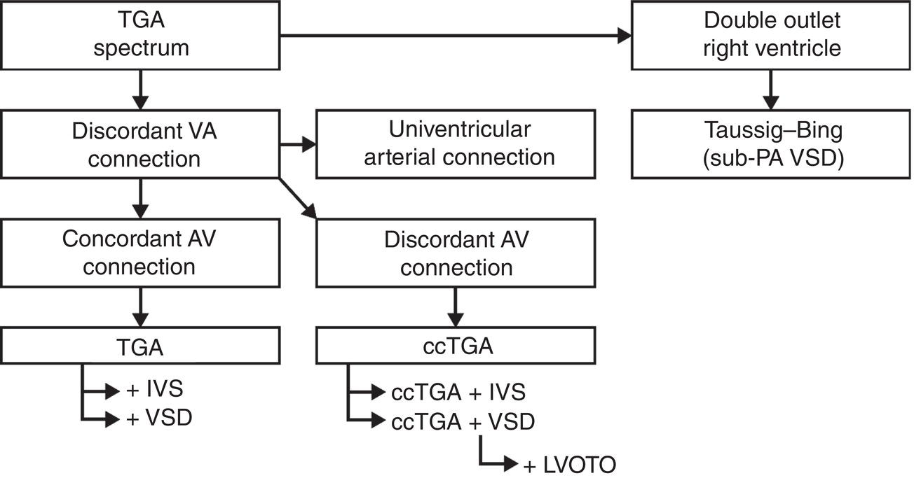

[**Figure 29.2**](#R_c29-fig-0002) The spectrum of discordant ventriculoarterial connections that come under the “umbrella” of the term transposition of the great arteries (TGA). AV, atrioventricular; VA, ventriculoarterial; PA, pulmonary artery; VSD, ventricular septal defect; IVS, intact ventricular septum; ccTGA, congenitally corrected transposition of the great arteries; LVOTO, left ventricular outflow tract obstruction.

Although VSDs are detected in up to 30–40% of patients with TGA using angiography, only about one‐third of these are hemodynamically significant \[6\]. Approximately one‐third of the VSDs are perimembranous, and another one‐third are outlet VSDs with malalignment. From a surgical perspective, outlet VSDs with malalignment are more difficult to repair. In the presence of a VSD, the aorta is generally smaller than the PA; this discrepancy in size tends to be amplified in the presence of an anterior maligned VSD. Conversely, LVOTO is common when there is posterior deviation of the outlet septum.

The Taussig–Bing anomaly (TBA) represents a complex subset of double outlet right ventricle (DORV) with subpulmonary VSD that behaves as a physiological TGA. It is not theoretically a TGA, as the VA connection is double outlet, however, it is so similar to TGA from a physiological and management perspective that it is included within the TGA subset. In TBA, there is DORV with subpulmonary VSD, side‐by‐side vessels, and bilateral conus \[7\]. The aorta originates from the RV, and the PA arises from above the nonrestrictive VSD. It is frequently associated with subaortic right ventricular outflow tract obstruction (RVOTO) because of hypertrophy of the infundibular septum and aortic arch obstruction. Left ventricular oxygenated blood is preferentially streamed into the PA, thereby simulating TGA physiology.

Anatomic LVOTO can be found in approximately one‐third of patients with TGA and VSD, but it is rare in TGA/IVS, with an incidence of approximately 0.7%. Anatomic LVOTO can arise at the valvular or subvalvular level and can be caused by several anatomical structures. Valvular obstruction might be secondary to commissural fusion, annular hypoplasia, or leaflet immobility from a hypertrophic tissue \[6, 8\]. Pulmonary subvalvular obstruction may be attributable to posterior displacement of the conal septum, a subvalvular fibrous membrane, accessory leaflet tissue of the AV valve, or diffuse hypoplasia of the left ventricular outflow tract (LVOT). In TGA/IVS, mechanical LVOTO is uncommon, but 5% patients have functional LVOTO. This occurs due to the presence of a high systemic right ventricular pressure, displacing the interventricular septum into the LV during systole. This is uncommon in neonates as the septal shift required is prevented by their high pulmonary vascular resistance \[9\]. LVOTO limits pulmonary blood flow and therefore exacerbates the cyanosis in TGA.

### Coronary artery anatomy

Coronary artery anatomy is extremely important in d‐TGA patients as transfer of the coronary arteries to the neo‐aorta without narrowing or distortion is critical to the success of an arterial switch operation (ASO). Mortality from distortion of the newly implanted coronary arteries arises from myocardial ischemia; necrosis of the supplied myocardial segment may cause fatal arrythmias, such as ventricular fibrillation \[10\]. The critical importance of unrestricted aortocoronary blood flow after ASO was established during the earliest unsuccessful ASOs in the 1950s by William T. Mustard \[11, 12\]. Initially the ASO was associated with 100% mortality. In 1954, three patients underwent ASO, a 6‐week‐old child died from aortic suture line bleeding, a 19‐day‐old died from left coronary artery occlusion, and another 19‐day‐old died from ventricular fibrillation \[13\].

In the normal heart, the coronary arteries arise from the aortic sinuses of Valsalva, which face the PA and are located on the anterior portion of the aorta ([Figure 29.3](#c29-fig-0003)). In TGA, the coronary arteries also arise from the aortic sinuses of Valsalva, but the location of the sinuses is posterior \[4\]. Considerable variability exists in the origin, distribution, and epicardial course of coronary artery anatomy in d‐TGA. The Leiden classification ([Figure 29.4](#c29-fig-0004)) system appears most commonly in surgical literature and is used to demonstrate the frequent coronary patterns that exist in TGA \[16\].

Although all types of coronary anatomy are suitable for the ASO, the less common coronary patterns present potential technical difficulties for an ASO and a moderately increased risk \[17\]. Single right coronary artery, inverted coronary artery, and coronary arteries with an intramural course have been identified as carrying increased risk \[17, 18\], but recent studies have shown that with increased surgical experience, coronary artery pattern may not be a risk factor for increased morbidity following the ASO \[19, 20\].

* * *

### KEY POINTS: ANATOMY OF D‐TGA

-   In d‐TGA, there is concordant AV connection and discordant VA connection.
-   The aorta arises from the morphological RV and the PA from the morphological LV.
-   Approximately 75% have simple TGA: isolated VA discordance with a PFO, PDA, or both.
-   Complex TGA has VSD, LVOTO, or Taussig–Bing malformation.
-   Coronary anatomy has considerable variability in its origins and distribution.

* * *

### Natural history and pathophysiology

In the normal circulation, blood circulates in series; deoxygenated blood from the systemic circulation enters the right heart and proceeds to the lungs via the PA. Oxygenated blood then returns from the lungs via the pulmonary veins to the LA and is pumped through the LV to the systemic circulation via the aorta. In TGA, there is AV concordance (RA→RV and LA→LV) but VA discordance (LV→PA and RV→ aorta) resulting in two parallel circulations ([Figure 29.5](#c29-fig-0005)). Blood flows in a closed circuit on both sides of the heart where deoxygenated blood is recirculated to the body without passing the lungs for oxygenation. Oxygenated blood from the left side of the heart returns back to the lungs via the PA without reaching the body. Without one or more communications that allow for intercirculatory mixing, survival would be impossible. If left untreated, death from hypoxia and congestive heart failure (CHF) will occur in 90% of patients within the first year of life.

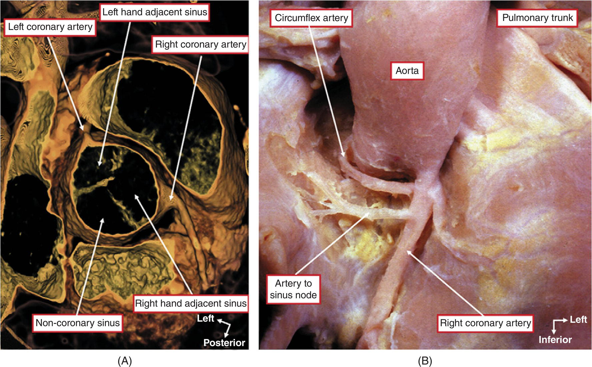

[**Figure 29.3**](#R_c29-fig-0003) Anatomy of normal coronary arteries is well shown by computed tomography. (A) The aortic root as viewed from above. Right and left coronary arteries arise from the aortic valvular sinuses adjacent to the subpulmonary infundibulum, which has been transected to provide this image. (B) Variant in an otherwise normal heart in which the circumflex coronary artery arises from the right coronary artery and then extends through the transverse sinus.

(Source: Chiu & Anderson \[14\]. Reproduced with permission of Elsevier.)

### Shunting and effective pulmonary and systemic blood flow in TGA

In TGA, the parallel circulations mean that, without shunting, no oxygenated blood would reach the tissues or deoxygenated blood the lungs. Anatomical shunting occurs due to a communication at the level of the cardiac chambers or great vessels allowing blood to move from one circulation to the other. A physiological shunt occurs when blood is recirculated and is considered “surplus” and noneffective. For example, a physiological left to right shunt is all the blood that is recirculated through the pulmonary vascular bed (the LA to the PA avoiding the systemic circulation). Physiological right‐to‐left shunt occurs through the recirculation of systemic venous blood (RA to the aorta, avoiding the pulmonary circulation). Therefore, in TGA, the majority of the blood flow is physiological shunt (recirculated blood that is ineffective) with a small proportion of blood that travels across the anatomical shunt (in effect, making up the effective blood flow) ([Figure 29.6](#c29-fig-0006)) \[21\]. The effective blood flow is the flow necessary for survival and comprises blood from the venous system of one circulation that reaches the arterial system of the other.

-   **Effective pulmonary blood flow** is the amount of systemic venous blood that reaches the pulmonary arterial bed (e.g., _in TGA_, _an anatomic R‐to‐L shunt)_
-   **Effective systemic blood flow** is the amount of pulmonary venous blood that reaches the arterial systemic circulation (e.g., _in TGA_, _an anatomic L‐to‐R shunt)_

**Note: When bidirectional shunting occurs, the anatomic and effective blood flows are not equal. This is because some of the anatomic shunted blood may be redirected back to its original venous side prior to reach the arterial side of the other circulation. \[21\]**

Effective pulmonary blood flow and effective systemic blood flow must be equal or one of the circulations would become deplete. Total pulmonary circulation is the volume of recirculated pulmonary venous blood and effective pulmonary blood flow. Total systemic blood flow is the volume of recirculated systemic blood and effective systemic blood flow. The greater the volume of the effective systemic blood flow relative to the recirculated flow, the greater is the arterial oxygen saturation. In contrast to effective blood flow, total pulmonary blood and total systemic blood flow do not have to be equal. This is most evident in the pulmonary circulation, where the total pulmonary blood flow is 2 to 3 times that of the total systemic blood flow (Qp:Qs 2–3:1). When there is adequate mixing of pulmonary and systemic venous blood, the arterial oxygen saturation is influenced by the Qp:Qs ratio. A high Qp will result in a pulmonary artery saturation that is higher than the aortic oxygen saturation, and systemic hypoxia will not occur. If there is effective mixing but pulmonary blood flow is restricted (due to LVOTO or PAH), the Qp:Qs ratio will drop below 2, significantly lowering the systemic arterial saturation and causing severe hypoxia \[22\]. These concepts are vital in understanding the physiology in TGA circulation.

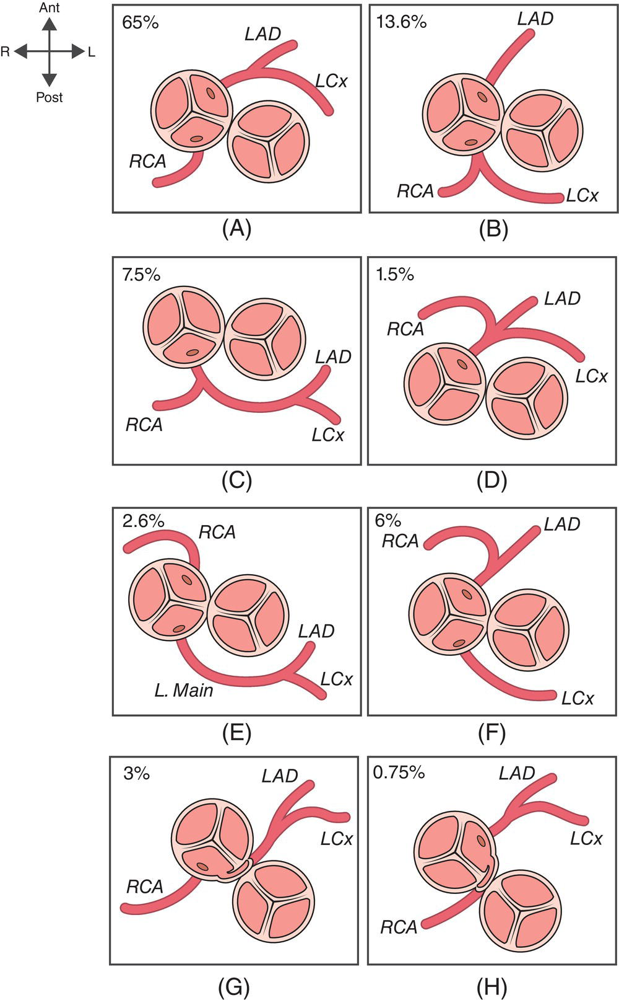

[**Figure 29.4**](#R_c29-fig-0004) The most common patterns of coronary anatomy in patients with D‐loop transposition of the great arteries (TGA). (A) Usual coronary anatomy with the left coronary artery (LCA) arising from sinus 1 and the right coronary artery (RCA) from sinus 2. (B) Left circumflex coronary artery (LCx) arising from the RCA (sinus 2) and the left anterior descending (LAD) from sinus 1. (C) Single coronary from sinus 2. (D) Single coronary artery arising from sinus 1. (E) Inverted origin with the RCA arising from sinus 1 and the LCA from sinus 2. (F) The LAD and RCA arising from sinus 1 and the LCx from sinus 2. (G) Intramural LCA with origin of the LCA and RCA both from sinus 2 and intramural course of the LCA. (H) Intramural RCA with origin of the RCA and LCA from sinus 1 and intramural course of the RCA.

(Source: Mertens et al. \[15\]. Reproduced with permission of John Wiley & Sons.)

### Intercirculatory mixing

Intercirculatory mixing can occur at one or more intracardiac (PFO/ASD or VSD) or extra‐cardiac (PDA or bronchopulmonary collaterals) sites. The degree of intercirculatory mixing is one of the factors that influences hemoglobin oxygen saturation and hence tissue oxygen delivery. In the first few days of life, the degree of cyanosis and the stability of the child will be largely determined based on the degree of mixing that occurs between the two parallel circulations, which in turn will determine the neonate’s course, medical management, and surgical timing.

Intercirculatory mixing is dependent on multiple factors in the neonatal period, namely the number, size, and position of the anatomic communications ([Table 29.1](#c29-tbl-0001)). Larger, unrestrictive, and multiple communications allow for improved intercirculatory mixing. Although there is significant interplay between these factors, one large communication will allow for better mixing than two or more restrictive ones and a large but unfavorably positioned VSD, namely an anterior muscular VSD, is not conducive to effective mixing. \[23\]

Physiological factors have a significant impact on mixing, including ventricular compliance, systemic vascular resistance (SVR), and pulmonary vascular resistance (PVR). Balancing the effective pulmonary and systemic blood flows allows for optimal intercirculatory mixing. At the level of the atria, shunting is mainly influenced by the size of the ASD and the pressure variations across it. Mixing here is the most efficient as lower pressures allow for bidirectional flow during the cardiac cycle; for this physiologic reason, balloon atrial septostomy (BAS – see below) is preferred for cyanotic d‐TGA patients. Conversely, mixing at a VSD or PDA is usually more restricted as larger pressure gradients exist, typically directing blood in one direction (usually from right to left).

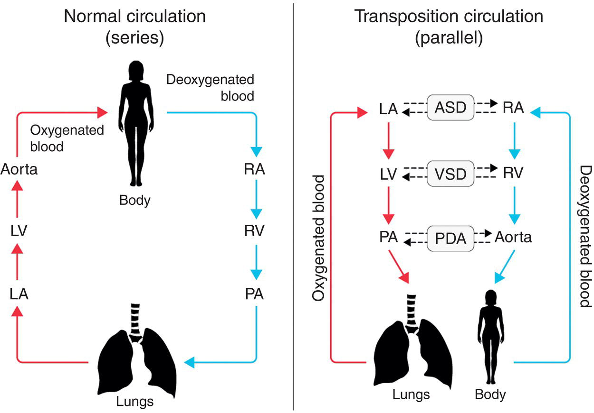

[**Figure 29.5**](#R_c29-fig-0005) Comparison of the normal circulation, which is in series, with that in transposition of the great arteries (TGA), which is in parallel. In the normal circulation (left), deoxygenated blood from the body enters the right‐sided circulation before being oxygenated by the lungs and then distributed to the body via the left side of the heart. In the transposition circulation (right), the potential sites of mixing are shown: atrial septal defect (ASD), ventricular septal defect (VSD), and patent ductus arteriosus (PDA). The circulation is in parallel; thus, deoxygenated blood from the body enters the right side of the heart, but because of the anomalous connection, it is recirculated to the body via the aorta. Similarly, the oxygenated blood from the lungs enters the left heart but is recirculated to the lungs via the PA. This condition would be incompatible with life, if there was not any mixing of the oxygenated and deoxygenated blood. RA, right atrium; RV, right ventricle; PA, pulmonary artery.

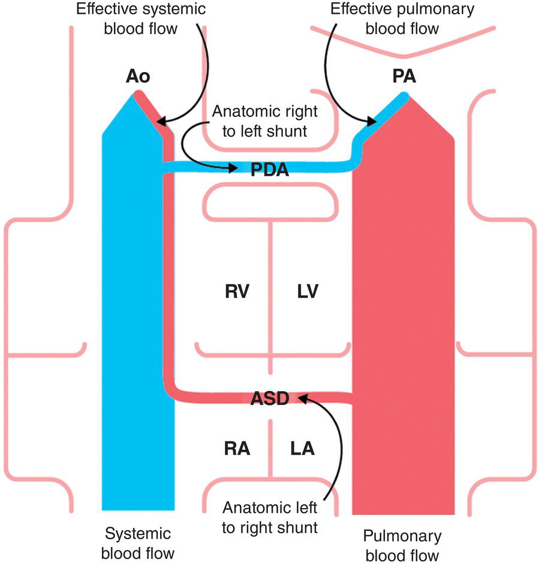

[**Figure 29.6**](#R_c29-fig-0006) Representation of intracardiac shunting in transposition of the great arteries with intact ventricular septum (TGA/IVS), unrestrictive atrial septum, and PDA. The majority of flow is recirculated, RA→aorta and LA→PA, and is therefore, ineffective. A small amount of blood shunts left‐to‐right via the ASD; this is effective systemic blood flow. Equally, a small amount of blood flows from the aorta to the PA via the PDA, this is effective pulmonary blood flow. The effective systemic and pulmonary blood flows are equal and constitute a small volume of flow that is necessary for life. Typically, the total pulmonary blood flow is 2 to 3 times greater than the total systemic blood flow. AO, aorta; PA, pulmonary artery; ASD, atrial septal defect; LA, left atrium; RA, right atrium; RV, right ventricle; LV, left ventricle; PDA, patent ductus arteriosus.

[**Table 29.1**](#R_c29-tbl-0001) Factors influencing intercirculatory mixing in patients with D‐TGA

| Factor | Effect on mixing |
| --- | --- |
| Size | 
-   Mixing improved by larger, unrestrictive communications

 |
| Position | 

-   More efficient mixing at the atria due to lower pressure
-   Poor mixing at anterior muscular VSDs due to unfavorable position

 |
| Number | 

-   Greater number of communications increases intercirculatory mixing

 |
| Pulmonary blood flow | 

-   High pulmonary flow is associated with maximal mixing

 |

#### Pulmonary blood flow

The efficiency of mixing is further influenced by total pulmonary blood flow (Qp) \[23\]. As the patient surpasses the neonatal period, pulmonary blood flow is increasingly important in determining intercirculatory mixing. As PVR continues to drop after the neonatal period, cyanosis tends to improve. This may occur as the decrease in PVR increases pulmonary blood flow, thus increasing mixing. The opposite may also to be true: as pulmonary blood flow is reduced (usually secondary to pulmonary stenosis or pulmonary vascular occlusive disease), a decrease in mixing occurs resulting in a drop in systemic arterial saturation \[23, 24\]. A reduction in pulmonary blood flow caused by a decrease in overall cardiac output (e.g., hypovolemia, depressed myocardial contractility from volatile anesthetics) will also exacerbate cyanosis.

#### TGA and pulmonary vascular occlusive disease

Children with TGA are at particular risk of developing pulmonary vascular occlusive disease compared with other congenital heart lesions, especially in TGA with VSD. Pulmonary vascular remodeling caused by an abnormal hemodynamic state \[25\] (i.e., high pulmonary blood flow) plays a significant role in the development of pulmonary vascular occlusive disease. Multiple other factors believed to contribute to this disease process also exist in these patients: hypoxemia, polycythemia, and high PA pressure \[6\].

As PVR increases and pulmonary hypertension develops, pulmonary blood flow is reduced, thereby decreasing intercirculatory mixing and worsening systemic hypoxemia. Late diagnosis of TGA may result in severe pulmonary vascular occlusive disease. Once pulmonary hypertension is established, the therapeutic surgical options are reduced, sometimes necessitating palliative rather than curative options.

Flow characteristics and intercirculatory mixing vary depending on the variations in anatomy of the TGA subsets.

#### TGA with intact ventricular septum

In TGA/IVS, intercirculatory mixing occurs at two main sites: ASD and PDA. In TGA/IVS without additional communications (i.e., no PDA), shunting at the atrium is predominantly dependent on the size and pressure gradients across the atrial communication. During systole blood shunts from the LA to the RA (effective systemic blood flow) due to a raised LAP from the high volume of recirculating pulmonary blood flow. During diastole blood shunts from the RA to the LA (effective pulmonary blood flow) due to reduced ventricular and vascular compliance of the systemic circuit \[26\]. Respiratory variation also effects shunting across the atrial communication.

When a PDA is also present, flow across the PDA is dependent on the size of the inter‐atrial communication and the PVR. With a non‐restrictive ASD and a low PVR, blood flows from the aorta to the PA across the PDA (effective pulmonary blood flow) and left to right across the ASD (effective systemic blood flow).

As the PVR increases, shunting across the PDA and ASD becomes bidirectional. A unique clinical scenario occurs when raised PVR results in the PAP exceeding aortic pressure, causing blood to shunt across the PDA from the PA to the descending aorta, creating a reverse differential cyanosis. In this scenario, post ductal saturations (lower limb) will be higher than preductal (right hand). This phenomenon only occurs in TGA with preductal coarctation/interruption or when PVR is elevated (usually due to persistent pulmonary hypertension). A restrictive ASD or small PFO can cause elevated PVR due to raised LAP, resulting in poor mixing and severe cyanosis. The PFO may even close due to the raised LAP – eliminating a source of atrial mixing. Smaller infants with inadequate atrial mixing are at a high risk of preoperative or sudden death at birth due to PFO closure \[27\]. A BAS may be lifesaving in this setting.

#### TGA with ventricular septal defect

Although VSDs occur in 40% of patients with TGA, approximately one‐third of these are too small and not functionally significant \[28\]. In TGA with non‐restrictive VSDs, mixing at the VSD is usually less efficient than at the atrial level. This is due to larger pressure gradients throughout the cardiac cycle at the level of the ventricles which typically shunt blood in one direction, in this case from right to left (effective pulmonary blood flow). Flow across the PDA is also predominantly effective pulmonary blood flow, with blood shunting from the RV to the aorta to the PA. Effective systemic blood flow originates from blood shunted from left to right across an ASD or PFO. The increased pulmonary blood flow will pass almost entirely through the LV, resulting in a volume‐overloaded LV and subsequent heart failure. This increased pulmonary blood flow, particularly in patients with a VSD, significantly increases the risk of developing PAH, as systemic pressures are transmitted to the pulmonary vasculature.

#### TGA with left ventricular outflow tract obstruction

TGA with LVOTO occurs in approximately 5–10% of patients with TGA and is more commonly associated with a VSD. In TGA with LVOTO and VSD, there is a large anatomical left to right shunt and reduced pulmonary blood flow. Effective pulmonary blood flow is carried via the PDA. Due to a low Qp, LA hypertension and cardiac failure do not occur, but severe systemic hypoxemia is present. Cyanosis after birth is a common clinical feature, the degree of which is dependent on the magnitude of the obstruction.

Dynamic LVOTO can occur in patients with TGA/IVS who do not undergo an early ASO. This happens when the LV pressure drops below the RV pressure in the postnatal period due to a corresponding drop in PVR. High systemic right ventricular pressure displaces the interventricular septum posteriorly into the left ventricular outflow tract during systole. Dynamic LVOTO should be resolved after ASO; however, if left untreated, this obstruction can become fixed over time necessitating alternative surgical strategies.

Fixed LVOTO requires detailed surgical planning with assessment of the degree of LVOTO and adequacy of the pulmonary valve. Selected patients with fixed LVOTO may still proceed to ASO with satisfactory short‐ and mid‐term results \[29, 30\]. Neo‐aortic valve regurgitation remains a concern in long term \[29\]. If LVOTO is severe and fixed, other surgical options than ASO are advised \[29, 30\].

#### TGA with right ventricular outflow tract obstruction

Obstruction to the systemic circulation is an infrequent but important variant of TGA and occurs in approximately 5–10% of cases \[31\]. Systemic saturations will be variable depending on the degree of RVOTO and significant systemic hypoperfusion may occur due to impedance of systemic blood flow (including absent or diminished femoral pulses) if the PDA becomes restrictive. As mentioned above, a finding of reverse differential cyanosis indicates significant anatomical left‐to‐right shunting at the PDA and should alert clinical suspicion of coarctation of the aorta. A detailed evaluation of the aortic arch anatomy and of any coarctation and/or aortic arch hypoplasia are important surgical considerations.

* * *

### KEY POINTS: NATURAL HISTORYAND PATHOPHYSIOLOGY

-   In d‐TGA the pulmonary and systemic circulations exist in parallel.
-   Deoxygenated venous blood recirculates to the body through the right side of the heart, without being oxygenated in the lungs, and oxygenated blood recirculates between the lungs and the left side of the heart.
-   Intercirculatory mixing is vital for survival in children with d‐TGA.
-   Mixing can occur through a PFO, ASD, VSD, or PDA.
-   Atrial level mixing is the most effective way to increase oxygenation.
-   Without treatment, death from hypoxia and congestive heart failure will occur in 90% of patients within the first year of life.

* * *

### Clinical presentation and diagnostic features

With the evolution of fetal echocardiography, most diagnoses of TGA are likely to occur antenatally. As a result, a preliminary management plan can be formed aimed at postnatal stabilization before a more definitive surgical correction takes place. Antenatal diagnosis facilitates planned delivery and early administration of prostaglandin preventing the production of lactate and thus improving the neonates’ pre‐operative condition. In addition, it reduces the risk of cerebral damage which has been shown to correlate with high lactates \[32\]. A detailed echocardiogram is repeated at birth which allows for comprehensive assessment of cardiac anatomy and the associated anatomical defects and to aid preoperative management and surgical planning. The echo must be performed promptly as prolonged duration of severe cyanosis and tissue hypoxia are important factors in determining acidosis, ventricular function, and ultimately multiple organ failure.

Clinical features in TGA are difficult to distinguish from other causes of neonatal cyanosis:

-   **Cyanosis**‐The degree of cyanosis is determined by the amount of intercirculatory mixing. In infants with mild cyanosis, the lesion may only be detected on the basis of a pulse oximetry screen.
    
    **TGA/IVS:** If the ASD is restrictive, limited intercirculatory mixing occurs leading to profound central cyanosis and tachypnea presenting within the first few hours of life. Arterial oxygen saturation will usually range between 50 and 70% unresponsive to oxygen administration.
    
    **TGA LVOTO:** Due to reduced pulmonary blood flow from LVOTO or pulmonary obstructive disease, these patients can present with significant cyanosis. Reverse differential cyanosis might be present.
    
    **TGA/VSD**: In infants with a large VSD that allows for satisfactory mixing between the two circulations, cyanosis may only be perceived during episodes of crying or agitation. However, signs of congestive heart failure will prevail due to ventricular overload: tachypnea, tachycardia, failure to thrive, a gallop rhythm, and eventually hepatomegaly. Arterial oxygen saturations will range between 75 and 90%.
    
    [**Table 29.2**](#R_c29-tbl-0002) ECG and Chest Radiograph (CXR) findings in various D‐TGA morphologies
    
    | TGA morphology | ECG | CXR |
    | --- | --- | --- |
    | TGA IVS | Essentially normal | “Egg on side” |
    | TGA VSD | Normal or RVH | Narrow superior mediastinal area, cardiomegaly, prominent vascular markings |
    | TGA LVOTO | Normal or biventricular hypertrophy | Cardiomegaly, increased pulmonary vascular markings |
    
-   **Tachypnea** – Patients will usually have a respiratory rate of over 60 breaths per minute and appear comfortable without other signs of respiratory distress (grunting, nasal flaring, subcoastal, or tracheal recession). Infants with large VSDs may present with severe respiratory distress due to heart failure by three to 4 weeks of age.
-   **Heart murmurs** – Heart murmurs are not a consistent finding in patients with TGA. An ejection systolic murmur is associated with left outflow tract obstruction (i.e., PS). A pansystolic murmur may be heard with a small to moderate VSD or PDA.
-   **Diminished pulses** – Diminished femoral pulses may be seen in patients who also have coarctation of the aorta or interruption of the aortic arch.

Cardiac catheterization is not routinely performed unless it is in conjunction with BAS, when ECHO cannot establish coronary artery anatomy, or to quantify pulmonary vascular occlusive disease and PVR in the older child. [Table 29.2](#c29-tbl-0002) presents common ECG and chest radiograph findings in the various TGA morphologies.

#### Preoperative management

After birth, infants with TGA require early treatment; it is therefore recommended that they are delivered at or close to a tertiary care hospital that provides pediatric cardiology and cardiac surgery facilities \[33\]. Enabling early stabilization and optimization of these children can reduce cost and transport‐related complications \[34\]. Infants born outside of a tertiary center will need to be stabilized in NICU prior to transfer; some institutions will electively intubate these patients, although there is increasing evidence that rates of complications are higher in intubated neonates \[35\].

The initial management of newborns with TGA should focus on stabilization, optimization of the mixing of systemic and pulmonary circulations, oxygen delivery, maintenance of adequate systemic perfusion and correction of acidosis. To ensure sufficient mixing between the two parallel circulations, an intravenous infusion of prostaglandin E1 is recommended to maintain patency of the PDA until a comprehensive series of post‐natal echocardiograms has been completed to assess all sites of possible intercirculatory mixing. Prostaglandin infusions should be started at 0.05 mcg/kg/min, higher doses may be necessary to re‐open a closed PDA. Prostaglandin may cause fever, platelet dysfunction, hypotension and apnea, particularly with increased doses which may necessitate intubation. If PGE1 does not improve tissue oxygenation, then an urgent balloon atrial septostomy (BAS) should be performed as ductal shunting is often insufficient in the presence of a restrictive ASD.

#### Transcatheter approaches

A BAS can be performed in a catheterization lab under angiography or in NICU using echocardiography. Occasionally, BAS may be performed at the local hospital by a specialist cardiac retrieval team so that the patient can be stabilized prior to transport to the cardiac center for definitive surgery. Because BAS can be safely performed under echocardiographic guidance, preoperative diagnostic cardiac catheterization should be considered only in selected cases for diagnosis of complex lesions or if institutional experience does not permit performance of atrial septostomy under echocardiographic guidance. Exact coronary artery definition is generally not required by the majority of surgeons as it can be determined in the operating room, and ASO is performed for almost every coronary artery arrangement.

During BAS, a balloon is passed via the umbilical vein or the femoral vein, into the left atrium across the PFO, the balloon is inflated and pulled back briskly across the septum, to tear the inferior aspect of the foramen ovale ([Figure 29.7](#c29-fig-0007)). This is repeated at least once to ensure adequate enlargement of the ASD; echocardiogram is performed to assess the intercirculatory mixing.

### Outcomes from balloon atrial septostomy

The introduction of balloon atrial septostomy (BAS) by Rashkind and Miller in 1966 has greatly improved the prognosis of patients with TGA, with 3‐month survival increasing from 20 to 85% \[37\]. The significant improvement in saturations must be weighed against the risk of vascular trauma, arrhythmias, and rare complications such as atrial perforation and avulsion of the inferior vena cava \[38\]. Mortality of an urgent BAS is around 3%, with increased risk of complications if performed out of hours \[39\]. Although there is no increased mortality between patients who received a BAS and patients who did not, some studies have shown a strong association between BAS and preoperative stroke in neonates with TGA \[39, 40\]. Multiple studies have described MRI changes in both white and grey matter locations, including focal ischemic changes and periventricular leukomalacia (PVL) in patients with TGA, with reported prevalence rates of 30% \[41\]. Although it is possible that this is due to embolic phenomenon from the BAS, there are likely to be multifactorial components, including the degree of hypoxemia and hemodynamic instability. Multiple papers have now refuted the association between BAS and stroke \[42, 43\].

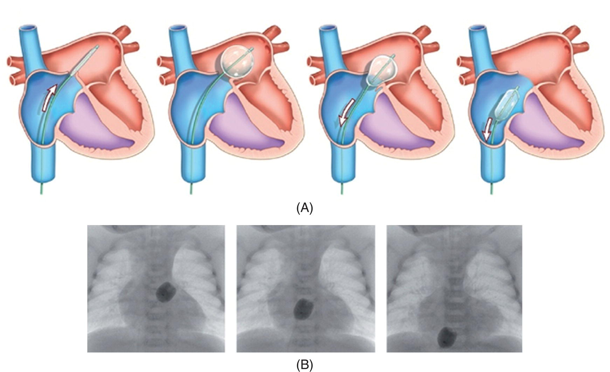

[**Figure 29.7**](#R_c29-fig-0007) Balloon atrial septostomy. (A) Schematic representation of the maneuver. A balloon‐tipped catheter is introduced via the inferior vena cava into the right atrium. After passing through the foramen ovale, the balloon is inflated into the left atrium and then pulled across the septum to enlarge the opening. Finally, the balloon is rapidly deflated, and the catheter removed. (B) Angiographic images showing the different steps of the maneuver.

(Source: Seguela et al. \[36\]. Reproduced with permission of Elsevier.)

### Anesthesia for balloon atrial septostomy

A BAS can be performed in the cardiac catheterization laboratory under angiographic guidance or in the neonatal intensive care unit under echo guidance, with the latter being more common.

The procedure is performed by a pediatric interventional cardiologist, with a neonatologist or an anesthetist present to manage sedation and mechanical ventilation.

A stable airway must be guaranteed, although not all neonates need to be intubated. Our center advocates routine intubation, this permits optimal sedation and analgesia, as well as permitting the use of paralysis to facilitate BAS. Prior to the procedure, an ABG, baseline blood tests, and IV access are required. A unit of red blood cells is essential and ideally crossmatched if time permits. Baseline observations including HR, RR, pre‐ and post‐ductal saturations, BP, blood glucose, and urine output should be documented prior to and throughout the procedure.

Intubated neonates will usually be sedated with a morphine infusion, with additional boluses of fentanyl, ketamine or midazolam given as required. In spontaneous ventilating neonates, small incremental boluses of appropriate sedation should be used, including opioids (morphine or fentanyl), midazolam, and ketamine \[44\]. Dexmedetomidine is a safe drug in children with congenital heart disease with no significant respiratory depressive effect; thus, it may be useful in this setting \[45\]. Acetaminophen can be a useful adjunct in these patients.

If a BAS is performed successfully, systemic oxygen saturations should begin to increase immediately; if adequate mixing is seen at the atrial level, then the PGE1 infusion can be gradually discontinued (as long as there are no concerns regarding aortic arch obstruction). The aim is now to ensure hemodynamic stability and optimize preoperative condition. Once the patient is stable, they can be fed, and all further required investigations should be performed.

Associated medical problems (such as respiratory distress, necrotizing enterocolitis (NEC), and intracranial hemorrhage) should be diagnosed and treated appropriately. If the patient is extremely premature or other associated conditions are present, an early ASO should be postponed. If intracranial hemorrhage occurs, surgical repair is usually delayed by 2 weeks. Due to this delay, the left ventricular mass will decrease and will need to be “re‐trained” to support a high SVR after the ASO (see below).

A small proportion of patients may remain cyanotic after a BAS, requiring further detailed echocardiography to confirm the ASD is unrestrictive, assess the patency of the PDA, and assess for pulmonary hypertension if present. Incidence of persistent pulmonary hypertension in neonates with TGA is 12.5%, occurring more commonly in patients with TGA /IVS \[46\]. Multiple treatment strategies have been used with variable success, including sedation, paralysis and hyperventilation, inhaled nitric oxide (NO) \[47\], sildenafil, bosentan \[48\], and extracorporeal life support (ECLS) \[49\]. The prognosis in these patients remains poor \[50\].

* * *

### KEY POINTS: PREOPERATIVE MANAGEMENT

-   The initial management of newborns with TGA should focus on stabilization and optimization of the mixing of systemic and pulmonary circulations.
-   To ensure sufficient intercirculatory mixing, an intravenous infusion of prostaglandin E1 is required to maintain patency of the PDA.
-   An urgent balloon atrial septostomy (BAS) may be required to improve intercirculatory mixing in patients with severe hypoxemia.
-   A BAS can be performed in the cardiac catheterization laboratory under angiographic guidance or in the neonatal intensive care unit under echo guidance.
-   Mortality of an urgent BAS is 3%.

* * *

### Surgical options

The ASO, first performed successfully in 1975 by Adib Jatene, has become the standard corrective procedure for patients with D‐TGA and has revolutionized their survival ([Figure 29.8](#c29-fig-0008)). Mortality has decreased from >90% to <1% in patients with simple TGA and 4% with complex TGA \[51\]. The ASO has been used as the preferred procedure for patients with D‐TGA since the late 1980s and has replaced the earlier atrial switch techniques by Mustard and Senning.

### Indication and timing of ASO

Significant uncertainty exists regarding the optimal timing of surgical repair. For ASO to be successful, the LV must have significant myocardial mass to support the systemic circulation. At birth, the LV mass is equal to that of the RV. In TGA/IVS, as the PVR drops postnatally the left ventricle involutes, losing muscle mass and thus becoming unable to support the systemic circulation \[52\]. Due to this, the majority of ASOs for TGA/IVS are performed within the first 2 weeks of life \[53\]. In older infants with TGA/IVS, there is a concern that the LV will decondition and therefore fail when exposed to higher systemic pressures after ASO, resulting in low cardiac output syndrome. There is no clear upper age limit for ASO, with most surgeons performing a primary ASO up to 4 weeks of age ([Box 29.1](#c29-fea-0001)). Beyond 4 weeks, a primary ASO becomes controversial, and it is likely that patients will require post‐op mechanical circulatory support and a prolonged ICU admission \[54\]. A study from Lo Rito et al, however, has suggested that primary ASO can be safely performed in TGA/IVS patients who present late with a severely deconditioned LV. They showed no significant differences in early mortality or LV recovery, although an increase in neurological injury was noted, which was thought to be due to the 3‐ to 5‐fold increase in ECMO use \[55\]. For infants >2 months old, a rapid two stage ASO is recommended. A two‐stage ASO involves pulmonary artery banding (+/− an aortopulmonary shunt in cyanotic patients) to “re‐train” the left ventricle by inducing LV hypertrophy before performing an ASO within 2 weeks. The PA band must be sufficiently tight to increase pressure in the LV to approximately one‐half to two‐thirds of the systemic ventricle without compromising pulmonary blood flow.

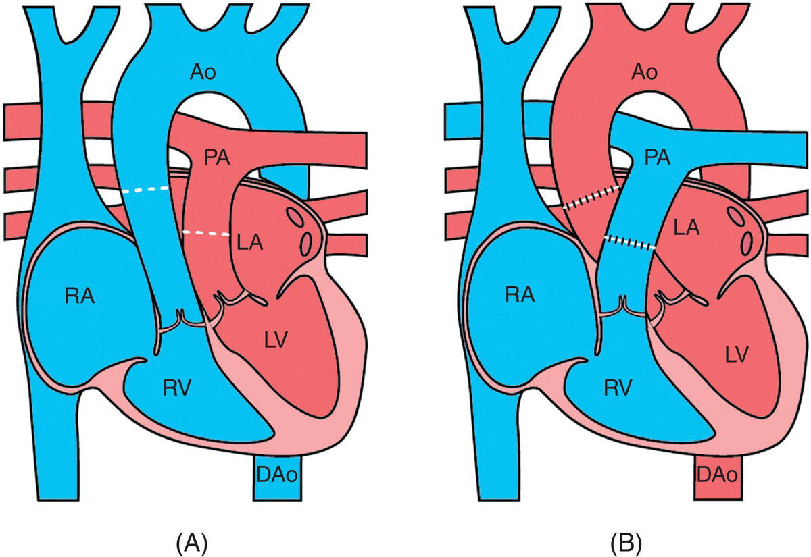

[**Figure 29.8**](#R_c29-fig-0008) The arterial switch operation (ASO). Schematic representation of d‐transposition of the great arteries anatomy before (A) and after (B) the ASO. Ao, aorta; PA, pulmonary artery; LA, left atrium; RA, right atrium; RV, right ventricle; LV, left ventricle.

* * *

### [Box 29.1](#R_c29-fea-0001) : Indications for LV retraining prior to ASO \[56\]

-   \>3 weeks old
-   <35 g/m2
-   Banana‐shaped IVS (IVS bulges right to left due to low LV pressure)
-   Absence of PDA or LVOTO

* * *

The majority of the left ventricular mass increase occurs in the first seven days after banding, with the ASO therefore typically performed within a week \[57\]. Although primary ASOs have better outcomes, a rapid two‐stage repair may be unavoidable in patients where a primary ASO would expose the infant to excessive risk. Primary ASO may not be possible due to prematurity, sepsis (e.g., NEC), low birth weight (<1.5 kg) or late presentation.

Timing of surgery may also have an impact on neurodevelopmental outcome with some evidence to suggest that delaying surgery beyond 2 weeks of age is associated with impaired brain growth and slower language development at 18 months of age \[58\]. This may be due to the effects of prolonged hypoxia on the developing brain, with the risk of PVL increasing with lower arterial oxygenation and longer time to surgical repair \[43\].

Some evidence supports day 3 of life as the optimal time for an ASO, with increasing morbidity and healthcare cost beyond this timeframe. Currently, in Europe, 30% of ASOs are performed within the first week of life \[59\], with the majority of ASOs performed on Day 6 or 7 in the United States \[60\]. Preliminary reports have shown that performing an ASO in the first few hours of life is safe, thus avoiding the need for a BAS and theoretically reducing neurological impacts of prolonged hypoxia. This technique remains very controversial having been carried out in a limited number of cases \[61, 62\].

In the subsets of patients where the LV is exposed to systemic pressures (such as LVOTO, a large VSD, or PDA), LV mass is maintained after birth, preventing ventricular deconditioning beyond the age of 2–3 weeks. In these patients, there is less urgency to perform the surgery, and it can be done up to 6 weeks of life. In reality, they are usually operated on within the first month, before intractable cardiac failure or pulmonary vascular occlusive disease can occur.

#### TGA with left ventricular outflow tract obstruction

Surgical intervention in TGA with LVOTO varies with the type of LVOTO obstruction. Dynamic LVOTO obstruction is amenable to ASO as the dynamic nature of the LVOTO will be fully reversed, with no residual LVOT gradient.

Challenging decision‐making is required in TGA with mechanical LVOT obstruction. The surgical decision is dependent on the complexity of LVOT obstruction, the size of the pulmonary valve, and the size of the VSD ([Figure 29.9](#c29-fig-0009)). ASO and muscle resection may be possible in certain patients with a normally aligned LVOT where complete or near complete relief of the LVOTO is to be expected. There is an increased risk of reintervention of the LVOT or neo‐aortic valve \[30\]. For complex TGA with severe or fixed LVOTO (due to subvalvular, valvular or multilevel obstruction) and a VSD, an ASO is generally not performed. There are three main surgical options: the Rastelli, the REV and the Nikaidoh procedure (see below).

Aortic arch obstruction (coarctation with hypoplastic arch or interruption) is present in only 5–9% of TGA patients, but it is much more frequent in patients with TBA (more than 50%). Previously a two‐stage repair was advocated in these patients that included a primary coarctation reconstruction +/− PA band, followed by an ASO or intracardiac repair months later; however, mortality rates were high. Now a one‐stage ASO is usually undertaken \[63\].

### Arterial switch operation

The ASO is performed through a median sternotomy on cardiopulmonary bypass (CPB). Both of the great vessels are transected distal to their respective valves, translocated, and re‐attached to the opposite root. This will result in the right ventricle attaching to the pulmonary artery and the left ventricle to the aorta. When CPB is established, the ductus arteriosus is divided, the ascending aorta is clamped, and cardioplegia is administered. The ascending aorta is transected above the commissures and the left and right coronary arteries are excised with 3–4 mm of the surrounding tissue. These aortic explant sites are repaired with a pericardial patch. The main pulmonary artery is transected, and the coronary arteries are reimplanted into the remaining root of the PA which will become the neo‐aorta ([Figure 29.10](#c29-fig-0010)). This clarifies why delineating coronary artery anatomy is important prior to surgical repair. The LeCompte maneuver ([Figure 29.11](#c29-fig-0011)) is then performed; this involves the PA being brought anterior to the aorta before it is re‐anastomosed to the native aortic root whilst the distal aorta is re‐anastomosed to the proximal cuff of the native pulmonary artery (now the neo‐aorta). This results in the aorta lying behind the bifurcation of the PA, which reduces the risk of subsequent PA stenosis.

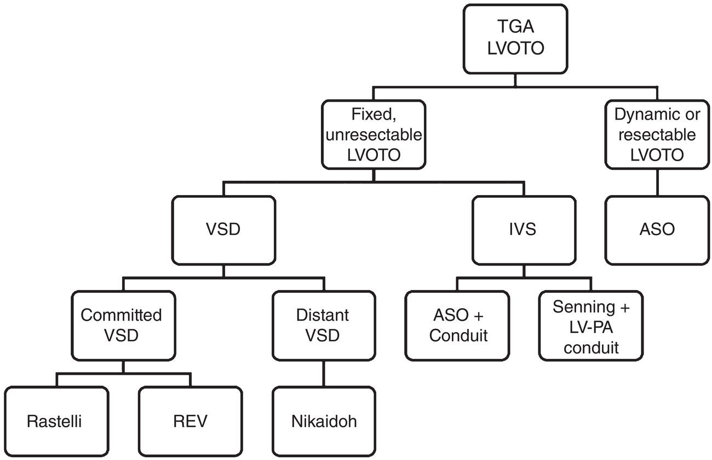

[**Figure 29.9**](#R_c29-fig-0009) Flowchart illustrating anatomical factors determining surgical decision‐making in patients with transposition of the great arteries (TGA) with left ventricular outflow tract obstruction (LVOTO). VSD, ventricular septal defect; IVS, intraventricular septum; ASO, arterial switch operation; LV‐PA conduit, left ventricle to pulmonary artery conduit; REV, Réparation à l’Etage Ventriculaire.

An ASD is usually closed by direct suture, while patients with a VSD require a pericardial patch. In children with TBA, the VSD is closed with a patch placed diagonally to achieve continuity of the LV with the neo‐aorta, while the neo‐PA remains connected to the RV.

Once the aortic cross‐clamp is removed, the myocardium is carefully observed for perfusion, and ECG and LAP are closely monitored. Ischemia of the myocardium is reflected by lack of reactive hyperemia or a rise in LAP, even before the ECG changes become apparent. A rise of LAP above 10 mmHg requires careful re‐examination of the myocardium and coronary vessels to ensure adequate coronary flow. During rewarming, the aortic sinus defect is repaired, the anastomosis is completed, and temporary atrial and ventricular pacing wires are placed ([Figure 29.12](#c29-fig-0012)).

### Other surgical procedures

#### Rastelli procedure

The Rastelli procedure is used to anatomically correct TGA with VSD and fixed LVOTO. A right ventriculotomy is performed, and a patch is placed to diagonally direct blood from the LV through the VSD toward the aorta. The PA is ligated at the level of the pulmonary valve, and a valved RV‐to‐PA conduit is placed \[65\]. The conduit can be an aortic or pulmonary homograft with a polytetrafluoroethylene graft extension. This achieves the LV to the aorta and the RV to the PA continuity, whilst bypassing the LVOTO ([Figure 29.13](#c29-fig-0013)). It is advantageous as it allows the LV to act as the systemic ventricle. The Rastelli procedure requires a large subaortic VSD, although restrictive VSDs can be enlarged to allow precise patch placement. Enlargement of the VSD has been shown to reduce the risk of developing post‐operative LVOTO but may increase the risk of heart block from damage to the conduction pathway \[66\].

In patients with severe LVOTO, where the pulmonary blood flow is low and inter‐arterial mixing is limited, a systemic‐to‐pulmonary shunt (usually a modified Blalock– Taussig shunt) is inserted in the neonatal period; these children are too young to be considered for a primary Rastelli procedure. This is used to increase pulmonary blood flow until the child has outgrown the BT shunt and a Rastelli operation will then be performed. This usually occurs before two years of age.

#### Senning and mustard procedures

The first surgical treatments of TGA were the atrial switch operations, performed by Senning and Mustard for the first time in 1958 and 1964, respectively. Senning and Mustard procedures (also known as atrial switch procedures) provide physiological, but not anatomic correction of the TGA. During the Senning procedure, an autologous tissue from the right atrial wall and intra‐atrial septum is used to create an intracardiac baffle redirecting systemic venous blood via the mitral valve to the LV and pulmonary venous blood via the tricuspid valve to the RV \[67\]. The Mustard procedure was developed as a modification of the Senning technique, where the interatrial septum is excised to create a large ASD and a baffle, made of either autologous pericardium or a synthetic material, redirects systemic and pulmonary venous blood flow to the LV and RV, respectively ([Figures 29.14](#c29-fig-0014) and [29.15](#c29-fig-0015)). Despite the Mustard procedure being a simplified technique, many deem the Senning procedure to be superior due its use of an autologous atrial tissue, thus allowing atrial growth and preserving contractility.

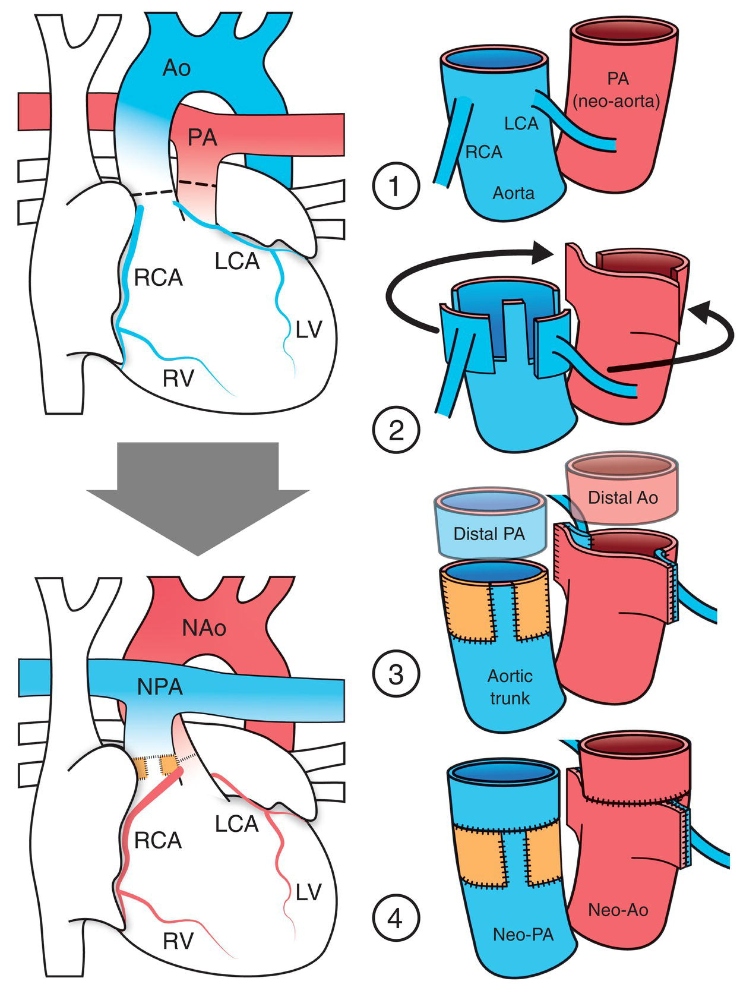

[**Figure 29.10**](#R_c29-fig-0010) Technique for the arterial switch operation. (1) The great arteries are transected above the sinuses of Valsalva. (2) The coronary arteries are excised from the aorta, transposed posteriorly, and reanastomosed to the pulmonary artery trunk: the neo‐aorta. (3) The distal aorta is brought behind the pulmonary artery (LeCompte maneuver) and anastomosed to the neoaorta. (4) Completed repair. Ao, aorta; PA, pulmonary artery; LCA, left coronary artery; RCA, right coronary artery; RV, right ventricle; LV, left ventricle; NPA, neo‐pulmonary artery; NAo, neo‐aorta.

#### Réparation à l’Etage Ventriculaire (REV) and Nikaidoh procedures

Réparation à l’Etage Ventriculaire (REV) involves radical excision of the outlet septum to enlarge the VSD, then a patch closure to direct the LV flow to the aorta. The PA is transected with the distal end brought anterior to the aorta (LeCompte) and the proximal stump ligated. The distal PA is then augmented with an autologous patch and anastomosed directly to the RV creating RV‐PA continuity \[69\] ([Figure 29.16](#c29-fig-0016)). REV avoids the use of an extra‐cardiac prosthetic conduit and reduces the risk of intracardiac tunnel obstruction. It is feasible in patients with anatomic contraindications to the Rastelli operation, and it may reduce the need for re‐operation and prevalence of residual pulmonary outflow tract obstruction. Disadvantages are the lifelong implications of pulmonary regurgitation and tension of the pulmonary artery reconstruction leading to early RVOTO \[71\].

During the Nikaidoh procedure, the aortic root is completely mobilized and translocated posteriorly to overlie the LV. The VSD is closed, and the PA is translocated anteriorly (LeCompte) and anastomosed to the RV using an autologous pericardial patch to reconstruct the RVOT ([Figure 29.17](#c29-fig-0017)). Patients with a hypoplastic right ventricle benefit the most from the Nikaidoh procedure. It creates a more normally aligned right and left outflow tracts, reducing the risk of recurrent LVOT obstruction and RV‐PA compression by the sternum.

[**Figure 29.11**](#R_c29-fig-0011) Three‐dimensional gadolinium‐enhanced magnetic resonance angiography in a patient with transposition of the great arteries showing the bifurcation of the pulmonary arteries arising from the right ventricle (blue) in front of the aorta arising from the left ventricle (red) after arterial switch operation with the LeCompte procedure.

(Source: Voges et al. \[64\]. Reproduced with permission of Wolters Kluwer Health, Inc.)

### Outcomes for ASO

Long‐term outcomes after ASO are excellent, with over 95% survival at 25 years after discharge \[72\]. ASO also provides very good functional status and little limitation in physical activity, with over 95% of patients in NYHA functional class I \[51\]. These outcomes are particularly favorable in comparison to atrial switch operations, Mustard or Senning, where long‐term survival is 80% at 20 years and 75% at 25 years respectively \[73\]. Despite excellent survival, patients are at risk for morbidity that may require further surgical intervention into adulthood ([Table 29.3](#c29-tbl-0003)). Overall freedom from catheter or surgical re‐intervention is 75% at 20 years, with re‐intervention being significantly more common in the TGA/VSD cohort post ASO \[75, 76\]. The most common reason for re‐ intervention post ASO is pulmonary artery stenosis, possibly due to inadequate growth at the neo‐pulmonary anastomotic site \[76\]. Performing ASOs in the neonatal period reduces the need for a PA band, which, alongside the introduction of the LeCompte maneuver, has likely reduced the incidence of PA stenosis, resulting in <5% now requiring reintervention \[51, 77, 78\].

Coronary artery insufficiency has been a long‐held concern after ASO and led to high early hospital mortality when ASO was first introduced. As surgical techniques and experience have improved, early mortality from coronary artery complications has dropped significantly. Coronary artery complications are the primary cause of early mortality with ischemia or ventricular dysfunction most commonly presenting in the first 3 months postoperatively \[79\]. This is likely due to anatomical kinking, torsion, or external compression, thus reducing coronary perfusion. Long‐term outcomes are also dependent on the patency of the coronary arteries, although late deaths due to coronary insufficiency are rare. It is thought that late coronary artery insufficiency is caused by stretching of the coronary arteries as they grow or progressive fibrocellular intimal thickening \[80\]. This may also predispose to early atherosclerotic disease, which is screened for during long‐term follow up. Coronary lesions occur in around 3 to 6.8% of patients, with coronary angiography being the gold standard as lesions are often subclinical \[75, 79, 81\]. This may be due to collateral circulation, which may mask ischemia on noninvasive screening modalities (ECG, echocardiography, stress tests, etc.) \[79\].

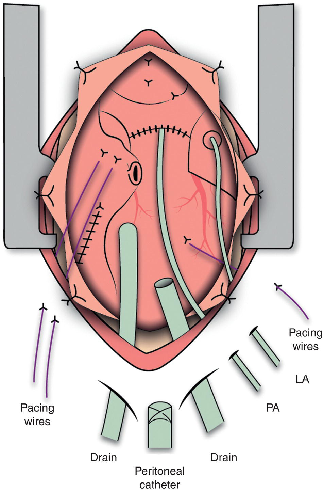

[**Figure 29.12**](#R_c29-fig-0012) Layout of the chest before sternotomy closure in the arterial switch operation. PA, pulmonary artery catheter; LA, left atrial catheter.

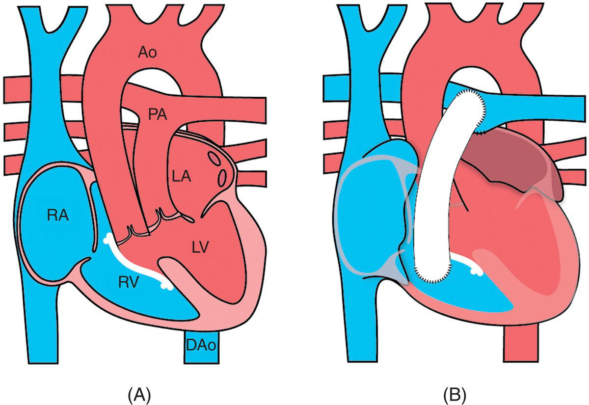

[**Figure 29.13**](#R_c29-fig-0013) Rastelli procedure for repair of transposition of the great arteries with ventricular septal defect (VSD) and left ventricular outflow tract obstruction (LVOTO). (A) Baffle closure of the VSD with a patch redirecting left ventricular outflow across the aortic valve. (B) In the presence of LVOTO, the proximal pulmonary artery (PA) is ligated, and a valved conduit is placed from the RV to the main PA. Ao, aorta; PA, pulmonary artery; RA, aright atrium; LA, left atrium; RV, right ventricle; LV, left ventricle; DAo, descending aorta.

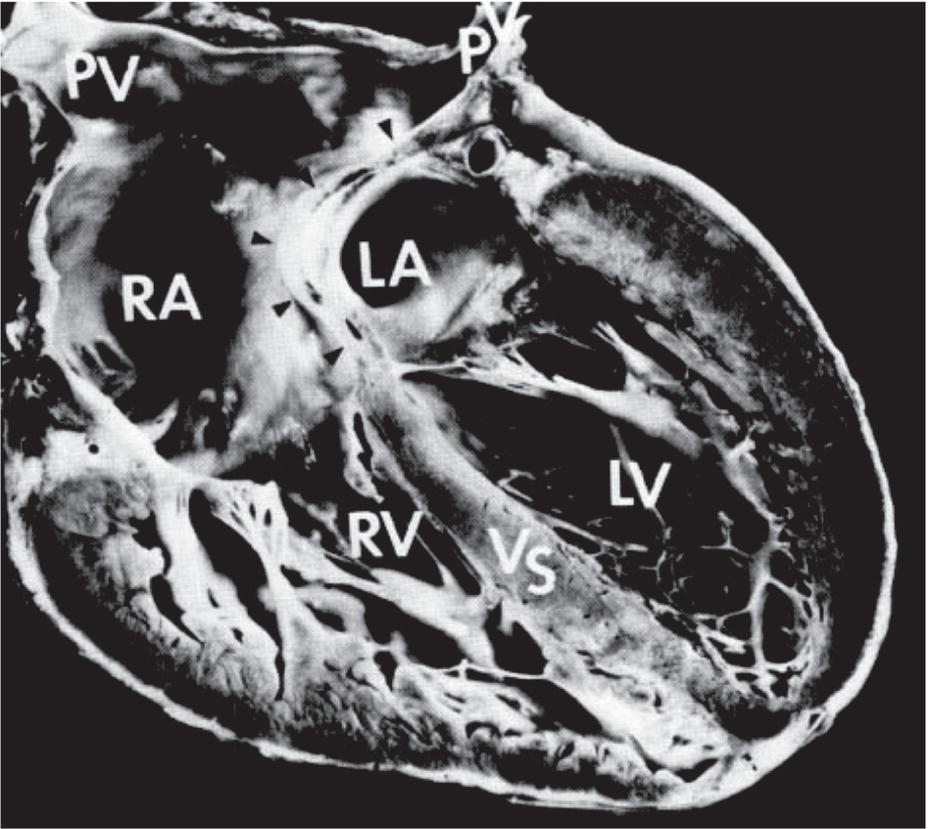

[**Figure 29.14**](#R_c29-fig-0014) Postoperative specimen of transposition of the great arteries after the Mustard operation. The tomographic cut is comparable to an apical four‐chamber echocardiographic projection. The patch within the atrium (black arrowheads) directs pulmonary venous blood to the tricuspid valve and into the right ventricle (RV). LA, left atrium; PV, pulmonary vein; RA, right atrium; VS, ventricular septum.

(Source: Warnes \[68\]. Reproduced with permission of Wolters Kluwer Health, Inc.)

In the immediate post‐op period after ASO, there is a high incidence of chronotropic impairment due to sympathetic denervation, despite this over 96% of patients are in sinus rhythm \[51, 79\]. Arrythmias present after the immediate post‐op period require urgent investigation to rule out coronary artery abnormalities or residual lesions resulting in hemodynamic compromise. Late arrythmias are a relative frequent complication occurring in around 2 to 10% of patients \[51, 79, 82, 83\].

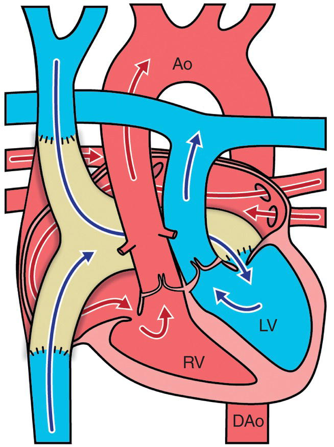

[**Figure 29.15**](#R_c29-fig-0015) The Mustard procedure. An intra‐atrial baffle diverts blood from both the superior vena cava (SVC) and the inferior vena cava (IVC) across to the mitral valve and left ventricle, which ejects blood to the pulmonary artery. Pulmonary venous blood is returned via the tricuspid valve and RV, which ejects blood into the aorta. The baffle is made from pericardium or a synthetic material. Ao, aorta; RV, right ventricle; LV, left ventricle; DAo, descending aorta.

Neo‐aortic valve regurgitation is a frequent finding after ASO as the native pulmonary valve is exposed to systemic pressures. Up to 20% of patients develop some degree of aortic regurgitation, with 5% of patients requiring neo‐aortic root or valve reoperation at 20 years, increasing to 8% at 25 years. This demonstrates the significant attrition of the neo‐aortic valve over time and the need for ongoing close surveillance of ASO survivors. It is not yet known how well the neo‐aortic root will cope with systemic pressure as these patients reach middle age \[84, 85\].

[**Figure 29.16**](#R_c29-fig-0016) This figure shows the innovations of the REV procedure relative to the Rastelli procedure, (A) preoperative anatomy, with resection of the muscular outlet septum (B) and use of LeCompte maneuver (C) which avoids the use of an extacardiac conduit.

(Source: Martins et al. \[70\]. Reproduced with permission of Cambridge University Press.)

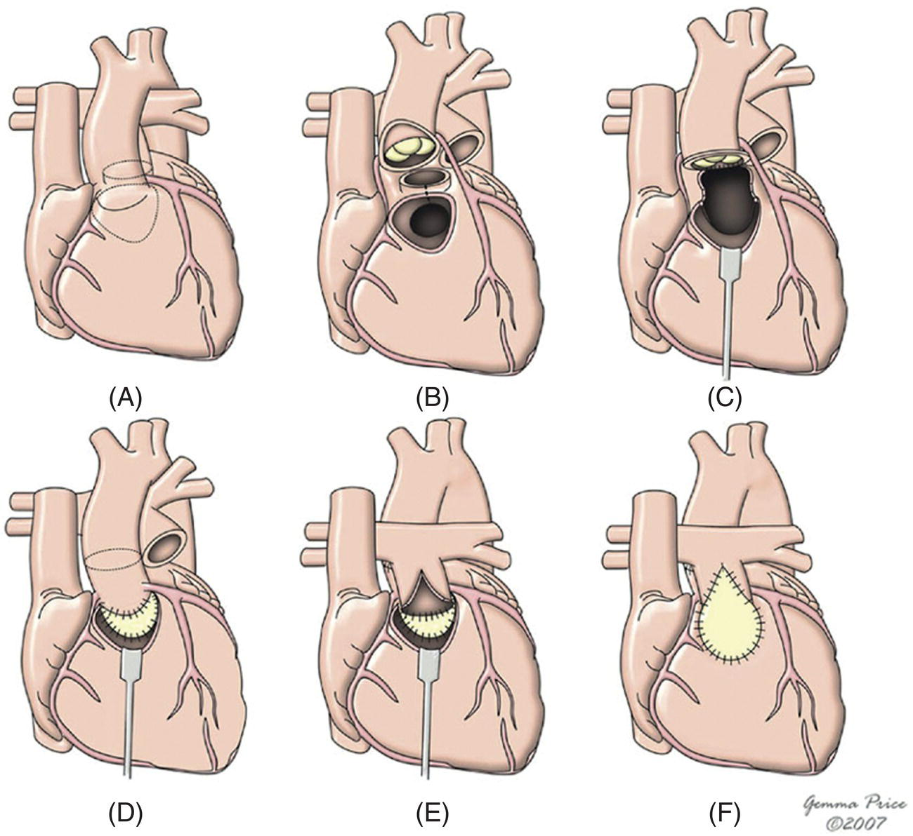

[**Figure 29.17**](#R_c29-fig-0017) The illustration shows the major steps of Nikaidoh’s procedure. (A) Shows the areas for harvesting the aortic root and transection of the pulmonary trunk. In (B), the aorta and pulmonary trunk have already been disconnected from their previous insertion, and the line of division of the outlet septum is shown. (C and D) show aortic translocation and reconstruction of the left outflow tract, with a pericardial patch used to close the ventricular septal defect. In (E) and (F), the pulmonary trunk is sutured to the right ventricular outflow tract, and the reconstruction is completed with a pericardial patch.

(Source: Martins et al. \[70\]. Reproduced with permission of Cambridge University Press.)

With increased survival after TGA repair, attention has turned toward quality of life and functional outcomes. There is increasing evidence that neurodevelopmental impairment is more prevalent in children after TGA repair than in the general population \[86\]. Neurodevelopmental impairment in these children ranges from motor delay, cognitive impairment, poorer academic achievements, speech and language dysfunction and psychosocial impairment. Multiple studies have described MRI changes in both white and grey matter locations, including focal ischemic changes and PVL in patients with TGA, with reported prevalence rates of 30% \[41\]. However, MRI abnormalities poorly predict adverse neurodevelopmental outcomes in these patients \[58\]. Poorer neurodevelopmental outcomes are likely to be multifactorial and strongly associated with the infant’s prenatal, neonatal, and perioperative course. Risk factors include post‐natal diagnosis of TGA, greater degree of hemodynamic instability and hypoxemia, underlying genetic abnormality, inadequate nutrition, complex TGA, prolonged bypass times, peri‐operative complications (e.g., NEC), use of DHCA, and need for ECMO \[86\]. This highlights the importance of fastidious attention to neuroprotection in the perioperative period, with optimal timing of surgery, anesthetic and surgical techniques, and monitoring to improve neurodevelopmental outcomes and quality of life in ASO neonates.

[**Table 29.3**](#R_c29-tbl-0003) Postoperative sequelae following the arterial switch operation

Source: Wernovsky et al. \[74\]. Reproduced with permission of John Wiley & Sons.

| Postoperative sequalae | Incidence |
| --- | --- |
| Supravalvar pulmonary stenosis[a](#c29-note-0001) | ~10% |
| Supravalvar aortic stenosis[a](#c29-note-0001) | <5% |
| Neoaortic root dilatation | Essentially 100% |
| Neoaortic regurgitation | ~50%[b](#c29-note-0002) |
| Significant arrythmia | Rare |
| Asymptomatic coronary occlusion | 2–3% |
| Pulmonary hypertension | Rare |
| Hypertrophied bronchial collaterals[a](#c29-note-0001) | <5% |
| Abnormal bronchial collaterals[a](#c29-note-0001) | Unknown |
| Sudden death | Rare |

[a](#R_c29-note-0001) Requiring intervention.

[b](#R_c29-note-0002) Increase with increasing duration of follow‐up.

#### Outcomes for Rastelli

Overall survival after Rastelli operation has improved drastically in the last few decades from 52 to 93% at 20 years \[87, 88\]. Despite this, the re‐intervention rate remains high, with approximately 40% of patients requiring re‐intervention for RVOTO at 20 years \[88\]. The conduits do not grow with the child, become stenosed overtime, and are at a risk of calcification; therefore, serial conduit replacements are inevitable. However, extension of the VSD at the time of operation has nearly eliminated the need for reintervention for LVOTO. Atrial and ventricular arrythmias occur commonly and sudden death from arrythmia is a problematic long‐term complication. Although RV and LV failure may also occur, the Rastelli operation protects the RV from chronic regurgitation, unlike the REV and Nikaidoh procedures.

#### Outcomes for Senning and Mustard procedures

Mustard and Senning procedures have low operative mortality, and overall survival for all patients is approximately 75% after 25 years \[73\]. Long‐term sequelae, however, are common and are largely related to RV failure, arrythmias, and baffle complications. Mustard and Senning procedures were the original mainstay for surgical correction of TGA, but as a result of the morphological RV remaining as the systemic ventricle, they have been largely superseded by the ASO. All adults develop some degree of RV dysfunction, with 10% of adults requiring hospital admission for CHF after 20 years \[73, 89\]. Common baffle‐associated complications include leak, stenosis, and/or intractable atrial arrhythmias \[90\]. Scarring around the sinus node and intra‐atrial baffle sutures results in sick sinus syndrome and atrial flutter, respectively. Sudden, presumed arrhythmogenic death and myocardial failure are the most frequent causes of late death in these patients \[91\].

* * *

### KEY POINTS: SURGICAL OPTIONS

-   The most common procedure for d‐TGA is the ASO; others include the Rastelli procedure and (rarely) the atrial switch.
-   Left ventricular mass involutes in d‐TGA/IVS as PVR decreases postnatally.
-   ASO repair is usually performed in the first 2–3 weeks of life.
-   Long‐term complications include PA stenosis, coronary artery insufficiency, early atherosclerotic disease, neo‐aortic regurgitation, and neurodevelopmental impairment.

* * *

### Anesthetic considerations and perioperative management

It is essential for the anesthesiologist to have a detailed understanding of the pathophysiology of the TGA lesion, other associated anomalies, the overall condition of the child, and any interventions that have been undertaken to stabilize the child.

#### Preoperative assessment

A thorough and detailed anesthetic pre‐op assessment is focused on issues relevant to any neonatal high‐risk surgery and pertinent to TGA physiology. Pre‐operative optimization and assessment is a multidisciplinary endeavor with the involvement of expert surgeons, cardiologists, anesthetists, and intensivists. Cardiac multidisciplinary conferences to tailor peri‐operative care to the patient and discuss surgical planning, surgical timing, pre‐operative optimization strategy, and clinical course are best practice.

The pre‐operative assessment should focus on:

-   Adequacy of intercirculatory mixing
    -   PGE/BAS/ASD/number of communications and direction of shunts
-   Associated cardiac conditions
    -   IAA/Coarctation/VSD/LVOT
-   Associated co‐morbidities – Congenital/acquired (e.g., NEC/IVH) – does surgery need to be delayed?
-   Age of Child
    -   \>1 month in TGA/IVS – LV mass involutes, may need alternative surgical strategy (PA banding) or back up EMCO
    -   \>2 months TGA VSD – pulmonary over‐circulation leading to PAH
-   Details of TGA type and cardiac anatomy
    
    -   Size of VSD, ventricular function, coronary anatomy, pulmonary valve structure, and function
    
-   Elevated PVR
    -   Patients with high PVR may present with inadequate mixing and require urgent surgery with a suboptimal acid–base balance
-   Clinical examination – Pre/post ductal saturations, Reverse differential cyanosis
-   Cardiorespiratory status and current support
    -   Arrhythmias, pulmonary over‐circulation, CHF
    -   Inotropes, mechanical support, iNO, ventilatory support (high flow nasal cannula, CPAP, mechanical ventilation)
-   Pre‐operative blood tests – complete blood count/electrolytes/coagulation panel and cross match
-   Family rapport, detailed informed consent, and discussion of perioperative course
-   Team brief – surgeons/perfusion/scrub/anesthetic team on day of operation to discuss concerns, surgical approach, and perfusion strategy.

#### Anesthetic goals

Anesthetic goals include:

-   Maintain ductal patency in duct‐dependent lesions
-   Maintenance of stable cardiovascular parameters
    -   Maintain HR, sinus rhythm, pre‐load, and myocardial contractility to maintain cardiac output (CO) – reduced CO reduces mixed venous oxygen saturation (SVO2) and therefore decreases arterial saturation
-   Avoid increase in PVR relative to SVR
    -   An increase in PVR will reduce pulmonary blood flow and hence reduce intercirculatory mixing.
    -   In PAH or mild/mod LVOT, ventilatory strategies can be used to reduce PVR, increase pulmonary blood flow, and increase mixing
-   Avoid reduction in SVR relative to PVR
    -   Decreased SVR increases recirculation of systemic venous blood and decreases arterial saturation

#### Anesthetic intraoperative management

On arrival in the anesthetic room after pre‐op checks are complete and consent form is checked, monitoring is placed – SpO2 (pre‐ and post‐ductal), ECG, and NIBP. Induction can be intravenous or inhalational and should be tailored to the child. Our institution would use a combination of an opiate, an inhalational agent, and a muscle relaxant. A high‐dose opioid technique has many advantages including attenuating the stress response, decreasing post‐op morbidity, reducing coagulopathy and transfusion requirements \[92, 93\]. Fentanyl is the most commonly used opioid for induction in the United Kingdom, with doses ranging from 30–300 ug/kg, usually 10 mcg/kg is required as a minimum prior to incision. It is important to note that inhalational induction may be prolonged in patients with TGA due to high pulmonary re‐circulation; it is therefore important to avoid high percentage sevoflurane for induction as myocardial depression may occur rapidly. Pancuronium, if available, at the dose of 0.1 mg/kg can be used for muscle relaxation, which is advantageous due to its long half‐life. Pancuronium has vagolytic and sympathomimetic effects, thus inducing tachycardia, which can be blunted with co‐administration of fentanyl. A nasal endotracheal tube in inserted, if possible, to aid comfort in the post‐operative period.

Once intubated, arterial and central venous access is obtained. Radial arterial access is the preferred location due to the increased incidence of arterial thrombosis in femoral arterial lines, particularly in patients with cyanotic heart disease \[94\]. A central venous line is also inserted; preferably an internal jugular CVC, but if SVC cannulation is required for VSD closure a femoral central line may be preferable. Central venous pressure measurement is then established.

Once transferred into the operating theatre, core and peripheral temperature probes are placed, and NIRS is applied to the forehead. A urinary catheter is inserted to monitor urine output intraoperatively and throughout the postoperative course. The patient is then positioned appropriately; all lines are checked, secured, and padded prior to draping. A transesophageal echocardiography probe (TEE) is inserted after sufficient fentanyl has been administered to blunt cardiovascular response to the stimulating effect of its insertion. If a neonatal probe is available, then children weighing as little as 2.5 kg are suitable for this transesophageal approach. Epicardial echocardiography is preferred in some centers and is used in children with failed transesophageal placement or if they weigh less than 2.5 kg. The benefit of immediate echocardiography after separating from bypass is indisputable, particularly for the assessment of myocardial function, detection of residual defects, assessment of neo‐aortic valve regurgitation, and adequacy of coronary anastomosis. Careful placement of the TEE probe is of paramount importance because of the higher risk of complications in neonates. TEE risks include compression of structures adjacent to the esophagus, predominantly the trachea and LA, leading to ventilatory or hemodynamic compromise respectively. The most frequently occurring risks involve esophageal or oropharyngeal trauma leading to dysphagia or hoarseness post‐operatively, with most serious complication of esophageal perforation being extremely rare. A pre‐bypass TEE examiniation is often preformed to clarify cardiac anatomy.

* * *

### KEY POINTS: ANESTHETIC GOALS

-   Maintain the PDA with PGE1 in the duct‐dependent circulation.
-   Avoid increases in PVR and reductions in SVR to ensure adequate pulmonary blood flow and avoidance of recirculation of pulmonary venous blood.
-   Maintain HR, sinus rhythm, pre‐load, and myocardial contractility to maintain cardiac output (CO).

* * *

#### Pre‐bypass Management

Due to the effects of anesthesia on the parallel systemic and pulmonary circulations, the pre‐bypass period requires close attention from the anesthesiologist. PVR should be carefully optimized as an increase in PVR will decrease pulmonary blood flow and reduce intercirculatory mixing. SpO2 is influenced by the ratio of PVR to SVR. Arterial saturations usually sit around 75%; further desaturation in this period may relate to issues with ventilation (secretions, endobronchial intubation etc.) or decreased cardiac output. A reduction in cardiac output decreases systemic venous saturation and hence arterial saturation, which can be improved with the administration of a fluid bolus or inotropes. A decrease in SVR results in recirculation of venous blood and decreased arterial saturation, boluses of vasopressors (phenylephrine is used in our institution) can be used to counteract this decrease. If these interventions do not result in an improvement in arterial saturation, FiO2 can be increased as a short period of high oxygen administration is unlikely to result in acute cardiogenic shock from pulmonary over‐circulation.

#### Bypass

Cannulation for CPB is usually achieved following systemic heparinization using bicaval cannulation in the superior and inferior vena cava, avoiding the need for deep hypothermic circulatory arrest (DHCA). Single venous cannulation of the RA can be used but this requires a brief period of DHCA to repair the septal defects or aortic arch. The ASO is performed prior to the closure of any intracardiac defects as these will act as cardiac vents. The pump is primed with packed red cells and fresh frozen plasma (FFP) and during bypass hematocrit is maintained at ~30% \[95\]. An adequate mean arterial pressure is essential for ensuring adequate cerebral NIRS. A pH stat technique is preferred for acid‐base management as it has been shown to increase cerebral NIRS, suggesting greater cerebral oxygenation during CPB in cyanotic patients with heart disease \[96\].

#### Antibiotics

Prophylactic antibiotics are administered 30 minutes prior to skin incision. Specific antibiotics administered are based on local policies and post‐natal age.

#### Attenuating the systemic inflammatory response syndrome

The proinflammatory state as a consequence of cardiac bypass has been postulated to have deleterious consequences to cardiac function, such as low cardiac output syndrome (LCOS) and increased need for pharmacological or mechanical support leading to increased post‐operative morbidity and mortality \[97\]. Corticosteroids are used by many centers to attenuate this inflammatory response while providing myocardial protection, but their use remains controversial, with no large‐scale randomized controlled trials (RCTs) to provide clarity. Multiple trials have suggested that corticosteroids provide no significant benefit to justify their use, with some evidence that there is increased morbidity in lower risk groups due to increased risk of infection and prolonged length of stay \[97–99\]. A recent meta‐analysis demonstrated attenuation of the cardiac bypass‐induced inflammatory response, greater preservation of renal function, and lower mortality with steroid administration. However, the numbers are limited, and a larger prospective randomized study is still needed to verify the use of prophylactic steroids in pediatric cardiac patients \[100\]. A recent RCT in adults showed methylprednisolone had no significant effect on mortality or major morbidity after cardiac surgery \[101\]. Steroids are not routinely used in our center as a means of reducing the proinflammatory state of surgery and CPB. Systemic inflammatory reaction after bypass can also be reduced by a high dose fentanyl technique, heparin‐coated bypass circuits, adequate heparinization, and the utilization of modified ultrafiltration (MUF) after bypass \[93, 102, 103\]. See [Chapter 12](c12.xhtml) for further discussion of the inflammatory response.

#### Near infrared spectroscopy and neuromonitoring

Minimizing neurological morbidity associated with congenital cardiac surgery has become increasingly important as mortality has fallen dramatically with improvements in pre‐natal diagnosis, intensive care treatment, and surgical technique \[104\]. Brain injury in these patients is a multifactorial process with risk factors from the pre, intra and post‐operative period. Mechanisms of pre‐operative brain injury include hypoxemia, prolonged time to surgery, and cardiac arrest \[105\] ([Table 29.4](#c29-tbl-0004)). McQuillen et al. reported that balloon atrial septostomy is associated with pre‐operative stroke in neonates with TGA although this is controversial, with recent data indicating that there was no association between brain injury and BAS \[40, 41\]. The Boston group highlighted that CPB is a clear risk factor for intra‐operative neurological complications, likely due to hypoxia or ischemia from disturbances in cerebral perfusion \[106–108\]. This is particularly significant during periods of low flow CPB and deep hypothermic cardiac arrest. Near‐infrared spectroscopy (NIRS) is a noninvasive, continuous monitoring of cerebral oxygenation that is not observable from standard monitoring technology \[109\]. It measures regional oxyhemoglobin saturation (rSO2), through concentrations of oxyhemoglobin and deoxyhemoglobin, which correlates closely with jugular venous saturations in children \[110, 111\]. Several studies have demonstrated the benefit of NIRS during CPB and its accuracy in correlating with vital parameters \[112\]; however, there is limited knowledge on how to manage CPB according to cerebral oximetry values. Although there is some data that intervening to improve low intra‐operative NIRS values may decrease the incidence of post‐operative neurological adverse outcomes, \[113\] a randomized control trial is required. Our institution continues to record NIRS trends in the intensive care unit during the initial post‐operative period due to on‐going risk of brain injury secondary to hypotension and hypoxemia \[114\]. See [Chapter 14](c14.xhtml) for further discussion of neurological monitoring and outcomes.

[**Table 29.4**](#R_c29-tbl-0004) Risk factors for neonatal brain injury in patients with TGA

| Preoperative | Intraoperative | Postoperative |
| --- | --- | --- |
| Post‐natal diagnosis of TGA  
Length of time to surgery  
Low arterial hemoglobin saturation  
Cardiac arrest  
Morphologically immature brain  
Balloon atrial septostomy | Hematocrit <25%  
Decreased NIRS  
Prolonged circulatory rrest  
CBP strategy | Low arterial PaO2  
Low BP  
NIRS <45% for >3 hours  
Morphologically immature brain |

#### Anticoagulation and thromboelastography/thromboelastometry

Management of anticoagulation during CPB is of fundamental importance due to the creation of a procoagulant state resulting in both hemorrhagic and thrombotic complications. Infants with cyanotic heart disease are at a particular risk and experience higher surgical morbidity and mortality compared to older children \[115\]. This is due to the immaturity of the coagulation system leading to a deficiency of antithrombin, hemodilution of clotting factors, and physiological changes associated with cyanosis \[116, 117\]. To minimize the risk of thrombosis heparin is administered while on CPB at an initial dose of 300–400 units/kg, ensuring that activated clotting time (ACT) is >350 seconds (or over three times baseline) and maintained throughout bypass. Children require higher doses of heparin than adults due to their ability to metabolize heparin more rapidly as well as their lower levels of antithrombin \[118\]. Due to relative heparin resistance in these infants, there may be ineffective suppression of thrombin generation \[119\]. This increases the likelihood of clot formation in the post‐bypass period or microthrombi formation during bypass, causing the depletion of clotting factors resulting in a more severe coagulopathy post‐bypass. Excessive anticoagulation, on the other hand, may place patients at risk of postoperative bleeding complications, even after its neutralization \[120\]. ACT is used to monitor the anticoagulant effect of heparin during bypass. It is a measure of whole blood coagulation, but its accuracy is limited by multiple factors that prolong ACT commonly encountered during CPB (hemodilution, hypothermia and impaired platelet function) even when the heparin dose is inadequate.

ACT correlating poorly with heparin effects has led to the use of patient‐specific heparin management \[121\]. Patient‐specific heparin management systems use a heparin dose‐response test to determine the individualized response to heparin, along with heparin level monitoring. This has been more effective at suppression of thrombin than conventional heparin dosing and measurement, resulting in reduced blood loss and need for transfusion \[122, 123\].

Protamine sulfate is used to neutralize heparin at the end of bypass, by binding ionically to unfractionated heparin causing dissociation from the heparin–antithrombin complex. Dosing protamine can be problematic; accurate dosing requires knowledge of the circulating heparin concentration. Insufficient neutralization of heparin will increase the risk of postoperative bleeding, while excessive protamine dosing causes a paradoxical anticoagulant effect \[124\]. This is further complicated by ultrafiltration, as heparin molecules are too large to pass through the filter, leading to increased heparin concentrations \[125\]. Protamine administration can be associated with adverse effects including catastrophic pulmonary hypertension and histamine related vasodilation; therefore, careful administration is required \[126\].

Bivalirudin, a direct thrombin inhibitor, is an uncommonly used alternative in maintaining anticoagulation during CPB. Bivalirudin does not require the presence of anti‐thrombin to be effective; thus, it can be used successfully in patients with heparin resistance due to antithrombin deficiency, and it has the potential to provide more consistent anticoagulation in neonates \[127\]. Bivalirudin is also used in patients with heparin‐induced thrombocytopenia (HIT) as well as anticoagulation for ECMO or ventricular assist devices \[127\]. Bivalirudin has multiple drawbacks to its use including no point‐of‐care test to monitor anticoagulation effect, with limited pediatric studies, and despite its removal from the circulation via ultrafiltration, the lack of a reversal agent raises the concern of increased postoperative blood loss \[128\].

Hyperfibrinolysis is activated during bypass, and it is one of the major contributing factors leading to post‐bypass bleeding \[129\]. Prophylactic administration of anti‐fibrinolytics including tranexamic acid (TXA), aminocaproic acid (EACA), and aprotinin have been shown to decrease postoperative bleeding and transfusion requirements after pediatric cardiac surgery \[130, 131\]. Debate exists around the optimal dosing and administration of tranexamic acid, although studies suggest that sustained antifibrinolysis (dosing pre, during, and post‐bypass) provides the greatest reduction in blood loss \[132\]. Although further studies are required to clarify optimum dosing of tranexamic acid, current expert opinion suggests a loading dose of 30 mg/kg followed by a continuous infusion of 10 mg/kg/hour in children <1 year of age \[133\].

Aprotinin is a serine protease inhibitor that has been shown to decrease bleeding and shorten ICU stays in adults; however, its use is controversial. It was withdrawn from the U.S. market in 2008 due to reports of increased risk of renal failure and mortality in adults undergoing cardiac surgery \[134\]. To date, there is no data to support similar findings in children. The use of aprotinin in neonates and children remains very controversial due to a lack of well‐designed studies and an undefined safety profile; it is prudent to use lysine analogues (TXA and EACA) preferentially.

#### Thromboelastography and thromboelastometry

Conventional measures of coagulation such as PT, APTT, and ACT reflect the initial phases of coagulation but do not accurately predict post‐op bleeding in neonates. Thromboelastography (TEG®) measures whole‐blood coagulation profile incorporating interactions between platelets, fibrin polymerization, and fibrinolysis. TEG is therefore considered a better predictor of postoperative bleeding than conventional laboratory measurements, and its use has been found to significantly reduce postoperative bleeding, RBC transfusion, and length of ICU stay \[135\]. It is important to note TEG use may lead to excessive use of platelets and fibrinogen; therefore, abnormal TEG should be corrected in only the bleeding patient \[136\]. Its rapid generation of information is advantageous when targeting blood product administration after bypass \[137\]. Thromboelastometry (ROTEM®) has many similarities with TEG®, and both can assist in diagnosing the cause and aiding decision‐making in the treatment of coagulopathy. [Chapters 11](c11.xhtml) and [16](c16.xhtml) present further discussion of coagulation monitoring during and after bypass.

#### Separation from bypass

Separation from bypass requires clear communication between the surgeons, anesthesiologists, and perfusionists to ensure the transition occurs smoothly. The child must be adequately re‐warmed, ventilation re‐established, and the heart de‐aired, with good ventricular function and no evidence of arrythmias or ischemia. Inotropes will be required to support the myocardium after bypass and need to be established prior to separation. Our institution favors epinephrine (although dopamine and dobutamine can also be used) with milrinone for its valuable inodilator properties. Milrinone is particularly important in reducing the LV afterload, as the LV will now be required to support the systemic circulation. Poor LV performance is of particular concern in patients undergoing late repair of TGA.

Preceding separation, pacing wires are placed and close inspection of the coronary arteries is required to ensure sufficient coronary patency (and perfusion) with minimal bleeding from the surgical anastomosis and suture lines. Inadequate invasive pressures and ST segment abnormalities can indicate coronary artery occlusion or kinking and require prompt rapid assessment of coronary patency. This may be difficult to visualize with TEE; hence, epicardial echography can be used, or surrogate markers of coronary patency such as regional wall motion abnormalities or mitral regurgitation may be observed. Coronary post‐CPB myocardial dysfunction may be due to air in the coronaries, inadequate coronary transfer, poor myocardial protection, or a deconditioned LV. Prolonged ischemia must be avoided, and CPB may need to be resumed to fully assess the coronary arteries and any other precipitating factors to prevent end‐organ hypoperfusion. Separation from bypass is often facilitated with low LAP (e.g. 2–5 mmHg) and a gradual reduction in pump flow.

On separation from bypass, blood volume may be required, which can be given by the perfusionist via the aortic cannula. Inotropes should be titrated to optimize cardiac output and organ perfusion whilst ensuring afterload is reduced. Once cardiovascular stability has been achieved, a period of modified ultrafiltration (MUF) can begin. MUF removes inflammatory mediators, which are thought to cause myocardial depression, from the circulation; although the most beneficial mechanism is due to the increase in hematocrit and concentration of clotting factors and pressor agents, which has been shown to significantly decrease bleeding in children after cardiac surgery. All children will require blood and clotting products once bypass has been terminated and protamine administered. Platelets, cryoprepitate, and FFP are available and given in incremental 5–10 mL/kg aliquots to prevent overdistension of the heart. Overdistention can lead to stretching of the newly implanted coronary arteries and subsequent myocardial ischemia. A left atrial pressure (LAP) line is placed prior to separation from bypass, providing valuable information immediately post bypass and can remain in situ in the post‐op period to monitor LV dysfunction. A high LAP is a marker of excessive LV preload, which is not well tolerated by the non‐compliant LV. Raised LAP also results in PA distension, which may compress the newly implanted coronary arteries, as the PA now sits anterior to the aorta. Fluid must be given cautiously, targeting LAPs of between 8–10 mmHg, with mean arterial pressures of 35–45 mmHg being sufficient to maintain adequate tissue perfusion. In the acute setting, if LAP is excessively high, a small volume of blood can be withdrawn from the central line to avoid precipitating fulminant LV failure.

Pulmonary vascular resistance can be increased due to preoperative exposure to increased pulmonary flow leading to reactive pulmonary vasculature. Inhaled NO should be readily available and instituted with a low threshold. If RV pressures are over two‐thirds systemic while on iNO, direct measurement of RV and PA pressures is required to evaluate for potential obstruction across the neo‐pulmonary anastomosis.

Chest closure should occur at the end of the operation providing there is hemodynamic stability and minimal bleeding. Rarely ECMO is required for temporary hemodynamic support. In this case, the chest is splinted open with a stent, and the wound covered with a Silastic™ dressing. The goal is to close the chest in the cardiac intensive care unit in the next 24–48 hours once stabilized.

Advances in perioperative care have enabled a drive toward early extubation after surgery for congenital heart disease. Prolonged intubation increases the risk of associated laryngeal trauma, pneumonia, and atelectasis, as well as increasing the unfavorable hemodynamic consequences on right heart function. There is some preliminary data to suggest “fast‐track” extubation (within 6 hours) is safe, increases parental satisfaction, and results in reduced length of hospital stay – without an increase in morbidity and mortality \[138, 139\]. Evidence is limited and large multicenter trials are required to determine whether early extubation should become the standard of care. Patients with high oxygen requirements, ventricular dysfunction, and prolonged bypass times would not be suitable candidates for early extubation. Our institution uses a high dose opioid technique which reduces morbidity and mortality by suppressing the stress response to surgery but prevents early extubation \[93\].

* * *

### KEY POINTS: ANESTHETIC MANAGEMENT

-   Induction can be inhalational or intravenous.
-   Maintenance with balanced opioid/inhalational technique is often preferred for better hemodynamic control.
-   Invasive monitoring (arterial line, central venous pressure) is placed after nasotracheal intubation.
-   Nasopharyngeal, rectal, and skin temperatures, neuromonitoring, and TEE or epicardial echocardiography probes are employed.
-   Antibiotic prophylaxis is administered 30 minutes before skin incision.
-   Heparin is administered with an ACT goal of >350 seconds; heparin level measurement systems are often very useful.
-   CPB weaning is accomplished after rewarming, intracardiac air is removed, and cardiac function is acceptable, with acceptable rhythm and no signs of ischemia.
-   Echocardiography is performed before sternal closure.

* * *

#### Postoperative management of the arterial switch operation

Postoperatively, patient management takes place on the intensive care unit and is tailored to preoperative condition and the surgery performed. Patients are transferred to intensive care intubated, where sedation is continued. Our priority is to achieve hemodynamic stability and carry out careful observation for potential complications.

#### Common immediate post‐op complications

##### _Bleeding_

Bleeding is a common complication in the early post‐op period after the ASO, with early post‐op hemorrhage an independent risk factor for increased morbidity and mortality after cardiac surgery \[120, 140\]. Multiple suture lines across great vessels after an ASO increases the risk of surgical bleeding, exacerbating coagulopathy, and hence medical bleeding. Coagulopathy necessitating administration of large volume of blood products (platelets, cryoprecipitate and FFP) can deleteriously affect pulmonary and myocardial function (via overdistention and stretching of the newly implanted coronary arteries). Bleeding is closely monitored in the post‐op period with chest drain losses of >4 mL/kg/hour being indicative of significant bleeding. Avoidance of arterial or pulmonary hypertension is also imperative to minimize surgical bleeding from the numerous suture lines.

##### _Left ventricular function and low cardiac output syndrome_

Cardiovascular parameters and clinical findings must be closely observed in the intensive care unit post‐operatively, with management directed toward ensuring adequate tissue perfusion ([Table 29.5](#c29-tbl-0005)). Monitoring is continued from the intra‐operative period with particular attention paid to LAP, lactate, SvO2, and NIRS. MAPs of 40–45 mmHg are usually sufficient in these patients, with filling targeted to a LAP ideally between 5–8 mmHg, with no advantage to tissue perfusion with LAP above 10 mmHg. This is because ventricular diastolic function is poor after the ASO, and volume overload is not tolerated. Overfilling post ASO may lead to cyclical situation, where an already struggling LV dilates and distends (particularly in the context of mitral insufficiency) resulting in stretching or kinking of the coronary arteries, further worsening the myocardial insult and triggering further LV dilatation. Raised LAP can exacerbate this problem, raising PAP that can compress the coronary ostia due to its new anterior position after the LeCompte maneuver. Fluid administration must therefore be cautious, and boluses should be given in aliquots of 5 mL/kg with impact closely monitored. If required, blood can be withdrawn from the arterial or central line to reduce LAP pressure.

[**Table 29.5**](#R_c29-tbl-0005) Intensive care unit targets post arterial switch operation

| Parameter | Target |
| --- | --- |
| MAP | \>45 mmHg |
| LAP | 5–8 mmHg |
| SvO2 | \>60% |
| Lactate | <3 mmol/L |
| Urine output | \>0.5 mL/kg/hour |

* * *

### [Box 29.2](#R_c29-fea-0002) : Causes of low cardiac output after the arterial switch operation

-   Coronary artery insufficiency
-   Low cardiac output syndrome
-   Untrained LV
-   Unprotected myocardium after cardiopulmonary bypass

* * *

Myocardial function after an ASO may be impaired for multiple reasons related to coronary insufficiency, inadequately trained left ventricular mass and insufficient intra‐operative myocardial protection during bypass ([Box 29.2](#c29-fea-0002)). Low cardiac output after an ASO must always raise the suspicion of coronary insufficiency first. If coronary artery insufficiency is suspected, prompt surgical review with possible intervention and revision is required. Low cardiac output will also be the clinical presentation in patients with primary myocardial dysfunction, most commonly occurring in patients with borderline pre‐op LV function or inadequate LV mass. Inotropic support is therefore required while the LV adapts to support the systematic circulation. Nonspecific low cardiac output could be due to LCOS (Low cardiac output syndrome) – a serious yet commonly occurring complication of bypass, with 25% of children with CHD affected after cardiac surgery. LCOS results in insufficient cardiac output to meet systemic oxygen demand, usually occurring 6–18 hours after cross clamp removal. The etiology of LCOS is multifactorial and appears to be related to the inflammatory response to CPB, myocardial reperfusion injury, and ischemia from aortic cross clamping \[141\]. LCOS contributes to increased morbidity and mortality; therefore, it should be anticipated, with early identification and aggressive treatment of paramount importance. The clinical parameters indicating LCOS (persistently low MAP), poor peripheral perfusion, increasing lactate, and raised LAP), may also be caused by myocardial insufficiency and hence requires urgent investigation with echo.

##### _Arrythmias_

Neonates undergoing an ASO will be predisposed to arrythmias in the early post‐op period; this is associated with increased mortality after cardiac surgery; therefore, early recognition and management is of paramount importance \[142\]. The most commonly occurring arrythmias include supraventricular tachycardia (SVT), junctional ectopic tachcardia (JET), or ventricular tachycardia (VT) and may relate to multiple factors: line placement, electrolyte imbalance, inadequate myocardial protection after bypass, LCOS or due to surgical trauma, or inflammation \[142\]. Arrythmias, especially VT, are frequently indicative of coronary insufficiency, which is more likely with unusual coronary anatomy (single coronary artery, intramural coronary arteries) due to the technically demanding nature of the coronary transfer.

##### _Pulmonary hypertension_

Pulmonary hypertension or pulmonary hypertensive crisis may complicate the post‐op course, particularly in patients with TGA/IVS; it typically occurs within the first 48 hours post‐op and usually coincides with a decrease in cardiac index \[141\]. Although the exact mechanism is unknown, it is likely related to ischemia‐reperfusion injury post bypass or acute ischemia leading to left ventricular dysfunction, with backward transmission of elevated left ventricular filling pressures to the pulmonary circulation. Patients with D‐TGA are prone to increased pulmonary vascular reactivity due to pulmonary over‐circulation contributing to the degree of PH. Inhaled NO, increased depth of sedation, hyperventilation, and paralysis are used as treatment strategies to help reduce pulmonary bed reactivity. An echo should be performed to assess the degree of pulmonary hypertension and biventricular dysfunction as well as looking for residual shunts or branch pulmonary stenosis following LeCompte maneuver.

#### Respiratory support and drains

After return from the operating room the child remains sedated and mechanically ventilated, using lung protective ventilation strategies to avoid barotrauma. Respiratory support is gradually weaned over the first 12–24 hours. Patients will need to remain ventilated beyond this if they are hemodynamically unstable, develop arrythmias or continue to bleed. Patients who return to CICU with an open chest will need to stay ventilated until 24 hours after chest closure, providing they remain stable. Although there is a push in some centers toward early extubation, our center will wait until relative stability has been achieved. This includes:

-   Hemodynamic stability – an adequate blood pressure, heart rate and LAP with low inotropic support
-   Minimal ventilatory requirements
-   A negative fluid balance – a good urine output is usually a positive indicator and is essential to remove excessive fluid from the myocardium, lungs, and other organs
-   Chest radiograph without significant lung pathology
-   Normalized blood gases
-   No signs of sepsis.

Mediastinal drains are closely monitored in the early post‐operative period as they are a visible indicator of post‐op bleeding. In the first four hours bleeding between 0–4 mL/kg/hour is normal, with chest drain output usually decreasing in the ensuing hours. Bleeding above 4 mL/kg/hour may signify surgical bleeding or uncorrected coagulopathy, requiring directed blood product administration and urgent surgical review. A sudden reduction in previously brisk bleeding associated with hemodynamic instability may indicate cardiac tamponade necessitating urgent action. Chest drains stay in situ until there is minimal drainage, typically around day 3 post‐operatively. After chest drain removal, a chest radiograph will be performed to rule out pneumothorax, atelectasis or residual pleural effusions.

#### Sedation and analgesia

An individualized plan optimizes patient comfort and helps to reduce the stress response whilst minimizing hemodynamic compromise. While insufficient sedation may cause ventilation desynchrony (with deleterious effects on gas exchange) and risks inadvertent removal of tubes, drains or lines; excessive sedation prolongs ICU stay, delays recovery and increases the symptoms of withdrawal. Sedation assessment scores (e.g. COMFORT score) should be measured at regular intervals to ensure sedation and analgesia are optimized and titrated to individual patient need. If possible, high dose and protracted use of sedation should be avoided to minimize the effects of physical dependence and withdrawal. For this reason, short acting drugs are preferred, reviewed regularly and weaned as soon as appropriate.

Our institution commonly uses a combination of opioids (morphine or fentanyl) and alpha agonists (dexmedetomidine or clonidine) delivered via continuous infusion. Occasionally benzodiazepines such as midazolam are used. Dexmedetomidine is particularly useful in this patient cohort due to limited effects on respiratory function, facilitating early or “fast‐track” extubation while reducing the need for additional sedation or analgesic agents \[45, 143, 144\]. Dexmedetomidine has significant cardiovascular benefits as it has been found to be effective in reducing post‐operative arrhythmias including SVT, JET, and VT and reduces vasopressor agent dosing for children with catecholamine‐ refractory cardiogenic shock \[145–147\]. Although dexmedetomidine has been shown to cause a dose related decrease in heart rate, it has not been found to be clinically significant in infants after congenital heart surgery \[148\]. Neuromuscular blockade post‐operatively may be required in management of JET, LCOS, or a pulmonary hypertensive crisis, although their use should be avoided where possible. Use of neuromuscular blocking agents in critically ill children is associated with increased mortality and high rates of physical and cognitive disability \[148\].

#### Renal support

Transient acute kidney injury is common after cardiac surgery and CPB leading to increased morbidity and mortality \[149\]. Approximately 50% of neonates undergoing ASO have some degree of renal injury, with 10% requiring renal replacement therapy (RRT). Renal failure is multifactorial, predicting which patients will develop acute kidney injury (AKI) or require RRT remains difficult. Furosemide is started 8–12 hours after return from theatre. In our institution, all neonates have a peritoneal dialysis (PD) catheter inserted at the time of surgery. Prophylactic insertion of a PD catheter has shown diminished timescales for achieving negative fluid balance, reduced time to extubation, and lessened ionotropic requirement \[150\].

#### Fluids and electrolytes

Due to the risk of volume overload resulting in raised LAP and worsening LV dysfunction, fluid must be given cautiously post‐operatively. Fluid boluses should be avoided if possible; if required for volume resuscitation due to bleeding, blood products should be given in 5–10 mL/kg aliquots, paying close attention to the LAP. Maintenance fluid should be administered at 30–50% total fluid requirements in first 24 hours post‐op and should not exceed 50–75% until extubation. Electrolytes should be carefully monitored and corrected to ensure Mg++ >1 mmol/L, K+ 4–5 mmol/L and Ca++ >1.2 mmol/L.

#### Feeding and nutrition

Nasogastric feeds should be started as soon as hemodynamic stability has been achieved. Early feeding can prevent gastric translocation, minimize the loss of lean body mass, and support vital organ function \[151\]. If enteral feeding is not started within the first 24 hours, parental nutrition should commence. Once extubated, infants with stable respiratory parameters can be fed orally.

#### Sepsis

Prophylactic antibiotics are started at induction (30 minutes prior to incision) and continued for 24 hours post‐operatively, as per local guidance. Patients with an open chest continue on broad spectrum antibiotics until the chest is closed. Targeted measures and clinical bundles should be followed to minimize the risk of post‐operative infections such as ventilator‐associated pneumonias, line infections, and sternal wound infections.

## Congenitally corrected TGA (L‐TGA)

### Incidence

Congenitally corrected transposition of the great arteries (cc‐TGA) is an uncommon cardiac defect, accounting for less than 0.5% of all congenital heart disease.

### Anatomy

Congenitally corrected transposition of the great arteries (ccTGA), or levo‐TGA (L‐TGA) is a rare disease characterized by both atrioventricular and ventriculoarterial discordance. ccTGA is also commonly referred to as double discordance or ventricular inversion (due to reversal of ventricular positioning) Consequently, a right‐sided RA connects via the mitral valve to a morphological LV to a right‐sided PA. The left‐sided LA drains via the tricuspid valve into a morphological RV to supply a left‐sided aorta ([Figures 29.18](#c29-fig-0018) and [29.19](#c29-fig-0019)). ccTGA may present as situs solitus (the morphological left ventricle is located on the right, with a left sided aorta) or situ invertus.

Situs invertus ccTGA is an extremely rare lesion, with this variant accounting for one‐third of ccTGA cases/lesions. Situs invertus ccTGA results in an anatomic mirror image of L‐TGA and despite anatomical differences, pathophysiology of the disease is the same \[153\].

During embryological development, looping of the heart is required to ensure correct anatomical arrangement of the four chambers. In ccTGA the primitive heart loops toward the left (levo‐bulboventricular) rather than following the usual right‐sided looping (dextro‐bulboventricular), resulting in abnormal atrioventricular and ventriculoarterial connections. This double discordance results in a series circulation; deoxygenated venous blood returns to the heart and oxygenated pulmonary venous blood is transported to the systemic circulation. Although blood flow is physiological, problems arise due to the intrinsically abnormal tricuspid valve and progressive decline in RV function, as it is poorly adapted to supporting the systemic circulation. In addition to this, >90% of patients have associated cardiac abnormalities, with a broad spectrum of severity.

Associated anatomic features in addition to AV and VA discordance that complicate ccTGA include \[154\]:

-   Perimembranous or malaligned VSD (50–80%)
-   Multiple or remote VSDs
-   Multilevel LVOTO (50–70%) secondary to pulmonary atresia and subpulmonary or pulmonary stenosis
-   Tricupsid valve anomalies (25–90%)
-   Straddling or overriding AV valves
-   Abnormalities and disturbances of the AV conduction system
-   Ventricular hypoplasia
-   Coronary anomalies
-   Dextrocardia with or without situs abnormalities.

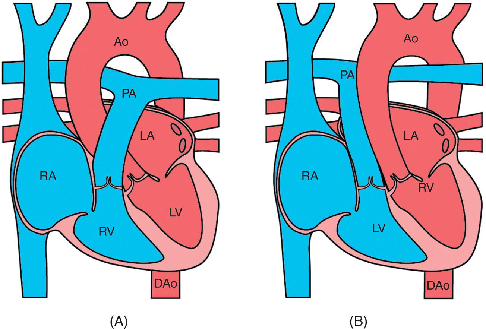

[**Figure 29.18**](#R_c29-fig-0018) Congenitally corrected transposition of the great arteries (ccTGA). (A) Normal anatomy. (B) ccTGA – blood flow in corrected transposition. Ao, aorta; PA, pulmonary artery; LA, left atrium; RA, right atrium; RV, right ventricle; LV, left ventricle; DAo, descending aorta.

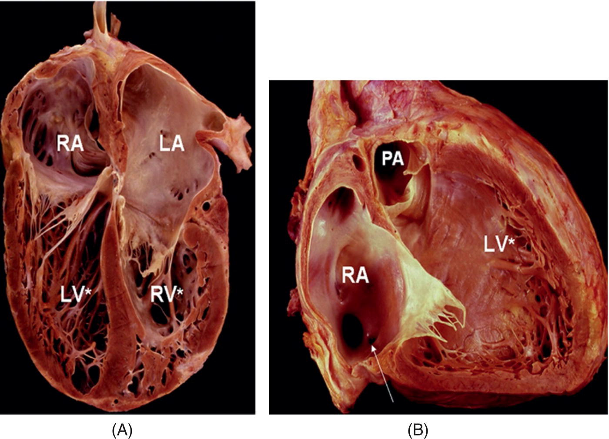

[**Figure 29.19**](#R_c29-fig-0019) Anatomic section of heart from a patient with ccTGA. (A) Four‐chamber view with the right AV valve located cephalad to the AV valve. (B) Long‐axis view with the arrow pointing to the coronary sinus ostium. Note a relatively thin and indistinct Eustachian ridge separating the CS from the inferior vena cava. AV, atrioventricular; ccTGA, congenitally corrected transposition of the great arteries; CS, coronary sinus; LA, left atrium; LV, morphologic left ventricle; PA, pulmonary artery; RA, right atrium; RV, morphologic right ventricle.

(Source: Bottega et al. \[152\]. Reproduced with permission of Elsevier.)

A VSD is present in approximately 70% of patients and is most commonly the result of malalignment between the atrial septum and the inlet of the ventricular septum, although defects can be found anywhere in the ventricular septum. LVOTO occurs in over 50% of patients and is nearly always associated with a VSD. Subpulmonary/valvular stenosis is the most frequently occurring manifestation of LVOTO and is usually due to posterior deviation of the conal septum or AV valve tissue. Isolated pulmonary valve stenosis is rare. Tricuspid valve abnormalities occur in >90% of patients, although this will result in functional consequences in approximately half of the patients \[153\]. The valve is described as “Ebstein‐like.” Posterior and septal leaflets are tethered to the posterior RV wall which tends to limit the long‐term functional reliability of the tricuspid valve in the systemic circulation. In contrast to an Ebstein’s anomaly, apical displacement of the valve leaflets with ensuing arterialization of the right ventricle is rare.

The AV node position is abnormal and is located between the orifice of the RA appendage and the mitral valve annulus, rather than at the apex of the triangle of Koch. Many patients also have dual AV nodes. As a consequence of the AV node abnormality, disturbances of the AV conduction system are common and thought to be secondary to fibrosis of the junction between the AV node and the AV conduction system \[155\]. Complete heart block is the most common resulting arrythmia, with a progressive incidence of 2% per year \[68\].

#### Coronary anatomy in ccTGA

The coronary artery anatomy in ccTGA is a mirror image of the normal anatomy. The artery originating from the right‐sided sinus gives rise to the left anterior descending (LAD) and the circumflex artery, thus being considered the morphological left coronary artery. Originating from the left‐sided sinus, following the left AV groove and supplying the right ventricle is the morphological right coronary artery.

* * *

### KEY POINTS: ASSOCIATED ANOMALIES IN CCTGA

-   Common anomalies associated with ccTGA can be summarized as follows:
    -   Perimembranous or malaligned VSD (50–80%)
    -   Tricuspid valve abnormalities (25–90%)
    -   Multilevel LVOTO (50–70%)
    -   Dextrocardia (25%) with/without situs inversus
    -   Interruption or abnormally situated conduction pathway

* * *

### Natural history

Isolated ccTGA is a variable lesion, and its natural history is dependent on three main factors: RV function, tricuspid valve function, and the development of arrythmias. The RV is intended to support the low‐pressure pulmonary circulation and is poorly adapted at sustaining the systemic load. While patients without associated cardiac lesions are asymptomatic in early life, over the course of a normal lifespan, heart failure is a common long‐term complication.

Twenty‐five percent of patients with isolated ccTGA develop congestive heart failure (CHF) by the fourth decade, which increases to 67% in patients with associated cardiac lesions \[156\]. The risk factors of heart failure in ccTGA relate to advancing age, presence of associated cardiac abnormalities, tricuspid regurgitation, significant arrythmias, tricuspid valve surgery, pacemaker implantation and open‐heart surgery \[156, 157\]. The long‐term systemic workload of the RV leads to tricuspid regurgitation, resulting in RV volume overload, in turn accelerating ventricular dysfunction and failure \[158\]. It is also suspected that abnormal perfusion plays a major role in the development of progressive RV dysfunction, due to a single coronary artery supplying the systemic ventricle \[159\].

### Pathophysiology

In ccTGA, the TGA is physiologically corrected, giving rise to a normal series circulation where deoxygenated blood is oxygenated in the lungs prior to entering the systemic circulation. The morphological LV is the pulmonary ventricle and empties deoxygenated blood into the PA; the LA receives oxygenated blood from the pulmonary veins, which enters the aorta via the morphological RV.

This creates a unique pathophysiological condition in which the morphological right ventricle (RV) sustains systemic circulation from birth. As the RV is not designed to withstand systemic pressures over the course of a normal lifespan it must undergo various adaptive mechanisms to support the systemic load, including eccentric hypertrophy, fibrosis, and dilatation of the RV \[160\]. Right ventricular dysfunction will eventually occur, with heart failure as a common long‐term complication. Tricuspid regurgitation is strongly associated with RV dysfunction and CHF; its mechanism is thought to be multifactorial. Due to exposure of the RV to systemic pressure, the ventricular septum bows towards the LV, resulting in a spherical RV shape. This pulls the septal attachments of the TV away from the annulus, resulting in progressive tricuspid regurgitation and exacerbating the volume overload on the systemic and morphologic RV. In addition, the TV is frequently dysplastic (most commonly the Ebstein‐type abnormality), with this group more likely to develop significant TR and ventricular dysfunction earlier in life \[161\]. Late RV dysfunction will be compounded by chronic microvascular ischemia and inadequate perfusion via the single coronary artery supplying the hypertrophied mass of the RV \[161\].

### Clinical presentation and diagnostic features

The majority of patients with ccTGA are diagnosed postnatally. While ccGTA may be detected on prenatal fetal ultrasound, particularly in specialized centers, diagnosis remains challenging, especially when associated defects are not present \[162\].

Timing of post‐natal presentation is dependent on the presence and nature of associated cardiac abnormalities. Isolated ccTGA is very unusual, only occurring in <10% of patients. These patients are initially asymptomatic but may present in adult life with symptoms of tricuspid (systemic) valve regurgitation, conduction disturbances, impaired systemic ventricular function, and CHF \[163\]. Complete heart block is the most common arrythmia with symptoms of chest pain, fatigue, dyspnea, and poor exercise tolerance. Tricuspid valve regurgitation and impaired systemic ventricular function will present with signs of heart failure, including fatigue, reduced exercise tolerance, dyspnea, and peripheral edema.

The majority of patients have concomitant cardiac abnormalities and will present with signs or symptoms associated with the pathophysiology of these lesions:

-   **VSD** – may present with a systolic murmur or signs of heart failure.
-   **LVOTO** – Cyanosis may be a presenting feature in patients who have a VSD and severe LVOTO due to decreased pulmonary blood flow and a large pulmonary‐to‐systemic ventricular shunt.
-   **Tricuspid valve abnormality** – may present with signs of right heart failure or respiratory distress, cyanosis or a systolic murmur.

#### Diagnostic testing

**ECG** – Q waves present in the right precordial leads, but absent in the left precordial leads are characteristic of ccTGA due to inversed septal depolarization due to ventricular inversion i.e., from right to left. Patients may also present with complete heart block due to disturbances of the AV conduction system. Complete heart block may even be detected antenatally, raising clinical suspicion of ccTGA.

**CXR** – ccTGA with levocardia may result in prominence of the upper left border of the mediastinum. Presence of mesocardia or dextrocardia may raise clinical suspicion of ccTGA.

**Echo** – Echocardiography is a reliable method for diagnosis of ccTGA and the presence of associated anomalies. The four‐chamber apical view will show the more trabeculated morphological RV on the left and the smoother walled morphological LV on the right.

**Cardiac MRI** – Cardiac MRI is commonly used to further evaluate these complex lesions and is able to provide detailed information about anatomy as well as quantitative assessment of function and flow. Cardiac catheterization is reserved for assessment of those patients who have pulmonary vascular occlusive disease and is frequently carried out in conjunction with cardiac MRI to give detailed information about PVR.

* * *

### KEY POINTS: CCTGA

-   ccTGA is a rare defect with AV and VA discordance.
-   The TGA is physiologically corrected and has normal series circulation where blood is oxygenated in the lungs before entering the systemic circulation.
-   The morphological RV is the systemic ventricle.
-   There is a high incidence of associated cardiac anomalies, in up to 98% of patients.
-   Age at presentation and natural history depend on the combination and severity of associated defects.
-   Surgical repair is either physiologic or anatomic.

* * *

### Surgical options

Surgical treatment options have been available for over 50 years, but optimal surgical management of ccTGA remains controversial. Surgical strategies are divided into “physiological repair” (the morphological RV remains as the systemic ventricle) or “anatomic repair” (creating atrioventricular concordance with the LV and mitral valve acting as the systemic ventricle and AV valve.) The first surgical repairs for ccTGA were “physiologic” and performed by Anderson and Lillehei in 1957. In the past two decades, anatomic repair has been considered a better option despite its more complex nature due to the unfavorable long‐term outcomes of physiological repair (50% mortality at 20 years) \[164\].

The diverse anatomy of this lesion leads to a significant variance in symptoms and timing of presentation requiring a broad range of treatment options ([Figure 29.20](#c29-fig-0020)). Due to its rarity and the lack of robust data on long term outcomes, comparisons of treatment pathways is made difficult, and decision‐making for the surgical management of ccTGA is challenging. The choice of surgical approach will depend on the anatomic features, the patient’s age at presentation and severity of symptoms. Center and surgeon preference will also have an impact, given that ccTGA is a rare lesion, consequently most surgeons will not have the opportunity to operate on large numbers of patients; the learning curve for such complex operations is an important consideration. Current data suggests that early anatomic repair is the preferred strategy for the majority of children, with prompt LV banding if required. For patients with a balanced anatomy and no evident dysfunction, expectant management is a viable strategy with transition to other pathways if nonintervention fails \[165\].

There are numerous surgical approaches for anatomic variations involving ccTGA. These can be classified into three categories according to which ventricle is the designated post‐repair systemic ventricle:

-   Systemic right ventricle
    -   Classical (physiologic) repair
    -   Isolated tricuspid valve repair/replacement
    -   Multisite pacing
-   Systemic left ventricle
    -   Senning – ASO (double switch procedure)
    -   Senning – Rastelli
-   Systemic left and right ventricle
    -   Fontan operation

#### Physiologic repair

Physiologic repair in ccTGA consists of repair of the associated cardiac defects while maintaining the morphological right ventricle as the systemic ventricle. It addresses VSD closure, relief of LVOTO, conduit insertion, valvular repair or replacement and pacemaker insertion. Recent data suggests that patients with physiological repair have equivalent short and midterm survival compared to those with anatomic repair \[165\]. Despite this, physiologic repair appears to be compromised in mid‐term outcomes, with progressive RV dysfunction irrespective of TV interventions from 12 years post repair. Overall survival after physiologic repair was 71 vs 80% for anatomic repair at 15 years. In addition to this, interventions to reduce TV regurgitation did not reduce systemic ventricular failure or result in survival benefit \[165, 166\]. It is noteworthy that these patients also had the highest frequency of transplant among the treatment pathways, indicating that once the systemic ventricle starts to decline there are limited successful treatment options. After physiological repair, close follow‐up is required to monitor tricuspid valve function, with early surgical intervention required to repair or replace the TV prior to progressive systemic ventricular failure. Risk factors for poor outcomes include tricuspid valve replacement, preoperative RV dysfunction, complete heart block postoperatively subvalvar PS and “Ebstein‐like” abnormity of TV.

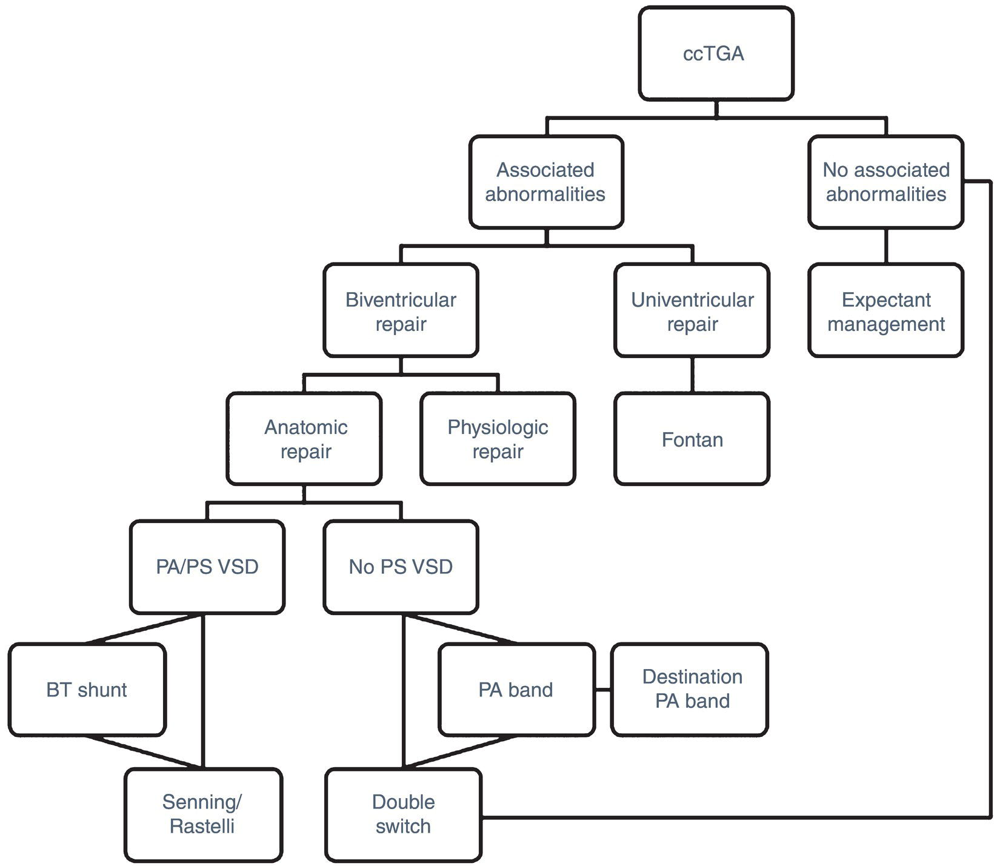

[**Figure 29.20**](#R_c29-fig-0020) Flowchart illustrating anatomical factors determining decision‐making in patients with congenitally corrected transposition of the great arteries (ccTGA). PA, pulmonary atresia; PS, pulmonary stenosis; VSD, ventricular septal defect; BT shunt, Blalock‐Taussig shunt; PA, pulmonary artery.

Despite these limitations, the physiologic operative approach may still be useful in highly selected cases. Patients with good right ventricular and tricuspid valve function, balanced ventricles, and favorable septation anatomy may be suitable candidates. This is especially the case if a relative contraindication to anatomic repair exists, such as poor mitral valve function, coronary anomalies, small atrium, dextrocardia or inlet VSD features \[154\].

#### Anatomic repair

The anatomic repair involves creating AV and VA concordance, ensuring the morphological left ventricle is supplying systemic circulation. Blood is redirected at the atrial level using a Mustard or Senning technique and at the great arteries via the ASO or ventricular level using the Rastelli operation. ASO and Senning procedure (double switch) was first performed in the late 1980s by Imai, Yagihara, Mee, and others \[154, 167, 168\]. A decade later, Ibawi described an atrial repair in combination with the Rastelli operation for cases of ccTGA with LVOTO and since then, anatomic repairs of both varieties have had a prominent place in the management of ccTGA. Patients will require balanced ventricles and a morphological LV that is capable of maintaining the workload of the systemic circulation. The LV will decondition quickly after birth in patients without pulmonary outflow obstruction or an unrestricted VSD, requiring LV “training.” A PA band is placed to increase the afterload of the morphological LV increasing wall thickness \[169\]. The PA band will also alter the LV/RV pressure ratio, reducing the spherical shape of the RV thus stabilizing tricuspid valve regurgitation \[170\]. Varying measures are used to ascertain when the LV is ready, it is suggested that a LV‐to‐RV peak systolic pressure ratio of 0.70 to 0.90 is optimal \[171\]. Repeat banding may be required to ensure the band is tight enough to adequately train the LV \[172\]. Periodic assessment by echocardiography, cardiac catheterization, or MRI is used to determine whether adequate training been achieved in advance of anatomic repair. LV training is most successful in younger children, as myocardial response to increased afterload changes from hyperplastic to hypertrophic with increasing age \[173\].

Patients with a large VSD, LVOTO (subpulmonary or pulmonary stenosis) or pulmonary hypertension expose the morphological LV to systemic pressures from birth, retaining LV mass, and are suitable for primary anatomic repair. An anatomic repair is the preferred approach in patients with good mitral valve function, balanced ventricles and a septatable heart. Patients with poor RV or TV function would also be candidates for this type of repair as physiologic repair in these patients almost always has an unfavorable outcome.

#### Double switch procedure

The double switch (DS) procedure incorporates an atrial (Mustard or Senning procedure) and an ASO, creating VA and AV concordance. It can be simplified as a three‐step procedure.

First, the VSD is closed. Second, the great arteries are switched to their respective ventricles (similar to the ASO performed for D‐TGA) and coronaries re‐implanted, creating VA concordance. As with the ASO for d‐TGA, the identification of coronary anatomy is fundamental to optimal surgical outcome. The mitral valve and the morphological LV become the systemic AV valve and ventricle, and the tricuspid valve and morphological RV become the pulmonary AV valve and ventricle.

Last, the Mustard or Senning part of the operation creates an intracardiac baffle which redirects deoxygenated blood from the RA to the morphological RV via the tricuspid valve, emptying into the neo‐pulmonary artery to the lungs. Similarly, the oxygenated blood from the LA is redirected to the LV creating AV concordance. This procedure is appropriate where patients have deteriorating systemic ventricle dysfunction, in the presence of systemic (tricuspid) valve regurgitation. Good LV function and minimal LVOT (pulmonary arterial) obstruction is a prerequisite for this type of surgical repair. Decision‐making around surgical timing and patient readiness is complex. Surgical timing is dictated by the severity of CHF symptoms, which is determined by the size of VSD and presence of tricuspid regurgitation ([Figure 29.21](#c29-fig-0021)). The larger the VSD, the more likely that the LV will retain sufficient mass, however, it increases the risk of developing CHF and hence pulmonary hypertension. A PA band can be placed in these patients to minimize pulmonary over‐circulation, reducing symptoms of CHF until the child is an adequate weight prior to surgical repair. This is of particular importance due to the technically challenging nature of the operation.

#### Senning and Rastelli

The combination of the Senning and Rastelli procedures (SR) has been undertaken in patients with ccTGA that have a VSD and significant LVOTO. It involves an atrial level switch (Mustard or Senning procedure) and a Rastelli operation. During the Rastelli operation the VSD is closed with a patch that directs blood to the aorta and a valved conduit is placed between the RV to PA.

Timing of surgery depends on the degree of pulmonary stenosis and cyanosis. Patients with severe pulmonary stenosis or pulmonary atresia require a systemic to pulmonary shunt (e.g. modified BT shunt). The Rastelli procedure can then be performed once the child has outgrown the shunt, which usually happens at around 6 months of age. Patients with less severe pulmonary stenosis may wait until cyanosis develops but should be performed prior to systemic ventricular failure or tricuspid regurgitation occurs.

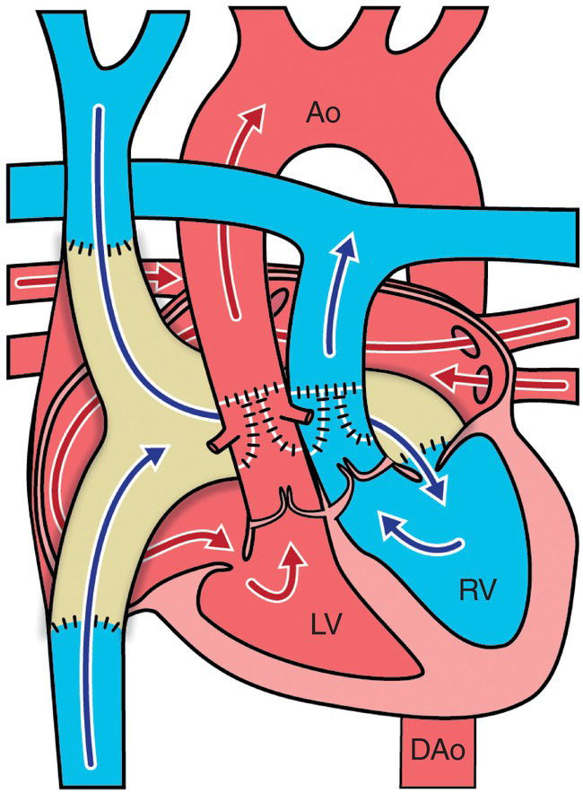

[**Figure 29.21**](#R_c29-fig-0021) “Double switch” operation: Mustard operation with the arterial switch procedure. Ao, aorta; LV, left ventricle; RV, right ventricle; DAo, descending aorta.

#### Fontan procedure for ccTGA

The use of the Fontan operation as a treatment pathway for ccTGA is controversial. Patients unsuitable for a biventricular repair due to single ventricle physiology (tricuspid atresia) or large VSDs not amenable for septation, are clear candidates for Fontan palliation. However, there is variation in treatment pathways between centers, with patients with Ebstein anomaly, for example, directed to Fontan in some centers and to septation by others. Despite some hesitancy to proceed with a Fontan pathway in potentially septatable, biventricular hearts, there is data to suggest that it compares favorably to physiological biventricular repair \[154\]. Data regarding the outcome of Fontan vs. other repairs in patients with ccTGA remain limited, but good outcomes in patients with a single ventricle or AV valve support its use in certain patients \[165\].

### Outcomes

From the most current data, anatomic repair offers the best long‐term outcomes although it is still unclear which patient cohort will benefit the most ([Table 29.6](#c29-tbl-0006)). Early and midterm survival is between 80–85%, with no apparent difference in survival between the DS and SR group \[174, 175\]. Despite significant early and late interventions, overall survival is approximately 80% at 10 years post anatomic repair \[165, 175\].

Anatomic repair is based on the principle that long‐term outcome is improved when the LV is the systemic ventricle, consequently late LV dysfunction is of particular concern. Late LV dysfunction occurs in approximately 15% of patients after anatomic repair, with a higher risk after the double switch than Rastelli‐Senning procedure \[175\]. This may be due to the increased risk of deterioration of the LV in patients who required LV training \[169\]. Increased age and the need for pacing are also risk factors for late LV dysfunction, suggesting that early anatomic correction and primary cardiac resynchronization therapy in patients requiring a pacemaker, may reduce the risk of developing late LV failure \[176\].

[**Table 29.6**](#R_c29-tbl-0006) Long‐term outcomes after anatomic repair for congenitally corrected transposition of the great arteries

| Outcome | Incidence |
| --- | --- |
| LV dysfunction | 15–20% |
| Post‐op complete heart block | ~30% |
| Neo‐aortic valve regurgitation (mild) | 70% |
| Baffle complications | Unknown, 15–50% after d‐TGA |
| Reintervention rate | 25% |

Conduction abnormalities are common in patients with ccTGA due to abnormal anatomy of the conduction pathway with the risk of complete heart block occurring with a progressive incidence of 2% per year \[68\]. Post‐operative CHB occurs in ~30% of patients, with some data to indicate that it is more common in the DS group especially when VSD closure is required \[175, 177\]. Centers have been known to advocate for permanent pacemaker lead insertion intra‐operatively due to the high risk of heart block associated with ccTGA. Mustard and Senning operations are associated with a significant risk of atrial tachyarrhythmias, which can contribute to LV dysfunction from loss of atrial contraction. Catheter ablation has been used to successfully treat tachyarrhythmias in such patients \[178\].

Around 70% of patients after DS have at least mild aortic insufficiency (AI). Despite this, mild AI is well tolerated in the majority of patients and does not appear to correlate with morphological LV dysfunction \[175\]. Previous PA band and use of LeCompte maneuver in side‐by‐side vessel arrangements may also predispose to AI post‐operatively \[179\].

Despite the Senning procedure being the most commonly used atrial switch technique, there remains no clear data on its long‐term advantages over the Mustard technique; both are associated with baffle‐complications including stenosis, residual leaks and atrial arrythmias \[90\]. There is little data on baffle complications after ccTGA; hence, data is inferred from adults after D‐TGA repair. One long‐term follow‐up study showed significant morbidity and mortality after the Mustard procedure for d‐TGA and a reintervention rate of nearly 50% \[180\]. Data in patients with a Senning atrial switch in ccTGA have shown an 11% re‐intervention rate for baffle complications. Most baffle complications can now be effectively managed with transcatheter techniques, thus minimizing the need for re‐operations \[181\].

Approximately 25% of patients require some form of re‐intervention after anatomic repair. Aortic valvular and pulmonary artery interventions were the commonest reinterventions in the double switch group \[175\]. In the SR group, conduit modifications were the most often required predominantly due to stenosis, calcification, or the need for conduit augmentation \[182\].

* * *

### KEY POINTS: SURGICAL OPTIONS

-   RV systemic ventricle after surgery
    -   Classical (physiologic) repair
    -   Isolated tricuspid valve repair/replacement
-   LV systemic ventricle after surgery
    -   Senning and ASO (double switch procedure)
    -   Senning and Rastelli
-   Systemic LV and RV
    -   Fontan operation

* * *

## Anesthetic considerations and perioperative management

### Preoperative assessment

The main perioperative risks in patients with ccTGA are tricuspid valve regurgitation, RV dysfunction, congestive cardiac failure, and rhythm abnormalities, including heart block. The pre‐anesthetic visit should focus on identifying and risk‐stratifying the presence of these, by carefully assessing the patient in terms of history, examination, review of the clinical notes, laboratory results and review of echocardiography, cardiac MRI, and cardiac catheterization. A detailed understanding of what the cardiac defects are, the presence and degree of LVOTO, and the presence of pulmonary vascular occlusive disease and its response to pulmonary vasodilators is vital. History and examination should focus on elucidating symptoms and signs of CHF, systemic valve regurgitation and the presence of cyanosis. Prior procedures such as pacemaker insertion or PAB placement should be noted. Review of the ECG for rhythm and conduction assessment and echocardiography will establish ventricular mass and function as well as systemic AV valve competency. Ventricular mass of the morphological LV is particularly important mainly to check that the LV mass is adequate to become the systemic ventricle. Occasionally a PAB is placed for that purpose and its outcome has to be reviewed.

Induction and maintenance of anesthesia follow the principles highlighted in the section on pathophysiology of ccTGA above. These children may be compromised with little cardiac reserve, so induction has to be tailored to the specific child and the situation. Invasive intraoperative monitoring (arterial line, central venous pressure, and TEE) is necessary, as well as preparation for anesthesia on CPB, as reviewed earlier. Occasionally, preinduction invasive arterial monitoring is indicated, and ability to institute CPB emergently should be available. In the presence of systemic AV valve regurgitation and systemic RV dysfunction, the aim should be to decrease RV pressure load. Care should be taken to control arterial blood pressure and prevent sudden increases in response to intubation or surgical stimulation. At the end of the procedure, TEE should be used to detect residual defects, assess biventricular and valvular function, and evaluate neo‐aortic valve regurgitation.

### Postoperative course and complications

These children are not candidates for early extubation and will be admitted to intensive care postoperatively for stabilization; therefore, all the invasive monitoring should remain in situ and sedation established. Intracardiac lines measuring right and left atrial pressures are useful in evaluating RV and LV function for management and inotrope titration. In a small proportion of patients in whom the LV fails to function as the systemic ventricle, ECMO, or ventricular assist device might be required as a bridge to recovery.

## Selected references

_A full reference list for this chapter is available at_: [http://www.wiley.com/go/andropoulos/congenitalheart](http://www.wiley.com/go/andropoulos/congenitalheart)

1.  10 Villafane, J., Lantin‐Hermoso, M. R., Jenkins, K. J., et al. D‐Transposition of the great arteries: the current Era of the arterial switch operation. J Am College Cardiol 2014; 64(5):498–511. An excellent summary of “hot topics” by a team of experts on current knowledge of D‐TGA including genetics, pre‐natal diagnosis, surgical timing, balloon atrial septostomy, intraoperative techniques, coronary obstruction, neoaortic regurgitation and dilation, neurodevelopmental issues, and lifelong care of D‐TGA patients.
2.  14 Chiu IS, Anderson RH. Can we better understand the known variations in coronary arterial anatomy? Ann Thorac Surg 2012; 94:1751–60. An excellent review with high‐quality illustrations and figures presenting the myriad variants of coronary artery anatomy and organizing them in a clear scheme.
3.  21 Rudolph AM. Congenital diseases of the heart: clinical‐physiological considerations, (3rd edn.) Chichester, England: Wiley‐Blackwell, 2009. Detailed description of intercirculatory mixing in different D‐TGA morphologies.
4.  37 Rashkind WJ, Miller WW. Creation of an atrial septal defect without thoracotomy: a palliative approach to complete transposition of the great arteries. J Am Med Assoc 1966; 196:991–2. The classical paper describing the rationale, technique, and outcomes for the balloon atrial septostomy, a procedure that continues to be performed in a significant number of transposition patients to this day.
5.  50 Sarris GE, Balmer C, Bonou P, et al. Clinical guidelines for the management of patients with transposition of the great arteries with intact ventricular septum. Cardiol Young 2017; 27(3):530–69. Comprehensive guidelines by The Task Force on Transposition of the Great Arteries of the European Association for Cardio‐Thoracic Surgery (EACTS) and the Association for European Paediatric and Congenital Cardiology (AEPC). The guidelines are intended to facilitate safe and effective perioperative care based on review of the published evidence.
6.  58 Lim JM, Porayette P, Marini D, et al. Associations between age at arterial switch operation, brain growth, and development in infants with transposition of the great arteries. Circulation (New York, N.Y.) 2019; 139(24):2728–38. Study looking at risk factors for brain injury and outcomes in 45 infants after ASO demonstrating surgery beyond 2 weeks of age is associated with impaired brain growth and slower language development.
7.  72 Fricke TA, Buratto E, Weintraub RG, et al. Long‐term outcomes of the arterial switch operation. J Thorac Cardiovasc Surg 2021; 163(1):212–9. A large single‐center experience with 844 patients reporting long term outcomes after ASO from 1983 to 2015. Overall long‐term outcomes for ASO are good, with excellent late survival and functional status. However, reintervention is common with 15% having at least moderate AR or had undergone neoaortic valve replacement at 25 years.
8.  107 Bellinger DC, Wypij D, Rivkin MJ, et al. Adolescents with d‐transposition of the great arteries corrected with the arterial switch procedure: neurophysiological assessments and structural brain imaging. Circulation 2011; 124:1361–9. A very important follow‐up study from the Boston Circulatory Arrest cohort, demonstrating long‐term neurodevelopmental problems in many of the early arterial switch neonates.
9.  139 Samuel R, Froese N, Betts K, Gandhi S. Intraoperative extubation post arterial switch operation for transposition of the great arteries with intact ventricular septum: a one‐year, single center experience. Semin Thorac Cardiovasc Surg 2021; 33(1):134–40. A small, preliminary retrospective review of intraoperative extubation post ASO for neonates with TGA/IVS, demonstrating it is safe.
10.  165 Barrios PA, Zia A, Pettersson G, et al. Outcomes of treatment pathways in 240 patients with congenitally corrected transposition of great arteries. J Thorac Cardiovasc Surg 2021; 161(3):1080–93. A large retrospective review of 240 patients with ccTGA from the Cleveland Clinic looking at outcomes for different treatment pathways. The study concluded that early anatomic repair fares better than physiologic repair and patients managed expectantly show what appears to be excellent survival. Physiologic repair is compromised by progressive RV dysfunction that escalates at 12 years post‐repair.