CHAPTER 30 Anesthesia for the Patient with a Single Ventricle 

# CHAPTER 30  
Anesthesia for the Patient with a Single Ventricle

_Laura Diaz‐Berenstain1, Rania K. Abbasi2, Lori Q. Riegger3, James M. Steven4, Susan C. Nicolson5, and Dean B. Andropoulos6_

1 Division of Pediatric Cardiac Anesthesiology, Cincinnati Children's Hospital Medical Center, Cincinnati, OH, USA

2 Division of Pediatric Cardiac Anesthesia, Riley Hospital for Children/Indiana University School of Medicine, Indianapolis, IN, USA

3 Congenital Cardiac Anesthesiology, Service Chief, Pediatric Anesthesia, Department of Anesthesiology, Section of Pediatric Anesthesiology, University of Michigan Medical School, Ann Arbor, MI, USA

4 Division of Cardiac Anesthesia, Medical Advisor to the Risk Management Department, Associate Professor of Anesthesia, Perelman School of Medicine at the University of Pennsylvania, Philadelphia, PA, USA

5 Division of Cardiac Anesthesia, Josephine J. Templeton Endowed Chair in Pediatric Anesthesiology Clinical Education, Medical Director, Cardiac Center Operations, Professor of Anesthesiology, Perelman School of Medicine at the University of Pennsylvania, Philadelphia, PA, USA

6 Department of Anesthesiology, Perioperative and Pain Medicine, Department of Anesthesiology, Baylor College of Medicine, Texas Children's Hospital, Houston, TX, USA

* * *

-   [**Introduction**](#head-2-299)
-   [**Hypoplastic left heart syndrome**](#head-2-300)
    -   [Incidence, anatomy, and natural history](#head-3-517)
    -   [Pathophysiology of HLHS](#head-3-518)
    -   [Surgical and transcatheter approaches and outcomes](#head-3-519)
    -   [Anesthetic considerations](#head-3-520)
-   [**Tricuspid atresia**](#head-2-301)
    -   [Incidence, anatomy, and natural history](#head-3-521)
    -   [Pathophysiology of TA](#head-3-522)
    -   [Surgical and transcatheter approaches and outcomes](#head-3-523)
    -   [Anesthetic considerations](#head-3-524)
-   [**Other forms of univentricular hearts**](#head-2-302)
    -   [Double inlet ventricle](#head-3-525)
    -   [Mitral atresia with VSD](#head-3-526)
    -   [Unbalanced complete atrioventricular septal defect](#head-3-527)
    -   [Single functional ventricle with heterotaxy syndrome](#head-3-528)
-   [**Superior cavopulmonary connection**](#head-2-303)
    -   [Surgical procedure](#head-3-529)
    -   [Anesthetic considerations](#head-3-530)
    -   [Outcomes](#head-3-531)
-   [**Fontan completion**](#head-2-304)
    -   [Surgical procedure](#head-3-532)
    -   [Anesthetic considerations](#head-3-533)
    -   [Long term complications and outcomes](#head-3-534)
-   [**Transplantation for single‐ventricle patients**](#head-2-305)
    -   [Heart transplantation](#head-3-535)
    -   [Post‐Fontan heart‐liver transplantation](#head-3-536)
-   [**Non‐cardiac surgery and anesthesia for the patient with a single ventricle**](#head-2-306)
-   [**Summary**](#head-2-307)
-   [**Selected references**](#head-2-308)

* * *

## Introduction

In the early 1970s, Fontan and Baudet \[1\] and Kreutzer et al. \[2\] independently described the operative treatment of tricuspid atresia (TA) that resulted in nearly normal systemic arterial oxygen saturation and normal volume work for the single functional systemic ventricle. This procedure subsequently referred to as the Fontan operation, created a series circulation that requires the single ventricle (SV) to pump fully saturated blood only to the systemic circulation, thereby reducing the pressure and volume work to that of a normal systemic ventricle. Systemic venous drainage passes directly through the pulmonary vascular bed without the benefit of a pumping chamber, and pulmonary vascular resistance (PVR) must be low to maintain the pulmonary circulation and the cardiac output (CO) on which it depends. The principle of the Fontan operation has subsequently been applied to the full spectrum of cardiac lesions with one functional ventricle. Suitable physiology for ultimate palliation with a modification of the Fontan procedure is predicated on appropriately timed and executed staged operations designed for the specific patient’s SV physiology. Essentially, all patients with a single functional ventricle now undergo staged palliation, resulting in the completion of the Fontan circuit at 18 months to 4 years of age. The majority undergoes a neonatal palliative procedure, followed by a superior cavopulmonary connection (bidirectional Glenn or hemi‐Fontan procedure) at 3–6 months of age in all patients. This chapter will initially present these principles by using hypoplastic left heart syndrome (HLHS) as the most common SV congenital cardiac lesion. Tricuspid atresia and other forms of SV lesions will then be discussed. Finally, the growing recognition of the implications and sequelae of the long‐term Fontan circulation, along with management strategies, will be described.

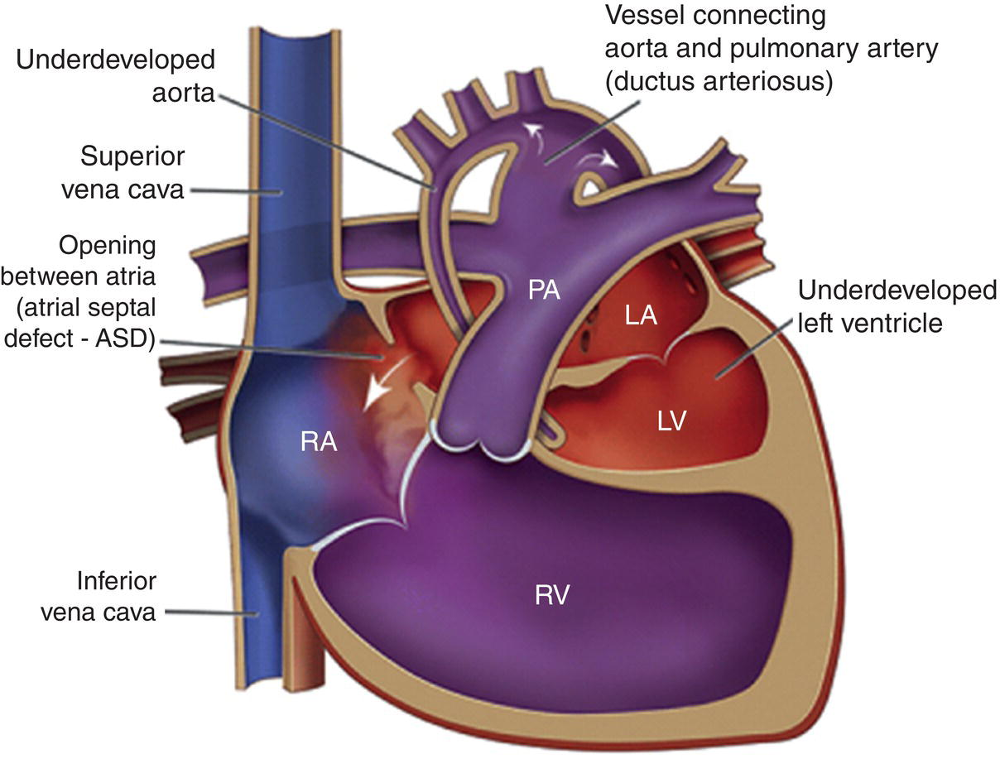

[**Figure 30.1**](#R_c30-fig-0001) Hypoplastic left heart syndrome. This diagram depicts mitral stenosis and aortic atresia. ASD, atrial septal defect; RA, right atrium; RV, right ventricle; LA, left atrium; LV, left ventricle; PA, pulmonary artery.

(Source: Metcalf & Rychik \[6\]. Reproduced with permission of Elsevier.)

## Hypoplastic left heart syndrome

### Incidence, anatomy, and natural history

Hypoplastic left heart syndrome (HLHS) represents the fourth most common defect presenting in the neonatal period and accounts for 7.5% of newborns with congenital heart disease (CHD) requiring early therapeutic intervention. Although the incidence of HLHS is 1.4–3.8% of all CHD, it results in 23% of deaths from CHD within the first week of life and 15% within the first month \[3\]. HLHS has a high heritability component, inherited as a complex trait causing a severe form of valve malformation. Thus, it is important to screen first‐degree relatives of HLHS patients \[4\]. Recent genome sequencing has demonstrated a link between gene defects causing HLHS and those causing cardiomyopathies. Clinically, certain variants associated with these genes could increase the risk of developing myocardial dysfunction in HLHS patients \[5\].

HLHS is characterized by a single right ventricle (RV) and varying degrees of hypoplasia of the left side of the heart. Most commonly HLHS involves either severe aortic stenosis (AS) or aortic atresia (AA), severe mitral stenosis (MS) or mitral atresia (MA), and a very hypoplastic or rudimentary left ventricle (LV) ([Figure 30.1](#c30-fig-0001)) \[6, 7\]. Blood returns normally from the pulmonary veins to the left atrium (LA), but obstruction at the mitral and aortic levels means that the majority of flow must be left‐to‐right across the atrial septum. This causes enlargement and dilation of the right atrium (RA) and RV, which must support the outputs of both the systemic and pulmonary circulations. Blood flows from the pulmonary artery (PA) right‐to‐left through the patent ductus arteriosus (PDA) to the aorta, thus supplying the systemic arterial circulation. Although there may be some antegrade flow through the aortic valve, perfusion of the brachiocephalic vessels, aortic root, and coronary arteries occurs mainly via retrograde flow from the PDA into the ascending aortic arch – a hallmark of HLHS. Some variations of left heart hypoplasia involving the LV, mitral valve (MV), and aortic valve (AV) may be amenable to two‐ventricle surgical repairs and are presented in detail in [Chapter 27](c27.xhtml).

Without intervention, HLHS is uniformly fatal in the first several months of life. As the PDA narrows and closes, diminished blood flow to the systemic circulation and coronary arteries results in a state of circulatory shock resulting in poor perfusion, lactic acidosis, and respiratory failure.

### Pathophysiology of HLHS

A parallel circulation exists in HLHS. Both pulmonary and systemic venous blood mix in the RA, and the RV, via the PA, then supplies both the pulmonary circulation (through the branch PAs) and the systemic circulation (through the PDA). Prostaglandin E1 infusion must be initiated after birth to maintain patency of the ductus arteriosus. Maintenance of a delicate balance between pulmonary (Qp) and systemic (Qs) blood flow is necessary, with the Qp: Qs optimally kept near 1: 1 to maintain adequate perfusion of lungs and body. As pulmonary vascular resistance (PVR) decreases after birth, Qp: Qs increases and may reach 2: 1 or 3: 1. The resultant pulmonary overcirculation at the expense of the systemic circulation generally results in pulmonary interstitial and alveolar edema, tachypnea, and retractions, potentially culminating in respiratory failure. Increases in FiO2 or hyperventilation will further lower PVR and should be avoided. Even more critical is the “steal” effect, in which blood flow is diverted away from the systemic circulation, compromising flow to both the body and the coronary arteries. Cardiogenic shock can ensue, with poor perfusion and increasing lactic acidosis. Steal of flow from the systemic circulation may also result in mesenteric ischemia and necrotizing enterocolitis. Maneuvers to increase PVR are important treatment strategies if steal is suspected. These strategies can include maintaining FiO2 at 0.21 and allowing PaCO2 to rise via spontaneous respiration or by decreasing minute ventilation for mechanically ventilated patients. The former practice of delivering sub‐ambient FiO2 via mechanical ventilation can reduce both systemic and cerebral oxygenation significantly but has been abandoned in favor of maintaining spontaneous respirations preoperatively and early surgical intervention \[8\]. Should the PDA narrow, Qp: Qs increases and systemic perfusion becomes compromised, leading to a cardiogenic shock.

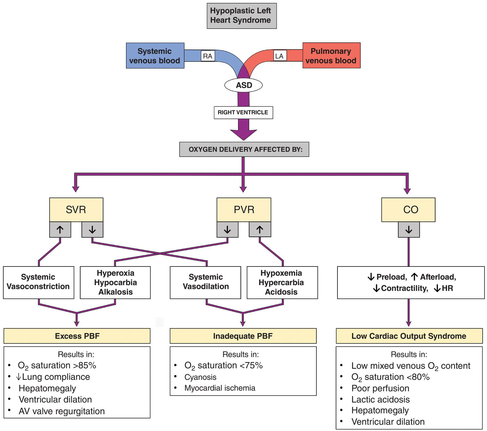

[**Figure 30.2**](#R_c30-fig-0002) Pathophysiology of the functional single systemic ventricle. Optimal oxygen delivery involves maintaining adequate cardiac output while balancing SVR and PVR. SVR, systemic vascular resistance; PVR, pulmonary vascular resistance; PBF, pulmonary blood flow; AV, atrioventricular; HR, heart rate; PCO2, partial pressure of carbon dioxide; PO2, oxygen tension.

Anatomic variables can have a major impact on the observed physiology. If the ASD is restrictive or limited to a patent foramen ovale (PFO), resistance to pulmonary venous return may balance pulmonary and systemic resistances, positively impacting Qp: Qs. Infants who lack that restriction, such as those with a large atrial septal defect (ASD) or unrestrictive anomalous pulmonary venous return, tend to exhibit high Qp: Qs. However, infants presenting with an intact atrial septum and no alternative decompressing vein have severely obstructed pulmonary venous return, leading to left atrial hypertension and an extremely low Qp: Qs. These infants exhibit marked hypoxemia and require intervention to enlarge the atrial communication and decompress pulmonary venous return in order to have any chance of survival. This may be accomplished either via _in utero_ atrial septostomy or immediately after planned delivery in an adjacent operating room (OR) via an _ex utero_ intrapartum treatment (EXIT) procedure \[9, 10\]. Several other factors, including atrioventricular valve regurgitation (AVVR) and hemoglobin level, can also affect the pathophysiology of HLHS. An overview of SV pathophysiology is presented in [Figure 30.2](#c30-fig-0002).

In the current era, the majority of HLHS cases are diagnosed _in utero_ after an abnormal screening ultrasound at 18–22 weeks’ gestation is confirmed by a detailed cardiac examination. Fetal echocardiography can also reveal additional features including limitation of flow across the atrial septum and abnormal pulmonary venous return flow patterns which, if present, can greatly impact risk and survival \[10\]. In the Single Ventricle Reconstruction Trial (SVRT), a multicenter study of over 500 HLHS patients sponsored in the US and Canada by the Pediatric Heart Network of the US National Heart, Lung, and Blood Institute, 76% of HLHS patients were diagnosed _in utero_ \[11\]. As noted, fetal catheter interventions may be attempted for some HLHS patients, either to dilate and stent a restrictive atrial septum or to dilate the aortic valve. An analysis from the International Fetal Cardiac Intervention Registry that examined fetuses with HLHS from 13 institutions between 2001 and 2015 demonstrated a 77% success rate with atrial septoplasty and atrial stent placement procedures. However, complications, including 13% fetal demise, were common \[9\]. Fetal interventions are discussed in detail in [Chapter 19](c19.xhtml).

Although prenatal diagnosis alone has not been demonstrated to improve HLHS survival, late postnatal diagnosis and distance from a cardiac surgical center negatively impact survival, with most mortality occurring before surgical intervention \[12\]. Therefore, prenatal diagnosis and planned delivery in or near a cardiac surgery center may improve survival. Late diagnosis occurs when the PDA narrows and the infant demonstrates clinical signs of low CO and shock, prompting echocardiographic assessment. Emergent resuscitation of the infant, including immediate initiation of a PGE1 infusion, is essential for survival. The magnitude and the type of acquired vital organ dysfunction usually correlate with the degree of circulatory instability at the time of diagnosis. Infants who have suffered a profound or protracted shock state can demonstrate a wide spectrum of injury to renal, central nervous system, cardiac, gastrointestinal, or hepatic systems \[13–15\]. These derangements may necessitate a delay in operative intervention to permit recovery. Because 15–30% of HLHS neonates also have extracardiac anomalies or genetic syndromes such as the CHARGE association or chromosomal abnormalities, a thorough evaluation for these problems should also be performed \[3\].

### Surgical and transcatheter approaches and outcomes

#### Stage I palliation

In 1979, Norwood et al. reported a neonatal palliative operation for HLHS that stabilized native HLHS physiology and eliminated ductal dependence. He later described a Fontan palliation as the second stage operation, resulting in the first long‐term survivors of HLHS \[16\]. The Norwood stage I palliation involves reconstruction of the diminutive ascending aorta, usually with a cryopreserved homograft patch, along with the creation of outflow from the systemic RV through the pulmonary valve, which also provides blood flow to the native aortic root and coronary arteries. The pulmonary valve becomes the “neo‐aortic valve” ([Figure 30.3](#c30-fig-0003)) \[17, 18\]. The main PA is transected, and the proximal portion of the PA is incorporated into the aortic repair while the underside of the PA bifurcation is oversewn. In addition, an atrial septectomy is performed to provide unrestricted left‐to‐right blood flow across the atrial septum. Pulmonary blood flow is then delivered via a polytetrafluoroethylene (PTFE) shunt, either via the creation of a systemic‐to‐pulmonary shunt from the right innominate or subclavian artery to right PA (also termed modified Blalock–Thomas‐Taussig shunt \[mBTTS\]) or by the creation of an RV–PA shunt (also termed the Sano shunt). It is crucial that the area of the anastomosis between the pulmonary valve and the aortic valve is free of obstruction, as it can affect the already tenuous coronary blood flow. The complete removal of any residual ductal tissue to prevent later coarctation of the aorta is also critical. During aortic arch reconstruction, cardiopulmonary bypass (CPB) techniques must provide a bloodless surgical field. Deep hypothermic circulatory arrest (DHCA) or antegrade regional cerebral perfusion (ACP) may be utilized for this purpose. Preference for a particular approach is largely surgeon and institution dependent. Details of each technique along with short‐ and long‐term outcomes are discussed in [Chapter 11](c11.xhtml).

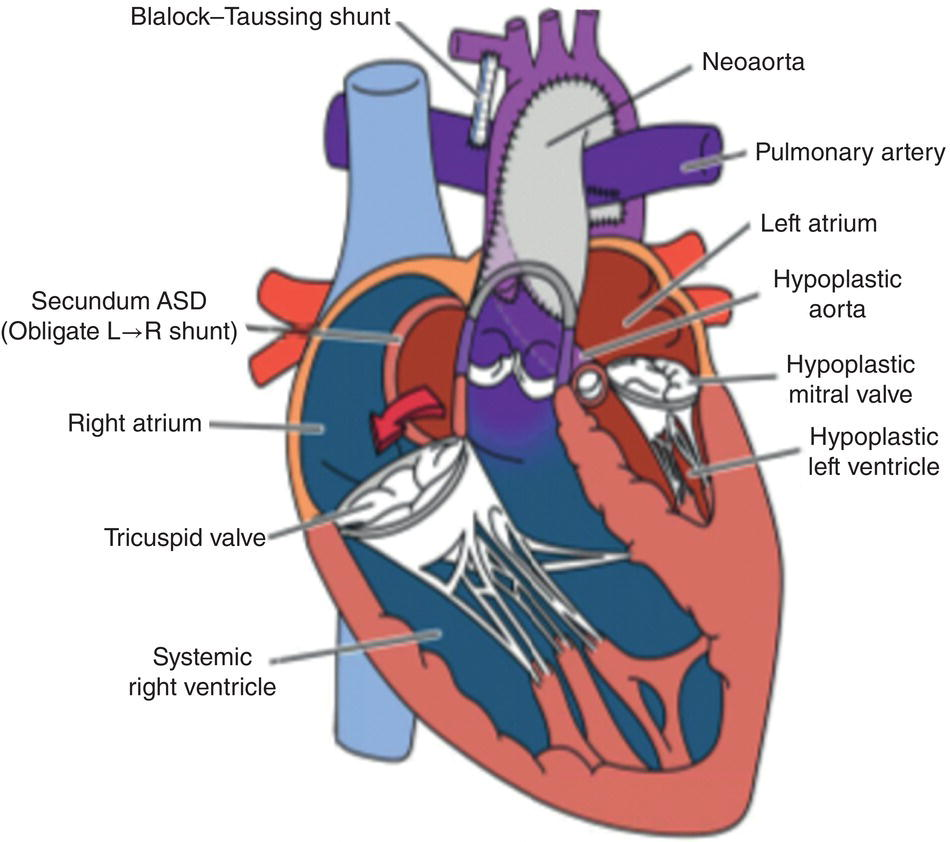

[**Figure 30.3**](#R_c30-fig-0003) Norwood Stage I palliation for hypoplastic left heart syndrome. See text for details.

(Source: Berenstain & Spaeth \[18\]. Reproduced with permission of Cambridge University Press.)

#### Systemic‐to‐pulmonary and RV‐to‐pulmonary shunts

The systemic‐to‐pulmonary artery shunt is a 3.0‐ to 4.0 mm polytetrafluoroethylene (PTFE) graft that provides continuous flow into the PA. Originally described as a modified “Blalock‐Taussig” shunt after surgeon Alfred Blalock and cardiologist Helen Taussig, more recently, it has become identified as a modified “Blalock‐Thomas‐Taussig shunt” to recognize the primary contribution of Vivien Thomas, a surgical technologist, to its successful development and implementation \[19, 20\]. Shunt flow is inversely proportional to the length of the shunt and the fourth power of its radius. It is directly proportional to the pressure drop across the shunt and therefore influenced by the ratio of PVR and systemic vascular resistance (SVR). Kinking or distortion of either the shunt or PA can occur and interfere with the flow. Because there is continuous “run‐off” of flow from the systemic circulation into the PA, these patients remain at risk for steal from the systemic circulation as PVR decreases. This is proposed as the major pathophysiological etiology for the frequent instability observed in the early postoperative period in these patients. In 2003, Sano et al. reported improvement in stage I survival in a small number of patients at one institution when pulmonary blood flow (PBF) was provided by a 5–6 mm PTFE graft from the RV to the PA, rather than via an mBTTS ([Figure 30.4](#c30-fig-0004)) \[18, 21\]. Because the RV–PA shunt arises proximal to the neo‐aortic valve, there is no flow from the aorta into the PAs during diastole, limiting diastolic run‐off and coronary ischemia. The resultant higher diastolic blood pressure has been hypothesized as the physiologic reason for improved survival.

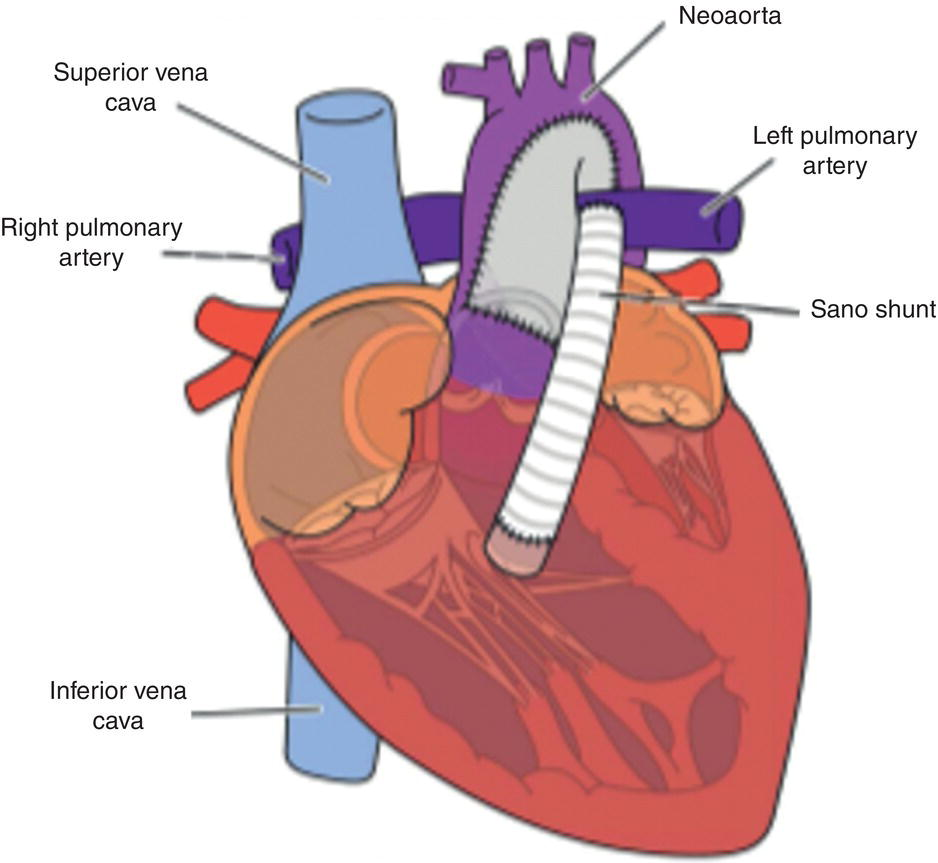

[**Figure 30.4**](#R_c30-fig-0004) Norwood Stage I palliation for hypoplastic left heart syndrome with right ventricle to pulmonary artery shunt (Sano shunt). See text for details.

(Source: Berenstain & Spaeth \[18\]. Reproduced with permission of Cambridge University Press.)

The SVRT was designed to test the hypothesis that stage I survival would improve with the utilization of the RV–PA shunt, with an endpoint of death or transplantation in the first 12 months \[7\]. In all, 555 infants were randomized to receive either an mBTTS or RV–PA shunt. Approximately 10% of subjects required cross‐over from their randomly assigned shunt type to the other shunt type because of anatomic considerations. At 12 months, 36.4% of the mBTTS subjects had died or been transplanted, compared with 26.3% for the RV–PA shunt (_P_ = 0.010). However, overall complication rates in the RV–PA shunt group were higher (72 vs. 46 per 100 infants, _P_ = 0.03), and the number of infants experiencing one or more complications was also greater with the RV–PA shunt (39 vs. 28%, _P_ = 0.03). After 12 months, the hazard ratio for death or transplantation did not differ between the two types of shunts. Follow‐up after 6 years demonstrated slightly higher transplant‐free survival (5%) but an increased need for catheter re‐interventions in the RV‐PA shunt patient group; however, there were no statistically significant differences in the hazard ratio for death or transplantation as well as catheter re‐interventions \[22\]. A recent meta‐analysis of 32 studies by Cao et al. assessed long‐term survival in HLHS with either mBTTS (_n_ = 1348) or RV‐PA shunt (_n_ = 1258). Although the RV‐PA shunt group had significantly higher in‐hospital survival and inter‐stage survival between stage I and II palliation until 2 years post‐stage I palliation, no significant differences in long‐term outcomes between stage II and stage III palliation were identified \[23\]. In contemporary practice, the shunt type used depends largely on the surgeon and institutional preference.

In a publication specifically examining the rate and causes of 30‐day in‐hospital mortality in SVRT subjects, 16% of patients died during the initial hospitalization, with 12% mortality in the first 30 days after Norwood stage I palliation. Although after multivariable analysis shunt type was not identified as a significant risk factor for mortality, the presence of an mBTTS was an independent risk factor for cardiopulmonary resuscitation (CPR). Independent risk factors for both 30‐day and total in‐hospital mortality included low birth weight, genetic abnormality, post‐procedure need for extracorporeal membrane oxygenation (ECMO), and open sternum. Longer duration of DHCA was an independent risk factor for hospital mortality. Independent risk factors for major morbidity (renal failure, sepsis, increased duration of ventilation, and hospital stay) included genetic abnormality, lower center/surgeon volume, open sternum, and additional post‐Norwood operations \[24\].

Inter‐stage mortality occurring after the initial hospitalization for stage I palliation and during the 3–6 months prior to Stage II superior cavopulmonary connection (SCPC) has been a persistent issue. The physiology of the HLHS patients remains tenuous after the initial palliation, as a parallel circulation with all systemic and pulmonary output passing through the single systemic ventricle still persists. The Qp: Qs remains labile, and thus, coronary ischemia continues to be a risk. Significant hemodynamic perturbations may easily result from dehydration due to viral gastroenteritis, upper respiratory infections, or micro‐aspiration episodes caused by a recurrent laryngeal nerve injury that frequently accompanies stage I palliation. In the SVRT, of 426 subjects discharged from the hospital, 50 died inter‐stage (12%) \[25\]. The inter‐stage death rate was greater for mBTTS patients (18%) than for RV–PA shunt patients (6%, _P_ < 0.001). Risk factors for inter‐stage death included gestational age <37 weeks, Hispanic ethnicity, AA/MA, a greater number of post‐Norwood complications, census block poverty level, and moderate to severe AVVR. Ahmed et al. recently developed a validated risk scoring system to predict mortality or transplant in single‐ventricle patients during the inter‐stage period between stage I and II palliation. Between 2008 and 2015, data from over 2,000 patients from the National Pediatric Cardiology Quality Improvement Collaborative Registry were analyzed to create a weighted scoring system. This novel system, known as the NEONATE score, assessed the following independent risk factors: Norwood type (mBTTS or hybrid vs. Sano shunt), postoperative ECMO, opioids required at discharge, no digoxin required at discharge, arch obstruction, ≥ moderate Tricuspid regurgitation, and extra oxygen plus ≥ moderate tricuspid regurgitation at discharge. During the inter‐stage period, the strongest predictor of death or transplant was ≥ moderate tricuspid regurgitation, which worsened if oxygen was required \[26\]. With a combined 28% mortality observed in the SVRT in the inter‐stage period between stages I and II, the challenges of caring for this group of patients are evident. Death after stage II SCPC in the first year of life is less common; the stabilizing effect on the pathophysiology of HLHS (see later) is the most significant factor.

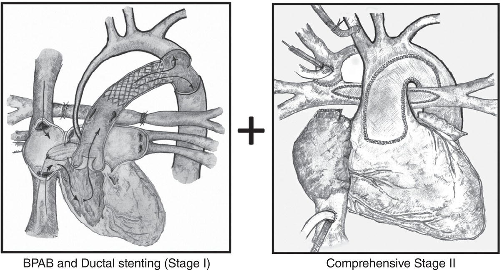

[**Figure 30.5**](#R_c30-fig-0005) Giessen hybrid procedure for HLHS: stage I and stage II. Giessen hybrid procedure consists of bilateral pulmonary artery banding with ductal stenting in the neonatal period and comprehensive stage II procedure in the infancy period. The arrows show the direction of the bloodstream. BPAB, bilateral pulmonary artery banding.

(Source: Yörüker & Akintürk \[33\]. Reproduced with permission of Elsevier.)

#### Hybrid procedure

Despite continuing improvements in the perioperative management of infants with HLHS, specific populations of patients remain at higher risk and demonstrate a more significant level of morbidity and mortality during and after surgical stage I palliation \[27\]. Risk factors include birth weight <2.5 kg, prematurity, ascending aortic size <2 mm, MS/AA anatomy, poor RV function, severe tricuspid regurgitation, restrictive atrial septum, obstructed pulmonary venous return, and the presence of additional cardiac or non‐cardiac anomalies \[28–32\]. Continuing advancements in interventional cardiology techniques have facilitated the development of alternative therapeutic strategies for these subpopulations of patients. Due to the utilization of both surgical and interventional catheterization procedures, these interventions are known as “hybrid” procedures. A hybrid procedure is performed in the catheterization laboratory, OR, or “hybrid” procedure suite. It consists of median sternotomy without CPB, surgical placement of bilateral PA bands, and placement of a stent in the PDA by interventional cardiology via access obtained in the main PA (see [Figure 30.5](#c30-fig-0005)) \[33–35\]. The atrial septum can also be stented if restrictive. Advantages of hybrid procedures include avoiding CPB and/or DHCA in the neonatal period and providing an extended waiting period for infants who require cardiac transplantation or who may be eligible for biventricular repair. The hybrid procedure may also be utilized to delay a planned Norwood operation or as a salvage procedure for patients unsuitable for early Norwood operation \[35\]. The hybrid procedure is further detailed in [Chapter 34](c34.xhtml). Modifications to the hybrid procedure continue to occur as newer devices become available. One such example is the internal self‐expanding flow restrictor, which can be utilized in place of external, surgically placed PA bands, allowing all components of the hybrid procedure to be accomplished in the catheterization laboratory \[36\].

As with surgically palliated patients, inter‐stage mortality continues to be an issue after the hybrid procedure. Close echocardiographic monitoring for tricuspid valve regurgitation and/or RV dysfunction has been advocated, as these can indicate obstruction at the atrial level or through the PDA stent. Re‐interventions in the catheterization laboratory are not infrequently required to relieve such obstructions \[37\]. The most concerning and potentially life‐threatening complication involves the development of reverse or pre‐ductal coarctation, resulting in diminished coronary and cerebral perfusion. This can occur either secondary to uncovered ductal tissue that remains capable of closure or as a result of ductal stent placement. Once recognized, additional retrograde stent placement is utilized to address proximal aortic arch obstruction \[38\].

At the age of 3–6 months, aortic reconstruction, along with removal of the PA bands, ductal and atrial stents, repair of the PAs (if necessary), atrial septectomy, and SCPC, is performed. This is known as a “comprehensive stage II procedure” (See [Figure 30.5](#c30-fig-0005)). Patients subsequently progress to Fontan completion via a surgical approach or placement of a covered stent via catheter intervention \[33, 39\].

While previous small studies demonstrated no significant difference in survival statistics between the hybrid and traditional Norwood stage I palliation \[40–43\], a 2018 meta‐analysis of 14 studies comparing outcomes found that the hybrid group had significantly higher early mortality, reduced 6‐month and 1‐year transplant‐free survival rates, and an increased number of required re‐interventions \[44\]. However, some institutions preferentially perform hybrid procedures with outcomes comparable to those seen with the Norwood procedure \[33, 44, 45\]. According to the Society of Thoracic Surgeons Congenital Heart Surgery Database, 13 out of 100 institutions performed >50% of stage I palliations as a hybrid rather than Norwood procedure between 2010 and 2012 \[46\]. With continuing experience and technical modifications, the hybrid procedure may offer the potential for increased survival opportunity with early avoidance of CPB for certain groups including high‐risk patients, those awaiting cardiac transplantation, and those with the potential for future biventricular repair \[47\].

#### Biventricular repair in borderline HLHS

Given the broad spectrum of pathology observed in HLHS, with LV size ranging from rudimentary to mildly hypoplastic, the best surgical strategy may not always be clear. Patients with “borderline HLHS,” also known as “hypoplastic left heart complex,” or a “borderline LV” often pose particular management challenges, as either single‐ventricle palliation or a biventricular repair may be considered \[48, 49\]. In recent years, strategies to aid in determining which patients may be suitable for biventricular repair have been developed using echocardiographic and cardiac MRI parameters. While the use of these parameters may differ between institutions, mitral and aortic valve Z‐scores (Z‐score is standard deviation; e.g., a ‐2 Z score for a valve diameter is 2 standard deviations below normal for weight or body surface area) of between ‐5 and ‐2 (excluding atretic valves) are typical. Other critical factors include LV end‐diastolic pressure, LV end‐diastolic volume index, LV length and volume, and the degree of endocardial fibroelastosis (EFE) \[50\]. A group of 24 Congenital Heart Surgeons Society institutions studied 320 neonates who underwent either Norwood palliation or biventricular repair, leading to the development of hazard models based on various morphologic and functional characteristics \[51\].

Due to the high risk associated with the primary neonatal biventricular repair, many institutions choose a period of LV recruitment or staged LV rehabilitation, with initial SV palliation. This relieves obstructions and promotes PBF. Other techniques to stimulate LV growth, such as resection of endocardial fibroelastosis (EFE), mitral and/or aortic valvuloplasty, and ASD restriction, are also performed. Additionally, increasing PBF (via an mBTTS plus SCPC versus an RV‐PA shunt) after ventricular septation volume loads the LV and stimulates growth. If these techniques successfully promote adequate LV growth, subsequent take‐down of the SV palliation with conversion to a biventricular repair can occur \[50, 52\].

The success of biventricular conversion or repair is dependent on many factors, including appropriate patient selection and clinical and technical experience. Further evidence comparing long‐term outcomes between biventricular conversion versus progression with single‐ventricle physiology to Fontan completion is still being gathered \[53\].

### Anesthetic considerations

#### Preoperative considerations

The diagnosis of HLHS is most frequently made _in utero_. After an initial assessment, immediate treatment in the delivery room for HLHS patients includes initiation of a PGE1 infusion, placement of umbilical arterial and venous catheters, maintenance of spontaneous ventilation on room air, and transfer to a neonatal or cardiac intensive care unit (ICU). A postnatal transthoracic echocardiogram is performed to confirm the initial diagnosis and provide other crucial anatomic information, including LV size, presence of AVVR, degree of atrial septal restriction, or the presence of anomalous pulmonary venous return. Other less common but important details such as the presence of coronary artery fistulae or sinusoids to the LV should also be assessed. Patients with a restrictive atrial septum may require urgent or emergent intervention, requiring either balloon atrial septostomy or early surgical intervention. Cardiac catheterization is rarely performed for diagnostic purposes, and additional imaging (i.e., computed tomography \[CT\] or magnetic resonance imaging \[MRI\]) is seldom required unless anatomic questions remain. Certain anatomic and physiologic features have been identified as risk factors that may affect outcomes (see [Table 30.1](#c30-tbl-0001)).

[**Table 30.1**](#R_c30-tbl-0001) Preoperative risk factors prior to stage‐1 palliation

Source: Roeleveld et al. \[28\]. Reproduced with permission of Cambridge University Press.

<table border="1"><tbody class="tdcolor6"><tr><td class="left">Mitral stenosis/aortic atresia</td></tr><tr><td class="left">Hypoplastic ascending aorta (&lt;2 mm)</td></tr><tr><td class="left">Restrictive atrial septum</td></tr><tr><td class="left">Obstructed pulmonary venous return</td></tr><tr><td class="left">Greater than moderate tricuspid valve regurgitation</td></tr><tr><td class="left">Pulmonary valve regurgitation</td></tr><tr><td class="left">Age &gt;14 days</td></tr><tr><td class="left">Pre‐maturity</td></tr><tr><td class="left">Low birth weight (&lt;2.5 kg)</td></tr><tr><td class="left">Non‐cardiac congenital abnormalities</td></tr><tr><td class="left">Metabolic acidosis</td></tr><tr><td class="left">Chromosomal abnormalities</td></tr><tr><td class="left">Inotropic support</td></tr><tr><td class="left">Right ventricular dysfunction</td></tr></tbody></table>

The chest radiograph is followed daily to assess the heart size and status of the pulmonary vasculature. Common preoperative laboratory tests include complete blood count, coagulation studies, and blood type and cross‐match, along with the measurement of serum electrolytes, blood urea nitrogen, creatinine, and glucose. In a recent evaluation of standard preoperative laboratory testing for pediatric cardiac surgery patients in the US and Canada by the Congenital Cardiac Anesthesia Society Hemostasis Interest Group, 11 of 12 centers surveyed reported routinely obtaining preoperative testing. However, 83% agreed that only a type and screen and complete blood count were necessary. No centers reported changes in management due to preoperative testing, suggesting that preoperative testing requirements are controversial and subject to institutional preferences \[54\].

Ideally neonatal HLHS patients “self‐regulate” their Qp:Qs prior to stage I palliation, spontaneously breathing with a slightly elevated PaCO2. Diuretics are often used preoperatively to limit blood volume recirculating through the lungs. Nasal continuous positive airway pressure (CPAP) may be helpful to provide positive pressure to relieve respiratory distress and elevate the PVR while maintaining spontaneous respiration. Tracheal intubation and mechanical ventilation are reserved for the most severe cases of respiratory insufficiency or for patients with anatomic variants (e.g., restrictive intra‐atrial communication) that markedly diminish PBF. Early surgical intervention before severe derangements in Qp:Qs ensue is essential to prevent complications.

#### Intraoperative considerations

Neonates presenting for stage I reconstruction (i.e., Norwood procedure with mBTTS or Sano shunt) receive an intravenous (IV) induction of anesthesia with meticulous attention to the hemodynamic consequences of the anesthetic agents selected. Phenylpiperidine‐based synthetic opioids, such as fentanyl, are generally preferred because they blunt the endogenous catecholamine response to noxious stimuli at doses that are usually tolerated hemodynamically \[55–57\]. However, even with these hemodynamically “neutral” agents, larger doses may result in significant cardiovascular changes, such as bradycardia and hypotension. These observations suggest that some endogenous catecholamine release is required in an infant with HLHS to sustain satisfactory hemodynamics. Unfortunately, the threshold narcotic dose that is “sufficient” and not “excessive” varies between patients, necessitating careful titration.

Although clinical research conducted in the early 1990s popularized the view that very high doses of opioid analgesics should be administered perioperatively for stress hormone suppression in neonates undergoing cardiac surgery \[58\], efforts to duplicate these findings have not confirmed the original results \[59\]. The latter demonstrated that very high doses of fentanyl did not completely suppress the release of endogenous catecholamines, even in combination with benzodiazepine infusions. Additionally, outcome measures were no different in any of the study groups. Emerging evidence has demonstrated potential benefits of the use of dexmedetomidine in pediatric cardiac surgery, including neuroprotection as well as improved morbidity and mortality \[60\]. According to data from the Congenital Cardiac Anesthesia Society and Society of Thoracic Surgeons Cardiac Anesthesia Database Collaboration, dexmedetomidine use has steadily increased since 2010 \[61\]. Strategies vary significantly between institutions, with total intraoperative fentanyl doses ranging between 10–100 μg/kg, and the addition of low‐dose volatile anesthetics, benzodiazepines, ketamine, and dexmedetomidine in various combinations described as components of a balanced anesthetic approach to initial palliations for HLHS \[62\]. Most institutions now utilize fentanyl dosages in the lower range, generally <25 μg/kg.

Management of the airway and ventilation assumes great importance during induction of anesthesia. Given the propensity for most neonates with HLHS to have excessive PBF, the anesthesiologist must take care not to employ ventilatory maneuvers that lower PVR, such as hyperventilation or utilization of high inspired concentrations of oxygen (FiO2). In an infant with typical HLHS physiology, manual ventilation should be initiated with room air or a low concentration of supplemental oxygen. The extent to which FiO2 is increased before laryngoscopy should depend upon the magnitude of hemodynamic response to the initiation of controlled ventilation. Infants who demonstrate a significant reduction in systemic arterial pressure despite low FiO2 may not tolerate prolonged exposure to a higher FiO2 without deleterious hemodynamic consequences.

Intraoperative monitoring consists of standard cardiovascular, respiratory, and temperature monitors and continuous direct arterial pressure monitoring. An umbilical arterial line, if present, may be used to preserve other arterial access sites for future interventions. Most centers utilize central venous access as well. An umbilical venous catheter positioned in the orifice of the superior vena cava (SVC) at the time of surgery serves as a valuable monitor of mixed venous oxygen saturation, enabling more precise assessment of systemic CO and Qp: Qs \[6, 63, 64\]. Some institutions may place direct transthoracic atrial lines instead of percutaneous jugular or subclavian central venous pressure catheters due to concern regarding thrombosis in the central thoracic veins in SV patients. However, other institutions have failed to demonstrate the significant risk associated with the use of upper body central venous catheters even in SV patients \[65\]. Peripherally inserted central catheters (PICCs) are increasingly utilized as well. In a 2020 retrospective review of PICC use in pre‐stage II SV patients, only 2 out of 56 patients with PICCs developed detectable thrombus (4%) versus 3 out of 17 patients with central venous catheters (18%) \[66\]. Most centers utilize cerebral and somatic near‐infrared spectroscopy (NIRS) as additional non‐invasive monitors which correlate with SvO2. Cerebral NIRS can be used to guide ACP as it has been shown to detect alterations in CBF in neonates undergoing Norwood stage I palliation \[67, 68\]. The use of cerebral and somatic NIRS in the immediate postoperative period has also been shown to predict early mortality and to highlight the need for ECMO in HLHS patients \[69\]. Transesophageal echocardiography (TEE) is often utilized depending on the size of the neonate and institutional preference. Epicardial echocardiography after CPB can also be utilized and is particularly useful to assess AVVR and neo‐aortic regurgitation.

Measures to clear airway secretions and assure complete re‐expansion of the pulmonary parenchyma are performed in the terminal phases of rewarming on bypass. The magnitude of reduction in the mean systemic arterial pressure that occurs with the opening of the shunt during the terminal phase of CPB can provide qualitative insights into what PVR might be expected in the early post‐CPB period. Initial ventilatory support should be adjusted accordingly. It is best to begin with a FiO2 between 0.6 and 1 and a pattern of ventilation designed to result in low‐normal PaCO2, recognizing that further adjustments will be indicated by the individual infant’s physiology. Assuming a technically satisfactory repair without unusual risk factors, PVR typically falls within the first few hours after surgery. Until then, some patients may potentially require high levels of supplemental oxygen in the immediate post‐CPB period.

While the physiologic goals post‐CPB remain identical to those of the preoperative period, the variables affecting the achievement of these goals differ. The pulmonary circulation now resides either at the distal end of a restrictive prosthetic systemic‐to‐pulmonary shunt or an RV–PA shunt. A variety of subtleties, including technical execution of the shunt, relief of atrial obstruction, and the pre‐existing condition of the pulmonary circulation, can render the ultimate physiology unpredictable. When a Sano shunt has been performed, technical issues of graft insertion, proper graft size (particularly in the neonate <2.0 kg), and the ability to delineate the etiology of insufficient PBF at the termination of CPB can introduce additional complexities.

Even with a perfect technical result, the Norwood operation does not reduce the volume or pressure burden on the SV. Supporting and maintaining the physiology of parallel systemic and pulmonary circulations with a Qp: Qs of 1.0 remain the objective throughout the post‐CPB period. Postoperatively, the heart has incurred the cost of insults related to CPB, cessation of coronary perfusion, and DHCA, which may contribute to the cardiovascular frailty often exhibited in the early postoperative period. However, in the absence of major deficiencies in myocardial protection or persistent anatomic residua, such as significant aortic arch obstruction, coronary compromise, or valvular insufficiency, myocardial dysfunction can usually be addressed with relatively modest doses of inotropic agents and vasodilation. Low dose epinephrine (0.03–0.05 mcg/kg/min) and milrinone (0.25–0.5 mcg/kg/min) are commonly utilized after CPB. Vasopressin infusion may be added as well if necessary. While some clinicians advocate routine use of perioperative milrinone in Norwood procedures, others propose a targeted approach, citing the relatively weak inotropic and lusitropic effects of milrinone compared to its vasodilating properties. There is also conflicting evidence regarding the efficacy of perioperative milrinone in reducing mortality after the Norwood procedure \[70–72\]. In many neonates and young infants undergoing major cardiac interventions, myocardial performance may deteriorate in the first 6–12 hours postoperatively before it begins to improve. As a result, measures to reduce metabolic demands by providing continuous neuromuscular blockade and opioid infusions may be utilized in the immediate postoperative period. The sternum may be left open, covered by SilasticTM or other synthetic material, and stabilized with a plastic strut. This may improve hemodynamic stability as mediastinal edema is frequent in the first several postoperative days. The potentially deleterious effects of positive pressure ventilation are also mitigated. The open sternum also provides access for postoperative mediastinal exploration for bleeding, or the institution of ECMO. Sternal closure can be accomplished at the bedside 24–72 hours postoperatively.

A variety of ultrafiltration techniques, including conventional, modified, zero‐balance, and combination ultrafiltration, may be utilized during and after CPB to improve postoperative hemodynamics. Several studies have demonstrated the beneficial effects of ultrafiltration upon hematocrit, hemodynamics, hemostasis, pulmonary function, and central nervous system recovery \[73–78\]. Perioperative weight gain is significantly reduced, as are the levels of specific inflammatory mediators. Occasionally, the position of the bypass cannulae or the continuous flux of blood through the modified ultrafiltration (MUF) circuit results in unfavorable hemodynamic changes precluding completion of the ultrafiltration. In 99 consecutive patients undergoing stage I palliation between September 2000 and August 2002, all tolerated the hemodynamic perturbations of MUF \[79\]. Clinical outcomes, however, have not consistently been improved and no single method of ultrafiltration has proven superior over others \[73, 80\]. Some institutions routinely place peritoneal dialysis (PD) catheters in the OR, and utilize PD in the early postoperative period for removal of excess interstitial fluid and potentially to remove inflammatory mediators.

Rapid restoration of normal hemostasis is an essential objective in the post‐CPB period, particularly as the creation of the neo‐aorta in Stage I reconstruction requires substantial arterial suture lines, and cyanotic heart disease is a predictor of postoperative blood loss \[81\]. Following the completion of MUF and confirmation of satisfactory technical and physiologic repair, heparin effect is reversed with protamine. Despite the theoretical advantages of fresh whole blood, studies have not demonstrated benefit from this strategy relative to the use of reconstituted whole blood \[82\]. Additionally, fresh whole blood is not available at most institutions. Gruenwald et al. demonstrated that a reconstituted fresh whole blood bypass prime, consisting of packed red blood cells (PRBCs), fresh frozen plasma, and platelets from the same donor, <7 days old, followed by a second such unit given after bypass, reduced bleeding in infants undergoing surgery compared with standard blood component therapy \[83\]. Should these measures fail to achieve adequate hemostasis despite the elimination of most surgical bleeding sites, laboratory testing (platelet count and function, fibrinogen level, and viscoelastic testing) should be conducted to direct component therapy.

Data specifically examining procoagulant medications in infants undergoing stage I reconstruction are sparse. Antifibrinolytic therapies have demonstrated efficacy in infants and children following heart surgery, but data in neonates continues to be very limited \[84–87\]. Although aprotinin, a serine protease inhibitor that acts as an antifibrinolytic agent with anti‐inflammatory properties, demonstrated effectiveness comparable to other antifibrinolytics in infants and children \[88\]; this agent was voluntarily removed from the market when it was linked to greater 5‐year mortality following coronary bypass grafting \[89\]. The lysine analogs epsilon aminocaproic acid and tranexamic acid appear to have comparable efficacy \[84, 87\], and extensive experience implying safety, making them appropriate substitutes for aprotinin \[90\].

Recombinant activated factor VII (rFVIIa) has been used as rescue therapy in infants and children following cardiac surgery, including neonates undergoing stage I reconstruction when conventional correction of postoperative coagulopathy with blood product transfusions fails to control hemorrhage \[91, 92\]. While rFVIIa can aid in controlling intractable bleeding, caution is warranted, as a recent retrospective review of 149 infants and children who received rFVIIa during cardiac surgery demonstrated an increased risk of thrombosis compared to control patients (20% vs. 8%) \[93\]. Another retrospective review of 414 neonates who underwent cardiac surgery found a 22% frequency of thrombosis in patients who received rFVIIa compared to a 6% incidence in patients who did not receive it. In neonates who underwent the Norwood procedure, those who received rFVIIa and developed thrombus had significantly higher mortality and incidence of requiring ECMO \[94\]. Recombinant factor VIIa may be capable of producing a hypercoagulable state that poses risks to certain surgical repair elements, including prosthetic shunts. Prothrombin complex concentrates (PCCs) may pose a similar thrombotic risk and should be used cautiously in patients undergoing stage I palliation. The 2019 patient blood management guidelines from the Network for the Advancement of Patient Blood Management, Haemostasis, and Thrombosis (NATA) for neonates and children undergoing cardiac surgery recommend against the use of PCCs in pediatric cardiac surgery except in clinical trials due to insufficient efficacy and safety data \[95\].

Point‐of‐care viscoelastic tests and transfusion algorithms are increasingly used in pediatric cardiac surgery \[95–97\]. Cyanotic patients, including those with HLHS, are known to have abnormal thromboelastography parameters compared to normal children, with these coagulation imbalances predisposing to both bleeding and thrombosis \[96, 98\]. The development of institution‐specific, target‐population transfusion algorithms may lead to reduced intraoperative transfusions and improved outcomes. However, additional data regarding patients undergoing stage I palliation is needed \[96, 97, 99\]. As PRBC transfusion has been associated with a longer duration of mechanical ventilation and ICU stay in stage I palliation patients \[100\], the Pediatric Critical Care Transfusion and Anemia Expertise Initiative released recommendations regarding red blood cell transfusion in patients with CHD. These recommendations state transfusions should be avoided “solely based upon hemoglobin, if hemoglobin is >9.0 g/dL in infants undergoing staged palliative procedures with stable hemodynamics” \[101\]. Further details of coagulation and bleeding management are discussed in [Chapter 16](c16.xhtml).

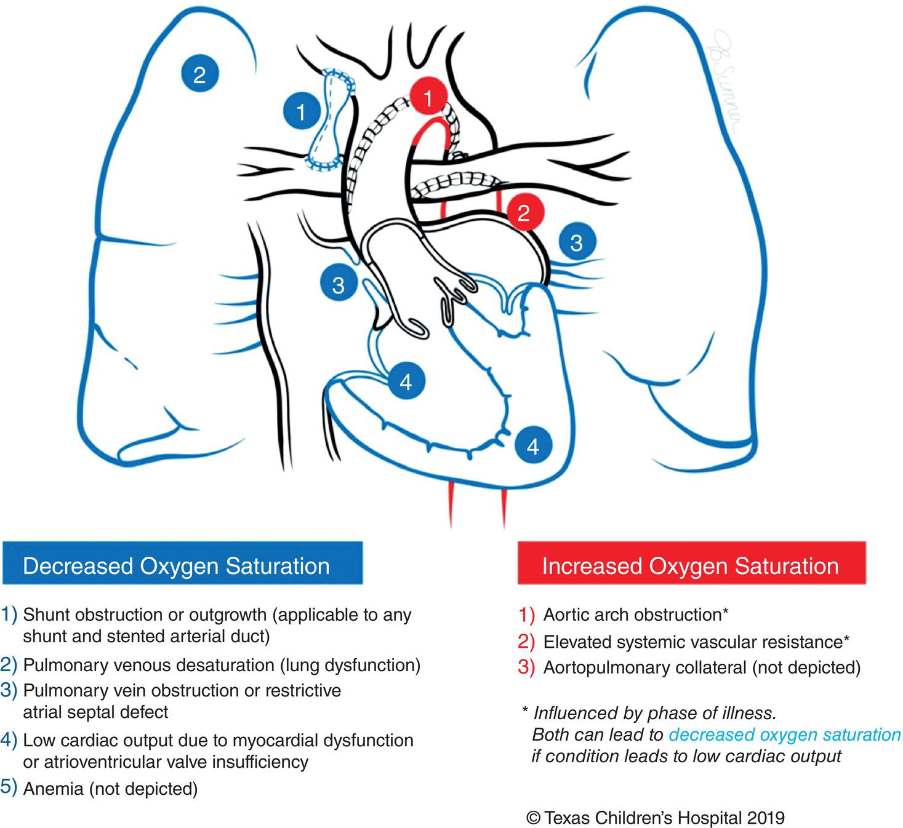

[**Figure 30.6**](#R_c30-fig-0006) Pathophysiology associated with changes in oxygen saturation for shunt‐dependent single ventricle heart defects. The figure illustrates differential diagnoses to consider when oxygen saturation thresholds are breached after Norwood palliation with a modified Blalock‐Taussig shunt for hypoplastic left heart syndrome. Similar pathophysiologic considerations are applicable to the right ventricle to pulmonary artery shunt, hybrid palliation, and other shunt‐dependent single ventricle variants.

(Source: Rudd et al. \[104\]. Reproduced with permission from Texas Children’s Hospital. © 2019 Texas Children’s Hospital.)

#### Postoperative considerations

Excessive hypoxemia represents one of the more commonly encountered problems in the early post‐CPB period. Although inadequate Qp:Qs is often the cause, factors that impair systemic oxygen delivery and reduce mixed venous oxygen saturation can also occur \[63, 64, 102, 103\]. A progressive increase in systemic oxygen saturation is often observed during MUF, likely due to the effect of hemoconcentration and the resulting increased oxygen delivery on mixed venous oxygen saturation. Post‐CPB, measures directed at maintaining the hematocrit above 40–45% may alleviate excessive demands placed upon the recovering heart to increase systemic output. The distinction between systemic hypoxemia due to low Qp:Qs, low pulmonary venous oxygen saturation, or low mixed venous oxygen saturation (SvO2) is crucial as the therapies for each differ. Measures designed to reduce PVR will impose a further volume load on a heart already struggling to provide marginal systemic perfusion. Patients demonstrating low SvO2 are better served with therapies that promote systemic output, such as inotropic agents or vasodilators (see [Figure 30.6](#c30-fig-0006)) \[104\].

Similarly, infants with low pulmonary venous oxygen saturation require a strategy of ventilatory support designed to reduce atelectasis and promote gas exchange in impaired alveoli. Although pulmonary vein desaturation is not the most common cause of persistent systemic hypoxemia after stage I palliation, one series found pulmonary vein desaturation in as many as 30% of patients \[105\]. Unfortunately, this diagnosis is rarely made definitively in the OR or cardiac ICU due to the logistical challenges of blood sampling from the pulmonary veins. Intraoperatively, expectant measures directed at expansion of the lungs and maintenance of normal functional residual capacity (FRC) usually suffice to avoid pulmonary vein desaturation.

When systemic hypoxemia is suspected to be due to low Qp: Qs, other manifestations can provide supporting evidence. A trial opening of the systemic‐to‐pulmonary artery shunt during the latter phases of rewarming on CPB may have failed to demonstrate a significant drop in the mean systemic arterial pressure, and early post‐CPB hemodynamics may have revealed a relatively narrow pulse pressure and/or high diastolic pressure. A substantial discrepancy may exist between arterial and end‐tidal CO2 measurements. These suggestive pieces of inferential evidence can be confirmed by aortic Doppler flow analysis or calculation of a Fick ratio using oxygen saturation determinations. Most commonly, diminished PBF may reflect a subtle technical aspect of the arch reconstruction, innominate artery dimension, or shunt placement. However, specific patient subsets can exhibit profound abnormalities in the pulmonary vasculature that result in excessive PVR elevations. Neonates born with HLHS and severe pulmonary venous obstruction due to intact atrial septum without alternative decompressing veins routinely demonstrate extremely high and volatile PVR. Even the typical HLHS anatomic constellation is associated with marked abnormalities in the number and muscularization of the pulmonary vasculature by pathologic examination. Hypotheses attribute these changes to chronic fetal pulmonary venous obstruction \[106, 107\]. One can speculate that these changes become more extreme in the context of the significant obstruction caused by HLHS with an intact atrial septum. Fetal echocardiography has confirmed alteration in pulmonary venous flow pattern in relation to the magnitude of restriction at the atrial septum \[108\].

In the context of hypoxemia due to low Qp:Qs, interventions fall into three categories: surgical modification, pulmonary vasodilation measures, and systemic vasoconstriction. In the subgroup of patients expected to have unusually elevated PVR, surgical modifications might entail placement of a larger shunt or placement of a central shunt (PTFE shunt from the aorta to the pulmonary artery). Potential pulmonary vasodilator therapies include the strategies one might employ in any patient demonstrating elevated PVR, such as supplemental oxygen, moderate hyperventilation, normothermia, alkali, and inhaled nitric oxide (iNO) \[109–111\]. Additionally, the use of higher doses of inotropic infusions or even vasoconstrictors to increase the driving pressure across the shunt may be considered. The latter necessitates careful monitoring to avoid jeopardizing perfusion to other vital organs.

The depressed myocardial function represents another potential problem in the early post‐CPB period. Some degree of myocardial dysfunction typically occurs following stage I palliation, as no hemodynamic benefit is achieved that offsets the cost of CPB and an ischemic interval. When this dysfunction becomes more significant than usual, specific causes should be sought. Even in the context of the typical conduct of stage I reconstruction, the presence of AA can make routine myocardial protection measures, such as the infusion of cardioplegia solutions, challenging, and thus inadequate myocardial preservation represents one potential cause for persistent or excessive myocardial depression.

Technical considerations represent the predominant cause of myocardial dysfunction following this complex intervention. One of the most complex aspects of this procedure is the reconstruction of an aortic arch so that the small ascending aorta, which principally serves to provide coronary flow, is not compromised. Problems with retrograde flow to the coronary arteries may not become evident until the cardiac volume is restored in anticipation of terminating CPB. Residual hemodynamic derangement represents another potential cause of myocardial dysfunction. Given that under the best circumstances, the Norwood operation does not provide appreciable hemodynamic benefit, one would expect that a surgical result with newly imposed volume or pressure loads would be poorly tolerated. Examples of such findings include residual aortic arch obstruction, AV valve dysfunction, and/or semilunar valve obstruction or regurgitation.

Metabolic disturbances can also result in significant myocardial dysfunction. A fragile RV struggling to cope with significantly increased volume output demands at systemic pressure is perhaps more susceptible to what might otherwise be modest metabolic disturbances. As such, variables that can impact myocardial performance, such as ionized calcium levels and the presence of lactic acidosis, should be monitored closely and observed for trends. The rapid administration of blood products containing calcium‐binding drugs, high levels of potassium, and lactic acid, along with other vasoactive mediators can result in an acute, profound deterioration in cardiac performance in the early postoperative period. When the arterial pH falls below 7.3, myocardial performance may deteriorate and contribute to a further reduction in Qs. The administration of IV bicarbonate, calculated to eliminate the base deficit completely, often exerts a beneficial effect on both myocardial performance and Qs. In addition to the inherent cardiac sensitivity, certain anatomic factors accentuate this vulnerability to metabolic disturbances. Blood carrying the transfused products from the systemic venous circulation enters the RV and is directed immediately to the reconstructed aorta, which has as its first branch the coronary arterial circulation. Thus, constituents of the transfused blood (e.g., citrate, potassium, lactate) infused into the venous circulation arrive at the coronary arteries with greater speed and more concentration than might have occurred had they been dissipated throughout the pulmonary vasculature before entering the aorta. This effect is further accentuated if central venous catheters are employed to infuse the blood product. It is best to utilize either washed packed cells or blood that is <7 days of age.

Arrhythmias most commonly occur as manifestations of the problems described previously. When they occur early in the rewarming process on CPB, coronary insufficiency represents the most common cause, particularly if the arrhythmia is ventricular in origin. Metabolic disturbances produce the same qualitative rhythm changes seen in normal hearts, although the manifestations might be more extreme. Given the predominantly extracardiac nature of the Norwood procedure, acquired heart block rarely follows this operation unless it existed preoperatively. On rare occasions, a patient presents with HLHS and a primary arrhythmia, such as Wolff–Parkinson–White syndrome. A 2021 retrospective review of 120 patients with HLHS after the Norwood procedure demonstrated a 26% incidence of postoperative arrhythmias. Of these, the majority (32.4%) were ectopic atrial tachycardia \[112\].

Excessive PBF may complicate the early postoperative period; however, this diagnosis should be entertained cautiously. In many instances, the apparent excess PBF reflects a relative imbalance with respect to significantly diminished systemic CO (Qs). The latter should be specifically excluded and addressed before invoking extreme measures to restrict PBF. Of course, subtle technical differences in the conduct of the operation can result in an anatomic propensity to an excessive Qp: Qs, which can, in turn, jeopardize systemic perfusion. Such patients typically exhibit an extremely wide pulse pressure or low diastolic pressure, reflecting pulmonary “run‐off.” If myocardial performance otherwise appears robust, specific measures employed to increase PVR are appropriate in this setting. In most patients, this condition dissipates as the infant recovers from surgery. Should the problem persist beyond the first postoperative day, cardiac catheterization should be considered to evaluate the need for further surgical intervention to diminish PBF.

The subset of patients who demonstrate either an inability to separate from CPB or refractory cardiac dysfunction postoperatively may benefit from ECMO utilization as a support strategy. Ungerleider et al. have advocated the routine use of mechanical ventricular assistance in all patients following stage I reconstruction, reporting 89% survival to hospital discharge \[113\]. According to data from the National Pediatric Cardiology Quality Improvement Initiative database, 66 of 931 (7.1%) HLHS patients required ECMO during admission for stage I palliation. Patients requiring ECMO had a significantly higher risk of death or transplant (18%) compared to those who did not require ECMO (9%) \[114\]. Risk factors described for post‐Norwood ECMO requirement include birth weight <2.5 kg, longer CPB time, peak serum lactate >9 mmol/L, and the vasoactive inotropic score of >27 \[115\]. An analysis from the Extracorporeal Life Support Organization of 738 HLHS patients requiring ECMO after stage I palliation demonstrated a 31% survival rate. Longer duration of mechanical ventilation before ECMO, longer duration of ECMO support, and ECMO complications such as renal failure or neurologic injury, all increased the risk of mortality \[116, 117\].

The risk of cardiac arrest in neonates with HLHS remains a concern in stage I postoperatively and the inter‐stage period until SCPC is performed \[118\]. According to the Society of Thoracic Surgeons Congenital Heart Surgery Database, there was a 12.7% incidence of cardiac arrest among stage I palliation patients between 2007 and 2012. CPR in this population is also difficult, with a 62.3% mortality rate compared to 12.5% mortality in patients who did not experience an arrest \[119\]. The 2020 American Heart Association Pediatric Advanced Life Support guidelines include a specific section regarding the resuscitation of patients with SV physiology \[120\]. In stage I palliated patients, chest compressions provide both pulmonary and systemic blood flow, while chest recoil increases filling to the SV. Due to the parallel circulation, systemic blood flow will be lower and may have a low oxygen content, leading to coronary ischemia, systemic hypoperfusion, and end‐organ damage \[118\]. Cardiac arrest and resuscitation are discussed in greater detail in [Chapter 25](c25.xhtml).

The European Association for Cardio‐Thoracic Surgery (EACTS) and the Association for European Paediatric and Congenital Cardiology (AEPC) recently developed a set of guidelines for managing neonates and infants with HLHS. These guidelines include suggested management for diagnosis, imaging, preoperative assessment, surgical and anesthetic management, and inter‐stage monitoring. These recommendations allow practice standardization and identify potential targets for practice improvement at individual institutions \[121\]

* * *

### KEY POINTS: HYPOPLASTIC LEFT HEART SYNDROME

-   Preoperative stabilization of HLHS requires PGE1 infusion to maintain ductal patency, along with measures to balance Qp: Qs near 1: 1. Room air ventilation and mild hypercarbia are often required to elevate PVR.
-   Stage I palliation involves reconstruction of the hypoplastic aorta, with the pulmonary valve becoming the neo‐aortic valve. Coronary perfusion is dependent on a technically sound anastomosis.
-   Pulmonary blood flow is supplied by either a systemic‐to‐pulmonary shunt or an RV‐to‐pulmonary shunt; mid‐ and long‐term outcomes are equivalent for either shunt type.
-   Hybrid palliation involves a non‐bypass surgery to place PA bands combined with interventional catheterization to stent the PDA and possibly the ASD; a comprehensive stage II palliation involving aortic arch reconstruction is done at the time of the SCPC.
-   Interstage mortality between stage I palliation and SCPC continues to be an issue, currently at about 10–12%.

* * *

## Tricuspid atresia

### Incidence, anatomy, and natural history

TA is a cyanotic congenital heart defect characterized by total agenesis or complete obstruction of the AV valve associated with the morphologic RV. Tricuspid atresia accounts for approximately 1% of all cases of CHD. It is the fourth most common form of cyanotic CHD, following transposition of the great arteries, Tetralogy of Fallot, and HLHS. Its incidence, similar in males and females \[122\], is 1 per 10,000 individuals \[123\]. Tricuspid atresia occurs due to the disruption of tricuspid valvulogenesis, a multistep process, and genetic mutations in specific pathways (NFATC1 gene, Wnt/beta‐catenin, RASA1, and Ras/ERK cascade) have been proposed to underlie certain cases of TA \[124, 125\].

Tricuspid atresia results in the absence of the RV inlet and varying deficiency of the trabecular portion of the RV, leaving the RV composed mainly of an infundibular portion and resulting in a functionally single LV ([Figure 30.7](#c30-fig-0007)) \[126\]. Other anatomic characteristics of TA include the presence of an interatrial defect (either ASD or PFO) and an enlarged left‐sided AV valve. A ventricular septal defect (VSD) is nearly universally present, and abnormalities such as pulmonary stenosis (PS) may occur as well. In cases where a VSD is not present or pulmonary outflow obstruction is complete, the patient’s PBF will rely on the presence of a PDA. The amount of PBF is determined by the degree of pulmonary outflow tract obstruction, the presence and size of a VSD, the relationship of the great arteries, and the presence of a PDA.

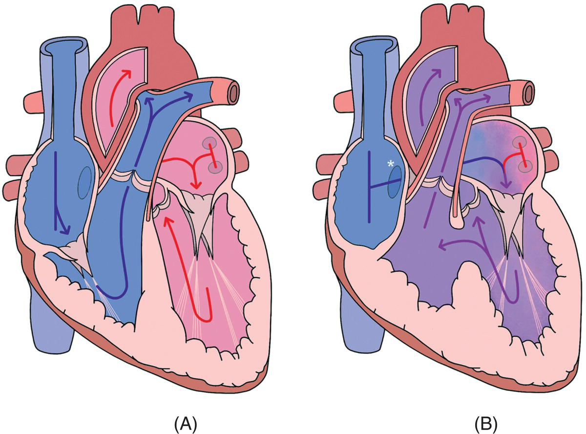

[**Figure 30.7**](#R_c30-fig-0007) Blood flow in tricuspid atresia. (A) Normal cardiac anatomy. (B), Tricuspid atresia. \*, patent foramen ovale or atrial septal defect. ASD, atrial septal defect; TA, tricuspid atresia.

(Source: Sumal et al. \[126\] / John Wiley & Sons / CC BY 4.0.)

The timing and presentation of TA are determined by the degree of PBF, with approximately 50% of patients presenting on the first day of life and 80% by the age of 1 month. Without intervention, TA is associated with 90% mortality by the end of the first year of life \[127\]. The majority of patients present with cyanosis due to decreased PBF secondary to pulmonary obstruction and/or a small VSD. Patients with increased PBF secondary to shunting across a VSD and unobstructed PBF may initially have minimal cyanosis and progress to develop signs of excessive PBF and congestive heart failure (CHF) as the PVR falls after birth. Patients with less severe PS generally have a milder degree of cyanosis and may not require immediate surgical intervention as they have relatively balanced systemic and pulmonary circulations (see [Figure 30.8](#c30-fig-0008)) \[128\]. The Fontan procedure was initially applied to patients with TA, and many long‐term adult survivors remain from the early Fontan era.

### Pathophysiology of TA

Although different classifications have been proposed for TA, the most widely accepted schemes are based upon _the relationship of the great arteries_ (Type I, II, or III) and _the degree of pulmonary outflow obstruction_ (subclassification a, b, or c) (see [Figure 30.9](#c30-fig-0009)) \[129\]. [Table 30.2](#c30-tbl-0002) summarizes the anatomic classification, incidence, and pathophysiological features of TA.

**_Type I: Great artery relationships are normal._** This is the most common type of TA, affecting 70–80% of patients. In the absence of a PDA, PBF is primarily dependent upon the size of the VSD and the severity of PS.

-   **Type I‐A**: Intact ventricular septum with pulmonary atresia (incidence approximately 10%). These patients are dependent on the presence of a PDA for PBF.
-   **Type I‐B**: Small VSD with PS (most common; 50% incidence). As the PDA closes, these patients will become increasingly cyanotic, related to the size of the VSD and the degree of PS. PGE1 should be infused in these patients. The VSD may be of adequate size in early infancy, but as the heart grows and CO increases, the size of the VSD may become inadequate, resulting in increased cyanosis.
-   **Type I‐C**: Large VSD without PS (10% incidence). With a large VSD, PBF will depend on PVR. As PVR falls, the ratio of PBF to systemic blood flow (Qp: Qs) will increase, with hemoglobin‐oxygen saturations (SaO2) appearing near normal and pulmonary overcirculation and signs of congestive heart failure.

**_Type II: D‐transposition of the great arteries exists._** Type II affects approximately 25% of patients. Due to the transposed great arteries, the systemic outflow is dependent on the size of the VSD. Therefore, a small or restrictive VSD often results in aortic stenosis, arch hypoplasia, or coarctation of the aorta. Systemic hypoperfusion occurs as the PDA narrows and PGE1 infusion may be necessary to maintain ductal patency. Obstruction to PBF is unusual in these patients, and they frequently develop pulmonary overcirculation and CHF in the first few weeks of life.

-   **Type II‐A**: A VSD exists with pulmonary atresia. In this extremely rare variant, the CO passes through the VSD into the aorta, and the patient depends on the PDA to provide PBF.
-   **Type II‐B**: A VSD is present with pulmonic stenosis (incidence 8%). Pulmonary blood flow is determined by the severity of PS and is often dependent on the PDA to maintain adequate oxygen saturation.
-   **Type II‐C**: A VSD without PS accounts for about 18% of all TA. Without PS, the relationship between PVR and any restriction to the systemic circulation (such as the size of the VSD and/or outflow tract obstruction) will determine Qp: Qs.
    
    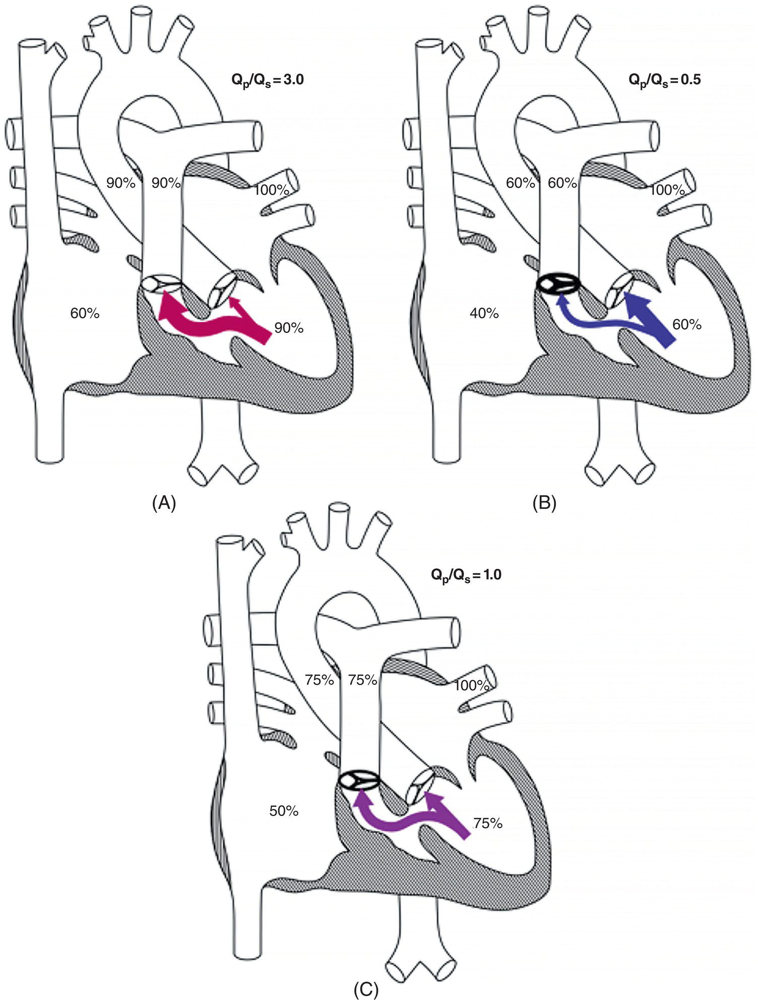
    
    [**Figure 30.8**](#R_c30-fig-0008) Hemodynamics of Type I tricuspid atresia with (A) no pulmonic stenosis (PS); (B) severe PS; and (C) “well‐balanced” PS. Qp, pulmonary blood flow; Qs, systemic blood flow. Numbers with percentages are oxyhemoglobin saturation values.
    
    (Source: Taggart \[128\]. Reproduced with permission of John Wiley & Sons.)
    

**_Type III: Malpositions of the great arteries other than d‐transposition_** . This type is less commonly seen (3–6% of patients) and is used to classify TA with complex associated malformations such as AV septal defect or truncus arteriosus.

-   Type III‐A is associated with restrictive PBF due to pulmonary or subpulmonary stenosis.
-   Type III‐B is associated with systemic outflow obstruction due to subaortic stenosis or aortic annulus hypoplasia.

The pathophysiology of TA is determined by the degree of anatomic obstruction to PBF, the PVR, and the patency of the ductus arteriosus. The size of the VSD and the degree of PS (if present) will determine the amount of antegrade PBF that can occur left‐to‐right via the VSD, from the LV to the RV and the pulmonary arteries. Without communication between the RA and the RV, deoxygenated systemic venous return from the RA must travel to the LA through the ASD or PFO. Systemic arterial desaturation is present in all patients with TA due to the obligatory mixing of all venous returns (systemic, pulmonary, and coronary) in the LA. An unrestricted atrial defect is crucial to allow both venous mixing and adequate CO. If the ASD or PFO is restrictive after birth, an urgent atrial septostomy must be performed to enlarge it. Blood may also enter the PA from the aorta via the PDA.

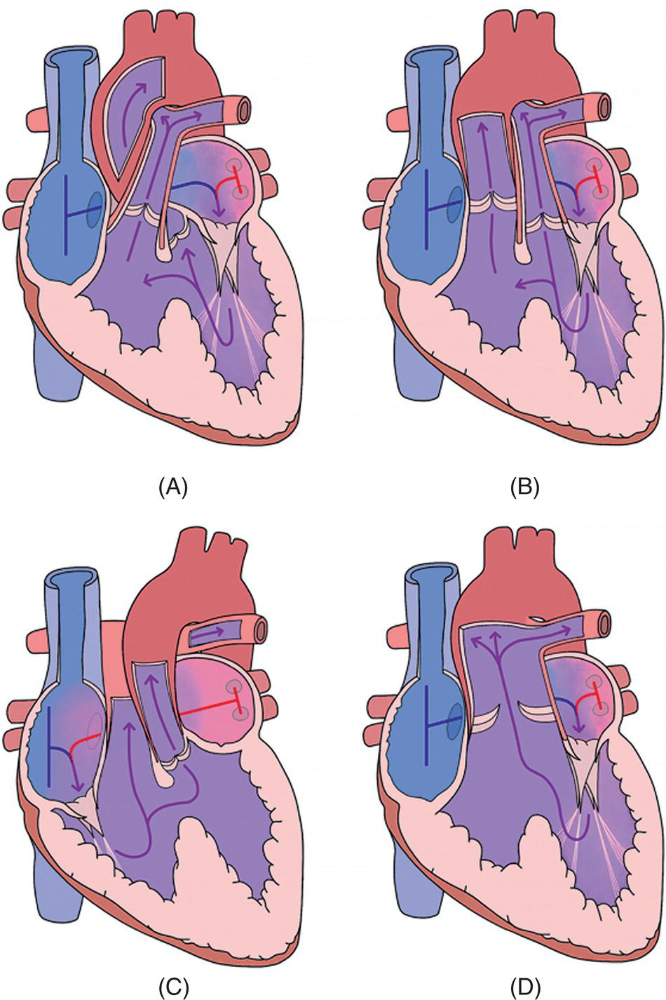

[**Figure 30.9**](#R_c30-fig-0009) Classification of tricuspid atresia. (A) TA with normal great arteries (69%). (B) TA with D‐TGA (28%). (C) TA with great‐artery position other than dextro‐transposition. L‐TGA (subtype 1) is shown (3%). (D) TA with persistent truncus arteriosus. D‐TGA, dextro‐transposition of the great arteries; L‐TGA, levo‐transposition of the great arteries; TA, tricuspid atresia.

(Source: Taggart \[128\]. Reproduced with permission of John Wiley & Sons.)

The diagnosis of TA is generally made prenatally with obstetrical screening ultrasound or fetal echocardiography. Postnatal diagnosis is confirmed with history and physical examination, chest radiography, electrocardiogram (ECG), and echocardiography. Chest radiography can differentiate between patients with high or low PBF as those with increased PBF demonstrate cardiomegaly and prominent pulmonary vasculature. In contrast, patients with pulmonary oligemia have a normal‐sized heart and concavity in the region of the PA. The ECG demonstrates left axis deviation in the frontal plane. Echocardiography describes the anatomy and allows detailed physiological assessment and surgical planning. It aids in defining the size of the VSD and the RV, the relationship of the great vessels, degree of PS, presence and size of the PDA, and the amount of blood flow across these areas. The presence of other associated anomalies such as arch obstruction can also be assessed. Color‐flow and spectral Doppler echocardiography can evaluate the adequacy of the atrial level communication (ASD or PFO). Cardiac catheterization is rarely required in the neonatal period unless necessary for balloon atrial septostomy or stenting of the PDA. Cardiac MR and CT may be used occasionally to define unusual anatomy.

### Surgical and transcatheter approaches and outcomes

Ultimately TA patients will undergo staged SV palliative surgeries, culminating in the Fontan procedure. However, the necessity and type of neonatal intervention differ according to the anatomical classification and pathophysiologic consequences. The need for neonatal surgical or catheter‐based intervention depends upon the degree of obstruction to PBF, the size of the VSD, and the resulting level of cyanosis. Subgroups of neonates with decreased PBF either due to pulmonary outflow obstruction and/or a restrictive VSD will require the provision of a stable source of PBF. Infants presenting with Type Ia or IIa (pulmonary atresia) are ductal‐dependent until they undergo either surgical placement of a mBTTS or stenting of the PDA in the cardiac catheterization laboratory. Patients with increased PBF due to an unrestrictive VSD and either mildly obstructed (Types Ib and IIb) or unobstructed pulmonary outflow (Types Ic and IIc) often develop CHF with signs of compromised systemic perfusion. Placement of a PAB for restriction of PBF may be necessary until a superior cavopulmonary connection (SCPC) can be performed at 3–6 months of age. Infants with relatively balanced systemic and pulmonary circulations (Types Ib and IIb), although cyanotic, may not require neonatal surgical intervention and may be followed clinically for increasing cyanosis. Most often, SCPC is their first palliative surgery.

Type II TA patients with restrictive VSDs or significant subaortic obstruction require a PDA to provide systemic circulation and may undergo a “palliative” arterial switch operation (ASO) to place the aorta so that the unobstructed LV ejects into it; the VSD may need to be enlarged in this case to prevent profound cyanosis \[130, 131\] (See [Chapter 29](c29.xhtml) for a detailed discussion of the ASO). If subaortic obstruction exists despite an unrestrictive VSD, patients may undergo a Damus–Kaye–Stansel (DKS) operation, which bypasses subaortic obstruction by creating an end‐to‐side anastomosis between the ascending aorta and the proximal stump of the divided PA. Either a mBTTS or RV‐PA shunt is placed to provide PBF. The operative and anesthetic considerations for this surgery are similar to those for the Norwood stage I palliation of HLHS. [Figure 30.10](#c30-fig-0010) demonstrates surgical options for TA type II with significant subaortic stenosis.

### Anesthetic considerations

#### Pulmonary artery banding

Neonates with pulmonary overcirculation and varying degrees of CHF may present for PAB placement to protect the pulmonary vascular bed from high pressure to facilitate successful progression to SCPC and Fontan physiology. Cyanosis is mild in these patients; they are generally tachypneic and often receive diuretic therapy. Preoperative evaluation should include a thorough history and physical examination, a review of the chest radiograph for evaluation of heart size and degree of pulmonary overcirculation, and baseline pulse oximetry. A current hemoglobin level will aid in the assessment of the degree of chronic cyanosis, and serum electrolyte values can evaluate abnormalities due to chronic diuretic therapy. A review of the most recent transthoracic echocardiogram should reveal precise details of the anatomy and functional characteristics, including any mitral valve regurgitation. Although cardiac rhythm disturbances are unusual at this stage, a 12‐lead ECG is helpful to exclude arrhythmias.

[**Table 30.2**](#R_c30-tbl-0002) Anatomic and physiologic classification of tricuspid atresia

|  |  |  | Major pathophysiologic features |  |
| --- | --- | --- | --- | --- |
| Type | Major anatomic features | Incidence | Cyanosis | CHF | Decreased systemic perfusion | Neonatal surgical approach |
| --- | --- | --- | --- | --- | --- | --- |
| **Type I: Normally related great arteries** |  | 70–80% |  |  |  |  |
|  Ia | Intact VS with pulmonary atresia |  | +++ | − | − | mBTS |
|  Ib | Small VSD with PS |  | ++ | − | − | None |
|  Ic | Large VSD, no PS |  | + | ++ | − | PA band |
| **Type II: Transposition of the great arteries** |  | 12–25% |  |  |  |  |
|  IIa | VSD with PA |  | +++ | − | Yes if VSD restrictive | mBTS |
|  IIb | VSD with PS |  | ++ | − | Yes if VSD restrictive | None |
|  IIc | VSD no PS |  | + | ++ | Yes if VSD restrictive | PA band |
| **Type II: Transposition of the great arteries with restrictive VSD or subAS** |  |  | ++ | +++ | ++ | DKS; or subAS resection, +/− enlarge VSD; or palliative ASO, +/− enlarge VSD |
| **Type III: Normally related or transposed great arteries with other complex cardiac lesions** |  | 3–6% | \+ to +++ | − to ++ | Depends on associated anomalies | Depends on associated anomalies |

ASO, arterial switch operation; CHF, congestive heart failure; DKS, Damus–Kaye–Stansel operation;mBTS, modified Blalock–Taussig shunt; PS, pulmonic stenosis; subAS, subaortic stenosis; VS, ventricular septum; VSD, ventricular septal defect; +, mild; ++, moderate; +++, severe; −, no effect.

After placement of standard monitors, an IV induction of anesthesia is most commonly performed, utilizing fentanyl in combination with incremental doses of either ketamine or propofol. After administration of a neuromuscular blocking agent and tracheal intubation arterial access is achieved for monitoring. Institutional viewpoints vary regarding the need and best location for placement of central venous access. Some centers advocate the use of femoral venous cannulation, due to concern for potential thrombus formation in the SVC, as it will be necessary later for successful SCPC. Others may choose to place a transthoracic RA line. If appropriate peripheral IV access exists some centers elect not to use central venous access for this procedure. The patient’s preoperative condition, along with institutional preferences and the need for postoperative vascular access in the ICU, will assist in decision‐making.

Steady‐state anesthetic and ventilatory conditions should be maintained during the procedure in order to optimize PAB adjustments. The FiO2 and PaCO2 at the time of PAB placement should approximate baseline conditions for the patient; communication between the surgeon and anesthesiologist regarding the desired conditions is essential. A FiO2 of 0.30 or less is generally utilized, and PaCO2 is often in the mid‐40s mmHg due to the metabolic alkalosis from diuretic therapy and the mild state of respiratory insufficiency from CHF. Many centers use TEE guidance during PAB placement.

The operation is usually performed through a median sternotomy without CPB. After dissection, the surgeon places a thin cotton tape or strip of Gore‐Tex around the main PA, using care not to impinge on the branch PAs or pulmonary valve. A formula derived by Trusler advocated an initial band circumference of 24 mm + 1 mm/kg body weight for infants with bidirectional mixing disorders, but this was subsequently modified for patients with univentricular physiology, narrowing the circumference further to 22 mm + 1 mm/kg \[132, 133\]. Various methods may be used to assess and adjust PAB tightness. The primary method is to assess the change in pulse oximeter saturation and the measured arterial PaO2 saturation after band placement, with a SpO2 of 75–85% and a PaO2 of approximately 40–45 mmHg customarily targeted. Transesophageal echocardiography helps measure peak velocity (_V_) across the PA band; 3 m/s is a frequent goal and corresponds to a pressure gradient of 36 mmHg using the modified Bernoulli principle (peak velocity = 4_V_2). Additionally, echocardiography can reassure that no encroachment on the pulmonary valve or distortion of the pulmonary arteries has occurred. Finally, direct pressure measurement in the surgical field is utilized by some institutions; a PA pressure distal to the PAB that is about one‐third of systemic arterial pressure (range, 25–50%) is a frequent goal. The PAB is adjusted temporarily with surgical clips, blood gas measurements can be obtained after steady‐state conditions are achieved, and the band is then permanently secured with non‐absorbable sutures. An overly tight PAB will produce profound cyanosis and bradycardia, while one that is too loose will produce little change from baseline conditions. The final PAB circumference is often determined by surgical judgment, hence the importance of achieving and maintaining steady‐state anesthetic and ventilatory conditions.

Although usually not necessary, inotropic support should be readily available as afterload will increase after placement of the PAB once the pulmonary circuit no longer provides a low resistance “pop‐off.” Placement of a PAB mechanically increases the resistance to PA flow, and therefore, more blood flow is directed out through the aorta. Systemic arterial pressure often increases after placement of a PAB, and occasionally a vasodilator such as sodium nitroprusside is necessary to control blood pressure. After surgery, tracheal extubation may occur in the OR or within the first few hours of ICU admission.

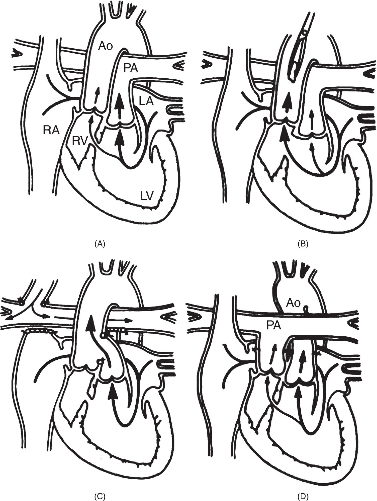

[**Figure 30.10**](#R_c30-fig-0010) Surgical methods for tricuspid atresia type II with significant subaortic stenosis. (A) Preoperative anatomy of tricuspid atresia type IIc. (B) Direct resection of subaortic myocardium with enlargement of the ventricular septal defect. (C) Damus–Kaye–Stansel operation: main pulmonary artery to aorta end‐to‐side anastomosis. (D) Palliative arterial switch operation. Ao, aorta, LA, left atrium; LV, left ventricle; PA, pulmonary artery; RA, right atrium; RV, right ventricle.

As the patient emerges from anesthesia, CO changes, along with the relative tightness of the band. As infants are in a period of rapid somatic and cardiac growth, they often “outgrow” the PAB, and cyanosis increases. As nearly all of these infants undergo an SCPC within a few months, this issue is not usually problematic in the infant SV population.

#### Systemic‐PA shunt and ductal stenting

Patients with TA and either pulmonary atresia or significant PS who require PGE1 and maintenance of ductal patency for PBF may present for either surgical placement of a mBTTS or placement of a ductal stent in the cardiac catheterization laboratory to establish a stable source of PBF. Occasionally an older infant with profound cyanosis and a closed ductus arteriosus may also present for placement of an mBTTS. Although an mBTTS can be performed via right thoracotomy, the median sternotomy approach is most commonly utilized. Unless necessary due to hemodynamic instability or significant hemoglobin‐oxygen saturations during the procedure, CPB is not utilized. The anesthetic considerations for placement of an mBTTS are presented in detail in [Chapter 28](c28.xhtml).

Percutaneous transcatheter stenting of the ductus arteriosus was first described in 1992 and has continued to increase in prevalence as an alternative palliative approach to secure PBF in patients with duct‐dependent lesions \[134\]. Ductal stenting (DS) has proven to be a reasonable alternative to the mBTTS, as it is associated with similar or improved symmetrical PA growth, fewer procedural complications, a shorter ICU and hospital length of stay, and improved survival compared to surgical shunt \[135, 136\]. In comparing the two procedures, cardiac arrest, the need for extracorporeal circulatory support, arrhythmias requiring therapy, and bleeding were observed only in the mBTTS group, while access site injury was observed in the DS group \[137\]. As the experience continues to grow and early technical challenges are overcome, DS is emerging as a preferred alternative to the mBTTS. Further detail about ductal stenting is presented in [Chapter 34](c34.xhtml).

Unplanned reinterventions to treat cyanosis before SCPC may be required in patients with either mBTTS or DS. These interventions most commonly involve either balloon or stent angioplasty of the PDA stent or mBTTS, or surgical revision \[136\]. Planned reinterventions may also occur in DS patients, with reexpansion of the stented ductus allowing adjustment of PBF over time. A study comparing pre‐SCPC hemodynamics and PA growth in SV patients palliated with either DS or mBTTS found no significant differences between the two \[138\].

#### Damus‐Kaye‐Stansel operation and palliative ASO

Management of patients with unrestrictive PBF and systemic ventricular outflow tract obstruction (TA with associated TGA) remains challenging. Systemic blood flow must pass through the VSD, or bulboventricular foramen, to a rudimentary subaortic outlet chamber. The VSD may become restrictive, limiting blood flow, or ventricular hypertrophy after placement of a PAB may further increase outflow obstruction. While early relief of obstruction is essential, surgical management of this issue has not been uniform. Although subaortic stenosis may be relieved directly by means of VSD and/or subaortic chamber enlargement, this incurs the risks of heart block, recurrent stenosis, and ventricular dysfunction due to the ventriculotomy. As noted earlier, the DKS operation may be performed for TA variants with significant subaortic or aortic obstruction or with a restrictive VSD. The anesthetic considerations are very similar to those for Norwood stage I palliation, as discussed earlier. Because the single functional ventricle is an LV, and because the aortic valve is not atretic and the coronary artery circulation not as tenuous as in HLHS, these patients are generally expected to have a more stable pathophysiologic condition after DKS, compared with the Norwood stage I palliation. The palliative ASO has many anesthetic considerations in common with the standard ASO for d‐TGA with two ventricles (discussed in [Chapter 29](c29.xhtml)). The major difference is that TA remains, and adequate PBF needs to be assured after the ASO, often requiring enlargement of the VSD or possibly placement of an mBTTS.

* * *

### KEY POINTS: TRICUSPID ATRESIA

-   TA results in a single systemic LV with a rudimentary RV.
-   Type I TA has normally related great vessels, type II has d‐TGA, and type III has l‐TGA or additional complex cardiac defects.
-   Subtype _a_ has pulmonary atresia, _b_ has PS, and _c_ has no PS.
-   Neonatal surgical palliation depends on the size of the VSD and the degree of obstruction to pulmonary or systemic blood flow. The majority of patients require the establishment of stable PBF via either mBTTS placement or DS. Patients with unrestrictive PBF often require PA banding. Complex repairs such as the DKS operation or palliative ASO can be required in patients with TA and TGA.

* * *

## Other forms of univentricular hearts

In addition to HLHS and TA, other forms of univentricular hearts exist and can present in the neonatal period for initial surgical palliation \[137\]. These patients virtually always undergo staged palliation with SCPC at 3–6 months and Fontan completion between 18 months and 4 years of age. Although collectively accounting for only 1–2% of all CHD patients diagnosed at birth, the congenital cardiac anesthesiologist frequently encounters these patients for surgical and catheterization procedures, imaging procedures, and non‐cardiac surgery. [Table 30.3](#c30-tbl-0003) summarizes other univentricular heart variants.

### Double inlet ventricle

In a double inlet ventricle, both atria connect only to a single ventricular chamber, either via a common AV valve or two separate AV valves. The AV valves may be normal, or one may be hypoplastic, stenotic, or atretic \[137\]. The additional ventricle is hypoplastic; in some cases, there can be a partial connection to the rudimentary ventricle via a straddling AV valve. In general, the rudimentary ventricle lacks an inlet portion, but the outlet chamber can also be absent. A VSD or bulboventricular foramen is usually present and may restrict flow to the outlet chamber and the attached great vessel. Although the single functional ventricle can be a morphologic LV, RV, or have indeterminate morphology, double inlet left ventricle (DILV) is the most commonly seen variant (see [Figure 30.11](#c30-fig-0011)).

A right‐sided anatomic LV exists in the double‐inlet left ventricle (DILV) along with frequent ventriculoarterial discordance, with l‐TGA occurring slightly more frequently than d‐TGA \[137, 139\]. The clinical picture varies according to the size of the VSD or bulboventricular foramen, the presence of AV valve hypoplasia or stenosis, and the morphology and degree of pulmonary or systemic outflow obstruction. Three subtypes of DILV have been described according to the relationship of the great arteries \[140\].

-   **Type I**: Normally related great arteries are found; this anomaly is also known as the “Holmes” heart.
-   **Type II**: d‐TGA exists, often associated with obstruction of the bulboventricular foramen and subaortic stenosis. Aortic arch anomalies exist approximately 50% of the time as well.
-   **Type III:** l‐TGA is present. Subaortic obstruction occurs in two‐thirds of patients due to a small bulboventricular foramen or left AV valve tissue obstruction.

[**Table 30.3**](#R_c30-tbl-0003) Other types of univentricular heart variants presenting for neonatal cardiac surgery

| Lesion | Morphology of systemic ventricle | Associated cardiac findings | Neonatal surgical palliation options |
| --- | --- | --- | --- |
| Double inlet ventricle | Left is most common | L‐transposition of the great arteries; subAS; subPS | Damus–Kaye–Stansel; palliative ASO; PA banding |
| Mitral atresia with VSD | Right | Restrictive bulboventricular foramen; hypoplastic aortic arch | Damus–Kaye–Stansel; PA banding |
| Unbalanced common AV canal | Right or left | Coarctation or arch hypoplasia | Aortic arch repair; PA banding |
| Heterotaxy syndrome with single ventricle | Right, left, or indeterminate | PS; bilateral SVC; interrupted IVC; TAPVR | mBTS; TAPVR repair; PA banding |

AS, aortic stenosis; ASO, arterial switch operation; IVC, inferior vena cava; mBTS, modified Blalock–Taussig shunt; PA, pulmonary artery; PS, pulmonic stenosis; SVC, superior vena cava; TAPVR, total anomalous pulmonary venous return; VSD, ventricular septal defect.

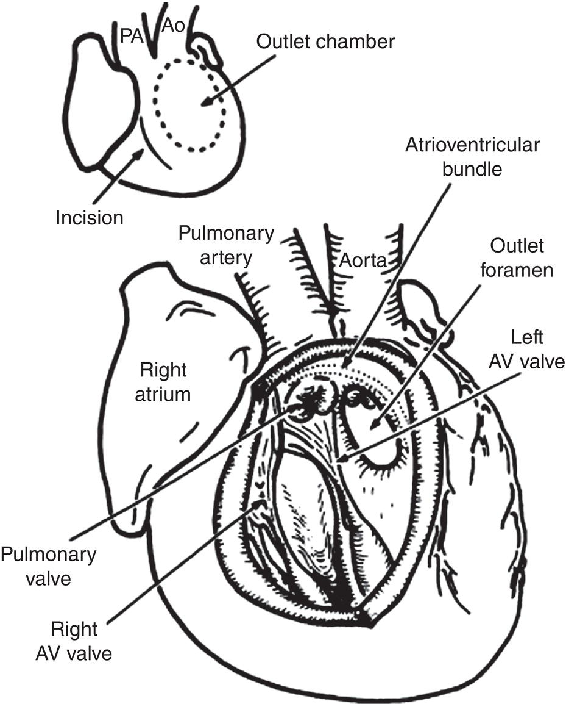

[**Figure 30.11**](#R_c30-fig-0011) Double inlet left ventricle with hypoplastic right ventricle. Relationships of the intracardiac structures and the disposition of the conduction tissue (atrioventricular bundle). Ao, aorta; AV, atrioventricular; PA, pulmonary artery.

The appropriate neonatal surgical palliative approach will depend on the exact anatomy and its pathophysiological consequences. Patients with restrictive PBF require a mBTTS or PDA stenting, while those with aortic valve and aortic hypoplasia may require a Norwood procedure, DKS operation, or palliative ASO (see earlier). Some centers may choose the placement of a PAB along with aortic arch repair. Patients without restriction to either pulmonary or aortic outflow usually require placement of a PAB, while in patients with a balanced circulation the initial palliative surgery is generally an SCPC. Anesthetic considerations for these procedures are discussed earlier in the chapter. Current outcomes of multistage palliation for DILV compare favorably with those reported for other SV anomalies \[139\].

### Mitral atresia with VSD

Mitral atresia with VSD denotes the absence of the left AV valve connection from the LA to the LV, resulting in a functionally univentricular heart with a dominant RV and a hypoplastic LV connected to the RV via a VSD or bulboventricular foramen. Both the aorta and PA may arise from the RV, and the aortic root may be normal, or the aorta can arise from the small LV, in which case the aorta is often hypoplastic and classification then becomes HLHS. The majority of cases are seen in conjunction with other ventricular anomalies such as HLHS, left ventricular outflow tract obstruction, and double outlet RV. Neonatal palliation often consists of PAB placement in patients with unrestrictive flow through both great vessels; a DKS or Norwood stage I palliation operation is usually necessary if subaortic obstruction or hypoplasia of the ascending aorta also exists.

### Unbalanced complete atrioventricular septal defect

Unbalanced complete atrioventricular septal defects (uCAVSDs) compose approximately 10% of CAVSDs \[137\]. As in balanced CAVSD (see [Chapter 26](c26.xhtml)), a single common AV valve exists along with a large primum ASD and a large inlet VSD. However, in uCAVSD, one ventricle is hypoplastic, often resulting in a single functional ventricle. A right dominant uCAVSD is more commonly seen, with a large RV and hypoplastic LV. Conversely, a left dominant uCAVSD has a large LV and hypoplastic RV. Abnormal development of aortic outflow, with arch hypoplasia or coarctation, may be observed in uCAVSD, but PS is unusual.

Surgical decision‐making for the patient with an uCAVSD is guided by the percentage of ventricular imbalance and the adequacy of the AV valves \[141\]. Echocardiography plays a vital role in determining the suitability of a candidate for single vs. biventricular repair. If the LV or RV apex is present (“apex‐forming”) in an otherwise small ventricle, a patient may be considered for biventricular repair. Echocardiographic measurement of the AV valve index, the ratio of the smaller AV valve component over the larger component, can offer guidance \[142\]. Cardiac MR imaging can yield information regarding ventricular volumes to further assist decision‐making \[143\].

Unbalanced CAVSD patients often present in early infancy with pulmonary overcirculation. They may require placement of a PAB, either as part of a staged univentricular palliation or to allow delayed decision‐making regarding the feasibility of biventricular repair. Infants with abnormalities of aortic outflow may require coarctation repair or aortic arch repair, with a PAB frequently necessary as well. As in other SV anomalies, the SCPC is performed at 3–6 months. Patients with uCAVSDs who undergo SV palliation represent a challenging group of patients, with substantial early mortality and <60% survival at 20 years \[144\]. In particular, trisomy 21 patients with severe ventricular hypoplasia are reported to have poor outcomes, regardless of their dominant ventricle \[141\].

### Single functional ventricle with heterotaxy syndrome

The International Society for Nomenclature of Pediatric and Congenital Heart Disease defines heterotaxy as “an abnormality where the internal thoraco‐abdominal organs demonstrate abnormal arrangement across the left‐right axis of the body.” Heterotaxy does not include patients with situs inversus or complete mirror imaging of cardiac and abdominal organs around the right‐left axis \[145\]. [Chapters 6](c06.xhtml) and [7](c07.xhtml) have an extensive discussion of the embryology and nomenclature of heterotaxy syndrome. Constellations of cardiac manifestations are frequently seen in patients with heterotaxy syndrome, with many requiring SV palliation. In addition to cardiac anomalies, malrotation of the intestines may be present, predisposing the patient to intestinal volvulus, and therefore, all babies with heterotaxy should be evaluated to rule out intestinal malrotation. Patients often have impaired or absent splenic function, even in the presence of polysplenia. Functionally asplenic patients are susceptible to pneumococcal and other bacterial sepsis and require lifelong penicillin prophylaxis.

Isomerism reflects the duplication of one vertical half of the body in regard to the thoracic organs, with unusual arrangements of the abdominal organs (visceral heterotaxy). Atrial appendage morphology should be the basis for segregating right and left isomerism; if morphology cannot be assigned to either right or left atrium, isomerism may be considered indeterminate. Classification is essential because right and left isomerism are associated with markedly different anatomical findings of the affected organs that can be clinically significant. Isomerism can significantly impact surgical outcomes for SV palliative surgeries, and mortality before stage I palliation and during the stage I to stage II interstage period is greater in patients with isomerism \[146\].

Right atrial isomerism (RAI) is associated with bilateral morphologically right atrial appendages, bilateral trilobed lungs, central nervous system anomalies, and asplenia. Associated cardiac abnormalities may include a constellation of many or all of the following: AVSD, total anomalous pulmonary venous connection (TAPVC), TGA, and bilateral SVCs. The presence of extracardiac TAPVC in a patient with heterotaxy is highly correlated with RAI \[147\]. Patients with RAI generally have bilateral sinus nodes, leading to a propensity for atrial arrhythmias later in life. The absence of the coronary sinus is a near‐universal finding in patients with isomeric right atrial appendages \[148\].

Left atrial isomerism (LAI) is associated with bilateral morphologic LA appendages, bilaterally bilobed lungs, and asplenia or polysplenia. Cardiac anomalies can include all or some of the following: AVSD, partial anomalous pulmonary venous connection (PAPVC), interruption of the IVC, absence of the coronary sinus, mirror‐imaged spiraling of great arteries, and AV block. Interruption of the IVC in the presence of heterotaxy is highly correlated with LAI compared to RAI. An interrupted IVC can drain into either the azygos or hemiazygos vein and from there into a right or left‐sided SVC. In addition, the IVC may be left‐sided and drain into a common atrium separately from the hepatic veins, presenting complexities at the time of Fontan completion. The sinus node may be abnormally located or absent in LAI, making these patients more susceptible to arrhythmias and complete heart block (see [Figure 30.12](#c30-fig-0012)) \[149\].

Because of the anatomical variation possible in heterotaxy syndrome, neonatal surgical palliation varies widely. Given the frequent abnormalities of systemic and pulmonary venous drainage, echocardiography alone may not sufficiently define the anatomy. Cardiac MRI, CT, or catheterization is frequently useful in this population. Because TAPVC is common, surgical repair of this condition is often the initial operation. Pulmonary valve stenosis or atresia occurs in approximately 50% of patients with RAI and <10% of those with LAI and may necessitate placement of an mBTTS or PDA stent \[150\]. Conversely, PAB placement may be required for patients with pulmonary overcirculation. The management of TAPVC is discussed in [Chapter 26](c26.xhtml). Precise details of the patient’s anatomy are essential to understand the planned surgical approach and to guide decision‐making regarding the placement of invasive arterial and central venous access catheters. The presence or absence of a spleen and intestinal malrotation can be determined by abdominal ultrasound; nuclear medicine scan (hepatobiliary iminodiacetic acid \[HIDA\]) is used in cases where the splenic anatomy is not clear. After initial neonatal surgical palliation, approximately 85% of heterotaxy syndrome patients undergo staged palliation to a Fontan circulation. [Table 30.4](#c30-tbl-0004) summarizes the findings in heterotaxy syndrome.

Heterotaxy syndrome presents a number of challenges for perioperative teams. Despite improving statistics, hospital mortality remains consistently higher in patients with heterotaxy \[151\]. Within heterotaxy syndrome, survival is consistently higher for patients with LAI compared to RAI \[147, 152\]. Patients with RAI are nearly five times as likely to have TAPVC compared to patients with LAI, and approximately two thirds of patients with RAI have SV physiology as well. These patients are a particularly high‐risk neonatal surgical population, with 10‐year survival nearly twice as high in patients without TAPVC compared to those with TAPVC \[147\].

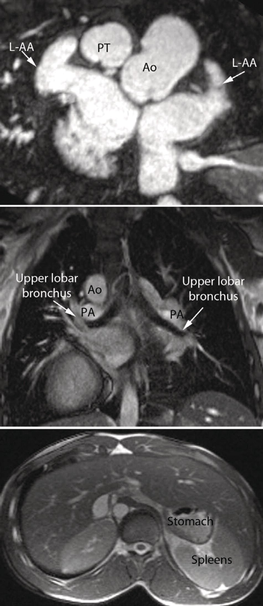

[**Figure 30.12**](#R_c30-fig-0012) Heterotaxy with classic left isomerism and polysplenia. Both side atrial appendages are long and narrow. No pectinate muscles are seen along the wall of either atrium. The main bronchi are symmetrically long. Note the epibronchial pulmonary arteries (PA) and the hyparterial upper lobar bronchi. Two spleens are seen along the posterolateral wall of the stomach. Ao indicates aorta; DsAo, descending aorta; IVC, inferior vena cava; and PT, pulmonary trunk.

(Source: Yim et al. \[149\]. Reproduced with permission of Wolters Kluwer Health, Inc.)

* * *

### KEY POINTS: OTHER UNIVENTRICULAR HEARTS

-   Other univentricular hearts include double inlet ventricle, MA, unbalanced CAVSD, and various forms of SV anatomy with heterotaxy syndrome.
-   Neonatal palliation depends on the degree of obstruction to pulmonary or systemic blood flow and may involve no surgery, PAB placement, systemic‐to‐pulmonary artery shunt, or complex repairs such as the DKS procedure or palliative ASO.
-   Heterotaxy is a complex malformation syndrome involving abnormal sidedness of thoraco‐abdominal organs, with isomerism classified according to atrial anatomy (right, left, or indeterminate).
-   Abnormalities of systemic and pulmonary venous return are common in heterotaxy and often need to be addressed during neonatal palliation.

* * *

## Superior cavopulmonary connection

### Surgical procedure

The term “superior cavopulmonary connection” describes the creation of a surgical anastomosis between the SVC and the pulmonary arterial bed. If an mBTTS or RV‐PA shunt is present, it is taken down at the time of SCPC; similarly, for a stented PDA, the stent(s) and PDA are excised and the aortic and pulmonary insertion sites oversewn. For patients with shunt‐dependent PBF, conversion to an SCPC means that the heart is no longer required to eject systemic output plus additional output to provide PBF via the shunt. Conversion to SCPC increases effective PBF, resulting in improved systemic arterial oxygen saturation. Volume unloading of the SV also occurs, facilitating subsequent remodeling of ventricular geometry with a reduction in end‐diastolic volume before Fontan completion \[153, 154\]. Although SCPC is the second stage in the palliative surgical sequence for most SV patients, for patients with balanced circulations who did not require a neonatal intervention the SCPC will be their first palliative surgery.

Two primary surgical options currently exist for SCPC. As outcomes appear equivalent, preference for one technique over the other tends to be institution specific. The bidirectional Glenn (BDG) is an end‐to‐side anastomosis of the SVC to the PA, along with ligation of the prior mBTTS or Sano shunt. A modification of the original Glenn shunt facilitated SVC flow to both left and right PAs, hence the term “bidirectional” Glenn shunt \[155, 156\] (see [Figure 30.13](#c30-fig-0013)). Most commonly, the BDG is followed by an extracardiac Fontan. The hemi‐Fontan (HF) procedure is technically more complex and maintains the native connection between the SVC and RA; it also enables PA augmentation. The SVC‐RA confluence is anastomosed to the branch PA, utilizing a “dam” within the RA to redirect SVC blood flow to the pulmonary arteries. The HF facilitates a subsequent lateral tunnel Fontan completion (see [Figure 30.14](#c30-fig-0014)). In a study utilizing multi‐scale computational modeling, no significant differences in hemodynamic or physiological outcomes were seen between the HF and BDG models, suggesting that patient‐specific physiology and condition are more important in determining the outcome \[157\]. Evaluation of infants in the SVRT dataset was done through 1 year of age, based on the type of SCPC performed. Although CPB times were longer and the use of DHCA more frequent in the HF group, no difference in transplant‐free survival at 1 year was observed between groups \[158\].

[**Table 30.4**](#R_c30-tbl-0004) Findings in heterotaxy syndrome with single ventricle

| Syndrome | % with single ventricle | Common cardiac variants | Pulmonary stenosis/atresia | SVC/IVC | TAPVR | SA nodes | Atrial morphology | Lung morphology |
| --- | --- | --- | --- | --- | --- | --- | --- | --- |
| Asplenia | \>50% | Single RV common; DORV, unbalanced CAVC | Common (>90%) | Bilateral SVC common | Common; to extracardiac vein | Bilateral | RA isomerism | Bilateral trilobed (right) |
| Polysplenia | _<_50% | RV or indeterminate morphology | Less common (_<_50%) | Interrupted IVC (80%) | To right atrium | Hypoplastic or absent | LA isomerism | Bilateral  
bilobed (left) |

CAVC, complete atrioventricular canal; DORV, double outlet right ventricle; IVC, inferior vena cava; LA, left atrium; RA, right atrium; RV, right ventricle; SA, sinoatrial; SVC, superior vena cava; TAPVR, total anomalous pulmonary venous return.

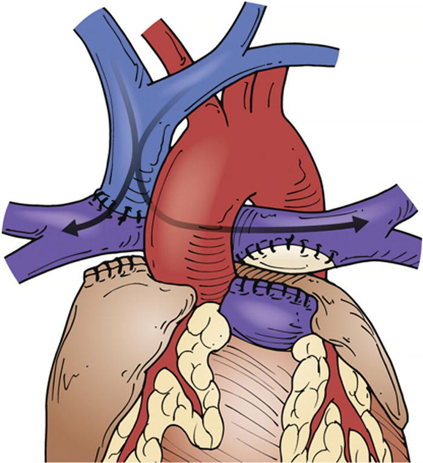

[**Figure 30.13**](#R_c30-fig-0013) Bidirectional Glenn procedure. The superior vena cava (SVC) is anastomosed in an end‐to‐side fashion to the pulmonary artery. It is important to ligate the azygous vein (to limit decompression of SVC blood via the azygous to the intact inferior vena cava (IVC) circulation). The atrial junction from the SVC site is oversewn. When performed on CPB, it is often possible to complete an atrial septectomy through the atrial junction before oversewing it. Cannulation of the SVC must be performed meticulously to prevent stenosis to the Glenn circuit after the cannula is removed at the completion of the case.

(Source: Murthy et al. \[127\]. Reproduced with permission of Elsevier.)

Although SCPC may occasionally be performed as early as 2 months of age, most patients undergo this procedure at 3–6 months to allow sufficient time for PVR to decrease and permit sufficient PBF, systemic oxygenation, and systemic CO with the SCPC circulation. Consideration may be given to proceeding earlier with SCPC if increasing cyanosis from mBTTS or RV‐PA shunt narrowing is present or if an urgent need exists to address other surgical issues such as coarctation of the aorta. The development of interstage home monitoring programs has dramatically improved interstage mortality for patients after Stage I palliation and assisted in planning appropriate timing of the Stage II procedure \[104\]. Patients with bilateral SVCs often undergo a bilateral SCPC with each SVC anastomosed to its ipsilateral PA. In this case, each SVC is generally smaller than a normal single SVC, producing increased resistance to flow. Patients requiring bilateral SCPC before 120 days of life have poorer outcomes for the Stage II procedure, but subsequently, results are equivalent for patients with either single or bilateral SVCs \[159\].

The HF is performed utilizing CPB. The BDG is performed with CPB support in most institutions; however, if other cardiac surgical procedures are not required, it is possible to perform an isolated SCPC without CPB with the aid of a temporary shunt from the SVC to the RA and partial heparinization. This technique is designed to prevent cerebrovenous hypertension and hypoxic‐ischemic brain injury during the period of SVC occlusion. The surgical technique for isolated BDG involves the institution of CPB with cannulae in the aorta, high SVC, and RA. Cross‐clamping of the aorta is avoided unless additional intracardiac procedures are planned, and mild hypothermia (32–34 °C) is generally utilized. The mBTTS or RV–PA shunt, if present, is occluded immediately after the institution of CPB and then divided and oversewn. The SVC is transected at its junction with the RA, taking care not to injure the SA node. The RA is then oversewn and the SVC anastomosed to the right PA. If pulmonary atresia does not already exist (either congenitally or as a result of incorporating the native pulmonary valve into the neo‐aorta during Norwood stage I palliation), the main PA is oversewn. The pulmonary valve leaflets are also sewn closed to prevent thrombus formation in the pulmonary valve sinuses, which can embolize retrograde into the single systemic ventricle. The term “pulsatile” BDG refers to intentionally leaving some ejection from the pulmonary ventricle directly to the PA in addition to the SCPC. This elevates PA pressure and produces a pulse pressure. Reasons for utilizing this configuration can include tricuspid stenosis or other forms of mild RV hypoplasia in which the RV is deemed inadequate to receive the sum of all SVC and IVC flow. This operation is also termed a one‐and‐a‐half‐ventricle repair. Although maintaining antegrade PBF at the time of SCPC can be beneficial for oxygen saturations and the growth of pulmonary vasculature before the Fontan procedure, it has been shown to be unfavorable for overall transplant‐free survival, with a higher risk of death or transplant until the antegrade flow is eliminated. \[160\].

Single‐ventricle patients with heterotaxy syndrome (see earlier) often have bilateral SVCs, requiring bilateral SCPC. These patients may also require either revision or primary repair of anomalous pulmonary venous drainage at the time SCPC is performed. Many heterotaxy patients with LAI also have interruption of the IVC. In these patients, the suprahepatic IVC is not present. Subdiaphragmatic systemic blood return occurs via collateral circulation reconstituted above the diaphragm, ultimately entering the azygous or hemiazygous circulation. Consequently, after SCPC, 75–85% of the total systemic blood flow is directed to the PAs, excluding only hepatic venous and coronary sinus drainage. The resulting physiology thus more closely approximates that seen after the Fontan operation. This operation is known as the Kawashima procedure \[161\]. A Fontan‐type intervention is still generally performed later to incorporate hepatic venous blood into the pulmonary circulation, as these patients are at increased risk for the early development of pulmonary arteriovenous malformations (PAVMs) with resultant cyanosis due to the lack of an uncharacterized “hepatic factor” directly perfusing the pulmonary circulation. Despite this, PAVM regression remains unpredictable in these patients \[162, 163\].

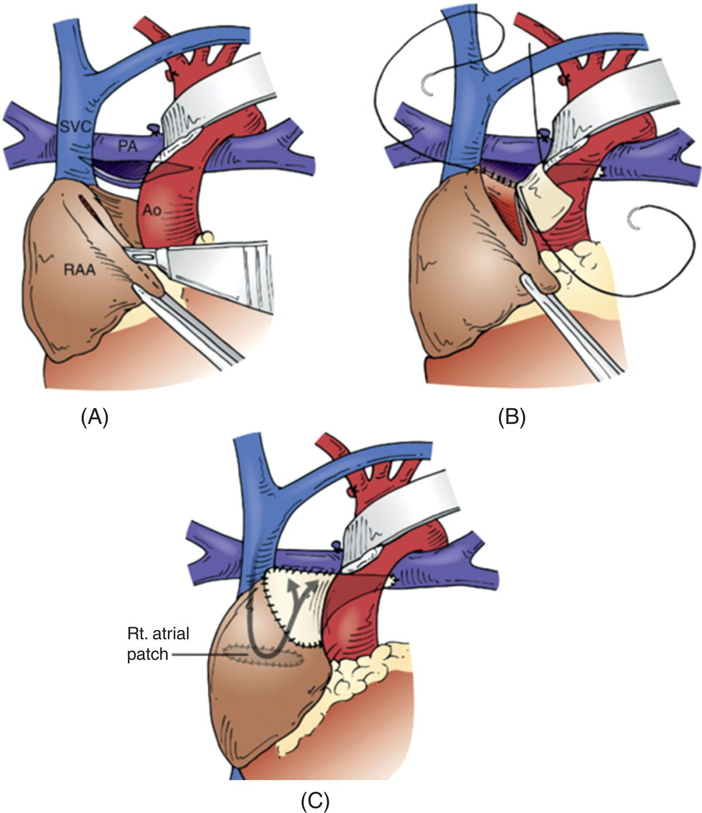

[**Figure 30.14**](#R_c30-fig-0014) Hemi‐Fontan procedure. (A) Central pulmonary arteries (PAs) are opened anteriorly from posterior to the superior vena cava (SVC) to distal to insertion of the ligamentum arteriosum. An incision is made in the base of the right atrial appendage extending up to the SVC/right atrium (RA) junction. (B) The inferior aspect of the pulmonary arteriotomy is sutured to the outside of the SVC. (C) A patch of polytetrafluoroethylene (PTFE) is sutured within the RA at the level of the limbus.

(Source: Murthy et al. \[127\]. Reproduced with permission of Elsevier.)

Additional surgical procedures are frequently necessary at the time of SCPC. These can include patch augmentation of the PAs, atrial septectomy, correction of residual coarctation after Norwood stage I palliation, annuloplasty for AVVR, or correction of other significant anatomic problems. For patients who have undergone a hybrid Stage I procedure, the comprehensive Stage II procedure will involve a Norwood‐type arch reconstruction, PAB removal, atrial septectomy, and removal of the DS in addition to SCPC \[41, 164\]. A thorough understanding of additional surgical procedures and preoperative discussion of the intraoperative plan with the surgeon and perfusionist are essential to ensure optimal patient outcomes.

### Anesthetic considerations

#### Preoperative considerations

A successful conversion from a “parallel” circulation based upon complete mixing and parallel perfusion of both the systemic and pulmonary vascular beds via an arterial shunt to a “series” circulation where PBF becomes a diversion of systemic venous return requires certain preconditions. Preoperative evaluation should assure adequate candidacy for the SCPC, evaluating PA pressures, the size of the branch PAs, and any other anatomic issues requiring surgical intervention. As blood flow through the pulmonary circulation will be passive and dependent on the TPG after SCPC, pulmonary venous obstruction or elevations in either PA pressures or PVR will not be well tolerated. Optimal pre‐SCPC characteristics are listed in [Table 30.5](#c30-tbl-0005) (See [Table 30.5](#c30-tbl-0005)) \[28\].

[**Table 30.5**](#R_c30-tbl-0005) Optimal pre‐superior cavopulmonary connection characteristics

Source: Roeleveld et al. \[28\]. Reproduced with permission of Cambridge University Press.

<table border="1"><tbody class="tdcolor6"><tr><td class="left">Age 4–6 months</td></tr><tr><td class="left">Normal weight for age</td></tr><tr><td class="left">Normal caloric goals during the inter‐stage period</td></tr><tr><td class="left">Competent systemic atrioventricular valve</td></tr><tr><td class="left">Pulmonary vascular resistance &lt;2 U/m2</td></tr><tr><td class="left">Mean pulmonary artery pressure &lt; / = 18 mmHg</td></tr><tr><td class="left">Normal ventricular function</td></tr><tr><td class="left">Transpulmonary gradient &lt;9 mmHg</td></tr><tr><td class="left">No pulmonary disease leading to pulmonary venous desaturation</td></tr><tr><td class="left">No venovenous collaterals</td></tr><tr><td class="left">No aortic arch narrowing or re‐coarctation</td></tr><tr><td class="left">No pulmonary artery distortion</td></tr><tr><td class="left">Single‐ventricle end‐diastolic pressure &lt;12 mmHg</td></tr></tbody></table>

Cardiac catheterization remains the standard imaging modality for assessing vascular anatomy before SCPC; it also provides the opportunity to measure PA pressures and resistances and perform interventions if necessary. Noninvasive methods of assessing the anatomy and physiology, such as cardiac MRI or cardiac CT angiography, have also been successfully utilized in patients who do not require catheter‐based interventions before surgery \[165\]. Knowledge of PVR, ventricular end‐diastolic pressure, AV valve function, and any residual obstruction at the atrial septum remnant is desirable before surgical intervention. Elevated PVR can encompass two distinct mechanisms: the size of the major branches and the state of the arteriolar resistance vessels. Patients who have undergone a hybrid procedure are more likely to develop PA stenosis requiring intervention. In contrast, infants who underwent conventional Stage I palliation are at a higher risk for aortic arch narrowing or re‐coarctation \[166, 167\]. In addition, angiography can evaluate for the presence of accessory venous communications between the superior venous drainage and the heart or IVC (e.g., left SVC to coronary sinus). Postoperatively, such vessels can serve as a mechanism by which upper body venous return is diverted to the heart without passing through the pulmonary circulation, resulting in increased levels of hypoxemia. Pulmonary vein desaturation noted preoperatively may result from lung disease and later help explain low postoperative oxygen saturation.

In addition to catheterization or other imaging data, a recent ECG and echocardiogram should also be reviewed. An evaluation of other vital organ systems with a history of primary or secondary dysfunction should be incorporated, along with a detailed history regarding the child’s response to sedative medications and anesthetics. For patients receiving anticoagulant medications or functional platelet inhibitors, plans for perioperative management of those therapies should be formalized. Often patients are taking low‐dose aspirin with the goal of inhibiting platelet function to maintain mBTTS patency; some institutions routinely discontinue aspirin 7–10 days preoperatively, while others do not. Risk factors that have been identified for postoperative complications after SCPC include lower weight for age, female sex, and aortic atresia with mitral stenosis \[168\].

#### Intraoperative considerations

When infants return for SCPC, some may manifest early signs of separation anxiety. Although the use of sedative premedication such as oral midazolam may be considered before separation from the parents, some institutions prefer not to premedicate these patients. After placement of standard non‐invasive monitoring, anesthesia can be induced with a variety of IV or inhaled agents unless preoperative assessment demonstrated ventricular dysfunction or other anatomic concerns. Although these infants have the same anatomy and physiology as neonates following Stage I palliation, maturation and compensatory mechanisms in myocardial development make them significantly more resilient. As baseline PVR is low, even extreme measures cannot produce a substantial reduction in PVR from baseline values, and therefore changes in Qp: Qs are relatively small.

Following induction and tracheal intubation, direct arterial monitoring access is obtained. The site chosen for arterial access may vary according to several considerations. The placement of an mBTTS may have compromised the ipsilateral subclavian artery, and, additionally, previous monitoring and catheterization sites may not be available. A variety of aortic arch branching patterns also exist, which can result in subclavian artery stenosis. Non‐invasive arterial pressure measurement on all four extremities can aid in providing information to identify the most appropriate site(s). Institutional preferences vary regarding cannulation of the central veins, with some institutions avoiding accessing the internal jugular (IJ) or subclavian veins due to concern for thrombosis. Others may choose to cannulate the femoral vein as the major central venous access, also placing a small (3 French) catheter in the right IJ vein to monitor PA pressure for 12–24 hours postoperatively. If the IJ vein is utilized, it is essential to note catheter length and placement, as surgical cannulation occurs high on the SVC for this procedure. In addition, many centers use NIRS monitoring intra‐ and postoperatively, measuring both cerebral and somatic saturations.

The majority of SCPC patients are undergoing repeat sternotomy and may have mediastinal adhesions, incurring an increased risk for bleeding and pre‐CPB arrhythmias from the extensive electrocautery required at times. Appropriate precautions include administration of antifibrinolytic agents, large‐bore IV access with blood products prepared for immediate administration, the application of external cardioversion/defibrillation pads to the patient, and preparation of the heparin dose and a primed CPB circuit.

Unlike stage I palliation, the SCPC provides significant hemodynamic benefit. As the circulations are no longer connected in parallel postoperatively, the volume output demand for the SV is now reduced to that necessary to perfuse the systemic circulation alone. Pulmonary blood flow becomes a diversion for venous return from the upper body, effecting a “series” circulation of a pump and two resistors. As the volume of blood flow to the upper body is at least as great as that to the lower body at 6 months of age, the mixture of oxygenated and deoxygenated blood remains 1: 1 or higher. Thus, although the expected systemic oxygen saturation does not change appreciably, the heart is only required to perform half the volume work (Qs) to accomplish this. Although most patients exhibit robust hemodynamics on completion of this procedure, the ready availability of inotropes including epinephrine and inodilators such as milrinone is recommended, as infants with diastolic dysfunction or valvular regurgitation may benefit from them.

With PBF now reliant upon passive venous flow from the SVC, measures designed to minimize the impediments to PBF assume paramount importance. As medical therapies are limited in their capacity to produce reliable, substantial improvement in ventricular compliance or AV valve function, attention is focused on minimizing PVR. Shortly before the termination of CPB, the tracheal tube should be cleared of secretions and the lungs completely re‐expanded, as PVR will be minimized at normal FRC and both atelectasis and alveolar overdistension increase PVR. A tidal volume designed to achieve a normal PaCO2 at a respiratory rate no greater than 20 should be selected. Doppler flow studies have demonstrated that PBF occurs preferentially during the expiratory phase of positive pressure ventilation (PPV) in patients following cavopulmonary anastomosis and thus attempts to limit the respiratory rate and inspiratory time to <1 second are warranted \[169\]. Positive end‐expiratory pressure (PEEP) is applied judiciously to preserve normal FRC. Ventilatory strategies producing a PaCO2 of 45–50 mmHg will increase cerebral blood flow (CBF), increasing PBF through the direct SVC–PA connection. This strategy not only increases systemic and cerebral oxygen saturations but also facilitates increases in systemic oxygen delivery \[170\]. In instances where significant hypoxemia persists despite optimization of other measures, iNO can be used to lower PVR.

Modified ultrafiltration (MUF) offers significant benefits to patients following SCPC and is utilized immediately following the termination of CPB \[171\]. Postoperative blood loss and the proportion of patients demonstrating significant pleural and pericardial effusions are significantly reduced. Other investigators have shown benefits in pulmonary function that may prove particularly crucial in this population. Infants for SCPC represent a high‐risk group for postoperative bleeding as they have multiple risk factors that can exacerbate bleeding, including age <2 years, reoperation, hypoxemia, frequent use of aspirin, and, for some, the use of deep hypothermic bypass management. Upon completion of MUF, the heparin effect is reversed with protamine. After acceptable hemodynamics and hemostasis are achieved, most patients can be extubated in the OR or shortly after arrival in the ICU.

#### Postoperative considerations

Cardiopulmonary interactions assume great importance after SCPC. Maintaining a low trans‐pulmonary gradient (TPG) is essential to encourage PBF and optimize CO. Early extubation, whenever possible, facilitates this goal as PPV has been shown to reduce PBF in patients after SCPC or Fontan palliation \[172\]. Cerebral NIRS and cardiac index have been shown to increase while CVP decreases after extubation, suggesting that improvements in cerebral perfusion pressure (CPP) occur \[173\].

Systemic oxygen saturation of 75–80% is typically expected after SCPC. The presence of an SVC catheter measuring PA pressure used in combination with atrial pressure measurement yields important information. A CVP of 12–18 is often observed post‐SCPC, and normovolemia should be maintained. Most institutions prefer hemoglobin levels to be maintained >13 to maximize oxygen‐carrying capacity. Flow from the SVC to the pulmonary vascular bed provides approximately one‐third of CO, while flow from the IVC to the atrium provides two‐thirds. Assuming an oxygen saturation of 100% from the pulmonary veins and a SvO2 of 70% from the IVC, an approximate systemic saturation of 80% can be anticipated (100 + 70 + 70/3). Decreases in PBF may therefore not affect systemic oxygen saturation as much as decreases in systemic blood flow. As multiple factors affect systemic saturations, all possible etiologies should be considered when postoperative hypoxemia of greater magnitude than anticipated persists (see [Table 30.6](#c30-tbl-0006)) \[174\].

Low CO should be recognized promptly, as resultant decreases in SvO2 will adversely impact systemic oxygenation and increases in ventilation will not address this issue. Instead, the goal should be to increase CO and raise IVC saturations to 70%. Although the incidence of myocardial dysfunction is low following SCPC, it does occur. In the absence of significant hemodynamic causes (e.g., aortic arch obstruction or AVVR), an issue with myocardial protection or coronary perfusion might be suspected. Despite their young age, some infants have developed extremely thick ventricular walls, particularly in the context of a high Qp:Qs and residual aortic arch obstruction. Even under optimal conditions, the compliance of these hearts may not return quickly.

[**Table 30.6**](#R_c30-tbl-0006) Potential causes of early cyanosis postbidirectional Glenn/Hemi‐Fontan procedure

Source: Zampi et al. \[174\]. Reproduced with permission of SAGE Publications.

<table border="1"><tbody class="tdcolor6"><tr><td class="left">Pulmonary venous desaturation</td></tr><tr><td class="left">Lung disease (V/Q mismatch)</td></tr><tr><td class="left">Systemic venous desaturation</td></tr><tr><td class="left">Low‐cardiac output</td></tr><tr><td class="left">Anemia</td></tr><tr><td class="left">Right‐to‐left shunts</td></tr><tr><td class="left">Venovenous collaterals (i.e., SVC to pulmonary veins or SVC to IVC)</td></tr><tr><td class="left">Failure to ligate azygous or hemiazygous veins</td></tr><tr><td class="left">Undiagnosed contralateral SVC (usually LSVC)</td></tr><tr><td class="left">Hemi‐Fontan baffle leaks (unique to HFP)</td></tr><tr><td class="left">Decreased pulmonary/cerebral blood flow</td></tr><tr><td class="left">ASD restriction</td></tr><tr><td class="left">PA stenosis</td></tr><tr><td class="left">PA thrombosis</td></tr><tr><td class="left">SVC stenosis</td></tr><tr><td class="left">SVC thrombosis</td></tr><tr><td class="left">Elevated pulmonary vascular resistance</td></tr><tr><td class="left">Elevated systemic ventricular EDP</td></tr><tr><td class="left">Increased PA pressures due to additional sources of pulmonary flow</td></tr><tr><td class="left">Increased intrathoracic pressure</td></tr></tbody></table>

Abbrevations: ASD, atrial septal defect, EDP, end‐diastolic pressure; HFP, hemi‐Fontan procedure; IVC, inferior vena cava; LSVC, left superior vena cava; PA, pulmonary artery; SVC, superior vena cava; V/Q, ventilation/perfusion.

Potential factors affecting pulmonary venous return and its impact on oxygen saturations should be considered. Pulmonary venous return can be diminished in the setting of diastolic dysfunction, AV valve insufficiency, loss of AV synchrony, or a restrictive atrial septum. Obstruction or thrombosis within the SCPC can exist; an increase in CVP aids in recognizing this issue. Veno‐venous collaterals may allow a “pop‐off” of venous blood from the SVC or pulmonary vascular bed to the IVC, decreasing blood flow to the lungs and negatively impacting systemic oxygen saturation. Echocardiography can detect many causes of refractory cyanosis. However, if venous collaterals, SVC or PA thrombosis, or a restrictive atrial septum are suspected, a diagnostic cardiac catheterization with the potential for intervention may be indicated. If diminished SCPC flow is believed to be due to increased PVR, treatment with oxygen or pulmonary vasodilators may prove beneficial. Patients with pre‐existing lung disease often have pulmonary venous desaturation.

The “cavopulmonary–cerebral” circulation, referring to the connection of the SVC, which drains the cerebral circulation, to the PA, is an important physiological principle following SCPC ([Figure 30.15](#c30-fig-0015)). The transition to SCPC physiology is associated with increased cerebral oxygen saturation and a decrease in CBF velocity \[175\]. Because of the relatively large size of the young infant’s brain and the responsiveness of CBF to PaCO2, the PaCO2 has an enhanced direct effect on PA flow after SCPC. A PaCO2 of 40–45 mmHg results in improvements in cerebral and systemic oxygenation and systemic CO when compared with a PaCO2 in the 30–35 mmHg range \[170\]. In the setting of a lower PaO2 and SpO2 than desired, appropriate PaCO2 levels should be ensured. Among other benefits of early tracheal extubation, the mild elevation in PaCO2 observed with spontaneous ventilation has significant advantages for the cavopulmonary–cerebral circulation. In addition, elevating the head 30–45° and maintaining a neutral neck position, without rotation, extension, or flexion, promotes optimal cerebrovenous drainage and improves oxygenation.

Systemic hypertension is another commonly observed problem early in the postoperative period. One of the proposed mechanisms for this phenomenon is the readjustment of the cerebral circulation to higher venous pressures after SCPC. Before SCPC, the cerebral venous pressure is usually 4–8 mmHg; after SCPC, SVC pressure is equal to PA pressure and is elevated to a mean of 12–18 mmHg. The CPP is thus reduced, and hypertension is thought to be a response to preserve CPP. [Table 30.7](#c30-tbl-0007) presents hemodynamic and oxygenation status problems and differential diagnosis in the early postoperative period after SCPC.

Special considerations exist for patients who require CPR or mechanical circulatory support (MCS) post‐SCPC. Chest compressions will create systemic blood flow but little PBF in this patient subset, limiting oxygenation and CO. Adequate chest recoil will allow blood flow through the lungs and enhance flow from the IVC, providing preload \[118\]. Resultant elevations in SVC pressure and decreases in CPP will also increase the risk of subsequent neurological injury. Longer‐term MCS is emerging as an option for SV patients after SCPC \[176\].

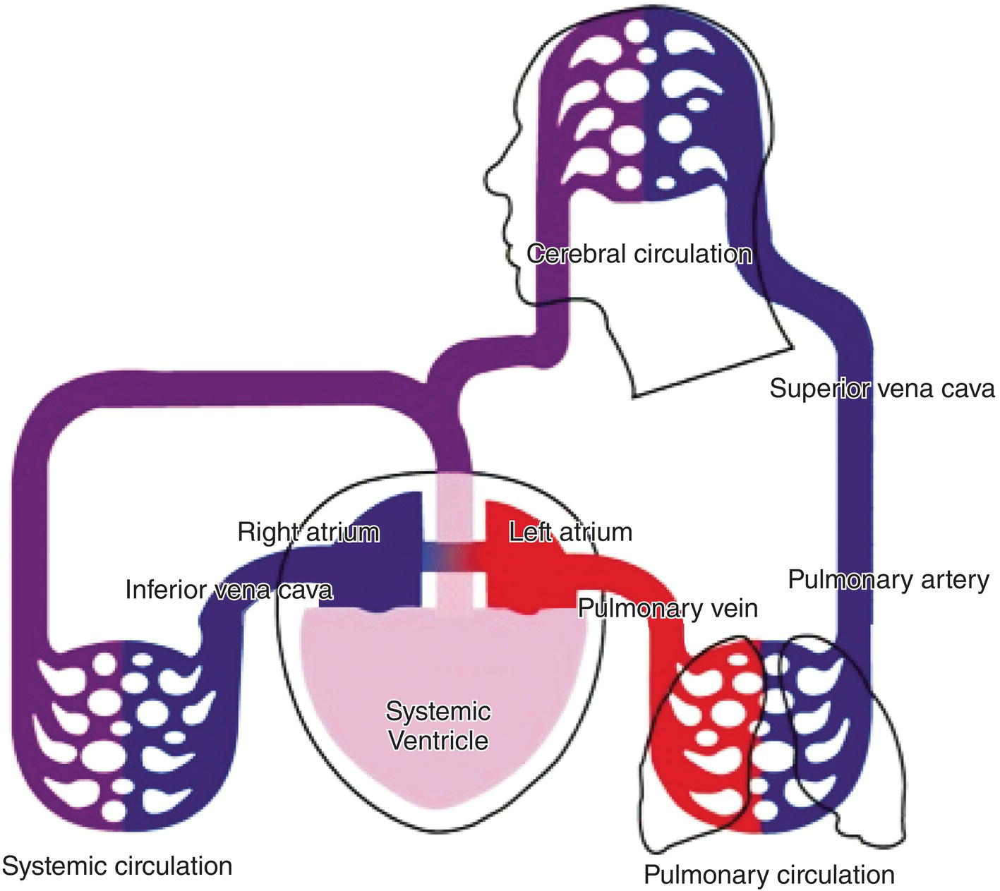

[**Figure 30.15**](#R_c30-fig-0015) The cavopulmonary–cerebral circulation after superior cavopulmonary anastomosis. The relatively large brain of the young infant carries a large percentage of the cardiac output. Hyperventilation will decrease PaCO2, constricting the cerebral arterioles and decreasing cerebral blood flow and cerebral oxygen saturation. This, in turn, decreases superior vena cava flow, decreasing pulmonary artery flow, which will lead to decreased systemic arterial oxygenation.

(Source: Stephen A. Stayer, MD. Reproduced with permission.)

[**Table 30.7**](#R_c30-tbl-0007) Hemodynamic status and differential diagnosis in the postoperative superior cavopulmonary anastomosis patient

| Status | PAP (mmHg) | LAP (mmHg) | TPG (mmHg) | SpO2 (%) | Etiologies |
| --- | --- | --- | --- | --- | --- |
| Normal | 10–15 | 2–6 | <10 | 80 ± 5 | Ideal status |
| Elevated PAP | \>15 | 2–6 | \>10 | <75 | High PVR; PA or PV obstruction |
| Elevated LAP | \>15 | \>8–10 | <10 | <75 | Ventricular systolic/diastolic dysfunction; sub‐AS; AVVR; tamponade |
| Cyanosis | 10–15 | 2–6 | <10 | <75 | Decreased CBF; PV desaturation; decompressing veins; hypovolemia; anemia |

PAP, pulmonary artery pressure as measured in the superior vena cava; LAP, left or common atrial pressure; TPG; transpulmonary pressure gradient (PAP–LAP); PVR, pulmonary vascular resistance; PV, pulmonary vein; AS, aortic stenosis; AVVR, atrioventricular valve regurgitation; CBF, cerebral blood flow.

### Outcomes

Overall outcomes following SCPC have been excellent in experienced centers, with a low early mortality rate of 3–4.7% \[177\]. Similar outcomes (mortality 4%) have also been reported for patients undergoing a comprehensive stage II procedure after an initial hybrid Stage I procedure \[163\]. A list of risk factors for complications, length of stay, and transplant‐free survival has continued to evolve over the past decade \[178\]. Attrition between the SCPC and Fontan completion for HLHS patients has been reported to be independently associated with moderate or severe tricuspid valve regurgitation and low weight at the time of SCPC. Recent data from interstage home monitoring programs also indicate a continuing vulnerability and divergence in survival at 1 year for patients who required inpatient surveillance between their Stage I and II procedures \[179\].

* * *

### KEY POINTS: SUPERIOR CAVOPULMONARY CONNECTION

-   SCPC is generally performed between 3–6 months of age and is normally the second stage of palliation for SV patients.
-   SCPC results in significant unloading of the systemic ventricle and stabilization of the circulation, particularly in HLHS.
-   The creation of a “cavopulmonary–cerebral” circulation with SCPC is an important concept. Mild hypercarbia will promote cerebral and cavopulmonary blood flow, improving cerebral and systemic oxygenation and oxygen delivery.

* * *

## Fontan completion

### Surgical procedure

The Fontan procedure is the final stage in staged surgical single‐ventricle palliation. The two Fontan variations currently used are the lateral tunnel (LT) and the extracardiac conduit (ECC), both also referred to as total cavopulmonary connection (TCPC) (see [Figure 30.16](#c30-fig-0016)). In earlier versions of the Fontan operation, the RA appendage was directly anastomosed to the PAs; this approach was known as an atriopulmonary Fontan and has been abandoned due to long‐term adverse hemodynamic sequelae. These variations and conversion to modern Fontan configurations are discussed in [Chapter 20](c20.xhtml).

The LT Fontan procedure is generally performed after the HF. After the institution of CPB with aortobicaval cannulation, moderate hypothermia and aortic cross‐clamping are utilized. The RA is opened, the PTFE patch beneath the SVC‐PA anastomosis is excised, and an intra‐atrial PTFE tunnel is placed between the SVC‐PA anastomosis and the orifice of the IVC \[180\]. Additional surgical procedures such as AVV repair, PA augmentation, atrial septectomy, and correction of residual coarctation can be performed simultaneously if necessary. Some surgeons create a 3–5 mm fenestration in the wall of the PTFE graft to permit blood flow from the higher pressure Fontan pathway to the lower pressure common atrial chamber (see [Figure 30.17](#c30-fig-0017)). Blood shunting via the fenestration to the common atrium augments CO, although this occurs at the expense of increased arterial desaturation due to the right‐to‐left shunt. As LT Fontan does not include circumferential graft material, pathway growth can occur, making the procedure possible in patients as young as 18 months of age.

In contrast, the ECC Fontan is generally performed following a BDG procedure. Mild hypothermic CPB is used, and aortic cross‐clamping may not be necessary unless additional intracardiac procedures warrant its use. An 18–20 mm PTFE tube graft is sewn outside the heart, connecting the IVC directly to the underside of the right PA. As this tube graft will not grow, patient size is a consideration when performing an ECC Fontan. In some institutions, the ECC Fontan is performed with only partial right heart bypass, reducing circuit volume and obviating the need for blood transfusion in many patients \[181\]. The graft may be offset medially from the SVC–right PA anastomosis to improve flow dynamics so that IVC flow is preferentially directed to the left PA and SVC flow to the right PA. A potential drawback to this offset is that “hepatic factor” from the IVC may not perfuse the right PA, resulting in the development of PAVMs in the right lung. A fenestration may also be placed in the ECC configuration, though this is less commonly done to avoid arterial desaturation, ongoing risk of thromboembolism, and the potential need for intervention and fenestration closure at a future date. However, if the creation or enlargement of a fenestration becomes necessary in the future to treat Fontan failure or perform an electrophysiologic study, it is considerably more challenging to perform in an ECC Fontan due to anatomic considerations. A recent meta‐analysis examining the effect of fenestration on outcomes demonstrated that having a fenestration reduced pulmonary pressure and reduced prolonged pleural drainage after the Fontan procedure, with no increased incidence of stroke observed. However, fenestration did not decrease the risk of Fontan failure, early death, or hospital stay after Fontan completion \[182\]. The intra/extracardiac conduit, a modification of the ECC Fontan, more easily permits the creation of a fenestration. This configuration alters the IVC connection to the ECC in that a small incision is made in the atrium, with the ECC then connected to the orifice of the IVC. A 4‐mm fenestration is made in a short segment of the PTFE graft in the atrium before the ECC emerges out of the side of the atrium to continue to the PA anastomosis as in a standard ECC \[183\] (see [Figure 30.18](#c30-fig-0018)).

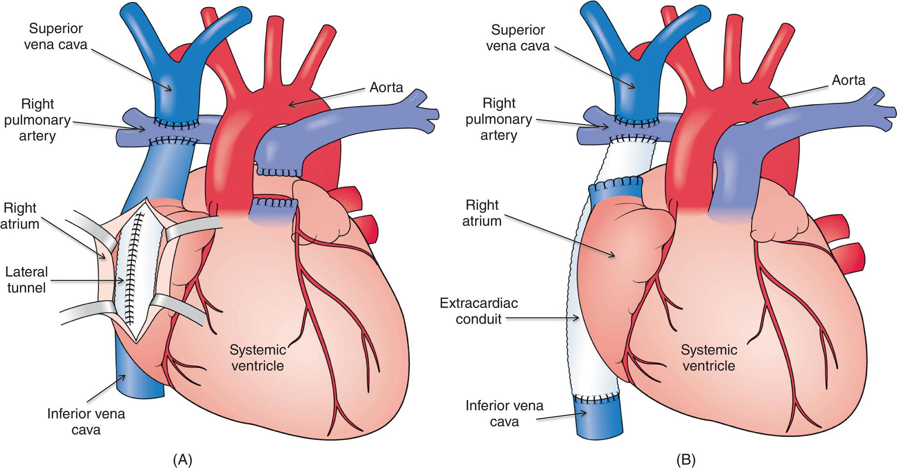

[**Figure 30.16**](#R_c30-fig-0016) A lateral tunnel Fontan total cavopulmonary connection. (A) A polytetrafluoroethylene (PTFE) patch or tube is fashioned inside the right atrium. (B) Extracardiac conduit Fontan. The PTFE tube is anastomosed outside the heart from the detached inferior vena cava directly to the right pulmonary artery.

(Source: Andropoulos et al. \[35\]. Reproduced with permission of Elsevier.)

As the Fontan pathway is a low‐flow system, optimizing fluid dynamics and minimizing energy loss is essential. Computational fluid dynamic models pioneered by de Leval have demonstrated hemodynamic performances of various Fontan anastomoses \[184\]. The combination of the HF followed by the Fontan procedure showed the lowest energy losses in a study by Bove et al. \[185\]. More recently, a Y‐graft ECC Fontan, designed to allow more even distribution of hepatic blood flow, was shown over 3 years to significantly balance flow \[186\] (see [Figure 30.19](#c30-fig-0019)). To date, flow studies have still not definitively identified the best Fontan technique.

The choice between an ECC or LT Fontan is often institution or surgeon‐specific and may also depend on the type of SCPC previously created. Early studies suggested that complications such as atrial arrhythmias and sinus node dysfunction might be due to intra‐atrial suture lines and atrial manipulation during the creation of an LT Fontan \[187, 188\]. However, in a meta‐analysis comparing early and long‐term mortality, long‐term arrhythmias, Fontan take‐down, postoperative ventilation, ICU stay, thrombosis, and pleural or pericardial effusion, no differences were observed between patients with ECC or LT Fontan. The ECC Fontan patients had a lower incidence of supraventricular tachycardia 30 days post‐Fontan and a lower rate of protein‐losing enteropathy (PLE) compared with LT Fontan \[189\]. In 2020, an extensive retrospective analysis compared the LT and ECC techniques, finding that patients with LT Fontan had improved short‐ and mid‐term survival and more extended freedom from Fontan failure compared with ECC Fontan patients \[190\]. Evidence has demonstrated that both procedures provide effective Fontan circulations with excellent outcomes.

#### Fontan physiology

The cardiovascular system in a biventricular patient has two circuits connected in series: pulmonary and systemic, each supplied with energy from a ventricular pump. In contrast, in SV patients after Fontan palliation, energy for both circuits must be provided by a single ventricular pump. After traversing the systemic circulation, the remaining energy in the systemic central veins must drive blood through the Fontan pathway and the pulmonary circulation. A visual of blood traversing these different circulations is shown in [Figure 30.20](#c30-fig-0020). Fontan physiology has two significant consequences that affect all Fontan patients to varying degrees: elevated CVP and diminished effective CO. As a result of these, a myriad of end‐organ sequelae develop \[191\].

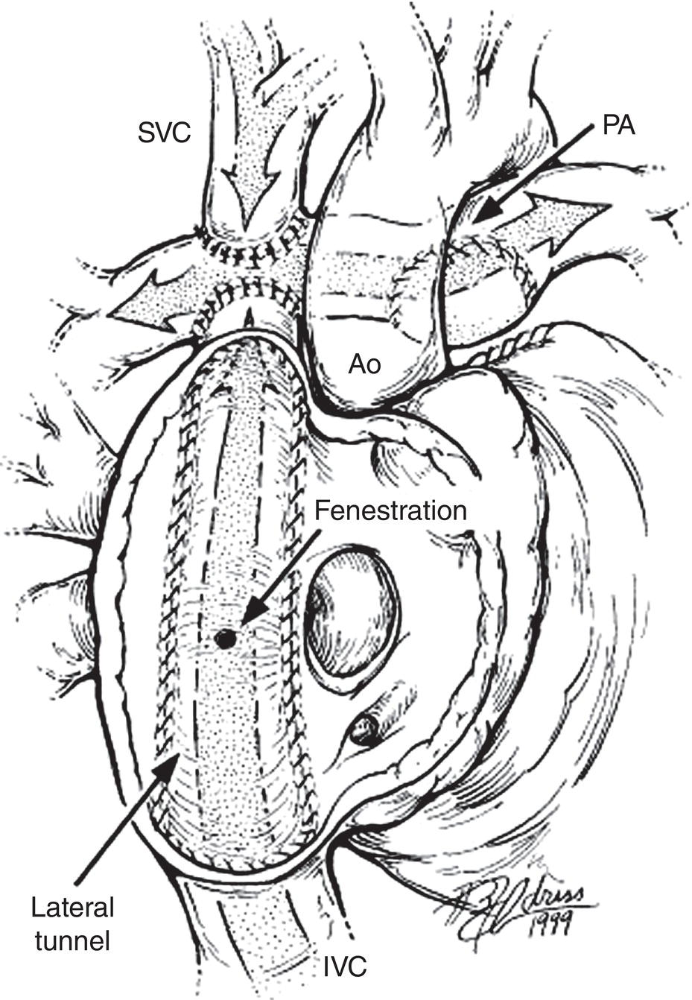

[**Figure 30.17**](#R_c30-fig-0017) Lateral tunnel Fontan demonstrating a fenestration in the wall of the polytetrafluoroethylene tube that allows right‐to‐left blood flow from inside the Fontan circuit to the left atrial side. The fenestration is 3–5 mm in diameter and results in higher total cardiac output and oxygen delivery early in the postoperative course, at the expense of some arterial desaturation.

(Source: Andropoulos et al. \[35\]. Reproduced with permission of Elsevier.)

The TPG measures the pressure gradient driving blood from the central veins via the Fontan pathway through the lungs and into the common atrium. If PVR is elevated, blood flow through the lungs will be impeded, resulting in diminished ventricular filling and decreased CO. _The classic physiologic elements which control CO in a biventricular circulation – heart rate, preload, afterload, and contractility – do not do so in the Fontan circulation_. In a Fontan circulation, except for physiologic extremes such as significant tachycardia, bradycardia, or severe ventricular dysfunction, CO is determined by PBF \[192\].

This concept is modeled in [Figure 30.21](#c30-fig-0021), which depicts differences between low, medium, and high PVR and the effects on CO \[193\]. Due to limited ventricular filling, CO in a Fontan patient is 70–80% of that expected for age and body surface area in a biventricular patient \[194\]. An inverse relationship exists between PVR and CO. Additionally, the benefit of increasing contractility in a Fontan circulation is limited, as greater contractility does not increase output when filling is limited.

### Anesthetic considerations

#### Preoperative considerations

The Fontan pathway is a low‐pressure system and is significantly affected by pressure elevations due to anatomic obstructions and resistance to flow. Ideal pre‐Fontan characteristics include normal AV conduction, normal mean PAP, normal atrial pressure, normal systemic venous return, PVR <4 Woods units/BSA, PAs of adequate size that lack distortion, a competent AVV, and good ventricular function (see [Table 30.8](#c30-tbl-0008)) \[28\].

Cardiac catheterization has been the traditional gold standard for preoperative assessment before the Fontan procedure, as not all SCPC patients are good candidates for Fontan completion. Criteria for cardiac catheterization include the following: patients with severe AVV or ventricular dysfunction, pulmonary vein stenosis, systemic obstruction, suspected pulmonary or SCPC obstruction, history of a complicated post‐SCPC course, current oxygen saturation <75%, or suspected veno‐venous or arteriopulmonary collaterals. Catheterization can provide information regarding the TPG, ventricular end‐diastolic pressure, PVR, mean PA pressure, and common atrial pressure. However, cardiac catheterization is an invasive procedure utilizing ionizing radiation and, often, general anesthesia. Non‐invasive imaging techniques such as cardiac MR or CT, along with echocardiography, can be used to assess low‐risk patients who do not require pre‐surgical intervention. These modalities also often require anesthesia or sedation. Fogel et al. compared the quality of information achieved in 410 patients utilizing cardiac MR, cardiac catheterization, or both. Diagnostic success was >95% in all three groups, and early post‐surgical outcomes were equivalent. Significant radiation exposure was avoided in the cardiac MR patient group, but general anesthesia was used for this procedure \[195\].

Preoperative assessment should also include a review of the most recent cardiology visit and at‐home medications. Management of anticoagulant medications often occurs in conjunction with the pediatric cardiologist. Patients whose medications include diuretics and afterload reducing agents should be advised to hold their day of procedure doses to decrease the risk of hemodynamic instability in the pre‐CPB period. Additionally, information about prior sedative and anesthetic encounters, including airway management, should be ascertained.

#### Intraoperative considerations

Patients commonly present for Fontan completion between 18 months and 4 years, and as they have had many previous procedures, significant separation anxiety is not unusual. Anxiolysis may be achieved with midazolam, administered either orally or intranasally, or intranasal dexmedetomidine. It is helpful to review and discuss with the parents the history of the individual child’s response to previous sedatives in order to choose the optimal premedication.

As with SCPC, anesthesia for Fontan completion can be induced with any of several IV or inhaled agents after the application of standard non‐invasive monitors and NIRS monitoring. Unless myocardial dysfunction or unusual hemodynamic loading conditions (e.g., aortic arch obstruction or AV valve insufficiency) are present, SCPC patients generally tolerate the qualitative hemodynamic effects of anesthetic agents similarly to children without CHD. However, inhalation induction is slower due to the right‐to‐left shunting bypassing the lungs and delaying anesthetic uptake \[196\]. Some anesthesiologists prefer lower extremity peripheral IV access in patients with SCPC circulation as volume infused into an upper extremity IV will travel via the SVC into the pulmonary vascular bed before entering the common atrium. However, vascular access can prove challenging in patients with multiple prior procedures, and choices for placement may be limited. Cannulation of the IJ or subclavian vein is often used for central pressure monitoring, with the recognition that in SCPC patients, this catheter will measure PA pressure. The surgical team will usually place a transthoracic monitoring catheter in the common atrium to allow TPG calculation. Centrally located catheters are frequently removed early in the postoperative period to avoid the risk of thrombosis. During the pre‐CPB period, the SCPC circulation remains dependent on blood return from the SVC to provide PBF. As hyperventilation can decrease CBF, hypocarbia should be avoided and maintenance of normocarbia or mild hypercarbia should be the goal. As patients presenting for Fontan palliation have had prior sternotomies, the potential for significant bleeding upon entering the thoracic cavity exists and appropriate precautions should be in place.

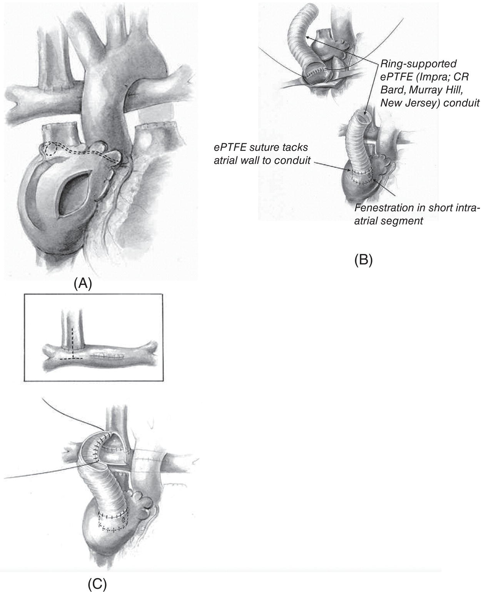

[**Figure 30.18**](#R_c30-fig-0018) (A) The intra/extracardiac conduit fenestrated Fontan procedure incorporates an atrial incision that avoids injury to the sinus node, the sinus node artery and the crista terminalis. (B) A ring‐supported ePTFE conduit is sutured to the internal orifice of the inferior vena cava. The short intra‐atrial segment is fenestrated. A ePTFE suture tacks the atrial wall to the external surface of the conduit. (C) The beveled distal anastomosis of the intra/extracardiac conduit is usually fashioned to an inverted T incision that crosses the bidirectional Glenn anastomosis with extensions into the proximal and distal right pulmonary artery.

(Source: Jonas \[183\]. Reproduced with permission of Elsevier.)

[**Figure 30.19**](#R_c30-fig-0019) Extracardiac Fontan Y‐graft.

(Source: Trusty et al. \[186\]. Reproduced with permission of Elsevier.)

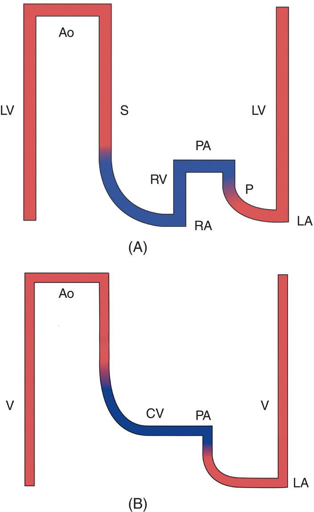

[**Figure 30.20**](#R_c30-fig-0020) Scheme of the normal cardiovascular circulation (A), and the Fontan circulation at different stages B. (A) Normal biventricular circulation: the pulmonary circulation (P) is connected in series to the systemic circulation (S). The compliance of the right ventricle ensures that the right atrial pressure remains lower than the left atrial pressure and delivers the driving force to the blood to overcome pulmonary impedance. (B) Fontan circuit: the caval veins are directly connected to the PA; systemic venous pressures are markedly elevated. Ao, aorta; CV, caval veins; LA, left atrium; LV, left ventricle; PA, pulmonary artery; RV, right ventricle; V, single ventricle. Line thickness reflects output, and color reflects oxygen saturation.

(Source: Gewilig & Goldberg \[193\]. Reproduced with permission of Elsevier.)

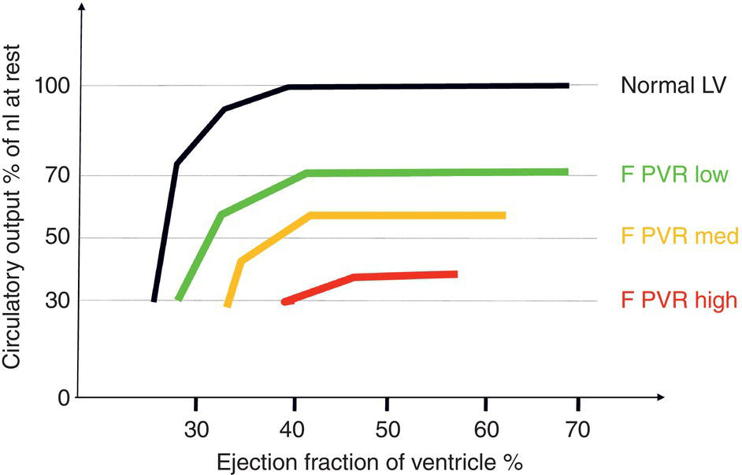

[**Figure 30.21**](#R_c30-fig-0021) Output at rest modulated by pulmonary vascular resistance (PVR). In a normal subject (black line), the ventricular function has little effect on cardiac output except when very poor. The principal determinant of output in patients with Fontan circulation (colored lines) is the degree of the impedance of the pulmonary vasculature resistance (PVR). The higher the PVR (at rest), the lower the cardiac output even in the presence of normal systolic ventricular function; improving systolic function will have no influence on increasing cardiac output at rest.

(Source: Gewilig & Goldberg \[193\]. Reproduced with permission of Elsevier.)

[**Table 30.8**](#R_c30-tbl-0008) Optimal pre‐Fontan characteristics

Source: Roeleveld et al. \[28\]. Reproduced with permission of Cambridge University Press.

<table border="1"><tbody class="tdcolor6"><tr><td class="left">Age &lt;15 years</td></tr><tr><td class="left">Normal atrioventricular conduction</td></tr><tr><td class="left">Normal right atrial volume</td></tr><tr><td class="left">Mean pulmonary artery pressure &lt;/ = 15 mmHg</td></tr><tr><td class="left">Normal systemic venous return</td></tr><tr><td class="left">PVR &lt;4 wood units/m2 BSA</td></tr><tr><td class="left">No pulmonary artery distortion</td></tr><tr><td class="left">Pulmonary artery: aortic diameter ratio &gt; / = 0.75</td></tr><tr><td class="left">Competent systemic atrioventricular valve</td></tr><tr><td class="left">Left ventricular ejection fraction &gt; / = 0.6</td></tr></tbody></table>

A balanced technique combining inhaled sevoflurane, opioid, and neuromuscular blockade is commonly used for anesthetic maintenance. The total opioid dose is often limited to the equivalent of fentanyl 7–15 mcg/kg to facilitate the goal of sufficient emergence from anesthesia to permit tracheal extubation in the OR or soon after arrival in the cardiac ICU. Due to its analgesic and sedative properties, as well as a favorable hemodynamic profile, the use of a dexmedetomidine infusion has become the mainstay in the cardiac OR and it is frequently continued postoperatively in the ICU as well.

Epidural opioids administered via the caudal route have been used by some institutions to facilitate analgesia and early tracheal extubation. A prospective, randomized, double‐blind study comparing caudal morphine (100 mcg/kg before incision) with saline placebo found no difference between groups in achieving either extubation within 30 minutes of surgical end time or freedom from reintubation within 24 hours. The authors concluded that early extubation was feasible for most patients with or without caudal morphine \[197\]. Recently interest has grown in using regional blocks as part of a multimodal approach to postoperative pain management in pediatric cardiac surgery patients \[198\]. These techniques avoid concerns regarding the risk of epidural hematoma with central neuraxial blocks in cardiac surgery patients undergoing full heparinization. However, to date, no data exist specifically examining these techniques in patients undergoing the Fontan procedure.

Children entering the OR have SCPC circulation and are cyanotic to varying degrees. The compensatory polycythemic response to cyanosis leads to higher hemoglobin levels to increase oxygen‐carrying capacity, and some patients may not require a blood transfusion during the Fontan procedure. Thromboelastography or thromboelastometry are often used to measure routine coagulation parameters and guide the use of specific clotting products. The immediate results from the Fontan operation should be the improvement of systemic oxygenation, with an accompanying higher CVP. Post‐CPB management should include volume resuscitation to ensure adequate CVP to support the Fontan circulation, meticulous attention to ventilation to minimize PVR, low‐dose inotropic support, and rapid restoration of hemostasis. As noted previously, PEEP is employed only as necessary at physiologic levels to preserve normal FRC. The Fontan operation is well tolerated by the majority of children. Despite this usual stable course in the operating room, some Fontan patients have prolonged chest tube drainage postoperatively, which can lengthen hospital stay. Vasopressin infusion started in the operating room after CPB and continued for 24–48 hours postoperatively has been reported to reduce chest tube drainage, transpulmonary gradient, postoperative fluid administration, and days chest tubes are indwelling \[199, 200\]. A number of institutions have added vasopressin to their immediate postoperative regimen for the Fontan operation.

Positive pressure ventilation increases intrathoracic pressure, causing a decrease in central venous inflow. Spontaneous ventilation increases central venous filling, increasing blood flow through the Fontan pathway into the lungs. The avoidance of prolonged postoperative PPV should be a routine strategy for patients with Fontan physiology. In a retrospective study, the duration of CPB did not impact the ability to safely extubate patients within 6 hours post‐Fontan. The early extubation group had higher mean arterial pressure and lower mean pulmonary pressure at 6, 24, and 48 hours postoperatively compared with the group with prolonged intubation, leading the authors to conclude that early extubation should be a primary aim to improve postoperative Fontan outcomes \[201\]. Another retrospective study examined 253 patients before and after a programmatic change to extubate all Fontans within 12 hours postoperatively regardless of hemodynamic status, challenging a standard convention of avoiding early extubation in less stable patients. “Instability” was defined as having higher postoperative inotropic scores and volume requirements. Successful extubation was possible in all patients, although a higher re‐intubation rate was observed in unstable patients. Extubation in the unstable patients (_n_ = 50) led to an acute rise in mean arterial pressure and decreases in the inotropic score and volume requirement \[202\].

#### Postoperative considerations

Diminished PBF after the Fontan operation will cause reduced CO, unlike SCPC physiology, in which decreases in PBF result in reduced systemic oxygen saturation. Extreme vigilance is required to maintain adequate intravascular volume in the setting of ongoing blood loss in the early postoperative period. Avoidance of any elevation in PVR is essential. A fenestration may ameliorate some early postoperative hemodynamic instability but will lead to arterial desaturation as deoxygenated blood in the Fontan pathway shunts right‐to‐left into the common atrium, effectively adding ventricular preload. The use of low ventilatory pressures with early extubation should be the aim.

Systemic oxygenation saturation should be near normal in the postoperative period in a patient without a fenestration. A modest degree of hypoxemia can be expected due to a fenestration along with coronary sinus blood flow, which usually enters the common atrium on what is functionally the pulmonary venous side. Persistent systemic oxygen saturation less than 85–90% can result from one or more of the following causes: (i) greater fenestration flow than anticipated; (ii) lung pathology; (iii) venovenous collaterals; (iv) PAVMs causing intrapulmonary shunting; or (v) increases in oxygen demand as seen with decreased CO or sepsis. Differentiating between these concerns can require cardiac catheterization.

Myocardial dysfunction typically follows the same differential described previously for post‐SCPC. Hemodynamic etiologies should be investigated and corrected. However, myocardial dysfunction may also occur as the result of inadequate myocardial preservation, coronary perfusion, or a metabolic process. In the absence of correctable causes such as hypocalcemia, supportive measures represent the mainstay of therapy. Postoperative arrhythmias can occur, and while heart block is uncommon, junctional rhythm may occur in up to 25% of patients. If the escape rate is low enough to cause hemodynamic instability, the use of epicardial, atrial, or AV pacing usually proves beneficial. Tachyarrhythmias are less common in the early postoperative period but are more likely to have a negative hemodynamic impact when present. Doppler interrogations of PBF patterns suggest that diastolic flow is best under normal circumstances \[203\], perhaps explaining the intolerance of tachyarrhythmias. Alternatively, unfavorable hemodynamics may serve to provoke tachyarrhythmias. [Table 30.9](#c30-tbl-0009) presents the differential diagnosis for low SpO2 and blood pressure in the postoperative Fontan patient.

Several risk factors have been identified that can predict prolonged ICU length of stay, which is, in turn, associated with late mortality and the need for late cardiac reoperation. Pre‐existing anatomic risk factors include HLHS, anomalous systemic venous drainage, heterotaxy, and systemic RV. Preoperative predictive factors are higher preoperative hemoglobin and low preoperative oxygen saturation, elevated PAP, and high preoperative TPG. Identified postoperative risk factors include pleural effusion, chylothorax, ascites, and infection \[204–206\].

### Long term complications and outcomes

Long‐term survival has improved significantly since the Fontan procedure was initially described in 1971 \[1\]. Early atriopulmonary Fontan patients have demonstrated worse long‐term outcomes than those with the contemporary forms of TCPC, with a recent study describing only 45% of atriopulmonary Fontan patients free from heart failure, transplantation, or death at 28‐year follow‐up \[207\]. Patients undergoing Fontan completion in the current era have an approximate 30‐year survival of 85% \[208\]. However, the quality of these years can be variable, with half of the patients experiencing a major adverse event before 14 years of age \[209\]. However, a recent study from the Australia and New Zealand Fontan Registry examined patients without a single complicating event before age 16; this included nearly 75% of their Fontan population. Survival in this group was 94% at 30 years, and projection models suggested potential survival for this low‐risk cohort at 60 years to be 49–67% \[210\].

A meta‐analysis evaluating risk factors for late Fontan failure and death found >80% of patients alive 20 years post‐Fontan. Risk factors for late death included PLE, increased end‐diastolic volume (as a surrogate for ventricular dysfunction), and the need for a pacemaker. Causes of death were late Fontan failure (34%), sudden death (19%), and perioperative death (16%). Survival post‐Fontan at 5, 10, and 20 years was 95, 91, and 82% \[211\]. Overall, in calculating life expectancies for congenital heart defects, the life expectancy for a 20‐year‐old Fontan patient was estimated to be equivalent to that of a 64‐year‐old without heart disease \[212\] (see [Figure 30.22](#c30-fig-0022)).

[**Table 30.9**](#R_c30-tbl-0009) Hemodynamic status and differential diagnosis of abnormalities in the postoperative Fontan patient

| Status | PAP (mmHg) | LAP (mmHg) | TPG (mmHg) | Systolic BP (mmHg) | SpO2 | Etiology |
| --- | --- | --- | --- | --- | --- | --- |
| Normal | 10–15 | 2–6 | _<_10 | 85–95 | 95 ± 5 | Ideal status |
| Decreased PAP and LAP | 8–10 | 0–4 | _<_10 | _<_80 | 90 ± 5 | Hypovolemia |
| Elevated PAP | \>15 | 2–6 | \>10 | 80 ± 5 | 90 ± 5 | High PVR; PA or PV obstruction |
| Elevated LAP | \>15 | \>8–10 | _<_10 | 80 ± 5 | 90 ± 5 | Ventricular systolic/diastolic dysfunction; AV dissociation; AVVR; tamponade |
| Cyanosis | 10–15 | 2–6 | _<_10 | 85–95 | _<_85% | Excessive fenestration size or Fontan baffle leak; PV desaturation; decompressing veins; hypovolemia; anemia |

AS, aortic stenosis; AVVR, atrioventricular valve regurgitation; LAP, left or common atrial pressure; (PAP–LAP); SpO2, pulse oximeter saturation; PAP, pulmonary artery pressure as measured in the superior vena cava; PV, pulmonary vein; PVR, pulmonary vascular resistance; TPG, transpulmonary pressure gradient.

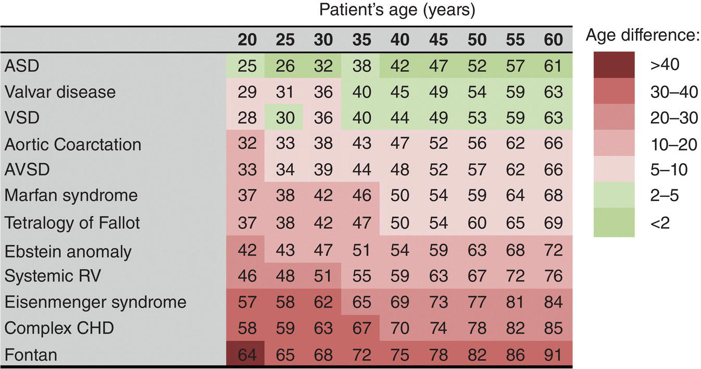

[**Figure 30.22**](#R_c30-fig-0022) Mortality in subgroups of patients compared with mortality in the age‐matched United Kingdom (UK) population. Numbers on the colored surface present the equivalent age – expressed as the age of subgroup of UK population, having similar 5‐year mortality rates. Colors reflect the difference between the relative age and the actual age of patients. The curved line corresponds to the 5‐year risk of death of the general UK population according to life table data. ASD indicates atrial septal defect; AVSD, atrioventricular septal defect; CHD, congenital heart disease; RV, right ventricle; and VSD, ventricular septal defect.

(Source: Diller et al. \[212\]. Reproduced with permission of Wolters Kluwer Health, Inc.)

Significant morbidity in Fontan patients can include heart failure, AVVR, arrhythmias, thrombotic events, lymphatic dysfunction causing PLE and plastic bronchitis (PB), chronic venous insufficiency, renal disease, Fontan‐associated liver disease (FALD), and neurocognitive and psychosocial issues. An increase in PVR normally occurs with aging, and for Fontan patients, this has significant implications. Increased filling pressure accompanying the increasing PVR over time can lead to more substantial decreases in CO and Fontan failure, as shown in [Figure 30.23](#c30-fig-0023) below \[213\].

Heart failure can be classified as either classic pump failure or failure of the Fontan circulation with elevated CVP and diminished CO but preserved function. Many patients have elements of both. Heart failure predicts poor outcomes, with a 1‐year mortality of 24% and 3‐year mortality of 35% \[214\]. Evidence is lacking to support the use of standard heart failure medications in Fontan patients, and concerns exist that vasodilators and diuretics could worsen heart failure in patients with Fontan physiology. However, afterload reduction agents and diuretics are widely used to treat Fontan failure \[215\]. A study examined sildenafil in a double‐blinded, placebo‐controlled, crossover trial of 27 healthy Fontan outpatients, finding that global ventricular performance and measures of CO improved, although diastolic function did not change \[216\]. Phosphodiesterase‐5 inhibitors and endothelin‐1 inhibitors are commonly used to treat Fontan failure.

Atrioventricular valve regurgitation contributes to long‐term morbidity and mortality in Fontan patients, causing Fontan failure at twice the rate compared with patients who do not have AVVR. One third of patients will require AVV repair by age 30 years. Atrioventricular valve regurgitation can lead to ventricular dysfunction or may itself be caused by ventricular failure. Diuretics and afterload reducing agents are frequently utilized, although solid evidence for this therapy is lacking. Optimal timing of valve repair and when and if valve replacement should occur remain unknown \[217\].

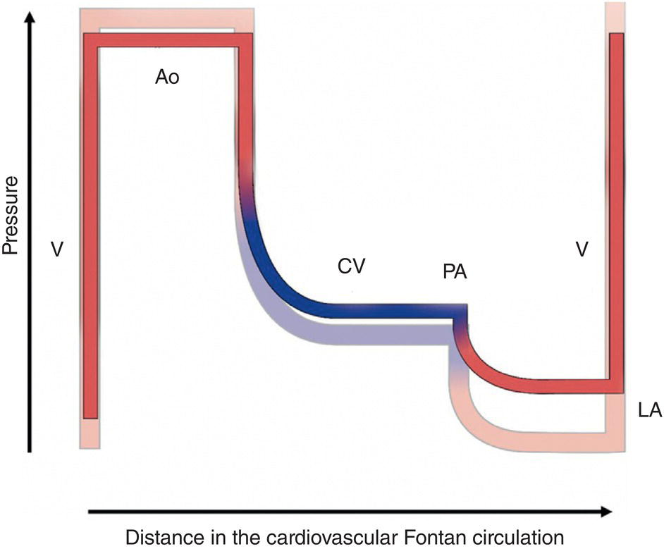

[**Figure 30.23**](#R_c30-fig-0023) Flow/pressure/saturation diagram of the Fontan circulation: changes over time. Fontan haemodynamics late (full color) superimposed on Fontan early (transparent): with time the ventricular end‐diastolic pressure and pulmonary vascular resistance increase, resulting in overall decreased flow and increased caval vein pressure/congestion. A downward progressive spiral ensues. Ao, aorta; CV, caval veins; LA, left atrium; PA, pulmonary artery; V, single ventricle.

(Source: Gewillig et al. \[213\]. Reproduced with permission of John Wiley & Sons.)

Arrhythmias are a common complication of Fontan surgery, with a recent study finding an incidence of 18.9% \[218\]. In the early postoperative period, AVVR is a risk factor for arrhythmias, and later, older age at Fontan and high PAP become predictors \[219\]. Arrhythmia development is an independent risk factor for late Fontan failure and has not been shown to be related to the type of Fontan (LT or ECC). Forty percent of patients with arrhythmias developed reduced ventricular function within 10 years. Ablation was effective, with 50% of patients arrhythmia‐free at 10 years post‐ablation \[218\]. Up to 25% of patients with a Fontan require epicardial pacing to manage late arrhythmias \[220\].

The incidence of thrombosis in one study of 111 patients was 31% at 2.5 years. The risk of thrombosis is highest immediately postoperatively, but the ongoing lifelong risk exists. Prolonged presence of a central line, uncontrolled warfarin use, and lower fraction of inspired oxygen use are all risk factors for postoperative thrombosis \[221\]. Many cardiologists treat low‐risk Fontan patients with antiplatelet medications and add warfarin for higher‐risk patients. Currently, standardized anticoagulation guidelines are lacking.

Fontan‐associated liver disease is likely related to chronically high CVP and diminished effective CO. Hepatic stiffness has been shown to occur immediately after the Fontan operation \[222\]. The liver, despite its dual blood supply, can be compromised when decreased CO results in decreased hepatic arterial flow as the portal system cannot compensate due to a lack of autoregulation. The liver may then be especially susceptible to hemodynamic insults \[223\]. Liver biopsy remains the gold standard for assessing liver dysfunction. However, this is an invasive procedure and incurs the risk of bleeding as well as sedation and anesthesia risks. A recent study using ultrasound‐guided percutaneous liver biopsy in patients at least 10 years post‐Fontan demonstrated that hepatic fibrosis is a universal characteristic of Fontan physiology. Fontan hemodynamics, ventricular function, and AVVR were not associated with the degree of fibrosis \[224\]. Over time, hepatic fibrosis may progress to cirrhosis and hepatic failure. In another study of prospective hepatic screening for Fontan patients >18 years old, 50% were found to have varices, and 25% had hyper‐enhancing liver nodules. Routine imaging, elastography, and biomarkers were unable to assess the severity of liver fibrosis accurately \[225\]. Hepatocellular carcinoma has been reported in young Fontan patients. These findings indicate that ongoing hepatic surveillance is necessary for Fontan patients, but no consensus guidelines currently exist.

The renal system is at risk as well, with a retrospective study showing that acute kidney injury (AKI) was present in 42% of patients post‐Fontan. Independent predictors of AKI included lower renal perfusion pressure and higher inotrope score \[226\]. Using a stringent AKI definition in a prospective study of adult patients with an average age of 28.4 years, 46% had evidence of chronic kidney disease, suggesting that long‐term follow‐up of renal function in Fontan patients is also essential \[227\].

Patients with Fontan circulation might also be expected to experience a range of psycho‐social‐ neurocognitive challenges due to frequent hospitalizations and surgeries and the effects of living with a chronic disease. A recent meta‐analysis examining patients and parent‐proxies reporting on the quality of life of children, adolescents, and adults with Fontan physiology showed that health‐related quality of life (HRQOL) was lower in patients with Fontan physiology than the general population, with the most significant differences being physical functioning and school/work functioning. Older age at the time of Fontan was associated with worse emotional HRQOL, and HLHS was associated with lower social HRQOL \[228\].

#### Protein‐losing enteropathy and plastic bronchitis

Protein‐losing enteropathy (PLE) and PB are two relatively rare complications with a combined incidence of 4.9% at 30 years and 7.4% at 35 years post‐Fontan operation. Freedom from death or transplantation at 5, 10, and 15 years after diagnosis was 70, 65, and 43%, respectively \[229\]. Protein‐losing enteropathy causes leakage of protein‐containing lymphatic fluid into the intestinal lumen. Specific loss of albumin, anticoagulant proteins, and immunoglobulins can result in ascites, malnutrition, thrombosis, and infection. Plastic bronchitis is characterized by leakage of proteinaceous lymphatic fluid into the bronchial tree. This leakage can solidify into casts, which are then coughed out or can result in airway obstruction. Patients typically have a chronic cough and hypoxemia. With the onset of either PLE or PB, evaluation of the Fontan circulation should be undertaken to rule out any anatomic obstructions. Pulmonary vasodilators, along with diuretics, may be used to treat both PLE and PB.

The altered hemodynamics of patients with Fontan physiology affect the morphology and function of the lymphatic system, rendering this population prone to the development of lymphatic complications, including PB, PLE, chylous pleural effusions, and ascites. The primary circulatory role of the lymphatic system is to transport fluid from the tissues back to the venous system via lymphovenous connections. Despite awareness of this role for many years, lymphatic flow pathophysiology has been poorly understood due to a lack of reliable non‐invasive lymphatic imaging techniques. This has limited treatment options, resulting in significant morbidity and mortality. Two specific factors exist and contribute to pathologic findings: increased lymph flow in patients with chronically elevated CVP due to BDG, HF, or Fontan physiology, and lymphatic anatomical variants that allow lymph flow near serous (pleural space in chylothorax) or mucosal (PB, PLE) surfaces. Recently developed intranodal (inguinal, liver, and mesenteric) lymphangiography and dynamic contrast‐enhanced MR lymphangiography have enabled visualization of the central lymphatic anatomy and flow dynamics with high resolution, enabling elucidation of the mechanism behind these conditions.

In patients with PB imaging demonstrates retrograde lymphatic flow from the thoracic duct (TD) toward the lung parenchyma. Embolization or TD stenting with covered stents to exclude retrograde flow to the lungs and eliminate lympho‐bronchial airway communication has resulted in durable remission of the disease, including at least temporary cessation of cast formation in a high percentage of patients \[230\] (see [Figure 30.24](#c30-fig-0024)). In patients with PLE, liver lymphangiography demonstrates leakage of liver lymph into the duodenum through abnormal hepatoduodenal lymphatic communications. Liver lymphatic embolization with lipiodol (ethiodized oil) or glue (cyanoacrylate) has resulted in improvement of symptoms and an increase in serum albumin levels in a significant number of patients \[231\].

Although embolization of abnormal lymphatics has improved outcomes for some, alternative treatment strategies have been proposed to enhance lymphatic drainage while leaving the lymphatic system intact. Diverting lymph drainage to the low‐pressure pulmonary venous atrium is one treatment that may also prevent or decrease end‐organ fibrosis or failure, although at the expense of increased cyanosis. This has been accomplished via catheter‐based or surgical re‐routing of the innominate vein and TD to the low‐pressure atrium ([Figure 30.25](#c30-fig-0025)) \[232\]. The micro‐surgical creation of lymphovenous anastomoses is another treatment option.

Consideration should be given to using T2 weighted MR imaging sequences to assess lymphatic perfusion abnormalities in all patients after completing the SCPC to risk‐stratify patients before Fontan. Patients with high‐grade lymphatic abnormalities had six times greater odds of developing early lymphatic complications, longer lengths of stay, and an increased likelihood of Fontan failure \[233\]. Prophylactic innominate vein turndown may be considered at the time of the Fontan for patients who are at high risk for lymphatic complications. If imaging is not feasible or deemed not necessary in all patients, imaging should be applied early in the course of symptomatic lymphatic disorders, which may prevent progressive debilitation when these complications go untreated.

#### Anesthetic considerations for lymphatic intervention

Many of the current population presenting for lymphatic procedures have had lymphatic flow abnormalities for months or years that have been unresponsive to medical therapies. As a result, many have a significant functional impairment and poor quality of life due to longstanding lymphatic loss and replacement. The outcome for these patients without effective treatment is increasing morbidity and, for some, death. Thus, practitioners, patients, and families are willing to accept the risks of anesthesia and lymphatic interventions.

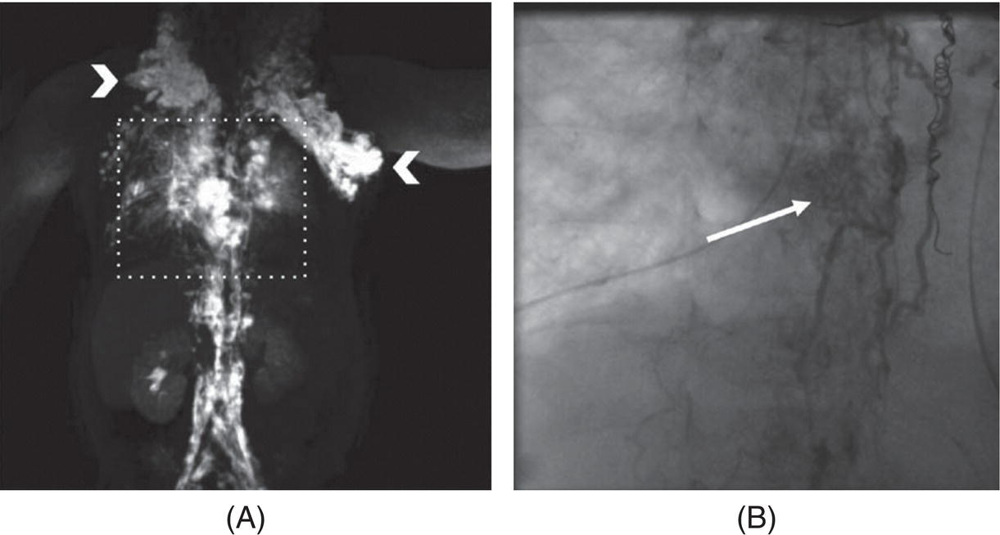

[**Figure 30.24**](#R_c30-fig-0024) MIP of DCMRL (A) and lymphangiogram (B) images of the central lymphatic system of a patient with type 5 PB. (A) MIP of the DCMRL shows diffuse perfusion of both lung fields (box). Also seen are the filling of cervical and left‐sided axillary lymphatic networks (arrow heads). (B) No identifiable TD is seen, but, instead, multiple dilated ducts are seen supplying both lungs (arrow). DCMRL indicates dynamic contrast‐enhanced magnetic resonance lymphangiogram; MIP, maximum intensity projection; PB, plastic bronchitis; and TD, thoracic duct.

(Source: Dori et al. \[230\]. Reproduced with permission of Wolters Kluwer Health Inc.)

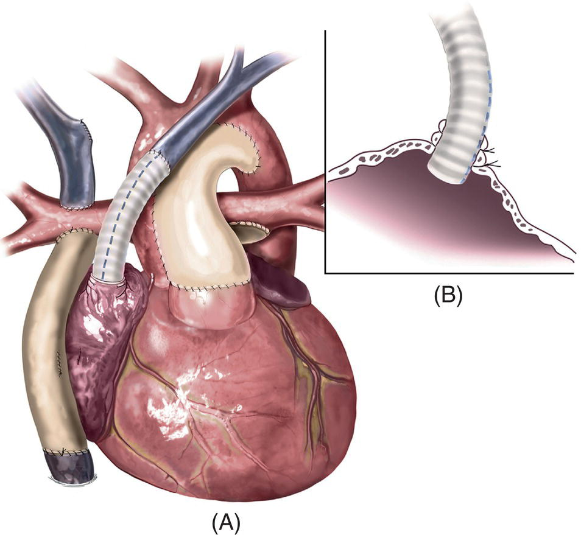

[**Figure 30.25**](#R_c30-fig-0025) Innominate vein turndown with an interposition graft. (A) Graft from distal innominate vein to right atrial appendage with a ringed polytetrafluoroethylene graft. (B) “Dunk” technique with 3–4 rings inserted inside the atrium to prevent obstruction. This technique can also be accomplished without a graft by direct anastomosis to the left atrial appendage. Postoperative system oxygen saturations often decrease by about 5% due to the creation of a veno‐venous shunt.

(Source: Hraska et al. \[232\]. Reproduced with permission of Elsevier.)

Assessment of intravascular fluid volume status is essential in patients with drainage tubes for pleural effusion or ascites and those receiving diuretics. Failure to correct hypovolemia will result in systemic hypotension due to vasodilation from anesthetics and reduction of venous return from PPV. Many patients with ongoing drainage have resultant hypoalbuminemia, resulting in partial protein binding and increased free drug with consequent greater potency. Chronic steroid therapy can result in adrenal suppression, and these patients require stress‐dose steroids before anesthesia.

An essential component of anesthetic management involves preventing patient movement that could dislodge precisely placed needles or catheters during imaging, intervention, or transport of patients between catheterization laboratory or interventional radiology suite and MRI. Sedation alone is not adequate due to the duration of the procedures and respiratory and circulatory compromise from lymphatic pathology and other comorbidities. Concurrent ancillary procedures, including cardiac catheterization, bronchoscopy, endoscopy, vascular access, and drain placement, also require general anesthesia. Given these considerations, general endotracheal anesthesia with neuromuscular blockade is preferred. Casts in patients with PB can completely obstruct the trachea or endotracheal tube after induction of anesthesia, and consideration should be given to routine bronchoscopy and removal of casts immediately after intubation. A urinary drainage catheter is placed to prevent bladder distention and increased abdominal pressure during lengthy procedures. It is also helpful as cardiac catheterization with angiography is performed, and a full bladder may obstruct visualization of the lower pelvic lymphatic pathways. Careful body positioning and pressure point padding are necessary as later adjustments cannot be made once needles are placed in the lymph nodes. Monitoring and maintenance of body temperature are critical. Administration of IV antibiotics before needle placement and interventions is necessary due to trans‐abdominal passage of needles through the gastrointestinal (GI) tract.

Access to both radiologic imaging and MRI requires the transportation of anesthetized patients. When separated by distance, IV anesthesia and manual ventilation along with a transport monitor are used. A wheeled transport table mated to both the X‐ray and MRI tables maintains patient immobility. Scheduling must be coordinated among multiple disciplines, including anesthesia, radiology, cardiology, and depending on the lymphatic issues, pulmonary and gastroenterology.

Post‐procedure, it is recommended that all patients undergoing lymphatic intervention be admitted to the ICU for observation as an escalation of care or complications (fever, hypotension, bleeding, stroke) occur in approximately 25% of patients in the first 24 hours post‐procedure \[234\]. In most patients, postprocedural mechanical ventilation is unnecessary unless it was required preprocedurally. Abdominal pain is common after trans‐abdominal needle passages. Patients are monitored for infection and bleeding from needles passing through intra‐abdominal blood vessels, liver, GI tract, and bile ducts. A percentage of patients will manifest a systemic inflammatory response requiring IV fluids, inotropic agents, and/or vasoconstrictors for stabilization. Neurologic status is monitored for systemic embolization of endovascular glue or lipiodol in patients with right‐to‐left shunts.

#### Pregnancy

Up to 70,000 patients with a Fontan circulation are estimated to be alive today, with that number expected to double in 20 years. For women with Fontan physiology, common maternal cardiovascular events during pregnancy can include supraventricular arrhythmias (8.4%) and heart failure (3.9%), with heart failure also occurring in the postpartum period. One study found that most (89%) received anticoagulant therapy, and Caesarean‐section was performed in 57.1% of pregnancies. Fifty‐nine percent of the babies were premature, 20% were small for gestational age, and 5% died in the neonatal period. Further reviews with larger patient populations and longer follow‐up are needed to assess late sequelae of pregnancy in Fontan patients \[235\]. Further discussion of pregnancy after Fontan operation is presented in [Chapter 20](c20.xhtml).

#### Mechanical circulatory support

Interest and experience continue to grow regarding MCS as a bridge to transplant or as destination therapy for failing Fontan patients, but no large studies exist offering established guidelines for MCS use in this population. Mechanical circulatory support is indicated when the Fontan circulation has failed to maintain adequate oxygenation and CO despite maximal medical therapy. Ideally, with MCS, improvement can occur in end‐organ, nutritional, and physical function which will improve the patient’s health and likely make cardiac transplantation more successful \[236\]. Due to patient variability, each patient must be considered individually. Patients with ventricular dysfunction may benefit from a ventricular assist device (VAD), while patients with preserved ventricular function but circulation failure may benefit from a total artificial heart (TAH). Extracorporeal membrane oxygenation may offer a temporary solution. Future options may also include a cavopulmonary assist device. One such device currently being developed is a rotary motor placed into the Fontan pathway to propel blood through the pulmonary circulation (see [Figure 30.26](#c30-fig-0026)) \[237\].

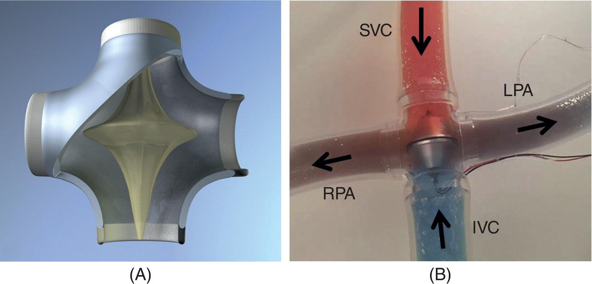

[**Figure 30.26**](#R_c30-fig-0026) Implantable cavopulmonary assist device. (A) Conceptual image. A central impeller contains the motor (impeller support shaft and struts not shown). The external housing is a thin‐walled, hard case shell that has no component bulk and serves only to direct Fontan flow. The wide gap between the impeller and the housing must support passive total cavopulmonary connection flow at low resistance in the event of device dysfunction. (B) Advanced prototype image depicting pump function. Color contrast demonstrates superior vena caval (SVC) flow (red) and inferior vena caval (IVC) flow (blue) mixing to both left pulmonary arterial (LPA) and right pulmonary arterial (RPA) outlets (purple).

(Source: Rodefeld et al. \[237\]. Reproduced with permission of Elsevier.)

Specific anesthetic goals, similar to managing any patient with poor ventricular function, include cautious use of induction agents, use of a balanced technique (narcotic, low levels of inhalational agent, and dexmedetomidine), and readiness to treat hemodynamic instability. As patients have previously had multiple sternotomies and have poor functional status and high bleeding potential, these surgeries are complicated and lengthy. Weaning from CPB should include the use of TEE to ensure a nondilated, well‐filled ventricle with CVP in the low teens and mean arterial pressure in the 60–70 mmHg \[238\]. The use of coagulation products is guided by thromboelastography or thromboelastometry. Post‐VAD placement, PBF can be maintained with the use of iNO and milrinone. Hemodynamics may be supported with norepinephrine, epinephrine, and, if necessary, vasopressin. The goal should be to achieve early postoperative spontaneous ventilation and early extubation if possible \[239\]. Patients with MCS are often anticoagulated with heparin or unfractionated heparin. More recently, bivalirudin, a competitive, reversible thrombin inhibitor that prevents thrombin activation of fibrinogen to fibrin, has been used. Bivalirudin may be administered as a continuous infusion with dosing based on PTT \[240\]. After the immediate postoperative period, patients are often transitioned to warfarin and aspirin. A reasonable estimate of survival in a Fontan patient requiring MCS is about 60% \[238\]. See [Chapter 37](c37.xhtml) for further discussion of mechanical circulatory support.

#### Cardiac arrest in the Fontan patient

Survival after cardiac arrest in a patient with Fontan physiology is approximately 60% \[119\]. This low survival is likely due to specific characteristics of the Fontan circulation. Maintenance of some coronary and cerebral pressure during CPR is essential to minimize neurologic injury and mortality. However, in a Fontan patient, during chest compressions, CVP increases, with a resultant decrease in CPP as well as a decrease in venous return. The reduction in venous return will decrease flow through the pulmonary vasculature, decrease ventricular filling, and ultimately decrease CO. In addition, the acidosis which occurs during CPR will cause elevations in PVR, further limiting PBF. Conversion from CPR to ECMO can be challenging in a Fontan patient and almost impossible to perform expeditiously via central vessels in a patient with a well‐healed sternum. Peripheral cannulation is difficult due to access‐related issues and the need to cannulate both upper and lower extremity venous vessels to decompress the Fontan pathway. Although it may be performed instead of central cannulation it may not allow the adequate circuit blood flow required with a failing, non‐ejecting ventricle. As CPR and emergent use of ECMO have poor outcomes, early elective ECMO cannulation should be considered if the potential for reversibility exists. In a study of 230 Fontan patients experiencing cardiac arrest, 35% survived to discharge \[241\]. See [Chapter 25](c25.xhtml) for further discussion of cardiac arrest and resuscitation.

* * *

### KEY POINTS: FONTAN COMPLETION

-   The Fontan, or TCPC, is the final palliation for single‐ventricle anatomy and is normally performed at 18 months to 4 years of age.
-   The two contemporary Fontan configurations utilized are the intra‐atrial lateral tunnel and the extracardiac conduit.
-   A fenestration can be created to lower cavopulmonary pressure and improve systemic CO, at the expense of some arterial desaturation.
-   PPV, hypovolemia, and loss of AV synchrony are all detrimental to the Fontan circulation because of the lack of a pulmonary ventricle.
-   The classic physiologic elements which control CO in a biventricular circulation – heart rate, preload, afterload, and contractility – do not do so in the Fontan circulation. In a Fontan circulation, except for physiologic extremes, CO is determined by PBF

* * *

## Transplantation for single‐ventricle patients

### Heart transplantation

Single‐ventricle physiology remains the most common subset of CHD requiring heart transplantation, with failing Fontan physiology now the predominant indication for orthotopic heart transplantation (OHT) in children and adults with CHD \[242\]. It is currently predicted that the heterogeneous group of SV patients will ultimately account for 70–80% of OHT in patients with CHD \[243\]. Due to the scarcity of cardiac donors, particularly for infants, initial surgical or hybrid palliation continues to be the mainstay in the management of functional SV patients. The number of pediatric heart transplants continues to increase each year, with infants <1 year of age accounting for the largest number of transplants and HLHS remaining the most common diagnosis for infants undergoing OHT for CHD \[244, 245\]. Continued experience and success with ABO‐incompatible infant and pediatric cardiac transplantation should assist in enlarging the list of potential donors for patients who require transplantation \[246\].

A significant percentage of patients with HLHS experience long‐term ventricular failure, and some are listed for orthotopic heart transplantation (OHT) even though the initial intention was to pursue the full Fontan palliation pathway. Patients with SV physiology may present for OHT at a wide range of ages and at various palliative stages. Risk factors for heart transplant listing after the Norwood operation include worse RV function, complicated post‐surgical course, and diagnosis other than HLHS \[247\]. The need for transplant before stage II palliation in HLHS patients is associated with poorer waitlist survival, with patients with an mBTTS faring worse than those with an RV‐PA shunt. Post‐transplant outcomes were unaffected by shunt type \[248\]. Tweddell et al. identified other risk factors for intermediate‐term mortality after transplant in infants with HLHS, including lower socioeconomic status, comorbid genetic syndromes, lower gestational age, and RV function/anatomy \[249\].

Murtuza et al. reported on 16 OHTs in HLHS patients from a single center from 2000 to 2011 and compared outcomes of these patients with 154 patients who underwent OHT for cardiomyopathy \[250\]. The 30‐day survival was 100% in the HLHS group vs. 98.1% in the 154 patients transplanted for cardiomyopathy, and there were 1‐ and 5‐year Kaplan–Meier survival rates of 100% for HLHS and 87.5% for the cardiomyopathy group (_P_ = 0.393). The authors concluded that early and mid‐term survival rates are good after OHT in HLHS patients and that transplantation should be a consideration early in HLHS patients with systemic ventricular failure. However, according to the Pediatric Heart Transplant Study database, infants ≤6 months old with HLHS had worse 1‐year survival after transplantation than those with cardiomyopathy or other CHD. Infants with HLHS transplanted prior to surgical palliation had a 1‐year survival of 79% (_n_ = 303), while those who failed surgical palliation had a worsened survival of 70% (_n_ = 69) \[245\].

Refractory Fontan failure may take two forms and ultimately may require OHT. Patients may have Fontan failure as a result of primary ventricular dysfunction; these patients tend to have normal PVR. Fontan failure may also occur with preserved ventricular function but failing Fontan physiology (high Fontan pressures, ascites, PLE and/or PB), and these patients tend to have elevated PVR. A multi‐institutional study identified PLE as the reason for OHT in 23% of post‐Fontan patients and primary ventricular dysfunction in 31% \[251\]. Earlier listing for Fontan patients with circulation failure may prevent the associated end‐organ comorbidities from developing, which, in turn, may increase the survival post‐transplant \[252\]. Historically, Fontan patients who underwent cardiac transplantation had decreased survival. However, a 2017 Pediatric Heart Transplant Society database study demonstrated that between 2007–2014, 1‐year survival for Fontan patients after cardiac transplantation improved to 89%, similar to children with other forms of CHD (92%) \[253\]. Another study identifying risk factors for post‐transplant mortality in Fontan patients found that Model for End‐Stage Liver Disease Excluding INR (MELD‐XI) scores, history of PLE, and having a VAD at the time of transplant were independent predictors for postoperative mortality \[254\]. Perioperative management for a failing Fontan should recognize the cardiac depressant effects of induction medications and volatile agents. Anesthetic medications combined with PPV can decrease PBF, ventricular filling, and CO. The anesthesiologist should be prepared to treat significant bleeding, hypotension, and arrhythmias during transplantation \[255\]. Epinephrine, milrinone, norepinephrine, and vasopressin may be required to wean from CPB, and iNO is frequently used to lower PVR. Bleeding may be robust, and ROTEM and TEG are often used to guide therapy.

Details of cardiac transplantation are discussed in detail in [Chapter 32](c32.xhtml).

### Post‐Fontan heart‐liver transplantation

The decision to perform a heart transplant versus a combined heart liver transplant (CHLT) requires careful consideration. The degree of liver dysfunction or cirrhosis present to prompt CHLT is not known. One study, examining seven patients with Fontan failure who underwent CHLT, used evidence of fibrosis or cirrhosis by imaging or biopsy to determine the need for the liver transplant. The CHLT was performed with the heart implanted first; then, the liver was inspected grossly, followed by choosing whether to proceed with liver transplantation. Patients in this study had 100% 1‐year survival \[256\]. Benefits of CHLT with both organs from the same donor include likely immune protection of the heart by the liver, antigen exposure reduction and decreased chronic rejection, and less coronary graft vasculopathy.

In another study, patients were treated with an _en bloc_ CHLT. The decision to perform CHLT over heart transplant alone was based on biopsy and imaging of the liver when possible and after multidisciplinary evaluation to determine liver health. With careful coordination between the cardiac surgery team and the liver transplant team, the heart and great vessels are dissected out while the liver vascular structures are dissected out, and the liver mobilized from the retroperitoneum. The aorta is then cannulated, and cross‐clamped and the organs are removed _en bloc_. The implantation begins with the left atrial connection, followed by the IVC. The two teams independently and simultaneously proceed with the implantation. The patient is weaned from CPB when both organs are functioning well, and lastly, the biliary anastomoses are completed. Median blood loss was 6 (2–20) liters, intensive care stay was 19 (5–96) days, and hospital length of stay was 29 (13–197) days. Two patients required an intra‐aortic balloon pump, and one required veno‐arterial ECMO. All nine patients were alive at 1 year after treatment. Benefits of _en bloc_ CHLT include less reperfusion injury to the heart and decreased liver ischemic time compared with sequential CHLT \[257\].

## Non‐cardiac surgery and anesthesia for the patient with a single ventricle

Single ventricle patients not infrequently require anesthesia or sedation for procedures other than cardiac surgery. Feeding difficulties are common after the neonatal palliation stage, and many of these patients require gastrostomy tube feeds along with fundoplication. If a procedure is elective, the period after SCPC and before Fontan completion confers a more stable circulation, free from cardiac volume load and delicate balance of Qp: Qs in the shunted SV, and also avoiding Fontan physiology with the harmful effects of PPV and hypovolemia. Fasting time should be minimized, and IV fluids should be optimized to maintain intravascular volume. For patients with Fontan physiology, the ventilatory strategy should include maintaining low pulmonary pressures, minimizing inspiratory pressure, allowing for adequate expiratory time, and avoidance of excessive PEEP. It should be recognized that there is no way for an anesthesiologist to measure a filling pressure percutaneously in a Fontan patient. A study examining complications after non‐cardiac procedures in adult Fontan patients found a 15% rate of complications, with baseline cyanosis the only multivariable risk factor identified. The most common complication was hypoxia, and mortality was low at 0.2% \[258\]. Non‐cardiac anesthetics for single‐ventricle patients are discussed extensively in [Chapter 35](c35.xhtml).

## Summary

Patients with SV physiology undergo staged palliative surgical procedures and also require additional anesthetics for diagnostic procedures, cardiac catheterization, imaging, and non‐cardiac surgery. Further surgical or catheter‐based interventions are often necessary after Fontan completion. An increasing number of the steadily growing adult population of Fontan patients may ultimately require transplantation. Single‐ventricle patients comprise a large proportion of the anesthetic population for the pediatric cardiac anesthesiologist in the modern era at major centers. At Texas Children’s Hospital, this proportion was 16.7% of anesthetics for cardiac surgery provided by the Division of Pediatric Cardiovascular Anesthesiology from 2014 to 2021 (data from the Congenital Cardiac Anesthesia Society/Society of Thoracic Surgeons Database provided by David Vener, MD).

Planning anesthetic management for SV patients requires careful assessment to ensure a complete understanding of the typical physiology at each stage of the reconstructive sequence, the specific condition of each patient with respect to that physiology, and the impact that the proposed procedure is likely to have. Optimal results entail good communication and carefully orchestrated interactions between anesthesiologists, surgeons, cardiologists, and intensivists.

## Selected references

_A full reference list for this chapter is available at:_

[http://www.wiley.com/go/andropoulos/congenitalheart](http://www.wiley.com/go/andropoulos/congenitalheart)

1.  28 Roeleveld PP, Axelrod DM, Klugman D, et al. Hypoplastic left heart syndrome: from fetus to Fontan. Cardiology in the Young 2018; 28:1275–88. An excellent, comprehensive modern review of all developments in hypoplastic heart syndrome, literally starting in fetal life, and through the Fontan stage. Emphasizes preoperative risk factors for poor outcomes at each stage, and treatment strategies for improving outcomes.
2.  46 Karamlou T, Overman D, Hill KD, et al. Stage 1 hybrid palliation for hypoplastic left heart syndrome – assessment of contemporary patterns of use: an analysis of The Society of Thoracic Surgeons Congenital Heart Surgery Database. J Thorac Cardiovasc Surg 2015; 149:195–202. In an analysis of the Society of Thoracic Surgeons Congenital Heart Surgery Database, 13 out of 100 institutions performed >50% of stage I palliations as a hybrid rather than Norwood procedure between 2010 and 2012. With continuing experience and technical modifications, the hybrid procedure may offer the potential for increased survival opportunity with early avoidance of CPB for certain groups including high‐risk patients, those awaiting cardiac transplantation, and those with the potential for future biventricular repair.
3.  101 Cholette JM, Willems A, Valentine S, et al. Recommendations on red blood cell transfusion in infants and children with acquired and congenital heart disease from the Pediatric Critical Care Transfusion and Anemia Expertise Initiative. Pediatr Crit Care Med 2018; 19(9):S137–48. Because PRBC transfusion has been associated with longer duration of mechanical ventilation and ICU stay in stage I palliation patients, the Pediatric Critical Care Transfusion and Anemia Expertise Initiative released recommendations regarding red blood cell transfusion in patients with CHD. One of the key recommendations in this paper state that transfusions should be avoided “solely based upon hemoglobin, if hemoglobin is >9.0 g/dL in infants undergoing staged palliative procedures with stable hemodynamics.”
4.  121 Alphonso N, Angelini A, Barron DJ, et al. Guidelines for the management of neonates and infants with hypoplastic left heart syndrome: The European Association for Cardio‐Thoracic Surgery (EACTS) and the Association for European Paediatric and Congenital Cardiology (AEPC) Hypoplastic Left Heart Syndrome Guidelines Task Force. Eur J Cardiothorac Surg 2020; 58(3):416–99. An important paper from The European Association for Cardio‐Thoracic Surgery and the Association for European Paediatric and Congenital Cardiology that developed a set of guidelines for managing neonates and infants with HLHS. These guidelines include suggested management for diagnosis, imaging, preoperative assessment, surgical and anesthetic management, and inter‐stage monitoring. These recommendations allow practice standardization and identify potential targets for practice improvement at individual institutions.
5.  129 Rao PS. Diagnosis and management of cyanotic congenital heart disease: part I. Indian J Pediatr 2009; 76(1):57–70.127. Although different classifications have been proposed for tricuspid atresia (TA,) the most widely accepted schemes are based upon _the relationship of the great arteries_ (Type I, II, or III) and _the degree of pulmonary outflow obstruction_ (subclassification a, b, or c). This paper nicely summarizes the anatomic classification, incidence, and pathophysiological features of TA.
6.  137 Rao PS. Single ventricle–a comprehensive review. Children 2021; 8(6):441. [https://doi.org/10.3390/children8060441](https://doi.org/10.3390/children8060441). A modern, thorough review of all forms of single ventricle hearts and their many anatomic variations. Treatment considerations for catheter or surgical therapy are comprehensively reviewed.
7.  158 Edelson JB, Ravishankar C, Griffis H, et al. A comparison of bidirectional Glenn vs. Hemi‐Fontan procedure: an analysis of the single ventricle reconstruction trial public use dataset. Pediatr Cardiol 2020; 41:11766–72. Evaluation of over 500 infants in the Single Ventricle Reconstruction Trial dataset were evaluated through 1 year of age, based on the type of superior cavopulmoonary connection performed, bidirectional Glenn vs. Hemi‐Fontan. Although CPB times were longer and the use of DHCA more frequent in the Hemi‐Fontan group, no difference in transplant‐free survival or other important clinical outcomes at 1 year was observed between groups.
8.  178 Herrmann JL, Brown JW. The superior cavopulmonary connection: history and current perspectives. World J for Pediatr Congenit Heart Surg 2019; 10(2):216–22. A thorough historical review of the operation, and current outlook for patients undergoing the surgery. A list of risk factors for complications, length of stay, and transplant‐free survival has continued to evolve over the past decade. Attrition between the SCPC and Fontan completion for HLHS patients has been reported to be independently associated with moderate or severe tricuspid valve regurgitation and low weight at the time of SCPC.
9.  191 Gewillig M, Brown SC. The Fontan circulation after 45 years: update in physiology. Heart 2016; 102:1081–6. A review of the physiology of the Fontan circulation, utilizing visuals of blood traversing these different circulations. Fontan physiology has two significant consequences that affect all Fontan patients to varying degrees: elevated CVP and diminished effective CO. As a result of these, a myriad of end‐organ sequelae develop.
10.  192 Gewillig M, Brown SC, Eskynes B. The Fontan circulation: who controls cardiac output? Interact Cardiovasc Thorac Surg 2010; 10:428–33. An excellent physiological review making the point that post Fontan, the trans‐pulmonary gradient. measures the pressure gradient driving blood from the central veins via the Fontan pathway through the lungs and into the common atrium. If pulmonary vascular resistance is elevated, blood flow through the lungs will be impeded, resulting in diminished ventricular filling and decreased cardiac output (CO) _The classic physiologic elements which control CO in a biventricular circulation – heart rate, preload, afterload, and contractility – do not do so in the Fontan circulation_. In a Fontan circulation, except for physiologic extremes such as significant tachycardia, bradycardia, or severe ventricular dysfunction, CO is determined by pulmonary blood flow.
11.  211 Poh CL, d’Udekem Y. Life after surviving Fontan surgery: a meta‐analysis of the incidence and predictors of late death. Heart Lung Circ 2018; 27:552–9. A comprehensive Fontan registry outcome study analyzing the risk factors and predictors of late death. The quality of life of the post‐Fontan patient can be variable, with half of patients experiencing a major adverse event before 14 years of age.
12.  253 Simpson KE, Pruitt E, Kirklin JK, et al. Fontan patient survival after pediatric heart transplantation has improved in the current era. Ann Thorac Surg 2017; 103:1315–21. A 2017 Pediatric Heart Transplant Society database study demonstrated that between 2007‐2014, 1‐year survival for Fontan patients after cardiac transplantation improved to 89%, similar to children with other forms of CHD (92%).