CHAPTER 31 Anesthesia for Miscellaneous Cardiac Lesions 

# CHAPTER 31  
Anesthesia for Miscellaneous Cardiac Lesions

_Ian McKenzie1, Maria Markakis Zestos2, Stephen A. Stayer4, Edward Kaminski2, Paul Davies1, and Dean B. Andropoulos3_

1 Department of Anaesthesia and Pain Management, The Royal Children’s Hospital, Melbourne, Victoria, Australia

2 Department of Anesthesiology, Children’s Hospital of Michigan, Wayne State University, Detroit, MI, USA

3 Department of Anesthesiology, Perioperative and Pain Medicine, Department of Anesthesiology, Baylor College of Medicine, Texas Children’s Hospital, Houston, TX, USA

4 Department of Pediatrics and Anesthesiology, Baylor College of Medicine, Arthur S. Keats Division of Pediatric Cardiovascular Anesthesiology, Texas Children’s Hospital, Houston, TX, USA

* * *

-   [**Introduction**](#head-2-2)
-   [**Vascular rings**](#head-2-3)
    -   [Classification, anatomy, and incidence](#head-3-1)
    -   [Diagnosis of vascular rings](#head-3-2)
    -   [Vascular rings due to double and right aortic arches: anatomy and natural history](#head-3-3)
    -   [Innominate artery compression of the trachea: anatomy, diagnosis, and natural history](#head-3-4)
    -   [Pulmonary artery sling with tracheal stenosis: anatomy and natural history](#head-3-5)
-   [**Anomalies of the coronary arteries**](#head-2-5)
    -   [Anomalous pulmonary origins of the coronary arteries: incidence, anatomy, and natural history](#head-3-6)
    -   [Anomalous aortic origins of the coronary arteries](#head-3-7)
    -   [Congenital atresia of the left main coronary artery](#head-3-8)
    -   [Coronary arteriovenous fistulas: incidence, anatomy, and natural history](#head-3-9)
    -   [Coronary artery bridging, aneurysms, and stenosis](#head-3-10)
-   [**Pericardial effusion and tamponade**](#head-2-6)
    -   [Incidence, anatomy, and natural history](#head-3-11)
    -   [Pathophysiology and diagnosis of cardiac tamponade](#head-3-12)
    -   [Surgery for pericardial effusion and cardiac tamponade](#head-3-13)
    -   [Anesthesia for pericardial effusion and cardiac tamponade](#head-3-14)
-   [**Mitral regurgitation**](#head-2-7)
    -   [Incidence, anatomy, and natural history of mitral regurgitation](#head-3-15)
    -   [Normal anatomy and function of the mitral valve](#head-3-16)
    -   [Classification of mitral regurgitation](#head-3-17)
    -   [Mechanisms of mitral valve regurgitation](#head-3-18)
    -   [Pathophysiology of MR](#head-3-19)
    -   [Surgical approaches and outcomes for MR in children](#head-3-20)
    -   [Anesthetic considerations for the repair of MR](#head-3-21)
-   [**Cardiac tumors in childhood**](#head-2-8)
    -   [Incidence, anatomy, and natural history](#head-3-22)
    -   [Pathophysiology of cardiac tumors](#head-3-23)
    -   [Surgical approaches and outcomes for cardiac tumors](#head-3-24)
    -   [Anesthesia considerations for cardiac tumors](#head-3-25)
-   [**Aortic aneurysm and aortopathy in children**](#head-2-9)
    -   [Classification and definition of aortic aneurysms (and aortopathy)](#head-3-26)
    -   [Incidence, anatomy, and natural history of aortic aneurysms in children](#head-3-27)
    -   [Genetic conditions associated with aortic aneurysm](#head-3-28)
    -   [Sinus of Valsalva aneurysms](#head-3-29)
    -   [Aortopathy and aortic dilation with CHD](#head-3-30)
    -   [Pathophysiology of aortic aneurysms](#head-3-31)
    -   [Surgical approaches for aortic aneurysms in children](#head-3-32)
    -   [Anesthesia for aortic aneurysm surgery](#head-3-33)
-   [**Mediastinal masses**](#head-2-10)
    -   [Incidence, anatomy, and natural history of mediastinal masses in children](#head-3-34)
    -   [Diagnosis of anterior mediastinal masses](#head-3-35)
    -   [Pathophysiology](#head-3-36)
    -   [Surgery for anterior mediastinal masses](#head-3-37)
    -   [Anesthesia for patients with an anterior mediastinal mass](#head-3-38)
-   [**Selected references**](#head-2-11)

* * *

## Introduction

The congenital cardiac anesthesiologist is often faced with caring for patients with lesions and diseases that do not fit neatly into the anatomic and surgical classifications presented elsewhere in this book. This chapter presents vascular rings, coronary artery anomalies, pericardial effusion and tamponade, mitral regurgitation (MR), cardiac tumors, aortic aneurysm and aortopathy, and mediastinal masses. The anatomy, incidence, and natural history are reviewed for all lesions, followed by a discussion of pathophysiology. The surgical approach and outcomes are discussed next, and finally, anesthetic considerations and approaches are presented for each lesion.

## Vascular rings

### Classification, anatomy, and incidence

Vascular rings have a reported incidence of between 1 in 1,000 births and 1 in 10,000 births \[1, 2\]. The abnormalities develop from aberrations of the resorption of the six embryonic aortic arches that connect the primitive dorsal and ventral aorta. Normally, the left part of the fourth arch persists as the aortic arch. The persistence of the right part creates a right arch, while the persistence of both parts of the fourth arch creates a double aortic arch. When these arch abnormalities form a ring, partial in some cases, they may produce either esophageal or tracheal compression or obstruction. [Chapter 6](c06.xhtml) presents an extensive discussion of the embryology of congenital cardiac and vascular defects. The presence of a complete ring would appear to provide an anatomical explanation for obstruction of the encircled structures, but the relationship between symptoms and the ring and whether it is open or closed is complex and varies with the subgroups of lesions. A comprehensive classification of vascular rings is complex, as an extraordinary number of possible combinations of abnormalities are possible. The International Nomenclature and Database Conferences for Pediatric Cardiac Surgery \[3\] produced a pragmatic summary noting that describing the particular anatomy of the patient and planning for management based on that description (and symptoms) was more important than creating a “classification.” These authors noted that more than 95% of cases associated with symptoms could be described by four categories ([Table 31.1](#c31-tbl-0001)) \[4\].

It is noteworthy that a variant of an otherwise normal left aortic arch is the presence of an aberrant right subclavian arising from the distal arch, which occurs in about 0.5% of normal individuals and is usually asymptomatic. This variant occurs in about a third of babies with trisomy 21. Additional chromosomal variants found in vascular ring patients include 47XXY and 22q11 deletion (DiGeorge syndrome) \[5\]. Since the increasing use of 3‐vessel tracheal view fetal echocardiography after 2004, prenatal detection rates have increased significantly ([Figure 31.1](#c31-fig-0001)) and although there is insufficient data on whether prenatal diagnosis reduces overall morbidity, it does allow for a prospective care plan in those diagnosed \[6\] ([Table 31.2](#c31-tbl-0002)).

[**Table 31.1**](#R_c31-tbl-0001) Lurie Children’s Hospital, Chicago, vascular ring experience, 1947–2015

(Source: Backer et al. \[4\]. Reproduced with permission of Elsevier.)

| Vascular ring | No. of patients |
| --- | --- |
| Double aortic arch | 155 |
| Right aortic arch/left ligamentum | 172 |
| Pulmonary artery sling | 46 |
| Total | 373 |

[**Figure 31.1**](#R_c31-fig-0001) Vascular ring prenatal detection rates from 2004–2015 by 3‐year intervals.

(Source: Evans et al. \[6\]. Reproduced with permission of SAGE Publications.)

### Diagnosis of vascular rings

Definitive diagnosis of vascular rings, once clinical suspicion has been aroused, relies on imaging and, in some cases, endoscopy. Historically barium swallow was a key investigation demonstrating the indentation of the ring on the esophagus. Magnetic resonance imaging (MRI), computed tomographic and CT angiography are now the modalities of choice, allowing three‐dimensional (3D) reconstruction of the images and detailed surgical planning \[7\] ([Figure 31.2](#c31-fig-0002)). CT provides a more precise definition in the tracheobronchial tree and can often be performed without the need for general anesthesia. Greater refinement of operative strategies based on detailed imaging data can lead to improved outcomes for vascular ring patients \[8\].

Assessment of the fibrous non‐vascular parts of the ring is important. Echocardiography can contribute to the diagnosis but is dependent on achieving adequate echocardiographic windows, which may be difficult and is not suitable for assessing the airway \[9\]. Bronchography and bronchoscopy may be required to define the functional changes, particularly to assess tracheobronchomalacia and to define the extent of tracheobronchial narrowing associated with a pulmonary artery sling.

### Vascular rings due to double and right aortic arches: anatomy and natural history

Double and right aortic arches are the result of the persistence of the fourth right embryonic aortic arch and form complete rings around the esophagus and trachea \[1\] ([Figure 31.3](#c31-fig-0003)). They comprise less than 1% of congenital cardiac lesions. The double aortic arch group is commonly described according to whether the left or right arch is dominant or whether they are “balanced,” i.e., similar in size. The right aortic arch group may be subclassified by the origin of the left subclavian artery from the right arch. In one‐third of right aortic arches, the right arch is a “mirror image” of the normal left arch with the left subclavian branch of the brachiocephalic first branch of the arch, whereas, in two‐thirds of cases, the left subclavian is the last major branch of the right arch, passing retro‐esophageal to the left upper limb from the right side of the midline. This latter variant may also be associated with dilatation of the origin of the vessel, reflecting the persistence of a segment of fetal aortic arch known as a Kommerell’s diverticulum. If this segment is not dealt with at the time of surgical repair, it can cause persistent or recurrent compressive symptoms. Double or right aortic arches with stenosis or coarctation of the aorta are rare. Patients with vascular rings should be echocardiographically assessed for associated cardiac anomalies that occur in approximately 10% of patients \[10\].

[**Table 31.2**](#R_c31-tbl-0002) Diagnostic data for a 92 patient vascular ring series

(Source: Evans et al. \[6\]. Reproduced with permission of SAGE Publications.)

|  | N = 92 |
| --- | --- |
| Current age years, mean ± SD | 9 ± 7 |
| RAA‐ALS, n (%) | 73 (79) |
| DAA, n (%) | 17 (19) |
| Pulmonary artery sling, n (%) | 2 (2) |
| Isolated VR, n (%) | 75 (82) |
|  RAA‐ALS, n | 58 |
|  DAA, n | 15 |
|  Pulmonary artery sling, n | 2 |
|  Dysmorphic syndrome, n (%) | 13 (17) |
|  Prenatal detection 2004‐2015, n PNDX/n total DX (%) | 23/53 (43) |
| VR with intracardiac CHD, n (%) | 17 (18) |
|  RAA‐ALS, n | 15 |
|  DAA, n | 2 |
|  Dysmorphic syndrome, n (%) | 9 (53) |
|  Prenatal detection 2004‐2015, n PNDX/n total DX (%) | 3/7 (43) |
| All dysmorphic syndromes and other malformations, n (%) | 22 (24) |
|  Down syndrome, n | 4 |
|  22q11.2 deletion syndrome, n | 6 |
| Miscellaneous noncardiac malformations, n | 12 |
| Abbreviations: CHD, congenital heart disease; DAA, double aortic arch; DX, diagnosis; PNDX, prenatal diagnosis; RAA‐ALS, right aortic arch, aberrant left subclavian artery and patent ductus arteriosus or ligamentum; SD, standard deviation; VR, vascular ring. |

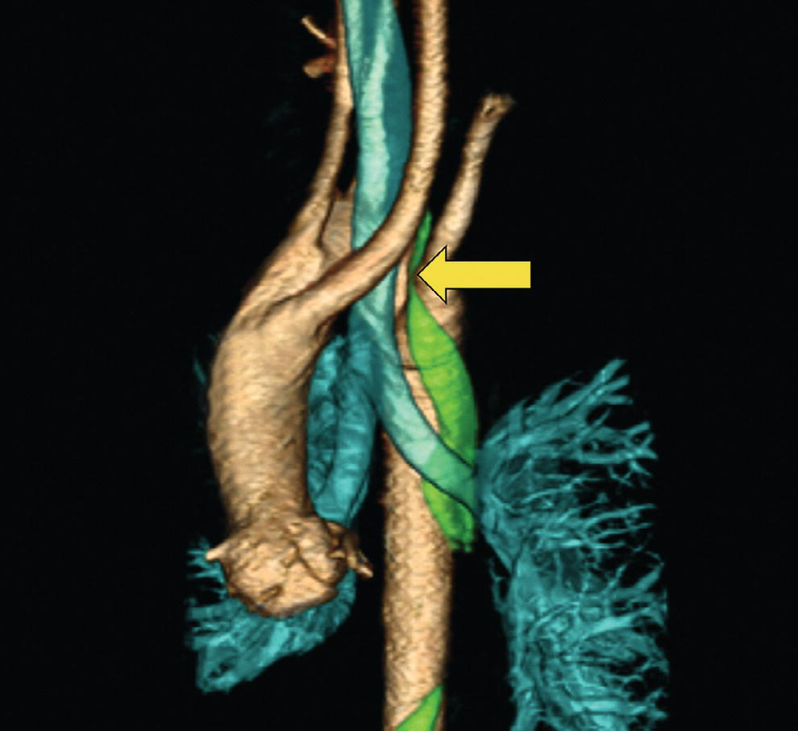

[**Figure 31.2**](#R_c31-fig-0002) Three‐dimensional enhanced computed tomography (CT) reconstruction in an 8‐year‐old patient with right aortic arch, retroesophageal left subclavian artery and Kommerell’s Diverticulum. Note severe esophageal compression (yellow arrow) by the Kommerell diverticulum, causing symptoms of “food getting stuck.”

(Source: Backer \[8\]. Reproduced with permission of Elsevier.)

#### Pathophysiology of vascular rings due to double or right aortic arches

Double and right aortic arches are most commonly present in the first few years of life with respiratory symptoms from tracheal compression. These signs and symptoms include stridor, recurrent respiratory infections, a barking cough, and apnea in infants \[4\] ([Table 31.3](#c31-tbl-0003)). Symptoms of esophageal obstruction are less common, being the primary presentation in about 15% of cases. Esophageal dysfunction may also interact with the respiratory symptoms, because reflux may lead to pulmonary aspiration and episodes of apnea. The development of aspiration pneumonia in the presence of tracheal dysfunction will increase the risk of prolonged pneumonia. The increased work of breathing associated with pneumonia will exaggerate the signs of airway obstruction that may have been absent or subtle when the patient was well. Vascular rings based on double and right aortic arches will encircle the esophagus and trachea. An _in utero_ diagnosis by fetal ultrasound does not correlate with the timing and severity of symptoms, and surgery is not indicated unless the patient has symptoms. Children with mild symptoms often have resolution of those symptoms by 4 years of age. Simply observing children who are asymptomatic or mildly symptomatic regardless of aortic arch anatomy is considered a safe approach \[11\]. However, earlier surgical repair may limit or prevent the development of tracheomalacia, which is not immediately reversed by surgical relief of the obstruction due to the ring. The long‐term outcome of vascular ring patients is generally very good. Most commonly these are isolated abnormalities, with approximately 10% of patients also having other significant cardiovascular anomalies. A 2014 study by Razon et al. postulated that although prenatal diagnosis has increased the apparent incidence of disease, the age of surgical repair has decreased. This is perhaps because clinicians caring for these patients now may inherently have a higher index of suspicion that new respiratory or gastrointestinal symptoms are related to the vascular ring. Despite the ability to diagnose prenatally, the authors emphasized that a fetal diagnosis should not be the only indication for surgery \[5\].

#### Surgery for right and double aortic arch

Vascular rings are usually repaired through a left thoracotomy. Right thoracotomy or median sternotomy are occasionally used for unusual variants, with median sternotomy being most common when there are other cardiac lesions needing repair. The principle of the surgery is to ensure that the ring is completely divided, which may require division of the ligamentum arteriosum as well as a vascular structure or a fibrous remnant of a vascular structure \[1, 12\] ([Figures 31.4](#c31-fig-0004) and [31.5](#c31-fig-0005)).

If a vascular structure is divided, such as one side of a double aortic arch, it is critical to ensure flow to all parts of the body is maintained. Test clamping and assessment of perfusion to the limbs and head may be required. Some variations of anatomy require reimplantation of blood supply. Such is the case with an aberrant origin of a left subclavian artery from a right aortic arch with a Kommerell’s diverticulum – a swelling at the insertion of the left subclavian. The Kommerell’s diverticulum can be resected and the left subclavian artery re‐implantated onto the left common carotid artery \[13\] ([Figure 31.6](#c31-fig-0006)). The primary excision of the Kommerell diverticulum is currently the preferred approach since it is now known that its natural history is to steadily enlarge over time \[8\].

The outcome after surgical repair of vascular rings related to right or double aortic arches is very good with almost no mortality. Relief of obstruction is usually significant. Tracheomalacia may continue to produce postoperative symptoms, but these diminish with the growth of the patient and tissue remodeling \[14, 15\]. Video‐assisted thoracoscopic techniques may be used for these procedures and will influence anesthetic management \[16\].

[**Figure 31.3**](#R_c31-fig-0003) Embryonic aortic arches and double aortic arch. (A) Diagram of the embryonic aortic arches. Six pairs of aortic arches originally develop between the dorsal and ventral aorta. The first, second, and fifth arches regress. Preservation or deletion of different segments of the rudimentary arches results in a double aortic arch (B), a right aortic arch (C), or the “normal” left aortic arch (D). Ao, aorta; CCA, common carotid artery; L, left; PA, pulmonary artery; R, right; SA, subclavian artery. Backer & Mavroudis \[1\]. Reproduced with permission of John Wiley & Sons.

#### Anesthesia for division of vascular rings related to double or right aortic arches

The preoperative assessment should consider the impact that the vascular abnormality has had on the patient, the details of the anatomy and function of the components of the vascular abnormality, the surgical plan, and the requirements for postoperative care. The severity of preoperative obstruction and chronic lung damage from recurrent infections is relevant to the risk of difficulty with oxygenation and ventilation during surgery and in the postoperative period. Chest radiograph findings suggesting chronic lung disease, tachypnea at rest, and rapid desaturation with crying are important indicators of associated lung disease. All other imaging studies, including CT scan, echocardiography, barium swallow, and MRI, should be thoroughly reviewed. The medical and surgical team should decide on the optimal timing of surgical intervention, e.g., can the lung function be further optimized prior to surgery vs. the risk of delaying definitive therapy?

The anesthesiologist and surgeon must have a clear plan regarding the need for lung isolation and discuss monitoring requirements if temporary or permanent occlusions of blood vessels are part of the surgical plan. This will influence whether intraoperative access to limbs for circulatory assessment by clinical means, pulse oximetry, intra‐arterial pressure monitoring, transcranial Doppler or near‐infrared spectroscopy (NIRS) will be required and whether a particular limb is most appropriate for arterial pressure monitoring (not at risk of being lost due to temporary clamping during the procedure).

[**Table 31.3**](#R_c31-tbl-0003) Symptoms leading to clinical presentation in patients with vascular rings[a](#c31-note-0002)

(Source: Backer et al. \[4\]. Reproduced with permission of Elsevier.)

|  | Double aortic arch (_n_ = 80) [b](#c31-note-0003) | Right aortic arch (_n_ = 78) [b](#c31-note-0003) |
| --- | --- | --- |
| Stridor | 46 (57%) | 18 (23%) |
| Recurrent upper respiratory tract infections | 22 (27%) | 18 (23%) |
| Cough | 17 (21%) | 8 (10%) |
| Dysphagia | 12 (15%) | 12 (15%) |
| Respiratory distress | 8 (10%) | 13 (17%) |
| Ventilator preoperatively | 7 (9%) | 3 (4%) |

Reproduced with permission from Backer et al5.

[_a_](#R_c31-note-0002) More than one symptom occurred in many patients.

[_b_](#R_c31-note-0003) Our records did not provide symptoms for the earlier patients in the series.

Intra‐arterial pressure monitoring is usually warranted due to the risk of massive hemorrhage, the need for significant intrathoracic retraction during the procedure, and, in some cases, the need to confirm regional perfusion during intraoperative clamping of intrathoracic vessels. Central venous catheterization is usually done for these cases, especially if aortic clamping and suture lines will be required, as pharmacologic control of blood pressure is more safely performed with central venous access. Substantial peripheral venous access should be secured in anticipation of the possible need for rapid resuscitation in the face of surgical blood loss. The procedures usually are associated with minimal blood loss, but preparation should be made for the possibility of massive transfusion.

The tracheal narrowing from vascular rings will not usually prevent an endotracheal tube from being passed through the narrowing. It is rare that positive pressure ventilation and continuous positive airway pressure (CPAP) or positive end‐expiratory pressure (PEEP) will not be sufficient to allow ventilation during the induction of anesthesia. A single‐lumen endotracheal tube is usually adequate for open thoracotomy and often acceptable for thoracoscopic procedures where lung retraction provides good surgical access. If desired, lung isolation may be achieved (see [Chapter 23](c23.xhtml) for a discussion of lung isolation techniques). Rigid or flexible bronchoscopy may be performed pre‐ and post‐procedure in some cases.

Most patients will tolerate early extubation if appropriate analgesia is provided. This will vary with the institution and whether an open or thoracoscopic technique was used. Thoracic epidural analgesia is used in some institutions for thoracotomy for vascular rings. Significant preoperative lung disease or predicted postoperative airway obstruction may require more prolonged intubation and respiratory support.

* * *

### KEY POINTS: VASCULAR RINGS BASED ON RIGHT OR DOUBLE AORTIC ARCH

-   It is important to assess the degree of airway obstruction and whether there is chronic lung disease.
    -   Prenatal diagnosis has increased significantly (due to increased ultrasound use) but should not be used as the only indication for surgery.
-   Confirm surgical approach (mostly left thoracotomy) and whether regional perfusion (limbs and brain) will need to be assessed intraoperatively (monitoring and arterial line placement).
-   Plan postoperative management: early vs. late extubation.
-   The tracheomalacia associated with most vascular rings is not immediately cured by relief of the vascular ring.

* * *

### Innominate artery compression of the trachea: anatomy, diagnosis, and natural history

Innominate artery compression of the trachea is not a true vascular ring \[1\] ([Figure 31.7](#c31-fig-0007)). Some degree of innominate artery indentation is normal in the first years of life, and the origin of the vessel from the aorta to the left of the trachea is also normal in young children. The normal changes in geometry of this region with growth cause the origin of the innominate artery from the aorta to move to the right of the trachea (not crossing it) and to rotate to the cranial side of the aorta. These changes decrease the degree of tracheal compression caused by the innominate artery as a child grows. Tracheal compression is more likely if the origin of the innominate artery from the aorta is more distal (to the left) and posterior than usual, resulting in anterior compression of the trachea as the vessel passes toward the right side across the front of the trachea. Severity of symptoms and efficacy of medical therapy for acute exacerbations associated with respiratory infection will influence the decision about whether to offer surgery or continue observation and medical therapy, knowing that the natural history of the condition is to improve with growth. Some other congenital abnormalities of this region, including congenital heart disease (CHD), and some patients with repaired esophageal atresia and tracheoesophageal fistula may cause “crowding” of the area, making innominate artery compression of the trachea more likely and perhaps less likely to resolve with time. Dynamic multidetector CT scan (MDCT) is a technique that can provide 2D and 3D reconstructions of thoracic structures. End inspiration and end‐expiration images can be used to compare airway patency and can potentially diagnose other anomalies \[17\]. If extrinsic compression is suspected or identified, MDCT can be vital for surgical planning. For patients with symptomatic tracheobronchial malacia (TBM) the Esophageal and Airway Treatment (EAT) Center at Boston Children’s Hospital has found that the dynamic 3‐phase bronchoscopy has great diagnostic utility. The first phase occurs while the patient is shallow breathing to reveal resting airway compression, secretion accumulation, and vocal cord motion. The second phase is to induce coughing and Valsalva while observing for maximum dynamic collapse in the entire airway. The third phase is to distend the airway with 30–60 cm H20 pressure in order to reveal lesions that may not have been previously recognized such as fistulas, diverticuli, and aberrant bronchi. Careful documentation of the area of tracheal involvement can also aid in the correct classification and subsequent response to treatment \[17\].

[**Figure 31.4**](#R_c31-fig-0004) Double aortic arch division. (A) Double aortic arch, right arch dominant. (B) Dividing left aortic arch. (C) Arch divided. Ao, aorta; CA, carotid artery; L, left; LCCA, RCCA, left, right carotid artery; PA, pulmonary artery; R, right; SA, subclavian artery.

(Source: Backer & Mavroudis \[1\]. Reproduced with permission of John Wiley & Sons.)

#### Pathophysiology of innominate artery compression of the trachea

Symptomatic innominate artery compression syndrome produces a localized narrowing of the trachea, often with a localized segment of tracheomalacia. Symptoms typically do not appear until there is more than 50% obstruction of the trachea. The condition presents with stridor and airway obstruction, often with an abnormal harsh cough relating to the associated tracheomalacia. Innominate artery compression of the trachea may underlie some presentations of recurrent croup. Because there is some degree of tracheal impression from the innominate artery in normal young children, it is important not to overdiagnose this condition with the risk of significant surgical intervention offered inappropriately.

#### Surgery for innominate artery compression of the trachea

Surgery for this condition is not commonly indicated except for significantly symptomatic patients where conservative therapy is deemed inappropriate. Most of the procedures are done through a left thoracotomy, but sternotomy and right thoracotomy have been used for vascular suspension procedures. Surgery can involve aortopexy of the innominate artery and aorta anterior to the sternum, which has a modest risk of recurrence, or reimplantation of the innominate artery so that its origin from the aorta is to the right of the trachea and from the cephalad aspect of the aorta \[1\] ([Figure 31.8](#c31-fig-0010)). This is a more complex procedure with a greater risk of complications, but it definitively eliminates the innominate artery as a cause of tracheal compression. Anterior and/or posterior tracheopexy have been described as a novel management technique for TBM when aortopexy alone was unable to address tracheal cartilage abnormalities or membranous luminal intrusion. Anterior tracheopexy anchors the trachea to the sternum similar to aortopexy and posterior anchors the trachea to the anterior longitudinal spinal ligament. Both techniques are done with direct bronchoscopic guidance to ensure the sutures remain extraluminal and avoid excess tension in the trachea \[17\].either procedure, residual tracheomalacia may cause ongoing symptoms.

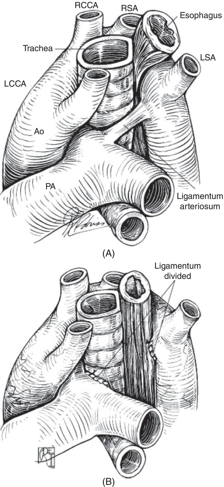

[**Figure 31.5**](#R_c31-fig-0005) Right aortic arch – division and oversewing (B) of ligamentum arteriosum (A). Ao, aorta; CCA, common carotid artery; L, left; MPA, main pulmonary artery; R, right; SA, subclavian artery.)

(Source: Backer & Mavroudis \[1\]. Reproduced with permission of John Wiley & Sons.)

#### Anesthesia for the repair of innominate artery compression of the trachea

The preoperative general assessment is similar to that described for vascular rings. The conduct of anesthesia is simplified if aortopexy of the innominate/aorta is the surgical technique because the risk of major intraoperative complications or the need for vascular clamping is minimal. Reimplantation of the innominate artery will involve more specific and intense intraoperative monitoring, which will include consideration of the aortic surgery and temporary occlusion of the innominate artery. For continuous arterial pressure monitoring, an arterial line can be placed in the left radial artery. Information about the adequacy of collateral perfusion during clamping of the innominate can be gained by placing an arterial line in the right radial artery. Previous case series have not noted stroke as a significant risk during temporary clamping of the innominate artery, but monitoring of cerebral perfusion, e.g., with NIRS, may be warranted to confirm minimal risk of ischemic stroke due to poor perfusion relating to clamping. Anticoagulation (normally 100 units/kg heparin; target activated clotting time 180–200 seconds) is used to minimize the risk of embolus or thrombosis related to innominate artery reimplantation. Bronchoscopy, either rigid or flexible, is frequently performed pre‐ and post‐procedure to assess results of surgery or in the case of tracheopexy may actually be needed to guide the surgical procedure. Postoperative care will be predicated on similar principles to vascular ring procedures.

* * *

### KEY POINTS: INNOMINATE ARTERY COMPRESSION SYNDROME

-   Some innominate artery compression of the trachea is normal.
-   Natural history is for obstruction to decrease with growth, so conservative management is often justified.
-   Simple suspension aortopexy is usually adequate for cases that require surgery and will “buy time” for growth but more complex procedures such as tracheopexy may be needed.
-   Formal reimplantation of the innominate artery is more definitive surgery but far more complex a procedure with a number of potential complications.

* * *

### Pulmonary artery sling with tracheal stenosis: anatomy and natural history

Pulmonary artery sling results from an aberrant course of the left pulmonary artery around the trachea, which may restrict the space in which the trachea forms \[1\] ([Figure 31.9](#c31-fig-0012)). The left pulmonary artery arises from the posterior surface of the right pulmonary artery and passes over the superior surface of the right main bronchus then posterior to the trachea and anterior to the esophagus to the left lung. The most important factor that determines prognosis is the association of this lesion with segmental narrowing of the trachea, and sometimes bronchi, with complete cartilaginous rings in the affected segment, the so‐called “rat‐tail trachea.” A long segment of narrowing worsens the prognosis. Curiously, these patients frequently do not present for some months after birth, often with airway obstruction associated with an apparently minor respiratory infection. Recent advances in tracheal reconstruction have been associated with an improved outcome. Imaging studies are crucial for accurate diagnosis. Echocardiography may provide initial diagnosis, but anatomic detail is better provided by CT or MRI; cardiac catheterization is rarely indicated for this problem.

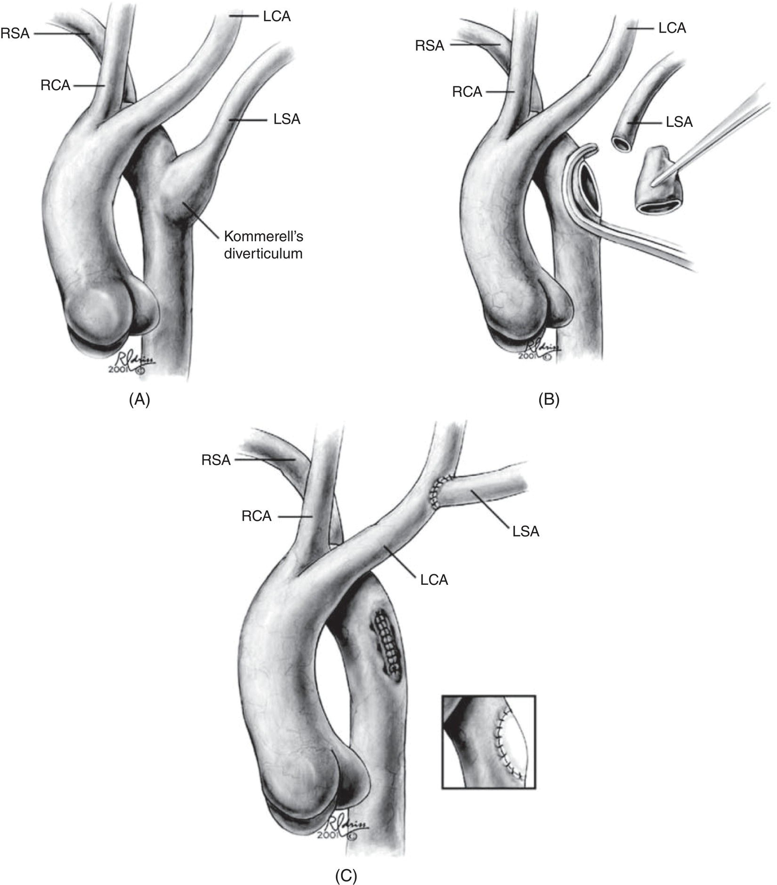

[**Figure 31.6**](#R_c31-fig-0006) Resection of Kommerell’s diverticulum. (A) Typical anatomy of a patient with a right aortic arch, retroesophageal left subclavian artery, and large Kommerell’s diverticulum. LCA/RCA, left/right carotid artery; LSA/RSA, left/right subclavian artery. (B) There is a vascular clamp partially occluding the descending thoracic aorta at the origin of the Kommerell’s diverticulum, which has been completely resected. (C) The completed repair. The orifice where the Kommerell’s diverticulum was resected is usually closed primarily or patched if necessary. The left subclavian artery has been implanted into the side of the left common carotid artery.

(Source: Backer et al. \[13\]. Reproduced with permission of Elsevier.)

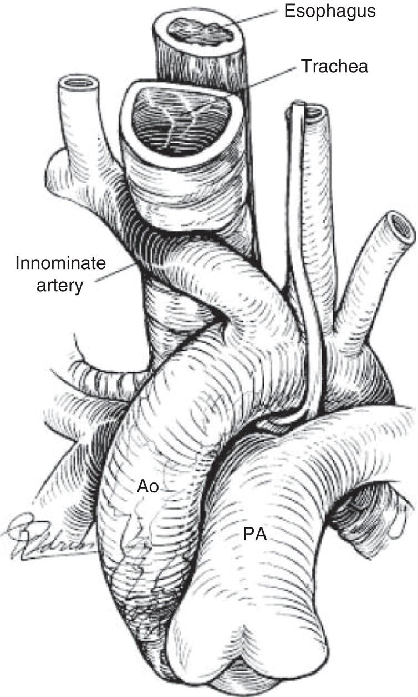

[**Figure 31.7**](#R_c31-fig-0007) Innominate artery compression of anterior trachea. Ao, aorta; PA, pulmonary artery.

(Source: Backer & Mavroudis \[1\]. Reproduced with permission of John Wiley & Sons.)

[**Figure 31.8**](#R_c31-fig-0010) Innominate artery suspension. Exposure is through a right submammary thoracotomy. Fixing the adventitia of the innominate artery to the posterior table of the sternum with pledgeted sutures pulls the innominate artery anteriorly and actively pulls the tracheal wall forward and opens it. Asc Ao, ascending aorta.

(Source: Backer & Mavroudis \[1\]. Reproduced with permission of John Wiley & Sons.)

[**Figure 31.9**](#R_c31-fig-0012) Pulmonary artery sling. L, left; M, main; PA, pulmonary artery; R, right. Inset: left lateral view of anterior compression of the esophagus and posterior compression of the trachea.

(Source: Backer & Mavroudis \[1\]. Reproduced with permission of John Wiley & Sons.)

#### Pulmonary artery sling with tracheal stenosis: pathophysiology

Pulmonary artery sling pathophysiology is focused on the severity and length of the associated tracheobronchial narrowing. It is not clear whether the usual delay in presentation until some months of life represents primarily a failure of further growth of airway diameter or an increase in ventilatory requirements as the child grows. A common clinical scenario is an apparently minor respiratory infection in the middle of the first year of life, leading to obvious signs of increased work of breathing relating to respiratory obstruction with slow or incomplete resolution of the illness. Distinguishing this from the far more common bronchiolitis and laryngotracheobronchitis infections in children with underlying normal airways is difficult at the primary presentation. The severity of obstruction, failure of resolution, and recurrent presentation are the usual triggers for further investigation and diagnosis of the patient with pulmonary artery sling. Huang and colleagues recommend tracheoplasty surgery if the tracheal width is less than 3 mm \[18\]. An Australian retrospective study of 33 PA sling patients by Yong and colleagues analyzing cases showed that long‐term outcomes and survival are often worsened by the need for tracheal surgery \[19\] ([Figure 31.10](#c31-fig-0013)). Early mortality was clearly increased in those requiring surgery on the trachea. A review of pulmonary function testing several years after tracheal surgery demonstrated that a non‐reversable obstructive pattern was often demonstrated on pulmonary function testing suggesting the need for long‐term respiratory assessment of these patients.

#### Surgery for pulmonary artery sling with tracheal narrowing

The long‐term outcome of the surgical intervention for these patients depends on the tracheal reconstruction. The surgery is done through a sternotomy, on cardiopulmonary bypass (CPB). The aberrant left pulmonary artery can be dealt with at the time of reconstruction of the trachea, most commonly by dividing and reimplanting it, to mimic the normal takeoff from the main pulmonary artery, but alternative methods to relocate the vessel in relation to the reconstructed trachea have been used.

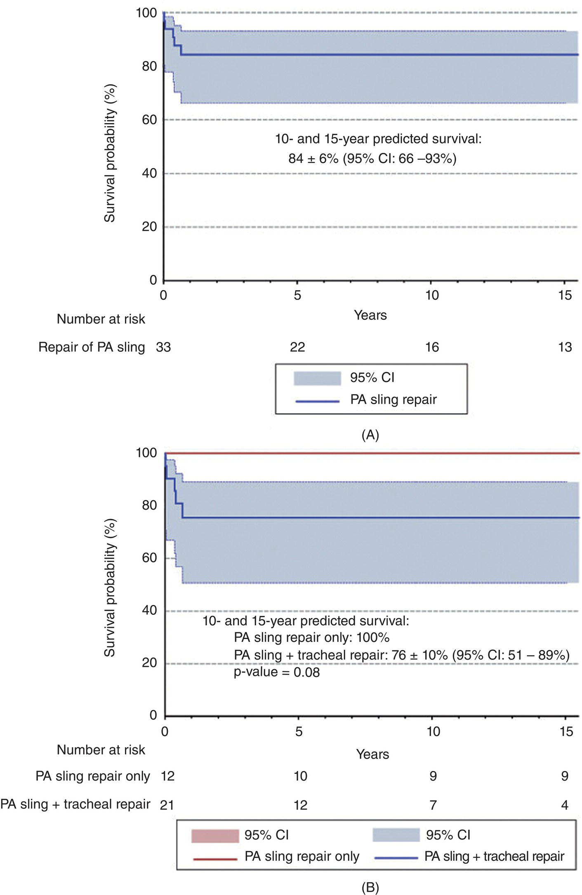

[**Figure 31.10**](#R_c31-fig-0013) Kaplan‐Meier curve showing probability of survival in (A) all patients who had pulmonary artery (PA) sling repair and (B) patients who had PA sling repair only compared to patients who had both PA sling and tracheal repair. CI, confidenc interval.

(Source: ReproducedYong et al. \[19\]. Reproduced with permission of Springer Nature.)

For patients with a short segment of tracheal stenosis, resection of the stenosis, mobilization of the trachea, and direct anastomosis may be sufficient and relatively straightforward surgery \[1\] ([Figure 31.11](#c31-fig-0014)). For patients with a longer segment of narrow trachea with complete rings, the long‐term problem with tracheal reconstruction has been to achieve both continuing adequate airway patency and a functional tracheal epithelium. The airway patency must be throughout the respiratory cycle, which requires a degree of rigidity to resist collapse in expiration. For long segment reconstruction, the slide tracheoplasty has become the preferred surgical approach. Tracheal surgery is technically demanding and should ideally be performed in centers that do large numbers of cases \[20\]. Alternatives, such as simple patches (e.g., with pericardium), will usually be associated with tracheomalacia in the long term. Scarring and granulation formation and the lack of cilial function will often complicate stented patches, whether stented by external, surgically placed cartilage grafts or internal stents, similar to those used for vascular stenting. There is currently no data to support stenting as a primary approach for tracheal stenosis patients but they are often used as a bridge to surgical therapy \[20\]. The most commonly cited complications of currently available intraluminal stents are stent migration, degradation and fragmentation \[21\]. A systematic review of 26 studies of intraluminal stents showed an overall complication rate of 21.7% (8.7% stent fragment foreign body and 4.3% each for stent migration, local stenosis, and granulation tissue) A more complex style of self‐expanding helical stent is under preclinical investigation. It is made of nitinol, a nickel‐titanium alloy, designed specifically to minimize foreign‐body reaction, preserve mucociliary transport, and facilitate atraumatic removal \[22, 23\]. External custom 3‐D printed bio‐reabsorbable tracheal splints are also under clinical investigation \[18\], and may allow time for tracheal growth but require an more complex open surgical procedure \[18, 24\]. Alternative sources of tissue, such as laboratory‐based tissue engineering or donor tissue, are possible, but slide tracheoplasty has the potential to provide airway patency, with a non‐collapsing wall and normal functioning respiratory epithelial mucosa.

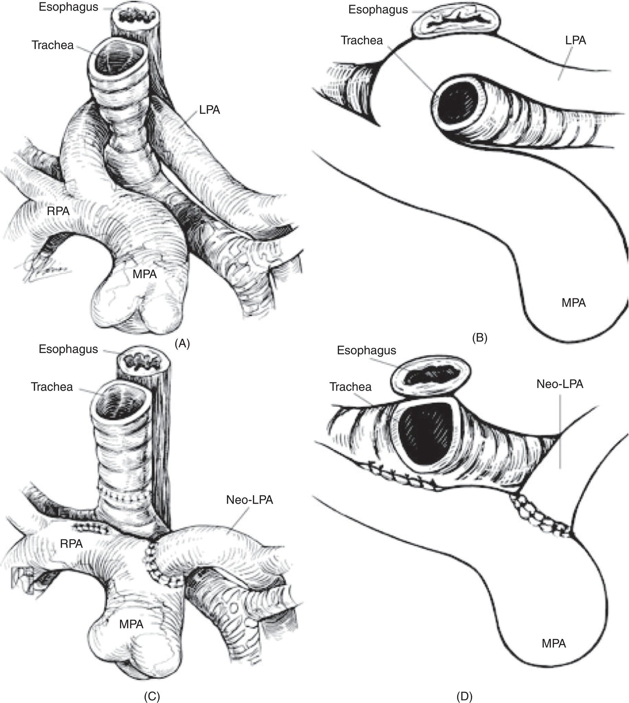

[**Figure 31.11**](#R_c31-fig-0014) Illustration of operative technique for pulmonary artery sling repair with tracheal resection (performed with cardiopulmonary bypass). (A) Left pulmonary artery (LPA) encircles and compresses the distal area of the trachea and right main‐stem bronchus. (B) Relationship of the LPA to the trachea and esophagus. (C) Repair is by transecting the LPA at its origin from the right pulmonary artery (RPA) and anastomosing the LPA to the main pulmonary artery (MPA) at a site that approximates the usual anatomic configuration. The tracheal stenosis has also been resected, and an end‐to‐end tracheal anastomosis is shown. (D) Postoperative relationship of neo‐LPA to MPA anastomosis showing the relatively long distance from the original LPA takeoff from the RPA.

(Source: Backer & Mavroudis \[1\]. Reproduced with permission of John Wiley & Sons.)

Slide tracheoplasty is a solution for many longer segment narrowings which optimizes the use of native tissues to reconstruct the trachea and potentially proximal bronchi \[25\] ([Figure 31.12](#c31-fig-0017)). The technique involves an oblique division of the trachea, with the distal and proximal ends of the incision continued on the proximal trachea and distally, and potentially along a bronchus if there is bronchial involvement. The trachea is mobilized so that the oblique end of the proximal trachea can slide into the apex of the distal incision, and the oblique end of the distal trachea can slide into the apex of the proximal incision. This achieves expansion of the lumen, with essentially normal tracheal tissue and mucosa forming the reconstructed trachea. The long oblique anastomosis is less likely to stricture than a circular anastomosis. The slide maneuver shortens the trachea. Independent of symptom severity, DLR (diameter/length ratio) is defined as the ratio of the narrowest diameter divided by the stenotic segment length. DLR has been reported by Hong and colleagues as a potentially reliable indication for surgery in patients with congenital tracheal stenosis with pulmonary artery sling \[26\]. According to Harada and colleagues, a DLR of less than 5.9 may be a reliable indicator for slide tracheoplasty in addition to vascular repair \[27\].

Patients with a long segment of tracheobronchial narrowing in association with a pulmonary artery sling may well benefit from a multidisciplinary assessment. These patients should be managed at an appropriate referral center. According to an analysis by Chen and colleagues of 23 children between 2003 and 2018, slide tracheoplasty can be performed for up to two thirds of the length of the trachea. Beyond this length, tension‐relieving maneuvers may be required to prevent complications such as anastomotic breakdown, recurrent granulation tissue, and a narrowed lumen \[28\]. It is desirable that cardiac surgery, cardiology, thoracic and otolaryngological surgery, anesthesia, pulmonary medicine, intensive care, and medical imaging and intervention should all participate and collaborate in planning the management of these patients.

#### Anesthesia for the repair of pulmonary artery sling and tracheal stenosis

The anesthesia assessment of these patients is particularly focused on the impact and extent of the associated tracheal stenosis. The indications and timing of surgery are entirely driven by symptoms related to the tracheal obstruction. The spectrum of these patients’ conditions may well range from a minimally symptomatic baby who is requiring no current intervention to a patient in a perilous situation with maximum intensive care support, with complex ventilator requirements and potentially requiring extracorporeal oxygenation or carbon dioxide clearance. Positive pressure ventilation in these patients is difficult to optimize and assessing flow volume loops created by different ventilator strategies can be helpful. Common strategies include permissive hypercapnea, attention to adequate expiratory time to minimize hyperinflation which limits ventilation, and continuous positive pressure to maintain airway patency.

Anesthesia is similar to other procedures requiring CPB. Passing an endotracheal tube through the larynx is initially as for a normal patient. The difference is that a tube that is appropriate for the upper trachea will not pass through the narrow segment. No attempt should be made to advance the endotracheal tube through the narrowing. Bronchoscopic assistance may be utilized or the tube can be gently advanced through the larynx until resistance is felt and minimally withdrawn from that point. The narrow segment of the trachea can easily be blocked by blood, swelling, or secretions associated with trauma to the mucosa, with potentially catastrophic results. Avoiding these complications by minimizing airway trauma is a primary aim. If required, suctioning may require a fine catheter and lubrication to clear secretions from the narrow segment. Suctioning may be necessary for adequate ventilation but runs the risk of traumatizing the mucosa. Suctioning may be life‐saving if secretions or blood occlude the narrow segment. High inspiratory pressures may be required to inflate the lungs, as the narrow segment may have a very high resistance to flow. For this reason, consideration should be given to ensuring that the largest appropriate tube is placed above the narrowing to minimize the risk of an excessive leak at high ventilator pressures or inability to generate adequate pressure. If there is sufficient length of trachea above the narrowing, a tube with a cuff, particularly one with the minimum distance between the cuff and the tip of the endotracheal tube, may be appropriate. Bronchoscopic confirmation and guidance of placement should be considered.

The mobilization and slide maneuver associated with slide tracheoplasty will tend to draw the trachea down into the chest, meaning that the distance between the larynx and the tip of the endotracheal tube placed at the beginning of the procedure will decrease. This should be assessed, and the endotracheal tube confirmed to be in a good position before transporting the patient to the intensive care unit.

With adequate surgical relief of tracheal obstruction and air‐tight closure of the tracheal (or tracheobronchial) anastomosis, the patient should tolerate positive pressure ventilation postoperatively and the endotracheal tube can be left above the anastomosis. Early extubation is usually avoided, as postoperative swelling over the next few days may still be associated with a restricted airway. Fiberoptic bronchoscopic examination via the endotracheal tube can guide decision‐making about airway management, as well as provide controlled airway suctioning and assist with deciding the best position for the endotracheal tube during the postoperative course. Although a relatively early return to spontaneous ventilation may minimize the need for positive pressure ventilation, decreasing the risk of air leak, coughing or straining on the endotracheal tube, perhaps related to decreased sedation to allow spontaneous ventilation, could be associated with a greater risk of air leak. The management plan will require repeated assessment if clinical circumstances change.

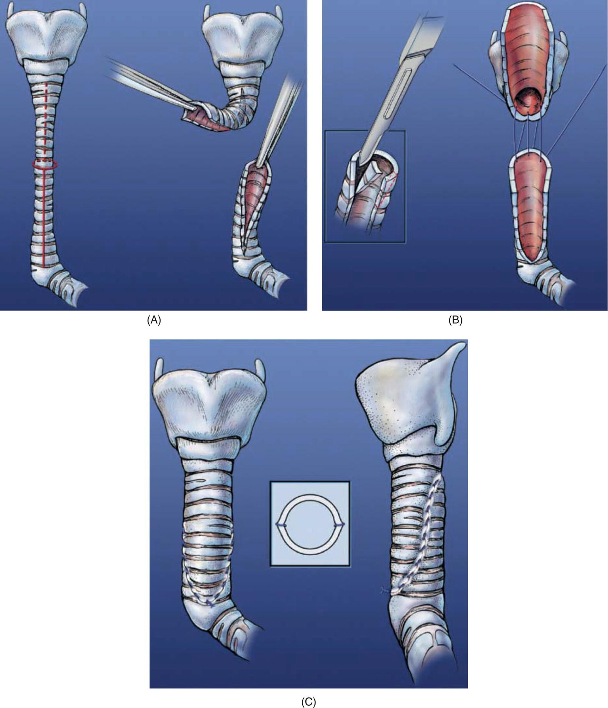

[**Figure 31.12**](#R_c31-fig-0017) Slide tracheoplasty. (A) The trachea is transected in the midportion of the tracheal stenosis. This site is determined by either external examination or internal bronchoscopic findings. The inferior portion of the trachea is incised anteriorly and the superior portion of the trachea is incised posteriorly. (B) The ends of the trachea are beveled as shown in the small inset. The suture line is started superiorly (parachute technique) and finished inferiorly just above the carina. (C) Completed slide tracheoplasty.

(Source: Backer et al. \[12\]. Reproduced with permission of Elsevier.)

[Box 31.1](#c31-fea-0001) Summarizes the surgical approach to vascular rings and slings \[1\].

* * *

### KEY POINTS: PULMONARY ARTERY SLING

-   The outcome is mostly determined by the degree of tracheobronchial obstruction.
-   The affected segment of the tracheobronchial tree has complete cartilage rings.
-   Repair on CPB includes dealing with the pulmonary artery sling but repair of tracheobronchial obstruction is crucial.
-   Excision of the narrow segment may be possible for short segments, but slide tracheoplasty is the usual technique for longer segments and long‐term outcomes are favorable with excellent late survival
    -   Tracheopexy may help treat severe tracheobronchomalacia
    -   DLR may be a reliable indicator for surgical intervention
    -   Tracheal stenting and splinting are not currently first‐line treatment options but improvements in these technologies are currently under investigation.

* * *

* * *

### [Box 31.1](#R_c31-fea-0001): Surgical management of vascular rings

**Double aortic arch**

1.  Left thoracotomy (muscle‐sparing – fourth interspace)
2.  Divide lesser of two arches at insertion with descending aorta
3.  Preserve blood flow to carotid/radial arteries
4.  Ligate and divide ligamentum arteriosum
5.  Leave pleura open

**Right aortic arch/left ligamentum**

1.  Left thoracotomy (muscle‐sparing – fourth interspace)
2.  Ligate and divide ligamentum arteriosum
3.  Resect Kommerell’s diverticulum (if present) and transfer the left subclavian artery to the left carotid artery
4.  Leave pleura open

**Innominate artery compression syndrome**

1.  Right anterolateral thoracotomy (third interspace)
2.  Resect right lobe of thymus
3.  Suspend innominate artery to posterior sternum
4.  Postoperative bronchoscopy

**Pulmonary artery sling**

1.  Median sternotomy/extracorporeal circulation
2.  Ligate/divide left pulmonary artery (PA)
3.  Implant left PA into main PA anterior to the trachea
4.  Slide tracheoplasty for associated tracheal rings

  

(Source: Backer & Mavroudis \[1\]. Reproduced with permission of John Wiley & Sons.)

* * *

## Anomalies of the coronary arteries

There is a wide anatomic variation of the coronary arteries. There are a number of common variants which are accepted as normal but which may have significance if the disease of the coronaries develops (e.g., proximal atheroma in a single coronary artery which gives rise to left and right coronary arteries) or surgery of the region is required (where intramural or unusually placed vessels may be more likely to be injured). The physiological function of the coronary arteries and the heart is usually normal in these variations.

The focus of this section is congenital anomalies of the coronary arteries. Acquired abnormalities are also important in childhood. These include infective causes, of which Kawasaki disease is the most prominent, iatrogenic causes arising from surgery or invasive cardiological procedures, and the development of abnormalities in relation to other lesions, such as the coronary perfusion issues that can be associated with supravalvular aortic stenosis.

The Congenital Heart Surgery Nomenclature and Database Project provided an excellent classification and review of the significance of anomalies of the coronary arteries \[29\]. The major types of coronary anomalies are divided into the following seven groups:

1.  Anomalous pulmonary origins of the coronaries
2.  Anomalous aortic origins of the coronaries
3.  Congenital atresia of the left main coronary artery
4.  Coronary arteriovenous fistulas
5.  Coronary artery bridging
6.  Coronary artery aneurysms
7.  Coronary stenosis.

Coronary anomalies are a diverse group of disorders with varying clinical manifestations for which history and physical exam are extremely unreliable in diagnosing these rare conditions which rarely cause symptoms at rest. They are the second most common cause of sudden cardiac death in young competitive athletes \[30\]. A similarly high incidence of coronary anomalies has also been seen at autopsy of young military recruits who died suddenly \[31\]. A 2018 MRI screening study by Angelini and colleagues of a general population of 5,000 adolescents participating in school sports revealed a 1.3% incidence (70 cases) of high‐risk cardiovascular disease including 23 study members with AOCOS anomalies (anomalous origin of a coronary artery from the opposite sinus) \[32\] ([Table 31.4](#c31-tbl-0004)). Left sided AOCOS with an intramural course (L‐AOCOS‐IM) constitutes the most serious group of all LCA anomalies \[34\]. During strenuous exercise the proximal intramural course predisposes to lateral compression and phasic narrowing during systole potentially leading to ischemia. An intra‐arterial course between the great vessels has also been found to be problematic and is often difficult to confirm with imaging \[35\]. Screening for these abnormalities in children has become a recent topic of focus but no clear guidelines have yet been established.

Supravalvular aortic stenosis is also clinically important and associated with sudden death, sometimes in association with apparently stable anesthesia, and the complex mechanisms, which may be both structural and dynamic. The development of abnormalities of coronary perfusion in this condition is discussed.

[**Table 31.4**](#R_c31-tbl-0004) Prevalence of potentially high‐risk cardiovascular conditions

(Source: Angelini \[32\]. Reproduced with permission of Springer Nature.)

|  | Total cohort | Ages 11–14 years | Ages 15–18 years |
| --- | --- | --- | --- |
| _N_ = 5169 | Frequency (%) | 95% CI | _n_ = 4310 | Frequency (%) | _n_ = 859 | Frequency (%) |
| --- | --- | --- | --- | --- | --- | --- |
| Total hr‐CVC | 76 | 1.47 | 1.16–1.84 | 62 | 1.44 | 14 | 1.63 |
| hr‐ACAOS | 23 | 0.44 | 0.28–0.67 | 20 | 0.46 | 3 | 0.35 |
| L‐ACAOS‐IM | 6 | 0.12 | 0.04–0.25 | 6 | 0.14 | 0 | 0 |
| RSV | 2 | 0.04 | 0.01–0.10 |  |  |  |  |
| NC | 2 | 0.04 | 0.01–0.10 |  |  |  |  |
| HO | 2 | 0.04 | 0.01–0.10 |  |  |  |  |
| R‐ACAOS | 17 | 0.33 | 0.19–0.53 | 14 | 0.32 | 3 | 0.35 |
| hr‐CMP | 14 | 0.27 | 0.15–0.45 | 6 | 0.14 | 8 | 0.93 |
| DCM | 11 | 0.21 | 0.11–0.38 | 5 | 0.12 | 6 | 0.70 |
| HCM | 3 | 0.06 | 0.01–0.17 | 1 | 0.02 | 2 | 0.23 |
| ECG hr‐CVC | 39 | 0.75 | 0.54–1.03 | 36 | 0.84 | 3 | 0.35 |
| Brugada | 1 | 0.02 | 0.00–0.11 | 0 | 0 | 1 | 0.12 |
| WPW | 4 | 0.08 | 0.02–0.20 | 4 | 0.09 | 0 | 0 |
| QTc ≥ 470 ms | 34 | 0.66 | 0.46–0.92 | 32 | 0.74 | 2 | 0.23 |
| NCLV | _959_ | _18.55_ | _17.50–19.64_ | _810_ | _18.79_ | _149_ | _17.35_ |

_ACAOS_, anomalous origin of the right or left coronary artery from an ectopic coronary artery with intramural course; _CI_, confidence interval; _CMP_, cardiomyopathy; _CVC_, cardiovascular condition; _DCM_, dilated cardiomyopathy; _ECG_, electrocardiogram; _HCM_, hypertrophic cardiomyopathy; _HO_, high origin; _hr_ high risk; _L‐ACAOS‐IM_, left ACAOS from the right sinus (RSV) with an intramural course; _NC,_ non‐coronary sinus; _NCLV_, non‐compaction left ventricle; _R‐ACAOS_, right ACAOS; _WPW_, Wolff‐Parkinson‐White. NCLV is currently not considered a high‐risk cardiovascular condition but is reported here because of the potential need for a new discussion of the entity, still under study.

### Anomalous pulmonary origins of the coronary arteries: incidence, anatomy, and natural history

These are rare lesions with the commonest and most important being anomalous left coronary artery arising from the pulmonary artery (ALCAPA) with an incidence of only 1 in 300,000 live births. ALCAPA presents early in life with a mortality of up to 90% in the first year, if untreated. Anomalous right coronary artery from the pulmonary artery (ARCAPA) is even rare, usually presenting after a few years of life, but with a wide clinical spectrum. Later presentations are not infrequent and some adults with this condition are at risk of sudden death \[36–38\]. Common presenting findings in the adolescent or adult population include EKG changes (ST changes and Q waves), cardiomegaly, a pansystolic murmur, and echocardiographic findings of mitral regurgitation \[39\]. Extensive intercoronary collaterals from the right side of the heart and/or retrograde flow from LCA‐ derived collaterals back to the pulmonary artery are also often seen in these older ALCAPA patients \[30\].

Anomalous right coronary artery from the pulmonary artery may be more benign than ALCAPA, as the right ventricle, which is supplied by the ARCAPA, has more favorable myocardial oxygen supply and demand characteristics when compared with the left ventricle. Other, even rarer variants include both right and left coronary arteries arising from the pulmonary artery, anomalous single coronary artery from the pulmonary artery (ASCAPA) (images with permission) as well as accessory coronary artery arising from the pulmonary artery \[40\] ([Figure 31.13](#c31-fig-0019)). The rest of this discussion will be restricted to ALCAPA.

#### Pathophysiology of ALCAPA

The pathophysiology of ALCAPA is complex and will vary with the exact anatomy and the changing physiological circumstances as the neonate develops and pulmonary vascular resistance (PVR) and pressure falls. The ALCAPA vessel provides a connection between the pulmonary artery and the myocardium supplied by the left coronary artery. Left ventricular coronary perfusion is dependent on diastolic perfusion, as the pressure generated by left ventricular contraction prevents coronary perfusion during systole. In the early neonatal period, PVR and pulmonary artery pressure are high, compared with later in life. In this phase, the left ventricle may have adequate oxygenation, albeit with mixed venous blood with relatively low hemoglobin oxygen saturation, which can be adequate for left ventricular function. As PVR and pulmonary artery pressure decrease, flow in the ALCAPA vessel may reverse, acting as a fistula and causing run‐off of coronary blood flow to the pulmonary artery, creating a “coronary artery steal” and worsening left ventricular perfusion. This will cause ventricular ischemia, which will lead to ventricular dysfunction, especially in diastole, which will lead to an increase in left ventricular diastolic pressures, thus further decreasing the perfusion pressure. The “coronary steal” may also affect right ventricular perfusion in both systole and diastole, if there are significant collaterals, but the presence of some systolic perfusion of the right ventricle muscle, as in normal coronary physiology, is protective. A peculiar potential benefit of the reverse flow in the ALCAPA vessel (towards the pulmonary origin) is that this may help to maintain PVR and pressure, potentially delaying the onset of symptoms.

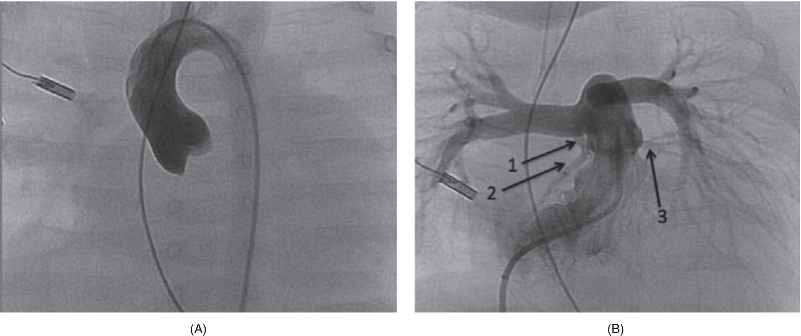

[**Figure 31.13**](#R_c31-fig-0019) Anomalous single coronary artery arising from the pulmonary artery. (A) Aortogram with absent coronary ostia. (B) Coronary filling after contrast injection into the pulmonary artery demonstrating a short single coronary artery (1) bifurcating into right (2) and left (3) branches.

(Source: Machovec et al. \[40\]. Reproduced with permission of Wolters Kluwer Health, Inc.)

The worsening left ventricular function will be associated with dilation of the left ventricle. Left heart dilation may be associated with a shift of the interventricular septum towards the right, with associated impairment of right heart function. Mitral valve regurgitation can be induced by both dilatations of the left atrioventricular ring and ischemic dysfunction of the papillary muscles. This will lead to volume loading and further deterioration of left ventricular function with worsening pulmonary congestion and a low output state. The commonest presentation of ALCAPA is at weeks to sometimes months after birth with a condition that is essentially a severe dilated cardiomyopathy of ischemic origin. All infants presenting with dilated cardiomyopathy must be closely screened for anomalies of coronary origin.

Variations in the anatomy of the ALCAPA may influence the presentation. As with normal coronary arteries, there may be significant differences in the balance of these arteries. The more that the right coronary is dominant, supplying significant portions of the ventricular septum and other regions of the left ventricle, the more likely it is that there will be a later presentation with less severe deterioration in myocardial function. Similarly, stenosis of the ALCAPA vessel, which may occur at its origin, will actually lessen the impact of the coronary steal and allow more chance for collateral vessels from the right coronary to perfuse the left side of the heart. There is some evidence that these more delayed presentations may have a long‐term negative impact, as the underlying ischemia will have been more long‐lasting, producing fibrosis, and ventricular recovery after repair will be impaired. For patients with a dominant ALCAPA distribution, presentation is likely to be early with severe myocardial dysfunction. Although recovery in this circumstance can be excellent, some patients may have completed infarction of regions of the left ventricle with no prospect of recovery of function with reperfusion, and with a risk of formation of aneurysm of the left ventricle. The more severe early presentations are also at risk of lethal complications before surgical repair can be performed. Additionally, about 10–15% of ALCAPA patients are adult‐type which without surgical repair results in a risk of sudden death before the age of 35 in 80–90% patients. It is for this reason that surgical repair of all those diagnosed as adolescents or adults is recommended \[41\].

#### Surgery for ALCAPA

Historically, simple ligation of the ALCAPA vessel was used, improving survival \[42\]. This would prevent the coronary steal and, depending on the adequacy of collateral circulation, improve perfusion of the left ventricle. Mortality was still high and recovery of left ventricular function usually incomplete. This procedure is no longer performed in major congenital cardiac surgery centers. Current surgical management involves restoring aortic perfusion of the ALCAPA vessel, thus providing a two‐coronary circulation originating from the aorta, usually by mobilization and reimplantation of the ALCAPA vessel onto the aorta \[43–45\] ([Figure 31.14](#c31-fig-0020)). A specific example that can be used for a very short ALCAPA vessel is the Takeuchi procedure. This involves using an intra‐arterial pulmonary baffle to direct flow from a surgically created aortopulmonary window to supply the origin of the ALCAPA vessel with systemic arterial blood in situ, with patch expansion of the pulmonary artery to allow space for the baffle and prevent pulmonary obstruction \[46–48\]([Figure 31.15](#c31-fig-0021)).

The unit managing these cases should be able to provide extracorporeal circulatory support with a ventricular assist device (VAD) or extracorporeal membrane oxygenation (ECMO) if required. The techniques may be necessary as part of preoperative resuscitation or for support of the patient in the early postoperative period, as the recovery of myocardial function is usually not immediate \[49\]. Imamura et al. reported a series of 26 ALCAPA operations over a 20‐year period \[50\]. Twenty‐one patients did not require ECMO support and five required ECMO for a mean of 10.7 ± 6.7 days. One patient in each group required cardiac transplantation, and four others required six reoperations (five for MR). There were no deaths in the series, and actuarial freedom from transplantation or reoperation at 5 years was 0% in the ECMO group, and 92% in the non‐ECMO group. [Chapter 37](c37.xhtml) presents a detailed discussion of mechanical support of the circulation.

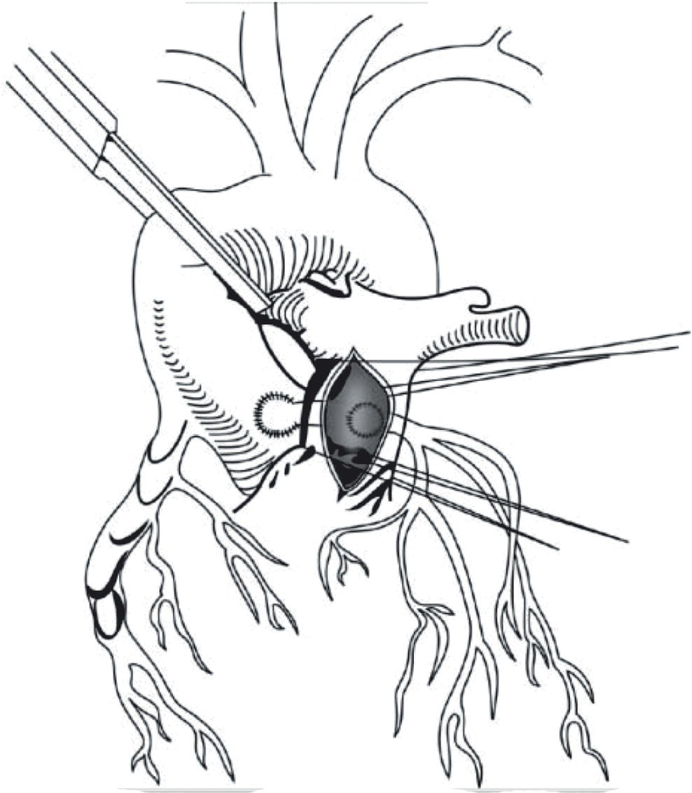

[**Figure 31.14**](#R_c31-fig-0020) Direct aortic reimplantation of the anomalous left coronary artery from the pulmonary artery. The anomalous ostium is excised with a button of the pulmonary artery wall. This button is then implanted into the left lateral side of the ascending aorta. The resulting defect is closed with a pericardial patch

(Source: Arciniegas \[45\]. Reproduced with permission of Elsevier.)

There is controversy about the role of surgical procedures to improve mitral valve regurgitation at the primary operation because mitral valve function usually improves as improved myocardial function results in decreased end‐diastolic volume and better papillary muscle function \[51\]. In a series of 25 operations for ALCAPA, Kudumula et al. repaired the mitral valve only for moderate to severe MR, accompanied by structural mitral valve abnormalities, observed in four patients \[52\]. Two patients had mitral valve cleft, one had a prolapse, and one had a dysplastic double orifice mitral valve. One patient with a structural mitral valve abnormality that was not repaired at the original operation developed severe MR and required repair at a second operation. Of 14 patients in the series without structural mitral valve problems with moderate or severe MR, 13/14 had none or mild MR at the time of follow‐up. A Saudi Arabian retrospective observational cohort of 29 patients from 1999 to 2018 analyzed by Ismail showed similar findings ([Figure 31.16](#c31-fig-0022)). Spontaneous regression of MR was reported by Ismail et al. In these patients, LV systolic function showed echocardiographic improvement within 6 weeks and returned to normal within 1 year’s time and in addition somatic growth of children improved 6 months after surgical repair \[53\]. Some surgeons still argue that there is a reasonable argument that surgical techniques that decrease the mitral valve annulus size but allow for future growth may improve mitral valve function acutely, improving the performance of the dysfunctional early postoperative heart. Although repairing the mitral valve does increase the cross‐clamp time on an already ischemic myocardium, this does not seem to have a clinically significant effect on the later normalization of LV function or other postoperative outcomes. According to a 2016 study by Naimo et al. which evaluated 42 ALCAPA patients, late reoperation was uncommon in the 33 patients who did not undergo concomitant MV repair despite MR ranging from none to severe. In fact, late MV reoperation was only needed in 14% at 5 & 10 years, and 19% in 20 years after original surgery. Persistent MR does warrant close followup and late MV operative repair may eventually be necessary in some patients \[54\].

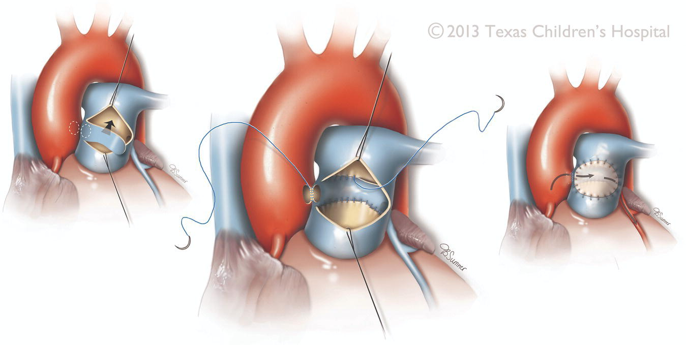

[**Figure 31.15**](#R_c31-fig-0021) Takeuchi procedure through median sternotomy with extracorporeal circulation and cross‐clamped aorta. Left: The tunnel for coronary flow has been made between the aorta and the anomalous left coronary artery by means of a flap of pulmonary artery wall. Middle: Construction of the tunnel to direct flow from the aortic root to the anomalous left coronary artery. Right: The pulmonary artery is then reconstructed with pericardium.

(Source: Reproduced with permission of Texas Children’s Hospital.)

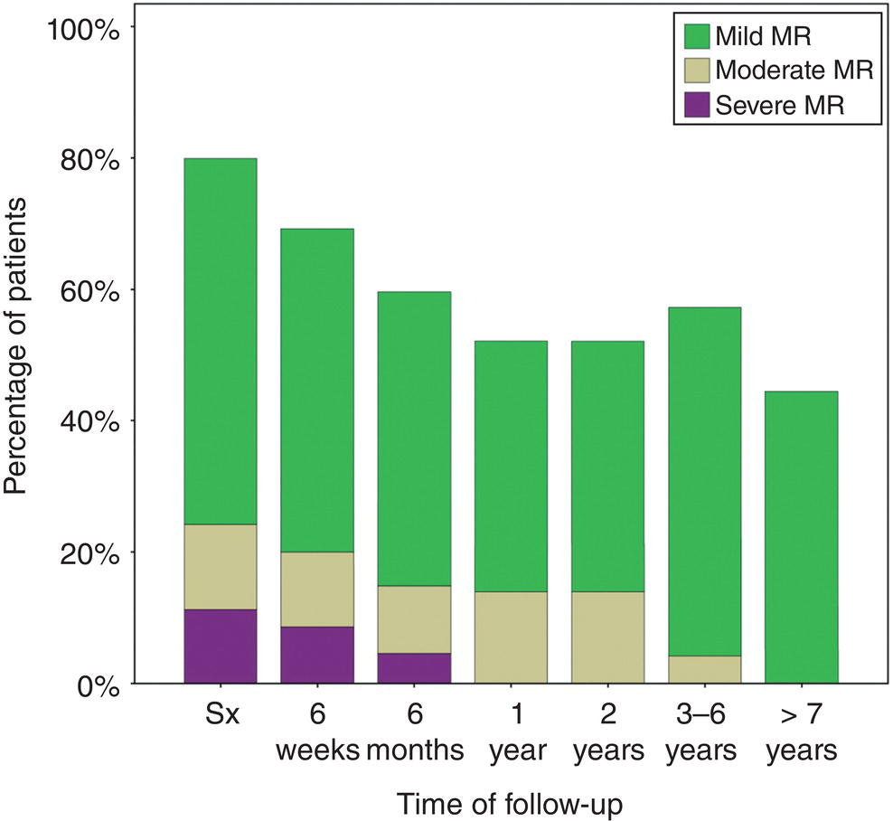

[**Figure 31.16**](#R_c31-fig-0022) Spontaneous regression of mitral regurgitation after ALCAPA repair. MR, mitral regurgitation.

(Source: Ismail et al. \[53\] / Cureus / CC BY 4.0.)

#### Anesthetic considerations for ALCAPA

The degree of myocardial dysfunction is the factor that dominates the condition and prognosis of these patients throughout the perioperative period. Preoperatively, the patient with ALCAPA may be receiving cardiorespiratory support, ranging from none to an intubated ventilated patient on ECMO. In between these extremes will be patients with various degrees of inotropic support receiving tailored vasodilators or, in some cases, vasoconstrictors. The general principle that a failing heart, especially with MR, will have output improved by systemic vasodilation is sound, but the severity of the dysfunction in some of these patients means there may be a role for vasoconstrictors. If the patient is already hypotensive, it is possible that the vasodilation is actually excessive for that heart and results in greater tachycardia. The poor coronary perfusion is worsened by both systemic hypotension and tachycardia. In this scenario of myocardial dysfunction with relatively excessive vasodilation, judicious use of vasoconstrictors may improve blood pressure and decrease heart rate, improving coronary perfusion while maintaining an acceptable cardiac output. The patient should be monitored for signs of the inability of the heart to cope with the increased afterload or worsening MR.

Preoperative assessment of patients with ALCAPA should also include assessment of the complications of the myocardial dysfunction, such as respiratory, renal and hepatic dysfunction, as well as a general medical review.

The group of patients with ALCAPA who provide perhaps the greatest challenge for the anesthesiologist comprises those who have been diagnosed after presenting with respiratory distress, but who are stable and do not require acute cardiorespiratory support. They may have intravenous access, and non‐invasive monitors have been used for them. Echocardiography will have confirmed the diagnosis and the critically poor myocardial function. The anesthesiologist will be responsible for the induction of anesthesia and stabilization of the patient prior to the initiation of CPB in a situation where minor changes in sympathetic drive or myocardial function might be associated with cardiac arrest. Induction of anesthesia, intubation, positive pressure ventilation, placing a central venous catheter or transesophageal echocardiography (TEE) probe, excessive anesthesia with myocardial depression or depression of central nervous system‐driven sympathetic activity, or inadequate anesthesia resulting in excessive sympathetic response can all lead to life‐threatening incidents. The anesthesiologist should be prepared to heparinize and defibrillate the patient at any time. The nursing, perfusion, and surgical team should all be prepared for the potential need for emergent sternotomy and initiation of CPB, and they should be in the operating room during the induction of anesthesia. If it is possible to obtain pre‐induction arterial access without upsetting the patient, this is highly desirable for the earliest warning of cardiovascular compromise. This can sometimes be accomplished in young infants with local anesthesia, either topically or by injection, along with 50% N2O inhalation or small analgesic doses of fentanyl or other opioids intravenously.

The induction of anesthesia in patients with ALCAPA requires great care in the slow titration of small increments of whatever drugs are selected to minimize the myocardial depression and vasodilation that accompanies the usual doses of most of these drugs. Opioids, such as fentanyl and remifentanil, although tending to spare myocardial function, can rapidly depress central sympathetic drive, causing relative bradycardia and vasodilation, which may be poorly tolerated by these patients. Similar problems can arise even with drugs, such as etomidate and ketamine, that tend to preserve sympathetic function and cardiovascular stability in normal patients. Ketamine is a direct myocardial depressant, and these hemodynamic effects are most commonly seen in the patient who has depletion of endogenous catecholamines, such as the infant with ALCAPA. Ketamine is also implicated as possibly inducing brain injury in the developing brain and some anesthesiologists avoid it in this age group. The complex risk balance of choice of agent and combination of agents for ALCAPA patients makes judicious, cautious use of agents with which the anesthetist is very familiar a reasonable choice.

Preoperative fluid restriction to manage pulmonary congestion may make the patient especially prone to hypotension with the initiation of positive pressure ventilation. Judicious intravascular volume loading at this time may prevent this. Successful transition to anesthesia and positive pressure ventilation may improve lung function and create some afterload reduction, which may improve left ventricular function. Lung compliance is usually low due to pulmonary congestion, and significant ventilator pressures are commonly required.

Maintenance of elevated PVR will minimize the “coronary steal” due to the ALCAPA flow into the pulmonary artery. Avoiding a high inspired oxygen concentration and maintaining a normal or moderately high arterial carbon dioxide level are key strategies for maintaining PVR, but pulmonary congestion secondary to left heart failure may mean that increased inspired oxygen levels and high ventilator pressures will be required. Significant PEEP may serve both to improve function in the congested lung and to maintain PVR. Increasing ventilatory pressures, particularly PEEP, will require attention to maintaining adequate intravascular volume to support ventricular filling and avoid low cardiac output and systemic hypotension.

Rapid repetitions of non‐invasive blood pressure monitoring should be continued until intra‐arterial continuous blood pressure monitoring is available. Adequate monitoring of the circulation, respiration, and depth of anesthesia in these patients requires constant vigilance. It is advantageous to have at least one, and perhaps two, other pairs of experienced hands to perform the procedures required to prepare the patient for surgery after induction of anesthesia, so one anesthesiologist can focus on the monitoring and anesthesia.

Patients with ALCAPA who have been intubated, ventilated and had appropriate vascular access obtained preoperatively may be sicker in many respects than the previous scenario, but the anesthesiologist will have to make less of a transition for the patient to anesthesia and establish invasive monitoring and other preparation. It is still important that there is great vigilance in the transfer of the patient to the operating room and that the whole operative team is present to initiate CPB at short notice before the transfer commences. Patients who have already been placed on mechanical circulatory support present challenges in transfer, but provided, there is no interruption to that support, they are very safely supported. The anesthesiologist must ensure the patient has adequate intravascular volume to allow good venous drainage into the external mechanical circuit. Monitoring the inlet pressure of the circuit can greatly assist this process.

Delivery of cardioplegia in patients with ALCAPA requires variation from routine procedures. Ensuring adequate cardioplegia flow to all the myocardium is crucial for the preservation of myocardial function. Usually, this can be achieved by anterograde delivery of cardioplegia via both the normally placed right coronary and the anomalous left coronary, the latter usually achieved by cannulating and perfusing into the pulmonary artery clamped so that that flow is restricted to the ALCAPA vessel.

After the cross‐clamp is removed and the heart is perfused, recovery of electrical and motor function of the heart may be slow. As long as the heart is not distending, perfusion pressure and myocardial perfusion are adequate, allowing the heart considerable time to eject without the work of supporting the full circulation, which is beneficial for myocardial recovery. Forcing the heart to support the circulation with early weaning from CPB and administration of large doses of inotropes carries a high risk of return to CPB and of causing myocardial injury. TEE is crucially important in these infants to assess myocardial function and the degree of MR after repair.

Translocation of a coronary artery has the major risks of bleeding from the suture line and poor flow in the coronary, leading to myocardial ischemia and poor function. Blood loss may be minimized by reversal of heparin (as far as possible, but may be limited by the need for mechanical support of the circulation), by optimizing coagulation with appropriate blood products and the use of an antifibrinolytic. Concern about thrombotic and embolic complications may deter some pediatric cardiac units from using these agents. Poor function of the translocated ALCAPA vessel may require revision of the surgery.

These patients are at significant risk for myocardial failure and circulatory collapse after weaning from CPB. Depending on the circumstances, leaving the sternum open and closing the skin with a membrane and dressing may be safer than formal closure of the chest. Not closing the sternum will prevent early pressure on the heart and allow room for some postoperative swelling without compression of the heart. The membrane closure also allows rapid access for resuscitation and return to bypass in the early postoperative period. Purse strings for cannulation for bypass may be left in place during this period and removed when the chest is formally closed. For patients who are less stable in the operating room, transitioning from a CPB circuit with venous reservoir to other mechanical support such as left ventricular assist device, biventricular assist device or ECMO will provide circulatory support of the patient while the myocardium recovers and improves function. Occasionally, failure to wean from CPB for other operations, i.e., ventricular septal defect (VSD) with left ventricular dilation and failure, may be due to an unrecognized ALCAPA; Callagan et al. reported this occurrence in a 6‐week‐old patient where pulmonary hypertension was suspected to have prevented severe left ventricular dysfunction, decreased the symptoms and masked the diagnosis of ALCAPA \[55\]. Coronary angiography confirmed the ALCAPA diagnosis, and emergency reoperation, repair of ALCAPA, and postoperative ECMO were necessary to ensure successful outcome.

* * *

### KEY POINTS: ALCAPA

-   ALCAPA presents with ischemic cardiomyopathy in the first few months of life.
-   Decrease in PVR may create a coronary steal phenomenon.
-   Early operation within days of diagnosis is recommended, due to the risk of sudden death.
-   The risk of circulatory collapse at induction of anesthesia and in the pre‐bypass period is high. Immediate institution of CPB should be available.
-   Induction of anesthesia should be titrated with monitoring and cardiovascular support.
-   Maintenance of both pulmonary and systemic vascular resistance (SVR) is important.
-   Translocation of the ALCAPA to the aorta is the operation of choice.
-   Availability and a reasonably low threshold for mechanical support (VAD/ECMO) are important considerations.
    -   Long‐term outcomes after ALCAPA repair are very good
    -   Although early operation on the mitral valve remains controversial, early repair is often performed when mitral regurgitation is severe

* * *

### Anomalous aortic origins of the coronary arteries

Some of the abnormalities historically thought to be benign have more sinister subgroups where coronary perfusion may be jeopardized in certain circumstances and sudden death may occur. Abnormal origins of the coronary arteries from the aorta are most commonly benign; however, if these abnormalities involve a left coronary artery arising from the right coronary sinus (0.15% in adult cardiac catheterization series) and the course of the vessel passes between the aorta and pulmonary artery, then there is a risk of myocardial ischemia with angina and sudden death, especially with exercise. A right coronary artery arising from the left coronary sinus (0.92%) with the vessel passing between the aorta and pulmonary arteries is also associated with sudden death. Most of the variants of the abnormal location of the origin of the coronary artery from the “opposite” coronary sinus do not have the vessel taking a course between the aorta and pulmonary artery and do not appear to be at higher risk. Where the coronary artery does pass between the aorta and pulmonary arteries, it is postulated not only that exercise increases the risk of myocardial ischemia due to increased oxygen demand in the face of some obstruction to flow as a result of constriction between the aorta and pulmonary artery, but also that the increased cardiac output associated with exercise may cause distension of the root of these vessels, especially the elastic pulmonary artery, and worsen the obstruction of the coronary vessel “sandwiched” between the two great arteries.

Deciding about therapy is difficult in the scenario where the first symptom may be sudden death but the lesion may also be benign. Criteria for intervention are based on evidence of obstruction, symptoms, exercise testing, and detailed imaging to quantify lateral compression, and hypoplasia or stenosis associated with the anomaly, especially as there is commonly an intramural portion that may be narrow. Therapeutic approaches have included beta‐blockers and/or advice to avoid exercise with substantial effort; cardiological intervention with stenting; and surgery, which may involve rerouting the vessel, unroofing a narrow intramural portion, or providing an alternative inflow by graft or aortic side‐to‐side anastomosis, distal to the narrow compressed segment \[56, 57\].

### Congenital atresia of the left main coronary artery

Congenital atresia of the left main coronary artery (CALM) is a rare, apparently benign anomaly. It is distinguished from “single coronary artery,” where the single vessel has two main branches with distributions similar to the normal left and right coronary arteries, in that CALM has the distribution to the left heart filled retrograde by collaterals. There is an association with supravalvular aortic stenosis, especially Williams syndrome, with coronary anomalies, including CALM, which are associated with intermittent ischemia and sudden death (see later).

### Coronary arteriovenous fistulas: incidence, anatomy, and natural history

Coronary arteriovenous fistulas (CAVFs) occur in only 1 of 50,000 live births but are noted in 1 of 500 patients having cardiac catheterization. In those with a congenital fistula, associated CHD occurs in 20–45%. Congenital fistulas may represent the persistence of embryonic sinusoids that provide myocardial blood supply by cross‐connecting the lumen of the primitive tubular heart. Although called “arteriovenous,” the distal connection is usually to the right side of the circulation but not necessarily to a vein, and termination in any chamber of the heart or in the pulmonary artery is possible \[58\] ([Figure 31.17](#c31-fig-0023)). CAVF can also be acquired as a result of abnormal connections made by, for example, trauma, including surgery or cardiological intervention, infection, or ischemia. CT angiography with MDCT (multiple detector computed tomography) is now the test of choice for diagnosing CAVF. It has a short examination time and superior spatial and temporal resolution \[58\].

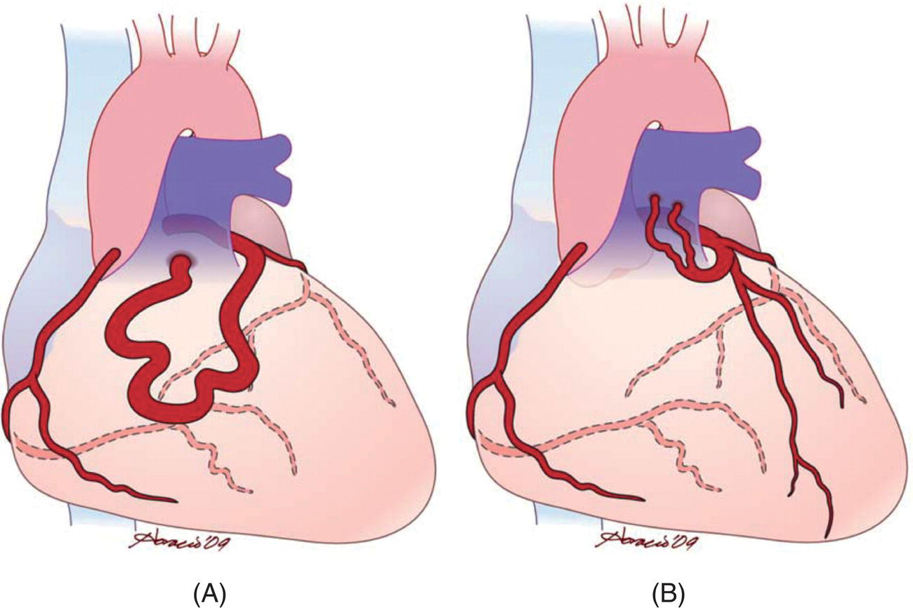

[**Figure 31.17**](#R_c31-fig-0023) Two types of coronary‐to‐pulmonary artery fistulae (CPAF). (A) There is a single prominent fistulous connection between the left main/left anterior descending artery and the main pulmonary trunk. (B). There are multiple small‐caliber fistulous connections between the left main/left anterior descending artery and the main pulmonary trunk. Although both types of CPAF involve the same vessels, anecdotally the CPAF patients with morphology resembling (A) were more likely to be symptomatic as there was greater hemodynamic effect when compared with CPAF patients with morphology resembling (B).

(Source: Verdini et al. \[58\]. Reproduced with permission of Wolters Kluwer Health, Inc.)

CAVFs may be subclassified by angiographic appearance as _type A_, where the coronary artery is dilated proximal to the fistula, but continues with the normal coronary vessel arborizing in the myocardium distal to the fistula; and _type B_, where the coronary artery is dilated over the entire length and terminates on the right side of the heart. These categories may determine management, as suitability for catheter occlusion and surgical approach will depend on the anatomy.

CAVFs may present as incidentally detected asymptomatic murmurs. The natural history is very variable and largely depends on the size of the shunt created, the development of complications (see the next section) and associated conditions. Some smaller fistulas have been noted to close spontaneously \[59\]. There are currently no established guidelines for deciding whether, or how to treat coronary fistulas \[58\].

#### Pathophysiology of CAVFs

Although often incidental findings, there are a number of mechanisms by which these anomalies can produce serious complications. As a connection between a high‐pressure and a low‐pressure part of the circulation, a high‐speed turbulent jet may be created which may be the substrate for subacute bacterial endocarditis or for development of abnormalities of the supplying vessel, with fibrosis, stenosis, and aneurysm formation possible, and with consequent thrombosis, embolus, or rupture of a coronary vessel causing myocardial ischemia or sudden death. Myocardial ischemia may also arise from a coronary steal, with perfusion pressure in related coronary vessels becoming critically low due to the run‐off down the sinus. If there is a high flow through the fistula, this may be sufficient to create significant volume loading with heart failure or pulmonary hypertension.

#### Surgery and catheter treatment of CAVF

There is controversy about whether asymptomatic fistulas should be treated, but some suggest that prevention of complications warrants intervention for all CAVFs. Others are more conservative, noting that spontaneous closure of some small fistulas has been observed and all interventions carry non‐trivial risk and favor monitoring and conservative management. Some fistulas are suitable for catheter occlusion techniques if they are accessible and there is a low risk of coil embolus or interruption of distal coronary perfusion.

Surgical interruption of the fistula is the most common treatment. Some may be suitable for proximal ligation on the epicardial surface with a beating heart without CPB. Care must be taken to ensure that there is no myocardium that will become ischemic with ligation of the fistula. To preserve branches that provide myocardial perfusion, some fistulas will require ligation at their termination, which will usually require CPB.

#### Anesthesia for CAVFs

Anesthesia will be determined by the procedure planned and the complications that the patient has developed. If CPB and an open procedure are planned, the potential for the fistula to jeopardize myocardial protection must be carefully considered and managed. Run‐off of the cardioplegia solution down the fistula may result in failure of myocardial protection for substantial segments of the myocardium. Controlling the fistula and then providing more cardioplegia may be warranted. Catastrophic failure of myocardial preservation has been seen to occur in cases where a fistula was undiagnosed or uncontrolled and where other associated congenital lesions were being repaired. Bacterial endocarditis prophylaxis is recommended for all patients with coronary artery fistulas \[58\].

### Coronary artery bridging, aneurysms, and stenosis

Coronary artery bridging represents a common normal variant, with the coronary artery having a segment of the intramural course. Occasionally, this may be associated with stenosis or dynamic occlusion, which may require intervention. It is rare for this diagnosis to be the primary indication for surgery in pediatric practice. In pediatrics, coronary bridging most commonly presents as technical problems for the surgeon, which may complicate surgery and be associated with coronary injury, sometimes producing ischemia and poor function after the surgical procedure.

Coronary aneurysms may be congenital, but acquired lesions due to Kawasaki disease are more commonly encountered in pediatric practice. It is rare that there are surgical or catheter interventions for these lesions, but anesthesia for imaging procedures may be required.

Congenital stenosis of the coronary arteries is rare. Lesions of the left coronary artery may be associated with sudden death. Acquired stenosis may occur in childhood as a result of precocious atheromatous disease in familial hyperlipidemia, secondary to the abnormalities of the aortic root due to arteritis or connective tissue disorders, or in relation to fibrosis arising from turbulence due to regional anatomical abnormalities.

#### Coronary artery abnormalities associated with supravalvular aortic stenosis

Surpravalvular aortic stenosis, commonly associated with Williams syndrome, can result in abnormal coronary flow and sudden death. There are a number of case reports and series of these patients having circulatory collapse in association with anesthesia \[60\]. The most disturbing feature of these reports has been the absence of obvious precipitating factors, such as changes in heart rate or blood pressure. This has made anesthesiologists wary of these patients because resuscitation has been unsuccessful in a number of these cases once a cardiac arrest has occurred. These events are not well related to the degree of aortic obstruction, so the anesthesiologist may be falsely reassured that the risk is low, as with aortic valve obstruction of a similar degree.

The mechanisms for abnormal coronary flow in these patients are multiple. \[61\] There may be associated congenital abnormality of the orifice of the coronary arteries. There may be a proximal congenital stenotic segment of one of the coronary arteries, the left being the most dangerous. Turbulence related to the abnormal anatomy combined with systolic hypertension proximal to the supravalvular stenosis may lead to acquired changes in the coronary orifice with obstruction secondary to fibrosis or atheroma. Diastolic hypotension proximal to the supravalvular stenosis may decrease diastolic perfusion on which the left ventricle is dependent. Interaction between the tip of the aortic valves and the stenosed aortic segment may result in obstruction to coronary perfusion, either chronically or potentially acutely in relation to a fleeting change in valve disposition.

In summary, patients with supravalvular aortic stenosis are at high risk of acute coronary events that may be triggered by subtle changes in the circulation. Resuscitation may not be possible should cardiac arrest occur. A detailed cardiological evaluation may inform the level of risk, but avoiding anesthesia prior to surgical repair of the lesion may be warranted. The surgical plan should deal with both the supravalvular obstruction and the mechanisms of coronary obstruction. The anesthesia induction should be considered high risk, with immediate availability of emergency access to CPB. Further details about supravalvular aortic stenosis, and its anesthetic and surgical management, are presented in [Chapter 27](c27.xhtml).

## Pericardial effusion and tamponade

### Incidence, anatomy, and natural history

The pericardium is a double‐layered sac in which the heart and base of the great vessels are invaginated. There is normally a minimal amount of fluid, about 10–50 mL, between the inner visceral and tough outer parietal layers. There is enough compliance in this sac to accommodate small amounts of fluid collecting with minimal pressure change. In the acute situation, further fluid collection will be in the face of very low compliance and generate a rapid increase in pressure, which will compress the heart, preventing ventricular filling and decreasing stroke volume. In the more chronic situation, slow accumulation of fluid may allow time for expansion of the pericardial sac and larger volumes to be accommodated with less myocardial compression (than smaller volumes accumulating acutely). Some useful parameters for characterizing pericardial effusions in adult‐sized patients are listed in [Table 31.5](#c31-tbl-0005) \[62\].

A broad spectrum of pericardial syndromes can present with degrees of significance ranging from completely asymptomatic to life‐threatening. Chronic inflammatory conditions may induce fibrosis of the pericardium with decreased compliance of the pericardium and potential for a thick pericardium to tightly encase the heart, creating chronic constrictive pericarditis \[63, 64\]. Chronic pericarditis may be caused by tuberculosis. There are many causes of pericardial disease. In 2015 the European Society of Cardiology (ESC) proposed an updated classification system for pericardial diseases which has been endorsed by the American Society of Cardiology (ACC) \[65\] ([Table 31.6](#c31-tbl-0006)). Tuberculosis is considered the most important world‐wide cause of pericardial disease. It widely affects developing countries where this bacterial infection is endemic and is often seen associated with HIV infection \[65\]. Pericardial disease often requires a combination of procedural and medical management. The acute medical management of pericarditis has historically involved anti‐inflammatory medications such as aspirin and non‐steroidal anti‐inflammatory drugs (NSAIDs). Two significant clinical trials by Imazio et al. in 2010 and 2014, known as the COPPS (Colchicine for the Prevention of the Post‐Pericardiotomy Syndrome) and COPPS 2 (Colchicine for the Prevention of the Post‐Pericardiotomy Syndrome and Postoperative Atrial Fibrillation), respectively, showed a statistically significant reduction in PPS (Post‐Pericardiotomy Syndrome) using colchicine, an anti‐inflammatory derived from the autumn crocus plant often used for the treatment of gout. Since these favorable randomized trials colchicine is now a Class 1A agent not only for prevention but also for _treatment_ of acute and recurrent pericarditis and post‐cardiac injury syndromes \[62\]. Pericardial disease can have significant long‐term consequences. Pericardial effusions should be considered a marker of the severity of underlying disease and when idiopathic are often the first incidental finding of unrecognized disease \[66\]. A meta‐analysis of over 10,000 patients in 2011 by Mitiku et al. showed that the presence of even a small and asymptomatic pericardial effusion (of any cause) increases all‐cause mortality; thus, early recognition and therapy are extremely important \[67\].

[**Table 31.5**](#R_c31-tbl-0005) Classification scheme for pericardial effusions in adult‐sized patients

Source: Tuck & Townsley \[62\]. Reproduced with permission of Elsevier.)

<table border="1"><tbody class="tdcolor2"><tr><td class="left"><b>Onset:</b></td></tr><tr><td class="left">Acute versus chronic</td></tr><tr><td class="left"><b>Size:</b></td></tr><tr><td class="left"><i>Small</i></td></tr><tr><td class="left">50–100 mL (or TTE‐derived <b>single</b> dimension at end‐diastole &lt;10 mm)</td></tr><tr><td class="left"><i>Medium</i></td></tr><tr><td class="left">100–500 mL (or 10–20 mm on TTE)</td></tr><tr><td class="left"><i>Large</i></td></tr><tr><td class="left">&gt;500 mL (or &gt;20 mm on TTE)</td></tr><tr><td class="left"><b>Extent:</b></td></tr><tr><td class="left">Localized versus <b>circumferential</b></td></tr><tr><td class="left"><b>Hemodynamic impact:</b></td></tr><tr><td class="left">Insignificant versus significant (i.e., cardiac tamponade)</td></tr><tr><td class="left"><b>Fluid composition:</b></td></tr><tr><td class="left">Transudate versus exudate</td></tr></tbody></table>

Abbreviation: TTE, transthoracic echocardiography.

[**Table 31.6**](#R_c31-tbl-0006) Classification of pericardial diseases

Source: Imazio et al. \[65\]. Reproduced with permission of Wolters Kluwer Health, Inc.

<table border="1"><tbody class="tdcolor2"><tr><td class="left">Infectious causes</td></tr><tr><td class="left"> Viral (presumed to be the most important cause in developing countries)</td></tr><tr><td class="left"> Bacterial (especially tuberculosis)</td></tr><tr><td class="left"> Fungal (very rare)</td></tr><tr><td class="left"> Parasitic (very rare)</td></tr><tr><td class="left">Non‐infectious</td></tr><tr><td class="left"> Autoimmune (common): systemic inflammatory diseases, auto‐inflammatory diseases (e.g., Familial Mediterranean Fever)</td></tr><tr><td class="left"> Neoplastic (common as secondary metastatic involvement: lung, breast cancers, lymphomas)</td></tr><tr><td class="left"> Metabolic</td></tr><tr><td class="left"> Traumatic and iatrogenic (common, especially as post‐cardiac injury syndrome, e.g., post‐pericardiotomy syndrome)</td></tr><tr><td class="left"> Drug‐related (rare)</td></tr><tr><td class="left"> Other (uncommon)</td></tr></tbody></table>

Pericardial effusions can be broadly divided into inflammatory and non‐inflammatory causes \[68\] ([Table 31.7](#c31-tbl-0007)). Within the pediatric congenital cardiac population conditions associated with tissue edema and capillary leak, such as heart failure or the high venous pressures of a poorly functioning Fontan circulation can be causes \[69\]. The most common cause of pericardial effusion and tamponade in this subgroup are due to complications after surgical interventions. Cardiological interventions, such as the use of wires, balloon catheters and taking biopsies, and occasionally some anesthesia procedures, such as central venous cannulation, can all result in perforation of the heart and hemorrhage into the pericardium \[70, 71\]. A detailed history and physical examination with considering the clinical context often point to the cause of an effusion. Any pericardial disease may cause tamponade, but the pre‐existing condition and background of the patient may help decide the probability for borderline cases. A Working Group on Myocardial and Pericardial Diseases for the European Society of Cardiology studied the epidemiology of pericardial disease that progresses to tamponade and formulated a triage strategy outlining which conditions are least or most likely to progress to tamponade \[72\] ([Table 31.8](#c31-tbl-0008)).

[**Table 31.7**](#R_c31-tbl-0007) Causes of pericardial effusions

Source: Vakamudi et al. \[68\]. Reproduced with permission of Elsevier.

<table border="1"><tbody class="tdcolor2"><tr><td class="left">Inflammatory</td></tr><tr><td class="left">Infectious:</td></tr><tr><td class="left"> Viral: enteroviruses (coxsackie B, echoviruses), adenovirus, herpesviruses (EBV, CMV, VZV), parvovirus B19, HIV, HCV</td></tr><tr><td class="left"> Bacterial: Mycobacterium (tuberculosis, avium‐intracellulare), gram positive cocci (Streptococcus, Staphylococcus), Mycoplasma, Neisseria (meningitides, gonorrhea), Coxiella burnetii</td></tr><tr><td class="left"> Fungal: Histoplasma species, Candida species</td></tr><tr><td class="left"> Protozoal: Echinococcus species, Toxoplasma species</td></tr><tr><td class="left"> Cardiac injury syndromes: post‐pericardiotomy, post‐myocardial infarction, post‐electrophysiology or coronary interventions</td></tr><tr><td class="left"> Autoimmune: systemic lupus erythematosus, Sjögren syndrome, rheumatoid arthritis, scleroderma, eosinophilic granulomatosis with polyangiitis (Churg–Strauss syndrome), familial Mediterranean fever</td></tr><tr><td class="left"> Uremic pericarditis</td></tr><tr><td class="left"> Drug hypersensitivity</td></tr><tr><td class="left">Non‐Inflammatory</td></tr><tr><td class="left"> Neoplastic: primary tumors (mesothelioma, sarcoma), secondary (lung and breast cancer, lymphoma)</td></tr><tr><td class="left"> Metabolic: hypothyroidism (myxedema coma), severe protein deficiency</td></tr><tr><td class="left"> Traumatic: iatrogenic, direct/indirect pericardial injury (penetrating or blunt chest wall injury, and aortic dissection Reduced lymphatic drainage: congestive heart failure, cirrhosis, nephrotic syndrome</td></tr></tbody></table>

_Abbreviations:_ CMV _\=_ cytomegalovirus; EBV = Epstein Barr Virus; HCV = hepatitis C virus; HIV = human immunodeficiency virus.

There are multiple mechanisms for pericardial collections to form as a result of cardiac surgery. Postpericardiotomy syndrome (PPS) may occur after 15–30% of open‐heart procedures in children. The incidence is much lower, _<_2%, after closed procedures. The mechanism is immune‐mediated with anti‐heart antibodies almost always present. Previous suggestions that these reactions are commonly also linked to new or reactivated viral infections have been questioned in more recent studies. Although there is unpleasant and prolonged hospital stay, PPS only rarely leads to tamponade or death. Steroid prophylaxis does not prevent this condition in children and may lead to a worse course with an increased percentage needing drainage. Steroid treatment of PPS makes a modest impact on the recovery profile \[73\]. PPS is usually managed with NSAIDS and/ or colchicine and may occasionally need drainage of the effusion. Hemopericardium may arise from a specific source (or sources) of surgical bleeding, but it is more common for the postoperative bleeding to arise from raw surfaces, and conservative treatment, dealing with any clotting abnormality and having adequate surgical drains in place, will usually prevent the development of tamponade and the need for reoperation. If the bleeding persists or tamponade develops, surgical exploration will be required. Bleeding in relation to the removal of surgically placed intracardiac vascular catheters and temporary pacing wires may occasionally be rapid and lead to cardiac tamponade. Protocols for close monitoring after a line or lead removal, with elective echocardiography to look for an effusion some hours later (or earlier if there is a clinical suspicion of bleeding), have allowed earlier diagnosis of complications. Prolonged duration of effusion can occur in relation to lymphatic interruption, with the effusion being chylous if feeding has resumed. Patients who do not tolerate conversion to a completed Fontan circulation may also develop long‐term effusions

[**Table 31.8**](#R_c31-tbl-0008) Causes of pericardial disease and precipitating factors causing cardiac tamponade

Source: Ristic´ et al. \[72\]. Reproduced with permission of Oxford University Press.

<table border="1"><tbody class="tdcolor2"><tr><td class="left">Likely to progress to cardiac tamponade</td></tr><tr><td class="left"> Neoplastic diseases</td></tr><tr><td class="left"> Infections (i.e., viral: EBV, CMV enteroviruses, HIV, bacterial, especially tuberculosis)</td></tr><tr><td class="left"> Iatrogenic hemopericardium</td></tr><tr><td class="left"> Post‐traumatic pericardial effusion</td></tr><tr><td class="left"> Post‐cardiotomy syndrome</td></tr><tr><td class="left"> Hemopericardium in aortic dissection and rupture of the heart after acute myocardial infarction</td></tr><tr><td class="left"> Renal failure</td></tr><tr><td class="left">Rarely progressing to cardiac tamponade</td></tr><tr><td class="left"> Systemic autoimmune disease</td></tr><tr><td class="left"> Autoreactive pericardial effusions</td></tr><tr><td class="left"> Hypo‐ or hyperthyreosis</td></tr><tr><td class="left"> Early and late pericarditis (Dressler’s syndrome) in acute myocardial infarction</td></tr><tr><td class="left"> Any other etiology of pericardial disease (i.e., cholesterol pericarditis, chylopericardium)</td></tr><tr><td class="left">Never progressing to cardiac tamponade</td></tr><tr><td class="left"> Pericardial transudates caused by heart failure or pulmonary hypertension</td></tr><tr><td class="left"> Pericardial transudates in the last trimester of normal pregnancy</td></tr><tr><td class="left">Precipitating factors</td></tr><tr><td class="left"> Drugs</td></tr><tr><td class="left">  Antihypertensive medications</td></tr><tr><td class="left">  Anticoagulants, thrombolytics, etc.</td></tr><tr><td class="left"> Injury</td></tr><tr><td class="left">  Complex PCI</td></tr><tr><td class="left">  Pacemaker implantation</td></tr><tr><td class="left">  Endomyocardial biopsy</td></tr><tr><td class="left">  Recent cardiac surgery</td></tr><tr><td class="left">  Indwelling instrumentation</td></tr><tr><td class="left">  Blunt chest trauma</td></tr><tr><td class="left"> Septicaemia</td></tr><tr><td class="left"> Dehydration, diuretics (reduced circulating volume)</td></tr></tbody></table>

### Pathophysiology and diagnosis of cardiac tamponade

Tamponade is a life‐threatening compression of the heart, which can occur slowly or rapidly, due to the pericardial accumulation of fluid, pus, blood, clots, or gas as a result of inflammation, trauma, aortic dissection, or cardiac rupture \[74\]. Eventually, the pericardial compliance will reach a limit beyond which even a small increase in fluid volume will lead to a rise in pressure that will cause tamponade physiology \[75\] ([Figure 31.18](#c31-fig-0024)). The pathophysiology of acute pericardial tamponade involves myocardial compression with restriction of ventricular filling. Venous pressure is raised. As stroke volume decreases, sympathetic stimulation will produce tachycardia to maintain cardiac output and systemic vasoconstriction to maintain systemic blood pressure. Venous and end‐diastolic ventricular pressure will rise as the tamponade progresses, and tachycardia and systemic hypotension will become more severe. The minimum pressure in any chamber or great vessel compressed by the tamponade will be the pressure generated by the tamponade, so eventually all intracardiac pressures will equalize \[76\]. The _normal_ inspiratory drop in pulmonary vascular resistance results in increased venous return to the right ventricle (RV) and only a small drop in the left ventricular (LV) filling pressure gradient, resulting in a physiologic drop in systolic blood pressure of <5 mmHg. As fluid collects in the pericardium during tamponade this drop is _accentuated_ and during inspiration in the tamponade condition LV diastolic filling pressure remains high (from high pericardial pressure) which causes a decline in the filling pressure gradient thus causing an _even more exaggerated_ drop in stroke volume \[68\]. [Figure 31.19](#c31-fig-0025) explains these respiratory influences on cardiac filling.

Further compromise to myocardial function during tamponade can arise due to myocardial ischemia, even in patients with normal coronary arteries. Severe tamponade will cause systemic hypotension and high end‐diastolic ventricular pressure, which will produce a low coronary perfusion pressure. Tachycardia will be associated with a very brief diastolic duration, the only phase of the cardiac cycle where the myocardium of the left ventricle is perfused. This combination of low perfusion pressure and inadequate time for perfusion can create myocardial ischemia. This will decrease myocardial function, with both diastolic and systolic dysfunction exacerbating the systemic hypotension and increasing end‐diastolic ventricular pressure, creating a vicious cycle of worsening myocardial perfusion.

Cardiac tamponade can occur with an open pericardium. The space where the fluid is confined and pressure is created, which compresses the heart, depends on the procedure that has been done. Most cardiac procedures done through a sternotomy will involve opening the pericardium, and many repairs of CHD require harvesting of autologous pericardium for use as surgical patches. Usually, the pericardium is not closed with watertight suturing and it may be left wide open. In this circumstance, fluid collecting in the pericardium can emerge to occupy a larger space in the mediastinum. If drainage is inadequate, the physiological consequences of cardiac tamponade will still develop once the space fills to the point of relative non‐compliance and the pressure increases. Edema of the heart and mediastinal tissues in response to surgery and CPB may greatly decrease the volume and compliance of these spaces. Surgery may also have created continuity of this mediastinal space with the pleural spaces, which will allow large volumes of fluid to be accommodated in the pleura, decreasing the risk of tamponade but allowing greater concealed fluid (sometimes blood) loss. Draining the pleural fluid should also drain the mediastinal fluid in this scenario. In high‐risk cases where chest closure is likely to create pressure on cardiac structures or vessels, or closure will create a small non‐compliant space, with potential tamponade due to perioperative swelling, delayed chest closure can be used. The sternum is left open, and the skin may be closed directly or by a membrane.

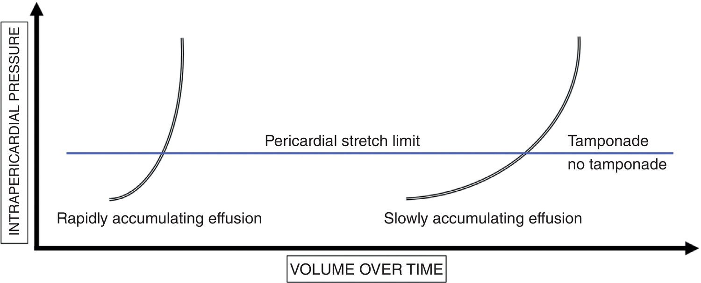

[**Figure 31.18**](#R_c31-fig-0024) Tamponade physiology is predicted by the rate of rise of the effusion and the pericardial compliance. At a certain threshold, the pericardium’s compliance will reach a pericardial stretch limit, where even a small increase in pericardial fluid volume will lead to the rise in intrapericardial pressure that causes tamponade.

(Source: Alerhand & Carter \[75\]. Reproduced with permission of Elsevier.)

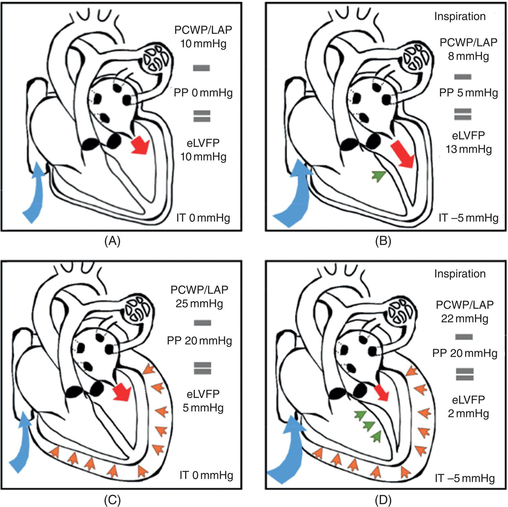

[**Figure 31.19**](#R_c31-fig-0025) Respiratory variation in left ventricular filling. Illustration of effective left ventricular filling pressure (eLVFP) in normal patients at baseline (A) and with inspiration (B) as well as patients with cardiac tamponade at baseline (C) and with inspiration (D). The eLVFP is the difference between the pulmonary capillary wedge pressure (PCWP) or left atrial pressure (LAP) and the pericardial pressure (PP). In normal patients, the PP is low and equal to the intra‐thoracic pressure (IT). With inspiration, the PCWP/LAP decreases, and the PP becomes negative, resulting in a net increase in the eLVFP (B). In patients with cardiac tamponade, both the PCWP/LAP are elevated due to the high PP (orange arrows), resulting in a lower eLVFP. With inspiration, there is increased venous return to the right side (blue arrow) and a drop in PCWP/LAP (which lies external to the pericardium) relative to the PP, thus decreasing the eLVFP (D). The LV is consequently restrained both by pressure externally from the pericardium (orange arrows) and internally from interventricular interaction (green arrows).

(Source: Vakamudi et al. \[68\]. Reproduced with permission of Elsevier.)

Clinical signs of cardiac tamponade include tachycardia and systemic hypotension and high venous pressure. Beck’s triad is the combination of hypotension and high venous pressure (distended neck veins in older children) with quiet sounds on cardiac auscultation \[76\]. Pulsus paradoxus, which is an exaggeration of the usual minimal (_<_10 mmHg) decrease in blood pressure with inspiration, increases with the degree of tamponade. Pulsus paradoxus can be quantified during auscultatory measurement of blood pressure by noting the difference between the pressure when the first Korotkoff sounds (which appear during expiration in the spontaneously breathing patient) and the pressure when the sounds become continuous. Other signs of sympathetic activation and low cardiac output, such as cool extremities and pallor from vasoconstriction, may be present. Clinical context will usually give some indication of the origin of cardiac tamponade. Obstruction of mediastinal/pericardial drains may be indicated by tamponade after cessation of previously consistent drainage.

Echocardiography provides a rapid, accurate detailed assessment of pericardial effusions. The site, size, and any evidence of loculation should be evident. This information can inform the selection of the approach to drainage. The degree of myocardial compression and restriction of ventricular end‐diastolic volume should also be apparent \[77\]. Other echocardiographic signs of tamponade physiology include inferior vena cava (IVC) dilation and loss of respiratory variation in diameter of the vessel, right atrial collapse during systole (earliest sign), increase of interventricular dependence with respiration, and respiratory variation of mitral, aortic, or tricuspid inflow peak velocity of >25% \[68\] ([Table 31.9](#c31-tbl-0010), [Figure 31.20](#c31-fig-0026)). Prompt recognition and urgent treatment of tamponade is critical. In the final sections treatment of tamponade and anesthetic considerations for pericardial disease will be discussed.

[**Table 31.9**](#R_c31-tbl-0010) Echocardigraphic features suggestive of cardiac tamponade

Source: Vakamudi et al. \[68\]. Reproduced with permission of Elsevier.

| Echocardiography Sign | Advantage | Disadvantage |
| --- | --- | --- |
| 2D and M‐mode findings |
| RA collapse >1/3 cardiac cycle | Sensitive sign of elevated intra‐pericardial pressure. | Difficult to time the duration of collapse. May be confused with normal atrial systole. |
| RV diastolic collapse | Sensitive sign of elevated intra‐pericardial pressure. | Non‐specific, may be an early sign of tamponade. |
| IVC plethora with lack of inspiratory variation | Sensitive sign of cardiac tamponade. | Non‐specific, commonly occurs in other conditions associated with elevated central venous pressure. |
| Doppler flow velocity findings |
| PW or CW Doppler assessing variation in tricuspid (>60%) and mitral (>30%) inflow with respiration | Specific finding of cardiac tamponade. | Affected by translational motion of the heart and Doppler alignment. May be absent in patients with elevated left atrial pressure. |
| Inspiratory decrease and expiratory increase in pulmonary vein diastolic forward flow | Specific finding of cardiac tamponade. | May be absent in patients with elevated left atrial pressure. May be technically difficult to adequately sample the pulmonary vein. |
| Respiratory variation in ventricular chamber size and aortic outflow velocity | Sensitive finding suggestive of inter‐ventricular inter‐dependence. | Can also be seen in constrictive pericarditis or other causes of exaggerated changes in intra‐thoracic pressure. |
| PW Doppler of hepatic venous flow velocity showing expiratory decrease or reversal of diastolic flow | High positive and negative predictive values for cardiac tamponade. | Cannot be evaluated in one third of patients due to technical limitations. |

_Abbreviations:_ RA = right atrium, RV = right ventricle, IVC = inferior vena cava, PW = pulse wave, CW = continuous wave.

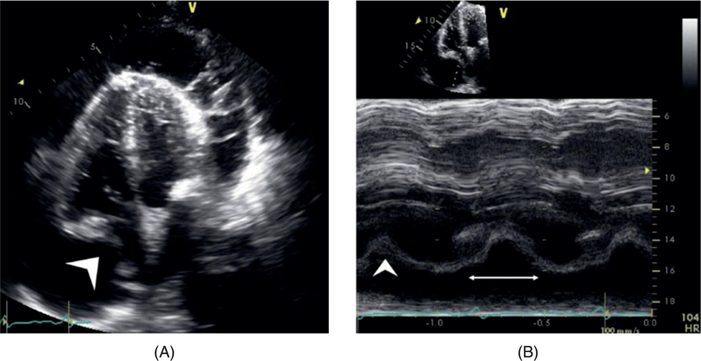

[**Figure 31.20**](#R_c31-fig-0026) Right atrial collapse demonstrated on 2‐dimensional echocardiography and M‐mode. This figure demonstrates a large circumferential pericardial effusion. On 2‐dimensional imaging from the apical four chamber view, there is significant collapse of the right atrium (arrowhead) (A). On M‐mode through the right atrium (B), it is clear that the right atrial collapse (arrowhead) occurs during ventricular systole and the duration of collapse is greater than one third of the cardiac cycle (double headed arrow).

Source: Vakamudi et al. \[68\]. Reproduced with permission of Elsevier.

### Surgery for pericardial effusion and cardiac tamponade

Ultrasound‐guided, percutaneous drainage of pericardial effusion can be done with local anesthesia, especially in older cooperative patients. A pigtail catheter is recommended to be in place for a day or two when there is a risk of recurrence \[78\]. In patients in extremis due to tamponade, rapid drainage may be life‐saving. If active bleeding is likely to be the source of the tamponade, open operation with surgical control of the bleeding will be required and appropriate maintenance of intravascular volume will be needed. For persistent pericardial effusions, surgical creation of a “pericardial window” by resecting a section of pericardium via an open subxyphoid approach can prevent collection of the fluid in the confined space of the pericardium. For the rare cases of chronic constrictive pericarditis, formal pericardiectomy may be attempted, which is a substantial procedure with the potential for significant complications, such as hemorrhage, arrhythmia, and injury to the coronary arteries. Care must also be taken to avoid puncturing intercostal/ intermammary arteries, the liver, and the lung and using ultrasound guidance may help avoid these structures \[78\].

### Anesthesia for pericardial effusion and cardiac tamponade

Ultrasound‐guided drainage of a large pericardial effusion in a minimally symptomatic patient with local anesthesia should be a low‐risk procedure, potentially performed without the support of an anesthesiologist. However, there is still the possibility of cardiac perforation or injury to superficial coronary arteries with consequent bleeding or myocardial ischemia. Areas of adhesion between the parietal and visceral layers of the pericardium and loculation of the fluid will increase the risk of these complications. Careful ultrasound assessment and real‐time guidance of the tip of the needle should minimize these risks \[79\].

Patients having anesthesia for surgery to create a pericardial window for persistent effusions require careful assessment for the degree of tamponade present, especially if there is no drain currently in place. Most of these cases will have sufficient reserve to tolerate a careful induction of general anesthesia and institution of positive pressure ventilation. If there is evidence of significant tamponade, staged progress in anesthesia and surgery can be planned. Initial modest doses of sedation and analgesia, combined with local anesthesia, can allow percutaneous drainage of the effusion with relief of tamponade before the initiation of formal general anesthesia and controlled ventilation.

The highest‐risk scenario is acute severe cardiac tamponade, usually due to postoperative hemorrhage in pediatric cardiac surgical centers, but also seen in trauma. The patient’s condition may be deteriorating rapidly and already be perilous. Rapid intervention is required but induction of anesthesia may precipitate cardiac arrest. A well‐coordinated rapid team response is required. The patient’s underlying conditions and current status should be assessed. There may be time for resuscitation with intravenous fluids, inotropes, and vasoconstrictors to support the patient until the tamponade can be relieved and also to create some reserve to allow safer induction of anesthesia. If the tamponade is severe and resuscitation has already been attempted, the highest priority is facilitating rapid relief of the tamponade. The operating room team should be scrubbed and ready to proceed prior to anesthesia is induced. Blood for transfusion should be available and an appropriate anesthesiology team should be in place. If further intravenous access and (if the patient is stable enough) intra‐arterial access is to be gained, multiple anesthesiologists/assistants may allow efficient and safe preparation of the patient. Induction of anesthesia can cause cardiovascular collapse by direct cardiac depression and vasodilation, as well as by decreasing the central sympathetic outflow. Even drugs with minimal direct depressive effects, such as fentanyl, can have a profound effect by this latter mechanism. Synthetic opioids are also prone to decreasing heart rate, which will also jeopardize circulation. Positive pressure ventilation will exacerbate the problems with venous return and compression of the heart that have been created by the tamponade, increasing the chance of circulatory collapse.

The anesthesia sequence in these cases of severe tamponade needs to be tailored to the patient’s circumstances. Coagulopathy is a serious consideration in these patients and an INR above 1.5 or a platelet count of less than 50,000 is considered a relative contraindication for pericardiocentesis and may require urgent correction with platelets or clotting factors \[74\]. Fasting status should be considered and cricoid pressure may be implemented, even if other parts of rapid‐sequence induction and intubation are modified due to the risk of circulatory collapse. The possibility of major surgical procedures to remedy the cause for bleeding once the tamponade is relieved should be considered. It may be appropriate to initially drain the pericardium with minimal sedation and analgesia and local anesthetic, which may improve cardiovascular reserve and allow safer induction of anesthesia. Anesthesia induction should be done with low doses of agents that are least likely to decrease sympathetic drive, such as ketamine (despite its potential for direct myocardial depression) titrated slowly, as the central circulation will be small and excess anesthesia effect should be minimized. Drainage of the pericardium before intubation and the introduction of positive pressure ventilation should be considered. When positive pressure ventilation is introduced, providing a substantial expiratory time with minimal or no positive end‐expiratory pressure should minimize impairment of venous return. Once the pericardium is drained, hemodynamic stability will usually be rapidly restored. In postoperative tamponade, often an active bleeding point may be easily controlled, such as from the site of an intracardiac catheter that had been removed, but occasionally the hemorrhage will be from a major suture line that is now bleeding vigorously, with an increase in blood pressure and loss of tamponade. This may require ongoing resuscitation and major surgical intervention, including CPB, to revise the surgery.

In the cardiac catheterization laboratory, the heart or the great vessels may be perforated by a catheter or wire, which may result in acute severe cardiac tamponade, diagnosed by angiography or echocardiography demonstrating the blood in the pericardial space. Many of these patients will already be under deep sedation, or intubated general anesthesia. In addition to intravascular volume infusion and resuscitation drugs, the cardiologist must drain the pericardial space immediately; this is non‐clotting blood and can be reinfused directly into the patient via a three‐way stopcock. The femoral venous sheath is the preferred route of reinfusion but the anesthesiologist can utilize other appropriately sized intravenous access. This maneuver can be life‐saving as preparations are made for sternotomy and repair of the perforation \[80\]([Figure 31.21](#c31-fig-0027)).

In postoperative patients in the intensive care unit with circulatory collapse secondary to cardiac tamponade, rapid reopening of the sternum in the unit may be life‐saving.

* * *

### KEY POINTS: ANESTHESIA FOR CARDIAC TAMPONADE

-   Cardiac tamponade is associated with high venous pressures, tachycardia, and systemic hypotension and may be life‐threatening without emergent treatment
-   Before anesthesia is induced, the operating room team should be in place and ready to proceed with rapid surgical relief of the tamponade.
-   Local anesthesia, with minimal or no sedation and analgesia, and ultrasound‐guided drainage may be the safest option and help avoid puncturing important structures
-   If greater levels of sedation analgesia or anesthesia are required, slow titration and agents with less sympatholytic action should be used. Initial surgical drainage may be performed with spontaneous ventilation prior to endotracheal intubation.
-   Avoiding positive pressure ventilation until the pericardium is drained may avoid circulatory collapse.

* * *

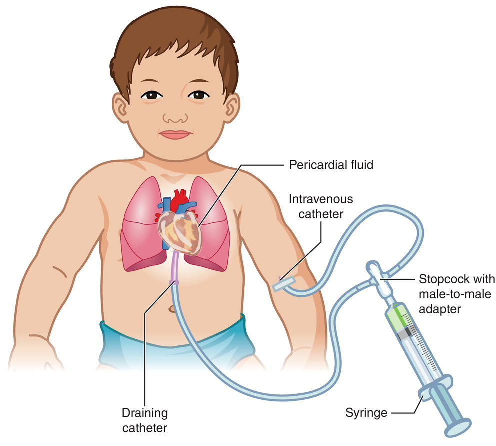

[**Figure 31.21**](#R_c31-fig-0027) Drainage and retransfusion system for acute pericardial tamponade for cardiac perforation in the catheterization laboratory. The femoral venous sheath, if available, is the preferred site for reinfusion of blood.

(Source: Mossad \[80\]. Reproduced with permission of Elsevier.)

## Mitral regurgitation

### Incidence, anatomy, and natural history of mitral regurgitation

Isolated mitral regurgitation (MR) is an uncommon pathology in childhood. The atrioventricular valve serving the systemic ventricle is not considered a mitral valve in the relatively common atrioventricular septal defect, univentricular hearts and in patients with “congenitally corrected transposition of the great arteries” (i.e., combined atrioventricular and ventriculoarterial discordance). Abnormalities of these “non‐mitral” left atrioventricular valves are discussed in the relevant chapters (see [Chapters 26](c26.xhtml), [29](c29.xhtml) and [30](c30.xhtml) for further discussion).

### Normal anatomy and function of the mitral valve

The normal mitral valve allows low resistance passage of blood from the left atrium to the left ventricle during ventricular diastole and prevents blood from returning from the left ventricle to the left atrium during ventricular systole. Abnormalities of the valve can result in restriction of forwarding flow (stenosis) or the return of blood from the left ventricle to the left atrium during ventricular systole (regurgitation or incompetence). MR and stenosis may occur in combination \[81\] ([Figure 31.22](#c31-fig-0028)).

The mitral valve consists of an annulus, two leaflets, three types of chordae, and two dominant papillary muscles, as shown in [Figure 31.23](#c31-fig-0029) \[82\]. The annulus is part of the continuous fibrous framework separating the atria and ventricles. There are two mitral valve leaflets: anterior and posterior. The leaflets are not symmetrical. The posterior (mural) leaflet is attached to 210 degrees of the circumference of the annulus, where it is continuous with the left ventricular free wall. The annulus is also in continuity with the aortic valve through the fibrous aortic‐mitral curtain. The anterior (septal) leaflet is attached to the portion of the ring continuously with the septum and aortic valve over about 150 degrees. The anterior surface of the anterior leaflet is thus the posterior surface of part of the left ventricular outflow. On the closure of the mitral valve, the posterior leaflet forms a crescentic (“C”‐shaped) part of the closure of the annulus, contributing only about a third of the cross‐section of the closure despite the whole leaflet being much larger than the anterior leaflet. The smaller anterior leaflet contributes the remaining, more oval, two thirds of the closure of the annulus. This arrangement of the valve leaflets means that the posterior leaflet leaves little space between the free wall and the leaflet during systole and the anterior leaflet moves towards the posterior leaflet, increasing the diameter of the left ventricular outflow during systole. The crescentic portion of the posterior valve and the oval portion of the anterior valve, which close off the annulus, are a relatively small proportion of the total surface area of the valves. During mitral valve closure, a significant proportion of the surface area of the valves leans on each other, thus providing “mutual support” during closure. This coaptation of the valve leaflets decreases tension in the valve tissue required to maintain valve closure. The valve leaflets have multiple fibrous bands, chordae tendinae, which connect them to both the papillary muscles (anterior and posterior), projecting from the inner wall of the mid‐left ventricle. The posteromedial papillary muscle has a single blood supply from the posterior descending artery while the anterolateral papillary muscle is usually supplied by both the left anterior descending and the left circumflex. The chordae connect to both the surface and edge of the valve leaflets, distributing the forces of systolic papillary muscle contraction over a wide area of the valve leaflets \[83\].

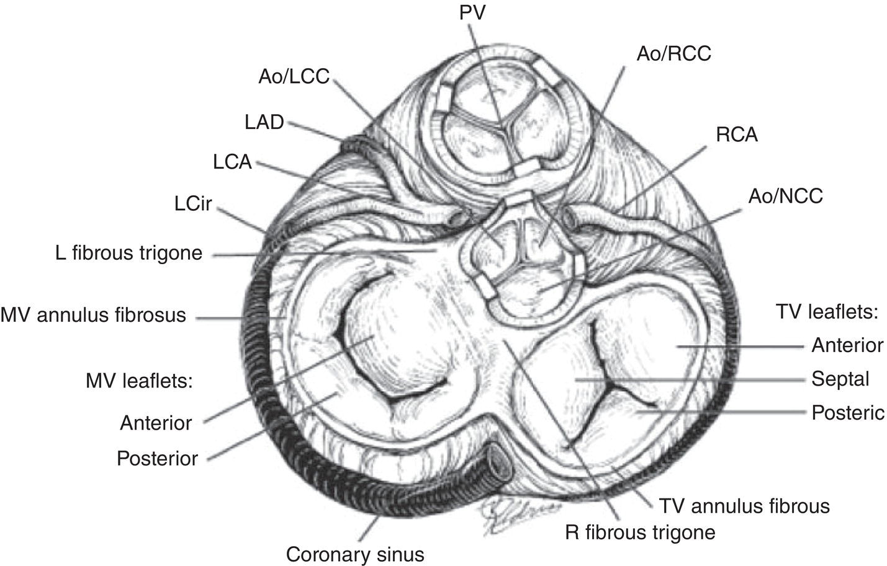

[**Figure 31.22**](#R_c31-fig-0028) Cross‐sectional drawing of the heart showing the anatomic relations of the normal mitral valve. Ao/ LCC, aortic valve left coronary cusp; Ao/ NCC, aortic valve non‐coronary cusp; Ao/ RCC, aortic valve right coronary cusp; L, left; LAD, left anterior descending coronary artery; LCA, left coronary artery; LCir, left circumflex coronary artery; MV, mitral valve; PV, pulmonary valve; R, right; RCA, right coronary artery; TV, tricuspid valve.

(Source: Mainwaring & Lamberti \[81\]. Reproduced with permission of John Wiley & Sons.)

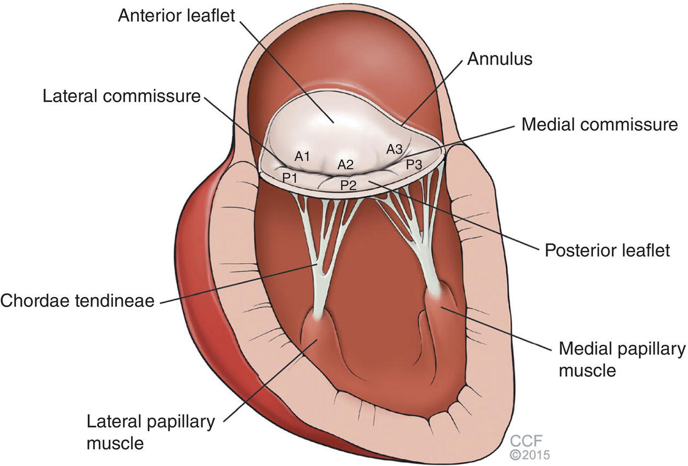

[**Figure 31.23**](#R_c31-fig-0029) Mitral valve anatomy. The mitral valve apparatus is shown here with the annulus, leaflets, chordae tendineae, and papillary muscles. Each leaflet anterior (A) and posterior (P) is divided into three scallops (1 for lateral, 2 for middle, and 3 for medial).

(Source: Harb and Griffin \[82\]. Cleveland Clinic Center for Medical Art & Photography © 2017. All Rights Reserved.)

### Classification of mitral regurgitation

The two broad categories of MR are primary and secondary. Primary MR is a degenerative valvular disease usually caused by leaflet prolapse or flail. Secondary MR, also known as _functional_ MR is a heterogenous group of conditions that refer to abnormalities of the systolic tethering of the mitral valve apparatus caused by abnormal left ventricle size, shape, or function. Therefore, therapy is focused on the restoration of LV structure and function rather than mechanical interventions to reduce the MR. Some examples of this therapy are neurohumoral antagonists and resynchronization devices. Questions remain on whether therapy that targets _only_ the mitral valve will benefit some of these patients with secondary MR. \[84\] The Carpentier Classification categorizes MR on the basis of leaflet mobility. Those with secondary MR usually fall into Carpentier Class 3B \[85\] ([Figure 31.24](#c31-fig-0030)).

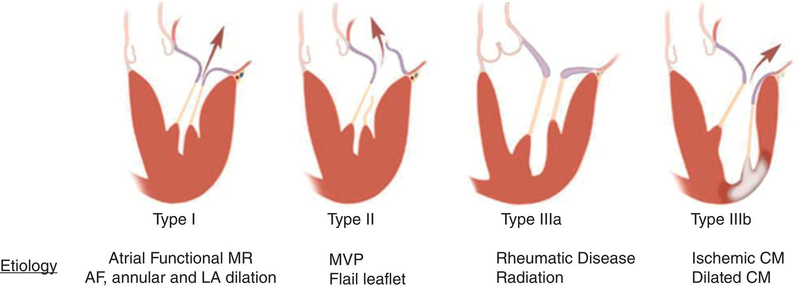

[**Figure 31.24**](#R_c31-fig-0030) Carpentier classification. The Carpentier Classification defines mitral regurgitation (MR) in relation to mitral leaflet motion. Type I signifies normal motion (as in atrial functional MR), type II excessive motion (prolapse/flail) and Type III restricted motion (secondary MR due to underlying cardiomyopathy.

(Source: Adapted from Harb & Griffin \[82\].)

Quantifying regurgitant volume is important. Consensus defines _severe_ MR as a regurgitant fraction of over 50%, that is, over half of the total stroke volume is directed backwards into the left atrium instead of forward into the aorta. One way of measuring this severity on echocardiography is with the effective regurgitant orifice area or EROA \[86\]. Unfortunately, the EROA is highly dependent on left ventricular volume (LVEDV), pressure (LVEDV), and function and has significant interobserver disagreement; thus, its reliability has been questioned \[84\].

Grayburn and colleagues have proposed a new conceptual framework for categorizing secondary (functional) MR as either _proportionate_ or _disproportionate_ \[87\]. The principal reason for this is to determine whether interventions directed at the mitral valve can change the clinical course of the disease. In their view, it is important to determine whether the estimated degree of MR is expected or _proportionate_ to the degree of LV dilation, or alternatively, whether the severity of MR is unexpected, or _disproportionate_ to the degree of LV enlargement. A patient whose MR severity is consistent with their amount of LV dilation (proportionate MR) might not be expected to improve following a valve intervention. On the other hand, a large degree of MR relative to the degree of LV dilation (disproportionate) might respond favorably \[87\].

Two randomized control trials, MITRA‐FR \[88\] and COAPT \[89\] support Grayburn’s proposed framework. In the French MITRA‐FR trial, 307 patients with secondary MR underwent transcatheter MV repair. The patients enrolled showed striking degrees of LV dilation and _proportionate_ degrees of MR. These patients at analysis showed no improvement in LV volume after one year of valve repair. In contrast, the U.S.‐Canadian COAPT (Cardiovascular Outcomes Assessment of the MitraClip Percutaneous Therapy for Heart Failure Patients with Functional MR) randomized 614 patients to undergo transcatheter MV repair or control. Contrary to the MITRA‐FR study, valve repair in this group led to a significant reduction in LV volume at follow‐up. The enrolled COAPT patients had MR that was _disproportionately_ greater than their degree of chamber enlargement. When COAPT patients are compared to MITRA‐FR patients, as a group, the COAPT patients had EROA values 30% _higher_ but LV volumes 30% _smaller_ \[84\].

This framework suggests that distinct secondary MR patient subgroups patients will likely benefit from _different_ types of medical treatments or valve‐directed therapies. Disproportionate MR patients respond poorly to neurohumoral antagonists traditionally prescribed for associated cardiomyopathy but benefit more selectively from interventions that are directed toward restoring valve function such as valve repair/replacement or cardiac resynchronization therapy (CRT). Distinguishing these different types of MR patients is important since the _proportionate_ patients have valve disease that can be explained by their degree of LV dilation and thus respond better to neurohumoral antagonist therapies.

### Mechanisms of mitral valve regurgitation

Abnormalities of the annulus, leaflets, chordae, or papillary muscles may be associated with MR. Conditions that volume load the left ventricle, such as aortic regurgitation and heart failure with eccentric left ventricular hypertrophy (e.g., dilated cardiomyopathy), may cause annular dilation. Dilation of the annulus increases the area requiring closure and decreases the area of leaflet available for coaptation, both of which increase the mechanical stress on the valve tissue during systole, which may lead to immediate failure of coaptation and regurgitation or valve prolapse (see later) with subsequent regurgitation. A cleft in the annulus may not be able to be sealed by the leaflet tissue \[90, 91\].

Mitral valve leaflet distension, cleft, or restriction may lead to regurgitation. Distension of the valve, which may result from congenital structural abnormalities or may develop due to connective tissue disorders (e.g., Marfan syndrome) or inflammatory conditions such as rheumatic fever, can cause a portion of the valve to balloon beyond the plane of the annulus during valve closure (i.e., prolapse). This prolapsed portion is no longer supported by the opposing valve and, as with aneurysms, the law of Laplace will apply, and wall tension will rise as the prolapse progresses and tend to make that region expand until the valve fails to oppose or even ruptures. Restriction of leaflet movement, such as with fibrosis due to inflammation, may prevent a leaflet from coapting with the opposing leaflet and consequent regurgitation. Similarly, elongation of the chordae may cause leaflet prolapse while shortening, and fibrosis may cause restriction of leaflet movement, with regurgitation developing in both scenarios. Rupture of chordae may cause acute regurgitation. Acute MR when it occurs is often a medical _and_ surgical emergency. Patients usually present with severe dyspnea, decompensated heart failure, and/or severe pulmonary edema due to the sudden pressure and volume load imposed on a previously normal left atrium \[92\]. Fibrosis of either leaflets or chordae also tends to be associated with stenosis of the valve. Elongation of papillary muscle can cause valve prolapse and regurgitation of the mitral valve. Papillary muscle dysfunction may also cause MR. For example, in dilated cardiomyopathy, poor contraction and elongation of the papillary muscles and consequent leaflet prolapse will often be exacerbated by annular dilation and cause marked MR. Specific papillary muscle dysfunction can arise in relation to coronary artery problems, as the blood supply of the papillary muscles is usually from separate coronary arteries. Mistiming of papillary contraction in relation to the rest of ventricular contraction may be associated with MR. This may occur with some abnormalities of the coordination of the timing of regional contraction, such as conduction disturbances, some arrhythmias and complications of the pacing of the ventricle. Other rare causes of MR include distortion of the valve apparatus due to tumors \[49\].

Many of the conditions associated with MR can affect multiple areas of the valve apparatus (annulus, leaflets, chordae, papillary muscles) and compound the problem. Fusion of the valve leaflets at the commissures is usually associated with stenosis rather than regurgitation.

In adults, the commonest mechanism of MR is mitral valve prolapse, which is usually asymptomatic and often presents incidentally with an auscultatory click and murmur. The earliest phase of this may be “superior systolic motion” of mitral leaflet tissue above the plane of the annulus. In clinically normal children, this echocardiographic sign increases in frequency from around 1% in infants to nearly a quarter of 6‐ to 10‐year‐olds and more than a third of 11‐ to 18‐year‐olds. Some of these cases may progress to prolapse and significant regurgitation, but, given the benign outcome in most, isolated superior systolic motion is usually considered a variation of normal.

Rheumatic cardiac disease is common on a world scale and, although appearing sporadically in a wide range of communities, is commonest in socioeconomically disadvantaged communities with a high incidence of streptococcal infection and poor general health. It is the most common cause of mitral valve _stenosis_ worldwide. The highest incidence of rheumatic fever in the world is said to be in the indigenous communities of remote Australia. MR is the commonest rheumatic valve lesion in children with this condition, with mitral stenosis appearing later in the disease progression, and involvement of other valves, such as the aortic, being less common initially. Public health measures for the prevention of rheumatic fever are the most important long‐term approach. Valve‐preserving reconstructive surgery has a number of advantages for children with rheumatic MR, avoiding the need for replacing an artificial valve due to growth and the need for anticoagulation (which may be difficult to manage in many of the communities with the highest incidence of rheumatic fever).

MR tends to be a progressive condition, as the regurgitation volume loads the left ventricle, which will dilate, exacerbating the regurgitation. Children who have a successful surgical repair of MR tend to have recovery of ventricular function and good long‐term outcomes. There is an association between the long‐term presence of regurgitation and atrial arrhythmias, which may continue or arise after repair. This is associated with chronic enlargement of the left atrium, which may be addressed in high‐risk cases at the time of surgical intervention for the regurgitation.

### Pathophysiology of MR

MR will tend to worsen with time unless the underlying pathology is corrected. The presence of regurgitation results in the need for bigger end‐diastolic volumes if an adequate forward flow (cardiac output) is to be maintained as well as accommodating the regurgitant fraction, which returns through the mitral valve during systole. Increased left ventricular end‐diastolic volume (LVEDV) will promote dilation of the annulus which will tend to increase the regurgitant fraction, thus creating a disadvantageous positive feedback loop of increasing regurgitation and dilation of the left ventricle, until ventricular dysfunction is superimposed on the process, which will result in decompensation of the cardiovascular system.

MR is exacerbated by factors that increase left ventricular afterload and volume loading. Lessening SVR and relieving aortic valvular abnormalities (either stenotic or regurgitant) will tend to decrease MR. If myocardial ischemia is contributing to papillary muscle dysfunction, this may be resolved by restoring coronary artery blood flow. In some cases, MR can resolve without mitral valve surgery, if the underlying precipitating factors are resolved. The onset of atrial arrhythmias, such as atrial fibrillation, associated with left atrial dilation due to MR, may trigger cardiovascular decompensation. Persistent severe MR, especially in association with the onset of ventricular dysfunction and the associated very high left ventricular end‐diastolic pressures, may cause significant pulmonary hypertension with impairment of right ventricular function. The right ventricular function may also be impaired by the dilation of the left ventricle, which causes a ventricular septal shift toward the right ventricle.

### Surgical approaches and outcomes for MR in children

The advent of high‐quality echocardiography, including 3D imaging of the mitral valve, has contributed greatly to the understanding of the mechanisms of MR. Surgical repair can now address all levels of factors contributing to regurgitation \[93\].

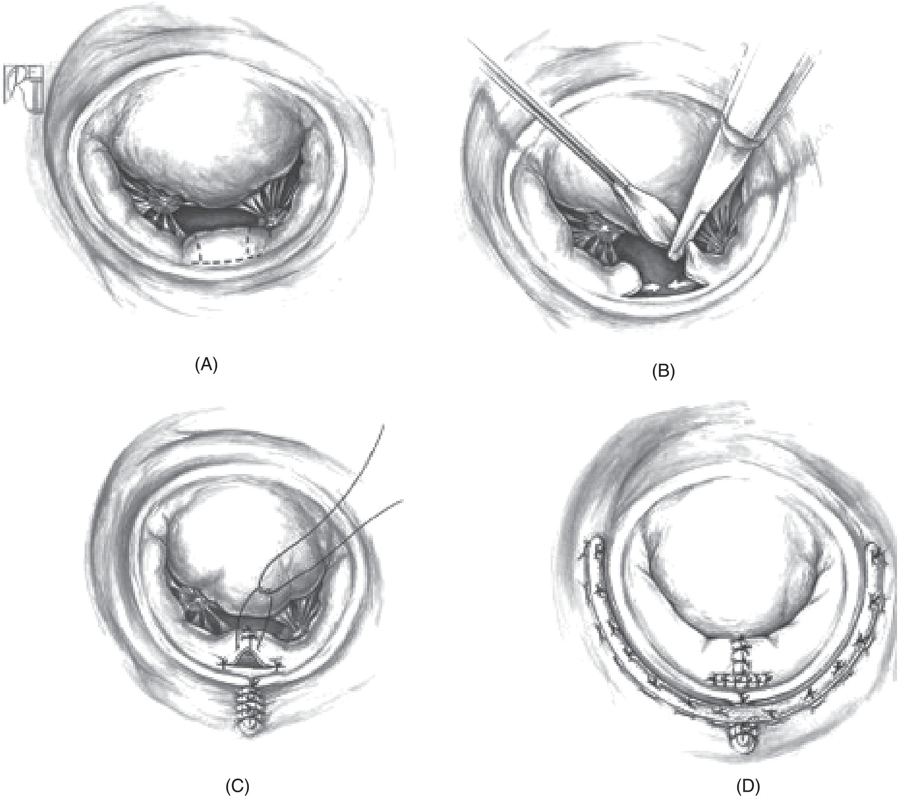

[**Figure 31.25**](#R_c31-fig-0033) (A) Insufficient mitral valve due to annular dilatation. Dotted lines represent the proposed posterior leaflet quadrangular resection and valvular incisions. (B) After quadrangular resection, linear incisions are made in the posterior leaflet to accomplish sliding valvuloplasty (arrows). (C) The posterior annulus is brought together with care not to injure the circumflex coronary artery. Resultant tightening of the annulus brings the remaining scallops of the posterior leaflet into position for valvular repair. (D) The repair is strengthened by a semicircular Gore‐Tex® strip. The anterior annulus was not included in the annuloplasty technique to allow for somatic growth.

(Source: Mainwaring & Lamberti \[81\]. Reproduced with permission of John Wiley & Sons.)

Thus the annulus can be supported or decreased in size with a number of techniques, including insertion of a supravalvular ring \[81\] ([Figure 31.25](#c31-fig-0033)). The leaflets can be modified to prevent prolapse and have patches inserted and fibrotic areas debulked, thus improving coaptation and movement. Fusion of commissures where valve leaflets have joined may need to be freed to allow adequate valve movement and to relieve stenosis, but a more complex repair may be required if commissurotomy creates a cleft or failure of coaptation. Chordae can be reimplanted or changed in length, and papillary muscle elongation shortened. The aim of avoiding valve replacement is realistic for most pediatric cases. Mitral valve replacement has higher long‐term mortality than any other valve replacement in children; infant mitral valve operative mortality has been reported to be 5–52%, and 5‐ and 10‐year survival rates to be 33–95% \[94\]. The benefits of valve repair over replacement include avoiding the need for anticoagulation, the need for replacement of the artificial valve with growth in smaller children, and the high risk of mitral valve replacement in babies. In this last group, there is a lack of very suitable artificial valves and the surgery is complicated, as the artificial valve ring may need to sit above the annulus and the body of the artificial valve may still impair ventricular function. Bioprosthetic valves may avoid the need for anticoagulation necessitated by mechanical valves but structurally deteriorate over time (often within 2.5–5 years) and can be difficult to obtain in small sizes \[95\]. The lack of papillary muscle connection to the artificial valve is also associated with an abnormal geometry of ventricular contraction, which may contribute to worsening ventricular function. An individualized patient‐centered approach based on underlying anatomy, valve pathology, and patient size with an understanding that re‐do surgery is inevitable in infants and small children to upsize the prosthesis is fundamental and can lead to successful long‐term outcomes and excellent survival \[96\]. Complex valve repairs have been enabled by modern techniques for myocardial preservation that allow long cross‐clamp times to be well tolerated with good postoperative myocardial function.

For children with underlying conditions, which may continue or recur, such as connective tissue disease or rheumatic fever, there is a significant risk of recurrence of MR. Time gained in growth before an artificial valve is required is often a great advantage, and repeated surgery for repair of the native valve may still be a reasonable management plan in children.

Transcatheter percutaneous approaches to mitral valve repair have been established as a safe and less invasive alternative to open surgical MV repair. One such device, the Mitra‐Clip® (Abbott Vascular, Menlo Park, CA) was modeled after the surgical Alfieri stitch which is the application of a suture at the site of the regurgitant jet, between the anterior and posterior leaflets (usually A2 and P2), creating a “double‐orifice” valve without residual prolapse and overall less regurgitation ([Figure 31.26](#c31-fig-0034)). The Mitraclip percutaneous “edge to edge” transcatheter clip technique has been shown in numerous adult clinical trials to be safe and effective. Transcatheter techniques are the natural evolution of modern valve surgery but this technology in pediatrics is still in early clinical stages. Some novel devices and xtremely, such as transcatheter valve in valve insertion, chordae reimplantation, and catheter‐based annuloplasty, are currently under development \[97\]. Pediatric transcatheter techniques pose many obstacles such as device durability, limited device sizes, and the potential need for future procedures with somatic growth and development. The MitraClip for example has an xtremely large 24 French introducer sheath which requires a minimum patient age of about 9–12 years with a minimum weight of approximately 40–45 kg \[97, 98\]. Although large studies are lacking there have been successful cases of transcatheter MV repair in pediatric patients utilizing both the MitraClip \[98\] and also the Melody Valve (Medtronic, Inc. Minneapolis, MN), a stented bovine jugular vein graft, commonly used in the pulmonary valve position. The Melody offers the advantage that it can be balloon dilated as a child grows \[99\]. It has even been modified for use as a surgical implant \[100, 101\] ([Figure 31.27](#c31-fig-0035)). This allows the option of future transcatheter balloon dilation from a starting size of 12 mm up to 22 mm, the size of an adolescent mitral valve. The procedure requires a fenestrated atrial septum to facilitate future dilations and reported complications include LV outflow obstruction, acute mitral regurgitation or stenosis, left circumflex coronary compression, acute distal obstruction of the valve from stent deformation, and transient complete heart block \[101\]. Further study is needed to determine the viability and the long‐term durability and safety of this device \[100, 102\].

Surgery is best timed before there is severe chronic dilation of the left ventricle with loss of function, although follow‐up studies in children suggest that successful repair is associated with good recovery of function over the long term. Chronic left atrial dilation is associated with atrial arrhythmias, which may persist or commence postoperatively.

### Anesthetic considerations for the repair of MR

Functional assessment of the MR is based on the history of activity and exercise tolerance and is a robust measure of cardiorespiratory reserve. In infants, cardiac failure may be indicated by breathlessness and sweating with feeding, and poor weight gain. Physical examination should not only elicit the pansystolic murmur typical of MR but also seek signs of complications such as an enlarged left ventricle, or cardiac failure with a third heart sound and evidence of pulmonary congestion. History and examination may also indicate underlying conditions that may have caused the MR, such as rheumatic fever or Marfan syndrome, as well as signs of other associated cardiac lesions. Echocardiography can provide information about the severity of the regurgitation, associated lesions, and myocardial function \[103\]. Understanding the mechanism for the regurgitation is crucial for planning the surgical approach to repair. Standard “adult” echocardiographic measures to quantify MR may not be applicable to small pediatric patients and assessment of the severity may require interpretation rather than being able to be precisely quantified. Factors include the diameter of the base of the regurgitant jet, the shape and distance that the regurgitant plume penetrates into the left atrium, whether there is retrograde flow generated in the pulmonary veins and left atrial dilation as well as estimates of the regurgitant fraction (compared with total ejection of the ventricle). Standard estimates of myocardial function may be difficult to interpret in the presence of a dilated ventricle. The increase in volume that occurs with ventricular dilation, proportional to the third power of the diameter, means that a greater volume change occurs with a change in diameter at larger diameters. Therefore, when the dilated ventricle is full, the change in volume with contraction is very much larger than the change in volume caused by a similar decrease in diameter at a smaller starting volume. Thus, apparently small movements of the dilated ventricle may be associated with substantial volumes of ejection. Measures of tissue acceleration or initial rate of change of pressure over time may reflect underlying myocardial function better than measures of ejection fraction. Measures of ejection fraction are also complicated by the fact that there are separate “forward flow” and regurgitant fractions and that the regurgitant fraction can be considered a low resistance pathway and decreases the afterload of the ventricle (this “afterload” reduction arising from the retrograde regurgitant flow). The presence of this low‐resistance pathway may also influence functional measures of contraction, in that the rate of contraction may be increased compared with ejection into a higher resistance system.

Patient management up to the time of presentation should also be assessed. Medical therapy for MR with systemic vasodilators such as angiotensin‐converting enzyme inhibitors can decrease the regurgitant fraction. Systemic vasodilation will change the balance in favor of “forward flow” compared with regurgitation. Systemic vasodilation, often aided by diuretic therapy, can decrease end‐diastolic ventricular volume, which may further reduce regurgitation by decreasing the size of the annulus. Improvements in echocardiographic measures of MR have been noted after the first dose of captopril. Optimizing medical therapy and nutrition should provide more cardiorespiratory reserve for the patient at the time of surgery.

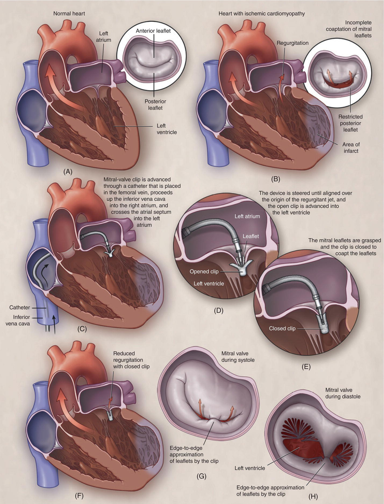

[**Figure 31.26**](#R_c31-fig-0034) Mitral clip insertion for mitral regurgitation.

(Source: O’Gara & Mack \[85\]. Reproduced with permission of Massachusetts Medical Society.)

[**Figure 31.27**](#R_c31-fig-0035) (A) Modified Melody valve prepared for implantation. The terminal crowns were folded back on both ends to lie flat against the stent and the anterior folded crowns were stitched down to prevent protrusion into the left ventricular outflow tract (LVOT) upon further expansion (\*). A pericardial cuff is sewn into place to secure the valve onto the mitral annulus (_arrow_). (B) The valve is implanted, secured onto the annulus and the distal end stitched to the posterior left ventricular wall to avoid LVOT obstruction, and (C) dilated using a 12 mm balloon (_arrow_).

(Source: Sullivan et al. \[101\]. Reproduced with permission of Cambridge University Press.)

In patients with MR and well‐preserved myocardial function, anesthesia is usually well tolerated. Anesthesia induction should avoid increases in SVR. Increased SVR will increase the regurgitant fraction and jeopardize forward flow. Heart rate should be maintained, as the increased LVEDV associated with bradycardia will worsen MR. Excessive intravascular volume loading may also worsen MR by increasing LVEDV and distending the annulus. Positive pressure ventilation and PEEP should improve respiratory mechanics by decreasing lung congestion and optimizing functional residual volume. Cardiovascular performance should also be favorably influenced, as positive pressure ventilation will tend to increase left atrial pressure and decrease the afterload of the left ventricle, both of which should improve cardiovascular performance in patients with MR.

Monitoring should be as for any pediatric CPB procedure. In patients with severe MR and cardiac dysfunction, surgically placed pulmonary artery and left atrial lines may be warranted for the post‐repair phase. TEE is very helpful in both planning and assessing the surgical repair, but it can also be a useful monitor to inform decisions about strategies to support the cardiovascular system.

In late presentations of MR, with myocardial dysfunction and pulmonary hypertension, or patients with associated lesions such as mitral stenosis, the risk of cardiovascular decompensation with anesthesia is greater. Apart from having less reserve, some conditions may do better with an opposite strategy to that which is optimal for MR. For example, maintaining, and even increasing, SVR will benefit patients with mitral stenosis, whereas decreasing SVR is an aim for patients with MR. The more severe the cardiovascular disease and the more complex the associated conditions, the more tightly the circulation should be monitored, and titration of anesthesia drugs, cardiovascular agents, and ventilation strategies should be constant to maintain a stable circulation. In pure MR with cardiovascular decompensation, an inodilator such as milrinone or low‐dose dobutamine may be useful to provide both low SVR and improved contractility.

Most cases with isolated MR and preserved myocardial function who have successful repair of the lesion and high‐quality myocardial preservation during the aortic cross‐clamp phase will tolerate the procedure well and are likely to be candidates for early extubation after the procedure. The commonest issue with these patients in the postoperative phase is that the good function with a dilated left ventricle creates an almost obligatory large stroke volume, which may create significant systemic hypertension. Systemic vasodilation and avoiding tachycardia may be indicated. Appropriate sedation and analgesia will assist these aims. Centrally acting α2‐adrenergic agents such as clonidine or dexmedetomidine may be useful supplements in this phase, contributing to sedation, analgesia, systemic vasodilation, and a tendency to a low heart rate. More complex cases with poor function and associated lesions or residual valve lesions will usually require more support and a longer intensive care course.

Patients with poor function and residual regurgitation in the early postoperative phase may have a decrease in the regurgitation as function improves. This may relate to decreasing ventricular dimensions with improved function, which decreases the size of the annulus, and to improvement in papillary muscle function, stabilizing the leaflets and decreasing prolapse. This may influence the judgment of when an immediate revision of the repair is indicated when the intraoperative post‐bypass echocardiography demonstrates residual regurgitation. This judgment is also informed by the mechanism of the residual regurgitation, as some mechanisms may be clearly mechanical (rather than “dynamic”), reparable with further surgery, and unlikely to improve without surgical intervention.

Catheter‐based therapy for the treatment of valvular heart disease was developed for aortic and pulmonary valves in the early 2000s and significantly altered the care of this population \[104\]. Transcatheter mitral valve interventions have been a natural evolution of this technology. Though less invasive than sternotomy and cardiopulmonary bypass procedures, these surgeries pose unique anesthetic risks, especially in their more austerely monitored environment. General endotracheal anesthesia with TEE guidance is the norm. The mitral valve sits in close apposition to the LVOT and reported complications previously mentioned can be clinically significant. In addition, hybrid surgical strategies involving combined cardiosurgical and interventional approaches have been used for other congenital lesions and are currently under investigation for mitral valve procedures \[105\]. Having intraoperative and postoperative strategies for managing life‐threatening arrhythmias, bleeding, or hemodynamic compromise is a critical part of the anesthetic plan in these minimally invasive cases.

* * *

### KEY POINTS: ANESTHESIA FOR MR

-   Isolated MR is uncommon in childhood.
-   Associated conditions such as rheumatic fever or connective tissue disorders and other valve lesions should be sought.
-   Repair rather than replacement of the valve is the usual aim in childhood.
-   Pre‐bypass, anesthesia techniques should aim to avoid increases in SVR and bradycardia, which will both increase the regurgitant fraction.
    -   Transcatheter mitral valve repair techniques have a good safety record in adults. Successful use in children has been demonstrated but large studies in the pediatric population are lacking. Vigilance for anticipating serious but rare complications during minimally invasive catheter‐based valve procedures must be maintained.

* * *

## Cardiac tumors in childhood

### Incidence, anatomy, and natural history

Cardiac tumors in children are rare, with the quoted incidence in the literature anywhere from 0.01 to 0.4% depending on the series and the particular population studied \[106\]. In a review of 14,000 fetal scans, the incidence of the cardiac tumor was 1.4/1,000 patients \[107\]. Depending on the definition used, any mass in the heart can be described as a tumor. This discussion will exclude thrombus, vegetations, and other inflammatory masses, but it is important to consider these in the differential diagnosis of a mass under investigation.

Cardiac tumors in children are almost all benign with malignant tumors comprising only a small proportion, including metastases from primary tumors elsewhere. The cardiac anesthesiologist may also see patients with tumors arising in remote tissues that have grown extensions along the venous system toward the heart. Wilm’s tumor (nephroblastoma) and, less frequently, rhabdosarcoma can present like this. Although these are not technically “cardiac tumors,” they may require cardiopulmonary bypass for excision. The prognosis of secondary malignant cardiac tumors is usually poor and based on the progression of, and response to treatment of, the primary malignancy.

As can be seen from [Figure 31.28](#c31-fig-0036), the prevalence of different tumors varies with age from fetus through to adolescence \[108\].

The most common cardiac tumor in children is rhabdomyoma, comprising more than half the cardiac tumors in most pediatric series \[109\] ([Table 31.10](#c31-tbl-0011)). Rhabdomyoma is usually (although not exclusively) associated with tuberous sclerosis complex. This autosomal dominant condition with variable penetrance is mostly related to abnormalities in either of two genes, TSC1 and TSC2, which are tumor suppressor genes. About two‐thirds of cases of tuberous sclerosis complex arise as de novo mutations, and about 80% of cases have an identifiable abnormality in TSC1 or TSC2. Tuberous sclerosis complex affects many tissues in the body with lesions in the brain usually having the most profound clinical effects, while kidney, liver, heart, and lung lesions can also be clinically significant. Cardiac rhabdomyomas appear in the second half of pregnancy and tend to regress after birth. As many as 90% of patients with tuberous sclerosis complex have cardiac tumors at birth, but the figure decreases to about 20% in adults. There may be multiple cardiac rhabdomyomas in patients with tuberous sclerosis complex, usually occurring in the ventricular muscle or on the atrioventricular valves.

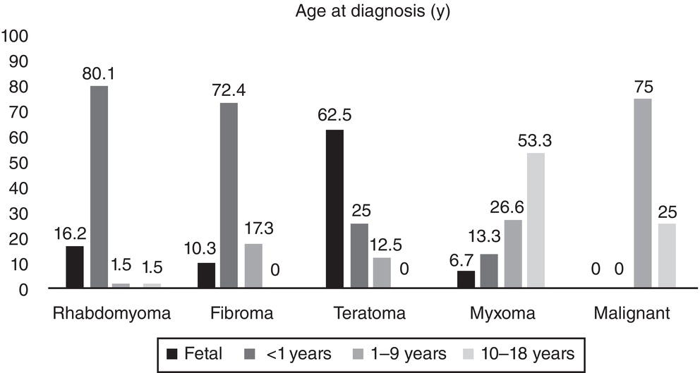

[**Figure 31.28**](#R_c31-fig-0036) Prevalence of benign and malignant tumors according to different age groups.

(Source: Tzani et al. \[108\]. Reproduced with permission of SAGE Publications.)

[**Table 31.10**](#R_c31-tbl-0011) Frequency distribution of cardiac tumors in children

Source: Uzan et al. \[109\] / Springer Nature / CC BY 2.0

<table border="1"><tbody class="tdcolor2"><tr><td class="left"><b><i>Primary benign</i></b></td><td class="left"><b><i>Frequency (%)</i></b></td></tr><tr><td class="left">Rhabdomyoma</td><td class="left">40–60</td></tr><tr><td class="left">Teratoma</td><td class="left">15–19</td></tr><tr><td class="left">Fibroma</td><td class="left">12–16</td></tr><tr><td class="left">Myxoma</td><td class="left">2–4</td></tr><tr><td class="left">Haemangioma</td><td class="left">5</td></tr><tr><td class="left">Lymphangioma</td><td class="left">}</td></tr><tr><td class="left">Haemangiopericytoma</td><td class="left">} Very rare</td></tr><tr><td class="left">Oncocytic tumors</td><td class="left">}</td></tr><tr><td class="left"><b><i>Primary malignant</i></b></td><td class="left"></td></tr><tr><td class="left">Rabdomyosarcomas</td><td class="left">2</td></tr><tr><td class="left">Fibrosarcomas</td><td class="left">2</td></tr><tr><td class="left"><b><i>Secondary metastatic tumors</i></b></td><td class="left"></td></tr><tr><td class="left">Neuroblastoma</td><td class="left">}</td></tr><tr><td class="left">Leukaemia</td><td class="left">} Very</td></tr><tr><td class="left">Lymphoma</td><td class="left">} rare</td></tr><tr><td class="left">Melanoma</td><td class="left">}</td></tr></tbody></table>

The drugs Everolimus and Sirolimus, inhibitors of the mammalian target of rapamycin (mTOR), have been shown to be effective in controlling seizures in patients with tuberous sclerosis complex, as well as reducing the size of subependymal giant cell tumors in the brain and rhabdomyomas in the heart. The mTOR is involved in the control of the cell proliferation cycle which is accelerated abnormally by defective TSC1 or TSC2 genes. In a recent systematic review of patients with TSC and cardiac rhabdomyomas, 90% of patients experienced a reduction in the size of symptomatic tumors when treated with either everolimus or sirolimus, thus offering a possible alternative to surgical resection for these patients \[110\].

Fibromas are the tumors of fibroblast cells and are the second most common cardiac tumor in children, accounting for 10–25% in most series. There is an association with the presence of nevoid basal cell carcinoma syndrome (also known as Gorlin syndrome) and cardiac fibromas. They are slow‐growing or stable in size and most commonly occur in the ventricular free wall or interventricular septum. Unlike rhabdomyomas, they do not usually recede. However, the patient often grows faster than the tumor so adverse effects can become less severe with time. Partial resection of the tumor is acceptable for symptom relief and cardiac transplantation or single ventricle palliation has been used with some success for cases deemed non‐resectable \[111\]. The overall prognosis is better in tumors that are able to be successfully resected.

Myxomas occur rarely in children, making up less than 10% of most series, and are largely seen in older children. They are very rare in the fetus or neonate. However, they are the commonest cardiac tumors in adults with females affected slightly more than males. The left atrium is the most common site for these tumors (75%), mostly arising from the fossa ovalis, but they can arise from any of the cardiac chambers. They are often pedunculated and lobular, may have frond‐like projections but can also be sessile. About 10% of myxomas are associated with the Carney complex, an inherited tumor disorder characterized by cardiac and extra‐cardiac myxomas, schwannomas, and endocrine tumors. Cardiac myxomas do not recede and need to be surgically resected in order to minimize complications due to cardiac obstruction or embolization as discussed later in this section.

Teratomas account for a small but varying proportion of cardiac tumors, 2% in one series \[112\], although in neonates they are second commonest after rhabdomyoma \[109\]. They are comprised of cells from one or more of the embryonic germ lines and are midline tumors that usually present early in life and are increasingly being diagnosed on fetal ultrasound. They can grow rapidly and if not diagnosed on fetal ultrasound, they will very likely present early in the neonatal period. It is very unusual for a teratoma to be an incidental finding.

The majority of teratomas are not malignant and surgical resection is the usual treatment. Although often arising above the heart in the anterior mediastinum, the heart and great vessels may be involved in these sometimes very large masses. They can occur within the pericardium, often causing pericardial effusion and/or compression of the right atrium. They derive blood supply from fibrous attachment to the aorta or pulmonary trunk which may make resection difficult, with some procedures requiring cardiopulmonary bypass. _In utero_ and _ex utero_, fetal surgery has been successfully performed for mediastinal teratoma.

Hemangiomas can occur anywhere in the heart and may be asymptomatic, may regress, and may respond to medical therapy. Depending on the position and complications, some will require surgical resection. Some can present in infancy. There have been major advances in understanding the biology of various forms of hemangioma, and prognosis and treatment are evolving. If surgery is not required urgently, cardiac hemangiomas should be assessed by an expert vascular malformation clinic, as medical therapy may be available and detailed prognostic information may be attainable, particularly with regard to the possibility of spontaneous regression.

### Pathophysiology of cardiac tumors

The pathophysiology of the various cardiac tumors is dependent upon their location as well as their size and relationship to surrounding structures.

Tumors may protrude into the cardiac chambers or outflow tracts causing obstruction to flow. In the case of rhabdomyomas, many of these tumors will recede with time so an expectant, conservative management strategy may be indicated. However, severe obstruction will require surgical resection or de‐bulking ([Figures 31.29](#c31-fig-0037) and [31.30](#c31-fig-0038)). Rhabdomyomas can cause hydrops or fetal demise by mechanisms such as arrhythmia, obstruction to flow or extrinsic compression of coronary arteries causing loss of functional myocardium. The neonatal or infantile presentation may be due to similar mechanisms with arrhythmia being present in about 30% of cases in one series \[112\].

Fibromas can present with a variety of symptoms or signs depending upon their location and size ([Figure 31.31](#c31-fig-0039)). Arrhythmia is again a feature, with ventricular tachycardia (VT) being particularly common, 64% in one series \[112\], which resolved after resection or debulking in 13 of 16 patients. Post‐surgical complications tend to be related to the location of the tumor with resultant regional wall motion abnormalities at the site of resection or valvular pathology requiring reoperation in some cases. Heart transplantation is considered in cases of massive tumors that are thought not to be resectable.

Myxomas are often readily distinguished from other cardiac tumors due to the fact that they arise most commonly from the left side of the fossa ovalis and have a characteristic pedunculated appearance. They are seen to intermittently obstruct the mitral inflow to the left ventricle in a “ball‐valve” type manner. Not only can they present with symptoms of obstruction to cardiac output, which can be intermittent and positional, but they are also often implicated in embolic phenomena. The emboli consist of a thrombus formed on the tumor surface or fragments of the tumor itself. In fact, cardiac myxomas can be found in the brain after having embolised and seeded the cerebral vasculature. The embolic phenomena can lead to presentation similar to infective endocarditis with any tissue bed in the arterial tree potentially affected. Non‐specific symptoms and signs including fever and malaise occur in about a third of patients. These constitutional symptoms are thought due to increased levels of the inflammatory mediator interleukin‐6.

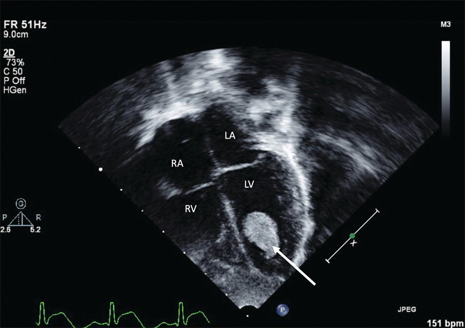

[**Figure 31.29**](#R_c31-fig-0037) Transthoracic echocardiography image of rhabdomyoma in the left ventricle (arrow) of a 3‐month‐old infant, diagnosed antenatally and followed with serial scans. This tumor did not need resection. RA, right atrium; RV, right ventricle; LA, left atrium; LV, left ventricle.

Courtesy of Dr. Bryn Jones, Cardiologist, The Royal Children’s Hospital, Melbourne, Australia.

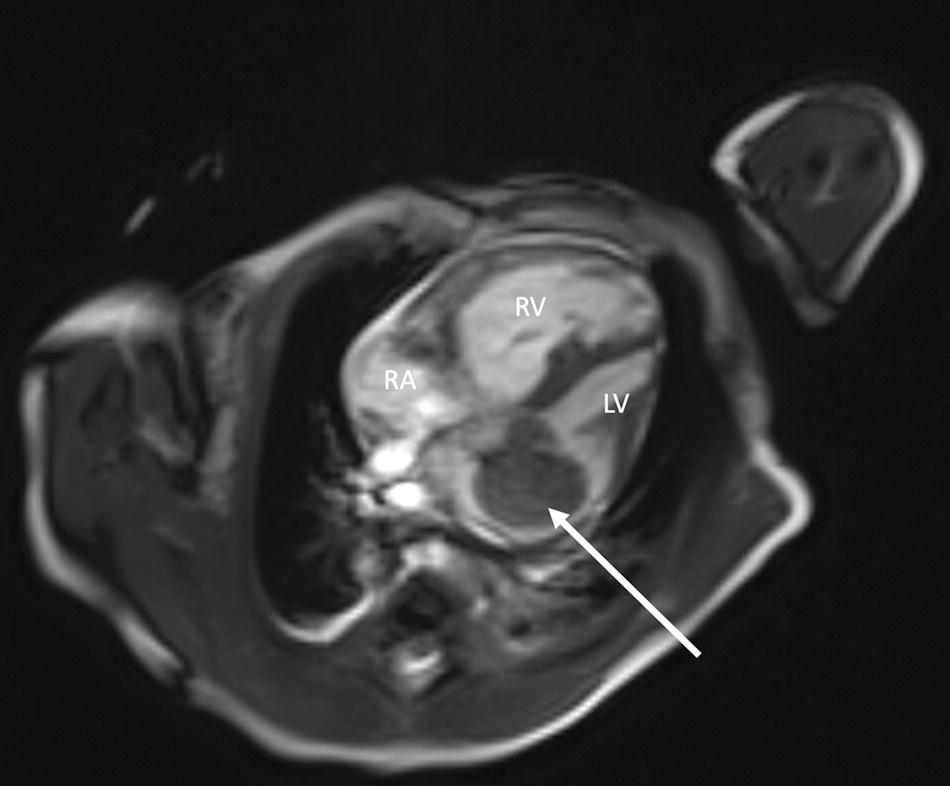

[**Figure 31.30**](#R_c31-fig-0038) MRI image of rhabdomyoma (arrow) arising from the mitral apparatus and obstructing left ventricular inflow in a neonate. This was diagnosed antenatally and required resection in the neonatal period due to obstruction to mitral inflow. RA, right atrium; RV, right ventricle; LV, left ventricle.

Courtesy of Dr. Bryn Jones, Cardiologist, The Royal Children’s Hospital, Melbourne, Australia.

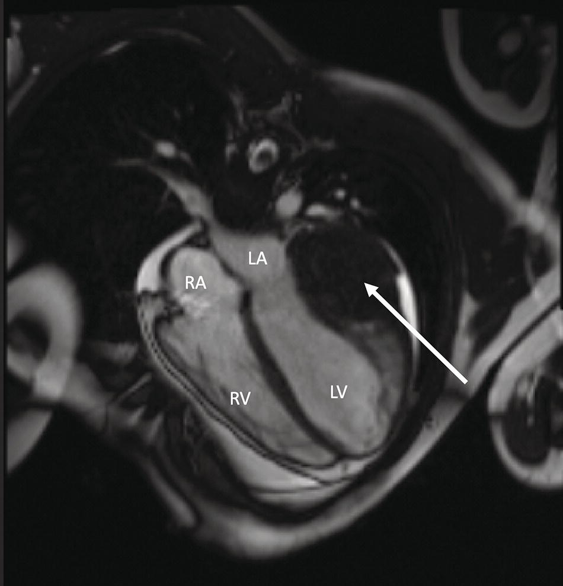

[**Figure 31.31**](#R_c31-fig-0039) Magnetic resonance image of a large fibroma of the base of the LV in an adolescent. This was under surveillance with serial scans and eventually required resection due to the development of ventricular tachycardia.

Courtesy of Dr. Bryn Jones, Cardiologist, The Royal Children’s Hospital, Melbourne, Australia.

### Surgical approaches and outcomes for cardiac tumors

Surgical planning and decision‐making for cardiac tumors will depend on the following factors: tumor type, tumor position, pathophysiologic effects, and the risks of excision. Most procedures for cardiac tumors will involve CPB, but occasional lesions involving structures that do not require opening of the heart may not. Sternotomy is the usual approach, but various less invasive approaches have been used for tumors such as atrial myxoma where the lesion is pedunculated, and the surgery can be performed through a left thoracotomy or partial sternotomy.

For pedunculated intravascular tumors that have grown into the heart along the great veins, e.g., Wilms tumor, strategies to deal with the intravascular tumor, prevent embolization, and have adequate CPB may require tailoring of the perfusion plan to the exact anatomy and include having venous drainage from sites external to the heart ([Figure 31.32](#c31-fig-0040)).

If cardiac tumors can be removed without disrupting the postoperative function of the heart, outcomes are usually good. The degree of resection attempted will be informed by this, as partial resection may be preferable for rhabdomyomas and fibromas if more radical surgery will jeopardize the functional outcome. As these tumors are slow growing or tend to stabilize and even regress, partial resection that relieves symptoms will often be adequate. Atrial myxomas are occasionally locally aggressive and may recur if the base is not adequately excised. The outcome for surgical excision of myxomas is usually very good, but occasionally, a child with myxoma is in the high‐risk familial, genetic group, making recurrence more likely both locally and at a separate cardiac location.

[**Figure 31.32**](#R_c31-fig-0040) A 4‐year‐old child with Wilm’s tumor extension into the right atrium. (A) Computed tomography scan with contrast of abdomen and thorax, coronal view. There is a large 7 × 8 cm left renal mass (black arrow) with extensive tumor thrombus involving the left renal vein, inferior vena cava, right hepatic vein, and right atrium (white arrows). (B) Axial view demonstrating large tumor thrombus in the right atrium. (Arrow). The patient underwent radical left nephrectomy with tumor thrombus removal and closure of the patent foramen ovale with cardiopulmonary bypass.

Teratomas arising at the base of the heart may be large and grossly distorted and may involve the great vessels and the coronary arteries. Surgery may be technically difficult and a multidisciplinary team involving cardiology, medical imaging, cardiac surgery, oncology, perfusion, and anesthesia should carefully plan the approach to excision. Successful excision, however, should be curative.

### Anesthesia considerations for cardiac tumors

Anesthesia for the wide range of possible procedures relating to cardiac tumors needs to be tailored to the patient’s condition and the planned surgical approach. Most rhabdomyomas will not require surgery, but those that do will usually have a significant cardiovascular impairment which will need to be defined. Patients with tuberous sclerosis complex are likely to have multiple other systems involved and behavioral issues such as developmental delay and autism that will require special attention to minimize distress for the patient and family.

Tumors that involve the right side of the heart and pedunculated lesions that have passed centrally from peripheral origins may require consideration with regard to where vascular access is placed, with lesions involving the inferior vena cava (such as the venous extension to the atrium of Wilms’ tumor) having vascular access in the upper limb and avoiding femoral central access. Similarly, lesions arising in the neck and upper limbs (which are less common but can occur with rhabdosarcoma) require lower limb vascular access to avoid the possibility of injected medications and fluids being obstructed from reaching the central circulation during resection.

Patients with malignant lesions involving the heart will often have received chemotherapy. Complications of these therapies should be assessed. Bone marrow status should be checked to confirm or plan for appropriate recovery or management of anemia, thrombocytopenia, and neutropenia. Consideration should be given to previous use of agents that sensitize the lungs to hyperoxia, such as bleomycin, or those with potential for cardiotoxicities, such as doxorubicin or other agents of the anthracycline class. Surgery is rarely indicated for malignant lesions not arising in the heart, but debulking recurrent lymphoma that has invaded the pericardium from the anterior mediastinum is occasionally required. These recurrent lesions involving the pericardium are rarely of size or in a position to create the issues described in the section on mediastinal masses. Lymphomatous pericardial effusion may also need drainage either for diagnostic purposes or to relieve tamponade. Careful assessment and management of the patient with the potential for tamponade are required (see previous section).

Teratomas arising in the midline at the base of the heart will usually be present at birth and may be very challenging for all clinicians involved. The patient’s preoperative condition may be poor, with obstruction to major vessels, distortion of the heart and coronary vessels, and potentially high‐output cardiac failure and persistent pulmonary hypertension due to the large blood supply of the lesion. Excision without injuring important cardiac structures (such as coronary arteries), leading to postoperative myocardial dysfunction, may be difficult and intraoperative blood loss may be extensive and difficult to control. Pre‐operative planning to support massive transfusion and prevention of coagulopathy is appropriate.

Anesthesia may be required for interventional imaging procedures to define, biopsy or treat tumors of the heart.

* * *

### KEY POINTS: ANESTHESIA FOR CARDIAC TUMORS

-   The most common cardiac tumor in childhood is rhabdomyoma.
-   Myxomas are the commonest intracardiac tumors in adults, but they are rare in young children.
-   Teratomas are midline and may arise at the base of the heart and present as large tumors in the neonatal period.
-   Malignant tumors involving the heart are rare and have a poor prognosis.
-   CBP may be required for pedunculated tumors that have grown along venous paths to the atrium, such as a Wilms tumor.
-   Anesthesia for cardiac tumors is based on the preoperative patient condition and the nature of the surgery planned.

* * *

## Aortic aneurysm and aortopathy in children

### Classification and definition of aortic aneurysms (and aortopathy)

An aortic aneurysm is defined as a permanent localized dilatation of the aorta, having at least 50% greater diameter than that expected for age and sex \[113\]. It may occur anywhere from the aortic valve annulus to the bifurcation of the abdominal aorta. A true aneurysm involves all layers of the vessel wall (intima, media, and adventitia). Those involving circumferential dilatation of the vessel are called fusiform aneurysms and are the most commonly occurring type. Saccular aneurysms are berry‐like expansions, sometimes with a narrow neck, at a weak spot in the vessel wall. Aneurysms of a single sinus of Valsalva are of the saccular type.

False aneurysms, also known as pseudoaneurysms, can occur secondary to local pathologies, such as trauma or infection, and involve the creation of a space in continuity with the lumen of the vessel. A false aneurysm is not bounded by the vessel wall but by external tissue, such as the wall of an abscess that has eroded the vessel or the site of previous trauma where hematoma and fibrosis now form the containing layer.

A mycotic aneurysm is a specific term that relates to the formation of infection within the wall of an artery secondary to embolization from infective endocarditis seeding the vasa vasorum of the arterial wall.

Dissecting aneurysms (or “dissections”) occur when an aneurysm, usually fusiform, creates an intimal tear, sparing the adventitia and sometimes the media. The arterial pulsations then split the internal layers, creating a blood‐filled space in the wall, which tracks along the vessel and continues to split the layers apart, still leaving the adventitia intact. The dissection may rupture internally by tearing the intima at another site or eventually rupture through the adventitia externally. The dissection process can occlude branches of the vessel, leading to end‐organ ischemia, and may be the site of thrombosis and/or a source of emboli.

The term “aortopathy” refers to the clinical association of aortic pathophysiological abnormalities and aortic dilatation \[114\]. Aortopathy is increasingly being recognized as part of the spectrum of presentations and natural history of many types of congenital heart disease (CHD).

### Incidence, anatomy, and natural history of aortic aneurysms in children

Aortic aneurysms are rare in children and can be classified according to the site, type, acuity, and underlying pathology. Dissection of the aorta is extremely rare in children and, if it occurs, it tends to occur later in childhood in patients with underlying connective tissue disorders and large fusiform aneurysms.

The majority of pediatric aortic aneurysms involve the ascending aorta and the aortic root with far fewer occurring in the transverse arch, descending thoracic aorta, or abdominal aorta. The commonest causes of aneurysms of the ascending aorta and aortic root in children are genetic conditions, especially connective tissue disorders, with Marfan syndrome being the most common of these. Inflammatory conditions such as autoimmune disease and arteritis may also affect the aorta and be associated with aneurysm formation. Inflammatory conditions such as Takayasu arteritis or Kawasaki disease will usually have multifocal arterial lesions, often stenotic, as well as other features, such as systemic illness, with aortic aneurysm as an occasional complication. As alluded to above, there is an increasing number of patients with congenital heart disease surviving into adulthood and displaying signs of aortopathy not previously seen.

### Genetic conditions associated with aortic aneurysm

#### Marfan syndrome

Marfan syndrome is the genetic condition most commonly associated with an aneurysm of the aorta, usually involving the ascending aorta and often the aortic root. The clinical diagnosis of Marfan syndrome is based on the revised “Ghent” criteria \[115, 116\] ([Tables 31.11](#c31-tbl-0012) and [31.12](#c31-tbl-0013)). Variations based on the presence of family history and the age of the patient are included. The existence of related syndromes, including those featuring aortic dilatation but differing genetics and a spectrum of either differing or overlapping (with Marfan) associated features, such as Sphrintzen–Goldberg syndrome, Loeys–Dietz syndrome, and the vascular form of Ehlers–Danlos syndrome, are specifically included in the differential diagnosis and actively sought, to make misdiagnosis less likely. “Typical” patients with Marfan syndrome will often have particular facial features and body habitus with long thin limbs, tall stature, and hypermobility of joints. Arachnodactyly can be demonstrated by the thumb sign (the adducted thumb has the whole of the nail protrude beyond the ulnar margin of the palm) and the wrist sign (when encircling the opposite wrist, the thumb, and fifth finger overlap). These and many other physical signs are codified in the Ghent criteria.

[**Table 31.11**](#R_c31-tbl-0012) Revised Ghent criteria

Source: Rigelsky & Moran \[116\]. Reproduced with permission of Wolters Kluwer Health, Inc.

| In the absence of family history | In the presence of family history |
| --- | --- |
| Aortic root dilation (_z_‐score at least 2 or aortic root dissection) and ectopia lentis | Ectopia lentis and Family history of Marfan syndrome as defined by new criteria |
| Aortic diameter (_z_ at least 2 or aortic root dissection) and a pathogenic FBN1 variant as defined above | Systemic score at least 7 points[a](#c31-note-0008) and Family history of Marfan syndrome as defined by new criteria |
| Aortic criterion (aortic diameter _z_ at least 2 or aortic root dissection) and a systemic score at least _7_ (see [Table 31.12](#c31-tbl-0013)) | Aortic criterion (aortic diameter _z_ ≥2 above 20 years old, _z_ ≥3 below 20 years, or aortic root dissection)[a](#c31-note-0008) AND Family history of Marfan syndrome as defined by new criteria |
| Ectopia lentis and a pathogenic FBN1 variant |  |

[_a_](#R_c31-note-0008) The diagnosis of MFS is made in the absence of discriminating features of other syndromic disorders, such as Loeys‐Dietz syndrome or vascular Ehlers–Danlos syndrome.

[**Table 31.12**](#R_c31-tbl-0013) Marfan systemic score

Source: Rigelsky & Moran \[116\]. Reproduced with permission of Wolters Kluwer Health, Inc.

| Finding | Score |
| --- | --- |
| Wrist and thumb sign | 3 |
|  Wrist or thumb sign | 1 |
| Pectus carinatum | 2 |
|  Pectus excavatum or chest asymmetry | 1 |
| Hindfoot deformity | 2 |
|  Plain pes planus | 1 |
| Pneumothorax | 2 |
| Dural ectasia | 2 |
| Protrusio acetabuli | 2 |
| Reduced US/LS and increased arm/height and no severe scoliosis | 1 |
| Scoliosis or thoracolumbar kyphosis | 1 |
| Reduced elbow extension | 1 |
| Facial features – (3/5) dolichocephaly, enophthalmos, down slanting palpebral fissures, malar hypoplasia, retrognathia | 1 |
| Skin striae | 1 |
| Myopia less than –3 diopters | 1 |
| Mitral valve prolapse | 1 |

Marfan syndrome has an incidence of between 1 in 3,000 and 1 in 10,000 with the variation likely due to missed diagnoses in some populations. \[117\] It is an autosomal dominant condition with variable penetrance although about 25% of cases involve new mutations, with some effect of parental age. Mitral valve regurgitation may also occur, often earlier than the aortic dilatation but usually with less severe consequences. Aortic regurgitation is secondary to aortic root dilatation ([Figure 31.33](#c31-fig-0041)). Skeletal abnormalities including long bone overgrowth and ophthalmic abnormalities including ectopia lentis (lens dislocation) are the other main features of the syndrome. The abnormal gene in most patients with Marfan syndrome is FBN1, which lies on chromosome 15 and encodes for type 1 fibrillin, a protein that forms part of the microfibrils in the extracellular matrix, contributing to the formation and maintenance of elastic fibers. There are a large number of mutations of FBN1 that cause Marfan’s syndrome, most of them altering a single amino acid. The phenotype produced is highly variable and does not correlate well with the different mutations. There are also a series of related “fibrillinopathies” with associated genetic abnormalities that give rise to variants of Marfan syndrome; these may not have all the clinical features of Marfan syndrome but some are associated with aortic aneurysm. There is a rare neonatal form of Marfan syndrome which is usually rapidly progressive and fatal. About 10% of patients with Marfan phenotype have a mutation in TGF‐βR2, which encodes for transforming growth factor beta‐receptor type II, a controller of extracellular matrix production, interacting with fibrillin formation, and some authors argue that these patients should be classified as having Loeys–Dietz syndrome as this diagnosis highlights the risk of more severe aortic dilatation and dissection (see later in this section).

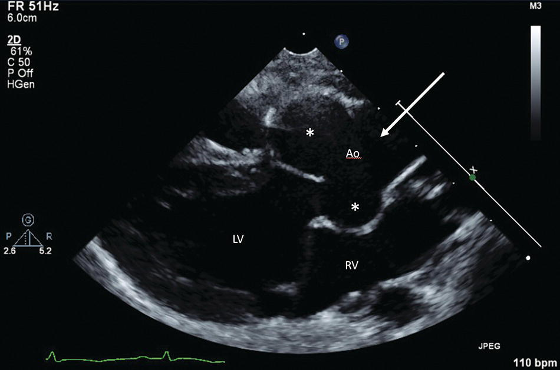

[**Figure 31.33**](#R_c31-fig-0041) Parasternal long axis echo view of the dilated aortic root in a patient with Marfan syndrome. Arrow denotes the dilated root, asterisks the dilated sinuses of Valsalva. Ao, aorta; LV, left ventricle; RV, right ventricle.

Courtesy of Dr. Bryn Jones, Cardiologist, The Royal Children’s Hospital, Melbourne, Australia.

Management usually includes pharmacological treatment aiming to prevent or slow the progression of aortic root dilation, such as beta‐blockade, which is probably effective \[118\]. The evidence for beta‐blockers in children with Marfan syndrome is even less robust, although most centers still routinely use this therapy as the first line. Angiotensin II receptor blockers (ARBs) such as losartan, may be used if beta‐blockers are not tolerated with studies showing equal efficacy. In patients with Marfan syndrome and aortic dilatation, ARBs are added to beta‐blockers although the evidence for this is mixed. Advice should be given about avoiding activities that might cause aneurysm rupture, such as contact sport or isometric efforts involving a Valsalva maneuver, such as weight‐lifting, whereas mild to moderate aerobic activity is acceptable and in fact, encouraged. Pregnancy increases the risk of aortic rupture, especially if the aortic root is already 4 cm at the beginning of the pregnancy. Regular ophthalmic follow‐up is also required for patients with Marfan syndrome. Historically, 50% of patients with Marfan syndrome died before the age of 40, whereas more recently median survival can be greater than 70 years \[119\].

Serial echocardiography to monitor the aortic root and also the aortic and mitral valves and the pulmonary artery should commence at diagnosis of Marfan syndrome and be at least yearly at first. Significant aortic dilatation is unusual in children less than 10 years of age. Following the “_z_ score” (z score of +2 is 2 standard deviations above mean normal diameter for age or body surface area, for example) for aortic root dimensions is appropriate in childhood, rather than an absolute value for aortic dimension. Correlation of the aortic diameter with the body surface area can also be used to track dilatation with respect to overall patient size. Indications for elective surgery for aortic root dilatation in older children will depend on both the degree of the dilatation and the rate of increase in size. Dissection of the aorta due to Marfan syndrome is very rare in childhood. Associated aortic or mitral valve regurgitation is a more common indication for surgery in children.

#### Loeys‐Dietz syndrome

Loeys‐Dietz syndrome (LDS), first described in 2005, is an autosomal dominant inherited condition characterized by vascular findings (cerebral, thoracic, and abdominal arterial aneurysms and/or dissections), skeletal manifestations (pectus excavatum or pectus carinatum, scoliosis, joint laxity, arachnodactyly, talipes equinovarus, cervical spine malformation and/or instability), craniofacial features (widely spaced eyes, strabismus, bifid uvula/cleft palate, and craniosynostosis that can involve any sutures), and cutaneous findings (velvety and translucent skin, easy bruising, and dystrophic scars). Individuals with LDS are predisposed to widespread and aggressive arterial aneurysms and pregnancy‐related complications including uterine rupture and death \[120\].

Diagnosis is by the presence of one of the associated genes (SMAD2, SMAD3, TGFB2, TGFB3, TGFBR1, or TGFBR2) along with characteristic features in the proband or family members.

The arterial disease is more aggressive than that in other connective tissue diseases such as Marfan syndrome, with aortic dissection and rupture occurring at younger ages and smaller aortic diameters, occasionally described in children as young as 3 months of age \[121\]. One Center’s experience with elective aortic root replacement in patients with LDS showed 95% survival and 54% freedom from reoperation at 10 years. The average age at operation was 10 years, the average aortic z‐score was 7.8 and most had a valve‐sparing root replacement \[121\].

#### Ehlers–Danlos syndrome

Ehlers–Danlos syndrome has six subtypes. The main general features are hyperextensible skin, hypermobile joints, and connective tissue fragility. Type IV is known as the vascular type. This is an autosomal dominant condition associated with mutations in the COL3A1 gene on chromosome 2, which encodes for the collagen alpha 1 (III) chain. It has an incidence of about 1 in 5,000–20,000. About 50% of cases arise as new mutations. This variant is associated with arterial aneurysms at many locations, including the aorta. There is also an association with gastrointestinal perforation and uterine rupture in pregnancy related to vascular Ehlers–Danlos syndrome. Recognition of the syndrome before these life‐threatening complications occur may allow prevention or earlier intervention.

Other examples of syndromic genetic conditions associated with aortic aneurysm formation include Noonan syndrome, Williams syndrome, autosomal dominant polycystic kidney disease, Turner syndrome, homocystinuria, osteogenesis imperfecta, and pseudoxanthoma elasticum.

### Sinus of Valsalva aneurysms

Aneurysm of a sinus of Valsalva may affect any one of the three sinuses. Dilatation involving all three sinuses is classified as an aneurysm of the root of the aorta and usually relates to fusiform dilatation due to connective tissue disease \[122\]. The sinuses of Valsalva together form the aortic root, originating at the aortic annulus and terminating at the sinotubular junction, where the ascending aorta begins. Although acquired aneurysms of the sinus of Valsalva can occur due to trauma, infection, or surgery, most are congenital. Aneurysm of the right sinus of Valsalva is the commonest, accounting for 60–85%, with aneurysms of the non‐coronary sinus accounting for most of the rest and aneurysm of the left sinus accounting for less than 5%. There is an association between VSDs just below the annulus fibrosus, and aneurysm of the sinus of Valsalva, where there is a separation of the aortic media from the annulus fibrosus and abnormal elastin deposition, creating a weak area that expands to create the aneurysm. An aneurysm of the right sinus of Valsalva can rupture into the pulmonary artery or any chamber of the heart except the left atrium. This creates a fistula that may be sufficiently high‐flow to cause acute cardiac failure. Rupture into the pericardium will cause tamponade. The left and non‐coronary sinuses of Valsalva can rupture into any cardiac chamber or the pericardium, but not the pulmonary artery when the great arteries are normally placed. The commonest fistulas are from the right sinus of the Valsalva aneurysm to the right ventricle (about two‐thirds). Unruptured aneurysms may be large and obstruct right ventricular outflow or cause coronary compression. Congenital aneurysms of the sinus of Valsalva are more common in males (4: 1) and in some Asian communities, where there is a stronger association with supracristal (doubly committed) VSDs. There is also an association with aortic regurgitation and bicuspid aortic valve.

### Aortopathy and aortic dilation with CHD

Bicuspid aortic valve (BAV) is the most commonly occurring CHD with a prevalence of 1–2% in the general population. Concomitant aortic dilatation is seen in up to 80% of patients ([Figure 31.34](#c31-fig-0042)). The lifetime risk of aortic dissection in patients with BAV is reported as up to 9 times that of the general population \[123\]; however, the large denominator of people with asymptomatic BAV and no aortic dilatation, discovered incidentally with routine cardiac screening, has led to a general reduction in the estimate of dissection risk \[124\]. Familial studies suggest an autosomal dominant inheritance pattern with incomplete penetrance. There is a 9–20% chance of identifying BAV in first‐degree relatives of an affected proband, thus the guidelines recommend echocardiographic screening in all first‐degree relatives. There are a small number of genes so far identified in connection with familial non‐syndromic BAV aortopathy, including NOTCH‐1, SMAD6, and MAT2A. BAV is present in 40% of patients with Turner syndrome and is associated with the presence of mutations in the Tissue Inhibitor of Matrix Metalloproteinase 1 and 3 (TIMP 1 and TIMP 3) genes.

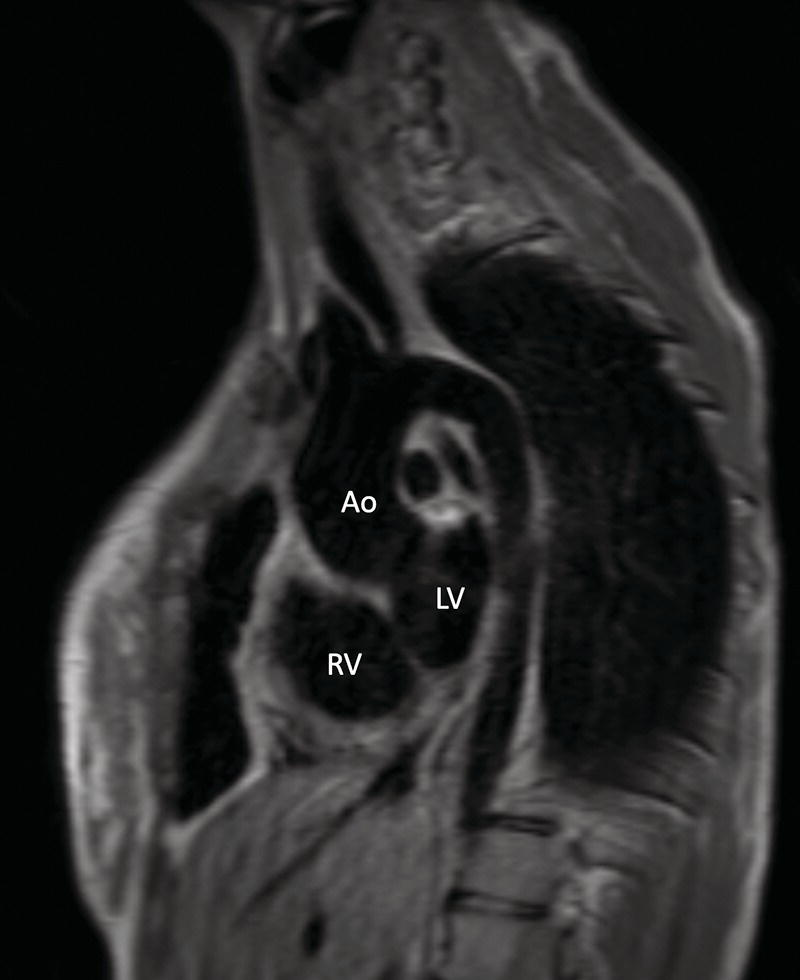

[**Figure 31.34**](#R_c31-fig-0042) Dark blood MRI image of the dilated ascending aorta in a patient with the bicuspid aortic valve. LV, left ventricle; RV, right ventricle; Ao, aorta.

Courtesy of Dr. Bryn Jones, Cardiologist, The Royal Children’s Hospital, Melbourne, Australia.

Coarctation of the aorta accounts for 5–8% of all CHDs with more than half of these cases being associated with other lesions such as BAV or mitral valve pathology. Genetic influences play a role and there is a slight male predominance. Further, 10% of patients with Turner syndrome also have coarctation. A dilated ascending aorta and an aortic arch are commonly found in patients presenting late with previously asymptomatic coarctation. This is in contrast to those presenting in the neonatal period, especially if in association with a VSD, whereby blood is preferentially directed into the pulmonary trunk and across the ductus arteriosus. It seems that early operation for coarctation is protective against future aortic dilatation.

Conotruncal defects including truncus arteriosus, transposition of the great arteries (TGA), tetralogy of Fallot (TOF), and double outlet right ventricle are frequently associated with thoracic aortic dilatation \[124\]. However, there does not seem to be the same risk for progressing to aortic dissection with conotruncal lesions as there is with aortopathy associated with BAV. TOF is the commonest form of cyanotic CHD and accounts for 10% of all CHD. Dilatation of the aortic root and ascending aorta is common in ToF and can be observed in fetal echocardiography. Persistent aortic root dilatation is more commonly reported in adult patients after childhood TOF repair, now that survival to adulthood from this condition is around 90%. A right‐sided aortic arch, male gender, history of an aortopulmonary shunt, and complete repair at an older age have been associated with late aortic dilatation \[123\]. Significant regression of indexed aortic root diameters over time after early repair in infancy, with a chance of normalizing the initially dilated root within 7–8 years has been demonstrated. \[123\]

Secondary aortic root dilatation can be seen after surgical correction of congenital heart diseases during which the native aortic root is replaced with a pulmonary homograft (Ross procedure), is modified (the arterial switch operation \[ASO\] as described by Jatene), or reconstructed (Damus Kaye Stanzel anastomosis for single ventricle palliation of hypoplastic left heart lesions). Literature on this particular variant of aortopathy is less extensive than that for BAV or TOF as it was only recognized as an emerging feature of the disease within the last decade or so. Risk factors for late neo‐aortic root dilatation and regurgitation after ASO are the presence of a VSD, previous pulmonary artery banding, older age at repair, and the association with coarctation. Technical factors such as acute angulation of the aortic arch after ASO and closure of the VSD through the pulmonary artery, have been associated with late aortic regurgitation and aortic dilatation in some reports \[123\]. In a study with a median follow‐up of 9 years after Fontan completion, neo‐aortic root progressively dilated out of proportion to body size over time, with 98% of patients having a root z‐score of >2 at the most recent follow‐up \[125\].

### Pathophysiology of aortic aneurysms

The law of Laplace (wall tension is proportional to transmural pressure multiplied by vessel radius), as modified and applied to blood vessels, helps explain why aneurysms tend to expand and rupture. The wall tension is proportional to the pressure differential across the wall and the radius of the vessel. From these relations, it can be seen that, as a vessel dilates, its radius increases and, even with the internal pressure unchanged, the wall tension will increase, making further dilatation and rupture more likely. Alternatively, an increase in pressure inside the vessel relative to the outside will also increase wall tension making dilatation and rupture, again, more likely. Tissue stress can be decreased by an increase in the thickness of the wall (allowing the “retaining force” to be distributed over more tissue). However, the dilatation process is often associated with thinning of the vessel wall, which increases the stress on the tissue, thereby increasing the likelihood of expansion of the aneurysm. Some pathologies may be associated with changes, such as fibrosis, that thicken the wall and change the tissue characteristics, decreasing tissue stress and potentially stabilizing an aneurysm. Aneurysmal expansion and, eventually, more rapid dilatation and rupture are likely outcomes, but the time frames for these processes are notably variable depending on the causative pathology. Dissection of the inner layers may occur as the tissues distend or the underlying pathology progresses. In most conditions associated with aortic aneurysm, abnormalities of the aortic media develop so that loss of elastin and changes in collagen are progressive, with cystic degeneration and necrosis of portions of the media a common finding. If the intima splits with dilation or other pathology, the abnormal media will be especially prone to dissection.

The same picture of maladaptive remodeling of the aortic media seen in Marfan syndrome is also noted in patients with BAV and conotruncal defects. There is extracellular matrix degradation associated with noninflammatory loss of vascular smooth muscle cells. The vascular smooth muscle cell apoptosis is thought to occur secondary to excessive activity of a group of degradative enzymes known as matrix metalloproteinases (MMPs) \[124\]. Despite similarities in pathophysiology, the frequency of aortic dilation, and more importantly, the risk of aortic dissection, differ considerably among the aortopathies of Marfan syndrome, BAV, and conotruncal defects, as noted in the previous section. In light of these differences, the criteria for surgical intervention also differ.

The exact mechanism of aortic wall degradation is unclear and is thought to be due to a combination of hemodynamic shear stress from altered or abnormal flow in the proximal aorta (the hemodynamic theory) and genetic influences on the elastic fibers and vascular smooth muscle cells in the extracellular matrix (the genetic theory).

### Surgical approaches for aortic aneurysms in children

Historically, aortic root replacement consisted of the Bentall procedure, which involved mechanical aortic valve replacement, a tube replacement of the aortic root and reimplantation of the coronary arteries. This procedure had very good results and is still widely used in adults. In children, the issues of lifelong anticoagulation associated with prosthetic aortic valves, and the failure of growth and long‐term complications of prosthetic valves and conduits were a major stimulus for attempting surgery to replace the aortic root while leaving the native aortic valve intact. The major surgical advance in aortic root replacement over the last few decades, especially for children, has been the evolution of valve‐sparing aortic root replacement \[126\]. Two major techniques were introduced and there have been many variants. Remodeling, introduced by Yacoub, involved a proximally scalloped aortic tube graft, which is sutured above the aortic annulus with the longer scalloped portions sewn along the line of the attachments of the aortic valves, mimicking the sinuses of Valsalva and providing some distensibility of the aortic root, which is closer to the normal physiology. This is technically a more straightforward procedure than the alternative reimplantation techniques but still requires coronary re‐implantation. The greatest medium‐term risk with the remodeling technique was recurrent aortic annulus dilatation and aortic regurgitation, especially in children who usually have an underlying connective tissue disorder. Various modifications to support the aortic annulus and prevent subsequent dilatation and aortic regurgitation have been added to this technique to decrease that risk.

Reimplantation, introduced by David, anchored the aortic tube to the ventricular side of the aortic annulus with a second proximal suture line in a position similar to that used for the remodeling technique. The major difference in the medium term is that the aortic annulus is supported and recurrent dilatation at that level and consequent aortic regurgitation should be prevented \[127\]. In fact, early results showed problems with interference with aortic valve function, partly due to the decrease in aortic annulus diameter, which meant that aortic valve prolapse and poor coaptation could occur, leading to aortic regurgitation. Subsequent techniques have incorporated aortic valve surgery to tailor the valve leaflets to the new geometry and decrease the risk of regurgitation. The reimplantation technique, as originally described, has evolved with more recent techniques and preformed devices focused on restoring the convex curve of the aortic root, which should better mimic the normal function of the sinuses of Valsalva in relation to aortic valve function and coronary artery flow. Ascending aortic dilatation can continue to occur after the aortic root has been replaced ([Figure 31.35](#c31-fig-0043)).

Modern myocardial preservation that affords low morbidity from the long cross‐clamp times required for this, often extensive, reconstructive surgery of the aortic root, aortic valve, and coronary reimplantation, have facilitated the advances in this area. The presence of aortic regurgitation preoperatively, common in patients with a dilated aortic root, requires isolated coronary perfusion or retrograde coronary perfusion to effectively deliver cardioplegia.

A recent, exciting development in the prevention of dissection in patients with aneurysms of the aortic root or ascending aorta has been personalised external aortic root support (PEARS). This is a technique whereby a 3D mesh model of the patient’s aortic root and the ascending aorta is custom made by computer‐aided design and is then implanted via sternotomy but usually not requiring CPB (73% off the bypass in this study), around the existing aortic root and ascending aorta. The mesh provides a “structural framework” against which the aorta is prevented from dilating. This group has published a series of cases from 2004 to 2017 in which 117 patients received an external mesh implant, initially at one center, and then expanding to include 14 teams \[128\]. The purpose of the procedure is to prevent aortic dissection, so inclusion criteria were aortic diameters of 40–50 mm in asymptomatic patients over the age of 16 years. Results are encouraging so far although the authors acknowledge that long‐term follow‐up has not yet occurred. They also plan to publish shortly on a series where PEARS has been used to support the neo‐aorta after the Ross procedure and they speculate on future potential uses in situations such as aortic dilatation in adulthood following the neonatal arterial switch operation for transposition of the great arteries. While PEARS surgery is not being performed on young children, it is possible that some adolescents may benefit and potentially so too will a population of children having surgery for congenital heart disease who subsequently survive into adulthood.

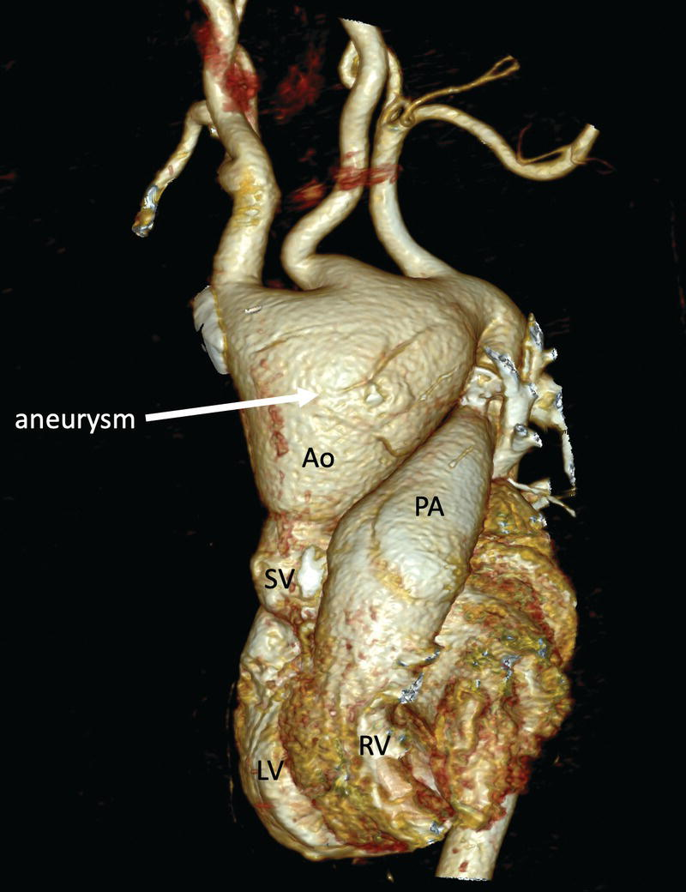

[**Figure 31.35**](#R_c31-fig-0043) Reconstructed computed tomography angiogram of ascending aortic aneurysm after aortic root replacement. Ao, aorta; SV, sinus of Valsalva; LV, left ventricle; RV, right ventricle; PA, pulmonary artery.

Courtesy of Dr. Bryn Jones, Cardiologist, The Royal Children’s Hospital, Melbourne, Australia.

### Anesthesia for aortic aneurysm surgery

The preoperative assessment should elucidate the extent of the lesion being repaired, as well as associated cardiovascular lesions such as aortic and mitral valve regurgitation, which commonly accompany connective tissue causes of aortic aneurysm. Review of imaging studies is crucial; all patients will have echocardiography, but MRI and/or CT scanning are invaluable in defining the size and extent of the aneurysm, and the properties of any aortic dissection. The non‐cardiovascular lesions that accompany the various causes of aortic aneurysm, including genetic syndromes such as Marfan syndrome and inflammatory conditions such as autoimmune or infective disorders, should be investigated. A significant percentage of pediatric cases will involve repeat sternotomy, as associated lesions, such as MR in Marfan syndrome, which presents earlier in life than aortic aneurysm, may have already required repair. Valve‐sparing procedures for aortic root replacement in young children will have a moderate rate of medium‐ to long‐term complications, such as aortic regurgitation, that will require reoperation. A recurrent aneurysm is rare and may involve suture lines or more distal aorta with the progression of underlying disease. The complex interaction of aortic valve function with the aortic root means that revision surgery for aortic regurgitation may involve the whole aortic root rather than just the valve leaflets. The usual preparation for repeat sternotomy should be considered, such as planning for the possibility of instituting CPB via peripheral cannulation before opening the chest or in an emergency fashion if required during sternotomy, with appropriate access for rapid resuscitation with blood products and external defibrillation pads in place.

Many pediatric patients undergoing aortic root surgery will be older children, in contrast to the large proportion of pediatric cardiac surgeries, which are done in the first year of life (the majority of cases in many specialized pediatric centers). These older children are often systemically well and asymptomatic, having had the size and rate of expansion of the aorta monitored for many years. Careful preparation includes managing patient and parental anxiety and informing them of plans for postoperative care, including options for adequate pain control.

The cardiovascular status of the pediatric patient scheduled for aortic root replacement will usually depend on associated valve lesions. Patients with Marfan syndrome and other connective tissue disorders are likely to have been treated with beta‐blockers. Care should be taken to avoid beta‐blocker withdrawal syndrome, which may complicate the postoperative course. The sympathetic overactivity associated with beta‐blocker withdrawal is a particular hazard in the early postoperative phase when catastrophic bleeding and suture line dehiscence might be induced. Cautious maintenance of beta‐blockade throughout the perioperative period is a reasonable strategy. Given the possibility of a long cross‐clamp time, and the resultant decrease in intrinsic inotropy, some anesthesiologists will choose to have an esmolol infusion available and use it as required rather than commit to a longer‐acting beta‐blocker in this instance. Angiotensin II receptor blockers (e.g., losartan) may be withheld on the morning of surgery, due to the risk of hypotension in the immediate postoperative period.

Hypertension should be avoided both pre‐ and post‐bypass. Pre‐bypass, it may cause rupture of the aneurysm, and post‐bypass, it may cause excessive bleeding and dehiscence of suture lines. Patients with associated aortic and/or mitral regurgitation may have a dilated left ventricle. Occasionally, this will be associated with poor inotropic function, which will be exacerbated by myocardial ischemia associated with prolonged cross‐clamp time. Appropriate inotropic support should be provided along with strategies to minimize afterload whilst maintaining an adequate coronary perfusion pressure. More commonly, patients with pre‐operative regurgitant valve lesions and a dilated left ventricle with the good left ventricular function will have issues of a large stroke volume after the regurgitant lesions are repaired, and avoidance of hypertension may require postoperative vasodilator therapy along with careful attention to adequate analgesia and sedation.

The association of aortic root replacement procedures with reimplantation of the coronary arteries requires careful assessment of the postoperative electrocardiogram in multiple leads to diagnose ischemic complications that may arise from technical issues with the reimplantation as well as air after removal of the cross‐clamp, creating a temporary obstruction of the coronary arteries. Coronary flow can be assessed with TEE or epicardial echocardiography. Coronary artery anastomoses may be a source of bleeding, along with extensive aortic suture lines, and therefore the use of an antifibrinolytic agent is usual practice in these cases.

Marfan syndrome is associated with lung abnormalities that are associated with spontaneous pneumothorax. Positive pressure ventilation may cause the rupture of these lesions. The risk of iatrogenic pneumothorax should be minimized by avoiding inappropriately high ventilator pressures or volumes. A high index of suspicion for pneumothorax should be maintained if ventilator or cardiovascular problems arise.

Perioperative TEE plays a key role during surgery for aortic root replacement with aortic valve preservation. The often‐complex surgical plans involving detailed remodeling of the aortic annulus, the curvature of the aortic root, the size of the sinotubular junction, and the position of the aortic valve leaflets in relation to these structures mean that pre‐bypass review of the anatomy and post‐bypass review of the repair can provide crucial information regarding the need for immediate revision of a suboptimal surgical result. The ready availability of 3‐dimensional TEE in many specialized centers has only enhanced the real‐time ability to accurately characterize the pre‐ and post‐repair anatomy in these situations.

* * *

### KEY POINTS: ANESTHESIA FOR CHILDREN WITH AORTIC ANEURYSM AND AORTOPATHY

-   Aortic aneurysms are rare in young children and most commonly affect the aortic root and the ascending aorta.
-   Aortopathy in the setting of CHD is of growing concern as more patients survive into adulthood.
-   Patients with aortic dilatation will usually be treated with beta‐blockers and/or angiotensin II receptor blockers.
-   Surgery for aneurysm of the aortic root in children most commonly involves “valve‐sparing” techniques, which aim to preserve function in a native aortic valve.
-   Control of blood pressure is a key requirement during surgery for patients with an aortic aneurysm to minimize the risk of pre‐bypass rupture and prevent early postoperative bleeding and suture line dehiscence.

* * *

## Mediastinal masses

Masses arising in the anterior mediastinum are likely to involve the great vessels and tracheobronchial tree as they expand. This can have grave consequences, as anesthesia‐induced changes in the geometry of the mediastinum may produce complete obstruction of the airway or circulation, causing cardiac arrest. This will be the main focus of the following sections. Although masses arising in the posterior mediastinum can exert mass‐effects involving the airway and present a range of challenging anesthesia issues, such as catecholamine secretion (neuroblastomas) and the risk of massive hemorrhage during surgical resection, they do not appear to have the risk of catastrophic respiratory or cardiovascular obstruction that may occur with anesthesia for patients with an anterior mediastinal mass, even if there is some encroachment on the trachea. This may be due to these posterior mediastinal tumors’ tendency to displace rather than encase the trachea, as occurs with anterior mediastinal masses.

### Incidence, anatomy, and natural history of mediastinal masses in children

The mediastinum is a complex area of the thoracic cavity containing most of the important thoracic structures, excluding the lungs. The compartments within the mediastinum are defined in terms of their relationship to the pericardium as superior, anterior, middle, and posterior, although there are multiple classification systems all of which are subtly different. The middle mediastinum is essentially the pericardium and its contents. The anterior and superior compartments of the mediastinum are not separated by any physical anatomical barrier and some classifications, such as in radiology, merge the anterior and superior compartments into a single anterior mediastinum \[129\]. This classification is usually used when anterior mediastinal masses are referred to in the anesthesia literature. More recently, there has been a collaborative attempt by the International Thymic Malignancy Interest Group to define a CT‐based guideline to make interdisciplinary reporting and diagnosis more easily translatable between specialties \[130\].

Hodgkin’s and non‐Hodgkin’s lymphoma (NHL), leukemias, teratomas, and germ cell tumors arising from the anterior mediastinum account for more than half of all mediastinal masses. Neuroblastoma, ganglioneuroma, and neurofibroma, arising from the sympathetic chain and nerve roots in the posterior mediastinum account for about a quarter of mediastinal masses and a wide variety of rare diagnoses account for the remainder. These include other tumors, inflammatory processes, congenital anomalies (such as a bronchogenic cyst or esophageal duplication cyst) and, in some series, can include vascular anomalies, such as double aortic arch, seen as an expansion of the mediastinum on plain chest x‐ray \[131\].

### Diagnosis of anterior mediastinal masses

Clinical presentation, particularly duration of symptoms and associated features of fever and weight loss, combined with imaging (plain chest x‐ray, CT scan, echocardiography) and blood tests, looking for blast cells or tumor markers, will often provide a narrow differential diagnosis. If the mass is a tumor, tissue diagnosis will nearly always be critical to creating a treatment plan. Many of these tumors have an excellent prognosis, but the optimum treatment protocols are very specific to the type and subclassification of the tumor, especially so in the case of leukemias/lymphomas.

Expert oncological advice can lead to sophisticated means of obtaining a diagnosis by relatively non‐invasive methods, which may avert the need for anesthesia or allow the use of lower‐risk techniques rather than general anesthesia and open surgical biopsy. The anesthesiologist’s concern about the risks of anesthesia in a patient with a mediastinal mass must be carefully integrated with the risks of all the strategies available and the clinical information about what the tumor is likely to be. The anesthesia risk seems related to the size and position of the mass as well as the anesthesia/sedation/analgesia technique used, but convincing data about the incidence of cardiovascular or respiratory disaster with anesthesia is lacking. Series published from various institutions looking retrospectively at their morbidity and mortality from anesthesia for diagnosis of mediastinal masses all suffer from the bias that patients deemed too high risk to anesthetize were pre‐treated with steroids before undergoing anesthesia, so a true incidence of anesthesia complications is not possible to ascertain. It is possible that patients treated with steroids, chemotherapy, or (historically) radiation due to the perceived anesthesia risk, prior to making a tissue diagnosis, may be condemned to suboptimal oncologic treatment which is hard to quantify in a disease that has a high rate of cure. Tumors that do not respond to steroids, such as teratomas, will not be reduced in size by this strategy. Some tumors, such as NHL, are so sensitive to initial therapy that biopsy after this may only reveal non‐diagnostic necrotic tissue. However, in most published series tissue diagnosis was possible in more than 90% of cases after pre‐treatment with steroids and in cases where it was not possible, the duration of steroid treatment prior to biopsy had been longer. \[132–134\] Clearly, however, it would be catastrophic if the patient were to die during anesthesia in an attempt to make the diagnosis. The major advance in this area has been an appreciation that with early application of multidisciplinary planning, involving oncologist, anesthesiologist, and proceduralist (surgeon or interventional radiologist), to obtain the diagnosis with the most minimal intervention, only a small minority of these patients with very high‐risk compression and no means of obtaining a diagnosis by relatively non‐invasive means will be managed with pre‐treatment. Most of these will be younger children with significant airway compression and a clinical diagnosis of probable NHL.

Planning the least invasive method for making a diagnosis should be tailored to the patient’s clinical findings. Blood sampling may reveal blast cells or tumor markers (e.g., with germ cell tumors). Pleural effusion may be easily sampled and very sensitive techniques such as polymerase chain reaction can identify specific tumor nucleic acid sequences in samples that may not have diagnostic cells on microscopy. The patient may have lymph nodes that are easily accessible for biopsy or excision under local anesthesia (potentially with sedation). Bone marrow biopsy is positive in a significant proportion of patients with NHL, but only in a small minority with Hodgkin’s lymphoma. Large mediastinal masses often provide an easy target for image‐guided needle biopsy that may not require formal general anesthesia. Ultrasound guidance may be adequate and can allow the procedure to be done in an operating room rather than in a CT scanner \[135\]. Only a small minority of patients will require a thoracoscopic or open procedure to sample an anterior mediastinal mass. A suggested algorithm for obtaining a diagnosis in a new mediastinal mass is presented in [Figure 31.36](#c31-fig-0044).

Screening for mediastinal mass prior to undertaking anesthesia in patients with possible lymphoma in other parts of the body is a sensible precaution and should include a plain chest x‐ray as a minimum first step. There have been complications related to undiagnosed anterior mediastinal mass in patients having anesthesia for biopsy of a lesion that was suspected to be lymphoma. If lymphoma is a genuine possibility, the patient may be better served by referral to a specialist pediatric oncology unit prior to biopsy, rather than undergoing biopsy in an institution with less‐specialized services.

### Pathophysiology

The anterior mediastinum is shallow inferiorly and crowded with the trachea and great vessels in the superior aspect. Tumors in this position are restricted by the sternum anteriorly and the pericardium posteriorly. The path of least resistance to growth is around the base of the heart and great vessels, anterior to the trachea and bronchi. The tendency is to surround these structures anteriorly and laterally before they are encased. It is important to note that it is not just the tracheal part of the airway that might be compressed and that bronchial compression, including bilateral bronchial compression, may be possible. This is of great importance, as not all cases with anterior mediastinal mass where acute airway obstruction is provoked by anesthesia will see the airway obstruction overcome with a rigid bronchoscope.

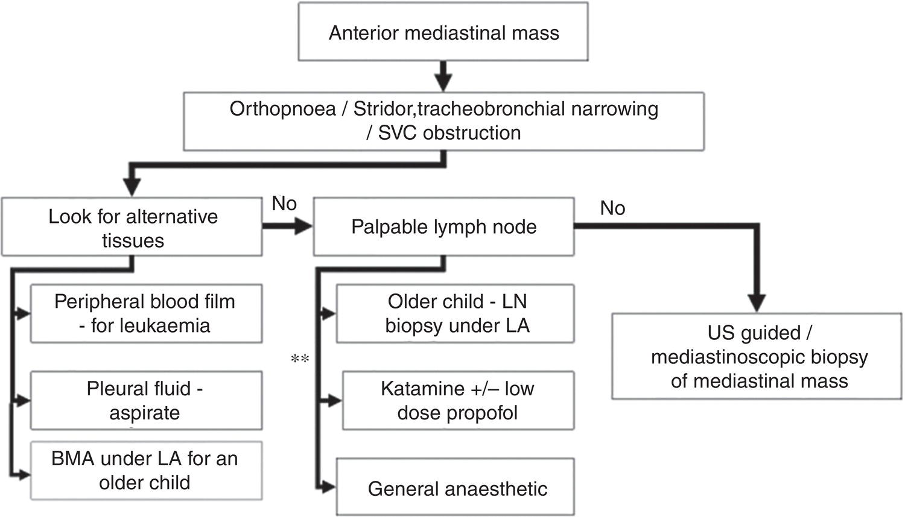

[**Figure 31.36**](#R_c31-fig-0044) Pathway for safe approach for diagnosis of anterior mediastinal mass. Stepwise pathway selecting alternative tissues for diagnosis when available; use of local anesthetic and/or ketamine for peripheral lymph node biopsy, followed by mediastinal access under general anesthesia in very few cases where other options are not feasible.

(Source: Malik et al. \[132\]. Reproduced with permission of Elsevier.)

Catastrophic airway or circulatory complications have been described in case reports of patients with anterior mediastinal masses under anesthesia; however, the mechanism remains uncertain. Case series from major centers have seen respiratory complications occur in about 10–20% of cases anesthetized, but those complications have usually been relatively minor, without long‐term consequences. A number of centers did not anesthetize higher‐risk patients. \[136–138\]

All of these reports emphasize efforts to make the diagnosis by minimally invasive techniques and the fact that local anesthesia and selected sedation and analgesia with spontaneous ventilation will allow most diagnostic procedures to be performed. None of the case series has a report of catastrophic airway or circulatory problems under local anesthesia. In one series, there was one patient (not sedated or anesthetized) who received a brief cardiac massage when their airway became obstructed on lying supine in a CT scanner. The case series data support the concept that masses creating more respiratory obstruction and symptoms are more dangerous. However, there have also been case reports of catastrophic complications both in patients with apparently low‐risk masses and in those receiving what should be low‐risk sedation/analgesia techniques.

One hypothesis for the mechanism of catastrophic obstructive complications is based on the fact that tumor expansion flattens and holds rigid the encased (or partially encased) airways or vascular structures, creating a ribbon‐like cross‐section. The well‐described changes in lung mechanics at induction of general anesthesia include a loss of functional residual capacity based on the diaphragm moving cranially and changes in chest wall muscle tension. It is quite plausible that this change in conformity of the thorax could completely kink the flattened ribbon‐like structures created by tumor compression. This concept has informed practice in selecting anesthesia techniques (preferentially choosing sedation techniques more likely to preserve normal lung mechanics and spontaneous ventilation) for managing these patients and likely accounts for the absence of catastrophic obstruction in series from major institutions.

Anesthesiologists should be aware of the extraordinary rate of expansion of some NHLs. The “doubling time” (average time for a cell division cycle which will double the size of the tumor) may range from as little as 12 hours to a few days. A patient presenting with a mediastinal tumor due to NHL may have very significant disease progression and increased compression of cardiorespiratory structures between the time of initial chest imaging and a subsequent procedure involving anesthesia. This should inform efforts to meticulously review their clinical status for worsening obstructive signs or symptoms, even if they have had reassuring imaging in previous days.

Anesthesiologists should be mindful to avoid the routine use of steroids as antiemetics in these patients. Steroids may cause rapid necrosis of the tumor, which could jeopardize diagnosis, precipitate tumor lysis syndrome, or disturb the current best‐practice protocol for curative treatment, potentially worsening prognosis. Tumor lysis syndrome is caused by rapid necrosis of a large tumor when exposed to therapeutic agents, with systemic absorption of the released intracellular contents. Lethal hyperkalemia and renal failure are the most prominent complications and as such, these patients are intensively monitored and managed for tumor lysis syndrome in oncology protocols. Steroid use in a patient with an unsuspected mediastinal mass has been associated with tumor lysis syndrome leading to death.

### Surgery for anterior mediastinal masses

Open surgery for the removal of an anterior mediastinal mass is not common in children. Non‐lymphomatous tumors and other lesions that cannot be managed medically will, however, likely require surgical resection. The surgical approach will usually be by sternotomy or mediastinoscopy. Mediastinotomy has been used for the biopsy of these lesions, and a technique for doing mediastinotomy with local anesthesia has been described. For some tumors undergoing surgical removal, the use of CPB, although adding complexity and anticoagulation, may allow safer removal of the lesion. Pre‐emptive peripheral (e.g., femoral) CPB or ECMO may be indicated in some cases for planned support of respiration and the circulation prior to formal general anesthesia and intubation in a high‐risk patient. It should be noted that this scenario is different from the use of CPB or ECMO as a rescue for cardiac or respiratory arrest after induction of anesthesia, which is impractical and should not be considered to be a reasonable management strategy, especially in children.

### Anesthesia for patients with an anterior mediastinal mass

Sudden induction of deep general anesthesia in patients with an anterior mediastinal mass may unpredictably cause complete respiratory obstruction or circulatory arrest. Larger symptomatic masses with airway compression are probably at greater risk, but all patients should be treated with caution.

General assessment should occur along with specific history and examination of the patient to assess mass effects and associated conditions. History may reveal dyspnea or stridor, which may be intermittent. A special inquiry should be made as to whether posture affects symptoms. Some patients cannot tolerate lying flat, especially when supine, but may tolerate being prone. Facing one side or another may worsen or improve symptoms. Signs of superior vena cava compression are ominous. These include upper body and facial edema as well as distended, non‐pulsatile, jugular veins. The edema may be worse on waking in the morning and regress with upright posture during the day. Pemberton’s sign, which involves evoking symptoms and signs of SVC obstruction when patients stretch both arms above their head, may reveal lesser degrees of obstruction and should be actively sought.

The postural relationship of symptoms and signs may be very important not only for planning safe positioning during procedures but also for defining possible safer positions into which a patient might be moved should severe obstruction arise. Apart from lateral and prone positioning, it has also been suggested that physically pulling the sternum forward may move the tumor away from the airway or heart and great vessels and may relieve acute compression. The fact that arm and shoulder position may increase pressure on the superior part of the anterior mediastinum may be particularly important in positioning for CT scanning and for some surgeries.

Imaging the chest will provide crucial information. CT scanning is often the technique of choice in symptomatic children, as tolerating the duration and positioning required for an MRI while awake may be impossible. The short time required for CT imaging makes this much more practical, but not without hazard in those children that have difficulty lying flat and putting their arms above their heads, as is usually required for a CT of the chest. A careful review of the CT will outline the degree and extent of compression of the airway, great vessels, and heart. Some CT images are provided showing tracheal, bronchial, and SVC obstruction by tumor. Pleural and pericardial effusions are quite common in these patients, especially those with NHL. Echocardiography will quantify pericardial effusion and should carefully examine the path of the pulmonary arteries, superior vena cava, and right ventricular outflow for obstruction ([Figures 31.37](#c31-fig-0045) and [31.38](#c31-fig-0046)).

Widely quoted criteria for critical airway compression in children with anterior mediastinal mass that contraindicate anesthesia are: (i) a 50% reduction in predicted tracheal diameter on CT scan; (ii) a 50% reduction in peak expiratory flow rate on spirometry; (iii) severe narrowing or complete occlusion of one or both main‐stem bronchi; or (iv) clinical findings of acute respiratory distress or impending respiratory failure. These points are not robustly defined but have been widely adopted. The original series that promulgated these criteria involved no patient with those criteria being anesthetized (so there is no estimate of the hazard of anesthesia in those who fulfill the criteria), and the modest number (17 in the original paper) \[139\] who had anesthesia or sedation in whom there was a lack of serious complications adds to data from similar series, but an unacceptably high incidence of serious complications is likely not to be detected in a series that size. Despite this criticism of the detail of the data, the principles on which this group bases management are very sound. The practical points are that biopsies were performed using local anesthesia in most patients deemed at high risk from general anesthesia. They have since added to the series and refined an algorithm for seeking a diagnosis with the most minimally invasive procedures done first. In a latter series of 40 patients with anterior mediastinal mass who fulfilled their criteria for critical airway compression, only two of the patients had therapy without a tissue diagnosis, and, in that series, only three had general anesthesia \[136\].

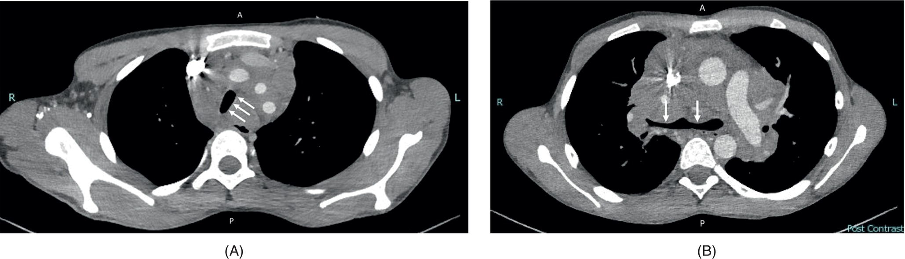

[**Figure 31.37**](#R_c31-fig-0045) Tracheobronchial compression by anterior mediastinal mass. (A) Axial computed tomography (CT) image demonstrating tracheal compression and deviation (arrow). (B) Inferior slice in same patient demonstrating bilateral mainstem bronchial compression by the mass (arrows).

Source: Courtesy of Department of Medical Imaging, The Royal Children’s Hospital, Melbourne.

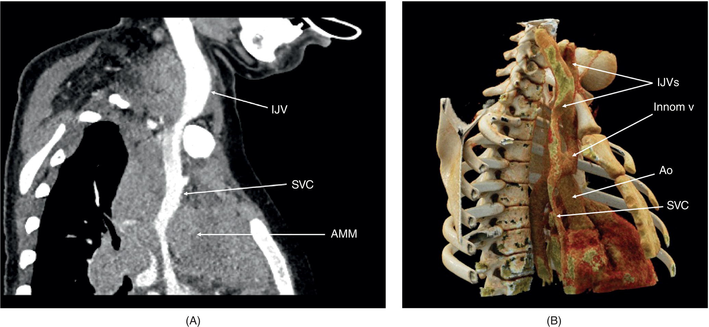

[**Figure 31.38**](#R_c31-fig-0046) Compression of superior vena cava (SVC) by anterior mediastinal mass (AMM). (A) Computed tomography (CT) sagittal curved multi‐planar reconstruction demonstrating significant multilevel obstruction by a tumor, leading to dilation of SVC and internal jugular veins (IJV). (B) Three‐dimensional virtual CT reconstruction showing significant compression of SVC, and dilation of innominate (innom and internal jugular veins.

Source: Courtesy of Department of Medical Imaging, The Royal Children’s Hospital, Melbourne.

Anghelescu et al.’s \[139\] analysis of 117 patients with a mediastinal mass who were anesthetized, with 11 having respiratory complications of anesthesia, showed that these complications were statistically associated with orthopnea, upper body edema, great vessel compression, and main‐stem bronchus compression. Pleural effusion and tracheal compression did not quite reach statistical significance. This group also emphasized the importance of using minimally invasive techniques to make a diagnosis. They modified the anesthesia technique in an attempt to decrease risk, avoiding muscle relaxants and maintaining spontaneous ventilation.

More recently, in an attempt to find a metric that can be used to stratify risk in terms of whether a patient can safely be anesthetized, a group from Japan have recommended using Standardised Tumor Volume, based on calculating the volume of the tumor as if it were an ellipsoid structure and standardizing it for patient height. At this stage, there are no prospective data confirming this new measurement’s utility in stratifying for anesthetic risk \[140\].

Pragmatically, if a patient can tolerate a procedure done with local anesthesia alone, that should be the aim. If systemic agents are required to achieve sedation and analgesia, careful titration aimed at maintaining spontaneous ventilation can avoid most incidents of catastrophic collapse. There are disturbing isolated case reports of cautious techniques still being associated with significant complications, but there are also a large number of case series with careful case selection and modified anesthesia techniques, without serious complication. In association with local anesthesia, various combinations of midazolam, ketamine, and, more recently, dexmedetomidine, perhaps titrated with small boluses and maintained with an infusion, can provide a low risk of major change in conformation of the chest wall and catastrophic cardiorespiratory compression. Spontaneous ventilation and, in many cases, consciousness can be maintained while a procedure is performed. CPAP by face mask may assist with maintaining airway patency during the procedure. Endotracheal intubation is usually avoided. Topical anesthesia to the airway can facilitate intubation in cases where this is required which may assist the maintenance of spontaneous ventilation with modest anesthesia requirements. The addition of opioids if intubation is required can help with the tolerance of the endotracheal tube but can increase the risk of apnea. Very low‐dose infusions (e.g., 2 mg/kg/hour) with small boluses (e.g., 0.2 mg/kg) of propofol may be cautiously introduced for similar indications. The principle is that the minimum necessary degree of sedation/anesthesia should be used and boluses or infusion rate changes should be small and incremental. This will minimize the risk of “overshoot” in the depth of anesthesia, perhaps allowing detection of deterioration before a catastrophe occurs, with a good chance of a rapid return to the depth of sedation/anesthesia that was previously tolerated. Most of these sedation/anesthesia strategies involve agents with effects not well monitored by the proprietary depth of anesthesia monitors.

Emergency equipment and appropriately skilled staff should be immediately available to attempt to reverse a situation of respiratory or cardiovascular obstruction/collapse. This may include a rigid bronchoscope and reinforced endotracheal tubes to overcome a compressed trachea. It is notable that some large masses may cause bilateral bronchial compression, and obstruction at that level will not be overcome by these techniques. As noted above, in rare cases, CPB or ECMO support with femoral cannulation under local anesthesia, occurring before the biopsy procedure, is necessary.

* * *

### KEY POINTS: ANESTHESIA FOR CHILDREN WITH MEDIASTINAL MASSES

-   Anterior mediastinal masses can cause lethal airway or cardiovascular compression with general anesthesia.
-   A multidisciplinary team in a specialist center should receive an urgent referral of patients with a mediastinal mass.
-   Most patients will not require a standard general anesthetic.
-   The most minimally invasive method of obtaining a diagnosis should be attempted prior to contemplating anesthesia.
-   Local anesthesia should be used alone or combined with sedation/analgesia/anesthesia to minimize requirements for systemic agents.
-   CPB or ECMO may have a pre‐emptive role in rare cases of high‐risk mass, where it is initiated after preparation for cannulation is done under local anesthesia, with the patient awake or receiving sedation.

* * *

## Selected references

_A full reference list for this chapter is available at:_

[http://www.wiley.com/go/andropoulos/congenitalheart](http://www.wiley.com/go/andropoulos/congenitalheart)

1.  17 Choi S, Lawlor C, Rahbar R, Jennings R. Diagnosis, classification, and management of pediatric tracheobronchomalacia: a review. JAMA Otolaryngol Head Neck Surg 2019; 145:265–275. An excellent comprehensive review of the diagnostic workup, organization and classification, and surgical planning of conditions leading to tracheobronchomalacia including vascular rings and slings.
2.  25 Backer CL, Kelle AM, Mavroudis C, et al. Tracheal reconstruction in children with unilateral lung agenesis or severe hypoplasia. Ann Thorac Surg 2009; 88:624–31. An excellent explanation of the technique of slide tracheoplasy and tracheal resection and reanastomosis with the use of CPB, with excellent illustrations of the anatomy and surgical procedures.
3.  50 Imamura M, Dossey AM, Jaquiss RD. Reoperation and mechanical circulatory support after repair of anomalous origin of the left coronary artery from the pulmonary artery: a twenty‐year experience. Ann Thorac Surg 2011; 92:167–72. A case series of ALCAPA repairs focusing on requirement for mechanical circulatory support, and short‐ and long‐term outcomes in this challenging group of patients.
4.  61 Burch TM, McGowan FX Jr, Kussman BD, et al. Congenital supravalvular aortic stenosis and sudden death associated with anesthesia: what’s the mystery? Anesth Analg 2008; 107:1848–54. A comprehensive review of the anatomy and pathophysiology of, and surgical and anesthetic approaches to, supravalvular aortic stenosis, with a focus on abnormal coronary artery anatomy and obstruction, which is frequently out of proportion to the degree of aortic stenosis.
5.  68 Kuhn B, Peters J, Marx GR, et al. Etiology, management and outcome of pediatric pericardial effusions. Pediatr Cardiol 2008; 29:90–4. A well‐written review article focusing on all aspects of the etiology, anatomy, pathophysiology, and management of pericardial effusions.
6.  94 Henaine R, Roubertie F, Vergnat M, Ninet J. Valve replacement in children: a challenge for a whole life. Arch Cardiovasc Dis 2012; 105:517–28. A comprehensive modern review article of all valve replacements in children, containing an extensive section on mitral valve replacement: indications, techniques, and outcomes.
7.  104 Gregory SH, Sodhi N, Zoller JK, et al. Anesthetic considerations for the transcatheter management of mitral valve disease. J Cardiothorac Vasc Anesth 2019; 33:796–807. A comprehensive review of anesthetic management considerations for transcatheter treatment of mitral valve disease; this approach serves as a model for congenital heart disease invasive transcatheter valve interventions on mitral and other valves.
8.  114 Niwa K. Aortic dilatation in complex congenital heart disease. Cardiovasc Diagn Ther 2018; 8:725–738. A comtemporary comprehensive review of the many congenital heart diseases that lead to aortic dilation, their diagnosis, management, and surgical treatment.
9.  128 Pepper J, Golesworthy, T, Izgi C, et al. Personalised external aortic root support (PEARS) to stabilise an aortic root aneurysm. Br J Cardiol 2020; 27:87–92. A comprehensive description of a new and novel procedure to stabilize aortic root aneurysms with the goal of preventing futher progression, and minimizing future interventions.
10.  137 Anghelescu DL, Burgoyne LL, Liu T, et al. Clinical and diagnostic imaging findings predict anesthetic complications in children presenting with malignant mediastinal masses Paediatr Anaesth 2007; 17:1090–8. A series of 117 patients with a mediastinal mass who were anesthetized, with 11 having respiratory complications of anesthesia. Complications were statistically associated with orthopnea, upper body edema, great vessel compression, and main‐stem bronchus compression.