CHAPTER 32 Anesthesia for Cardiac and Pulmonary Transplantation 

# CHAPTER 32  
Anesthesia for Cardiac and Pulmonary Transplantation

_Glyn D. Williams1, Chandra Ramamoorthy1, Anshuman Sharma2, and Manchula Navratnam1_

1 Professor of Anesthesiology, Perioperative and Pain Medicine, Department of Anesthesiology, Stanford University School of Medicine, Lucile Packard Children’s Hospital, Stanford, CA, USA

2 Department of Anesthesiology, Perioperative and Pain Medicine, University of California, San Francisco, CA, USA

* * *

-   [**Heart transplantation**](#head-2-309)
    -   [Diagnostic indications for heart transplantation](#head-3-537)
    -   [ABO‐incompatible heart transplantation](#head-3-538)
    -   [Recipient evaluation](#head-3-539)
    -   [Recipient pretransplant management](#head-3-540)
    -   [Donor management](#head-3-541)
    -   [Surgical technique](#head-3-542)
    -   [Anesthetic management](#head-3-543)
    -   [Failing Fontan transplants](#head-3-544)
    -   [Combined heart and liver transplantation](#head-3-545)
    -   [Heart–lung transplantation](#head-3-546)
    -   [Immunosuppression](#head-3-547)
    -   [Anesthetic management of children who have undergone heart transplantation](#head-3-548)
    -   [Future prospects](#head-3-549)
-   [**Pediatric lung transplantation**](#head-2-311)
    -   [Indications, contraindications, and listing criteria in children](#head-3-550)
        -   [Cystic fibrosis](#head-4-358)
    -   [Lung transplant listing criteria](#head-3-551)
    -   [Donor management and lung preservation](#head-3-552)
    -   [Bridge to transplantation](#head-3-553)
    -   [Anesthetic management and surgical approach](#head-3-554)
-   [**Immediate perioperative complications**](#head-2-312)
    -   [Primary graft failure](#head-3-555)
    -   [Physiological changes and growth of the transplanted lungs](#head-3-556)
    -   [Surgical complications](#head-3-557)
    -   [Medical complications](#head-3-558)
-   [**Selected references**](#head-2-313)

* * *

## Heart transplantation

Following the pioneering adult and infant heart transplants of the late 1960s \[1, 2\], cardiac transplantation has evolved into a successful, standard therapy for end‐stage pediatric heart disease. Advances in immunosuppressant therapy, pretransplant recipient optimization, donor organ procurement/preservation techniques, and post‐transplant recipient management have all contributed to improved pediatric outcomes despite increased case complexity \[3\]. The Scientific Registry of the International Society for Heart and Lung Transplantation (ISHLT) is the main source of international multicenter data and captures approximately 75% of worldwide thoracic transplant activity \[3\]. Currently, approximately 500–600 pediatric heart transplants are performed annually across the globe, with 210 pediatric centers reporting data to ISHLT \[3\] ([Figure 32.1](#c32-fig-0001)). Most of the pediatric data are reported from centers in Europe and North America. Centers performing >10 transplants/year perform the majority (nearly 50%) of transplants \[4\] ([Figure 32.2](#c32-fig-0002)).

### Diagnostic indications for heart transplantation

Diagnostic indications for pediatric heart transplantation were updated in 2007 \[5\] and summarized in recent ISHLT annual reports \[4, 6\]. As post‐transplant survival rates and outcomes have improved, the dilemma is no longer whether to transplant, but rather when to do it \[7\]. Premature transplantation results in exposure of the recipient to the hazards of transplantation and immunosuppression. Excessive delay may result in death without transplantation or the development of high‐risk comorbidities, such as renal and liver dysfunction, malnutrition, and elevated pulmonary vascular resistance (PVR). Optimal timing for listing will vary depending on the primary diagnostic indication and anticipated disease progression.

Primary diagnostic indications for heart transplantation are categorized into four main groups, with dilated cardiomyopathy (DCM) and congenital heart disease (CHD) accounting for the majority of pediatric heart transplants ([Table 32.1](#c32-tbl-0001)) \[6\]. Indications for heart transplantation vary with age; the majority of transplants in infants are for CHD, whereas DCM is the leading cause in children >1 year of age \[4, 8\] ([Figure 32.3](#c32-fig-0003)). Indications for heart transplant also vary with geography ([Figure 32.4](#c32-fig-0004)), such that the primary diagnosis in Europe and other countries is DCM. CHD is a more common indication in North America than in Europe, accounting for 43% of heart transplants in North America versus 22% in Europe. Diagnostic indications for heart transplant are important since they are associated with differences in post‐transplant morbidity and mortality. For example, DCM confers a post‐transplant survival advantage compared with CHD across all age groups \[4\].

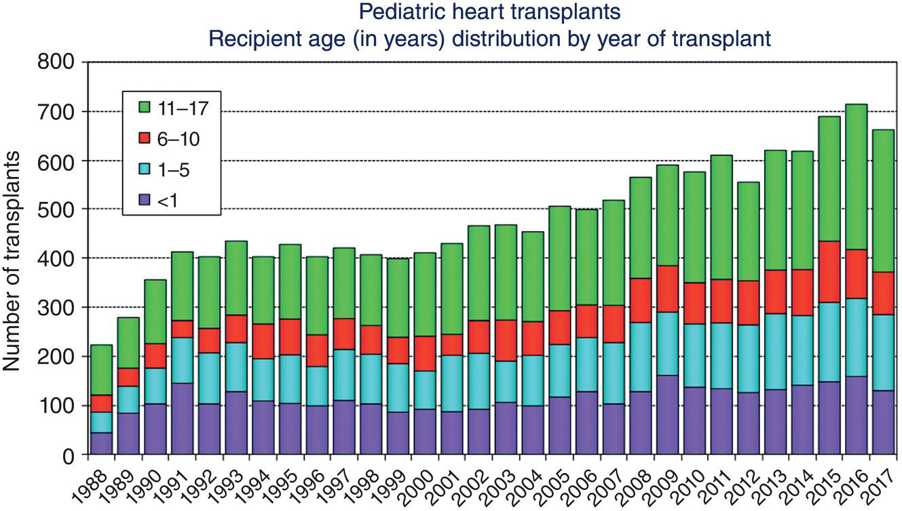

[**Figure 32.1**](#R_c32-fig-0001) Number of pediatric heart transplants performed per year – age distribution by year of transplant. Note that this figure includes only the heart transplants that are reported to the International Society for Heart and Lung Transplantation Transplant Registry.

(Source: Rossano et al. \[4\]. Reproduced with permission of Elsevier.)

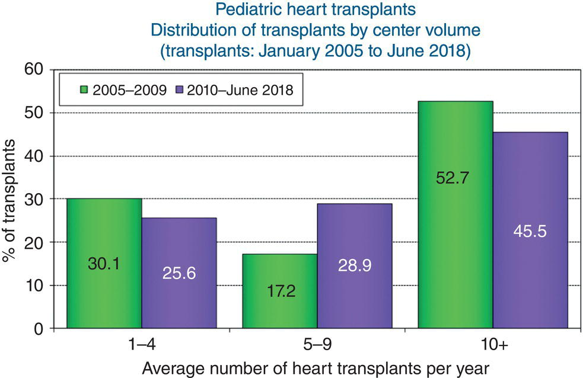

[**Figure 32.2**](#R_c32-fig-0002) Pediatric heart transplants: distribution of heart transplants by center volume.

(Source: Rossano et al. \[4\]. Reproduced with permission of Elsevier.)

Mechanical circulatory support as a bridge to transplant is being increasingly used in children for all diagnostic indications. Approximately 30% of patients are currently bridged to transplant with a ventricular assist device (VAD) and approximately 3–5% with extracorporeal membrane oxygenation (ECMO) \[4\].

[**Table 32.1**](#R_c32-tbl-0001) Primary diagnostic indications for pediatric heart transplants

Source: Rossano et al. \[6\]. Reproduced with permission of Elsevier.

| Category (abbreviation) | Diagnoses in category |
| --- | --- |
| Congenital heart disease (CHD) | Congenital heart defect: HLHS – unoperated; with surgery; without surgery; previous surgery unknown; or valvular heart disease |
| Dilated cardiomyopathy (DCM) | Dilated myopathy due to: adriamycin; alcohol; familial; idiopathic; myocarditis; postpartum; viral; or other reasons |
| Retransplant (RETX) | Retransplant due to: acute rejection; chronic rejection; coronary artery disease; hyperacute rejection; nonspecific; primary failure; restrictive/constrictive causes; or other reasons |
| Other (OTHER) | Arrhythmogenic right ventricular dysplasia; cancer; coronary artery disease; myopathy‐ischemia; hypertrophic cardiomyopathy; muscular dystrophy; restrictive cardiomyopathy (any reason); or other cardiac disease |

HLHS, hypoplastic left heart syndrome.

#### Dilated cardiomyopathy

Almost 40% of children presenting with symptomatic DCM receive a heart transplant or die within 2 years of diagnosis \[8\]. Over 50% of children ≥5 years of age with DCM are bridged to transplant with a VAD \[4\]. _DCMs_ have a diverse spectrum of etiologies and phenotypic manifestations ([Table 32.2](#c32-tbl-0002)). Pediatric myocarditis, a secondary cause of DCM, has a 50–80% chance of resolution within 2 years of diagnosis even when patients present with acute, severe symptomatology \[9, 10\].

#### Congenital heart disease

CHD as a primary indication for heart transplant includes a diverse group of conditions and accounts for 20–60% of pediatric heart transplants depending on age and geographical location ([Figures 32.3](#c32-fig-0003) and [32.4](#c32-fig-0004)). With improved outcomes and widespread adoption of the neonatal stage I palliation, the number of neonates and infants with single ventricle physiology undergoing heart transplant as a primary therapeutic modality has decreased significantly. However, there is an increasing number of patients presenting later in life with failing single ventricle palliation and this subgroup constitutes at least two‐thirds of patients with CHD presenting for heart transplant \[11, 12\]. Failing Fontan patients are a growing cohort presenting for pediatric heart transplant and are discussed in more detail later.

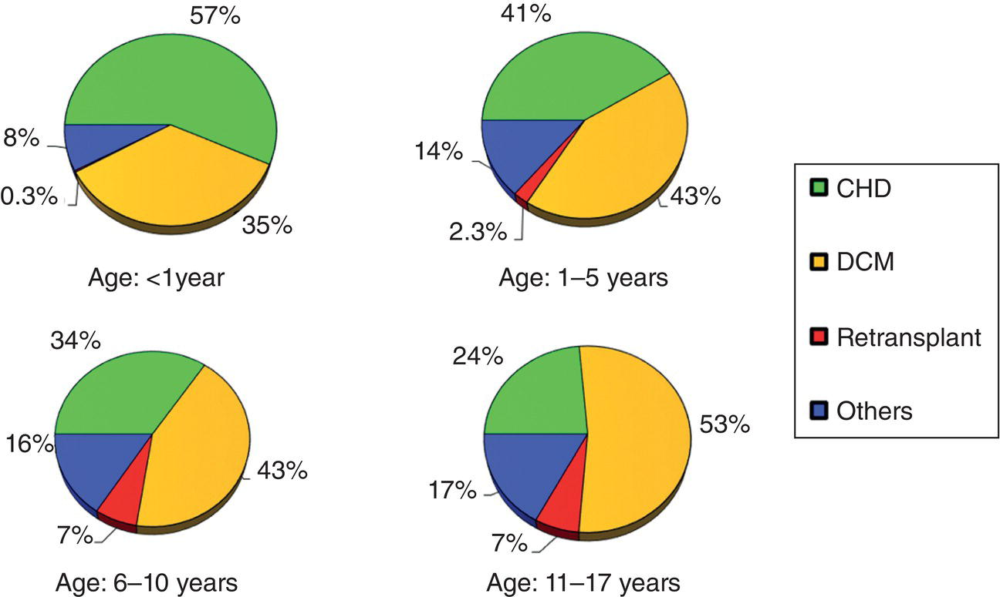

[**Figure 32.3**](#R_c32-fig-0003) Pediatric heart transplants: recipient diagnosis by age, 2010–2018.

(Source: Rossano et al. \[4\]. Reproduced with permission of Elsevier.)

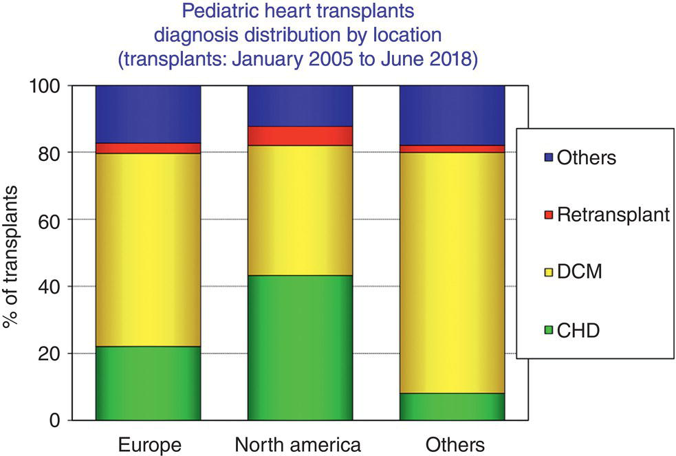

[**Figure 32.4**](#R_c32-fig-0004) Pediatric heart transplants: diagnosis distribution by geography.

(Source: Rossano et al. \[4\]. Reproduced with permission of Elsevier.)

#### Other indications

“Other indications” are primarily due to hypertrophic cardiomyopathies (HCM) and restrictive cardiomyopathies (RCM).

_HCMs_ account for 5–6% of pediatric heart transplants and include several genotypes and etiologies including idiopathic, familial inborn errors of metabolism, and malformation syndromes such Noonan’s and Beckwith–Wiedemann syndromes. \[5\]. HCM is a leading cause of sudden cardiac death in adolescents and young adults. A recent independently validated model for risk of sudden cardiac death in pediatric HCM identified a positive associated with nonsustained ventricular tachycardia and unexplained syncope and a nonlinear association with age at diagnosis, interventricular septal thickness z score, left ventricular (LV) posterior wall diameter z score, and left atrial diameter z score \[13\].

_RCMs_ result in diastolic dysfunction usually with normal ventricular size and function and biatrial enlargement. One‐third of patients have a mixed phenotype of RCM and HCM \[14\]. RCMs are associated with myocardial infiltrative processes, such as amyloidosis, hemochromatosis, glycogen storage disease, mucopolysaccharidosis, sarcoidosis, and endomyocardial fibrosis. Syncope and ischemia indicate a poor prognosis, and elevated PVR is often present. Due to limited medical and surgical treatment options and the risk of irreversible pulmonary hypertension, thromboembolic disease, and sudden death many centers favor an approach of early listing for heart transplant \[5\].

#### Retransplantation

Retransplantation accounts for a small percentage (5–7%) of pediatric heart transplants and is more common in North America (6%) than Europe (2%) \[4, 15\]. Coronary allograft vasculopathy (CAV), the most common indication for retransplantation, is discussed in more detail later. Other indications include acute or chronic rejection and primary graft failure ([Table 32.3](#c32-tbl-0003)). Data indicate that retransplantation for early primary graft failure has a worse prognosis than for late graft failure or CAV \[16–18\]. The best outcomes are associated with those retransplanted for CAV \[15, 18\]. Children with graft failure due to acute rejection with hemodynamic compromise, especially <6 months post‐transplant, are regarded as inappropriate candidates for retransplantation \[18\]. The majority (65%) of pediatric retransplants occur at least 3 years after the primary transplant \[4, 15\]. Retransplantation has a similar 1‐year survival to primary transplants but is associated with decreased long‐term survival and increased transplant‐related morbidities such as renal dysfunction, late rejection, and CAV \[4, 15, 18\].

[**Table 32.2**](#R_c32-tbl-0002) Causes of dilated cardiomyopathy

Source: Lipshultz et al. \[8\]. Reproduced with permission of Wolters Kluwer Health, Inc.

<table border="1"><tbody class="tdcolor3"><tr><td class="justify">Primary DCM</td></tr><tr><td class="justify"> Familial/genetic</td></tr><tr><td class="justify"> Sarcomeric</td></tr><tr><td class="justify"> Mitochondrial diseases</td></tr><tr><td class="justify"> Neuromuscular disorders</td></tr><tr><td class="justify"> Laminopathies</td></tr><tr><td class="justify">Secondary DCM</td></tr><tr><td class="justify"> Inflammatory</td></tr><tr><td class="justify"> Toxins</td></tr><tr><td class="justify">   Iron</td></tr><tr><td class="justify">   Lead</td></tr><tr><td class="justify">   Cobalt</td></tr><tr><td class="justify">   Arsenic</td></tr><tr><td class="justify">   Anthracycline</td></tr><tr><td class="justify">   Radiation</td></tr><tr><td class="justify"> Metabolic disorders</td></tr><tr><td class="justify">   Endocrinopathies</td></tr><tr><td class="justify">     Thyroid disorders</td></tr><tr><td class="justify">     Catecholamine‐secreting tumor</td></tr><tr><td class="justify">     Parathyroid disease</td></tr><tr><td class="justify">     Diabetes mellitus</td></tr><tr><td class="justify">  Fatty acid oxidation disorders</td></tr><tr><td class="justify">    Carnitine deficiency</td></tr><tr><td class="justify">    Malonyl coenzyme decarboxylase deficiency</td></tr><tr><td class="justify">  GSDs</td></tr><tr><td class="justify">    GSD type II (Pompe disease)</td></tr><tr><td class="justify">    GSD type IV (Andersen disease)</td></tr><tr><td class="justify">  Lysosomal storage disorders</td></tr><tr><td class="justify">    Gaucher disease</td></tr><tr><td class="justify">    Mucopolysaccharidoses</td></tr><tr><td class="justify">    Sphingolipidoses</td></tr><tr><td class="justify"> Nutritional disorders</td></tr><tr><td class="justify">   Thiamine deficiency</td></tr><tr><td class="justify">   Selenium deficiency</td></tr><tr><td class="justify">   Protein energy malnutrition</td></tr><tr><td class="justify"> Structural heart diseases</td></tr><tr><td class="justify">   Valvular heart disease</td></tr><tr><td class="justify">   Ischemia: coronary artery anomalies, coronary artery injury</td></tr><tr><td class="justify">   Single ventricle</td></tr><tr><td class="justify"> Pulmonary diseases</td></tr></tbody></table>

DCM, dilated cardiomyopathy; GSD, glycogen storage disease.

[**Table 32.3**](#R_c32-tbl-0003) Indications for cardiac retransplantation

Source: Mahle et al. \[17\]. Reproduced with permission of Elsevier.

|  | No. | % |
| --- | --- | --- |
| Acute rejection | 19 | 9 |
| Hyperacute rejection | 7 | 3 |
| Coronary allograft vasculopathy | 111 | 51 |
| Chronic rejection | 16 | 7 |
| Nonspecific graft failure | 34 | 16 |
| Primary failure | 10 | 5 |
| Other | 22 | 10 |

* * *

### KEY POINTS: HEART TRANSPLANTATION

-   The number performed per year in the United States is limited primarily by donor organ availability.
-   The commonest indication for transplantation in infants is CHD.
-   The commonest indication in older children is cardiomyopathy.
-   Diagnostic indications have an important impact on post‐transplant outcomes.
-   Currently, approximately 30% of recipients are bridged to transplant with a VAD.

* * *

### ABO‐incompatible heart transplantation

Infants listed for heart transplant have the longest waitlist time and a higher waitlist mortality when compared with older children. Infant waitlist mortality in the United States is 25% compared with 15% for children and adolescents \[19, 20\]. An increasing number of centers are adopting ABO‐incompatible (ABO‐I) heart transplants as a standard practice to reduce waitlist mortality in this vulnerable population. Historically donor and recipients are matched for ABO compatibility. ABO‐I heart transplants have been avoided because of the risk of hyperacute rejection that can occur when recipient isohemagglutinins (serum anti‐A or anti‐B antibodies) bind to the corresponding blood group antigens on donor organ vascular endothelium. Organ allocation across blood group barriers increases the donor organ pool available for heart transplantation. Since blood group O‐type recipients have both anti‐A and anti‐B antibodies (isohemagglutinins), only an O‐type donor is compatible and hence they have the longest waitlist time. Isohemagglutinins are not present at birth, and serum antibody titers remain low until 12–14 months of age \[21\]. Young infants also have an immature complement system. Therefore, the mechanisms leading to hyperacute rejection in ABO‐I heart transplant are absent during infancy. This discovery was pioneered in Toronto in 1996 when the first ABO‐I heart transplant was performed \[22\]. With increasing multicenter experience and data, current United Network for Organ Sharing (UNOS) guidelines recommend ABO‐I heart transplant in children under 1 year of age with any isohemagglutinin titer and in 1–2 years with titers less than 1 : 16. In 2016, UNOS also changed its allocation criteria so that patients listed as ABO‐I have equal organ priority to ABO‐compatible (ABO‐C) heart transplants. This has led to an increased number of patients listed and receiving ABO‐I heart transplants. Various registry and multicenter data have shown comparable survival and outcomes for ABO‐I heart transplants compared with ABO‐C heart transplants in infants <1 year and no difference in rates of rejection 1‐year post‐transplant \[23\]. There is consistent data that ABO‐I heart transplants decrease waitlist time, especially in patients with blood group O \[23, 24\].

### Recipient evaluation

A detailed assessment of patients is required to determine their suitability for heart transplantation ([Box 32.1](#c32-fea-0001)). Factors that must be considered include severe central nervous system, liver or kidney dysfunction, pulmonary infarction, pulmonary hypertension, morbid obesity, and some infections, malignancies, or chromosomal abnormalities. Prediction of mortality after transplantation was more accurate when multiple high‐risk criteria were included in the assessment of potential recipients \[25\].

Transplant centers usually have formal meetings to present a structured multidisciplinary evaluation of recipients prior to accepting for heart transplant listing. At Stanford Children’s Hospital, a cardiac anesthesiologist is present at these meetings. Evaluation revolves around four key areas \[5\]:

1.  Comprehensive assessment of cardiovascular system (CVS) anatomy and hemodynamics
2.  Assessment of end‐organ dysfunction and chronic noncardiac disease including nutritional status
3.  Human leukocyte antigen (HLA) sensitization
4.  Psychosocial evaluation of patient and patient’s family

* * *

### [Box 32.1](#R_c32-fea-0001) : Routine precardiac transplant evaluation

**History and physical examination**

-   Age, height, weight, body surface area
-   Diagnoses
-   Past medical history
-   Medications
-   Allergies
-   Immunization record

**Laboratory data**

-   Liver and kidney function tests
-   Urine analysis
-   Glomerular filtration rate
-   Prothrombin time/INR/partial thromboplastin time
-   Complete blood count and differential
-   PPD skin test
-   Serologies for human immunodeficiency virus, hepatitis, cytomegalovirus, Epstein–Barr virus, _Toxoplasmosis gondii_, syphilis
-   ABO type
-   Panel‐reactive antibody

**Cardiomyopathy workup**

-   Thyroid function tests
-   Blood lactate, pyruvate, ammonia, acyl carnitine
-   Urine organic acids, acyl carnitine
-   Skeletal muscle biopsy
-   Karyotype

**Cardiopulmonary data**

-   Cardiac catheterization
-   Echocardiogram
-   Radionuclide angiography
-   Endomyocardial biopsy
-   Electrocardiogram
-   Chest radiograph
-   Pulmonary function tests
-   VO2max

**Psychosocial evaluation**

-   Possible relocation
-   Long‐term supportive care
-   Parental substance abuse
-   History of neglect or abuse

**Consultations as required**

-   Dental services
-   Other services

It may be necessary to repeat some tests if the patient's medical status changes over time. INR, international normalized ratio; PPD, purified protein derivative.

Source: Adapted from Shaddy and Parisi \[8\].

* * *

#### CVS anatomy and hemodynamics

Assessment of cardiopulmonary function usually includes cardiac catheterization and magnetic resonance imaging (MRI) or computed tomography (CT) to delineate the vascular connections, particularly in patients previously palliated for complex heart disease. Abnormal cardiovascular anatomy influences surgical technique during harvesting and transplantation. For example, a patient with palliated hypoplastic left heart syndrome and residual arch obstruction may require extra donor arch material during donor harvesting, or a Fontan patient with branch proximal pulmonary artery (PA) stenosis may need PA reconstruction during transplantation. Identifying anomalous systemic or pulmonary venous return, PA malformations, and accessory collateral pulmonary blood flow is also important for the surgical procedure \[5\].

Quantifying PVR prior to listing is important because PVR > 6 Wood Units/m2 or a transpulmonary gradient >15 mmHg is associated with acute right heart failure and increased mortality \[26, 27\]. The upper limit of PVR associated with successful cardiac transplantation has not been established in children. All patients with pulmonary hypertension have PVR measured at baseline conditions and during administration of oxygen, nitric oxide (NO), and/or other pulmonary vasodilator therapy. When the response is marginal, repeat values after 1–2 weeks of inotropic support, afterload reduction, and pulmonary vasodilation may demonstrate improvement. Experienced institutions may accept children with PVR as high as 8–12 Wood Units/m2 if it is reactive. Patients whose PVR does not respond to therapy may be the candidates for heart–lung transplantation (HLT) or lung transplantation. Children with RCM are particularly prone to marked elevation of PVR, which may contribute to the poor prognosis in these patients and make cardiac transplantation problematic. Nitric oxide appears to be a good agent to demonstrate reversibility of PVR in these patients \[26\]. PVR also improves after left ventricular assist device (LVAD) implant, especially for patients with DCM and left atrial hypertension \[28\]. Endomyocardial biopsy may be required prior to listing for dilated cardiomyopathies to identify acute myocarditis and myocardial infiltrates. A diagnosis of acute myocarditis is important in determining suitability for transplant listing since there is chance of resolution as mentioned earlier \[9, 10\].

#### End‐organ dysfunction/chronic noncardiac disease

Pretransplant end‐organ dysfunction and chronic noncardiac disease have an impact on post‐transplant morbidity and mortality. Assessing the degree of pretransplant renal dysfunction is important because reduced estimated glomerular filtration rate (eGFR) and pretransplant renal dialysis are associated with increased 1‐, 5‐, and 10‐year mortality \[4, 29\]. Some centers will treat moderate‐severe renal dysfunction with a combined heart kidney transplant.

Assessing liver function is also important especially in failing Fontan patients. Elevated serum bilirubin is a continuous risk factor for 1‐year mortality post‐transplant \[12, 29\]. There is an increasing trend of treating irreversible liver disease with a combined heart–liver transplant (CHLT) and is discussed in more detail later.

Assessing the degree of chronic lung disease especially in older children with CHD is important and will include pulmonology assessment and pulmonary function tests. Evaluation of patients with cardiomyopathy should include a metabolic workup to detect potential etiologies such as mitochondrial disorders and genetic studies. Transplant teams are also intensifying attention on the pretransplant nutritional status of the recipient since this may have a significant impact on postoperative hemostasis, wound healing, and recovery.

#### HLA sensitization and immune function

Infectious disease and immune system evaluation are essential. The child’s immunization status should be updated if necessary. Tests are performed for latent infections, such as cytomegalovirus or Epstein–Barr virus, that may become clinically significant during immunosuppression. Donor matching is based on ABO typing. The candidate’s blood is also screened for antibodies against sera of random blood donors and, if reactive, a serum crossmatch with the donor is performed.

There is an increased risk for graft dysfunction, acute cellular and antibody‐mediated allograft rejection, and chronic rejection/CAV after heart transplantation in patients sensitized to HLAs. The number of heart transplant candidates allosensitized to HLA antigens has increased in recent years because of exposure to blood products, homograft material used in surgical palliation of CHD, use of ventricular assist and mechanical support devices, and patients requiring retransplantation. Determinations of panel‐reactive antibody (PRA) are done to delineate a patient’s potential for sensitization to donor HLA antigens. Patients with a reaction to >10% of antigens (either class I or II) are generally considered to be allosensitized. However, this is allosensitivity to a “random” donor; having a positive crossmatch with the _actual_ donor (HLA antibody toward donor alloantigens) at the time of transplant has been clearly demonstrated to increase the risk for poor outcome after transplant. Donor‐directed HLA antibodies are associated with rejection‐related mortality from cellular and antibody‐mediated acute rejection and CAV. Patients with PRA >10% pretransplant and a positive crossmatch are at high risk for graft loss from hyperacute rejection and early acute cellular rejection (ACR), which in turn increase the risk of CAV.

Allosensitized patients may be excluded from heart transplant, restricted to certain donors, or experience prolonged waiting times. Some transplant programs require a prospective negative donor‐specific crossmatch for patients with PRA screens >10%. However, this approach is problematic because of the donor shortage and some patients have antibodies to many HLAs. Therefore, perioperative management protocols for HLA‐sensitized children have been developed and include pretreatment of sensitized patients (using treatments such as intravenous immune globulin, cyclophosphamide, mycophenolate mofetil \[MMF\], and rituximab), intraoperative plasma exchange, post‐transplant plasmapheresis, and T‐ and B‐cell suppression \[30–34\].

#### Psychosocial evaluation of patient and patient’s family

Heart transplantation requires long‐term immunosuppression, frequent invasive procedures, and lifelong medical care. Patients must live close to the hospital during the initial months after surgery, and temporary relocation of the family may be necessary. Prolonged periods of stressful hospitalization are likely. A stable social situation is essential for success, and psychosocial evaluation is an important aspect of the pretransplantation process.

* * *

### KEY POINTS: HEART TRANSPLANT RECIPIENT EVALUATION

-   Accurate delineation of the cardiovascular anatomy is required for patients with CHD to plan surgical strategies for harvesting and transplantation.
-   Increased PVR is associated with increased mortality after transplantation.
-   The PRA test reflects a patient’s potential for sensitization to donor HLAs.
-   PRA >10% increases the risk of graft loss and is present in about 27% of pediatric recipients.

* * *

#### UNOS waitlist status and mortality

Organ transplantation in the United States is sanctioned by congressional mandate through the National Organ Transplant Act (NOTA). An Organ Procurement and Transplant Network (OPTN) was created and is administered by the UNOS. UNOS has three recipient status categories for patients listed for heart transplantation: status IA, status IB, and status II, with status IA indicating the sickest patients who are in urgent need of transplantation for survival. Status seven patients are those previously listed as status IA, status IB, or status II, but considered temporarily unsuitable to receive a heart transplant, e.g. due to active infection.

Current waitlist mortality ranges from 17 to 30% depending on country and institution. Waitlist mortality also varies with transplant center volume, with a reported 5% mortality in large volume centers compared to 30% in small volume centers \[35\]. Waitlist mortality is also influenced by patient factors such as age, CHD, weight <3 kg, status 1A, the need for ECMO, and renal dialysis \[36, 37\]. Increased adoption of VADs and improved pretransplant recipient support has helped to decrease waitlist mortality over time \[38\].

### Recipient pretransplant management

The median waiting period from heart transplant listing to actual surgery currently varies between 60 and 80 days, depending on the child's age, blood group, and list status \[39\].

Aggressive medical management to achieve stabilization is required and includes supplemental oxygen, diuretics, inotropic support (e.g., dobutamine, dopamine, phosphodiesterase inhibitors), antiarrhythmia therapy, and mechanical ventilation. Children with chronic heart failure often receive digoxin, diuretics including spironolactone, angiotensin‐converting enzyme inhibitors, and β‐blockade therapy (e.g., metoprolol, carvedilol). Patients with severe LV dilation may need anticoagulation, usually coumadin or heparin, to prevent the development of intracardiac thrombi and systemic embolization. Amiodarone is often chosen for treating arrhythmia. Implantable transvenous defibrillators and, more recently, transcutaneous defibrillators have been effective in pediatric patients large enough for these devices. For patients unsuitable for implantable defibrillators either due to patient anatomy or physiology, Life Vest® (Zoll Medical Corp., Pittsburgh, PA, USA) wearable external cardioverter‐defibrillator (ICD) therapy can be a short‐term option to enable home discharge while waiting for transplant. Biventricular pacing is an emerging modality to improve myocardial function.

Patients with refractory myocardial failure require mechanical circulatory support as a bridge to cardiac transplantation. Approximately one‐third of patients with LVADs have right ventricular dysfunction. Medical support and protection of the right ventricle should be considered during anesthesia induction, maintenance, and surgical dissection. Perioperative management algorithms for VAD‐supported patients are delineated in a recent comprehensive review \[40\]. Extracorporeal life support and other mechanical devices as a bridge to transplant are discussed in [Chapters 36](c36.xhtml) and [37](c37.xhtml).

Pediatric transplant centers are developing pretransplant management strategies that target modifiable risk factors to reduce post‐transplant morbidity and mortality \[41\]. For example, at Stanford Children's Hospital, identification of perioperative acute kidney injury (AKI) as a risk factor for post‐transplant morbidity and mortality especially in the CHD population led to the development of a perioperative renal‐protective protocol.

### Donor management

In the United States and many other countries, solid organs can be obtained for transplantation by donation after brain death (DBD) or by donation after cardiac death (DCD) \[42\]. DBD criteria were first established in 1968; prior to this, organs were obtained from DCD, including the first heart transplant. Although DBD soon became the standard for organ procurement, scarcity of available organs led to a reexamination of DCD. During DCD, the goal is to initiate organ procurement as soon as possible after ensuring that death from cardiorespiratory arrest has truly occurred, because viability of the donor organ becomes compromised when the warm ischemic time is prolonged. A North American multidisciplinary panel recently concluded that “Death can be declared after the cessation of circulation and respiratory function for 2 minutes” \[43\]. Despite DCD being legal and with recipient outcomes that are favorable, ethical issues still surround DCD, and DBD currently remains the primary source of organs \[44\].

The age distribution of pediatric heart donors is similar to that of heart recipients \[3\]. Echocardiography is useful for assessment of donor heart function. Widespread malignancy or infection in the prospective donor is an exclusion criterion, but cardiac resuscitation and chest trauma are not contraindications, provided the donor's hemodynamics have been stabilized and inotropic agents are no longer needed or are at minimal doses. Assessing potential donor organs involves evaluating immunocompatability, donor risk factors, travel time, recipient pulmonary hypertension, and donor–recipient size match. In contrast to adult heart transplant, sex mismatch has not been found to significantly affect outcomes \[45\]. Attempts to limit donor heart ischemia time are important but may be hampered by transport issues.

Donor (allograft) ischemic time is defined as time between donor aortic cross‐clamp during organ procurement surgery and donor coronary artery reperfusion during heart transplant surgery \[46\]. The median donor ischemic time for the current era is 3.5–3.7 hours \[46\]. Donor ischemic time >4 hours is associated with increased 30‐day, 1‐year, and 5‐year mortality \[3, 46\]. Conversely, donor ischemic time has not been shown to be associated with major post‐transplant morbidity such as CAV or renal dysfunction. Some centers may opt to accept longer donor ischemic times for patients with a high risk of waitlist mortality. At Stanford children's Hospital, our standard strategy is to reperfuse the donor heart for a minimum of one‐third the ischemic time prior to cardiopulmonary bypass (CPB) separation.

The anesthetic management of a pediatric organ donor is beyond the scope of this chapter \[47, 48\].

#### Developments in donor–recipient size matching

Donor–recipient size matching has important consequences for both organ allocation and post‐transplant outcomes for pediatric heart transplantation. Undersized cardiac allografts have the risk of not being able to provide sufficient cardiac output (CO), and oversized allografts confer a risk of compressing neighboring structures such as lungs and subsequent physiological effects \[49\]. Recent publications have also questioned the approach of using oversized donors for patients with pulmonary hypertension \[50\]. Approximately 20% of potential pediatric donor allografts without marginal/high‐risk characteristics are not used \[51\]. Innovative techniques to improve donor organ utilization have the potential to reduce pediatric waitlist mortality. Historically, standard clinical practice has been to use donor–recipient body weight ratio (DRBW) and donor–recipient height ratios for allograft size matching. At the time of listing transplant, institutions will define a lower and upper weight limits that they are willing to accept for their patient. A typical range would be 80–160% of recipient body weight. Estimating size match eligibility using traditional measurements such as weight and height assumes a predictable correlation with total cardiac volume. Total cardiac volume, however, may not always correlate with somatic growth. For example, children with advanced heart failure may have a lower than predicted body weight because of failure to thrive or a higher body weight due to fluid overload. Body weight is also an inaccurate correlate of heart size in patients with CHD or RCM where the heart size is often smaller and in patients with dilated cardiomyopathies and cardiomegaly. Heart size matching based on weight also does not account for the complexities of implantation in patients with heterotaxy and cardiac malposition. Waitlist mortality and allograft shortages have led clinical transplant programs to widen their acceptable DRBW to increase the donor pool. Innovative approaches to performing virtual heart transplant fit assessments include using allograft total cardiac volume prediction models and advanced donor imaging such as CT and MRI for a direct virtual transplant assessment \[52–54\]. Adoption, development, and standardization of these alternative approaches may improve organ utilization.

[**Figure 32.5**](#R_c32-fig-0005) “Bicaval” cardiac transplantation. (A) The recipient cardiactomy has been completed. Note the entire recipient right atrium has been removed. (B) The completed implant. The sequence of anastomoses is (i) left atrial, (ii) aortic (cross‐clamp removed and heart perfused), (iii) inferior vena cava, (iv) pulmonary artery, and (v) superior vena cava.

(Source: Backer et al \[56\]. Reproduced with permission of Taylor & Francis.)

### Surgical technique

Orthotopic heart transplants whereby the recipient heart is excised and replaced in the correct anatomical position by the donor heart is the standard surgical approach. The biatrial anastomoses originally described by Lower and Shumway \[55\] has now been abandoned in most centers and replaced by the bicaval left atrial cuff technique – the current standard approach for pediatric heart transplant. A small cuff of recipient left atrial tissue is left in place, incorporating all pulmonary veins, and the entire right atrium of the recipient is removed. Standard implantation of the donor heart involves five anastomoses – left atrial cuff, aorta, inferior vena cava (IVC), superior vena cava (SVC) (bicaval anastomoses), and main PA. Surgeons will vary with regard to the order of anastomoses. Two golden rules that apply for all implantations are that the left atrial anastomosis is performed first, and once the left atrial anastomoses and aortic anastomoses are completed, the aortic cross‐clamp can be removed and donor heart reperfusion commenced ([Figure 32.5](#c32-fig-0005)) \[57\]. A meta‐analysis found superiority of the bicaval technique in comparison with the biatrial procedure for early atrial pressure, perioperative mortality, tricuspid valve regurgitation, and sinus rhythm \[58\], although others found no difference in long‐term survival \[59\].

Cardiac transplantation for children with CHD can involve more complex anastomoses and vascular reconstruction such as branch PA reconstruction and aortic arch reconstructions for recipients with palliated single ventricle physiology. Deep hypothermic circulatory arrest may be employed in patients requiring extensive vascular reconstruction.

### Anesthetic management

#### Pre‐CPB period

##### _Multidisciplinary preoperative huddle and planning_

Children listed for heart transplantation have limited physiological reserves. Even minor changes induced by anesthesia, and surgery can trigger cardiovascular instability and decompensation. Prior to surgery, young infants and children with decompensated heart failure may already be in intensive care with invasive lines and inotropic and respiratory support. More stable patients may be admitted from home at the time of donor acceptance and could have eaten recently. Several hours usually elapse before surgery, but therapy to modify gastric pH and volume and the application of continuous cricoid pressure during induction might be required. Up to 30% of pediatric heart transplants are bridged with a VAD and may be either inpatient or outpatient and will be on some form of anticoagulation and antiplatelet therapy \[60\]. Communication between the transplant surgeons, anesthesiologists, operating room staff, and donor procurement team is vital to coordinating care and ensuring allograft ischemia time is minimized. At Stanford Children's Hospital, we hold a preoperative “huddle” attended by the heart failure and transplant teams, intensive care team, the surgeon, anesthesiologists, and perfusionists. At this meeting, donor‐ and recipient‐specific issues are addressed, including allosensitization and plasmapheresis, vascular access, invasive monitoring lines, emergency cannulation techniques, immunosuppressants, including steroids, and the need for urgent reversal of anticoagulation such as warfarin reversal with a prothrombin complex concentrate \[60\]. We also discuss renal risk stratification and employ renal‐protective strategies for patients with a moderate‐high risk of postoperative AKI. Stanford Children’s renal‐protective protocols involve risk stratification of patients for risk of AKI, maintaining adequate renal perfusion through blood pressure management, fluid management, and reducing central venous congestion, pharmacoprophylaxis with pre‐, intra‐, and postoperative aminophylline and a modified induction protocol to avoid highly nephrotoxic medications in the immediate postoperative period. As part of the huddle, we discuss a patient‐specific “flight plan,” which addresses all relevant patient specific perioperative issues and is documented in the electronic medical record ([Figure 32.6](#c32-fig-0006)).

#### Anesthesia induction and monitoring

Premedication and the method of anesthesia induction depend upon the patient's age, cardiac lesion, and cardiopulmonary function. Establishing invasive hemodynamic monitoring prior to induction of anesthesia may not always be feasible and so it is imperative to institute noninvasive patient monitoring prior to the administration of medications that alter hemodynamic and/or respiratory function. Focused transthoracic echocardiography (TTE) may have a role in patients where preinduction arterial lines may not be an option. Qualitative assessment of cardiac function in patients with severely reduced function and septal configuration in patients with pulmonary hypertension can be monitored with a parasternal short‐axis view. Anesthesia‐ or surgery‐induced changes in heart rate (HR), preload, afterload, or contractility can precipitate hemodynamic decompensation. Meticulous airway management is vital as hypoxia and hypercarbia aggravate PVR and can further depress CO and high intrathoracic pressures may trigger right ventricular decompensation. Rapid sequence induction may be poorly tolerated in patients with minimal cardiorespiratory reserve. Significant ascites in patients with hepatic dysfunction (e.g. failing Fontan) may necessitate controlled peritoneal drainage peri‐induction. A wide variety of anesthetic agents have been used successfully. The desirable and detrimental cardiovascular effects of anesthetic agents are reviewed in [Chapter 10](c10.xhtml). In children with CHD, a fentanyl/midazolam/muscle relaxant anesthetic technique was reported to preserve cardiac index better than volatile agents, provided HR was maintained \[61\]. Etomidate has minimal effect on hemodynamics and is a useful induction agent in patients with limited cardiovascular reserve. Propofol decreases systemic vascular resistance and reduces preload to the heart, and a bolus should be used with caution if at all. Nitrous oxide has myocardial depressant and pulmonary vasoconstrictor properties and is best avoided. Ketamine supports the circulation by indirectly stimulating catecholamine release. This may be blunted in children with DCM and impaired β‐agonist responses, or in patients who are on chronic infusions of β‐adrenergic agonists. When the patient's endogenous catecholamine stores are depleted, the drug's direct myocardial depressant effects may then predominate. Regardless of the agent used, hypotension must be anticipated and treated promptly to preserve coronary perfusion. Commencing a low‐dose inotrope infusion (e.g. epinephrine 0.01–0.03 mcg/kg/min) prior to induction of general anesthesia provided there are no significant arrhythmias may help avoid hypotension and preserve coronary perfusion. Recent excellent reviews describe the anesthetic management of children in the operating room \[62, 63\]. A trigger‐free anesthetic should be considered for patients with neuromuscular disease such as Duchenne or Becker muscular dystrophy to reduce the risk of malignant hyperthermia like symptoms or anesthesia‐induced rhabdomyolysis.

Monitoring during transplantation surgery does not differ from that used for pediatric open‐heart surgery. Large‐bore vascular access and a rapid infuser device should be available for patients undergoing repeat sternotomy and those on preoperative mechanical circulatory support. Patients with pacemakers or ICDs should have their devices reprogrammed prior to the use of surgical diathermy. TEE is useful for evaluation of intracardiac air, transplanted heart anatomy and function, vascular anastomoses, mural thrombus, and early post‐transplant cardiac function. When PA pressure monitoring is indicated, some institutions prefer to place a catheter directly into the PA rather than use a percutaneous balloon‐tipped PA catheter. Due to the increased risk of perioperative bleeding in patients with CHD, repeat sternotomy and those on mechanical circulatory support prophylactic anti‐fibrinolytics are a useful adjunct.

#### CPB period

The management on CPB is similar to that in children undergoing cardiac surgery. Ultrafiltration during CPB may benefit the patient by removing excess free water, hemoconcentrating red cells and coagulation factors, and modulating the inflammatory response. Variations in ultrafiltration techniques are institution dependent.

#### Post‐CPB period

Issues of concern include denervated donor heart, global ischemia–reperfusion injury, elevated PVR, right ventricular dysfunction, arrhythmia, hemostasis, and hyperacute rejection.

The transplanted heart is functionally denervated and may have an abnormal response to sympathetic stimulation. Resting HR may be higher than normal because of absent vagal tone. The normal beat‐to‐beat variations in response to respiration are lost, as are the normal responses of the heart to alterations in body position and carotid body massage. The donor heart cannot abruptly increase HR and CO in response to stress because the baroreceptor reflex is disrupted, and patients are dependent on circulating catecholamines. With the loss of the baroreceptor reflex, the patient with the denervated heart may initially show an exaggerated response to hypovolemia with a marked decrease in mean blood pressure and then a delayed exaggerated hypertensive and tachycardia response, due to endogenous catecholamine release. The Frank–Starling (pressure–volume) relationship remains intact and compensates for hypovolemia and hypotension by increasing stroke volume secondary to an increased venous return. Therefore, it is important to maintain adequate preload, especially if vasodilators are administered. Innervation of the peripheral vasculature is preserved, and changes in peripheral vascular resistance may still occur in response to alterations in sympathetic outflow from the vasomotor center due to signals from stretch receptors in the great vessels.

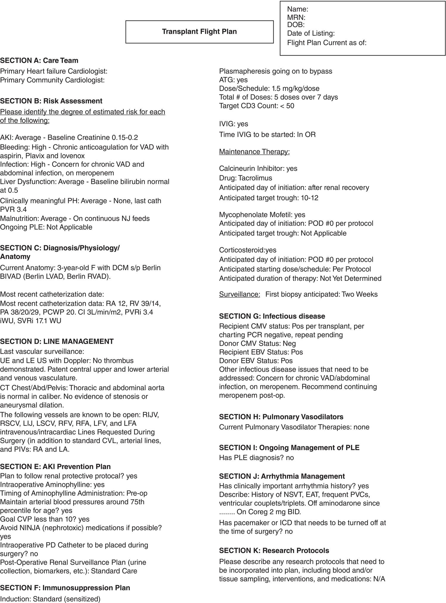

[**Figure 32.6**](#R_c32-fig-0006) Example of Stanford Children’s Hospital pediatric cardiac transplant flight plan. MRN, medical record number; DOB, date of birth; VAD, ventricular assist device; PH, pulmonary hypertension; PVR, pulmonary vascular resistance; NJ, nasojejunal; PLE, protein‐losing enteropathy; F, female; DCM, dilated cardiomyopathy; BIVAD, biventricular assist device; RVAD, right ventricular assist device; LVAD, left ventricular assist device; RA, right atrial pressure; RV, right ventricular pressure; PA, pulmonary artery; PCWP, pulmonary capillary wedge pressure; CI, cardiac index; PVRi, PVR indexed to body mass index; SVRi, systemic vascular resistance indexed to body mass index; WU, Woods Units, UE, upper extremity; LE lower extremity; US, ultrasound; CT, computed tomography; Abd, abdomen; RIJV, right internal jugular vein; RSCV, right subclavian vein; LIJ, left internal jugular vein; LSCV, left subclavian vein; RFV, right femoral vein; RFA, right femoral artery; LFV, left femoral vein; LFA, left femoral artery; CVL, central venous line; PIV, peripheral intravenous line; RA, right atrial; LA left atrial; AKI, acute kidney injury; CVP, central venous pressure; NINJA, nephrotoxic injury negated by just‐in‐time action; PD, peritoneal dialysis; ATG, antithymocyte globulin; CD3, CD3 T cells; IVIG, intravenous immunoglobulin; CMV, cytomegalovirus; PCR, polymerase chain reaction; EBV, Epstein–Barr virus; NSVT, nonsustained ventricular tachycardia; EAT, ectopic atrial tachycardia; PVC, premature ventricular contractions; Coreg; carvedilol; ICD, implantable cardioverter‐defibrillator.

Drugs such as atropine, glycopyrrolate, neostigmine, and pancuronium that act on the heart through vagal or sympathetic neuromechanisms usually will not affect HR. However, there are case reports of profound bradycardia and hypotension following glycopyrrolate–neostigmine administration \[64, 65\]. α‐ and β‐Adrenergic receptors remain intact, and inotropes such as epinephrine and isoproterenol will cause appropriate responses from the heart.

The donor organ is subjected to ischemia–reperfusion injury, and patients usually require inotropic support for separation from CPB. LV diastolic dysfunction is common and characterized by a restrictive ventricular filling pattern, with a reduced preload reserve and a relatively fixed stroke volume. Sinoatrial node dysfunction is relatively common. Dopamine, epinephrine, or isoproterenol is often selected, and epicardial temporary pacing can be instituted if necessary to achieve the desired HR. Arrhythmias are quite common in the early postoperative period, usually premature atrial or premature ventricular contractions. Compression of intrathoracic structures may be problematic during closure of sternotomy, particularly if the donor heart is relatively oversized \[66\].

It is important to preserve donor right ventricular function by keeping PVR low normal. Catecholamine release is reduced by ensuring the patient remains adequately anesthetized. Ventilation is facilitated by muscle relaxants, and normocarbia is maintained. Elevations in central venous pressure with low or normal left atrial pressure and reduced mean arterial pressure might be related to right ventricular failure. Elevated PA pressures can be detected by echocardiography and measured invasively. Additional measures to control PVR may be necessary, including pulmonary vasodilator therapy such as NO \[67\], prostacyclin, phosphodiesterase inhibitors, and isoproterenol. At Stanford Children's Hospital, we routinely separate from CPB with inhaled nitric oxide (iNO) 20 ppm, dopamine, epinephrine, and milrinone infusions following pediatric heart transplants.

More extreme hypocapnia may help, but also causes cerebral vasoconstriction and leftward shift of the oxygen dissociation curve. Cerebral oximetry monitoring using near‐infrared spectroscopy is helpful. If the patient's CO remains inadequate despite maximal drug therapy, mechanical right ventricular assist or ECMO may be employed \[68\].

Blood loss during heart transplantation can be considerable and is associated with increased morbidity and mortality. Blood products are cytomegalovirus‐matched, leukoreduced, and irradiated, but coagulation management is no different from that for other open‐heart surgeries in children (see [Chapter 16](c16.xhtml)). For infants, some centers wash packed red blood cells to reduce the potassium load. Citrate‐induced hypocalcemia impairs contractility and coagulation; this may be minimized by initiating a calcium infusion (calcium chloride 10–30 mg/kg/hour). Rapid platelet transfusion may aggravate PVR. Patients on preoperative mechanical circulatory support often have an acquired von Willebrand deficiency, and cryoprecipitate can be a useful adjunct to help achieve hemostasis \[69\]. A multimodal approach to hemostasis management should be employed and there is an increasing trend for centers to use prothrombin complex concentrates to achieve perioperative hemostasis \[60, 70\].

Intraoperative immunosuppression regimens are institution specific. At Stanford, this is discussed during the preprocedural huddle and the medications are ordered by the transplant team to arrive in the operating room with the patient.

* * *

### KEY POINTS: HEART TRANSPLANT: PERIOPERATIVE MANAGEMENT

-   Patients with end‐stage heart failure often require anticoagulants and antiarrhythmia therapy.
-   Satisfactory transplantation outcomes require excellent communication and collaboration between the multiple disciplines involved in perioperative care.
-   Many transplant candidates have minimal cardiopulmonary reserve and may decompensate during anesthesia induction.
    -   17–30% of listed children die while waiting for a donor heart, with infants having the highest waitlist mortality.
    -   Increased use of VADs has helped to reduce waitlist mortality.
    -   Failing Fontans are an increasing cohort of pediatric heart transplants.
-   Postoperative morbidity is directly related to the number of blood products transfused.

* * *

### Failing Fontan transplants

In North America, a growing cohort of pediatric heart transplants are for failing single ventricle palliation. Failing single ventricle physiology accounted for 36% of CHD transplants in the early era (1990–2002) compared to 67% in the more recent era (2006–2017) \[11, 12\]. Most of the single ventricle transplants are for failing Fontans, followed by the failing Glenn stage \[71\]. Transplantation after stage 1 palliation is relatively uncommon \[71\].

Failing Fontan patients may be listed for heart transplant for several different reasons, including ventricular systolic or diastolic dysfunction, atrioventricular valve regurgitation, atrial or ventricular arrhythmias, high Fontan pressures and venous congestion, lymphatic failure such as plastic bronchitis or protein‐losing enteropathy (PLE), and hepatic or renal dysfunction. Because of this heterogeneous and often‐slowly progressive nature of Fontan failure, there are no clear consensus guidelines for optimal timing for heart transplant listing. Fontan heart transplants represent a high‐risk cohort with increased CPB times, increased donor ischemic times, and increased bleeding risk \[71, 72\]. Early era multicenter registry studies and single‐center studies reported that Fontan patients had decreased early survival after heart transplant when compared with other forms of CHD and cardiomyopathies. In the current era, expected survival after heart transplant for Fontan patients is comparable to other CHD patients \[41\]. This is a reflection in improved overall survival for pediatric heart transplantation despite increased case complexity \[15, 71\]. Improvements in perioperative care, recognition, and mitigation of modifiable risk factors have helped with improved outcomes. Institutions have developed their own multifaceted approach to deal with issues specific to this population \[41\]. Issues include complex surgical dissection and implantation, longer allograft ischemic times in Fontans (>4 hours), vasoplegia, aggressively treating for and monitoring primary graft failure, AKI, and the impact of PLE \[41\]. The association between the Fontan circulation and renal dysfunction, driven by renal venous congestion and low CO, has led to increased efforts to target the prevention of perioperative AKI in this population \[73\]. Data also suggest there may be an opportunity to improve outcomes by optimizing nutrition and reducing malnutrition in Fontan patients \[74, 75\]. [Figure 32.7](#c32-fig-0007) illustrates a single‐center checklist to guide perioperative management for Fontan heart or CHLTs.

### Combined heart and liver transplantation

Pediatric patients with relatively simple cardiac defects can successfully undergo liver transplantation with equivalent outcomes reported for children with and without CHD \[76, 77\]. The consensus remains that severe cardiac defects should be corrected prior to liver transplantation to avoid unacceptable transplantation mortality. Lesions of concern include significant cardiopulmonary disease, pulmonary hypertension \[78\], hypoxemia (PaO2 < 50 mmHg) − either from cardiac shunt or hepatopulmonary syndrome – elevated central venous pressure (>15 mmHg), and low CO. Successful liver transplantation outcome after bidirectional Glenn palliation for HLHS has been reported \[79\]. Although the first pediatric CHLT was reported in 1984, this remains relatively uncommon in children \[80\]. UNOS database shows that only 21 out of 387 heart liver transplants reported to date (2021) were in patients under 18 years of age.

Elevated central venous pressure, hepatic congestion, and reduced CO in the Fontan circulation lead to the development of Fontan‐associated liver disease (FALD). All patients develop some degree of FALD after a Fontan, but it is unclear which ones will develop clinically significant liver disease. Studies have shown that the severity of FALD‐related liver histopathology most strongly correlates with overall time since Fontan completion \[81\]. Almost 100% of Fontan patients have histological evidence of fibrosis by the time they reach adolescence and 40% develop bridging fibrosis at 10 years post Fontan \[81\]. FALD ranges from bridging liver fibrosis to cirrhosis, portal hypertension, and, rarely, hepatocellular carcinoma \[82\]. Variceal‐related gastrointestinal bleeding and liver synthetic function derangements remain uncommon. Improved awareness and surveillance for FALD have led to an increasing number of patients being listed for CHLT. Currently, there are no consensus guidelines for diagnosing and monitoring FALD and which patients to list for heart–liver versus heart transplant. A recent study suggested that cirrhosis on imaging should prompt consideration for CHLT rather than heart transplant alone \[82\]. A multidisciplinary group recently proposed an algorithm of who to list for heart transplant versus heart–liver transplant ([Figure 32.8](#c32-fig-0008)). Some centers have adopted surveillance cardiac catheterization combined with transjugular liver biopsy in all patients 10–15 years after Fontan completion. Liver fibrosis seen in these patients are heterogeneous and, therefore, biopsy sampling error may underestimate the degree of liver involvement. Despite the difficulties with deciding who to list for heart–liver transplant, studies have shown that CHLT patients have 1‐ and 5‐year survival rates similar to heart transplant alone \[70, 83\]. Although the etiology is unknown, CHLT patients appear less vulnerable to acute cellular‐ and antibody‐mediated rejection (AMR) \[83\]. The adult transplant literature indicates that CHLT attenuates cardiac allograft vasculopathy by decreasing the rate of plaque volume and plaque index progression, thereby providing better coronary‐related clinical outcomes \[84\]. A recent single‐center study of pediatric and young adult Fontan recipients also reported comparable post‐transplant outcomes in patients receiving heart–liver transplants and heart transplant alone despite higher inotropic requirements and more advanced liver disease in the heart–liver cohort \[82\].

Stanford University investigators have published reports of up to nine pediatric heart–liver transplants for failed single ventricle palliation where the organs were procured and implanted en bloc \[70, 82\]. An advantage of the “en bloc” technique when the heart and liver are implanted together during CPB is that the new heart is protected from the hemodynamic and metabolic derangements that are typically seen when the liver is implanted and reperfused separately after CPB separation.

Reliable estimation of perioperative mortality is challenging and requires separate consideration of the risks posed by hepatic and cardiac dysfunction. Important challenges include the intraoperative management of massive transfusion and vasoplegia \[70, 82\] and postoperative renal dysfunction \[82, 84, 85\].

Overall risk and transplant listing for CHLTs is influenced more by cardiac status than liver status \[86\]. Current UNOS policy allows patients waitlisted for heart–liver to be also waitlisted for heart‐only and liver‐only transplantation. If a heart–liver patient is offered a heart or a liver, the additional organ from the same donor is also allocated.

### Heart–lung transplantation

HLT is covered in detail later in this chapter. Briefly, institutional preferences drive HLT versus single‐ or double‐lung transplant in patients with elevated PVR. Current ISHLT data show comparable outcomes for HLT versus lung transplant or double‐lung transplant for patients with idiopathic pulmonary arterial hypertension \[87\]. Disadvantages of HLT include significantly longer wait times, the need for higher levels of immunosuppression in patients with double‐organ transplants, and surveillance of two organs for rejection. Currently, HLT is recommended in patients with demonstrable LV dysfunction and/or in patients with complex CHD with elevated PVR.

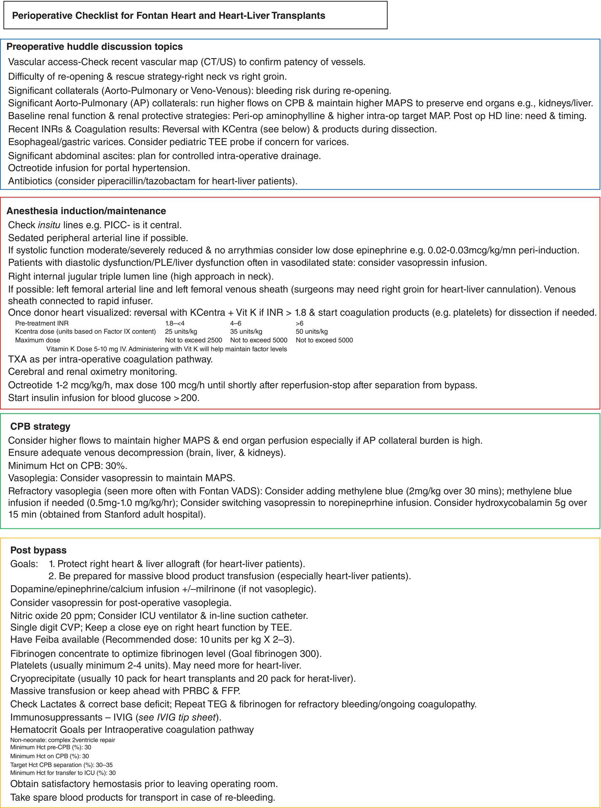

[**Figure 32.7**](#R_c32-fig-0007) Perioperative checklist for Fontan patients undergoing heart or combined heart–liver transplants: Stanford Children's Approach. CT, computed tomography; US, ultrasound; CPB, cardiopulmonary bypass; MAPS, mean arterial pressures; HD, hemodialysis; INR, international normalized ratio; KCentra, prothrombin complex concentrate; TEE, transesophageal echocardiography; PICC, percutaneously inserted central line; PLE, protein‐losing enteropathy; TXA, tranexamic acid; VAD, ventricular assist device; PRBC, packed red blood cells; FFP, fresh‐frozen plasma; TEG, thromboelastogram; IVIG, intravenous immunoglobulin.

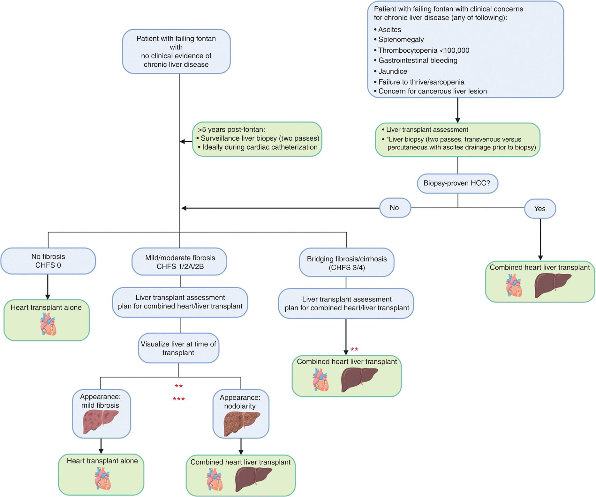

[**Figure 32.8**](#R_c32-fig-0008) Algorithm for heart transplant versus combined heart–liver transplant in patients with Fontan‐associated liver disease.

(Source: Emamaullee et al. \[81\]. Reproduced with permission of Wolters Kluwer Health, Inc.)

### Immunosuppression

Immunosuppression following heart transplantation is lifelong. Despite advances in immune therapy, rejection continues to be a major source of morbidity and mortality in the postoperative period. Pediatric heart transplant provides a unique immunological opportunity because the development of the immune system extends beyond infancy into childhood. T‐cell responses and phenotype are naive compared with adults, with decreased expression of integrins and adhesion molecules. Younger age at the time of transplantation is associated with better long‐term survival and lower frequency of rejection compared with older children \[88\]. Infants and young children (up to 5 years of age) have undergone transplantation across ABO barriers without developing clinical rejection as discussed earlier.

Choice of immunosuppressives is largely guided by institutional experience and the recipient's clinical profile, rejection history, and comorbid associations. Currently, there are no randomized trials to guide management. Stanford Children's Hospital current immunosuppression protocol is attached as an example ([Table 32.4](#c32-tbl-0004)). Typical clinical use of these agents is summarized below \[89\].

Immunosuppression consists of an induction and maintenance phase with additional therapies to manage rejection.

**Induction therapy.** Induction phase allows for rapid establishment of immunosuppression. Approximately 75% of transplant recipients between 2010 and 2018 received induction therapy \[4\]. The most common agent used are polyclonal antilymphocyte or antithymocyte globulin. Despite its popularity in children, significant benefits of induction therapy for survival, CAV, or incidence of rejection are yet to be demonstrated in children \[4\]. Results of a prospective multicenter clinical trial are awaited.

[**Table 32.4**](#R_c32-tbl-0004) Induction and maintenance of immunosuppression following heart transplantation in children: stanford protocol

<table border="1"><tbody class="tdcolor3"><tr><td class="left"><b>Induction therapy:</b> Administered in the operating room following hemostasis from CPB.</td></tr><tr><td class="left">Methylprednisolone: 10 mg/kg (max. dose is 500 mg).</td></tr><tr><td class="left"><i>POD# 0–7</i>: 1. Rabbit antithymocyte globulin 1.5 mg/kg/dose; 5 doses given over 5–7 days.</td></tr><tr><td class="left"> 2. Methylprednisolone: 3.3 mg/kg every 8 hours X3 doses and then tapered to 0.4 mg/kg/dose, twice daily. Once tolerating oral medications prednisone/prednisolone at 0.5 mg/kg, twice daily can be started.</td></tr><tr><td class="left"> 3. Mycophenolate mofetil: 600 mg/kg twice daily.</td></tr><tr><td class="left"> 4. Tacrolimus: 0.05 mg/kg orally started on POD#5 and if renal function is normal.</td></tr><tr><td class="left"><b>Maintenance therapy:</b> Patients may be weaned from prednisone based on the following criteria</td></tr><tr><td class="left">If first biopsy is negative or on POD #7–14, whichever comes first:</td></tr><tr><td class="left"><ul id="c32-list-0012"><li id="c32-li-0055">Did not receive preoperative desensitization therapy pretransplant</li></ul></td></tr><tr><td class="left"><ul id="c32-list-0013"><li id="c32-li-0056">Compatible retrospective crossmatch (regardless of virtual crossmatch results)</li></ul></td></tr><tr><td class="left"><ul id="c32-list-0014"><li id="c32-li-0057">Tacrolimus trough &gt;7 ng/mL</li></ul></td></tr><tr><td class="left"><ul id="c32-list-0015"><li id="c32-li-0058">Ventricular function is normal</li></ul></td></tr><tr><td class="left"><ul id="c32-list-0016"><li id="c32-li-0059">There are no concerning donor‐specific antibody.</li></ul></td></tr><tr><td class="left">If above criteria are not met, steroids are continued and weaned gradually over 6 months.</td></tr><tr><td class="left"><ul class="none" id="c32-list-0017"><li id="c32-li-0060">Tacrolimus: Dose is adjusted to achieve target troughs of 10–12 ng/mL for the first 3 months, then 8–10 ng/mL for months 3–6, then 7–10 ng/mL for months 6–12, then 5–8 ng/mL after the first postoperative year. This is continued indefinitely. Dose/target trough may be adjusted in patients receiving PSI medications and/or those with or at risk for chronic kidney disease.</li></ul></td></tr><tr><td class="left"><ul class="none" id="c32-list-0018"><li id="c32-li-0061"><i>Mycophenolate mofetil</i>: Dose: 600 mg/m2/dose PO (max. 1,000 mg) twice daily. To be continued indefinitely.</li></ul></td></tr><tr><td class="left"><b>Sensitized protocol</b></td></tr><tr><td class="left">If the patient is being treated under “sensitized” protocol due to the presence of antibodies, additional medications may be necessary during the perioperative and induction phase. Plasmapheresis 1.5 volume exchange during CPB. Intravenous gammaglobulin after separation from CPB.</td></tr></tbody></table>

**Maintenance therapy.** The objective is to prevent acute and chronic rejection while minimizing the adverse effects of immunosuppression. All regimens involve a calcineurin inhibitor. Adjunct therapy may include an antipurine agent or mammalian target of rapamycin (mTOR) inhibitor. Often, corticosteroids are also administered, although many programs attempt to limit or avoid their long‐term use. Tacrolimus and MMF or mycophenolic acid (MPA) are the most common agents for maintenance immunosuppression at the time of hospital discharge \[4\] ([Figure 32.9](#c32-fig-0009)).

Immunosuppressive therapies can be categorized by their actions into seven groups as follows:

1.  Broad‐spectrum immunosuppressants – corticosteroids
2.  Calcineurin inhibitors – cyclosporine and tacrolimus
3.  Antiproliferative(purine) agents – MMF and azathioprine
4.  Antibodies against interleukin‐2 (IL‐2) – basiliximab and daclizumab
5.  TOR inhibitors – sirolimus
6.  Monoclonal and polyclonal T‐cell antibodies – anti‐CD3 monoclonal antibody (OKT3), antithymocyte globulin (ATG), antilymphocyte globulin
7.  Nondrug therapies – total lymphoid irradiation, photopheresis, and plasmapheresis.

#### Calcineurin inhibitors

Overall survival of transplanted patients increased from 40 to 70% after the introduction of cyclosporine (Sandimmune, Neoral) in 1982. Cyclosporin binds to cyclophilin within the cytoplasm of T cells; this complex inhibits calcineurin phosphatase, thus interfering with the transcription of key cytokines such as IL‐2, required for T‐cell activation and proliferation. It is not a myelosuprressant and B cells, macrophages and granulocytes are unaffected. Microemulsified formulation of cyclosporin provides better bioavailability and lower rejection rates than the original preparation that had unpredictable absorption. Therapeutic drug monitoring is essential because the therapeutic window is narrow and other drugs influence drug levels. Cyclosporine trough levels are usually maintained in the range of 100–300 ng/mL. Adverse effects may be dose‐related and include toxicity of renal, hepatic, and neurological systems, hypertension, hyperlipidemia, hirsutism, and gingival hyperplasia.

Tacrolimus (Prograf, FK506) binds to a different cytosolic‐binding protein (FK‐binding protein) and has been particularly effective as a rescue treatment in cases where recurrent rejection has occurred with cyclosporine. Overall patient survival does not differ between the two agents, but there appears to be less rejection with tacrolimus and an improved adverse effects profile with respect to hypertension, dyslipidemia, and long‐term renal function \[4, 90, 91\]. Like cyclosporine, the therapeutic window is narrow and blood levels can be affected by other medications. Trough levels are maintained in the range of 5–15 ng/mL. In recent years, cyclosporine and tacrolimus have been used in a similar percentage of patients and MMF has largely replaced azathioprine use early after transplant ([Figure 32.9](#c32-fig-0009)). There is a trend to shift patients who are 5 years post‐transplant from cyclosporine‐based regimens to tacrolimus‐based regimens \[4\].

#### Antiproliferative agents

Agents such as azathioprine (Imuran) and MMF (CellCept) inhibit lymphocyte proliferation by interfering with purine synthesis. One of these agents may be added to calcineurin inhibitor therapy. The choice of either MMF or azathioprine did not have an impact on rejection rate within the first year in the pediatric heart transplant population \[4\].

Azathioprine is a purine antagonist that inhibits T and B cells. Bone marrow depression is common, and dosing is guided by the white blood cell count. Its use has declined considerably in the past decade.

MMF converts to MPA, an inhibitor of purine synthesis. B‐ and T‐cell lymphocytes are suppressed because they lack a salvage pathway. Absorption is variable, and dosing may be guided by blood levels. Gastrointestinal side effects rather than bone marrow depression are the usual dose‐limiting factor.

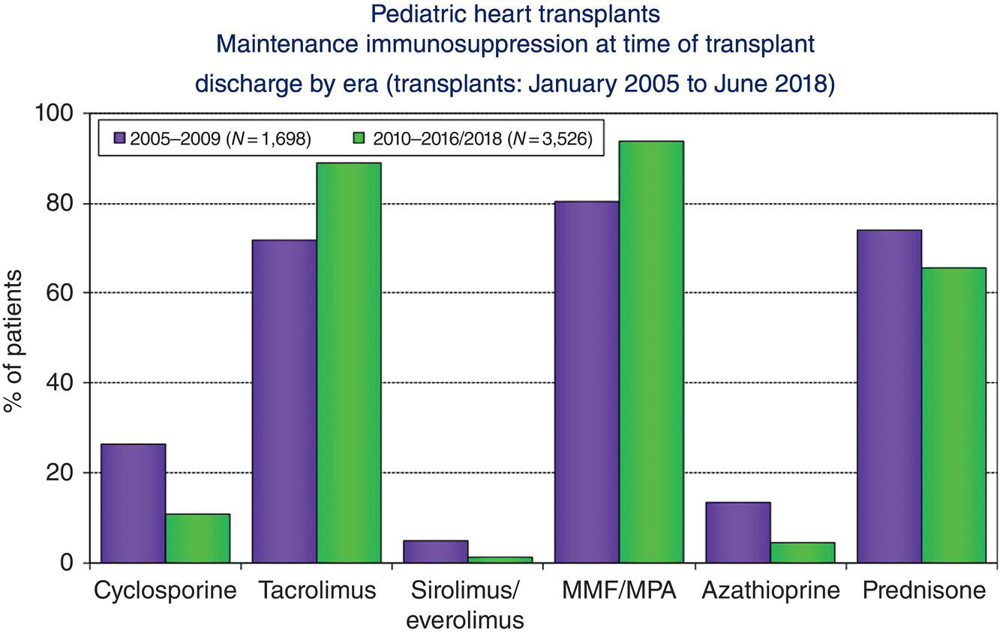

[**Figure 32.9**](#R_c32-fig-0009) Maintenance immunosuppression at the time of hospital discharge following heart transplantation by era (pediatric transplants, January 2005 to June 2018). Analysis is limited to patients who were alive at the time of the discharge. MMF, mycophenolate mofetil; MPA, mycophenolic acid.

(Source: Rossano et al. \[4\]. Reproduced with permission of Elsevier.)

#### mTOR inhibitors

Proliferation signal or mammalian TOR inhibitors, everolimus and sirolimus (rapamycin), are newer agents that provide attractive options for use in heart transplantation because they are immunosuppressive and antiproliferative, inhibit vascular smooth muscle and myofibroblast proliferation, and can prevent progression of CAV. mTOR inhibitors work synergistically with calcineurin inhibitors and thus permit the minimization of calcineurin inhibitors without compromising efficacy. This approach is advantageous for most heart transplant recipients and might provide particular benefit in specific cases, such as patients with cardiac allograft vasculopathy, malignancies, and renal dysfunction, or in patients intolerant to other immunosuppressive agents. Sirolimus may inhibit the process of CAV. Adverse effects include hyperlipidemia, wound healing complications, and proteinuria \[92\]. These drugs inhibit wound healing. Patients taking mTOR inhibitors and scheduled for elective surgery must be switched 2–4 weeks preoperatively to other medications and then restarted 2–4 weeks postoperatively.

#### Corticosteroids

Corticosteroids are nonspecific anti‐inflammatory agents widely used in the precyclosporine era. Steroids decrease cytokine production and reduce the circulating CD4+ T cells. Although a mainstay in induction therapy, steroids are currently used in combination with other immunosuppressants early in transplant. Centers try to minimize the dose and taper off by 6 months because of the myriad of side effects including higher infection risk, diabetes mellitus, bone demineralization, and coronary artery disease. Rejection risk may increase when steroids are withdrawn.

#### Rejection therapy

High‐dose corticosteroid, usually methyl prednisolone, is the first‐line therapy for acute rejection. Recurrent moderate rejection can usually be controlled with enhanced maintenance therapy (tacrolimus, sirolimus) and corticosteroids. Other agents such as polyclonal anti‐T antibodies are reserved for severe rejection that is refractory or causing hemodynamic compromise.

Chronic rejection is manifest as coronary vasculopathy. There are no proven therapies that can halt or reverse this process, and retransplantation is the most suitable option for advanced diffuse disease. It remains controversial whether statins affect the progression of allograft vasculopathy or aid in its prevention in children \[93\].

* * *

### KEY POINTS: IMMUNOSUPPRESSION AND REJECTION

-   Infants have immature immune systems and appear immune‐tolerant, as evidenced by their better long‐term survival and the success of ABO‐I heart transplantation.
-   Although induction therapy is commonly employed, it does not appear to convey any survival advantage in children.
-   CAV is the leading cause of death after 1 year of pediatric heart transplant.
    -   Recipients in acute rejection represent an extremely high‐risk group for general anesthesia and require careful hemodynamic monitoring.

* * *

#### Outcome following heart transplantation

Kaplan–Meier survival curves for patients of differing ages at transplant are shown in [Figure 32.10](#c32-fig-0010). The youngest recipients have the longest median survival to 24.5 years, although the attrition rate is highest in the first few months \[4\]. Recipients who survive to 1‐year post‐transplant have excellent long‐term survival. [Table 32.5](#c32-tbl-0005) lists the causes of early and late (10‐year) mortality from ISHLT registry data \[4\]. ISHLT follow‐up data on complications up to 10 years after transplantation are shown in [Table 32.6](#c32-tbl-0006) \[94\].

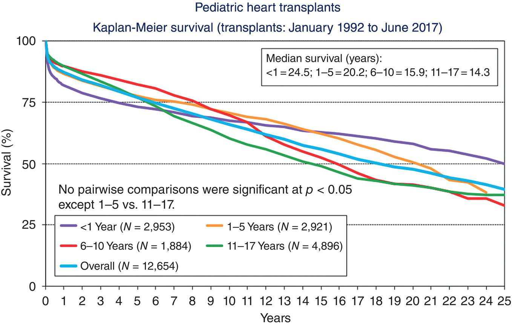

[**Figure 32.10**](#R_c32-fig-0010) Kaplan–Meier survival after heart transplantation (transplants: January 1982 to June 2017).

(Source: Rossano et al. \[4\]. Reproduced with permission of Elsevier.)

[**Table 32.5**](#R_c32-tbl-0005) Causes of early and late mortality after pediatric heart transplantation (deaths: January 2005 to June 2018)

Source: Data from Rossano et al. \[4\].

| Pediatric heart transplants cause of death (deaths: January 2005 to June 2018) |
| --- |
| Cause of death | 0–30 Days (_N_ = 280) | 31 Days to 1 Year (_N_ = 347) | \>1–3 Years (_N_ = 283) | \>3–5 Years (_N_ = 235) | \>5 –10 Years (_N_ = 435) | \>10 Years (_N_ = 554) |
| --- | --- | --- | --- | --- | --- | --- |
| Cardiac allograft vasculopathy | 3 (1.1%) | 9 (2.6%) | 37 (13.1%) | 39 (16.6%) | 90 (20.7%) | 127 (22.9%) |
| Acute rejection | 14 (5.0%) | 52 (15.0%) | 47 (16.6%) | 35 (14.9%) | 44 (10.1%) | 24 (4.3%) |
| Lymphoma | 0 | 10 (2.9%) | 9 (3.2%) | 10 (4.3%) | 19 (4.4%) | 36 (6.5%) |
| Malignancy, other | 0 | 2 (0.6%) | 3 (1.1%) | 1 (0.4%) | 7 (1.6%) | 22 (4.0%) |
| CMV | 0 | 6 (1.7%) | 0 | 0 | 0 | 0 |
| Infection, non‐CMV | 18 (6.4%) | 51 (14.7%) | 15 (5.3%) | 15 (6.4%) | 20 (4.6%) | 37 (6.7%) |
| Graft failure | 107 (38.2%) | 75 (21.6%) | 119 (42.0%) | 81 (34.5%) | 177 (40.7%) | 191 (34.5%) |
| Technical | 23 (8.2%) | 2 (0.6%) | 0 | 1 (0.4%) | 4 (0.9%) | 6 (1.1%) |
| Other | 22 (7.9%) | 23 (6.6%) | 14 (4.9%) | 20 (8.5%) | 24 (5.5%) | 37 (6.7%) |
| Multiple organ failure | 39 (13.9%) | 65 (18.7%) | 14 (4.9%) | 11 (4.7%) | 23 (5.3%) | 28 (5.1%) |
| Renal failure | 0 | 7 (2.0%) | 4 (1.4%) | 4 (1.7%) | 3 (0.7%) | 17 (3.1%) |
| Pulmonary | 9 (3.2%) | 29 (8.4%) | 13 (4.6%) | 10 (4.3%) | 15 (3.4%) | 14 (2.5%) |
| Cerebrovascular | 45 (16.1%) | 16 (4.6%) | 8 (2.8%) | 8 (3.4%) | 9 (2.1%) | 15 (2.7%) |

CMV, cytomegalovirus

#### Rejection

Rejection is defined by the Pediatric Heart Transplant Study Group as the clinical decision to intensify immunosuppression in association with either histopathology or myocardial dysfunction \[95\].

The overall incidence of treated rejection in all age groups from hospital discharge to 1‐year post‐transplant has decreased from 24 in the prior era (2005–2009) to 13% in the most recent era (2010–2018). \[4\] An episode of treated rejection within 1‐year post‐transplant is associated with worse survival. The use or type of induction therapy at the time of hospital discharge was not associated with an increased risk of rejection \[4\]. However, the use of cyclosporine for maintenance therapy at the time of hospital discharge was associated with a higher risk of rejection compared with tacrolimus \[4\].

Four clinical types of rejection are described ([Table 32.7](#c32-tbl-0007)). Hyperacute rejection is rare and manifests soon after transplantation. It is mediated by preformed recipient cytotoxic antibodies against donor heart antigens and often leads to intractable heart failure. On average, pediatric heart transplant recipients have two acute rejection episodes during the first 3 years after transplantation, although about one‐third remain rejection free. ACR is fatal in <10% of episodes; however, it is the commonest cause of death between 30 days and 3 years after heart transplantation. Acute rejection that occurs more than 2 years after transplantation is linked to poor compliance with therapy and carries a poor long‐term prognosis.

[**Table 32.6**](#R_c32-tbl-0006) Post‐heart transplant morbidity. Cumulative prevalence in survivors within 10 years post‐transplant (follow‐ups: April 1994 to June 2006)

Source: Data from Boucek et al. \[94\].

| Outcome | Within 10 years (%) |
| --- | --- |
| Hypertension | 72.3 |
| Renal dysfunction | 17.4 |
|  Abnormal creatinine _<_2.5 mg/dL | 13.2 |
|  Creatinine > 2.5 mg/dL | 1.6 |
|  Chronic dialysis | 1.6 |
|  Renal transplant | 1.1 |
| Hyperlipidemia | 38.2 |
| Diabetes | 4.5 |
| Coronary artery vasculopathy | 16.7 |

[**Table 32.7**](#R_c32-tbl-0007) Characteristics of cardiac rejection

Source: Data from Chan et al. \[90\].

| Type of rejection | Mechanism | Approximate onset after transplantation |
| --- | --- | --- |
| Hyperacute | Preformed antibodies | Minutes to hours |
| Acute cellular | T‐cell‐mediated | Any time (often first 3–6 months) |
| Acute humoral | Antibodies | Days to weeks |
| Chronic (coronary artery vasculopathy) | Both humoral and cellular | After the first year |

Clinical evidence of rejection ranges from no symptoms to tachycardia, tachypnea, lethargy, irritability, poor feeding, fever, hepatomegaly, new murmur, gallop rhythm, and new‐onset arrhythmias. Endomyocardial biopsy remains the “gold standard” for the diagnosis of acute allograft rejection. Specimens are graded for rejection based on the numbers of infiltrating lymphocytes and the presence of myocyte injury \[96\]. Rejection is graded using standardized scales. For ACR, grade 0 R indicates no rejection, grade 1 R mild rejection, grade 2 R moderate rejection, and grade 3 R severe rejection. In the diagnosis and treatment of AMR, ISHLT developed a pathology‐based AMR grading system \[97\].

Endomyocardial biopsy is expensive, invasive, technically challenging in small children, and carries some risks of cardiac perforation and tricuspid valve damage in addition to the need for anesthesia and sedation. Further, “biopsy‐negative” acute graft dysfunction can occur. Noninvasive surveillance such as circulating donor‐derived cell‐free DNA is being considered \[98\]. The use of echocardiography as a noninvasive method of diagnosing acute rejection is unresolved. Indices of systolic and diastolic dysfunction are reportedly useful but have disadvantages \[99–101\]. However as of now, there are no noninvasive surveillance techniques that consistently or accurately diagnose or predict rejection.

Surveillance for late rejection is controversial, and experience in children is limited. Our institution performs annual cardiac catheterization, biopsy, and coronary angiography. In adults, intravascular ultrasound findings at 1 year are a powerful predictor of subsequent mortality, nonfatal cardiac events, and the development of angiographic coronary disease.

#### Treatment of rejection

Treatment depends on several patient factors such as time after transplant, type of rejection, presence of symptoms, infection, hemodynamic changes, and compliance with medications. While mild rejection may not require any acute changes to therapy, moderate or severe rejection will require treatment and/or hospital admission.

High‐dose corticosteroid, usually methylprednisolone, is the first‐line therapy for acute rejection. Recurrent moderate rejection can usually be controlled with enhanced maintenance therapy (tacrolimus, sirolimus) and corticosteroids. Other agents such as polyclonal anti‐T antibodies are reserved for severe rejection that is refractory or causing hemodynamic compromise.

#### Coronary allograft vasculopathy

CAV and primary graft dysfunction (PGD) are the two leading causes of mid‐ and late‐term mortality after pediatric heart transplant \[101\]. CAV accounts for >25% of late deaths and is the most common indication for retransplantation \[16, 18\]. A recent multicenter study demonstrated freedom from CAV at 10 years post‐transplant of 77%. \[102\]. However, by 15 years post‐transplant, almost 50% of all transplant recipients have developed CAV \[4\]. CAV is a diffuse disease characterized by concentric smooth muscle and intimal hyperplasia that begin in the distal, small vessels and progress to involve the intramyocardial and epicardial arteries. It is not only immune mediated but also influenced by nonimmune risk factors such as dyslipidemia, hypertension, donor and recipient age, allosensitization, frequent cellular‐mediated rejection and AMR, donor cigarette use, retransplant and the absence of induction therapy \[4, 102, 103\]. Recipient age is an important risk factor for CAV; infants had the lowest risk and adolescents had the highest \[4\]. A rejection episode within the first year of transplant is associated with a higher incidence of CAV 3 years post‐transplant \[4\]. The risk was not associated with graft ischemic time or calcineurin inhibitors \[4\].

Intravascular ultrasound to detect CAV has size limitations in children and hence coronary angiography remains the gold standard. Detection rates are higher when angiography is performed for symptomatic patients compared to asymptomatic patients. However, most cases are detected during routine angiography \[102\]. Once detected, survival outcomes are poor with 50% mortality 10 years after diagnosis and a 5‐year mortality of >66% when CAV is diagnosed in the presence of symptoms or signs \[102\]. The risk of graft failure is increased when CAV is detected angiographically in the presence of RAP > 12, PCWP > 15, or EF < 45% \[104\]. Although the overall reduction in CAV in the recent era may be associated with reduced rates of rejection, more routine use of statins, and early use of mTOR inhibitors, there are no proven therapies that can halt or reverse this process. Retransplantation is the most suitable option for advanced diffuse disease.

#### Infection

Infection is a significant cause of morbidity and mortality, particularly in the first 12 months after transplantation when immunosuppression is greater \[4\]. The most common types of serious infection are bacterial (60%), cytomegalovirus (18%), other viral (13%), fungal (7%), and protozoal (2%) \[105\]. Bacterial, protozoal, and fungal infections commonly involve the respiratory tract or sternal wound. Viral infections increase the risk of graft rejection, and Epstein–Barr virus is associated with lymphoproliferative disease.

At 5‐year follow‐up, infant recipients had higher occurrence rates of severe and chronic infections compared with older recipients, and the infections were more resistant to treatment. Additionally, the incidence of autoimmune disorders (commonly autoimmune cytopenias) was noteworthy \[106\].

#### Malignancy

Although there is an increased risk of malignancy in children after heart transplantation, the risk is low. Freedom from malignancy was >90% in 10‐year survivors. Sixteen percent of survivors developed a malignancy by 15 years post‐transplant \[4\]. Most malignancies are lymphatic in origin. Many post‐transplant lymphoproliferative disorders (PTLDs) respond to reduction in immunosuppression.

* * *

### KEY POINTS: HEART TRANSPLANT: MORTALITY RISK FACTORS

-   Measures of pretransplant acuity:
    -   ECMO
    -   renal dialysis
    -   mechanical ventilation
-   Congenital heart disease
-   Retransplantation
-   Increasing body mass index.
    -   Overall improved after heart transplant survival despite increasing case complexity related to improved perioperative care and optimizing modifiable risk factors.

* * *

#### Renal dysfunction

Acute renal dysfunction may occur in the immediate postoperative period, probably because of the cumulative negative effects of a chronic low CO, CPB, venous congestion, and nephrotoxic drugs. Renal dysfunction increased from 6 at 1 year to 17% at 10 years. However, the need for renal transplant was seen in only 1% by 10 years and freedom from severe renal dysfunction (defined as serum Cr > 2.5 mg/dL) was approximately 90% at 9 years \[4\]. The risk of developing severe renal dysfunction differs with age at transplant. At 10 years post‐transplant, 2.4% of patients transplanted during infancy versus 14% transplanted at age 11–17 years developed severe renal dysfunction \[4\]. A similar age‐related finding is seen in freedom from renal replacement therapy \[4\]. Multivariable analysis from ISHLT registry data has shown that CHD and retransplant are independently associated with developing renal dysfunction 5 years post‐transplant compared with DCM \[6\].

Other risk factors for chronic renal insufficiency included pretransplant dialysis, HCM, and African American race. Adjusted risk of death in those who developed chronic renal insufficiency was ninefold higher than in those who did not \[107\]. Renal‐protective bundles as mentioned earlier are important.

#### Other complications

The percentage of recipients with hypertension increased over time to 72% at 10 years post‐transplantation. The only medication significantly associated with hypertension was prednisone. Hyperlipidemia also increased steadily to 38% at 10 years after transplantation. There continues to be a lack of consensus on whether abnormal cholesterol values should be treated empirically with statins or whether target ranges for intervention should be established.

Serious gastrointestinal complications have been reported in 18% of recipients (median post‐transplant follow‐up was 3 years). Complications included (in order) pancreatitis, cholecystitis, recurrent abdominal infection, malignancy, and intestinal pneumatosis. Half of the patients with complications required abdominal surgery \[108\].

Children with CHD who required extensive reconstruction of vessels during transplantation may develop stenoses at anastomotic sites (e.g. aorta, pulmonary veins). This can usually be relieved by interventional catheterization techniques, but some cases may require surgery.

#### Quality of life

Most pediatric recipients are rapidly rehabilitated, and full‐time attendance at school is achieved in almost all patients within a few months of transplantation. Approximately 50% of children do not require hospitalization in the first year after transplantation. Rejection and infection are the major causes for hospitalization. The functional status of survivors is excellent. The percentage of survivors without functional limitation was 93% at 1 year and 95% at 5 and 10 years. Less than 1% required total assistance. Preadolescent children exhibited “catch‐up” growth in height and weight after transplantation. Failure of linear growth was correlated with steroid requirements \[4\].

Formal exercise testing reveals that maximum capacities for physical work and peak HR are only approximately two‐thirds of predicted. A longitudinal assessment found low‐peak aerobic capacity and diastolic dysfunction \[109\], although perhaps less so in infants \[110\].

A review of cognitive and psychological outcomes after pediatric heart transplantation found that recipients generally functioned within the normal range on most measures of cognitive function \[111\]. About 20% experienced significant symptoms of psychological distress during the first year after transplantation \[112\]. Post‐traumatic stress disorder seems to be relatively common in parents of pediatric heart transplant recipients \[113\].

Evidence indicates that children with CHD should be considered separately because they have significantly lower scores on IQ and neurodevelopmental tests when compared with a normative sample \[114\]. Transition of care from a pediatric to adult heart transplant program needs to start well before the child reaches teen years. Outcomes are impacted by poor transitions \[115\].

### Anesthetic management of children who have undergone heart transplantation

Patients may present for surgery because of complications from cardiac transplantation (e.g. infection, malignancy, drug adverse effects), or the indication for surgery may be unrelated to heart transplantation. Successful anesthetic management requires consideration of the patient’s medical status, the physiology of the transplanted heart, and the implications of immunotherapy. These have been discussed earlier.

### Future prospects

Donor shortage remains a frustrating problem and is the primary limitation to the number of transplants performed. Efforts to further the care of children with end‐stage cardiac disease can be broadly categorized as described in the following sections.

#### Alternative therapeutic modalities

Research continues on the development of small, implantable VADs suitable as destination therapy or as a bridge to recovery for children of all ages \[40\]. Another avenue of intensive research is cell‐based engineering to replace damaged or dysmorphic heart tissue \[116\]. In animal models, intravenous injections of bone marrow‐derived mesenchymal stem cells readily express phenotypic characteristics of cardiac myocytes, localize at sites of myocardial injury, prevent tissue remodeling, and improve cardiac recovery. When provided with a scaffold such as a prefabricated matrix or decellularized heart tissue, stem cells can localize, differentiate, and function \[116\]. Heart muscle patches, heart valves, and perhaps the entire heart may in the future be engineered in the laboratory \[116\].

#### Improving current therapeutic modalities

Opportunities abound for further refinement of existing therapies. These include reexamination of the allocation of donor organs, ethical analysis of the practice of retransplantation (which is associated with a poor outcome) \[18\], extended donor organ criteria, better protocols for highly sensitized patients, improved understanding of the timing of interventions such as mechanical ventricular assist (balancing the risks of intervention against the benefit of preserved end‐organ function), miniaturization of pediatric CPB circuits, efforts to reduce the side effects of immunosuppression and increase immunotolerance, better therapies to diminish the likelihood of acute and chronic rejection, and improved patient/family support and transitions to enhance compliance with care \[117\]. Identifying best practices with multiinstitute collaboration and learning networks will help move the field forward \[118\].

## Pediatric lung transplantation

Lung transplantation surgery is a relatively uncommon surgery in the pediatric age group, offered at few centers globally as a life‐extending measure for children with irreversible, end‐stage, vascular, or parenchymal lung disease. Compared to adults, the experience with pediatric lung transplantation remains modest. Since 2007, the number of centers performing pediatric lung transplant surgery and transplant surgeries performed annually has remained relatively constant ([Figure 32.11](#c32-fig-0011)) \[119\]. Thirty‐seven centers across the world perform approximately 100 lung transplant surgeries annually in children \[120\]. The outcomes of pediatric lung transplantation, although comparable to adults, remain worse than other solid organ transplant surgeries \[121\]. Numerous unique challenges related to the patient's medical condition, donor–recipient match, development, and growth of the transplanted organs can affect the long‐term outcomes after pediatric lung transplant surgery.

### Indications, contraindications, and listing criteria in children

The majority of pediatric lung transplant recipients are between the ages of 11 and 17, and only 20% of lung transplant surgeries are performed in children 6–11 years of age. Generally, lung transplant surgery is considered a treatment for any end‐stage lung disease. Indications for listing a child for lung transplant surgery vary by age ([Table 32.8](#c32-tbl-0008)) \[122\]. Overall, cystic fibrosis (CF) remains the most common indication in older children whereas pulmonary hypertension is the common reason for lung transplantation in children aged 1–5 years. Only a handful of transplant centers offer lung transplant surgery to infants and neonates. Common indications for severe irreversible respiratory failure in neonates include congenital and acquired diseases such as surfactant protein (B and C) deficiency, interstitial lung disease, pulmonary vein stenosis, pulmonary hypoplasia, and alveolar capillary dysplasia. In the United States, the OPTN is a federal government agency that regulates organ transplantation. OPTN data for 2020 and 2021 suggest a dramatic decrease in transplantation for CF, despite an overall stable number of lung transplants for all age groups. In the 11‐ to 17‐year‐old age group, lung transplants for CF decreased from about 20 year−1 in the United States, from 2000 to 2019, to only 3–4 year−1 in 2020–2021 ([Table 32.9](#c32-tbl-0009)) \[123\]. The overall number of pediatric lung transplants has also decreased, with almost all of the decrease attributable to the decrease in the 11‐ to 17‐year‐old age group.

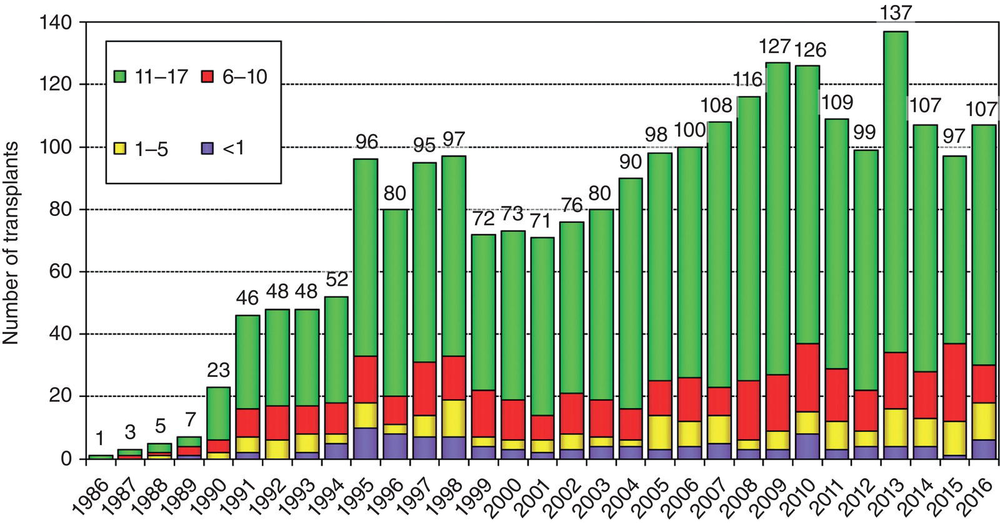

[**Figure 32.11**](#R_c32-fig-0011) Annual pediatric lung transplant surgery volume with age distribution reported to the International Society of Heart Lung Transplantation.

(Source: Goldfarb et al. \[119\]. Reproduced with permission of Elsevier.)

[**Table 32.8**](#R_c32-tbl-0008) Indications for pediatric lung transplants by recipient age group (transplants: January 1, 2000, to June 30, 2016)

Source: Based on from Goldfarb et al. \[122\].

| Diagnosis | <1 Year No. (%) | 1–5 Years No. (%) | 6–10 Years No. (%) | 11–17 Years No. (%) |
| --- | --- | --- | --- | --- |
| Cystic fibrosis | 0 | 4 (3.7) | 116 (50.0) | 814 (66.7) |
| Non–cystic fibrosis‐bronchiectasis | 0 | 0 | 2 (0.9) | 23 (1.9) |
| ILD | 5 (8.3) | 9 (8.3) | 6 (2.6) | 37 (3.0) |
| ILD other | 6 (10.0) | 10 (9.3) | 21 (9.1) | 46 (3.8) |
| PH /pulmonary arterial hypertension | 7 (11.7) | 28 (25.9) | 24 (10.3) | 100 (8.2) |
| PH |  |  |  |  |
|  Eisenmenger syndrome | 0 | 1 (0.9) | 2 (0.9) | 6 (0.5) |
|  Other | 15 (25.0) | 21 (19.4) | 8 (3.4) | 20 (1.6) |
| Obliterative bronchiolitis (non‐retransplant) | 0 | 10 (9.3) | 26 (11.2) | 58 (4.8) |
| Bronchopulmonary dysplasia | 4 (6.7) | 4 (3.7) | 3 (1.3) | 3 (0.2) |
| ABCA3 transporter mutation | 5 (8.3) | 4 (3.7) | 1 (0.4) | 1 (0.1) |
| Surfactant protein B deficiency | 13 (21.7) | 4 (3.7) | 1 (0.4) | 0 |
| Surfactant protein C deficiency | 0 | 1 (0.9) | 0 | 1 (0.1) |
| Retransplant |  |  |  |  |
|  Obliterative bronchiolitis | 0 | 4 (3.7) | 8 (3.4) | 41 (3.4) |
|  Not obliterative bronchiolitis | 0 | 4 (3.7) | 6 (2.6) | 41 (3.4) |
| COPD, with or without A1ATD | 2 (3.3) | 1 (0.9) | 3 (1.3) | 10 (0.8) |
| Other | 3 (5.0) | 3 (2.8) | 5 (2.2) | 20 (1.6) |

A1ATD, α‐l‐anti‐trypsin deficiency; ABCA3, adenosine 5′‐triphosphate–binding cassette subfamily A member 3; COPD, chronic obstructive pulmonary disease; ILD, interstitial lung disease; PH, pulmonary hypertension.

#### Cystic fibrosis

CF is an autosomal recessive disorder caused by mutations in a single gene. These mutations cause loss of function of cystic fibrosis transmembrane conductance regulator (CFTR) protein, which affects the epithelial cells in the lungs, gastrointestinal tract, pancreas, sweat glands, and male reproductive system. So far, more than 2,000 gene mutations have been identified. The core CFTR mutation reduces chloride and bicarbonate in the airway secretions and decreases the water content in the airway epithelial layer. These changes result in thick mucus secretions that are the hallmark of CF. These secretions produce obstruction, persistent inflammation, and superimposed infections of the airways. The ciliary function of the epithelial layer is also depressed ([Figure 32.12](#c32-fig-0012)) \[124, 125\]. Approximately 10% of CF patients have associated liver and pancreatic disease related to the same mutation, resulting in clinically significant pancreatic insufficiency and malabsorption of key nutrients.

[**Table 32.9**](#R_c32-tbl-0009) Lung transplant indications in the United States, 2017–2021

Data source: U.S. Organ. Procurement and Transplant Network \[123\]

| Age Groups | Diagnoses | 2017 | 2018 | 2019 | 2020 | 2021[\*](#c32-note-1101) (projected) |
| --- | --- | --- | --- | --- | --- | --- |
| **All, <1 year to 65+ years** | All | 2,449 | 2,530 | 2,714 | 2,539 | 2,619 (projected) |
|  | CF | 263 | 263 | 246 | 78 | 48 (projected) |
| **<1 year** | All | 3 | 2 | 4 | 7 | 4–5 (projected) |
|  | CHD |  |  |  |  |  |
|  | CF |  |  |  |  | 1 |
|  | Other | 3 | 2 | 3 | 6 | 2–3 |
|  | IPF |  |  |  |  |  |
|  | PPH |  |  | 1 | 1 |  |
|  | Retransplant |  |  |  |  |  |
| **1–5 years** | All | 4 | 1 | 4 | 3 | 3 (projected) |
|  | CHD |  |  |  |  |  |
|  | CF |  |  | 1 |  |  |
|  | Other | 4 |  | 2 | 2 | 3 |
|  | IPF |  |  |  |  |  |
|  | PPH |  | 1 | 1 | 1 |  |
|  | Retransplant |  |  |  |  |  |
| **6–10 years** | All | 5 | 7 | 5 | 3 | 1–2 (projected) |
|  | CHD |  |  |  |  |  |
|  | CF | 2 | 0 | 1 | 1 |  |
|  | Other | 3 | 5 | 3 | 2 |  |
|  | IPF |  |  |  |  |  |
|  | PPH |  | 2 | 1 |  | 1 |
|  | Retransplant |  |  |  |  |  |
| **11–17 years** | All | 32 | 25 | 37 | 19 | 12 (projected) |
|  | CHD |  |  |  |  |  |
|  | CF | 23 | 20 | 22 | 4 | 3 (projected) |
|  | Other | 6 | 4 | 10 | 11 | 6 (projected) |
|  | IPF | 1 |  |  |  |  |
|  | PPH | 2 | 1 | 4 | 4 | 3 (projected) |
|  | Retransplant |  |  | 1 |  |  |

CF, cystic fibrosis; CHD, congenital heart disease; IPF, idiopathic pulmonary fibrosis; PPH, primary pulmonary hypertension;

[\*](#R_c32-note-1101)2021 data represents 8 months, January 1 to August 31, 2021.

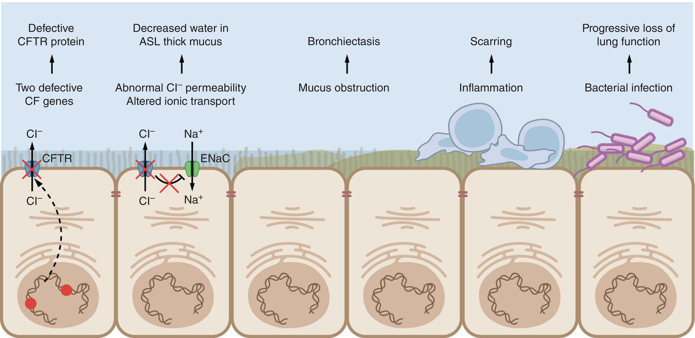

[**Figure 32.12**](#R_c32-fig-0012) The cystic fibrosis (CF) pathogenesis cascade in the lung. The mechanism of CF dysfunction starts with the primary CFTR gene defect and ultimate leads to severe lung deficiency. CFTR, cystic fibrosis transmembrane conductance regulator; ASL, airway surface liquid; ENaC, epithelial Na+ channel.

(Source: Amaral \[124\]. Reproduced with permission of John Wiley & Sons.)

The treatment of CF has significantly improved during the past two decades, and in the current era, most children born with CF are expected to survive into adulthood \[125\]. Improved abilities to diagnose the disease early, the introduction of multidisciplinary care, and the use of newer targeted therapies have resulted in better preservation of lung function in patients with CF. The core treatment aims to improve mucus clearance by increasing hydration of the airway secretions using saline and mannitol nebulization. Recombinant human DNAse‐1 use also improves ciliary clearance by decreasing mucus viscosity \[126\].Drugs such as Ivacaftor and Lumacaftor target specific genetic mutations and have been approved for clinical use \[127, 128\]. These drugs have been shown to improve lung function, increase body mass index, minimize infections with _Pseudomonas_, improved glucose tolerance, and reduce the number of lung infections. Unfortunately, these drugs target specific mutations seen in approximately 40–50% of patients and are remain extremely expensive \[129\].

Despite the maximal therapy, a few children suffer from repeated pulmonary infections with multidrug‐resistant bacteria and develop irreversible respiratory failure. For these children, lung transplant surgery becomes the only viable treatment option. A significant and rapid decline in the clinical status despite the maximal therapy should trigger a referral to a transplant center.

Life expectancy in CF has continued to improve, and in the current era is 46.2 years, due to widespread routine newborn screening, publication of evidence‐based guidelines to optimize nutrition and pulmonary health, and also the development of CF‐specific interdisciplinary care centers \[130\]. As noted above, the CFTR modulator therapies, which can be classified as potentiators, correctors, and amplifiers, have significantly changed the progression of CF lung disease and are among the primary reasons why fewer CF patients are reaching end‐stage lung disease in teenage and early adult years \[131\]. In 2019, the U.S. Food and Drug Administration approved a triple‐drug combination therapy, elexacaftor/texacaftor/ivacaftor, for patients aged 12 years and older that will allow almost 90% of CF patients to have a highly effective therapy. CF‐related liver disease results in cirrhosis in approximately 3% and occasionally leads to combined lung–liver transplantation.

#### Pulmonary hypertension

Severe pulmonary hypertension can occur in diverse group diseases that affect children of all age groups. The progression of clinical symptoms and prognosis depend on the underlying condition. As a diagnosis, pulmonary hypertension is the second most common indication for lung transplantation in children, but for neonates, younger children, and infants, it is the most common indication for lung transplant surgery. In contrast, for older children aged 6–17 years, pulmonary hypertension accounts for 7–8% of lung transplant surgeries \[132\]. Medical treatment of pulmonary arterial hypertension has improved considerably. Newer medications, such as endothelin receptor antagonists (bosentan), phosphodiesterase inhibitors (sildenafil), and prostacyclin analogs, have improved 5‐year survival to more than 80% \[133\]. These drugs reduce the pulmonary arterial pressure and possibly reverse long‐standing changes in the pulmonary vascular architecture. Many children eventually fail maximal medical therapy, and for those patients, lung transplantation remains the only treatment option available. Atrial septostomy has been advocated as a temporizing measure, to improve symptoms and serve as a bridge to transplant, although whether this procedure confers a survival advantage is less clear \[134\]. More recently, many centers have offered a palliative Potts shunt (a pulmonary systemic central shunt from descending aorta to left PA) to decompress the right ventricle, prevent right ventricular failure, and prolong life. In small series, mid‐term survival outcomes and functional status after Potts shunt surgery were similar to patients after lung transplant surgery \[135\]. For children who develop irreversible pulmonary hypertension secondary to a congenital cardiac defect, the complexity of cardiac lesion dictates the decision to perform lung transplant versus HLT. See [Chapter 33](c33.xhtml) for further discussion of pulmonary hypertension.

#### Neonatal and infant lung transplant

Few pediatric lung transplant centers have offered lung transplant surgery in very young children. According to the 2017 report of the ISHLT registry, slightly more than 100 patients younger than 1 year of age have undergone lung transplant surgery \[122\]. The underlying diseases resulting in severe respiratory failure for infants and neonates are different. The major indications for lung transplant surgery in very young children include genetic mutations in the surfactant proteins (B and C), bronchopulmonary dysplasia, CHD, congenital diaphragmatic hernia, and pulmonary dysmaturity. For these patients, severe respiratory failure presents early in life and requires mechanical ventilation and extracorporeal life support \[136\].

### Lung transplant listing criteria

The criteria for listing children for lung transplant surgery are based on the progression of the underlying disease, functional status of the patient, and expected improvement in the quality of life ([Table 32.10](#c32-tbl-0010)). It is challenging to develop survival models for rare and uncommon diseases. In the past, a life expectancy of less than 2 years was used for listing a child for lung transplant surgery. Listing a patient for lung transplant surgery is a complex, shared decision‐making process that involves numerous conversations among patients, their families, pediatric pulmonologists, pediatric cardiothoracic surgeons, and social workers. Many clinical and social factors such as nutritional status, functional status, patient and family ability to comply with immunosuppressant treatment, and move geographically close to a transplant center are considered.

For CF patients, the international consensus guidelines consider numerous clinical factors such as rate of decline in forced expiratory volume in 1 second (FEV1) to less than 30%, elevated PaCO2 (>50 mmHg), decreasing PaO2 (_<_60 mmHg), frequency of hospitalizations, and decreasing distance on the 6‐minute walk test \[137, 138\]. For pulmonary hypertension patients, progressive disease, despite the maximal medical therapy, generally initiates a conversation about transplant surgery as a treatment option. Because pulmonary hypertension in pediatric patients can progress rapidly, children should be referred to a transplant center early. Criteria recommended by the International Society of Heart and Lung Transplantation Society include New York Heart Association class III or IV, cardiac index of less than 2 L/min/m2, and mean right atrial pressure less than 15 mmHg, but are more suitable for adult patients \[139\]. High plasma levels of biomarkers, such as von Willebrand factor and brain natriuretic peptide, may suggest severe disease \[140, 141\].

Active malignancy, sepsis, tuberculosis, neuromuscular disease, heart failure, and acquired immunodeficiency syndrome (AIDS) are considered absolute contraindications for any transplant surgery ([Table 32.11](#c32-tbl-0011)). On rare occasions, patients with severe renal or hepatic disease may be considered for lung and hepatic or renal transplants. Previously, based on adult data, colonization of the trachea with _Burkholderia cenocepacia_ or nontuberculous _Mycobacteria_ was considered an absolute contraindication \[143\]. More recently, some centers have shown that some children with this multidrug‐resistant bacterial infection can be successfully transplanted. In patients with pulmonary hypertension, a compromised ventricular function is considered a relative contraindication.

* * *

### KEY POINTS: INDICATIONS, CONTRAINDICATIONS, AND LISTING CRITERIA

-   CF has historically been the most common indication, until recently accounting for >50% of pediatric lung transplants. Effective CF drugs have decreased the numbers of end‐stage CF patients requiring transplantation.
-   Pulmonary hypertension is the second most frequent indication and is the most common indication for transplant in children <5 years of age.
-   Neonatal and infant lung transplants surgeries are uncommon; indications include congenital cardiac defects, pulmonary hypertension, and genetic mutations in surfactant protein synthesis.
-   Life expectancy _<_2 years is a criterion for lung transplant; active malignancy, sepsis, multiorgan failure, neuromuscular disease, and AIDS are contraindications.

* * *

### Donor management and lung preservation

As with other organ transplants, donor availability has been a limiting factor in offering lung transplant surgery to a larger number of patients. Children face longer wait times and, as a result, children have higher mortality rates while waiting for the organs compared to adults. Only about 15–30% of the cadaveric donor lungs are considered acceptable for transplantation. In the United States, donor organs are allocated by the OPTN. A new lung allocation system, implemented in 2005, uses a patient's medical condition as the primary determinant of organ allocation and discourages the use of waiting time \[145\]. Under this system, a lung allocation score (LAS) is calculated for children older than 12 years. Multiple variables such as age, functional status, forced vital capacity (FVC), and oxygen requirement are used for calculating the LAS. The new policy also mandates that the donor lungs from donors less than 18 years of age are preferentially given to pediatric patients \[145\]. A two‐tier priority system based on medical urgency was implemented in 2010 for children younger than 12 years of age. Since its implementation, there has been a reduction in the total number of listed patients, median time to transplant, and waiting list mortality without affecting survival after the surgery \[146, 147\]. Consequently, the listed patients and recipients at the time of surgery are sicker \[148\]. Additional changes in the lung allocation system were made in 2017, and as a result, all donor lungs below the age of 18 years are now directed to the children younger than 12 years listed within the same geographical area. Efforts to increase the size of the donor organ pool include the use of organs from extended criteria donors, relaxing size‐matching guidelines, using donors after circulatory death, the use of ABO‐I transplants in children under 2 years of age, and the use of ex vivo lung perfusion techniques to retrieve organs from geographically remote areas \[149\].

[**Table 32.10**](#R_c32-tbl-0010) Recommendations regarding timing of referral to lung transplant center

Source: Sweet \[142\].

| Specific disease | Timing of referral |
| --- | --- |
| Surfactant deficiencies | Patients with SP‐B deficiency and ABCA3 deficiency with refractory respiratory failure should be referred immediately |
| Patients with SP‐C deficiency and less severe forms of ABCA3 deficiency may respond to medical therapy and should be referred when unrelenting progression of disease develops |
| Primary pulmonary hypertension | Patients who present in NYHA class III or IV or have evidence of right heart failure should be referred immediately |
| Patients who fail to respond adequately to vasodilator therapy should also be referred |
| Eisenmenger syndrome | When the trajectory of pulmonary hypertension appears to be worsening with impaired exercise tolerance and worsening quality of life |
| Other pulmonary vascular disorders (pulmonary vein stenosis, alveolar capillary dysplasia) | These patients should be referred immediately since they typically do not respond to medical management and are at risk for sudden death |
| Cystic fibrosis | Patients with percent predicted FEV1 values less than 30%, frequent hospitalizations, refractory hypoxemia, or hypercapnia should be referred for transplant |
| Bronchopulmonary dysplasia | Patients with recurrent or severe episodes of respiratory failure or evidence for progressive pulmonary hypertension |
| Diffuse parenchymal lung disease | Patients without evidence for systemic disease that could affect outcome should be referred early |

FEV1, forced expiratory volume in 1 second; NYHA, New York Heart Association; SP, surfactant protein.

[**Table 32.11**](#R_c32-tbl-0011) Contraindications to pediatric lung transplantation

Source: Faro et al. \[143\]. Reproduced with permission of John Wiley & Sons.

| Absolute | Relative |
| --- | --- |
| Active malignancy | Pleurodesis |
| Sepsis | Renal insufficiency |
| Active tuberculosis | Markedly abnormal body mass index |
| Severe neuromuscular disease | Mechanical ventilation |
| Documented, refractory nonadherence | Scoliosis |
| Multiple organ dysfunction | Poorly controlled diabetes mellitus |
| Acquired immunodeficiency syndrome | Osteoporosis |
| Hepatitis C with histological liver disease | Hepatitis B surface antigen positive |
| Fungal infection/colonization |
| Chronic airway infection with multiple resistant organisms |

Donor lungs are selected after a thorough medical screening, and multiple laboratory tests are conducted to rule out any lung pathology or infection. In younger children, comparable age and height with less than 20% discrepancy are considered an acceptable match. An ideal donor is younger than 55 years, a nonsmoker, and has no cardiopulmonary or significant neurological disease history. The donor lungs should produce good gas exchange (PaO2 > 350 mmHg with FiO2 of 1.0) on a moderate amount of ventilatory support. The chest radiograph and bronchoscopy should rule out any significant infection, consolidation, or malignancy. Ideally, the donor's lungs are accepted only if the ischemic time is expected to be less than 6 hours. Over the past decade, selection criteria for ideal donor lungs have been relaxed \[150\]. Extended criteria donors with mild lung disease, history of smoking, age above 55 years of age, and mild chest trauma are accepted if the recipient’s condition is rapidly deteriorating.

The pool of donors is not limited to brain‐dead donors. Organs from the DCD have been used in the adult lung transplant patients, and 1‐ and 5‐year survival in these patients appear to be similar to those who received lungs from brain‐dead donors \[151\]. In addition, normothermic ex vivo lung perfusion techniques are being evaluated to increase the number of suitable grafts. This technique maintains normal physiological status and allows cells to stay metabolically active, thus prolonging the window for transplantation \[152\].

Efforts to preserve lung function after the determination of death may reduce the incidence of primary graft failure and improve long‐term graft function. Ventilation with tidal volumes of 6–8 mL/kg along with aggressive hemodynamic management while restricting fluid to maintain central venous pressures of 4–6 mm has been shown to optimize pulmonary function of the donor lungs \[150\]. The process of harvest includes systemic heparinization of the donor and infusion of prostaglandin E1 into the main PA. Lungs are inflated with FiO2 < 0.4 to an airway pressure less than 20 cm H2O. Lungs are removed en bloc with descending aorta, left atrial cuff, main PA, and thoracic aorta.

### Bridge to transplantation

While waiting for the surgery, some patients rapidly deteriorate and require supportive care to bridge the transplant. Infants and neonates have the most extended wait times and, therefore, have the highest mortality while on the waiting list. Almost one‐third of the listed children end up requiring ventilatory support while waiting for their transplant surgery. For a few patients, mechanical ventilation fails to ensure adequate gas exchange or oxygenation and use ECMO is needed. However, the use of ECMO has significant morbidity before the transplant surgery, and post‐transplant outcomes for these patients remain poor. To minimize the consequences of ECMO, in select patients with low PVR, a paracorporeal lung assist device (PLAD) has been used. The surgery involves redirecting the PA blood flow to the left atrium through an external oxygenator (Novalung GmbH, Germany or the Quadrox‐iD Pediatric oxygenator, MAQUET GmbH & Co KG, Germany) without using a pump \[153\] (see [Figure 32.13](#c32-fig-0013)). Ambulatory ECMO, with veno‐venous (VV) or veno‐arterial (VA), has also been described to support end‐stage lung disease patients as a bridge to transplant \[154, 155\]. As noted above, another method to bridge some patients to transplant, or avoid lung transplant, is using Potts shunt surgery as an alternative treatment for children with end‐stage pulmonary hypertension. Creating a central shunt between the PA and descending aorta can unload the right ventricle, preserve right ventricular function, and extend life. \[135, 156\]. The preliminary reports suggest that 1‐year survival after Potts shunt results is reported to be similar to that after lung transplant.

* * *

### KEY POINTS: DONOR MANAGEMENT, LUNG PRESERVATION, AND BRIDGE TO TRANSPLANT

-   Only 15–30% of donor lungs are considered acceptable; the new LAS, based on medical urgency, is calculated for every patient >12 years of age.
-   Children < 12 years of age receive organs based on two‐tier waiting list.
-   Acceptable gas exchange, “clear” bronchoscopy and chest radiograph, and anticipated ischemic time <6 hours are the usual criteria for donor lungs.
-   ECMO, PLADs, and Potts shunt surgery are used as a bridge to transplant in critically ill patients.

* * *

### Anesthetic management and surgical approach

When listing for lung transplantation, children undergo extensive evaluation, including a visit to the preoperative clinic. Routine testing includes ECG, echocardiogram, pulmonary function tests, arterial blood gases, and complete metabolic panel. Children diagnosed with pulmonary hypertension also undergo a cardiac catheterization where the response to oxygen and nitric oxide is tested and cardiac anatomy is defined. Associated comorbid conditions are optimized. Approximately 10% of CF patients have associated liver and pancreatic disease. Malnutrition due to CF liver disease is associated with worse post‐transplant outcomes, and aggressive efforts to improve the nutritional status of CF patients either by the placement of gastrostomy tube or use of parenteral nutrition are often warranted. Chronic antibiotic therapy often results in renal tubular damage and electrolyte disturbances.

Anesthetic management is dictated primarily by the patient’s underlying condition. At the time of the match, many patients are at home without the need for oxygen supplementation. An increasing number, especially neonates and infants, are critically ill and require mechanical ventilation and often extracorporeal mechanical support. Like other organ transplant surgeries, the time of surgery is unpredictable. Standard nil per os (NPO) guidelines are followed to minimize the risk of aspiration and contamination of the new lungs. Propofol and etomidate are safe in hemodynamically stable patients, but ketamine may be the preferred drug for inducing children with high pulmonary pressures. Anesthesia is maintained with inhalational agents and supplemented with opioids, midazolam, and muscle relaxants. The airway is secured with a cuffed endotracheal tube, including for those with an existing tracheostomy. Lung isolation is rarely used for pediatric lung transplant surgery. Selective pulmonary vasodilators such as iNO and prostacyclin analogs are continued through the pre‐CPB period.

Historically, sequential bilateral lung transplant surgery is performed through a trans‐sternal, clamshell incision, though some surgeons have promoted a mid‐sternotomy approach. Bilateral pneumonectomies require extensive dissection, which is often complicated by excessive adhesions from previous infections and thoracic surgeries. Antifibrinolytic drugs such as tranexamic acid or aminocaproic acid have become standard of care. Ensuring adequate ventilation and oxygenation during the pre‐bypass period can be challenging. Copious lung secretions, poor lung compliance, and surgical manipulation of the lung tissue require close vigilance to the patients’ ventilatory status. Aggressive ventilation should be avoided in patients with chronic hypercarbia, and ventilation parameters are adjusted to ensure normal pH levels. Significant bleeding is expected during the pre‐ and post‐bypass period. Large‐bore venous access and blood products are needed.

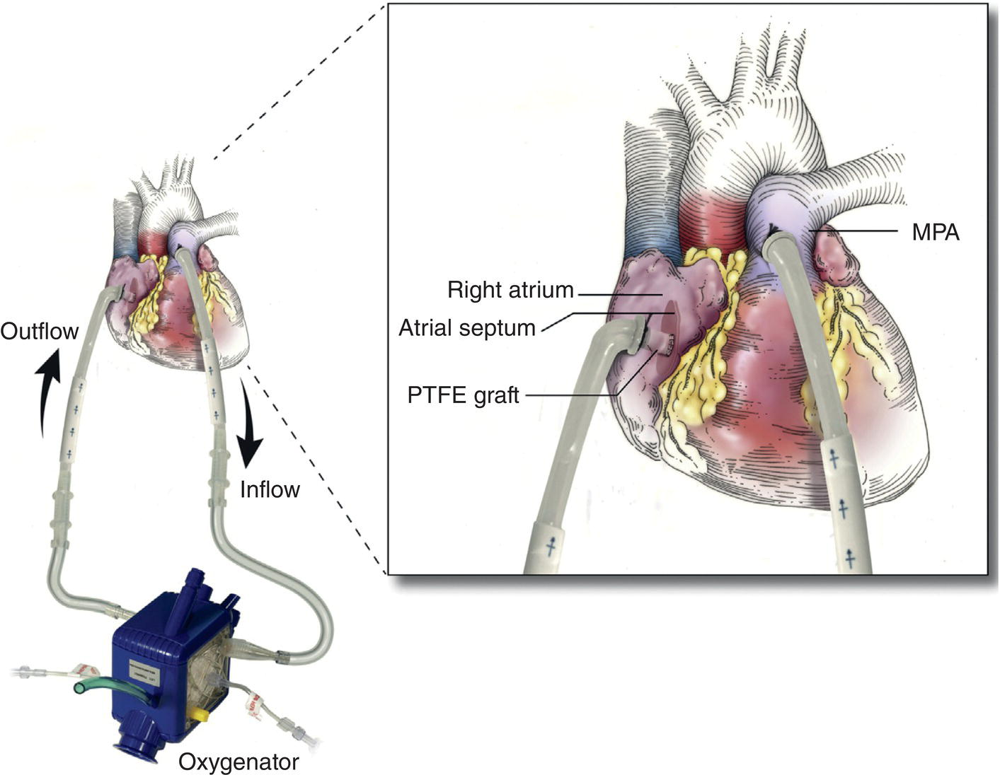

[**Figure 32.13**](#R_c32-fig-0013) The Maquet Quadrox‐iD membrane oxygenator is used for paracorporeal lung assist in neonates and infants. A PTFE graft is used to extend a pediatric Berlin Heart cannula through the right atrium and to the interatrial septum for outflow to the left atrium. MPA, main pulmonary artery; PTFE, polytetrafluoroethylene.

(Source: Hoganson et al. \[153\]. Reproduced with permission of Elsevier.)

[**Table 32.12**](#R_c32-tbl-0012) Summary of intraoperative considerations for pediatric lung transplantation

<table border="1"><tbody class="tdcolor3"><tr><td class="left">Pre‐bypass</td></tr><tr><td class="left"><ul id="c32-list-0026"><li id="c32-li-0085">Consider pathophysiology of lung disease: CF, PH, CHD, others</li><li id="c32-li-0086">Maintain all pulmonary vasodilator therapy on schedule</li><li id="c32-li-0087">Administer immunosuppressant induction agents and antibiotics according to preoperative plans</li><li id="c32-li-0088">Standard single‐lumen TEE for most cases. Plan with surgeon for tracheostomy management</li><li id="c32-li-0089">Vascular access: arterial line (consider femoral if arms up for clamshell incision), CVP, large‐bore PIVs</li><li id="c32-li-0090">Discuss surgical approach: BSLT (clamshell incision, separate bronchial anastomoses) vs. en bloc technique with bronchial revascularization (sternotomy, single tracheal anastomosis)</li><li id="c32-li-0091">Ventilate to baseline PaCO2 values (e.g. hypercarbia common)</li><li id="c32-li-0092">ICU ventilator or HFOV may be required for infants</li><li id="c32-li-0093">Maintain pulmonary toilet pre‐bypass: suction, bronchodilators</li><li id="c32-li-0094">Prepare for possibility that donor lungs are unsuitable after visualization (limit fixed agents, reverse muscle relaxant, awaken patient, remove lines)</li></ul></td></tr><tr><td class="left">Bypass period</td></tr><tr><td class="left"><ul id="c32-list-0036"><li id="c32-li-0095">Normally mild‐moderate hypothermic bypass</li><li id="c32-li-0096">Repair any congenital cardiac lesions, e.g. ASD</li><li id="c32-li-0097">Normally no aortic cross‐clamp</li><li id="c32-li-0098">Instill antibiotics into trachea for CF patients</li><li id="c32-li-0099">Prepare bronchoscope to visualize bronchial/tracheal anastomoses, suction/irrigate blood, mucus, clot</li><li id="c32-li-0100">Ideally ischemic time goal is &lt;6 hours until lungs reperfused (completed pulmonary artery anasotomoses)</li></ul></td></tr><tr><td class="left">Post‐bypass period</td></tr><tr><td class="left"><ul id="c32-list-0042"><li id="c32-li-0101">Separate from bypass on ventilator settings that minimize volutrauma, barotrauma, oxygen toxicity: 6–7 mL/kg (donor weight), peak pressure &lt; 25 cmH2O), PEEP 5 cmH2O, FiO2 0.4–0.5 or less</li><li id="c32-li-0102">iNO 20 ppm, epoprostenol frequently used</li><li id="c32-li-0103">Limit fluid administration (no lymphatic drainage): CVP 4–6</li><li id="c32-li-0104">Milrinone, vasopressors (vasopressin, phenylephrine) as needed</li><li id="c32-li-0105">Significant bleeding treated with platelets, cryoprecipitate/fibrinogen concentrate, fresh‐frozen plasma/coagulation factor concentrate/activated factor VII</li><li id="c32-li-0106">Consider TEE: intracardiac repair, pulmonary venous anastomoses, PA anastomoses, ventricular function, pulmonary hypertension</li><li id="c32-li-0107">Early graft dysfunction (hypoxemia, pulmonary edema) treated with increased FiO2, PEEP, iNO to maintain SpO2 in low 90 second; veno‐venous ECMO if needed</li><li id="c32-li-0108">Usually will not extubate in OR; but stable patients can be extubated in 12–24 hours</li><li id="c32-li-0109">Full handoff report from anesthesia/surgical team to ICU team</li><li id="c32-li-0110">Pain management via opioid infusion, dexmedetomdine, patient/nurse‐controlled analgesia</li></ul></td></tr></tbody></table>

CF, cystic fibrosis; PH, pulmonary hypertension; CHD, congenital heart disease; BSLT, bilateral sequential lung transplantation; HFOV, high‐frequency oscillatory ventilation; ASD, atrial septal defect.

All pediatric lung transplant surgeries are performed with the assistance of a CPB machine or ECMO. Invasive monitoring of arterial blood pressure and central venous pressure is a routine. Lung transplant surgery is a class I indication for intraoperative TEE and is used to monitor ventricular function and postoperative pulmonary hypertension and evaluate vascular anastomoses.

Several unique factors make the use of CPB necessary for pediatric lung transplant surgery. In CF patients, the use of CPB allows the resection of both lungs simultaneously and minimizes the risk of contamination of the new lungs. Smaller children are physically too small to accommodate even the smallest double‐lumen endotracheal tube. Others with significant pulmonary hypertension, neonates, and infants are often too tenuous to tolerate single lung ventilation. In addition, the use of CPB provides stable hemodynamic conditions during the extensive surgical dissection, greatly simplifies surgical management, and consequently reduces ischemic times. The use of CPB, however, comes with its own risks. Generation of inflammatory mediators and activation of complement cascade during CPB contribute to the ischemic–reperfusion injury to the implanted lungs. More recently, based on the experience in adult patients, VA ECMO has been successfully used to PGD secondary to CPB and reduce postoperative bleeding \[157\]. Mild hypothermia or normothermia is needed for implanting donor lungs. The use of aortic cross‐clamping is rarely warranted unless a correction of an existing intracardiac defect is needed. After establishing CPB, both lungs are removed by ligating and dividing pulmonary arterial, atrial cuff, and bronchial connections ([Figure 32.14](#c32-fig-0014)) \[158\]. A second surgical team simultaneously prepares the donor lungs. To reduce bacterial contamination of the new tracheobronchial tree, native tracheal stump is irrigated with a concentrated solution of antibiotics such as tobramycin. The implantation of the new lungs begins with an end‐to‐end bronchial anastomosis. As bronchial blood supply is compromised during the procedure, peribronchial tissue is wrapped around the anastomotic site to enhance healing. Vascular supply to the new lungs is established by an end‐to‐end PA anastomosis. The pulmonary veins are reconnected to the recipient’s left atrium en bloc, using the donor’s atrial cuff. Before weaning off the CPB machine, an aggressive pulmonary toilet and visualization of the bronchial anastomosis with a fiberoptic bronchoscope are performed to ensure adequate ventilation.

Ventilator parameters, guided by the donor weight, are titrated to ensure that lungs are well expanded. Trauma to the new ling, caused by overdistension of the new lungs, increases endothelial permeability and potentiates PGD. iNO is routinely used to induce pulmonary arteriolar vasodilation and improve ventilation‐perfusion mismatch. A focused TEE helps assess the adequacy of major vessel anastomoses. The transplant surgery disrupts native lymphatic drainage of the donor lungs and their ability to clear intra‐alveolar secretion. Judicious fluid management, with a goal of maintaining central venous pressure within 4–6 mmHg range, is recommended.

All patients are electively ventilated during the immediate postoperative period, but many are extubated on postoperative day 1. Infants and neonates have a more protracted recovery and have prolonged ventilatory needs (median 24 vs. 3 days) \[159\] Postoperative pain relief is usually accomplished by patient‐controlled analgesics and narcotic infusions. Regional anesthesia with an epidural catheter is recommended for older children. Epidural catheters, or other regional techniques such as erector spinae plane catheters, may be placed used 24–48 hours after the surgery when the coagulation parameters have normalized. (See [Chapter 24](c24.xhtml) for a discussion of regional anesthetic techniques for cardiothoracic surgery). [Table 32.12](#c32-tbl-0012) summarizes the intraoperative considerations for anesthesia for pediatric lung transplantation.

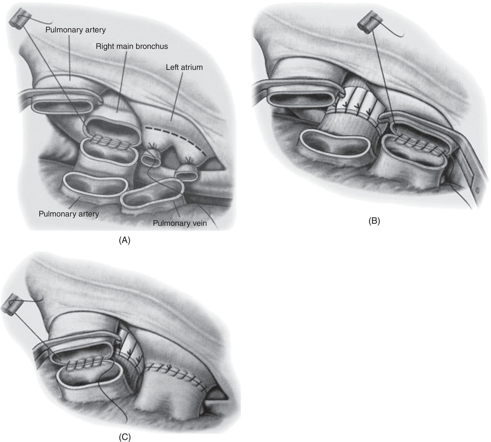

[**Figure 32.14**](#R_c32-fig-0014) (A). End‐to‐end right bronchial anastomosis. (B). End‐to‐end right pulmonary vein anastomosis. (C). End‐to‐end right pulmonary artery anastomosis.

(Source: Nigro et al. \[158\]. Reproduced with permission of John Wiley & Sons.)

Another surgical technique that has been described is the en bloc technique with a single tracheal anastomosis and bronchial artery revascularization using a using a cuff of donor aorta \[160\]. This approach is performed through a median sternotomy. A potential advantage of this technique is better perfusion to the graft because the bronchial artery circulation normally provides half of the airway's dual blood supply. Theoretically, this could reduce airway and infectious complications and delay the onset of bronchiolitis obliterans syndrome, which can have an ischemic etiology. The descending aorta is clamped with a partial occlusion clamp, and the bronchial artery button is anastomosed to it ([Figure 32.15](#c32-fig-0015)) \[160\]. After reperfusion of the bronchial arteries, bleeding will be observed from the cut edge of the trachea, and blood return can often be seen in the PAs and pulmonary veins. In theory, this could limit further graft ischemia. A single end‐to‐end tracheal anastomosis is completed, followed by flexible bronchoscopy by the anesthesiologist for removal of bloody secretions. During aortic cross‐clamp, a single left atrial anastomosis is performed, and other intracardiac anomalies may be addressed. After removal of the aortic cross‐clamp, an end‐to‐end main PA anastomosis is performed. In a single‐institution comparison study of 88 bilateral sequential lung transplants (BSLTs) and 31 en bloc lung transplants (EBLT) with bronchial artery revascularization, there were no differences in bypass or ischemic times, early or longer term survival, graft dysfunction, or cellular rejection scores. BSLT was associated with higher ischemic injury and nonairway complications.

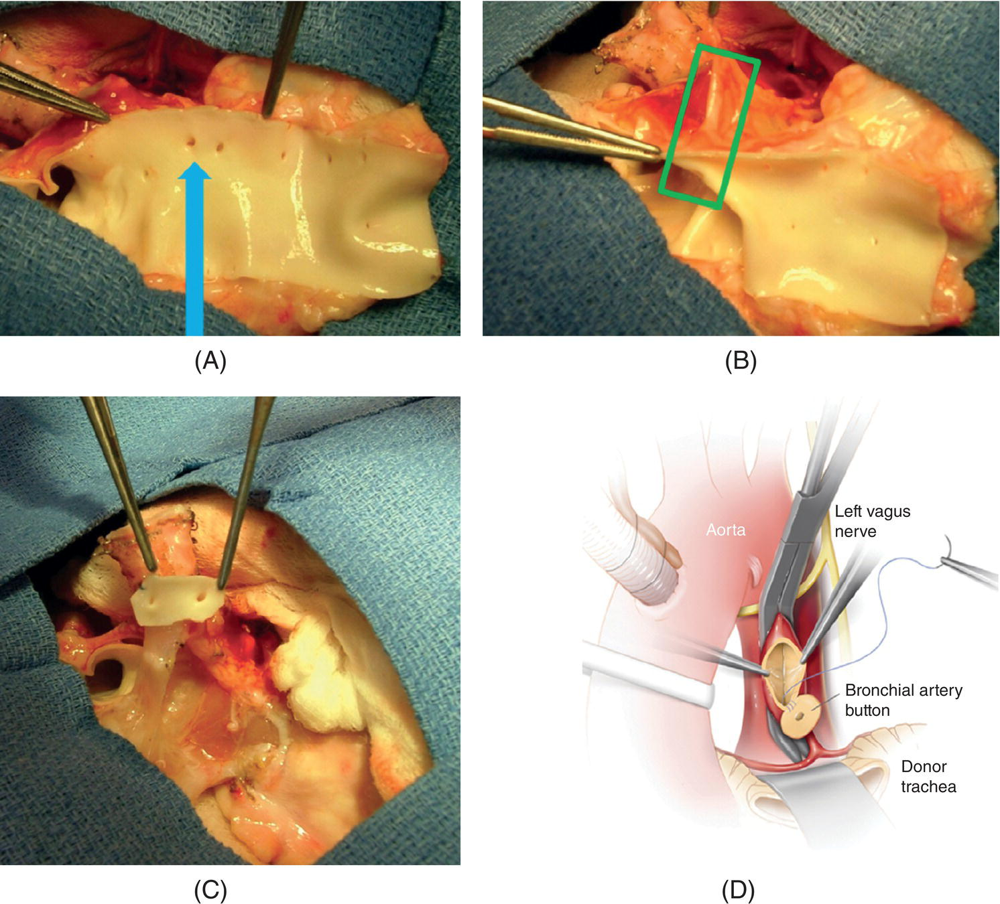

[**Figure 32.15**](#R_c32-fig-0015) Key operative aspects involving bronchial artery revascularization technique: (A) the descending donor thoracic aorta is opened longitudinally; (B) the bronchial artery is identified arising from the aorta; (C) aortic button containing the origin of two bronchial arteries; esophagus previously removed; (D) suturing the bronchial arteries to the aorta.

(Source: Guzman‐Pruneda et al. \[160\]. Reproduced with permission from Elsevier.)

Living donor lobar transplant (LDLT) involves two living donors, each of them donating a lower lobe to the recipient. LDLT had been used to provide organs rapidly to children with CF who underwent an unexpected rapid progression of their disease, which, in the modern era, is less frequent, as noted above. Although outcomes can be comparable to deceased donor transplant \[161\], and there is some evidence to suggest that the incidence of bronchiolitis obliterans is lower in LDLT recipients \[162\], the procedure is resource intensive and has ethical implications because 10–20% of donor lobectomy surgeries have serious complications \[163, 164\]. The 2017 ISHLT report noted the number of LDLT surgeries in pediatric recipients peaked in 1998–1999 and since then has decreased substantially, and none were reported in 2013–2015 \[165\].

When the recipient's chest is too small to accommodate the donor lungs, the donor lungs can be reduced in size. Options include lobectomy (typically, the right middle lobe or lingula), wedge resection using a linear stapler, single lobe transplant, or split lung “bipartitioned” transplant (in which two smaller “lungs” are created from a single deceased donor lung). Reports suggest that outcomes in pediatric recipients of reduced‐size organs can be comparable to recipients of full‐sized grafts \[166, 167\].

* * *

### KEY POINTS: ANESTHETIC MANAGEMENT AND SURGICAL APPROCH

-   The preoperative condition ranges from stable at home to chronic ventilation with a tracheostomy to mechanical support on a bridge to transplant device.
-   CPB and the bilateral sequential lung transplant techniques are used for essentially every pediatric lung transplant.
-   Ventilation parameters after CPB include limiting inflation pressures and volumes (chosen for the donor lungs), limiting FiO2 to maintain SpO2 at 90–95%, and addition of iNO.

* * *

## Immediate perioperative complications

### Primary graft failure

PGD is a syndrome of acute lung injury that presents within the first week of surgery. In its most severe form, it presents as fulminant pulmonary edema with persistent and severe hypoxemia immediately after reimplantation of the new lungs. The PGD can be seen in approximately 30% of patients and remains a major factor for early and possibly delayed mortality after pediatric lung transplantation. Other potential reversible causes of hypoxemia, such as inadequate ventilation, right ventricular dysfunction, and right‐to‐left shunt, must be ruled out before the diagnosis of PGD is made.

Vascular endothelium makes up a vast portion of the lung parenchyma. This metabolically active endothelium of the donor lungs is continuously exposed to oxygen during the entire ischemic period, leading to free radicals‐related injury and graft failure. The time course of this complication suggests two distinct but complementary mechanisms. The first phase, seen immediately after the reperfusion, is initiated by the donor macrophage‐induced release of superoxide anions, inflammatory cytokines, mast cell degranulation, and complement activation. These humoral and cellular mediators damage the integrity of the vascular endothelium and cause movement of fluid to the interstitial and alveolar space. Clinically, this presents as progressive hypoxemia with copious, pink frothy secretions that are not amenable to the conventional treatment methods such as diuresis or positive end‐expiratory pressure (PEEP). The release of inflammatory cytokine induces the recruitment of the recipient's neutrophils to the injury site and initiates the delayed phase of PGD within hours after the initial injury. During the late phase, neutrophils produce reactive superoxide anions and hydroxyl ions and greatly amplify the initial injury, causing further damage to the pulmonary endothelium. Neutrophils also produce elastase and block the blood flow in the capillaries, resulting in architectural damage to the lung tissue \[168\]. Since 2005, ISHLT has implemented a common system grading the severity of the reperfusion injury. This system is based on serial measurements of PaO2/FiO2 ratio and the presence or absence of infiltrates consistent with pulmonary edema on chest X‐ray \[169\] ([Table 32.13](#c32-tbl-0013)). Based on adult lung transplant patient data, donor factors such as female gender, African American race, age (_<_21 or >45 years), and positive history of smoking may be associated with increased risk of PGD. Longer Ischemic time is also considered an important factor associated with the development of PGD \[170\].

[**Table 32.13**](#R_c32-tbl-0013) Recommendations for grading of primary graft dysfunction (PGD) severity

Source: Christie et al. \[169\].

| Grade | PaO2/FiO2 | Radiographic infiltrates consistent with pulmonary edema |
| --- | --- | --- |
| 0 | \>300 | Absent |
| 1 | \>300 | Present |
| 2 | 200–300 | Present |
| 3 | <200 | Present |

The preventive strategies to reduce the incidence of PGD are mainly focused on improving lung preservation techniques, reducing ischemic time, improving donor management, and minimizing barotrauma. Surgeons routinely allow ejection of a small amount of blood into the PA immediately after establishing the vascular supply to the first lung. Empirical evidence suggests that the prophylactic use of pulmonary vasodilators like PGE1 and prostacyclin may reduce the incidence and severity of the reperfusion injury. The preventative role of iNO, however, is less clear. There have been few randomized clinical trials, and they have failed to demonstrate the efficacy of prophylactic administration of iNO in preventing primary graft failure. The treatment of PGD is supportive and includes mechanical ventilation, restriction of fluids, and the use of inotropes. For most patients, PGD resolves over few days, but some patients require ECMO support. VV ECMO can provide adequate oxygenation and gas exchange for few days. PGD is associated with a protracted postoperative course and significantly higher early mortality. A retrospective study that included both adult and pediatric patients reported significantly higher mortality in patients who developed primary graft failure. PGD has also been independently associated with bronchiolitis obliterans.

#### Bleeding

The anesthesia team must expect and prepare for significant bleeding during the pre‐and post‐bypass periods. Patients who had previously undergone thoracic surgeries or had suffered multiple bouts of infections are expected to have difficult dissection during the pneumonectomy phase. Bleeding is also a major concern in patients who were initially palliated with reverse Potts shunt for pulmonary hypertension as the transplant surgery requires the ligation of the shunt before the initiation of the cardiopulmonary pass.

### Physiological changes and growth of the transplanted lungs

Denervation of the lungs is a consequence of transplant surgery. Sensory afferent and efferent neurons connect lungs and brainstem and regulate airway smooth muscle tone and breathing \[171\]. The physiological consequences of denervation on the transplanted lungs are not fully understood. Few clinically significant effects on the airway reflexes, mucociliary movement, and bronchial hyperreactivity have been reported \[172\]. The lack of afferent stimuli to the respiratory center can result in poor coordination between thoracic and abdominal muscles – a frequently observed finding during the immediate postoperative period. Adult lung transplant patients show a subnormal increase in minute ventilation with carbon dioxide challenge \[173\]. Beyond the loss of neural control, transplantation also causes a complete disruption of the lymphatic drainage. During the first postoperative week, transplanted lungs remain more susceptible to interstitial edema. Spontaneous recovery of the lymphatic system has been documented in animal models \[174\]. The long‐term clinical implications of lymphatic injury are poorly understood, but its role in immune response and bronchiolitis obliterans is being investigated.

Serial pulmonary function tests, radiological findings, histological evidence, and clinical examination suggest that donor lungs from younger infants and neonates continue to grow after the surgery. This growth occurs in both lung parenchyma and the larger airway and mirrors the somatic growth of the recipient. Cohen et al. observed that functional reserve capacity increases along with somatic growth \[175\]. This increase accompanies a similar increase in the FEV1, suggesting that the growth in the lungs results from an increase in the number of alveoli and not from mere distension of existing alveoli. The lobar lungs transplanted from mature, living‐related donors also demonstrate a similar growth pattern. However, morphometric studies suggest that the number of alveoli in these lobar lungs remains constant, and the observed growth in lung volume results primarily from alveolar distension \[176\]. The measurement of diffusing capacity for carbon monoxide (DLCO) provides an estimate of gas exchange surface area. Serial measurements of DLCO support the opinion that the increase in lung volume seen after mature lobes is secondary to hyperinflation.

* * *

### KEY POINTS: PRIMARY GRAFT FAILURE, PHYSIOLOGICAL CHANGES, AND SURVEILLANCE

-   PGD develops during the first week of transplant surgery and presents with varying degrees of hypoxemia and pulmonary edema.
-   Addition of PEEP, diuresis, inotropic support, and VV ECMO are support modalities.
-   Transplanted lungs continue to grow in infants and children, in both larger airways and lung parenchyma, including an increase in the number of alveoli.
-   Serial pulmonary function tests and bronchoalveolar lavage with biopsies are performed as routine surveillance monitoring.

* * *

### Surgical complications

#### Airway complications

In the current era, airway complications are uncommon. Bilateral sequential lung transplant approach without bronchial artery revascularization disrupts the blood supply to the donor bronchus. This may lead to poor healing at the anastomotic site and other airway complications such as the development of granulation tissue, airway stenosis, tracheomalacia, and, rarely, airway dehiscence. Surgical techniques such as the use of peribronchial tissue around the anastomotic site and the use of a smaller segment of donor bronchus can minimize the incidence of these complications. In a single‐center study involving 239 transplant surgeries, Choong et al. reported that 13% of children needed surgical interventions for their airway complications \[177\]. Preoperative bacterial and fungal infections, longer ischemic times, and prolonged mechanical ventilation were identified as significant risk factors. In this study, the younger age of the patient was not identified as an independent risk factor for developing airway stenosis. However, infants may have a higher incidence of tracheomalacia and dynamic obstruction of major airways. Most patients with tracheobronchomalacia show significant improvement without any surgical interventions but may need prolonged mechanical ventilation \[178\]. Usually, airway complications are diagnosed within the first 3 months of surgery. Airway stenosis is usually treated successfully with repeated mechanical balloon dilatation through a rigid bronchoscope. Children with recurrent airway stenosis after repeated balloon dilations may require mechanical stents to maintain airway patency. A 2018 consensus statement by the ISHLT provided standardized definitions for airway complications in adult and pediatric lung transplant recipients and proposed standardized treatment approaches \[179\].

#### Vascular anastomotic complications

Vascular anastomotic complications are rare, mostly related to the pulmonary veins. Significant pulmonary venous obstruction presents immediately after weaning off bypass or in the immediate postoperative period. Clinical signs include persistent hypoxemia and frothy pink secretions in the airway, along with increased pulmonary arterial pressures. Postoperative perfusion scans are routinely performed to rule out any discrepancy in the pulmonary blood flow. If a pulmonary venous obstruction is suspected, a definitive diagnosis can be made during cardiac catheterization. Significant obstruction in the PA anastomosis usually requires urgent surgery.

#### Nerve injuries

Phrenic, vagal, and recurrent laryngeal nerves lie adjacent to the bronchopulmonary tree, and injury to these nerves during the transplant surgery is frequent. Huddleston reported a 22% incidence of phrenic nerve injury in children \[178\]. The resulting diaphragmatic paralysis is usually a transient phenomenon but can prolong the need for mechanical ventilation and intensive care stay. Injury to the vagus nerve leads to gastroesophageal reflux, and the incidence of gastric paresis can be as high as 50%. Severe gastric paresis and recurrent silent aspiration have been implicated in deteriorating graft function and bronchiolitis obliterans. Younger patients are especially susceptible to this injury, and many neonatal and infant lung recipients require fundoplication after their transplant surgery. Patients with deteriorating pulmonary function have been shown to benefit from surgical treatment of gastroesophageal reflux. Injury to the recurrent laryngeal nerve (mostly left) and resulting vocal cord dysfunction are seen in 10% of children. Most of these children will recover without any residual vocal cord defects \[178\].

#### Arrhythmias

Atrial suture lines are a potential source for abnormal depolarization and repolarization. Clinically significant atrial flutter requiring medical treatment is seen in about 11% of pediatric patients. Supraventricular tachycardia and atrial fibrillation are also seen. Most arrhythmias are amenable to medical treatment alone.

* * *

### KEY POINTS: SURGICAL COMPLICATIONS

-   Airway stenosis, tracheomalacia, granulation tissue, or dehiscence is seen in approximately 13% of pediatric lung transplant recipients.
-   Pulmonary vein obstruction is a serious complication heralded by hypoxemia and frothy pink secretions.
-   Phrenic nerve, recurrent laryngeal nerve, and vagus nerve injuries are relatively frequent complications after lung transplantation in children.

* * *

### Medical complications

#### Graft rejection, immune therapy, and drug interactions

Recurrent graft rejections are more common after lung transplantation compared with other solid organ transplant surgeries. Lungs have a large endothelial surface and contain immunologically active cells, making them more susceptible to immune‐mediated rejection when compared with the other solid organs. Hyperacute rejection, mediated by preexisting antibodies to donor HLA, is uncommon and can be prevented by virtual crossmatching where the transplant recipients are screened for antibodies against donor HLA. Acute rejection is common and affects almost all transplant patients within 3 months of the surgery. Infants and younger children appear to be somewhat protected and suffer from fewer episodes of acute rejection \[180\]. This discrepancy could be explained by their relatively immature immune system. More recently, the role of anti‐HLA antibodies in graft rejection has been investigated. The clinical picture of rejection is a nonspecific deterioration in the functional status or pulmonary function parameters and is almost clinically indistinguishable from the infectious process. Any decline in clinical status or pulmonary function tests is further investigated by transbronchial lung biopsy. Once the diagnosis of acute rejection is made, these episodes are treated aggressively with a course of intravenous drugs such as high‐dose steroids, antithymocyte globulin, and tacrolimus.

After the induction immunotherapy (IL‐2 receptor antagonists or a polyclonal antibody), triple‐drug therapy with a combination of a calcineurin inhibitor (tacrolimus), cell‐cycle inhibitor (MMF), and corticosteroid (prednisone) is continued for the first year. Side effects related to the chronic use of these drugs include compromised renal function, hypertension, hypercholesteremia, hirsutism, and osteoporosis. About 30% of children have clinically significant renal dysfunction, but others demonstrate subclinical renal dysfunction with borderline serum Cr levels. As many transplant recipients are at risk of developing renal failure, nephrotoxic drugs such as nonsteroidal anti‐inflammatory agents are avoided even if renal function is normal. Cystic patients, because of the unreliable gastric absorption and hepatic clearance, are at risk for developing acute toxicity from oral medications like cyclosporine. In fact, the high incidence of central nervous complications like seizures, headaches, and stroke has been attributed to acute increases in plasma levels of cyclosporine. Hepatic enzymes such as cytochrome P450 metabolize commonly used immunosuppressant drugs. Drugs that are commonly used during surgery (e.g. metoclopramide, barbiturates) induce cytochrome P450, resulting in dangerously low levels of cyclosporine.

#### Opportunistic infections and antibiotic prophylaxis

The risk of viral and bacterial infection remains high throughout the life span of the recipient, but the risk is the highest during the immediate postoperative period. Viral infections are more commonly seen in infants and toddlers. Immunosuppression combined with poor mucociliary clearance, poor cough efforts, and disrupted lymphatics make newly transplanted lungs potential sites for infections. Bacterial infections are the most common, but fungal and viral infections tend to have higher mortality. Cytomegalovirus, adenovirus, Epstein–Barr virus, and influenza are common viral infections. Cytomegalovirus infection is associated with an increased incidence of acute and chronic rejection. Treatment of cytomegalovirus pneumonitis requires 2–3 months of treatment with intravenous or oral ganciclovir. Some patients are prescribed prophylactic trimethoprim/sulfamethoxazole to prevent _Pneumocystis jirovecii_ pneumonia. Preoperative infection with aspergillosis is often seen in CF patients, requiring prolonged treatment with antifungal drugs such as voriconazole.

#### Post‐transplant lymphoproliferative disorder

Overall, the incidence of malignancy in the post‐transplant period is more than 10% at 5 years. PTLD remains the most common form of malignancy. PTLD is strongly associated with Epstein–Barr virus and results from B‐cell proliferation and is commonly seen in patients with T‐cell depletion \[181\]. The hyperplasia of the lymphatic tissue is mostly seen in intrathoracic tissue as lung nodules and mediastinal lymphadenopathy, but it can also present in extrathoracic tissues, such as tonsillar hypertrophy, and cerebral and visceral masses. Most children will respond to a reduction in immunosuppression, but treatment with monoclonal antibodies and steroids may be needed in a few unresponsive patients.

#### Chronic lung allograft dysfunction

Chronic allograft dysfunction is responsible for poor long‐term survival after lung transplant surgery. Bronchiolitis obliterans (BO), the most common type of chronic lung allograft dysfunction (CLAD), is the leading cause of death beyond the first year of survival. Roughly, half of the surviving children develop BO by 5 years after their lung transplant surgery \[122\]. In addition to increasing mortality, CLAD causes significant morbidity and impairs quality of life after lung transplant. The hallmark of the disease is progressive fibrosis and slow obliteration of the small airways. BO is a histological diagnosis reflecting inflammatory and fibroproliferative changes in the bronchioles. The exact mechanism of BO is unknown, but recent research suggests that both immune‐mediated and immune‐independent mechanisms are responsible. Alloimmune‐mediated mechanisms cause injury by acute rejection, cellular lymphocytic bronchiolitis, activation of the humoral immune system, and autoimmune dysfunction. Immunity‐independent mechanisms such as infections, aspiration, ischemia, and primary graft failure also appear to contribute to progressive destruction of the pulmonary architecture. Injury caused by these mechanisms induces a significant fibrotic reaction, remodeling, and abnormal angiogenesis. Routine transbronchial biopsies are not reliable early diagnosis. The clinical manifestation, called bronchiolitis obliteration syndrome, should be strongly suspected in children where a more than 20% decrease in FEV1 is noticed in the absence of infection or rejection. A subgroup of CLAD that does not demonstrate restrictive function may stabilize with aggressive treatment with azithromycin and photopheresis. In a retrospective analysis, children with a total ischemic time of less than 2 hours had a significantly lower incidence of BO when compared with a similar group of patients with longer ischemic time (20 vs. 52%) \[182\]. The incidence of BO is also lower in smaller children (age _<_3 years at the time of transplant). This is presumably related to a lower annual incidence of acute rejection compared with the older children (0.2 episodes compared with 1.95) \[159\]. Enhanced immunosuppression is the cornerstone of currently used therapies, though none of the methods have been able to show a consistent benefit to all patients. Antireflux surgery may also prevent or even reverse the decline in pulmonary function in some patients. Statins have the ability to induce apoptosis in fibroblasts and may hold a promise in treating BO. Retransplantation has become more common in older patients, but short‐ and long‐term survival benefits are limited after retransplant surgery.

* * *

### KEY POINTS: MEDICAL COMPLICATIONS

-   Infants and young children have fewer episodes of acute rejection, explained by a relatively immature immune system; these episodes are heralded by nonspecific deterioration in functional status.
-   Opportunistic infections with bacteria, viruses, and fungi are a constant threat.
-   PTLD is usually due to Epstein–Barr virus and is seen in about 8% of patients.
-   BO is the leading cause of death after the first year and is the major threat to long‐term survival.

* * *

#### Surveillance

These children are closely monitored for rejection, infection, growth, and BO. Pulmonary function tests, bronchopulmonary lavage, and transbronchial biopsies are performed at frequent intervals. Older children can cooperate to perform spirometric tests, and the values of FEV1, FVC, and flow‐volume loops can be serially measured with reasonable accuracy. In infants and younger children (less than 2 years of age), serial values of peak expiratory flow rates are measured at different values of FRC. Peak expiratory flow rate is measured by rapid inflation, followed by rapid deflation. This is achieved by using mask inflation, followed by a rapid external thoracoabdominal compression. These tests are noninvasive but are physically stimulating and are adversely affected by active patient resistance. Consequently, most of the children require deep sedation and/or general anesthesia for these tests. Any deterioration in the baseline values is further investigated by transbronchial biopsy, bronchoalveolar lavage, and open lung biopsy.

#### Long‐term survival

Overall, long‐term survival after a lung transplant in children is improving and remains comparable to adults (5.7 vs. 6.2 years). 56.4% of patients, who received lung transplants after 2008, were alive at 5 years \[183\].

Unfortunately, during the past 30 years, no significant improvement has been observed in 5‐year conditional to 1‐year survival, suggesting that improvements in care have resulted in a reduction in the earlier mortality. Still, long‐term outcomes after lung transplant surgery in children have remained disappointing. Post‐transplant survival is better for children younger than 12 years of age. Mortality is the highest during the first year after surgery, and approximately 15% of transplanted children succumb to primary graft failure and infections in the first year ([Table 32.14](#c32-tbl-0014)). For those who survive beyond 1 year, infections, CLAD, and PTLD are the common causes of death. [Figures 32.16](#c32-fig-0016)–[32.18](#c32-fig-0018) present survival data for pediatric lung transplants by age, era, diagnosis, and early/late deaths, as well as freedom from BO \[183\].

Few prospective studies analyzing the benefit to pediatric patients have been conducted. Liou et al. performed a Cox proportional hazards analysis in children with CF, using transplant surgery as a time‐dependent covariate. The authors observed that, based on the recent data from the OPTN database, children with a 5‐year life expectancy of less than 50% at the time of transplant showed no difference from the nontransplanted group with similar severity of the disease. Among 127 children with a 5‐year predicted survival greater than 50%, the transplanted group showed a substantial decrease in post‐transplant survival when compared with the control nontransplant group. It was concluded that benefit from lung transplantation for CF patients could no longer be assumed \[185\]. However, the study did not include the impact of the recent changes in the lung allocation system, and the authors were unable to comment on the improvements in the quality of life in CF children after transplant surgery. Another limitation of the study was that it included covariates obtained 2–3 years prior to the surgery and did not account for the medical condition of the patient at the time of transplant. The impact of this highly invasive surgery on the quality‐of‐life years survived has not been well studied in lung transplant pediatric patients. Future studies are needed to clarify the potential benefit of lung transplant surgery in children with CF and other diseases leading to end‐stage pulmonary failure.

[**Table 32.14**](#R_c32-tbl-0014) Causes of death after pediatric lung transplantation

| Cause of death | 0–30 Days (_N_ = 130) | 31 Days–1 Year (_N_ = 204) | \>1––3 Years (_N_ = 296) | \>3–5 Years (_N_ = 148) | \>5 Years (_N_ = 185) |
| --- | --- | --- | --- | --- | --- |
| OB/BOS | 0 | 19 (9.3%) | 103 (34.8%) | 59 (39.9%) | 76 (41.1%) |
| Acute rejection | 3 (2.3%) | 3 (1.5%) | 6 (2.0%) | 4 (2.7%) | 4 (2.2%) |
| Lymphoma | 0 | 7 (3.4%) | 6 (2.0%) | 3 (2.0%) | 5 (2.7%) |
| Malignancy, other | 0 | 3 (1.5%) | 1 (0.3%) | 2 (1.4%) | 7 (3.8%) |
| CMV | 0 | 5 (2.5%) | 0 | 0 | 0 |
| Infection, non‐cmv | 16 (12.3%) | 58 (28.4%) | 50 (16.9%) | 22 (14.9%) | 19 (10.3%) |
| Graft failure | 29 (22.3%) | 45 (22.1%) | 83 (28.0%) | 35 (23.6%) | 45 (24.3%) |
| Cardiovascular | 21 (16.2%) | 9 (4.4%) | 4 (1.4%) | 1 (0.7%) | 2 (1.1%) |
| Technical | 18 (13.2%) | 3 (1.5%) | 3 (1.0%) | 3 (2.0%) | 2 (1.1%) |
| Multiple organ failure | 22 (16.9%) | 29 (14.2%) | 17 (5.7%) | 6 (4.1%) | 12 (6.5%) |
| Other | 21 (16.2%) | 23 (11.3%) | 23 (7.8%) | 13 (8.8%) | 13 (7.0%) |

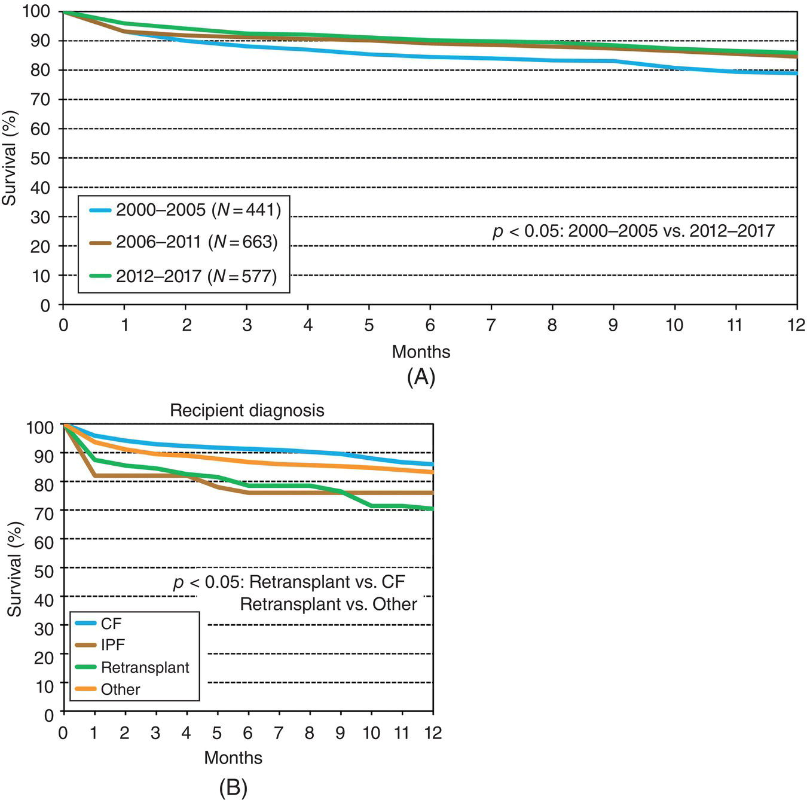  
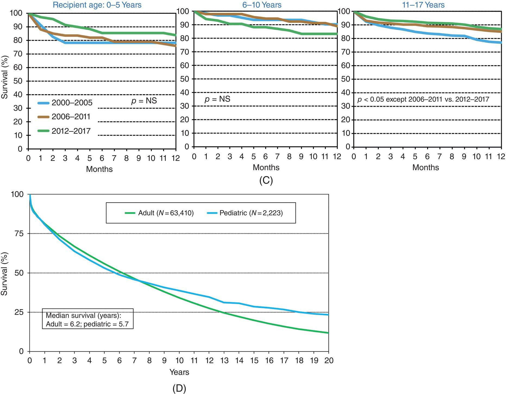

[**Figure 32.16**](#R_c32-fig-0016) A 12‐month survival after pediatric lung transplant (0–17 years of age). (A). Survival by transplant era. (B). Survival by recipient diagnosis; CF, cystic fibrosis; IPF, idiopathic pulmonary fibrosis. (C). Lung transplant survival by age and era. (D). Adult vs. pediatric lung transplant overall survival, 1986–2018.

(Source: Adapted from Hayes et al. \[183\].)

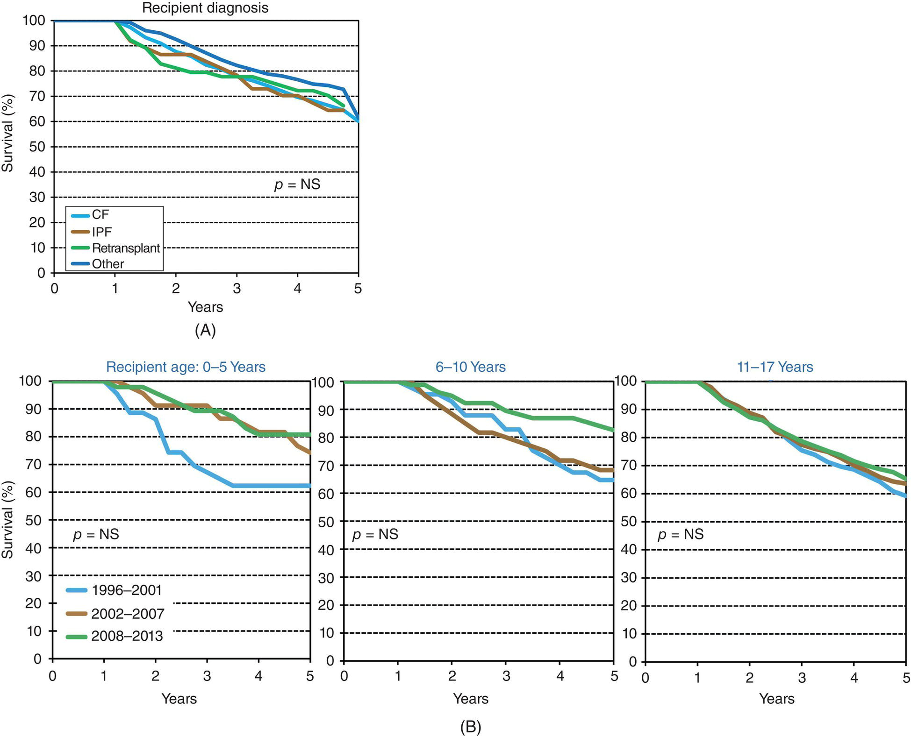

**Figure 32.17** Pediatric lung transplant 5‐year survival conditioned on survival to 1‐year after transplant. (A). Survival by diagnosis. (B). Survival by recipient age and era.

(Source: Adapted from Hayes et al. \[183\].)

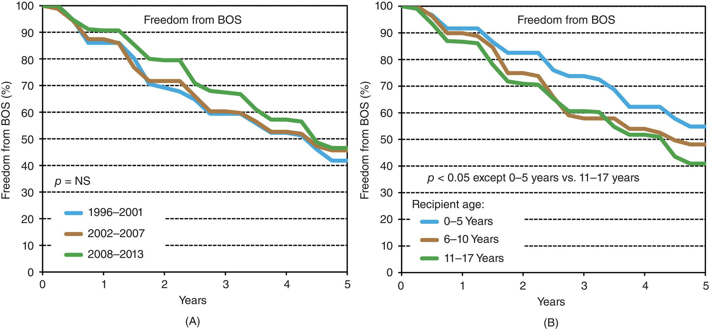

[**Figure 32.18**](#R_c32-fig-0018) Freedom from bronchiolitis obliterans syndrome (BOS) after pediatric lung transplantation. (A) Freedom from BOS by era. (B) Freedom from BOS by age.

(Source: Adapted from Hayes et al. \[183\].)

* * *

### KEY POINTS: MORTALITY AND LONG‐TERM SURVIVAL

-   Overall, pediatric lung transplant survival is worse than other solid organ transplants.
-   Median survival since 1990 is 4–6 years, with patients _<_10 years having longer survival slightly.
-   Since 2002, survival has improved slightly in pediatric lung transplant recipients.

* * *

#### Anesthesia for patients with lung transplant surgery

After lung transplantation, pediatric patients will present for routine transbronchial bronchoscopic surveillance, and anesthetic technique is institution‐dependent and varies according to the age of the child and function of the lungs. If general anesthesia is required, one technique is to use a laryngeal mask airway, which allows a large diameter airway for bronchoscopic access; topical anesthetic treatment of the larynx and the lower airway is provided by the pulmononologist. Alternatively in older patients, intravenous sedation with any one of a number of agents, with generous topical anesthesia, can be utilized. Noncardiac surgery in this population requires a thorough preanesthetic evaluation, including review of pulmonary function tests, and a plan to continue immunosuppressants, and inhaled and systemic pulmonary dilators. Patients with significant BO can have significantly increased airway resistance and reduced compliance; these patients need to have procedures performed in their lung transplant center with careful multidisciplinary planning involving their transplant pulmonologist.

#### The COVID‐19 pandemic and lung transplantation

SARS‐CoV2, the viral etiology of COVID‐19 infection, can unleash a severe, destructive inflammatory response that can lead to significant lung damage, destruction of lung tissue, and requirement for mechanical ventilation, mechanical support with VV or VA ECMO, and cause end‐stage lung disease that can only be treated with lung transplantation in some cases. Case reports of lung transplantation appeared in mid‐2020, and several hundred lung transplants in COVID‐19 patients with what was deemed irreversible lung disease have been performed as of late 2021 \[186–188\]. Significant precautions for personal protective equipment must be taken by the entire surgical team, including at minimum masking with a highly protective medical‐grade facemask, e.g., N95 mask, eye protection, double gloving, and gowning, for the entire case. COVID‐19 testing of donors and recipients has become the norm in the pandemic era. Concerns arose over the possibility that some patients could harbor latent virus that would be reactivated with the initiation of immunosuppressive regimens. In addition, several reports of COVID‐19 infection in lung transplant recipients, and at least one report of COVID‐19‐positive donor lungs being implanted, have appeared in the medical literature. \[189, 190\] Long‐term survival needs to be determined, and international and U.S. lung transplant registries have added this category of disease to their databases \[191\].

## Selected references

_A full reference list for this chapter is available at:_

[http://www.wiley.com/go/andropoulos/congenitalheart](http://www.wiley.com/go/andropoulos/congenitalheart)

1.  3 Singh TP, Hsich E, Cherikh WS, et al. The International Thoracic Organ Transplant Registry of the International Society for Heart and Lung Transplantation: 23rd pediatric heart transplantation report‐2020; focus on deceased donor characteristics. J Heart Lung Transplant 2020; 39(10):1028–37. doi: 10.1016/j.healun.2020.07.008. Epub 2020 Jul 24. PMID: 32773323; PMCID: PMC7737222. The 23rd pediatric heart transplant report from the ISHLT registry focuses on patient age. Important topics include geographic trends, diagnosis, survival, and the conventional post‐transplant morbidities. This issue focuses on donor characteristics as well.
2.  19 Kirk R, Dipchand AI, Davies RR, et al. ISHLT consensus statement on donor organ acceptability and management in pediatric heart transplantation. J Heart Lung Transplant 2020; 39(4):331–41. doi: [https://doi.org/10.1016/j.healun.2020.01.1345](https://doi.org/10.1016/j.healun.2020.01.1345). Epub 2020 Jan 31. PMID: 32088108. An important statement setting forth donor organ acceptability and management, including ABO‐incompatible transplants and defining acceptable titer levels. ABO‐incompatible transplants have comparable survival data despite the patient population being in general younger and more ill.
3.  23 Kozik D, Sparks J, Trivedi J et al. ABO‐incompatible heart transplant in infants: a UNOS database review. Ann Thorac Surg 2020:S0003–4975(20)31422–3. doi: 10.1016/j.athoracsur.2020.06.073. Epub ahead of print. PMID: 32888926. A recent study of outcomes for ABO‐incompatible infant heart transplants demonstrating excellent survival similar to ABO‐compatible transplants.
4.  62 Schure AY, Kussman BD. Pediatric heart transplantation: demographics, outcomes, and anesthetic implications. Paediatr Anaesth 2011; 21:594–603. A review of the perioperative issues of relevance to all anesthesiologists who care for children with transplanted hearts.
5.  63 Schumacher KR, Gajarski RJ. Postoperative care of the transplanted patient. Curr Cardiol Rev 2011; 7:110–22. An excellent review of the perioperative management of pediatric heart transplant recipients with particular emphasis on the early postoperative period.
6.  130 Dickinson KM, Collaco JM. Cystic fibrosis. Pediatr Rev 2021; 42:55–67. A well‐written contemporary review that presents the remarkable medical therapy improvements for cystic fibrosis, including the medications that enhance cystic fibrosis transmembrane conductance regulator function, and other advances, that have dramatically reduced the early incidence of end‐stage lung disease, and resulted in a dramatic decrease in pediatric lung transplants for this disease.
7.  134 Grady RM. Beyond transplant: roles of atrial septostomy and Potts shunt in pediatric pulmonary hypertension. Pediatr Pulmonol 2021; 56:656–60. An interesting review of an old surgery, the Potts shunt, to improve symptomatology, and duration of life, in severe pulmonary hypertension in children, which in turn reduces the need for lung transplantation in some patients in this population.
8.  168 Suzuki Y, Cantu E, Christie J. Primary graft dysfunction. Semin Respir Crit Care Med 2013; 34:305–19. An excellent and thorough contemporary review of the pathogenesis and treatment of PGD after lung transplantation.
9.  183 Hayes D, Harhay MO, Cherikh WS, et al. The International Thoracic Organ Transplant Registry of the International Society of Heart and Lung Transplantation: Twenty‐fourth Pediatric Lung Tranplantation Report – 2021; Focus on Recipient Characteristics. J Heart Lung Transplant 2021; epub ahead of print. The most recent of the annual reports that updates worldwide pediatric lung transplants; this report focuses on recipient characteristics and risk factors for early and late deaths. 12‐month survival has increased slightly to 86%, and 5‐year survival, conditioned on 1‐year survival, is about 60% for pediatric lung transplantation.
10.  184 Bharat A, Querrey M, Markov NS, et al. Lung transplantation for patients with severe COVID‐19. Sci Transl Med 2020; 12(574):eabe4282. A case series from a team with one of the largest experiences with lung transplantation for COVD‐19 pulmonary fibrosis.