CHAPTER 33 Anesthesia for Pulmonary Hypertension 

# CHAPTER 33  
Anesthesia for Pulmonary Hypertension

_Mark D. Twite1 and Robert H. Friesen2_

1 Congenital Cardiac Anesthesiology, Children's Hospital Colorado, University of Colorado School of Medicine, Denver, CO, USA

2 Department of Anesthesiology, Children's Hospital Colorado, University of Colorado School of Medicine, Denver, CO, USA

* * *

-   [**Incidence, anatomy, natural history**](#head-2-314)
    -   [Definition](#head-3-559)
    -   [Classification](#head-3-560)
    -   [Epidemiology](#head-3-561)
-   [**Pathophysiology of pulmonary hypertension in congenital heart disease**](#head-2-317)
-   [**Assessment of pulmonary hypertension**](#head-2-317)
-   [**Medical management of pulmonary hypertension**](#head-2-321)
    -   [Calcium channel blockers (CCBs)](#head-3-562)
    -   [Prostanoids](#head-3-563)
    -   [Endothelin receptor antagonists (ERA)](#head-3-564)
    -   [Phosphodiesterase‐5 inhibitors (PDE‐5i)](#head-3-565)
    -   [Atrial septostomy and lung transplantation](#head-3-566)
-   [**Perioperative risk considerations**](#head-2-322)
    -   [Pulmonary hypertensive crisis](#head-3-567)
-   [**Anesthetic management**](#head-2-324)
    -   [Hemodynamic effects of anesthetic drugs](#head-3-568)
    -   [Perioperative pulmonary vasodilators](#head-3-569)
    -   [Airway and ventilation management](#head-3-570)
    -   [Monitoring](#head-3-571)
    -   [Postanesthesia disposition](#head-3-572)
-   [**Conclusions**](#head-2-326)
-   [**Selected references**](#head-2-327)

* * *

## Incidence, anatomy, natural history

### Definition

Pulmonary hypertension (PH) has many different etiologies, in which all share the final common path of elevated pulmonary arterial pressure (PAP). After birth, PAP falls, reaching adult levels within a few months. In normal, healthy individuals, mean pulmonary artery pressure (mPAP) at rest is around 15 mmHg and is independent of age, ethnicity, and gender. During exercise, mPAP increases and is dependent on the level of exertion and age. During mild exercise, mPAP is 20 ± 5 mmHg in subjects under age 50 years compared to 30 ± 5 mmHg in subjects older than age 50 years, which makes it difficult to define normal mPAP during exercise, and hence, the definition of PH uses mPAP at rest \[1\]. Initially, PH was arbitrarily defined as an mPAP > 25 mmHg. However, this definition has recently changed, as two standard deviations above a normal mPAP of 15 mmHg would suggest an mPAP > 20 mmHg as the upper limit of normal (above the 97.5th percentile). However, this abnormal elevation of mPAP is not sufficient to define pulmonary vascular disease, as it can be due to an increase in cardiac output or pulmonary arterial wedge pressure. Therefore, the 6th World Symposium on Pulmonary Hypertension (WSPH) in 2018 proposed to include pulmonary vascular resistance (PVR) ≥3 Wood Units (WU) in the definition of all forms of precapillary PH associated with an mPAP > 20 mmHg \[2\]. The current hemodynamic definitions of PH are shown in [Table 33.1](#c33-tbl-0001). The Pediatric Task Force of the sixth WSPH has chosen to follow this new adult definition of PH to maintain a common universal language and to facilitate transition from pediatric to adult care. This Pediatric Task Force further reinforced the need to index PVR to body surface area in children \[3\]. PVR index (PVRI) relates the absolute value of PVR to the patient's body surface area to account for the effect of body size on blood flow and it should be reported as WU m2 \[4\]. An mPAP > 20 mmHg does not carry any implication of the presence or absence of pulmonary hypertensive vascular disease. PVR is important in the diagnosis and management of pulmonary hypertensive vascular disease in patients with congenital heart disease (CHD). PH complicates the course of many children and adults with CHD. The increase in PAP associated with CHD is secondary to either increased “precapillary” pulmonary blood flow (left‐to‐right shunt lesion) or increased postcapillary pressures (left heart disease). Based on the hemodynamic definition of PH (mPAP > 20 mmHg), almost all patients with a large unrestricted left‐to‐right shunt will have PH. What is important in this setting is the degree of pulmonary hypertensive vascular disease resulting in an increase in PVR. A patient with a high pulmonary blood flow and low PVR will have PH but can be safely treated with the closure of the shunt. On the contrary, a patient with low pulmonary blood flow, shunt reversal (right to left), cyanosis, and high PVR, the so‐called Eisenmenger syndrome, will be harmed with shunt closure due to worsening right heart failure, as there is no longer a “pop‐off” for blood flow \[5\]. Eisenmenger syndrome is an end stage, and usually irreversible, because of PH with a PVRI > 10 WU m2 with reversed or bidirectional shunting of blood at an aortopulmonary, ventricular, or atrial level. However, between these two extremes of PH and associated CHD is a challenging gray zone that requires careful diagnostic evaluation to guide future management.

[**Table 33.1**](#R_c33-tbl-0001) Hemodynamic definitions of pulmonary hypertension (PH)

Source: Simonneau et al. \[2\]. Reproduced with permission of European Respiratory Society.

| Definitions | Characteristics | Clinical groups [_a_](#c33-note-0002) |
| --- | --- | --- |
| Precapillary PH | mPAP > 20 mmHg  
PAWP ≤ 15 mmHg  
PVR≥ 3 WU | 1, 3, 4, and 5 |
| Isolated postcapillary PH | mPAP > 20 mmHg  
PAWP > 15 mmHg  
PVR < 3 WU | 2 and 5 |
| Combined pre‐ and postcapillary PH | mPAP > 20 mmHg  
PAWP > 15 mmHg  
PVR≥ 3 WU | 2 and 5 |

mPAP, mean pulmonary arterial pressure; PAWP, pulmonary arterial wedge pressure; PVR, pulmonary vascular resistance; WU, Wood Units.

[_a_](#R_c33-note-0002) Clinical groups – see [Table 33.2](#c33-tbl-0002).

### Classification

Since inception in 1973, the World Health Organization (WHO) group classification system for PH has provided researchers and clinicians an evolving framework from which to investigate, diagnose, and treat patients with a diverse collection of pulmonary vascular diseases \[2, 6\]. The clinical classification of PH has five categories based on shared pathological mechanisms, hemodynamic characteristics, and management strategies ([Table 33.2](#c33-tbl-0002)). Subsequent iterations of this clinical classification have maintained a comparable structure with changes paralleling scientific advancement. The definitions are accepted worldwide and used daily in practice by clinicians as inclusion/exclusion criteria for clinical research and in the labeling of new therapeutics for the treatment of PH.

The WHO groups 1–5 classification system for children is problematic, as it does not reflect the complex heterogeneity of factors that contribute to pediatric PH. As a result, the Pulmonary Vascular Research Institute Pediatric Taskforce proposed a new classification of pediatric PH at its meeting in Panama in 2011 \[7\]. The classification has 10 categories based on clinical pediatric practice and reflects the heterogeneous nature of pediatric PH ([Table 33.6](#c33-tbl-0006)). The Panama classification includes an additional definition of PH for children with univentricular circulations: following a cavopulmonary anastomosis, PH is defined as a PVRI≥ 3 WU m2 or a transpulmonary gradient (mPAP − left atrial pressure) >6 mmHg even if the mPAP is <20 mmHg ([Box 33.1](#c33-fea-0001)) \[7, 8\]. In this setting of nonpulsatile blood flow to the pulmonary arteries, even though mPAP may not be greater than 20 mmHg, significant pulmonary hypertensive vascular disease can lead to a poor outcome. With the agreement of the Pediatric Taskforce, some of these items were included in the most recent 2018 Pulmonary Hypertension Classification to have a more comprehensive classification, inclusive of both adults and children \[9\].

Children with CHD and PH are in group 1, pulmonary arterial hypertension (PAH). Group 1.4.4 PAH includes patients with simple operable and inoperable CHD, subgrouped as those with Eisenmenger physiology, those with PAH and left‐to‐right shunts, those with PAH thought to be incidental to their CHD, and those with postoperative defects. Transient PH following repair of CHD occurs in 21.9 cases per million and is one of the commonest forms of PAH in children, second only to persistent PH of the newborn \[10\]. Complex heart diseases have been assigned to group 5.4.

Group 2, PH due to left heart disease, includes congenital and acquired left heart inflow and outflow tract obstruction, such as pulmonary vein stenosis, cor triatriatum, mitral stenosis, and cardiomyopathies. This group causes the “postcapillary” increase in PAP. In group 3, PH due to lung disease and/or hypoxia, developmental lung diseases are emphasized due to the important role of abnormal lung vascular growth in the pathogenesis of PH. Examples include congenital diaphragmatic hernia, bronchopulmonary dysplasia (BPD), alveolar capillary dysplasia, and surfactant protein abnormalities. Group 4, PH due to pulmonary artery obstructions, and group 5, PH with unclear and/or multifactorial mechanisms, including complex CHD, are rare causes of pediatric PH.

The characterization of PH according to these classifications is an essential part of the diagnostic workup of PH. The treatment strategy and prognosis of pediatric PH largely depend on its subclass and associated conditions. It is, therefore, important to correctly characterize the type of PH using standardized diagnostic workup ([Figure 33.1](#c33-fig-0001)). However, in pediatric PH, there is often more than one associated condition identified, which leaves it to the clinician to determine the contribution of each condition to the PH and to decide on which condition therapy should be focused. However, there is now a shift away from this historic classification paradigm to a genotype–phenotype model, which potentially removes the boundaries between the current groups \[11\]. The guidelines for the diagnosis and management of pediatric and adult PH have comparable themes, but recommendations for treatment in children are based largely on expert consensus and extrapolation from adult data \[12\]. Identifying parallels in the genotype–phenotype profile among adult and pediatric patients with comparable genetic mutations may simplify investigation and treatment. Armed with specific knowledge about genotype–phenotype of their patient, clinicians may be better equipped to provide precision care regardless of patient age. The large‐scale PVDOMICS study (Redefining Pulmonary Hypertension through Pulmonary Vascular Disease Phenomics) is utilizing the principle of phenomics (e.g. genomics, transcriptomics, proteomics, metabolomics) to create a rich data resource from which to redefine PH classification at the molecular level \[13, 14\].

### Epidemiology

The major etiologies of pediatric PH cases are idiopathic PAH (IPAH), heritable PAH (HPAH), and PAH associated with CHD (PAH‐CHD). Gene mutations involved in the transforming growth factor‐β (TGF‐β) signaling pathway, primarily within bone morphogenetic protein receptor type‐2 (BMPR‐2), have been shown to be important in IPAH and HPAH. There are other mutations, which are also thought to be important in the pathogenesis of PAH, including activin‐like kinase‐1 (ALK‐1), T‐box 4, SOX17, and endoglin mutations \[15, 16\]. BMPR‐2 is the most common gene mutation associated with pediatric PAH and can be identified in 10–20% of pediatric patients with IPAH/HPAH \[10, 17, 18\].

[**Table 33.2**](#R_c33-tbl-0002) Updated clinical classification of pulmonary hypertension

Source: Adapted from Simonneau et al. \[2\].

<table border="1"><tbody class="tdcolor4"><tr><td class="left"><ol class="decimal" id="c33-list-0001"><li id="c33-li-0001">PAH</li></ol></td></tr><tr><td class="left"><ol class="none" id="c33-list-0002"><li id="c33-li-0002">1.1. Idiopathic PAH</li></ol></td></tr><tr><td class="left"><ol class="none" id="c33-list-0003"><li id="c33-li-0003">1.2. Heritable PAH</li></ol></td></tr><tr><td class="left"><ol class="none" id="c33-list-0004"><li id="c33-li-0004">1.3 .Drug and toxin induced PAH (<a href="#c33-tbl-0003" id="R_c33-tbl-0003">Table 33.3</a>)</li></ol></td></tr><tr><td class="left"><ol class="none" id="c33-list-0005"><li id="c33-li-0005">1.4. PAH associated with:</li></ol></td></tr><tr><td class="left"><ol class="none" id="c33-list-0006"><li id="c33-li-0006"> 1.4.1. Connective tissue disease</li></ol></td></tr><tr><td class="left"><ol class="none" id="c33-list-0007"><li id="c33-li-0007"> 1.4.2. HIV infection</li></ol></td></tr><tr><td class="left"><ol class="none" id="c33-list-0008"><li id="c33-li-0008"> 1.4.3. Portal hypertension</li></ol></td></tr><tr><td class="left"><ol class="none" id="c33-list-0009"><li id="c33-li-0009"> 1.4.4. Congenital heart disease</li></ol></td></tr><tr><td class="left"><ol class="none" id="c33-list-0010"><li id="c33-li-0010"> 1.4.5 .Schistosomiasis</li></ol></td></tr><tr><td class="left"><ol class="none" id="c33-list-0011"><li id="c33-li-0011">1.5 .PAH long‐term responders to calcium channel blockers (<a href="#c33-tbl-0004" id="R_c33-tbl-0004">Table 33.4</a>)</li></ol></td></tr><tr><td class="left"><ol class="none" id="c33-list-0012"><li id="c33-li-0012">1.6 .PAH with overt features of venous/capillaries (PVOD/PCH) involvement (<a href="#c33-tbl-0005" id="R_c33-tbl-0005">Table 33.5</a>)</li></ol></td></tr><tr><td class="left"><ol class="none" id="c33-list-0013"><li id="c33-li-0013">1.7 .Persistent pulmonary hypertension of the newborn (PPHN)</li></ol></td></tr><tr><td class="left"><ol id="c33-list-0014"><li value="2" id="c33-li-0014">PH due to left heart disease</li></ol></td></tr><tr><td class="left"><ol class="none" id="c33-list-0015"><li id="c33-li-0015">2.1. PH due to heart failure with preserved LVEF</li></ol></td></tr><tr><td class="left"><ol class="none" id="c33-list-0016"><li id="c33-li-0016">2.2. PH due to heart failure with reduced LVEF</li></ol></td></tr><tr><td class="left"><ol class="none" id="c33-list-0017"><li id="c33-li-0017">2.3. Valvular heart disease</li></ol></td></tr><tr><td class="left"><ol class="none" id="c33-list-0018"><li id="c33-li-0018">2.4 .Congenital/acquired cardiovascular conditions leading to postcapillary PH</li></ol></td></tr><tr><td class="left"><ol id="c33-list-0019"><li value="3" id="c33-li-0019">PH due to lung diseases and/or hypoxia</li></ol></td></tr><tr><td class="left"><ol class="none" id="c33-list-0020"><li id="c33-li-0020">3.1. Obstructive lung disease</li></ol></td></tr><tr><td class="left"><ol class="none" id="c33-list-0021"><li id="c33-li-0021">3.2. Restrictive lung disease</li></ol></td></tr><tr><td class="left"><ol class="none" id="c33-list-0022"><li id="c33-li-0022">3.3. Other lung disease with mixed restrictive/obstructive pattern</li></ol></td></tr><tr><td class="left"><ol class="none" id="c33-list-0023"><li id="c33-li-0023">3.4 .Hypoxia without lung disease</li></ol></td></tr><tr><td class="left"><ol class="none" id="c33-list-0024"><li id="c33-li-0024">3.5. Developmental lung disorders</li></ol></td></tr><tr><td class="left"><ol id="c33-list-0025"><li value="4" id="c33-li-0025">PH due to pulmonary artery obstructions</li></ol></td></tr><tr><td class="left"><ol class="none" id="c33-list-0026"><li id="c33-li-0026">4.1. Chronic thromboembolic PH</li></ol></td></tr><tr><td class="left"><ol class="none" id="c33-list-0027"><li id="c33-li-0027">4.2. Other pulmonary artery obstructions</li></ol></td></tr><tr><td class="left"><ol class="none" id="c33-list-0028"><li id="c33-li-0028"> 4.2.1. Sarcoma (high or intermediate grade) or angiosarcoma</li></ol></td></tr><tr><td class="left"><ol class="none" id="c33-list-0029"><li id="c33-li-0029"> 4.2.2. Other malignant tumors:</li></ol></td></tr><tr><td class="left">     Renal carcinoma</td></tr><tr><td class="left">     Uterine carcinoma</td></tr><tr><td class="left">     Germ cell tumors of the testis</td></tr><tr><td class="left">     Other tumors</td></tr><tr><td class="left"><ol class="none" id="c33-list-0030"><li id="c33-li-0030"> 4.2.3. Nonmalignant tumors</li></ol></td></tr><tr><td class="left">     Uterine leiomyoma</td></tr><tr><td class="left"><ol class="none" id="c33-list-0031"><li id="c33-li-0031"> 4.2.4. Arteritis without connective tissue disease</li></ol></td></tr><tr><td class="left"><ol class="none" id="c33-list-0032"><li id="c33-li-0032"> 4.2.5. Congenital pulmonary artery stenosis</li></ol></td></tr><tr><td class="left"><ol class="none" id="c33-list-0033"><li id="c33-li-0033"> 4.2.6 .Parasites</li></ol></td></tr><tr><td class="left">     Hydatidosis</td></tr><tr><td class="left"><ol id="c33-list-0034"><li value="5" id="c33-li-0034">PH with unclear and/or multifactorial mechanisms</li></ol></td></tr><tr><td class="left"><ol class="none" id="c33-list-0035"><li id="c33-li-0035">5.1. Hematologic disorders</li></ol></td></tr><tr><td class="left">     Chronic hemolytic anemia</td></tr><tr><td class="left">     Myeloproliferative disorders</td></tr><tr><td class="left"><ol class="none" id="c33-list-0036"><li id="c33-li-0036">5.2. Systemic disorders and metabolic disorders</li></ol></td></tr><tr><td class="left">     Pulmonary Langerhans cell histiocytosis</td></tr><tr><td class="left">     Gaucher disease</td></tr><tr><td class="left">     Glycogen storage disease</td></tr><tr><td class="left">     Neurofibromatosis</td></tr><tr><td class="left">     Sarcoidosis</td></tr><tr><td class="left"><ol class="none" id="c33-list-0037"><li id="c33-li-0037">5.3. Others</li></ol></td></tr><tr><td class="left">     Chronic renal failure with or without hemodialysis</td></tr><tr><td class="left">     Fibrosing mediastinitis</td></tr><tr><td class="left"><ol class="none" id="c33-list-0038"><li id="c33-li-0038">5.4. Complex congenital heart disease</li></ol></td></tr></tbody></table>

LVEF, left ventricular ejection fraction; PAH, pulmonary arterial hypertension, PCH: pulmonary capillary hemangiomatosis; PVOD, pulmonary veno‐occlusive disease.

[**Table 33.3**](#R_c33-tbl-0003) Updated classification of drugs and toxins associated with PAH

Source: Simonneau et al. \[2\]. Reproduced with permission of European Respiratory Society.

| Definite | Possible |
| --- | --- |
| Aminorex | Cocaine |
| Fenfluramine | Phenylpropanolamine |
| Dexfenfluramine | L‐Tryptophan |
| Benfluorex | St. John's wort |
| Methamphetamines | Amphetamines |
| Dasatinib | Interferon α and β |
| Toxic rapeseed oil | Alkylating agents |
|  | Bosutinib |
|  | Direct‐acting antiviral agents against hepatitis C virus |
|  | Leflunomide |
|  | Indirubin (Chinese herb Qing‐Dai) |

[**Table 33.4**](#R_c33-tbl-0004) Definitions of acute and long‐term response

Source: Simonneau et al. \[2\]. Reproduced with permission of European Respiratory Society.

<table border="1"><tbody class="tdcolor4"><tr><td>Acute pulmonary vasoreactivity<a href="#c33-note-0005" id="R_c33-note-0005" aria-describedby="c33-note-0005" epub:type="noteref" role="doc-noteref"><i>a</i></a> for patients with idiopathic, hereditable, or drug‐induced PAH</td><td>Reduction in mPAP ≥ 10 mmHg to reach an absolute value of mPAP ≤ 40 mmHg. Increased or unchanged cardiac output</td></tr><tr><td class="left">Long‐term response to CCBs</td><td class="left">NYHA Functional Class I/II With sustained hemodynamic improvement (same or better than achieved in the acute test) after at least 1 year on CCBs only</td></tr></tbody></table>

CCB, calcium channel blocker; mPAP, mean pulmonary artery pressure; NYHA, New York Heart Association; PAH, pulmonary arterial hypertension.

[_a_](#R_c33-note-0005) Nitric oxide (10–20 ppm) is recommended for performing vasoreactivity testing, but IV epoprostenol, IV adenosine, or inhaled iloprost can be used as alternatives.

[**Table 33.5**](#R_c33-tbl-0005) Signs evocative of venous and capillary (pulmonary veno‐occlusive disease/pulmonary capillary hemangiomatosis) involvement

Source: Simonneau et al. \[2\]. Reproduced with permission of European Respiratory Society.

| Pulmonary function tests | Decreased DLCO (frequently <50%)  
Severe hypoxemia |
| --- | --- |
| Chest high‐resolution CT | Centrilobular ground‐glass opacities/nodules  
Mediastinal lymph node enlargement |
| Response to PAH therapy | Possible pulmonary edema |
| Genetic background | Biallelic EIF2AK4 mutations |
| Occupational exposure | Organic solvent (trichloroethylene) |

DLCO, diffusing capacity of the lung for carbon monoxide; PAH, pulmonary arterial hypertension.

[**Table 33.6**](#R_c33-tbl-0006) The Panama classification: 10 categories of pediatric pulmonary hypertensive vascular disease

Source: Cerro et al. \[7\]. Reproduced with permission of John Wiley & Sons.

| Category | Description |
| --- | --- |
| 1 | Prenatal or developmental pulmonary hypertensive vascular disease |
| 2 | Perinatal pulmonary vascular maladaption |
| 3 | Pediatric cardiovascular disease |
| 4 | Bronchopulmonary dysplasia |
| 5 | Isolated pediatric pulmonary hypertensive vascular disease |
| 6 | Multifactorial pulmonary hypertensive vascular disease in congenital malformation syndromes |
| 7 | Pediatric lung disease |
| 8 | Pediatric thromboembolic disease |
| 9 | Pediatric hypobaric hypoxic exposure |
| 10 | Pediatric pulmonary vascular disease associated with other system disorders |

* * *

### [Box 33.1](#R_c33-fea-0001) : The modern definition of pulmonary arterial hypertension in children with biventricular and palliated univentricular circulations.

-   mPAP = mean pulmonary artery pressure
-   PVRI = pulmonary vascular resistance index
-   CO = cardiac output
-   TPG = transpulmonary gradient

**Biventricular circulation**

-   mPAP > 20 mmHg and PVRI ≥ 3 Wood Units m2
-   Sitbon criteria for positive acute vasodilator response defined as a decrease in mPAP by at least 10 mmHg to a value of <40 mmHg with sustained cardiac output \[62\]

**Univentricular circulation**

-   Following palliation with a cavopulmonary anastomosis
-   PVRI ≥ 3 Wood Units m2 or TPG > 6 mmHg EVEN IF mPAP < 20 mmHg

* * *

Two large registries have provided further insights into the etiology of pediatric PH. The Tracking Outcomes and Practice in Pediatric (TOPP) PH registry reported 362 patients with confirmed PH \[19\]. Of these patients, 317 (88%) had PAH, of which 57% were characterized as IPAH or HPAH and 36% as PAH‐CHD. Only three patients had chronic thromboembolic PH. Chromosomal anomalies, mainly trisomy 21, or syndromes were reported in 47 (13%) of the patients. Another large registry for pediatric PH is from the Netherlands. This registry reports 2,845 (87%) of 3,263 pediatric patients with PAH in group 1 of the PH classification, including transient PAH (82%) or progressive PAH (5%) \[10\]. The most common cause of transient PAH was Persistent Pulmonary Hypertension of the Newborn (PPHN) (58%), and the most common cause of progressive PAH was PAH‐CHD (72%). Trisomy 21 was the most frequent chromosomal abnormality (12%), a rate similar to that observed in the TOPP registry.

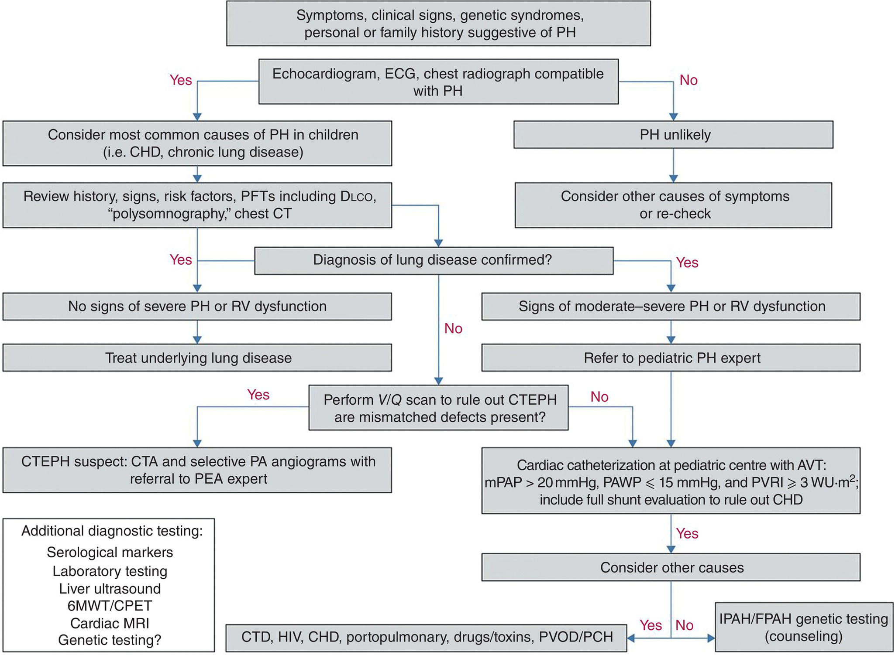

[**Figure 33.1**](#R_c33-fig-0001) Diagnostic algorithm for pulmonary hypertension (PH) in children. 6MWT, 6‐minutes walk test; AVT, acute vasodilator testing; CHD, congenital heart disease; CPET, cardiopulmonary exercise test; CT, computed tomography; CTA, CT angiography; CTD, connective tissue disease; CTEPH, chronic thromboembolic PH; DLCO, diffusing capacity of the lung for carbon monoxide; IPAH/FPAH, idiopathic/familial pulmonary arterial hypertension, mPAP, mean pulmonary arterial pressure; MRI, magnetic resonance imaging; PA, pulmonary artery; PAWP, pulmonary arterial wedge pressure; PCH, pulmonary capillary haemangiomatosis; PEA, pulmonary endarterectomy; PFT, pulmonary function test; PVOD, pulmonary veno‐occlusive disease; PVRI, pulmonary vascular resistance index; RV, right ventricular; V/Q, ventilation/perfusion; WU, Wood Units.

(Source: Rosenzweig et al. \[3\]. Reproduced with permission of European Respiratory Society.)

PH is a rare disease. The incidence and prevalence of PH in the pediatric population are not well known. In the Netherlands' registry, the annual incidence of IPAH and PAH‐CHD were 0.7 and 2.2 cases/million, respectively. The prevalence of PAH‐CHD was 15.6 cases/million \[10\]. The national registry from the United Kingdom reports similar numbers with an annual incidence of IPAH of 0.48 cases/million children and a prevalence of 2.1 cases/million \[20\]. In a multicenter study in France, the estimated prevalence of PAH was 3.7 cases/million children, with IPAH (60%) and PAH‐CHD (24%) being the main etiologies \[21\].

Survival for patients with PH has improved with the introduction of management guidelines, dedicated centers, and new drug therapies. Before targeted drug therapies were available for PH, the estimated median survival of children and adults with IPAH were similar, 4.12 and 3.12 years, respectively \[22\]. After the introduction of targeted pulmonary vasodilators, the survival rate for children with PAH has continued to improve. In the combined pediatric and adult US REVEAL (Registry to Evaluate Early and Long‐Term PAH Disease Management) registry, patients with childhood onset PAH had 1‐, 3‐, and 5‐year survival rates of 96, 84, and 74%, respectively \[23\]. There was no significant difference in 5‐year survival between IPAH/HPAH (75%) and PAH‐CHD (71%). Similar data have been published from studies in the Netherlands and United Kingdom \[20, 24, 25\]. Although overall survival has improved, patients with repaired CHD and pulmonary hypertensive vascular disease have a high mortality risk.

## Pathophysiology of pulmonary hypertension in congenital heart disease

PH associated with CHD is classified in group 1, PAH. This group distinguishes itself from the other four categories by its characteristic pattern of vascular remodeling, progressive nature, and response to specific medical therapy. Heath and Edwards published the first description of pulmonary vascular remodeling due to CHD in 1958 \[26\]. They divided the histological progression from grades 1 to 6 in increasing severity. Later, Rabinovitch developed the morphometric approach, which quantifies the thickness of the pulmonary arterial muscle, the degree of abnormal distal extension of smooth muscle, and the density of small pulmonary arteries relative to the number of alveoli \[27\]. The morphometric structural findings are graded from A through C in increasing severity of changes. This morphometric analysis has contributed to our understanding of pulmonary vascular remodeling by establishing that abnormal extension of smooth muscle and a reduction of small artery density are a hallmark of pulmonary hypertensive vascular disease. This approach has emphasized that early age to correct congenital heart defects helps preserve small pulmonary arteries and predicts good pulmonary hemodynamics postoperatively. The pulmonary vascular remodeling that is characteristic for PAH involves adventitial thickening, medial hypertrophy, and intimal proliferation, including the formation of plexiform lesions \[28\]. This vascular remodeling leads to arterial wall thickening and occlusion of small distal pulmonary arteries. Together with other mechanisms including vasoconstriction, inflammation, and thrombosis, the vascular wall thickening and occlusion will consequently increase PAP and PVR ([Figure 33.2](#c33-fig-0002)) **\[**29\]. This increase in right ventricular (RV) afterload increases RV workload, eventually resulting in RV failure.

The pulmonary vascular bed plays a key role in the presentation and management of children with almost all forms of CHD. Four variables are important in the development of pulmonary hypertensive vascular disease and whether it will regress or progress after repair of a congenital cardiac shunt lesion:

1.  The age of the patient at repair
2.  The type of cardiac lesion
3.  The PVRI at operation
4.  Individual genetic and environment factors and comorbidities

The evolution of PAH‐CHD and the age at which it presents itself depends on the type of shunt lesion. In patients with a shunt at the pretricuspid valve level (e.g. ASD), there is an increased pulmonary volume load with a normal pressure load. Only 5–20% of these patients will develop severe PAH, and usually not until the third or fourth decade of life \[30, 31\]. In patients with nonrestrictive shunts at the posttricuspid valve level, the increased pulmonary volume is accompanied by an increased pressure load due to pressure equalization across the shunt defect. In these patients, PAH usually develops more rapidly during the first few years of life. If left uncorrected, these systemic to pulmonary shunts will result in steadily increasing PVR, and when this exceeds the systemic vascular resistance (SVR), the shunt will reverse resulting in hypoxemia and cyanosis, which are the hallmarks of Eisenmenger syndrome \[5\]. For this reason, most CHD shunt lesions should be repaired within the first 2 years of life. The exact level of PVRI that precludes safe closure of a defect is often debated and varies with each lesion. The WSPH proposed criteria for shunt closure in patients with net left‐to‐right shunting ([Table 33.7](#c33-tbl-0007)) \[32\]. Complex congenital heart defects, such as transposition of the great arteries, truncus arteriosus, and aortopulmonary window, present with pulmonary hypertensive vascular disease much earlier and should, therefore, be repaired in the first weeks of life.

Patient genetic and environmental factors may influence the timing of repair of congenital heart defects with PAH. Pediatric PAH occurs in 20–40% of children with genetic disorders, including trisomy 21, Noonan, Velocardiofacial, and Jacobsen syndromes \[18\]. Furthermore, many children with PAH have clinical signs of a syndrome, such as dysmorphic features, which cannot be explained by a known syndrome diagnosis or genetic test. The frequent occurrence of genetic abnormalities in children with PAH suggests the existence of still unknown genetic pathways involved in the disease process of PAH. The BMPR‐2 mutation has been described in 6% of children with CHD \[33\]. Comorbidities may also exacerbate PAH‐CHD. For example, children with trisomy 21 are at higher risk of developing PH due to sleep‐disordered breathing, upper airway obstruction, silent aspiration with recurrent pneumonias, and pulmonary hypoplasia \[34\]. The net result is episodes of hypoxia, which in turn may exacerbate the pulmonary vascular disease from CHD. In developing countries, there may be additional comorbidities to consider. In Africa, in a cohort of children with CHD, 53% were anemic, 47% underweight, and 33% had marasmus compared to a control group without CHD, of whom none had marasmus and only 14% were underweight \[35\]. Tuberculosis is twice as common in patients with CHD, especially in those with lesions with an increased pulmonary blood flow, and if treatment is available, the major cause of morbidity is delay of cardiac surgery \[36\]. Unfortunately, tuberculosis may mask the signs of CHD and result in a delay in diagnosis of CHD and subsequent surgical repair. Human immunodeficiency virus (HIV) infection is endemic in sub‐Saharan Africa. In Uganda, CHD affects 5% of children with HIV compared to 3% in developed countries \[37\]. More recently, coronavirus disease 2019 (COVID‐19) has had a catastrophic impact on global health. The virus responsible for the pandemic is severe acute respiratory syndrome coronavirus 2 (SARS‐CoV‐2), and the most frequently reported comorbidities in children who become critically ill with the virus are chronic lung disease, obesity, neurodevelopmental disabilities, and CHD. Patients with PH are vulnerable to SARS‐CoV‐2, as it is a respiratory virus that causes PH via multiple pathways including lung inflammation and fibrosis, vasoconstriction, and thrombosis \[38\].

Environmental factors may also influence the timing of surgical repair of congenital heart defects. High altitude has effects on normal neonatal pulmonary vascular transition that is related not only to altitude but also to ancestry. Ethnic groups with recent migration to high altitude have lower oxygen saturations and higher PAP than those with a long ancestry of high altitude living, such as native residents of the Andes mountain range and Tibet. In addition, the incidence of CHD increases at higher altitude, the ductus arteriosus is larger, and its closure delayed, with a higher pulmonary to systemic blood flow ratio for a given PVR. As a result, management decisions, particularly the timing of surgical repair, are different at high altitude \[39, 40\].

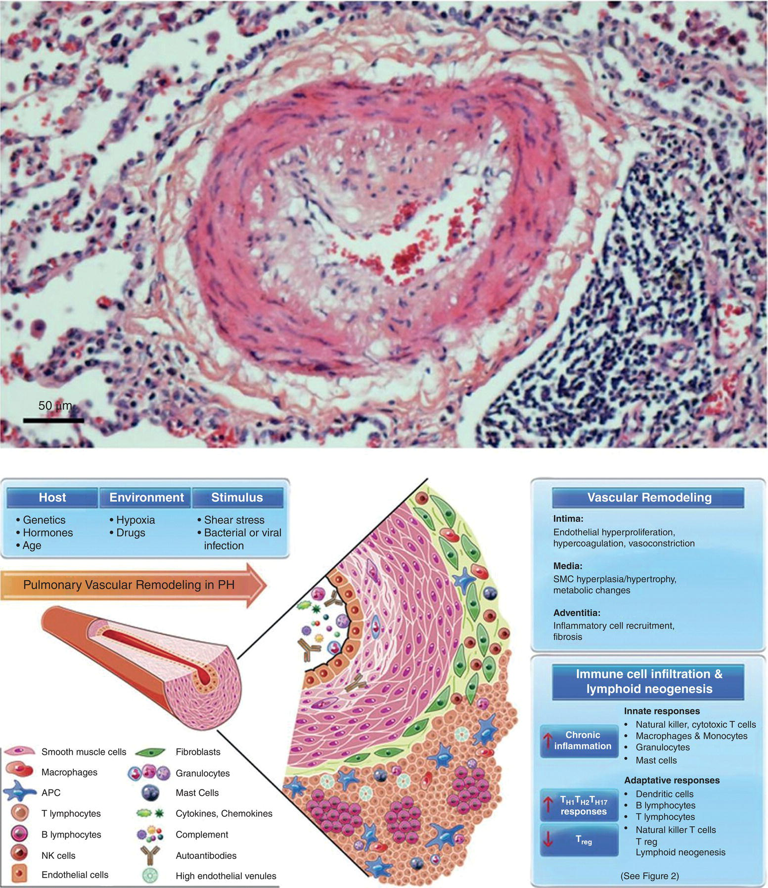

[**Figure 33.2**](#R_c33-fig-0002) Pulmonary vascular changes in pulmonary arterial hypertension includes infiltrating adaptive and innate immune cells. In the top panel is a representative histopathology of a vessel with severe neointimal formation represented below by a diagrammatic illustration. The histopathology shows a single endothelial layer and an eccentric neointima (pale pink) that contains cells that have markers of inflammatory cells and others that stain with markers of smooth muscle but appear poorly differentiated. The medial muscular layer is expanded, and there is an abundant adventitial layer. This vessel is decorated with complement and autoantibodies, infiltrated by neutrophils in the lumen attacking the vessel wall and other inflammatory cells binding to the endothelium and infiltrating. The neointima is composed of pale cells and matrix and infiltrating T and B cells, and in the adventitia, there are dendritic cells, macrophages, and mast cells, and in the periadventitial space tertiary lymphoid follicles characterized by T cells, B cells, and plasmacytoid dendritic cells (APC). NK indicates natural killer; PH, pulmonary hypertension; and SMC, smooth muscle cell.

(Source: Rabinovitch et al. \[29\]. Reproduced with permission of Wolters Kluwer Health, Inc.)

* * *

### KEY POINTS: CLASSIFICATION AND DEFINITION OF PH

-   The current definition of PH is an mPAP > 20 mmHg at rest, as measured by right heart catheterization. However, this abnormal elevation of mPAP in isolation is not sufficient to define pulmonary vascular disease, as it can be due to an increase in cardiac output or pulmonary artery occlusion pressure (PAOP).
-   Hemodynamic definitions of PH include precapillary, isolated postcapillary, or a combination of both.
-   The clinical classification of PH is divided into five groups.
-   There are additional definitions of PH in children, including those with single ventricle physiology.
-   Evolving definitions of PH utilize the principles of phenomics (genomics, transcriptomics, proteomics, and metabolomics) to redefine PH at the molecular level.

* * *

[**Table 33.7**](#R_c33-tbl-0007) Guidance for assessing operability in pulmonary arterial hypertension associated with congenital heart disease

Source: Rosenzweig et al. \[3\]. Reproduced with permission of European Respiratory Society.

| PVRI wood units (m2) | PVR wood units | Correctability/favorable long‐term outcome |
| --- | --- | --- |
| <4 | <2.3 | Yes |
| \>8 | \>4.6 | No |
| 4–8 | 2.3–4.6 | Individual patient evaluation in tertiary center |

Special considerations include age of patient, type of defect, and comorbidities, resting or exercise‐induced desaturation is a concern and PAH therapy (treat with intent‐to‐repair approach has not been proven).

## Assessment of pulmonary hypertension

The clinical assessment of the child with PAH and CHD is aimed at differentiating those with reversible pulmonary vascular disease who are operable from those with irreversible or fixed disease. In cases that are not straightforward, it is important to put together all the clinical information without relying on one single parameter. The clinical presentation of pediatric PH is nonspecific and age‐dependent. The most common presenting symptom is reduced exercise capacity accompanied by fatigue and dyspnea. Young infants may present with feeding problems and failure to thrive. Other presenting symptoms include cyanosis, cough, and chest or abdominal pain. Syncope as a presenting symptom is specific to pediatric PH and is reported in 25–30% of children with PH and is most frequent in patients without a shunt defect \[18–20\]. There is often a long delay between the onset of symptoms and diagnosis due to the low specificity of presenting symptoms and the rarity of the disease. Screening should take place for children belonging to high‐risk groups based on underlying conditions of family members with PH.

The functional status of children and adults with PH, with respect to exercise capacity and symptoms, can be classified using the WHO Functional Classification (WHO‐FC) \[41\]. The WHO‐FC scale is based on the New York Heart Association (NYHA) classification, which evaluates symptoms including limitation of physical activity, dyspnea, fatigue, chest pain, and right heart failure. Although the WHO functional class is not designed specifically for children, it has been shown to correlate with 6‐minute walk distance and hemodynamic parameters \[21, 23, 24, 42\]. Another scale has been developed for children, the age‐adjusted Panama Functional Classification (Panama‐FC) \[43\]. In children, both the WHO‐FC and Panama‐FC scales have been shown to correlate well with PH disease progression. The Panama‐FC appears to be better for long‐term follow‐up, while the WHO‐FC appears to be better for short‐term monitoring, for example, after changes to treatment \[44\].

After a thorough history and physical examination of the patient, blood should be drawn for laboratory analysis including complete blood count, metabolic panel, coagulation profile, and biomarkers of PH. Biomarkers that specifically indicate the pathologic mechanism, the severity of the disease, and the treatment response would be ideal tools for the management of PH, but they are still the subjects of research. Anemia, hypocarbia, elevated uric acid, and C‐reactive protein levels are nonspecific markers of disease severity. Brain natriuretic peptide (BNP) and N‐terminal fragment of pro‐BNP, which reflect the degree of atrial stretch and heart failure, are recommended for disease monitoring \[45\].

Noninvasive imaging for the assessment of PH includes chest X‐ray, echocardiography, CT scan of the lungs, nuclear medicine ventilation perfusion scan, and magnetic resonance imaging (MRI) \[46\]. By the time the diagnosis of PH is made, 90% of patients have an abnormal chest X‐ray, although sensitivity and specificity are low \[47\]. Typical features on chest X‐ray include elevated cardiac apex due to RV hypertrophy, enlarged right atrium, prominent pulmonary outflow tract, enlarged pulmonary arteries, and pruning of peripheral pulmonary arteries.

Echocardiography provides information about the anatomic details of the lesion, assessment of shunt direction, and estimates of pulmonary artery pressures (PAPs) \[48\]. Echocardiography may support the diagnosis of PH with qualitative images of elevated RV pressure, such as RV hypertrophy and septal wall flattening. Quantitative information may be obtained on echocardiography if there is tricuspid regurgitation during systole ([Figure 33.3](#c33-fig-0003)). In this case, the modified Bernoulli equation may be applied to estimate PAP with a tricuspid regurgitant velocity of greater than 2.8 m/s being highly indicative of PH ([Box 33.2](#c33-fea-0002)) \[1, 49\]. Measurement of the end‐systolic RV to left ventricular (LV) diameter ratio correlates with invasive measurements of the severity of PH \[50\]. Echocardiography can provide information on the direction of flow through a shunt. A pure left‐to‐right shunt across a defect indicates that the PVR is lower than the SVR. The presence of reversed or bidirectional flow across an ASD, PDA, or VSD is concerning and suggests the need for cardiac catheterization and acute vasoreactivity testing. Transthoracic echocardiography is an attractive method to assess children with PH and possibly enable the cardiologists to lengthen the interval between cardiac catheterizations required to monitor ongoing therapy. There are many echocardiographic techniques in the research and validation phase. One technique is to monitor the RV systolic to diastolic duration ratio, in which an increase has been shown to be associated with worse RV function, exercise capability, and survival \[51\]. Another technique using echocardiography is to measure the degree of tricuspid annular plane systolic excursion (TAPSE), which has been shown to reflect RV function and prognosis in PH \[52, 53\].

* * *

### [Box 33.2](#R_c33-fea-0002) : Estimating PAP from systolic tricuspid regurgitant jet velocity on echocardiography

-   sPAP = systolic pulmonary artery pressure
-   RAP = right atrial pressure
-   mPAP = mean pulmonary artery pressure

Modified Bernoulli equation:

Converting sPAP to mPAP

_v_ = tricuspid regurgitation velocity using Doppler echocardiography

* * *

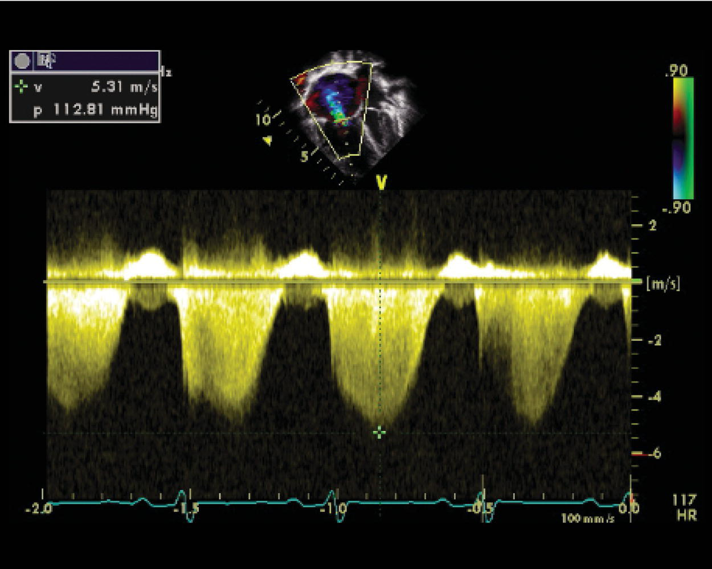

[**Figure 33.3**](#R_c33-fig-0003) Echocardiographic image showing Doppler of tricuspid regurgitant jet used to estimate pulmonary artery pressure.

(Source: Figure supplied by Dr. Mark Twite and Dr. Robert Friesen.)

MRI is being increasingly used to evaluate patients with PH. MRI allows high spatial resolution of the intracardiac structures and vasculature involved in PH pathophysiology ([Figure 33.4](#c33-fig-0004)). MRI is not constrained by body habitus and patients with poor acoustic windows and surgical scars. The unusual geometry of the RV does not preclude accurate measurements of RV volume and ejection fraction (EF). Advances in MRI have allowed detailed assessment of flow through the heart and vasculature and reflect vascular hemodynamics and vascular remodeling. Techniques such as four‐dimensional flow MRI (4D‐Flow MRI) provide blood velocity data in all spatial directions, which allows for flow analysis of complex hemodynamic patterns \[54, 55\]. An example of how this technology may be applied is shown in [Figure 33.5](#c33-fig-0005). MRI is a promising tool to comprehensively describe the entire RV–PA axis and the involvement of the left heart. Machine learning approaches to improve automation and accuracy of MRI metrics and identify imaging features of PH are an area of active research with promising clinical utility \[46, 56, 57\]. The combination of MRI and direct PAP measurement via a catheter may provide more information than either test alone.

Despite advances in noninvasive imaging techniques, cardiac catheterization with vasodilator testing is necessary for diagnosis, treatment stratification, and prognosis of PH in children \[58\]. There are three objectives during the catheterization procedure: to obtain hemodynamic data, to test vasoreactivity, and to rule out any associated disease states. Accurate hemodynamic data are essential for the diagnosis and ongoing monitoring of patients with PH. End hole or flow‐directed catheters are used to obtain hemodynamic data. Catheters with multiple side holes are used for angiography to prevent myocardial staining during injection. During catheterization, baseline measures include right atrial pressure, PAP, systemic arterial pressure, mixed venous and systemic arterial saturation, cardiac output, and PAOP. From these measures, important calculations can be made for pulmonary to systemic flow ratio (_Q_p : _Q_s) ([Box 33.3](#c33-fea-0003)) and PVR ([Box 33.4](#c33-fea-0004)) \[59, 60\]. It is essential that the anesthesiologist maintains stability during these periods of measurement and that the conditions under which they are made are clearly communicated. Most cardiac catheterization laboratories will obtain baseline measurements in room air, followed by 70–100% oxygen and then introduce an acute vasodilator such as inhaled nitric oxide (iNO) 20–40 parts per million (ppm). In a recent review of cardiac catheterization laboratory protocols and hemodynamic data in pediatric patients with PH, general anesthesia was found to decrease systemic arterial pressure, but there was no difference between general anesthesia and procedural sedation on mPAP or PVRI. It also demonstrated that pediatric patients with PH demonstrate a higher incidence of PH associated with CHD and neonatal‐specific disorders compared to adults. The review also points out that pediatric PH had baseline mPAP < 40 mmHg but was \>50% of their systemic blood pressure, illustrating the difficulty of applying adult criteria to children with PH \[61\].

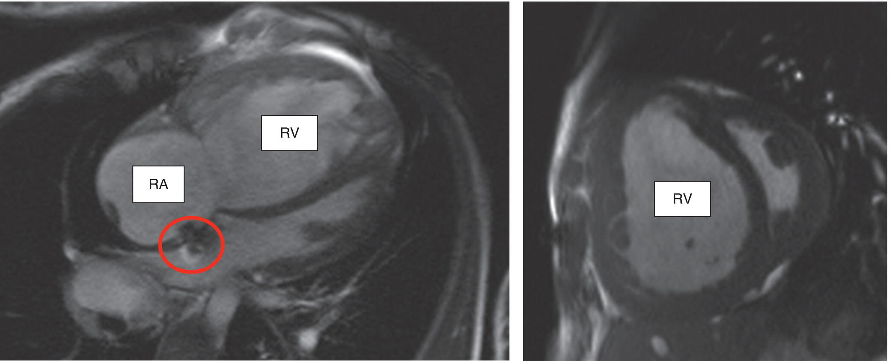

[**Figure 33.4**](#R_c33-fig-0004) Still MRI cine images demonstrating features of pulmonary hypertension. Both images are from the same patient. Left image: this horizontal long long‐axis, four four‐chamber view of the heart demonstrates an enlarged right atrium (RA) and dilated right ventricle (RV). There is a stent placed in an atrial septostomy (red circle), with dephasing artifact showing bidirectional flow. Right image: this short short‐axis, mid‐ventricular view shows RV dilation and severe septal flattening and septal shift towards the left ventricle.

(Source: Images courtesy of Dr. Richard Friesen.)

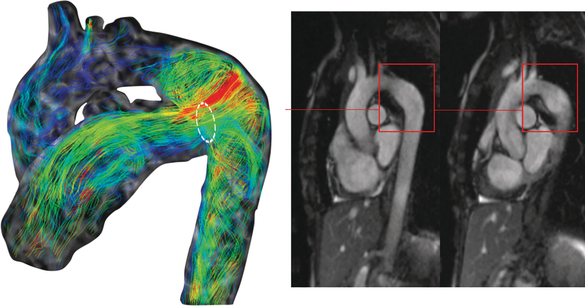

[**Figure 33.5**](#R_c33-fig-0005) Four‐dimensional flow magnetic resonance imaging (4D‐Flow MRI) of a Potts shunt. Vortex formation is seen at the aortic entrance of the Potts shunt. In this region (red square), aneurysmal dilation of the aorta is demonstrated by bright blood imaging. Aneurysmal dilation in this situation has been postulated to be associated with abnormal flow hemodynamics creating localized pressure‐–volume stress on the aortic wall.

(Source: Schäfer et al. \[55\]. Reproduced with permission from John Wiley & Sons.)

* * *

### [Box 33.3](#R_c33-fea-0003) : Calculating _Q_p and _Q_s

-   _Q_ p = pulmonary blood flow
-   _Q_ s = systemic blood flow
-   Sat Ao = aortic saturation
-   Sat MV = mixed venous saturation
-   Sat PV = pulmonary vein saturation
-   Sat PA = pulmonary artery saturation

Based on the Fick principle

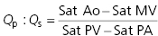

* * *

* * *

### [Box 33.4](#R_c33-fea-0004) : Calculating PVR

-   PVR = pulmonary vascular resistance
-   PVRI = pulmonary vascular resistance index
-   _P_ = pressure
-   _Q_ p = pulmonary blood flow
-   PAP = pulmonary artery pressure
-   LAP = left atrial pressure (equivalent to pulmonary artery occlusion pressure PAOP)

Based on Ohm's Law

* * *

The degree to which mPAP and PVR can be decreased acutely by the administration of fast‐acting, short‐duration vasodilators reflects the extent to which vascular smooth muscle constriction is contributing to the hypertensive state. The response to vasodilators has important therapeutic implications in PH, and almost all patients will undergo a vasodilator trial during their initial cardiac catheterization. Three separate situations may be evaluated with the acute vasodilator trial: potential treatment with calcium channel blockers (CCBs), assessment of operability in children with CHD, and determining prognosis. Inhaled nitric oxide at 10–80 ppm is the preferred selective pulmonary vasodilator, but intravenous epoprostenol, intravenous adenosine, or inhaled iloprost may be used as alternatives. However, optimal dosing in small children is not well defined for the latter drugs. The Sitbon criterion for a positive vasodilator response in adults is a reduction in mPAP by at least 10 mmHg, to a value of <40 mmHg, with sustained cardiac output \[62\]. The same Sitbon criteria are now used in children, as it has been shown that responders have a sustained benefit from CCB therapy \[63\]. It is estimated that 70–90% of children with severe PH are nonresponders to acute vasodilator testing and therefore require therapy other than calcium channel antagonists \[8, 64\]. In the cardiac catheterization lab, balloon occlusion of a shunt is the best means of demonstrating the short‐term effect of shunt closure on PAP. It must be emphasized that cardiac catheterization of children with PH should be performed in experienced centers able to manage potential complications such as PH crisis requiring extracorporeal membrane oxygenation (ECMO) support \[65, 66\].

* * *

### KEY POINTS: ASSESSMENT OF PH

-   A comprehensive evaluation of patients with newly diagnosed PH is essential to determine management and prognosis.
-   Cardiac catheterization with direct measurement of PAP, calculation of pulmonary vascular resistance and pulmonary vasoreactivity testing, is the gold standard for assessment. It is essential that the anesthesiologist maintains stability during these periods of measurement and that the conditions under which they are made are clearly communicated.
-   Noninvasive techniques are used to monitor patients with PH including echocardiography and increasingly cardiac MRI.

* * *

## Medical management of pulmonary hypertension

The factors leading to an increase in mPAP may all eventually result in increased PVR and pulmonary hypertensive vascular disease. As the pulmonary vasculature remodels in PH, there are changes that may be reactive or fixed. Reactive changes will result in vasodilation of the pulmonary vasculature to an exogenously administered pulmonary vasodilator such as iNO. Fixed changes are unreactive to such pulmonary vasodilators. As the disease processes leading to PH progress, the cross‐sectional area of the pulmonary vasculature decreases according to Poiseuille's law leading to increased PVR. Poiseuille's law states that the resistance of a vessel is proportional to the fourth power of the radius. In other words, as the pulmonary arterioles develop thickening of their walls and a smaller intraluminal radius, the resistance will increase exponentially. A pulmonary hypertensive crisis is an acute on chronic increase in PVR during the perioperative period due to an acute increase in vascular tone of the reactive portion of the pulmonary vasculature. Early recognition and appropriate management of a pulmonary hypertensive crisis can be lifesaving.

The current treatment strategies for PH are aimed at three pathological processes. Vasodilators treat reactive vasoconstriction, antiproliferative drugs attenuate vascular remodeling, and anticoagulation may be used to treat and prevent thrombosis from forming in narrowed vessels. On the basis of the understanding of abnormalities of the vascular endothelium, three classes of pulmonary vascular vasodilating drugs have been studied for the treatment of PH: prostacyclin analogs, endothelin receptor antagonists (ERAs), and phosphodiesterase‐5 inhibitors (PDE‐5i; [Figure 33.6](#c33-fig-0006)) \[67–69\]. The beneficial effects of these drugs, including increased exercise capacity, improved quality of life, and increased survival, have been demonstrated mainly in adults. Due to the complex etiology and relative lack of data in children with PH, the selection of appropriate therapies remains difficult. A treatment algorithm based on expert opinion was proposed at the WSPH in 2018 ([Figure 33.7](#c33-fig-0007)) \[9\].

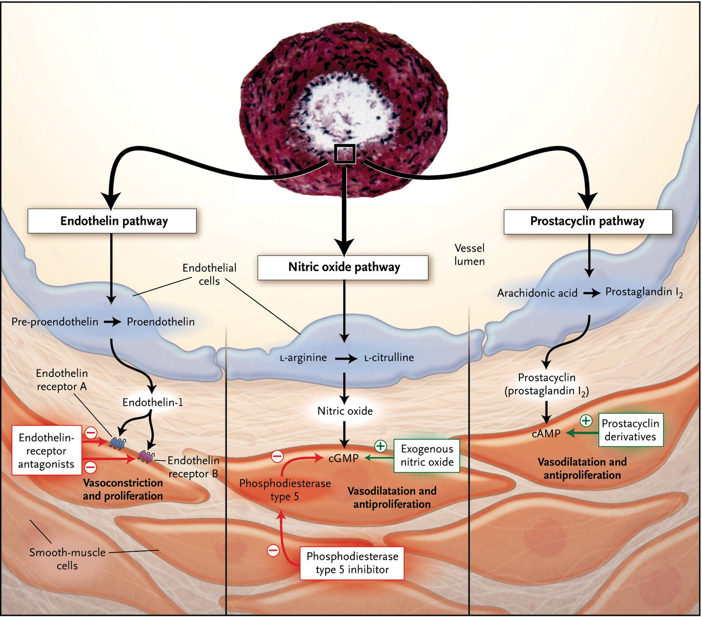

[**Figure 33.6**](#R_c33-fig-0006) Therapeutic drug targets in pulmonary arterial hypertension. At the top of the figure, a transverse section of a small pulmonary artery from a patient with severe PAH shows intimal proliferation and medial hypertrophy. Dysfunctional pulmonary‐artery endothelial cells (blue) have decreased production of prostacyclin and endogenous nitric oxide, with an increased production of endothelin‐1 – a condition promoting vasoconstriction and proliferation of smooth muscle cells in the pulmonary arteries (red).

(Source: Humbert et al. \[67\]. Reproduced with permission of Massachusetts Medical Society.)

The ultimate management goals of PH in children are to increase survival and allow the normal activities of childhood without the need to self‐limit. Supportive therapies may include the use of oxygen, anticoagulants, and digoxin. Diuretics may be used, but care should be taken not to decrease intravascular volume due to the preload dependence of the right ventricle. Although no controlled data exist, vaccination against influenza and pneumococcal disease is recommended in children and adults with PH, and respiratory syncytial virus (RSV) prophylaxis should be considered in infants with PH \[70, 71\].

### Calcium channel blockers (CCBs)

Acute responders to vasodilator testing are treated with CCB such as amlodipine, nifedipine, and diltiazem. CCB inhibits the calcium influx through the slow channel into the cardiac and smooth muscle cells, causing relaxation of the pulmonary vascular smooth muscle. Adults with IPAH, who were acute responders to vasodilator testing and treated with CCB, showed improved 5‐year survival (94%) compared to those not treated with CCB (55%) \[72\]. However, because CCB may have negative inotropic effects in young children, they should be avoided until the child is older than 1 year \[62, 73\].

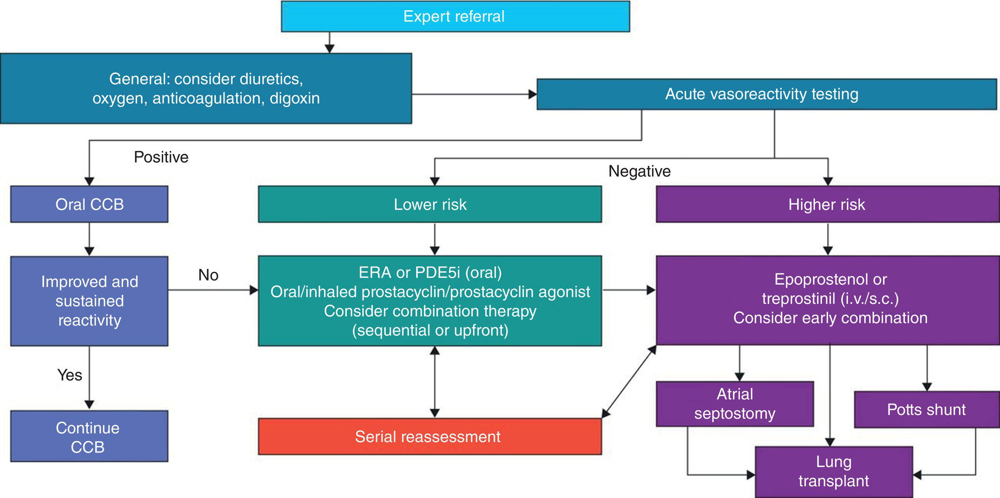

[**Figure 33.7**](#R_c33-fig-0007) World Symposium on Pulmonary Hypertension 2018. Pediatric idiopathic/familial pulmonary arterial hypertension treatment algorithm. CCB, calcium channel blocker; ERA, endothelin receptor antagonist; IV, intravenous; PDE5i, phosphodiesterase type 5 inhibitor; SC, subcutaneous.

(Source: Rosenzweig et al. \[3\]. Reproduced with permission of European Respiratory Society.)

### Prostanoids

Patients with PH have reduced expression of prostacyclin synthetase in pulmonary arteries \[74\]. The prostanoids, which are prostacyclin analogs, act via cyclic AMP in the smooth muscle cell to produce vasodilation. They may also have some antiproliferative effects.

#### Epoprostenol (Flolan®)

This prostacyclin analog has a very short half‐life (3–6 minutes) and needs to be administered continuously, usually through a permanent central venous catheter. Side effects include facial flushing, headache, jaw pain, and abdominal pain.

#### Treprostinil (Remodulin®, Tyvaso®)

This prostacyclin analog has a longer half‐life (4–5 hours) but needs to be administered by subcutaneous injection. Pain at the injection site severely limits the use of this drug in children. For those able to tolerate frequent subcutaneous injections, the side effects are similar to epoprostenol. Other administration routes are under investigation, and the inhaled route has been shown to be effective \[75–77\].

#### Iloprost (Ventavis®)

This prostacyclin analogue is delivered by the inhaled route, and because of its short half‐life (20–30 minutes), it needs to be administered six to nine times/day. This frequency of administration, in addition to the side effect of increased lower airway reactivity, has limited its use in the chronic treatment of children with PH \[78\].

### Endothelin receptor antagonists (ERA)

Endothelin is a potent endogenous vasoconstrictor that acts via the endothelin type 1 receptor (ET). This ET receptor has two subtypes, ETA and ETB, which are present in pulmonary vascular smooth muscle cells, producing vasoconstriction when activated. ETB receptors are also present in the pulmonary vascular endothelium and when activated produce vasodilation. Despite the differences in receptor subtype activity depending on location, both nonselective ETA/ETB receptor antagonists \[_Bosentan_ (Tracleer®)\] and selective ETA receptor antagonists \[_Ambrisentan_ (Letairis®)\] are similarly effective in patients with PH. Both ERA may be administered via the oral route and require close monitoring of liver function tests.

### Phosphodiesterase‐5 inhibitors (PDE‐5i)

Nitric oxide acts via a cyclic GMP (cGMP) pathway in the pulmonary artery smooth muscle cell to produce vasodilation. This pathway may be stimulated directly with iNO or the breakdown of cGMP may be inhibited by PDE‐5i, resulting in increased cGMP and pulmonary vascular vasodilation. These inhibitors also have antiproliferative effects.

#### Sildenafil (Revatio®)

Sildenafil is an oral PDE‐5i usually administered three times daily. Pediatric PH treatment with sildenafil has changed significantly since the STARTS 1 and 2 trials (Sildenafil in Treatment Naïve Children with PH) \[79\]. These trials were worldwide, randomized, double‐blind, placebo‐controlled studies of oral sildenafil monotherapy in low, medium, and high doses. The studies found that functional capacity only improved with high dose sildenafil and PVR improved with medium and high dose sildenafil, but mPAP was lower only with medium dose sildenafil. However, hazard ratios for mortality were 3.95 for high versus low dose and 1.92 for medium versus low dose. Review of these data by the US Food and Drug Administration (FDA) and the European Medicines Agency (EMA) resulted in different recommendations. Sildenafil was approved for use by the EMA in 2011 with a warning on avoiding higher doses. In 2012, the FDA issued a warning against the use of all doses of sildenafil for children with PH \[80, 81\].

#### Tadalafil (Adcirca®)

Tadalafil is an oral PDE‐5i that has the advantage of once daily administration. Its side effect profile is similar to sildenafil including headache, flushing, nausea, myalgia, and nasal congestion \[82\].

### Atrial septostomy and lung transplantation

Atrial septostomy performed in the cardiac catheterization laboratory should be considered in the child with worsening PH despite optimal medical therapy. The resulting improvement in cardiac output with decompression of the right heart is at the expense of hypoxemia. Features of a high‐risk patient for this procedure include high right atrial pressure and low cardiac output, both of which increase mortality 5–15% \[83\]. Atrial septostomy may be considered as an initial procedure or as a bridge to lung transplantation. An alternative procedure that has been described as an option for patients with severe PH is the creation of a reverse Potts Shunt. This shunt is a window created between the left pulmonary artery and the descending aorta, which equalizes the pulmonary and systemic arterial pressures ([Figure 33.8](#c33-fig-0008)) \[84, 85\]. The use of a reversed Potts shunt in suprasystemic PH is considered advantageous compared with atrial septostomy, as it provides high oxygen saturated blood to the coronary arteries and brain, but delivers desaturated blood to the lower body. Another benefit is hemodynamically there is relief of RV pressure overload in systole, and in part, also in diastole, with a subsequent reduction in interventricular septal shift toward the left ventricle with an improvement in LV performance. However, under conditions when the PAP falls below systemic pressure, there is a risk of reversing blood flow through the shunt, creating a left‐to‐right shunt which could be deleterious to the pulmonary circulation by volume loading the pulmonary arterial bed. Consequently, intermittent assessment of flow direction and patterns through the Potts anastomosis with advanced 4D‐Flow MRI may help guide treatment decisions \[54\] ([Figure 33.5](#c33-fig-0005)). The Potts shunt may be created surgically via a sternotomy or thoracotomy or percutaneously in the cardiac catheterization laboratory. This is a very high‐risk procedure with a mortality of 15% \[86\]. The anesthetic techniques used have been recently described and include a balanced and slowly titrated anesthetic with high‐dose opioids and anesthetic agents such as etomidate and ketamine to support blood pressure. Transesophageal echocardiography is helpful to monitor cardiac function and assess the aortic flow pattern. It also helps the placement of the arterial cannula if VA‐ECMO is needed emergently. Near infrared spectroscopy (NIRS) is valuable, as the difference between cerebral and renal NIRS values can indicate the adequacy of the Potts's shunt \[87, 88\]. The optimal timing of these procedures is unclear. End‐stage options for worsening PH unresponsive to therapy are lung or heart–lung transplantation. The median survival after lung transplantation in children is 4.9 years \[89\]. See [Chapter 32](c32.xhtml) for additional discussion of lung transplantation.

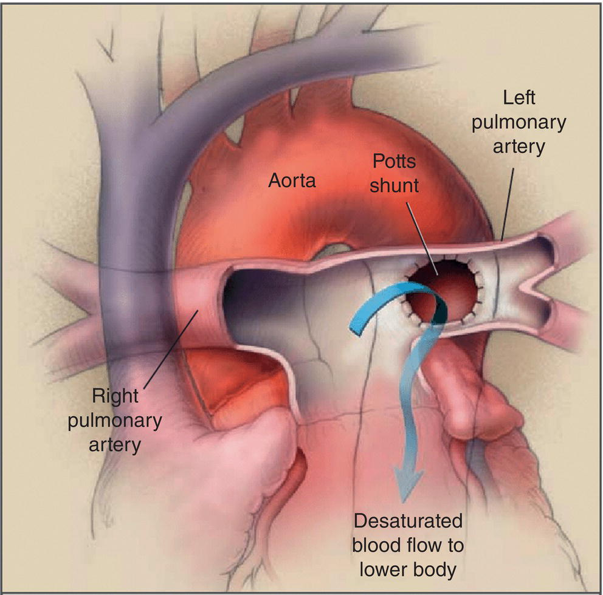

[**Figure 33.8**](#R_c33-fig-0008) The Potts shunt procedure. The left pulmonary artery is anastomosed to the descending aorta, allowing the desaturated blood to go from the left pulmonary artery to the lower part of the body (arrow). In this drawing, the right pulmonary artery passes in front of the ascending aorta because an arterial‐switch procedure had been performed in this early case report of two children who had suprasystemic pulmonary hypertension and right ventricular failure several years after an arterial switch surgery for transposition of the great arteries.

(Source: Blanc et al. \[84\]. Reproduced with permission of Massachusetts Medical Society.)

* * *

### KEY POINTS: MEDICAL MANAGEMENT OF PH

-   Three classes of pulmonary vascular vasodilating drugs are available for the treatment of PH: prostacyclin analogs, ERAs, and PDE‐5 inhibitors.
-   CCBs are selectively used for outpatient PH treatment in patients who have a positive response during acute vasoreactivity testing.
-   Inhaled nitric oxide is an effective selective pulmonary vascular vasodilator and is frequently used in the perioperative management of patients with PH.
-   End‐stage management strategies include atrial septostomy, a reverse Potts shunt and lung transplant.

* * *

## Perioperative risk considerations

Children with PH are at risk of experiencing major perioperative cardiovascular adverse events, including cardiac arrest and death. Data from the Pediatric Perioperative Cardiac Arrest (POCA) registry suggest that a benchmark estimate of the incidence of perioperative cardiac arrest in all pediatric patients is 0.014% \[90\]. In comparison, children with PH experienced an incidence of perioperative cardiac arrest of 1.6% associated with all types of procedures and 10% associated with major surgical procedures, including cardiac surgery \[91\]. In a report of anesthesia‐related mortality in children, PH was found to be present in half of the deaths \[92\]. Preoperative PH has been shown to be a significant contributor to perioperative death associated with pediatric open cardiac surgery \[93\].

The presence of PH also adds significantly to perioperative risk in children undergoing cardiac catheterization ([Table 33.8](#c33-tbl-0008)). The incidence of cardiac arrest among all children undergoing cardiac catheterization was reported to be 0.45% \[94\] and 0.96% \[95\]. This incidence increased significantly when only children with PH undergoing cardiac catheterization were considered, with reports of 0.8% \[91\], 1.2% \[66\], 2.9% \[97\], and 5.7% \[98\].

[**Table 33.8**](#R_c33-tbl-0008) Estimated incidence of perioperative cardiac arrest and death in children with pulmonary hypertension (PH) compared with all children

| Population (reference) | Procedures (_n_) | Cardiac arrest (%) | Death (%) |
| --- | --- | --- | --- |
| All children \[90\] | All types (1,089,200) | 0.014 | 0.004 |
| Children with heart disease \[94\] | Cardiac catheterization (4,454) | 0.49 | 0.08 |
| Children with heart disease \[95\] | Cardiac catheterization (7,289) | 0.96 | 0.05 |
| Children with PH \[66\] | All except cardiac surgery (256) | 1.17 | 0.78 |
| Children with PH \[96\] | All except cardiac surgery (148) | 4.7 | 1.4 |
| Children with PH \[91\] | All types (192) | 1.6 | 0 |
| Children with PH \[97\] | All except cardiac bypass (284) | 2.11 | 1.06 |
| Children with PH \[66\] | Cardiac catheterization (141) | 2.13 | 1.42 |
| Children with PH \[98\] | Cardiac catheterization (70) | 5.71 | 1.43 |
| Children with PH \[97\] | Cardiac catheterization (168) | 2.98 | 1.19 |
| Children with PH \[91\] | Major surgery (20) | 10 | 0 |

Major complications are directly associated with the severity of PH, with suprasystemic PH patients experiencing a disproportionally greater incidence than those with systemic or subsystemic PH ([Figure 33.9](#c33-fig-0009)) \[66, 96, 97, 99\]. Factors contributing to perioperative risk in children with PH can be categorized into hemodynamic factors, patient factors, procedural factors, and anesthetic factors \[100\]. These are multiple, interactive, and additive ([Table 33.9](#c33-tbl-0009)).

### Pulmonary hypertensive crisis

Cardiac arrest in children with PH is often immediately preceded by an acute pulmonary hypertensive crisis, in which an acute increase in PVR leads to RV failure and a decrease in cardiac output. The right ventricle dilates and encroaches on the left ventricle, thus decreasing LV stroke volume, cardiac output, and mean systemic arterial pressure (MAP). Systemic hypotension then causes a decrease in coronary perfusion pressure, which exacerbates RV failure and causes biventricular ischemia. Monitors will demonstrate an increase in PAP accompanied by decreases in SpO2 and systemic blood pressure due to inadequate pulmonary blood flow and left heart filling. The self‐perpetuating cycle of biventricular failure associated with a pulmonary hypertensive crisis is illustrated in [Figure 33.10](#c33-fig-0010).

A pulmonary hypertensive crisis can be triggered by several stimuli that directly affect PVR or ventricular function ([Box 33.5](#c33-fea-0005)). The best known stimuli of increased PVR are hypoxia and acidosis, as demonstrated by the classic work of Rudolph ([Figure 33.11](#c33-fig-0011)) \[101\]. Subsequent confirmatory investigations have shown that low alveolar oxygen tension (PAO2) and respiratory acidosis due to hypercarbia are significant stimuli for pulmonary vasoconstriction ([Figure 33.12](#c33-fig-0012)) \[102, 103\]. Noxious tracheal stimulation is another known factor, as tracheal suctioning in the postoperative intensive care unit triggered a 70% increase in PVR and PAP in children with a history of PH \[104\]. Systemic hypotension caused by a decrease in SVR, stroke volume, or myocardial contractility can lead to inadequate coronary perfusion and RV ischemia and failure, thus triggering a pulmonary hypertensive crisis at another point in the cycle.

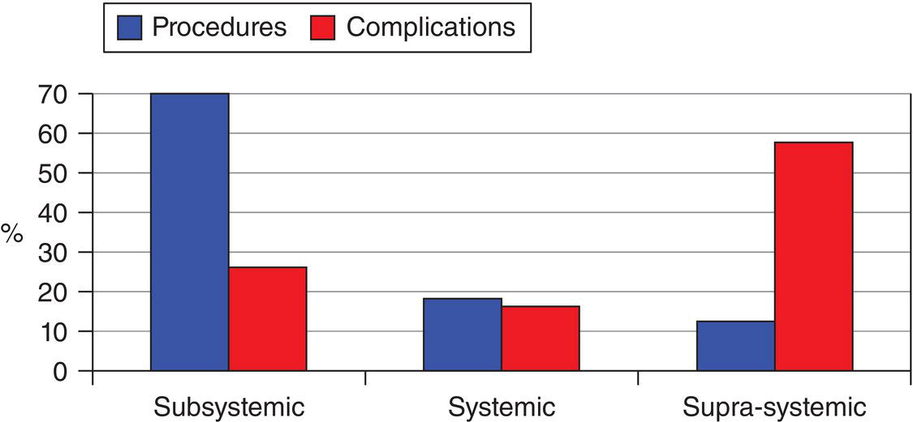

[**Figure 33.9**](#R_c33-fig-0009) The incidence of complications increases with the severity of pulmonary hypertension.

(Source: Carmosino et al. \[66\]. Reproduced with permission of Wolters Kluwer Health, Inc.)

[**Table 33.9**](#R_c33-tbl-0009) Perioperative risk factors for patients with pulmonary hypertension

Source: Adapted from Latham and Yung \[100\].

| Hemodynamic factors | Patient factors | Procedural factors | Postsurgical risks | Anesthetic factors |
| --- | --- | --- | --- | --- |
| CI <2.5 L/min/m2 | Recent onset or exacerbation of PH | Major surgery | Hypovolemia | General anesthesia |
| PAP/SAP ratio >0.75 | Age <1 year | Interventional cardiac cath | Systemic inflammation | ASA physical status >III |
| RAP >10–15 mmHg | Syncope | Long duration of procedure | Excessive pain | Unstable |
| PVRi >15 WU m2 | RV failure | Emergency procedure | Airway compromise | Difficult airway |
| Severe RV dysfunction | Failure to thrive |  |  | High opioid requirement |
| TAPSE <10 mm | WHO functional class III or IV |  |  |  |
| S/D ratio >1.4 (TR jet) | BNP >59.5 pg/mL |  |  |  |
| Pericardial effusion | Significant comorbidities |  |  |  |
|  | Chronic lung disease |  |  |  |
|  | Intercurrent illness |  |  |  |
|  | Abrupt withdrawal of PH therapy |  |  |  |
|  | Treatment‐naïve patients |  |  |  |

BNP, brain natriuretic peptide; CI, cardiac index; PAP, pulmonary artery pressure; PH, pulmonary hypertension PVRi, indexed pulmonary vascular resistance; RAP, right atrial pressure; RV, right ventricle; S/D, systolic/diastolic ratio; SAP, systemic arterial pressure; TAPSE, tricuspid annular plane systolic excursion; TR, tricuspid regurgitant; WHO, World Health Organization.

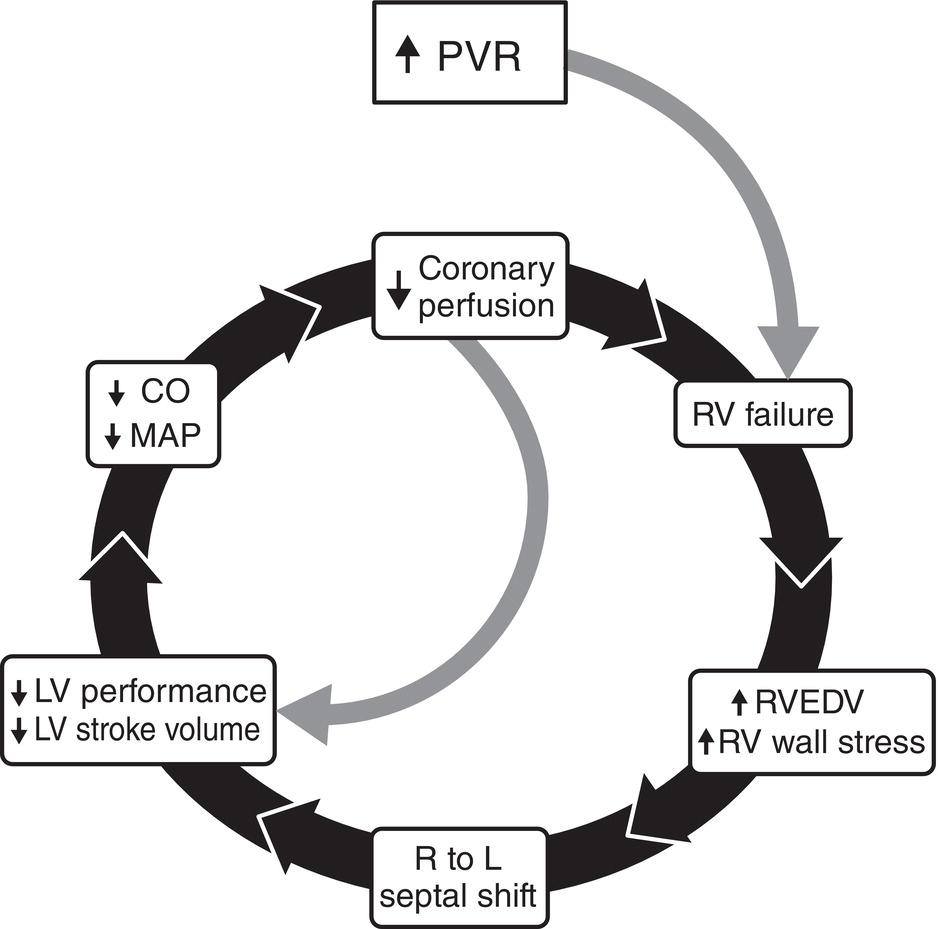

[**Figure 33.10**](#R_c33-fig-0010) The self‐perpetuating cycle of a pulmonary hypertensive crisis. The cycle can be entered at any point and culminates with cardiac arrest.

(Source: Figure supplied by Dr. Mark Twite and Dr. Robert Friesen.)

* * *

### [Box 33.5](#R_c33-fea-0005) : Triggering stimuli for perioperative pulmonary hypertensive crisis

-   Hypoxia
-   Acidosis
-   Hypercarbia
-   Noxious stimuli: pain, tracheal suctioning, agitation
-   Hypotension

* * *

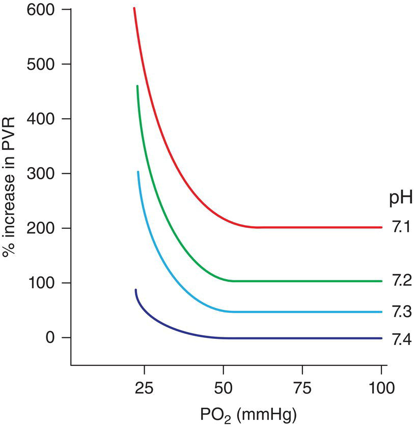

[**Figure 33.11**](#R_c33-fig-0011) Pulmonary vascular resistance (PVR) increases with hypoxia and acidosis.

(Source: Rudolph and Yuan \[101\]. Reproduced with permission of American Society for Clinical Investigation.)

Treatment of a pulmonary hypertensive crisis is directed toward ameliorating the stimulating event and stabilizing hemodynamics ([Table 33.10](#c33-tbl-0010)). Moderate hyperventilation with 100% oxygen, treatment of both respiratory and metabolic acidosis, and removal or attenuation of precipitating stimuli should be undertaken. An inhaled pulmonary vasodilator should be administered. Acute intravenous administration of pulmonary vasodilators can be associated with systemic hypotension, which may worsen coronary perfusion, so CCBs, sildenafil, and magnesium are generally not indicated for emergency treatment. Furthermore, pulmonary hypertensive crises have been observed to follow initiation of treatment of PH with intravenous prostacyclin analogs. Therefore, it is preferable in an urgent setting to administer pulmonary vasodilators by inhalation. This reduces the risk of systemic hypotension and coronary hypoperfusion by delivering the drug to the target pulmonary vasculature. In addition, the delivery of inhaled pulmonary vasodilators to well‐ventilated regions of the lung may benefit oxygenation by improving ventilation/perfusion matching. The standard for inhaled pulmonary vasodilators is iNO, but inhaled prostacyclin analogs, especially iloprost, are also effective in this and similar settings \[76, 105, 106\].

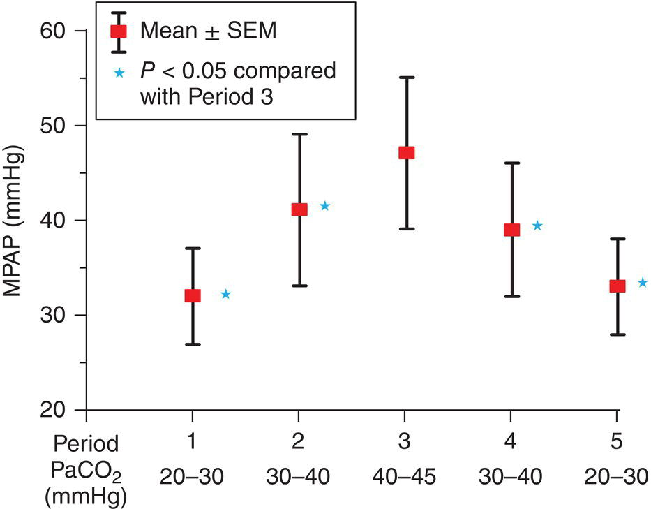

[**Figure 33.12**](#R_c33-fig-0012) Pulmonary artery pressure (MPAP) is directly related to PaCO2.

(Source: Morray et al. \[103\]. Reproduced with permission of Elsevier.)

[**Table 33.10**](#R_c33-tbl-0010) Treatment of a pulmonary hypertensive crisis

| Treatment | Rationale |
| --- | --- |
| Administer 100% O2 | ↑ PAO2 and PaO2 can ↓ PVR |
| Hyperventilate | PVR is directly related to PaCO2 |
| Exclude pneumothorax | Optimize ventilation |
| ↓ Mean airway pressure | Avoid Palv > Part |
| Correct metabolic acidosis | PVR is directly related to H+ level |
| Administer pulmonary vasodilators | iNO |
| Support cardiac output | Adequate preload and inotropic support, ECMO |
| Support coronary perfusion | Maintain SVR with epinephrine or vasopressin |
| Analgesia | Decrease sensory/sympathetic mediated ↑ PVR |

PAO2, alveolar oxygen pressure; PaO2, arterial oxygen pressure; PVR, pulmonary vascular resistance; PaCO2, arterial carbon dioxide pressure; Palv, alveolar pressure; Part, arterial pressure; H+, hydrogen ion; iNO, inhaled nitric oxide; ECMO, extracorporeal membrane oxygenation; SVR, systemic vascular resistance.

Early treatment of bradycardia with atropine or another chronotropic drug can be helpful. If systemic hypotension persists following administration of pulmonary vasodilators, inotropic support is indicated. Epinephrine infusion is a good choice for inotropic support during emergent treatment of a pulmonary hypertensive crisis because it will improve ventricular function and raise MAP while reducing the PVR/SVR ratio \[107, 108\]. Other inotropic drugs have potential disadvantages in this clinical situation. Dopamine can increase the PVR/SVR ratio \[107, 109\]. Dobutamine can decrease SVR (and coronary perfusion), as can loading doses of milrinone and levosimendan, often requiring coadministration of a vasopressor.

In addition to inotropic support, a systemic vasopressor can improve coronary perfusion and ventricular function by supporting SVR and may avert cardiac arrest. For this purpose, arginine vasopressin and its synthetic analog, terlipressin, which increase SVR but not PVR \[110–112\], are preferable to phenylephrine, which is both a pulmonary and systemic vasoconstrictor \[110, 113\]. Although norepinephrine is used less frequently in children, its pressor effects are favorable, as MAP is increased while the PVR/SVR and PAP/SAP ratios are decreased \[113–115\].

Once the cycle of increased PVR and decreased ventricular function begins, however, cardiac arrest may be difficult to prevent. If cardiac arrest occurs, Pediatric Advanced Life Support guidelines for cardiopulmonary resuscitation should be followed \[116\]. Cardiac arrest associated with a pulmonary hypertensive crisis can be difficult to treat, and emergent use of ECMO may be necessary \[117\]. If emergent ECMO is required, improved outcomes are associated with shorter duration of cardiopulmonary resuscitation prior to ECMO \[118\], so an institutional protocol that anticipates the need for emergent ECMO in these situations is desirable.

* * *

### KEY POINTS: PERIOPERATIVE RISK

-   Children with PH are at increased risk of cardiac arrest and death under anesthesia. Those with suprasystemic PH are at greatest risk.
-   Acute pulmonary hypertensive crisis is life‐threatening, creating a cycle of ventricular failure, hypoxia, and cardiac ischemia. Triggering stimuli should be avoided, and treatment immediately started.
-   Institutions caring for patients with severe PH should have experience in the emergent use of ECMO in these patients.

* * *

## Anesthetic management

Anesthetic management of the child with PH requires thoughtful preparation regarding the choice of anesthetic drugs, airway management, avoidance of triggering stimuli, prophylactic pulmonary vasodilators, and appropriate monitoring ([Box 33.6](#c33-fea-0006)).

### Hemodynamic effects of anesthetic drugs

The ideal anesthetic drug for children with PH would have pulmonary vasodilating effects, would not depress cardiac contractility, would maintain SVR and cardiac output, and would be short lasting and easy to titrate. Such an anesthetic agent, unfortunately, does not exist. Most anesthetics are associated with undesirable hemodynamic effects – depending on dose and speed of administration – by altering heart rate or rhythm, cardiac contractility, SVR, or PVR. Significant hypotension can be observed during the induction period when peak plasma concentrations of anesthetic drugs are present, often requiring vasopressor treatment in patients with severe PH \[119\]. The cardiovascular effects of anesthetic drugs are discussed in detail in another chapter, but the effects pertinent to a discussion of PH are summarized in [Table 33.11](#c33-tbl-0011) and as follows:

* * *

### [Box 33.6](#R_c33-fea-0006) : Anesthetic management of the child with pulmonary hypertension

-   Perioperative inhaled selective pulmonary vasodilator
-   Avoid triggers of pulmonary hypertensive crisis
-   Balanced anesthetic technique
-   Airway and ventilatory support as appropriate for procedure
-   Appropriate monitoring

* * *

[**Table 33.11**](#R_c33-tbl-0011) Expected hemodynamic effects of anesthetic drugs

|  | Contractility | MAP | SVR | PAP | PVR | HR |
| --- | --- | --- | --- | --- | --- | --- |
| Halothane | ↓↓ | ↓↓ | ↓↓ | ↓ | ↓ | ↓↓ |
| Isoflurane | → | ↓ | ↓↓ | ↓ | ↓ | ↑ |
| Sevoflurane | ↓ | ↓ | ↓ | ↓ | ↓ | ↑ |
| Desflurane | → | ↓ | ↓ | ↓ | ↓ | ↑ |
| Propofol | ↓ | ↓↓ | ↓↓ | ↓ | ↓ | ↓ |
| Ketamine | →[_a_](#c33-note-0011) | → | → | → | → | ↑ |
| Etomidate | → | → | → | ↑ | ↑ | → |
| Dexmedetomidine | → | ↑[_b_](#c33-note-0012) | ↑ | → | → | ↓↓ |
| Opioids | → | → | → | → | → | ↓ |
| Benzodiazepines | → | → | → | → | → | → |

HR, heart rate, MAP, mean arterial pressure; PAP, pulmonary artery pressure; PVR, pulmonary vascular resistance; SVR, systemic vascular resistance; ↓, decrease; ↑, increase; →, no significant change.

[_a_](#R_c33-note-0011) Ketamine can depress contractility in vitro and in catecholamine depleted patients.

[_b_](#R_c33-note-0012) Dexmedetomidine can increase MAP during loading dose administration.

_Volatile anesthetics_ cause a dose‐dependent depression of cardiac contractility and a decrease of SVR \[120, 121\]. These generally undesired effects are usually manageable during anesthesia for children with PH when it is appreciated that they vary among the volatile anesthetics and are dose dependent. Halothane causes greater depression of contractility than the newer anesthetics, while isoflurane and halothane cause a greater decrease of SVR. Furthermore, there is evidence that the volatile anesthetics are associated with a decrease in PVR. They attenuate hypoxic pulmonary vasoconstriction during one‐lung ventilation \[122\], and _Q_p : _Q_s remains unchanged in children with cardiac septal defects in response to halothane, sevoflurane, and isoflurane \[123\]. Thus, judicious use of volatile anesthetics is an important part of a balanced anesthetic in children with PH.

_Propofol_ causes dose‐dependent depression of cardiac contractility \[124\]. In both adults and children with cardiac disease, propofol is associated with a marked decrease in SVR and MAP and a slight decrease in PVR and PAP \[125, 126\]. In adults with artificial hearts, propofol causes vasodilation of systemic resistance and capacitance vessels and a decrease in PAP) \[127\]. The hypotension associated with propofol can lead to decreased coronary perfusion of the hypertrophic right ventricle, so propofol should be used with caution in children with PH.

While _ketamine_ is quite supportive of hemodynamic stability and is frequently recommended as an anesthetic of choice in patients with cardiovascular impairment or instability, its use in patients with PH has been debated because of conflicting results of studies conducted under a variety of conditions \[128\]. A marked increase in PAP and PVR has been observed during ketamine anesthesia in children with PH breathing room air through the natural airway \[129–131\]. On the other hand, no change in PAP or PVR has been observed in response to ketamine in children with PH during controlled ventilation or while receiving a pulmonary vasodilator, such as oxygen or sevoflurane \[132, 133\]. Under controlled airway and ventilation conditions in room air without coadministration of pulmonary vasodilating anesthetics, ketamine was not associated with significant changes in pulmonary hemodynamics in children with PH \[134\]. A meta‐analysis of several studies concluded that ketamine has minimal hemodynamic effects in children with CHD and/or PH \[135\]. Judicious use of ketamine, therefore, has a place in a balanced anesthetic for children with PH.

_Etomidate_ is known to support systemic hemodynamics in children undergoing cardiac catheterization \[136, 137\], but studies of its effect on pulmonary hemodynamics are rare. A study of adults with cardiac disease demonstrated minimal effects on PAP \[138\], while a pediatric study demonstrated a 28% increase in PVR \[137\].

_Dexmedetomidine_ is associated with acutely decreased HR and increased MAP and SVR, followed over time by a slightly lower but generally stable MAP \[139–141\]. These changes appear to be dose‐dependent. Despite the early significant increase in SVR, a pulmonary vasoconstrictor response was not observed in children with PH who were chronically treated with pulmonary vasodilators \[141\]. Information regarding dexmedetomidine use in children with severe, untreated, or unstable PH is lacking.

_Opioids_ can be associated with a decrease in HR but otherwise have minimal hemodynamic effects. PVR remains unchanged in response to fentanyl, and pulmonary vascular responses to remifentanil are clinically insignificant in adults with artificial hearts \[142, 143\]. Furthermore, the increase of PVR in response to noxious stimulation can be prevented by moderately large doses of fentanyl \[104\]. The opioids, particularly fentanyl and remifentanil, are an important part of the anesthetic management of children with PH.

_Midazolam_ is associated with minimal hemodynamic effects and exerts clinically insignificant effects on the pulmonary vasculature of adults with cardiac disease \[144\]. Midazolam's sedative and amnestic effects make it an important component of a balanced anesthetic in children with PH.

In order to minimize the undesired hemodynamic effects of a full anesthetic dose of a single anesthetic drug, it is preferable to utilize a balanced anesthetic technique. Balanced administration of subanesthetic doses of several anesthetics can achieve an adequate depth of anesthesia without the marked hemodynamic changes that can be associated with a high dose of a single drug. The authors generally employ midazolam, fentanyl or remifentanil, and sevoflurane or isoflurane for most procedures. High doses of fentanyl can be used for major operations if postoperative tracheal extubation is not anticipated. Judicious use of propofol at low‐infusion rates can be considered, but its administration should be undertaken with caution because its depression of SVR is not short‐lived. Low to moderate doses of ketamine and dexmedetomidine have been used successfully.

Sometimes, systemic hypotension can be observed despite a balanced technique, especially in children who are hypovolemic. In children with hypertrophic right ventricles, hypotension can lead to decreased coronary perfusion and acute RV failure. Judicious use of a vasoconstrictor such as epinephrine or vasopressin, therefore, can be useful when hypotension is encountered intraoperatively.

### Perioperative pulmonary vasodilators

In addition to the administration of a balanced anesthetic technique and the avoidance of triggering stimuli, the risk of intraoperative pulmonary hypertensive crisis or cardiac arrest can be reduced by perioperative treatment with pulmonary vasodilator therapy. The odds ratio for children with PH to develop a major perioperative complication was only 0.31 in those who were chronically treated with a pulmonary vasodilator preoperatively \[91\]. When providing anesthetic care for noncardiac surgery to children with severe PH (systemic or suprasystemic) or those not treated with chronic pulmonary vasodilator therapy, the authors administer iNO perioperatively from induction of anesthesia through recovery. The iNO is delivered at a dose of 20–40 ppm through the inspiratory limb of the breathing circuit; postoperatively, it can be administered via face mask or nasal cannulae \[145\] and weaned in the postanesthesia care unit. Alternative methods of generating and delivering iNO are under development to improve cost and ease of administration \[146, 147\].

Inhaled selective pulmonary vasodilators are preferred for perioperative prophylaxis because they deliver drug selectively to the pulmonary vascular bed, thus avoiding the systemic hypotension that can occur with acute intravenous or oral administration of nonselective pulmonary vasodilators. Trials of oral sildenafil for perioperative prophylaxis in patients with PH have had mixed results \[148–150\]. On the other hand, intraoperative administration of inhaled aerosolized pulmonary vasodilators improved right heart hemodynamics in PH patients better than did intravenously administered pulmonary vasodilators \[151\]. In addition to iNO, other pulmonary vasodilators that have been shown to be effective when administered selectively by inhalation include the prostacyclin analogs epoprostenol \[152\], iloprost \[153, 154\], and treprostinil \[77\], the phosphodiesterase inhibitor milrinone \[155\], and the nitric oxide donor nitroglycerin \[155\]. Of these, iloprost has emerged as a reasonable alternative to iNO for prophylactic perioperative inhaled drug therapy for children with PH \[105, 106\].

One caveat regarding pulmonary vasodilator therapy is that in patients whose PH is caused by congenital postcapillary obstructive lesions (Group 2.4 of the 2018 Pulmonary Hypertension Classification), as shown in [Table 33.2](#c33-tbl-0002). Pulmonary vein stenosis, which has a very poor prognosis, is emerging as an important cause of sustained PH, especially in the setting of ex‐premature infants with BPD) \[156\]. Administration of a pulmonary vasodilator can dilate the pulmonary arteries without relieving the obstruction to flow, thereby causing acute pulmonary edema and clinical deterioration. However, there is some limited evidence that iNO has improved pulmonary hemodynamics in select patients following interventional balloon dilation of pulmonary vein stenosis \[157\]. Another caveat regarding iNO use is that rebound PH following weaning of iNO can occasionally occur, especially after prolonged administration or a severe pulmonary hypertensive episode, and may require treatment with another vasodilator to facilitate weaning \[158, 159\].

### Airway and ventilation management

Airway management techniques by the anesthesiologist are chosen as appropriate for the surgical procedure. Although case reports have described pulmonary hypertensive crises in association with tracheal intubation \[160, 161\], the reports suggest that the patients were either inadequately anesthetized or that the intubation occurred after hemodynamic deterioration had begun. When used alone, intravenous fentanyl 25 mcg/kg attenuates the significant increase in PAP and PVR in response to tracheal suctioning or intubation in children with PH \[104, 160\]. In the authors' experience, a balanced general anesthetic employing remifentanil or a lower dose of fentanyl as a component will achieve the same goal. The incidence of complications in children with PH undergoing noncardiac surgery or cardiac catheterization was found to be independent of the method of airway management (natural airway, laryngeal mask airway, or endotracheal tube) \[66, 97\]. Tracheal intubation was preferred in a study of children with PH undergoing noncardiac procedures \[96\]. Therefore, with adequate topical and general anesthesia, the authors do not hesitate to intubate the trachea when indicated for the surgical procedure or condition of the patient and believe that intubation provides the important benefit of control of the airway and ventilation.

Alternatively, airway management with a face mask, laryngeal mask airway, or the natural airway (with end‐tidal CO2 monitoring via nasal cannula) can be employed when indicated and appropriate for the procedure. It should be remembered that hypoxia and hypercarbia can trigger a pulmonary hypertensive crisis and that airway obstruction or hypoventilation can occur during some sedative and anesthetic management techniques \[162\]. Thus, the anesthesiologist should consider all options for airway access and ventilatory management.

Ventilatory support should be provided as needed with the goals of maintaining appropriate lung volumes and blood gases. PVR is increased at both very small and very large lung volumes and is lowest at functional residual capacity ([Figure 33.13](#c33-fig-0013)) \[163\]. Prevention of atelectasis by keeping lung volumes above closing capacity and avoidance of excessive tidal volume are, therefore, both important. Since PVR increases during alveolar hypoxia, hypoxemia, and acidosis, normal blood gases should be maintained with appropriate ventilatory and airway management. Factors that increase RV afterload, such as high PEEP, one‐lung ventilation, patient position, and surgical manipulation, should be anticipated and minimized \[164\].

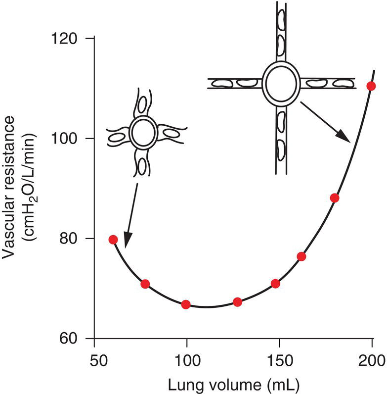

[**Figure 33.13**](#R_c33-fig-0013) Pulmonary vascular resistance (PVR) increases in association with very small and very large lung volumes. At low volumes, PVR is high because the extra‐alveolar vessels become narrow. At high volumes, the capillaries are stretched, and their caliber is reduced.

(Source: West \[163\]. Reproduced with permission of Wolters Kluwer Health, Inc.)

### Monitoring

The American Society of Anesthesiologist guidelines for intraoperative monitoring should be followed. Invasive monitors are used as appropriate for the patient's status and planned procedure. Despite the known risks of pulmonary artery catheters, they provide valuable hemodynamic information, and limited evidence supports their use during major surgical procedures and intensive care of children with PH \[165, 166\].

Echocardiography offers noninvasive assessment of patients with PH, and both transthoracic and transesophageal echocardiography have been utilized as intraoperative monitors. Estimation of RV systolic pressure can be made by applying Bernoulli's equation to measurement of the tricuspid valve regurgitant jet velocity ([Figure 33.3](#c33-fig-0003); [Box 33.2](#c33-fea-0002)). The extent of RV dilation and right‐to‐left interventricular septal shift, as well as biventricular function, can be readily assessed subjectively ([Figure 33.14](#c33-fig-0014)). This is important, as greater RV encroachment on LV volume is associated with greater risk of perioperative adverse events in children with PH \[97\].

### Postanesthesia disposition

The high risk of major cardiovascular adverse events associated with PH continues during the postoperative period \[96, 167\]. Therapeutic or prophylactic drugs administered intraoperatively, such as iNO and oxygen, should be continued postoperatively and weaned gradually, as the child awakens and remains stable. The possibility of rebound PH following weaning of iNO, especially after prolonged administration or a severe pulmonary hypertensive episode, should be kept in mind. All precautions should be taken to avoid hypoxemia, hypotension, and hypovolemia. Control of postoperative pain and nausea should be effective. Evidence‐based guidelines for postanesthetic disposition of PH patients are lacking, but a proposal based on patient, procedural, and anesthetic risk factors has been offered \[168\]. Higher risk patients (e.g. systemic or suprasystemic PH, impaired RV function, major surgical procedure, unstable) are admitted directly to the ICU. Lower risk patients (e.g. subsystemic PH, uneventful intraoperative course, minor procedure) can be admitted to the PACU. Following recovery from anesthesia, stable patients in the PACU who have undergone minor procedures without complications can be discharged. It is advisable to admit others to a monitored bed where rapid medical response is possible. There is subjectivity in these decisions; when in doubt, err on the side of safety.

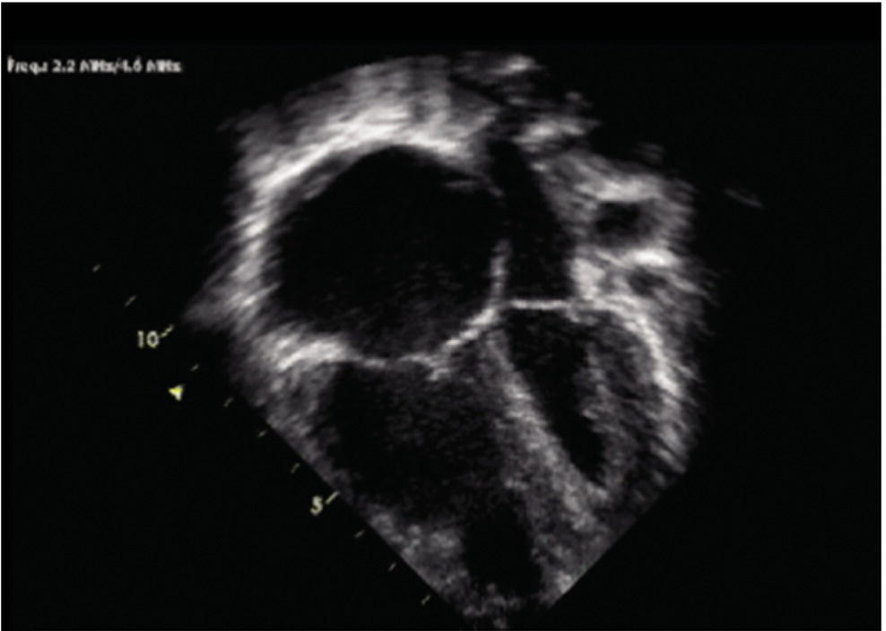

[**Figure 33.14**](#R_c33-fig-0014) The leftward shift of the interventricular septum due to right ventricular dilation causes a reduction in left ventricular stroke volume.

(Source: Figure supplied by Dr. Mark Twite and Dr. Robert Friesen.)

* * *

### KEY POINTS: ANESTHETIC MANAGEMENT OF PH

-   Anesthetic management requires thoughtful preparation regarding the choice of anesthetic drugs, airway management, avoidance of triggering stimuli, prophylactic pulmonary vasodilators, and appropriate monitoring.
-   There is no single ideal anesthetic agent for patients with PH. Instead, a balanced anesthetic technique should be adopted using several anesthetic agents to avoid adverse hemodynamic effects.
-   The high risk of major cardiovascular adverse events associated with PH continues during the postoperative period. During recovery, all precautions should be taken to avoid hypoxia, hypercarbia, and hypotension, and the control of pain and nausea should be adequate. Final disposition, whether it is being discharged home or admitted to a monitored bed or the ICU should be decided based on individual patient, procedural, and anesthetic risk factors.

* * *

## Conclusions

PH is a common occurrence in patients with CHD, and it also affects many other children, especially those born prematurely with underdeveloped lungs and patients with other causes of chronic hypoxia. Idiopathic and inherited forms of PH are less common. Recent advances in the understanding of pathophysiology, classification, and medical therapy have led to increased survival in this population. Many of these children should be cared for by congenital cardiac anesthesiologists who are familiar with the pathophysiology of PH and the increased risk of anesthesia in this population. Anesthetic management requires thoughtful preparation regarding the choice of anesthetic drugs, airway management, avoidance of triggering stimuli, prophylactic pulmonary vasodilators, appropriate monitoring, the use of a balanced anesthetic technique, and the ability to rescue the patient during a pulmonary hypertensive crisis. The patient should be monitored closely in an appropriate location after their procedure.

## Selected references

_A full reference list for this chapter is available at:_

[http://www.wiley.com/go/andropoulos/congenitalheart](http://www.wiley.com/go/andropoulos/congenitalheart)

1.  3 Simonneau G, Montani D, Celermajer DS, et al. Haemodynamic definitions and updated clinical classification of pulmonary hypertension. Eur Respir J 2019; 53:1801913. This article discusses the current definitions and classification of pulmonary hypertension.
2.  4 Rosenzweig EB, Abman SH, Adatia I, et al. Paediatric pulmonary arterial hypertension: updates on definition, classification, diagnostics and management. Eur Respir J 2019; 53:1801916. This article discusses recent advances, ongoing challenges, and distinct approaches for the care of children with pulmonary hypertension, as presented by the Pediatric Task Force of the 6th World Symposium on Pulmonary Hypertension. The article provides updates on the current definition, epidemiology, classification, diagnosis, and treatment of pediatric pulmonary hypertension and identifies knowledge gaps.
3.  13 Abman SH, Hansmann G, Archer SL, et al. Pediatric pulmonary hypertension: guidelines from the American Heart Association and American Thoracic Society. Circulation 2015; 132(21):2037–99. In a joint effort from the American Heart Association and American Thoracic Society, a panel of experienced clinicians and clinician‐scientists was assembled to review the current literature and to make recommendations on the diagnosis, evaluation, and treatment of pediatric pulmonary hypertension. This publication presents the results of extensive literature reviews, discussions, and formal scoring of recommendations for the care of children with pulmonary hypertension.
4.  14 Hemnes AR, Beck GJ, Newman JH, et al. PVDOMICS: a multi‐center study to improve understanding of pulmonary vascular disease through phenomics. Circ Res 2017; 121 (10):1136–9.The NIH/NHLBI launched an initiative, “Redefining Pulmonary Hypertension through Pulmonary Vascular Disease Phenomics (PVDOMICS)” that aims to augment the current PH classification based on shared biological features. This article presents the project and discusses the ‘omics’ analysis plan.
5.  47 Truong U, Meinel K, Haddad F, et al. Update on noninvasive imaging of right ventricle dysfunction in pulmonary hypertension. Cardiovasc Diagn Ther. 2020; 10(5):1604–24. Safe, accurate imaging modalities are critical for the diagnosis, serial monitoring and tailored therapy of patients with pulmonary hypertension. While cardiac catheterization remains the conventional modality for establishing diagnosis and monitoring, noninvasive imaging has gained considerable momentum in providing accurate assessment of the entire RV‐pulmonary axis. This review discusses the most recent developments in echocardiography, MRI and CT in the evaluation of pulmonary hypertension in children and adults.
6.  66 Carmosino MJ, Friesen RH, Doran A, Ivy DD. Perioperative complications in children with pulmonary hypertension undergoing noncardiac surgery or cardiac catheterization. Anesth Analg 2007; 104(3):521–7. This study documents the significantly increased risk of cardiac arrest associated with anesthesia for children with pulmonary hypertension.
7.  100 Latham GJ, Yung D. Current understanding and perioperative management of pediatric pulmonary hypertension. Paediatr Anaesth 2019; 29(5):441–56. This up‐to‐date review summarizes the current understanding of pediatric pulmonary hypertension physiology, perioperative risk stratification, anesthetic risk, and intraoperative considerations.
8.  101 Rudolph AM, Yuan S. Response of the pulmonary vasculature to hypoxia and H+ ion concentration changes. J Clin Invest 1966; 45(3):399–411. This classic paper describes the relationship between pulmonary vascular resistance and hypoxia and acidosis.
9.  106 Kaestner M, Schranz D, Warnecke G, et al. Pulmonary hypertension in the intensive care unit. Expert consensus statement on the diagnosis and treatment of paediatric pulmonary hypertension. The European Paediatric Pulmonary Vascular Disease Network, endorsed by ISHLT and DGPK. Heart 2016; 102(Suppl 2):ii57–66. This expert consensus statement was produced by the European Paediatric Pulmonary Vascular Network and endorsed by the International Society of Heart and Lung Transplantation (ISHLT) and the German Society of Paediatric Cardiology (DGPK). The consensus statement focuses on the management of acute severe pulmonary hypertension in the intensive care unit and provides management algorithms.
10.  111 Siehr SL, Feinstein JA, Yang W, et al. Hemodynamic effects of phenylephrine, vasopressin, and epinephrine in children with pulmonary hypertension: a pilot study. Pediatr Crit Care Med 2016; 17(5):428–37. This prospective pilot study of phenylephrine, arginine vasopressin, and epinephrine in pediatric patients with pulmonary hypertension showed an increase in aortic pressure with all drugs although only vasopressin resulted in a consistent decrease in the ratio of pulmonary‐to‐systemic vascular resistance.