CHAPTER 34 Anesthesia for the Cardiac Catheterization Laboratory 

# CHAPTER 34  
Anesthesia for the Cardiac Catheterization Laboratory

_Premal M. Trivedi1, Philip Arnold2, Aarti Shah2, and Athar M. Qureshi3_

1 Department of Pediatric Cardiovascular Anesthesiology, Texas Children’s Hospital, Houston, TX, USA

2 Department of Cardiac Anaesthesia, Alder Hey Hospital, Royal Liverpool Children’s NHS Trust, Liverpool, UK

3 Department of Pediatrics, The Lillie Frank Abercrombie Section of Cardiology, Texas Children’s Hospital and Baylor College of Medicine, Houston, TX, USA

* * *

-   [**Introduction**](#head-2-328)
-   [**Diagnostic catheterization**](#head-2-329)
    -   [Procedure overview](#head-3-573)
    -   [Endomyocardial biopsy](#head-3-574)
    -   [Pulmonary hypertension study](#head-3-575)
    -   [Cardiac magnetic resonance imaging‐guided catheterization](#head-3-576)
-   [**Interventional catheterization**](#head-2-330)
    -   [Device closure of cardiovascular communications](#head-3-577)
    -   [Balloon dilation of cardiac valves](#head-3-578)
    -   [Balloon angioplasty and/or stent placement](#head-3-579)
    -   [Creation of cardiovascular communications](#head-3-580)
    -   [Transcatheter valve replacement](#head-3-581)
    -   [Hybrid procedures](#head-3-582)
    -   [Pericardiocentesis](#head-3-583)
    -   [Percutaneous mechanical circulatory support](#head-3-584)
-   [**Adverse events**](#head-2-331)
-   [**Risk assessment**](#head-2-332)
-   [**Anesthetic management**](#head-2-333)
    -   [Operator‐directed sedation versus anesthesia care](#head-3-585)
    -   [Periprocedural planning](#head-3-586)
    -   [Anesthetic techniques](#head-3-587)
    -   [Anesthetic drugs](#head-3-588)
    -   [Monitoring](#head-3-589)
    -   [Intravascular volume management](#head-3-590)
    -   [Recovery](#head-3-591)
-   [**Electrophysiology procedures**](#head-2-334)
    -   [Electrophysiology studies and ablations](#head-3-592)
    -   [Anesthetic considerations](#head-3-593)
    -   [Anesthetic drugs and the cardiac conduction system](#head-3-594)
    -   [Implantation of pacemakers and defibrillators](#head-3-595)
    -   [Elective cardioversion](#head-3-596)
    -   [Transvenous lead extractions](#head-3-597)
-   [**Conclusions**](#head-2-335)
-   [**Selected references**](#head-2-336)

* * *

## Introduction

Few areas in the field of congenital heart disease (CHD) have evolved as rapidly as the discipline of cardiac catheterization. Lesions that were previously managed with surgical intervention alone or considered inoperable altogether are now treated in the cardiac catheterization laboratory (CCL), with benefits ranging from increased survival to decreased morbidity and lengths of stay. Coincident with these advances, however, have been increases in patient acuity and complexity as well as procedural risk. For the anesthesia team, these changes have underscored the need for risk assessment and preprocedural planning to prevent adverse events, and further, awareness regarding procedure‐specific complications and their management. These aspects of anesthetic care are a focus of this chapter and are presented both generally and within the context of individual procedures that may be encountered in the modern CCL.

## Diagnostic catheterization

Cardiac catheterizations purely for diagnostic purposes have decreased over the years due to advances in noninvasive imaging. Nonetheless, diagnostic cardiac catheterization remains an important tool in the evaluation of the anatomy and physiology of many patients with CHD. Common indications are as follows \[1\]:

-   To measure intravascular pressures and derive hemodynamic information, such as pulmonary vascular resistance (PVR), systemic vascular resistance (SVR), shunt fractions (_Q_p : _Q_s), and cardiac output. Such information is necessary in the assessment of pulmonary hypertension (PH), pretransplant candidacy in children with end‐stage heart disease, and the suitability for progression to the next stage of single‐ventricle palliation (e.g., bidirectional Glenn or Fontan) (see [Figure 34.1](#c34-fig-0001)) \[2\]
-   To evaluate the effects of drugs (e.g., inhaled nitric oxide \[iNO\]) and respiratory interventions (increasing FiO2) on PVR in patients with PH
-   To provide further anatomic definition when noninvasive imaging is inadequate. Examples include the evaluation of coronary artery anomalies or major aortopulmonary collaterals (MAPCAs)
-   To perform hemodynamic assessment, endomyocardial biopsies, and coronary artery angiography as part of routine surveillance following heart transplantation. Endomyocardial biopsy is also used in the diagnosis of cardiomyopathy and viral myocarditis
-   To distinguish between the diagnoses of constrictive pericarditis and restrictive cardiomyopathy
    
    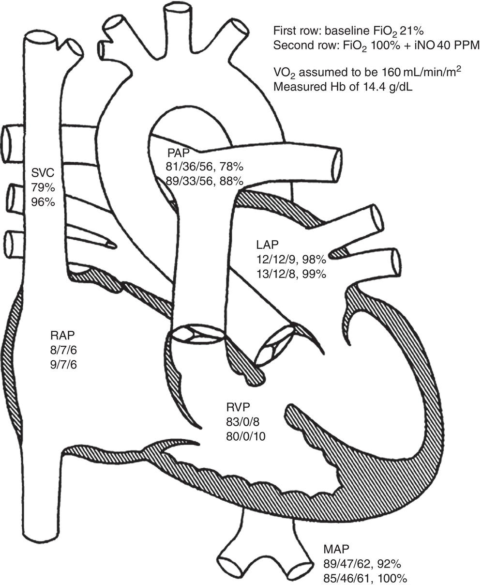
    
    [**Figure 34.1**](#R_c34-fig-0001) Diagnostic catheterization in a child with pulmonary hypertension. A 4‐year‐old child with a late diagnosis of perimembranous VSD and subsequent pulmonary hypertension presented for hemodynamic evaluation to assess candidacy for VSD closure. Measurements were taken on room air and subsequently on 100% FiO2 and inhaled nitric oxide as part of acute vasodilatory testing (AVT). At baseline, _Q_p : _Q_s was 0.65 : 1, indicating right‐to‐left shunting at the VSD, and PVRi was 11.4 Wood units/m2. With AVT, no decrement in PAP or PVRi was noted. Surgical closure was therefore deferred and therapy for pulmonary hypertension was initiated with plans to reassess PVR in 6 months. LAP, left atrial pressure; MAP, mean arterial pressure; PAP, pulmonary artery pressure; PPM, parts per million; PVRi, pulmonary vascular resistance indexed to body surface area; RAP, right atrial pressure; RVP, right ventricle; SVC, superior vena cava; VO2, oxygen consumption; VSD, ventricular septal defect.
    
    (Source: Mullins and Mayer \[2\]. Reproduced with permission of John Wiley & Sons.)
    
-   To assist in the management and decision‐making for complex CHD, either preoperatively or postoperatively (e.g., the postoperative Fontan with persistent pleural effusions without clear etiology, or the evaluation of the coronary arteries in a patient with severely depressed function following an arterial switch)
-   To confirm the need for a planned intervention and assess the efficacy of the intervention once performed (e.g., closure of a cardiovascular communication)

As implied, the results of diagnostic catheterizations can have an outsized impact on the management strategy for a given patient. For example, the PVR calculation in a child presenting for a cardiac transplant evaluation may determine whether or not the child is eligible for transplantation. These stakes underscore the need to ensure that the hemodynamic variables being measured are as representative of the patient’s baseline physiology as possible. For the anesthesiologist, an understanding of how airway management, common anesthetics, oxygenation, and ventilation can affect these measurements is critical (see Anesthetic techniques). A general strategy to approximate baseline physiology is to conduct the anesthetic on room air with normal ventilation while maintaining an age‐appropriate blood pressure and heart rate. For patients who need oxygen (or who are on oxygen at baseline), the higher partial pressure of oxygen is accounted for in calculations of flows and resistances.

### Procedure overview

The vessels most commonly accessed are the femoral vein and femoral artery. The femoral artery can be used solely for blood pressure monitoring or to evaluate the coronaries, left ventricular end‐diastolic pressure (LVEDP), or MAPCAs as indicated. The internal jugular vein may be used to access the pulmonary arteries (PAs) in patients with Glenn or hemi‐Fontan circulations or to facilitate procurement of endomyocardial biopsy specimens in biventricular hearts. Alternative venous approaches, such as transhepatic or transsplenic, may be indicated in children with a history of occlusions at other sites and are associated with increased risks of bleeding.

Following access, pressures and oxygen saturations are obtained in sequence throughout the cardiac, PA, and systemic arterial circulations (see [Table 34.1](#c34-tbl-0001) for normal parameters). These values are then used to calculate shunts (if present), flows (_Q_p and _Q_s), and resistances (PVR and SVR; see [Table 34.2](#c34-tbl-0002) for calculations). Stable hemodynamics along with constant oxygenation and ventilation (room air and normocapnea if possible) are essential during the sampling of these values.

Flows in children are most often calculated using the Fick principle, which relates oxygen consumption (VO2) to flow. VO2 in this equation can be measured directly using respiratory mass spectrometry or estimated using nomograms based on age, sex, and heart rate \[3\]. Due to ease, estimations of VO2 are most commonly used, but by virtue of being estimations, they may introduce important error in the calculations of flow and resistance \[4–9\]. For example, if the estimated VO2 is significantly higher than actual VO2, the resulting cardiac output will be overestimated, while the calculated resistances will be underestimated.

### Endomyocardial biopsy

The majority of patients undergoing endomyocardial biopsy do so uneventfully, using either general anesthesia with an artificial airway or sedation with a natural one. Certain high‐risk patients, however, warrant discussion, including (i) children less than 6 months of age and less than 8 kg who due to their small size are at increased risk of complications such as ventricular perforation and significant arrhythmias \[10\], (ii) heart transplant patients with an active concern for rejection or a history of coronary allograft vasculopathy (CAV), and (iii) patients otherwise being evaluated for myocarditis. Children with active rejection or myocarditis may have severely depressed function with coinciding arrhythmias due to myocardial irritability. The process of placing catheters within the heart and taking biopsy specimens can further exacerbate or prompt new arrhythmias. Because of tissue friability, these patients may also be at increased risk of myocardial perforation and tamponade. Preparation should be commensurate with the above risks and entail plans to resuscitate in the event of hemodynamic decompensation (including discussions of extracorporeal membrane oxygenation \[ECMO\] or prophylactic placement of percutaneous left ventricular (LV) support as a bridge to recovery). If sedation is chosen as the anesthetic technique, one should be prepared as always to escalate to general endotracheal anesthesia (GETA). Of note, in heart transplant patients with signs of heart block and/or rejection, the use of dexmedetomidine may provoke a significant bradyarrhythmia \[11\]. Attention to the patient’s baseline electrocardiogram (EKG) and risk for heart block can inform the decision of whether or not to use this drug (see section on Anesthetic drugs). The use of dexmedetomidine in a heart transplant patient has also been associated with impaired metabolism of tacrolimus resulting in supratherapeutic levels \[12\]. Though not immediately relevant to anesthetic management, this risk may indicate the need for more frequent monitoring of tacrolimus levels in the postprocedural period.

CAV, or transplant coronary artery disease, is marked by the progressive obliteration of the graft’s coronary vasculature and is a result of immunologic and nonimmunologic factors \[1, 13\]. Due to the variable reinnervation of the transplanted heart, angina may not occur to warn of its presence, and CAV may only be diagnosed incidentally during the patient’s annual coronary angiography ([Figure 34.2](#c34-fig-0002)). Risk factors for CAV include rejection within the first‐year post‐transplant and increasing graft age \[13\]. Adolescents are at greatest risk, with only 50% remaining CAV free at 10 years post‐transplant \[14\]. The patient who should raise one’s concern for CAV would be a teenager several years out from transplant who on prior catheterizations had unexplained hypotension or an elevated right ventricular end‐diastolic pressure (RVEDP) (potentially indicative of microvascular disease). In patients with known CAV, graft survival decreases to 50% at 5 years postdiagnosis \[14\]. As in any patient at risk for myocardial ischemia, anesthetic goals focus on minimizing myocardial oxygen consumption and maximizing oxygen delivery. Hypotension should be diligently avoided.

[**Table 34.1**](#R_c34-tbl-0001) Normal cardiac catheterization data

|  | Pressure (mmHg) |  |
| --- | --- | --- |
|  | Newborns | Older children | Oxygen saturation (%) |
| --- | --- | --- | --- |
| Right atrium |  |  | 60–80 |
|  a wave | 3–8 | 5–10 |  |
|  v wave | 2–6 | 4–8 |  |
|  Mean | 0–4 | 2–6 |  |
| Right ventricle |  |  | 65–75 |
|  Systolic | 65–80 | 15–25 |  |
|  End diastolic | 2–7 | 3–8 |  |
| Pulmonary artery |  |  | 65–75 |
|  Systolic | 65–80 | 15–25 |  |
|  Diastolic | 35–50 | 8–12 |  |
|  Mean | 40–70 | 10–16 |  |
| PA wedge |  |  | 95–100 |
|  a wave | 6–10 | 8–14 |  |
|  v wave | 7–11 | 10–17 |  |
|  Mean | 5–8 | 7–13 |  |
| Left atrium |  |  | 95–100 |
|  a wave | 4–7 | 6–12 |  |
|  v wave | 6–12 | 8–15 |  |
|  Mean | 3–6 | 5–10 |  |
| Left ventricle |  |  | 95–100 |
|  Systolic | 65–80 | 90–120 |  |
|  End diastolic | 3–7 | 2–5 |  |
| Aorta |  |  | 95–100 |
|  Systolic | 65–80 | 90–120 |  |
|  Diastolic | 45–60 | 60–75 |  |
|  Mean | 55–65 | 70–90 |  |
| Flows |  | L/min/m2 BSA |  |
|  Pulmonary (_Q_p) | 3.5–5.0 | 3.5–5.0 |  |
|  Systemic (_Q_s) | 3.5–5.0 | 3.5–5.0 |  |
|  Resistances |  | Woods units/m2 BSA |  |
|  Pulmonary (_R_p) | 8–10 | 1–3 |  |
|  Systemic (_R_s) | 10–15 | 15–30 |  |

BSA, body surface area; PA, pulmonary artery.

### Pulmonary hypertension study

Right heart catheterization (RHC) remains the gold standard to diagnose and characterize PH, assess the response to AVT, and provide data to guide risk stratification \[15\] (see [Table 34.3](#c34-tbl-0003)). Data is obtained at baseline (or rest) and with AVT. AVT is performed to determine the effect of pulmonary vasodilators on PVR. Protocols and the exact pulmonary vasodilators used vary, but a common process is to deliver a FiO2 of 1.0 followed by iNO at 40 parts per million (PPM) \[16\]. A positive response is defined as a decrease in mean pulmonary arterial pressure (mPAP) by 10 mmHg without a fall in cardiac output \[15\]. The presence or absence of a response directs pharmacologic therapy and is prognostic \[15, 17\]. In patients with CHD with an intracardiac shunt (e.g., an older child with a large ventricular septal defect \[VSD\] and bidirectional shunting on echocardiography), a decrease in PVR with AVT can influence decision‐making on whether or not to attempt closure (see [Figure 34.1](#c34-fig-0001)).

The utility of this data, however, needs to be weighed against procedural and anesthetic risks. Adverse events in children with PH undergoing catheterization range from 2 to 14%, with an incidence of cardiac arrest between 0.8 and 5.7% and mortality between 0 and 1.4% \[18–28\]. Those at greatest risk include ages < 5 months and those with systemic‐to‐suprasystemic PAP \[28, 29\]. Children with newly diagnosed PH, depressed RV function (regardless of the estimated PAP on transthoracic echocardiography \[TEE\]), poor functional status, and need for preprocedural vasoactive and/or respiratory support represent another highly concerning group \[30\] ([Table 34.4](#c34-tbl-0004)). In such patients, the risks of catheterization likely exceed its benefits, and empiric therapy with PH agents may be indicated to provide stability before proceeding. Decisions regarding the timing of catheterization are thus critical to minimizing risk and underscore the need for anesthesia involvement in coordinating with the pediatric PH and catheterization teams.

Coincident with decreasing risk is the maintenance of preprocedural PH therapy. Patients on oral agents are instructed to take them as scheduled, including the day of the procedure. Caveats include children on iNO prior to catheterization and those on subcutaneous (SQ) infusions of treprostinil. The preprocedural use of iNO is an indicator of illness severity; however, it may be requested that iNO be turned off during the catheterization to establish baseline conditions. Doing so may induce a PH crisis, however, and is not advised in the critically ill patient. If this is nonetheless thought to be necessary, the process of decreasing iNO should be gradual and with awareness that PH crises are often prompted _not_ with incremental decreases, but by going from 1 PPM to off. The team should, therefore, be prepared to reinitiate iNO and resuscitate as indicated. Options for the management of children on SQ treprostinil are to continue delivery as SQ or transition to intravenous (IV) administration. The rationale for the latter is a more stable and visible site for delivery (due to the risks of dislodgement of SQ sites with positioning, variability in SQ perfusion and absorption during anesthesia, and the inability to monitor if under the drapes). If maintaining the infusion SQ, there is a margin of safety even in the event of dislodgement due to treprostinil’s long half‐life (4 hours).

[**Table 34.2**](#R_c34-tbl-0002) Hemodynamic calculations performed during cardiac catheterization

<table border="1"><tbody class="tdcolor5"><tr><td class="left">Flows</td></tr><tr><td class="left">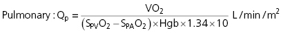</td></tr><tr><td class="left">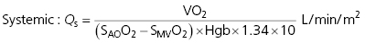</td></tr><tr><td class="left"><b>Resistances</b></td></tr><tr><td class="left"></td></tr><tr><td class="left">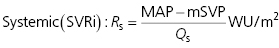</td></tr><tr><td class="left"><b>Shunts</b></td></tr><tr><td class="left"></td></tr></tbody></table>

AO, aorta; AOP, LAP, left atrial pressure; MAP, mean arterial pressure; mPAP, mean pulmonary arterial pressure; mPCWP, mean pulmonary capillary wedge pressure; mSVP, mean systemic venous pressure; MV, mixed venous; PA, pulmonary artery; PV, pulmonary vein; PVRi, pulmonary vascular resistance indexed to body surface area; _Q_p, pulmonary flow; _Q_s systemic flow; SVRi, systemic vascular resistance indexed to body surface area; VO2, oxygen consumption

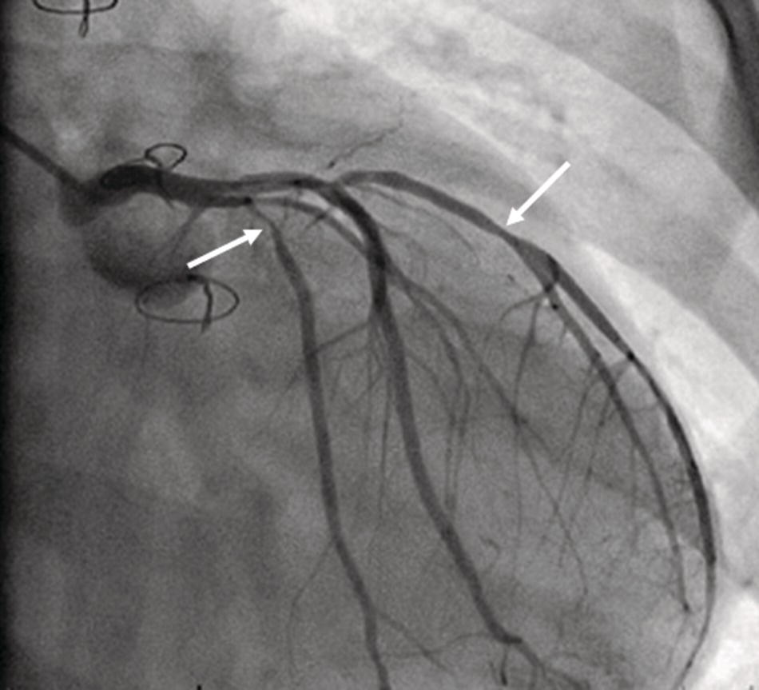

[**Figure 34.2**](#R_c34-fig-0002) Coronary angiogram during routine post‐transplant evaluation demonstrating coronary allograft vasculopathy. Arrows indicate gross areas of stenosis. The graft was 11 years old and the child was asymptomatic. He developed profound hypotension following anesthetic induction and a ventricular fibrillation arrest following angiography. He was subsequently retransplanted.

(Source: Texas Children’s Hospital Cardiac Catheterization Laboratory.)

[**Table 34.3**](#R_c34-tbl-0003) Hemodynamic definitions of pediatric pulmonary hypertension based on catheterization data

Source: Modified from Rosenzweig et al. \[15\].

|  | Revised definition (at rest) | Clinical groups[_a_](#c34-note-0004) |
| --- | --- | --- |
| Precapillary PH | mPAP > 20 mm Hg  
PCWP ≤ 15 mm Hg  
PVRi ≥ 3 WU m2 | 1, 3, 4, and 5 |
| Isolated postcapillary PH | mPAP > 20 mm Hg  
PCWP > 15 mm Hg  
PVRi < 3 WU m2 | 2 and 5 |
| Combined precapillary and postcapillary PH | mPAP > 20 mm Hg  
PCWP > 15 mm Hg  
PVRi≥3 WU m2 | 2 and 5 |
| Pulmonary hypertensive vascular disease | Biventricular circulations  
mPAP > 20 mm Hg  
PVRi≥3 WU m2 |  |
| Cavopulmonary circulation  
Mean TPG > 6 mm Hg  
PVRi > 3 WU m2 |

mPAP, indicates mean pulmonary arterialy pressure; PCWP, pulmonary capillary wedge pressure; PH, pulmonary hypertension; PVRi, pulmonary vascular resistance indexed to body surface area; TPG, transpulmonary gradient (mPAP – PCWP or mean left atrial pressure); WU, Wood units

_a_ Group 1: PAH; Group 2: PH due to left heart disease; Group 3: PH due to lung disease and/or hypoxia; Group 4: PH due to pulmonary artery obstructions; Group 5: PH with unclear and/or multifactorial mechanisms

[**Table 34.4**](#R_c34-tbl-0004) Determinants of risk in pediatric pulmonary hypertension

Source: Hansmann et al. \[30\]. Reproduced with permission of BMJ Publishing Ltd.

| Lower risk | Determinants of risk | Higher risk |
| --- | --- | --- |
| No | Clinical evidence of RV failure | Yes |
| No | Progression of symptoms | Yes |
| No | Syncope | Yes |
| Normal (height/BMI) | Growth | Failure to thrive |
| I, II | WHO functional class | III, IV |
| Minimally elevated | Serum BNP/NT‐proBNP | Significantly elevated or rising |
| Normal RV systolic function  
Minimal RA/RV enlargement  
RV/LV ratio <1  
Normal TAPSE | Echocardiography | RV systolic dysfunction  
Severe RA/RV enlargement  
Increased RV/LV ratio  
Reduced TAPSE  
Pericardial effusion |
| CI > 3.0 L/min/m2  
mRAP < 10 mm Hg  
mPAP/mSAP < 0.5  
\+ Acute vasoreactivity | Invasive hemodynamics | CI < 2.5 L/min/m2  
mRAP > 15 mm Hg  
mPAP/mSAP > 0.75  
PVRi > 15 WU m2 |

These determinants have only level of evidence C because of lacking pediatric data, but are informed by clinical practice and can nonetheless guide preprocedural risk assessment and preparation.

BMI, indicates body mass index; BNP, B‐type natriuretic peptide; CI, cardiac index; mPAP, mean pulmonary artery pressure; mRAP, mean right atrial pressure; mSAP, mean systemic arterial pressure; PVRi, pulmonary vascular resistance indexed to body surface area; RA, right atrium; RV, right ventricle; TAPSE, tricuspid annular plane systolic excursion.

Anesthetic technique and preparation depend on patient age, comorbidities, disease severity, and institutional practice. Older adolescents or adults who are cooperative can be managed with minimal sedation and local anesthetic infiltration. Upper extremity venous access to perform RHC can be considered to minimize discomfort and the need for analgesics relative to femoral access \[31\]. Deeper sedation can be used safely in appropriately selected patients but requires attention to avoiding hypoxia, hypercapnea, and acidosis that may prompt either a PH crisis or skew assessment of PAP and PVR. Given the younger age of this patient population, our most common approach is to use GETA. We and others have not observed PH crises related to airway instrumentation \[19, 32–34\].

Anesthetic induction and maintenance are tailored to the patient’s disease severity. A balanced anesthetic using a combination of opioid, ketamine, midazolam, and volatile agent is well tolerated (see Anesthetic drugs). Ketamine and dexmedetomidine do not adversely affect the pulmonary vasculature and can reduce the amount of volatile agent needed \[32, 33\]. Most commonly observed following induction is relative hypotension secondary to anesthesia‐induced decreases in SVR, contractility, and preload (with positive pressure ventilation \[PPV\]). Phenylephrine boluses or infusions of vasopressin or phenylephrine are useful in increasing SVR and preventing RV ischemia that can lead to cardiovascular collapse. For high‐risk patients (those with moderately to severely depressed RV function), infusions of epinephrine and/or vasopressin can be initiated prior to induction. Further, the availability of ECMO should be confirmed in advance (assuming the child is an ECMO candidate). Blood, iNO, vasoactives, adequate vascular access to deliver infusions, and defibrillation pads should be present. A dedicated arterial line should be considered. For all patients following AVT, iNO should be titrated off slowly, particularly in those who have had a positive response. Postprocedural disposition is dictated by disease severity and intraprocedural course. Our practice is conservative, and many of our PH patients are admitted to the intensive care unit (ICU) if only for observation.

### Cardiac magnetic resonance imaging‐guided catheterization

The number of centers utilizing cardiac magnetic resonance imaging (CMR)‐guided catheterization has increased in recent years \[35–39\]. These procedures have largely been diagnostic only due to limitations in MRI‐compatible devices and catheters. The sequence of the procedure varies but most often entails CMR prior to catheterization. Other institutions begin the procedure in the CCL where access is obtained, followed by a transition to CMR where imaging and RHC are performed. The child is then transferred back to the CCL where any interventions, if needed, can be done \[39\]. Common populations currently assessed include post‐transplant patients and those with PH, cardiomyopathy, and intracardiac shunts.

The rationale for using CMR‐guided catheterization is the accuracy of the data obtained and decrease in radiation exposure relative to traditional catheterization. Calculations obtained in the CCL are subject to assumptions and sampling error and are further influenced by the child’s underlying anatomy, hemodynamic fluctuations, and the use of oxygen and iNO \[35, 40\]. CMR avoids many of these confounders and is thus regarded as more precise in calculation of flow and resistance. Other advantages include superior assessment of RV volume, function, and valvar regurgitation relative to other diagnostic modalities and the ability to provide enhanced soft‐tissue characterization. Potential benefits to the latter could include improved myocardial biopsy yields and electrophysiology (EP) ablation success, as well as earlier detection of bleeding complications \[41–43\]. No less importantly, the radiation exposure to the child and providers is reduced. For example, in a child undergoing pre‐Fontan evaluation who receives CMR prior to catheterization, the fluoroscopy time needed to obtain pressures and saturations can be eliminated.

These benefits, however, come with an increase in the time that the patient is anesthetized and the introduction of other risks related to the MRI environment and transfers between CCL and MRI. In a review of their initial experience in patients undergoing MRI‐guided right heart catheterization (MRI‐RHC), Children’s National Medical Center reported that the average anesthetic time for a follow‐up transplant biopsy was 2 hours and 56 minutes and for all procedures 3 hours and 24 minutes \[39\]. Risk in the MRI environment is multifactorial, but the foremost concern is the inadvertent entry of ferromagnetic objects. Protocols that prompt metal screening before the start of catheterization and once again prior to entry into MRI can be preventative \[39\]. Hemodynamic instability and cardiac arrest during MRI‐RHC present additional challenges. Much of the equipment used for resuscitation cannot enter MRI safely, and immediate evacuation of the patient to a different location is indicated. Safe and efficient evacuation is dependent on a well‐rehearsed plan that also defines provider’s roles in such an event \[39\]. Patient transfers between CCL and MRI (and back) further add to complexity and provide opportunities for unplanned extubation or loss of vascular access. Nonetheless, many of the above risks can be mitigated with appropriate planning, team awareness, and attention to detail. Of the 72 procedures for MRI‐RHC at Children’s National, no complications from anesthesia or the MRI‐RHC were reported \[39\].

A rational approach when first planning for these procedures is to over‐prepare. Simulation involving all team members is helpful in walking through the sequence of the procedure, identifying problem areas, and determining institutional specific responses to critical events. Radiology can often lead team education regarding MRI risk and also help establish protocols for the safe passage of the patient between CCL and MRI. Interval drills to practice evacuation from MRI in the event of emergencies are recommended. Many programs that set out to do MRI‐RHC already have protocols in place for hybrid operating room–MRI suites that can be adapted to the CCL. Patient selection is equally important. Experience first with older and healthier patients can guide subsequent planning on higher risk patients. Anesthetic preparation accounts for setting up MRI as well as the CCL ([Table 34.5](#c34-tbl-0005)). Monitors, infusion pumps, and the anesthesia machine within the MRI suite will of course need to be MRI compatible. For patients with PH, an MRI‐compatible iNO delivery system is also necessary. Given the complexity and novelty of this procedure, GETA is reasonable, and the threshold for placing dedicated arterial access for blood pressure monitoring may be lower.

[**Table 34.5**](#R_c34-tbl-0005) Checklist for anesthetic preparation for CMR‐guided catheterization

Source: Modified from Deutsch et al. \[39\].

<table border="1"><tbody class="tdcolor5"><tr><td class="left"><ul class="square1" id="c34-list-0002"><li id="c34-li-0008">Bag‐valve mask and MRI‐compatible oxygen tank (for the period of transport between the CL and MRI)</li></ul></td></tr><tr><td class="left"><ul class="square1" id="c34-list-0003"><li id="c34-li-0009">Complete check of both the MRI and CL anesthesia machines</li></ul></td></tr><tr><td class="left"><ul class="square1" id="c34-list-0004"><li id="c34-li-0010">Circuit extensions added to both</li></ul></td></tr><tr><td class="left"><ul class="square1" id="c34-list-0005"><li id="c34-li-0011">Extensions added to intravenous lines</li></ul></td></tr><tr><td class="left"><ul class="square1" id="c34-list-0006"><li id="c34-li-0012">Emergency medications drawn and available</li></ul></td></tr><tr><td class="left"><ul class="square1" id="c34-list-0007"><li id="c34-li-0013">MRI‐compatible infusion pumps and monitors available and functional</li></ul></td></tr><tr><td class="left"><ul class="square1" id="c34-list-0008"><li id="c34-li-0014">MRI‐compatible iNO machine available and checked (if PH study planned)</li></ul></td></tr><tr><td class="left"><ul class="square1" id="c34-list-0009"><li id="c34-li-0015">Plan and roles reviewed for emergency evacuations from MRI</li></ul></td></tr></tbody></table>

CLL, indicates catheterization laboratory; CMR, cardiac magnetic resonance; iNO, inhaled nitric oxide; MRI, magnetic resonance imaging; PH, pulmonary hypertension.

* * *

### KEY POINTS: DIAGNOSTIC CATHETERIZATION

-   Anesthetic management can influence the quality of the data obtained during catheterization and can thereby impact clinical decision‐making.
-   To ensure that the data reflects the child’s baseline physiology, variables such as oxygenation, ventilation, and hemodynamics are maintained within the child’s usual range during measurement.
-   Groups at high risk during diagnostic procedures include neonates and infants, transplant patients in acute rejection or with CAV, those with myocarditis, and patients with systemic‐to‐suprasystemic PAPs.

* * *

## Interventional catheterization

The range of interventions offered and the patient types managed in the CCL has broadened significantly in recent years. An overview of common as well as emerging procedures, their anesthetic management, and associated complications are discussed below.

### Device closure of cardiovascular communications

Among the most common interventional procedures performed are transcatheter closures of the patent ductus arteriosus (PDA) and certain atrial‐level communications such as secundum atrial septal defects (ASDs) and patent foramen ovales (PFOs). Other cardiovascular communications amenable to device closure include muscular VSDs, coronary fistulae, and Fontan fenestrations.

#### Shared considerations

GETA is used in these cases to minimize patient movement, allow for TEE (ASD and VSD closures), and provide stability in higher risk procedures. This latter group includes the closure of VSDs, preterm PDAs or PDAs in patients with PH, and coronary fistulae. Considerations common to patients undergoing device closure include the need for antibiotic prophylaxis and potential for device embolization ([Figure 34.3](#c34-fig-0003)). Depending on the size of the particular device and where it embolizes, hemodynamic instability can result from obstruction to flow or arrhythmias. Thrombus generation can also lead to stroke in devices lodged within the systemic circulation, thereby necessitating team awareness of the patient’s anticoagulation status while attempts at retrieval are made. While most episodes are readily appreciated while still in the CCL, embolization may also occur during the recovery period. The development of new arrhythmias or changes in hemodynamics should alert one to this possibility. Anesthetic strategies to minimize the risk of delayed embolization include deep extubation (excluding infants or patients otherwise in whom the risk of deep extubation exceeds its benefits), aggressive prophylaxis of postoperative nausea and vomiting (PONV), and extended sedation in the initial recovery period. Dexmedetomidine, morphine, ondansetron, dexamethasone, and/or propofol can be useful agents in achieving these goals, but paramount is communication with the cardiologist to identify those patients at greatest risk. For example, in patients undergoing ASD closure, a large ASD and the presence of multiple deficient rims increase the risk for embolization. If catheter‐based retrieval cannot be achieved (e.g., when the device has embolized to the LV and attempts at retrieval may damage the mitral valve apparatus), surgery is indicated.

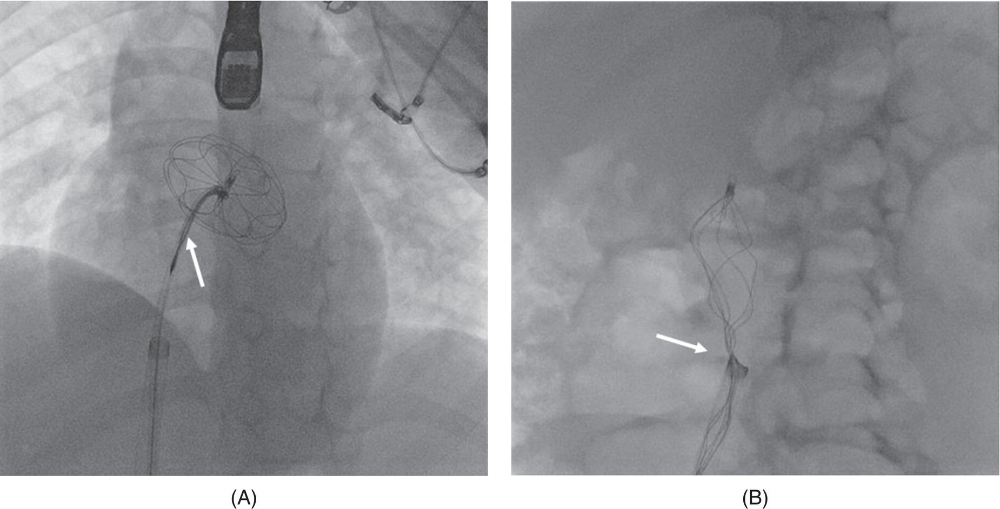

[**Figure 34.3**](#R_c34-fig-0003) (A) A snare (arrow) is used to encircle the device that has embolized into the left atrium. (B) The snare is then used to withdraw the device that is now collapsed (arrow) for removal through the right femoral venous sheath.

(Source: Texas Children’s Hospital Cardiac Catheterization Laboratory.)

#### Atrial septal defects

Complications associated with ASD closure are rare. Apart from embolization (discussed above), the device may encroach upon the atrioventricular (AV) valves or over the ostia of the pulmonary or systemic veins upon release. This risk is minimized by the use of echocardiography to ensure that the veins remain unobstructed and that no new valvular insufficiency or stenosis develops following deployment. Less common are catheter‐induced AV block, cardiac perforation, and systemic air embolization (associated with catheter entry into the left heart) \[1\]. Of note, endovascular and transthoracic echocardiographic (TTE) guidance may occasionally be used rather than TEE to facilitate closure.

#### The preterm patent ductus arteriosus

Among individuals undergoing PDA closure, preterm neonates and infants pose the greatest challenge due to their associated comorbidities and small size at presentation \[44\]. Such patients have many of the sequelae of prematurity (intraventricular hemorrhage, bronchopulmonary dysplasia, and a history of necrotizing enterocolitis) and can be as small as 700 g \[45\]. Due to the increased risk associated with this fragile population, protocols for preparation and the transport of these patients to and from the CCL are necessary ([Table 34.6](#c34-tbl-0006)).

Once in the CCL, attention is given to maintaining normothermia and assessing the adequacy of ventilation. Uncuffed endotracheal tubes (ETTs) placed in the neonatal intensive care unit (NICU) usually prohibit accurate ETCO2 monitoring due to associated leaks. Options are to replace the ETT with a cuffed one, or to gauge ventilation by the adequacy of chest rise or PaCO2 via blood gas once femoral venous access is obtained (the femoral artery is avoided due to the potential for leg ischemia with access). Due to issues associated with lung compliance and the inherent limitations of the anesthesia ventilator, a NICU ventilator is used routinely for patients weighing <2 kg. Inadvertent dislodgement of the ETT or IV lines, always a risk in younger patients in the CCL, is a particular concern in this population and mandates communication prior to any movement of the table. Core temperature is measured with an oral esophageal probe, which also serves as a marker for the aortic end of the PDA on fluoroscopy. This gives the interventional team an additional landmark when placing the device ([Figure 34.4](#c34-fig-0004)).

Hemodynamic derangement and desaturations may occur at different points during the procedure. Compression of the chest with the TTE probe can lead to altered ventilation and desaturation (TTE is used in junction with prograde angiography through the venous sheath to assess the PDA and device position before/after release). The catheter used to deploy the device can cause heart block and more commonly can stent open the tricuspid valve. The resulting tricuspid regurgitation (TR) can cause not only hypotension but also desaturation if an atrial communication is present (due to increased right‐to‐left shunting). Prior to device release, TTE is used to ensure that the device is not protruding into the aorta and causing arch obstruction. Following release, embolization may occur, either into the aorta or, more commonly, into the left PA.

[**Table 34.6**](#R_c34-tbl-0006) Anesthetic management protocol for premature PDA closures

Source: Modified from Hubbard et al. \[44\].

| Weight ≤ 2 kg at time of procedure | Weight > 2 kg at time of procedure |
| --- | --- |
| Airway and ventilatory management |
| 
1.  Trachea intubated by NICU prior to transport | 1.  Nasal CPAP (if required preprocedure) maintained for transport to the CCL

 |
| 

1.  Transport ventilator used for transport | 1.  Intubation in the CCL by anesthesia

 |
| 

1.  NICU ventilator used during the procedure | 1.  NICU ventilator available if needed. Use of NICU ventilator vs. anesthesia machine at discretion of the anesthesiologist.

 |
| 

1.  Staged ventilator weaning over to CPAP in the NICU | 1.  Staged ventilator weaning over to CPAP in the NICU

 |
| Thermoregulation |
| 

1.  All patients transported by the NICU transport team in prewarmed incubators to and from the CL | 1.  All patients transported by the NICU transport team in prewarmed incubators to and from the CL

 |
| 

1.  CCL warmed to and kept at 80 °F until draped | 1.  CCL warmed to and kept at 80 °F until draped

 |
| 

1.  Forced air warming used throughout the procedure | 1.  Forced air warming throughout procedure

 |
| Blood |
| 

1.  20 cc/kg blood in the room | 1.  1 unit of PRBC, split, in the room

 |
| Access |
| 

1.  1 PIV (even if a PICC line is present) | 1.  1 PIV (even if a PICC line is present)

 |
| Sedation and other medication management |
| 

1.  Ketamine, fentanyl, and neuromuscular blockade for intraoperative management | 1.  Low‐dose volatile agent (if anesthesia machine used) with or without ketamine, fentanyl, and neuromuscular blockade for intraoperative management

 |
| 

1.  Boluses of vasoactives or initiation of vasoactive infusions at discretion of the anesthesiologist | 1.  Boluses of vasoactives or initiation of vasoactive infusions at discretion of the anesthesiologist

 |

CCL, indicates cardiac catheterization laboratory; CPAP, continuous positive airway pressure; F, Fahrenheit; NICU, neonatal intensive care unit; PICC, peripherally inserted central catheter; PIV, peripheral intravenous catheter.

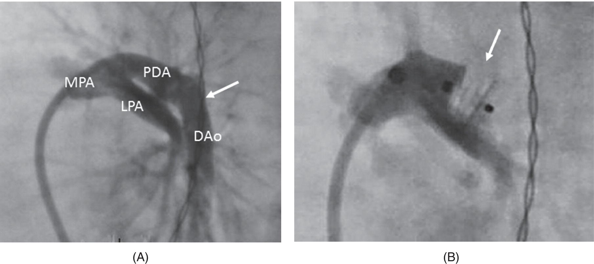

[**Figure 34.4**](#R_c34-fig-0004) Patent ductus arteriosus closure in a premature infant. (A) Anatomy on prograde venous angiography. dAO, descending aorta; LPA, left pulmonary artery; MPA, main pulmonary artery; PDA, patent ductus arteriosus. Note relationship of esophageal temperature probe (arrow) to the dAO. (B) Device occlusion of the PDA.

(Source: Texas Children’s Hospital Cardiac Catheterization Laboratory.)

Total IV anesthesia using low‐dose ketamine, fentanyl, and muscle relaxant is a commonly used technique in infants weighing <2 kg due to the use of an NICU ventilator. These drugs have the ancillary benefit of promoting hemodynamic stability. For larger and less tenuous preterm infants for whom an anesthesia machine is appropriate, low‐dose volatile agent is often added. Blood and vasoactive agents should be immediately available. Our practice is to leave these patients intubated for return to the NICU.

#### Ventricular septal defects

Transcatheter closure of VSDs is similarly fraught with the potential for hemodynamic derangements \[46\]. These can include heart block or tachyarrhythmias, AV valve (AVV) and/or aortic valve regurgitation, volume overload, bleeding, and cardiac arrest. Heart block can develop either secondary to catheter‐ or device‐induced injury. When deployed in proximity to the conduction system, the device’s radial force can compress the surrounding tissue. Consequently, attempts at closure of membranous VSDs are associated with a higher incidence of complete heart block (CHB) than muscular VSDs. Though steroids have been administered prophylactically to prevent and subsequently treat device‐related CHB (presumptively to decrease inflammation‐mediated edema), their use remains speculative \[47–50\]. Valvular regurgitation can similarly occur due to device deployment near the AV or aortic valve, or separately as a result of catheter‐induced trauma. The approach to the VSD, whether retrograde through the left heart or antegrade through the right heart, can cause injury to the aortic valve either alone or both the tricuspid and aortic valves, respectively ([Figure 34.5](#c34-fig-0005)). Notably, recent advancements in delivery systems and softer devices have led to an improved rate of successful closure of various VSDs with lower rates of heart block and arrhythmia \[50\]. Transcatheter closure of perimembranous VSDs remains controversial, however, due to concerns of heart block, aortic valve injury, and hemolysis associated with residual defects.

Given the prevalence of catheter‐induced disturbances, vasoactive support is commonly initiated to provide hemodynamic stability. Adequate peripheral venous access and dedicated arterial monitoring are, therefore, recommended. Transvenous pacing is indicated if heart block persists (and the availability of this equipment should be confirmed prior to starting). Volume overload secondary to flush and contrast administration is common and managed with IV furosemide. Postprocedural disposition can vary depending on the procedure’s course, but ensuring the availability of an ICU bed is advisable should continued intubation or pacing be needed.

#### Coronary artery fistulas

Coronary artery fistulas (CAFs) are anomalous communications between a coronary artery and a chamber of the heart or another blood vessel ([Figure 34.6](#c34-fig-0006)). In the absence of any other cardiac lesion, these fistulas can be a source of pulmonary overcirculation (in patients with fistulas ending in the RV), myocardial ischemia due to coronary steal, or infectious endocarditis. Interventions to close CAFs can be associated with spasm, thrombosis, or dissection of the coronary \[51\]. Attention to signs of ischemia on EKG and the availability of vasoactive agents to promote coronary vasodilation (nitroglycerin) or hemodynamic support in the event of hypotension (vasopressin, phenylephrine, and epinephrine) are central tenets of anesthetic management. A dedicated arterial line is indicated as the procedure is performed through the femoral arterial sheath. Following occlusion of the fistula, altered flow dynamics that could lead to stasis and thrombosis proximal to the device with subsequent myocardial ischemia/infarction necessitate the initiation of anticoagulation and postprocedural monitoring in the ICU. A continuous heparin infusion is commonly initiated prior to departure from the CCL to avoid delays in anticoagulation associated with transfer of care.

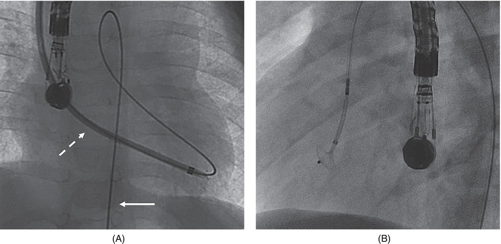

[**Figure 34.5**](#R_c34-fig-0005) Transcatheter ventricular septal defect closure. (A) Antegrade device deployment over an arteriovenous loop. The arterial end of the loop is a wire (arrow) advanced in sequence from the femoral artery through the aortic valve, left ventricle, ventricular septal defect, and into the superior vena cava. The venous end of the loop snares the arterial wire and is externalized through the femoral venous sheath. The delivery sheath (dotted arrow) is then advanced antegrade over the venous end of the loop. (B) Retrograde device deployment entirely from the arterial side.

(Source: Morray \[50\]. Reproduced with permission of Elsevier.)

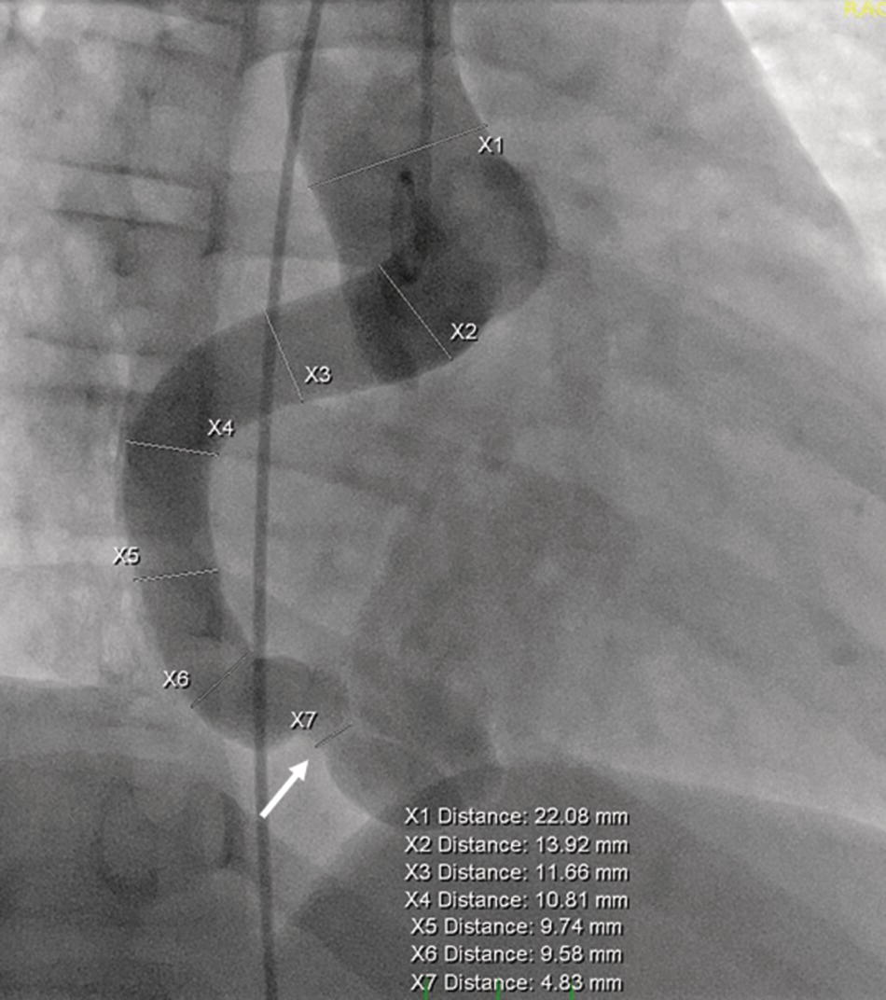

[**Figure 34.6**](#R_c34-fig-0006) Coronary artery fistula. Angiogram demonstrating right coronary artery aneurysmal dilation and continuity with the right ventricle. This 10‐year‐old child was asymptomatic but had pulmonary overcirculation as a result of the fistula. Device occlusion was targeted at the distal narrowing (arrow).

(Source: Texas Children’s Hospital Cardiac Catheterization Laboratory.)

### Balloon dilation of cardiac valves

#### Pulmonary valvuloplasty

Children with pulmonary stenosis (PS) can range the spectrum from critically ill neonates to older, otherwise healthy, children. The severity of PS and any associated hypoplasia of the RV and tricuspid valve accounts for these differences in presentation. Neonates whose PS is so severe as to require ductal patency for pulmonary blood flow (PBF) are described as having critical PS \[52\]. These patients, therefore, have single‐ventricle physiology and are managed with prostaglandin (PGE1) in the periprocedural period. Cyanosis is common in the setting of an atrial‐level communication due to the presence of suprasystemic RV pressures, RV diastolic dysfunction, and TR that promote elevated right atrial pressure and right‐to‐left shunting \[53\]. The RV is typically hypertrophied with preserved systolic function, but occasionally may demonstrate significant dysfunction. GETA is recommended, and attention to oxygenation and ventilation is necessary to balance _Q_p : _Q_s in the setting of the patent ductus. Diastolic hypotension is avoided as subendocardial ischemia can develop in the pressure‐overloaded RV. During the procedure, because the valve is already severely restrictive and PBF is preserved through the ductus, periods of balloon dilation are well tolerated ([Figure 34.7](#c34-fig-0007)). Major complications such as transient or permanent heart block, tricuspid papillary muscle rupture, balloon rupture, and PA tears are rare \[53\]. Transient bradycardia or catheter‐induced arrhythmias are more common. Postprocedure, PGE1 may be stopped or continued depending on the size and function of the RV. Importantly, even with the complete relief of obstruction, RV diastolic dysfunction will persist as RV hypertrophy subsides over several months. A gradual wean of PGE1 may be needed in the ICU to assess the ability of RV to promote PBF. For those demonstrating persistent ductal dependency, either ductal stenting or a surgical shunt is indicated.

Older infants and children presenting for pulmonary valvuloplasty are usually at lower risk. They tend to have a normal‐sized RV and tricuspid valve and are able to generate adequate prograde PBF without the need for a PDA. Cyanosis is, therefore, not common but can still occur in the patient with severe obstruction and an ASD. Overarching anesthetic goals include maintaining euvolemia and avoiding hypotension to minimize the risk of ischemia in the thick and pressurized RV. For those rare patients who present with RV dysfunction due to long‐standing severe PS, inotropes and vasopressors may be needed to bolster cardiac output and achieve normotension while anesthetized. The process of ballooning causes a transient pause in PBF (in contrast to patients with critical PS) and produces predictable changes in hemodynamics and oxygen saturations depending on whether or not an ASD is present. In patients without an ASD, ballooning is associated with periods of hypotension, bradycardia, and desaturation due to the acute loss of LV filling and PBF. In patients with an ASD, blood pressure is typically preserved during ballooning due to right‐to‐left shunting across the ASD, but desaturation occurs nonetheless. These events usually self‐resolve following balloon deflation, but boluses of phenylephrine may be necessary to treat hypotension in at‐risk patients who do not recover within seconds. Preoxygenation prior to ballooning can help minimize the severity of desaturation. Development of severe infundibular obstruction after ballooning, although rare, has been reported \[54–56\]. Adequate preload and a slower heart rate can ensure ventricular filling in these cases. Beta‐blockade is rarely necessary. Although this procedure can be performed with sedation in the compensated child or adolescent, the variable length of the procedure and the significant stimulation associated with ballooning lead us to use GETA. If uneventful, patients are commonly discharged on the same day.

Further along the continuum of PS is pulmonary atresia with intact ventricular septum (PA/IVS). As with critical PS, this lesion is ductal dependent for PBF, and decompression of the RV is sought to establish prograde PBF that may allow for a future biventricular or 1 ½ ventricle repair. These patients, however, may have abnormalities in their coronary anatomy that preclude RV decompression. The pressurized RV can result in the formation of fistulous connections between the RV and the epicardial coronary arteries, and when combined with proximal coronary stenosis or occlusion (present in 9–34% of patients with PA/IVS)\[57\], an RV‐dependent coronary circulation (RV‐DCC) results \[58\] ([Figure 34.8](#c34-fig-0008)). Decompression of the RV in this setting would lead to myocardial infarction. Consequently, the first procedure undertaken in the CCL is a diagnostic coronary and RV angiogram to rule out the presence of RV‐DCC. For patients without RV‐DCC, RV decompression and prograde PBF can be established with wire or radiofrequency (RF) perforation, followed by ballooning of the atretic valve. Given these additional steps, the duration of the procedure is longer and the risks of complications greater than with balloon valvuloplasty alone. Risks can include heart block, right heart perforation, tamponade, volume overload, dilutional anemia, and acid–base derangement \[59, 60\]. Ductal stenting may be performed in the same setting or at a later date (see PDA stenting to augment PBF). Timing is often dependent on the size of the ductus and stability of the patient following what may be a lengthy intervention at the atretic valve \[61\].

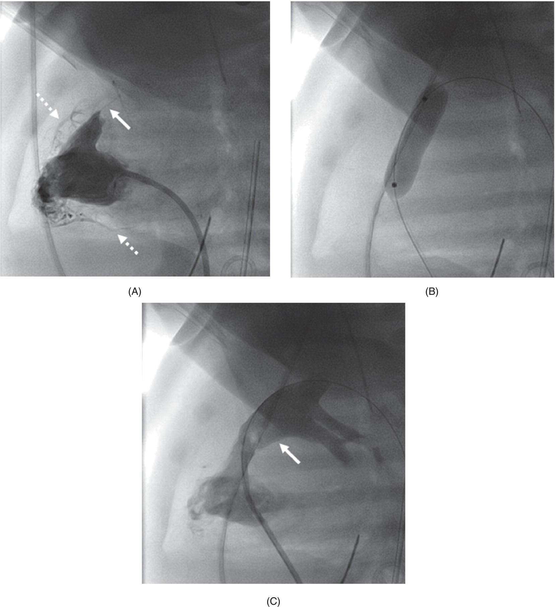

[**Figure 34.7**](#R_c34-fig-0007) Balloon valvuloplasty in critical pulmonary stenosis. (A) Right ventricular (RV) angiogram in a neonate with critical pulmonary stenosis. A very thin jet of antegrade flow can be seen across the pulmonary valve (arrow). Also noted is filling of the coronary arteries (dotted arrows) via fistulous connections (non‐RV dependent in this case). (B) The pulmonary valve was crossed with a fine wire and dilated with a balloon. (C) After pulmonary valvuloplasty, there is a wide jet of antegrade flow (arrow) across the pulmonary valve.

(Source: Texas Children’s Hospital Cardiac Catheterization Laboratory.)

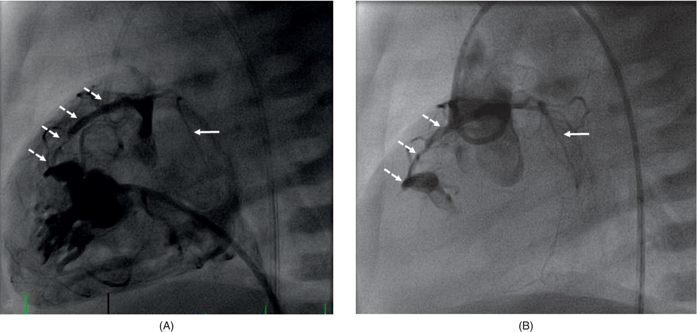

[**Figure 34.8**](#R_c34-fig-0008) Right ventricle (RV)‐dependent coronary circulation. (A) RV angiogram in a newborn with PA‐IVS. Interruption of the mid‐left anterior descending coronary artery (dotted arrows) with a fistulous connection to the RV is seen. A small circumflex coronary artery (solid arrow) is also seen. (B) Direct angiography in the left main coronary artery confirms interruption of the left anterior descending coronary artery (dotted arrows) and a small circumflex coronary artery (solid arrow).

(Source: Cabrera et al. \[58\]. Reproduced with permission of Elsevier.)

#### Aortic valvuloplasty

As with PS, valvular aortic stenosis (AS) can manifest variably depending on the severity of the obstruction and any associated cardiac lesions. Critical AS is the most severe manifestation and presents in the neonatal period as a lesion that is ductal dependent for systemic blood flow. Definitive treatment entails relieving the valvular obstruction. Medical management prior to arrival in the CCL includes the initiation of PGE1, and in the subset of patients with compromised end‐organ perfusion and respiratory failure, inotropic support, and mechanical ventilation \[62\]. Of note, hemodynamic and respiratory status should be regarded as tenuous even in the neonate presenting on room air and PGE1 alone. The LV is most commonly dilated and dysfunctional at baseline, and the procedure may further exacerbate hemodynamics due to catheter‐induced arrhythmias, decreases in cardiac output with ballooning, and the potential for new aortic insufficiency following valvuloplasty. GETA is, therefore, used. An infusion of epinephrine is often started with induction of anesthesia if the patient is not already receiving it, and vasopressin may be indicated to optimize coronary perfusion pressure. Due to the risk of arrhythmias, defibrillation pads should be immediately available.

The vascular access approach planned by the cardiologist can provide additional insight into specific risks as well as the duration of the procedure. The carotid approach offers the most direct and expedient route to the aortic valve but can be associated with neurologic injury. It is, therefore, reserved for the smallest of neonates for whom the risk of femoral artery injury is thought to exceed that of the carotid \[63–65\]. To facilitate carotid access, the cardiologist may request that the patient be turned 180° away from the usual position (such that the airway is furthest from the anesthesiologist). Care with positioning of lines and the ETT is necessary in this circumstance to minimize the risk of line displacement or kinking of the ETT. A more common approach to the aortic valve is retrograde through the femoral artery. Antegrade approaches through the femoral vein (and then in sequence through the atrial septum, mitral valve, and LV) are less common due to the instability associated with passing the catheter through potentially smaller left‐sided structures (with risks of arrhythmia, mitral valve damage, and perforation) \[59\]. If the femoral artery is used, additional arterial access for blood pressure monitoring is indicated. New, hemodynamically significant aortic insufficiency following ballooning (indicated by diastolic hypotension and ischemic ST changes) requires urgent surgical intervention for valve repair/replacement.

Management of reinterventions later in life, or first‐time interventions in older children or adolescents, is marked by the usual concern of maintaining an adequate coronary perfusion \[62\]. Anesthetic technique and risk assessment can be guided by the patient’s age, LV function, severity of the gradient, and comorbidities. For older patients who have a borderline indication for intervention based on Doppler‐derived mean transvalvular gradients, the peak‐to‐peak gradient obtained during catheterization can provide definitive information to direct therapy. In such cases, light sedation may be preferable to general anesthesia during the diagnostic portion since the latter may lead to an underestimation of the actual gradient. Our preference otherwise is to use GETA to avoid the risk of movement with balloon dilation that may increase the risk of aortic valve injury. Importantly, rapid RV pacing may be used to reduce stroke volume and minimize balloon movement during inflation in older patients. The resulting decrease in cardiac output is typically well tolerated in those with preserved LV function but may necessitate treatment with phenylephrine to expedite recovery. As the approach to the aortic valve will most commonly be through the femoral artery, the need for a separate arterial line for dedicated blood pressure monitoring is dictated by the patient’s baseline LV function.

### Balloon angioplasty and/or stent placement

#### Pulmonary arteries

A number of pathologies are associated with PA stenosis, including syndromes such as Alagille or Williams‐Beuren and different forms of CHD in which stenosis can develop either independently or as a consequence of surgery (ductal origin of the PA, palliated single ventricles, Tetralogy of Fallot (TOF), truncus arteriosus, and transposition, among others).

Similar to valvular PS, anesthetic management in children with PA stenosis is dependent on the degree of stenosis present and its effects on RV pressure and function. Estimates of RV pressure can be gauged by the presence of a TR jet and compensatory RV hypertrophy on echocardiography. Euvolemia and age‐appropriate diastolic perfusion pressures should be maintained to decrease the risk of ischemia. Catheter‐induced arrhythmias and periodic hypotension (due to TR caused by catheters en route to the PAs) are common, particularly in younger patients. Though well tolerated in children with preserved ventricular function, those with depressed function may need vasoactive support.

Critical events associated with PA angioplasty/stenting include hemorrhage due to vessel rupture, lung reperfusion injury, and occlusion of the left mainstem bronchus with stenting of the left PA \[1, 66–69\]. The potential for life‐threatening hemorrhage, though rare with the introduction of covered stents and vessel occlusion, requires the presence of large‐bore IV access and packed red blood cells in the CCL. Lung reperfusion injury is more common, with a reported incidence of 15–22% in published cohorts (higher when segmental and subsegmental branches with severe stenoses are involved) \[69, 70\]. This presents as a decrease in both lung compliance and PaO2 : FiO2, and occasionally with blood‐tinged fluid in the ETT. Proposed mechanisms include an acute increase in hydrostatic pressure due to increased flow following angioplasty or the acute increase in LV end‐diastolic volume in a noncompliant LV. Treatment entails conservative management with continued mechanical ventilation, increased positive end‐expiratory pressure (PEEP), and diuresis if oxygenation and ventilation are compromised. Rarely, one lung ventilation is needed. In patients at high risk for developing hemorrhage or reperfusion injury, we have occasionally placed a bronchial blocker preemptively ([Figure 34.9](#c34-fig-0009)). The potential for acute left bronchial compression should be considered in the setting of a recently deployed left PA stent with a new finding of diminished lung compliance and left lung atelectasis (assessed via fluoroscopy) \[67\]. Bronchoscopy can be used to confirm this diagnosis.

Additional risk can be inferred based on patient characteristics. Patients with Alagille and Williams‐Beuren syndromes may present for PA intervention and carry comorbidities unique to each condition – namely, the risk of liver disease and coincident supravalvar AS, respectively \[71\]. Moreover, those with a history of D‐transposition of the great arteries (d‐TGA) status post the arterial switch operation may be at risk for coronary compression with attempts at branch PA stenting. The LeCompte maneuver in these patients can place the branch PAs in proximity to the translocated coronaries, and so testing is done to assess for coronary compromise prior to stenting \[72\]. The presence of profound hypotension and/or ST changes on EKG with testing also suggests the need to abort.

#### Pulmonary veins

Pulmonary vein stenosis (PVS) in children can be a relentless disease associated with significant morbidity and mortality \[73–75\]. Classified as either primary (congenital) or postrepair (acquired), the pathophysiology of PVS is an increase in pulmonary venous pressure that can lead to PH, right heart failure, and, ultimately, death \[76–79\]. Characteristics associated with increased mortality include earlier age at presentation, bilateral disease, multivessel involvement, and the concurrent presence of CHD and/or prematurity \[80–82\]. The foundation of management is early surgical or catheter‐based therapy to relieve the stenosis followed by repeat catheterizations as indicated to address disease recurrence and/or progression ([Figure 34.10](#c34-fig-0010)).

Due to the risk of RV failure secondary to PH, preanesthetic evaluation focuses on the RV and signs of systemic or suprasystemic PAPs \[73\]. For those entering the procedure with depressed RV function, preparations to support the RV should include the availability of epinephrine, phenylephrine, vasopressin, iNO, and, in the highest risk patients, ECMO. Consideration should be given to starting epinephrine and vasopressin prior to induction in those with moderately to severely depressed function. Though counterintuitive that a pulmonary vasodilator would be useful in patients with a downstream obstruction, some patients with PVS may respond to iNO with a significant reduction in PAP \[83\]. Its use may be considered if acute reductions in pulmonary afterload are needed (and can be stopped quickly if the patient deteriorates with its initiation).

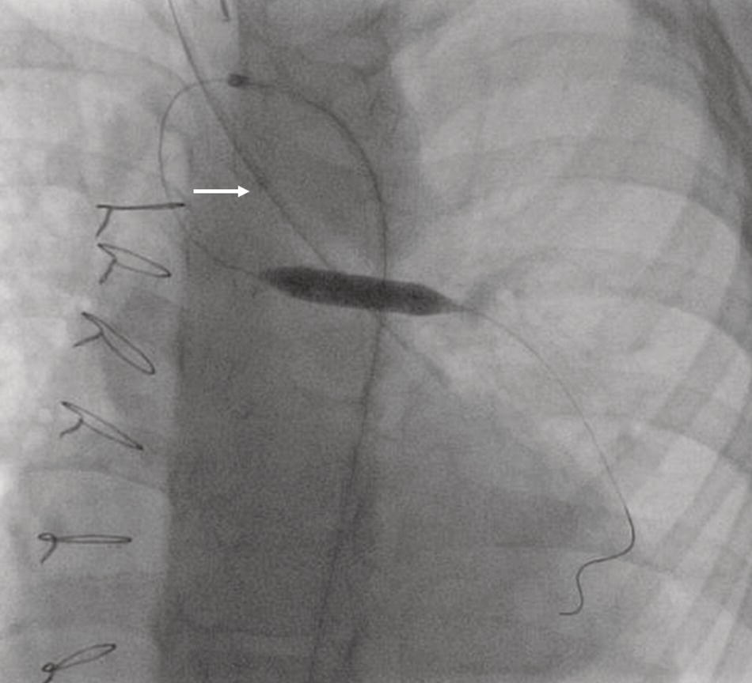

[**Figure 34.9**](#R_c34-fig-0009) Bronchial blocker with pulmonary artery angioplasty. A left bronchial blocker (arrow) has been inserted prophylactically to contain hemorrhage in a 7‐year‐old child with PA/VSD/MAPCAs undergoing pulmonary artery angioplasty. An angioplasty balloon is seen inflated in the left pulmonary artery.

(Source: Texas Children’s Hospital Cardiac Catheterization Laboratory.)

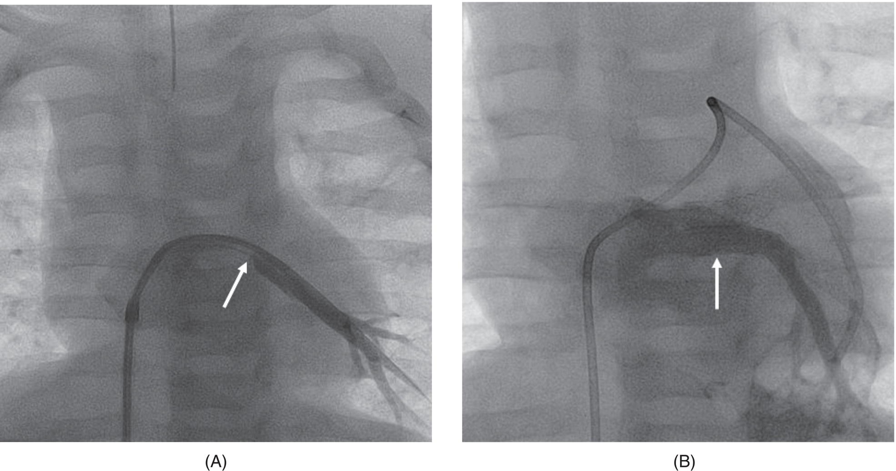

[**Figure 34.10**](#R_c34-fig-0010) Pulmonary vein stenosis angioplasty and stenting. (A) Severe left lower pulmonary vein stenosis (arrow) can be seen in a 1‐year‐old. (B) After left lower pulmonary vein stenting (arrow), a left lower pulmonary artery wedge injection shows an unobstructed left lower pulmonary vein. Also noted is a stent in the left upper pulmonary vein.

(Source: Texas Children’s Hospital Cardiac Catheterization Laboratory.)

Preprocedural respiratory status can also indicate disease severity and is related to the number of veins involved and the degree of stenosis. Children presenting in respiratory distress due to pulmonary venous congestion may be tachypneic with retractions and in need of noninvasive ventilatory support or intubation. Even in the absence of RV dysfunction, such signs indicate limited reserve and the potential for instability with anesthetic induction and maintenance. Because lung compliance, oxygenation, and ventilation can all worsen during the procedure (as discussed below), patients already starting with pulmonary edema may demonstrate less tolerance for additional insults than those without it. Preemptive diuresis with IV furosemide (1 mg/kg) is often used in at‐risk children (and can be re‐dosed as indicated).

Procedural risk and duration can otherwise be gauged by the number of veins needing intervention, whether an ASD is present, and if the femoral veins are patent. Multivessel PVS is associated with both a longer intervention and an increased risk of instability. The latter is related to the potential for pulmonary edema and hemorrhage that increases incrementally with each vein requiring intervention. In the absence of an ASD, transseptal puncture or RF perforation is needed to pass through the atrial septum to access the pulmonary veins. Though generally safe, this added step confers the risk of cardiac perforation while also increasing overall procedural time. Stenotic or thrombosed femoral veins can present another challenge to the interventionalist. Recurring use of the femoral veins with repeat interventions can render them inaccessible. Transhepatic venous access may be needed, which also carries a higher risk of bleeding and AV block \[84\]. A review of prior anesthetics in patients presenting for repeat intervention can often provide insight into the need for these additional procedures and general information regarding how the anesthetics and interventions were tolerated.

The previously alluded to complications of pulmonary edema and pulmonary hemorrhage can be anticipated in children with severely stenotic veins. Patients without any prior intervention and evidence of significant disease are at the highest risk. Pulmonary edema can present either gradually with fluid overload related to flush and contrast administration or more acutely with the transient occlusion of a pulmonary vein during angioplasty and stenting. The latter can also cause pulmonary hemorrhage. Balloon inflation in such settings can be associated with an acute increase in pulmonary venous pressure that can lead to airway bleeding. More common, however, is pulmonary hemorrhage in the setting of a PA wedge injection (used to define pulmonary venous anatomy). Injections into lung segments that are drained by nearly occlusive veins will result in markedly increased capillary pressures ([Figure 34.11](#c34-fig-0011)). Such bleeding is usually self‐limited with subtle changes in compliance but can manifest as gross blood in the ETT or an acute decrease in lung compliance followed by profound desaturation. As with the management of reperfusion injury, pulmonary hemorrhage can be treated conservatively with suctioning, continued mechanical ventilation, diuresis, and increased PEEP and FiO2. In severe or persistent cases, endotracheal instillation of tranexamic acid can be efficacious \[85\]. The need for ECMO is rare, but indicated if hypoxemia is not reversible and contributing to hemodynamic instability. Of note, episodes of either pulmonary hemorrhage or edema that require escalations in hemodynamic and/or ventilatory support should prompt a discussion of whether or not to proceed. If some of the stenotic veins have already been addressed, a reasonable strategy is to return to the CCL once the patient has recovered. If no intervention has yet been performed in the setting of severe, multivessel disease, ECMO cannulation may be needed prior to proceeding.

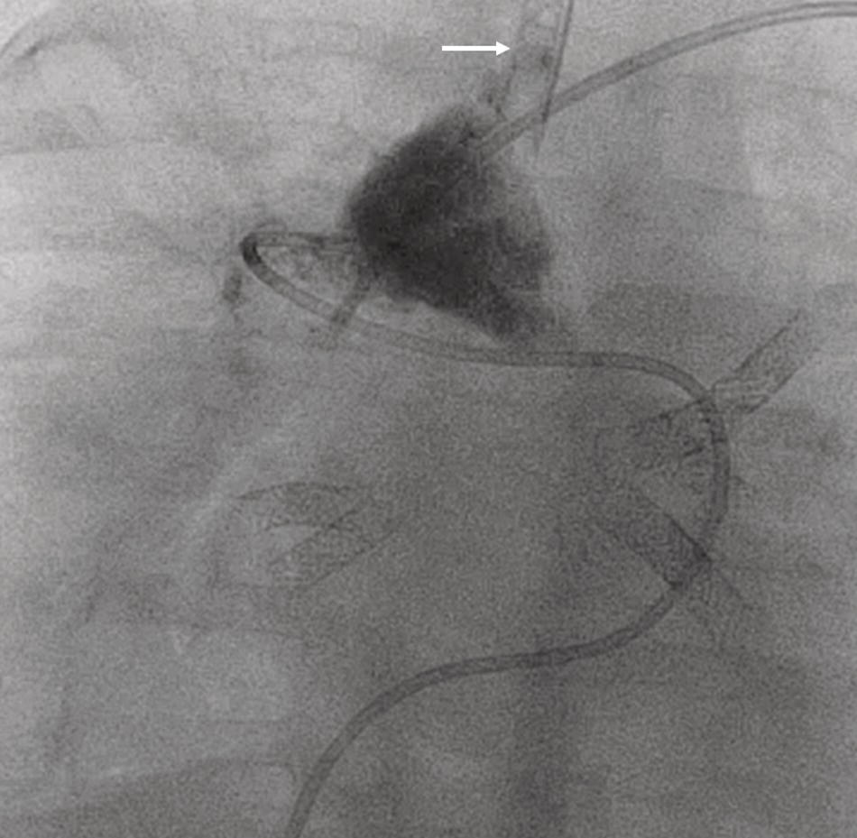

[**Figure 34.11**](#R_c34-fig-0011) Pulmonary hemorrhage with pulmonary artery wedge injection in pulmonary vein stenosis. Right upper pulmonary artery wedge angiogram in a child with an obstructed right upper pulmonary vein. Contrast is seen entering the right bronchus and trachea (arrow). Stents can be also noted in multiple affected pulmonary veins. A peripherally inserted central catheter is also seen entering from the left arm.

(Source: Texas Children’s Hospital Cardiac Catheterization Laboratory.)

#### Right ventricular outflow tract stenting

Stenting of the right ventricular outflow tract (RVOT) has gained acceptance as an alternative to the modified Blalock–Taussig shunt (mBTS) in the initial palliation of premature or severely cyanotic infants with TOF ([Figure 34.12](#c34-fig-0012)). In a single‐center review comparing RVOT stenting to the mBTS, patients undergoing RVOT stenting were found to have a shorter hospital length of stay, improved PA growth, and comparable mortality while awaiting complete repair \[86\].

Common anesthetic concerns in this population include the potential for hypercyanotic episodes, or “tet spells,” prior to stent placement, and the presence of significant noncardiac comorbidities that may influence anesthetic planning. The usual measures taken to prevent a hypercyanotic episode should be employed, such as euvolemia, adequate anesthetic depth, and avoidance of decreases in SVR. In patients who are cyanotic, transfusion to a hematocrit >40% can serve the purpose of providing preload while also increasing oxygen delivery and SVR. FiO2 can be increased as needed. Catheter‐induced arrhythmias or TR can precipitate hypotension and are treated with boluses of phenylephrine or the initiation of a vasopressin infusion. TR can also cause systemic desaturation in the setting of an ASD due to increased right‐to‐left shunting. Transient desaturation can be anticipated with balloon inflation and preemptively managed with phenylephrine and preoxygenation. Because RVOT stenting may constitute definitive therapy in those infants for whom operative risk is prohibitive \[87\], an awareness of the child’s noncardiac risk factors and how they may influence anesthetic management is critical. Such patients may also present for reintervention in the setting of in‐stent stenosis and remain at‐risk for hypercyanotic episodes until the stenosis is relieved.

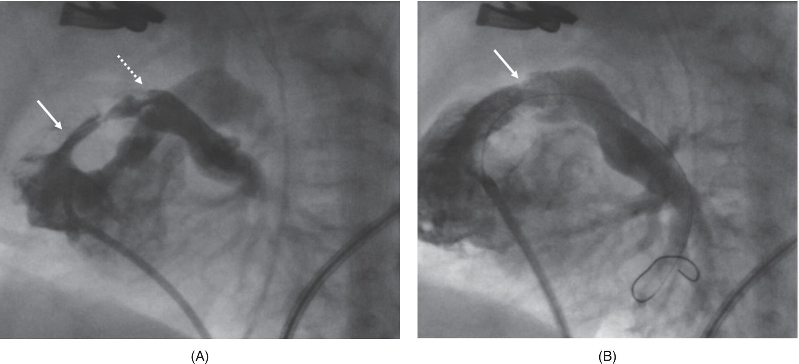

[**Figure 34.12**](#R_c34-fig-0012) Right ventricular outflow tract stenting in Tetralogy of Fallot. (A) Severe right ventricular outflow tract obstruction (arrow) in an infant with Tetralogy of Fallot with hypercyanotic spells. Also noted is severe valvar pulmonary stenosis (dotted arrow). (B) After right ventricular outflow tract stenting (pulmonary valve annulus intentionally crossed), there is significant improvement in antegrade flow across the right ventricular outflow tract and pulmonary valve.

(Source: Texas Children’s Hospital Cardiac Catheterization Laboratory.)

Procedural risks include perforation of the PA or RVOT, pulmonary edema, tricuspid valve regurgitation, and stent embolization \[86\]. Perforation of the RVOT can manifest as a pericardial effusion, whereas puncture of the PA can present as hemoptysis or the appearance of contrast in the pleural spaces or lung fields \[73\]. Significant pericardial effusions require drain placement. Blood drained from the pericardium may be directly transfused back to the patient if the volume is needed. Protamine can be used to reverse anticoagulation in this setting if the activated clotting time (ACT) is prolonged, and surgery may be necessary if bleeding persists. Pulmonary edema develops most often as a result of reperfusion injury following relief of the obstruction to PBF. Treatment is conservative with continued mechanical ventilation, increased PEEP, and diuresis.

#### Coarctation of the aorta

Catheter‐based management of coarctation of the aorta (CoA) entails balloon angioplasty with or without stent placement. Patient size and age dictate which approach is used. Angioplasty alone is typically reserved for neonates and infants, whereas combined angioplasty and stenting is used in older patients \[88\]. Common indications for catheter‐based management include the initial treatment of discrete coarctation in older children and adolescents and reintervention in those presenting with discrete recurrent or residual coarctation ([Figure 34.13](#c34-fig-0013)).

Anesthetic management of CoA varies with patient age and clinical status (i.e., ventricular function) \[88\]. Sedation has been used successfully in older children and adolescents, but a deep level is required to blunt the noxious stimulus of aortic ballooning. Our practice is to use GETA regardless of patient age or ventricular function to reduce the movement‐associated risks of aortic dissection or stent migration.

Common aspects of care include the need for large‐bore IV access and blood pressure monitoring in the right upper extremity (RUE). Assuming a left aortic arch with normal branching, the RUE blood pressure reflects both cerebral and coronary pressures (as the innominate artery arises precoarctation). In contrast, a lower extremity or left upper extremity blood pressure would underestimate these values and lead to unnecessary treatment if used. Additional arterial access beyond that placed by the interventionalist is usually unnecessary but may be indicated based on individual patient risk and need for postprocedural monitoring (e.g., infants with severely depressed LV function undergoing angioplasty as a temporizing procedure or for recurrent CoA following stage 1 palliation). Of note, the arterial access placed by the interventionalist is most often at the femoral artery but can include the carotid or axillary arteries in smaller patients (<2 kg) to avoid femoral artery injury. In older patients, rapid RV pacing may be used when stenting is planned to minimize the risk of migration with deployment and is well tolerated in those with preserved LV function. Postprocedural disposition is guided by preprocedural clinical status. For most undergoing elective intervention, neither ICU admission nor IV antihypertensives are needed.

[**Figure 34.13**](#R_c34-fig-0013) Coarctation of the aorta angioplasty and stenting. (A) Severe native coarctation of aorta (arrow) in an 18‐year‐old adolescent. (B) After bare metal stent implantation (arrow) from a femoral arterial approach, there is unobstructed flow in the descending aorta.

(Source: Texas Children’s Hospital Cardiac Catheterization Laboratory.)

Acute complications include vessel dissection or disruption, cerebrovascular accidents, stent migration, and balloon rupture \[89, 90\]. Patients weighing <30 kg presenting for stenting should raise concern for the potential for access site injury. The sheath size necessary to deliver the stent can approximate the size of the femoral or iliac arteries themselves, thereby increasing the risk of vascular disruption with both sheath placement and withdrawal. Acute hypotension unrelated to pacing or ballooning should elicit evaluation for contrast extravasation. Temporary balloon inflation and subsequent covered stent placement are used to temporize in such situations. The risks of both aortic dissection and cerebrovascular accidents appear higher with older age, with patients over 40 years of age at greatest risk \[90\]. Aneurysm formation at the site of intervention is a late complication more associated with angioplasty alone than stenting.

#### Patent ductus arteriosus stenting to augment pulmonary blood flow

Ductal stents have been used increasingly in recent years in the initial palliation of neonates with ductal‐dependent PBF ([Figure 34.14](#c34-fig-0014)). Data comparing ductal stenting to the mBTS have demonstrated comparable outcomes in terms of death and unplanned reintervention to address cyanosis \[91\]. Children receiving ductal stents have decreased lengths of stay in the ICU, lower procedural complications, and larger and more symmetric PAs at the next stage of palliation relative to those managed with a mBTS \[88\]. These positives are balanced, however, by an increased need for subsequent reintervention and a higher initial failure rate due to an inability to stent the duct \[91, 92\]. This latter concern and the unique complications that may occur during the procedure are of interest to the anesthesiologist.

PGE1 can be either continued or stopped in preparation for ductal stenting. If continued, there may be concern that the PDA is tortuous and at risk for spasm with manipulation. More commonly, PGE1 is stopped hours prior to the procedure \[1\]. This is to produce a reduction in ductal diameter that allows the stent to be well anchored on release, thereby decreasing the risk of embolization. Ductal narrowing is clinically apparent when the patient begins to desaturate. The time interval between stopping PGE1 and the onset of desaturation, often known to the ICU through previous trial and error, can inform scheduling as well as guide urgency. The ideal situation would be to have the child positioned and prepped in the CCL before severe desaturation occurs. In the event of such desaturation, PGE1 can be restarted (patients who are entirely ductal dependent are particularly vulnerable). For those with an ancillary source of PBF (e.g., PS or PA/IVS following RF perforation and dilation), an alternative strategy can be to start vasoactives to augment PBF while the procedure proceeds urgently.

The duct can be approached from a variety of access points dictated by its location on the aorta \[93\]. The particular approach used influences patient positioning and any additional monitoring that may be needed. Patients with a percutaneous carotid or axillary approach may require positioning such that the airway is directed 180 degrees away from the anesthesiologist (called the “flip technique”) \[94\]. Care in securing the ETT, IVs, and monitoring lines is essential as patient access is limited in this position.

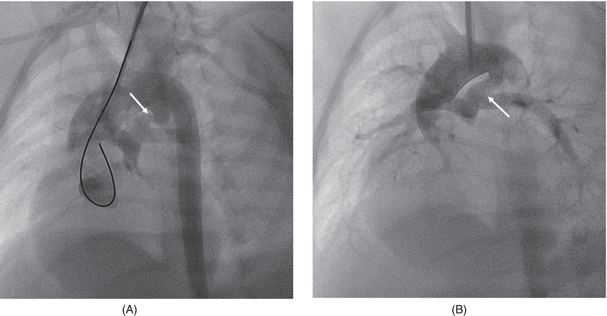

[**Figure 34.14**](#R_c34-fig-0014) Ductal stent for pulmonary blood flow. (A) A tortuous ductus arteriosus (arrow) can be seen supplying confluent branch pulmonary arteries in a neonate with ductal‐dependent pulmonary blood flow. Also noted is a percutaneously placed left common carotid artery sheath. (B) A ductal stent is seen (arrow) that has been placed via a percutaneous left common carotid artery approach.

(Source: Texas Children’s Hospital Cardiac Catheterization Laboratory.)

Beyond standard monitoring, placement of an additional arterial line is often indicated. Because the arterial access obtained by the interventionalist may be used for deploying the stent, a separate arterial line is needed to provide accurate blood pressure monitoring and blood gas assessment both during and after the procedure. The location of the duct and the interventionalist’s approach can guide where to place this line. For example, in a patient undergoing a left axillary artery approach, a left radial arterial line (and the pulse oximeter on that hand) would be blunted. In the absence of central venous access, two peripheral IVs are placed: one to allow for volume resuscitation and bolus drug administration and the other for continuous infusions of vasoactives. It is the norm at our institution to initiate vasoactives during this procedure, whether with epinephrine, vasopressin, or both. For patients undergoing a common carotid approach, cerebral near‐infrared spectroscopy (NIRS) on the side being accessed may be useful to detect changes in perfusion \[95\]. A Foley catheter is routinely placed. Other concerns common to the neonatal population include maintaining normothermia and normoglycemia. A forced air warmer and the use of a dextrose‐containing carrier fluid can address these issues.

Critical events that may occur with manipulation of the ductus include ductal spasm and thrombosis. In patients who are ductal dependent, either event can lead to life‐threatening hypoxia. Boluses of epinephrine (1–10 mcg/kg) can support hemodynamics while attempts are made to open the ductus, and in the case of spasm, PGE1 can be reinitiated at high dose (0.1 mcg/kg/min) or given as a bolus (0.1 mcg/kg). PGE1 should, therefore, always be immediately available. Thrombosis can be managed additionally with a bolus of heparin (100 units/kg). Preparations for ECMO are made if attempts at restoring ductal patency are not rapidly successful. Even in cases when ductal spasm does not obviously occur, passage of the wire through the ductus can also promote desaturation. FiO2 is increased in anticipation of this event, and vasoactives are titrated to optimize PBF. Other intraprocedural complications of note include dissection and stent embolization \[1, 93\]. The latter may prove difficult to retrieve and can adversely affect systemic blood flow or PBF. Following successful stenting, oxygen saturations should improve. Attention is then shifted to minimizing the risk of overcirculation by titrating down on FiO2 and vasoactive support as able. Patients are most often kept intubated following the procedure to allow for further stabilization and optimization prior to extubation. Prior to leaving the CCL, perfusion to the extremity used for access is evaluated. If there are any concerns for inadequate pulses or a cool extremity, a heparin infusion is started. Further discussion of ductal stenting is presented in [Chapter 19](c19.xhtml).

### Creation of cardiovascular communications

#### Balloon atrial septostomy

Balloon atrial septostomy (BAS) is indicated in those forms of CHD that require an unrestrictive atrial septal communication. Examples include d‐TGA (to improve systemic saturations through better mixing), hypoplastic left syndrome (to relieve left atrial hypertension), or tricuspid atresia, total anomalous pulmonary venous return, or severe PS/atresia (to off‐load the right heart and augment cardiac output).

The procedure is performed through either umbilical or femoral vein access and, in the case of d‐TGA, can often be done at the bedside with TTE guidance. Once the balloon catheter is positioned in the left atrium, the balloon is inflated and a forceful jerk is applied to bring the balloon back to the right atrial–inferior vena cava junction \[1\]. This is repeated as needed to achieve an unrestrictive atrial communication. A subset of patients with thicker atrial septae for whom a BAS alone would be ineffective include neonates with hypoplastic left heart and infants older than 4–6 weeks. An atrial communication in these children is created using RF perforation or blade atrial septostomy, followed by ballooning and/or stenting of the atrial septum. Given the increased complexity of this group and need for fluoroscopy, these procedures are performed in the CCL.

Different anesthetic techniques can be used in the stable neonate undergoing BAS. Our approach is to intubate using low‐dose fentanyl (and/or ketamine) and muscle relaxant, and in those with an uncomplicated preprocedural and intraprocedural course, to extubate following successful ballooning. Those who are critically ill beforehand, such as the hypoplastic left heart syndrome (HLHS) patient with a highly restrictive atrial septum, are often already intubated and receiving significant inotropic and ventilatory support. Management is supportive until the atrial septum is opened. Thereafter, oxygen saturations should increase but can occur at the expense of systemic perfusion. Acute hemodynamic instability can result with the increase in Qp and loading of the RV.

Procedural complications are rare but can include balloon rupture and embolization of balloon fragments, stent embolization (if an atrial septal stent is used), vascular injury including avulsion of the pulmonary vein or inferior vena cava, or cardiac injury or perforation \[1\]. Examples of the latter are mitral valve injury with distal placement of the balloon, or rupture of the atrial appendage.

#### Palliation in pulmonary hypertension

In the child with worsening PH who is unresponsive to medical therapy, catheter‐based options for decompressing the RV and pulmonary vasculature include atrial septostomy/stenting, PDA stenting, and the reversed Potts shunt (left PA to descending aorta). While these procedures result in desaturation due to right‐to‐left shunting, they differ in the end organs affected \[15\]. With atrial septostomy, all end organs (including the brain and myocardium) are subject to desaturated blood. In contrast, the PDA stent and reversed Potts shunt deliver deoxygenated blood only to the splanchnic and lower extremity circulations (while preserving oxygenated blood flow to the brain and heart). Additional benefits over an ASD include a decrease in RV afterload, with a subsequent improvement in LV performance through a more normalized position of the interventricular septum. The reversed Potts shunt can be achieved via either ductal stenting in those infants and young children who have a still persistent PDA or the _de novo_ creation of a left PA–descending aorta connection. The latter is achieved using RF perforation and the placement of a covered stent \[96\]. Concerns for both techniques include the risk of too large a shunt: decreased PBF with subsequent hypoperfusion of the brain and heart (due to decreased LV filling) and severe lower extremity desaturation. Alternatively, blood flow from the aorta may be siphoned into the pulmonary circulation when PAP is subsystemic. One‐way valves have been used to address this \[97\]. Such patients are clearly among the highest risk for hemodynamic decompensation. Established strategies for the anesthetic management of severe PH apply.

#### Fontan fenestration creation

Children with the Fontan circulation may need a fenestration in the setting of worsening systemic venous hypertension (presenting clinically as protein‐losing enteropathy or persistent pleural effusions) or to achieve intracardiac access for arrhythmia ablation. An opening is most often created using a combination of needle/RF perforation and ballooning (with or without stenting), fluoroscopy, and echocardiography. Procedural risks include bleeding with pericardial effusion or tamponade, systemic embolization of air or thrombus, and volume overload with lengthy attempts at conduit perforation. Anesthetic risk is associated with the underlying Fontan physiology and the negative effects of PPV (on venous return) and anesthesia (on SVR and venous capacitance).

### Transcatheter valve replacement

#### Transcatheter pulmonary valves

The need for reintervention is almost universal among patients with abnormalities of the RVOT and pulmonary valve. Regardless of the prior palliation (whether a RV to PA conduit, transannular patch, balloon valvuloplasty, or replacement of the pulmonary valve altogether), additional interventions can be anticipated over time to address progressive stenosis and/or insufficiency. Conduits, such as those used in truncus arteriosus, pulmonary atresia, some forms of transposition, and the Ross procedure, fail due to stenosis and insufficiency associated with valve degeneration, loss of conduit diameter, and fixed size as the patient grows. The RV consequently becomes pressure and volume overloaded. On the other end of the spectrum are patients with TOF with transannular patches who develop worsening RV dilation due to free pulmonary insufficiency alone. In both cases, RV failure and intractable arrhythmias can result if the stenosis and/or insufficiency are not addressed.

Transcatheter pulmonary valve replacement (TPVR) has revolutionized the management of many of these patients since its introduction two decades ago. Candidates include those who have an adequately sized conduit or native RVOT to accept the available valves \[98–100\] ([Figure 34.15](#c34-fig-0015)). Broader application is currently limited by the size mismatch between current devices and their landing zones (e.g., a child with a transannular patch may have a dilated RVOT too large to accommodate a TPVR). Devices that are self‐expanding and hour‐glass in shape have recently become available, however, and may lead to increased utilization in this population \[98, 101\].

The status of the RV guides anesthetic management and risk assessment. Patients with preserved RV function undergoing TPVR are at low risk for anesthesia‐induced hemodynamic instability. Anesthetic techniques can include sedation with attention to increasing depth during stimulating portions (e.g., initial access, sheath upsizing for valve deployment, and ballooning and/or stenting of the existing valve or conduit) or GETA. Lengthy procedural times, the potential for significant procedural complications, and the need to avoid movement during valve deployment bias our management toward the use of GETA. Patients with preexisting RV dysfunction in the setting of long‐standing insufficiency or severe conduit or native RVOT stenosis, in contrast, represent a higher risk group. Such patients may already be receiving inotropic support entering the procedure and may require uptitration and the addition of a vasopressor with the induction of general anesthesia. Occasionally, patients with long‐standing RV dilation may also have TR and significant right atrium (RA) dilation, which provides a nidus for atrial dysrhythmias. Maintaining sinus rhythm and age‐appropriate systemic blood pressure is central to avoiding RV ischemia in the setting of RV hypertension and elevated RVEDP. Large‐bore IV access is routinely obtained to allow for volume resuscitation and vasoactive administration. External defibrillator pads and packed red blood cells need to be immediately available. Additional arterial access apart from that placed by the interventionalist is considered in those with RV dysfunction who may become hypotensive upon induction or with the institution of PPV. Patients who tolerate the procedure well are extubated. Given the large size of the venous sheaths placed (22–24 French), aggressive PONV prophylaxis and analgesia are administered to decrease the risk of bleeding associated with emesis or pain.

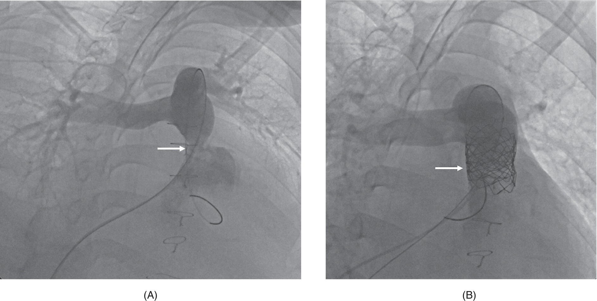

[**Figure 34.15**](#R_c34-fig-0015) Transcatheter pulmonary valve replacement. A morbidly obese 27‐year‐old female status post Ross procedure at age 9, now with severe conduit stenosis and severely depressed RV function, presented for TPVR. (A) A severely narrowed and calcified RV‐PA conduit is seen (arrow) with regurgitation. (B) After angioplasty, stent placement, and transcatheter pulmonary valve placement (arrow), there is no significant residual stenosis or regurgitation.

(Source: Texas Children’s Hospital Cardiac Catheterization Laboratory.

Major periprocedural complications include (i) coronary or aortic root compression, (ii) RV to PA conduit rupture, (iii) PA injury, (iv) postdeployment pulmonary edema, and (v) valve malposition/embolization \[102–106\]. Coronary compression can occur with ballooning of either the RV to PA conduit or the native outflow tract due to proximity of the coronaries to these structures. Consequently, a coronary angiogram is performed simultaneously with RVOT ballooning and after stent and valve placement to ensure coronary patency \[100, 105\]. Aortic root compression can occur similarly with resulting aortic insufficiency. Partial or total conduit rupture is associated with attempts at ballooning noncompliant conduits, such as those that are heavily calcified and severely stenotic. The subsequent hemorrhage is managed with volume resuscitation and pressor support, while the interventional team places a covered stent to limit further extravasation and a pericardial drain if tamponade develops. Surgery may be needed to provide definitive therapy. PA injury is most common secondary to guidewire perforation and can result in hemoptysis or hemothorax \[106\]. One lung ventilation may be indicated if severe. Pulmonary edema following the relief of stenosis is thought to be secondary to an acute increase in LVEDP (due to increased PBF) in patients with underlying LV diastolic dysfunction \[103\] ([Figure 34.16](#c34-fig-0016)). Though this mechanism would suggest a relatively acute presentation, it has also been observed in our institution up to 16 hours after valve deployment. This late presentation may indicate the need for close postprocedural monitoring in the highest risk patients: those with chronic and severe RVOT or conduit obstruction and preexisting LV dysfunction. Management entails aggressive diuresis and supportive mechanical ventilation.

#### Transcatheter aortic valves

No devices are currently approved for transcatheter aortic valve replacement (TAVR) in the pediatric population. Limitations associated with current devices include their large size (and larger delivery sheaths) relative to that needed for most children. Nonetheless, a transcatheter approach offers a reasonably efficacious alternative to surgery for a select group of children who would otherwise be poor surgical candidates \[107\].

Underlying LV function and the severity of aortic insufficiency (AI) and/or aortic stenosis (AS) guide anesthetic management. Because this procedure is currently limited to those with a relative contraindication to surgical repair, comorbidities can further guide assessment. GETA is the rule due to the potential for complications, invasiveness, need for TEE, and procedure length. ECMO candidacy or plans otherwise in the event of intraprocedural cardiovascular collapse are determined in advance. As in PDA stenting, the approach to deploy the valve can vary and can impact the location of monitoring lines and pulse oximetry placement. In older patients who have adequately sized femoral vessels, the transfemoral approach is considered. Smaller vessel size necessitates alternate approaches: a hybrid transapical approach through a thoracotomy and carotid approach via surgical cutdown have been described \[107\] ([Figure 34.17](#c34-fig-0017)). A dedicated arterial line in addition to the arterial access placed by the interventionalist is obtained, as are large‐bore peripheral IVs. Vasoactive agents, blood, external defibrillation pads, and a Foley catheter are indicated. Periods of rapid pacing may be used prior to valvuloplasty and valve deployment. The location of pacing depends on the child’s cardiac anatomy but is most often accomplished via the RV. Anticipatory support with boluses of phenylephrine before and after pacing is given.

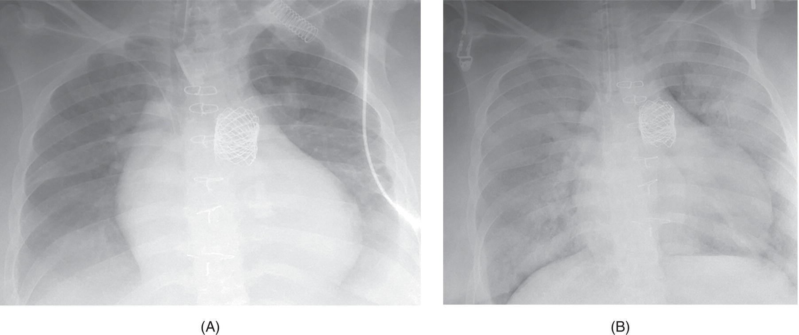

[**Figure 34.16**](#R_c34-fig-0016) Pulmonary edema following transcatheter pulmonary valve replacement. (A) The same patient immediately following transcatheter pulmonary valve replacement. (B) 16 hours postprocedure. The patient developed dyspnea and desaturation requiring re‐intubation and ultimately venovenous extracorporeal support. The presumed mechanism was increased preload to a dysfunctional left ventricle resulting in increased left‐sided pressures.

(Source: Texas Children’s Hospital Cardiac Catheterization Laboratory.)

Complications unique to children undergoing TAVR include the higher risk for vascular dissection/disruption due to mismatch between commonly used delivery devices and vessel size. As for transcatheter pulmonary valves, surgical backup should be available (if not already involved for access). Common risks otherwise include those of valve embolization and coronary compression with valve placement (due to direct obstruction or ostial narrowing with dilation of the annulus) \[107\].

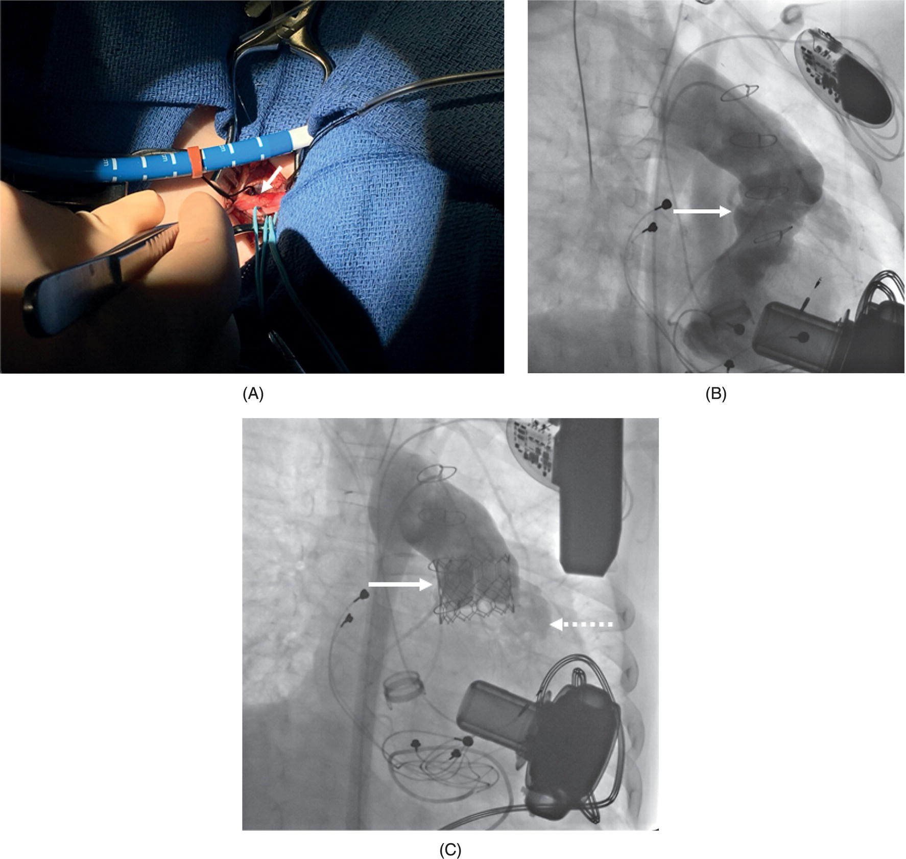

[**Figure 34.17**](#R_c34-fig-0017) Transcatheter aortic valve replacement via the right common carotid artery. An 8‐year‐old child status post Heartware® ventricular assist device placement, now with progressive aortic insufficiency. Due to the high risk associated with repeat sternotomy, bypass, and cross‐clamping for surgical valve replacement, a hybrid transcatheter approach was selected. (A) The right common carotid artery (arrow) can be seen exposed via a surgical cutdown, chosen for its larger size relative to the femoral artery. Also seen in the picture is the large delivery sheath used for transcatheter aortic valve placement. (B) Significant aortic regurgitation is seen (arrow). (C) A transcatheter aortic can be seen that was placed (arrow), and 3 years later, the transcatheter aortic valve was working well with trivial paravalvar leak (dotted arrow).

(Source: Texas Children’s Hospital Cardiac Catheterization Laboratory.)

### Hybrid procedures

Hybrid procedures refer to joint surgical and transcatheter interventions occurring in the CCL or operating room. Though most commonly associated with the initial palliation of HLHS, hybrid approaches have also been used in periventricular closure of muscular VSDs, stenting of stenotic pulmonary veins, and valve replacement, among other procedures \[108, 109\]. The focus of this section is on the hybrid palliation for HLHS.

Basic aspects of this strategy include surgical placement of bilateral pulmonary artery bands (bPAB) via median sternotomy followed by ductal stenting \[110\] ([Figure 34.18](#c34-fig-0018)). Variations abound, however, as to (i) whether the duct is stented (some centers may choose instead to maintain ductal patency with PGE1); (ii) when the duct is stented (either during PAB placement or as a separate procedure); (iii) whether or not an atrial septostomy or atrial septal stent is concurrently performed; and (iv) how to address the risk of retrograde aortic arch obstruction (RAAO). Atrial septostomy is often delayed in the absence of an intact/restrictive atrial septum to allow time for the left atrium to grow. With a larger left atrium, a more aggressive ballooning can be performed, leading to a larger and more durable septostomy \[111\]. RAAO is an important source of morbidity and mortality in HLHS as the coronary and cerebral circulations are reliant on retrograde flow through the transverse arch (entirely so in the variant of aortic atresia). Clinically significant RAAO is present in 10% of HLHS neonates at birth and can occur in an additional 24% following the hybrid procedure \[108, 112\]. To decrease this risk of myocardial and cerebral ischemia, some centers also perform a reverse Blalock–Taussig shunt (main PA to innominate artery) at the time of ductal stenting in at‐risk patients. Others view preexisting RAAO as a contraindication to the hybrid procedure \[113, 114\]. For patients who develop RAAO subsequent to the hybrid procedure, treatment is achieved with retrograde arch ballooning and stenting.

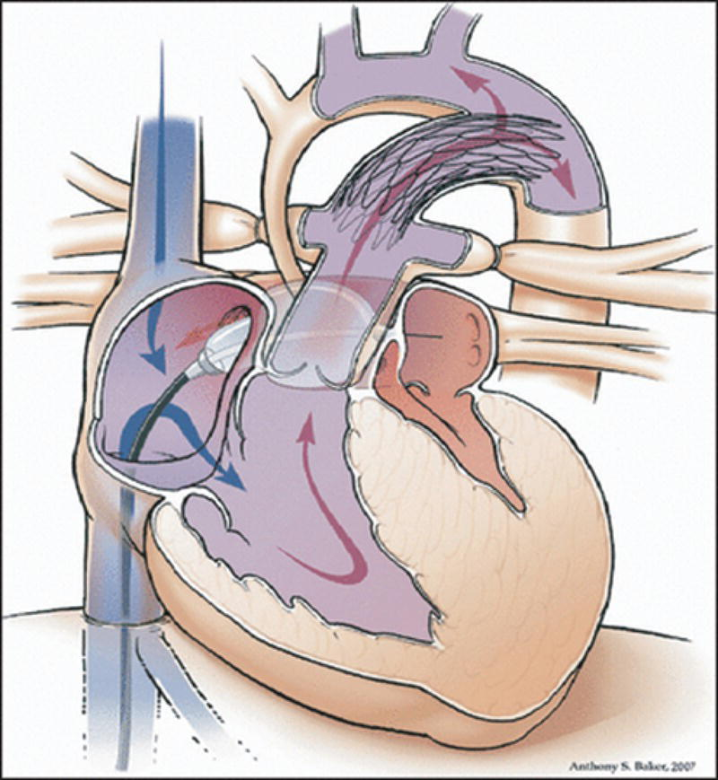

[**Figure 34.18**](#R_c34-fig-0018) Hybrid procedure for hypoplastic left heart syndrome. Common elements include bilateral pulmonary artery bands, transcatheter stenting of the patent ductus arteriosus, and an atrial septostomy or atrial septal stent.

(Source: Naguib et al. \[110\]. Reproduced with permission of John Wiley & Sons.)

The choice of when to use the hybrid approach versus conventional surgical management (the Norwood procedure) is institution specific and often dependent on patient factors. Advantages to hybrid palliation center around its ability to balance _Q_p : _Q_s without the morbidity associated with cardiopulmonary bypass (and deep hypothermic circulatory arrest or selective cerebral perfusion) in the neonatal period. While few centers use the hybrid approach preferentially, others reserve it for those patients thought to be at highest risk for Norwood palliation. Such patients include those with prematurity, birth weight <2.5 kg, presence of LV to coronary fistulae, intact or restrictive atrial septum, severe RV dysfunction, moderate‐to‐severe TR, intracerebral hemorrhage, or persistent end‐organ injury secondary to shock at initial presentation \[115–117\]. Disadvantages to the hybrid approach focus on the risk of RAAO, need for repeat catheter interventions prior to stage 2 palliation, impact of the bPAB on PA growth, and the complexity of the comprehensive stage 2 procedure (combined Norwood and bidirectional superior cavopulmonary anastomosis).

Anesthetic concerns specific to the hybrid approach include the potential for instability with bPAB placement and acute RAAO with ductal stent deployment \[59, 110\]. Arrhythmias, hypotension, and bradycardia may occur with bPAB placement as a result of contact with the left atrial appendage or manual compression of the ductus. Both are more likely to occur with manipulation of the left PA due to its proximity to these structures. Adenosine and cardioversion can be used to treat persistent supraventricular tachycardia (SVT). Compression of the ductus can be particularly threatening due to the transient decrease in myocardial perfusion. Decreases in heart rate and cerebral saturation may be the first signs of ischemia along with ST depression. Epinephrine in bolus doses of 1–10 mcg/kg may be needed to facilitate recovery. Following placement of the bPAB, systemic blood pressure should increase with a coincident decrease in oxygen saturation. If proceeding with ductal stent placement, a sheath is then placed in the main PA and the stent is deployed under fluoroscopic guidance. Because systemic blood flow is transiently altered during stent deployment, instability can also arise during this time. RAAO secondary to stent encroachment into the aorta can manifest as bradycardia, hypotension, and arrest. Monitoring of a right radial arterial pressure and cerebral saturation is recommended to allow prompt detection \[59, 110\]. Despite these risks, the procedure appears to be well tolerated. Naguib et al. in a review of the anesthetic management of 77 patients undergoing hybrid palliation reported that epinephrine infusions were initiated in only 4 patients and epinephrine boluses were required in only 5. 27% were transfused blood, and 60% of those who were intubated solely for the procedure were extubated at the end of the case. See [Chapter 30](c30.xhtml) for additional discussion of the hybrid approach for HLHS.

### Pericardiocentesis

The need for pericardiocentesis may arise acutely during interventional catheterization or more electively in a child with a postsurgical, neoplastic, or infectious effusion. The former may occur during endomyocardial biopsies, interventions at the RVOT (RF perforation in PA/IVS, RVOT stenting, transcatheter PVR, or conduit interventions), or transseptal approaches to the left atrium. Clinically, these acute bleeds can result in precipitous hypotension due to tamponade. Treatment requires emergent pericardial drainage with autotransfusion as indicated \[118\]. Autotransfusion entails siphoning the blood that is drained (a stopcock can be placed on the drain catheter for pulling blood into a syringe) and immediately returning it to the patient without any delay or storage (see [Figure 34.19](#c34-fig-0019)). Additional nonautologous transfusion is often needed in neonates and infants to maintain intravascular volume. Blood pressure is supported with epinephrine, and protamine may be needed to reverse heparin‐induced coagulopathy. Surgery is indicated if the bleeding does not stop with these measures.

Children presenting to the CCL for primary drainage of a pericardial effusion can vary in their clinical presentation. Rarely do they present with signs and symptoms of frank tamponade: low cardiac output as evidenced by anxiety, cool extremities, tachycardia, tachypnea, pulsus paradoxus, and marginal blood pressures \[119\]. More often, patients appear stable, belying their potential for decompensation. Anesthetic management entails ensuring adequate preload and maintaining SVR, contractility, and heart rate (i.e., fast, full, and tight) \[119\]. Because stroke volume is relatively fixed in tamponade, marked decreases in heart rate will lead to proportional decreases in cardiac output. Postcardiac surgery patients are often on aggressive diuretic therapy preprocedurally in attempts to decrease the size of their effusions. This population needs volume resuscitation prior to anesthesia.

GETA is avoided to minimize the additional risks of PPV. Spontaneous ventilation is maintained using a combination of ketamine and midazolam. Morphine is not used predrainage because of its potential to decrease SVR, nor are rapid boluses of dexmedetomidine administered due to associated bradycardia. In children in whom the above efforts are ineffective, an alternative strategy is to use low‐dose sevoflurane (2–3%) to maintain spontaneous ventilation. Vasopressors and inotropes should be at the ready if needed. Positioning of the patient in the CCL is in the semi‐Fowler’s position with back elevated at 30°–45° to allow the pericardial fluid to accumulate inferiorly. The airway remains accessible in this position, but if intubation is required subsequently, the patient is positioned supine. The effusion is drained under echocardiographic guidance following local anesthetic administration. Procedural complications include needle‐ or wire‐induced laceration of the ventricle, coronary artery or vein, arrhythmias, or injury to the lungs or esophagus. Postprocedurally, pulmonary edema may develop due to LV dysfunction associated with the acute increase in LV preload \[119\]. Additional discussion of pericardial effusion is presented in [Chapter 31](c31.xhtml).

[**Figure 34.19**](#R_c34-fig-0019) Autotransfusion following an acute pericardial bleed. A filter is used prior to reinfusion to avoid embolization of thrombi or fat particles from the pericardial space. Autotransfusion should not be performed when there is suspicion for an infectious or neoplastic effusion to prevent systemic spread.

(Source: Mossad \[118\]. Reproduced with permission of Elsevier.)

### Percutaneous mechanical circulatory support

The role of the interventionalist in mechanical circulatory support (MCS) has grown in recent years in parallel with the increased utilization of percutaneous ventricular assist devices (PVADs) in the management of pediatric cardiogenic shock. Such devices may be placed as the primary procedure (e.g., LV decompression while on venoarterial ECMO or as a bridge to a durable VAD, transplant, or recovery) or as a supportive intervention in the setting of another high‐risk procedure (e.g., PVAD backup for an endomyocardial biopsy in a patient with presumed acute graft rejection and tenuous hemodynamics).

The oldest of these devices is the intra‐aortic balloon pump (IABP). Used primarily in adults, IABPs have also been used in infants and children \[120–124\]. IABPs assist the failing ventricle by augmenting diastolic perfusion pressure and decreasing afterload by timing balloon inflation to diastole and deflation to systole \[124\]. Constraining its use in pediatrics has been the limited support it offers in florid ventricular failure, and technical challenges in timing balloon inflation and deflation to changes in rate and rhythm. Nonetheless, as volumes of adults with CHD increase in pediatric centers, this therapy may experience a resurgence.

A more recent introduction has been the off‐label use of the Impella® Heart Pump (Abiomed Inc., Danvers, MA) \[125, 126\]. The Impella is a continuous axial flow device that extracts blood from the failing ventricle and delivers it to the aorta ([Figure 34.20](#c34-fig-0020)). In doing so, it unloads the ventricle and augments cardiac output. Available configurations include the Impella 2.5, cardiac power (CP), 5, and 5.5, which, respectively, provide flow rates of up to 2.5, 4.3, 5, and 6.2 L/min ([Table 34.7](#c34-tbl-0007)). The specific device used is guided by patient size and the indication for support. Most commonly, the 2.5 and CP are used for younger patients or those on ECMO in need of LV decompression. The 5 and 5.5 are used for larger patients and those in need of the higher flows that these devices can provide. The device used, procedural urgency, and anticipated duration of support inform placement at either the femoral artery or surgical cutdown at the axillary artery. Fluoroscopy and TEE guide placement. Echocardiographic features predicting successful placement include a minimum LV apex to aortic valve length of 7.5 cm and an aortic annulus >1.5 cm, corresponding with an average weight of 23 kg and body surface area (BSA) of 0.89 m2 \[127\]. (Morray 2019). The youngest patient to date supported with an Impella was a 4‐year‐old weighing 15 kg with a BSA of 0.67 m2. RV support can also be provided by the Impella RP, which has been used in a child as young 14 years of age with a BSA of 1.4 m2 \[126\].

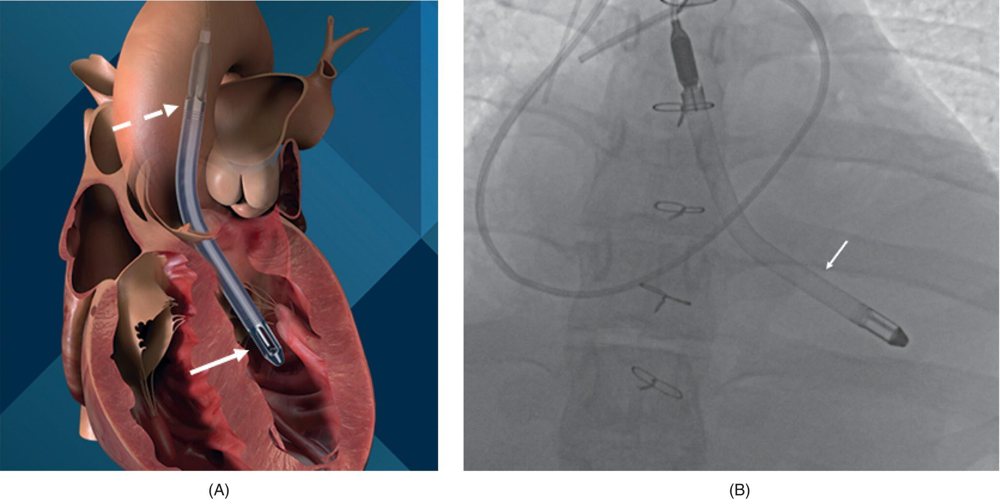

[**Figure 34.20**](#R_c34-fig-0020) Left ventricular support with the Impella 5.5. (A) Blood is entrained through the device inlet located in the left ventricle (arrow) and ejected into the ascending aorta through the blood outlet (dotted arrow). (B) Impella placement (arrow) via a left subclavian cutdown approach in a 17‐year‐old status post heart transplantation with acute rejection. A pulmonary artery catheter is also seen and used for postprocedural management.

(Sources: Image A from [https://www.heartrecovery.com/products‐and‐services/impella/impella‐55‐with‐smartassist](https://www.heartrecovery.com/products-and-services/impella/impella-55-with-smartassist). Image B from Texas Children’s Hospital Cardiac Catheterization Laboratories.)

[**Table 34.7**](#R_c34-tbl-0007) Characteristics of and indications for the different Impella heart pumps

|  | Insertion site | Indications | Maximum flow (L/min) | Pump motor/catheter diameter (Fr) |
| --- | --- | --- | --- | --- |
| 2.5 | Percutaneous femoral or axillary arteries | 
-   VA ECMO LV unloading

 | 2.5 | 12/9r |
| CP | Percutaneous femoral or axillary arteries | 

-   VA ECMO LV unloading
-   Temporary LV support

 | 4.3 | 14/9 |
| 5.0 | Percutaneous femoral or via surgical graft onto the axillary artery | 

-   Temporary LV support
-   Bridge to VAD or OHT

 | 5.0 | 21/9 |
| 5.5 | Percutaneous femoral or via surgical graft onto the axillary artery | 

-   Temporary LV support
-   Bridge to VAD or OHT

 | 6.2 | 19/9 |
| RP | Femoral venous only | 

-   RV support

 | 4.6 | 22/11 |

ECMO, indicates extracorporeal membrane oxygenation; LV, left ventricle; OHT, orthotopic heart transplant; RV, right ventricle; VA, venoarterial; VAD, ventricular assist device.

Although sedation has been used for femoral Impella placement, our usual strategy in patients not already intubated is to proceed with GETA. The usual considerations for high‐risk patients apply and include the availability of blood, vasoactive agents, adequate venous and dedicated arterial access, defibrillation pads, and the preprocedural determination of ECMO candidacy in the event of arrest. A surgical cutdown at the axillary artery with placement of a chimney graft adds to the duration of the procedure both due to the dissection and the time needed to pass the device through the graft. If the arterial line used for monitoring is on the same extremity as that used for axillary device placement, a brief period of dampening is to be expected. Arrhythmias during placement are common due to ventricular ectopy. TEE guidance is essential to diagnose complications such as deep placement within the LV that may entangle the mitral valve chordal apparatus, or incomplete coaptation of the aortic valve leaflets causing new insufficiency \[128\]. The Impella monitoring screen can help in assessing device placement once TEE is removed \[129\] ([Figure 34.21](#c34-fig-0021)). Once proper positioning is confirmed, the Impella is initiated between P0 and P9: the higher the number, the greater the revolutions per minute and therefore flow support. Anticipated hemodynamic changes include an overall increase in cardiac output with a decrease in native stroke volume and pulmonary capillary wedge pressure. Vasoactive support is usually not changed in this acute period as the RV may still need support to provide LV filling. Prior to returning to the ICU, a Swan‐Ganz catheter is commonly placed to guide ICU management for escalating or weaning support. Periprocedural complications include limb ischemia, vascular injury, bleeding, hemolysis, suction events, and device failure \[125\]. Anticoagulation is maintained with heparin through the device’s purge fluid, and if inadequate, systemic heparin is added.

The use of ECMO in the CCL, still the most common type of MCS in children, warrants further discussion. For high‐risk patients who may require ECMO during the procedure, consideration should be given to scheduling the procedure in the lab that is most suited to ECMO. Such a lab is usually large, with adequate oxygen and air attachments to accommodate both the ECMO circuit and anesthesia machine. Moreover, the ECMO circuit should be easily positioned within the room, with unimpeded entry into and exit from the lab. Similar considerations apply for patients already on ECMO who need a diagnostic or interventional procedure. Extensive further discussion of MCS is presented in [Chapter 37](c37.xhtml).

* * *

### KEY POINTS: INTERVENTIONAL CATHETERIZATION

-   The range of interventions possible continues to expand with recent growth in the areas of ductal stenting, pulmonary vein intervention, TPVR, MCS, and transcatheter closure of PDAs in premature infants.
-   A corollary of this growth is an increase in the acuity and complexity of the patients presenting to the CCL.
-   Such complexity underscores the need for anesthesia involvement in the planning of these increasingly high‐risk procedures and for awareness of the unique complications that can arise and how to manage them.

* * *

## Adverse events

Adverse events associated with catheterization can be related to the procedure, anesthetic, or environment of the catheterization suite \[46, 130–132\] (see [Table 34.8](#c34-tbl-0008)). While the majority of such events are well tolerated and resolve with either minimal or no intervention (e.g., transient catheter‐induced arrhythmias or superficial hematomas at vascular access sites), significant life‐threatening events can and do occur. Termed major adverse events (MAEs) or serious adverse events (SAEs) depending on the reporting registry, these complications can cause mortality or permanent morbidity and are characterized by an escalation in support, further catheter‐based or surgical intervention, and/or an extended length of stay. Examples include pulmonary hemorrhage resulting in hypoxemia and chest compressions, or catheter‐induced third‐ degree heart block requiring transvenous pacing.

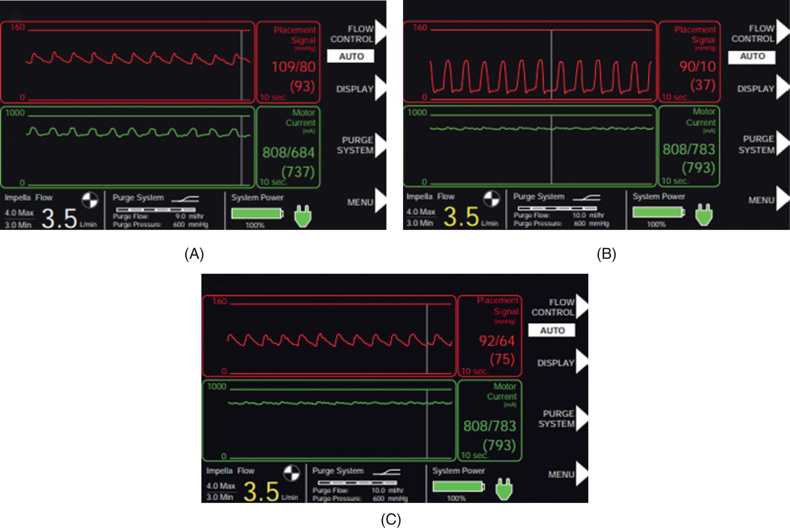

[**Figure 34.21**](#R_c34-fig-0021) Impella controller screen can indicate device malposition. The Impella device can move either into or out of the left ventricle with patient movement. Depicted here are images of the controller screen in the Impella 2.5 and CP. Other models have similar appearances. (A) Correct positioning with both an aortic pressure tracing and pulsatile motor current. (B) Displacement of the device into the left ventricle indicated by a ventricular pressure tracing and flat motor current. (C) Displacement of the device into aorta with an aortic pressure tracing and flat motor current.

[**Table 34.8**](#R_c34-tbl-0008) Adverse events during cardiac catheterization

Source: Modified from references \[46, 132–134\].

<table border="1"><tbody class="tdcolor5"><tr><td class="left">Vascular injury</td><td class="left">1.11 (%)</td></tr><tr><td class="left"><ul id="c34-list-0039"><li id="c34-li-0052">Access site complications</li></ul></td><td class="left">0.87</td></tr><tr><td class="left"> <ul id="c34-list-0040"><li id="c34-li-0053">Arterial thrombosis/occlusion requiring treatment</li></ul></td><td class="left">0.67</td></tr><tr><td class="left"> <ul id="c34-list-0041"><li id="c34-li-0054">Venous thrombosis/occlusion requiring treatment</li></ul></td><td class="left">0.06</td></tr><tr><td class="left"> <ul id="c34-list-0042"><li id="c34-li-0055">Other vascular injury</li></ul></td><td class="left">0.40</td></tr><tr><td class="left"> <ul id="c34-list-0043"><li id="c34-li-0056">Rebleeding require transfusion</li></ul></td><td class="left">0.09</td></tr><tr><td class="left"> <ul id="c34-list-0044"><li id="c34-li-0057">Retroperitoneal hematoma</li></ul></td><td class="left">0.03</td></tr><tr><td class="left"><ul id="c34-list-0045"><li id="c34-li-0058">Cardiac perforation</li></ul></td><td class="left">0.15</td></tr><tr><td class="left"><ul id="c34-list-0046"><li id="c34-li-0059">Pericardial effusion requiring drainage</li></ul></td><td class="left">0.09</td></tr><tr><td class="left">Hemodynamic instability</td><td class="left">1.19</td></tr><tr><td class="left"><ul id="c34-list-0047"><li id="c34-li-0060">Unstable arrhythmias</li></ul></td><td class="left">0.32</td></tr><tr><td class="left"><ul id="c34-list-0048"><li id="c34-li-0061">Complete heart block requiring pacing</li></ul></td><td class="left">0.14</td></tr><tr><td class="left"><ul id="c34-list-0049"><li id="c34-li-0062">Instability requiring inotropy and/or compressions</li></ul></td><td class="left">0.87</td></tr><tr><td class="left"><ul id="c34-list-0050"><li id="c34-li-0063">Unplanned ECMO</li></ul></td><td class="left">0.12</td></tr><tr><td class="left">New or significantly worsened valvular regurgitation</td><td class="left">0.07–0.09<a href="#c34-note-0010" id="R_c34-note-0010" aria-describedby="c34-note-0010" epub:type="noteref" role="doc-noteref"><i>a</i></a></td></tr><tr><td class="left">Unanticipated transfusion</td><td class="left">0.51</td></tr><tr><td class="left">Device migration or embolization</td><td class="left">0.44</td></tr><tr><td class="left">Balloon rupture with vascular damage/device complication</td><td class="left">0.24</td></tr><tr><td class="left">Neurologic injury</td><td class="left">0.13</td></tr><tr><td class="left"><ul id="c34-list-0051"><li id="c34-li-0064">Stroke (air/thrombus)</li></ul></td><td class="left">0.08</td></tr><tr><td class="left"><ul id="c34-list-0052"><li id="c34-li-0065">Seizure</li></ul></td><td class="left">0.04</td></tr><tr><td class="left"><ul id="c34-list-0053"><li id="c34-li-0066">Brachial plexus injury</li></ul></td><td class="left">0.01</td></tr><tr><td class="left">Airway complications</td><td class="left"></td></tr><tr><td class="left"><ul id="c34-list-0054"><li id="c34-li-0067">Accidental extubation during procedure</li></ul></td><td class="left">0.02</td></tr><tr><td class="left"><ul id="c34-list-0055"><li id="c34-li-0068">Extended need for mechanical ventilation</li></ul></td><td class="left">0.04</td></tr><tr><td class="left"><ul id="c34-list-0056"><li id="c34-li-0069">Conversion from natural to artificial airway</li></ul></td><td class="left">1.77<a href="#c34-note-0011" id="R_c34-note-0011" aria-describedby="c34-note-0011" epub:type="noteref" role="doc-noteref"><i>b</i></a></td></tr><tr><td class="left">Desaturation</td><td class="left"></td></tr><tr><td class="left"><ul id="c34-list-0057"><li id="c34-li-0070">Respiratory: pulmonary edema/hemoptysis</li></ul></td><td class="left"></td></tr><tr><td class="left"><ul id="c34-list-0058"><li id="c34-li-0071">Circulatory: increased shunting/PVR</li></ul></td><td class="left"></td></tr><tr><td class="left"><ul id="c34-list-0059"><li id="c34-li-0072">Mechanical: TEE/TTE probe, pneumothorax, obesity</li></ul></td><td class="left"></td></tr><tr><td class="left">Contrast toxicity</td><td class="left"></td></tr><tr><td class="left">Hypothermia</td><td class="left"></td></tr><tr><td class="left">Endocarditis</td><td class="left">0.02</td></tr><tr><td class="left">Cardiac arrest</td><td class="left">0.18–0.96%<a href="#c34-note-0012" id="R_c34-note-0012" aria-describedby="c34-note-0012" epub:type="noteref" role="doc-noteref"><i>c</i></a></td></tr></tbody></table>

[_a_](#R_c34-note-0010) Hill et al. \[132\] and Jayaram et al. \[133\].

[_b_](#R_c34-note-0011) Lin et al. \[134\].

[_c_](#R_c34-note-0012) Odegard et al. \[46\].

MAEs occur in 2–7% of all congenital cardiac catheterizations \[130, 131, 133–135\]. The wide range is attributable to the varying definitions of what constitutes such events. The most common causes reported include access site complications, hemodynamic compromise requiring inotropic support and/or chest compressions, unanticipated blood transfusion, and hemodynamically unstable arrhythmias requiring electrical and/or pharmacologic therapy. For the subgroup of interventional procedures, the leading causes of high severity events are device or stent migration, malposition, or embolization.

Mortality related to catheterization is rare and ranges between 0.08 and 0.29% \[130–132\]. Cardiac arrest occurs with a higher frequency, with one group reporting 0.7% \[128\] and another 0.96% \[46\]. As a reference, the benchmark estimate of the incidence of perioperative cardiac arrest in all pediatric patients is 0.014% \[136\].

Significant complications associated with anesthetic induction and airway management appear to be infrequent. In one series of 29,830 pediatric patients from 27 centers, cardiac arrest with induction of anesthesia was observed in 0.12% of all procedures \[130\]. Airway complications, including accidental extubation during the procedure, failed extubation, unanticipated need for intubation during/after the procedure, and postextubation stridor or laryngospasm, occurred in 0.16% \[130\]. In another review of 13,611 pediatric patients at eight centers, the most common reported anesthesia‐ and sedation‐related adverse event was hypotension \[132\]. This occurred in 93 (0.68%) patients and was observed primarily with anesthetic induction. While the majority of hypotensive events were minor‐to‐moderate in severity, some were associated with cardiopulmonary resuscitation (CPR) and ECMO. High severity events associated with anesthesia, sedation, and airway management were observed in 94 (0.69%) patients, with an overall mortality within this group of 0.015% \[132\].

## Risk assessment

Several risk scoring and risk adjustment models have been developed to identify key contributors to significant adverse events \[130, 131, 134, 135, 137, 138\]. A consistent theme among these models is the influence of procedural complexity and patient characteristics in determining risk.

Because there are over 200 interventional procedures that may be performed, procedural risk categories were developed to group together those procedures with similar risk \[131\] ([Table 34.9](#c34-tbl-0009)). These categories were based on expert consensus and empirical data. The impact of procedure type on the risk of an MAE can be observed by their associated odds ratios (ORs). A category 2 procedure carries an OR of an MAE of 1.79, whereas a category 6 procedure carries an OR of 9.69. Odegard et al. reported the highest incidence of cardiac arrests in patients undergoing VSD closure (11.9/100 procedures), intervention for intact atrial septum in patients with an atrial restriction (10.0/100 procedures), and pulmonary vein angioplasty (3.6/100 procedures) \[46\]. These are all defined as category 5 procedures. Of note, diagnostic catheterizations are generally lower risk than interventional ones. An important exception is diagnostic catheterization in neonates and infants.

Patient characteristics are equally significant **(**[Table 34.10](#c34-tbl-0010)**).** Of patient‐specific variables, age <1 year, weight <5 kg, single‐ventricle physiology, chromosomal abnormalities, genetic syndromes, and noncardiac comorbidities all increase risk \[131\]. Among the subgroup of patients aged <1 year, neonates and those weighing <2.5 kg are most likely to experience adverse events. That patients with single‐ventricle physiology are at increased risk is consistent with data reported in the Pediatric Perioperative Cardiac Arrest Registry \[139\]. Within this group, ductal‐ or shunt‐dependent lesions and failing Glenn or Fontan physiologies are most concerning. Examples of other high‐risk diagnoses include patients with cardiomyopathies with depressed systolic function, LV outflow tract obstruction (specifically unrepaired supravalvar AS), and PH \[130\]. Of the latter group, patients with suprasystemic pulmonary pressures, premature neonates, and non‐premature infants are at increased risk of catastrophic adverse events \[22, 28\]. A final population warranting mention are heart transplants with CAV or acute rejection \[22\]. Such patients are predisposed to myocardial ischemia, ventricular dysrhythmias, and cardiac arrest at baseline.

Of the noncardiac comorbidities observed in patients presenting for catheterization, chronic lung disease is most common. The highest ORs for complications, however, are associated with renal insufficiency, hepatic disease, and coagulation abnormalities \[131\]. These findings may occur independently of the underlying cardiac disease or represent sequelae of poor cardiac output.

Preprocedural status can further inform a patient’s risk. A child requiring vasoactive infusions (including PGE1) or antiarrhythmics prior to catheterization begins with a lesser margin to tolerate anesthetic‐ or catheter‐induced instability. Precatheterization hemodynamic variables such as systemic or mixed venous desaturation, or evidence of elevations in PVR, _Q_p : _Q_s, or systemic ventricular EDP are also factors associated with complications \[130, 131, 135\]. While some of these data can only be quantified during the catheterization itself, one can qualitatively assess many of these physiologic variables preprocedure based on prior history, clinical evaluation, and echocardiography.

When examining risk factors in _adults_ with CHD undergoing catheterization, many of the same contributors are observed: procedure type, comorbidities, and certain physiologic variables \[134, 140, 141\]. In one model reviewing data from 87 hospitals in the United States, the strongest variables predicting MAEs were procedure complexity and urgency. Other factors of importance included a history of renal disease, preprocedural anticoagulant use, lower hemoglobin, and older age ([Figure 34.22](#c34-fig-0022)). The physiologic factors indicating risk included a lower oxygen saturation, pulmonary hypertension, elevated systemic ventricle EDP (≥18 mmHg), and a cardiac index less than 2.8 L/min/m2 \[134, 141\].

In both pediatric and adult populations, institutional case volume appears to impact the MAE rate. Complications were highest in those centers performing fewer than 150 cases annually, and conversely, catastrophic complications were observed least in centers with the highest volumes \[131, 142\].

[**Table 34.9**](#R_c34-tbl-0009) Procedure‐type risk categories

Source: Reproduced with permission from Jayaram et al. \[131\].

|  | Risk category 1 | Risk category 2 | Risk category 3 | Risk category 4 | Risk category 5 | Risk category 6 |
| --- | --- | --- | --- | --- | --- | --- |
| Odds ratio for MAEs | Reference | 1.79 | 3.69 | 3.63 | 7.18 | 9.69 |
| Diagnostic |  | Diagnostic cath  
(age > 1 yr) |  | Diagnostic cath  
(age 30 d to 1 yr) |  | Diagnostic cath  
(age < 30 d) |
| Valvuloplasty |  | Pulmonic valvuloplasty  
(age > 30 d) |  | Aortic valvuloplasty (age > 30 d) | Aortic valvuloplasty (age < 30 d)  
Pulmonic valvuloplasty  
(age < 30 d) |  |
| Device or coil closure |  | ASD/PFO  
Coronary artery fistula  
PDA (weight > 6 kg)  
Fontan fenestration or baffle leak | Systemic artery (excluding aorta) or systemic vein  
Pulmonary or systemic AVM  
Perivalvular leak | PDA closure (weight 3–6 kg)  
Systemic artery to PA connection  
Systemic vein to PV connection | VSD  
PDA (weight < 3 kg) |  |
| Balloon angioplasty |  | Conduit | Angioplasty for CoA  
Proximal or distal PA  
Fontan baffle/ fenestration | Caval or noncaval vein  
Atrial septum s/p atrial switch | Atrial septum  
Dilation of sano  
Systemic artery (other than aorta)  
Systemic to PA shunt |  |
| Stent placement |  | Conduit | Stent placement for CoA  
Proximal or distal PA  
Fontan baffle/fenestration | Caval or noncaval vein  
Atrial septum s/p atrial switch | Atrial septum  
Dilation of Sano  
Systemic artery (other than aorta)  
Systemic to PA shunt |  |
| Stent redilation |  | Stent redilation (other than for CoA) | Stent redilation for CoA |  |  |  |
| Other | Myocardial biopsy s/p OHT | Elective pericardiocentesis | TPVR  
Myocardial biopsy (excluding OHT) | Snare foreign body  
Balloon valvotomy of mitral valve | BAS  
Perforation of atretic pulmonary valve  
Atrial septal perforation |  |

ASD, indicates atrial septal defect; AVM, arteriovenous malformation; BAS, balloon atrial septostomy; CoA, coarctation of the aorta; MAE, major adverse event; OHT, orthotopic heart transplantation; PA, pulmonary artery; PDA, patent ductus arteriosus; PFO, patent foramen ovale; TPVR, transcatheter pulmonary valve replacement; and VSD, ventricular septal defect.

The question of whether or not general anesthesia with an airway device represents a higher risk for MAEs compared to sedation with a natural airway is unclear. Lin et al. compared outcomes in these groups and found that even when adjusting for procedural risk, hemodynamic factors, and age, an artificial airway was an independent predictor of MAEs and also had a higher OR for adverse events compared to a natural airway \[132\]. The authors suggested caution in interpreting these results, however, given the potential for unmeasured characteristics or other confounders. Risk for conversion from natural airway to intubation, observed in 1.8% of the patients reviewed, was associated with younger patients (infants), need for inotropic support, and high‐risk procedures. A primary conclusion was that while sedation with a natural airway is safe and effective in low‐risk patients and procedures, high‐risk patients undergoing high‐risk procedures are at risk of MAEs regardless of the airway management strategy. The type of anesthesia used in adults (sedation with natural airway vs. GETA) has not been found to predictive of MAEs \[134\].

* * *

### KEY POINTS: ADVERSE EVENTS AND RISK ASSESSMENT

-   MAEs associated with catheterization are infrequent, but the highest proportion are composed of access site complications, dysrhythmias, unanticipated transfusion, and device migration.
-   Key variables that predict risk include the specific procedure and patient characteristics such as age, weight, cardiac diagnosis, comorbidities, and preprocedural physiologic status.
-   The need for conversion from a natural airway to an artificial one is associated with age < 1 year, need for inotropy during the catheterization, and high‐risk procedures.

* * *

[**Table 34.10**](#R_c34-tbl-0010) Patient factors associated with increased risk

<table border="1"><tbody class="tdcolor5"><tr><td class="left">Age</td><td class="left">&lt;1 year (highest in &lt;30 days)</td></tr><tr><td class="left">Weight</td><td class="left">&lt;5 kg (highest in &lt;2.5 kg)</td></tr><tr><td class="left">Chromosomal abnormalities</td><td class="left">Trisomy 18 Trisomy 21 22q11</td></tr><tr><td class="left">Genetic syndromes</td><td class="left">Williams‐Beuren Alagille syndrome Heterotaxy</td></tr><tr><td class="left">SV physiology</td><td class="left">HLHS with restrictive or intact atrial septum Ductal or shunt dependent Failing Glenn or Fontan circulations</td></tr><tr><td class="left">Diagnoses otherwise</td><td class="left">OHT with CAV or rejection Aortic or mitral stenosis Cardiomyopathy with depressed function or obstruction (HCM) Systemic‐to‐suprasystemic PAP (severe PH) PA/IVS with RV‐DCC</td></tr><tr><td class="left">Preprocedural physiologic status</td><td class="left">On PGE1, antiarrhythmics, or MCS Systemic desaturation (highest with &lt;65%) Dynamic subpulmonary obstruction Hypercyanotic spells Severe systemic AVVR RVSP suprasystemic</td></tr><tr><td class="left">Noncardiac comorbidities</td><td class="left">Renal insufficiency Hepatic disease Coagulation abnormalities Chronic lung disease</td></tr></tbody></table>

AVVR, atrioventricular valve regurgitation; CAV, coronary allograft vasculopathy; HCM, hypertrophic cardiomyopathy; HLHS, hypoplastic left heart syndrome; OHT, orthotopic heart transplant; MCS, mechanical circulatory support; PA/IVS, pulmonary atresia/intact ventricular septum; PAP, pulmonary artery pressure; PGE1, prostaglandin E1; PH, pulmonary hypertension; RV‐DCC, right ventricle‐dependent coronary circulation

## Anesthetic management

### Operator‐directed sedation versus anesthesia care

The past two decades have seen a transition toward the use of anesthesiology care in place of operator‐directed sedation (ODS) for the majority of catheter‐based procedures worldwide. As of 2018, ODS was used in only 3% of cases reported to the IMPACT (IMproving Pediatric and Adult Congenital Treatments) registry, down from 19% in 2011 \[143\]. Several factors have driven this change, but foremost among them has been the shift in procedure type from diagnostic to interventional catheterization, with the latter associated with longer procedure times, complexity, and risk \[144\]. The benefit of increased anesthesia involvement has been previously demonstrated with a reduction in the frequency of cardiac arrests at one institution \[46\].

Nevertheless, given the spectrum of providers who can be involved in sedating and monitoring patients in the congenital cardiac catheterization lab, consensus guidelines were developed in 2016 to provide guidance on which cases should involve which providers \[145\]. Based on an assessment of risk as determined by the Catheterization Risk Score for Pediatrics (CRISP), it was suggested that patients with a higher CRISP score (and therefore higher risk) should be delegated to either an anesthesiologist with expertise in CHD or a pediatric cardiac anesthesiologist, whereas those with lower CRISP scores could be managed by ODS or a sedation team. A recent comparison between the adverse event rates in cases using ODS versus general anesthesia, however, revealed that this approach to provider selection may not be applicable to all settings \[143, 144\]. Both in observed results and when adjusted for case risk, fewer MAEs were observed with ODS than with general anesthesia. While this association did not persist when assessing only patients aged <18 years, this study nonetheless demonstrated that ODS may be safely administered to a broader range of patient risk categories than previously believed.

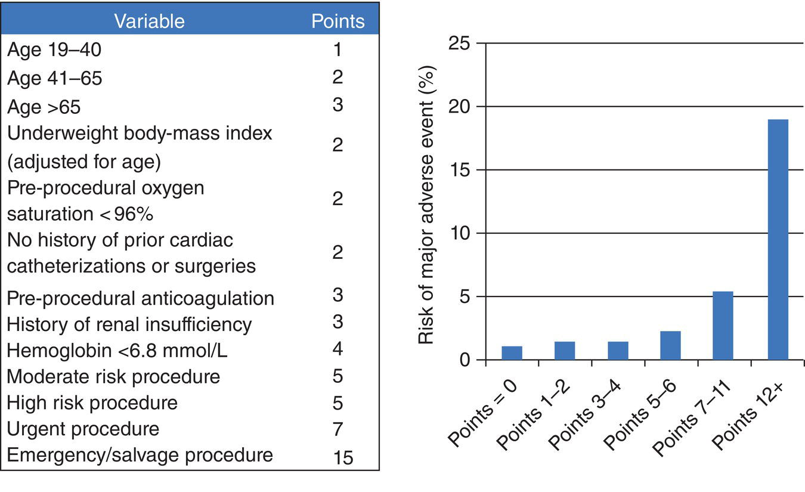

[**Figure 34.22**](#R_c34-fig-0022) Predictors of major adverse events associated with catheterization in adolescents and adults with congenital heart disease.

(Source: Reproduced with permission from Schmidt et al. \[140\])

Implicit in these findings is that the institution providing ODS is experienced in choosing patients appropriate for sedation versus general anesthesia and is properly structured in both training sedation personnel and developing pathways should an escalation of care be needed. Whether or not these findings are generalizable to resource‐poor settings or to those institutions considering the initiation of an ODS program remains unclear. Prospective studies comparing ODS and general anesthesia, and specifically evaluating the effects of sedation regimen and patient and procedural risk factors, are needed \[144, 146\].

### Periprocedural planning

Risk mitigation begins prior to the patient’s entry into the CCL, and for outpatients, even prior to hospital arrival. This entails coordination with the catheterization team regarding preprocedural screening, medication management, and even case order such that _nil per os_ (NPO) times are minimized in at‐risk patients.

A primary goal of preprocedural screening is to identify any recent changes in health that may adversely affect the periprocedural course. The presence of an ongoing or recent respiratory tract infection within 2 weeks of the planned procedure is a common finding that confers an increased risk of perioperative respiratory adverse events \[147, 148\]. Beyond the immediate negative consequences of laryngospasm, bronchospasm, and persistent desaturation, these complications may also render hemodynamic measurements unreliable and, therefore, affect clinical decision‐making. Whether or not to reschedule such patients can be made based on the indication and urgency of the catheterization as well as the severity of symptoms. Our approach is a conservative one in which patients with recent or ongoing respiratory infections are commonly rescheduled to a minimum of 2 weeks following the resolution of symptoms.

A review of the patient’s medications can also provide insight into the potential for medication‐related complications. Angiotensin‐converting enzyme (ACE) inhibitors and angiotensin‐receptor blockers (ARBs) have been associated with hypotension when taken in proximity to the induction of general anesthesia. Anecdotally, these effects can be particularly pronounced during catheterization due to the relative lack of stimulation compared to surgery. We consequently ask that these medications be held for 24 hours prior to catheterization. Further, diuretics like furosemide are held the morning of the procedure with the understanding that an IV dose may be needed subsequently. The management of antiplatelet agents and anticoagulants like warfarin or the non‐vitamin K oral anticoagulants (NOACs) should be discussed on a case‐by‐case basis \[149, 150\] ([Figure 34.23](#c34-fig-0023)). The planned procedure, relative risk of bleeding versus thrombosis with continuing versus holding therapy, and the availability of reversal agents particularly for the NOACs can inform this discussion. Other cardiac medications like beta‐blockers, antiarrhythmics, and pulmonary vasodilators used for the treatment of PH are commonly continued on the day of the procedure.

For procedures on neonates, infants, or patients otherwise at risk for complications from hypovolemia or hypoglycemia, consideration should be given to a morning rather than afternoon start time. Given the occasionally unpredictable length of interventional catheterizations, communication with pre‐cath nursing is essential to ensure that the fasting period is not unnecessarily prolonged for patients scheduled as the second or third cases. We provide clear liquids up to an hour prior to the procedure and, in select cases, initiate IV access to maintain hydration.

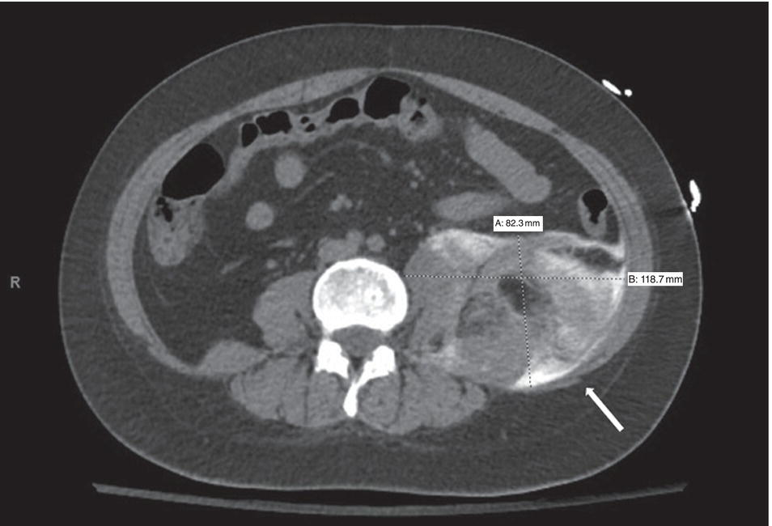

[**Figure 34.23**](#R_c34-fig-0023) Retroperitoneal hematoma demonstrated by computed tomography scan following arterial injury associated with femoral arterial access (arrow). The severity of the bleeding in this patient was related to preprocedural continuation of apixaban, a non‐vitamin K antagonist oral anticoagulant. Treatment entailed administration of prothrombin complex concentrate and tranexamic acid.

(Source: Texas Children’s Hospital Department of Radiology.)

Other key preprocedural factors to consider include the availability of packed red blood cells, postprocedure disposition, and support for high‐risk patients. Based on patient weight, comorbidities, and the procedure’s risk for bleeding, one can develop a strategy for blood ordering. To promote consistency among our providers and improve the availability of type‐specific blood when needed, Texas Children’s Hospital Heart Center adopted the following approach noted in [Table 34.11](#c34-tbl-0011). Postprocedural disposition is based on the patient’s procedure, comorbidities, and intraprocedural course. During the preprocedure timeout, we tentatively assign status to home discharge versus admission to the inpatient ward or ICU, and once again reevaluate disposition at the procedure’s conclusion. Lastly, support for high‐risk patients can entail a wide range of equipment needs and multidisciplinary coordination that underscore the importance of early recognition, planning, and communication \[59\]. For the anesthesia team, preparation often includes the setup of additional invasive monitoring lines, vasoactive support, inhaled pulmonary vasodilators, and/or defibrillation pads depending on both patient and procedural risk factors. For the cardiology team, ancillary equipment like transesophageal echocardiography, percutaneous ventricular support devices, or pacing catheters may be indicated. Certain patients may also prompt consideration for ECMO for either standby or elective initiation. Indications for the former include high‐risk anesthetic inductions or concerns for significant procedural instability. Elective initiation of ECMO, on the other hand, is often pursued to allow a procedure to be performed in an otherwise unstable patient. Both forms of ECMO require advance planning with surgery and the ECMO specialists. To ensure that all potential aspects of preprocedural care are anticipated, a checklist tailored to institutional practice that highlights many of the above concerns can be helpful ([Table 34.12](#c34-tbl-0012)) \[145, 151\].

[**Table 34.11**](#R_c34-tbl-0011) Approach to facilitate blood ordering and availability for catheterization procedures

<table border="1"><tbody class="tdcolor5"><tr><td class="left">Blood ordered <i>and</i> in the room</td><td class="left"><ul id="c34-list-0061"><li id="c34-li-0076">&lt;5 kg, regardless of the procedure</li><li id="c34-li-0077">If &gt;5 kg AND undergoing an intervention that is moderate‐to‐high risk for bleeding, including but not limited to<ul class="circle" id="c34-list-0062"><li id="c34-li-0078">Angioplasty/stenting of an intracardiac‐ or extracardiac structure </li><li id="c34-li-0079">Percutaneous valve replacement </li><li id="c34-li-0080">Pericardiocentesis </li><li id="c34-li-0081">VSD device closure </li><li id="c34-li-0082">Transhepatic or transsplenic access </li><li id="c34-li-0083">Recanalization procedure </li><li id="c34-li-0084">BAS</li></ul></li></ul></td></tr><tr><td class="left">Type and screen only</td><td class="left"><ul id="c34-list-0063"><li id="c34-li-0085">If cyanotic and undergoing a diagnostic‐only evaluation</li><li id="c34-li-0086">All inpatients have a type and screen at minimum</li></ul></td></tr><tr><td class="left">No type and screen</td><td class="left"><ul id="c34-list-0064"><li id="c34-li-0087">Procedures at low risk for bleeding<ul class="circle" id="c34-list-0065"><li id="c34-li-0088">PDA device closure in the non‐premature population </li><li id="c34-li-0089">ASD device closure </li><li id="c34-li-0090">Endomyocardial biopsies</li></ul></li></ul></td></tr></tbody></table>

ASD, atrial septal defect; BAS, balloon atrial septostomy; PDA, patent ductus arteriosus

### Anesthetic techniques

A variety of anesthetic approaches have been described in patients undergoing catheterization, including spinal or caudal epidural anesthesia, general anesthesia with or without an artificial airway, and sedation with a natural airway. As can be inferred by this breadth of management, no specific anesthetic technique can be recommended for all patients. Rather, anesthetic strategy should be guided by patient and procedural risk factors and an understanding of the pros and cons of the planned technique on both the individual patient and the goals of the proposed procedure.

Advantages of sedation with a natural airway include the potential for greater hemodynamic stability and a more preserved cardiac output in comparison to general anesthesia with PPV. PPV decreases venous return to the heart, thereby decreasing cardiac output and flows across valves and shunts. General anesthesia may also be associated with a more pronounced decrease in SVR and myocardial contractility while also further reducing oxygen consumption \[5, 152\]. Consequently, the data yielded with general anesthesia and PPV may less accurately reflect the patient’s baseline physiology than sedation with spontaneous ventilation. Sedation, however, can be a difficult to control continuum ranging from anxiolysis to conscious sedation to general anesthesia without an airway. As such, the potential benefits of sedation must be weighed against the risks of over‐sedation (hypoventilation, airway obstruction, apnea, escalation in airway support, hypotension, and aspiration) and under‐sedation (awareness, pain, and movement during inopportune times). Each of these events would negatively affect the quality of data obtained in addition to increasing patient risk. Of note, among patients initially managed with a natural airway, Lin et al. reported that the risk of converting to intubation was highest in younger patients (specifically infants), those undergoing high‐risk procedures, and those needing inotropes or pressors \[132\]. Sedation with a natural airway, then, may be most safely administered in a child, adolescent, or adult with compensated heart disease undergoing diagnostic catheterization or an otherwise low‐risk interventional procedure. Given the potential to escalate airway management in all patients undergoing sedation, accessibility of the airway should also be considered. Extensive draping for neck access and the arms up position can hinder access to the airway relative to procedures involving only groin access. These limitations can be overcome by strategic draping and communication with the cardiologist.

[**Table 34.12**](#R_c34-tbl-0012) Periprocedural checklist to optimize planning and coordination

Source: Modified from Odegard et al. \[145\].

| Preprocedure | Intraprocedure | Postprocedure |
| --- | --- | --- |
| 
-   Confirmation of patient, diagnosis, interventionalist, and procedure
-   Documented H&P and signed consents
-   Documentation of allergies (including contrast)
-   Verified NPO status
-   Pregnancy test if indicated
-   Airway status and availability of specialized equipment if difficulty anticipated
-   Bleeding risk assessed and blood ordered if needed
-   Availability of implanted devices
-   Room setup including iNO, TEE, and rotational angiography
-   Access plan (any known vascular occlusions?)
-   Anesthesia plan (GA vs. MAC)
-   Postprocedural disposition (is a bed available if ICU planned?)
-   Availability of special medications: e.g., vasoactive agents, antiarrhythmics, antibiotics, anticoagulants, or stress‐dose steroids
-   Consideration of the need for ECMO support and surgical backup | -   Patient again identified with diagnosis and procedure
-   Allergies reviewed
-   Antibiotic needs discussed
-   Heparin plan
-   Plan for contrast
-   Patient position confirmed
-   Anesthesia plan and use of room air confirmed
-   Blood availability confirmed if needed
-   Planned implants available
-   Specialized equipment/personnel available
-   Planned disposition reviewed | -   All specimens identified, labeled, and sent
-   Safeguard dressing (time placed, amount of air) if used
-   Disposition
-   Need for postprocedural testing or medications
-   Blood returned if no longer needed
-   Adverse events
-   Equipment issues
-   Review areas for improvement

 |

ECMO, extracorporeal membrane oxygenation; GA, general anesthesia; H&P, history and physical examination; iNO, inhaled nitric oxide; MAC, monitored anesthesia care; NPO, _nil per os_; TEE, transesophageal echocardiography

Counterintuitively, sedation may offer the best approach in certain categories of even the sickest patients (e.g., an older child or adolescent status post heart transplant being evaluated for rejection, or a comparably aged patient with a failing Fontan circulation undergoing hemodynamic evaluation). For these and other select classes of patients and procedures, the risks of GETA may exceed the risks of sedation. Assuming adequate patient preparation, reassurance, and cooperation, diagnostic catheterizations in such patients can often be achieved with a combination of IV sedation and generous local anesthetic infiltration. Communication between the cardiologist and the anesthesiologist is particularly important in these cases to allow anticipation and treatment of painful portions of the procedure (i.e., initial infiltration of local anesthetic, placement of sheaths, and later sheath exchanges and removal). As always, one should be prepared to escalate care as indicated.

GETA, on the other hand, may be most suitable for neonates, infants, and those undergoing high‐risk procedures with known risk for hemodynamic instability or complications (e.g., ductal stenting, ductal closure in preterm infants, dilation and stenting of PVSs, dilation of peripheral PA stenoses, or VSD closure or creation). Other indications include patients with limited reserve for whom the planned procedure or effects of sedation may precipitate hemodynamic or respiratory collapse, need for transesophageal echocardiography, an anticipated lengthy intervention, risk of sudden movement (e.g., coughing during a PA or aortic intervention), or risk for hemoptysis, pulmonary edema, or postprocedural intubation. Beyond providing a potentially more steady‐state condition than sedation with a natural airway, GETA also allows for more specific titration of ventilation, oxygenation, and other adjuncts like iNO. At our institution, the majority of our patients are managed with GETA – whether for diagnostic or interventional catheterization. General anesthesia with a laryngeal mask airway (LMA) is most often used for the stable patient status post heart transplant presenting for endomyocardial biopsy. Hemodynamics are supported by ensuring euvolemia, maintaining relatively light levels of anesthesia (0.5–1 MAC isoflurane), and starting low‐dose vasopressors or inotropes as needed to counteract anesthetic‐induced reductions in SVR and contractility. In high‐risk patients, vasoactive agents are often started prior to induction. A second IV is routinely placed if the risk of bleeding is high or vasoactive initiation is anticipated. The latter can be done safely assuming that the site is monitored (either by direct visualization or indirectly by placing a pulse oximeter on that extremity) and that the lowest concentration vasoactive is used for a given patient weight.

Regardless of the anesthetic technique used, fundamental goals include minimizing pain and anxiety and providing conditions that allow for the accurate interpretation of the patient’s hemodynamics. Premedication is often needed to achieve parental separation, particularly for those children and adolescents who present at frequent intervals. Oral midazolam (0.7 mg/kg), ketamine (3–5 mg/kg), or intranasal dexmedetomidine (2–3 mcg/kg) are effective for those without IV access. Following induction, every attempt is made to recreate and maintain the patient’s baseline conditions for oxygenation, ventilation, and hemodynamics. To that end, patients are placed on room air or their baseline level of oxygen support, and a minute ventilation consistent with their normal ventilation is targeted. Because oxygen is a potent pulmonary vasodilator and hypoventilation or hyperventilation directly influence PVR, alterations in these variables can affect intracardiac pressure measurements and _Q_p : _Q_s calculations. Such changes should, therefore, be avoided if possible during the diagnostic portions of the case. An equally important variable to control is pH. Acidosis, whether from a respiratory or metabolic cause, increases PVR. While respiratory acidosis is easily corrected if using mechanical ventilation, some amount of hypoventilation is to be expected with sedation techniques. Metabolic acidosis may indicate a low cardiac output state or the effects of prolonged fasting. The former can be diagnosed based on the patient’s underlying condition, point‐of‐care ultrasound, or monitored values such as mixed venous saturation, lactate, or cerebral oximetry. While definitive treatment is initiated, metabolic acidosis can be addressed in the short term with sodium bicarbonate, assuming an adequate minute ventilation. Lastly, maintaining a sufficient depth of sedation or anesthesia is critical to minimizing intraprocedural hemodynamic swings associated with pain or anxiety that may affect the values measured/calculated. If the patient’s condition requires an increase in oxygen levels or the initiation of vasoactive agents while measurements are being made, these changes should be communicated with the cardiologist such that the data obtained can be interpreted accordingly or be repeated after the patient has returned to baseline conditions.

### Anesthetic drugs

Almost any anesthetic drug can be used safely provided an understanding of its impact on hemodynamics, synergistic effects with other sedatives and analgesics, and potential for adverse effects on a given patient’s physiology ([Table 34.13](#c34-tbl-0013)). Factors affecting choice of drugs include the child’s myocardial function, comorbidities, and anesthetic plan.

For those patients undergoing sedation with a natural airway, combination of midazolam, fentanyl, ketamine, propofol, and/or dexmedetomidine has been used. Whereas midazolam or fentanyl may be sufficient for the cooperative adolescent or adult, a deeper level of sedation that often becomes a general anesthetic with a natural airway is most often required for younger patients. Common pairings include propofol and ketamine or ketamine and dexmedetomidine \[153–156\]. Regimens describing the former entail a bolus of propofol (1 mg/kg) and ketamine (1 mg/kg), followed by an infusion of each (100 mcg/kg/min of propofol and 1 mg/kg/hour of ketamine) with rescue doses of 0.5–1 mg/kg ketamine as needed. Sedation with ketamine and dexmedetomidine involves a similar approach to ketamine dosing with the addition of dexmedetomidine at a load of 1 mcg/kg followed by an infusion of 1 mcg/kg/hour. When comparing these two approaches, the combination of ketamine and dexmedetomidine appears to be associated with a more frequent need for ketamine rescue doses and a longer recovery time. Alternative sedation strategies can entail dexmedetomidine infusions with or without a loading dose supplemented with midazolam for sedation and ketamine and/or fentanyl timed to the stimulating portions of the case. Ketamine and dexmedetomidine – independent of one another – have also been described as the sole agents used successfully for catheterizations \[157–159\]. Clinical experience suggests that such an approach is usually inadequate, though, and additional sedative and analgesic adjuncts are needed. For those patients who may be marginal, or in whom propofol or dexmedetomidine may be relatively contraindicated, ketamine with midazolam alone has proven effective.

[**Table 34.13**](#R_c34-tbl-0013) Hemodynamic effects of anesthetic agents used for diagnostic or interventional catheterizations

Source: Modified from Lam et al. \[152\] and Twite and Friesen \[33\].

|  | SVR | PAP | PVR | Dosing |
| --- | --- | --- | --- | --- |
| Volatile | ↓↓ | ↓ | ↓ | 0.5–1 MAC |
| Propofol | ↓↓ | ↓ | ↓ | 1–3 mg/kg  
100–300 mcg/kg/min |
| Ketamine | ↑ | ↔↑ | ↔↑ | 1–2 mg/kg  
0.3–1 mg/kg/hour or 5–20 mcg/kg/min |
| Dexmedetomidine | ↑ | ↔ | ↔ | 0.25–1 mcg/kg (over 10 minutes)  
0.2–1 mcg/kg/hour |
| Midazolam | ↔ | ↔ | ↔ | 0.5–0.7 mg/kg PO  
0.1 mg/kg IV in children |
| Fentanyl | ↔↓ | ↔ | ↔ | 1–2 mcg/kg |

Caveats regarding the use of propofol, ketamine, and dexmedetomidine during sedation focus on their hemodynamic profiles and side effects. Airway obstruction and apnea with subsequent oxygen desaturation and hypercapnea are more likely with propofol. Attention to airway patency and adequacy of respiratory rate and tidal volumes is essential when using it as an infusion. Decreases in SVR, myocardial contractility, heart rate, and blood pressure also pose a concern. Ketamine, with its increase in sympathetic stimulation, can balance these hemodynamic effects, but caution should still be used with propofol dosing and titration in patients at risk for myocardial ischemia or low cardiac output (e.g., AS, depressed ventricular function, and systemic‐to‐suprasystemic PH).

Controversy regarding the effects of ketamine in patients undergoing catheterization previously revolved around its effects on mPAP, particularly in patients with PH. But in the absence of hypoventilation or desaturation, ketamine does not appear to cause clinically significant increases in mPAP, PVRi, or PVRi/SVRi \[34, 157\]. Dysphoria, increased salivation, prolonged recovery, and nausea may, however, occur. Glycopyrrolate (5–10 mcg/kg) may be considered prophylactically for secretions if the patient can tolerate the potential increase in heart rate, whereas a propofol infusion may negate its other side effects.

Concerns regarding dexmedetomidine include its effects on myocardial conduction and potential for either systemic hypertension or hypotension when given as a bolus. In patients who may be at risk for or who have existing heart block or bradycardia, the use of dexmedetomidine may result in a worsened bradyarrhythmia \[160\]. Caution with dexmedetomidine should also be demonstrated in heart transplant patients presenting in the setting of hemodynamic evaluation for rejection. Schwartz et al. presented such a patient with a history of SVT and first‐degree heart block who had a bradycardic arrest following a repeat bolus of dexmedetomidine \[11\]. The authors hypothesized that while dexmedetomidine was likely the causative agent, a combination of the patient’s underlying first‐degree heart block and possible acute cellular rejection involving the conduction system could have contributed as well. The use of dexmedetomidine in pediatric heart transplant patients who are otherwise well and with no significant or recent history of rejection appears safe. A group of 12 such patients were given a rapid IV bolus of either 0.25 or 0.5 mcg/kg over 5 seconds, resulting in transient but significant increases in systemic and pulmonary pressure with a more persistent decrease in heart rate \[161\]. The lowest heart rate observed was 71 at 5 minutes following administration. When assessing the effects of dexmedetomidine on patients with PH, loading doses as high as 1 mcg/kg given over 10 minutes were not associated with statistically significant increases in PAP \[33\]. Of note, while the most common hemodynamic effects of a loading dose of dexmedetomidine are hypertension and bradycardia, hypotension and a decrease in cardiac index may also result. Particular caution is warranted, then, when considering boluses in those who may be depleted of catecholamines, such as patients in heart failure. A strategy to consider in all cardiac patients is to administer a smaller loading dose over a longer period of time to allow for evaluation of hemodynamic effect (0.25–0.5 mcg/kg over 10 minutes, which can be repeated if needed).

If GETA is planned, myocardial function often dictates whether an inhalation induction with sevoflurane can be used versus an IV induction. For patients with even moderately depressed ventricular function, low‐dose sevoflurane (2–3%) can be used for induction provided that IV access is quickly obtained. IV induction using a balanced technique of opioids, benzodiazepines, ketamine, muscle relaxant, and/or inhalational agent is most reasonable in patients with severely depressed function. More important than the drugs chosen, though, are the doses used and careful titration to effect while monitoring hemodynamics. Maintenance can be achieved with isoflurane at 0.5–1 MAC. Adjuncts like dexmedetomidine have been used to minimize the concentration of volatile agent needed, but may not confer any hemodynamic advantage compared to general anesthetics in which it is not used \[162\]. [Chapter 10](c10.xhtml) presents additional information about anesthetic agents in CHD.

### Monitoring

Monitoring used in the CCL is comparable to that in the operative setting with a few notable differences. Standard ASA monitors are routinely employed using a five‐lead EKG, noninvasive blood pressure cuff, esophageal temperature probe, and pulse oximetry. The utility of the EKG and blood pressure monitoring, however, depends on placement. The use of radiopaque EKG leads and cables necessitates lead placement away from the chest and commonly onto the arms to avoid obstructing views of the heart during fluoroscopy. While gross arrhythmias or ischemic changes can be detected in this configuration, the use of radiolucent EKG leads and cables that allow for anatomic placement over the chest offer better diagnostic capability ([Figure 34.24](#c34-fig-0024)). Likewise, the placement of a noninvasive blood pressure cuff on an upper extremity that is then positioned with the arms above the head may occasionally result in lower than actual blood pressure readings. In infants and small children, an alternative may be to place the cuff on the lower extremity not being accessed for the procedure. Respiratory rate and end‐tidal CO2 (ETCO2) are additional monitoring constants and are followed using capnography in both intubated and sedated patients. For sedated patients, the ETCO2 sampling line can be placed either onto a nasal cannula designed to allow such monitoring or under a face mask using an angiocatheter.

Other monitors to consider on a case‐by‐case basis include a peripheral arterial line, cerebral oximetry, and a Foley catheter. For most procedures, the interventional cardiologist accesses the femoral artery, which can be used for blood pressure monitoring. A separate arterial line, however, may be indicated in at‐risk patients for the following reasons: (i) if closer assessment of blood pressure is desired in the peri‐induction period; (ii) if the arterial access placed by the interventionalist is to be used for the intervention itself (and therefore would not be available for monitoring); or (iii) if postprocedural hemodynamic instability or blood gas sampling are anticipated. Cerebral oximetry may help in assessing changes in cardiac output and determining transfusion thresholds in critically ill patients. Common indications for a Foley catheter include either an anticipated lengthy procedure or one associated with the need for diuresis (e.g., pulmonary vein interventions).

Though not considered traditional anesthesia monitors, information obtained from arterial blood gases (ABG) and measurements of ACT are also essential to patient management. An ABG is sent with initial arterial access to assess the child’s acid–base status, hematocrit, and oxygenation/ventilation. Thereafter, ABGs may be sent infrequently. If the patient’s clinical situation dictates that another ABG be sent, a gentle reminder to the cardiologist may be needed. A common practice is to send an ABG along with the ACT so that trends can be followed. ACTs are checked at routine intervals when heparin is administered and is reflective of the patient’s level of anticoagulation. Heparin can be administered as a bolus (50–100 units/kg) alone or as part of the flush used to maintain catheter patency. In the latter circumstance, rising ACT values may indicate significant heparinization secondary to large volume flush administration. A protocol‐driven approach to heparin and ACT management is desirable; at Texas Children’s Hospital, for example, ACT is measured every 30 minutes after heparinization; target ACT is 250 seconds when the left side of the heart or systemic circulation is entered, e.g., transseptal puncture for left atrial access or retrograde access to the aorta.

Equally important to the above data is an understanding of where catheters are within the body at any given time and what potential hemodynamic effects their movements or actions (e.g., balloon inflation) can cause. This information is critical to interpreting hemodynamic changes and anticipating critical events. Direct visualization of these aspects, however, is difficult in the CCL. There are physical barriers to communication and visualization, including lead screens and the lateral cameras. Risk of radiation exposure also increases with proximity to the cardiologist, often leading to the anesthesiologist being at a distance from the cardiology team. Moreover, the monitors displaying fluoroscopy images and intracardiac pressures that allow for an exact understanding of what is happening may be either remote or entirely out of view from the anesthesiologist. These challenges underscore the need for excellent and interval communication between anesthesiology and cardiology (which at times requires interrupting the procedure). A convincing argument could be made that the ability of the anesthesiologist to view fluoroscopy and hemodynamic data is a patient safety issue, and arrangements should, therefore, be made to allow these monitors to be viewed from the anesthesiology work area. In patients who experience acute desaturations or altered lung compliance, fluoroscopy is particularly useful to assess ETT position and to rule out the presence of pulmonary edema or hemorrhage.

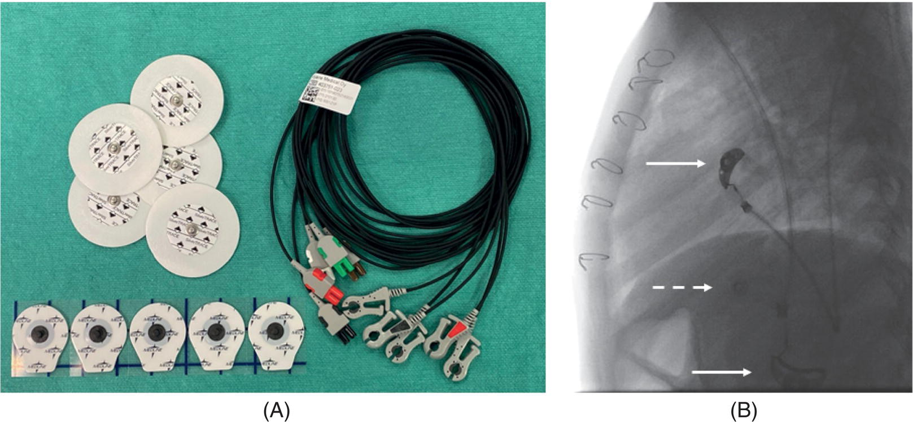

[**Figure 34.24**](#R_c34-fig-0024) Radiolucent electrodes and cables. (A) Examples of radiolucent electrodes (MedGel® and SilverTRACE®) and cables (Vyaire™ Multi‐Link EKG Leadwire) used to allow anatomic positioning in the cardiac catheterization laboratory. (B) Comparison of standard radiopaque electrodes and cables (solid arrows) to radiolucent ones (dotted arrow) on lateral fluoroscopy of the heart. Note that the cable attached to the radiolucent lead is not even visible.

### Intravascular volume management

Patients undergoing catheterization are inherently at risk for volume overload by both the anesthesiologist and the cardiologist \[145\]. For the anesthesiologist, efforts should be made to limit IV fluids, except when indicated in the setting of hypovolemia, bleeding, or instability. A Buretrol® filled to a predetermined level can effectively minimize the risk of inadvertent large volume administration in smaller and younger patients. A more common (and less immediately obvious) cause of hypervolemia is the cumulative effect of intermittent and occasionally rapid infusions of flush and contrast. Clinical consequences include hemodilutional anemia, electrolyte abnormalities, pulmonary edema, and decreased myocardial function due to myocardial stretch. Those at greatest risk are neonates and infants due to their smaller blood volumes and patients otherwise with already depressed ventricular function. Attention to worsening lung compliance, increases in measured ACT independent of heparin boluses (because flush and contrast may also contain heparin), and profuse increases in urine output are common signs of volume overload. Serial blood gases should also be monitored to assess for the impact on hemoglobin and electrolytes. Rarely, transfusion is needed to increase hemoglobin levels. More commonly, IV diuresis (furosemide 1 mg/kg) and time are the only treatments needed. In the event that oxygenation or ventilation is impaired, postprocedural mechanical ventilation is indicated to allow more time for diuresis.

Other causes of anemia include blood loss from attempts at vascular access and sheath/catheter exchanges, and blood sampling for oxygen saturations, ABGs, and ACTs \[145\]. Blood loss can be insidious. The drapes around the groins are often stained with blood, but it is difficult to use this alone as a marker of blood loss. Much of the administered flush can collect on the drapes and mix with any blood present, giving the appearance of more significant bleeding than is actually present. Trending the patient’s hemodynamics and assessing hemoglobin on serial ABGs is one approach to assessing for anemia. As for any patient, the threshold for transfusion should depend upon the patient’s underlying physiology and an assessment of the adequacy of oxygen delivery and end‐organ perfusion. Whereas a noncyanotic and otherwise healthy child may well tolerate a hemoglobin of 7 g/dL, a cyanotic patient accustomed to a higher hemoglobin almost certainly would not. Cerebral oximetry can be used as a surrogate of end‐organ perfusion and adds another data point in the decision of whether or not to transfuse.

### Recovery

Stays in the recovery room following catheterization are much longer than that for other anesthetics. The time frame can range from 2 to 6 hours and is directly related to the risks of bleeding and hematoma formation from the vascular access sites. Efforts to minimize these complications include keeping the child supine and relatively immobile for the first few hours postcatheterization. Long‐acting sedation and analgesia along with the avoidance of emergence delirium and PONV can be helpful in achieving this goal (particularly in younger children for whom laying still is an oxymoron). Gautam et al. studied the effects of dexmedetomidine for this purpose in children between 1 month and 5 years of age who underwent catheterization. When given as a bolus of 1–2 mcg/kg prior to deep tracheal extubation with sevoflurane (0.8–1 MAC), 91% of patients had a documented smooth recovery requiring no additional analgesics or sedatives \[163\]. Such an approach, or a comparable one using propofol in those can tolerate its negative hemodynamic effects, may limit postprocedural bleeding associated with movement, coughing, or agitation. While the cardiologist most often infiltrates the access site with local anesthetic at the end of the case, systemic opioids like morphine may be needed particularly if large sheaths are used (e.g., for TPVR placement). Of note, routine deep tracheal extubation requires that the recovery nursing staff be familiar with the airway complications that may occur in this setting and also maneuvers to temporize until help arrives. A pathway for calling for help and the immediate availability of emergency drugs in the recovery room can help ensure a prompt response should an event like laryngospasm occur.

* * *

### KEY POINTS: ANESTHETIC MANAGEMENT

-   Risk reduction begins prior to arrival in the CCL with preprocedural medication management and scheduling such as to avoid lengthy NPO times or concurrent illnesses.
-   Preprocedural checklists are useful to identify key anesthetic and cardiology concerns and to ensure the availability of necessary personnel and resources.
-   GETA should be considered in neonates, infants, and those patients otherwise undergoing high‐risk procedures.
-   Monitoring in the CCL involves an assessment of serial ABGs, ACTs, and the position of catheters within the heart in addition to the usual vital signs.
-   Recovery can last for several hours due to the need to monitor for access site bleeding.

* * *

## Electrophysiology procedures

The most common procedures performed in the EP suite are electrophysiology studies (EPSs) and ablations for the management of tachyarrhythmias. Less common are implantation of pacemakers and/or defibrillators, cardioversion, and lead extraction.

### Electrophysiology studies and ablations

The purpose of an EPS is to identify the mechanism of the patient’s arrhythmia by recording signals from electrodes placed within the heart. The use of fluoroscopy and correlation of electrical signals to anatomic landmarks allow localization of the abnormal pathways or foci responsible for the arrhythmia. Ablation of these pathways is then pursued and is initially successful in 91% of patients with a recurrence rate of 23% \[164, 165\].

The majority of children presenting for EPSs and ablation are otherwise healthy, have functionally normal hearts, and present with well‐tolerated SVT. A minority will have either a life‐threatening arrhythmia or an arrhythmia complicating CHD (7.9%) or cardiomyopathy (2.4%) \[166\]. Anesthetic concerns include the length of the procedure, poor access to the patient, the possibility of anesthetic agents altering the EP of the heart, and occasionally poor cardiac function. [Chapter 22](c22.xhtml) presents an extensive discussion of arrhythmias.

#### Pathogenesis of arrhythmia

The most common mechanism of tachycardia is reentry, of which atrioventricular nodal reentry tachycardia (AVNRT) is the most common example. This requires a circuit composed of two pathways with different conduction velocities and refractory periods. In AVNRT, the normal AV node receives an input from two physiologically distinct pathways: a slow pathway conducting slowly with a short refractory period and a fast pathway that conducts quickly with a longer refractory period. Normal conduction occurs via the fast pathway. If an ectopic beat reaches the two pathways while the fast pathway is refractory, the impulse is conducted via the slow pathway only. In some individuals, the conduction speeds and refractory periods of the two pathways are such that tachycardia is perpetuated due to a circuit comprising anterograde conduction via the slow pathway, retrograde conduction via the fast pathway, and conduction through the atrial myocardium. Preexcitation syndromes, such as Wolff‐Parkinson White (WPW), are a subgroup of reentry tachycardia in which one arm of the circuit is the AV node and the other is a congenital muscular pathway between the atrium and the ventricle \[167\]. Such accessory pathways can originate in either the right or left atrium.

Another mechanism of tachycardia is enhanced automaticity. During sinus rhythm, cells in the sinoatrial (SA) node function as the heart’s pacemaker by independently generating rhythmic impulses through spontaneous depolarization. Other cells demonstrate this activity but at a slower rate and will only act as the pacemaker if the SA node is not functioning or conduction is blocked. When these cells are damaged or subjected to extrinsic factors (electrolyte disturbance, hypoxia, hypercarbia, high wall tension, ischemia, and high catecholamine levels), they may spontaneously depolarize at a rate that supersedes the SA node. This leads to rapid repetitive depolarization of a single focus, referred to as ectopic or automatic tachycardia.

Ventricular tachycardias (VTs) and premature ventricular beats (PVCs) are relatively uncommon in the pediatric population. In patients with structurally normal hearts, the most common types are fascicular tachycardia and automatic tachycardia originating in the outflow of the RV. Fascicular VT occurs due a reentry circuit involving the left bundle branch. In patients with operated CHD, VT may occur due to reentry circuits around scar tissue. This is more commonly seen in adults than in pediatric patients.

#### Electrophysiology techniques

[Figure 34.25](#c34-fig-0025) demonstrates typical catheter position during an EPS for investigation of SVT.

The electrical signals detected by these catheters can be correlated with anatomic location using electroanatomic mapping systems to produce a three‐dimensional representation of the heart. This technology can enhance the safety and efficacy of ablations by providing the precise location of the catheter relative to critical cardiac structures and by creating a visual marker of areas to be ablated ([Figure 34.26](#c34-fig-0026)). An additional benefit of such systems is the decreased need for fluoroscopy and decreased radiation exposure \[168\].

To identify the mechanism of the arrhythmia, periods of pacing and programmed stimulation are undertaken. Pacing, commonly via the coronary sinus, allows the arrhythmia to be provoked or terminated, permits measurement of the EP properties of the conduction system, and allows for ventricular pacing should CHB occur. Drugs may be used to further refine the study. Adenosine will block normal AV conduction, exposing a concealed abnormal pathway. Isoproterenol, in contrast, will increase SA node rate, speed up AV node conduction, reduce refractory periods, and increase automaticity of other contractile tissue.

#### Radiofrequency ablation and cryoablation

Destruction of an accessory pathway, the slow pathway of an AVNRT, or automatic foci abolishes the arrhythmia. This is most often accomplished by delivering RF energy to heat and ablate the area. An alternative to RF catheter ablation (RFCA) is cryoablation, the freezing of the foci. This allows for the pathway or foci to be temporarily disabled prior to its destruction. This can be a safer option when the pathway is close to the AV node, such as in AVNRT. In the treatment of preexcitation syndromes, a specialized catheter is positioned along the AV ring, then adjusted to record the earliest conduction via the abnormal pathway ([Figure 34.26](#c34-fig-0026)). When delivering RF energy, the size of lesion created is dictated by the power. Temperature control is used to stop overheating of local tissue and blood. Following ablation, an EPS is repeated to test for residual or additional pathways.

#### Complications and risk factors with electrophysiology studies

MAEs associated with EPSs and tachyarrhythmia ablations are rare, approximating 0.1% in a recent cohort \[169\]. Apart from hematomas or injury otherwise associated with vascular access, complications are largely related to ablation attempts and transseptal puncture for left‐sided arrhythmias. RFCA can cause acute coronary occlusion or stenosis when performed in proximity to the AV junction \[170\]. Other complications include arrhythmias requiring cardioversion, AV block requiring temporary or permanent pacemaker, right or left bundle branch block, thromboembolism (stroke), AVV injury, cardiac perforation, pericardial effusion, and tamponade. Risk factors associated with adverse events are younger patient age (infants) and lower weight (<15 kg), patients with CHD, patients undergoing VT rather than SVT ablation, and centers with low ablation volumes \[171–173\].

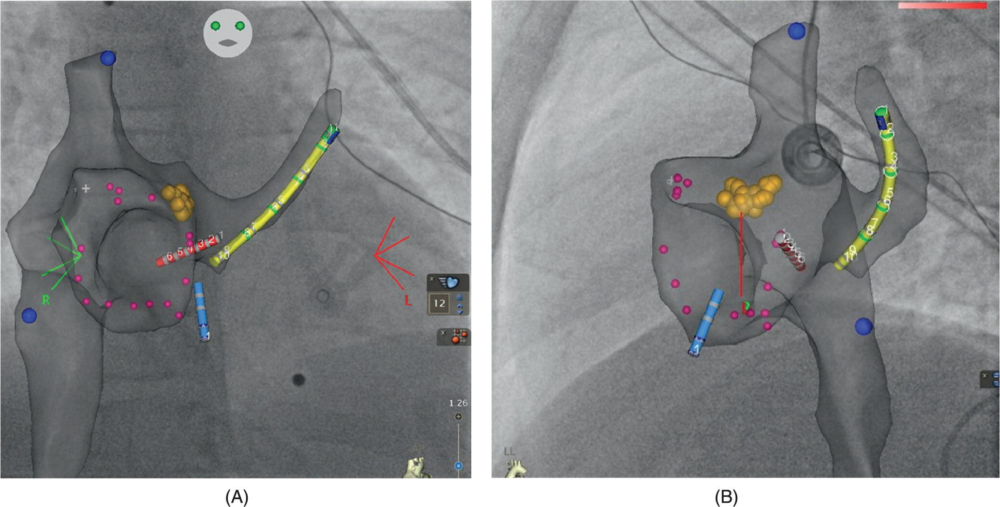

[**Figure 34.25**](#R_c34-fig-0025) Electroanatomical map overlying fluoroscopic images of the heart. (A) Anteroposterior view of mapping catheters in the coronary sinus (yellow), right ventricle (blue), and His (red) positions. The catheter in the coronary sinus is multipolar and, therefore, capable of detecting signals along its length. This catheter allows for analysis of left‐sided electrical conduction without having to directly access the left atrium/ventricle. The blue circles denote the transition between the electrically inert superior and inferior venae cavae and the electrically active right atrium. The tricuspid annulus is marked by pink circles and the His by yellow circles. (B) Lateral view.

(Source: Texas Children’s Hospital Cardiac Catheterization Laboratory, Dr. Taylor Howard.)

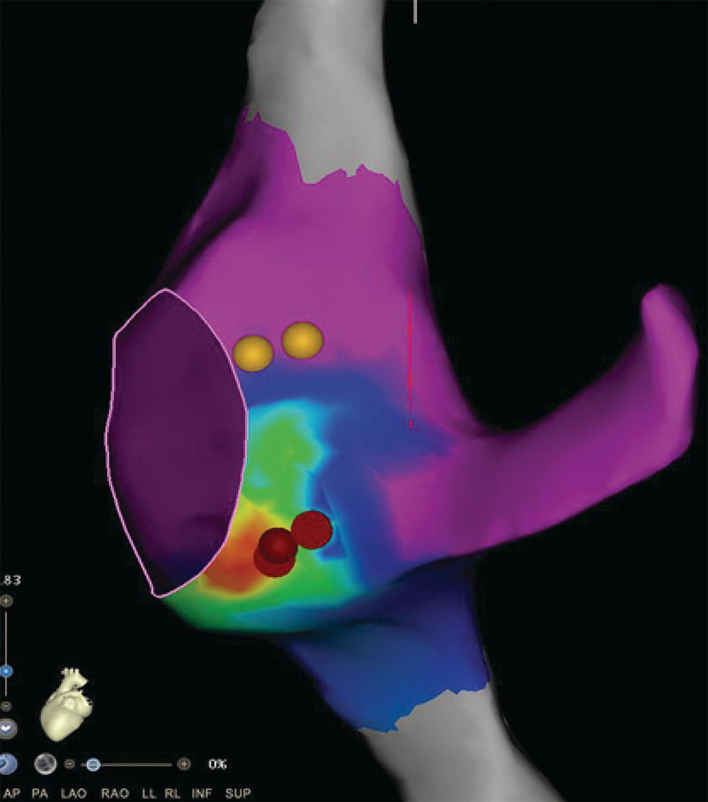

[**Figure 34.26**](#R_c34-fig-0026) Local activation time map highlighting areas of interest for ablation. Accessory pathways such as those in this patient with Wolf‐Parkinson White (WPW) syndrome are characterized by electrically conductive fibers, which cross the electrically inert atrioventricular valve. The insertion of this fiber creates a unique signal that, when mapped, appears to be “early” compared to other signals on the valve. All signals are compared to a reference point (in the case of WPW, usually the delta wave of the QRS complex). As the catheter is move around the valve, a color map is created with earlier signals being denoted in red and the later signals in purple. The red circles denote areas of ablation.

(Source: Texas Children’s Hospital Cardiac Catheterization Laboratory, Dr. Taylor Howard.)

The child younger than 4 years presenting for ablation often indicates a significant arrhythmia not controlled by antiarrhythmic drugs. There have been recent reports of successful ablation in children as young as 1 month of age, but complications are more common \[171, 174, 175\]. Such patients will frequently have abnormal ventricular function and severe refractory arrhythmia prior to an EPS being contemplated.

Patients with CHD may develop arrhythmia in a number of circumstances \[168, 176\]. Ebstein’s anomaly is associated with accessory pathways and preexcitation. Atrial dilation and scarring within the heart may occur secondary to surgical palliation or repair and is often associated with arrhythmia. The latter is especially true following extensive atrial surgery, such as the Mustard procedure or classical Fontan connections. Adults with TOF with long‐standing pulmonary insufficiency may also present with RA and RV enlargement with either atrial or ventricular arrhythmias. This group of patients may have poor reserve to tolerate tachycardia, and placement of intracardiac electrodes may be complex.

### Anesthetic considerations

As with other catheter‐based procedures, it is possible to conduct EPSs in conscious patients or with minimal sedation. These procedures are often hours in length, however, and can require multiple venous and arterial access points. Periods of arrhythmia are inevitable and can be unpleasant for the patient. Moreover, movement during the procedure can disrupt the electroanatomic map and interfere with catheter stability and myocardial contact during ablation. The latter diminishes the effectiveness of ablation lesions and may also increase the risk of injuring adjacent structures \[169, 177–182\]. Deep sedation is unlikely to offer any advantage to general anesthesia, and the additive effect of repeated doses of sedative drugs over a period of time must be considered. Consequently, our practice is to use GETA unless the patient’s underlying arrhythmia (PVCs or VT), or prior history of failed ablation, suggests a benefit to conscious sedation.

Preprocedural evaluation entails assessment of the frequency of the arrhythmia, precipitating factors, symptoms during the arrhythmia, and whether treatment is required for termination. Arrhythmias associated with fainting or collapse are likely to be associated with greater hemodynamic compromise. Equally important is the mechanism of the arrhythmia. Certain mechanisms, noted below, are more susceptible to anesthetic depth (and specific agents) than others. Tailoring the anesthetic to the anticipated arrhythmia may avoid a failed ablation or an unnecessarily lengthy procedure due to difficulty in eliciting the arrhythmia. Discussion with the electrophysiologist can identify those patients who require either a lighter plane of anesthesia or minimal sedation initially to facilitate arrhythmia induction.

Though the majority of patients are otherwise young and healthy, the presence of CHD, cardiomyopathy, or familial conditions associated with arrhythmia (long QT syndrome and arrhythmogenic RV dysplasia) may confer increased risk. Adults with CHD presenting for ablation are often in compensated heart failure due to long‐standing arrhythmias and poor ventricular function. Further, those adults with rate‐controlled atrial arrhythmias may be managed on anticoagulants to decrease their risk of stroke. While these medications are usually held in advance, the decision is made weighing the risks of procedural bleeding with their continued administration versus that of stroke with stopping them. Antiarrhythmics are commonly held several days prior to the procedure. Anxiolysis with midazolam can be helpful in children and adolescents due to the increased time between separation and induction (needed to allow placement of the posterior surface electrodes used for electroanatomic mapping).

Standard monitors and the use of defibrillation pads are routine. Additional vascular access including a dedicated arterial line and a separate site for vasoactive infusions is infrequently needed, but placed as indicated in at‐risk patients. If using GETA, a Foley catheter is used as average case lengths approach 4–6 hours. X‐ray tables are firm, and patient positioning can be awkward. Care must be taken to avoid injury to nerves and pressure areas.

Periods of tachycardia (either due to arrhythmia or due to pacing) are to be expected during an EPS and healthy patients tolerate this well. Significant hemodynamic compromise can occur, however, with very high ventricular rates or in patients with reduced cardiac reserve. Vasopressors may be used to improve perfusion pressure but can have reflex effects on the EP of the heart (e.g., bradycardia with phenylephrine). Alternatively, vasopressin can be used. Nonpharmacologic interventions entail communication with the electrophysiologist so that the arrhythmia can be terminated rapidly by overdrive pacing, or if the cause of instability is pacing itself, the pacing can be stopped to allow recovery and time for volume/vasoactive management. Adenosine or external cardioversion is rarely required to treat arrhythmias. A common practice in patients who can tolerate the volume load is to administer a fluid bolus with the start of the procedure to ensure euvolemia and minimize the risk of hypotension with the onset of arrhythmias and/or pacing. Adenosine and isoproterenol, used to define and elicit arrhythmias, can also induce hypotension. Importantly, in patients with a history of reactive airways, adenosine can provoke bronchospasm \[183\].

If the abnormal pathway or foci is left sided, the left atrium is accessed via transseptal puncture, most commonly from the RA. Changes in heart rate or blood pressure with this approach require further evaluation as tamponade is a known complication \[184\]. As noted above, additional heparin 50–100 units/kg with a target ACT of 250 seconds is often employed in this setting to decrease the risk of thromboembolism.

PONV in children undergoing ablation is unfortunately common with a reported incidence of 7–63% \[185, 186\]. Because the use of dexamethasone as an antiemetic may hinder scar formation following ablation, alternative agents for PONV prophylaxis including subhypnotic infusions of propofol (10–100 mcg/kg/min) and ondansetron should be considered. Lee et al. reported that infusions of propofol <100 mcg/kg/min were associated with a decrease in postprocedural vomiting, but not nausea, following ablation \[185\].

### Anesthetic drugs and the cardiac conduction system

All anesthetics influence the electrical conduction of the heart. In the context of an EPS, the relevant question is whether the agents used will inhibit the induction of the targeted arrhythmia (and thereby prevent its characterization, localization, and ablation). The answer appears to depend less on the specific drugs administered, and more on the mechanism of tachycardia. Reentry tachycardias are least affected by common anesthetic agents, whereas automatic tachycardias are highly susceptible to the suppressive effects of anesthesia. As such, while any number of drugs can be used successfully in the anesthetic management of a child undergoing WPW or AVNRT ablation, greater caution may be needed to allow arrhythmia induction in the child with ectopic atrial tachycardia (EAT) or automatic VT.

#### Anesthetic drugs and reentry tachycardias

Many anesthetic agents have been used successfully in the ablation of reentry tachycardia, including various combinations of volatile agent, midazolam, fentanyl, remifentanil, propofol, ketamine, and even dexmedetomidine. As arrhythmia inducibility is less critical to the successful ablation of WPW \[169\], anesthetic choices for this lesion are broad. More caution has been advised when managing children with AVNRT, but similar rates of success in terms of arrhythmia induction have been noted regardless of the anesthetic technique (GA vs. MAC) or drugs used \[169\]. A summary of the electrophysiologic effects of common anesthetics and their impact of SVT inducibility is described in [Table 34.14](#c34-tbl-0014) \[187\].

[**Table 34.14**](#R_c34-tbl-0014) Electrophysiologic effects of common anesthetics during SVT ablation

Source: Modified Vladinov et al. \[187\].

| Anesthetic sedative | Effect on AV node conduction | Effect on induction of SVT | Comments |
| --- | --- | --- | --- |
| Volatile anesthetics | ↔↓ | ↔ | Isoflurane and sevoflurane used successfully |
| Midazolam | ↔ | ↔ | Minimal clinical effect. |
| Fentanyl | ↔↓ | ↔ | Minimal clinical effect. May cause vagal‐mediated bradycardia. |
| Remifentanil | ↓ | ↔↓ | Induces bradycardia and has potential to inhibit SVT induction at high doses, but has been used successfully |
| Propofol | ↔ | ↔ | Commonly used but caution in EAT |
| Ketamine | ↔↑ | ↔↑ | May counteract depressive effects of dexmedetomidine |
| Dexmedetomidine | ↓ | ↓ | Controversial. May require additional doses of isoproterenol to elicit arrhythmia; may confound etiology of heart block with RFCA near AV node. Caution in EAT. |

↔, no significant clinical effect on conduction or induction of SVT; ↑, speeds conduction and promotes induction of SVT; ↓, slows conduction and inhibits induction of SVT; AV, atrioventricular; EAT, ectopic atrial tachycardia; RFCA, radiofrequency catheter ablation; SVT, supraventricular tachycardia.

Though volatile anesthetics have been demonstrated to slow the SA node and prolong AV conduction time and refractoriness, these findings do not appear to be clinically significant \[186–189\].

Midazolam has no effect on normal AV or accessory pathway conduction and no important clinical effect on SA node activity \[186, 190, 191\].

Of the opioids, fentanyl can induce vagally mediated bradycardia but does not adversely affect arrhythmia induction with either boluses or infusions \[190\]. The combination of fentanyl and midazolam has similarly inconsequential effects on EP variables \[192, 193\]. Remifentanil is more controversial. At high‐dose (0.4 μg/kg/min) and moderate‐dose (0.2 μg/kg/min) infusions, remifentanil prolongs the sinus node recovery time, and at the high dose, also suppresses sinus node automaticity \[194\]. Niksch et al. reported slowing of both SA and AV node conduction at doses of 0.3 mcg/kg/min \[195\]. These effects may lead to difficulty in inducing arrhythmias, but other groups have demonstrated successful use with doses of up to 0.2 mcg/kg/min in patients undergoing general anesthesia \[189, 196\]. If using remifentanil, its short context‐sensitive half time makes stopping an infusion an option if difficulty arises in eliciting the arrhythmia.

Propofol has minimal to no effect on the SA and AV nodes, intra‐atrial conduction, or characteristics of the accessory pathway even at doses of 200 mcg/kg/min \[186, 189, 195, 197, 198\]. Likewise, ketamine has no significant effect on SA or AV node function but can induce significant increases in heart rate and blood pressure due to its stimulatory effects on the sympathetic nervous system. Its use may be beneficial, then, in patients with preexisting bradycardia or hypotension \[189\].

Dexmedetomidine induces depression of both the AV and SA nodes and consequently may adversely affect the inducibility of arrhythmias \[160\]. Tirotta et al., however, concluded that dexmedetomidine does not interfere with EPSs for SVT in their retrospective review of 405 cases between 2007 and 2014 \[199\]. Three groups were studied: (i) those with no exposure to dexmedetomidine, (ii) those given an infusion of 0.5–1 mcg/kg/hour, and (iii) those given a bolus of 0.5 mcg/kg, followed by an infusion of 0.5–1 mcg/kg/hour. No differences were noted among the groups in terms of SVT inducibility or recurrence, but patients receiving dexmedetomidine did require additional doses of isoproterenol to induce SVT. Char et al. demonstrated that ketamine may also counteract the electrophysiologic effects of dexmedetomidine \[200\]. Both ketamine and isoproterenol act as sympathetic agonists, and in doing so, may mitigate the negative chronotropy caused by dexmedetomidine. Beyond dexmedetomidine’s effects on SVT inducibility, an additional consideration that may impact its use is its potential to confound the etiology of heart block should it occur. CHB is an exceedingly rare complication, but would be most relevant in a child undergoing AVNRT ablation due to the involvement of the AV node.

#### Anesthetic drugs and automatic tachycardias

Arrhythmias resulting from increased automaticity, such as EAT or VT, can be more difficult to elicit under anesthesia. Many of the extrinsic factors that promote automaticity (such as elevated catecholamine levels) are minimized during an anesthetic. These changes make the choice of anesthetic critical in these patients.

In a comparison of outcomes of pediatric ablation procedures by anesthesia strategy (GA vs. MAC), the use of GA was associated with a higher rate of noninducibility (and therefore nonablation) in children with PVCs or VT \[169\]. In this group, GA increased the likelihood of a negative EPS with an OR of 2.2. For patients with EAT, however, the type of anesthesia used did not affect inducibility. The authors noted that a larger number of EAT cases were needed to definitively comment on this population. The most commonly used drugs for MAC were propofol, midazolam, and fentanyl, whereas propofol, volatile agent, neuromuscular blockade, fentanyl, and midazolam were most utilized for GA. Exact dosages and the depth of anesthesia obtained with MAC were not specified.

Lai et al. reported different findings in children with EAT who underwent a propofol‐based anesthetic (induction with 200 mcg/kg/min followed by reduction to 100 mcg/kg/min) \[201\]. In four of seven children with EAT, the arrhythmia was terminated with propofol and could not be induced despite an infusion of isoproterenol.

Given these data, it is difficult to suggest a best anesthetic technique for EPSs in patients with automatic (ectopic) tachycardias. General suggestions, however, can be made. For cooperative older children or adolescents, an MAC approach may most reliably preserve the ability to induce arrhythmias and allow a successful ablation. In younger children or patients for whom MAC is not an option, GA can be maintained preferentially with lower doses of volatile agent. The expected loss of endogenous sympathetic activity with GA can be supplemented with isoproterenol.

* * *

### KEY POINTS: ELECTROPHYSIOLOGY STUDIES

-   The majority of children presenting for EPS and ablation are otherwise healthy, have structurally normal hearts, and present with well‐tolerated SVT.
-   More rare and higher risk are patients with CHD and those presenting for ablation in early childhood or infancy.
-   A child with VT or EAT should prompt discussion as to whether sedation versus GA would be best to optimize successful arrhythmia induction and ablation.
-   Adenosine is used in the assessment of arrhythmias and can produce bronchospasm in children with reactive airway disease or asthma.
-   PONV is common following EPSs and should be managed prophylactically.

* * *

### Implantation of pacemakers and defibrillators

Pacemakers in children are rare \[202\]. The most common indication is symptomatic bradycardia secondary to congenital or postsurgical AV block. Other indications include antitachycardia pacing for SVT or sinus node dysfunction in the setting of impaired cardiac output.

Leads can be delivered transvenously through the subclavian vein or placed epicardially through a subxyphoid approach (partial sternotomies and thoracotomies have also been used). These leads are then attached to a pulse generator, which is implanted in the SQ tissue of the chest (transvenous leads) or the abdomen (epicardial leads). Alternatively, the generator may be placed deep to the pectoralis or rectus abdominis muscles, respectively, in young or thin patients to minimize the risks of erosion and infection. Factors that influence the choice of transvenous versus epicardial systems include (i) the size of the central veins, (ii) amount of the SQ tissue at the implantation site, and (iii) whether or not the heart can be accessed through a transvenous approach. Smaller vein size is a risk factor for central venous thrombosis or obstruction when using transvenous leads. Consequently, epicardial leads are most often used in patients weighing <15 kg. Epicardial leads are also indicated in children whose hearts cannot be accessed via a systemic vein (e.g., Fontan circulation) or those with intracardiac shunts (due to the risk of systemic thromboembolism with transvenous leads). Challenges common to both systems include the continued growth of the child (relative to fixed leads) and the related issues of lead failure and fracture.

Most recently, leadless pacing systems have been introduced. As the descriptor suggests, neither leads nor a separate generator pocket is needed. Such devices are implanted transvenously into the RV myocardium as a self‐contained unit, comprising the functionality of a lead and generator in one capsule that is 90% smaller than the typical pulse generator \[203\]. While promising in their ability to avoid the morbidity associated with transvenous and epicardial systems, leadless systems are currently restricted to older children and adolescents due to the large size of the transfemoral sheath needed for deployment. Such devices are predominantly used as single chamber ventricular pacemakers. Current indications for use are the need for backup pacing (those with intermittent pauses or block who need only occasional rather than continuous pacing) and those with venous occlusions that preclude standard pacing systems \[204\].

Children undergoing either epicardial or transvenous lead placement are managed with GETA, while adults who are cooperative can be managed with sedation and abundant local anesthesia. The induction of general anesthesia can occasionally lead to worsened bradycardia. Beta‐agonists such as isoproterenol or epinephrine can be trialed to increase heart rate, or temporary pacing may be instituted (transcutaneously, transvenously via a pacing catheter, or transesophageally via an esophageal pacing probe). Regional anesthesia with pectoral nerve blocks may decrease postoperative pain and opioid consumption in patients undergoing subpectoral generator placement \[205\]. Periprocedural complications associated with transvenous approaches include vascular injury, myocardial perforation, and AVV injury. Acute lead dislodgement or failure can occur regardless of approach and is associated with traction with patient movement.

Implantation of implantable cardioverter‐defibrillators (ICDs) is indicated for life‐threatening cardiac arrhythmias \[206\]. Examples include isolated arrhythmia associated with long QT syndromes and patients with hypertrophic cardiomyopathy or arrhythmogenic RV dysplasia who may have more generalized myocardial disease \[206–209\]. CHD associated with ICDs include TOF, anomalous origin of the coronary arteries, transposition, and Ebstein’s anomaly \[206\]. As with pacemakers, these devices can be placed either transvenously or epicardially \[210\]. SQ ICDs designed initially for adults are now also being applied in pediatric patients \[211–213\]. It is usual to test the defibrillator by induction of ventricular fibrillation and it is prudent to be prepared with external defibrillation pads and pharmacologic agents (as indicated by the pathophysiology of the arrhythmia) in the event the device fails. Often, patients present after near‐miss sudden death or death of a close family member and can be extremely anxious. Preoperative anxiety can be sufficient to induce arrhythmia, and premedication with an anxiolytic is advisable.

### Elective cardioversion

Patients presenting for elective (or nonemergent) cardioversion have stable tachyarrhythmias and are most often adults with CHD. Atrial fibrillation and flutter (AF/F) are the most common indications, with some presenting for first‐time cardioversion and others for breakthrough arrhythmia in spite of antiarrhythmic therapy. Due to the risk of thromboembolism with AF/F, patients are managed with anticoagulation in advance of cardioversion \[214, 215\]. For patients with AF/F of unknown duration or longer than 48 hours who have not been anticoagulated for the preceding 3 weeks, TEE is performed prior to cardioversion to rule out left atrial appendage thrombus.

Anesthetic concerns are related to patient and procedural factors. Key patient factors include the underlying cardiac diagnosis and current functional status. Long‐standing arrhythmias can result in worsened cardiac function that can manifest clinically with signs of heart failure. Conversely, severely depressed function at baseline can serve as the nidus for arrhythmia. The presence of these findings indicates higher risk. Procedure‐related factors include where the procedure is to be performed and whether or not TEE is needed. The former influences preparation, whereas the latter can dictate airway management and the choice of sedatives/anesthetics to be used.

Locations for elective cardioversion and/or TEE at our institution have included the EP suite, procedure room, and ICU. Each site has its pros and cons, but in those patients who are at highest risk for anesthesia‐induced instability, a plan for resuscitation and the availability of essential personnel (surgeons and perfusionists) in the event of an arrest are likely more important than the location itself. If performing the procedure outside a normal anesthetizing site, usual precautions are taken to ensure the availability of all necessary equipment and drugs.

For patients who need TEE, we commonly secure the airway with an ETT. Of note, many adult institutions perform these procedures as MACs while maintaining a natural airway. Our choice for GETA is informed by the relative infrequency of this procedure (and therefore our inexperience with MAC in these cases), concern that hypoventilation or hypoxemia associated with MAC may result in instability in already tenuous patients, and the unpredictable length of TEE.

For patients presenting for cardioversion _without_ TEE, a number of sedatives or anesthetics can be used while maintaining a natural airway. A recent Cochrane review found no consistent difference in safety, efficacy, or adverse events among the most commonly used agents: propofol, etomidate, sevoflurane, isoflurane, midazolam, and diazepam \[216\]. As with all CHD, the dose of the drug used rather than the drug itself is most relevant. Knowles described the administration of a slow bolus of propofol (0.5–1 mg/kg) with additional doses (0.25 mg/kg) as needed in those with severely limited cardiorespiratory reserve \[217\]. Phenylephrine or ephedrine can be used in conjunction with such boluses to mitigate the negative hemodynamic effects of propofol. Sevoflurane alone has also been reported as efficacious in high‐risk patients \[217, 218\].

### Transvenous lead extractions

Transvenous lead extraction is defined as the removal of a lead that has been implanted for greater than a year or that requires specialized extraction tools \[219\]. Patients presenting for this procedure are often adults (with a median age of 40 years at Texas Children’s) who can have either structurally normal hearts or CHD. Channelopathies or congenital heart block comprise the diagnoses in those with structurally normal hearts, whereas common diagnoses in CHD include D‐TGA, TOF, congenitally corrected transposition, and hypertrophic cardiomyopathy. Patient and procedural risk are often higher in this latter group. The foremost indications for extraction are infection (involving the lead, generator pocket, or valve through which the lead passes), lead dysfunction, or SVC or baffle obstruction. The latter conditions require lead extraction because they are treated by stenting. If a stent were deployed without removing the indwelling leads, the leads would be at risk for entrapment or disruption. This indication is most frequent among patients with d‐TGA who underwent the Mustard procedure and now have a systemic venous baffle leak or stenosis ([Figure 34.27](#c34-fig-0027)). Of course, after stenting is performed, new leads are necessary.

Techniques for removal range from the basic to the more advanced. Simple traction or the use of locking stylet may be sufficient in some patients \[220\]. More specialized equipment is needed in leads that are adherent to venous structures or the myocardium, including mechanical sheaths that break fibrotic attachments, rotational sheaths that pierce adhesions, and electrosurgical dissection sheaths that use RF energy to disrupt attachments \[221\]. Beyond these interventions are laser sheaths that transmit laser light to facilitate extraction \[222, 223\].

Awareness of the risks associated with this procedure and strategies to address major complications is essential in developing an anesthetic plan ([Table 34.15](#c34-tbl-0015)) \[223–225\]. Catastrophic vascular or cardiac injury with attempts at lead extraction is a primary concern. This risk increases with (i) years that the leads have been in place, (ii) the number of leads to be explanted, (iii) dual‐coil ICD leads (since these are larger), (iv) use of powered sheaths for removal, (v) females with a body mass index (BMI) <25 (presumably due to smaller vessels that may be more prone to injury), and (vi) use of a femoral approach for extraction (a surrogate for a technically difficult procedure) \[226–230\]. For those patients at increased risk, a surgical team is involved with plans for initiating cardiopulmonary bypass in the event of an otherwise uncontrollable hemorrhage. This can be achieved either through a median sternotomy in patients without prior surgical intervention or through the femoral vessels in patients with a history of sternotomies. Given this possibility, these procedures are most commonly performed in a hybrid CCL.

Anesthetic preparation begins prior to induction by ensuring that any anticoagulation has been held, or if reversal is to be administered if continued. Intraprocedurally, GETA is induced as guided by the patient’s clinical condition and cardiac function. Large‐bore upper and lower extremity venous access is obtained. The latter is useful in the event of superior vena cava (SVC) or RA tear. If no peripheral access is available in the lower extremity, a 9‐Fr introducer sheath is placed in the left femoral vein (leaving the right femoral vein available for emergent bypass cannulation). A dedicated arterial line for blood pressure monitoring is placed (with attention to which extremities may provide the most accurate site in patients with multiple prior cardiac surgeries), and consideration is given to a central venous catheter for the administration of vasoactive agents. Blood, plasma, and vasoactive infusions are ordered and present in the CCL as for a bypass case. In patients who are pacemaker dependent, a temporary pacing catheter is needed in addition to transcutaneous pacing/defibrillation pads. For those undergoing extraction for infection, the development of sepsis should be considered in the differential for hypotension. Imaging of the heart is achieved using a combination of fluoroscopy and echocardiography (intracardiac or transesophageal).

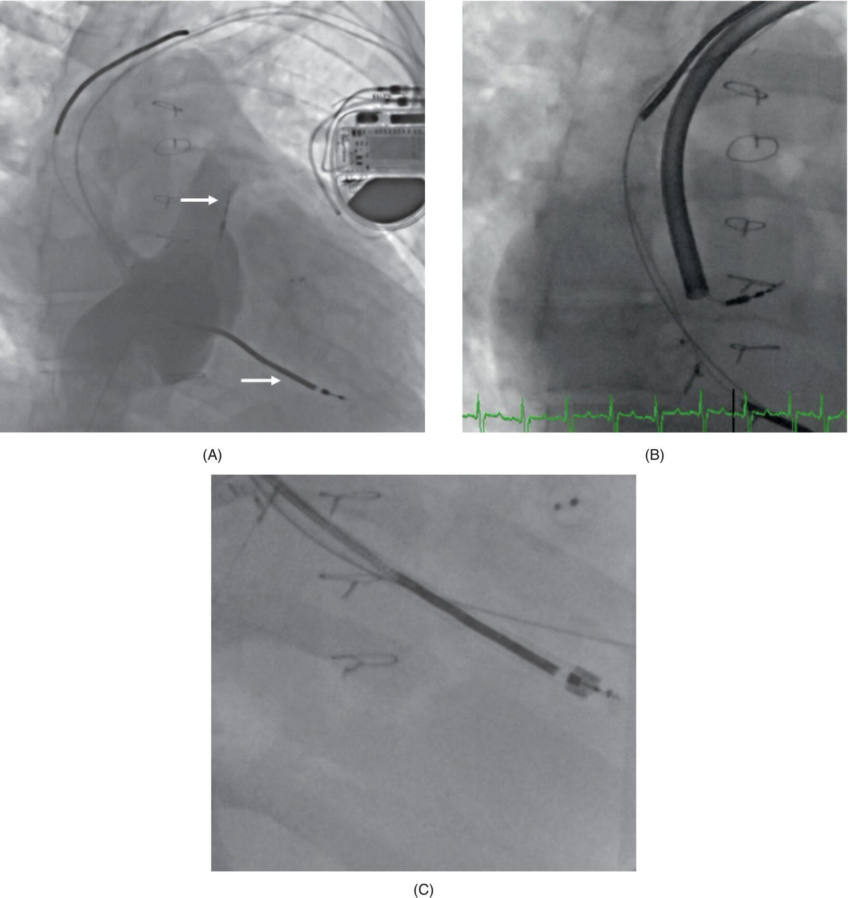

[**Figure 34.27**](#R_c34-fig-0027) Lead extraction. A 33‐year‐old male with d‐TGA status post the Senning procedure and placement of a dual‐chamber ICD presented for lead extraction. The leads were 14 years old and were placed for ventricular fibrillation. The ventricular lead was defective and the atrial lead required removal to allow stenting of the baffle stenosis. (A) The atrial baffle of systemic venous blood to the left atrium. Upper arrow marks the atrial lead passing into the left atrial appendage. Lower arrow marks the ventricular lead in the subpulmonic left ventricle. (B) Use of a rotating dilator sheath to extract the atrial lead. (C) Use of a laser device to extract the ventricular lead.

Hemorrhage secondary to venous or cardiac injury is most often temporally related to lead removal. Temporizing measures include administration of volume and pressors while the proceduralist deploys a Bridge Occlusion Balloon™ (Spectranectics) if the source of bleeding is an SVC tear. In the event of hemothorax or pericardial effusion, drains are placed. If needed, the surgical team on standby should be prepared to proceed with cardiopulmonary bypass and sternotomy.

[**Table 34.15**](#R_c34-tbl-0015) Management of complications associated with lead extraction

| Complications | Management |
| --- | --- |
| Hemorrhage |
| 
-   Tear at SVC/RA junction | -   Passage of a bridging balloon to occlude the tear (performed by the interventionalist)
-   Administration of volume and vasoactive agents through _lower extremity_ access
-   Surgical consult (on standby)

 |
| 

-   Cardiac perforation | -   Pericardial and/or chest tube drainage and autotransfusion
-   Surgical consult (on standby)

 |
| Hypotension otherwise |
| 

-   SVC obstruction by the powered sheath or laser | -   Readjust if possible

 |
| 

-   Pacing noncapture in those who are pacemaker dependent | -   Readjust temporary pacing wire

 |
| 

-   Catheter‐induced tricuspid valve injury causing severe TR | -   Diagnosed via echocardiography. Supportive management with vasoactive agents

 |
| 

-   Arrhythmias or decreased contractility associated with tension at the ventricular lead | -   Reduce tension applied. Supportive management.

 |
| 

-   Blood loss from access site | -   Periodically assessed

 |

RA, right atrium; SVC, superior vena cava; TR, tricuspid regurgitation.

Assuming an uneventful extraction, patients are extubated and recovered in the standard anesthesia recovery area. Patients with significant comorbidities, procedural complications, or the continued need for vasoactive agents are monitored postprocedure in the ICU.

## Conclusions

The shift from diagnostic to interventional catheterization has resulted in an increase in patient and procedural complexity that has only accelerated in recent years. Such changes have underscored the need for the anesthesiologist to understand each of the ever‐expanding variety of procedures that can be performed as well as their associated complications. This added complexity has also highlighted the role that the anesthesia team can play in risk reduction. Through preprocedural communication (with cardiology or the relevant consulting services) and identification of modifiable risk factors, adverse events can be avoided and patient outcomes can be optimized.

## Selected references

_A full reference list for this chapter is available at:_

[http://www.wiley.com/go/andropoulos/congenitalheart](http://www.wiley.com/go/andropoulos/congenitalheart)

1.  1 Feltes TF, Bacha E, Beekman RH, 3rd, et al. Indications for cardiac catheterization and intervention in pediatric cardiac disease: a scientific statement from the American Heart Association. Circulation 2011; 123(22):2607–52. The comprehensive, evidence based document from the American Heart Association laying forth the indications for cardiac catheterization and intervention in congenital heart disease.
2.  32 Twite MD, Friesen RH. The anesthetic management of children with pulmonary hypertension in the cardiac catheterization laboratory. Anesthesiol Clin 2014; 32(1):157–73. A now classic, comprehensive review of anesthetic management of the very high risk group of patients with pulmonary hypertension undergoing cardiac catheterization.
3.  44 Hubbard R, Edmonds K, Rydalch E, et al. Anesthetic management of catheter‐based patent ductus arteriosus closure in neonates weighing <3 kg: a retrospective observational study. Paediatr Anaesth 2020; 30(4):506–10. A contemporary case series describing anesthetic management of a newer interventional catheterization procedure: occlusion of the ductus arteriosus in preterm and other small neonates.
4.  46 Odegard KC, Bergersen L, Thiagarajan R, et al. The frequency of cardiac arrests in patients with congenital heart disease undergoing cardiac catheterization. Anesth Analg 2014; 118(1):175–82. An excellent review of a single center experience with detailed information about risk factors, resuscitation, and recovery from cardiac arrest in the cardiac catheterization laboratory.
5.  59 Daaboul DG, DiNardo JA, Nasr VG. Anesthesia for high‐risk procedures in the catheterization laboratory. Paediatr Anaesth 2019; 29(5):491–8. An excellent contemporary review of anesthetic approaches and techniques for interventional and other high risk procedures in the catheterization laboratory.
6.  73 Nasr VG, Callahan R, Wichner Z, et al. Intraluminal pulmonary vein stenosis in children: a “new” lesion. Anesth Analg 2019; 129(1):27–40. A recent review of techniques for treatment of pulmonary vein stenosis, and anesthetic considerations for this relatively recent addition to cardiac catheterization lab procedures.
7.  131 Jayaram N, Spertus JA, Kennedy KF, et al. Modeling major adverse outcomes of pediatric and adult patients with congenital heart disease undergoing cardiac catheterization: observations from the NCDR IMPACT registry (National Cardiovascular Data Registry Improving Pediatric and Adult Congenital Treatment). Circulation 2017; 136(21):2009–19. A comprehensive effort to model the risk for major adverse outcomes for both adults and children with CHD undergoing cardiac catheterization. Describes the Jayaram Risk Score which is now widely utilized.
8.  132 Lin CH, Desai S, Nicolas R, et al. Sedation and anesthesia in pediatric and congenital cardiac catheterization: a prospective multicenter experience. Pediatr Cardiol 2015; 36(7):1363–75. A review of anesthesia related complications in 13,611 pediatric patients at eight centers. The most common reported anesthesia‐ and sedation‐related adverse event was hypotension, occurring in 93 patients (0.68%) primarily with anesthetic induction. Some of these events were associated with CPR and ECMO. High‐severity events associated with anesthesia, sedation, and airway management were observed in 94 patients (0.69%), with an overall mortality within this group of 0.015%.
9.  145 Odegard KC, Vincent R, Baijal RG, et al. SCAI/CCAS/SPA expert consensus statement for anesthesia and sedation practice: recommendations for patients undergoing diagnostic and therapeutic procedures in the pediatric and congenital cardiac catheterization laboratory. Anesth Analg 2016; 123(5):1201–9. A comprehensive, evidence‐based, multidisciplinary review and set of recommendations for sedation and anesthesia in the cardiac catheterization laboratory.
10.  223 Bhatia M, Safavi‐Naeini P, Razavi M, et al. Anesthetic management of laser lead extraction for cardiovascular implantable electronic devices. Semin Cardiothorac Vasc Anesth 2017; 21(4):302–11. A comprehensive review of anesthetic considerations for the high risk procedure of laser lead extraction for implantable cardiac electronic devices.