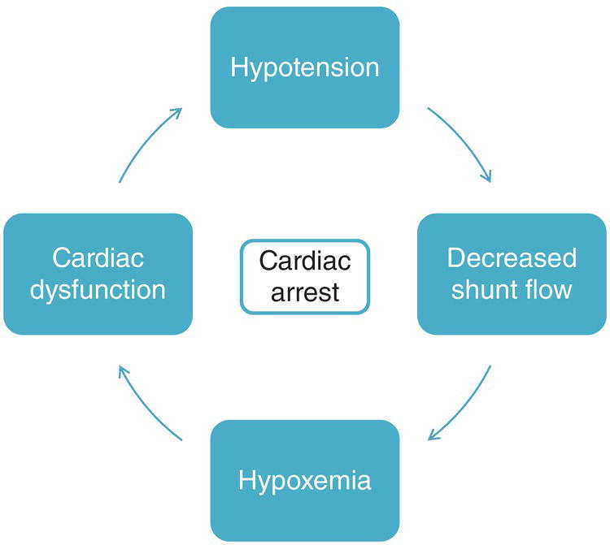
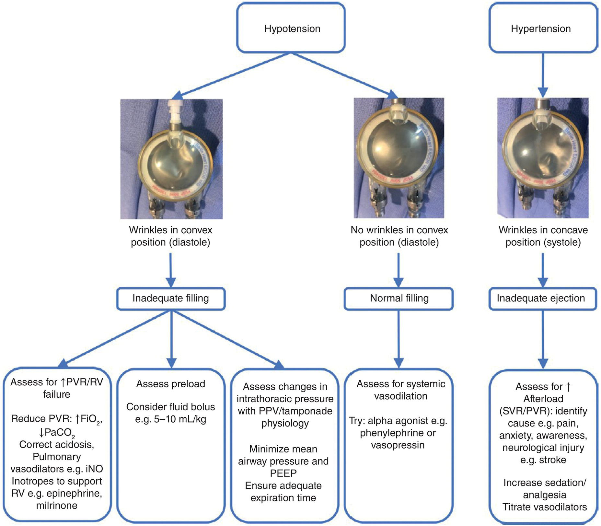
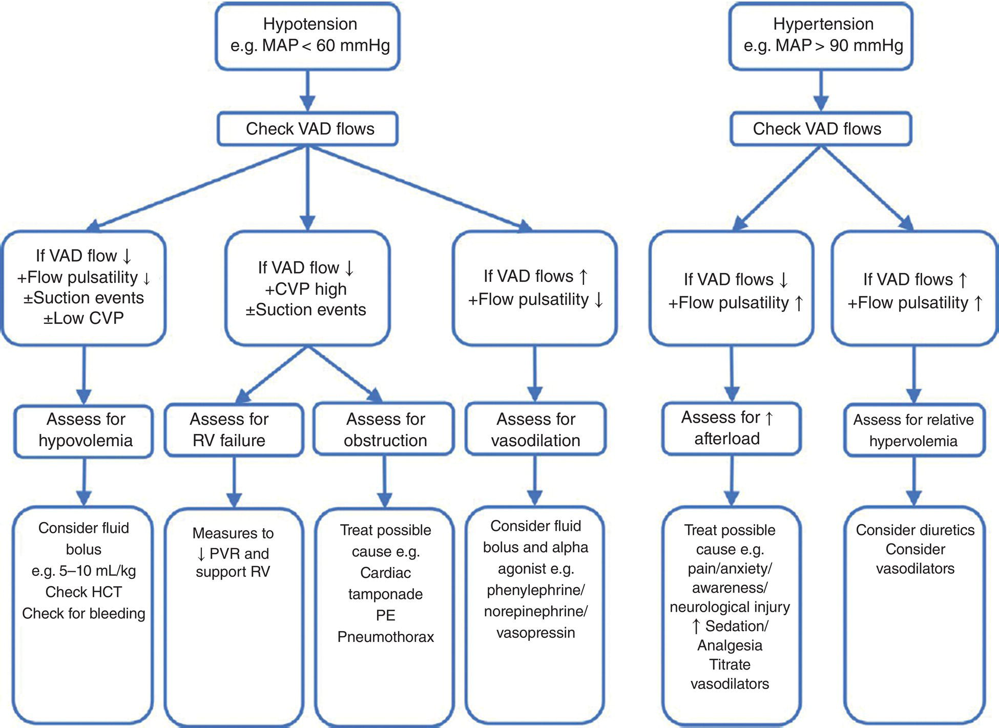
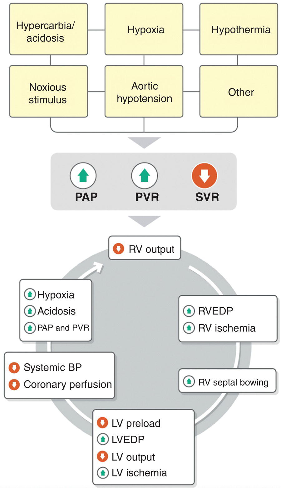
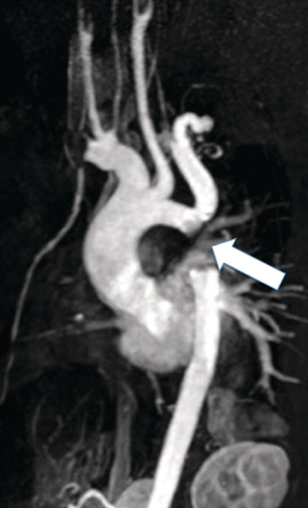

CHAPTER 35 Anesthesia for Noncardiac Surgery and Magnetic Resonance Imaging 

# CHAPTER 35  
Anesthesia for Noncardiac Surgery and Magnetic Resonance Imaging

_Andres Bacigalupo Landa1, Anthony Zapata2, Stephen A. Stayer1, and Erin A. Gottlieb2_

1 Department of Pediatrics and Anesthesiology, Baylor College of Medicine, Arthur S. Keats Division of Pediatric Cardiovascular Anesthesiology, Texas Children’s Hospital, Houston, TX, USA

2 Division of Pediatric Cardiac Anesthesiology, Department of Surgery and Perioperative Care, The University of Texas at Austin, Dell Children’s Medical Center of Central Texas, Associate Professor of Surgery and Perioperative Care Dell Medical School, Austin, TX, USA

* * *

-   [**Introduction**](#head-2-337)
    -   [Risk assessment and stratification](#head-3-598)
-   [**Preoperative preparation for noncardiac surgery**](#head-2-338)
    -   [Multidisciplinary planning](#head-3-599)
    -   [Preoperative cardiology visit](#head-3-600)
    -   [Interpretation of imaging and hemodynamics](#head-3-601)
    -   [Nil per os](#head-3-602)
    -   [Continuation of medications](#head-3-603)
    -   [Endocarditis prophylaxis](#head-3-604)
-   [**Pacemakers and defibrillators**](#head-2-341)
-   [**The patient on ventricular assist device support**](#head-2-342)
-   [**Management strategies for the stages of single‐ventricle palliation**](#head-2-343)
-   [**High‐risk patient groups**](#head-2-344)
    -   [Ductal dependent unpalliated neonates](#head-3-605)
    -   [Shunt‐dependent single‐ventricle patients](#head-3-606)
    -   [Palliated single‐ventricle patients with atrioventricular valve regurgitation](#head-3-607)
    -   [Pulmonary hypertension with systemic or supra‐systemic PA pressure](#head-3-608)
    -   [Severe aortic stenosis (peak gradient >60 mmHg)](#head-3-609)
    -   [Williams syndrome](#head-3-610)
    -   [Hypertrophic cardiomyopathy](#head-3-611)
    -   [Transplant coronary artery disease](#head-3-612)
    -   [Eisenmenger syndrome](#head-3-613)
    -   [Adult congenital heart disease](#head-3-614)
-   [**Intraoperative care**](#head-2-345)
    -   [Monitoring](#head-3-615)
    -   [Anesthetic technique](#head-3-616)
    -   [Surgery](#head-3-617)
    -   [Complex surgical situations](#head-3-618)
-   [**Radiologic procedures**](#head-2-346)
    -   [Magnetic resonance imaging and computed tomography](#head-3-619)
    -   [Lymphatic mapping and intervention](#head-3-620)
-   [**Postoperative considerations**](#head-2-347)
    -   [Intensive care unit vs. general inpatient unit](#head-3-621)
    -   [Home discharge criteria](#head-3-622)
-   [**Selected references**](#head-2-348)

* * *

## Introduction

The commonly reported incidence of congenital heart disease (CHD) in the United States is between 4 and 10 per 1,000 live births. The most common defects are ventricular septal defect, atrial septal defect, valvular pulmonary stenosis, tetralogy of Fallot, coarctation of the aorta, atrioventricular (AV) septal defect and transposition of the great arteries. The National Birth Defects Prevention Network data estimate that there are more than 6,100 cases annually of five defects in the US: truncus arteriosus, transposition of the great arteries, tetralogy of Fallot, AV septal defect, and hypoplastic left heart syndrome (HLHS). Annually, there are an estimated 9,200 patients requiring an invasive procedure related to CHD in the first year of life \[1\].

With improving survival, the number of unrepaired, repaired, and palliated patients of all ages is increasing. With this increase in the number of patients living with CHD, there is a concomitant increase in the number of patients of all ages presenting for noncardiac procedures requiring anesthetic care. Using data from the Pediatric Health Information System (PHIS), an administrative database that includes the surgical data from 52 freestanding children’s hospitals, Nasr et al. report a significant increase in noncardiac surgical encounters from 38,272 in 2015 to 45,993 in 2019 (_p_ < 0.001) \[2\]. In fact, also according to PHIS data, 41% of pediatric patients with CHD requiring surgical management of their CHD in the first year of life also have at least one noncardiac procedure before the age of 5 years, most commonly gastrointestinal or otolaryngologic procedures \[3\]. Adult patients with CHD are also accounting for an increasing percentage of patients presenting for noncardiac surgical procedures and represent a challenge in perioperative management \[4\].

Data from the Pediatric Perioperative Cardiac Arrest (POCA) Registry report a higher risk of perioperative cardiac arrest in children with CHD undergoing anesthesia compared with the rest of the pediatric population, and 54% of arrests occurred during noncardiac procedures. Mortality after cardiac arrest is also substantially higher for patients with cardiac disease, being 33% among those with heart disease, compared with 23% among those without. It is critical to recognize the patients at highest risk of anesthesia‐related mortality: infants with single‐ventricle lesions and patients with left ventricular outflow tract obstruction (LVOTO), cardiomyopathy or pulmonary hypertension \[5, 6\]. Risk assessment and stratification has become increasingly important for perioperative planning.

The recognition of high‐risk patient groups has led to improved multidisciplinary discussion, selection of appropriate operative venue and recovery area, selection of anesthesia care provider, conduct of anesthesia and surgery, and level of monitoring with the goal of reducing morbidity and mortality. In fact, over the last several years, there has been a reduction in the incidence of mortality in patients undergoing noncardiac surgery at children’s hospitals. This is attributed to improved patient selection, medical optimization, and expertise found at dedicated children’s hospitals \[2\].

Over the last several years, the literature suggests that an optimized milieu for the perioperative planning and discussion, acquired and shared expertise in caring for these patients, and multidisciplinary collaboration in care has allowed for improved outcomes in this fragile population undergoing noncardiac procedures. It is possible that shared decision‐making allows the group to attempt and be successful in performing procedures on patients that were once deemed too risky.

* * *

### KEY POINTS: RISKS AND SEQUELAE IN CHD

-   There is a higher risk of perioperative morbidity and mortality in patients with CHD.
-   Mortality after cardiac arrest is higher for patients with CHD.
-   High‐risk lesions for anesthesia‐related mortality are single ventricle, LVOTO, cardiomyopathy, and pulmonary hypertension.
-   Thorough assessment and recognition of high‐risk patients leads to improved perioperative planning and optimization of outcomes.

* * *

### Risk assessment and stratification

Attempts have been made to identify risk factors to help stratify patients with CHD. The pediatric databases of the American College of Surgeons National Surgical Quality Improvement Program (ACS NSQIP) classifies patients with CHD according to the residual lesion burden and cardiovascular functional status, dividing them into minor, major, or severe CHD ([Table 35.1](#c35-tbl-0001)). Using data from the same database, Faraoni et al. found that children with major and severe CHD undergoing noncardiac procedures have an increased risk of mortality and a higher incidence of postoperative reintubation compared with matched controls undergoing comparable procedures. Interestingly, there was no difference between children with minor CHD and their matched controls \[7\].

Taking this into consideration, Faraoni et al. identified eight predictors of in‐hospital mortality in patients with major and severe CHD and developed a risk stratification score system ([Table 35.2](#c35-tbl-0002)). Patients with an overall score of less than or equal to 3 were associated with a low mortality risk (odds ratio \[OR\]: 1.54, 95% confidence interval \[CI\]: 0.78–3.04). Those with a score from 4 to 6 had a medium mortality risk (OR: 4.19, 95% CI: 2.56–6.87). Those with a score above 7 had a high mortality risk (OR: 22.15, 95% CI: 15.06–32.59) \[8\]. A further study by the same group confirmed that the predominant predictors of perioperative mortality in children with CHD were patient comorbidities and the severity of the cardiac lesion at the time of the noncardiac procedure, not the surgical risk \[9\].

[**Table 35.1**](#R_c35-tbl-0001) ACS NSQIP classification of CHD based on residual lesion burden and functional status

Source: Faraoni et al. \[7\]. Reproduced with permission of Elsevier.

| Classification | Definition and criteria |
| --- | --- |
| Minor CHD | 
-   Cardiac condition with or without medication and maintenance (e.g., atrial septal defect, small‐to‐moderate ventricular septal defect with no symptoms)
-   Repair of congenital heart defect with normal cardiovascular function and no medication

 |
| Major CHD | 

-   Repair of congenital heart defect with residual hemodynamic abnormality with or without medications (e.g., tetralogy of Fallot with wide open pulmonary insufficiency, hypoplastic left heart syndrome including stage 1 repair)

 |
| Severe CHD | 

-   Uncorrected cyanotic heart disease
-   Patients with any documented pulmonary hypertension
-   Patients with ventricular dysfunction requiring medications
-   Listed for heart transplant

 |

ACS NSQIP, American College of Surgeons National Surgical Quality Improvement Program; CHD, congenital heart disease.

[**Table 35.2**](#R_c35-tbl-0002) Multivariate risk stratification score to predict postoperative mortality

Source: Faraoni et al. \[8\]. Reproduced with permission of Wolters Kluwer Health, Inc.

| Variables | B (SE) | OR | 95% Cl | P | Risk score |
| --- | --- | --- | --- | --- | --- |
| Emergency procedure | 0.50 (0.17) | 1.66 | 1.19–2.31 | 0.003 | +1 |
| Severe CHD | 0.50 (0.19) | 1.65 | 1.15–2.39 | 0.007 | +1 |
| Single ventricle physiology | 0.61 (0.26) | 1.83 | 1.10–3.06 | 0.020 | +1 |
| Surgery within 30 days | 0.70 (0.18) | 2.01 | 1.40–2.89 | <0.001 | +1 |
| Inotropic support | 0.72 (0.19) | 2.05 | 1.40–3.01 | <0.001 | +1 |
| Preoperative CPR | 0.90 (0.32) | 2.46 | 1.32–4.57 | 0.004 | +2 |
| Acute or chronic kidney injury | 1.48 (0.40) | 4.42 | 2.00–9.75 | <0.001 | +3 |
| Mechanical ventilation | 2.05 (0.18) | 7.80 | 5.42–11.21 | <0.001 | +4 |

Data obtained from multivariable logistic regression and presented as regression coefficient (B), SE, OR, 95% Cl. and Wald test _P_ value.

CHD, congenital heart disease; Cl, confidence interval; CPR, cardiopulmonary resuscitation; OR, odds ratio; SE, standard error.

## Preoperative preparation for noncardiac surgery

### Multidisciplinary planning

Patients with CHD often have other congenital defects and are often cared for by multiple specialists. Each patient most likely has a pediatrician, a cardiologist, and a cardiac surgeon. The patient may be referred to a general surgeon for a gastrostomy tube placement, a urologist for hypospadias repair, a dentist for dental cleaning and restoration, an orthopedic surgeon for treatment of limb deformities, and multiple other practitioners. In addition, the patient may be scheduled for magnetic resonance imaging (MRI) or computed tomography (CT) scanning to evaluate the cardiovascular system or another co‐morbid organ system. Many, if not all, of these procedures require general anesthesia or sedation. The consulted services may not be aware of the patient’s anatomy, physiology, and risk associated with anesthesia.

The role of the anesthesiologist in the care of the patient with CHD undergoing noncardiac surgery should not be underestimated. The anesthesiologist may be the member of the collaborative team that understands the most about the surgical procedure, the patient comorbidities, and the anesthetic. A team with ample input from the anesthesiologist should determine where the procedure will take place, such as an outpatient operating room (OR) vs. an OR setup for emergent cardiopulmonary bypass, and how the associated risks can be mitigated. Preoperative management including hydration, medication management, management of anticoagulation, and fasting times should be discussed. In addition, postoperative disposition should be determined in advance, and an intensive care unit (ICU) bed should be reserved if needed.

Multidisciplinary planning can also result in combining multiple procedures under the same anesthetic. The patient may require fewer anesthetics and may be at a lower risk of anesthesia‐related morbidity and mortality (see [Box 35.1](#c35-fea-0001)) \[10\].

### Preoperative cardiology visit

The timing of a preoperative cardiology visit prior to a noncardiac procedure depends on the patient’s disease, the stage of repair or palliation, and the degree of limitation of activities of daily living (feeding, growing, neurodevelopment for infants; attending school for older children) due to cardiac disease. The type of noncardiac procedure should not impact these guidelines, as a general anesthetic may be required for any procedure. In general, acyanotic patients who are repaired or who have no limitations due to cardiac disease do not require a preoperative cardiology consultation. If these patients have limitations and are not well compensated, a preoperative consultation is indicated within 6 months of the procedure. For patients with cyanotic CHD who are well compensated and have no limitations due to their cardiac disease, a cardiology visit within 12 months of the procedure is adequate. For patients with cyanotic CHD who have limitations due to their cardiac disease, a preoperative consultation is indicated within 6 months of the procedure. Specific recommendations exist for patients with Williams syndrome (see below).

* * *

### [Box 35.1](#R_c35-fea-0001) : The advantages of performing multiple procedures under the same anesthetic in patients with congenital heart disease

-   Decreased risk of potential anesthetic neurotoxicity (fewer exposures)
-   Potential decrease in anesthetic related morbidity and mortality (fewer inductions, intubations, emergences, etc.)
-   Less time nil per os
-   Less time without cardiac medications such as anticoagulants, diuretics
-   Improved patient/parent satisfaction

* * *

Screening in a pre‐anesthetic clinic setting to gather the results of imaging and other diagnostic studies and to review cardiology records is helpful. If necessary, a preoperative cardiology visit can be scheduled, additional tests, studies and consultations can be scheduled, and all data can be collected and reviewed prior to the patient’s arrival on the day of surgery. This step facilitates the selection of a properly experienced anesthesiologist as well as the proper setting for the anesthetic, and it allows the anesthesiologist to prepare necessary medications and equipment in advance. A plan for the postoperative recovery site for the patient (post‐anesthesia care unit \[PACU\] vs. ICU) should be made at this time. These preparations translate into fewer cancellations on the day of surgery.

### Interpretation of imaging and hemodynamics

Preoperative imaging and hemodynamic studies are addressed extensively in [Chapter 18](c18.xhtml). Important information obtained from imaging studies and cardiac catheterization include right and left ventricular function, presence of valvular stenosis or regurgitation, the size and direction of flow of atrial and ventricular septal defects, patency of shunts or vascular connections, and an estimate of pulmonary vascular resistance (PVR). These key pieces of information help to identify patients with lesions that place them at an increased risk for perioperative morbidity and mortality (e.g. cardiomyopathy, aortic stenosis, pulmonary hypertension) and to construct an anesthetic plan with appropriate hemodynamic goals.

### Nil per os

Fasting times of 6 hours for solids or formula, 4 hours for breast milk, and 2 hours for clear liquids are the recommended guidelines from the American Society of Anesthesiologists.\[11\]. For patients with CHD, these fasting times are recommended as well. However, there are some important considerations in this patient population. Patients with LVOTO including hypertrophic obstructive cardiomyopathy, subaortic stenosis, aortic stenosis, and supravalvular aortic stenosis (Williams syndrome or non‐Williams syndrome); systemic‐to‐pulmonary artery shunts (e.g. modified Blalock–Taussig shunt, ductal stent, central shunt); and polycythemic, cyanotic patients have an increased risk of perioperative morbidity and mortality when hypovolemic. Hypovolemic patients with LVOTO may develop significant hypotension during an inhalation induction with a resultant decrease in coronary perfusion pressure that results in unresuscitatable cardiac arrest. Shunted patients with pulmonary blood flow that is completely dependent on systemic blood pressure may become profoundly hypotensive and hypoxemic on induction of anesthesia. Also, when there is decreased blood flow through the shunt, the likelihood of shunt thrombosis increases, as does an unfortunate cycle of hypotension and hypoxemia ([Figure 35.1](#c35-fig-0001)). Other polycythemic, cyanotic patients are at risk for thrombosis and stroke due to increased blood viscosity, which can be due to prolonged fasting. Hypovolemia due to fasting has been reported as a cause of periprocedural morbidity and mortality \[12, 13\].

[**Figure 35.1**](#R_c35-fig-0001) The cycle of hypotension and hypoxemia resulting in cardiac arrest in shunted single‐ventricle patients.

Prevention of hypovolemia is the key to minimizing this risk. Careful planning and communication will minimize the time these patients are without fluids. Families should be advised to give clear fluids liberally until 2 hours prior to the procedure, and if the procedure is delayed, clear fluids can be administered by mouth at the hospital until 2 hours prior to the procedure. In addition, intravenous fluids can be started upon arrival in the hospital to replace losses before induction of anesthesia. Patients may also be admitted the night before surgery to receive intravenous fluids while fasting. These strategies may decrease perioperative risk.

Implementation of more liberal guidelines such as allowing clear fluids until one hour prior to the procedure have been shown to be associated with similar aspiration risks as classic NPO guidelines. Liberal guidelines for clears have been adopted in Sweden, Australia, and the United Kingdom with no increase in aspiration. The European Society of Anaesthesiology updated its guidelines as well \[14–16\]. With this in mind, it may be beneficial to allow patients with a higher hemodynamic risk profile to drink clear fluids until one hour prior to induction to maintain intravascular volume \[15, 16\].

### Continuation of medications

In general, all chronic cardiac medications should be continued perioperatively. Anticoagulants such as aspirin, warfarin, and heparin may be discontinued at the preference of the surgical team after discussion of a perioperative plan for stopping, transitioning, and restarting anticoagulation with the cardiology team. Another exception may be diuretic therapy. Continuation of diuretic therapy in a fasting patient may not be indicated. However, perioperatively, after volume administration, diuretic treatment may be warranted. Angiotensin‐converting enzyme inhibitors and angiotensin receptor blockers may also be held preoperatively due to a significant incidence of hypotension on induction of anesthesia in the general population \[17, 18\]. These agents have also been associated with hypotension and hemodynamic instability on induction in pediatric patients with CHD undergoing noncardiac operations \[19\].

### Endocarditis prophylaxis

CHD is the leading risk factor for infective endocarditis (IE) in children in the developed world. Lesions associated with increased risk of IE in children are cyanotic CHD, left‐sided lesions, and endocardial cushion defects. In addition, the relative risk of developing IE is higher in the 6 months following cardiac surgery and in children less than 3 years of age \[20\]. The goal of IE prophylaxis is to provide appropriate antibiotic coverage for procedures that are associated with bacteremia. The three most common bacteria implicated in CHD‐associated IE are _Streptococcus_ (including _Streptococcus viridans_), _Enterococcus_, and _Staphylococcus_ species \[21\].

The 2007 American Heart Association (AHA) guidelines for IE prophylaxis reduced the number of patients with CHD whom they recommend receive IE prophylaxis and reduced the number of procedures for which IE prophylaxis is recommended. The patients with CHD for whom IE prophylaxis is recommended are those who have the highest risk of adverse outcome from endocarditis and these are listed in [Box 35.2](#c35-fea-0002). Prophylaxis is recommended for patients who are within 6 months of complete repair with prosthetic material or a device. After 6 months, endothelialization of the prosthetic material has occurred, and IE prophylaxis is no longer recommended for these patients.

IE prophylaxis is recommended when both patient indications ([Box 35.2](#c35-fea-0002)) and procedure indications occur. For example, IE prophylaxis is recommended for all dental procedures that involve the manipulation of gingival tissue or the periapical region of teeth or perforation of the oral mucosa, but only for patients in [Box 35.2](#c35-fea-0002). It is also recommended for patients in [Box 35.2](#c35-fea-0002) who undergo invasive procedures of the respiratory tract that involve incision of the respiratory mucosa, such as tonsillectomy and adenoidectomy or bronchoscopy with biopsy. It is not recommended for bronchoscopy that does not involve incision of the mucosa. The antibiotic regimen should be active against _viridans_ group _Streptococcus_ (see [Table 35.3](#c35-tbl-0003)). Antibiotic prophylaxis solely to prevent IE is not recommended for endoscopic gastrointestinal or genitourinary procedures that do not incise mucosa, that is, uncomplicated endoscopies; if biopsies are taken then IE prophylaxis should be considered. However, if the patient is known to be infected or colonized, they should be treated with an antibiotic that covers _Enterococcus_ \[22\]. IE prophylaxis is also recommended for high‐risk adult patients with CHD undergoing similar procedures. It is important to recognize that IE prophylaxis is also recommended for vaginal delivery and hysterectomy and should be considered for tattoos, and body‐piercings \[23–26\].

* * *

### [Box 35.2](#R_c35-fea-0002) : Cardiac conditions at highest risk of adverse outcome from bacterial endocarditis

-   Cardiac valve replaced by, or repaired with, prosthetic material
-   Previous infective endocarditis
-   Cardiac valve disease in a transplanted heart
-   Unrepaired or palliated cyanotic CHD
-   Repaired CHD repaired via surgical or catheter‐based technique using prosthetic material for the 6 months following the procedure
-   Repaired CHD with residual defect adjacent to prosthetic material

* * *

[**Table 35.3**](#R_c35-tbl-0003) Infective endocarditis prophylaxis for dental procedures in pediatric patients

| Route | Drug and dose |
| --- | --- |
| Oral | Amoxicillin 50 mg/kg |
| Oral – penicillin/ampicillin allergic | Cephalexin 50 mg/kg or clindamycin 20 mg/kg or azithromyicin or clarithromycin 15 mg/kg |
| Intravenous/intramuscular (IV/IM) | Ampicillin 50 mg/kg or cefazolin 50 mg/kg or ceftriaxone 50 mg/kg |
| IV/IM – penicillin/ampicillin allergic | Cefazolin 50 mg/kg or ceftriaxone 50 mg/kg or clindamycin 20 mg/kg |

* * *

### KEY POINTS: PREOPERATIVE PREPARATION FOR NONCARDIAC SURGERY

-   Multidisciplinary discussion and planning are essential for determining the risk/benefit balance for a given procedure and for mitigating perioperative risk.
-   Minimize fasting times, especially for patients at increased risk for hypotension and myocardial ischemia during induction of anesthesia.
-   Consideration should be given holding certain cardiac medications prior to surgery, e.g., diuretics, angiotensin‐converting enzyme inhibitors and angiotensin receptor blockers.

* * *

## Pacemakers and defibrillators

The number of pediatric patients with cardiovascular implantable electronic devices (CIEDs), pacemakers and defibrillators, has increased as technology has advanced \[27\]. An increasing number of pediatric patients with these devices will likely present for noncardiac as well as cardiac surgery. It is crucial to manage these devices properly to avoid injury, inappropriate shocking, and hemodynamic instability. A more extensive discussion of pacemaker and defibrillator therapy is presented in [Chapters 22](c22.xhtml) and [34](c34.xhtml).

Preoperatively, it is important to understand the type of device in place, generator location, associated cardiac disease, indications for placement, and the remaining battery life. The underlying cardiac rhythm and degree of pacemaker dependence for cardiac output (none, partial, or complete) are key points of information. This information is best gleaned from a combination of history, physical exam, review of chest radiograph, discussion with or previous note from the cardiologist, and an interrogation of the device in the holding area by a CIED programmer (cardiologist, specialized nurse, or certified company representative from the device manufacturer).

Electromagnetic interference (EMI) in the OR is most commonly caused by monopolar electrocautery. EMI can result in inappropriate triggering or inhibition of pacing, reversion to asynchronous mode, inappropriate shock or anti‐tachycardia therapy, and induction of current in the leads, resulting in myocardial damage. Strategies for reducing EMI include the use of bipolar instead of monopolar electrocautery, using short bursts of cutting rather than coagulation current when monopolar is required, and placing the grounding pad for the electrocautery far from the device site.

If EMI is likely during a procedure, the CIED programmer should reprogram the pacemaker to an asynchronous mode with a rate greater than the patient’s intrinsic rate. Similarly, the anti‐tachycardia function of a defibrillator should be disabled until the risk of EMI is low. It is critical to monitor the patient for a perfusing rhythm with either a plethysmographic or arterial line waveform, as well as electrocardiogram (ECG), after reprogramming. In addition, temporary pacing/defibrillation equipment must be available at all times, and the availability of appropriately sized equipment must be confirmed.

After the procedure when the risk of EMI is low, the device should be interrogated and reprogrammed back to its original baseline settings. It is critical to monitor for a perfusing rhythm and to have pacing/defibrillation equipment present until the device is reprogrammed \[28–30\].

A magnet can be used in an emergency situation to reprogram a CIED. It is not a substitute for interrogation/reprogramming by a CIED programmer, and it can have unpredictable consequences, particularly with modern multifunction pacemaker/defibrillator devices. For pacemakers, application of the magnet will usually change the pacemaker mode to an asynchronous mode (AOO, VOO or DOO – see [Chapter 22](c22.xhtml)) at a fixed rate, usually between 65 and 100 beats/minute (bpm). This fixed rate is device‐specific and dependent on remaining battery life \[31\]. Untoward effects of magnet application include pacing at a rate or in a rhythm that does not meet the patient’s metabolic or hemodynamic needs. For defibrillators, application of the magnet usually suspends the anti‐tachycardia function, but does not change the pacemaker to an asynchronous mode. If the patient experiences ventricular tachycardia or ventricular fibrillation while the magnet is applied, the magnet should be quickly removed so that the anti‐tachycardia function is restored and the device can deliver a shock \[29\]. This restoration does not occur with all systems, however; some are disabled until interrogation/reprogramming occurs \[32\]. There is no substitute for consultation with an expert, assessing the function of the device and converting the functions to an appropriate intraoperative mode. Obviously, there may be emergency situations where this will not be possible. The critical importance of monitoring the patient for a perfusing rhythm throughout the procedure, having backup pacing/defibrillation equipment present, and interrogating and reprogramming the device postoperatively cannot be overemphasized. There is a discussion of MRI‐compatible pacemakers later in the chapter.

* * *

### KEY POINTS: PACEMAKERS AND DEFIBRILLATORS

-   Preoperatively, all CIEDs should be interrogated and potentially reprogrammed by the CIED service.
-   After reprogramming, the patient must be monitored for a perfusing rhythm with an arterial line or plethysmographic waveform.
-   Magnet application can have unpredictable consequences and should not be used as a substitute for interrogation and reprogramming.

* * *

## The patient on ventricular assist device support

Heart failure most commonly resulting from CHD, cardiomyopathy, and myocarditis is the diagnosis associated with more than 12,000 annual pediatric hospital admissions in the United States \[33\]. Most of these patients can be managed medically or surgically, but there are a growing number of pediatric patients that require extracorporeal membrane oxygenation (ECMO) or ventricular assist device (VAD) placement. There are now devices that are appropriate for all sizes of pediatric patients for long‐term support (see [Table 35.4](#c35-tbl-0004)) \[34, 35\]. These devices are discussed in detail in [Chapter 37](c37.xhtml).

After placement, cardiac output can be maintained for these patients until cardiac function recovers or a suitable organ becomes available for transplant. In some cases, the patient can remain on VAD support indefinitely, as destination therapy. Destination therapy has been described in patients with end‐stage heart disease due to muscular dystrophy \[36\]. These patients on long‐term VAD support will likely require anesthesia or sedation for multiple imaging procedures and noncardiac interventions and procedures. In order to provide care for this population of patients, one should become familiar with the different types of devices and the management of hypotension, hypertension, and a decrease in output. A perfusionist or VAD‐trained nurse should be present for all noncardiac procedures to assist with management and transport of the device. In addition, bacterial endocarditis prophylaxis is warranted in all VAD‐supported patients.

The Berlin EXCOR (EXCOR Pediatric Ventricular Assist Device, Berlin Heart, GmbH, The Woodlands, Texas, USA) is a pneumatically driven pump that generates a pulsatile pressure with a rate between 30 and 150 bpm depending on the size of the pump chamber and the size and needs of the patient. The transparent pump chamber allows for visual evaluation of filling, emptying, and thrombus formation. Because of the range of pump sizes, it can be used in neonates, infants, and children, and it is the device that is used most commonly for long‐term support in pediatric patients at the present time \[35\].

Anesthetic management of the patients with a Berlin EXCOR device requires familiarity with the pump and how to troubleshoot hypotension, hypertension, and reduced output. Cave et al. describe a 69% incidence of hypotension in a case series of 29 noncardiac procedures on 11 patients with a Berlin EXCOR device. This group found that hypotension on induction was most associated with the use of remifentanil and was least associated with the use of ketamine as an induction agent. Care should be taken with the administration of anesthetic agents associated with a decrease in systemic vascular resistance (SVR), and intravascular volume and vasoactive agents that increase SVR should be on hand \[37\].

When caring for a patient with a Berlin EXCOR device, it is critical to maintain the ability to visually inspect the pump. This may require clear drapes, a mirror, and a flashlight. The membrane should be inspected regularly to check for fibrin deposition and for membrane wrinkling. Membrane wrinkling is a sign of incomplete filling of the chamber. Device inspection is a key component of determining the cause of hypotension and the appropriate treatment \[34\].

Intraoperative emergencies in a patient with a Berlin EXCOR include malignant dysrhythmias, sudden loss of cardiac output, the appearance of air or clot in the pump chamber, and sudden cyanosis. If the patient develops a dysrhythmia, the pump should be examined for filling and output. The right ventricle (RV) can act like a conduit in the short term, and VAD output can be maintained. The patient may require external cardioversion. Loss of cardiac output is most commonly associated with an alarm from the Berlin EXCOR driver unit. It is most commonly caused by a kink in the external tubing of the device. The device should be examined and the tubing unkinked. Appearance of air or clot in the pump chamber can signal an impending embolism. A cardiac surgeon and a perfusionist should be called to the bedside for an urgent pump exchange. Sudden cyanosis in a patient with a Berlin EXCOR device may be a sign of pulmonary embolism with right‐to‐left shunting through an interatrial communication. Transthoracic echocardiography can aid in diagnosis \[38\].

[**Table 35.4**](#R_c35-tbl-0004) Long‐term ventricular assist device options for pediatric patients

Source: Data from Mossad et al. \[34\].

| Device | Positioning | Flow type | BSA (m2) | Ambulation | Discharge home |
| --- | --- | --- | --- | --- | --- |
| Berlin EXCOR® | Paracorporeal | Pulsatile | 0.2–1.3 | Yes | No |
| Thoratec® | Paracorporeal | Pulsatile | \>0.7 | Yes | Yes |
| Heart Mate II® | Intracorporeal | Axial | \>1.4 | Yes | Yes |
| HeartWare® | Intracorporeal | Axial | \>0.7 | Yes | Yes |

BSA, body surface area.

Most left ventricular assist devices (LVADs) are preload dependent and afterload sensitive. Preload dependence means that, in the case of an LVAD, the left side of the heart must receive enough blood to fill the pump. Lack of left ventricular filling can be due to hypovolemia or right ventricular dysfunction. Treatment can include volume administration and support of the RV either with the administration of inotropic agents or decreasing PVR. Increased afterload can lead to inadequate ejection in the Berlin EXCOR or a decrease in VAD flow in a continuous flow device. The troubleshooting of the Berlin EXCOR and continuous flow devices can be found in [Figures 35.2](#c35-fig-0002) and [35.3](#c35-fig-0003), respectively \[39, 40\]. In the patient with a right ventricular assist device, the afterload is the PVR which must be managed to facilitate flow.

VAD use in the failed single ventricle population is increasing, although it is fairly uncommon \[41, 42\]. In the case of the Fontan, there is no “right heart” that must be supported. In this case, preload is maintained through volume administration and the reduction of PVR using standard measures and pulmonary vasodilators such as nitric oxide or sildenafil.

Preoperative evaluation for the patient with a VAD starts with an investigation into the patient’s anatomy and indications for VAD placement. An understanding of renal, hepatic, neurologic function should be sought. The patient may be on a variety of medications including diuretics, ACE inhibitors (or other afterload reducing agents), antiarrhythmics, pulmonary vasodilators, and inotropic agents for right heart dysfunction. The patient will also likely be on antiplatelet agents and anticoagulants. The ECG should be reviewed and the rhythm noted. Many patients on VAD support have CIEDs, which should be managed similarly to other patients in the perioperative period. The cardiologist managing the VAD should be contacted, and the VAD should be interrogated for alarm history including low flow, power elevations, malfunction, and backup battery. A recent echocardiogram should also be reviewed. Information about RV function, PVR, and aortic insufficiency should be sought out \[39, 40, 43\].

[**Figure 35.2**](#R_c35-fig-0002) Berlin Heart Excor perioperative troubleshooting guide. Target MAPs and flows specific to the patient should be defined preoperatively. iNO, inhaled nitric oxide; PEEP, positive end expiratory pressure; PPV, positive pressure ventilation; PVR, pulmonary vascular resistance; RV, right ventricle; SVR, systemic vascular resistance.

(Source: Navaratnam et al. \[40\]. Reproduced with permission of John Wiley & Sons.)

[**Figure 35.3**](#R_c35-fig-0003) Continuous flow devices perioperative troubleshooting guide. Target MAPs and flows specific to the patient should be defined preoperatively. CVP, central venous pressure; LV, left ventricle; MAP, mean arterial pressures; PE, pulmonary embolus; PVR, pulmonary vascular resistance; RPM, revolutions per minute (VAD speed); RV, right ventricle.

Source: Navaratnam et al. \[40\]. Reproduced with permission of John Wiley & Sons.)

Monitoring should include standard ASA monitors: ECG, temperature, capnography, blood pressure monitoring, and pulse oximetry. Unfortunately, with continuous flow devices, pulse oximetry and noninvasive blood pressure (NIBP) monitoring can be unreliable. Invasive arterial blood pressure monitoring should be considered for all cases and is necessary for major noncardiac operations. NIRS monitoring can also yield important information about perfusion and cardiac output. Intraoperative transesophageal echocardiography can be used to optimize right heart function and filling \[39, 40, 43\].

Intraoperatively, the VAD console for a continuous flow device should be in plain sight and monitored. For the Berlin EXCOR, the chamber should be visually inspected to look for thrombus or membrane wrinkles. The management of systemic vascular resistance is critical for optimal VAD functioning. An age‐appropriate MAP should be selected, and optimization of the MAP may include the manipulation of anesthetic depth and the administration of vasopressors and vasodilators. For teenagers and adults, a MAP of 70–80 mmHg should be adequate to maintain good VAD flow and provide an adequate perfusion pressure to end organs. In adults, a MAP greater than 90 mmHg has been shown to be associated with low VAD flow, pump stasis, and embolic stroke \[40, 43\]. Right heart function may require augmentation with inotropic agents, and PVR may be manipulated to optimize cardiac output.

Data from an adult cohort of 246 VAD patients undergoing 702 noncardiac procedures provide some useful information about perioperative complications and monitoring. The most common perioperative complications were intraoperative hypotension (27%) and acute kidney injury (18%). Interestingly, invasive arterial blood pressure monitoring was only used in 20% of the cases. There were also gaps in blood pressure monitoring of greater than 20 minutes in 55% of cases. There were no recorded blood pressures in 5.5% of cases. During these gaps in monitoring, there is potential for unrecognized hypotension \[44\].

Postoperatively, the patient should be monitored in a special care or ICU to monitor cardiac, respiratory, and neurologic status. Increases in PaCO2 associated with hypoventilation can lead to increases in PVR and suboptimal filling of the pump, as can hypovolemia associated with fluid shifts. Pain can increase both PVR and SVR and should be managed carefully.

Patients with VAD support may need to undergo noncardiac surgeries where the intraoperative management for the procedure is not aligned with optimal VAD management. For example, during one‐lung ventilation for a video‐assisted thoracic surgery (VATS), the patient may become hypercarbic and hypoxemia resulting in an increase in PVR, a decrease in right ventricular function, and a decrease device filling. The anesthesiologist should be prepared to take steps to decrease PVR and augment right ventricular function. Transesophageal echocardiography assessing septal configuration, and central venous pressure (CVP) monitoring can facilitate the diagnosis and treatment \[45\]. Likewise, during neurosurgical procedures, it is important to balance the provision of brain relaxation with the goals for optimal VAD function. In a report of an adult patient undergoing craniotomy for tumor resection, some of the management goals were similar such as the maintenance of a MAP of 70–80 mmHg and hyperventilation. However, mannitol was held due to the effect on preload and the potential for suboptimal VAD function \[46\].

Of note, the AHA has issued a new statement on resuscitation for the patient with a ventricular assist device. Defibrillation and medication administration per Pediatric Advanced Life Support or Adult Cardiac Life Support Algorithms are indicated, and at this time, external compressions are advised \[39, 47\]. See [Chapter 25](c25.xhtml) for an extensive discussion of management of cardiac arrest in patients on mechanical support.

* * *

### KEY POINTS: PATIENTS ON VAD SUPPORT

-   Practitioners should become familiar with the common long‐term VADs available for pediatric patients.
-   Visual pump chamber inspection is critical for the perioperative management of the patient with a Berlin EXCOR device.
-   Right heart failure should be considered when LVAD output decreases.

* * *

## Management strategies for the stages of single‐ventricle palliation

The single‐ventricle surgical palliation pathway is presented in detail in [Chapter 30](c30.xhtml). An understanding of the anatomy and physiology and familiarity with basic hemodynamic and ventilatory management strategies for the different stages of single‐ventricle palliation are important for the successful care of these patients in the noncardiac OR and radiology suite (see [Table 35.5](#c35-tbl-0005)). Instability should be anticipated at any stage of single‐ventricle palliation, and vasopressors, inotropes, defibrillation capability, and volume expanders should be readily available. In addition, these patients are frequently cyanotic and thus are dependent upon chronically increased red cell mass for oxygen delivery to tissues; packed red blood cells should be available (type and screen or type and cross‐match) to transfuse for most surgical procedures. A hematocrit of 40–45% is recommended for cyanotic and shunt‐dependent neonates and infants to maintain oxygen‐carrying capacity. The superior cavopulmonary anastomosis or Glenn stage of single‐ventricle palliation is generally associated with more resilient physiology. The patient is no longer shunt‐dependent, the volume burden on the single ventricle is reduced, and cardiac output is not solely dependent on passive pulmonary blood flow as in the Fontan circulation. If possible, elective noncardiac surgery should take place during this stage \[10, 48, 49\].

[**Table 35.5**](#R_c35-tbl-0005) Anesthetic considerations for stages of single ventricle palliation

Source: Gottlieb and Andropoulos \[10\]. Reproduced with permission of Wolters Kluwer Health, Inc.

| Stage of palliation | Cardiac lesion | Surgical palliation | Pathophysiological considerations | Anesthetic considerations after palliation |
| --- | --- | --- | --- | --- |
| Neonatal | Hypoplastic left heart syndrome | Norwood stage I palliation | Systemic and pulmonary output both ejected by functional single ventricle; pulmonary to systemic vascular resistance ratio determines cardiac output | Avoid hyperoxygenation and hyperventilation; maintain ventricular function; maintain systemic oxygen saturation 80–90% |
| Neonatal | Tricuspid atresia with no pulmonary stenosis | Pulmonary artery banding, systemic‐topulmonary artery shunt, or no intervention | For shunted patients, see above; management of pulmonary to systemic vascular resistance not as critical in banded patients | Maintain ventricular function; maintain systemic oxygen saturation 80–90% |
| Infant: cavopulmonary connection | Any single ventricle lesion | Superior cavopulmonary connection (bi‐directional Glenn operation) | Cerebral‐pulmonary‐cardiac circulation is predominant in younger infants | Avoid hyperventilation; most stable stage for elective noncardiac surgery |
| Fontan completion | Any single ventricle lesion | Total cavopulmonary connection (Fontan operation) | Positive pressure ventilation decreases venous return and cardiac output; intolerant of hypovolemia or non‐sinus rhythm | Minimize positive pressure ventilation; maintain ventricular volume, sinus rhythm, myocardial contractility; perform elective noncardiac surgery before this stage when possible |

* * *

### KEY POINTS: MANAGEMENT STRATEGIES FOR THE STAGES OF SINGLE‐VENTRICLE PALLIATION

-   Shunted patients can develop hypotension and myocardial ischemia when hyperoxygenated and/or hyperventilated.
-   The Glenn stage of single‐ventricle palliation is considered the most stable stage for undergoing elective noncardiac surgery.
-   A decrease of cardiac output in the patient with Fontan circulation should be anticipated when initiating positive pressure ventilation.

* * *

## High‐risk patient groups

All the patients included in this section are at increased risk of myocardial ischemia. If the myocardium is poorly perfused and becomes ischemic, an existing low cardiac output state may rapidly progress to an arrhythmia or cardiac arrest. It is the authors’ recommendation that care for this population be provided by an anesthesiologist with skill and experience in pediatric cardiovascular anesthesiology. These patients should not receive care in a surgicenter or institution that lacks experts in pediatric cardiovascular intensive care, pediatric cardiology, and pediatric cardiac surgery.

### Ductal dependent unpalliated neonates

With advances in care of single ventricle patients, unpalliated, ductal dependent neonates with significant noncardiac comorbidities are presenting for noncardiac surgery prior to addressing the cardiac diagnosis. These procedures can include congenital diaphragmatic hernia repair, tracheoesophageal fistula repair, duodenal atresia repair, exploratory laparotomy for necrotizing enterocolitis, and diverting colostomy for anal atresia. Other procedures related to planning and stabilization of cardiac disease may include peripherally inserted central catheter (PICC) placement, cardiac catheterization procedures, and brain imaging. These procedures can be elective, urgent, or emergent, and any opportunity for multidiscliplinary discussion and planning should be taken. The anesthesiologist should have a detailed understanding of the patient’s anatomy and a plan for managing the ratio of pulmonary to systemic blood flow. Central venous and arterial access is advised, and appropriate vasopressors and emergency drugs should be available. ECMO candidacy should be determined preoperatively, and the family should understand the risk associated with both the cardiac disease and the proposed procedure.

CHD associated with tracheoesophageal fistula/esophageal atresia (TEF/EA) conferred a perioperative mortality of 23% compared with no mortality in patients without CHD in a series of 53 patients reported by Diaz et al. In addition, the risk of perioperative mortality was increased in ductal‐dependent patients \[50\]. Also, in a series of 18 unpalliated neonates who underwent emergent general surgical procedures for necrotizing enterocolitis, intestinal atresia, imperforate anus, or tracheoesophageal fistula, 17/18 patients survived to cardiac surgery or palliation. The patient that did not survive to cardiac surgery had a preoperative echocardiographic misdiagnosis and succumbed 3 days after tracheoesophageal fistula repair. All of the ductal dependent neonates survived to operation \[51\].

Managing these cases can be difficult in the setting of postnatal changes in PVR coupled with one lung ventilation that can be required for tracheoesophageal fistula repair, making the balancing of _Q_p : _Q_s challenging. Arterial blood pressure monitoring, pre‐ and postductal oxygen saturation monitoring, frequent blood gas assessment, and cerebral and somatic NIRS monitoring are helpful in this scenario.

### Shunt‐dependent single‐ventricle patients

These patients have a systemic‐to‐pulmonary arterial shunt that creates a volume burden on their single ventricle from the parallel pulmonary and systemic circulations. They have a reduced oxygen‐carrying capacity, and their normal oxygen saturation is 75–85%. They also have reduced diastolic pressure from the run‐off of blood into the low‐resistance pulmonary circulation through the systemic arterial to pulmonary artery shunt. Instead of a systemic‐to‐pulmonary artery shunt, many shunted single‐ventricle infants will have a right (systemic) ventricle‐to‐pulmonary artery shunt (Sano shunt). Although theoretically more stable because diastolic blood pressure is usually higher, similar pathophysiological considerations apply, and there are insufficient data reporting outcomes of noncardiac procedures to determine that this shunt lowers the risk of anesthesia. The approach should be the same for all shunted single‐ventricle infants before the bidirectional cavopulmonary connection.

This physiologic combination leaves patients particularly vulnerable to hemodynamic insults, and a mild reduction in blood pressure may produce myocardial ischemia. Up to 16% of patients with HLHS who survive the Norwood procedure and are discharged home die prior to their second stage of palliation, which is a reflection of their fragile circulation \[52\]. These patients frequently have feeding difficulties, and a number of them will undergo gastrostomy tube placement. Slater et al. described good outcomes among 12 patients with HLHS (9 after stage 1 reconstruction, three after stage 2) \[53\]. At our institutions, even minor noncardiac procedures on shunted single‐ventricle patients are performed in the cardiac ORs, and the patients are admitted to the cardiovascular ICU for postoperative care and monitoring.

The hemodynamic condition is optimized by avoiding myocardial depressants and vasodilators. Diastolic hypotension may develop from the use of high inspired oxygen concentration or hyperventilation due to a reduction in PVR. The anesthesiologist should attempt to maintain the oxygen saturation near the patient’s baseline. This is accomplished primarily through the adjustment of minute ventilation. The inspired oxygen concentration is usually maintained close to room air. In addition, hematocrit should be maintained at approximately 45% to maximize oxygen‐carrying capacity.

### Palliated single‐ventricle patients with atrioventricular valve regurgitation

After the second and third stages of single‐ventricle palliation (Glenn and Fontan), the vast majority of patients have good cardiac reserve. The volume burden on the ventricle is greatly reduced during the second stage of palliation, and despite remaining cyanotic, myocardial performance improves. Trivial to mild AV valve regurgitation is observed by echocardiography in essentially all single‐ventricle patients. However, patients with moderate to severe AV valve regurgitation commonly have a dilated valve annulus and reduced cardiac output. AV valve regurgitation reduces the forward flow of blood and causes the heart to dilate. In this situation, the hemodynamic status is optimized by reducing afterload and maintaining a normal or slightly increased heart rate. Typically, the myocardial depressant effects of even low doses of inhalation anesthetics are poorly tolerated.

### Pulmonary hypertension with systemic or supra‐systemic PA pressure

This condition is a well‐recognized risk factor for perioperative morbidity and mortality. Recent publications report a significantly higher incidence of intraoperative cardiac arrest and death among patients with supra‐systemic PA pressures. In a report of 101,500 pediatric anesthetics, of the 10 patients at the Royal Children’s Hospital in Melbourne whose death was related to anesthetic management, 50% had pulmonary hypertension \[6, 54\]. Pulmonary hypertensive crisis is defined by a sudden increase in PVR that results in the PA pressure exceeding mean arterial pressure. This will compromise systemic cardiac output because reduced right ventricular output decreases left heart filling, and RV dilation shifts the interventricular septum leftward, which further impedes LV filling and ejection. Lower blood pressure with increased myocardial oxygen demands leads to right ventricular ischemia. Cardiac arrest rapidly follows \[55\] (see [Figure 35.4](#c35-fig-0004)).

First‐line treatment includes increasing the inspired oxygen concentration to 100%, reducing PaCO2, increasing the pH (alkalinization), and initiating inhaled nitric oxide. Hypotension should be treated with phenylephrine or vasopressin to increase coronary perfusion pressure. Epinephrine may also be given to improve cardiac output. Overly aggressive manual ventilation should be avoided because the increase in intrathoracic pressure may reduce venous return, therefore further compromising cardiac filling. The pulmonary vasculature is responsive to changes in pH, and alkalinization with sodium bicarbonate or tromethamine (THAM) can be effective in reducing pulmonary pressures. Some authorities recommend prophylactic preanesthetic administration of inhaled nitric oxide for high‐risk patients with pulmonary hypertension \[55, 56\].

With the widespread use of inhaled pulmonary vasodilators, the use of inhaled iloprost or epoprostenol in the OR as rescue agents has become possible. In order to use either of these medications, a nebulizer can be placed in the anesthesia circuit. When caring for a patient with systemic or suprasystemic PH, the need for this type of rescue should be anticipated and the equipment and drug ordered. Iloprost can be dosed intermittently and carries a risk of bronchospasm \[57\], while epoprostenol requires continuous delivery and may cause clogging of the circuit filter due to accumulation of the glycine diluent.

[**Figure 35.4**](#R_c35-fig-0004) The cycle of pulmonary hypertensive crisis. Examples of “other”: hypovolemia, anesthesia‐induced myocardial suppression, arrhythmias, pneumothorax, pulmonary embolism, sepsis, pericardial effusion, bronchospasm, anaphylaxis, ventilation‐perfusion mismatch. BP, blood pressure; LV, left ventricle; LVEDP, left ventricular end diastolic pressure; PAP, pulmonary artery pressure; PVR, pulmonary vascular resistance; RV, right ventricle; RVEDP, right ventricular end diastolic pressure; SVR, systemic vascular resistance.

(Source: Latham and Yung \[55\]. Reproduced with permission of John Wiley & Sons.)

It should also be recognized that the perioperative risk of these patients extends into the post‐anesthesia recovery period. These patients must be closely monitored, and conditions that increase PVR should be avoided, including hypoxemia, hypercarbia, pain, agitation, and acidosis \[56\]. Chau et al. provide an excellent discussion of the postoperative issues of this high‐risk population and a strategy for mitigating the risk postoperatively \[58\]. See [Chapter 33](c33.xhtml) for a complete discussion of pulmonary hypertension.

### Severe aortic stenosis (peak gradient >60 mmHg)

The pressure burden from aortic stenosis causes the ventricle to hypertrophy, but not dilate. Therefore, ventricular function is generally well maintained even with a significant degree of stenosis. These children usually have normal exercise tolerance and appear normal to their families. However, the hypertrophied ventricle is at risk for developing ischemia if the patient becomes hypotensive. If the diastolic blood pressure decreases, as it commonly does during a routine inhaled induction, the ventricle may become ischemic. Bradycardia and/or ST‐segment changes may be evident on the ECG. If myocardial ischemia progresses to cardiac arrest, closed cardiac compressions are generally ineffective because of the aortic valve stenosis. As these patients may be sensitive to hypotension, an α‐agonist such as phenylephrine must be immediately available and used early if diastolic blood pressure decreases or myocardial ischemia is suspected from a change in the ECG.

Care should be taken to avoid hypotension on induction of anesthesia for these patients. Hypovolemia can lead to an exaggerated decrease in blood pressure with induction. Thus, excessive fasting times should be avoided. Clear liquids should be given up until 1–2 hours prior to the procedure. Intravenous fluids may be started the night before or upon arrival to the day surgery unit to maintain euvolemia. A careful intravenous induction may be preferred for these patients. Medications can be titrated gradually to avoid a decrease in blood pressure, and α‐agonists can be administered during induction as needed. Monitoring with an arterial catheter placed prior to induction or soon thereafter may be helpful. [Chapter 27](c27.xhtml) presents a thorough discussion of this lesion and other forms of LVOTO (Williams syndrome, hypertrophic cardiomyopathy; see the following sections).

### Williams syndrome

Williams syndrome is cause by a deletion on Chromosome 7q11.3 that codes for the elastin gene and has both cardiac and noncardiac manifestations (see [Chapter 8](c08.xhtml)). The most common cardiac manifestations included supravalavar aortic stenosis, pulmonary artery stenosis, and coronary artery abnormalities \[59\]. In 1996, Bird and colleagues reported a series of ten cases of sudden death in patients with Williams syndrome, many of which were associated with an anesthetics or where the patient had had an intraoperative cardiac event previously \[60\]. And so began the awareness of the risk associated with anesthesia, the path to understanding, and the push for risk stratification and mitigation in this group of patients.

In 2006, Burch et al. improved the understanding of the anatomic and physiologic basis for sudden death under anesthesia, which is the imbalance between myocardial oxygen supply and demand. In short, myocardial oxygen supply can be decreased due to the loss of diastolic elastic recoil in the aorta which decreases the coronary perfusion pressure during diastole, dysfunctional adherence of the aortic valve leaflets to the sinotubular ridge leading to decrease blood flow in the sinuses of Valsalva, and ostial narrowing of the coronary arteries themselves. Decreases in systemic vascular resistance related to anesthetic agents or relative hypovolemia add to decreased myocardial oxygen supply. Myocardiac oxygen demand is increased by ventricular hypertrophy and increased end‐diastolic pressure in one or both ventricles. Tachycardia related to stress, laryngoscopy, or a light plane of anesthesia can also increase myocardial oxygen demand. These patients can also be difficult to impossible to resucitate \[61\].

Several publications of institutional experiences have helped to define the incidence of cardiac morbidity or cardiac arrest associated with anesthesia and the patient factors that increase risk. Olsen et al. reviewed 108 anesthetics in 29 patients over a span of 35 years, from 1974 until 2009. The incidence of a cardiac complication including bradycardia, hypotension, hypertension, arrhythmia, ECG changes or cardiac arrest was 11.1%, and the risk of cardiac arrest was 1.85%. Severe outflow tract obstruction, abnormal coronary perfusion, and younger age appeared to be associated with a higher risk of cardiac morbidity or arrest \[62\]. Latham et al. reviewed the records of 48 patients with elastin arteriopathy (both Williams and nonsyndromic) who underwent 141 anesthetics between 1990 and 2013. Seven patients experienced a cardiac arrest (15% of patients, 5% of anesthetics) and there were nine cardiovascular complications (15% of patients, 6% of anesthetics). Extracorporeal support was required in five cases. The highest risk of cardiac arrest was in children less than 3 years old and with bilateral ventricular outflow tract obstruction (BVOTO) \[63\]. Last, Brown et al. reviewed the records of 75 patients undergoing 202 anesthetics (both cardiac and noncardiac procedures) from 2012 to 2016. Of the noncardiac procedures, there were no cardiac arrests and 95.7% did not have an adverse cardiovascular event. Of the cardiac procedures, there were two cardiac arrests, one requiring extracorporeal support. There were no cardiovascular adverse events in 85.7% of these cases \[64\].

Risk assessment in patients with Williams syndrome is challenging. There are certainly factors that place a patient in a higher risk category; however, cardiac arrest can occur even in the absence of risk factors \[65\]. A risk stratification strategy developed by Matisoff et al. and modified by Collins et al. is presented in [Table 35.6](#c35-tbl-0006) \[65, 66\]. Of note, evaluation of the ECG for a prolonged corrected QT interval is part of the stratification process. A prolonged QTc is seen in 13% of patients with Williams syndrome and may be related to microischemia from BVOTO or to ventricular ectopy and the risk of sudden death from arrhythmia.

Recommendations for perioperative care of patients with Williams syndrome can be found in [Table 35.7](#c35-tbl-0007) \[66\]. Of note, for all risk categories (including low risk), the induction should take place in a location that is appropriate for a resuscitation. Vasoactive medications and a defibrillator with appropriately sized pads should be immediately available. Patients with Williams syndrome should be cared for at hospitals with pediatric anesthesiologists, pediatric cardiac anesthesiologists, cardiologists, cardiac surgeons, pediatric cardiac intensivists, and ECMO capability. These patients are not good candidates for outpatient surgery center or office anesthesia or sedation \[65, 66\].

[**Table 35.6**](#R_c35-tbl-0006) Risk stratification for anesthetic administration in patients with Williams syndrome

Source: Collins et al. \[65\]. Reproduced with permission of John Wiley & Sons.

| Low risk | Moderate risk | High risk |
| --- | --- | --- |
| Age >20 years | Hypertension | Age <3 years |
| No cardiac involvement greater than mild supravalvar or branch pulmonary artery stenosis | Moderate supravalvar or branch pulmonary artery stenosis | History of adverse cardiovascular event |
| Normal ECG | Mild bilateral outflow tract obstruction | Preprocedural arrhythmia |
| No renal artery involvement | Renal artery stenosis | Bilateral outflow tract obstruction of ≥ moderate severity |
|  | Renal dysfunction | SVAS gradient of ≥ 40 mmHg and the presence of left ventricular hypertrophy |
|  | QTc on ECG >450 ms but <500 ms | Coronary artery involvement |
|  | Airway abnormalities, lung disease, or severe gastroesophageal reflux | Diffuse stenosis of the thoracic aorta |
|  |  | ≥ Moderate left or right ventricular hypertrophy Symptoms or ECG signs of ischemia |
|  |  | QTc on ECG ≥500 ms |

ECG, electrocardiogram; ms, milliseconds; QTc, corrected QT interval on ECG.

Preoperative evaluation should include a cardiologist evaluation within one month of the planned procedure \[59, 65\]. Patients with Williams syndrome can experience rapid changes in the cardiovascular manifestations of the syndrome. In addition, it should be recognized that an unremarkable previous anesthetic does not guarantee an uneventful future anesthetic. The ECG should be reviewed carefully for signs of ischemia, arrhythmia, and prolonged corrected QT interval. Time without fluids should be minimized. Scheduling the patient for the first case of the day helps to avoid lengthened fasting time due to delays. An intravenous catheter can be placed for hydration, as well, and high‐risk patients may be admitted preoperatively for intravenous hydration. Postoperative disposition should be determined preoperatively, and a monitored bed should be secured \[59, 65, 66\]. Williams Syndrome patients with significant SVAS and coronary involvement should be considered for cardiac surgical intervention first, before any noncardiac procedures, whenever possible.

The hemodynamic goals for the anesthetic include the maintenance of preload and systemic vascular resistance and the avoidance of tachycardia and increased PVR. This can be accomplished with various anesthetic agents, and treatment of hypotension should be swift, usually with phenylephrine or vasopressin. The monitoring of frequent noninvasive (or invasive) blood pressures and a five lead ECG for signs of ischemia are critical. Most impending cardiovascular catastrophes in these patients involve ST segment changes, hypotension, and bradycardia.

Many parents of children with Williams syndrome are aware of the risk of cardiac arrest associated with anesthesia. The anesthetic consent process should involve a discussion of this risk and the preparations that are taking place to mitigate the risk.

Adults with Williams syndrome should be evaluated closely as well. Adults with mild disease are usually not at an increased risk. However, adults who have undergone intervention for severe disease earlier in life may need reoperation and should be evaluated for recurrence of obstruction prior to being anesthetized. Electrocardiographic evidence of ventricular hypertrophy should be investigated. Diabetes mellitus, obesity, and accelerated atherosclerosis are also common comorbidities in patients with Williams syndrome and should be noted during preoperative evaluation \[67, 68\].

### Hypertrophic cardiomyopathy

Hypertrophic cardiomyopathy (HCM) makes up 25% of cardiomyopathies in children, and it is the most common cause of sudden cardiac death (SCD) in children. HCM is most commonly due to mutations in the genes encoding the myosin‐binding protein C and the beta‐myosin heavy chains. Other etiologies include syndromes (Noonan, Costello, and others) \[69, 70\].

Preoperative evaluation of the echocardiogram should focus on the degree of hypertrophy and the two‐dimensional left ventricular mass (2DLVmass) index. Increased 2DLV mass index can help to risk stratify patients with HCM for perioperative events \[70\]. Other pertinent echocardiography findings may include LVOTO and evidence of diastolic dysfunction due to the increased ventricular wall thickness. A significant decrease in LV mass over time may represent the progression of the cardiomyopathy into end stage heart disease characterized by systolic dysfunction \[71\]. The patient’s risk factors for SCD should also be noted. SCD incidence peaks in the 8‐ to 16‐year‐old age range, and many patients have an implantable cardiac defibrillator in place. Myocardial bridging in which heart muscle surrounds a coronary artery has an incidence of 28% in pediatric patients with HCM undergoing cardiac catheterization. This anatomic condition may also predispose to ischemia \[72\].

It is important to recognize that the lack of LVOTO on an echocardiogram at rest does not mean that LVOTO will not occur perioperatively. In addition, patients with major risk factors for SCD may also represent patients with increased risk of perioperative morbidity ([Table 35.8](#c35-tbl-0008)) \[73\]. Asymptomatic patients may become symptomatic in the perioperative period.

The perioperative management of HCM‐associated LVOTO, diastolic dysfunction, potential ischemia, and dysrhythmias represent challenges to the care team. Increases in LVOTO can be minimized by maintaining preload and systemic vascular resistance and by avoiding increases in heart rate and contractility. Hypotension should be treated with vasoconstrictors like phenylephrine or vasopressin, rather than ephedrine or other inotropes that increase contractility and heart rate. Hypertrophy‐related diastolic dysfunction confounds intravascular volume management and favors a slower heart rate and sinus rhythm. Hypervolemia may result in pulmonary edema and should be avoided. A slower heart rate and the atrial contraction in sinus rhythm facilitate improved filling and coronary perfusion. The risk of ischemia is increased due to LVOTO, the increased myocardial oxygen demand of a hypertrophied ventricle, and a myocardial oxygen supply that changes with heart rate and thus time spent in diastole, as well as the potential for myocardial bridging. Arrhythmias including bradycardia, atrial fibrillation or supraventricular tachycardia, or ventricular tachycardia or fibrillation should be anticipated. The ECG should be monitored closely, and tachyarrhythmias should be managed expeditiously by medication administration or cardioversion, as indicated. Patients with HCM are difficult to resuscitate in the event of a cardiac arrest and early defibrillation is critical. \[70, 71, 74\].

[**Table 35.7**](#R_c35-tbl-0007) Anesthetic management of (a) low‐risk, (b) moderate‐risk, and (c) high‐risk patients with WS

Source: Matisoff et al. \[66\]. Reproduced with permission of John Wiley & Sons.

| Preanesthesia planning | Induction and maintenance of anesthesia | Anesthesia emergence and disposition |
| --- | --- | --- |
| (a) |  |  |
| Schedule preanesthesia visit 1–2 weeks prior to planned surgery focusing on airway, development, cardiac, gastrointestinal, renal disease | Minimize npo (nothing by mouth) time and liberalize preoperative oral fluids | Monitor for emergence tachycardia and ECG changes |
| Continue beta‐blockers on day of anesthesia | May need oral premedication prior to induction with midazolam, pentobarbital, ketamine | Aggressively manage postoperative pain and shivering to reduce oxygen consumption |
| Induce anesthesia in an area suitable for resuscitation (operating room, catheterization lab, ICU) | Use full ASA monitors, including 5‐lead ECG | Monitor after anesthesia for at least 2 hours |
| Have resuscitation drugs, including vasopressors, immediately available | Use slow, titrated mask induction or IV induction with ketamine, etomidate, narcotics, or small doses of propofol  
Employ balanced anesthetic with drugs that reduce myocardial oxygen consumption and minimize reductions in SVR Treat ST changes with vasopressors |  |
| (b) |  |  |
| Consider transfer to center with pediatric cardiology and pediatric anesthesia for all nonurgent anesthesia | Minimize npo time and liberalize preoperative oral fluids | Monitor for emergence tachycardia and ECG changes |
| Schedule preanesthesia visit 1–2 weeks prior to planned surgery, focusing on airway, development, cardiac, gastrointestinal, renal disease | May need oral premedication prior to induction with midazolam, pentobarbital, ketamine | Aggressively manage postoperative pain and shivering to reduce oxygen consumption |
| Continue beta‐blockers on day of anesthesia | Use full ASA monitors, including 5‐lead ECG | Recover in high‐acuity setting with capability for resuscitation |
| Induce anesthesia in an area suitable for resuscitation (operating room, catheterization lab, ICU) | Use slow, titrated mask induction or IV induction with ketamine, etomidate, narcotics, or small doses of propofol | Monitor after anesthesia for at least 6 hours, and preferably overnight, prior to discharge |
| Have resuscitation drugs, including vasopressors, immediately available | Employ balanced anesthetic with drugs that reduce myocardial oxygen consumption and minimize reductions in SVR Treat ST changes with vasopressors |  |
| (c) |  |  |
| Pediatric or cardiac anesthesia team involved in care should have experience in managing patients with WS | Place IV for prehydration | Monitor for emergence tachycardia and ECG changes |
| Transfer to facility with ECMO availability | May need oral premedication prior to IV placement, with small doses of midazolam, ketamine, or pentobarbital | Aggressively manage postoperative pain and shivering to reduce oxygen consumption |
| Continue beta‐blockers on day of anesthesia | Use full ASA monitors, including 5‐lead ECG | Recover in high‐acuity setting with capability for resuscitation and ECMO deployment |
| Induce anesthesia in an area suitable for resuscitation (operating room, catheterization lab, ICU) | Induce via IV with etomidate, fentanyl, ketamine | Monitor after anesthesia for at least 6 hours, and preferably overnight, prior to discharge |
| Ensure that ECMO team is aware and clear‐primed ECMO circuit is nearby | Employ balanced anesthetic with drugs that reduce myocardial oxygen consumption and minimize reductions in SVR |  |
| Have resuscitation drugs, including vasopressors, immediately available | Consider direct monitoring of myocardial contractility with echocardiogram in more complicated or prolonged cases  
Treat ST changes with vasopressors  
Monitor status of resuscitation with echocardiogram to evaluate contractility  
Deploy ECMO early if standard resuscitation measures are unsuccessful |  |

[**Table 35.8**](#R_c35-tbl-0008) Categorical predictors of 5‐year sudden cardiac death risk in children with hypertrophic cardiomyopathy

Source: Miron et al. \[73\]. Reproduced with permission of Wolters Kluwer Health, Inc.

| Model | Hazard ratios (95% Cl) |
| --- | --- |
| Clinical |  |
|  Prior history of nonsustained ventricular tachycardia | 2.87 (1.00–6.57) |
|  Prior history of syncope | 7.40 (1.21–32.81) |
| Clinical/genetic |  |
|  Prior history of nonsustained ventricular tachycardia | 2.58 (1.00–6.17) |
|  Prior history of syncope | 7.23 (1.09–33.57) |
|  Pathogenic variant in any gene (reference: confirmed absence of variant) | 1.32 (1.00–2.12) |

### Transplant coronary artery disease

The incidence of transplant coronary artery disease (TCAD) (also known as coronary allograft vasculopathy) in pediatric patients is 17% at 5 years after cardiac transplantation, and 24% of patients with any degree of TCAD died within 2 years in a recent report. A multi‐institutional study found that the major risk factors for TCAD were older recipient age and donor >30 years of age \[75\]. Patients who have experienced recurrent rejection, new onset arrhythmias, unexplained recurrent chest or abdominal pain, and/or the development of systolic or diastolic dysfunction should may have TCAD \[76\]. Symptoms of TCAD are often atypical due to the denervation of the transplanted organ. However, the symptom complex of abdominal, chest, and/or arm pain should raise suspicion \[77\]. These patients should have routine cardiac catheterization with coronary angiography. Hemodynamic assessment is useful as patients with higher right ventricular end diastolic pressure and capillary wedge pressure have an increased risk of TCAD \[76\]. The anesthesiologist should consider all heart transplant patients to be at risk, even patients who have had normal coronary angiography in the past. This risk increases with greater time after transplant. Excessive decreases in coronary perfusion pressure should be avoided, the ECG should be carefully monitored for signs of ischemia, and hypotension should be treated early with α‐agonists. See [Chapter 32](c32.xhtml) for further discussion of this entity.

[**Table 35.9**](#R_c35-tbl-0009) Comorbiditics and indicators of increased mortality in patients with Eisenmenger syndrome or intracardiac shunts with pulmonary hypertension that should be reviewed prior to any surgical procedure

Source: Bennett et al. \[81\]. Reproduced with permission of Elsevier.

| Frequent comorbidities | Indicators of increased mortality |
| --- | --- |
| Erythrocytosis | SaO2 < 85% |
| Thrombocytopenia | History of syncope |
| Cerebrovascular Accidents | Younger age at time of symptom onset |
| Hepatic insufficiency | Younger age at time of symptom onset |
| Renal insufficiency | Fixed and elevated PVR |
| Coagulopathy | Atrial arrhythmias |
| Coronary artery disease | Right heart failure |
| Endocarditis | Pregnancy |
| Trisomy 21 Cerebral abscess | NYHA class III‐IV |

PVR, pulmonary vascular resistance; NYHA, New York Heart Association.

### Eisenmenger syndrome

Eisenmenger syndrome is fortunately rarely seen in this era. In our institutions, most children who have developed Eisenmenger syndrome have recently emigrated from a country where indigent patients do not have access to pediatric cardiovascular surgery. Like pulmonary hypertension, these patients have a reactive pulmonary vasculature and should be managed similarly.

Eisenmenger syndrome is a complication of uncorrected intracardiac shunt or shunts leading to irreversible pulmonary hypertension and shunt reversal. This leads to cyanosis and polycythemia over time. Due to the right‐to‐left pop‐off through the intracardiac shunt, cardiac output can be preserved. Fortunately, Eisenmenger syndrome has become less common due to the early repair of shunt lesions and the now routine repair of cardiac lesions in patients with trisomy 21 and other syndromes. Chronic treatment with medications such as phosphodiesterase‐5 inhibitors, endothelin receptor antagonists, and prostanoids leads to increased survival in this group of patients, and these patients will need noncardiac procedures during their lives \[78\].

The perioperative risk of mortality in patients with Eisenmenger syndrome undergoing noncardiac surgery has been reported to be as high as 20–30% \[79, 80\]. Indicators of increased mortality and common comorbidities are found in [Table 35.9](#c35-tbl-0009) \[81\]. However, modern data suggest that this fragile patient population is most safely cared for with proper planning and consultation and adherence to hemodynamic goals. Bennett et al. report their institutional experience in caring for 33 patients with Eisenmenger syndrome/physiology undergoing 53 procedures. The most common adverse event was hypotension (44%). Two patients in the series expired within 30 days of an anesthetic, yielding a mortality risk of 3.8%. Avoidance of hypotension using vasopressors such as phenylephrine and vasopressin is critical, and the authors recommend the administration of a vasopressor prior to or during induction of anesthesia \[81\]. Prevention and treatment of increases in PVR are also very important. Hypoxia, hypercarbia, acidosis, light anesthesia, pain and agitation all contribute to increases in PVR. These should be avoided if possible, and maneuvers including hyperventilation, increased oxygen administration, and increased depth of anesthesia should be considered. Medications to decrease PVR including inhaled nitric oxide and inhaled or intravenous prostacyclin should be readily available. Postoperative disposition should be planned preoperatively, as the risk of morbidity and mortality continues in the postoperative period \[78, 81\].

### Adult congenital heart disease

The number of adults living with CHD are increasing in Western countries due to advancements in care (see [Chapter 20](c20.xhtml)). The number of adult patients with CHD presenting for noncardiac surgery is also increasing. These patients may be unrepaired, repaired, or palliated. Patients may have residual and acquired cardiac disease, and they may have comorbid conditions associated with CHD such as arrhythmia, renal impairment, pulmonary insufficiency, liver dysfunction, coagulopathy, and cognitive disability. They may also have cardiac and noncardiac comorbidities associated with aging including diabetes, coronary artery disease, chronic obstructive pulmonary disease, and obesity \[82\].

There is a spectrum of disease and follow up for adults with CHD. Many adult patients with CHD consider themselves healthy after repair of their CHD. Low‐risk lesions that are repaired early in life, including patent ductus arteriosus (closed before age 2), isolated ASD (corrected before age 12), and isolated VSD (closed before age 2, without residual shunt), may be considered “cured” \[23, 24\]. These patients may not be followed for their CHD. These may seek care in the community. Most other patients have residual issues linked to their CHD. These patients are followed by ACHD specialists and should be cared for at ACHD centers \[24\]. Patients with ACHD are usually either followed specialized ACHD centers which are either pediatric hospitals where practitioners are familiar with CHD or adult hospitals with CHD support. Patients with ACHD treated at specialized ACHD centers have been shown to have better outcomes than those who are not \[83\]. In addition, the impact and severity of ACHD may be minimized at non‐ACHD centers due to a lack of familiarity with rare diagnoses, long interval from original cardiac interventions, and an impression that the CHD is “fixed” and no longer an issue \[4\].

Patients with ACHD have been shown to be at increased risk of perioperative morbidity and mortality when undergoing noncardiac surgery \[4, 84\]. An increased risk of death was found to be associated with the presence of a VSD, trisomy 21, and pulmonary hypertension \[84\]. Data from the Closed Claims Database of adults with CHD undergoing noncardiac surgery indicate that the most common factors contributing to adverse events were preoperative assessment and optimizations (40%), CHD (50%), and postoperative monitoring and care. In fact, up to 48% of the adverse outcomes could be attributed to lack of knowledge about CHD \[85\].

Risk assessment for these patients is complicated, but some guidance exists. The Mossad Risk Assessment Tool is a point system of preprocedural risk stratification of patients with ACHD ([Table 35.10](#c35-tbl-0010)) \[82\]. Patients in the minimal perianesthetic risk group can usually be cared for in an outpatient setting. Patients in the moderate perianesthetic risk category would likely benefit from postprocedural admission and transfer to a specialized ACHD center should be considered. Patients in the high perianesthetic risk category should be admitted to an ICU and be cared for at a specialized ACHD center \[23, 24, 82\].

Preoperative evaluation should include a detailed investigation into the cardiac diagnosis, all cardiac surgeries and catheterizations, ECG or Holter, and recent imaging (cardiac MRI, CT angiogram, echocardiogram). The patient should be questioned regarding exercise tolerance, palpitations, dizziness or syncope, chest pain, orthopnea, or cyanotic spells \[23\]. For patients in the high perianesthetic risk category according to the Mossad Risk Assessment Tool, a cardiac catherization prior to the noncardiac procedure may be useful for quantifying _Q_p : _Q_s, evaluating the degree of pulmonary hypertension and reactivity, assessing gradients across valves, performing electrophysiology testing and ablation, and possibly ballooning valvular stenoses or placing percutaneous valves to improve the patient’s risk profile \[24\]. In addition, exercise or pharmacologic stress testing should be considered, as well as coronary angiography or CT coronary angiography, as patients with ACHD may have an anomalous coronary, a coronary artery that has been reimplanted as part of a repair/palliation, and/or acquired atherosclerotic coronary artery disease \[86\].

[**Table 35.10**](#R_c35-tbl-0010) Mossad risk stratification uses a point system to assess adult congenital heart disease

Source: Lei and Heggie \[82\]. Reproduced with permission of John Wiley & Sons.

|  | 0 | 1 | 2 |
| --- | --- | --- | --- |
| CHD diagnosis | Simple (ASD) | Moderate (ASD + PS) | Severe (ToF) |
| CHD intervention | Corrected, No residual | Corrected with residual | Palliated |
| Ventricular obstruction | None | Yes, gradient <49 mmHg | Yes, gradient >50 mmHg |
| Ventricle, number, and position | 2 LV is systemic ventricle | 1 LV is systemic ventricle | 1 RV is systemic ventricle |
| Dysfunction systemic ventricle | Mild | Moderate | Severe |
| PVR | Normal, <2 wood Units | 2–4 wood units | \>4 wood units |
| SaO2 | \>90% | 75–90% | <75% |
| Hct | 30–45% | 25–30% or 45–65% | \>65% |
| Arrhythmias | Seldom | Atrial level | Ventricular level |
| Number of cardiac medications | 1 | 2 | ≥3 |

Note: Points are added for each line, following which risk is assessed based on the total number of points, as follows: 0–6 points: minimal peri‐anesthesia risk (outpatient); 6–13 points: moderate peri‐anesthesia risk (possible same day admission); 14–20 points: high peri‐anesthesia risk (possible ICU admission). Modified from Mossad E, presented during the Society of Cardiothoracic Surgeons Annual Meeting in 2002.

ACHD, adult congenital heart disease; ASD, atrial septal defect; ICU, intensive care unit; LV, left ventricle; PS, pulmonary stenosis; PVR, pulmonary vascular resistance; RV, right ventricle; SaO2, systemic oxygen saturation; ToF, tetralogy of Fallot.

The 2018 ACC/AHA Guideline for the Management of Adults with Congenital Heart Disease provides a useful recommended checklist for patients with ACHD preparing for noncardiac surgery ([Table 35.11](#c35-tbl-0011)) \[87\].

It is critical for anesthesiologists to be part of the multidisciplinary team that is planning and coordinating care for patients with ACHD with special consideration of SBE prophylaxis, management of anticoagulation, preoperative management, invasive monitoring and postoperative disposition \[88\]. It is recommended that the multidisciplinary team meet with the patient in advance. Many patients have significant anxiety related to medical procedures and addressing the perioperative issues and plan well before the procedure can help the patient and the care team \[23\]. Advanced directives should also be considered and clarified. Intentional multidisciplinary decision‐making and planning is critical for the optimization of care for this group of patients that is high risk for perioperative morbidity and mortality.

* * *

### KEY POINTS: HIGH‐RISK PATIENT GROUPS

-   Patients with pulmonary hypertension are at an increased risk of morbidity and mortality intraoperatively; it must be recognized that this risk extends into the postoperative period.
-   Patients with Williams syndrome may have coronary artery abnormalities in the absence of significant supravalvular aortic stenosis that put them at increased risk for myocardial ischemia.
-   The ECG should be monitored closely for signs of ischemia in high‐risk patients; ST changes should be promptly addressed.

* * *

## Intraoperative care

### Monitoring

Standard American Society of Anesthesiologists (ASA) monitors provide adequate monitoring for the vast majority of children undergoing less invasive surgical or diagnostic procedures. When caring for healthy children who may be fearful of placing the ECG pads and NIBP cuff, it is common practice to apply these monitors after the initiation of an inhalation induction. Children with CHD should have baseline vital signs before induction, and increasing the frequency of NIBP determination from the default of once every 3 minutes should be considered. High‐risk patients, such as those described in the previous section, or patients undergoing major orthopedic, intra‐abdominal, or intrathoracic procedures are best managed with invasive arterial monitoring and/or central venous monitoring. Invasive arterial monitoring will assist in the early recognition of hypo‐ or hypertension, and arterial blood gas monitoring allows easy determination of acid–base status, electrolytes, and hemoglobin. There are many cardiac lesions that are sensitive to a reduction in preload, yet these same patients may manifest a reduction in pulmonary compliance with volume overload. In this situation, central venous monitoring is very useful and provides good vascular access for the delivery of vasoactive medications.

[**Table 35.11**](#R_c35-tbl-0011) ACHD management issues for noncardiac surgery

Source: Stout et al. \[87\]. Reproduced with permission of Wolters Kluwer Health Inc.

<table border="1"><tbody class="tdcolor6"><tr><td><b>Clarify CHD diagnosis</b></td></tr><tr><td class="left"><ul id="c35-list-0011"><li id="c35-li-0035">Clarify prior procedures, residua, sequelae, and current status, including ACHD AP classification</li><li id="c35-li-0036">Be aware that history obtained from only the patient and family may be faulty or incomplete</li><li id="c35-li-0037">Obtain and review old records to ensure accurate understanding of past procedures and clinical course</li><li id="c35-li-0038">Complete additional investigations required to define ACHD AP classification</li><li id="c35-li-0039">Develop management strategies to minimize risk and optimize outcome</li></ul></td></tr><tr><td>Factors associated with Increased risk of perioperative morbidity and mortality <b>(S3.12‐12):</b></td></tr><tr><td class="left"><ul id="c35-list-0012"><li id="c35-li-0040">Cyanosis</li><li id="c35-li-0041">Congestive HF</li><li id="c35-li-0042">Poor general health</li><li id="c35-li-0043">Younger age</li><li id="c35-li-0044">Pulmonary hypertension</li><li id="c35-li-0045">Operations on the respiratory and nervous systems</li><li id="c35-li-0046">Complex CHD</li><li id="c35-li-0047">Urgent/emergency procedures</li></ul></td></tr><tr><td class="left"><b>Issues to consider</b></td></tr><tr><td class="left"><ul id="c35-list-0013"><li id="c35-li-0048">Endocarditis prophylaxis</li><li id="c35-li-0049">Complications related to underlying hemodynamics</li><li id="c35-li-0050">Abnormal venous and/or arterial anatomy affecting venous and arterial access</li><li id="c35-li-0051">Persistent shunts</li><li id="c35-li-0052">Valvular disease</li><li id="c35-li-0053">Arrhythmias, including bradyarrhythmias</li><li id="c35-li-0054">Erythrocytosis</li><li id="c35-li-0055">Pulmonary vascular disease</li><li id="c35-li-0056">Meticulous line care (also consider air filters for intravenous lines) to reduce risk of paradoxic embolus in patients who are cyanotic because of right‐to‐left shunts</li><li id="c35-li-0057">Adjustment of anticoagulant volume in tubes for some blood work in cyanotic patients</li><li id="c35-li-0058">Prevention of venous thrombosis</li><li id="c35-li-0059">Monitoring of renal and liver function</li><li id="c35-li-0060">Periprocedure anticoagulation</li><li id="c35-li-0061">Possible need for nonconventional drug dosing</li><li id="c35-li-0062">Increased prevalence of hepatitis C infection because of prior procedures and remote blood transfusions</li><li id="c35-li-0063">Developmental disability</li></ul></td></tr></tbody></table>

ACHD indicates adult congenital heart disease; AP, anatomic and physiological; CHD, congenital heart disease; HF, heart failure.

There are a number of newer monitors designed to measure cardiac output noninvasively. Some of these monitors have been validated against thermodilution or echocardiographic measurements of cardiac output. However, none of these new monitors have been shown to provide an early warning of a low cardiac output state that improves recognition and outcome. Near‐infrared spectroscopy (NIRS) has been most widely studied. This monitor measures oxygen saturation of tissue approximately 2–4 cm beneath the probe. It was originally designed to determine cerebral oxygen saturation in the frontal cortex when the probe is applied to the forehead. It provides a noninvasive assessment of the regional oxygen supply–demand balance to the tissues over which the probe is applied (brain, kidney, gut). It is affected by tissue blood flow, arterial oxygen saturation, hemoglobin saturation, and the ratio of arterial to venous blood flow. These factors should be considered when interpreting changes in tissue oxygen saturation. As a continuous monitor, it has been shown to identify global hypoperfusion produced by a reduction in cardiac output due to a reduction in mixed venous oxygen saturation \[89\]. The monitor has been used to detect splanchnic ischemia in premature infants \[90\]. NIRS monitoring has also been shown to provide an early indication of reduced cardiac output after cardiac surgery \[91\]. It may therefore be a useful addition to routine noninvasive monitors for the child with CHD who has a greater risk of hemodynamic compromise, by providing an early warning and enabling a rapid response. However, no studies have determined the monitor’s utility and ability to improve outcomes in the setting of noncardiac surgery. See [Chapter 13](c13.xhtml) for a further discussion of monitoring techniques.

### Anesthetic technique

The choice of anesthetic technique depends on the anticipated duration and the hemodynamic consequences of the planned surgery, the hemodynamic consequences of the patient’s cardiac anatomy, and the patient’s cardiac reserve. In general, patients with CHD are not tolerant of the myocardial depressant effects of higher concentrations of inhalational agents. Opioids are used to reduce the requirement of inhalational agent. See [Chapter 6](c06.xhtml) for a discussion of the hemodynamic effects of anesthetic agents, and [Chapter 21](c21.xhtml) for a discussion of hemodynamic management.

Regional anesthesia is not contraindicated unless the patient is taking anticoagulant medication, and regional anesthesia will allow a reduction in volatile agent requirement without the side‐effects of opioid medications. Most patients have improved cardiac output from the sympathectomy that develops from central neuraxial blocks; the exceptions are the patient with aortic or mitral stenosis and those with obstructive cardiomyopathy.

### Surgery

Many less invasive surgical procedures can be performed on an outpatient basis, even for ASA 3 and 4 patients. However, all high‐risk patients should undergo surgery in a location where appropriate rescue can be performed. Even though complications are rare, the incidence of cardiac arrest or death is significantly greater among patients with CHD, and most surgical centers do not have appropriate rescue capability for these patients. Special consideration should be made for the high‐risk population outlined earlier, and they should undergo noncardiac surgery in a location where rhythm disturbances are rapidly recognized and treated, resuscitative medications are present, and rescue with ECMO is available. When dealing with patients with systemic or supra‐systemic pulmonary hypertension, inhaled nitric oxide should be immediately available to treat acute increases in pulmonary pressure.

### Complex surgical situations

#### Laparoscopic surgery

Laparoscopic surgery has many benefits, including smaller incision, faster return of bowel function, decreased postoperative pain, and shorter hospital stays. This technique requires insufflation of carbon dioxide into the peritoneum. There has been concern that patients with CHD might not tolerate the hemodynamic effects of abdominal insufflation. For example, the pulmonary blood flow of shunted single‐ventricle patients is dependent on PVR. The pneumoperitoneum can result in decreased ventilation due to increased intra‐abdominal pressure with an associated increase in PaCO2, absorption of carbon dioxide with an associated increase in PaCO2, a decrease in preload and an increase in SVR. It should be noted that end‐tidal CO2 has been shown to be an inaccurate measure of PaCO2 in patients with cyanotic CHD \[92\]. However, with close monitoring of blood gases and ventilator adjustments, low insufflation pressures of 8–12 mmHg, and blood pressure support, outcomes can be optimized \[53, 93\]. In must also be remembered that many patients with CHD have right‐to‐left intracardiac shunts from septal defects or complete intracardiac mixing; a large CO2 embolus into the systemic arterial circulation (coronary and cerebral) can rapidly cause cardiovascular collapse or neurological injury in these patients.

The patient with a Fontan circulation requires adequate preload and normal PVR to maintain passive pulmonary blood flow. Concerns regarding a decrease in pulmonary blood flow due to the combination of positive pressure ventilation and abdominal insufflation, as well as an increase in PVR due to carbon dioxide absorption, make laparoscopic surgery appear higher risk in these patients. However, there have been several case reports and small case series noting stable hemodynamics with laparoscopic surgery in Fontan patients with good ventricular function, without the need to augment preload or administer vasoactive medication \[94, 95\]. For short procedures such as laparoscopic appendectomy or cholecystectomy, arterial and CVP monitoring has not been needed. We recommend discussing the potential need to convert to an open procedure with the surgeon, patient, and/or family prior to surgery. In addition, insufflation should be gradual and the minimum intra‐abdominal pressure utilized.

Hemodynamic changes with the release of pneumoperitoneum should also be anticipated. Studies in healthy children have shown that the release of pneumoperitoneum results in a decrease in SVR and blood pressure, and a decrease in preload due to redistribution of blood into the splanchnic bed and liver \[96–98\]. Groenewald and Latham report a cardiac arrest in a patient with supravalvular aortic stenosis immediately following release of pneumoperitoneum. It is suggested that patients, especially those at risk for myocardial ischemia, be monitored closely during this period, and that the release of intra‐abdominal pressure be gradual \[99\].

Recent larger studies have examined the safety and outcomes of patients with CHD undergoing laparoscopic procedures with varying results. In a single‐institution, retrospective review of 121 laparoscopic procedures and 45 open procedures in patients younger than 5 years with CHD, no significant differences were noted in complications or 30‐day mortality between laparoscopic and open procedures. Eighty‐seven percent of the patients in the laparoscopic group were infants, and single ventricle diagnosis did not affect outcome \[100\]. A 2016 study by Kim et al. utilized the American College of Surgeons National Surgical Quality Improvement Project Pediatric (ACS NSQIP‐P) Database to compare complications, postoperative length of stay, and 30‐day mortality in 3,684 patients less than 1 year of age with CHD undergoing either laparoscopic or open abdominal surgery. The laparoscopic group had a lower overall complication rate and a shorter length of stay with similar 30‐day mortality \[101\]. Also using data from the ACS NSQIP‐P Database, Chu et al. looked prospectively at 34,543 children aged 0–17 years with no, minor, major, or severe CHD undergoing laparoscopic surgery. They found that patients with minor CHD had similar mortality but increased 30‐day morbidity compared to children with no CHD. In addition, patients with major or severe CHD had higher overall mortality and 30‐day morbidity compared to children with no CHD. In fact, children with severe CHD were 12 times more likely to die compared with a matched patient without CHD when undergoing a laparoscopic procedure. The majority of deaths were in patients who were less than 12 months of age at the time of operation. A stepwise increase in postoperative reintubation rate was also observed as severity of CHD increased, possibly indicating limited physiologic reserve \[102\]. In a retrospective cohort study using the same database, matching patients less than 18 years old undergoing laparoscopic or open procedures, the authors found that in patients with minor CHD, laparoscopic surgery was associated with a lower 30‐day mortality, in hospital mortality, and 30‐day morbidity. The benefits were not as great or nonexistent for patients with major or severe CHD. However, length of stay and odds of transfusion were decreased for those undergoing laparoscopic procedures compared with open \[103\]. Herrick et al. looked retrospectively 5,527 patients older than 5 years with CHD undergoing laparoscopic or open procedures. The found that all‐cause mortality and length of stay was lower for those undergoing laparoscopic procedures. By studying those >5 years old, the higher risk interstage and infant groups did not affect the data. Patients with Fontan physiology, who one might consider vulnerable to the effects of abdominal insufflation, were not found to be at increased risk of mortality when undergoing laparoscopic surgery compared with an open approach \[104\].

#### Otolaryngologic procedures

As reported by Sulkowski and Nasr, otolaryngologic procedures (along with general surgery procedures) are the most common noncardiac surgeries performed in pediatric patients with CHD \[2, 3\]. This may be expected as the incidence of congenital and acquired airway abnormalities in the CHD population is 8.5 and 9.7%, respectively. Risk factors for airway abnormalities include weight <10 kg, prematurity, the presence of a genetic syndrome, and certain CHD diagnoses (interrupted aortic arch, double aortic arch, arch anomaly, pulmonary artery abnormality, tetralogy of Fallot) \[105\]. The incidence of respiratory events such as bronchospasm, laryngospasm, difficult intubation, failed extubation and reintubation, and arterial desaturation in patients with CHD undergoing noncardiac procedures is 4.7%, and the odds ratio of having a respiratory event during an otolaryngological procedure is 2.65 \[106\]. Billings et al. reviewed neonatal microdirect laryngoscopies and bronchoscopies (MLB) over the 10‐year period from 2002 to 2012. Of the 162 neonates undergoing MLB, 30.2% had a diagnosis of CHD. In this series, 84.3% of procedures were diagnostic and 15.7% were therapeutic. Patients with CHD had an increased incidence of complete rings, tracheal stenosis, bronchomalacia, abnormal bronchial anatomy, and vascular rings. The patients with CHD were also less likely to have tracheostomy and supraglottoplasty procedures and were more likely to require long‐term intubation \[107\].

Anesthesia for microlaryngoscopy and bronchoscopy can be quite challenging in patients with CHD. The procedure is very stimulating itself, requiring significant depth of anesthesia, and the surgeon often prefers that the patient is breathing spontaneously to assess vocal cord mobility and dynamic airway changes and to delay desaturation. A period of hyperoxygenation and hyperventilation before turning the airway over to the otolaryngologist is helpful for delaying hypercarbia and desaturation during the procedure. Positive pressure ventilation can be supported via a jet port incorporated into the surgeon’s laryngoscope and then via the bronchoscope. However, intermittent breaks for mask ventilation or ventilation via endotracheal tube may be necessary to improve oxygen saturations and decrease PaCO2. Anesthetic depth can be achieved with various anesthetic agents including volatile anesthetic, propofol, ketamine, and dexmedetomidine. Whatever anesthetic technique is chosen, the anesthesiologist must maintain close communication with the otolaryngologist, and primary and secondary plans for managing the airway should be discussed before the procedure. Even though most otolaryngologists prefer spontaneous ventilation during rigid bronchoscopy, it is typically only required to assess vocal cord mobility. Once that portion of the examination is complete, the patient can potentially receive muscle relaxant and positive pressure ventilation, and the depth of anesthesia can be reduced.

Patients that are challenging to anesthetize for this procedure include shunt dependent patients, patients with cyanotic lesions and/or pulmonary hypertension, and those with poor myocardial reserve. These patients may not tolerate wide swings in PVR or the deep levels of anesthesia required for the procedure.

#### Spinal instrumentation

Children with CHD have a higher incidence of scoliosis than the general population due to congenital vertebral abnormalities, thoracotomies and sternotomies, neuromuscular issues related to a hypoxic event, or a syndrome associated with neuromuscular scoliosis \[108\]. As survival of patients with CHD, especially those with single ventricle lesions, has improved, it has become increasingly common to attend to noncardiac issues, such as scoliosis, which affect quality of life. In addition, correction of scoliosis and related improvement of cardiorespiratory factors are important for optimizing Fontan physiology and survival \[108, 109\].

Multiple studies report on the perioperative outcomes of patients with CHD undergoing spinal instrumentation with low mortality \[108–115\]. Perioperative complications were increased in patients with pulmonary hypertension \[113\], single ventricle physiology \[109\], and a large Cobb angle \[109\]. In a retrospective study of patients with CHD undergoing scoliosis repair, patients with a biventricular circulation had a 16% incidence of a significant perioperative event and a 32.3% incidence of any adverse event, compared with those with a single ventricle circulation with a 25% incidence of a significant perioperative event and a 68.8% incidence of any adverse event \[109\].

The complications experienced by single ventricle patients are largely related to increased blood loss and fluid shifts. In a retrospective review of 23 patients with single ventricle CHD undergoing scoliosis repair, 52% of the cohort experienced complications, with pleural effusion being the most common (54%) \[108\]. Blood loss is higher in the single ventricle population due to Fontan physiology which often necessitates a higher baseline CVP to encourage pulmonary blood flow and maintain cardiac output. Other factors such as positive pressure ventilation, hypoxemia, hypercarbia, hypothermia, and acidosis can also necessitate a higher CVP perioperatively. A higher CVP can result in more intraoperative and postoperative bleeding, more volume administration, and complications due to fluid shifts \[109\].

In order to reduce blood loss, many centers use a combination of control of blood pressure (mean arterial pressure 50–60 mmHg) and normovolemic hemodilution in patients without CHD. In general, these strategies are not encouraged in patients with CHD. Preoperative blood donation for autologous transfusion in this population has also been described \[116\]. Arterial blood pressure monitoring is standard; however, the use of CVP monitoring and intraoperative transesophageal echocardiography varies. Cerebral and somatic NIRS monitoring may be useful, as well.

Some of the larger retrospective case reviews spanning up to 25 years note that the incidence of adverse perioperative events and the amount of blood loss have decreased in more recent years. Improvements in perioperative care and strategies for mitigating risk include enhanced multidisciplinary discussion and planning, the routine use of antifibrinolytic medications (tranexamic acid), and a better understanding of how to care for this complex and fragile patient population. Przybylski et al. report a change in goal intraoperative mean arterial pressure from 50–60 to 65–75 mmHg over the course of the study \[109\]. Cohen et al. report a 67% complication rate without the use of tranexamic acid, and a complication rate of 36% with the use of the drug. Estimated blood loss of 69.8 cc/kg without tranexamic acid usage was reported compared with 26.1 cc/kg with tranexamic acid usage. The reduction in blood loss due to tranexamic acid can result in the need for decreased volume expansion and fewer complications due to fluid shifts (e.g., pleural effusions) \[108\].

Changes in surgical planning and conduct can also reduce blood loss and mitigate risk. The use of preoperative halo traction to improve the Cobb angle can reduce the length of the scoliosis surgery and the associated blood loss. Other strategies include careful attention to intraoperative time management, using two operative surgeons to work faster, and meticulous attention to hemostasis during the exposure \[117\].

* * *

### KEY POINTS: INTRAOPERATIVE CARE

-   Monitoring, anesthetic technique, and operative venue are dependent on the patient’s disease and the procedure performed; hemodynamic instability should be anticipated.
-   The hemodynamic effects of the creation and release of pneumoperitoneum should be anticipated; gradual, low‐pressure insufflation and gradual release produce the least disturbance.
-   Laparoscopic procedures can be safely performed in patients with CHD, provided there is meticulous attention to hemodynamic and ventilatory management by experienced providers.

* * *

## Radiologic procedures

### Magnetic resonance imaging and computed tomography

Anesthetic care is often required for diagnostic imaging of the patient with CHD, as patient immobility is frequently required for an adequate study. Cardiac magnetic resonance (CMR) and CT imaging of patients with CHD can provide valuable information about anatomy and function. MRI studies of the brain are commonly used to evaluate preoperative or postoperative neurologic abnormality or injury. The approach to reducing mobility for these studies varies from no anesthetic or sucrose, to sedation, to general anesthesia with spontaneous ventilation, to a general anesthetic with breath‐holding. It is important to discuss requirements of the study with the radiologist and choose an appropriate plan based on the requirements and patient factors. The choice of CMR or CT imaging depends on the information desired, the potential need for general anesthesia, and the patient’s perceived anesthetic risk vs. risk of radiation exposure.

Cardiac MRI can provide information regarding extracardiac arteries and veins, assessment of vascular or valvular flow, quantification of shunts, and assessment of myocardial function. It is the imaging modality of choice for the evaluation of corrected tetralogy of Fallot, aiding in the determination of timing for pulmonary valve replacement by the measurement of right ventricular volumes. It can also be used for pre‐Glenn or pre‐Fontan evaluation of single‐ventricle patients in lieu of cardiac catheterization \[118, 119\]\]. Risks associated with catheterization, including vascular injury and cardiac tamponade, are removed, and patients are not exposed to ionizing radiation. Compared with diagnostic cardiac catheterization, imaging with CMR is associated with a decreased length of hospital stay \[120\]. CMR is also the imaging modality of choice for complex aortic coarctations that require further arch delineation \[118\] and for postsurgical evaluation after coarctation repair \[121\]. However, for coarctations that have been stented, there is often compete loss of signal, and evaluation for stent restenosis is not possible ([Figure 35.5](#c35-fig-0005)) \[122\]. CMR can also be performed to gather information regarding myocardial perfusion at rest and with stress using adenosine or dobutamine. CMR also has a role in diagnosing cardiomyopathies, even in pre‐clinical stages \[123\].

Although there is associated exposure to ionizing radiation, cardiovascular CT is especially useful in imaging for vascular rings, where it is important to visualize related airway anatomy, pulmonary venous anatomy, or major aortopulmonary collateral arteries (MAPCAS), and in patients with metallic implants or CIEDs \[123\]. CT can also be used to evaluate coronary artery anomalies. Advances in CT technology and the introduction of second‐generation, dual‐source, high‐pitch scanners have resulted in cardiovascular imaging that is associated with a significant decrease in exposure to ionizing radiation (equivalent to approximately five chest radiographs for most studies), faster scans, and an elimination of the need for breath‐holding. For a significant number of patients, this obviates the need for a general anesthetic \[124\]. See [Chapter 18](c18.xhtml) for a further discussion of the utility of CMR and CT imaging.

[**Figure 35.5**](#R_c35-fig-0005) Magnetic resonance angiography in a patient who had stent placement for coarctation of the aorta. The stent generates a complete signal void (arrow) making it impossible to investigate for any restenosis within the stent.

(Source: Sorensen et al. \[122\]. Reproduced with permission of Elsevier.)

Anesthetic techniques for these imaging studies vary in the depth and degree of airway manipulation. On the least invasive end of the spectrum, a feed and swaddle technique using a natural airway can be used for CT and shorter MR studies in neonates and young infants. Neonates have undergone cardiac CT angiography using a non‐sedated, free‐breathing, swaddling technique with excellent image quality \[124\]. Fogel et al. describe the successful CMR evaluation of aortic arch anomalies using this technique in infants less than 6 months of age. The CMR scanning time in this study was 6.2 ± 3.1 minutes \[119\]. The success of this strategy hinges on the presence of a cardiac imaging specialist in the control room to evaluate the images as each sequence is completed, and expeditious, efficient scanning that focuses on the diagnostic question.

Children are unlikely to stay still for a longer study without deep sedation or general anesthesia. Many centers employ deep sedation or general anesthesia via intravenous medications while maintaining a natural airway and spontaneous respiration. Medications used for this purpose include propofol infusion, dexmedetomidine infusion, and an infusion of a combination of propofol and ketamine. It is important to monitor the ECG, oxygen saturation, blood pressure, and end‐tidal CO2 during the sedation. End‐tidal CO2 can be monitored via a nasal cannula with a CO2‐monitoring port or through a port placed in a face mask.

Airway monitoring during the procedure is important, as airway obstruction can occur with general anesthesia or sedation. Airway compromise leading to increased PaCO2 and/or decreased PaO2 is poorly tolerated in some patients, especially those with pulmonary hypertension. These types of patients must be carefully monitored for developing hypercarbia and hypoxemia. A general endotracheal anesthetic is another option for longer procedures or when the airway control is crucial. In addition, it is possible to hold respiration for certain sequences. Another option includes a general anesthetic with a laryngeal mask airway.

The need for breath‐holding when carrying out CMR varies according to the structures being imaged, the programmed sequences, and the experience and preference of the imaging team. The need for breath‐holding increases as the size of the structures being imaged gets smaller. As many as eight breath‐holds of 10–30 seconds are required for some diagnostic scans; the pathophysiological effects of this technique must be considered, i.e., the effect of preoxygenation and the lack of ventilation on shunted single‐ventricle infants. Su et al. described an ECG and respiration‐gated technique that obviates the need for breath‐holding in the great majority of CMR studies. This technique allows selection of sedated, spontaneously breathing techniques for many patients \[125\].

It is critical to match the patient’s cardiac lesion and cardiac function with an appropriate anesthetic. For example, a single ventricle with a modified Blalock–Taussig shunt is unlikely to tolerate a deep sedation with propofol. Propofol may lead to a decrease in mean arterial pressure, a decrease in driving pressure through the shunt, and an increase in PVR due to hypoxemia and hypercarbia from hypoventilation. This can result in a further decrease in shunt flow and dangerously low oxygenation saturations and can ultimately result in cardiac arrest ([Figure 35.1](#c35-fig-0001)).

Different institutions have published their experiences with anesthesia for CMR imaging and have found that the risk of adverse events is quite low \[126, 127\]. However, Stockton et al. reported a 28% incidence of adverse events, higher than that of the general pediatric population. It is important to recognize that practically all risks associated with MRI are related to the anesthetic. Single‐ventricle patients are known to have increased risk of morbidity and mortality associated with anesthesia, and this includes anesthesia for CMR \[5\]. Particular attention should be paid to fasting times and inadequate preoperative hydration. Both Stockton et al. and Brown et al. report major adverse events including death prior to the anesthetic (thought to be dehydration‐related), intraoperative cardiac arrest, and shunt thrombosis in this population. These adverse events led to a modification to the CMR protocol to include a preadmission for intravenous fluids and possible heparin administration prior to the study \[12, 13\]. At our institutions, we have a low threshold to admit these patients to the hospital after the scan for continuation of intravenous hydration as needed and for observation. Inadequate post‐anesthetic oral intake and anesthesia‐related physiologic alterations, including possible hypotension and reduced shunt flow, can result in significant consequences. Proper multidisciplinary planning, an experienced anesthesiologist, and vigilant peri‐anesthetic care can help to minimize this risk.

Because of the high‐risk nature of some CMR studies, appropriate planning for resuscitation and rescue should be in place. Any question about the stability of the patient during the MRI should necessitate stopping the scan and an evaluation of the patient, with a low threshold to remove the patient from the scanner room into an adjacent resuscitation area where ferromagnetic equipment does not pose a safety risk. Many congenital cardiac centers now have MRI incorporated into their catheterization laboratory suites, where rapid imaging after catheter interventions is possible. These scanners double as the CMR diagnostic scanners and have the added advantage of closer proximity to help and expertise to rescue the patient from a critical event.

Until recent years, the presence of a cardiac pacemaker was essentially an absolute contraindication to MRI scanning. However, there are now a number of MRI‐compatible pacemaker systems that have been tested in adult patients and which are generally deemed to be safe. It is likely that these systems will be implanted in pediatric patients in the future. The risk benefit of MRI in this situation must be completely evaluated, and alternative means to obtain the imaging data should be sought. A protocol for the device, and the presence of experts in managing the devices during the MRI scan are essential if an MRI‐compatible pacemaker procedure is planned \[128\]. Patients with non‐MRI compatible systems may also be able to undergo MRI studies without patient or device complications. However, artifact related to the pacemaker or implantable cardiac defibrillator may render the study useless. This is particularly true for cardiac MRI. It is recommended that patients with non‐MRI compatible systems be responsive and communicative during the procedure to monitor for complications \[129\].

Myocardial stress perfusion MRI is increasingly utilized in the pediatric population to evaluate ischemia due to coronary artery anomalies, both before and after surgical, catheter, or medical intervention. Indications include anomalous origin of the coronary artery from the aorta, myocardial bridge, Kawasaki disease, and postoperative evaluation of coronary re‐implantation surgery such as arterial switch operation, anomalous origin of the left coronary artery from the pulmonary artery, and the Ross procedure \[130, 131\]. Myocardial perfusion is imaged before and after a pharmacological stressor, and assessed for reversible or permanent perfusion defects, to guide future therapy or assess results of past procedures. Several methods have been utilized to produce myocardial stress, including dobutamine infusion starting at 10 mcg/kg/min, and increasing to as high as 40 mcg/kg/min, with atropine added if heart rate increase (>150 bpm in teenaged patients) is not sufficient \[130\]. Another approach is to add a coronary artery vasodilator such as adenosine, or regadenoson, a selective alpha‐2A receptor agonist \[131\]. Adverse hemodynamic events are a significant risk for these techniques, including ventricular arrhythmias, AV block, hypertension, and hypotension. Dyspnea, chest pain, flushing, headache, and nausea are frequent side effects in conscious patients. Defibrillation capability and resuscitation drugs must be in close proximity during these procedures, in addition to a plan to remove the patient from Zone IV of the MRI scanner for resuscitation. Many patients undergoing myocardial stress perfusion MRI are older and can tolerate an unsedated scan and comply with instructions to breath‐hold. Younger patients requiring sedation can potentially receive propofol with a natural airway, but because most of these procedures will require breath‐holding, general anesthesia with a laryngeal mask airway or endotracheal tube is often required. In a series of 224 pediatric dobutamine stress cardiac MRI, median patient age was 14 years and weight 58 kg \[130\]. Sedation was required in 17% of patients; and there were no major adverse events (cardiac arrest, myocardial infarction, ventricular arrhythmia), and 14% of patients had minor adverse events. In a pediatric series of 46 patients undergoing regadenoson stress cardiac MRI, median age was 9 years (range 2 months to 14 years), and 67% required sedation \[131\]. No patient experienced a major adverse event but there was a 20% incidence of minor events, including 9 with hypotension of which 8 required pharmacologic intervention with phenylephrine.

### Lymphatic mapping and intervention

Lymphatic disorders in CHD include a number of conditions that are common sources of morbidity and mortality in patients with single ventricle physiology including pleural effusions, chylothorax, plastic bronchitis, ascites and protein losing enteropathy. Dynamic Contrast‐enhanced Magnetic Resonance Lymphangiography (DCMRL) has emerged as a technique for the identification of lymphatic abnormalities, and percutaneous (transabdominal or transhepatic) access of lymphatic vessels allows for the treatment of these lymphatic disorders by coiling or embolization (see [Chapter 30](c30.xhtml)).

The patients undergoing these procedures are largely single ventricle patients who are compromised from a respiratory standpoint, and they may be significantly debilitated. They require immobility for the duration of the procedure, and thus general endotracheal anesthesia is required. These patients may be on chronic diuretic therapy and may be hypovolemic and/or prone to electrolyte derangements. In addition to judicious volume administration, inotropic and/or vasopressor support may be indicated. Invasive arterial blood pressure monitoring may be helpful, and recovery in the ICU should be strongly considered due to complications or escalation of care in 25% of patients having a lymphatic intervention. Other procedures may be performed during the same anesthetic such as direct laryngoscopy and bronchoscopy in patients with plastic bronchitis or esophagogastroduodenoscopy in patients with protein losing enteropathy. Preoperative multidisciplinary planning is essential for the optimized outcome of these fragile patients \[132\].

* * *

### KEY POINTS: MRI, CT, AND LYMPHATIC MAPPING AND INTERVENTION

-   Risk associated with imaging is almost entirely anesthesia‐related.
-   Airway monitoring is critical; hypercarbia and hypoxemia can lead to cardiac arrest in high‐risk patients, especially those with pulmonary hypertension.
-   High‐risk patients may require preoperative admission and hydration and/or postoperative admission and monitoring for imaging procedures requiring anesthesia.

* * *

## Postoperative considerations

### Intensive care unit vs. general inpatient unit

Inpatient postoperative recovery may take place in an intensive care setting or on a general inpatient unit. The decision about the postoperative setting should take a number of factors into consideration, including the cardiac diagnosis, the complexity of surgery, and potential postoperative difficulties. The decision to leave the trachea intubated at the end of the case necessitates an ICU admission.

The shunted single‐ventricle circulation is fragile, and the risks and benefits of extubation must be weighed carefully. An extubated patient may develop apnea, hypoventilation, hypoxemia, hypercarbia, acidosis, and/or poor pain control; this may be catastrophic in a shunted single ventricle. In a series of five patients with HLHS after stage I palliation undergoing laparoscopic Nissen fundoplication, four were left intubated at the end of the operation. All were transferred to the ICU for recovery, and the remaining four patients were extubated on postoperative day 1. All had good outcomes \[93\].

Watkins et al. studied perioperative outcomes of 36 patients with HLHS after stage I palliation undergoing fundoplication and gastrostomy. Most patients were extubated in the OR and recovered on an in‐patient unit. A substantial number of these patients developed cardiorespiratory instability postoperatively, and an escalation in care was required. During the study period, due to unplanned ICU admissions in this population, a policy was made that all patients with HLHS after stage I palliation should recover in an ICU after a general anesthetic \[133\].

In most other patients with CHD, recovery on a general inpatient unit is appropriate. However, patients should be monitored closely for respiratory difficulties, hemodynamic instability, desaturation, or arrhythmia, all of which can be poorly tolerated in the patient with CHD.

### Home discharge criteria

It is possible to perform outpatient procedures on patients with CHD, but considerations should include the cardiac disease and stability of physiology, the type of procedure, and potential perioperative complications. Christensen et al. reported data on the anesthetic management and outcome in patients with surgically corrected dextro‐transposition of the great arteries undergoing noncardiac surgery \[134\]. In this series of 50 procedures, 71% of patients who had undergone arterial switch operation (corrective repair) and 60% of patients who had undergone atrial switch operation (physiologic repair), were discharged home on the day of the procedure.

It must be recognized, however, that mild complications of anesthesia or surgery, including dehydration due to nausea and vomiting, poor intake of fluids by mouth, or bleeding, can result in serious morbidity for intravascular volume‐sensitive patients with CHD \[17\]. In addition, as stated earlier, the perioperative risk of patients with pulmonary hypertension extends into the post‐anesthesia period \[55, 57\]. These patients should not be discharged home on the day of surgery.

* * *

### KEY POINTS: POSTOPERATIVE CONSIDERATIONS

-   High‐risk patients, such as patients with HLHS after the Norwood procedure, are commonly cared for in the ICU after a procedure due to their fragile circulation.
-   Well‐compensated patients with CHD can be discharged home on the day of surgery.
-   Patients with pulmonary hypertension should be observed carefully after anesthesia and surgery.

* * *

## Selected references

_A full reference list for this chapter is available at:_

[http://www.wiley.com/go/andropoulos/congenitalheart](http://www.wiley.com/go/andropoulos/congenitalheart)

1.  2 Nasr VG, Staffa SJ, Faraoni D, DiNardo JA. Trends in mortality rate in patients with congenital heart disease undergoing noncardiac surgical procedures at children’s hospitals. Sci Rep 2021; 11:1543. Nasr et al describe the decline in mortality associated with patients with congenital heart disease undergoing noncardiac procedures over recent years and the potential factors leading to this favorable trend.
2.  3 Sulkowski JP, Cooper JN, McConnell, et al. Variability in noncardiac surgical procedures in children with congenital heart disease. J Pediatr Surg 2014; 49:1564–9. The authors report on the volume and type of noncardiac surgery performed in children who underwent cardiac surgery in the first year of life, helping to define the scope and need for specialized anesthetic care.
3.  4 Maxwell BG, Wong JK, Kin C, Lobato RL. Perioperative outcomes of major noncardiac surgery in adults with congenital heart disease. Anesthesiology 2013; 119:762–9. Using the National Inpatient Sample database, the authors report on the perioperative risk associated with adult congenital heart disease patients undergoing noncardiac surgery.
4.  39 Forshaw N, James I. Anaesthesia for children with left ventricular assist devices indergoing noncardiac surgery. Br J Anaesth Educ 2018; 18:371–6. The unique perioperative considerations of the pediatric patient with left ventricular assist device undergoing noncardiac surgery are reviewed in this educational piece.
5.  40 Navartnam M, Maeda K, Hollander SA. Pediatric ventricular assist devices: Bridge to a new era of perioperative care. Pediatr Anesth 2019; 29:506–18. This review is especially useful for those seeking to be more comfortable with monitoring and managing pediatric VAD patients undergoing cardiac or noncardiac surgery.
6.  55 Latham GJ, Yung D. Current understanding and perioperative management of pediatric pulmonary hypertension. Pediatr Anesth 2019; 29:441–56. This is a great review of the pathophysiology and treatment of a high risk disease, as well as really useful advice for perioperative management.
7.  59 Twite MD, Stenquist S, Ing RJ. Williams syndrome. Pediatric Anesthesia 2019; 29:483–90. This paper reviews the recent Williams syndrome literature and provides useful information for planning the perioperative care of this high risk population.
8.  82 Lei Lei E, Heggie J. Adult congenital heart disease and anesthesia: an educational review. Pediatr Anesth 2021; 31:123–31. A thourough understanding of the challenges associated with caring for the adult patient with congenital heart disease undergoing cardiac and noncardiac surgeries is critical for optimizing outcome.
9.  108 Cohen LL, Przybylski R, Marshall AC, et al. Surgical correction of scoliosis in children with severe congenital heart disease and palliated single ventricle physiology. Spine 2021; 46:E791–6. This review of 23 patients with single ventricle physiology who underwent spine surgery at a single institution focuses on the improved complication rates and decrease in blood loss over the study period.
10.  132 Jobes DR, Brown LA, Dori Y, et al. Lymphatic imaging and intervention in a pediatric population: anesthetic considerations. Pediatr Anesth 2018; 28:507–12. This article provides a thorough discussion of the anesthetic implications of this increasingly common and complex procedure in a fragile patient population.