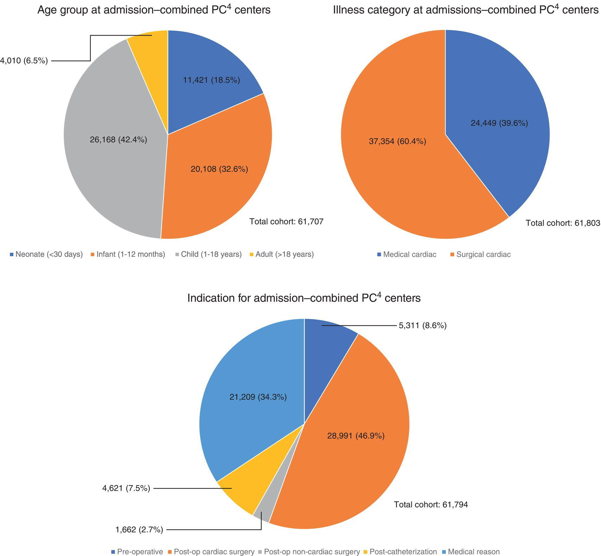
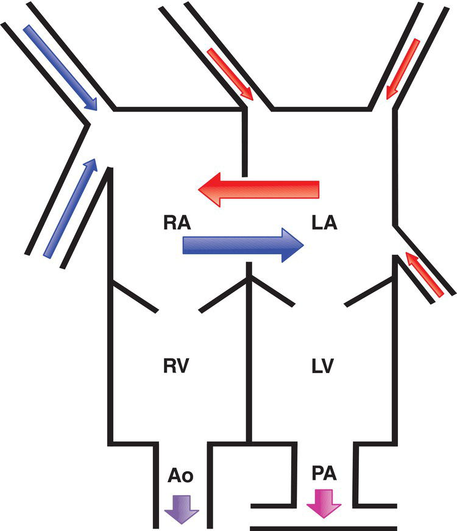
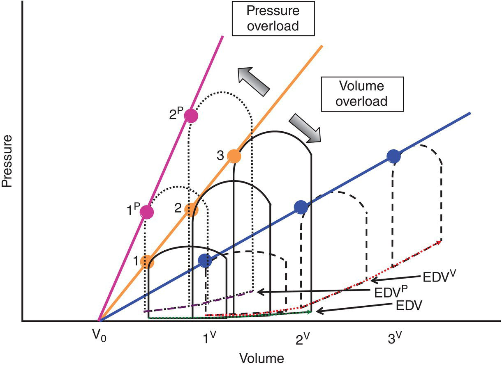
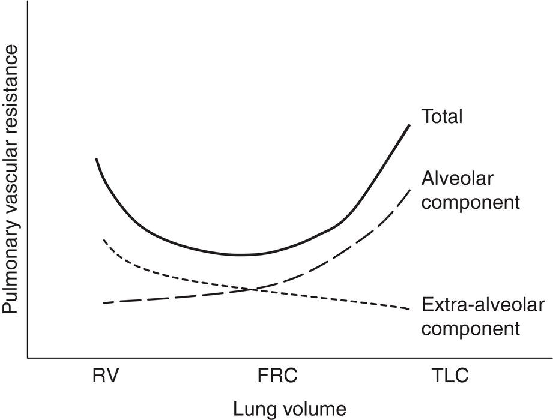
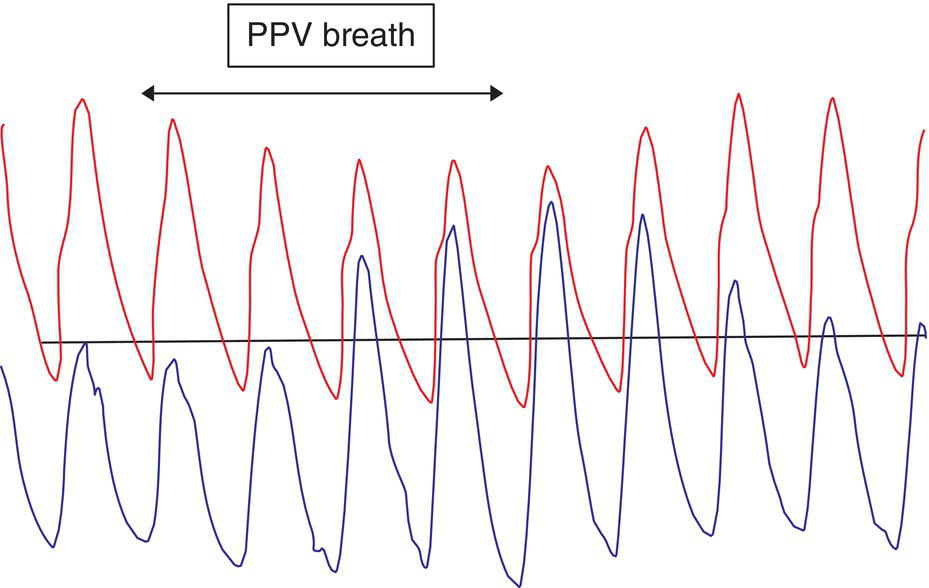
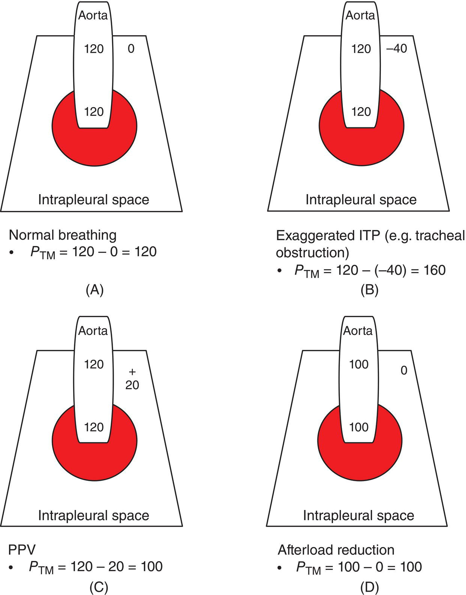
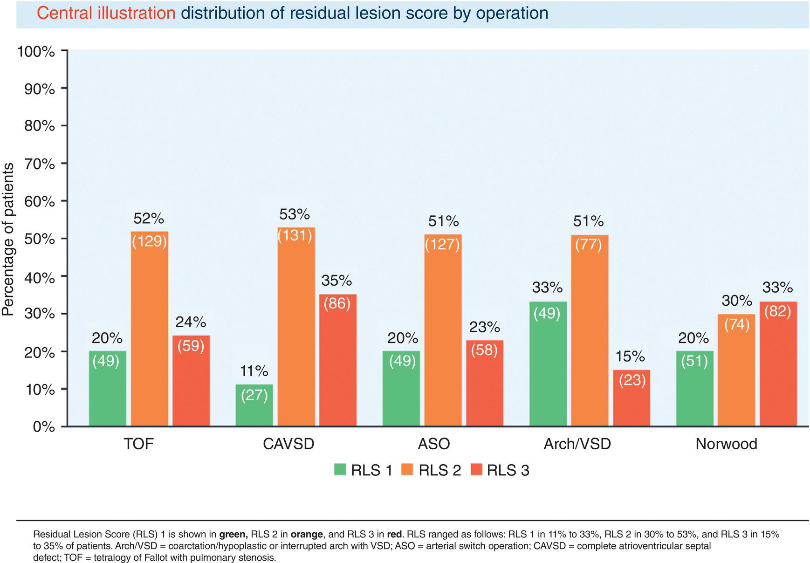
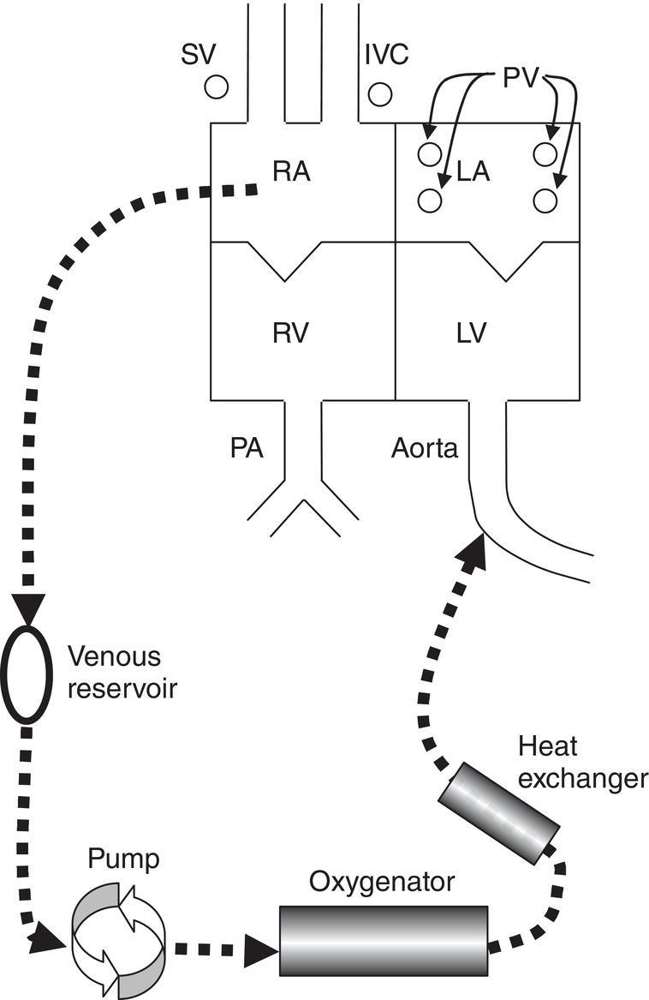
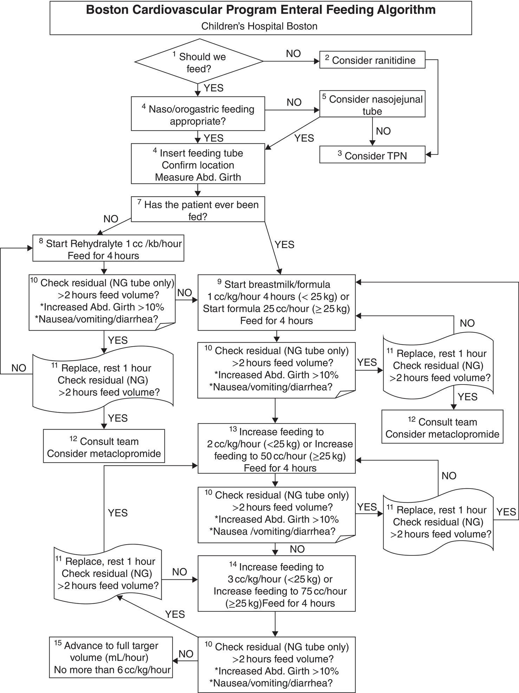
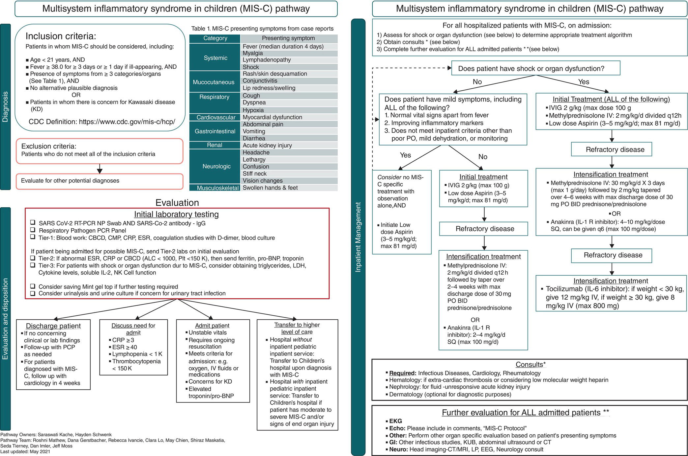

CHAPTER 36 Cardiac Intensive Care 

# CHAPTER 36  
Cardiac Intensive Care

_Gary Dhillon1, Elizabeth Herrup2, Paula Holinski3, Peter C. Laussen4, V. Ben Sivarajan5, Stephen J. Roth1, and Justin C. Yeh6_

1 Department of Pediatrics (Cardiology), Cardiovascular Intensive Care, Lucile Packard Children's Hospital Stanford, Stanford University School of Medicine, Palo Alto, CA, USA

2 Pediatric Cardiac Critical Care Medicine, UPMC Children’s Hospital of Pittsburgh, Pittsburgh, PA, USA

3 Department of Pediatric Anesthesia and Pediatric Cardiac Intensive Care, Stollery Children's Hospital, University of Alberta, Edmonton, Alberta, Canada

4 Harvard Medical School, Boston Children's Hospital, Boston, MA, USA

5 Pediatric Cardiac Intensive Care Unit, Division of Pediatric Critical Care, Department of Pediatrics, Faculty of Medicine and Dentistry, Stollery Children’s Hospital, University of Alberta, Edmonton, Alberta, Canada

6 Cardiac Intensive Care, Heart Institute UPMC Children’s Hospital of Pittsburgh, Department of Critical Care Medicine, University of Pittsburgh School of Medicine,, Pittsburgh, PA, USA

* * *

-   [**Introduction**](#head-2-349)
-   [**Pathophysiology of specific congenital cardiac defects and implications**](#head-2-350)
    -   [Intercirculatory mixing, complete mixing, and streaming](#head-3-623)
    -   [Shunts](#head-3-624)
    -   [Outflow obstruction](#head-3-625)
-   [**Airway and ventilation management**](#head-2-351)
    -   [Airway management](#head-3-626)
    -   [Mechanical ventilation](#head-3-627)
    -   [Cardiorespiratory interactions](#head-3-628)
    -   [Influence of lung volume](#head-3-629)
    -   [Influence of intrathoracic pressure](#head-3-630)
    -   [Positive end‐expiratory pressure](#head-3-631)
    -   [Alternative modes of ventilation and respiratory support](#head-3-632)
    -   [Early extubation](#head-3-633)
    -   [Weaning from mechanical ventilation](#head-3-634)
-   [**Myocardial dysfunction and hemodynamic monitoring**](#head-2-352)
    -   [Assessment of cardiac output](#head-3-635)
    -   [Surgical factors](#head-3-636)
    -   [Cardiopulmonary bypass and the systemic inflammatory response](#head-3-637)
    -   [Dysrhythmias](#head-3-638)
    -   [Low preload](#head-3-639)
    -   [High afterload](#head-3-640)
    -   [Decreased myocardial contractility](#head-3-641)
    -   [Delayed sternal closure](#head-3-642)
-   [**Cardiopulmonary resuscitation in the cardiac intensive care unit**](#head-2-353)
    -   [Prearrest phase: monitoring and event risk reduction](#head-3-643)
    -   [Arrest phase: no‐flow and low‐flow states](#head-3-644)
    -   [Postresuscitation phase: patient‐focused care](#head-3-645)
    -   [Postresuscitation phase: team debriefing](#head-3-646)
-   [**Management of postoperative complications**](#head-2-354)
-   [**Patient safety and quality improvement in the cardiac intensive care unit**](#head-2-355)
-   [**Mechanical support of the circulation**](#head-2-356)
    -   [Extracorporeal membrane oxygenation](#head-3-647)
    -   [Ventricular assist devices](#head-3-648)
-   [**Hemostasis**](#head-2-357)
-   [**Infection control**](#head-2-358)
-   [**Neurologic monitoring/assessment and complications**](#head-2-359)
-   [**Fluid management and renal dysfunction**](#head-2-360)
-   [**Nutrition and gastrointestinal complications**](#head-2-361)
-   [**SARS‐CoV‐2 infection and multisystem inflammatory syndrome in children**](#head-2-362)
-   [**Selected references**](#head-2-363)

* * *

## Introduction

The pediatric cardiac intensive care unit (CICU) serves as the primary destination for critically ill children with congenital and acquired heart disease. It provides an expert model of care by bringing the broad range of specific expertise to the bedside of every CICU patient. Ideally, this allows the cardiac intensivist to engage in collaborative and dynamic decision‐making that involves anesthesiologists, cardiac surgeons, interventionalists, imaging specialists, electrophysiologists, and heart failure/advanced cardiac therapies specialists, thus serving to provide highly effective and efficient care delivery to patients.

In contrast to general pediatric intensive care, the majority of CICU admissions are planned. With preoperative and precatheterization review and fetal echocardiography, it is possible and necessary to plan most admissions and their potential need for CICU resources. It is important to recognize that as survival outcomes have improved in children with congenital or acquired heart disease as a result of the current paradigms in management, the proportion of medical cardiac (MC) and unplanned CICU admissions will be expected to increase over time \[1, 2\].

Collaboration among CICUs and increased emphasis on quality improvement have significantly improved the outcomes of children with critical heart disease in the CICU setting. Efforts from multi‐institutional collaborations (e.g., the Pediatric Cardiac Critical Care Consortium \[PC4\], which currently has over 65 CICUs submitting data to its registry) has provided a better understanding of case‐mix and outcome variability among CICUs. [Figure 36.1](#c36-fig-0001) shows multi‐institutional data from PC4 summarizing CICU admissions by age group, illness category (MC, surgical cardiac \[SC\]), and admission indication from 2018 to 2020.

[**Figure 36.1**](#R_c36-fig-0001) Pediatric intensive care unit admission categories from all centers that contribute data to the Pediatric Cardiac Critical care Consortium (PC4), including 66 centers at time of data collection. Categories evaluated: age group, illness category, indication for admission. Timeframe: January 1, 2018 to December 31, 2020. PC4, Pediatric Cardiac Critical care Consortium.

(Source: Data obtained from the Pediatric Cardiac Critical care Consortium (PC4).)

## Pathophysiology of specific congenital cardiac defects and implications

A thorough understanding of the pathophysiology of congenital cardiac defects is essential when managing these patients in the CICU. This will influence not only the preoperative management strategy for stabilization and/or resuscitation prior to surgery, but also preparations for the impact of preexisting physiologies such as cyanosis, pressure overload, and volume overload on myocardial performance and recovery after surgery. Understanding the changes in physiology achieved intraoperatively in SC patients is equally important for identifying expectations and the anticipated course in the CICU. In the presence of hemodynamically‐significant residual intracardiac lesions after surgery, the accompanying alterations in pulmonary blood flow, systemic perfusion, and ventricular compliance may significantly affect recovery and length of stay (LOS) in the CICU.

### Intercirculatory mixing, complete mixing, and streaming

Confusing terminologies are often used interchangeably to describe common preoperative and postoperative physiologies. It is important for the care provider to understand the essential elements of the circulation in order to react appropriately to perturbations.

#### Intercirculatory mixing lesions

Patients with D‐transposition of the great arteries (D_‐_TGA) have parallel circulations: the deoxygenated systemic venous blood returns to the right ventricle (RV) and is ejected through the aorta while oxygenated pulmonary venous blood is returned to the left ventricle (LV) and is ejected into the pulmonary artery (PA) ([Figure 36.2](#c36-fig-0002)). Although the figure depicts simple transposition anatomy, transposition _physiology_ can occur with other anatomic defects such as “Taussig‐Bing” type double‐outlet right ventricle, where a subpulmonary position of the ventricular septal defect (VSD) and malposition of the great arteries create an unfavorable streaming pattern resulting in parallel intracardiac circulation similar to D‐TGA. Transposition _physiology_ is the term used for this parallel circulatory pattern where PA oxygen saturation is greater than the aortic oxygen saturation. Such a circulation is not compatible with survival over time unless there is adequate intercirculatory mixing allowing for the deoxygenated systemic venous blood into the pulmonary circulation (PA), as well as the oxygenated pulmonary venous blood into the systemic circulation (aorta) \[3\]. Although 25–50% of patients with D‐TGA have a VSD, the presence of a VSD does not guarantee adequate intercirculatory mixing, as mixing occurs most effectively at the atrial level. Newborns with D‐TGA, irrespective of whether they are diagnosed antenatally or postnatally, can present with profound cyanosis in the absence of respiratory distress due to inadequate mixing. Such patients should be transported to the CICU after commencing intravenous (IV) prostaglandin E1 (PGE1) to maintain a patent ductus arteriosus (PDA) as an additional location for mixing. After confirmation of the diagnosis of D‐TGA with a restrictive or intact atrial septum, a balloon atrial septostomy (BAS) can be performed at the bedside or in the cardiac catheterization laboratory to improve intercirculatory mixing and systemic oxygen delivery. If the atrial communication is restrictive, administration of usual therapies to improve pulmonary blood flow (e.g., supplemental oxygen, inhaled nitric oxide) are often detrimental if used as ongoing preoperative management strategies. These therapies can generate left atrial hypertension, leading to increasing pulmonary congestion and worsening pulmonary compliance with further impairment of atrial‐level mixing. Once an adequate atrial septal defect (ASD) is created, systemic oxygen delivery improves as mixing increases from left to right (saturated pulmonary to desaturated systemic) across the ASD. Subsequently, patients can have the PGE1 infusion discontinued and wean and extubate to await an elective repair with the arterial switch operation within the first week of life \[4\]. Some patients with D‐TGA may remain hypoxemic despite creation of an unrestrictive atrial communication; such patients are often dependent on PGE1 infusion in the preoperative period to maintain systemic saturations >65% \[5\]. The failure of adequate mixing at the atrial level may reflect not only differences in ventricular function, ventricular filling, and/or ventricular end‐diastolic pressures (ventricular compliance), but may also be secondary to unfavorable streaming effects. There may also be an element of rebound pulmonary hypertension from PGE1 discontinuation that reduces the volume of pulmonary blood flow without affecting the amount of intercirculatory mixing. Some investigators have suggested a protracted weaning protocol for PGE1 to mitigate this effect \[6\]. See [Chapter 29](c29.xhtml) for further discussion of D_‐_TGA.

[**Figure 36.2**](#R_c36-fig-0002) The anatomy and physiology of D‐TGA. The diagram shows the typical stable circulation in unoperated D‐TGA. The desaturated systemic venous (SV) blood (blue arrows) and fully saturated pulmonary venous (PV) blood (red arrows) require free mixing at the atrial level (often after a BAS) resulting in anatomically equivalent, left‐to‐right and right‐to‐left shunting. As a result, the saturations show the pattern where SVsat < Aosat < PAsat < PVsat. Ao, aorta; BAS, balloon atrial septostomy; D‐TGA, D‐transposition of the great arteries; LA, left atrium; LV, left ventricle; PA, pulmonary artery; RA, right atrium; RV, right ventricle; sat, O2 saturation.

#### Complete mixing lesions

Complete mixing lesions represent a variety of anatomic entities that have a common chamber where pulmonary and systemic venous return completely mix before exiting. The conventional terminology for this is _single ventricle physiology_ because it refers to a physiology in which the PA saturation and aortic saturation are equal. These lesions can have either ductal‐dependent pulmonary blood flow (e.g., tricuspid atresia, pulmonary atresia with intact ventricular septum, or pulmonary atresia with VSD) or ductal‐dependent systemic blood flow (e.g., hypoplastic left heart syndrome \[HLHS\], double‐inlet left ventricle \[DILV\]). Although the majority of these lesions will require a palliative single ventricle surgical strategy, some patients with single ventricle physiology have two anatomically‐adequate ventricles, allowing for an initial septation procedure (e.g., truncus arteriosus, tetralogy of Fallot \[TOF\] with pulmonary atresia). This is important when considering the systemic oxygen saturation (SaO2) targets in managing these patients. The traditional targets of SaO2 of 75–85%, partial pressure of O2 (PaO2) of 35–45 mmHg, mixed venous O2 (MvO2) saturation, and/or near‐infrared spectroscopy (NIRS) of 50–60%, along with oxygen extraction fraction of ~25% together with appropriate blood pressure for age, systemic vascular resistance (SVR) state, and adequate markers of end‐organ function (e.g., lactate level, urine output, clinical examination), are important when trying to balance pulmonary blood flow (_Q_p) and systemic blood flow (_Q_s) in a preoperative or postoperative patient with limited combined ventricular output. When combined ventricular output is not a limiting factor (e.g., preoperative patients with tricuspid atresia, those with truncus arteriosus), it is important to recognize that strict management of _Q_p/_Q_s balance is unnecessary in the absence of respiratory embarrassment or signs of inadequate systemic oxygen delivery (DO2). See [Chapter 30](c30.xhtml) for further discussion of single ventricle lesions.

#### Streaming

Streaming is the phenomenon where systemic venous blood (or pulmonary venous blood) can pass through to the systemic circulation (or pulmonary venous blood to the pulmonary circulation) due to specific anatomic abnormalities that result in an anatomic chamber that is common to both circulatory systems (e.g., a common atrium, the absence of common arterial septum, truncus arteriosus, double‐outlet right ventricle). This streamed blood may or may not be completely mixed before it reaches the arterial outlet. If it is incompletely mixed, the physiology is likely to be that of _transposition physiology_ (PAsat > Aosat), whereas streaming that is completely mixed will be _single ventricle physiology_ (PAsat = Aosat) \[3\].

### Shunts

Shunting between the pulmonary and systemic circulations can be intracardiac (across an ASD or a VSD) or extracardiac (across a PDA, aortopulmonary window, decompressing venovenous collaterals, aortopulmonary collateral, or arteriovenous malformation). Depending on the size of the communication and the differential pressures and resistances between the pulmonary and systemic circulations, patients may have decreased or increased pulmonary blood flow and may be either cyanotic or acyanotic, respectively.

#### Increased pulmonary blood flow

Shunts that increase pulmonary blood flow may occur either between the atria, ventricles, or the great arteries, and they can be simple or complex. The degree of restriction across these shunts also affects their potential clinical significance. The most common clinical signs seen with increased pulmonary blood flow are tachypnea, respiratory distress, tachycardia, difficulty feeding in neonates/infants, failure to thrive, and diaphoresis.

##### _Simple shunt_

The amount of flow across a “simple” left‐to‐right shunt depends on the size of the defect and the balance between pulmonary vascular resistance (PVR) and SVR. It is important to understand that this is a physiologic term and has no direct relationship to specific diagnoses ([Table 36.1](#c36-tbl-0001)). Therefore, patients who have a simple shunt may have:

1.  A normal SaO2 with two ventricles, such as a large VSD, complete atrioventricular canal (CAVC), and large PDA
2.  A normal SaO2 with a single ventricular outflow trunk and two ventricles (truncus arteriosus)
3.  A “low” SaO2 (80–95%) and two ventricles (D‐TGA with large VSD)
4.  A “low” SaO2 (75–85%) and single ventricle (tricuspid atresia or following a Blalock–Taussig (BT) shunt such as in a modified Norwood procedure).

If the simple shunt is “unrestrictive,” the physiologic consequence for all the above mentioned diagnoses will be the same, i.e. excessive pulmonary flow and volume overload to the ventricle receiving the increased pulmonary venous blood flow plus secondary respiratory embarrassment. The degree of shunt will be determined not by the size of the defect, but rather by the relationship between SVR and PVR \[7, 8\]. The clinical manifestation will also be the same, namely congestive heart failure (CHF) and pulmonary hypertension, although some patients will be cyanotic and others acyanotic, depending on the degree of intracardiac mixing and streaming.

On the other hand, for a simple “restrictive” shunt, when the orifice or size of the shunt is small, the size of the communication is the limiting factor determining the increase in pulmonary blow flow; relative SVR and PVR may have little or no impact in this situation. In this circumstance, there is minimal overload to the ventricle receiving pulmonary venous flow, and the pulmonary circulation is protected from excess pressure and flow; as a result, patients may be relatively asymptomatic and present at an older age with nonspecific symptoms such as recurrent respiratory infections or failure to thrive.

[**Table 36.1**](#R_c36-tbl-0001) Simple shunts: defects or surgical procedures contributing to an increased pulmonary blood flow/systemic blood flow (_Q_p/_Q_s)

|  | Acyanotic | Cyanotic |
| --- | --- | --- |
| Two ventricles | ASD | D‐TGA/VSD |
|  | VSD | PA/VSD |
|  | CAVC |  |
|  | DORV |  |
| Single ventricle |  | TA ± TGA |
|  |  | HLHS |
|  |  | DORV/MA |
|  |  | Norwood procedure |
|  |  | BT shunt |
| AP connection | PDA | PA/MAPCA |
|  | Truncus arteriosus |  |
|  | AP window |  |

AP, aortopulmonary; ASD, atrial septal defect; BT, Blalock–Taussig; CAVC, complete atrioventricular canal; D‐TGA, dextro‐transposition of the great arteries; DORV, double‐outlet right ventricle; HLHS, hypoplastic left heart syndrome; MA, mitral atresia; MAPCA, major aortopulmonary collateral artery; PA, pulmonary atresia; PDA, patent ductus arteriosus; TA, tricuspid atresia; VSD, ventricular septal defect.

##### _Complex shunt_

In the presence of additional pulmonary or systemic outflow obstruction, the ratio of pulmonary‐to‐systemic blood flow (_Q_p/_Q_s) is determined by the size of the orifice and the outflow gradient as well as SVR and PVR. The obstruction may be fixed (valvular aortic or pulmonary stenosis) or dynamic (some forms of TOF, tricuspid atresia with normally related great arteries and a dynamically restrictive muscular VSD).

#### Clinical consequences of increased pulmonary‐to‐systemic blood flow ratio

If the increase in pulmonary blood flow and pressure persist over months to years, structural changes occur within the pulmonary vasculature until eventually PVR becomes irreversibly elevated \[7–9\]. The time course for developing this pathology, termed pulmonary vascular obstructive disease (PVOD), depends in part on the degree of volume overload to the pulmonary circulation, degree of pressure overload to the pulmonary circulation, exposure of the pulmonary vascular bed to cyanosis, and duration of exposure to these factors in the setting of a shunt \[10\]. Changes may be evident by 4–6 months of age in some lesions (e.g., large VSD or CAVC). The progression can be more rapid when the volume and pressure overload to the pulmonary circulation are increased, such as with truncus arteriosus. When pulmonary blood flow is increased in the absence of pressure overload, such as in simple secundum ASD, PVOD typically develops much more slowly, if at all during childhood.

As PVR decreases in the first days to weeks after birth, and the hematocrit falls to its lowest physiologic value, the increased left‐to‐right shunt and anemia‐related high‐output state result in volume loading on the systemic ventricle along with CHF. A typical pressure–volume loop for a volume‐loaded ventricle is shown in [Figure 36.3](#c36-fig-0003). The end‐diastolic volume is increased and the end‐diastolic pressure–volume line displaced to the right indicating reduced contractility. The time course over which irreversible ventricular dysfunction develops is variable, but if surgical/catheter intervention to correct the volume overload is undertaken within the first 2 years of life, residual dysfunction is uncommon \[11\]. The volume load on the systemic ventricle and increased end‐diastolic pressure contribute to increased pulmonary edema by increasing pulmonary venous and lymphatic pressures. Decreased lung compliance and increased airway resistance occur secondary to small airways compression by distended vessels \[12, 13\]. This manifests clinically in infants with both tachypnea and increased work of breathing. If tracheally intubated for mechanical ventilation, the lungs may feel stiff on hand ventilation, deflate slowly, and exhibit an obstructive pattern; poor compliance may be apparent during mechanical breaths.

Besides cardiomegaly on chest radiograph, the lung fields are usually congested and hyperinflated. Ventilation/perfusion mismatch contributes to an increased alveolar‐to‐systemic arterial (A‐aO2) gradient and dead space ventilation \[14\]. Minute ventilation is, therefore, increased, primarily by an increase in respiratory rate. PA and left atrial enlargement may compress mainstem bronchi causing lobar collapse. PA and left atrial dilation may be seen on chest radiograph in the form of widening at the hilum from PA contour enlargement and upward splaying of the left mainstem bronchus from distortion due to left atrial dilation. Furthermore, tachycardia, increased fussiness/agitation, and poor weight gain may be seen secondary to increased myocardial oxygen demand in response to pulmonary overcirculation and ventricular volume loading.

It is important to appreciate that such clinical scenarios can be present even after surgery in patients who have significant residual intracardiac shunts that cause an increase in _Q_p/_Q_s. This may manifest during the early postoperative course as low cardiac output syndrome (LCOS) (see the “Myocardial Dysfunction and Hemodynamic Monitoring” section) or become apparent some days after surgery with an inability to wean from mechanical ventilation or a persistent requirement for vasoactive support.

#### Decreased pulmonary blood flow

Reductions to pulmonary blood flow from structural heart disease are ultimately related to intracardiac right‐to‐left shunting. The basis for this may be pulmonary outflow obstruction (supravalvar, valvar, subvalvar, or a combination of these), subpulmonary ventricle inflow obstruction (tricuspid stenosis or atresia), or the inability to generate adequate antegrade pulmonary blood flow (Ebstein anomaly, tricuspid valve dysplasia). In patients with noncardiac diseases, such as persistent pulmonary hypertension of the newborn (PPHN), sustained elevations in PVR result in intracardiac (or ductal) right‐to‐left shunting.

Pulmonary mechanics and lung volumes are generally normal in patients with reduced pulmonary blood flow. Dead space ventilation is increased, although minute ventilation is only slightly increased to maintain normocapnia, and the A‐aO2 gradient may be increased as well. The lung fields appear oligemic on chest radiograph. Some patients may have impairments in pulmonary mechanics due to anatomic interactions between cardiovascular structures and the tracheobronchial tree. One such group are patients with TOF and absent pulmonary valve (APV) syndrome who can have massively dilated branch PAs; in the setting of a freely regurgitant pulmonary valve orifice, the RV and branch PAs become volume loaded and dilate, leading to compression of the large and small airways. These patients have significant gas‐trapping and expiratory flow limitations, which is a frequent cause of their respiratory failure. Surgical repair during the newborn period is often required to treat respiratory failure in this scenario. Often in neonates with TOF with APV, early prone positioning with positive pressure ventilation (PPV) is required to alleviate bronchial compression and achieve adequate gas exchange; however, emergent sternotomy in unrepaired patients may still be required in some cases to alleviate airway compression despite mechanical ventilation and proning \[15, 16\].

[**Figure 36.3**](#R_c36-fig-0003) Pressure–volume relationships. In a gradual afterload increase on a ventricle that can compensate (orange line moving from 1 to 3), the stroke volume is maintained at the cost of higher intracavitary pressure (wall stress) and lower ejection fraction. Generally, this does not require a higher EDP (dotted green line). In the failing myocardium (blue line), stroke volume can only be maintained (initially) at a higher EDP (dotted red line); ultimately stroke volume will be compromised (moving from 1v to 3v). An acute afterload increase on a ventricle (pink line) results in a lower stroke volume (moving from 1 to 1P to 2P), despite compensatory mechanisms to augment stroke volume with a higher EDP (dotted purple line). EDP, end‐diastolic pressure; EDV, end‐diastolic volume.

#### Target systemic oxygen saturation level

The postoperative target SaO2 level is important to establish, as it will guide assessment and therapeutic intervention ([Table 36.2](#c36-tbl-0002)). Potential causes of abnormally low SaO2 include:

1.  Pulmonary venous desaturation (normal is 95–99% in ambient air) indicating an intrapulmonary shunt secondary to primary pulmonary pathology (e.g., alveolar edema/consolidation or pleural effusion)
2.  A reduction in effective pulmonary blood flow, such as from pulmonary outflow obstruction, reduced aortopulmonary shunt flow from mechanical obstruction, increased PVR, intracardiac right‐to‐left shunt, or decompressing venovenous collaterals (e.g., from a high‐pressure superior vena cava to the inferior vena cava in a Glenn circulation)
3.  A reduction in arterial oxygen content (CaO2), principally in patients who have mixing of systemic and pulmonary venous blood at the atrial‐level or single ventricle physiology. The reduction in CaO2 may be due to low MvO2 level (such as reduced oxygen delivery due to impaired cardiac output or increased oxygen extraction) or a low oxygen carrying capacity (reduced hematocrit).

### Outflow obstruction

Severe LV or RV outflow obstruction in the newborn may be associated with ventricular hypertrophy and vessel hypoplasia distal to the level of obstruction. If there is complete or near‐complete outflow obstruction, mixing or shunting at the ASD and/or VSD level is required to maintain systemic cardiac output (CO) with adequate arterial oxygen content.

A typical pressure–volume loop from a chronic pressure load on the ventricle is shown in [Figure 36.3](#c36-fig-0003). The end‐diastolic pressure is elevated and the end‐systolic pressure volume line is shifted to the left, reflecting increased contractility in the compensated state (purple line), with an upwards shift along the new slope reflecting a higher afterload state (from 1P to 2P). Maintenance of preload, stability in afterload, adequate contractility, and normal sinus rhythm are important to prevent a fall in CO or coronary hypoperfusion in states of increased ventricular afterload. Since the time course to develop significant ventricular dysfunction is longer in patients with chronic pressure overload compared to chronic volume overload, symptoms of CHF are uncommon, unless obstruction is severe or prolonged.

[**Table 36.2**](#R_c36-tbl-0002) Factors to consider in a postoperative cardiac surgery patient with an arterial oxygen saturation lower than the anticipated range

| Etiology | Considerations |
| --- | --- |
| Low FiO2 | Inappropriately low‐set oxygen concentration for delivery  
Failure of oxygen delivery device |
| Pulmonary vein desaturation | Impaired diffusion  
Alveolar process: edema, infection  
Restrictive process: effusion, atelectasis, pneumothorax  
Intrapulmonary shunt  
RDS  
Pulmonary AVM  
PA‐to‐PV collateral vessel(s) |
| Reduced pulmonary blood flow | Anatomic RV outflow obstruction  
Anatomic pulmonary artery stenosis  
Increased PVR  
Atrial‐level right‐to‐left shunt  
RV hypertension  
Restrictive RV physiology (low compliance)  
Severe tricuspid regurgitation  
Large fenestration (modified Fontan operation)  
Intra‐atrial baffle leak  
Reduced aorta pulmonary shunt flowVentricular‐level right‐to‐left shunt  
RV hypertension and residual VSD |
| Low dissolved O2 content (SV and TGA physiology) | Low mixed venous oxygen level  
Increased O2 extraction: hypermetabolic state  
Decreased O2 delivery: low cardiac output state  
Anemia |

AVM, arteriovenous malformation; FiO2, fractional inspired concentration of oxygen; O2, oxygen; PA, pulmonary artery; PV, pulmonary vein; PVR, pulmonary vascular resistance; RDS, respiratory distress syndrome; RV, right ventricle; SV, single ventricle; TGA, transposition of the great arteries; VSD, ventricular septal defect.

In the immediate postoperative period, it is important to evaluate both systolic and diastolic ventricular function in a previously obstructed but still hypertrophied ventricle.

1.  A hyperdynamic state may be present following LV outflow reconstruction. This will be manifest by systemic hypertension and should be treated promptly to reduce myocardial work and protect surgical suture lines, especially those in the aorta.
2.  Systolic dysfunction of a hypertrophied ventricle may be apparent early after cardiac surgery secondary to myocardial ischemia and ventricular dysrhythmias. Ischemia may occur particularly if there has been a long aortic cross‐clamp time, inadequate myocardial protection with cardioplegia solution, or hypothermia. In the case of the RV, dysfunction may be related to a right ventriculotomy, direct injury to a coronary artery (e.g., a conal branch running across the RV outflow tract), air embolism, or due to inadequate myocardial protection with cardioplegia, hypothermia, or local cooling strategies. This should be evaluated and treated in the postoperative period with inotropic and/or inodilator support (i.e., dopamine or epinephrine, milrinone, and nitric oxide in the case of the RV). The evaluation of ventricular function includes echocardiography and potentially cardiac catheterization to assess hemodynamics and investigate potential coronary complications that may require reintervention.
3.  Diastolic dysfunction is usually manifest as a poorly compliant or stiff ventricle that is hypertrophied. It may contract well, but it is unable to relax and fill effectively during diastole. On the left side of the heart, this is usually manifest as left atrial hypertension with either pulmonary edema, atrial dysrhythmias, or pulmonary hypertension. On the right side of the heart, an increase in RV end‐diastolic pressure is demonstrated by right atrial hypertension and elevated central venous pressures along with clinical signs such as atrial arrhythmias, lower SaO2 from a right‐to‐left shunt (e.g., across a patent foramen ovale \[PFO\] or ASD), hepatomegaly, diffuse edema (especially in neonates), pleural effusions, and ascites. In the postoperative period, patients with diastolic dysfunction may benefit from lusitropic agents (e.g., milrinone) to improve myocardial relaxation, are typically dependent on adequate preload to maintain sufficient CO, do not tolerate aggressive diuresis because of preload dependency, and may not tolerate rapid volume resuscitation due to the inability of the noncompliant ventricle to accept a large increase in intravascular volume. Patients with RV diastolic dysfunction (e.g., TOF) may benefit from early tracheal extubation, as PPV can increase RV afterload and hinder RV preload. Significant and untreated postoperative tachycardia in this population can also lead to a limitation in CO and increase in myocardial oxygen consumption.

* * *

### KEY POINTS: PATHOPHYSIOLOGY

-   Newborns with CHD may present with cyanosis or shock. This may result from transposition physiology (PAsat > Aosat) or single ventricle physiology (PAsat = Aosat) depending on the balance of mixing, streaming, and shunting.
-   As PVR drops in the first few days and weeks of life, CHF may develop in children with large left‐to‐right shunts.
-   Hypoxemia in single ventricle patients may develop from pulmonary venous desaturation, systemic venous desaturation, inadequate pulmonary blood flow, or suboptimal oxygen carrying capacity.

* * *

## Airway and ventilation management

In all of the examples of mixing, shunting, and outflow obstruction described earlier, the mode and method of mechanical ventilation may have a substantial impact on hemodynamics and systemic perfusion. Particularly for neonates and infants, cardiorespiratory interactions are essential to recognize during postoperative management. While changes in the PaO2, partial pressure of carbon dioxide (PaCO2), and pH are well recognized to affect PVR, the mean airway pressure and changes in lung volume during PPV will also affect PVR, preload, and ventricular afterload. In addition to evaluating the adequacy of mechanical ventilation settings by arterial blood gas and chest radiography, it is important that ventilator settings be continually evaluated and adjusted according to hemodynamic response.

### Airway management

Intubation of the trachea in a neonate or young infant with CHD may elicit undesirable hemodynamic and metabolic responses. Appropriate anesthetic techniques are thus desirable to secure the airway.

Traditionally, uncuffed endotracheal tubes (ETTs) were recommended for children younger than 8 years given the narrowest part of the airway is at the level of the cricoid cartilage. However, more recent studies suggest there is no difference between airway complications with cuffed and uncuffed tubes, particularly in the era of microcuff tubes (high‐volume, low‐pressure cuff) \[17, 18\]. If a significant air leak exists around the ETT, lung volume, and in particular functional residual capacity (FRC), will not be maintained and fluctuations in gas exchange can occur. During the ventilator weaning process, a significant leak will also increase the work of breathing for some neonates and infants. In these situations, it is, therefore, preferable to exchange the ETT for a larger‐sized tube or to change to a cuffed tube. In contrast, an ETT that is smaller than usual may be necessary in certain situations. This is particularly the case in patients with other congenital defects such as Down syndrome (trisomy 21). Tracheal stenosis may also occur in association with some congenital cardiac defects such as a PA sling. Extrinsic compression of the bronchi may occur by the PA or a dilated left atrium. This may be suspected by persistent hyperinflation or lobar atelectasis on a chest radiograph.

### Mechanical ventilation

Altered lung mechanics and ventilation/perfusion abnormalities are common problems in the immediate postoperative period \[14\]. Patients who have _Q_p/_Q_s > 2 : 1 may have cardiomegaly and congested lung fields on chest radiograph. Patients who have an elevated left atrial pressure may demonstrate signs of pulmonary venous hypertension and pulmonary edema. Additional considerations include the surgical incision and lung retraction, increased lung water following cardiopulmonary bypass (CPB), possible pulmonary reperfusion injury, CPB‐induced surfactant depletion in neonates, and restrictive defects from atelectasis and pleural effusions.

In general, patients with limited physiologic reserve should not be weaned from mechanical ventilation until hemodynamically stable and any problems contributing to an increase in intrapulmonary shunt and altered respiratory mechanics have improved.

### Cardiorespiratory interactions

Cardiorespiratory interactions vary significantly between patients and throughout the postoperative course. Consequently, the mode of ventilation must be matched to the hemodynamic status of each patient to achieve an adequate CO and gas exchange. The influence of PPV on preload and afterload is shown in [Table 36.3](#c36-tbl-0003). Frequent modifications to the mode and pattern of ventilation may be necessary during recovery after surgery, with attention to changes in lung volume, compliance, and airway pressure.

### Influence of lung volume

Changes in lung volume have a major effect on PVR, which is lowest at FRC. Both atelectasis and hyperinflation may result in a significant increase in PVR, as shown in [Figure 36.4](#c36-fig-0004) \[19–21\]. At low‐tidal volumes, alveolar collapse occurs because of reduced interstitial traction on alveolar septae. In addition, radial traction on extra‐alveolar vessels such as the branch PAs is reduced, therefore reducing the cross‐sectional diameter. Conversely, hyperinflation of the lung may cause stretching of the alveolar septae and compression of alveolar vessels.

An increase in PVR increases the afterload or wall stress on the RV, compromising RV function and contributing to decreased LV compliance secondary to interventricular septal shift (from right to left). In addition to low CO, signs of RV dysfunction, including tachycardia, tricuspid regurgitation, hepatomegaly, ascites, and pleural effusions, may be observed.

[**Table 36.3**](#R_c36-tbl-0003) Effect of a positive pressure mechanical breath on afterload and preload to the pulmonary and systemic ventricles

|  | Afterload | Preload |
| --- | --- | --- |
| Pulmonary ventricle | Elevated  
Effect: ↑ RVEDp  
↑RVp  
↓Antegrade PBF  
↑ PR and/or TR | Reduced  
Effect: ↓ RVEDV  
↑ RAp |
| Systemic ventricle | Reduced  
Effect: ↓ LVEDp  
↓ LAp  
↓ Pulmonary edema | Reduced  
Effect: ↓ LVEDV  
↓ LAp  
Hypotension |

LAp, left atrial pressure; LVEDp, left ventricle end‐diastolic pressure; LVEDV, left ventricle end‐diastolic volume; PBF, pulmonary blood flow; PR, pulmonary regurgitation; RAp, right atrial pressure; RVEDp, right ventricle end‐diastolic pressure; RVEDV, right ventricle end‐diastolic volume; RVp, right ventricle pressure; TR, tricuspid regurgitation.

[**Figure 36.4**](#R_c36-fig-0004) Lung volume impacts pulmonary vascular resistance. In the diagram above, there is a marked decrease in pulmonary vascular resistance when lung volume increases from RV (residual volume) to FRC (functional residual capacity). This is primarily a function of alveoli strutting open extra‐alveolar vessels as they are expanded (drop in extra‐alveolar resistance; dotted line). Further increases in lung volume from FRC to TLC (total lung capacity) cause increases in pulmonary vascular resistance. This is mainly due to compression of intra‐alveolar vessels by air‐trapping (alveolar component; dashed line). Total pulmonary vascular resistance is minimized at FRC (solid line).

### Influence of intrathoracic pressure

An increase in mean intrathoracic pressure during PPV decreases preload to both pulmonary and systemic ventricles, but has opposite effects on afterload of each ventricle \[22–24\].

#### Right ventricle

The increase in pressure in the right atrium and reduction in RV preload that occurs with PPV may reduce CO. Normally, RV diastolic compliance is high and the pulmonary circulation is able to accommodate changes in flow without a large change in pressure. An increase in mean intrathoracic pressure increases the afterload on the RV from direct compression of extra‐alveolar and alveolar pulmonary vessels. This has a number of clinical consequences ([Table 36.3](#c36-tbl-0003)). An increase in afterload causes an increase in RV end‐diastolic pressure and myocardial work, which may lead to myocardial ischemia in a patient with limited coronary perfusion. An example of the increase in RV pressure during a positive pressure breath is demonstrated in [Figure 36.5](#c36-fig-0005).

Patients with normal RV compliance and no residual volume or pressure load on the ventricle following surgery usually show little change in RV function from the alteration in preload and afterload that occurs with PPV. However, these effects can be magnified in patients with RV hypertrophy and those with restrictive RV physiology. At particular risk are neonates requiring a right ventriculotomy for repair of TOF with pulmonary atresia or truncus arteriosus; concentric RV hypertrophy poses additional risk. While systolic RV function may be preserved in these situations, the ventricle often demonstrates diastolic dysfunction with increased RV end‐diastolic pressure and impaired RV filling.

[**Figure 36.5**](#R_c36-fig-0005) Positive pressure ventilation effects on the right ventricle. Simultaneous tracings of aortic (red) and right ventricle (blue) pressure waveforms during positive pressure ventilation (PPV) in a child with pulmonary artery stenosis. Note the increase in right ventricular pressure to approximately systemic (aortic) level during mechanical inspiration when the afterload on the right ventricle is increased.

It is important to emphasize the potentially deleterious effects of mechanical ventilation on RV function. The aims should be to ventilate with a mode that enables the lowest possible mean airway pressure while maintaining adequate lung volume and limiting potential secondary injury to the lung. In patients with lung disease, such as pneumonia, adult respiratory distress syndrome, or lung disease of prematurity, a low tidal volume strategy (4–6 mL/kg) using a low peak inspiratory pressure, short inspiratory time, increased intermittent mandatory ventilation (IMV) rate, and higher levels of positive end‐expiratory pressure (PEEP) is recommended. However, this strategy is also associated with a higher mean intrathoracic pressure and afterload on the RV, which reduces antegrade pulmonary blood flow. In contrast, a strategy utilizing larger tidal volumes (10–12 mL/kg), lower IMV rates (15–20 breaths/min), and larger peak inspiratory pressure–PEEP difference with a shorter inspiratory time (0.4–0.5 seconds) may be preferential in patients with restrictive RV.

#### Left ventricle

LV preload is also affected by lung volume. Pulmonary blood flow and, therefore, preload to the systemic ventricle may be reduced by an increase or decrease in lung volume secondary to alteration in radial traction on alveolar and extra‐alveolar vessels.

The systemic arteries are under higher pressure and not exposed to radial traction effects during inflation or deflation of the lungs. Therefore, changes in lung volume will affect LV preload, but the effect on afterload is dependent on changes in intrathoracic pressure alone.

In contrast to the RV, a major effect of PPV on the LV is a reduction in afterload. Using the law of Laplace, wall stress is directly proportional to the transmural LV pressure and the radius of curvature of the LV and inversely proportional to the thickness of the ventricle. The transmural pressure across the LV is the difference between the intracavity LV pressure and the surrounding intrathoracic pressure. Assuming a constant arterial pressure and ventricular dimension, an increase in intrathoracic pressure, as occurs during PPV, will reduce the transmural gradient and, therefore, wall stress on the LV ([Figure 36.6](#c36-fig-0006)). Therefore, PPV and PEEP can have significant beneficial effects in patients with LV systolic dysfunction or failure ([Table 36.3](#c36-tbl-0003)).

Patients with LV dysfunction with an increased end‐diastolic volume and pressure can have impaired pulmonary mechanics secondary to increased lung water, decreased lung compliance, and increased airway resistance. The work of breathing is increased, and neonates can fatigue early because of their limited respiratory reserve. A significant proportion of total body oxygen consumption is directed at the increased work of breathing (especially the diaphragm) in neonates and infants with LV dysfunction, contributing to poor feeding and failure to thrive. Therefore, PPV has an additional benefit in patients with significant volume overload and systemic ventricular dysfunction by reducing the work of breathing and oxygen demand.

### Positive end‐expiratory pressure

The use of PEEP in patients with CHD has two important effects: recruiting FRC and O2 reserve capacity and redistributing lung water from alveolar septal regions to the more compliant perihilar regions. Gas exchange is improved, and the work of breathing reduced. This is particularly important in patients with a volume load, ventricular dysfunction, and elevated end‐diastolic volume. PEEP should, therefore, be used in all mechanically ventilated patients following congenital heart surgery. However, excessive levels of PEEP can be detrimental by increasing afterload on the RV. Usually 3–5 cmH2O of PEEP will help maintain FRC and redistribute lung water without causing hemodynamic compromise.

The use of PPV and PEEP in patients who have undergone either a Glenn or Fontan procedure (cavopulmonary anastomosis) has also been debated. In this group of patients, pulmonary blood flow is nonpulsatile and depends on the pressure gradient between the superior vena cava and the pulmonary venous atrium. During PPV, pulmonary blood flow can be diminished, and during a Valsalva maneuver and at high levels of PEEP, retrograde pulmonary blood flow may be demonstrated by Doppler echocardiography. Nevertheless, the beneficial effects of using low‐pressure PPV and PEEP to achieve desired lung volume, minute ventilation and gas exchange following the Fontan procedure are apparent at the bedside. This strategy rarely contributes to a clinically significant decrease in effective pulmonary blood flow and, in fact, may be more than offset when compared to the elevations in PVR related to a strategy of low‐volume spontaneous ventilation \[25, 26\].

### Alternative modes of ventilation and respiratory support

The use of high‐frequency oscillatory ventilation (HFOV) has been beneficial in the management of hypoxemic and hypercapneic respiratory failure where the goal is to optimize systemic oxygen delivery while minimizing lung injury. The mean airway pressure may be higher than when using conventional ventilation, but can be well tolerated hemodynamically, provided preload is maintained. There is no defined and agreed‐upon indication for HFOV in the literature, but it should be considered in the setting of ventilatory failure with a rising PaCO2 and mean airway pressures >14 cmH2O in neonates and >16 cmH2O in older children using conventional ventilator modes. Recent data using propensity matching suggest that HFOV might reduce the length of ventilation after CHD surgery in neonates and infants \[27\].

[**Figure 36.6**](#R_c36-fig-0006) Transmural aortic pressure affects left ventricular afterload. By the law of Laplace, the transmural aortic pressure (_P_TM) is affected by intrapleural pressure. During normal breathing (A), there is very little effect of the intrapleural pressure on _P_TM and thus left ventricular afterload. Generation of pathologic degrees of negative intrapleural pressure (as with severe airway obstruction or decompensated heart failure) significantly increases left ventricular afterload (B). Provision of positive pressure ventilation (PPV) (C) or pharmacologic afterload reduction (D) can both independently reduce left ventricular afterload. ITP, intrathoracic pressure.

Noninvasive ventilation (NIV) using either mask CPAP, bilevel positive airway pressure (PAP), or high‐flow nasal cannula (HFNC) can be a helpful adjunct in patients who are tachypneic with an increased work of breathing and those requiring improved oxygenation through maintenance of FRC. In addition, it can potentially improve CO and ventricular function by reducing wall stress and afterload. NIV also avoids the attendant risk of endotracheal intubation, including escalating sedation requirements and ventilator‐associated pneumonia and tracheitis \[28\].

HFNC with humidified oxygen at flow rates of between 3 and 10 L/min can be used to help minimize work of breathing and caloric expenditure in patients recently weaned from mechanical ventilation and/or those awaiting surgery. Although the PEEP delivered through this mode is variable, this mode is a helpful adjunct, especially in small patients with resting lung volumes approaching closing capacity \[29\].

### Early extubation

Early extubation, generally defined as extubation within 6 hours of surgery, has been described for various cardiac lesions. Possible advantages of this strategy include fewer pulmonary complications, reduced sedative and analgesic use, shorter ICU and hospital LOS, and reduced resource utilization. Early extubation can be especially beneficial in patients with restrictive RV physiology or absent subpulmonary ventricle (cavopulmonary connection with the Fontan procedure). Some centers have employed collaborative learning models to develop clinical guidelines for early extubation practices. Although this improved rates of early extubation, ICU LOS did not change \[30\]. One notable exception is in the Fontan patient; not only will spontaneous ventilation improve pulmonary blood flow and CO, fast‐track extubation in the operating room (OR) is an important predictor of postoperative LOS \[31, 32\]. Furthermore, rates of successful early extubation vary across institutions, but increased specialized nursing in the CICU may improve outcomes \[33\]. NIV, including HFNC or PAP, has also been utilized, particularly in high‐risk, postcardiac surgical patients, to mitigate the risk of extubation failure. However, there is limited evidence regarding NIV utilization in pediatric CICUs to inform best practice \[34\].

### Weaning from mechanical ventilation

Weaning from mechanical ventilation is a dynamic process that requires continued reevaluation. While most patients following uncomplicated congenital cardiac surgery will wean without difficulty, some patients with borderline cardiac function and/or residual defects may require prolonged mechanical ventilation and a slow weaning process. As spontaneous ventilation increases during the weaning process, swings in mean intrathoracic pressure may substantially alter afterload on the systemic ventricle. The transition to spontaneous ventilation may cause a sudden increase in wall stress, which then contributes to an increase in end‐diastolic pressure and volume, leading to pulmonary edema and low CO. Inotropic agents, vasodilators, and diuretics should be continued throughout the ventilator weaning process and early after extubation to maintain stable ventricular function as mechanical respiratory support is reduced.

The method of weaning is variable. Most patients can be weaned using either a volume‐limited or pressure‐limited mode by simply decreasing the IMV rate. Guided by physical examination, hemodynamic criteria, respiratory pattern, and arterial blood gas measurements, the mechanical ventilator rate is gradually reduced. Patients with limited hemodynamic and respiratory reserve may demonstrate tachypnea, diaphoresis, and reduced tidal volumes as they struggle to breathe spontaneously against the resistance of the ETT. The addition of pressure‐ or flow‐triggered pressure or volume support breaths above PEEP at a level related to the size of the ETT decreases this resistance and is often beneficial in reducing the work of breathing.

A flow‐triggered mode of pressure or volume support, with a backup ventilator rate if the patient becomes apneic (assist‐control mode), is particularly useful for neonates and infants who received prolonged ventilation following surgery or have a residual volume or pressure load compromising ventricular function. Patients are often more comfortable weaning in this mode and have reduced work of breathing; the level of pressure support is adjusted according to their gas exchange, respiratory rate, and tidal volume.

Numerous factors can contribute to the inability to wean from mechanical ventilation following congenital heart surgery ([Table 36.4](#c36-tbl-0004)). As a general rule, however, suspected residual defects causing either a volume or pressure load must be excluded first by echocardiography or cardiac catheterization.

#### Restrictive defects

Pulmonary edema, pleural effusions, and persistent atelectasis may delay weaning from mechanical ventilation. Residual chest and abdominal wall edema, ascites, and hepatomegaly can each limit chest wall compliance and diaphragmatic excursion. Chest tubes and peritoneal catheters may be necessary to drain pleural effusions and ascites, respectively.

[**Table 36.4**](#R_c36-tbl-0004) Factors contributing to the inability to wean from mechanical ventilation after congenital heart surgery

<table border="1"><tbody class="tdcolor2"><tr><td class="left"><b>Residual cardiac defects</b><ul id="c36-list-0005"><li id="c36-li-0014">Volume and/or pressure overload</li><li id="c36-li-0015">Myocardial dysfunction</li><li id="c36-li-0016">Arrhythmias</li></ul> <b>Restrictive pulmonary defects</b><ul id="c36-list-0006"><li id="c36-li-0017">Pulmonary edema</li><li id="c36-li-0018">Pleural effusion</li><li id="c36-li-0019">Atelectasis</li><li id="c36-li-0020">Pneumothorax</li><li id="c36-li-0021">Chest wall edema</li><li id="c36-li-0022">Phrenic nerve injury</li><li id="c36-li-0023">Ascites</li><li id="c36-li-0024">Hepatomegaly</li></ul> <b>Airway</b><ul id="c36-list-0007"><li id="c36-li-0025">Subglottic edema and/or stenosis</li><li id="c36-li-0026">Retained secretions</li><li id="c36-li-0027">Vocal cord injury</li><li id="c36-li-0028">Extrinsic bronchial compression</li><li id="c36-li-0029">Tracheobronchomalacia</li></ul> <b>Metabolic</b><ul id="c36-list-0008"><li id="c36-li-0030">Inadequate nutrition</li><li id="c36-li-0031">Diuretic therapy</li><li id="c36-li-0032">Sepsis</li><li id="c36-li-0033">Stress response</li></ul></td></tr></tbody></table>

If atelectasis persists, bronchoscopy is often useful to remove obstructive secretions and to diagnose any extrinsic compression from enlarged PAs, a dilated left atrium, or conduits. Patients rarely fail from mild mechanical or dynamic airway compression alone and often have contributory residual lesions \[35\].

Phrenic nerve injury can occur during cardiac surgery secondary to traction, thymic resection, thermal injury from electrocautery, or direct transection as a complication of extensive aortic arch and pulmonary hilar dissection. Diaphragmatic paresis (no motion) or paralysis (paradoxical motion) should be investigated in any patient who fails to wean and extubate successfully \[36\]. Increased work of breathing, abnormal respiratory mechanics, increased PaCO2, and/or an elevated hemidiaphragm on chest radiograph following extubation (i.e., off positive pressure support) are all consistent with diaphragmatic dysfunction. Ultrasonography or fluoroscopy is used to confirm abnormal diaphragmatic movement. For an accurate diagnosis, these imaging investigations must be performed off positive pressure support. Additional discussion of airway management, ventilation, and extubation strategies is presented in [Chapters 23](c23.xhtml) and [24](c24.xhtml).

#### Fluids and nutrition

Fluid restriction and aggressive diuretic therapy are commonly used early after cardiac surgery with CPB and can result in metabolic disturbances and insufficient nutritional intake. A hypochloremic, hypokalemic metabolic alkalosis with secondary respiratory acidosis is a common complication from high‐dose loop diuretic use and can delay the ventilator weaning process. The need for and dosing of diuretic agents should be continually reevaluated. Furthermore, many patients will have limited reserve secondary to preoperative failure to thrive; maintaining adequate nutrition/caloric intake is challenging, given the catabolic state of patients early after surgery with CPB.

#### Analgesia and sedation

Adequate analgesia and sedation are necessary to optimize synchronization with the ventilator and maintain hemodynamic stability as well as provide comfort. Depending on the age of the patient, the magnitude of the operation, any residual defects, and the preoperative condition, there is potential for both escalation and prolongation of these requirements.

Appropriate analgesia can often be provided with a low‐dose opioid infusion. Although escalation may seem necessary based on clinical concerns, in particular hypertension or tachycardia, these are often secondary to inadequate sedation rather than from pain. A benzodiazepine or nonopioid drug such as dexmedetomidine is useful in these circumstances. The appropriate drug must take into account the anticipated duration of mechanical ventilation and the need to titrate rapidly to drug effect. When early extubation is planned, short‐acting adjuncts such as dexmedetomidine, ketorolac, and acetaminophen are useful \[37\]. A propofol infusion can be a helpful strategy in selected patient groups for whom agitation during rapid weaning is a sign of intolerance to airway stimulation as opposed to failure to wean from other causes. However, a propofol infusion must be used with caution because of potential hemodynamic complications and the risk of propofol infusion syndrome \[38\]. Oversedation can impair the weaning process because of somnolence, leading to hypoventilation, failure to trigger the ventilator, and inability to protect the airway.

For patients who have required mechanical ventilation for several days to weeks, and, therefore, received higher cumulative doses and a range of analgesic and sedative medicines, rapid weans from analgesics and sedatives can result in withdrawal symptoms. These symptoms can often be confused with pulmonary or cardiac reasons for failure to wean, as respiratory and hemodynamic symptoms may predominate. It is important to have a systematic analgesia/sedation weaning protocol that incorporates the timing of weaning with objective withdrawal assessment and knowledge of pharmacokinetics \[39\].

#### Sepsis

Sepsis is a particular risk following cardiac surgery for a number of reasons, including the immunomodulating effects of CPB, risk factors such as an open sternum, the use of vascular catheters for invasive monitoring and IV medications, and liberal use of broad‐spectrum antibiotics. Sepsis can be a cause of failure to wean from mechanical ventilation because of its systemic effects, the associated increased work of breathing, and the imbalance between oxygen demand and delivery.

#### Airway

Bronchospasm can complicate mechanical ventilation and the weaning process. While this may reflect intrinsic airway disease, bronchospasm can also result from increased airway secretions, airway infection, and extrinsic airway compression. Treatment with inhaled or systemic bronchodilators may be beneficial, although they should be used with caution because of their chronotropic and tachyarrhythmic potential.

The sudden onset of bronchospasm with increased peak inspiratory pressure and difficulty with hand ventilation should raise the immediate concern for acute ETT obstruction or tension pneumothorax. Bronchospasm in patients with labile PVR may reflect acute pulmonary hypertension, and treatment is directed at maneuvers to lower PVR and improve systemic CO.

Postextubation stridor may be due to mucosal swelling of the large airway, and treatment with dexamethasone before extubation can be beneficial to reduce edema in patients who have required prolonged use of an ETT. Stridor following extubation can initially be treated with nebulized epinephrine, which promotes vasoconstriction and decreases airway hyperemia and edema. If reintubation is necessary, a smaller ETT should be used.

Vocal cord paresis or paralysis can result from surgical trauma to the recurrent laryngeal nerve and can be a cause of upper airway obstruction. Surgery on or near the aortic arch (e.g., repair of coarctation or interrupted aortic arch, and Norwood stage I palliation) is a risk factor for this injury, with symptoms ranging from weak or hoarse cry to significant upper airway obstruction requiring tracheal intubation. Diagnosis is typically made with either awake flexible nasolaryngoscopy or laryngeal ultrasound of the neck; both imaging procedures can be performed at the bedside \[40\].

The ability to clear secretions and the potential for nosocomial infection are additional concerns in patients who have been ventilated for an extended period of time. Inability to clear secretions because of sedation, bulbar and vocal cord dysfunction, ineffective cough following prolonged intubation, and poor nutritional state with muscle fatigue will result in atelectasis and respiratory failure. Frequent chest physiotherapy and nasopharyngeal suction are beneficial, provided that patients are hemodynamically stable with adequate gas exchange. Furthermore, the use of nasopharyngeal CPAP and/or HFNC can be beneficial by reducing the work of breathing; however, these patients have limited reserve, and frequent reassessment is essential.

* * *

### KEY POINTS: AIRWAY AND VENTILATION IN CHD

-   The lowest PVR is achieved by ventilating around FRC.
-   PPV will reduce RV output by reducing preload and increasing RV afterload. This may be clinically deleterious in patients without a subpulmonary pumping chamber or with a restrictive RV.
-   PPV will reduce work of breathing, LV afterload, and myocardial work.
-   Failure of ventilator weaning can be due to a residual cardiac lesion or can be noncardiac in origin.

* * *

## Myocardial dysfunction and hemodynamic monitoring

### Assessment of cardiac output

The accurate assessment of the postoperative patient’s CO should be a focus of management in the CICU. Recognition and effective management of LCOS is critical, as this clinical entity is associated with increased morbidity, including longer duration of mechanical ventilatory support and CICU/hospital LOS, and mortality \[41, 42\]. Data from physical examination, routine laboratory testing, bedside hemodynamic and electrophysiologic monitoring, echocardiography, and occasionally bedside CO determination are typically sufficient to manage patients optimally. If patients are not progressing as expected and low CO persists, a systematic evaluation for residual lesions should occur. The imaging assessment for residual lesions typically occurs noninvasively first by echocardiography, with the addition of computed tomographic (CT) angiography, if needed. When a more complete assessment with direct hemodynamic measurements is required, then cardiac catheterization should be undertaken.

The systemic CO is defined as the product of ventricular stroke volume (in L/beat) multiplied by heart rate (in beats/min). The ventricular stroke volume is determined chiefly by three factors: afterload (the resistance to ventricular emptying), preload, and myocardial contractility. CO is usually indexed to body surface area (BSA, in m2) because it is a function of body mass. Thus, CO/BSA is designated as cardiac index (CI, in L/min/m2). The CI varies inversely with age: normal values in children at rest are 4.0–5.0 L/min/m2, whereas the normal resting CI at age 70 years is 2.5 L/min/m2 \[43, 44\].

Postoperative patients with low CO can present with a variety of abnormalities on physical examination, bedside monitoring, and laboratory assessment. These manifestations of low CO are listed in [Table 36.5](#c36-tbl-0005). Clinical signs on examination include cool extremities and diminished peripheral perfusion, tachycardia, hypotension, oliguria, and hepatomegaly. An increase in the arterial to mixed venous oxygen saturation (A‐VO2) difference of >30% and a lactic acidosis provide biochemical evidence for low CO. The atrial pressure is a useful measure to follow, and either an increase or decrease could be observed in LCOS. Factors that should be considered when evaluating the atrial pressure following surgery are shown in [Table 36.6](#c36-tbl-0006).

The mechanism(s) underlying low CO in a specific patient can be related to either one or a combination of factors following surgery. Strategies for treating the patient with a low CO should focus on optimizing the balance between oxygen consumption (VO2) and delivery (DO2). In LCOS, oxygen and metabolic demand should be minimized by maintaining an adequate depth of analgesia and sedation, including chemical paralysis, in order to avoid movement, reduce muscle tone, and limit oxygen consumption. Strict avoidance of hyperthermia from any cause is essential, and in some circumstances, mild hypothermia may be preferable, although the effect of peripheral vasoconstriction and increase in SVR from hypothermia could have an adverse impact on myocardial wall stress and oxygen requirements.

[**Table 36.5**](#R_c36-tbl-0005) Manifestations of low cardiac output

<table border="1"><tbody class="tdcolor2"><tr><td class="left"><b>Physical examination</b><ul id="c36-list-0010"><li id="c36-li-0038">Mental status: lethargy or irritability</li><li id="c36-li-0039">Vital signs:<ul class="circle"><li id="c36-li-0040">Core hyperthermia (often associated with peripheral vasoconstriction)</li><li id="c36-li-0041">Tachycardia or bradycardia</li><li id="c36-li-0042">Tachypnea</li><li id="c36-li-0043">Hypotension (for age and weight)</li><li id="c36-li-0044">Narrow pulse pressure</li></ul></li><li id="c36-li-0045">Peripheral perfusion:<ul class="circle"><li id="c36-li-0046">Pale or mottled skin color and cool skin temperature</li><li id="c36-li-0047">Prolonged (&gt;3 seconds) distal extremity capillary refill time</li><li id="c36-li-0048">Poorly palpable pulses</li></ul></li><li id="c36-li-0049">Signs of congestive heart failure:<ul class="circle"><li id="c36-li-0050">Failure to thrive, poor feeding, and diaphoresis</li><li id="c36-li-0051">Increased respiratory work, chest wall retractions</li><li id="c36-li-0052">Tachypnea, grunting, nasal flaring</li><li id="c36-li-0053">Gallop rhythm</li><li id="c36-li-0054">Hepatomegaly</li></ul></li></ul></td></tr><tr><td class="left"><b>Bedside monitoring data</b><ul id="c36-list-0027"><li id="c36-li-0055">ECG tracing: rhythm other than normal sinus</li><li id="c36-li-0056">Arterial waveform: blunted upstroke and narrow pulse pressure</li><li id="c36-li-0057">Atrial pressure change: see <a href="#c36-tbl-0006">Table 36.6</a></li><li id="c36-li-0058">Urine output:<ul class="circle"><li id="c36-li-0059"><i>&lt;</i>1.0 mL/kg/hour in neonates, infants, and children</li><li id="c36-li-0060"><i>&lt;</i>25 mL/hour in older patients</li></ul></li></ul></td></tr><tr><td class="left"><b>Laboratory and radiographic data</b><ul id="c36-list-0033"><li id="c36-li-0061">SvO2: decreased (<i>&lt;</i>65–70%) with an increased (&gt;30%) A‐VO2 difference</li><li id="c36-li-0062">Acid–base balance:<ul class="circle"><li id="c36-li-0063">Metabolic acidosis with increased anion gap</li><li id="c36-li-0064">Increased arterial lactate (&gt;2.0 mmol/L)</li></ul></li><li id="c36-li-0065">Electrolytes:<ul class="circle"><li id="c36-li-0066">Hyperkalemia</li><li id="c36-li-0067">Elevated BUN and Cr</li><li id="c36-li-0068">Increased liver transaminases</li></ul></li><li id="c36-li-0069">Chest radiography:<ul class="circle"><li id="c36-li-0070">Cardiac enlargement</li><li id="c36-li-0071">Abnormal (increased or decreased) pulmonary blood flow</li><li id="c36-li-0072">Pulmonary edema</li></ul></li></ul></td></tr></tbody></table>

A‐V, arteriovenous; BUN, blood urea nitrogen; Cr, creatinine; SvO2, systemic venous oxygen saturation.

### Surgical factors

#### Residual or unrecognized defects

A thorough understanding of the underlying cardiac anatomy, surgical findings, and surgical procedures is essential because this will direct the initial postoperative evaluation and examination. Residual lesions may be evident by auscultation, intracardiac pressures and waveforms, and oxygen saturation data. For example, a large V‐wave on the left atrial waveform may indicate significant residual mitral valve regurgitation. An increase (step‐up) of the right atrial‐to‐PA oxygen saturation of more than 10% may indicate a significant intracardiac shunt across a residual VSD \[45\].

[**Table 36.6**](#R_c36-tbl-0006) Factors that should be considered when the measured atrial pressure is outside of the anticipated range

<table border="1"><tbody class="tdcolor2"><tr><td class="left"><b>Increased atrial pressure</b><ul id="c36-list-0045"><li id="c36-li-0073">Increased ventricular end‐diastolic pressure<ul class="circle" id="c36-list-0046"><li id="c36-li-0074">Decreased ventricular systolic or diastolic function </li><li id="c36-li-0075">Myocardial ischemia </li><li id="c36-li-0076">Ventricular hypertrophy </li><li id="c36-li-0077">Ventricular outflow obstruction </li><li id="c36-li-0078">Semilunar valve disease </li></ul></li><li id="c36-li-0079">Mitral or tricuspid valve disease</li><li id="c36-li-0080">Large left‐to‐right anatomic shunt <ul class="circle" id="c36-list-0047"><li id="c36-li-0081">Residual ventricular septal defect </li><li id="c36-li-0082">Systemic‐to‐pulmonary artery connection </li></ul></li><li id="c36-li-0083">Chamber hypoplasia</li><li id="c36-li-0084">Intravascular or ventricular volume overload</li><li id="c36-li-0085">Cardiac tamponade</li><li id="c36-li-0086">Dysrhythmia <ul class="circle" id="c36-list-0048"><li id="c36-li-0087">Tachyarrhythmia </li><li id="c36-li-0088">Complete heart block </li></ul></li><li id="c36-li-0089">Artifactual <ul class="circle" id="c36-list-0049"><li id="c36-li-0090">Catheter tip not in the atrium (e.g., in a ventricle, internal jugular vein, or wedged in pulmonary vein) </li><li id="c36-li-0091">Pressure transducer below level of heart or improperly calibrated or zeroed </li><li id="c36-li-0092">Concomitant drug infusions through the atrial line </li></ul></li></ul></td></tr><tr><td class="left"><b>Decreased atrial pressure</b><ul id="c36-list-0050"><li id="c36-li-0093">Inadequate preload</li><li id="c36-li-0094">Artifactual <ul class="circle" id="c36-list-0051"><li id="c36-li-0095">Catheter malfunction (e.g., cracked or clotted) </li><li id="c36-li-0096">Pressure transducer above level of heart, or improperly calibrated or zeroed</li></ul></li></ul></td></tr></tbody></table>

However, if there are significant concerns for important residual lesions that are compromising CO and ventricular function, further evaluation with echocardiography and/or cardiac catheterization should be considered. Imaging of the heart may be difficult immediately after surgery because of limited transthoracic access and acoustic windows (e.g., due to chest tubes). During transthoracic echocardiography, it is important that hemodynamics are closely observed, because inadvertent pressure applied with the transducer may adversely affect filling pressures and mechanical ventilation. Similarly, vigorous antegrade flexion of a transesophageal echocardiography probe may induce pulmonary hypertension by altering left atrial filling due to partial obstruction of a mainstem bronchus.

Although surgery may be routine for many uncomplicated defects such as ASD closure, the approach for more complex intracardiac repairs may cause specific postoperative problems. For example, if a right ventriculotomy is performed to close the VSD in a patient with TOF, RV dyskinesia and poor contraction may be apparent. On the other hand, if a transatrial approach had been used to close the VSD in the same patient, the risk for atrioventricular valve injury or dysrhythmias, such as junctional ectopic tachycardia and heart block, is increased. Often unexpected findings or technical difficulties at the time of surgery mean that modifications to the approach or procedure are necessary. A difficult procedure may lead to a longer time on CPB or additional traction on cardiovascular structures.

#### Complications related to surgery

Failure of adequate hemostasis may expose the patient to significant volumes of transfused blood products, and if there is inadequate drainage via chest tubes placed at the time of surgery, the risk for cardiac tamponade is significant. This may be an acute event, but more commonly, it is evident by progressive hypotension with a narrowing pulse width, tachycardia, an increase in filling pressures, and reduced peripheral perfusion with possible evolving metabolic acidosis. A sudden decrease in chest tube drainage (e.g., caused by an obstructive clot) should raise the suspicion for the potential of tamponade. This is primarily a clinical diagnosis, and treatment (i.e., opening of the sternum and potential need for chest washout and/or clot removal) should not be delayed while waiting for echocardiographic confirmation.

Myocardial ischemia from inadequate coronary perfusion is often an under‐appreciated event in the postoperative pediatric patient. Nevertheless, there are a number of circumstances in which ischemia may develop, compromising ventricular function and CO. Myocardial ischemia may occur intraoperatively because of problems with cardioplegia delivery or insufficient hypothermic myocardial protection, and from intracoronary air embolism. In the CICU setting, mechanical obstruction of the coronary circulation is usually the cause of myocardial ischemia rather than coronary vasospasm. Examples include extrinsic compression of a coronary artery by an outflow tract conduit, annulus of a prosthetic valve or chest tube, and kinking or distortion of a transferred coronary artery button. While electrocardiogram (ECG) changes may indicate ischemia (e.g., ST‐segment abnormalities), a sudden increase in left atrial pressure or sudden onset of a dysrhythmia such as ventricular fibrillation or complete heart block may be an earlier warning sign.

### Cardiopulmonary bypass and the systemic inflammatory response

The effects of prolonged CPB relate in part to the interactions of blood components with the extracorporeal circuit. This is magnified in children due to the large bypass circuit surface area and priming volume relative to patient blood volume. Humoral responses include activation of complement, kallikrein, eicosinoid, and fibrinolytic cascades; cellular responses include platelet activation and an inflammatory response, with an adhesion molecule cascade stimulating neutrophil activation and release of proteolytic and vasoactive substances \[46–49\].

The clinical consequences can include increased interstitial fluid, generalized capillary leak, and potential multiorgan dysfunction. Total lung water is increased with an associated decrease in lung compliance and increase in A‐aO2 gradient; some of these effects can be attenuated by hemofiltration or modified hemofiltration in the operating room (OR) \[50, 51\]. Myocardial edema results in impaired ventricular systolic and diastolic function. A secondary fall in CO by 20–30% is common in neonates in the first 6–12 hours following the arterial switch operation, contributing to decreased renal function and oliguria \[52\]. Sternal closure may need to be delayed due to mediastinal edema and associated cardiorespiratory compromise when closure is attempted. Ascites, hepatic congestion, and bowel edema may affect mechanical ventilation as well as intestinal function (e.g., a prolonged ileus causing a delay in enteral feeding). A coagulopathy post‐CPB may contribute to delayed hemostasis. The clinical manifestation of some of these issues may be attenuated with the lower priming volumes and higher hematocrits used on modern bypass circuits (see [Chapter 12](c12.xhtml) for a detailed discussion of the inflammatory response to CPB).

### Dysrhythmias

The ECG is an essential component of the initial postoperative evaluation because the CICU team must identify whether the patient is in sinus rhythm early in the recovery period. If the rhythm cannot be determined with certainty from a surface 12‐ or 15‐lead ECG, temporary epicardial atrial pacing wires, if present, can be used with the limb leads to generate an atrial ECG \[53\]. Also, right and left atrial waveforms are useful in diagnosing atrioventicular synchrony (see [Chapter 13](c13.xhtml)). Temporary epicardial atrial and/or ventricular pacing wires are routinely placed in many patients to allow mechanical pacing if sinus node dysfunction or heart block should occur in the early postoperative period. Because atrial wires are applied directly to the atrial epicardium, the electrical signal generated by atrial depolarization is significantly larger and thus easy to distinguish compared with the P‐wave on a surface ECG. Sinus tachycardia, which is common and often secondary to medications (e.g., sympathomimetics), pain and anxiety, or diminished ventricular function, must be distinguished from a supraventricular, ventricular, or junctional tachycardia. Any of these tachyarrhythmias can lower CO by either compromising diastolic filling of the ventricles or depressing their systolic function \[54, 55\]. High‐grade second‐ and third‐degree (or complete) heart block can diminish CO by producing either bradycardia or loss of atrioventricular synchrony or both. Third‐degree block is transient in approximately one‐third of cases. If it persists beyond postoperative days 9–10, it is unlikely to resolve, and a permanent pacemaker is indicated (see [Chapter 22](c22.xhtml)) \[56\].

### Low preload

The diagnosis of insufficient preload is usually made by monitoring the mean atrial pressure or central venous pressure. The most common cause in the CICU is hypovolemia secondary to blood loss from postoperative bleeding. Initially after surgery and CPB, the filling pressures may be in the normal range or slightly elevated, but this often reflects a more centralized blood volume secondary to peripheral vasoconstriction and venoconstriction following hypothermic CPB. As the patient continues to rewarm and vasodilate in the CICU, additional intravascular volume may be necessary to maintain an adequate circulating blood volume and preload. There may also be significant third‐space fluid loss in neonates and small infants who manifest the greatest systemic inflammatory response following CPB. The “leaking” of fluid from vessels into serous cavities (e.g., ascites) and the extracellular space (peripheral edema that can progress to anasarca) requires that these patients receive close monitoring and volume replacement to maintain an adequate circulating blood volume. Patients with a hypertrophied or poorly compliant ventricle, and those with lesions dependent on complete mixing at the atrial level, also often require additional preload in the early postoperative period.

### High afterload

Elevated afterload in both the pulmonary and systemic circulations frequently follows surgery with CPB \[52, 57\]. Excessive afterload in the systemic circulation (elevated SVR) results in diminished CO and is typically manifest by decreased peripheral perfusion and cool extremities. Treatment of elevated SVR includes recognizing and improving conditions that exacerbate vasoconstriction (e.g., pain and hypothermia) and administering a vasodilating agent. A vasodilator, which can be a phosphodiesterase inhibitor (e.g., milrinone), a nitric oxide donor (e.g., nitroprusside), a calcium channel blocker (e.g., nicardipine), or a peripheral α‐receptor antagonist (e.g., phenoxybenzamine or phentolamine), can be added to an inotropic agent such as epinephrine to augment CO. Neonates, who tolerate increased afterload less well than older infants and children, appear to derive particular benefit from afterload reduction therapy \[58–60\].

### Decreased myocardial contractility

Because decreased myocardial contractility occurs frequently after reparative or palliative surgery with CPB, pharmacologic enhancement of contractility is used routinely in the CICU. Before initiating treatment with an inotrope, however, the patient’s intravascular volume status, serum‐ionized Ca2+ level, and cardiac rhythm should be considered. Inotropic agents enhance CO more effectively if preload is adequate, so IV colloid or crystalloid administration should be given if preload is low. If hypocalcemia (normal serum‐ionized Ca2+ levels are 1.14–1.20 mmol/L) is detected, supplementation with IV calcium gluconate or calcium chloride is appropriate, because Ca2+ is a potent positive inotrope itself, particularly in neonates and young infants. Supranormal supplementation of calcium should be avoided, however, as increased levels of diastolic myocardial calcium are potentially cytotoxic \[61\].

Dopamine is often the first‐line agent used to treat either mild hypotension (10–20% decrease in normal mean arterial blood pressure for age) or moderate hypotension (20–30% decrease in normal mean arterial blood pressure for age). This sympathomimetic agent promotes myocardial contractility by elevating intracellular Ca2+, both via direct binding to myocyte β1 adrenoceptors and by increasing norepinephrine levels. Dopamine is administered by a constant infusion because of its short half‐life, and a usual starting dose for inotropy is 5 μg/kg/min. At a dose >5 μg/kg/min, dopamine should ideally be infused through a central venous catheter to avoid superficial tissue damage if extravasation were to occur. The dose is titrated to achieve the desired systemic blood pressure, although some patients, especially older children and adults, may develop an undesirable dose‐dependent tachycardia. The challenge with dopamine is its simultaneous effects on β, α, and dopaminergic receptors, often resulting in undesired rhythm disturbances despite maintaining an adequate blood pressure \[62\]. For this reason, low‐dose epinephrine, up to 0.05 μg/kg/min, is also a useful first‐line inotropic agent, and it may have fewer arrhythmogenic side effects than dopamine in pediatric patients. If a patient does not respond adequately to dopamine up to 10 μg/kg/min or has severe hypotension (more than 30% decrease in mean arterial blood pressure for age), treatment with epinephrine should be considered.

Epinephrine may also be used as a first‐line agent to treat mild‐to‐moderate hypotension. It should be given exclusively via a central venous catheter. A typical starting dose is 0.01–0.05 μg/kg/min with subsequent titration of the infusion to achieve the target systemic blood pressure. At high doses (i.e., ≥0.2 μg/kg/min), epinephrine can produce significant renal and peripheral vasoconstriction, tachycardia, and excessive myocardial oxygen demand (chronotropic and vasopressor effects) \[58\]. Patients with severe ventricular dysfunction who require persistent or escalating doses of epinephrine >0.15–0.2 μg/kg/min may benefit from opening of the sternum and/or should be evaluated for the possibility of mechanical circulatory support with a ventricular assist device (VAD) or extracorporeal membrane oxygenation (ECMO).

Norepinephrine is a direct‐acting α agonist that primarily causes arteriolar vasoconstriction, but it also has positive inotropic actions. At doses of 0.01–0.2 μg/kg/min, it can be considered in patients with severe hypotension and low SVR (e.g., “warm” or “distributive” shock), inadequate coronary artery perfusion, or inadequate pulmonary blood flow with a systemic‐to‐PA shunt. It is also useful in patients with preserved systemic ventricular function but failing or inadequate RV contractility (PVOD or postoperative TOF with restrictive RV physiology). In patients with normal hearts, variation in afterload is accommodated by varying stroke volumes and contractility; the normal heart works at peak efficiency and contractility exceeds afterload. This increased contractility is also transferred to the RV through the shared intraventricular septum. The increased afterload also improves the filling characteristics of the LV (by shifting of the interventricular septum) and augments RV coronary perfusion (especially in systemic RV pressure where the RV is now dependent exclusively on diastolic aortic root pressure for coronary perfusion). In the failing heart and in patients with limited ventricular reserve, an increase in afterload may not be matched by an increase in contractility, with a resultant fall in CO.

There can be a decrease in responsiveness to increasing doses of catecholamines over time; vasopressin at a dose of 0.1–0.5 mu/kg/min is a potent vasopressor that may help improve the hemodynamics in advanced shock without compromising cardiac function or other adverse sequelae \[63\].

A combination of epinephrine at lower doses (e.g., _<_0.1 μg/kg/min) or dopamine with an IV afterload reducing agent, such as milrinone, can help support patients with significant ventricular dysfunction accompanied by elevated afterload. Milrinone inhibits cyclic nucleotide phosphodiesterase III, thereby increasing cAMP, which results in an increased intracellular calcium concentration. In addition to acting as a positive inotrope, increased cAMP relaxes the systemic vasculature, leading to a decrease in afterload as well as a decrease in PVR \[59\]. The use of milrinone after neonatal and pediatric cardiac surgery has increased significantly over the past 15 years, in part due to the results of a double‐blind, placebo‐controlled multicenter trial that demonstrated a significant decrease in the incidence of LCOS (milrinone dose 0.75 mcg/kg/min) compared to placebo after infant and pediatric corrective heart surgery \[42\]. A more recent meta‐analysis evaluating the use of prophylactic milrinone in children undergoing surgery for congenital heart disease found that while there is some evidence it may lower the risk for LCOS, there is currently insufficient evidence to conclude that milrinone helps prevent LCOS or mortality \[64\].

Patients who have the clinical features of relative adrenal insufficiency may benefit from stress steroid therapy \[65, 66\]. This is primarily a clinical finding of poor vascular tone with persistent hypotension and volume requirement that is refractory to increasing inotrope and/or vasopressor support. The serum cortisol level may be low or show a limited response to adrenocorticotropic hormone stimulation testing \[67\]; however, the ranges of normal have not been established for pediatric patients after cardiac surgery, in particular for newborns and infants. There is no consistent correlation between serum cortisol level and the incidence of LCOS; nevertheless, stress doses of hydrocortisone (50 mg/m2/day) have been associated with increased systemic blood pressure and lower inotrope scores, although they have not been definitively demonstrated to improve eventual survival. A recent randomized controlled clinical trial also demonstrated that prophylactic, postoperative hydrocortisone infusion reduces the prevalence of LCOS after neonatal CPB \[68\]. The increased risk for infection and poor wound healing associated with stress dosing of steroids has led to a recommendation for shorter periods of administration (e.g., over 3–5 days) rather than continuing with a long taper \[69\].

Hypothyroidism is another cause for a persistent LCOS after cardiac surgery. Triiodothyronine (T3) levels have been demonstrated to be low after CPB and may remain low for up to 5 days after surgery, particularly if a sick euthyroid state develops and there is decreased conversion of thyroxine (T4) to the biologically active T3 in peripheral tissues \[70, 71\]. A pediatric randomized controlled trial evaluating protocolized treatment with T3 (two doses of 0.4 μg/kg during surgery and three doses of 0.2 μg/kg at 3, 6, and 9 hours after cross‐clamp release) demonstrated improvements in ejection fraction and time to extubation, specifically in patients younger than 5 months \[72\].

### Delayed sternal closure

Sternal closure following cardiac surgery can restrict cardiac function and also interfere with efficient mechanical ventilation. This is particularly important for neonates and infants, in whom considerable capillary leak and edema can develop following CPB, and in whom cardiopulmonary interactions have a significant impact on immediate postoperative recovery. In the OR, mediastinal edema, unstable hemodynamic conditions from both systolic and diastolic dysfunction, and ongoing bleeding are indications for delayed sternal closure, although it may also be considered semi‐electively for patients in whom hemodynamic or respiratory instability is anticipated in the immediate postoperative period (e.g., following a modified Norwood procedure for HLHS). Urgent reopening of the sternum in the CICU following surgery is associated with higher mortality compared with leaving the sternum open in the OR \[73\], and successful sternal closure can be achieved for most patients by postoperative day 4 with a low risk of surgical site infection \[74\]. Patients in whom this cannot be achieved and who have additional risk factors (e.g., neonate, need for ECMO, modified Norwood procedure) have an 11% superficial sternal infection (SSI) rate and significantly greater mortality \[75\]. Additional discussion of hemodynamic management is presented in [Chapter 21](c21.xhtml).

* * *

### KEY POINTS: MYOCARDIAL DYSFUNCTION AND HEMODYNAMIC MONITORING

-   Low CO may be related to residual lesions, myocardial dysfunction, or a systemic inflammatory reaction related to bypass.
-   LCOS may result from adverse effects on rhythm, preload, afterload, or myocardial contractility.
-   Restoration of circulating volume and vasoactive agents are the first‐line therapies. Corticosteroids and thyroid supplementation are the second‐line adjuncts.

* * *

## Cardiopulmonary resuscitation in the cardiac intensive care unit

Pediatric in‐hospital cardiac arrest (IHCA) has been a rapidly evolving field of research over the past two decades. Compared to studies in the early 2000s, more recent results show that survival after pediatric IHCA has improved from ~15 to ~40%, largely highlighting an improvement in pediatric resuscitation care. Specifically, the factors contributing to this progress include the following: 1) clinical practice guidelines focused on vigilance and monitoring in the ICU setting, allowing for earlier recognition and prompt initiation of resuscitation efforts; 2) an increase in institutional and national quality improvement efforts surrounding resuscitation care; 3) a focus on cardiopulmonary resuscitation (CPR) quality metrics; and 4) the increased utility of extracorporeal‐CPR (E‐CPR) to achieve return of circulation \[76\]. Recognition of the high likelihood for cardiac arrest (CA) and need for CPR are among the primary reasons for creating specialized cardiac units (CICUs) and teams (e.g., ones led by pediatric cardiac intensivists). Although rates of CA remain higher in the CICU compared to the noncardiac pediatric ICU (PICU) population (3.1 vs. 1.8%) \[77–79\] and SC (those in the CICU following cardiac surgery) patients demonstrate higher rates of CA, they have improved outcomes compared to noncardiac groups. Furthermore, SC patients also have improved CA rates and outcomes when compared to MC (those in the CICU without preceding cardiac surgery) patients \[78–80\]. Improved outcomes in SC groups are believed to be related to the likelihood of more invasive monitoring in the postoperative CICU setting, younger age of SC groups at the time of arrest (greater age‐related chest wall compliance allowing for better CPR quality), lower likelihood of preexisting conditions, noncardiac organ dysfunction, and an increased likelihood of E‐CPR deployment during CPR \[80, 81\].

The ability to rescue a patient from a decompensation event is often used as a metric of unit, team, and system performance, and it requires the thorough exchange of information, high‐quality monitoring and resuscitative measures, and specific resources immediately available to facilitate resuscitation such as E‐CPR. However, perhaps a better metric may be the ability of a team to anticipate and/or recognize an evolving clinical picture of decompensation and prevent a critical event from occurring in the first place. Ongoing quality improvement initiatives among CICUs across the United States in recent years have facilitated improved outcomes after cardiac surgery in the CICU through data‐sharing and collaborative learning models \[82\].

A CPR event often progresses through five phases. It is important to recognize the phase of care at any given moment, as a vital therapeutic action in one phase may be detrimental in a subsequent phase.

### Prearrest phase: monitoring and event risk reduction

The first role of critical care teams is to identify patients at risk for decompensation and cohort them in the ICU where continuous anticipatory monitoring is possible. This is straightforward for most postoperative SC patients, but it becomes challenging for those patients who require interhospital transport or for those patients in the emergency department or hospital acute care units. A rapid response team (RRT) or medical emergency team (MET) that is based out of the ICU is a useful resource to allow transition of a critically ill child to the ICU prior to a CA \[83–86\]. Invasive (central venous and arterial blood pressure) hemodynamic monitoring combined with pulse oximetry and continuous ECG monitoring are the basics for any critically ill patient (medical or surgical). The importance of hemodynamic trends (e.g., progressive tachycardia and a narrowing pulse pressure) and frequent confirmation by physical examination cannot be overemphasized. A low invasive arterial blood pressure in a patient with poor central and peripheral pulses on clinical examination is likely to be real, and these findings should not be attributed to a technical problem with the monitoring system \[87\]. Additional monitoring by blood gas, lactate, and central venous oxygen sampling coupled with echocardiography allow static and dynamic trend assessments, which can support the impression provided by physical examination and basic monitoring \[88–90\]. NIRS does not rely on pulse detection, and it is thus useful in patients with a low CO state who are at increased risk for CA \[91\].

The use of capnography to monitor end‐tidal CO2 (ETCO2) is especially valuable in patients with marginal CO or tenuous pulmonary blood flow dependent on an aortopulmonary shunt. Dramatic reductions (or loss) in ETCO2 signals/tracings can be the first indicator of the prearrest state or critical shunt obstruction \[87\].

Although LCOS can often be managed preemptively using inotropic agents (see earlier sections), patients at risk for rapid deterioration often benefit from having low‐dose IV boluses of either epinephrine (1 mcg/kg or 0.1 mL/kg of 1 : 100,000 solution) or phenylephrine (5 mcg/kg), followed by initiation of vasoactive infusions. Provision of these agents, which can be premixed and kept at the bedside for urgent administration per established indications, may rescue a patient with an acutely failing circulation and prevent a CA, thereby allowing time for other interventions such as sternal reopening or commencement of mechanical circulatory support before the need for CPR.

Formation of formal resuscitation teams with clearly defined leadership, structure, roles, and expectations with a focus on CPR quality metrics and compliance with CPR guidelines is an important prerequisite in any critical care environment. Frequent simulation of resuscitation events is another key component to prearrest and arrest performance \[92–94\].

### Arrest phase: no‐flow and low‐flow states

The arrest phase consists of the “no‐flow” phase of untreated CA and the “low‐flow” phase during which CPR is initiated to achieve coronary and cerebral perfusion via administration of chest compressions and code‐dose IV epinephrine (0.1 mg/kg of 1 : 10,000 solution) \[95\]. The goal is to recognize a loss of perfusing rhythm early in the event. Although the presence of an arterial pressure waveform and capnographic tracing can imply some amount of CO, the absence of palpable pulses is the _sine qua non_ of CA. Uncertainty or vagueness with pulses should lead the team to err toward rapid, appropriate administration of CPR.

Maneuvers indicated in the arrest phase follow Pediatric Advanced Life Support (PALS) guidelines \[96\] that include, but are not limited to, the following: (i) securing an advanced airway (if not already present) while minimizing interruptions to chest compression \[97\]; (ii) provision of appropriate levels of supplemental oxygen; (iii) reducing over‐ventilation to limit intrathoracic pressure increases and optimize cardiac preload during chest recoil; (iv) providing hard and fast cardiac compressions while allowing appropriate chest recoil, with the goal of maintaining diastolic blood pressure targets (if invasive blood pressure monitoring is already available) of 25 mmHg in infants and 30 mmHg in children over 1 year and an ETCO2 of 20 \[98\]; (v) administering appropriate pharmacologic therapies, including early administration of code‐dose epinephrine \[99\]; (vi) evaluating and intervening for inadequate lung (pneumothorax) or cardiac (tamponade) filling with needle thoracentesis and pericardiocentesis, respectively; and (vii) assessing for shockable rhythms early in resuscitation \[100\]. These therapies are continuously considered while assessing the response to interventions from objective monitoring (invasive arterial waveforms and quantitative ETCO2) while minimizing interruptions in CPR.

There are unique differences compared to the PALS guidelines in the conduct of CPR in patients with specific types of CHD. This is particularly the case in patients with single ventricle physiology and a cavopulmonary connection. Sufficient time during chest recoil is needed to allow for pulmonary and cerebral blood flow. Even optimal closed‐chest CPR results in cerebral blood flow that only approaches 25–30% of normal \[101\]. In children with pulmonary hypertension due to elevated PVR experiencing IHCA, ventilating with inhaled nitric oxide during CPR should be strongly considered to promote both forward flow/CO and gas exchange during resuscitation. Patients with significant atrioventricular valve regurgitation, semilunar valve regurgitation, outflow tract obstruction, and restrictive cardiac physiology may still not achieve adequate coronary and cerebral perfusion despite high‐quality CPR \[102, 103\]. For patients in whom the likelihood of achieving high‐quality CPR for specific cardiac lesions is low, and return of spontaneous circulation (ROSC) is not achieved early in resuscitation, early mobilization and deployment of E‐CPR should be considered. Its use has been associated with improved outcomes when compared to conventional CPR in the CICU population \[103–105\]. Other advanced interventions, such as sternal reopening in SC patients early after sternotomy, also need to be considered. When mobilized early, open chest CPR can result in improved cerebral and coronary blood flows, and it has been associated with reasonable neurologic outcomes in survivors \[106–108\].

### Postresuscitation phase: patient‐focused care

After attaining hemodynamic stability, the goal of this phase is to optimize systemic oxygen and nutrient delivery (e.g., placing chest/pericardial drains; pacing the atria, ventricles, or both to achieve a desired heart rate and rhythm; optimizing vasoactive agents; replacing lost blood volume; and initiating mechanical support, if indicated) while minimizing systemic oxygen consumption requirements (e.g., adequate sedation, muscle relaxation, avoidance of hyperthermia). Based on the degree of global cerebral ischemic insult suspected, the institution of neuroprotective measures (such as normothermia, euglycemia, PaCO2 goal of 35–40 mmHg, hypernatremia \[serum Na > 140 mEq/L\], appropriate cerebral perfusion pressures for age, seizure control, and electroencephalogram \[EEG\] monitoring) may be indicated to achieve the best possible neurologic outcome. Central nervous system (CNS) imaging (e.g., cranial ultrasound and brain CT and/or magnetic resonance imaging \[MRI\]) is typically performed and may assist in neurologic prognosis and further management postarrest \[96, 109–111\].

A vital part of this phase is to assess the cause for the arrest and initiate measures to prevent a recurrence. The event may have been predictable based on a difficult postoperative course and consideration given early for resuscitation with ECMO. In contrast, the event may have been unanticipated and further investigation is required, such as by a cardiac catheterization or return to the OR. It is important to discuss the appropriateness of potential interventions and, in some cases, to recognize situations that have become futile. These are not only appropriate discussions to have with relevant members of the medical/surgical team and subspecialty consultants, if involved, but also the child’s parents/guardians \[112–114\].

### Postresuscitation phase: team debriefing

Once a patient is stabilized and a care plan is devised and implemented, a postresuscitation team debriefing of the CA event is recommended in the resuscitation guidelines in order to improve future resuscitation team performance \[103, 115\]. This debriefing can be easy to overlook in a busy intensive care environment, but it is very important to include it as part of the resuscitation effort. Its purposes are to provide feedback on areas for individual and team improvement for future events and to identify areas for quality improvement in an institution’s resuscitation process. The ability to recognize any deficiencies, improve performance, and prevent future CAs is contingent on providing this systematic debriefing process with the team members in a safe and collegial environment \[116–120\]. Key aspects for broader dissemination (including process, personnel, and communication issues) should be documented (anonymously) in an effort aimed at continual performance improvement.

With the use of surveillance, team coaching through simulation, early detection of the prearrest state, establishment of rapid response services, optimizing team dynamics and performance during an arrest event, instituting mechanical circulatory support options early, if indicated, providing appropriate post‐ROSC care, and performing periodic quality reviews of resuscitation events, a CICU can achieve improvements in rates/responses/outcomes of CA events. See [Chapter 25](c25.xhtml) for additional detailed discussion of CA and resuscitation.

## Management of postoperative complications

One of the most common features of the early postoperative course in the CICU is LCOS. Most often, the nadir of CO occurs at ~9–12 hours postoperatively, and it is precipitated by a mismatch in oxygen delivery and demand in the setting of post‐bypass myocardial dysfunction, systemic inflammation, ischemia–reperfusion injury, electrolyte derangements, possible residual cardiac lesions, and derangements of the neurohormonal axis \[121\]. Therapies for LCOS generally involve inotropic agents, lusitropic agents, volume resuscitation, hydrocortisone administration, and minimizing oxygen demand while optimizing oxygen delivery \[68, 122, 123\]. Early postoperative bleeding can be another complication with varying etiologies related to preoperative and intraoperative factors; it requires close monitoring in the early postoperative period and replacement with blood products (e.g., packed red blood cells, fresh‐frozen plasma, cryoprecipitate) if it exceeds designated threshold rates \[124, 125\]. Advanced procoagulant therapies (e.g., fibrinogen concentrate, anti‐inhibitor coagulant complex, recombinant factor VII) and reopening of the sternum can also be considered after discussing the details with the cardiac surgeon and weighing the risks/benefits of procoagulant therapy for the patient’s specific underlying cardiac anatomy/physiology (e.g., clotting risk can be increased with aortopulmonary shunts, cavopulmonary anastomoses). Chylothorax can also complicate the postoperative course and has been associated with specific traumatic and nontraumatic processes (e.g., single ventricle operations, aortic arch operations, Down/Noonan/Turner syndromes). If significant and prolonged, it may require lymphatic interventions to control \[126–128\]. Early postoperative arrhythmias, healthcare‐associated infections, and central line‐associated thromboses can also complicate the postoperative period \[129–133\]. All these postoperative complications can lead to prolonged mechanical ventilation days, ICU LOS, and increased postoperative morbidity and mortality. Such complications are often apparent early, but their impacts can be masked by expert management until de‐escalations of support result in obvious clinical deterioration. Other common postoperative complications can affect the process of ventilator weaning or recovery to hospital discharge. Some of the more common postoperative complications seen in the CICU, their etiologies, and potential interventions are listed in [Table 36.7](#c36-tbl-0007).

The unanticipated postoperative course requires critical review. Based on the anatomical diagnosis, the preoperative risk profile, and the intraoperative course (technical performance of repair, any residual lesions of significance), one should be able to predict the major themes of the postoperative course. Recent data from the Residual Lesion Score (RLS) multicenter study of 1,250 infants undergoing surgery for TOF repair, complete atrioventricular septal defect repair, arterial switch operation for D‐TGA, aortic arch/VSD repair, or the modified Norwood operation reported an incidence of RLS 3 (major residual lesions on echocardiography or residual lesion requiring reintervention before discharge) of 15–35% \[134\] ([Figure 36.7](#c36-fig-0007)). RLS 3 vs. 1 (no or trivial residual lesions) was a risk factor for fewer days alive and out of hospital (_p_ < 0.008) and longer postoperative hospital stay (_p_ < 0.02) for all operations. RLS 2 (minor residual lesions) was not consistently associated with outcomes. If the course is different than expected, it is incumbent on the CICU team to look actively for explanations. Initial evaluation of early postoperative complications may involve the use of ECG, echocardiography, ultrasonography, CT angiographic imaging, or cardiac MRI. However, more invasive evaluations such as cardiac catheterization can be required. Cardiac catheterization may be indicated to evaluate hemodynamics and obtain angiograms. These can guide decisions about the need for catheterization‐based interventions or a return to the OR for surgery to address residual cardiac lesions. Recent studies support the safety and efficacy of early postoperative cardiac catheterization; low rates of complications are typical, and the results often guide changes in medical and/or surgical management when performed in the appropriate cohort of postoperative CICU patients \[135–137\]. Reopening of the sternum should also be considered for multiple etiologies: (i) to alleviate restrictive intrathoracic physiology from capillary leak syndrome, (ii) to alleviate cardiac tamponade, (iii) to improve pulmonary compliance and promote adequate gas exchange, and (iv) to prepare for initiation of mechanical circulatory support \[138\]. Patients with higher filling pressures, high vasoactive/inotropic support requirements, acute kidney injury (AKI) with worsening fluid balance, and higher early postoperative lactates have been identified in one study as at‐risk groups that may require sternal reopening \[138\].

All pediatric cardiovascular programs, and specifically CICUs, should establish a process through which recognition and routine discussion of postoperative complications can occur. This allows identification of the patient who is not following an anticipated course and provides a forum for suggestions for evaluation and potential therapy. It also gives the care team an opportunity to review key themes from a quality perspective, ensuring critical attention to relevant processes for areas of improvement.

[**Table 36.7**](#R_c36-tbl-0007) Postoperative Complications, Etiologies, and Interventions

Source: Gurpreet S. Dhillon

| Postoperative Complications | Etiologies | Intervention(s) |
| --- | --- | --- |
| **Low cardiac output syndrome** | Myocardial dysfunction, systemic inflammation, ischemic‐reperfusion injury | Inotrope/vasoconstrictor infusions, lusitropic agents, volume resuscitation, hydrocortisone, increasing DO2, decreasing VO2 |
| **Bleeding** | Intra‐op blood administration, inadequate intra‐op hemostasis, dehiscence of suture lines, coagulopathy | Product administration (PRBCs, FFP, cryoprecipitate, fibrinogen concentrate, recombinant factors, anti‐inhibitor coagulant complex), sternal reopening with exploration and source control |
| **Arrhythmias** | Junctional ectopic tachycardia (VSD patch closure)  
Complete heart block (damage to AV node)  
Supraventricular tachyarrhythmias (interventions on atria)  
Ventricular tachyarrhythmias (right ventriculotomy, coronary artery interventions, heart transplantation) | Temporary pacing wires (rapid atrial pacing, overdrive pacing, atrial or dual‐chamber pacing)  
Antiarrhythmics (i.e. procainamide, amiodarone, lidocaine, esmolol)  
sedation, muscle relaxation, cooling, minimizing pro‐arrhythmic pharmacologic therapies  
Electrophysiology study +/‐ ablation |
| **Infections** | Surgical site infection, central‐line associated infection, ventilator‐associated infection, sepsis, infective endocarditis, catheter‐associated urinary tract infection | Targeted antibiotic therapy  
Imaging modalities to identify source (echocardiography, ultrasound, CT, MRI)  
Source control (removal of nidus of infection) |
| **Chylothorax** | Thoracic duct injury, abnormal lymphatic vasculature | NPO, antibiotics, fat‐free diet, octreotide, methylprednisone, beta blockade, mTOR inhibitors, MEK inhibitors, magnetic resonance lymphangiogram, thoracic duct ligation, pleurodesis, pleuroperitoneal shunts |
| **Central venous thrombosis** | Central line placement, inadequate anticoagulation with foreign material in vascular structures, abnormal vascular anatomy | Anticoagulation, mechanical thrombectomy (surgical, catheterization), removal of intravascular catheters from vessel in question |
| **Vocal cord injury** | Intubation, recurrent laryngeal nerve injury | Bedside flexible bronchoscopy, therapies at discretion of otorhinolaryngology service |
| **Diaphragm paralysis/paresis** | Phrenic nerve injury | Evaluation with fluoroscopy or ultrasound (preferentially off invasive or noninvasive positive pressure ventilation), prolonged noninvasive positive pressure ventilation, diaphragmatic plication |
| **Seizures** | Intra‐op ischemic insult, embolic stroke, intracranial hemorrhage | EEG, ultrasound or CT, anti‐epileptic medications |
| **Intestinal ischemia/necrotizing enterocolitis** | Limitation of cardiac output or systemic steal (i.e. single ventricle, shunt physiology, truncus, TGA), abnormal vascular pathology (i.e. mid‐aortic syndrome, vasculopathy) | NPO, abdominal radiograph and ultrasound, pediatric general surgery consultation, optimizing DO2, antibiotics |
| **Sedation/analgesia withdrawal** | Prolonged intubation and ICU length of stay, rapid weaning of pharmacologic therapies | Slow sedation drip weans, transitioning to enteral analgesic/anxiolytic/central alpha agonist therapies, monitoring withdrawal assessment tool (WAT) scores |
| **Delirium** | Sedation practices, related to intensive care stay | Environmental changes (restructuring sleep‐wake cycles), melatonin, neuroleptic medications (risperidone, haloperidol), clustering bedside cares, monitoring of Cornell Assessment of Pediatric Delirium (CAP‐D) scores |
| **Feeding intolerance** | Post‐operative ileus, pre‐operative intolerance of feeds, intestinal ischemia, reflux | Proton pump inhibitors, H2‐blockers, post‐pyloric feeds, gut rest, assessment for adequate cardiac output, GI anatomic abnormalities assessment (i.e. malrotation, volvulus, intestinal strictures, Hirschsprung’s) |

DO2 – oxygen delivery, VO2 – oxygen demand, PRBC – packed red blood cells, FFP – fresh frozen plasma, VSD – ventricular septal defect, AV – atrioventricular, CT – computerized tomography, MRI – magnetic resonance imaging, NPO – _nil per os_, mTOR – mechanistic target of rapamycin, MEK – mitogen‐activating protein kinase, EEG – electroencephalography, TGA – transposition of great arteries, ICU – intensive care unit, GI ‐ gastrointestinal

## Patient safety and quality improvement in the cardiac intensive care unit

Vigilance and structured processes are vital to reduce or eliminate the risk of preventable harm. Critically ill patients require many decisions and processes to be efficiently delivered, and the environment is a key interface between human factors and technology. Although we are continually striving to improve the quality of care, every change in the system, despite capable team members and/or advanced technology, has the potential to adversely affect patient safety. The following general principles are fundamental to improving patient safety:

-   Create a culture of transparency and respect.
-   Measure performance continuously and provide timely data feedback to all team members in a relevant format.
-   Insist on clear, direct, and closed‐loop communication.
-   Limit interruptions during focused activities as much as possible.
-   Insist on systematic handovers during care transitions.
-   Declare timeouts before invasive procedures.
-   Ensure forced functions through appropriate human factor engineering of the environment (e.g., infusion pumps, alarm limits/silencing).
-   Ensure read‐backs and double checks when patient identification is key (blood products administration, transfer to OR).
-   Create an anonymous, easy‐to‐use process for event reporting, review, and resolution.

[**Figure 36.7**](#R_c36-fig-0007) Residual lesion score figure.

(Source: Nathan et al. \[134\]. Reproduced with permission of Elsevier.)

Essential to any environment that values patient safety is a culture of accountability, openness, and teamwork. One must balance the value of creating a blame‐free environment (essential for recognizing mistakes) with ownership of the mistake as a team (and as the intensivist). The latter is key to creating accountability that results in measurable change when needed. Accountability also requires prompt disclosure of significant error(s) to the patient’s parents/guardian by the responsible attending intensivist. If these errors occurred outside the CICU (e.g., OR), the intensivist often plays a key role in facilitating disclosure by the appropriate individual(s).

Communication among care provider teams is paramount to safe patient care. Pertinent patient information sharing begins preoperatively, often with cardiac surgical case conferences, where the CICU team is a key stakeholder and participant. A structured, collaborative, and comprehensive transfer of care from the OR to intensive care team has been shown to be associated with fewer preventable complications \[139\]. Ensuring adequate time for handover, with minimal interruptions and use of structured communication tools, is essential.

Furthermore, there has been a concerted effort to improve postoperative care for all patients. In the adult population, the development and adoption of ERAS (Enhanced Recovery After Surgery) has been an international project to optimize patient outcomes and delivery of efficient care; nearly all surgical specialties are involved, including cardiac. The development of bundles and guidelines, audits, and team feedback has been a cornerstone of standardized, consistent care \[140\]. Data sharing and collaborative learning through multicenter initiatives such as the Pediatric Cardiac Critical Care Consortium (PC4) have been organized to develop meaningful outcome analysis and benchmarking aimed at improving the care of complex pediatric cardiac surgical patients \[82\]. See [Chapters 3](c03.xhtml) and [4](c04.xhtml) for further discussion of Quality and Outcomes, and Team Functioning.

## Mechanical support of the circulation

Mechanical assist devices serve an important role in the care of children with critical myocardial failure, providing stable circulatory support for patients who have become refractory to aggressive medical management. Support may be required for only a short period, allowing for recovery from a self‐limited process (e.g., acute viral myocarditis or postcardiotomy myocardial failure), or it may be needed for long‐term support to bridge a patient to cardiac transplantation. Historically, venoarterial (VA) ECMO has been the most common mode of mechanical support for patients in the CICU, and it continues to be a valuable tool secondary to its flexibility in cannulation strategy, ability to support both cardiac and pulmonary function, and ease of bedside deployment. Over the past decade, there has been a dramatic increase in the use of ventricular assist devices (VADs), as device manufacturers have begun to create miniaturized pumps that can reliably support pediatric patients \[141\]. The experience with the Berlin Heart EXCOR® VAD, in particular, has demonstrated that younger and smaller pediatric patients can be successfully bridged to heart transplant with results that are comparable with the adult VAD experience \[142\]. Despite improvements in device design and increased clinician experience with these devices, significant morbidity and mortality still occur in patients supported with mechanical assist devices, underscoring the need for further research to improve the care of this complex and high‐risk patient population.

### Extracorporeal membrane oxygenation

VA‐ECMO is the most widely used mode of mechanical cardiopulmonary support for children with CHD. It fully supports heart and lung function similar to CPB and requires significant levels of systemic anticoagulation to maintain circuit performance. While VA‐ECMO is the most commonly employed support strategy in CHD patients owing to its cardiac support, venovenous ECMO is occasionally utilized when cardiac patients with primary respiratory failure have preserved cardiac function. [Figure 36.8](#c36-fig-0008) depicts a standard VA‐ECMO circuit. Cannulation for VA‐ECMO may be accomplished with venous drainage via the internal jugular vein, femoral vein, or centrally in the right atrium, while arterial input is via the carotid artery, femoral artery, or centrally in the aorta.

Over the past two decades, there has been a progressive increase in the use of ECMO for cardiac indications, as increasingly complex surgical interventions are being performed in younger patients. Currently, there are over 500 children/year, worldwide, who receive ECMO for cardiac support \[143, 144\]. The majority of these patients are placed on ECMO for postcardiotomy support, but other indications for ECMO include primary myocardial dysfunction secondary to cardiomyopathy or myocarditis, management of refractory arrhythmias, respiratory failure, refractory hypoxemia secondary to right‐to‐left intracardiac shunting, pulmonary hypertension, and for support during interventional cardiac catheterization or electrophysiology procedures in patients with unstable circulations. Overall survival to discharge is 40–65% in this heterogeneous group of patients, with certain subgroups demonstrating better outcomes \[145–148\]. Despite growing provider experience with ECMO, survival has remained largely unchanged over the past decade, although some centers report improving survival rates \[149\]. Further refinements in patient selection, timing of deployment, and creation of more biocompatible circuits are needed to increase successful outcomes.

ECMO has an important role in the resuscitation of critically ill patients following cardiac surgical intervention (i.e., postcardiotomy support). The best outcomes are seen in patients with a self‐limited process, such as secondary myocardial failure post‐CPB \[150\]. These patients typically demonstrate recovery of myocardial function within 48–72 hours, as evidenced by the return of pulsatility on invasive arterial blood pressure monitoring and improved systolic performance on echocardiography. VA‐ECMO may also be an effective rescue therapy to bridge patients through correction of a reversible process, such as acute aortopulmonary shunt thrombosis \[151\]. In patients who do not follow this pattern, further investigation, such as a comprehensive echocardiogram and/or cardiac catheterization, should be undertaken to search for potential residual defects, as early identification and intervention may improve survival \[152, 153\]. Although not without potential hazard, cardiac catheterization can be safely undertaken in this high‐acuity population \[135, 154, 155\]. The outcome of patients who require ECMO secondary to an inability to wean from CPB in the OR is particularly poor, with reported survival rates of only 10–30% \[156, 157\]. Despite isolated case reports describing myocardial recovery following prolonged periods of support, several studies in the postcardiotomy population have demonstrated that survival is _<_10% in ECMO runs longer than 10–12 days \[158\].

[**Figure 36.8**](#R_c36-fig-0008) Extracorporeal membrane oxygenation (ECMO) circuit. The dashed lines represent flow through a venoarterial ECMO circuit. Blood is drained from the right atrium by direct atrial cannulation, or from an SVC catheter advanced into the right atrium. When using a roller pump, the blood is first drained to a small venous reservoir; with a centrifugal pump, a reservoir is not used. Blood then passes through a membrane oxygenator and heat exchanger before returning to the ascending aorta, which is cannulated directly or via the right carotid artery. IVC, inferior vena cava; LA, left atrium; LV, left ventricle; PA, pulmonary artery; PV, pulmonary vein; RA, right atrium; RV, right ventricle; SVC, superior vena cava.

Support of the single ventricle patient can be problematic and merits further discussion. Outcomes in neonates with HLHS supported with ECMO following Norwood palliation are lower than other subpopulations, with hospital survival of 30% \[159\]. However, patients cannulated for severe hypoxemia, primarily caused by aortopulmonary shunt thrombosis, have better survival than patients supported for CA or myocardial failure \[151\]. Moreover, interstage mortality and progression to subsequent surgical palliations for infants who survive an ECMO course are comparable to infants not requiring ECMO after Norwood palliation \[160\]. Patients with systemic‐to‐PA shunts require unique management when supported by ECMO, as runoff through the shunt into the lung vessels will limit systemic blood flow and can lead to impaired end‐organ perfusion. Strategies for managing this circulation include increasing ECMO flow into the range of 150–200 mL/kg/min to provide increased systemic output or to occlude the shunt partially to limit pulmonary runoff. Complete shunt occlusion is not recommended and has been associated with worse survival \[161\]. ECMO support in patients with a cavopulmonary connection has also been associated with poor outcomes. One case series reported 17% survival for patients with a bidirectional Glenn circulation and a strong association with severe neurologic injury \[162\]. Neurologic injury likely occurs because of the development of cerebral venous hypertension and impaired cerebral perfusion during low CO and/or CPR. That same case series report and a subsequent review of the Extracorporeal Life Support Organization (ELSO) registry for outcomes in Fontan patients revealed a 35% survival rate \[162, 163\]. Patients who demonstrated evidence of Fontan failure immediately after surgery had better outcomes compared with patients who required ECMO for progressive myocardial failure. Patients with a cavopulmonary connection may require the insertion of an additional venous cannula in the upper body to optimize venous drainage, particularly if a primary femoral cannulation strategy is instituted. A recent single‐center review of 57 single ventricle patients (41 stage I palliation, 11 bidirectional Glenn, and 5 Fontan) reported that 53% were weaned off support, but only 33% survived to hospital discharge \[164\]. This outcome is consistent with broader data suggesting that the post‐stage I circulation is a high‐risk subset in which to apply support with a VAD.

ECMO support for patients with acute fulminant myocarditis is associated with the highest survival rates in children requiring ECMO for cardiac indications \[165\]. Survival rates of 60–80% are reported in this subpopulation \[166\]; these better results are likely attributable to the typically reversible nature of the myocardial dysfunction and the shorter periods needed to bridge to recovery. Myocardial recovery typically occurs within 2 weeks, and in those patients who continue to demonstrate severe myocardial dysfunction, conversion to a VAD for long‐term support should be considered if cardiac transplantation is an option.

ECMO may also be used to bridge patients to cardiac transplantation, but its role in this indication has been usurped by VADs in the current era. Survival to transplant in patients utilizing ECMO as a bridge has been reported to be 40–60%, compared with 70–80% in patients bridged with VAD support \[167, 168\]. Given the limited number of available organs and relatively prolonged waiting list times, especially for the youngest patients, ECMO as a bridge strategy has major limitations in pediatric patients. Prolonged support with ECMO is associated with increasing complications, including bleeding, neurologic injury, end‐organ failure, and sepsis.

Survival after pediatric IHCA is poor and reported to be 25–33% \[169\]. ECMO as part of CPR (i.e., E‐CPR) is increasingly used as a procedure to rescue children who do not recover spontaneous circulation during standard CPR. Initiation of E‐CPR is typically undertaken if there has been inadequate recovery with standard CPR following 10–15 minutes of resuscitation, provided there are no contraindications to mechanical support. Cannulation can be through either the chest, neck, or groin depending on the particular patient. A “clear” or asanguinous primed circuit allows for more rapid deployment, but some centers use banked O‐negative blood that is stored within the CICU for rapid circuit priming. A review of the ELSO registry reported a 38% hospital survival rate for E‐CPR, with patients who had an underlying cardiac diagnosis demonstrating more favorable outcomes \[170\]. There was no relationship between the type of cannulation strategy and survival. Interestingly, single‐center reports of E‐CPR outcomes demonstrate better survival, suggesting that the development of experienced teams with structured protocols can yield improved results \[171\]. Long‐term neurologic outcome data are limited, but several studies report favorable neurologic outcomes in the majority of surviving patients \[172–175\]. Some patients, however, may develop significant neurocognitive morbidity \[176\].

A brief review of ECMO management principles follows. If time allows, blood is typically used to prime the ECMO circuit, but an asanguinous prime may be needed in the case of emergent deployment for E‐CPR. Traditionally, perfusionists have primed the ECMO circuit, but many centers now have trained ECMO specialists (nurses, respiratory therapists, or physicians) who develop this skill set. Initially, the patient is supported with ECMO flows approaching full CPB flow (i.e., 100–150 mL/kg/min for patients in the range of 10 kg). This flow strategy allows for significant unloading of the myocardium and provides adequate perfusion to end organs to allow time for recovery. Inotropic agents are discontinued or minimized to decrease myocardial oxygen demand and to prevent downregulation of adrenergic receptors in the myocardium and peripheral vasculature. Vasodilator agents may be necessary to control systemic hypertension in order to prevent bleeding and cerebrovascular events. A left atrial vent may be required in those two‐ventricle patients who have an intact/restrictive atrial septum and do not demonstrate any native systemic ventricular ejection, as left atrial hypertension, pulmonary edema, and subsequent pulmonary hemorrhage typically ensue \[177, 178\]. Ventilator support is adjusted to maintain FRC and minimize oxygen toxicity or barotrauma.

Anticoagulation is typically maintained with a heparin infusion beginning at 10–20 units/kg/hour, and it is titrated to maintain an activated clotting time (ACT) of 180–200 seconds. A lower ACT strategy may need to be utilized in recent postoperative patients with significant ongoing bleeding. More recently, some centers are using heparin activity levels to assist with their anticoagulation monitoring. A newer strategy is to use a bivalirudin infusion (a direct thrombin inhibitor) instead of heparin as the primary anticoagulant \[179, 180\]. Bleeding and coagulopathy are common, and blood products must be readily available for infusion into the circuit. The need for surgical exploration is also common, particularly among postcardiotomy patients, with prior sites of surgical intervention and the cannulation sites themselves being the most likely sources of bleeding. Typically, a goal platelet count >100,000, hematocrit >35%, and a prothrombin time within the normal range are maintained in these patients. Epsilon‐aminocaproic acid (EACA) has been shown to be effective at reducing blood loss and transfusion in cardiac ECMO \[181\]. Recombinant factor VII has also demonstrated efficacy in reducing blood loss, but it can be associated with increasing thrombus burden in the circuit and thrombotic events \[182\]. Central nervous system (CNS) bleeding is a catastrophic complication and should be suspected whenever there is clinical and/or laboratory evidence of sudden decrease in hematocrit without another explanation for blood loss. Cranial ultrasonography is a commonly used screening tool among infants (via an open fontanelle) supported on ECMO. Portable CT for bedside brain imaging is a helpful tool to increase diagnostic yield, but it is not available in all hospitals.

Inadequate ECMO circuit volume is indicated by excessive negative pressure readings on the venous side of the circuit and an inability to maintain target flows and mean arterial pressures. Pre‐ and post‐oxygenator pressures are monitored to assess both oxygenator function and distal resistance to flow. An increasing gradient between the pre‐ and post‐oxygenator pressures in association with deteriorating gas exchange is an indication that oxygenator thrombosis has occurred. Increases in both pre‐ and post‐oxygenator pressures indicate elevated distal resistance to flow secondary to mechanical issues with the arterial cannula or systemic hypertension.

Renal insufficiency and fluid overload can be managed by placement of a hemofilter in the circuit for continuous hemofiltration. If greater solute clearance is desired, hemodialysis can be run in tandem with the ECMO circuit. The development of acute renal failure while on ECMO has been associated with an increased risk for mortality \[183, 184\]. However, the use of continuous renal replacement therapy (CRRT) does not appear to confer risk for the development of chronic renal failure in the ECMO population \[185, 186\].

Infectious complications are prevented by meticulous sterile technique, and broad‐spectrum antibiotics are initiated if sepsis is suspected. Sedation, analgesia, and, frequently, paralysis are required for these patients to optimize patient comfort and minimize risk for cannula site bleeding and disruption. Nutritional support is frequently delivered parentally while on ECMO, although enteral nutrition may be provided in the absence of splanchnic hypoperfusion.

ECMO support is weaned when the compromised myocardium has recovered, with the time course for recovery varying from as little as 24–48 hours to several weeks. Echocardiography (transthoracic, epicardial, or transesophageal) can be used to assess myocardial contractility both on full support and as support is weaned \[187\]. Before weaning flow, inotropic agents are typically restarted or increased, intravascular volume status is optimized, and ventilator support is increased. As ECMO flow is progressively reduced, additional titration of cardiovascular and ventilator support will be required with frequent assessments of clinical CO. If repeated attempts at weaning are unsuccessful, the team and the parents/guardians must decide if support should be withdrawn or if further pursuit of long‐term mechanical support (i.e., a VAD) and cardiac transplantation is appropriate.

### Ventricular assist devices

The application of VAD technology has increased dramatically in the pediatric population over the past decade \[188\]. Historically, VAD use was uncommon in children because of technical limitations, including device size and increased risk of device thrombosis secondary to use of flows that were outside the typical device operating range (lower due to smaller patient size). Short‐term devices were primarily used; these devices required patients to be sedated and supported with mechanical ventilation, limiting opportunities for rehabilitation. Currently, short‐term VAD support is most often used in postcardiotomy patients with an ischemic myocardium secondary to an anomalous left coronary artery from the pulmonary artery (ALCAPA), patients with late repair of D‐TGA and an intact ventricular septum who develop LV failure following arterial switch, or for temporary support of RV failure following orthotopic heart transplantation or left ventricular assist device (LVAD) implantation \[189\].

With the arrival of the Berlin Heart EXCOR pump and the creation of miniaturized continuous flow devices, smaller pediatric patients can now be supported for longer periods and successfully bridged to cardiac transplantation. Long‐term VAD support can be divided into paracorporeal pneumatic devices, such as the Berlin Heart EXCOR, or intracorporeal continuous flow devices, such as the HeartWare HVAD® and HeartMate III®. Given the compact design of the HVAD, it has become the most widely used continuous flow VAD in children. The HVAD is most commonly implanted in children with cardiomyopathy, but it has also been used with some success in children with CHD, including those with single ventricle physiology \[190–192\]. A recent study from ACTION, a collaborative pediatric VAD quality improvement network, demonstrates promising results related to HVAD use in children, with a 96% survival rate at 1 year and only 4% occurrence of stroke \[193\]. As of June 2021, the HVAD device was removed from the market after the U.S. Food and Drug Administration (FDA) advised healthcare providers to stop implanting the device due to a higher frequency of neurological events and patient deaths compared to other devices \[194\]. The SynCardia Total Artificial Heart® is an intracorporeal pneumatic device that provides biventricular support, but its use has been limited to larger adolescents secondary to its larger size. The Berlin Heart EXCOR VAD is the only one of these devices that has been specifically designed for a pediatric application and can support infants. There have been ongoing efforts as part of the National Institutes of Health‐sponsored PumpKIN Program to create a durable continuous flow VAD that can support infants and small children. The Jarvik 2015 is the only remaining device from this program, signifying the challenges in creating pediatric‐specific devices \[195\]. Unlike the previously described short‐term VADs, children with these devices can be weaned off sedation, extubated, and ambulate, allowing for pretransplant rehabilitation. Larger patients whose BSA permits implantation of the intracorporeal continuous flow devices can be discharged from the hospital following intensive training in the daily maintenance of their device.

Despite relatively recent introduction into practice in the United States over the past decade, a large body of experience has developed with the Berlin Heart EXCOR device. As compared with ECMO, patients can be supported for longer periods and more successfully bridged to transplant. The Berlin Heart investigational device exemption (IDE) trial reported that 88–92% of patients (two patient groups based on BSA) were successfully bridged to transplant or recovery \[142\]. Serious adverse events, including bleeding, infection, and stroke, occurred in 29% of the patients. A follow‐up investigation examining all patients implanted with the Berlin Heart during the same study period as the IDE trial reported 75% survival to transplant or recovery \[196\]. Neurologic dysfunction occurred in 29% of the patients and was the leading cause of death. However, more recent data suggest that the incidence of stroke is decreasing \[197\]. Smaller patient size, end‐organ dysfunction preimplantation, and biventricular support were all associated with increased risk of death while on VAD support. These findings underscore the importance of careful patient selection and timing of implantation.

Small infants and children with single ventricle physiology remain particularly problematic patient populations to support with VADs \[191\]. Smaller patient size, in particular those weighing <5 kg, was identified as an important risk factor for mortality in the Berlin Heart EXCOR bridge to heart transplantation study \[196\]. Whether this risk is related to patient‐specific factors, such as immature hematologic function, or device‐related issues remains unclear. Recognizing the difficulties related to supporting small infants with pulsatile devices, some groups have advocated for the use of short‐term continuous flow devices such as the PediMag™ \[198\]. While survival with a VAD following Fontan palliation can reach 95%, survival after stage 1 and stage 2 procedures is much lower (30 and 40%, respectively). Success of VAD therapy in single ventricle patients is much lower compared to non‐CHD patients, with higher mortality and a lower rate of effective bridge to transplantation \[199\]. For stage 1 and/or shunted patients, the need to support both the systemic and pulmonary circulations (i.e., two COs with one device) presents a unique challenge. If unable to achieve adequate decompression, the systemic venous and intracardiac pressures may increase as well as the amount of atrioventricular valve regurgitation.

Another important concept is the need to limit pulmonary blood flow in some manner, in order to decrease the risk of steal from the systemic circulation. For patients with Glenn physiology, VAD cannulation strategy is systemic ventricle (or atrial if the RV is heavily trabeculated) to ascending aorta. While the failing ventricle is volume unloaded compared to shunted physiology, the VAD may also need to support collateral circulation. Additional considerations include ensuring adequate intracardiac decompression to prevent failure of the Glenn circulation with development of a low‐flow state in the systemic venous and pulmonary circuits. Continuous flow devices may better support this physiology; however, patient size is a major limitation in using an intracorporeal continuous flow device unless the patient is an older, school‐aged child. Patient selection for VAD placement in failing Fontan physiology is important. Fontan patients with elevated ventricular filling pressures may be the better candidates compared to those with progressive end‐organ injury and/or those with Fontan failure related to protein losing enteropathy or plastic bronchitis.

A brief discussion of VAD management follows, but a more in‐depth review can be found in [Chapter 37](c37.xhtml). For the pneumatic devices, stroke volume is fixed and thus output is adjusted by titrating the beat rate of the device to provide an adequate clinical CO and blood pressure. In continuous flow devices, the pump speed is titrated to achieve goal clinical CO and mean arterial pressure. Intravascular volume status and device filling can be monitored via central venous pressure and direct inspection for the paracorporeal devices, or via device parameters in the intracorporeal devices. Systemic anticoagulation is necessary to prevent device thrombosis, but at a lower level than that required for ECMO. Patients are initially treated with heparin infusions and then transitioned to low‐molecular‐weight heparin or warfarin once they have recovered from device implantation and achieved stable VAD settings. Platelet inhibition with aspirin, dipyridamole, and/or clopidigrel may also be required to prevent thrombus formation, usually based on the manufacturer’s recommendations. For patients receiving LVAD support alone, medical support for the RV is critical for optimizing postimplant care. Inotropic support and inhaled nitric oxide for RV afterload reduction are helpful adjuvants to assist with RV function. If the RV is unresponsive to medical therapy, mechanical RV support may be necessary with either a short‐term or long‐term device. This decision is frequently made either in the OR during LVAD implantation or within the first postoperative hours in the CICU.

* * *

### KEY POINTS: MECHANICAL SUPPORT OF THE CIRCULATION

-   ECMO is the most common mode of mechanical cardiac support utilized in the CICU secondary to its flexibility in cannulation strategy, ability to support both cardiac and pulmonary function, and ease of deployment.
-   ECMO is most effective in patients with myocarditis, reversible postcardiotomy myocardial failure, or shunt thrombosis. Prolonged support with ECMO is associated with increasing complications, including bleeding, neurologic injury, end‐organ failure, and sepsis.
-   ECMO may be used as an adjunct to assist with resuscitation of patients who do not recover spontaneous circulation during standard CPR. Long‐term neurologic outcome data are lacking for this high‐risk patient group.
-   Increasing experience with VAD use has improved the care of patients with terminal heart failure who are awaiting cardiac transplantation. Patient selection and timing of device implantation are critical in optimizing patient outcomes.

* * *

## Hemostasis

The risk of postoperative bleeding in the pediatric cardiac surgical patient is multifactorial. Delayed hemostasis can be partly related to the deleterious inflammatory and hematologic effects of CPB, which include hemodilution from the bypass circuit prime, stimulation of the intrinsic coagulation pathway resulting in coagulation factor consumption, and platelet activation and aggregation leading to platelet loss and dysfunction \[200\]. Priming the bypass circuit with reconstituted whole blood has been demonstrated to be beneficial in neonates and infants undergoing cardiac surgery to reduce post‐bypass bleeding \[201\]. Patient‐specific factors identified as risks for postoperative bleeding include low CO with tissue hypoperfusion and associated disseminated intravascular coagulopathy, hepatic immaturity or dysfunction, the preoperative use of anticoagulants and antiplatelet agents, a history of prior cardiac surgery, the presence of extensive suture lines, and chronic cyanosis.

Prompt identification and control of surgical bleeding are essential in preventing the complications associated with massive transfusion. Categories of postoperative bleeding by volume and management strategies are listed in [Table 36.8](#c36-tbl-0008). Transfusion of platelets, plasma, cryoprecipitate, and/or fibrinogen concentrate to correct coagulopathy is an important initial intervention. In critically ill children with hemorrhagic shock, consensus guidelines suggest product ratios of 2 : 1 : 1 to 1 : 1 : 1 of red cells, plasma, and platelets, respectively, until the bleeding is no longer life‐threatening \[202\]. Normalization of body temperature and correction of hypocalcemia can be helpful adjuncts in achieving hemostasis. Evidence of a prolonged partial thromboplastin time (PTT) with a normal heparinase‐treated sample suggests the presence of residual heparin and can be corrected with an additional dose of protamine. Antifibrinolytic agents such as EACA and tranexamic acid (TXA) are used intraoperatively to reduce bleeding, but may also be effective in the CICU if coagulopathy and fibrinolysis persist \[203\]. These agents bind to plasminogen, rendering it incapable of binding to lysine residues on fibrin and thus inhibiting plasmin generation.

[**Table 36.8**](#R_c36-tbl-0008) Volumetric approach to postoperative bleeding

<table border="1"><tbody class="tdcolor2"><tr><td class="left">Evaluation</td><td class="left">Laboratory assessment<ul id="c36-list-0059"><li id="c36-li-0125">INR, PTT, platelet count</li><li id="c36-li-0126">Consider ACT, PTT with heparinase, TEG, ROTEM. Measure chest tube output</li></ul></td></tr><tr><td class="left">Chest tube output</td><td class="left">Considerations</td></tr><tr><td class="left">&lt;5 mL/kg/hour</td><td class="left">Review labs Monitor, usually resolves spontaneously</td></tr><tr><td class="left">5–10 mL/kg/hour</td><td class="left">Review labs Blood product replacement Volume resuscitation Consider protamine if residual heparin effect found on lab testing</td></tr><tr><td class="left">&gt;10 mL/kg/hour</td><td class="left">Prompt communication with surgeons Consider chest re‐exploration Review labs Ongoing blood product and volume replacement</td></tr></tbody></table>

INR – international normalized ratio, PTT – partial thromboplastin time, ACT – activated clotting time, TEG – thromboelastogram, ROTEM – rotational thromboelastometry

Critically ill children with heart disease are at risk for both bleeding and thrombosis \[204\]. Goal‐directed therapy with factor concentrates has been used successfully in adult cardiac surgery patients, but data in children are limited \[205\]. Fibrinogen concentrate has been shown to be equivalent to cryoprecipitate in children undergoing cardiac surgery \[206\]. Off‐label use of recombinant activated factor VII (rFVIIa) as a rescue agent for cases of refractory postoperative bleeding has been employed. However, recent studies have demonstrated that high‐dose rFVIIa (>90 mcg/kg) is associated with significant thrombotic complications \[207, 208\]. The use of prothrombin factor concentrates (PCCs) in pediatric cardiac surgical patients has also gained interest. Similar to rVIIa, limited data for pediatric patients exist, and the thrombotic risk remains an issue \[209, 210\].

Irrespective of management strategies, post‐bypass bleeding increases the risk of adverse outcomes such as need for postoperative dialysis and ECMO, and in‐hospital mortality, especially in neonates \[211\]. Ongoing research with high‐quality studies and comparable outcomes, focusing on monitoring tests, pharmacologic treatments, and development of clinical practice guidelines, are needed. [Chapter 16](c16.xhtml) has an extensive presentation of bleeding and hemostasis in CHD surgery.

* * *

### KEY POINTS: HEMOSTASIS

-   Patients in the CICU are at risk for bleeding complications from exposure to inflammatory and hematologic effects of bypass, the presence of end‐organ dysfunction related to LCOS, and the use of anticoagulants/antiplatelet agents.
-   Postoperative bleeding associated with chest tube output of 5–10 mL/kg/hour requires aggressive medical management with blood product replacement and correction of coagulopathy. Output > 10 mL/kg/hour may require chest re‐exploration.
-   Adjuvant agents, such as EACA or TXA, rVIIa, and PCC, may be helpful in controlling postoperative bleeding, but their use can be associated with thrombotic events. Careful risk–benefit assessment must be done prior to use.

* * *

## Infection control

Hospital‐acquired infections are an important source of morbidity and mortality in ICUs, and they cause increased healthcare expenditure \[212, 213\]. Patients in CICUs are particularly vulnerable secondary to the high incidence of surgical procedures, exposure to the inflammatory and immunomodulatory effects of CPB, and the routine use of invasive devices. Bloodstream infection and surgical site infection (SSI) are the most common, followed by ventilator‐associated pneumonia and urinary tract infection \[214, 215\]. Studies examining risk factors for nosocomial infection frequently identify younger age, higher disease complexity (e.g., based on RACHS‐1 and PRISM scores), and the presence of delayed sternal closure as factors that convey increased risk \[214–216\]. An analysis of central line‐associated bloodstream infection (CLABSI) in the PC4 collaborative demonstrated a 70% prevalence of central line use in almost 20,000 admissions \[133\]. The median duration of use was 4 days, and there was a 2% incidence of central line‐associated thrombosis and a 1% incidence of CLABSI with medical admissions; younger age, greater surgical complexity, and greater number of catheter days were risk factors for both. [Table 36.9](#c36-tbl-0009) lists factors associated with CLABSIs in cardiac surgical patients.

Reviews of SSIs identify younger age, inappropriate timing of prophylactic antibiotics, excessive bleeding in the immediate postoperative period, and prolonged CPB as important risk factors \[217, 218\]. In the setting of delayed sternal closure, multiple episodes of delayed sternal closure and ECMO use have been identified as independent risk factors for SSI \[75\].

Efforts at limiting the occurrence of nosocomial infection have focused on staff education, good hand hygiene, creation of central line insertion and maintenance bundles, daily evaluations of the need for all indwelling devices (e.g., central venous line, Foley catheter, ETT), and regular audits of staff compliance. When trialed, these maneuvers have proved successful and led to decreasing rates of infection \[219\]. In addition, quality improvement projects following the PLAN‐ACT‐STUDY‐DO model have proven highly effective in reducing nosocomial infections \[220\]. Maneuvers to minimize SSI have included a preoperative chlorhexidine bath prior to the day of surgery, standardizing intraoperative skin preparation and antibiotic timing, standardization of dressing care, early removal of pacing wires, and utilization of sterile technique for transthoracic echocardiograms in fresh postoperative patients \[217\]. Given the previously identified risks of steroid use and exposure to blood products, future studies may investigate the efficacy of limiting these interventions in CICU patients.

[**Table 36.9**](#R_c36-tbl-0009) Factors associated with an increased risk for catheter‐associated bloodstream infection in patients with congenital cardiac defects before and after surgery

<table border="1"><tbody class="tdcolor2"><tr><td class="left"><ul id="c36-list-0061"><li id="c36-li-0130">Younger age</li><li id="c36-li-0131">Higher STAT category</li><li id="c36-li-0132">Total catheter days</li><li id="c36-li-0133">Multiple catheters in place</li><li id="c36-li-0134">History of cardiac catheter intervention</li><li id="c36-li-0135">Cardiac arrest</li><li id="c36-li-0136">Use of mechanical circulatory support</li><li id="c36-li-0137">Chylothorax</li><li id="c36-li-0138">Prior infection</li><li id="c36-li-0139">Open chest</li><li id="c36-li-0140">Unplanned reintervention</li><li id="c36-li-0141">History of thrombosis</li></ul></td></tr></tbody></table>

STAT, Society for Thoracic Surgeons‐European Association for Cardiothoracic Surgery mortality score.

## Neurologic monitoring/assessment and complications

Surgical mortality for patients with CHD has progressively declined over the past several decades, yielding a growing population of survivors who display an incidence of neurologic, developmental, and psychiatric disabilities that are notably greater than normal healthy children \[221\]. In particular, children who undergo repair or palliative procedures as neonates and infants appear to be the group at greatest risk \[222\]. These emerging data reinforce the importance of further refining preoperative, intraoperative, and postoperative care to minimize potential neurologic insults to the developing brain.

Historically, children with CHD but no identified associated genetic disorder were believed to have normal brain development. This precept has been challenged over the past decade with new studies utilizing advancements in MRI technology. MRI studies have demonstrated the presence of brain immaturity and white matter abnormalities prior to any surgical intervention \[223\]. These findings have been documented most consistently in patients with D‐TGA and severe LV outflow obstruction, particularly HLHS and its variants \[224\]. Changes in fetal circulation secondary to the presence of these congenital heart lesions may contribute to these abnormalities, although future research is necessary to confirm causality \[225\]. In addition, fetal cardiac and brain development are linked, so genetic abnormalities that lead to CHD may also cause abnormal brain development \[226, 227\].

Although patients with CHD may have coexisting CNS abnormalities, they are also at risk of acquired neurologic injury throughout the perioperative period. These injuries may occur due to periods of hypoxia/ischemia, CNS hemorrhage, and embolic phenomenon. Premature infants are at additional risk for intraventricular hemorrhage. Older patients, particularly those with chronic cyanosis, are at risk for injury secondary to cerebral abscess and stroke, the latter related to venous or arterial thrombosis from erythrocytosis. In light of data illustrating the presence of preexisting brain injury, attempts to mitigate damage related to these perioperative insults take on even greater importance.

A large body of research over several decades has contributed to advances in intraoperative management with the goal of decreasing brain injury related to bypass, circulatory arrest, and surgery. These include the application of deep hypothermia to minimize injury during periods of ischemia/circulatory arrest, controlling the rate of body cooling and rewarming, optimizing perfusion pressure and flow via bypass, minimizing periods of circulatory arrest or avoiding it altogether with regional brain perfusion, optimizing hematocrit, adjusting pH and PaCO2 during periods of hypothermia (pH stat strategy), and refining bypass circuit technology to minimize the risk for particulate or air emboli \[228–230\]. Choreoathetosis is historically a complication that could develop following cardiac surgery in children, particularly in older infants. Contributing factors to its development include inadequate brain cooling, rapid rate of cooling, α‐stat blood gas strategy during cooling, and the presence of systemic‐to‐PA collateral vessels \[231, 232\]. Fortunately, this potentially devastating complication is uncommon in the current era where antegrade cerebral perfusion has become a more standard practice. In addition, intraoperative monitoring with NIRS to assess regional cerebral oxygen saturation has assisted in avoiding prolonged episodes of hypoxia/ischemia, particularly during periods of circulatory arrest or regional cerebral perfusion \[233\]. Some centers may also use transcranial Doppler assessment during regional perfusion to assess adequacy of bypass flow \[234, 235\].

Postoperative monitoring and care in the CICU also contribute to the avoidance of neurologic insults. Postoperative factors contributing to neurologic injury are related mainly to the development of persistent LCOS with depressed cerebral perfusion and potential progression to cardiovascular collapse. Assessment of CNS function may prove difficult, particularly in patients receiving sedation and/or neuromuscular blockade. The extension of the intraoperative practice of monitoring cerebral oximetry via NIRS to the CICU has allowed for a further portal into assessing the interplay between hemodynamics and the CNS. Several studies have demonstrated that sustained periods with low postoperative cerebral oxygen saturation (below a range of 45–55% by oximetry) are associated with poor outcomes, particularly in the HLHS population \[236–238\]. Some institutions have instituted protocols to alert providers when these threshold values are reached; interventions are then initiated, such as volume resuscitation, increased inotropy, modulation of afterload/vascular resistance, and increased sedation to minimize oxygen demand \[239\]. Further studies are needed to validate the efficacy of these protocols. Additional factors in patient management may play an important role in avoiding neurologic injury, including minimizing hyperventilation (to prevent reduction in cerebral blood flow) and avoiding hyperthermia. Post‐bypass hyperthermia may develop from low CO with associated peripheral vasoconstriction or from aggressive rewarming practices. The avoidance of hyperthermia following pediatric traumatic brain injury is important, as early hyperthermia is associated with worse neurologic status \[240\]. Data from a neonatal porcine model of circulatory arrest also demonstrated the detrimental effect of hyperthermia on neurologic outcome \[241\]. Avoidance of hyperthermia in the postoperative period may help attenuate neurologic injury associated with circulatory arrest and periods of low output in the CICU \[242\]. The use of therapeutic hypothermia has been implemented to positive effect in neonatal hypoxic–ischemic brain injury and in adults following witnessed CA due to ventricular fibrillation \[243, 244\]. Its use has been extended to pediatric patients following CA, but there is currently no clear evidence demonstrating its benefit \[245\]. A recent randomized controlled clinical trial also did not demonstrate survival benefit of therapeutic hypothermia as compared to normothermia after pediatric IHCA \[109\]. Postarrest therapeutic hypothermia in patients with CHD may decrease the incidence of seizures, but it did not show additional benefits \[246\].

Historically, seizures were the most frequently observed neurologic complication following deep hypothermic circulatory arrest (DHCA), with a reported incidence of 4–25% \[247\]. Both focal and generalized seizures have been described, usually occurring on the first or second postoperative day. Status epilepticus was uncommon, and the occurrence of postoperative seizures did not increase the risk for seizures later in life. Because epilepsy rarely developed, these limited postoperative seizures were initially not thought to be of significant concern. However, the Boston Circulatory Arrest Study demonstrated that early postoperative seizures are a marker for worse neurodevelopmental outcome \[248\]. In recent years, postoperative seizures have become an uncommon event, with an incidence of 4%; the reduced incidence is likely secondary to improved techniques for neurologic protection as described earlier \[249\]. Other potential inciting events for postoperative seizures include embolic phenomenon and CA with development of severe hypoxic–ischemic injury. As stated previously, clinical detection of seizures in the CICU can be impaired by the presence of sedation and paralysis, necessitating careful assessment of autonomic manifestations such as sudden onset of tachycardia, hypertension, and pupillary dilation, although the cause of these signs can be difficult to distinguish from other hemodynamic causes. Acute declines in cerebral oximetry may also be noted, but as this technique assesses regional oxygen saturation, it may not reliably detect seizure activity in areas distant from the frontal cortex. EEG monitoring is a useful adjunct in the diagnosis of seizures; in particular, 24‐hour video EEG monitoring can be helpful in assessing subtle or clinically‐silent seizure activity (nonconvulsive status epilepticus) \[250\]. Imaging with head CT and/or MRI may be helpful, particularly if the seizures are focal in nature, suggesting the presence of a localized lesion such as an intracerebral hemorrhage or infarct. Treatment of postoperative seizures includes first‐line IV administration of a benzodiazepine, typically lorazepam, followed by IV administration of fosphenytoin for persistent seizure activity \[251\]. Additional agents, including phenobarbital, levetiracetam, and a continuous midazolam infusion, may also be employed for refractory status epilepticus.

Stroke is another neurologic complication seen in the CICU. Awareness of this clinical entity has been heightened, as mechanical support with VADs has become the standard of care for most patients with end‐stage heart failure. Other potential risk factors for stroke include the presence of intracardiac thrombus in association with ventricular dysfunction and arrhythmia, right‐to‐left intracardiac shunt, chronic cyanosis with associated erythrocytosis, mechanical valves, anticoagulant/antiplatelet use, and inherited or acquired thrombophilia \[200\]. A thorough history and physical examination are important to establish timing of the event, potential contributing risk factors, and the nature/severity of the neurologic deficits. Parents are often astute observers of subtle changes in their children, and their insights should be elicited. Initial signs and symptoms are age‐dependent, with infants less than 6 months of age typically demonstrating nonspecific signs such as altered mental status (persistent irritability or depressed level of consciousness) and seizures. Older children may display focal neurologic findings, such as hemiparesis, which are associated with specific vascular territories in the brain. Cerebral venous thrombosis typically yields nonspecific findings across all age groups, with depressed mental status, headache, vomiting, and seizures being typical manifestations. Subsequent management includes neurodiagnostic imaging with head CT and brain MRI to assess for hemorrhage (CT) or focal areas of ischemia/infarction. Cerebrovascular imaging may add further diagnostic information. Treatment involves efforts to restore or optimize perfusion to affected areas, modify risk factors, if possible, and deliver additional supportive care (e.g., institute mechanical ventilation if the airway cannot be protected and maintain appropriate cerebral perfusion pressure). The use of thrombolytics and anticoagulation is guided by a careful analysis of the risk–benefit ratio of these therapies, including risk for hemorrhage into a recently infarcted area.

Delirium, defined as an acute and fluctuating state of neurologic dysfunction, is becoming an increasingly recognized and important issue in the CICU patient population \[252, 253\]. Recent studies suggest a high prevalence of delirium in pediatric CICU patients, anywhere from 50 to 65%, with the majority in the postcardiotomy subpopulation \[252, 254, 255\]. Currently identified risk factors for development of delirium in the pediatric CICU population include the following: younger age (less than 2 years), developmental delay, higher severity of illness, longer CPB time, cyanotic disease, poor nutritional status, mechanical ventilation, and benzodiazepine use. Importantly, delirium has been found to be an independent predictor of prolonged CICU LOS. Delirium has also been shown to be an independent predictor of pediatric in‐hospital mortality \[256\]. Given that delirium may contribute to increased ICU LOS, as well as possible as yet unrecognized long‐term morbidities and mortality, screening is of utmost importance so that the CICU team can address modifiable risk factors and consider institution of pharmacologic treatment.

There are three main types of delirium: hypoactive, hyperactive, and mixed. Clinical guidelines recommend screening for delirium at least once a nursing shift \[257\]. There are two validated screening tools for pediatric delirium: the Pediatric and Preschool Confusion Assessment Method for the ICU (pCAM‐ICU, psCAM‐ICU) \[258, 259\] and the Cornell Assessment of Pediatric Delirium (CAPD) \[260\]. If a patient screens positive for delirium, the first steps should be to assess for underlying medical causes (e.g., infection, hypoxia, metabolic derangement, new neurologic insult), minimize iatrogenic risk factors (e.g., choice of sedative medications, use of restraints), and optimize the ICU environment (e.g., promote circadian rhythm, allow for soothing techniques and familiar items from the home environment, encourage family involvement at the bedside). If these interventions are not sufficient, then pharmacologic intervention, typically in the form of an atypical antipsychotic, may be considered. However, data on the use and efficacy of antipsychotics for pediatric delirium are lacking, and many centers appropriately consult a pediatric psychiatry team to help with medication management. A retrospective study found that the use of an atypical antipsychotic (quetiapine) in PICU patients was safe \[261\]. If an atypical antipsychotic is used, the QTc interval should be monitored closely, especially if the patient is receiving other QTc‐prolonging medications.

A brief discussion about the potential impact of analgesia and sedative medication on brain development follows (see [Chapter 10](c10.xhtml) for additional discussion). There is a growing body of work devoted to understanding the effects of volatile anesthetics and sedative agents in pediatric anesthesia which may help inform thoughtful sedation practices in the CICU. Animal models have demonstrated detrimental effects of sedative medications, such as midazolam and morphine, which can trigger neuroapoptosis \[262, 263\]. The jury is still out, however, regarding long‐term effects of these medications in human infants and children. Although there is concern that they could have negative neurocognitive effects, some studies do not support this hypothesis. For example, a prospective study examining the neurodevelopmental outcomes in infants following exposure to sedative and analgesic drugs for complex cardiac surgery found no association between sedation/analgesia and mental, motor, or vocabulary delay \[264\]. Interestingly, dexmedetomidine (a CNS α2‐adrenergic receptor agonist) has been found to have neuroprotective properties, and a recent retrospective study found that it may improve neurodevelopmental outcomes and protect against adverse effects of general anesthesia in infants with CHD \[265\]. It will be important to continue research in this field and modify CICU sedation/analgesia practices based on findings from future studies in this fragile patient population.

Longitudinal follow‐up of neonates and infants who have undergone cardiac surgery demonstrates that the risk of long‐term neurodevelopmental abnormalities is most likely the result of an interplay among preexisting brain injury, perioperative risk factors, and patient‐specific factors (e.g., type of congenital heart lesion, socioeconomic status, gestational age, presence of genetic abnormalities). Prolonged LOS in the CICU has also been associated with worse cognitive outcomes, even when adjusting for perioperative events and sociodemographic variables \[266\]. Moreover, postoperative infants with CHD have impairments in autonomic, motor, attention, and state regulation \[267\]. CICU providers are becoming more cognizant of the disruptive and unnatural environment in an ICU and are beginning to focus on providing developmentally‐appropriate and family‐focused care \[268\]. Neurodevelopmental abnormalities appear to be most pronounced in the single ventricle population, especially those with HLHS \[221, 269\]. Motor deficits are significantly worse than cognitive deficits at 1 year of age. More sophisticated neuropsychological testing can be performed in older patients, and detailed follow‐up of the Boston Circulatory Arrest Study group in adolescence revealed impairments in memory, visual–spatial skills, executive function, attention, and social integration \[270\]. A significant proportion of these patients also required academic and behavioral services, with 33% receiving tutoring and 25% receiving special education. Children with repaired congenital heart defects, in later infancy and childhood, have had more encouraging neurodevelopmental results, with one study demonstrating test results within the population normative range \[271\]. These long‐term assessments of neurodevelopment underscore the need for the creation of integrated support systems, including physical/occupational/speech therapy, academic support, and psychological counseling to assist these at‐risk children following hospital discharge. Organizations, such as the Cardiac Neurodevelopmental Outcome Collaborative, have been created to study and optimize neurodevelopmental outcomes in patients with CHD. [Chapter 14](c14.xhtml) has an extensive discussion of neurological monitoring and outcomes.

* * *

### KEY POINTS: NEUROLOGIC MONITORING/ASSESSMENT AND COMPLICATIONS

-   Children who undergo surgical intervention as neonates and young infants appear to be at the greatest risk for the subsequent development of neurologic, developmental, and psychiatric disabilities.
-   Neonates with CHD, particularly those with D‐TGA and severe LV outflow tract obstruction, frequently demonstrate evidence of brain immaturity on MRI.
-   Prolonged LOS in the CICU is associated with worse cognitive outcomes, even when adjusted for perioperative events and sociodemographic variables.
-   The clinical manifestations of stroke are age dependent, with infants typically demonstrating altered mental status and seizures, while older children display focal neurologic deficits associated with specific cerebrovascular territories.

* * *

## Fluid management and renal dysfunction

Fluid overload and renal dysfunction are important sources of morbidity and occasional mortality in the CICU. Data from the general pediatric critical care population reveal that increasing degrees of fluid overload are an independent predictor of pulmonary dysfunction, increased length of hospitalization, and mortality \[272–275\]. Subsequent evaluations in the postoperative cardiac population demonstrate similar findings, with fluid overload associated with longer exposure to inotropes and mechanical ventilation, longer hospital stays, development of AKI, and mortality \[273, 276–280\]. AKI in postoperative cardiac surgery patients has been shown to be associated in one study with younger age (particularly infants), higher surgical complexity, cyanotic lesions, longer CPB times and use of DHCA, and higher postoperative vasoactive‐inotrope scores \[281–283\]. Two large, single‐center reports also indicate that single ventricle physiology is an independent risk factor for AKI \[284, 285\]. Fluid overload and AKI in the cardiac surgical population are influenced by both intraoperative factors (e.g., ischemia–reperfusion injury and hypothermia from CPB, maladaptive inflammatory response to oxidative stress with capillary leak and interstitial fluid accumulation) and postoperative factors (e.g., endothelial dysfunction and capillary leak, LCOS, nephrotoxic medication administration, volume resuscitation, vasomotor instability) \[281, 286, 287\]. Early postoperative fluid overload is also compounded by volume replacement with crystalloid, colloid, and/or blood products in the CICU in response to progressive hemodynamic compromise from intravascular depletion secondary to capillary leak. The youngest patients, particularly neonates and young infants, who tend to have longer CPB support times, are the population at greatest risk for the development of capillary leak syndrome \[288\]. Subsequent development of an LCOS and increased secretion of antidiuretic hormone also contribute to fluid overload and AKI by means of renal dysfunction and delayed water clearance, which may progress to renal failure if LCOS persists. Most patients develop mild degrees of AKI by postoperative day 1 and recover within 2–3 days. Patients with increasing severity of AKI are more likely to have prolonged ventilation days and longer ICU/hospital stays \[282–284\]. In addition, children undergoing multiple cardiac surgeries have higher odds of developing AKI with subsequent surgeries, especially if AKI developed with earlier surgeries \[289\]. Long‐term evaluations of children who developed postoperative AKI demonstrate an increased incidence of chronic kidney disease and hypertension at 5‐year follow‐up \[290\].

Management of fluid overload begins in the OR through the initiation of ultrafiltration. Ultrafiltration is a technique that removes low‐molecular‐weight solutes and plasma water through convection using hydrostatic forces to filter these substances across a semipermeable membrane. The use of conventional ultrafiltration during CPB as well as modified ultrafiltration after CPB cessation has been shown to reduce fluid accumulation in the early postoperative period, improve early postoperative hemodynamics including measured CI, decrease postoperative blood loss and blood product use, improve lung compliance with decreased duration of mechanical ventilation, improve ventricular function, and decrease ICU LOS \[291–297\]. Intraoperative glucocorticoids have also been used for many years to blunt the inflammatory effects of CPB; although decreased laboratory evidence of inflammation is achieved, this intervention has not been proven to result in significant improvement in clinical outcomes \[298\].

Fluid management post‐CPB in the CICU commences with restriction of maintenance IV fluids to 50–75% of full maintenance and is coupled with judicious use of fluid replacement and vasoactive/inotropic support titrated to appropriate filling pressures and hemodynamic response. Once the patient has achieved greater hemodynamic stability and any capillary leak process has subsided, IV diuretics are instituted to accelerate fluid removal and assist with the reduction in mechanical ventilator support. Furosemide (1 mg/kg IV every 6–8 hours) is a commonly‐prescribed loop diuretic that must be excreted into the renal tubular system before producing diuresis. Low CO, therefore, reduces its efficacy. Bolus dosing may result in a significant diuresis over a short period, leading to intravascular depletion and the potential for hypotension. A continuous furosemide infusion (0.1–0.3 mg/kg/hour) after an initial loading dose as a bolus may provide a more consistent and sustained diuresis without inducing sudden fluid shifts and hemodynamic lability. Chlorothiazide (5–10 mg/kg IV or PO every 6–12 hours) is also an effective diuretic, particularly when used in conjunction with loop diuretics (with chlorothiazide preceding furosemide administration by ~30 minutes when administered as intermittent dosing). Low‐dose dopamine (3–5 mcg/kg/min), in addition to supporting CO, may increase renal blood flow and promote diuresis. Fenoldopam (0.1–0.5 mcg/kg/min), a selective dopamine‐1 receptor agonist, may also assist in optimizing diuresis by reducing renal vascular resistance and enhancing renal perfusion; however, results of its effects on urine output and fluid balance status in young children after CPB are mixed \[299, 300\]. Nesiritide (0.005–0.03 mcg/kg/min), a recombinant form of brain natriuretic peptide (BNP) identical to endogenous BNP, has been approved to treat adult acute decompensated heart failure. It can be added to the diuretic regimen as an adjunct to encourage diuresis. Its cardiac effects include increased lusitropy through a reduction in cytosolic calcium, leading to cardiac myocyte relaxation. In the kidney, it promotes diuresis through afferent arteriolar vasodilation and efferent arteriolar vasoconstriction. The limited reports of its use in the pediatric population suggest that it can be used safely in the pediatric heart failure population to promote diuresis \[301–303\]. However, caution is advised with the use of nesiritide, as administration has been associated with worsening renal function and risk for mortality in adults with decompensated heart failure. This has led to a rapid decline in its use overall and associated reduction in its use in pediatrics in the setting of insufficient data \[304, 305\].

AKI occurs commonly in the CICU, with a reported incidence of 15–60% \[281–285, 306\]. This wide range of reported incidence is likely due to use of differing criteria to define AKI, as well as examination of different study populations. The most commonly used criteria to define AKI are the pediatric RIFLE (pRIFLE), AKIN, and KDIGO criteria ([Table 36.10](#c36-tbl-0010)). The pRIFLE criteria were developed as a pediatric application of the adult RIFLE criteria, an acronym standing for risk, injury, failure, loss, and end‐stage kidney disease \[307, 308\]. Patients are grouped into three categories (corresponding to AKI) based on progressive declines in urine output and estimated Cr clearance via the Schwartz equation. The AKIN criteria define three stages based on progressive increases in serum Cr from baseline, with a minimum increase of 0.3 mg/dL, and it categorizes any patient receiving renal replacement therapy (RRT) as failure \[309\]. The KDIGO criteria, which was created in 2012 by harmonizing the adult RIFLE, pRIFLE, and AKIN criteria with validation in both pediatrics and adults, rely on rise in serum Cr and changes in urine output. It is defined in three stages based on the degree of serum Cr rise above baseline and extent of urine output \[310\].

While serum Cr has traditionally been used as the gold standard for the assessment of renal function, assessments of AKI based on increases in serum Cr may delay diagnosis and render interventions ineffective, as renal injury occurs well before changes in Cr levels are reflected in serum measurements. Extensive basic and translational science research has yielded the discovery of several emerging biomarkers that may allow for a more rapid diagnosis of AKI. The best‐described biomarkers include neutrophil gelatinase‐associated lipocalin (NGAL), cystatin C, interleukin‐18 (IL‐18), IL‐8, liver fatty acid‐binding protein (L‐FABP), and kidney injury molecule‐1 (KIM‐1). All of these biomarkers have been studied in the post‐CPB population, and single‐center studies have been shown each to be independent predictors of AKI \[311–316\]. When these same biomarkers were evaluated in prospective, multicenter observational studies, they did not perform as well, particularly in discriminating mild AKI, but they were predictive of more severe degrees of AKI \[317, 318\]. Further research is ongoing regarding the use of biomarkers in the diagnosis of AKI and their potential for the evaluation of therapeutic interventions.

There are currently no recognized medical therapies for the treatment of AKI in the pediatric population. _N_‐acetylcysteine (NAC) has known antioxidant properties and has been used historically to prevent or attenuate renal injury related to IV contrast exposure for radiologic studies. Multiple randomized, placebo‐controlled studies in adults have failed to demonstrate any clear benefit of NAC in the prevention of AKI, and its use for this purpose in the pediatric population has not been reported \[319\]. Aminophylline in a single‐center retrospective study has been reported to improve renal excretory function and augment urine output in CICU patients with oliguric AKI \[320\]. A comparative retrospective study between diuretic and aminophylline intraoperatively for oliguria showed similar urine output at 48 hours after surgery with no difference in AKI; less RRT use occurred in the aminophylline group \[321\]. A randomized, double‐blinded, placebo‐controlled study examining aminophylline use in the postoperative pediatric cardiac population found no difference in rate or severity of AKI, fluid balance, or urine output \[322\].

When AKI progresses to renal failure, RRT may be indicated to treat fluid overload, severe electrolyte or metabolic derangements, and symptomatic uremia and to address fluid restriction, which limits the delivery of adequate nutritional support. A peritoneal dialysis (PD) catheter may be placed intraoperatively or postoperatively for either simple drainage with the goal of reducing intra‐abdominal pressure or the institution of true PD. Reports on prophylactic placement of PD catheters with early institution of dialysis in the immediate postoperative period to relieve fluid overload have shown shorter time to achievement of negative fluid balance, decreased duration of mechanical ventilation, and decreased inotrope scores \[323\]. A randomized clinical trial of PD versus furosemide for the prevention of fluid overload in postoperative cardiac patients showed the PD group to have a lesser degree of fluid overload, shorter inotrope use duration, and fewer electrolyte imbalances, but there were no differences in mortality \[324\]. Earlier PD initiation has been shown to be associated with better clinical outcomes and survival advantage in one study \[325\]. Complications of PD catheter placement and use include infection and injury to abdominal organs, but PD use is generally safe with minimal rate of adverse events \[324, 326, 327\]. It is important to note that a persistent communication between the peritoneum, mediastinum, and/or pleural cavities early following surgery may limit the effectiveness of PD. A more recent meta‐analysis suggests that PD use may be associated with increased odds of mortality, indicating that further evaluation of the efficacy of PD use in postoperative pediatric cardiac surgical patients is indicated \[328\].

Double‐lumen, large‐bore catheters may also be inserted into a large systemic vein to institute intermittent hemodialysis or CRRT. As postoperative cardiac patients frequently will not tolerate the larger fluid shifts generated through intermittent hemodialysis, CRRT is typically the modality of choice and is more efficient than PD in both fluid and solute removal. Complications related to this therapy include infection, catheter‐related venous thrombosis, and potential hemodynamic instability related to fluid shifts. In the general pediatric intensive care population, an association between mortality and increasing degrees of fluid overload prior to CRRT initiation is reported, suggesting that earlier initiation of this therapy may be beneficial \[329\]. For pediatric cardiac patients, data suggests that the risk of requiring CRRT is higher in children undergoing cardiac surgery, and that the need for CRRT after cardiac surgery is associated with higher mortality. Similar to the experience of PD, earlier initiation of CRRT may lead to lower mortality when compared to later use \[330, 331\]. In addition, with the development of CRRT devices that can be used in neonates and infants as small as 2.5 kg (central venous catheter sizes ranging from 4 to 7 Fr), the application of CRRT to younger and smaller patients may be on the horizon \[332, 333\].

[**Table 36.10**](#R_c36-tbl-0010) Criteria to define acute kidney injury in pediatrics

Source: Cooper et al \[288\] and Khwaja et al \[310\]

| pRIFLE | Adult RIFLE | AKIN | KDIGO |
| --- | --- | --- | --- |
| Class | Urine output | eCrCl by Schwartz | Class | Urine output | sCr or GFR | Stage | sCr | Stage | sCr | Urine output |
| --- | --- | --- | --- | --- | --- | --- | --- | --- | --- | --- |
| Risk | <0.5mL/kg/hr × 8 hours | eCrCl ↓ by 25% | Risk | <0.5mL/kg/hr × 8 hours | ↑sCr by 150% or GFR ↓ by 25% | I | ↑sCr>0.3mg/dL or ↑sCr>150–200% from baseline | I | 1.5–1.9 × baseline or ≥0.3mg/dL (≥26.4μmol/l) increase | <0.5mL/kg/hr for 6–12hours |
| Injury | <0.5mL/kg/hr × 16 hours | eCrCl ↓ by 50% | Injury | <0.5mL/kg/hr × 16 hours | ↑sCr by 200% or GFR ↓ by 50% | II | ↑sCr to >200–300% from baseline | II | 1.0–2.9× baseline | <0.5mL/kg/hr for ≥12hours |
| Fail | <0.3mL/kg/hr × 24 hours or Anuric × 12 hours | eCrCl ↓ by 75% or <35mL/min/1.73m2 | Fail | <0.3mL/kg/hr × 24 hours or Anuric × 12 hours | ↑sCr by 300% or >4mg/dL with an acute ↑ of 0.5mg/dL or GFR ↓ by >75% | III | ↑sCr of >300% from baseline or sCr>4mg/dL with an acute ↑ of at least 0.5mg/dL | III | 3.0 × baseline or sCr≥4.0mg/dL (≥353.6μmol/l) or initiation of RRT or eGFR<35mL/min/1.73m2 (<18 years) | <0.3mL/kg/hr for ≥24hours or Anuric for ≥12hours |
| Loss | Failure >4 weeks |  | Loss | Failure >4 weeks |  |  |  |  |  |  |
| ESRD | Failure >3 months |  | ESRD | Failure >3 months |  |  |  |  |  |  |

RIFLE – Risk, Injury, Failure, Loss, End‐Stage; pRFILE – pediatric RIFLE; AKIN – Acute Kidney Injury Network; eCrCl – estimated creatinine clearance; RRT, renal replacement therapy, sCr – serum creatinine; GFR‐ glomerular filtration rate; e GFR ‐ estimated GFR; ESRD – end‐stage renal disease; ↑ ‐ increase; ↓ ‐ decrease

Aquapheresis is another modality for patients needing only fluid removal and not solute clearance. It has been used in adult heart failure patients and can be deployed in children with smaller catheters and a smaller module with lower extracorporeal volumes; this reduces blood product exposure because a blood prime is no longer required \[334\]. Thus far, data on aquapheresis use in pediatrics and pediatric cardiac patients are limited, thus warranting further evaluation \[335–337\]. A prospective registry study looking at the utility and safety profile of aquapheresis in pediatric populations is currently underway.

* * *

### KEY POINTS: FLUID MANAGEMENT AND RENAL DYSFUNCTION

-   Neonates and young infants who have been exposed to longer CPB times are the population at greatest risk for the development of capillary leak syndrome and AKI.
-   Patients with AKI after cardiac surgery are more likely to require prolonged support with mechanical ventilation, longer hospitalizations, and increased inotropic support, and their risk of mortality is increased.
-   Several emerging biomarkers that may allow for a more rapid diagnosis of AKI, including NGAL, cystatin C, IL‐18, L‐FABP, and KIM‐1, have recently been described.
-   Fluid restriction and diuretic therapy continue to be the primary treatments to reduce postoperative fluid overload in the CICU.
-   PD and hemodialysis should be considered in patients with fluid overload refractory to diuretic therapy, severe electrolyte or metabolic derangements, symptomatic uremia, and inadequate nutrition.
-   Although the need for CRRT in the postoperative period for pediatric cardiac surgery patients is associated with overall worse outcomes, early initiation of CRRT appears to mitigate this effect to some extent, and newer devices allow CRRT to be applied safely in children weighing 5 kg or less.

* * *

## Nutrition and gastrointestinal complications

Adequate delivery of nutrition is a vital component in the care of critically ill children. Several studies in the pediatric and adult critical care population have underscored the importance of nutritional therapy by demonstrating its role in reducing the incidence of infection, duration of mechanical ventilation, and length of hospital stay \[338–340\]. Despite the importance of optimizing nutritional intake, there are often multiple barriers to the delivery of adequate calories to patients in the CICU. These barriers include dynamic changes in energy expenditure, particularly in the early postoperative period, and the need for postoperative fluid restriction. Parenteral nutrition (PN) is frequently employed in the early postoperative period secondary to concerns regarding systemic or splanchnic hypoperfusion and feeding intolerance. However, a recent multicenter trial has shown that withholding PN for up to 1 week has been clinically superior with respect to infection rate and length of mechanical ventilation when compared with the strategy of providing early PN \[341\].

These data have put into question the current paradigm of early PN in postoperative pediatric cardiac patients, as this study showed greater risk for nosocomial infection in the early PN group. The duration of mechanical ventilatory support was shorter, and the likelihood of being weaned alive earlier from mechanical ventilation was higher among patients receiving late PN than among those receiving early PN. This may be due to the fact that earlier PN makes fluid management more challenging and overestimates caloric needs. In fact, a recent systematic review demonstrated that indirect calorimetry‐guided energy delivery prevented the well‐known risks of under‐ and overfeeding and reduced short‐term mortality in critically ill patients \[342\]. It is likely that a subset of early postoperative patients may have reduced total energy expenditure, similar to hibernation, and thus standard calculations of total energy expenditure may overestimate energy requirements and thus impose an unnecessary ventilatory load.

As in the critically ill adult population, stress ulceration and gastritis can occur in pediatric patients; historically, universal stress ulcer prophylaxis (SUP) has been recommended. Recently, however, this paradigm has been reassessed, and the risk of harm from SUP has been demonstrated in pediatric and adult ICU patients. The SUP ICU trial was a multicenter trial that demonstrated no mortality benefit between IV pantoprazole and placebo, despite a reduction in clinically significant gastrointestinal (GI) bleeding \[343\]. In pediatric patients, the data are observational, but they demonstrate that clinically significant bleeding is rare, multiagent prophylaxis common, and complications are frequently associated \[344\]. In addition, a number of meta‐analyses have demonstrated risks with SUP for ventilator‐associated pneumonia in enterally fed adult \[345\] and PICU patients \[346\].

Postanesthesia nausea and vomiting are frequent in the early postoperative period, particularly in patients who have been fast‐tracked to extubate either in the OR or within several hours of arriving in the CICU. The use of antiemetics, such as 5‐HT3‐receptor antagonists, H1‐histamine receptor antagonists, benzodiazepines, anticholinergics, and dexamethasone, may be helpful in mitigating this response.

Early resumption of enteral nutrition is encouraged to reduce the risk of nosocomial pulmonary and bloodstream infections by preventing bacterial overgrowth and to minimize complications associated with the delivery of parental nutrition, including catheter‐related infection and liver injury or cholestasis. The use of feeding algorithms (one example is shown in [Figure 36.9](#c36-fig-0009)) has been demonstrated to improve the introduction of enteral nutrition following cardiac surgery \[347, 348\], although no one specific algorithm has been demonstrated to be superior. Unfortunately, the introduction of enteral nutrition can be compromised by the presence of splanchnic hypoperfusion due to LCOS or from low diastolic pressure in patients with runoff from systemic‐to‐PA shunts or a large PDA in the preoperative period. Clinical manifestations of splanchnic hypoperfusion range from feeding intolerance and ileus to necrotizing enterocolitis \[349\]. The onset of abdominal distension, bloody stool, and pneumatosis intestinalis on abdominal radiograph suggests necrotizing enterocolitis. Severe cases may also demonstrate signs of abdominal wall cellulitis, sepsis, hemodynamic instability, and gut perforation. Initial treatment includes discontinuation of enteral feeds, support with PN, and broad‐spectrum IV antibiotics \[350\]. Hemodynamic support may be necessary, and occasionally laparotomy if perforation occurs or hemodynamic instability persists.

Other causes of feeding intolerance in the pediatric cardiac population include bowel edema following CPB, delayed gastric emptying secondary to opioid use for perioperative analgesia, gastroesophageal reflux, vocal cord dysfunction, and small bowel obstruction secondary to malrotation, particularly in the heterotaxy population \[351, 352\]. Patients with decreased ventricular function may be unable to increase their CO sufficiently to meet the metabolic demand associated with oral feeding and the absorption of food. Coexisting respiratory problems such as tachypnea may also restrict oral intake. Placement of an enteral feeding tube is helpful to ensure adequate nutritional intake in these circumstances. Transition from nasogastric to transpyloric feeding may also be considered in patients with delayed gastric emptying, respiratory compromise requiring noninvasive PPV with accompanying gastric insufflation, and severe gastroesophageal reflux. In addition, progressive increases in the caloric density of enteral feeds (e.g., from 20 to 28–30 calories/oz) are frequently required to meet patient metabolic demands and prevent fluid overload. Consultation with a registered dietician, assessment of somatic growth by measuring serial weights, analysis of nutritional status via biochemical markers (i.e., albumin, prealbumin, and transferrin), and consideration of indirect calorimetry to assess resting energy expenditure can assist in ensuring the adequate delivery of calories \[353\].

[**Figure 36.9**](#R_c36-fig-0009) Feeding algorithm.

(Source: Braudis et al. \[347\]. Reproduced with permission of Wolters Kluwer Health, Inc.)

Liver dysfunction may also occur in CICU patients. It is typically related to a persistent LCOS causing ischemic hepatitis or complications related to CPB, including inadequate venous drainage from the lower body and low perfusion pressure. Patients following a Fontan procedure may be at particular risk because of hepatic venous congestion from persistently elevated central venous pressure. Marked elevations in liver transaminases may be detected within hours of surgery and remain elevated for 2–3 days before gradually returning to normal. These patients typically have elevated prothrombin time and PPT as well and are thus at increased risk of bleeding complications. However, fulminant hepatic failure is uncommon.

Finally, the presence of chylothorax can pose a significant challenge to establishing adequate nutrition and enteral feeding. Chylous effusions tend to be milky in appearance, have a cell count of predominantly lymphocytes (>80%), and test positive for triglycerides. Standardized diagnostic criteria and subsequent management strategies are lacking, further exacerbating compromised nutritional status in these complex patients. Generally, initial steps involve transitioning to a medium‐chain triglyceride or low‐fat diet. For persistent, high‐output losses (>10 mL/kg/day), cessation of feeds, and initiating total PN are subsequent steps; NPO periods may last anywhere from 5 to 21 days. Additional treatment interventions vary among institutions and availability of expertise and resources \[354\].

* * *

### KEY POINTS: NUTRITION AND GASTROINTESTINAL COMPLICATIONS

-   Patients in the CICU are often malnourished from the catabolic state induced by CHF and postoperative stress, as well as fluid restriction secondary to capillary leak and renal dysfunction.
-   Enteral nutrition may be compromised by splanchnic hypoperfusion due to low CO or from low diastolic pressure in patients with runoff systemic‐to‐PA shunts.
-   The use of feeding algorithms has been demonstrated to improve the introduction of enteral nutrition following cardiac surgery.
-   Postoperative chylothorax further compromises nutritional challenges.

* * *

## SARS‐CoV‐2 infection and multisystem inflammatory syndrome in children

Since its emergence late in 2019, the coronavirus disease 2019 (COVID‐19), caused by severe acute respiratory syndrome coronavirus 2 (SARS‐CoV‐2), has caused a global pandemic resulting in the loss of millions of lives, significant and persistent health complications in those who survive severe infection, and disruption of the global economy and geopolitical climate \[355–358\]. In April 2020, reports began to emerge of a new clinical entity affecting children associated with SARS‐CoV‐2 in different regions of the world. The clinical presentation was similar to the hyperinflammatory responses described in Kawasaki disease (KD), toxic shock syndrome (TSS), and hemophagocytic lymphohistiocytosis/macrophage activating syndrome (HLH/MAS) and occurred following prior exposure to/infection with SARS‐CoV‐2 \[357, 359–361\]. The term “Multisystem Inflammatory Syndrome in Children” (MIS‐C) has since been given to this newly documented and distinct condition.

The case definition for MIS‐C includes the following: (i) age <21 years, (ii) fever ≥38 °C for ≥24 hours _or_ subjective fever lasting ≥24 hours, (iii) lab evidence of inflammation (e.g., abnormal C‐reactive protein, erythrocyte sedimentation rate, fibrinogen, D‐dimer, ferritin, lactate dehydrogenase, procalcitonin, IL‐6), (iv) severe illness requiring hospitalization with ≥ two organ system involvement (e.g., cardiac, renal, respiratory, hematologic, GI, dermatologic, neurologic), (v) no alternate plausible diagnosis, and (vi) current or recent SARS‐CoV‐2 infection by polymerase chain reaction (PCR)/serology/antigen test _or_ exposure to suspected/confirmed COVID‐19 case within the previous 4 weeks prior to onset of symptoms \[362–364\]. MIS‐C is thought to be a post‐viral inflammatory response resulting in organ dysfunction (e.g., decreased myocardial performance) and not secondary to unremitting infection \[363\]. Although the majority of children infected with SARS‐CoV‐2 experience mild‐to‐minimal disease, severe disease in children has been noted \[363–365\]. As more cases of both severe infection in children with SARS‐CoV‐2 requiring hospitalization and MIS‐C arise, additional data support that differences do exist between these two entities \[365\]. In MIS‐C, serologic antibody testing is frequently positive while PCR may be negative, the median age is older for MIS‐C than in children hospitalized with severe COVID‐19 infection, there is an increased incidence of MIS‐C in children of African/Afro‐Caribbean descent, and those with MIS‐C are more likely to have cardiorespiratory or isolated cardiovascular involvement with myocardial dysfunction and shock as presenting symptoms \[365\]. The degree of cardiovascular involvement, older age at presentation, and elevated cardiac enzymes and BNP along with a higher degree of inflammatory markers can also help distinguish MIS‐C from KD. Cardiovascular involvement in MIS‐C includes LV systolic dysfunction of varying degrees, arrhythmias, pulmonary edema secondary to elevated left heart filling pressures from diastolic dysfunction, coronary artery aneurysms (CAAs), elevated serum troponin and BNP levels, and cardiovascular collapse requiring CPR and ECMO \[365, 366\]. GI symptoms are also common in those with MIS‐C. In children with either potential or diagnosed MIS‐C, early consideration of admission to an ICU (preferably a CICU with experience in managing myocarditis and cardiogenic shock) should be considered.

Although a significant amount of literature exists on respiratory management strategies in adults with severe SARS‐CoV‐2 infection requiring mechanical ventilation, data and consensus guidelines on respiratory management in children with severe SARS‐CoV‐2 infection are currently lacking. This is due, in large part, to minimal‐to‐mild illness in most pediatric patients infected with SARS‐CoV‐2. Initial large‐scale adult clinical data utilized a higher degree of PEEP use for hypoxemia and increased utility of prone positioning along with successful use of noninvasive ventilatory support \[367\]. Over time and with more experience using different ventilation strategies in patients with SARS‐CoV‐2 and severe respiratory involvement, treatment approaches have changed to promote noninvasive ventilatory support and less emphasis on institution of early invasive mechanical ventilation. In addition, high empiric PEEP strategies for hypoxemia in otherwise fairly compliant lungs are no longer considered favorable due to significant hemodynamic impairment secondary to high PAP \[368\]. In children with severe respiratory involvement with SARS‐CoV‐2, the pediatric acute respiratory distress consensus guidelines appear to be beneficial. These include early consideration of noninvasive PPV, permissive hypercapnia, tidal volumes 5–8 mL/kg, moderately elevated PEEP, inspiratory plateau pressure <32 cmH2O, alveolar recruitment maneuvers, SpO2 levels >88%, goal‐directed fluid management, and minimizing systemic metabolic demand while optimizing systemic oxygen delivery \[369\].

MIS‐C with cardiovascular or cardiorespiratory involvement should be treated similarly to children presenting with myocarditis. Achieving appropriate gas exchange while maintaining lung volumes at FRC may require NIV or invasive ventilation strategies. Although children commonly present as comfortably tachypneic, intubation and invasive mechanical ventilation may be indicated for progressive hypoxemia, altered mental status, or failure to improve respiratory distress despite initiation/escalation of noninvasive PPV. The use of personal protective equipment (PPE) during the aerosol‐generating process of intubating a patient with known SARS‐CoV‐2 infection or patient under investigation (PUI) for SARS‐CoV‐2 infection is of paramount importance. This includes at a minimum a properly fitted N95 mask and sufficient eye protection, as well as gown and double gloves. Under some conditions, this may result in the need for higher levels of protection, such as a powered air‐purifying respirator. This process requires adherence to specific institutional polices regarding essential staffing so that provider exposure inside and outside the patient room is minimized, appropriate donning/doffing techniques for PPE are used, and a closed ventilator circuit with ventilator filters is maintained \[370\]. Procedures in which the ventilator system must be opened to the environment should be minimized as much as possible, as this increases the risk of aerosolizing potentially infectious viral particles.

In children presenting with MIS‐C and LV systolic dysfunction complicated by pulmonary congestion due to heart failure, PPV may both re‐recruit collapsed alveoli and improve respiratory distress. Furthermore, PPV in this setting will also decrease LV afterload, increase LV stroke volume, and lower myocardial oxygen demand. Myocardial dysfunction culminating in cardiogenic shock occurs commonly in MIS‐C \[366\], and the initiation of inotropic and/or inodilator support (e.g., epinephrine, dopamine, dobutamine, and milrinone) is recommended to improve CO and systemic oxygen delivery. If a child is presenting instead in distributive shock secondary to the immune‐dysregulated response associated with MIS‐C, peripheral vasoconstricting agents can be administered (e.g., norepinephrine, vasopressin). If IV volume expansion is indicated to support an adequate blood pressure, providing gentle resuscitation with small volume boluses in 5 mL/kg aliquots with frequent reevaluation of the CO examination and respiratory examination is suggested to reduce the likelihood of creating fluid overload in the setting of systolic and/or diastolic heart failure.

After an initial evaluation measuring serum troponin and BNP levels, trending these values through the hospitalization should be considered. An ECG and echocardiogram should be performed early in cases of diagnosed or suspected MIS‐C to document the cardiac rhythm and conduction and assess the degree of myocardial injury/ischemia, myocardial dysfunction, and the appearance of the coronary arteries (both their dimensions and to look for aneurysms). Continuous ECG monitoring and telemetry are warranted due to the incidence of arrhythmias in children with MIS‐C \[365, 366\]. Similar to classic myocarditis, the presence of arrhythmias in MIS‐C should be closely monitored and treated in consultation with cardiac electrophysiology consultants; arrhythmias may serve as a marker for significant myocardial dysfunction/irritability, which can lead to clinical decompensation. The severity of LV systolic dysfunction can vary in MIS‐C \[365, 366\], while RV systolic dysfunction appears to be quite rare \[366\]. However, studies to date report that the vast majority of patients have a normalization of LV systolic function over time \[365, 366\]. As MIS‐C and KD share a vasculitis component caused by a postviral inflammatory response as a possible etiology, CAAs have been described in MIS‐C, and they warrant treatment with high‐dose intravenous immune globulin (IVIG) along with high‐dose aspirin. Close monitoring during and after the hospitalization to evaluate for regression of CAAs should be performed similar to treatment guidelines for KD \[371\].

As our understanding of MIS‐C develops further, treatment options are likely to evolve over time. At the time this chapter was updated, high‐dose IVIG (2 g/kg), methylprednisolone, and low‐dose aspirin remain the most commonly accepted therapeutic treatments \[357, 362–364, 366\] for MIS‐C, with IVIG and glucocorticoids being used either alone or in combination. One study suggests that recovery from MIS‐C did not differ after primary treatment with IVIG alone, glucocorticoids alone, or IVIG+glucocorticoids; however, differences in outcomes may emerge as additional data accrues \[372\]. Additional therapies that can be considered in consultation with appropriate subspecialty services include IL‐2 receptor antagonists and IL‐6 receptor antagonists. The presence of a variety of potential treatments emphasizes that we do not yet have a specific treatment regimen that is clearly documented to be effective in changing the course of MIS‐C. Careful consideration should be given to the use of high‐dose IVIG, as this constitutes a large IV volume load that may not be well tolerated in the setting of myocardial dysfunction. Mitigation tactics for this risk include administration of IVIG slowly or using lower volume aliquots along with the addition of diuretic therapy. As the inflammatory response in MIS‐C can result in a prothrombotic state, anticoagulation with heparin or enoxaparin and antiplatelet agents is strongly recommended \[357\].

[**Figure 36.10**](#R_c36-fig-0010) Lucile Packard Children’s Hospital Stanford MIS‐C clinical pathway.

(Source: Reproduced with permission from S. Kache et al.).

A multidisciplinary approach to management of the child presenting with MIS‐C is of paramount importance, and the involvement of cardiology, infectious diseases, and rheumatology services is recommended. The role of the cardiac intensivist in coordinating the evaluations and considerations of these and other subspecialty services (e.g., hematology, nephrology, gastroenterology, neurology, dermatology) in MIS‐C cases will optimize the support and treatment strategies offered to the child admitted to the CICU. The use of ECMO in children with MIS‐C with refractory cardiogenic shock or those who experience IHCA is supported by the limited published literature, and the outcomes in MIS‐C patients supported with ECMO have been reassuring to date \[365, 366\]. Currently, no guidelines exist that clearly support the use of cardiac catheterization to obtain endomyocardial biopsies in the prognostication or risk stratification of MIS‐C; however, follow‐up cardiac MRI may be useful for that purpose \[357\]. Cardiac catheterization to assess hemodynamics and consider interventions (e.g., BAS while supported on peripheral VA‐ECMO) may be considered by the cardiac intensivist if the general course of myocarditis is not following an improving trajectory.

Institutional practices in the evaluation and management of children with MIS‐C may vary, and the reader is advised to refer to the MIS‐C guidelines in use at their respective institution/practice. One example of an institution‐specific MIS‐C pathway can be found in [Figure 36.10](#c36-fig-0010). This pathway, which was developed at Lucile Packard Children’s Hospital Stanford and last updated in May 2021, highlights inclusion criteria, laboratory testing, indications for admission, indications for treatment, treatment options, diagnostic and consultation considerations, anticoagulation therapy, and respiratory/cardiogenic shock management considerations. As we continue to learn more about the impact of SARS‐CoV‐2 active infection and the postinfectious inflammatory response that constitutes MIS‐C and its place along a continuum with KD/TSS/HLH/MAS, therapies and optimal practice patterns will continue to be revised and improved. The reader of this section is strongly advised to evaluate the most up‐to‐date literature regarding SARS‐CoV‐2 infection in children and MIS‐C when caring for patients with these newer disease processes.

## Selected references

_A full reference list for this chapter is available at:_

[http://www.wiley.com/go/andropoulos/congenitalheart](http://www.wiley.com/go/andropoulos/congenitalheart)

1.  3 McGoon DC, Mair DD. On the unmuddling of shunting, mixing, and streaming. J Thorac Cardiovasc Surg 1990;100:77–82. _An expert review of shunting, mixing, and streaming as it pertains to cardiac physiology and the hemodynamic characteristics that differentiates one term from the other. This overview assists in clarifying for the reader the differences between each term by using hemodynamic examples and specific cardiac anatomic lesions._
2.  20 Shekerdemian L, Bohn D. Cardiovascular effects of mechanical ventilation. Arch Dis Child 1999;80(5):475–80. _Review of the key aspects of cardiopulmonary interactions as it pertains to forms of congenital heart disease. Details the effects of positive pressure ventilation on preload and afterload of the right and left ventricle._
3.  30 Mahle WT, Nicolson SC, Hollenbeck‐Pringle D, et al. Utilizing a collaborative learning model to promote early extubation following infant heart surgery. Pediatr Crit Care Med 2016;17(10):939–47. _Multicenter study evaluating the use of learning sessions, development of a clinical practice guideline, and expert site visits to promote early extubation for index cardiac surgeries (VSD and TOF repair). A collabortive learning strategy did significantly increase the rate of early extubation, but did not significantly change the postoperative ICU length of stay._
4.  42 Hoffman TM, Wernovsky G, Atz AM, et al. Efficacy and safety of milrinone in preventing low cardiac output syndrome in infants and children after corrective surgery for congenital heart disease. Circulation 2003;107(7):996–1002. _A multicenter, randomized, double‐blind, placebo‐controlled trial evaluating the use of prophylactic milrinone in preventing low cardiac out syndrome in pediatric patients after cardiac surgery. High‐dose milrinone significantly reduced the risk of low cardiac output syndrome after pediatric congenital heart surgery._
5.  82 Gaies M, Pasquali SK, Banerjee M, et al. Improvement in pediatric cardiac surgical outcomes through interhospital collaboration. J Am Coll Cardiol 2019;74(22):2786–95. _Membership in a quality improvement collaborative with transparent data sharing and collabortive learning demonstrates improved outcomes for patients undergoing complex pediatric cardiac surgery._
6.  103 Marino BS, Tabbutt S, MacLaren G, et al.; American Heart Association Congenital Cardiac Defects Committee of the Council on Cardiovascular Disease in the Young; Council on Clinical Cardiology; Council on Cardiovascular and Stroke Nursing; Council on Cardiovascular Surgery and Anesthesia; and Emergency Cardiovascular Care Committee. Cardiopulmonary resuscitation in infants and children with cardiac disease: a scientific statement from the American Heart Association. Circulation 2018;137(22):e691‐e782._Expert review and scientific statement with practice guideline recommendations from the American Heart Association for cardiopulmonary resuscitation (CPR) in children with heart disease. This statement details recommendations for resuscitation by levels of evidence for varying cardiac disease processes and provides a thorough review of resuscitation management and post‐arrest care._
7.  105 Lasa JJ, Rogers RS, Localio R, et al. Extracorporeal cardiopulmonary resuscitation (E‐CPR) during pediatric in‐hospital cardiopulmonary arrest is associated with improved survival to discharge: a report from the American Heart Association’s get with the guidelines‐resuscitation (GWTG‐R) registry. Circulation 2016;133(2):165–76. _A multi‐center retrospective evaluation of pediatric extracorporeal cardiopulmonary resuscitation (E‐CPR) deployment versus conventional‐CPR for prolonged CPR duration events (≥10 minutes) during in‐hospital cardiac arrest. E‐CPR deployment was associated with improved survival to discharge and more favorable neurologic outcomes in survivors when compared to conventional‐CPR for events where expedient return of spontaneous circulation could not be achieved._
8.  196 Almond CS, Morales DL, Blackstone EH, et al. Berlin Heart EXCOR pediatric ventricular assist device for bridge to heart transplantation in US children. Circulation 2013;127(16):1702–11._An analysis of the “real world experience” with the Berlin EXCOR device utilizing the combined data from the original IDE trial and the compassionate use cohort. Overall survival was 75% to transplant or recovery. Smaller patient size, end organ dysfunction pre‐implant, and biventricular support were all associated with increased risk of death while on VAD support._
9.  266 Newburger JW, Wypij D, Bellinger DC, et al. Length of stay after infant heart surgery is related to cognitive outcome at age 8 years. J Pediatr 2003;143(1):67–73._Prolonged length of stay in the cardiac ICU was associated with worse cognitive outcomes, even when adjusted for perioperative events and sociodemographic variables._
10.  354 Justice L, Buckley JR, Floh A, et al. Nutrition considerations in the pediatric cardiac intensive care unit patient. World J Pediatr Congenit Heart Surg 2018;9(3):333–43. _Expert review highlighting concerns and considerations for providing nutrition to pediatric cardiac intensive care patients._