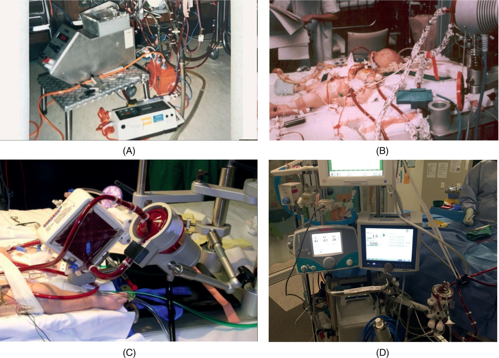
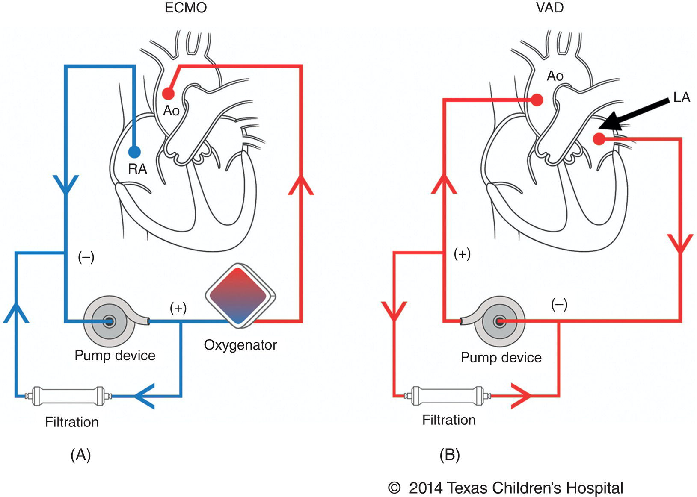
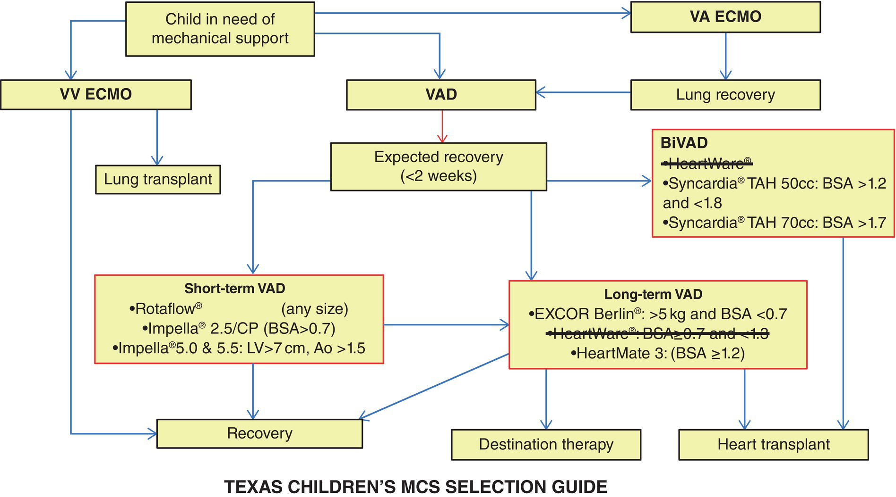
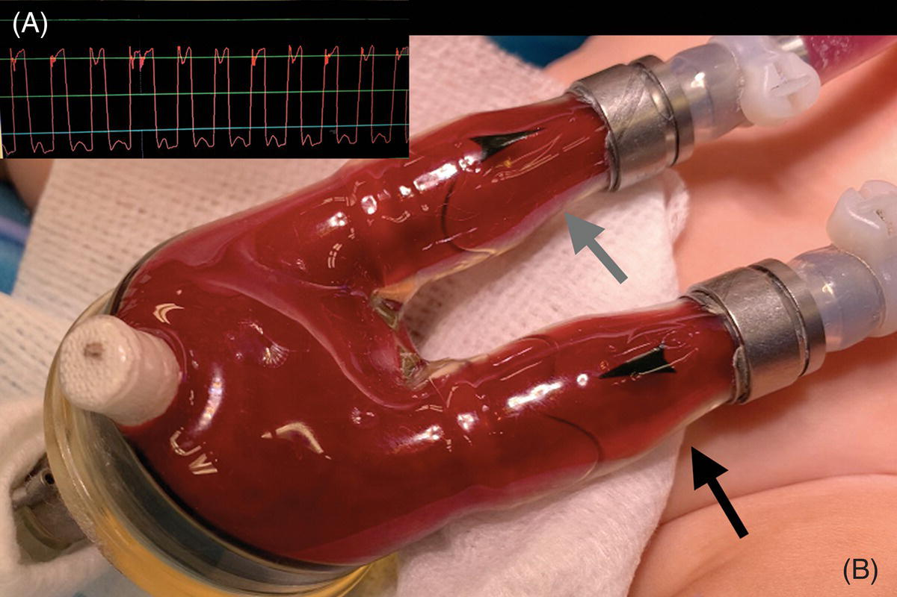
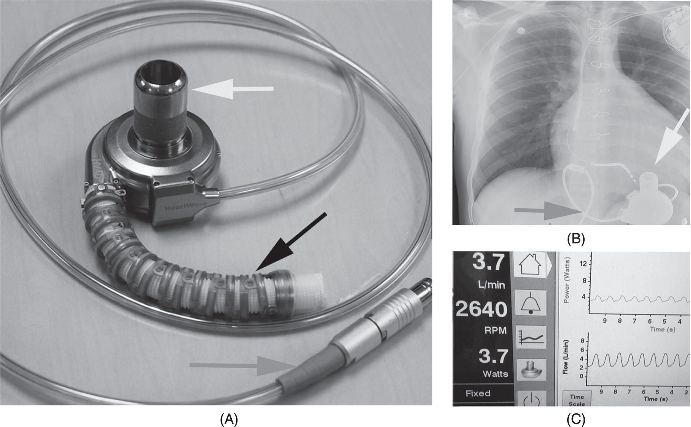
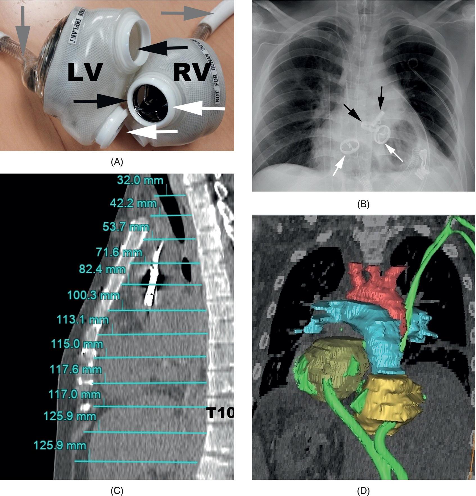
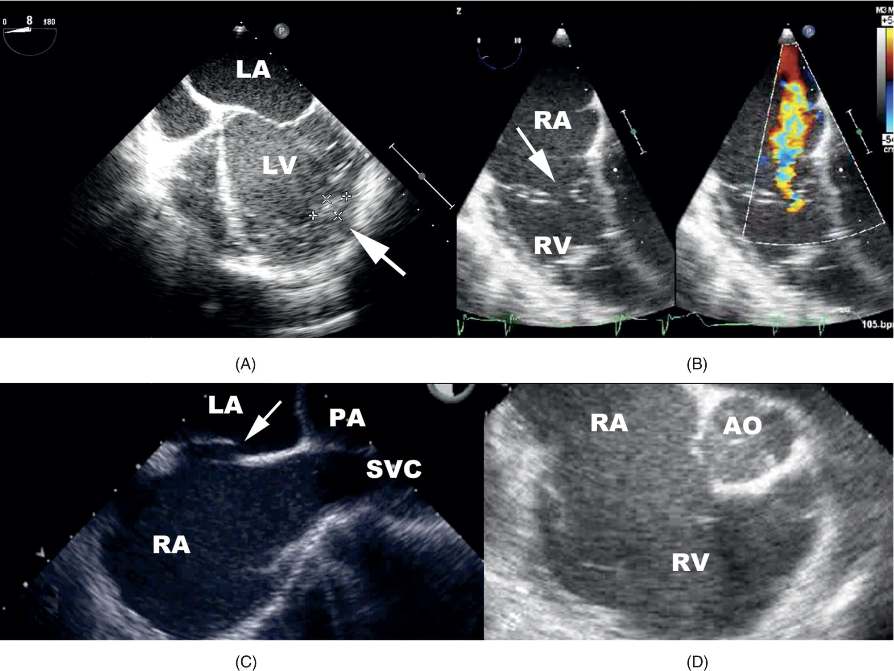
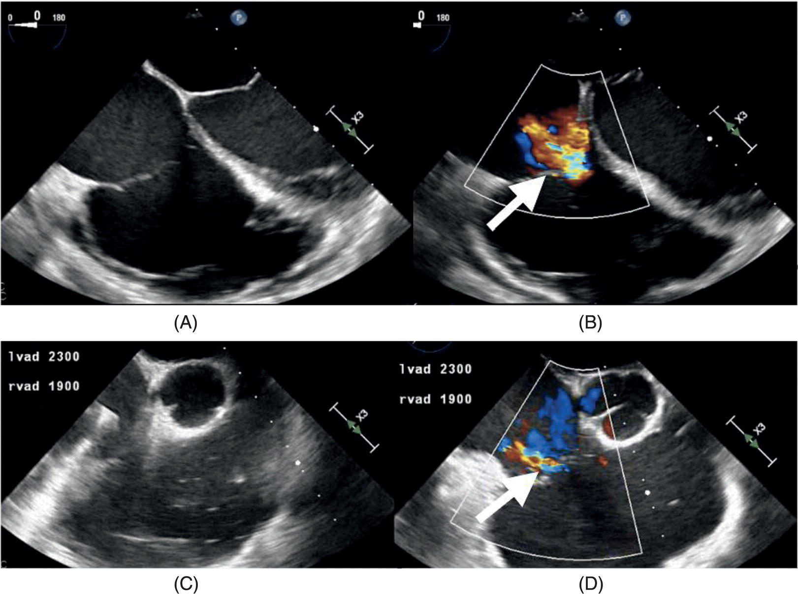

CHAPTER 37 Mechanical Circulatory Support 

# CHAPTER 37  
Mechanical Circulatory Support

_Stephen B. Horton1, Adam Skinner2, Andres Bacigalupo Landa3, Iki Adachi4, Stephen A. Stayer5, and Pablo Motta6_

1 Department of Paediatrics, Faculty of Medicine, The University of Melbourne Cardiac Surgery, The Royal Children's Hospital, Melbourne, Victoria, Australia

2 Department of Anaesthesia and Pain Medicine, The Royal Children's Hospital, Melbourne, Victoria, Australia

3 Department of Pediatrics and Anesthesiology, Baylor College of Medicine, Arthur S. Keats Division of Pediatric Cardiovascular Anesthesiology, Texas Children’s Hospital,, Houston, TX, USA

4 Congenital Heart Surgery, Texas Children’s Hospital, Clayton Endowed Chair in Cardiac Transplant and Mechanical Support, Mechanical Circulatory Support, Texas Children’s Hospital, Department of Surgery and Pediatrics, Baylor College of Medicine,, Houston, TX, USA

5 Department of Anesthesiology and Pediatrics, Texas Children's Hospital, Baylor College of Medicine, Houston, TX, USA

6 Staff Cardiovascular Anesthesiologist Service Lead, Adult Congenital Cardiac Anesthesiology, Arthur S. Keats Division of Pediatric Cardiovascular Anesthesiology, Texas Children’s Hospital, Associate Professor of Anesthesiology, Department of Anesthesiology, Baylor College of Medicine,, Houston, TX, USA

* * *

-   [**Background, introduction, and history**](#head-2-364)
-   [**Indications for mechanical support**](#head-2-365)
    -   [Preoperative stabilization and support](#head-3-649)
    -   [Failure to wean from CPB or LCOS after cardiac surgery](#head-3-650)
    -   [Resuscitation of cardiac arrest](#head-3-651)
    -   [Respiratory failure and lung transplantation](#head-3-652)
    -   [Sepsis](#head-3-653)
    -   [Myocarditis, cardiomyopathy, and cardiac transplantation](#head-3-654)
    -   [Arrhythmias with hemodynamic compromise](#head-3-655)
    -   [Cardiac catheterization instability](#head-3-656)
    -   [Pulmonary hypertension](#head-3-657)
    -   [Intoxicants](#head-3-658)
    -   [Mechanical support to assist organ donation](#head-3-659)
-   [**Contraindications to mechanical support in children**](#head-2-367)
-   [**Devices**](#head-2-369)
    -   [Extracorporeal membrane oxygenation (ECMO)](#head-3-660)
    -   [Ventricular assist devices](#head-3-661)
-   [**Role of echocardiography in mechanical support**](#head-2-370)
    -   [Extracorporeal membrane oxygenation](#head-3-662)
    -   [Ventricular assist devices](#head-3-663)
-   [**Weaning from circulatory support**](#head-2-371)
    -   [ECMO weaning](#head-3-664)
    -   [VADs: weaning from CPB to VAD](#head-3-665)
    -   [VADs: weaning from VAD to recovery](#head-3-666)
-   [**Anesthesia, analgesia, and sedation for mechanical support**](#head-2-372)
    -   [Drug disposition changes on mechanical support](#head-3-667)
-   [**Anesthesia, analgesia, and sedation for mechanical support patients undergoing NonCardiac surgery**](#head-2-373)
    -   [Preoperative management](#head-3-668)
    -   [Intraoperative management](#head-3-669)
    -   [Postoperative management](#head-3-670)
-   [**Anticoagulation, antifibrinolytics, and platelet antiaggregation therapies**](#head-2-374)
-   [**Anti‐infective therapy**](#head-2-375)
-   [**Outcomes and complications of extracorporeal support**](#head-2-376)
    -   [ECMO for cardiac support](#head-3-671)
    -   [ECMO for respiratory support](#head-3-672)
    -   [ECMO complicated by sepsis](#head-3-673)
    -   [Overall long‐term survival](#head-3-674)
    -   [Neurological outcome](#head-3-675)
    -   [Quality of life](#head-3-676)
    -   [Comparing outcomes and complications of VAD and ECMO](#head-3-677)
    -   [Other outcome issues](#head-3-678)
-   [**The future**](#head-2-377)
    -   [Tomorrow ECMO](#head-3-679)
    -   [Tomorrow VAD](#head-3-680)
-   [**Selected references**](#head-2-378)

* * *

## Background, introduction, and history

The successful use of extracorporeal membrane oxygenation (ECMO) in children began in the late 1970s when Bartlett et al. applied this technology to term newborn infants with respiratory failure \[1\]. In 1973, Soeter et al. described the ECMO use for cardiorespiratory failure after tetralogy of Fallot repair \[2\]. Later in 1987, Kanter et al. reported the first series of 13 patients with postoperative cardiac failure treated with ECMO \[3\]. The utilization of ECMO for cardiac support has increased steadily since the 1980s. Improved perfusion and anticoagulation techniques make the support safer so that it may be initiated earlier and not as a last resort. Data from the Extracorporeal Life Support Organization (ELSO) reveal an increase in ECMO support of 24% from 2009 to 2015, with overall survival of 62% \[4\]. Neonatal cardiac, neonatal, and pediatric extracorporeal life support (ECLS) to support cardiopulmonary resuscitation (CPR) have lower survival rates.

The first successful use of a left ventricular assist device (LVAD) as a bridge to heart transplant in an adult was reported by Cooley et al. in 1969 \[5\]. The first description of ventricular assist device (VAD) use in children was 20 years later, and the authors concluded that, as adults, VAD bridge to transplantation in children is possible \[6\]. In the 1990s, LVAD use in children was sporadic. However, VAD implantation in children has grown exponentially \[7, 8\].

## Indications for mechanical support

Mechanical support can be considered for children with potentially reversible cardiac failure, respiratory failure, pulmonary hypertension (PHTN), and cardiorespiratory arrest. When used for cardiac failure, the primary goal is to rest the myocardium to allow recovery of function (bridge to recovery, BTR). Sometimes is difficult to estimate myocardial recovery, especially amid organ failure. In this situation, mechanical support can stabilize the patient before making a long‐term decision (bridge to decision, BTD). In the absence of recovery of the myocardium, the patient may be transitioned to long‐term mechanical support while awaiting a heart transplant (bridge to transplant, BTT) \[9\]. Adult patients can have a permanent mechanical device to support the circulation for the remainder of their lives (destination therapy, DT) if they are not heart transplant candidates (e.g. 70 years, malignancy, or severe comorbidities) \[10\]. Recently, several reports of DT in the pediatric population have been published \[11\]. The goal is not only to improve survival but also to improve the quality of life \[12\]. As with adults, pediatric patients, nontransplant candidates, such as those with muscular dystrophy, malignancy, comorbidities (e.g., severe obesity), or high allosensitization could be offered VAD as DT.

The indications for mechanical circulatory support (MCS) in children are often divided into two groups: those related and those unrelated to cardiac surgery ([Box 37.1](#c37-fea-0001)).

As a general principle, ECMO could potentially be used for all the indications in [Box 37.1](#c37-fea-0001), and VAD is only considered in the absence of PHTN or respiratory dysfunction. There are pros and cons of VAD and ECMO devices, and sometimes, they are used in sequence. However, either device can be used as BTR, BTD, or BTT. The choice depends on the acuity of illness, comorbidities, the recovery potential, and anticipated duration of support \[13\]. In addition, if there is a choice between ECMO and VAD, a LVAD is preferable if patients are suspected of needing longer than 2 weeks of circulatory support and if the support is intended as a bridge to transplant. As ECMO has become safer, it is generally agreed that mechanical support should be initiated early before circulatory collapse to avoid prolonged periods of low cardiac output state (LCOS) and organ hypoperfusion. Patients with cardiac dysfunction after cardiopulmonary bypass (CPB) have a better prognosis when ECMO is initiated in the operating room (OR), rather than waiting for deterioration in the pediatric intensive care unit (PICU). In one study of 81 children, those placed on ECMO in the OR had a survival rate of 64%, whereas those put on ECMO in the PICU had a 29% recovery \[14\]. Pediatric patients who failed to wean off CPB requiring ECMO are a high‐risk population with a mortality of 55% \[15\].

* * *

### [Box 37.1](#R_c37-fea-0001) : Indications for mechanical support in neonates, infants, and children

**Indications related to cardiac surgery**

-   Preoperative stabilization and support
-   Postoperative support
    -   Failure to wean from cardiopulmonary bypass
        -   Low cardiac output state
        -   Respiratory failure
        -   Severe hypoxemia (occluded shunt or right‐to‐left shunt)
        -   Cardiac arrest

**Indications unrelated to cardiac surgery**

-   Respiratory failure (oxygenation and/or ventilation failure)
-   Septic shock
-   Cardiovascular indications
    -   Myocarditis
    -   Cardiomyopathy
    -   Intractable arrhythmias
    -   Instability during cardiac catheterization
    -   Pulmonary hypertension
    -   Intoxicants
    -   Bridge to organ donation
    -   Cardiac arrest

* * *

### Preoperative stabilization and support

Occasionally, neonates with severe cyanosis or cardiogenic shock require preoperative mechanical support for stabilization before cardiac surgery. There are many case reports of successful use of ECMO in this context \[16\]. At Royal Children's Hospital and Texas Children's Hospital, we have numerous successful anecdotal examples of preoperative ECMO use. At the Children's Hospital, Boston, a retrospective review over 13 years demonstrated the use of ECMO in 26 patients with acute cardiorespiratory deterioration and unrepaired congenital heart disease (CHD) as a bridge to palliative or definitive surgery. Sixteen out of 26 patients survived to discharge. \[17\] Despite no studies showing superiority of this approach, it is reasonable to conclude that preoperative ECMO may be a useful rescue modality to allow cardiopulmonary and other end‐organ recovery as well as a bridge to surgery. Specifically, however, it is noted that neonates with obstructed total anomalous pulmonary venous return (TAPVR) are poor candidates for this approach as the pulmonary pressures remain unacceptably high despite mechanical support and surgery should be performed promptly \[17, 18\]. Despite this, however, preoperative ECMO can still be lifesaving in patients with obstructed TAPVR.

### Failure to wean from CPB or LCOS after cardiac surgery

Failure to wean from CPB after congenital heart surgery is the most common cardiac indication for mechanical support and it is estimated that 2–5% of all children require ECMO after congenital heart surgery \[4, 19\]. Extracorporeal cardiac life support may be required after CPB due to an LCOS, respiratory failure or severe hypoxemia (due to right‐to‐left shunt or occluded systemic‐to‐pulmonary artery shunts). The etiology of an LCOS after CPB may be anatomical (and must be excluded by echocardiography or sometimes catheterization), ventricular dysfunction (often due to long CPB and cross‐clamp times), arrhythmias, or PHTN \[20\]. Mechanical support could be required immediately on attempted separation from CPB or may be required later and used as rescue in intensive care. If mechanical support is initiated in the OR, the cannulas are often placed in the right atrium and aorta via the sternotomy.

Criteria for considering ECMO or VAD in patients with LCOS include a progressive increase in inotrope or vasopressor dosage with evidence of poor end‐organ perfusion, such as reduced mixed venous oxygenation _<_40%, reduced cerebral saturation (>20% below baseline), oliguria, or metabolic acidosis with increasing lactate. Again, initiation of early mechanical support in these situations shows better outcomes \[9\].

Patients with single‐ventricle physiology or cyanotic heart disease are more likely to require mechanical support after CPB. According to the ELSO registry 2015, the most frequent CHD requiring ECMO in neonates is hypoplastic left heart syndrome (HLHS), with 33% survival of stage 1 palliation surgery, although generally those who require ECMO for hypoxia (often an occluded shunt) have a better outcome than those who require support for low cardiac output \[21\]. A recent systematic review and meta‐analysis of ECMO after CHD repair showed the most common reason for ECMO was left ventricular (LV) dysfunction with LCOS. About 60.3% were able to wean from ECMO and the overall in hospital mortality was 56.8%. Single‐ventricle physiology and renal failure were the only independent risk factors for in‐hospital mortality \[22\].

### Resuscitation of cardiac arrest

Resuscitation of children with ECMO during CPR for cardiac arrest was first described in 1992. del Nido et al. reported on the use of veno‐arterial ECMO (VA‐ECMO) for 11 children with a witnessed sudden cardiac arrest \[23\]. Ten out of 11 patients were centrally cannulated, and seven patients survived to hospital discharge. Using extracorporeal support for management of cardiac arrest is termed “extra‐corporeal cardiopulmonary resuscitation” (ECPR). Rapid VA‐ECMO for patients suffering in‐hospital cardiac arrest (IHCA) has been used increasingly in pediatrics since then \[18, 24, 25\].

The American Heart Association (AHA) 2010 resuscitation guidelines state, “There is increasing evidence that extracorporeal cardiac life support (ECLS) can act as a bridge to maintain oxygenation and circulation in selected infants and children with cardiac arrest if they are transplant candidates or have a self‐limited or treatable illness” \[24\]. When compared with CPR alone, it appears that ECPR improves survival by 12–23% in children \[26\]. This is consistent with a multivariate analysis of an observational registry study which showed higher rates of survival to hospital discharge for those managed with ECPR \[27\]. From analysis of the same registry, ECPR was associated with better neurological outcomes in patients with IHCA of any etiology \[28\]. After longer‐term follow‐up, overall, about one‐third of pediatric patients have good neurobehavioral outcomes 1 year after ECPR for IHCA \[29\]. The AHA pediatric resuscitation guidelines of 2020 recommend “ECPR may be considered for pediatric patients with cardiac diagnoses with IHCA in settings with existing ECMO protocols, expertise and equipment” \[25, 27, 28\]. ECPR is typically only effective when arrest occurs in a highly monitored environment (such as the intensive care); the AHA cautions that there is insufficient evidence for or against for the use of ECPR in out of hospital cardiac arrest or IHCA in patients with noncardiac disease \[25\]. The AHA (2010) states that there is no good evidence for an upper limit as to the length of CPR after which ECPR should be considered futile; it is known that long‐term survival is possible after >50 minutes of CPR \[30\].

A recent review of the ELSO registry for term and premature neonates receiving ECPR from 1998 to 2010 revealed 39% survived to discharge, however, gestational age, corrected gestational age, and birth weight correlated inversely with stroke and death. Of those born before 34 weeks, the survival was 21%. As expected, if dysrhythmia was the primary diagnosis, the odds of death were significantly lower than those with single‐ventricle physiology. Overall, the survival rate was like that of older children receiving ECPR \[31\]. The April 2021 ELSO report also revealed an overall 42% survival to discharge or transfer in neonatal and pediatric patients receiving ECPR \[21\]. [Chapter 25](c25.xhtml) presents more information about cardiac arrest and resuscitation in CHD.

### Respiratory failure and lung transplantation

When considering mechanical support for respiratory failure, neonatal patients are typically differentiated from (older) pediatric patients due to different etiologies and pathophysiology. With neonates, the conditions requiring ECMO are either acquired at birth or congenital in origin, such as meconium aspiration, pulmonary hypoplasia (possibly with congenital diaphragmatic hernia (CDH)), pneumonia/septicemia, and persistent PHTN of the newborn \[32\]. Of these neonatal causes, CDH and meconium aspiration syndrome (MAS) are the two most common reasons for the use of ECMO. The specific criteria for ECMO in neonates with respiratory disease vary depending on etiology and on location of providers \[33, 34\]. However, the general principle is to refer for ECMO due to failure to improve on optimal medical management (lung protective strategies, pulmonary vasodilators, surfactant, and high‐frequency ventilation) and the desire to avoid ventilator‐associated lung injury. The optimal timing, however, may be difficult, since ECMO is no longer seen as a last‐ditch attempt, so that, intervention is aimed at reducing morbidity as well as mortality \[35\]. Outcome is dependent on multiple factors, including etiology and underlying associated conditions; the 2016 ELSO registry suggests that neonates with CDH requiring ECMO have a 51% survival whereas those with MAS requiring ECMO have an overall 94% survival \[4, 35\].

The use of ECMO in the neonatal population decreased in the 1990s due to advances in ventilation strategies (including high‐frequency oscillation) and medical management, such as nitric oxide (NO) \[36\]. However, the rate of ECMO use for persistent PHTN and CDH has remained steady. Currently, in total, approximately, 800 neonates require ECMO support annually \[4\].

Older pediatric patients require ECMO because of acquired conditions, such as pneumonia (bacterial, viral, or fungal), aspiration, acute respiratory distress syndrome (ARDS), or acute respiratory failure from other causes \[4\]. Of these, infection is the leading cause of respiratory failure requiring ECMO \[37\]. Today, many pediatric patients requiring ECMO have significant comorbidity, such as renal, lung, and heart diseases. In an ECMO registry review, 19% of these patients had comorbidities in 1993, compared with 47% in 2007 \[38\]. Because of a lack of randomized controlled trials, the use of ECMO as a treatment modality has been slowly accepted, and recent evidence demonstrates accelerated interest from new advances in equipment/technique \[39\]. For example, veno‐venous cannulation has reduced the need for carotid puncture and therefore reduced the risk of neurological complications \[38\]. Veno‐venous ECMO (VV‐ECMO) has had a higher survival to discharge compared with VA‐ECMO \[37\]. During the severe acute respiratory syndrome coronavirus 2 (SARS‐CoV‐2) pandemic, a minority of pediatric patients with multisystem inflammatory syndrome in children (MIS‐C) required ECMO support. A systematic review of reported cases fulfilling the WHO criteria of MIS‐C showed that the need for ECMO was 4% in 783 patients \[40\]. The ELSO supports the early use of VV‐ECMO in ARDS due to SARS‐CoV‐2 in patients that other measures have failed, especially prone positioning \[41\].

Technically, ECMO could be used as a bridge to lung transplantation; however, long waiting times on ECMO are associated with morbidity and mortality from bleeding at the cannulation or surgical entry sites, hemolysis and coagulopathy, sepsis, and multiorgan failure. It is known that the survival of pediatric patients having ECMO as a bridge to heart transplant is significantly better than for lung or heart–lung transplant \[42\]. ECMO is therefore not favored for long‐term use as a bridge to lung transplant. New machines, such as the pumpless lung assist devices (described later) may alter the risk–benefit assessment of mechanical support in these patients. After lung transplant, patients who develop primary graft dysfunction may require extracorporeal support. Both VV‐ECMO and VA‐ECMO can be used, allowing the lungs to recover from the acute injury with an overall rate of survival to discharge of 42% \[43, 44\].

### Sepsis

The updated definition of sepsis in adults is “life threatening organ dysfunction caused by a dysregulated host response to infection” and the definition of septic shock is “a subset of sepsis in which underlying circulatory and cellular/metabolic abnormalities are profound enough to substantially increase mortality” \[45\]. The definition of sepsis in children is currently being re‐examined, but is likely to include risk factors, clinical criteria, and illness severity scores to identify those at high risk of developing sepsis‐associated organ dysfunction and mortality \[46\]. In the meantime, the old definition of severe sepsis is being used in children and refers to the presence of organ dysfunction, hypoperfusion, or hypotension \[47\].

Sepsis is one of the leading causes of mortality and morbidity worldwide and severe infections kill more than 4.5 million children every year \[48\]. In Australia and New Zealand from 2007 to 2013, invasive infections, sepsis, and septic shock were responsible for 765 (26·4%) of 2,893 pediatric deaths in ICUs \[48\]. Overall mortality for invasive infections was 3.9%, sepsis was 5.6%, and septic shock was 17%. Identification of those children at highest risk of mortality is therefore of paramount importance.

Septic shock may be the primary reason requiring mechanical support, or sepsis could be a coexisting problem in a patient with respiratory or cardiac failure. This causes classification difficulties, which can pose a problem for extracting meaningful outcome data. Despite this, sepsis was historically considered a contraindication for ECMO; however, it is now accepted that ECMO is a viable therapy in neonates and children. In neonates, the survival rates are over 80%, whereas, in older children, it is lower, but it has improved lately to 75% for refractory shock and 90% for refractory pneumonia \[49\]. A recent systematic review of ECMO in children with sepsis was consistent with this whereby overall pooled survival was 65% with neonatal survival the highest group at 73% \[50\]. Gram‐positive organisms were the most common among those requiring ECMO, although many underlying bacterial, viral, and fungal organisms can be implicated \[51\].

More recently, a sepsis mortality prediction model has been used to assess the effectiveness of VA‐ECMO in pediatric septic shock; in patients with a predicted mortality higher than 47.1%, the measured mortality was reduced by 16.1%, whereas in patients with a lower predicted mortality had a higher measured mortality by 16.8% \[51, 52\]. Some questions remain unanswered from this study, for example, the mortality prediction tool did not consider the different hemodynamic profiles of sepsis in children \[53\]. In addition, the mode of ECMO was not consistent; 71% provided central ECMO with higher flows compared with 29% with peripheral ECMO. There is some evidence that there is survival benefit from using ECMO with higher than 150 mL/kg/min flows \[54\]. The American College of Critical Care Medicine has issued a consensus statement on the management of children with septic shock, suggesting that ECMO be considered when a child is deteriorating from hypotension, rising lactate, or progressive multiorgan dysfunction despite high doses of vasoactive/inotrope medications, aggressive fluids, and appropriate medical management \[50\]. During this assessment, the rate of progression of shock with associated physiological decline is more important than the absolute amount of inotropic support \[47\].

### Myocarditis, cardiomyopathy, and cardiac transplantation

In children without CHD, viral myocarditis is the commonest cause of acute heart failure. ECMO is the initial modality of choice for MCS, because of ease of application, biventricular support, and relatively few complications \[55\]. Once on mechanical support, ECMO can be used as a bridge to VAD, transplant, or recovery. ECMO in this population was first reported in 1999 with an 80% survival \[55\]. In the 2016 ELSO registry report, the survival rate for myocarditis requiring ECMO was higher than CHD in neonates and children \[4\]. Pediatric patients with myocarditis have the highest survival rate of 76%.

ECMO is also used in children with dilated or restrictive cardiomyopathy to BTT. Although VA‐ECMO has traditionally been the standard management strategy for myocardiopathy, several reports have shown better survival with VAD \[56\]. In a prospective, multicenter, single‐group cohort study, children who underwent implantation of the Excor® Pediatric VAD as a BTT were compared with a historical control group of children who received circulatory support with ECMO \[57\]. The patients supported with VAD had longer survival rates than those supported on ECMO but with a high incidence of complications (e.g. bleeding, infection, and stroke). Of note, children who are on ECMO at the time of listing for cardiac transplant have a worse outcome (50% 12‐month survival) compared with those on a VAD at listing (76%) \[58\].

ECMO is also used for patients with early and late ventricular dysfunction after cardiac transplant. In a retrospective chart review of 100 pediatric orthotopic heart transplant recipients, 15 patients required 17 episodes of ECLS. Ten of these episodes were early (<1 month after transplant), and seven were late (>1 month). Of the 10 with premature graft failure, 8 were weaned from support with graft function recovery, 1 was retransplanted, and 1 died \[59\]. Late failure was due to acute rejection and had a 50% mortality. ECMO is usually the initial mode of support because of the speed of application and familiarity, as well as the ability to manage circulations with right ventricular (RV) dysfunction and high pulmonary vascular resistance (PVR) \[42\]. Recently, the temporary use of LVAD support via miniature axial flow pumps (Impella®) solo or combined with VA‐ECMO has been successfully used after cardiac allograft failure due to acute rejection \[60\].

### Arrhythmias with hemodynamic compromise

Short‐term mechanical support for malignant arrhythmias is a temporizing measure while medical management is optimized, or ablation performed. Etiology includes postcardiotomy arrhythmia, myocarditis, or coronary ischemia. Most patients had supraventricular tachycardia (69%) that needed mechanical support to stabilize. Thirty‐three percent underwent transcatheter ablation while on ECMO, while the rest received medical treatment. The long‐term survival was 59% \[61\].

### Cardiac catheterization instability

Improvement in skills and equipment has led to a significant number of younger, sicker patients presenting for complex interventional procedures in the catheterization laboratory. ECMO has been used as rescue therapy after a critical event (e.g. failure to wean from bypass, cardiac arrest, severe cyanosis) or prophylactically to manage an LCOS. A single‐center 15‐year retrospective review found the most common indications for cardiac catheterization while on ECMO were purely diagnostic, atrial septostomies, and stenting of vessels or shunts \[20\].

Patients at greatest risk include those _<_1 month of age with poor cardiovascular performance. Four high‐risk hemodynamic variables include: high end‐diastolic pressure, low systemic arterial saturations, low mixed venous saturations, and high pulmonary artery pressures \[62\]. In one reported series, 57% of children receiving ECPR in the catheterization survived to discharge \[63\].

### Pulmonary hypertension

Three groups of patients with PHTN candidates for ECMO support. The first group is perioperative patients with reversible PHTN, for example, neonates with total anomalous pulmonary venous drainage that PVR will improve with time after surgical correction. The second group is the severe PHTN patients at high risk of an acute pulmonary hypertensive crisis from intervention or intercurrent illness. Before the PHTN crisis, the suitability of rescue ECMO is discussed. Even centers with an expert mechanical support team report low survival with ECPR in these patients \[64\]. The third group includes patients with severe medically refractory PHTN who require VA‐ECMO as a bridge to heart–lung or lung transplant; however, the likelihood of survival with this approach is quoted as “minimal” and should be made on a case‐by‐case basis. A recent retrospective analysis of pediatric patients on ECMO with PHTN allowed the development of mortality models. The pre ECMO poor prognostic clinical features are (age <6 months, age >5 years, absence of pneumonia, and pH <7.12). The ECMO‐related poor prognostic markers are ECPR, neurological complications, pulmonary hemorrhage, renal replacement therapy, and metabolic acidosis \[65\].

Novalung® (Novalung GmbH, Hechingen, Germany) has recently developed a paracorporeal pumpless interventional lung assist device that uses a low‐resistance hollow‐fiber oxygenator. This device has been applied to patients with cardiogenic shock from PHTN, with cannulas placed via sternotomy in the pulmonary artery and left atrium. High pulmonary pressures drive the blood through the oxygenator, without the need for a mechanical pump, removing CO2 and improving oxygenation. Pulmonary pressures are reduced, which offloads the failing right ventricle, potentially allowing RV recovery \[65\]. Most of the research with this device has been in the adult population, but there is a need for application in pediatrics.

### Intoxicants

ECMO can support both adults and children who have severe toxin exposure \[66\]. A recent literature review identified 46 reports from 1996 to 2012 where ECMO rescued adult and pediatric patients with ARDS or circulatory shock from poisoning. The most common intoxicants cited were beta‐blockers and calcium channel blockers. However, other drugs mentioned were ibuprofen, tricyclic antidepressants, colchicine, and chloroquine. A recent retrospective review of the ELSO registry identified 28 children who required ECMO due to toxin exposure. The in‐hospital mortality was 32%. The following features were associated with higher mortality: preECMO use of NO, lower pH, elevated pCO2 or inotrope requirement while on ECMO \[67\].

### Mechanical support to assist organ donation

There is a worldwide shortage of organs, and significantly fewer cadaveric donors exist for any given child when compared to adults \[68\]. ECMO provides the potential to improve organ perfusion and increase the availability of viable organs suitable for transplant. Small case series in adults and adolescents have been reported \[69\].

Cultural, religious, and legal barriers differ depending on the country. ECMO could represent a violation of donor autonomy \[70\]. However, ECMO has been supported in this setting by ethicists and theologians \[71\]. Mechanical support improves viable organ retrieval in both brain‐dead donors and donation after cardiac death (DCD) \[69, 72\]. Brain‐dead donors supported with ECMO after suffering cardiac arrest or severe cardiovascular or respiratory dysfunction before organ retrieval increase the pool of donors. The timing of implementing ECLS for DCD, before or after the declaration of circulatory death, depends on the institution. The aim is to reduce warm ischemia time and improve the chance of graft survival. Firm conclusions regarding organ outcomes using this technique are challenging to draw in this population at this stage.

* * *

### KEY POINTS: INDICATIONS FOR MECHANICAL SUPPORT

Mechanical circulatory support should be initiated early before organ injury from a low cardiac output state. Criteria include:

-   Progressive increase in inotropes or vasopressors with continued poor tissue perfusion
    -   Mixed venous oxygen saturation <40%
    -   Cerebral saturation <20% below baseline
    -   Oliguria
    -   Metabolic acidosis

The American College of Critical Care Medicine states that ECMO should be considered in the treatment of children with septic shock unresponsive to inotropes and fluid management.

* * *

## Contraindications to mechanical support in children

It is difficult to provide absolute numerical “cut‐offs” as to who should categorically not be offered mechanical support. Progressively over the years, the list of absolute contraindications has been shrinking \[73\]. Contraindications are related to either futility treatment or high risk of death or severe long‐term morbidity. As medical equipment and techniques evolve, the risk–benefit balance changes. It is, therefore, wise to consider the suitability of individual patients on their own merits. For example, infants with HLHS were once regarded as inferior candidates for ECLS, but now, this is the most common congenital heart lesion requiring mechanical support of the circulation \[74\]. A temporizing approach is the “bridge to decision” process for patients with acute circulatory failure. The patient is supported to assess cardiogenic shock and the end or organ damage for 24–72 hours. Thus, transitioning to a long‐term MCS device in patients, either transplant candidates or deemed to recover \[75\].

The futility of mechanical support refers to the presence of a lethal anomaly, either cardiac or noncardiac in origin. Futility includes fatal chromosomal disorders, severe irreversible brain damage, or unrecoverable cardiac or respiratory injury. Of course, “unrecoverable” is patient‐ and organ‐specific, and the definition of futility in the context of ECMO remains very difficult \[76\].

Malignancy has also been considered under this “futile” category in the past, although the outcome of children with cancer is quite good; however, patients with neutropenic sepsis following bone marrow transplantation have a dismal prognosis. Despite this, a recent report described the successful use of ECMO in a few of these children \[77\]. Another group considered to be “futile” are those with advanced multiorgan failure. However, McLaren et al. describe 23 children at high risk of death from septic shock, of whom 22 had damage to at least three organ systems. All were cannulated centrally through the chest to obtain higher flow rates, and 17 patients (74%) survived to discharge. This high‐flow technique appears to confer more remarkable survival than with conventional ECMO \[78\].

Neonates pose a particular difficulty in defining contraindications. The ELSO registry shows that neonates have good survival for all diagnoses. However, certain neonatal subsets pose a specific risk when considered for ECMO; data from the ELSO registry indicate overall premature (<37 weeks) neonatal survival from ECMO is 31% compared with 41% in term infants \[79\]. Survival falls to 19% for neonates <33 weeks of gestational age \[79\].

Much of the concern with premature neonates and ECMO is because of the risk of developing or worsening intracranial hemorrhage (ICH), i.e. low birth weight, extreme prematurity, and pre‐existing ICH. Those with low gestational age (<32–34 weeks) are at the greatest risk. Most bleeds occur in the first 72 hours after birth, so in theory, the risk of ICH and hemorrhage extension may be less after the infant is 3 days old. Grade 3 ICH (blood causing enlargement of the ventricles) and grade 4 ICH (blood extending into the brain parenchyma) confer a poor long‐term prognosis \[80\]. ECMO increases the risk of extension of pre‐existing ICH, and most ECMO exclusion criteria include those with ICH grade 3 or 4. Although neonates with ICH _<_ grade 3 have the potential for hemorrhagic extension, it is feasible to manage these patients without worsening their ICH, provided there is imaging and diligent monitoring of their coagulation status \[81\]. In the absence of good long‐term developmental follow‐up data, many would currently consider birth weight <1.6 kg as a valid contraindication to ECMO. Regression analysis suggested that 1.6 kg was the lowest threshold weight to achieve a 40% survival in noncardiac ECLS \[82\]. Although some have suggested ECLS to be beneficial in neonates >32 weeks of gestational age, many consider a gestational age _<_34 weeks to be a relative contraindication to ECMO. As data emerge, these thresholds change; preterm and neonates _<_2.5 kg still demonstrate mortality rates after cardiac surgery greater than larger neonates \[83\]. Examining ECPR in neonates, the survival was 21% for those _<_34 weeks of gestational age and 20% for those _<_2 kg. Yet, these findings do not support a strict age cut‐off for ECPR \[31\]. With the above caveats in mind, a list of contraindications is presented in [Box 37.2](#c37-fea-0002).

Futile treatment in the context of repeated or prolonged ECMO is a problematic issue. The probability of ECMO survival in children with respiratory failure reduces with the number of days on support. We also know that myocardial recovery is rare after 12 days of ECMO support after pediatric cardiac surgery. Despite this, prolonged ECLS has produced remarkable outcomes in children, so that, delineating “futility” is poorly defined. Therefore, repeat ECMO should not be offered unless the mechanical support was initially withdrawn prematurely or considered a new treatment modality \[83\]. Poor prognostic features include hyperkalemia in the context of hypothermic arrest. Hyperkalemia indicates irreversible cell damage, potassium leakage, and a poor chance of recovery \[84\].

* * *

### [Box 37.2](#R_c37-fea-0002): Contraindications for mechanical support in neonates, infants, and children

**Neonatal population**

-   Severe irreversible CNS injury
-   Lethal congenital abnormality (cardiac or noncardiac anomaly)
-   Intraventricular hemorrhage grade 3 or 4
-   Gestational age _<_34 weeks
-   Very low birth weight, for example, _<_1.6 kg
-   Uncontrollable coagulopathy

**Infants and older children**

-   Severe irreversible CNS injury
-   Incurable malignancy
-   Advanced multisystem organ failure
-   Irreversible organ damage if not suitable for transplantation

CNS, central nervous system.

Note that extreme prematurity and very low birth weight are risk factors for intracranial hemorrhage on mechanical support.

* * *

## Devices

### Extracorporeal membrane oxygenation (ECMO)

At Royal Children’s Hospital (RCH), our ECMO program began by keeping on CPB overnight patients unable to be weaned. This effort was the last opportunity for the patient to either limp off CPB or die. Unfortunately, most failed to wean and died. Understanding how the ECMO service began gives us insight into where we are now and where we will be tomorrow. Due to the needed change in our service, a small team visited major US pediatric cardiac programs in 1988 and put together a peculiar system that was an adaptation of the CPB machine. The new design used a roller pump, silicone membrane oxygenator with a bladder on the venous line that on collapse would cause an alarm; however, not the pump to stop. The new ECMO system required perfusion bedside 24/7 assistance during all the mechanical support. Later, we modified the ECMO system using a Biomedicus centrifugal pump with pressure monitoring of the venous inlet and arterial outlet. Subsequent, in 1989, Dr Roger B. Mee implanted a modified version of the ECMO system without oxygenator configuring an LVAD in an infant post anomalous left coronary artery from the pulmonary artery (ALCAPA) repair with isolated LV dysfunction who was unable to wean off CPB \[85\]. The patient was well supported for 7 days and then successfully weaned. This infant was the first pediatric patient assisted LVAD as a BTR. The next step in improving the ECMO system was to adopt centrifugal pumps, which significantly improved their ease of management. However, the high‐resistance silicone oxygenator was still an Achilles heel of the circuit requiring high pump revolutions per minute (RPMs) to overcome the afterload. These resulted in high shear forces and cellular dysfunction, which promoted bleeding.

#### The Pump ([Figure 37.1](#c37-fig-0001))

Active development of improved centrifugal pumps occurred through the 1990s, with Deutschen Herzzentrum München developing the Jostra Rotaflow, a partially magnetic suspended centrifugal pump. This highly efficient device removed the requirement for an axle and seals, which were prone to thrombose and fail after 5 days, such as the Biomedicus Biopump® (Medtronic Corp., Minneapolis, MN, USA). In 1992, a trial comparing the Biomedicus Biopump (Medtronic Corp., Minneapolis, MN, USA) with a conventional roller pump found that the roller pump produced notably more hemolysis \[86\]. However, by day 5 of use, the Biomedicus acutely begins to cause cell trauma approaching the severity of the roller pump at 7 days. This trial confirmed the clinical experience at RCH of electively replacing the Biomedicus at day 5 as a precautionary measure or earlier if indicated. We adopted the Jostra Rotaflow (Maquet AG, Hirrlingen, Germany) in the late 1990s, which removed the need for elective pump changes. The pump rotor is suspended and driven by a radial permanent magnetic field that stabilizes the impeller in four of the six spatial degrees of freedom. It also allows it to be top‐spun on a single blood flushed pivot bearing with minimal load and friction. This pump has a small internal volume, and surface and passage time demonstrate excellent hydraulic efficiency. It can provide 10 L/min of pump flow rate against 400 mmHg of total head pressure, indicating high performance. In long‐term ECLS, or prolonged _in vivo_ experiments, centrifugal pumps show superior blood handling characteristics if inlet pressures are monitored and do not become excessively negative \[87\]. Anecdotally, we have found that sub‐atmospheric pressures more than −20 mmHg (measured at the cannula) potentiate hemolysis. The concept of integrating a pump and oxygenator into a single device that can monitor core vitals become available for adults as the Cardiohelp system but did not have a pediatric equivalent \[88\]. The developed pediatric ECMO circuit alternatives were the PediVAS (Levitronix Technologies LLC, Waltham, Massachusetts, USA) and the Medos Deltastream DP3 (Medos Medizintechnik AG, Stolberg, Germany). The PediVAS is a fully suspended centrifugal pump designed as a midterm VAD that some centers in Europe had adopted into their ECMO circuits. However, the disposables were 20 times more expensive than the Rotaflow, which would have created too significant a financial burden in an extensive ECMO program. Our service elected to transition to the Medos Deltastream DP3 (Medos Medizintechnik AG, Stolberg, Germany) oxygenator systems. The entire circuit from Medos was approximately half the cost of the PediVAS pump head, with the potential benefits of being able to provide pulsatile flow with a more sophisticated pump controlling system. Medos provided several oxygenator sizes in a wound polymethylpentene (PMP) fiber configuration. The pump is a diagonal hybrid rotary type that rotates at approximately two times the rate of the Rotaflow to achieve the same flow. Thus, potentially making it more hemolytic if a thrombus occurs on the pump impeller. We undertook a study comparing the hemolysis rate across the three top‐performing centrifugal pumps Rotaflow (Maquet AG, Hirrlingen, Germany), Medos Deltastream DP3 (Medos Medizintechnik AG, Stolberg, Germany), and PediVAS (Levitronix Technologies LLC, Waltham, Massachusetts, USA) \[89\]. The analysis showed no difference between the DP3 and Rotaflow, but the PediVAS fared significantly better causing less hemolysis.

[**Figure 37.1**](#R_c37-fig-0001) (A) First ECMO circuit crafted with a roller pump and a silicone membrane oxygenator; (B) LVAD circuit in an ALCAPA patient using a BioMedicus (Eden Prairie, MN) centrifugal pump; (C) Jostra Rotaflow® (Maquet AG, Hirrlingen, Germany) centrifugal pump with the Quadrox D oxygenator; (D) Medos Deltastream DP3 (Medos Medizintechnik AG, Stolberg, Germany) with the NO delivery system incorporated in the ECMO circuit.

#### The oxygenator

Several companies released versions of their CPB hollow‐fiber oxygenator for ECMO use with the drawback that plasma leaked after several hours, necessitating urgent exchange. The Quadrox D oxygenator adoption finally found a device that could last for most of a potential ECMO run without failing \[90\]. This device was developed as a low inflammatory activating oxygenator for long CPB runs using a polymethyl pentene plate fiber rather than a spiral wind polypropylene fiber. The pores were logarithmically smaller such that wet out did not occur. Even volatile gases would not cross. The device was exceptionally good at removing even large air emboli; however, the most significant advantage was low resistance, which resulted in immediate improvement of managing anticoagulation, with significantly fewer blood products requirements during ECMO. However, this device was only available for adults, so that, initial use with neonates required a more extensive than necessary oxygenator running at lower than optimal flow, which was still significantly better than the others on the market. To reduce time to support, we also introduced leaving our circuits primed with Plasmalyte® for 4 weeks after ensuring no microbial growth or significant drop in membrane efficiency. Other companies have produced PMP oxygenators, for example, the Medos Hilite® (Medos Medizintechnik AG, Heilbronn, Germany) 7,000 LT (275 mL priming volume), 2,400 LT (95 mL priming volume), and 800 LT (55 mL priming volume). In addition, Medtronic has the Nautilus, while Spectrum is evolving their Quantum platform for ECMO.

#### Thromboresistant surfaces

The aim is to inhibit activation of the inflammatory and coagulation systems from blood exposure to the foreign surface of the ECLS. To this end, the materials composing circuits either should be inert or hemocompatible. Hemocompatibility refers to those properties that allow ECLS circuits to maintain contact with flowing blood without producing a coagulopathy. Hemocompatibility is related to material’s surface, extrinsic conditions (e.g. cannulation sites), blood contact duration, local hemodynamic status (e.g. pulsatile vs. nonpulsatile), flow length, and diameter of tubes). For example, when surfaces feature peaks or valleys (average height or depth = 9 μm), the number of platelets adhering to polyvinylchloride (PVC) surfaces is increased three‐fold, compared with polished surfaces \[91, 92\].

Anticoagulation is challenging, with further improvements still required. Before, we had adopted using heparin‐coated technologies in the pursuit of reducing circuit thrombosis, which to our surprise, we found increased with its use. Unfortunately, we used tip‐to‐tip coating until a patient on VAD support developed a significant thrombus, which resulted in him dying from valve incompetence after several days of successful support. This prompted us to stop using any heparin surface coating and undertake a study investigating potential differences with heparin bonding, only to conclude that postprotamine made this technology prothrombotic \[93\].

Anticoagulation management has formed the most recent significant advances with less reliance on heparin as the sole mechanism. Since the 2000s, we have used prostacyclin (dose 5 ng/kg/min) as an adjunct and, more recently, NO (20 ppm) into the sweep gas of the oxygenator. These adjuncts have significantly reduced the number of circuit changes per 1,000 hours of ECMO but, more importantly, meant that patients are much less coagulopathic, meaning more stable support \[94\]. NO and prostacyclin have a synergistic effect on reducing platelet activation from exposure to the ECMO circuit. This reduction in circuit changes results from fewer coagulopathic patients on ECMO, resulting in stable patients requiring fewer interventions.

### Ventricular assist devices

The advantages of VAD circuits over ECMO are reduced priming volume from the lack of an oxygenator, shorter tubing, and minor trauma to blood cells. In addition, VADs lessen the ventricular work. VAD circuits are composed of inflow and outflow cannulas, a pump (intracorporeal or paracorporeal), a driving line power source, and a system controller ([Figure 37.2](#c37-fig-0002)) \[95, 96\]. The inflow cannula attaches to the atrium or the ventricle and transports blood from the left or right heart to the VAD. In left‐sided VAD, the outflow cannula connects to the ascending aorta; and in right‐sided VAD, the outflow cannula connects to the pulmonary artery. With the optimal placement of inflow cannulas, ventricular cannulas achieve superior unloading of the heart, reducing wall stress, allowing better ventricular recovery, and having a lower incidence of thrombosis. However, endocardial trabeculations can obstruct the inflow cannula in small ventricles (e.g. noncompaction cardiomyopathy). Therefore, these patients may require left atrial cannulation or LV cavity myectomy before ventricular cannulation.

The length of planned support divides VADs into those for short‐term use (typically <2 weeks) and those for long‐term use (>2 weeks) ([Table 37.1](#c37-tbl-0001), [Figure 37.3](#c37-fig-0003)). They are also classified based on the mechanism that propels blood. For example, ventricular ejection occurs with a rotational device (e.g. centrifugal pumps), a pneumatic pusher plate (e.g. Berlin Heart), or via axial flow (e.g. HeartMate III®).

Impella (Abiomed, Danvers, MA, USA) ([Figure 37.4](#c37-fig-0004)) is a micro axial flow device with three different pump sizes, at 2.5, 5, and 5.5 L/min \[97\]. The smaller pump provides partial left ventricle support in adults during high‐risk cardiac catheterizations (e.g., ablation procedures and urgent catheterizations for acute coronary syndrome). But in pediatrics, this smaller pump can also offer full left ventricle support. The Impella 5 and 5.5 L/min provide full left ventricle mechanical support for adolescents and adults. The main indication is BTR, BTD, or bridge to a permanent support device. The Impella is inserted retrograde through a femoral or axillary artery. The device inlet zone is resting in the left ventricle cavity, where blood is collected and propelled into the aorta. The deployment is performed under direct vision by fluoroscopy and echocardiography. Like many devices initially designed for adults, the Impella will have limited use in younger patients because of its size. The 2.5 L/min pump has a 12 F motor in diameter and requires a 13 Fr peel‐away introducer for delivery. Morray et al. in a magnetic resonance imaging (MRI) and echocardiographic study, define minimum size parameters that are necessary for the correct placement of the Impella 2.5 L/min catheter. The device needs a 7.5 cm LV catheter length achieved when the patient height is 122 cm, the weight of 23 kg, and body surface area (BSA) of 0.89 m2 \[98\]. The 5.0 L/min pump is a 21 F motor in diameter, requiring a femoral cutdown for delivery. The 5.5 L/min motor is 18 F in diameter, requiring axillary cutdown. The 5.5 L/min pump does not have a pigtail at the end of the catheter and is shorter (70 vs. 135 cm). Finally, another Impella, the Impella RP, is designed to provide support to the right ventricle. The indication for the Impella RP is to support the failing right ventricle percutaneously implanted RV assist device (RVAD). It is inserted in the femoral vein via a 23‐French sheath, and the motor has a 22 F diameter. Recently, Qureshi et al. published their experience with the Impella RP in adolescents with RV failure reporting an 83% survival to hospital discharge \[99\].

[**Figure 37.2**](#R_c37-fig-0002) Illustration of the (A) ECMO circuit draining deoxygenated blood (negative pressure) from the RA to the pump (positive pressure) through the oxygenator back to the patient through the aortic cannula. Note the ultrafiltration through the venous side beyond the pump; (B) VAD circuit draining oxygenated blood (negative pressure) from the LA to the pump (positive pressure) back to the patient through the aortic cannula. Note the ultrafiltration beyond the pump. Abbreviations: RA, right atrium; Ao, aorta; LA, left atrium.

[**Table 37.1**](#R_c37-tbl-0001) Ventricular assist device systems available in the United States

|  | Pump/flow type | Stroke volume (mL)/pump speed (rpm) | Flow range (L/min) | BSA range (m2) | Device type |
| --- | --- | --- | --- | --- | --- |
| **Short term (<14 days)** |
| Rotaflow | Centrifugal/nonpulsatile | 0–4,500 rpm | 0–9.99 | No minimum[_a_](#c37-note-0002) | Rotational |
| Impella 2.5[_b_](#c37-note-0003) | Centrifugal/nonpulsatile | 0–50,000 | 0–2.5 | \>0.9–1.1[_c_](#c37-note-0004) | Axial |
| Impella 5 | Centrifugal/nonpulsatile | 0–33,000 | 0–5 | \>1.1[_c_](#c37-note-0004) | Axial |
| Impella 5.5 | Centrifugal/nonpulsatile | 0–33,000 | 0–5.5 | \>1.1[_c_](#c37-note-0004) | Axial |
| **Long term (> 14 days)** |
| _Pneumatic pulsatile ventricular assist devices_ |
| Berlin heart EXCOR | Pulsatile | 12, 15, 25, 30, 50, 60 and 80 mL | Variable[_d_](#c37-note-0005) | \>0.2 | Pusher plate |
| SynCardia total artificial heart | Pulsatile | 50 and 70 mL | Up to 9.5 | \>1.7–2.5 | Pneumatic‐driven chambers |
| _Continuous‐flow ventricular assist devices_ |
| HeartMate III | Axial | 3,000–9,000 rpm | 0–10 | \>1.4 | Axial |
| HeartWare® | Centrifugal/nonpulsatile | 1,800–4,000 | 0–10 | \>1.4–2.6 | Axial |

See text for complete details.

[_a_](#R_c37-note-0002) Smaller patient reported 1.9 kg neonate.

[_b_](#R_c37-note-0003) 2.5 L/min flow needs a 17 F arterial cannula; 4 L/min flow needs a 15 F arterial cannula.

[_c_](#R_c37-note-0004) The Impella is a partial support device which enhances the patient cardiac output – the limitation in pediatrics is the vascular access needed for the size of the cannulas.

[_d_](#R_c37-note-0005) Depends on pump size and set rate.

[**Figure 37.3**](#R_c37-fig-0003) Algorithm of MCS used at Texas Children's Hospital. The recall of the HeartWare Ventricular Assist System by the FDA leaves a gap in the patients with BSA ≥0.7 and <1.3. Abbreviation: BSA, body surface area; FDA, Food and Drug Administration; MCS, mechanical circulatory support.

[**Figure 37.4**](#R_c37-fig-0004) (A) Impella 2.5 L/min catheter showing the pig tail end (grey arrow), the blood inlet area (black arrow) and the blood outlet area (blue arrow); (B) Impella console placement signal in red aortic pressure and in white left ventricular pressure; and (C) Green trace showing the motor current in MA, the device flow is 2.9 L/min (white arrow).

The Berlin Heart VAD (EXCOR) ([Figure 37.5](#c37-fig-0005)) is a pulsatile, paracorporeal device suitable for all pediatric patients, including neonates \[100\]. It is available in several sizes (10–60 mL). Most miniature pumps are appropriate to support neonates and infants (weight 3–8 kg), and the 25‐ and 30‐mL pumps will support children weighing up to 20–25 kg. It provides pulsatile flow delivered through a pneumatically driven thin membrane pump. In diastole, blood enters the pusher‐plate polyurethane chamber through an inlet valve, and negative pressure aid the pump filling. The blood‐filled pump is compressed from an air‐filled chamber in systole, creating pulsatile systolic flow ejected through the outlet valve to the aorta. Mechanical valves direct the flow, and there is no direct contact between the pumping mechanical parts and blood. The maximum systolic positive pressure generated is 350 mmHg, and the maximum negative driving pressure is −100 mmHg. High pressures are sometimes needed to overcome the resistance of small pediatric cannulas. The pump allows rates between 30 and 150 beats/min and the systolic time between 20 and 70% of the cycle; these parameters can all be monitored and adjusted on the external driving unit. The blood pump is transparent, allowing visual inspection of filling, emptying, and thrombus formation. The pump exchange is indicated if there is thrombus formation in the pump or cannulas to avoid systemic embolization. The blood‐contacting surfaces of the pump, including the polyurethane valves, are covered with Carmeda® bioactive heparin coating to prevent thromboembolic complications. The EXCOR has silicon cannulas with a Dacron covering that works as a biological barrier against ascending infections.

Patients supported with this device often do not require mechanical ventilation; they can eat normally and ambulate, making intensive care unit (ICU) discharge possible \[97, 98\] The EXCOR can be used for biventricular support using two pumps (right VAD \[RVAD\] and LVAD) controlled by the same external driving unit. The one prospective trial from the USA comparing the EXCOR with ECMO as a bridge to transplantation showed better survival rates with the VAD than with ECMO in two different BSA cohorts (cohort 1, <0.7 m2; cohort 2, 0.7–<1.5 m2) \[57\]. Unfortunately, the incidence of serious adverse events was high in both groups, including major bleeding (42 and 50%, respectively), infection (63 and 50%, respectively), and stroke (29 and 29%, respectively) \[57\]. In addition, the need for pump exchanges due to thrombosis was frequent. The higher‐risk patients in the US pediatric experience had a smaller size, renal dysfunction, hepatic impairment, and required biventricular assist. ECMO before implantation and CHD was not associated with worse outcomes in this study population. In the German experience with 122 implantations, the overall median duration of support was 63.6 days (range 1–841). Fifty‐six (45.9%) were transplanted, 18 (14.7%) patients recovered and weaned, 43 (35.2%) patients died, and five remain on the device. In addition, pump exchange due to thrombus (35 patients) and re‐exploration due to bleeding (22 patients) were common complications \[101\].

[**Figure 37.5**](#R_c37-fig-0005) (A) Picture of the Berlin Heart console showing: left pump settings (systolic pressure 180 mmHg, diastolic pressure – 30 mmHg, rate 65 bpm and percentage of systole of the cycle 40%). (B) Picture of a Berlin Heart LVAD. The black arrows show the blood entering the VAD from LV (LVAD) and the grey arrow show the blood leaving the VADs to the aorta (LVAD).

[**Figure 37.6**](#R_c37-fig-0006) (A) Photograph of the HeartWare Ventricular Assist System (total height 58 mm, diameter 49 mm) displaying the drive line (4.2 mm, grey arrow), inlet cannula (diameter 20.5, length 25 mm, white arrow) and outlet cannula (10 mm, black cannula); (B) Postoperative anterior–posterior chest x‐ray showing the implanted HeartWare Ventricular Assist System with drive line (grey arrow) and inlet cannula (white arrow), the outlet cannula is not observed because is not radiopaque, in addition an automatic implantable cardioverter defibrillator (AICD) and leads are observed; and (C) HeartWare Ventricular Assist System monitor displaying cardiac output (liter/minutes), device rpm, power (watts) and the graphs (power/time and flow/time).

The HeartWare Ventricular Assist System® (HVAD) (HeartWare, Inc., Miami Lakes, FL) \[102\] ([Figure 37.6](#c37-fig-0006)) is a small intrapericardial centrifugal flow pump with a rotating impeller, forcing blood through the device using hydrodynamic and centrifugal forces. The displacement volume is 50 mL and can flow up to 10 L/min. The inflow cannula is integrated within the device and is inserted into the left ventricle apex by an adjustable sewing ring – the 10 mm outflow graft anastomoses to the ascending aorta \[103\]. An external console controls the pump, regulates power, monitors performance, and displays alarms. The pump is connected to the console by a subcutaneous driveline through the patient's abdominal wall. For safety reasons, two of three different sources power the HVAD: rechargeable lithium batteries, alternating current (AC) power, or a 12 V DC power source. The worldwide experience with the HVAD in 205 pediatric patients (<18 years) showed a low mortality (10.7%) and successful BTT (65%). In addition, a small number of patients (3.2%) recovered function and were explanted. However, right heart support and pump exchange were mortality risk factors \[104\]. June 3rd, 2021, the US Food and Drug Administration (FDA) alerted the medical community that Medtronic stopped the sale and distribution HVAD system. The recall was due to the increased risk of neurological adverse events and mortality associated with the internal pump. In addition, there is a potential for the internal pump to stop and fail to restart.

The HeartMate III (HM3) (Abbott Cardiac Arrhythmias and Heart Failure, Plymouth, MN) is a new centrifugal VAD characterized by a fully levitated rotor lacking mechanical bearings \[105\] ([Figures 37.7](#c37-fig-0007) and [37.8](#c37-fig-0008)). The HM3 design has a short and wide inflow that decreases shear stress and provides a reliable blood flow pattern supply ([Figure 37.8](#c37-fig-0008)B). In addition, HM3 incorporates a “pulsatility” feature wherein the rotor drops below the set speed and immediately increases above the set speed generating a pulse (~30 cycles per minute). The purpose of “pulsatility” is to allow ejection through the aortic valve reducing stasis and thrombosis. The HM3 insertion is intrapericardial, like the HeartWare® HVAD. Therefore, the modular driveline replacement in the event of malfunction does not need a complete pump exchange. The control screen consists of four boxes displaying pump flow, pump speed, pulsatility index (abbreviated on‐screen as pulse index), and pump power. The HM3 allows a wide range of working speeds accomplishing flows between 2.5 and 10.0 L/min. The pump flow is a calculated value. The pulsatility index value is inversely proportional to the support given. The higher the pulsatility index, the lesser the VAD support. The HM3 power ranges between 0.0 and 25.5 W. Five life‐threatening warnings display on the system monitor, including pump off, driveline disconnection, low flow × min, low voltage, and no external power. Low‐level speed is considered fewer than 3000 rpm. The miniaturized pocket‐size controllers and 17 hours battery pack life supports an ambulatory lifestyle. The pediatric experience with HM3 is limited. However, recently O'Connor et al. published the first pediatric HM3 series (40% of the patients < 60 kg), including a few with CHD (mostly Fontan circulation) who presented a low incidence of mortality and adverse events \[107\]. The smaller patient implanted in this series was 19 kg (BSA 0.78 m2). There are two limitations to its pediatrics use one is the safest lowest flow (2–2.5 L/min) and the inflow cannula (25 mm) that seats inside the LV chamber \[108\]. The traditional anticoagulation regime for HM3 includes Coumadin (INR target 2.0–3.0) plus antiaggregation with aspirin (100–200 mg daily). The MAGENTUM 1 trial showed that low‐intensity anticoagulation with Coumadin to a lower INR target (1.5–1.9) and aspirin was adequate \[109\]. The risk of thromboembolic complications after the stabilization period (6 weeks) did not increase.

[**Figure 37.7**](#R_c37-fig-0007) Diagrams of the HeartMate III Centrifugal‐Flow Pump: (A) shows a diagram of the fully magnetically levitated centrifugal‐flow pump with the control system and the external battery pack and (B) illustrates the blood entering the central axis of the rotor and is driven outward centrifugally to the outflow of the pump.

Mehra et al. \[106\]. Reproduced with permission of Massachusetts Medical Society.

[**Figure 37.8**](#R_c37-fig-0008) (A) Clinical screen showing four parameter boxes at the top of the screen report measured values of pump flow (lpm), pump speed (RPM), pulsatility index (abbreviated on screen as pulse index), and pump power (Watt); (B) picture of the HeartMate III showing the inflow cannula (grey arrow), outflow cannula (white arrow), and the drive line (black arrow).

SynCardia Total Artificial Heart. (SynCardia Systems Inc., Tucson, Ariz) ([Figure 37.9](#c37-fig-0009)). It is a pneumatically driven pulsatile biventricular device with two prosthetic polyurethane ventricles (70 mL each) \[110\]. Each ventricle has two mechanical valves providing unidirectional inflow and outflow from the ventricle. The valves are single‐leaflet Medtronic‐Hall (Minneapolis, MN), 27 mm for the inlet and 25 mm for the outlet. The SynCardia Total Artificial Heart (STAH) has the most significant inflow, and shortest distance of blood traveled of all available VADs. The large valves and short blood path provide very little resistance, decreasing stasis and thrombosis \[111\]. The prosthetic ventricles coupled with silicone cuffs to two atrial connectors and two connectors on the end of the grafts sewn to the aorta and pulmonary artery. The external console displays the pressure waveform of each cardiac cycle and has two independent controllers for emergency backup. Compressed air powers the device. Two separate wire‐reinforced conduits connected to the right and left prosthetic ventricles. The indication of the STAH are patients unable to be supported by VAD, such as those who require biventricular support or have PHTN (>4.5 Wood units). Successfully used after catastrophic intraoperative heart damage, failing Fontan, refractory arrhythmias, or irreversible cardiac rejection after transplantation have been reported. Pediatric use is limited because the device needs a distance between the sternum and the 10th anterior vertebral body of >10 cm. The recommended BSA is >1.7 m2, but it has been used successfully in patients with a BSA of 1.5–1.7 m2. The smaller 50 mL device is recommended for patients with a BSA of 1.2–1.7 m2 \[112\]. Morales et al. published the worldwide experience with STAH in 43 patients under 21 years old \[113\]. Most of the patients were older and received the 70 ml pump. Twenty‐five patients (58%) were successfully bridged to transplantation with a mean duration of support of 146 days.

* * *

### KEY POINTS: DEVICES

-   Roller pumps produce a linear increase in hemolysis that is not observed with centrifugal pumps.
-   Centrifugal pumps are generally used for short‐term ventricular support (less than 2 weeks)
-   Impella either percutaneous or surgically has become the most used temporary ventricular assist device
-   The Berlin Heart EXCOR device:
    -   Has several sizes of pumping chambers versatile in pediatrics
    -   Allows patients to be extubated, ambulate, and eat normally
    -   Can be used as an LVAD, RVAD or BiVAD;
-   HeartWare Ventricular Assist System is currently of the market but is still implanted in several patients
-   HeartMate III fully levitated rotor lacking mechanical bearings
    -   “Pulsatility” feature wherein the rotor drops below the set speed and immediately increases above the set speed generating a pulse (~30 cycles per minute).
-   SynCardia Total Artificial Heart biventricular support or sever pulmonary hypertension (>4.5 Wood units).

* * *

## Role of echocardiography in mechanical support

### Extracorporeal membrane oxygenation

Transthoracic echocardiography (TTE) or transesophageal echocardiography (TEE) helps detect complications during ECMO \[114\]. Before initiating ECMO, echocardiography rules out reversible causes of cardiogenic shock. In addition, it detects anatomic variations that affect cannula insertion in the right atrium, such as a prominent Chiari network or an aneurysmal atrial septum. If central cannulation through sternotomy is required, TEE is a better choice, as most TTE windows are not available. Kuenzler et al. analyzed the echocardiography of 193 pediatric patients supported with ECMO, detecting a 17.8% incidence of cannula malposition. With echocardiography, the incidence reduced to 3.3% \[115\]. After the initiation of ECMO, echocardiography assesses the LV unloading and the potential need for left atrial venting via surgical or balloon atrial septostomy \[114\]. In addition, echocardiography monitors the aortic valve opening because limited aortic ejection increases the risk of blood stasis, leading to thrombosis. Conversely, increasing aortic valve opening during ejection indicates LV recovery when decreasing the ECMO. Echocardiography is used to periodically evaluate cannula positioning and thrombi formation, chamber filling and function, and cardiac compression from pericardial effusion. Tamponade physiology is typically not evident until the patient is off ECMO \[116\].

[**Figure 37.9**](#R_c37-fig-0009) (A) Image of the Syncardia TAH showing the LV and RV pump, drive line (grey arrows), inlet valves (white arrows), and outlet valves (black arrows); (B) antero‐posterior chest x‐ray of an implanted Syncardia TAH displaying inlet valves (white arrows) and outlet valves (black arrows); (C) preoperative chest computed tomography (CT) performed towards placement of Syncardia TAH, the anterior posterior dimensions of the thoracic cavity at T‐10 level is 117 mm (minimum for implantation is 100 mm at that level); and (D) preoperative three‐dimensional CT reconstruction of Syncardia TAH for surgical implantation exhibiting drive line (green), Syncardia TAH (yellow), pulmonary artery (blue), and aorta (red). Abbreviations: TAH, total artificial heart; LV, left ventricle; RV, right ventricle; CT, Computer Tomography; T‐10, 10th thoracic vertebrae.

### Ventricular assist devices

The American College of Cardiology, AHA, and American Society of Echocardiography consider TEE to be a class 1 indication for the insertion of a VAD ([Table 37.2](#c37-tbl-0002)) \[116–119\]. Before initiating VAD support, TEE is helpful to rule out conditions that jeopardize VAD function. These conditions include mitral stenosis, endocardial trabeculations, and aortic insufficiency. These conditions limit the filling of the device and impede LV unloading. Mitral regurgitation and aortic stenosis do not affect device function. Mitral regurgitation generally improves from LV unloading by reducing left ventricle chamber size and mitral annulus size. Preoperative echocardiography should screen for septal defects ([Figure 37.10](#c37-fig-0010)). Unrepaired atrial or ventricular communications should be closed before VAD insertion. Unloading the left‐sided chambers produces significant oxygen desaturation. Echocardiography screens for potential intracardiac thrombi, as thromboembolic events are common and potentially devastating. Intraoperative measures of RV function, such as tricuspid annular plane systolic excursion, tricuspid annular systolic velocity, and RV strain have not been helpful to predict RV failure after LVAD implantation \[120\]. As RV function commonly has significant improvement from unloading the left ventricle in children. Real‐time visualization of RV function should be performed by intraoperative TEE as LVAD support is initiated. Devices placed on CPB should undergo interrogation of the inflow and outflow cannulas before weaning. The inflow should be laminar with a velocity _<_2 m/s. A peak flow velocity >2.3 m/s along with the turbulent flow indicates inflow cannula obstruction and an indication for surgical revision ([Figures 37.11](#c37-fig-0011) and [37.12](#c37-fig-0012)). The normal outflow has a low velocity (peak velocity 1.0–2.0 m/s). Continuous monitoring of RV function and the detection of air is crucial for early intervention. Air may enter through suture lines if the left ventricle completely collapses, and sub‐atmospheric intra‐device pressures develop. While weaning from CPB, echocardiography determines RV function and guides (RVAD) implantation, if needed ([Figure 37.13](#c37-fig-0013)). Severe septal shifting to the left is an indicator of right‐sided heart failure and the need for RVAD. A temporary RVAD can be used when rapid RV recovery is anticipated. Once LVAD support starts and CPB flows decrease, TEE quantifies left ventricle decompression and the degree and direction of movement of the interventricular septum. TEE monitors the interventricular septum shift, sufficient LV unloading and ensures that the aortic valve opens periodically. Aortic dissection distal to outlet cannula insertion site is a potential complication. Finally, after chest closure, a final scan is performed to exclude the possibility of kinking of the cannulas or RV compression. Echocardiography is helpful to guide the percutaneous VAD placement (e.g. Impella) ([Figure 37.14](#c37-fig-0014)) \[121\]. TEE helps to monitor the correct positioning. In long‐axis midesophageal aortic valve view, the device inlet should be 3.5 cm below the aortic valve and the outlet above the aortic valve. In the transgastric long‐axis LV view, the device positions away from the mitral valve toward the LV apex. Improper deployment of the Impella includes device too far into the left ventricle (e.g., inlet >3.5 cm from the aortic valve or outlet across the aortic valve), outlet too far into ascending aorta, or pigtail in the subvalvular apparatus of the mitral valve. Echocardiography imaging of the STAH is technically challenging due to artifacts caused by the device and its valves. TEE helps diagnose right‐to‐left shunting, distortion, and compression of systemic and pulmonary venous return to the native atrium, all of which affect STAH function. TEE also guides the de‐airing procedures by imaging the ascending aorta. Once the device is functioning, the Medtronic‐Hall valves (tilting disc) in the atrioventricular position can be interrogated to assure adequate function \[122\].

[**Table 37.2**](#R_c37-tbl-0002) Role of transesophageal echocardiography in VAD insertion

| Prebypass period | Tee windows | Comments |
| --- | --- | --- |
| Monitor: |  |  |
| LV size, filling and function | ME4Ch, TGSAX, TG2ch | LVEDD |
| RV size, filling and function | ME4Ch, MERVIO | Need for RVAD placement  
RVEDD and L/R ratio calculation |
| Diagnose: |  |  |
| Right‐to‐left shunting  
(PFO, ASD, VSD) | ME4Ch, MEBC, TGSAX | Causes of severe hypoxemia with LV unloading  
Agitated bubble study  
Avoid Valsalva maneuver in patients with marginal physiology |
| Aortic regurgitation | MELAX, DTG5Ch, DALAX | Increases LVAD preload and LV dimension – impeding LV rest |
| Mitral stenosis (rare) | ME4Ch, basal TG | Impedes device filling  
MV commissurotomy |
| Endocardial trabeculations (noncompaction cardiomyopathy) | ME4Ch, MELAX, TGLAX | Obstruct inflow cannula  
Resect subvalvular apparatus |
| Tricuspid regurgitation | ME4C, MERVIO, MEmodBC | Assess the need for TVR  
Calculate PASP = VpeakTR2 + CVP |
| LV Thrombi | ME4Ch, TG SAX | LV thrombectomy before VAD placement |
| Pulmonary regurgitation | MERVIO, MEAASAX | Rule out before RVAD placement |
| **On bypass period** | **Tee windows** | **Comments** |
| Monitor: |  |  |
| Cannula alignment |  |  |
| Inlet | ME4Ch, MELAX | CWD peak velocity <1.2 m/s |
| Outlet | MELAX | CWD peak velocity 1.0–2 m/s |
| Deairing | ME4Ch, MELAX | Need for aortic venting  
Trendelenburg position |
| Degree of decompression | ME4Ch, TG SAX | Too much LV unloading could shift the interventricular septum causing TF |
| Diagnose: |  |  |
| Residual right‐to‐left shunting | ME4Ch, MEBC, TGSAX | Severe hypoxemia with LV unloading |
| Rule out aortic regurgitation | MELAX, DTG5Ch, DALAX | Increases LVAD preload and LV dimension – impeding LV rest |
| **Postbypass period** | **Tee windows** | **Comments** |
| Monitor: |  |  |
| Pericardial effusion / Cardiac Tamponade | ME4Ch, TG SAX | Most common cause of hemodynamic instability and reoperation (20–30%) |
| Aorta (ascending) | MELAX | Aortic dissection |
| RV size, filling and function | ME4C, MERVIO | Need for RVAD placement (Transient VS Permanent) |
| Tricuspid regurgitation | ME4C, MERVIO, MEmodBC | Too much LV unloading could shift the interventricular septum causing TR |
| Decompression of LV and LA | ME4Ch, MELAX, TGSAX |
| Air entrainment | ME4Ch, MELAX | Need for aortic venting  
Trendelenburg position |

Abbreviations: ASD, atrial septal defect; CWD, continuous wave Doppler; DALAX, descending aorta long axis; DTG5Ch, deep transgastric five chamber; LV, left ventricle; LVAD, left ventricular assist device; ME4Ch midesophageal four chamber; MEBC, midesophageal bicaval; LVEDD, left ventricular maximal end‐diastolic diameter; MEmodBC, midesophageal modified bicaval; MERVIO, midesophageal right ventricle inflow/outflow tract; PASP, pulmonary artery systolic pressure; PFO, patent foramen ovale; RV, right ventricle; RVAD, right ventricular assist device; RVEDD, RV maximal end‐diastolic diameter; TGLAX, transgastric long axis; TGSAX, transgastric short axis; TR, Tricuspid regurgitation; TVR, tricuspid valve repair; VpeakTR2, peak velocity of the tricuspid regurgitant jet; VSD, ventricular septal defect.

[**Figure 37.10**](#R_c37-fig-0010) Preoperative TEE displaying common procedures performed during LVAD placement, such as: (A) 2‐D image at midesophagus four chamber view (0°) on patient with a dilated cardiomyopathy showing a dilated LV with an intra‐cavitary thrombus (white arrow) requiring surgical thrombectomy; (B) 2‐D and color Doppler images at midesophagus four chamber view (0°) exhibiting an area of noncoaptation (white arrow) and severe TR by color flow Doppler needing TV repair; (C) 2‐D image at midesophagus bicaval view (90°) showing a PFO (white arrow) needful of surgical closure to avoid hypoxemia once LVAD support started due to unloading of LV and LA chambers; and (D) 2‐D image at midesophagus RV inflow and outflow tract view displaying a severely dilated RA and RV that might require RVAD support in addition to the LVAD placement. Abbreviations: 2‐D, two‐dimensional; Ao, aorta; LA, left atrium; LV, left ventricle; PA, pulmonary artery; RA, right atrium, RV, right ventricle; SVC, superior vena cava; TEE, tranesophageal echocardiography; TV, tricuspid valve; TR, tricuspid regurgitation.

![Schematic illustration of postoperative TEE images showing (A) 2-D and color Doppler images at midesophagus long-axis view (110°) of the HeartWare inflow cannula at the apex of the heart (white arrow); (B) pulse wave Doppler interrogation at the same location showing unobstructed inflow (ltltlt70 cm/s); (C) Color Doppler image at the aortic long-axis view (140°) of a HeartWare outflow cannula (white arrow) unobstructed flow is seen in the ascending aorta; (D) pulse wave Doppler interrogation at the same location showing unobstructed outflow.](images/c37f011.jpg)

[**Figure 37.11**](#R_c37-fig-0011) Postoperative TEE images showing (A) 2‐D and color Doppler images at midesophagus long‐axis view (110°) of the HeartWare inflow cannula at the apex of the heart (white arrow); (B) pulse wave Doppler interrogation at the same location showing unobstructed inflow (_<_70 cm/s); (C) Color Doppler image at the aortic long‐axis view (140°) of a HeartWare outflow cannula (white arrow) unobstructed flow is seen in the ascending aorta; (D) pulse wave Doppler interrogation at the same location showing unobstructed outflow (<150 cm/s). Abbreviation: TEE, transesophageal echocardiography.

[**Figure 37.12**](#R_c37-fig-0012) Transesophageal echocardiography of a HeartMate III implantation. (A) Midesophageal four chamber view showing the inflow cannula (white arrow) and the direction of flow (red arrow); (B) midesophageal aortic long‐axis view illustrating the outflow cannula in the ascending aorta (white arrow) and the direction of flow (red arrow); and (C) pulse wave Doppler showing an unobstructed outflow cannula (_V_max 2.5 m/s).

[**Figure 37.13**](#R_c37-fig-0013) Transesophageal echocardiography of a patient with dilated cardiomyopathy with biventricular failure: (A) midesophageal four‐chamber view showing severely dilated RV with poor systolic function; (B) the same window with color Doppler displaying moderate to severe tricuspid regurgitation in multiple jets (white arrow); (C) midesophageal RV inflow outflow view postbiventricular assist device placement with the RVAD inflow cannula visualized at right atrium (white arrow) and unloaded RV; and (D) the same window with color Doppler showing mild TR (white arrow). Note the LVAD setting at 2,300 RPM and the RVAD at 1,900 RPM.

[**Figure 37.14**](#R_c37-fig-0014) Echocardiography images of Impella 5.5 catheter inserted via the left subclavian artery (A) Midesophageal long‐axis view with the Impella “motor” positioned against the lateral left ventricle wall below the mitral valve apparatus and papillary muscles. The final distance from the mid‐portion of the Impella “motor” to the aortic valve was 6.1 cm; (B) Parasternal long‐axis view of the same patient with the Impella motor 5.96 cm below the valve and the outlet in the ascending aorta (white arrow).

## Weaning from circulatory support

### ECMO weaning

Patients are weaned from ECMO when their cardiac function recovers, and their lungs can support adequate oxygenation and ventilation using conventional mechanical ventilation. When the myocardium has an acute insult, such as acute myocarditis or ischemia from a prolonged period of CPB, ECMO can usually be weaned 72 hours after the initiation of support. Echocardiographic criteria associated with successful ECMO weaning include LV ejection fraction >35%, LV outflow tract velocity–time integral >10 cm, lack of ventricular dilatation, and no pericardial effusion \[123\]. In anticipation of ECMO weaning, optimal inotropic support restarts and full ventilation resumes. There is a gradual reduction in the ECMO flow while carefully evaluating the patient's hemodynamics (heart rate, blood pressure, arterial waveform, SpO2, central venous pressure, and pulmonary artery pressure). Tissue perfusion with serum lactate levels and cerebral/somatic oximetry trends. Once flow rates reduce to 25% of full support, a connection (bridge) between the arterial and venous cannulas opens to allow blood to recirculate in the ECMO circuit and avoid thrombosis. The chest is not closed if the cardiac function is marginal after weaning from ECMO until cardiac and pulmonary function recovers \[124\]. Prolonged cardiac ECMO support (>14 days) and failure to wean from ECMO is associated with high mortality and potential transplant candidates should therefore be transitioned to a VAD when their lung function has recovered, and PHTN controlled \[125, 126\].

### VADs: weaning from CPB to VAD

Intracardiac air complicates LVAD placement. Infield CO2 insufflation reduces air emboli. However, air can get trapped in the cannulas or the device and is dislodged once the blood flows. Air can have devastating effects if it reaches the coronary or cerebral circulation. As the right coronary artery is the most anterior, it is the most common site for air emboli and will worsen RV function. Therefore, continuous electrocardiogram with ST monitoring and TEE is mandatory while on CPB after ventilation is resumed. De‐airing is accomplished by placing the patient in the Trendelenburg position, increasing the mean arterial pressure, and using an aortic vent until all air is removed \[127\]. Optimal oxygenation and ventilation are mandatory before attempting to wean of CPB. NO decreases the afterload of the RV starting at 20 ppm if there is a concern for RV failure. In addition, the RV function is supported with milrinone (0.375–0.75 mcg/kg/min) and low‐dose epinephrine (0.02–0.05 mcg/kg/min). We attempt to maintain a hematocrit of >30% during CPB weaning to optimize oxygen delivery and to anticipate the dilutional effect from other nonred cell blood products transfusion. The CPB flows decrease in a stepwise fashion during the VAD support increase. Pulsatile VAD has a fixed systolic volume determined by the size of the pump, and cardiac output adjusts only by changing the pump rate. Continuous flow VAD output can be increased by increasing the device RPM and modifying the afterload. If VAD is functioning well with favorable hemodynamics, we reverse heparin with protamine. Blood products administration depends on the point of care testing (e.g. ROTEM) and clinical judgment. Careful volume administration to avoid overdistension of the RV. CPB wean is achieved successfully by reducing CPB flows while increasing the LVAD flows and using TEE surveillance of the RV function, LV volume, and the interventricular septal position. With LVAD support, the LV output increases, thereby increasing RV function preload. The RV function output depends on the relationship between the RV function compliance, the septal shift, and the RV function afterload. Ideally, one observes improved RV function after the left ventricle is supported and the pulmonary capillary pressure decreases \[124, 128\]. [Table 37.3](#c37-tbl-0003) displays the hemodynamic changes and interventions of the long‐term MCS devices.

[**Table 37.3**](#R_c37-tbl-0003) Ventricular assist device troubleshooting[_a_](#c37-note-0008)

| Clinical finding | Echo | Etiology | Treatment |
| --- | --- | --- | --- |
| Hypotension | Normal LV chamber filling | Vasoplegia | Stop vasodilators  
Phenylephrine  
Vasopressin |
| Incomplete LV chamber filling | Hypovolemia[_b_](#c37-note-0009)  
(e.g., postoperative bleeding) | Fluid administration |
| RV dilation  
TV regurgitation  
Incomplete LV filling | RV Failure | Optimize ventilation  
Nitric Oxide  
Milrinone ± Epinephrine |
| Hypertension | Incomplete LV emptying | Increase afterload (e.g., light anesthesia, pain etc.) | Vasodilators  
Sedation |

Abbreviations: CFD, continue flow device; LV, left ventricle; PFD, pulsatile flow devices; RV, right ventricle.

[_a_](#R_c37-note-0008) Berlin Heart EXCOR® as a paracorporeal device can be inspected directly.

[_b_](#R_c37-note-0009) PFD are more preload sensitive than CFD.

### VADs: weaning from VAD to recovery

Unloading the LV with a VAD leads to reverse remodeling of the heart. Some patients will normalize the cytoskeleton integrity by decreasing neurohumoral and cytokine activation. The reverse remodeling process has been described in patients with DCM. During the VAD support, optimization of heart failure medical treatment takes place with angiotensin‐converting enzyme inhibitors (ACE‐Is), β‐blockers (preferably carvedilol), and aldosterone antagonists. Also, patients should undergo extensive physical therapy and nutritional support to maintain and improve their strength. The criteria used for myocardial recovery and candidacy for LVAD explantation are sinus rhythm, trivial mitral regurgitation, LV ejection fraction ≥45%, and LV end‐diastolic diameter ≤ one standard deviation below mean for age (≤55 mm for adult‐sized patients) along with serum brain natriuretic peptide (BNP) _<_ 100 pg/mL. In a report, including pediatric and adult patients with DCM, 8.8% of patients weaned to recovery. In this study, patients were more likely to be weaned to recovery if they were younger and had a pulsatile VAD \[129\]. Several case reports or case series of children recovering from acute myocarditis after VAD support have been published \[130\]. Younger patients (<2 years) and with myocarditis have the highest chance of recovery.

## Anesthesia, analgesia, and sedation for mechanical support

Patients who require ECMO or VAD support due to failure to wean from CPB have been under general anesthesia for the surgical procedure. The sedation should continue during the insertion of the long‐term MCS system. In addition, plans should continue for sedation and analgesia to smooth the transition of care in the ICU. Patients requiring ECMO in the ICU are already intubated, have invasive pressure monitoring, and receive infusions for sedation and analgesia. If a patient needs the airway secured before initiation of ECMO, the surgical team should be immediately available in preparation for circulatory collapse after the induction of anesthesia. There are specific pharmacological considerations when anesthetizing children receiving mechanical support of the circulation.

### Drug disposition changes on mechanical support

Critically ill patients have poorly predictable drug pharmacokinetics secondary to altered hepatorenal perfusion and function, drug interactions, reduced protein binding, and renal replacement therapy. The patient on ECMO will have additional pharmacokinetic changes related to the volume of the circuit, the polymer components, and the altered perfusion and drug elimination. On initiation of ECMO, the fluid in the membrane oxygenator and tubing adds 200–300 mL to the circulating volume, depending on the circuit. This effect is relatively insignificant for drugs with a high volume of distribution (_V_d), such as fentanyl, which shows relatively little change in plasma concentration, following ECMO initiation, drugs will diffuse back into the plasma from the tissues.

Pharmacokinetics alteration on ECMO is common and affects about 70% of the drugs used in children \[131\]. Drugs with lower _V_d, (e.g., gentamicin, vancomycin, and nondepolarizing neuromuscular blockers) have a larger dilutional effect. Therefore, a higher loading dose is needed, but the dosing interval should be the usual \[132, 133\]. The hemodilution of ECMO also associates with a reduction in plasma protein concentration, increasing the free fraction of highly protein‐bound drugs (e.g., teicoplanin or ceftriaxone). The increased free fraction of the drug will cause a transient increase in clinical effect, but there will also be an increase in drug diffusion to the tissues and, hence, a reduction in plasma concentration. The addition of albumin to the pump circuit will reduce this effect.

Another pharmacokinetic ECMO effect is the absorption by the circuit. Absorption can occur on the large surface area of tubing or the membrane oxygenator of the ECMO circuit, further increasing the _V_d. Conversely, sequestered drugs are released back into the circulation, which adds further unpredictability of drug disposition and may prolong the drug's effect \[134\]. The degree of sequestration depends on the materials used in the ECLS circuit and the nature of the drug. ECLS PVC tubing and the membranes may comprise several biomaterials, including silicone rubber, polypropylene, PMP, or PVC \[135\]. In general, drugs are more likely to adhere to the PVC if they are highly lipophilic, such as opioids, propofol, and benzodiazepines. _in vitro_ studies show that morphine has more negligible adsorption from PVC than fentanyl, 40% for morphine vs. 86% for fentanyl \[136\]. Most of this adsorption is onto the tubing itself rather than the membrane oxygenators, although newer modified surface‐coated PVC tubing still sequesters approximately 40% of fentanyl and 35–58% of morphine \[136\].

Multiple factors in a heterogeneous patient population make an accurate prediction of drug doses extremely difficult. Nevertheless, appreciation of the issues helps the clinician to make sensible drug management decisions, particularly when initiating ECLS and changing the circuit. Appropriate sedative and analgesic dosing can be difficult, running the risks associated with under‐and over‐sedation. Under‐sedation is associated with pain, ventilator desynchrony, and inadvertent line removal. Alternatively, oversedation is associated with prolonged ventilation and hospital‐acquired infections. Vigilant clinical monitoring is therefore mandatory. Prolonged analgesic infusions with fentanyl and morphine are associated with tolerance; however, the long duration of action makes morphine the preferred analgesic. Careful drug monitoring should always be employed where possible (e.g., gentamicin) to guide dosing regimens.

* * *

### KEY POINTS: ANESTHESIA AND ANALGESIA FOR MECHANICAL SUPPORT

-   Pharmacokinetics of medications can be significantly altered by ECMO or VAD.
-   _V_d is increased, and drugs with low _V_d, such as nondepolarizing neuromuscular blockers, will have a lower concentration and require a higher loading dose.
-   Hemodilution may reduce plasma proteins, which would increase the free fraction of highly protein‐bound drugs.
-   Lipophilic medications, such as opioids, benzodiazepines, and propofol will bind to the circuit with the following consequences:
    -   Lower plasma levels are seen when initiating the medication.
    -   There may be continued release of the medication from the circuit after the drug is discontinued.

* * *

## Anesthesia, analgesia, and sedation for mechanical support patients undergoing NonCardiac surgery

Technological improvements have allowed MCS to expand to the pediatric population. However, because heart transplantation continues to be limited by organ availability, the number of patients having MCS as DT continues to increase, representing 73% in the Intermacs 2020 Annual Report \[137, 138\]. This has, in turn, increased the incidence of these patients presenting for noncardiac procedures, currently being between 20 and 50% \[139\]. For this reason, it is imperative to have a comprehensive understanding of the device characteristics and the perioperative anesthetic implications.

### Preoperative management

Preoperatively, it is important to know the type of MCS device, its baseline parameters, and any additional inotropic support. Besides the formal review of systems, coagulation status is usually affected by anticoagulation and antiplatelet aggregation agents. Although there is a lack of standardized guidelines, each MCS device will have goal international normalized ratio (INR) manufacturer recommendations. The perioperative bridging strategy will also institution dependent. Ultimately, the anticoagulation strategy is tailored to the patient's history, surgery type, and urgency \[140\]. Additionally, it is crucial to consider these patients may have some degree of liver dysfunction resulting in factor deficiency. Acquired von Willebrand disease (vWD) type 2A in the setting of a high‐shear continuous‐flow VADs may also generate platelet dysfunction \[141\]. It is of paramount importance to assess the RV function to determine the LV/MCS preload. These patients are commonly on ACE‐Is, angiotensin‐receptor blockers (ARBs), beta‐blockers, and nitrates, all of which may have significant effects on intraoperative hemodynamic management. Because of the high incidence of cardiac arrhythmias in these population, it is frequent to have implantable cardioverter defibrillators (ICDs) \[134\]. Consequently, it is essential to address the presence of such devices, their characteristics, the patient's dependency on them, and the need for interrogation and deactivation before the procedure. Noncardiac procedures in this patient population should be performed in a tertiary center. A multidisciplinary team is needed, including VAD coordinators, cardiologists, cardiothoracic surgeons, anesthesiologists, and intensivists. Recent studies comparing noncardiac vs. cardiac fellowship‐trained anesthesiologists have shown similar techniques and outcomes during low‐risk noncardiac procedures and surgeries \[135\].

### Intraoperative management

It is essential to connect the MCS to a power source. Backup batteries, inotropes, vasopressors, and inhaled NO may be required. Regarding intraoperative monitoring, the pulsatility index may vary when managing patients on VADs, depending on the speed, afterload, and native LV contractility. Therefore, essential monitors, such as the pulse oximeter and noninvasive blood pressure (NIBP) cuff may be unreliable \[136\]. In this sense, near‐infrared spectroscopy (NIRS) will aid in assessing regional oxygenation, while using an NIBP cuff with a Doppler or an arterial catheter will help obtain accurate blood pressure measurements \[142\]. A central venous catheter or TEE may help assess RV function and volume status. The surgical approach may have significant hemodynamic effects. Thoracic or abdominal procedures requiring cavitary insufflation or extreme positioning (e.g. reverse Trendelenburg) decrease the preload, increase the afterload, and increase the PaCO2, negatively affecting the VAD hemodynamics \[143\]. Finally, appropriate adjustment of mechanical ventilation, preventing arrhythmias, and volume‐overload in nonvolume responsive states is of paramount importance \[144\].

### Postoperative management

Patients with MCS devices recovering from noncardiac surgery need to be in a unit with personnel familiar with their management. It is essential to prevent hypoxia and hypercarbia during anesthesia recovery, increasing PVR and worsening VAD function. Moreover, bucking and vomiting should also be avoided, increasing intrathoracic pressure and RV afterload. Consequently, postoperative nausea and vomiting (PONV) prophylaxis are mandatory. Resuming anticoagulation should be discussed with the surgical and cardiology team. The AICD needs to be restored to its baseline settings. Recently, the AHA published guidelines for CPR in patients with VAD \[145\]. The challenge in this population is to promptly diagnose circulatory arrest in a clinical setting which is misleading due to VAD physiology. The first step is to assess perfusion. Patients lacking perfusion suggest primary device failure (e.g., disconnection, driveline breakage, or driver failure). First, rule out nonVAD causes of arrest. Bedside point of care echocardiography helps to identify reversible arrest causes. If the VAD is nonfunctioning, it should be restarted after inspection of the power source and driveline. If the circulatory failure is not attributable to VAD failure, the guideline recommends CPR with chest compressions. The only exception is with STAH patients in which CPR and inotropes are detrimental.

## Anticoagulation, antifibrinolytics, and platelet antiaggregation therapies

Blood exposure to the ECMO circuit causes cellular activation of complement, coagulation, fibrinolysis, and inflammation. These effects are more pronounced in neonates and infants because of their lower blood volume than the circuit size \[146\]. Anticoagulation is mandatory when initiating ECMO. Thus, the challenge is to achieve adequate anticoagulation without producing hemorrhagic complications. Unfractionated heparin (UFH) is the first‐line drug to achieve anticoagulation on ECMO. Before ECMO cannulation, a bolus of UFH of 100 units/kg is administered to achieve an activated clotting time (ACT) of more than 180–200 seconds. ACT is a real‐time bedside test that measures whole blood clotting (platelets, red cells, and clotting factors) after exposing the blood to activators (kaolin or celite). The ACT does not correlate well with activated partial thromboplastin time (aPTT) or antifactor Xa in heparinized neonates receiving. \[197\] Postcannulation UFH drip is started with the aim of keeping the ACT between 180 and 220 seconds followed by an infusion of 8 units/kg/hour (range 6–60 units/kg/hour) and adding heparin to the pump prime. Neonates have higher heparin needs secondary to faster heparin clearance and volume of distribution (higher water content). During ECMO, the primary source of heparin clearance is inactivation in the circuit. Therefore, we transfuse platelets to keep platelet count >100,000/mm3 and cryoprecipitate to keep fibrinogen over 150 mg/dL. In patients with heparin‐induced thrombocytopenia, direct thrombin inhibitors have been used in pediatric ECMO \[147\]. The selected use of factor VII helps in refractory bleeding on ECMO, but it has also been associated with life‐threatening thrombosis \[148\]. The ATIII levels should be checked and kept above 70% to avoid thrombotic complications.

Point of care testing is use in ECMO and VAD placement. The most important parameter to follow is maximal graph amplitude (MA in TEG®) or maximum clot firmness (MCF in ROTEM®). It is measured in millimeter and reports the maximal clot firmness through the increase in fibrin polymerization, platelets and FXIII. The use of FIBTEM or functional fibrinogen can differentiate between the platelets or fibrinogen contribution to the clot firmness. It is our practice to send a two channel ROTEM (HEPTEM with heparinase and FIBTEM) upon rewarming of CPB \[149\] (see [Table 37.4)](#c37-tbl-0004).

Our philosophy is that anticoagulant agent(s) should start once the coagulation profile is normal postVAD insertion. In most of the cases, patients are in a “hypocoagulable” state early after surgery (<48 hours postoperative). The etiology of bleeding includes low platelet counts, platelet dysfunction, or inadequate coagulation factors, such as fibrinogen. Therefore, initiation of anticoagulation occurs typically 24–48 hours postoperatively. Currently, most of the institutions follow the Edmonton antithrombotic protocol once the patient is discharged from the ICU. This protocol involves a three‐drug regimen: antiplatelet agent (e.g., aspirin clopidogrel, or dipyridamole), and either warfarin (≥12 months) or enoxaparin (_<_12 months) \[148\]. Platelet aggregation studies are used to follow the platelet function and guide the administration of aspirin and dipyridamole. Infection will increase the risk of clotting, and anticoagulation monitoring should increase in frequency when infection is suspected.

[**Table 37.4**](#R_c37-tbl-0004) ROTEM normal values

|  | CT (sg) | α‐angle (°) | CFT (sg) | A10 (mm) | MCF (mm) | LI30 (%) | ML (%) |
| --- | --- | --- | --- | --- | --- | --- | --- |
| INTEM | 100–240 | 70–83 | 30–110 | 44–66 | 50–72 | 94–100 | 0–15 |
| EXTEM | 38–79 | 63–83 | 34–160 | 43–65 | 50–72 | 94–100 | 0–15 |
| FIBTEM | n.d. | n.d. | n.d. | 7–23 | 9–25 | n.d. | n.d. |
| HEPTEM | 100–240 | 70–83 | 30–110 | 44–66 | 50–72 | 94–100 | 0–15 |
| APTEM | 38–79 | 63–83 | 34–160 | 43–65 | 50–72 | 94–100 | 0–15 |

Abbreviations: A10, amplitude 10 minutes after CT; CFT, clot formation time; CT, clotting time; LI30, lysis index 30 min after CT; MCF, maximun clot firmness; ML, maximum lysis; mm: millimeters; n.d.: no data; sg: seconds.

## Anti‐infective therapy

Bleeding and infections continue to be the leading cause of adverse events in patients with VADs \[137\]. The incidence of MCS infections varies between 13 and 80%, depending on the definition \[150\]. Bacteria represent the primary etiology of early and late infections, with fungi representing <10% of the time. _Staphylococcus aureus_ and _Staphylococcus epidermidis_ cause more than 50% of the infections. The most common gram‐negative bacteria is _Pseudomonas aeruginosa_ (22–28%). Candidemia (caused by _Candida albicans_ in 70% of the cases) is the most common fungal infection (1.3–9.7% of cases), with a 15–25% mortality rate \[151\]. The most common risk factors for infection in MCS are pulsatile devices, older age, comorbidities, intravascular lines, open sternum, prolonged ICU stay and duration of MCS support. There are currently no randomized controlled trials studying the optimal perioperative antimicrobial prophylaxis regimen for MCS implantation. However, the International Society for Heart and Lung Transplant (ISHLT) MCS consensus expert panel recommends always targeting _Staphylococcus_ species and, in colonized patients or centers with high methicillin‐resistant _S. aureus_ (MRSA) prevalence, coverage for MRSA. The duration of the antimicrobial prophylaxis should not exceed 48 hours after the procedure. Routine broad‐spectrum gram‐negative prophylaxis and antifungal prophylaxis are not required unless guided by local institutional epidemiology data. In case of MCS infections, it is based on identification of the specific pathogens, infection location site (pump, cannula, pocket or drive‐line), infection type (infective endocarditis, bloodstream infection, and mediastinitis) and transplant candidacy status (BTT vs. DT). Frequently, surgical debridement, collection drainage, device exchange, or even urgent heart transplant may be necessary. Patients with severe MCS‐related infection or sepsis may have increased short‐term mortality rates and are ineligible for transplantation \[152\].

## Outcomes and complications of extracorporeal support

The number of all age‐group cases requiring ECMO and the number of reporting centers have been increasing significantly over the past 15 years \[37\]. The outcome depends on the age, deployment timing, comorbidity, indication for support, and severity of illness. In children, results of ECMO for CHD are generally worse than for respiratory disease. However, it must be remembered that although the overall rate of ECMO in congenital heart surgery centers has remained constant at 2–3%. But the demographic of children requiring ECLS has changed in recent years, including more complex patients. Children undergoing ECPR, transplants, and complex congenital heart surgery (e.g., stage 1 hypoplastic left heart) are represented in the figures with increased frequency \[36\]. The ECMO survival to hospital discharge in children with heart disease is 40–45%, which is lower than the survival rate in children with respiratory disease. However, most outcome data are based on the ELSO registry, which has collected over 50,000 patients since 1984. Unfortunately, cardiorespiratory function, neurodevelopmental outcomes, and quality of life are not collected by ELSO \[36\]. In addition, until 2013, there was no severity of illness scoring within the registry, so that, specific data have so far been difficult to interpret; for example, VA‐ECMO for neonates with respiratory failure has a mortality of 29%, but with VV‐ECMO, the mortality is 16%. Without knowing the illness severity, we cannot ascertain what impact the mode of ECLS has on these figures.

Critically ill patients requiring central or peripheral mechanical support are at risk of serious complications, most of them related to organ hypoperfusion, bleeding, coagulopathy, systemic inflammatory response, embolic events (air or thrombus), hemolysis, and sepsis. In addition, the design of the mechanical support carries an inherent risk. Oxygenators run the risk of red cell damage, and the tubing and multiple connectors risk clot formation and gas embolization. The frequencies of mechanical and patient‐related complications are summarized in [Tables 37.5](#c37-tbl-0005) and [37.6](#c37-tbl-0006). We see that overall mechanical failure is relatively uncommon but is associated with significant mortality. Of the patient‐related complications, bleeding from the cannula and surgical sites remains a considerable risk that carries a high mortality. Unfortunately, there is a lack of data on the long‐term consequences of ICH.

### ECMO for cardiac support

Cardiac failure and sequelae of low cardiac output are the most common causes of mortality after ECMO for cardiac reasons \[15, 36, 37\]. For postcardiotomy patients, outcomes vary due to specific indication and deployment techniques. In these patients, if an arterial pulsatile waveform does not return after 72 hours of ECMO or VAD support, the prognosis is dismal, and transplantation or withdrawal is considered. Other prognostic indicators for ECMO, but not VAD, include urine output, renal function, and pH at 24 hours.

Overall, the rate of survival of ECMO in neonatal patients with cardiac disease is 42%, with pediatric survival of 51% \[33\]. Neonates following cardiac surgery for stage 1 palliation for HLHS represent the most common subgroup; 17% of patients require ECMO. Unfortunately, this group has a high early mortality of 57% \[126\]. Pediatric patients in all age groups with acute fulminant myocarditis requiring ECMO have a better prognosis than postcardiotomy patients; 60–80% survive to discharge \[153\]. The natural history for myocardial recovery is different in this group, and recovery can take days up to years. However, according to the ELSO registry, this survival figure is worse in neonates with enteroviral myocarditis at 33% \[154\].

These patients should transition to VAD from ECMO if there are no signs of recovery after 2 weeks \[155\]. There is a 57–61% survival rate and new VAD technology appears to reduce transplant waiting list mortality compared with long‐term ECMO support \[57\].

Postcardiac transplantation ECMO requires ECLS commonly (14–17%). Acute graft dysfunction is the most common reason for early survival is approximately 60% since the natural history is for many grafts to recover \[36\]. Long‐term mortality after hospital discharge in children with cardiac disease is becoming appreciated; a recent study suggests 6% late mortality, often related to the severity of the cardiac condition or comorbidity; this was like the findings of a 5‐year follow‐up study from Canada \[156, 157\].

[**Table 37.5**](#R_c37-tbl-0005) Mechanical complications of extracorporeal life support

Source: Data from Thiagarajan et al. \[37\].

| Complication | Age group | Cohort | Number of cases (%) | Survival (%) |
| --- | --- | --- | --- | --- |
| Oxygenator failure | Neonatal | Respiratory | 1,529 (6) | 53 |
|  |  | Cardiac | 368 (7.6) | 24 |
|  | Pediatric | Respiratory | 681 (12.9) | 43 |
|  |  | Cardiac | 509 (8.8) | 35 |
| Tubing rupture | Neonatal | Respiratory | 238 (0.9) | 66 |
|  |  | Cardiac | 42 (0.8) | 24 |
|  | Pediatric | Respiratory | 161 (3) | 47 |
|  |  | Cardiac | 94 (1.6) | 37 |
| Pump malfunction | Neonatal | Respiratory | 439 (1.7) | 66 |
|  |  | Cardiac | 80 (1.6) | 28 |
|  | Pediatric | Respiratory | 132 (2.5) | 47 |
|  |  | Cardiac | 127 (2.1) | 42 |
| Cannula problems | Neonatal | Respiratory | 2,978 (11.6) | 67 |
|  |  | Cardiac | 300 (6.2) | 34 |
|  | Pediatric | Respiratory | 814 (15.4) | 51 |
|  |  | Cardiac | 350 (6) | 41 |

Mechanical related complications of extracorporeal life support (ECLS) divided into age group and cohort. Pediatric refers to age range 1 month to 16 years. Respiratory cohort refers to those with a respiratory indication for ECLS. Cardiac cohort refers to those with a cardiovascular indication for ECLS. Tubing rupture combines raceway rupture with other tubing rupture.

[**Table 37.6**](#R_c37-tbl-0006) Patient‐related complications of extracorporeal life support

Source: Data from Thiagarajan et al. \[37\].

| Complication | Age group | Cohort | Number of cases (%) | Survival (%) |
| --- | --- | --- | --- | --- |
| Cannula site bleeding | Neonatal | Respiratory | 1,845 (7.2) | 64 |
|  |  | Cardiac | 513 (10.5) | 29 |
|  | Pediatric | Respiratory | 870 (16.4) | 51 |
|  |  | Cardiac | 830 (14.3) | 46 |
| Surgical site bleeding | Neonatal | Respiratory | 1,605 (6.3) | 44 |
|  |  | Cardiac | 1,540 (31.6) | 30 |
|  | Pediatric | Respiratory | 756 (14.3) | 46 |
|  |  | Cardiac | 1,836 (31.7) | 42 |
| Cardiac tamponade (blood/serous/air) | Neonatal | Respiratory | 201 (0.7) | 40 |
|  |  | Cardiac | 317 (6.5) | 29 |
|  | Pediatric | Respiratory | 141 (2.6) | 36 |
|  |  | Cardiac | 327 (5.6) | 43 |
| Seizures (determined clinically) | Neonatal | Respiratory | 2411 (9.4) | 61 |
|  |  | Cardiac | 363 (7.5) | 29 |
|  | Pediatric | Respiratory | 311 (5.9) | 34 |
|  |  | Cardiac | 419 (7.2) | 24 |
| Intracranial hemorrhage | Neonatal | Respiratory | 1785 (7) | 44 |
|  |  | Cardiac | 548 (11.3) | 23 |
|  | Pediatric | Respiratory | 316 (6) | 22 |
|  |  | Cardiac | 277 (4.7) | 26 |

Patient‐related complications of extracorporeal life support (ECLS) divided into age group and cohort. Pediatric refers to the age range 1 month to 16 years. Respiratory cohort refers to those with a respiratory indication for ECLS. Cardiac cohort refers to those with a cardiovascular indication for ECLS.

### ECMO for respiratory support

The introduction of ECMO programs for neonates with respiratory failure produced significant improvement in outcome, 82% survival vs. 72% for historical controls \[158\]. Of the 51,000 patients requiring ECMO recorded to the ELSO Registry through 2016, 50% were for neonatal respiratory support, with 74% survival to discharge in this population \[33\]. As always, however, the specific indication for ECMO impacts survival rates; neonates with CDH requiring ECMO have a 51% survival, whereas those with MAS requiring ECMO have an overall 94% survival \[33\]. Survival depends on preECLS factors (e.g., primary diagnosis, age, hypoxemia, acidosis), ECLS factors (e.g. cannulae, complications, duration), and postECLS status. Late mortality is primarily related to comorbidities \[159\].

The most common indication for ECMO for respiratory disease outside the neonatal period is viral pneumonia (20%) \[37\]. Overall pediatric hospital survival is approximately 57%. However, outcomes depend on both diagnosis (e.g., 83% survival for asthma, 23% for fungal pneumonia) and comorbidity (e.g. 59% for chronic lung disease, 5% for hematopoietic stem cell transplant) \[160\]. Survival declines with increasing time on mechanical support. In a study of 3213 children supported on ECMO, those requiring <14 days of support had 61% survival compared with 38% in those supported for more than 21 days. Male gender increased inotrope infusion and acidosis were independently associated with increased odds of death \[161\]. Age >10 years is associated with lower survival (50%) compared with infants and toddlers (57, 61%) \[162\]. Overall survival rates appear to have shown only small improvements over the last 10 years. However, the increased frequency of children with significant comorbidity offered ECMO is likely to have reduced the improvement in survival \[163\]. Despite improvement in ventilatory strategies, preECMO ventilation time of >2 weeks has worse hospital survival \[164\].

### ECMO complicated by sepsis

Sepsis is a critical complication of ECMO, and its presence is a poor prognostic marker and increases the overall mortality \[165\]. Potential sources of sepsis include ventilator‐associated pneumonia (VAP), bloodstream or cannula infections, mediastinitis, infections related to urinary catheters or other invasive lines, infected pressure sores, and _Clostridioides difficile_ diarrhea \[159, 165\]. Mechanical support involves long‐term invasive cannulas and access ports for sampling in critically ill patients who may be immunosuppressed, placing patients at significant risk of infection. Examination of the ELSO registry from 1998 to 2008 found that infections occurred in 11.7% of patients on ECMO. For adult, pediatric, and neonatal groups, the rates were 30.6, 20.8, and 10.1 infections per 1,000 ECMO days. Neonates and children have infections complicating their ECMO in 5.8 and 16.8%, respectively \[33\]. VA‐ECMO was associated with the highest rate of infection in each group. As expected, the prevalence of infectious disease increases with time on mechanical support: 6.1% infection rate for _<_7 days ECMO, 30.3% in those requiring ECMO for >14 days \[166\].

The most common organisms were coagulase‐negative staphylococci in the neonatal group (15.9% of all patients) and _Candida_ in the older pediatric and adult groups (12.7% of all patients). _P. aeruginosa_ was grown in 10.5% and _S. aureus_ in 9.4%. Overall, those with culture‐positive infections on ECMO had longer ECMO runs and a higher rate of death (57.6% infected vs. 41.5% noninfected). Even though fungal infections during extracorporeal support increase mortality, the presence of a fungal infection before ECMO does not contraindicate support \[167\]. Similar strategies may reduce these infections to those for central line infections and VAP \[166\].

#### ECMO and renal function

Renal function in the context of ECMO or CPB may be adversely affected due to hemodynamic impairment, ischemia–reperfusion injury, inflammation, and oxidative stress. Definitions of acute kidney injury (AKI) vary, and the ELSO registry data collection uses a high threshold of serum creatinine for their criteria (>1.5 mg/dL) \[168\]. With this definition, younger patients may be missed, and single‐center reports of AKI differ from the ELSO registry data. Data extracted from ELSO for neonates and older children are presented in [Table 37.7](#c37-tbl-0007). These results reported in 2012 were like a recent systematic review and meta‐analysis of kidney injury on ECMO in children, whereby the overall incidence of AKI was 61.9, and 40.9% required renal replacement therapy. The increased hospital mortality related to AKI and AKI requiring renal replacement therapy showed an odds ratio of 1.7 and 3.64, respectively. Note that the incidence of AKI in the cardiac ECMO groups is higher than those in the respiratory groups. In a neonatal single‐center study, NO ventilation and younger age at ECMO cannulation predictors acute kidney injury \[169\]. In this study, 64% had acute kidney injury, 30% classified as “risk,” 23% as injury, and 11% as failure \[170\]. In addition to mortality, neonates with acute kidney injury associated with ECLS treatment are risk factors for developing chronic kidney disease. For example, in one study of neonatal ECLS survivors, 32% had signs suggestive of chronic kidney disease at median 8.2 years of follow‐up, as defined by proteinuria, hypertension, or reduced glomerular filtration rate (GFR). The presence of AKI was the predictor, although maybe of minimal clinical significance \[170\].

[**Table 37.7**](#R_c37-tbl-0007) Renal injury during extracorporeal life support

Source: Data from Thiagarajan et al. \[37\].

| Age group | Indication for support | Degree of acute kidney injury (AKI) | Number reported with AKI (% of total) | Survival number (% of total) | Cohort survival to discharge or transfer (%) |
| --- | --- | --- | --- | --- | --- |
| Neonatal | Respiratory | \[Cr\]serum 1.5–3 mg/dL | 1,782 (7) | 914 (51) | 75 |
|  |  | \[Cr\]serum >3 mg/dL | 345 (1.3) | 126 (37) |  |
|  |  | Renal support required | 5,067 (20) | 2552 (50.3) |  |
|  | Cardiac | \[Cr\]serum 1.5–3 mg/dL | 617 (12.7) | 138 (22) | 39 |
|  |  | \[Cr\]serum >3 mg/dL | 92 (1.9) | 24 (26) |  |
|  |  | Renal support required | 2,038 (42) | 476 (23.3) |  |
| Pediatric | Respiratory | \[Cr\]serum 1.5–3 mg/dL | 521 (9.9) | 162 (31) | 56 |
|  |  | \[Cr\]serum 1.5–3 mg/dL | 242 (4.6) | 69 (29) |  |
|  |  | Renal support required | 2297 (43.6) | 909 (39.5) |  |
|  | Cardiac | \[Cr\]serum 1.5–3 mg/dL | 684 (11.8) | 195 (28.5) | 48 |
|  |  | \[Cr\]serum >3 mg/dL | 261 (4.5) | 79 (30) |  |
|  |  | Renal support required | 2,215 (38.3) | 761 (34.3) |  |

The association of AKI with extracorporeal life support (ELSO) stratified according to neonates _<_30 days old and pediatrics (1 month to 16 years). Renal replacement therapy refers to those requiring dialysis, hemofiltration or continuous arteriovenous hemodialysis.

### Overall long‐term survival

It would be shortsighted to restrict our focus on hospital discharge, as the combination of mechanical support and underlying disease will have a longer‐lasting effect on the child's health \[171\]. Data are starting to reveal that the incidence of late death is significant. In a study of 741 children requiring ECMO, 469 survived the past 90 days. Of these survivors, 46 (10%) subsequently died. Of the children alive at 90 days, the highest survival was for MAS (97.9%), and the lowest survival was for CDH (73.6%). Congenital and acquired heart disease also carried a significantly increased risk of late death compared with MAS. The most common cause of late death was a cardiac failure in these cardiac patients, although some deaths were due to neurological injury, respiratory and renal failure. Other reports show consistent results; in a single‐center study of children receiving ECMO for respiratory failure from 1987 to 2013, those who survived 90 days had a 93% survival in neonates and 89% in the pediatric population; the highest survival groups were due to meconium aspiration, trauma, and infectious disease. Patients who received VV‐ECMO had significantly higher 10‐year survival compared with VA‐ECMO. This observation is probably related to the increased risk of complications with VA‐ECMO, such as systemic ventricular wall tension and thrombosis, as well as the underlying conditions requiring VA‐ECMO compared with VV‐ECMO \[172\]. The late deaths were primarily related to underlying disease. This study did not focus on functional outcomes and quality of life. For children receiving ECMO for cardiac disease, the long‐term outcome is worse. For example, a single‐center long‐term follow‐up study showed despite 43% survival to hospital discharge, only 33% of patients were alive at median 6‐year follow‐up.

ECLS for CHD had an estimated five‐year survival after ECMO of 32.3%. Surprisingly, some late deaths were in children with an underlying diagnosis of myocarditis who had been successfully weaned from ECMO after the acute illness \[173\]. As expected, in those who required ECLS for respiratory disease, the causes of late deaths were primarily due to respiratory failure or PHTN. Many of the other deaths were due to complications of prematurity \[173\]. Therefore, we can conclude that for cardiac and respiratory indications for ECMO, almost all the late deaths were related to the primary underlying disease rather than complications of the mechanical support itself.

### Neurological outcome

Brain injury is common in children receiving mechanical support. A nationwide study in the Netherlands reviewed ultrasound images over 20 years on all neonates (>2 kg and >34 weeks’ gestation) who received ECMO. The overall incidence of injury was 17.3%, of which 8.8% had a primary hemorrhage. Stroke occurred in 5% and lobar hematoma in 2.2%. Survival of patients without brain injury was 75.5% compared with 54.7%, and the incidence of brain injury in preterm neonates was 31.5% compared with those born at term (14.5%). As expected, three‐quarters of the premature brain injury was primary hemorrhage. Notably, the prevalence of brain injury did not differ over the 20 years, despite alterations in the technical management of the ECMO circuit \[174\]. Much of the longer‐term neurological outcome data available involves neonatal follow‐up – particularly for respiratory disease. Overall, 5–10% of neonates who survive ECMO for respiratory illness have severe neurological impairment. The remaining survivors are at risk of more subtle neurodevelopmental problems. Long‐term follow‐up has demonstrated intelligence is generally comparable to previously healthy children \[175\]. However, a relatively high number of ECMO survivors attended special education compared with the general population. Neuropsychological testing has shown despite a comparable IQ, a large group of previous ECMO patients exhibits selective attention deficits, working memory impairment, reduced operating speed, and the need for extra help at school \[175–177\]. Children on ECMO for CDH had lower IQ and worse neuropsychological outcomes than other respiratory diagnoses \[176\]. Motor function development is generally favorable in neonatal ECMO. Survivors measured in the pre‐school phase of growth. However, more complex task deficits become apparent at an older age. For example, at 1 year of age, normal motor function is identified as standard in 84%, whereas only 43% are average at 7 years of age \[178\]. Seizures are common in children treated with ECMO, and recent evidence suggests that we may be underestimating the true incidence. In one small study of 19 non‐neonatal pediatric patients, four children had seizure activity, of which three were nonconvulsive. Although the seizures were not associated with mortality, the abnormal EEG activity often occurred without associated clinical findings. This seizure activity may indicate CNS injury although the neurological outcome in this population was unknown. However, it is known that neonates treated with ECMO who had seizures have a higher risk of developmental delay. A single‐center 6‐year follow‐up of ECMO for cardiac disease showed high morbidity, including over 50% had seen a neurologist and nearly 20% having ongoing neurology follow‐up. Nearly, 50% of survivors had some degree of learning disability, although the time‐course and the exact nature of these disabilities are unclear \[172\]. Approximately, one‐third of survivors needed ongoing physiotherapy, occupational therapy, or speech pathology.

The recommendations for long‐term neurodevelopmental follow‐up depend on neurological comorbidity, the nature and extent of the underlying disease, and ECMO indication \[179\]. Sensorineural hearing loss has been reported in patients after ECMO. Risk factors include prolonged ECMO, ICH, sepsis, and seizures. In 136 neonatal ECMO survivors followed up to 5–12 years of age, the incidence of bilateral sensorineural hearing loss >20 dB was 3.7%; however, median intelligence and language development were normal. Risk factors were related to the premorbid condition and other therapies, such as aminoglycosides rather than the ECLS treatment \[180\].

### Quality of life

Neurological injury is common during ECMO, as is long‐term cardiac and respiratory dysfunction. Despite the inherent difficulties in defining quality of life, assessment tools are becoming available to measure quality of life in children, including disease, psychosocial impact, and dynamic environment \[181\]. Limitations of acquiring meaningful data still exist, however, such as difficulty in assessing children’s quality of life under 8 years of age and delineating the effects of ECMO from those of the underlying disease. In addition, there are the practical difficulties of interpreting data where there is invariably a low proportion available for study at long‐term follow‐up (<50%). Most studies studying the quality‐of‐life measurements have occurred in children receiving ECMO for cardiac disease and are single‐center studies.

With these caveats in mind, results have been variable. Follow‐up of patients receiving ECMO for cardiac disease in one 4‐year follow‐up study demonstrated mean pediatric quality of life summary scores were significantly lower than nonECMO children with chronic health conditions and CHD \[182\]. Another study examining those who received mechanical support as a bridge to transplant showed physical and psychosocial scores to be equivalent \[183\]. Recently, a longer‐term (11–24 years) follow‐up study of 20 neonates and children receiving ECMO used a self‐reporting pediatric quality of life questionnaire. Ninety percent had no disability with complete standard quality of life, and 95% had no cognitive impairment \[184\].

In neonates receiving ECMO for primarily respiratory disease, one study concluded that they had a significantly worse quality of life at 5 years of age than a reference group based on maternally reported health‐related quality of life scores. Delayed neuromotor development, cognitive and behavior problems, and a disabled maximum exercise capacity affected the outcome \[185\]. Another study looking at pediatric cardiac ECMO survivors also found their maternal reported health‐related quality of life to be lower than that of the controls but like children with complex cardiac disease. In contrast, the psychosocial quality of life was like the general population. Interestingly, the children old enough to report on their questionnaire suggest their quality of life is equal to or better than their peers \[186\]. It is consistent with a more recent study of 22 patients median 5 years of follow‐up where parents reported reduced quality of life compared to healthy children. However, those over 12 years old able to self‐assess showed scores comparable with healthy controls \[187\]. Overall, regardless of the range of psychosocial and physical disabilities, long‐term survivors of CHD requiring ECMO report their quality of life to be quite good \[188\].

### Comparing outcomes and complications of VAD and ECMO

Given their differing roles, timing, indications, and practicalities, it is not always possible to directly compare outcomes after ECMO with VAD. ECMO is more familiar and more commonly used in children because VAD cannot provide respiratory support or be used for PHTN. VAD advantages include lower prime volume, less hemolysis, reduced anticoagulation requirement, and fewer bleeding complications. The VAD circuit has fewer access ports, which reduces the chance of infection, and the patient can ambulate and go home. In addition, the time‐dependent increase in complications seen with ECMO does not seem to be as evident with VAD \[57\]. Long‐term support with VAD is therefore associated with fewer ECLS‐related complications while bridging to recovery or transplant. In a larger, less selective multicenter trial, children supported for 1–435 days showed a 12‐month survival of 75%, which comprised 64% successfully transplanted, 6% recovered and explanted, and 5% with device in situ at 12 months. The most common cause of death on EXCOR was a respiratory failure (50% of deaths), while 33% were due to neurological injury, with thromboembolic strokes being more common than hemorrhagic strokes. Smaller patient size (and age) was also associated with early mortality. Mortality appeared to reduce in centers with higher implantations; however, this difference was not significant when adjusted for other baseline characteristics \[189\].

Although no extensive studies compare ECMO and VAD used as a bridge to transplantation, this study reveals improved survival for children >5 kg supported by EXCOR compared with outcomes of long‐term ECMO. The survival for children _<_5 kg in the study was poor; 21 out of 33 died, so the advantage over ECMO seen in larger children has yet to be demonstrated in this group \[189\]. One center studied children requiring mechanical assistance for primary graft failure following heart transplantation and had 44 patients requiring continuous flow VAD or VA ECMO. VAD needed longer bypass time to insert and was associated with more bleeding complications requiring exploration (_p_ = 0.0047), a higher incidence of renal replacement therapy (_p_ = 0.0045), higher in‐hospital mortality (_p_ = 0.16), and higher 3‐year mortality (_p_ = 0.13) \[190\]. From the physiological point of view, a study in piglet models comparing ECMO with pulsatile and continuous‐flow VADs showed an improved LV blood supply/demand ratio in both VAD and ECMO groups. In addition, LV filling pressures and LV workload were similarly reduced in the pulsatile VAD and ECMO groups. However, VAD demonstrated an improved global myocardial blood supply/demand ratio compared with ECMO \[188\]. It is not known whether these cardiovascular changes induced by VAD would lead to improved reversed ventricular remodeling of the myocardium.

### Other outcome issues

#### Volume of cases

A retrospective study of 7,322 pediatric patients supported with ECMO found that after adjusting for case‐mix, surgery complexity, and year of treatment, the low‐volume centers (average _<_20 cases/year) had significantly higher odds of death compared with the medium‐ and higher‐volume centers. The minimum annual caseload associated with lower mortality was 22 \[191\]. It is consistent with more recent studies suggesting a similar pattern of lower mortality is true in both neonates and adults in those centers with a higher age‐specific volume of cases \[192\]. Interestingly, the trend was not seen in this study in the pediatric population. However, a more recent survey of US pediatric centers found lower risk‐adjusted mortality in those centers with more than 30 ECMO runs per year in all pediatric ages \[193\].

#### Parental outcomes

A study of the parents of children who were successfully bridged to recovery demonstrated that 20% suffered symptoms of post‐traumatic stress disorder. This issue has potential implications for the information we deliver to parents. Therefore, screening and developing service interventions for parents suffering from these symptoms are advised \[194\].

* * *

### KEY POINTS: COMPLICATIONS AND OUTCOMES OF MCS

-   Survival after ECMO is significantly better when used for respiratory support than when used for cardiac support.
-   Survival among patients requiring cardiac support is significantly better for cardiomyopathy than for postcardiotomy patients.

* * *

## The future

### Tomorrow ECMO

Over the last few years, technology in the pediatric field has not progressed significantly; there is still no pediatric Cardiohelp™ (Maquet Cardiopulmonary AG, Hirrlingen, Germany), available even though is available for adults a decade ago. Companies are reticent to spend significant research and development on new products with limited demand or significant regulatory hurdles. Spectrum is evolving its Quantum platform so that the ECMO system can potentially integrate more effectively with the electrical medical record. The efficiency of devices will be incrementally improved, allowing for rapid, simple ECMO initiation; however, no significant technological leap is on the horizon. Improvement allowing stable long‐term ECMO support will result from using a less traumatic cannula, such as Berlin Heart cannula & anticoagulation regimens that use a cocktail rather than relying on heparin alone. NO, prostacyclin and bivalirudin will be the vanguard of maintaining anticoagulation. Heparin niche will be as a “fine control” (e.g., < 10 units/kg/min). NO has many other benefits which should result in better organ perfusion during ECLS with less morbidity (e.g., improved neurological sequelae and kidney function). Donor blood has no nitrosothiol levels resulting in poor organ perfusion even in high PaO2 and high hemoglobin resulting in organ ischemia. Future devices will have NO eluting surfaces or use systems whereby NO is generated from room air via a plasma arc (Beyond Air), enabling routine NO use without the high cost \[94, 195\].

### Tomorrow VAD

The future of VAD in children will continue growing in the next few years. The reason for this growth is the expanding indications, improved safety profile, and technological improvement. In addition, the use of pediatric VAD as DT, such as muscular dystrophy and failing single ventricle \[12\]. Thus, prospects of pediatric VADs are undoubtedly encouraging due to technological adaptations, such as continuous flow device miniaturization \[196\]. Finally, the expanded VAD use in children will bridge the gap between a stable pool of heart transplant donors and an increasing end‐stage heart failure pediatric population.

## Selected references

_A full reference list for this chapter is available at:_

[http://www.wiley.com/go/andropoulos/congenitalheart](http://www.wiley.com/go/andropoulos/congenitalheart)

1.  4 Barbaro RP, Paden ML, Guner YS, et al. Pediatric extracorporeal life support organization registry international report 2016. ASAIO J 2017; 63(4):456–63. This report is to describe the international growth, outcomes, complications, and technology used in pediatric extracorporeal life support (ECLS) from 2009 to 2015 as reported by participating centers in the Extracorporeal Life Support Organization (ELSO). Since 2009 21,907 received ECLS with an overall survival to hospital discharge rate of 61%.
2.  23 del Nido PJ, Dalton HJ, Thomson AE et al. Extracorporeal Membrane Oxygenator rescue in children during cardiac arrest after cardiac surgery. Circulation 1992; 86:II 300–4. This is the first article to demonstrate the benefit of ECMO as rescue for cardiac arrest, termed ECPR. Overall early survival was seven of 11 (64%), with one patient requiring heart transplantation due to irreversible cardiac dysfunction. One child died late (1 month) after ECMO support. There were no long‐term sequelae in the survivors.
3.  25 Topjian AA, Raymond TT, Atkins D, Chan M, Duff JP, Joyner BL, et al. Part 4: Pediatric basic and advanced life support 2020 American Heart Association guidelines for cardiopulmonary resuscitation and emergency cardiovascular care. Pediatrics 2021; 147(Supplement 1):S88–159. The updated guideline addresses the use of Extracorporeal cardiopulmonary resuscitation in selected pediatric patients with cardiac disease in the intrahospital setting
4.  28 Lasa JJ, Rogers RS, Localio R, et al. Extracorporeal cardiopulmonary resuscitation (E‐CPR) during pediatric in‐hospital cardiopulmonary arrest is associated with improved survival to discharge. Circulation 2016; 133(2):165–76. The authors demonstrate that E‐CPR in children with in‐hospital CPR of ≥10 minutes duration was associated with improved hospital discharge survival and favorable neurological outcomes compared with C‐CPR.
5.  49 Davies AL, Carcillo JA, Aneja RK, et al. American College of Critical Care Medicine Clinical Practice Parameters for Hemodynamic Support of Pediatric and Neonatal Septic Shock. Critical Care Med 2017 Jun; 45(6):1061–93. The new recommendation consider de use of a “recognition bundle” for rapid identification of patients with septic shock, “resuscitation and stabilization bundle” to adherence to best practice, and a “performance bundle” to identify and overcome perceived barriers.
6.  95 Tume SC, Conway J, Ryan KR, et al. Developments in pediatric ventricular assist device support. World J Pediatr Congenit Heart Surg 2019; 10(6):759–68. The author presents a focused review of the inpatient critical care environment. They discuss the recent field developments and focus on challenging patient populations, the emergence of temporary support, management of anticoagulation, and diagnostic approach to stroke in VAD support.
7.  98 Morray BH, Dimas VV, McElhinney DB, et al. Patient size parameters to guide use of the Impella device in pediatric patients. Catheter Cardiovasc Interv 2019; 94(4):61. The authors define anthropomorphic and anatomic measurements in a creative study to guide providers in patient selection for MCS using the Impella devices.
8.  106 Mehra MR, Naka Y, Uriel N, Goldstein DJ, Cleveland JC, Colombo PC, et al. A fully magnetically levitated circulatory pump for advanced heart failure. N Engl J Med 2017; 376(5):440–50. In this randomized study of patients with advanced heart failure, the authors compared either the new centrifugal continuous‐flow pump or a commercially available axial continuous‐flow pump. The fully magnetically levitated centrifugal‐flow pump was associated with better outcomes at six months than was the implantation of an axial‐flow pump, primarily because of the lower rate of reoperation for pump malfunction.
9.  157 Iguchi A, Ridout DA, Galan S, et al. Long term survival outcomes and causes of late death in neonates, infants and children treated with extracorporeal life support. Pediatr Crit Care Med 2013; 14 :580–6. A total of 741 children with 272 early deaths (36.7%) and 46 late deaths (6.2%) were included. Median follow‐up time in survivors was 7.1 (interquartile range, 3.0–11.9) years. There was increased risk of late death in congenital diaphragmatic hernia, CHD, and acquired heart disease (_P_ < 0.001, _P_ < 0.01, _P_ = 0.01) in comparison with the risk in meconium aspiration syndrome.
10.  174 Raets MMA, Dudink J, Ijsselstijn H, et al. Brain injury associated with neonatal extracorporeal membrane oxygenation in the Netherlands: a nationwide evaluation spanning two decades. Pediatr Crit Care Med 2013; 14 :884–92. Brain abnormalities were detected in 17.3%: primary hemorrhage was most frequent (8.8%). Stroke was identified in 5% of the total group, with a notable significant preference for the left hemisphere (in 70%). Lobar hematoma (prevalence 2.2%) was also significantly left predominant.