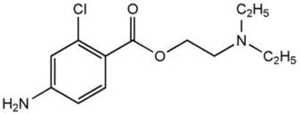

2-Chloroprocaine (Nesacaine) in Neuraxial OB    body {font-family: 'Open Sans', sans-serif;}

### 2-Chloroprocaine (Nesacaine) in Neuraxial OB

**_Class:_** _An Ester type Local Anesthetic, short-acting  
_Quick onset and short-acting.  
Do not use with plasma Pseudocholinesterase deficiency or hepatic disease.\- In OB, the only time we will ever use 2% or 3% Chloroprocaine is for an urgent C-section for patients who have a previously placed epidural.  
\- Obstetric Anesthesia textbooks will all mention that NaHCO3 can be added to it (or added to Lidocaine) to quicken the onset.  
  
\- Realistically, 2% Lidocaine is far more commonly administered per epidural for urgent C-sections than 3% Chloroprocaine.  
\- NaHCO3 is rarely added to quicken the onset.  
**Epidural Dose:  
**\- 10mL of 2% 2-Chloroprocaine provides adequate analgesia for 45-60 minutes.  
\- 2% 2-Chloroprocaine for analgesia (when muscle relaxation is not needed)  
\- 3% 2-Chloroprocaine for analgesia and muscle relaxation  
\- Redose every 30 minutes for surgical anesthesia  
  
Chloroprocaine usually needs rebolusing of epidural catheters every 30 minutes.  
table.tableizer-table { font-size: 12px; border: 1px solid #CCC; font-family: Arial, Helvetica, sans-serif; } .tableizer-table td { padding: 4px; margin: 3px; border: 1px solid #CCC; } .tableizer-table th { background-color: #104E8B; color: #FFF; font-weight: bold; }

| Agent | Conc. | Onset | Sensory  
Block | Motor Block | Plain  
Solution | With Epi  
(1:200,000) |
| --- | --- | --- | --- | --- | --- | --- |
| 2-Chloroprocaine | 2% | Fast  
10-15 minutes | Analgesic | Mild | 45-60 mins | 60-90 mins |
| 2-Chloroprocaine | 3% | Same | Dense | Dense |   |  |

_With epidurals, we usually do not add epinephrine to a local anesthetic to increase duration because we can redose it.  
_  
**Difference between Procaine and Chloroprocaine:**  
\- A chlorine atom is added to the benzene ring of Procaine, and it becomes Chloroprocaine.  
\- Hydrolyzed four times faster than Procaine by plasma cholinesterase.  
**Drawbacks**  
Chloroprocaine may interfere with the action of epidurally administered opioids because it antagonizes μ- and κ-opioid receptors.

****

**The two ways you could tell that Chloroprocaine is an amide are:**  
\- Chloroprocaine only has one “I” in the drug name.  
\- It has a C=O bond connected to the aromatic ring.  
\- An Ester has an NH group connected to the aromatic ring.  
  
Chloroprocaine has a relative potency of 1 on an arbitrary scale of 1 - 6.  
Chloroprocaine is fast in onset despite its high pKa; probably because at 3%, it has far more molecules to diffuse the nerve than the other lower concentrated local anesthetics.  
  
**Epidural:** 2-3%  
**Onset:** 6 minutes  
**Duration:** 30-60 mins  
**Max Dose:** w/o Epi: 800mg (or 10mg/kg)  
**Max Dose:** with Epi: 1,000mg  
**Infiltration:** 1%  
**Onset:** Fast  
**Duration:** 30-60 mins  
**Max Dose:** w/o Epi: 800mg  
**Max Dose:** w/ Epi: 1,000mg  
**Peripheral Nerve Block:** 2%  
**Onset:** Fast  
**Duration:** 30-60 mins  
**Max Dose:** w/o Epi: 800mg  
**Max Dose:** with Epi: 1,000mg  
**Spinal:** 2-3% (Not used a spinal in OB)  
**Onset:** Fast  
**Duration:** 30-60 min  
  
**Mechanism of action:** Like other local anesthetics, it binds to the intracellular portion of sodium channels and blocks sodium influx into nerve cells, which prevents depolarization.  
**pKa:** 8.9  
  
**Metabolism:  
\-** Hydrolyzed rapidly by plasma Pseudocholinesterase to 2-chloro-4-aminobenzoic acid and 8-diethylaminoethanol (80% conjugated before elimination).  
\- Pregnant women have 30-40% less plasma Pseudocholinesterase activity.  
\- The para-aminobenzoic acid metabolite of chloroprocaine inhibits the action of sulfonamides.  
\- Therefore, chloroprocaine should not be used in any condition in which a sulfonamide drug is employed.  
  
**Metabolite:** PABA  
**Half-Life:** 22 seconds > than 1 minute in pregnant women.  
\- The para-aminobenzoic acid (PABA) metabolite of chloroprocaine inhibits the action of sulfonamides.  
\- Therefore, chloroprocaine should not be used in any condition in which a sulfonamide drug is employed.  
  
**Excretion:  
**Urine - minimal as unchanged drug in urine.  
  
**Metabolites:** Metabolites excreted unchanged.  
  
**Manifestations to watch for:**  
Euphoria  
Dizziness  
Tinnitus  
Twitching  
Tremors  
Convulsions  
Hypotension  
Cardiac Arrest  
  

Cohen SE, Thurlow A: Comparison of a chloroprocaine--bupivacaine mixture with chloroprocaine and bupivacaine used individually for obstetric epidural analgesia. Anesthesiology 1979; 51: 288-92  
  
20\. Corke BC, Carlson CG, Dettbarn WD: The influence of 2-chloroprocaine on the subsequent analgesic potency of bupivacaine. Anesthesiology 1984; 60: 25-7  
  
Galindo A, Witcher T: Mixtures of local anesthetics: bupivacaine-chloroprocaine. Anesth Analg 1980; 59: 683-5  
  
Kuhnert BR, Kuhnert PM, Phillipson EH. The half-life of 2-Chloroprocaine . Anesth Analg 1986, 65:273-8  
  
O’Brian, JE, Abbey V, Hinsvark,O. Metabolism and measurement of Chloroprocaine, an ester –type local anesthetic  
  
IFNA / International Federation of Nurse AnesthetistsDeveloping Countries Regional Anesthesia Lecture Series  
Daniel D. Moos CRNA, Ed.D. U.S.A.  
Chestnut, David.(2014) Chestnut’s Obstetric Anesthesia Principles and Practice.  
  
Miller RD, Eriksson LI, Fleisher L, Wiener-Kronish JP, Young WL. Miller’s Anesthesia, 7th ed. Philadelphia, PA: Churchill Livingstone; 2009: 924, 2218-9.