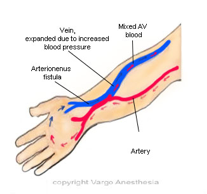

A-V (Arteriovenous) Fistula for Hemodialysis    body {font-family: 'Open Sans', sans-serif;}

### A-V (Arteriovenous) Fistula for Hemodialysis

AV fistula is the surgical connection of a vein and an artery, usually in the forearm, to allow hemodialysis access to the vascular system.  
\- When the vein and artery are joined, the vein gradually becomes larger and stronger, creating the fistula that provides excellent vascular access.  
\- It may take months before the vein can be accessed for dialysis.  
**Note:** An AV fistula can be congenital, but in this case, it’s surgical.

****

**Anesthetic:** Usually, a MAC  
\- Hopefully, the surgeon will administer an effective local injection.  
\- A low dose propofol infusion tends to offer a low maintenance case.  
\- 10-20 mg of ketamine prior to local injection enhances sedation  
\- Use a Salter NC with ETCO2 sampling.  
**\- General anesthesia with an LMA or ETT:** Sometimes  
**\- Supraclavicular nerve block:** The block of choice, but not as common as general anesthesia.  
**Note:** An Interscalene block will not cover the ulnar portion of the forearm.  
  
**Your biggest concerns:  
The last time the patient was dialyzed:** These patients may be hyperkalemic, hypervolemic or volume-depleted.  
  
These patients usually have a permacath for dialysis and should not be hyperkalemic.  
**Most recent K+:** Hyperkalemia worsens with HYPOventilation.  
\- As a result of sedation, the patient may HYPOventilate while maintaining adequate oxygenation (without a change in SaO2).  
\- The body compensates for the respiratory acidosis (even if it’s minor) by exchanging H\+ ions for K+ at the cellular level, and now their K+ has increased even more.  
\- This is when you may see cardiac side effects of hyperkalemia on your monitor (PVCs, V-Tach, etc.).  
**  
Accepted K+ levels for this procedure:  
**\- Depends on the situation and doctor comfort level.  
\- I’ve seen 5.2-5.9 K+ levels. It is very rare to proceed with a K+ > 6.0 meq/L.  
\- The higher the K+ level, the less sedation.  
\- Check to see if the patient is or has recently been having PVCs.  
**  
Other Concerns:**  
**Concerns:** These patients usually always come to the OR with comorbidities like PVD, DM, COPD, HTN, MO with OSA, and renal disease.  
**Diagnosis:** ESRD  
**Duration:** 1-2 hours  
**Position:** Supine with surgical arm out on an arm/hand table and the bed rotated for the surgeon.  
**Antibiotics:** Usually cefazolin (Ancef®)  
**EBL:** 10-50 mLs  
**IV Access:** 20 G is acceptable  
\- These patients often have difficult IV access.  
\- Sometimes, you may have to use with a 22 G or consider their feet for IV access.  
\- Remember, you cannot access the surgical arm.  
  
**Possible Complications:  
**\- Bleeding  
\- Infection  
\- Non-maturation: When the vein does not enlarge enough or becomes thick-walled enough to be used for dialysis.  
\- Fistula or graft aneurysm.  
\- AV fistula or graft stenosis or clot  
  
**More Notes:  
Three common forms of Hemodialysis access:  
Native A-V Fistula:** NO artificial graft; this is the best material to work with.  
**A-V shunts:** Using graft material (AV graft)  
**Tunneled double-lumen catheters:** Permacath (temporary)  
**  
Advantages of a native AVF:  
**\- Superior primary patency rates, the lowest rates of thrombosis, and they require the fewest secondary interventions of any type of access.  
\- Longer hemodialysis access survival rates.  
\- Lower rates of infection than AV grafts and percutaneous catheters.  
\- Lower hospitalization rates than patients.  
\- Cheaper cost of implantation and maintenance.  
  
**Common nonurgent treatment for hyperkalemia** table.tableizer-table { font-size: 12px; border: 1px solid #CCC; font-family: Arial, Helvetica, sans-serif; } .tableizer-table td { padding: 4px; margin: 3px; border: 1px solid #CCC; } .tableizer-table th { background-color: #104E8B; color: #FFF; font-weight: bold; }

| Med | Doses | Route | Onset | Duration |
| --- | --- | --- | --- | --- |
| Glucose (D50W)  
and Insulin  
infusion | 50 mL  
10u regular  
insulin | IV | 30 mins | 4-6 hours |
| Albuterol  
breathing  
treatment | Standard aerosol  
(unit dose) | Inhalation | 30 mins | 2 hours |

**  
Emergency treatment for hyperkalemia is indicated when there is evidence of impending cardiac arrest.  
(EKG may exhibit loss of P wave and widening of the QRS)**

table.tableizer-table { font-size: 12px; border: 1px solid #CCC; font-family: Arial, Helvetica, sans-serif; } .tableizer-table td { padding: 4px; margin: 3px; border: 1px solid #CCC; } .tableizer-table th { background-color: #104E8B; color: #FFF; font-weight: bold; }

| Med | Doses | Route | Onset | Duration |
| --- | --- | --- | --- | --- |
| 10% calcium chloride or  
10% calcium gluconate | 10 ml over 10 min  
10 mL over 10 min | IV  
IV | 1-3 min  
1-3 min | 30-60 min  
30-60 min |

**Or** table.tableizer-table { font-size: 12px; border: 1px solid #CCC; font-family: Arial, Helvetica, sans-serif; } .tableizer-table td { padding: 4px; margin: 3px; border: 1px solid #CCC; } .tableizer-table th { background-color: #104E8B; color: #FFF; font-weight: bold; }

| Med | Doses | Route | Onset | Duration |
| --- | --- | --- | --- | --- |
| Na Bicarbonate | 50-100 mEq over 10 min | IV | 5-10 mins | 1-2 hours |

**Mechanism of action:  
Calcium:** Immediate resting membrane stabilization  
It does not promote the intracellular shift or elimination of K+.  
**Na Bicarbonate:** Shifts potassium intracellularly.  
**Notes:** Calcium chloride is more irritating to the veins than calcium gluconate.  
  

Jaffe, Richard A. _Anesthesiologist's Manual of Surgical Procedures_ ., 2012.  
  
Kalbande, Manohar B. _Vascular Surgery Made Easy_ . 2013.  
  
Macksey, Lynn Fitzgerald. _Surgical Procedures and Anesthetic Implications: A Handbook for Nurse  
Anesthesia Practice_ . Sudbury, MA: Jones & Bartlett Learning, 2012.  
"Vascular Access, Arteriovenous Fistula, Arteriovenous Graft, Venous Catheter." _Vascular Access, Arteriovenous Fistula, Arteriovenous Graft, Venous Catheter_ . Keck School of Medicine, USC, n.d. https://tinyurl.com/bdcmzjka  
  
Updated Treatment Options in the Management of Hyperkalemia  
US Pharmacist (accessed 07/2020)Kimberly Erin Ng, PharmD, BCPS and Chung-Shien Lee, PharmD, BCPS, BCOP  
https://tinyurl.com/3m5avesf  
  
Pro/Con Debate: Hyperkalemia-Should Surgery Proceed when Potassium Levels are Moderately High?  
Translational _Perioperative_ and _Pain Medicine_ 2019; 6 (1):17-19  
Huang L, Yarl W, Liu H.  
  
Hyperkalemia Management  
Family Practice Notebook (accessed 07/2020)  
https://fpnotebook.com/renal/potassium/hyprklmmngmnt.htm  
  
Nurse Anesthesia 6th Ed. 2018 ; pp. 364  
J. Nagelhout and S. Elisha  
  
Management of severe hyperkalemia.  
Critical Care Medicine. 2008;36(12):3246-3251.  
Weisberg LS.  
  
Disorders of potassium balance  
AMBOSS (accessed 07/2020)  
https://tinyurl.com/t74zxjvt