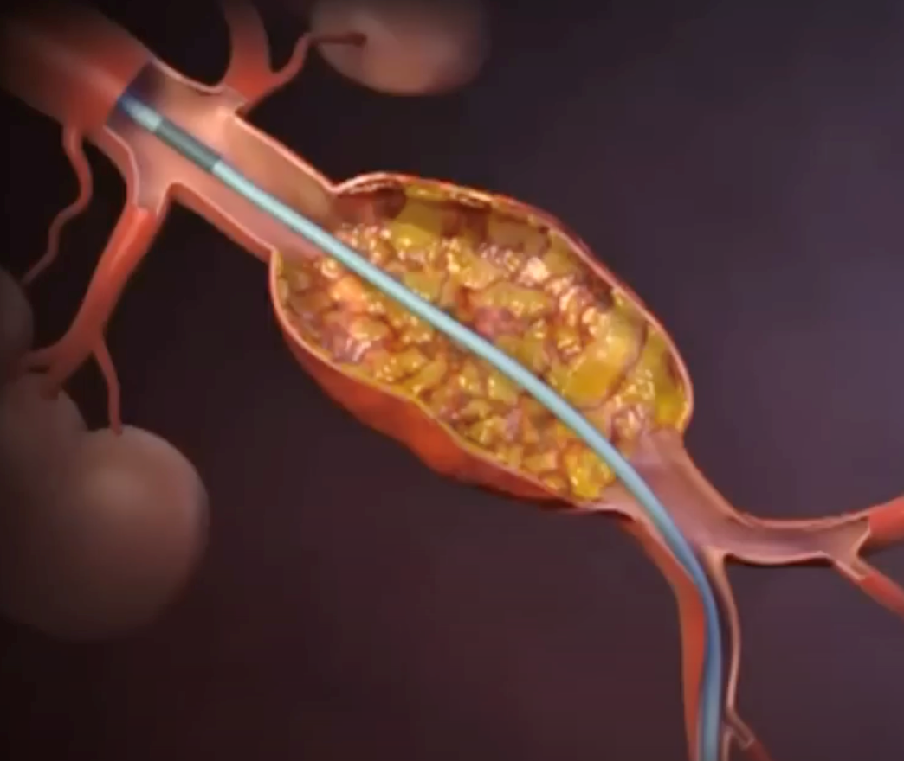

  AAA Repair-Endovascular (EVAR) section { margin-bottom: 20px; } h3, p { margin: 0px; padding: 0px; } img { width: 200px; height: auto; }

### AAA Repair- Endovascular (EVAR)

  

A minimally invasive endovascular procedure that involves the placement of a bifurcated or tubular stent graft inside the aortic aneurysm that is threaded up from the groin with a long delivery catheter.

This procedure contrasts with the open AAA repair that involves a large abdominal incision.

  
  
  
  

This procedure involves fluoroscopy, requiring a lead apron and thyroid shield.

Most of these procedures are performed in a vascular “Hybrid Room” that combines a vascular and an operating room.

**Type of Patients:** These patients are usually elderly and have a cardiac history involving other comorbidities.

**Goal:** Treat this like an aneurysm patient and prevent rapid increases in BP (avoid challenging the aneurysm)

**Caution:**Many of these patients have a very high baseline BP.

**Room Set-Up**

Arterial line

**Antihypertensive agent infusion:** (Nicardipine or NTG) + diluted 10cc syringe

**Pressor infusion:** Usually, Phenylephrine + 10 cc syringe

Note: Some anesthesia providers prefer norepinephrine.

Heparin

**Emergency meds and equipment readily available:**

Esmolol (Sometimes used just prior to direct laryngoscopy)

Norepinephrine (Usually not needed unless the patient has a low EF)

Epinephrine (Usually not needed)

Labetalol (Can be used to prevent hypertension with emergence)

Blood tubing and fluid warmer

If the aneurysm is a slow bleed, some anesthesia providers will prime the Levophed.

**ACT equipment:**

Some surgeons or institutions still desire to monitor ACTs.

**If it is anesthesia’s responsibility, have the following:**

ACT cartridges and machine

1 cc syringes

**Note:** Many experienced surgeons only take 60-90 minutes to perform this procedure, only require one to two doses of heparin, and do not request ACTs.

**Anesthetic:** General/ETT. Theoretically, these patients do not need to be intubated.

However, we usually intubate these patients anyway if something goes terribly wrong with the aneurysm.

If there is a significant hemorrhage, you don’t want the patient awake.

A spinal, epidural, or local with MAC is rare.

**IV Access:** 2 large bore IVs

**Arterial line:** Yes

**Type and screened or crossed:** Yes

Though a hemorrhage is rare with experienced surgeons, blood products should be available.

**Breath holding:** The surgeon will ask you periodically to hold ventilation while injecting vascular dye.

**Emergence:** Ask the surgeon for a desired BP (usually systolic < 160 mmHg).

Consider IV Labetalol (as an adjunct) to NTG or Nicardipine.

Consider having an NTG or Nicardipine infusion connected to the patient with emergence and for transport.

Note: Nicardipine infusion is now more popular

**Post extubation:** Transport with portable monitor to either PACU or ICU.

**Transport:**

Bring the necessary syringes of BP meds with you.

It is highly recommended not to arrive at ICU or PACU with a severely hypertensive patient.

**Is Blood Available in the room?**

For bleeding patients or inexperienced vascular surgeons.

**Possible Complications:**

**Ruptured Aneurysm:** Very rare.

Give blood and pressors.

Sometimes, the surgeon will convert to open.

Local wound complications include groin hematoma, infection, and lymphocele, which occur in 1 to 10% of cases.

**Access Artery Injury:** Arterial thrombosis, dissection, or pseudo-aneurysm formation can occur.

Sometimes, the large catheter system of the stent graft (commonly between 20- and 24 French) is too large for a calcified iliofemoral vessel.

In this case, the surgeon may abort the EVAR or convert it to an iliac conduit.

**IV Contrast Nephrology:** 50 to 100mL of dye is needed for an EVAR procedure.

Contrast-induced nephropathy, resulting in acute renal failure, occurs in 6.7% of cases, according to a nationwide survey by Wald et al.

**Ischemic Complications Immediately after EVAR:**

Clot formation or clot embolization into the aortic side branches may lead to colonic, renal, and pelvic ischemia.

Adversely, misplacement of the stent graft might occur, thereby partially or completely covering an aortic or iliac side branch.

This can result in renal or pelvic ischemia.

**Bowel ischemia:**

It occurs in 1 to 3% of all cases after an open aortic aneurysm repair, and the incidence seems to be the same with an EVAR.

**Spinal Cord Ischemia:**

Data suggests that this is very rare: < .21%.

While this is not entirely understood, atheromatous embolization, interruption of collateral circulation from lumbar and internal iliac arteries, and variable anatomy of the Adamkiewicz artery seem to be the most common contributing factors to cord ischemia.

**Renal artery occlusion from stenting and retrieval of the stent graft:**

Not correctly placing the stent may occlude one or both renal arteries.

**Causes of both Early and Late Limb Occlusion after EVAR:**

Limb kinking of the unsupported endograft limb.

The second-generation supported stent grafts perform better than the older unsupported endografts.

Most thrombotic events occur within the first two months after EVAR, and stent-graft kinking is the most common underlying cause of limb thrombosis.

**Infection Complications after EVAR:**

The incidence of aortic stent-graft infection is 0.5 to 1%, and untreated stent-graft infection can result in generalized sepsis and death.

Jaffe, Richard A. _Anesthesiologist's Manual of Surgical Procedures_., 2012.

  

Kalbande, Manohar B. _Vascular Surgery Made Easy_. 2013.

  

Macksey, Lynn Fitzgerald. _Surgical Procedures and Anesthetic Implications: A Handbook for Nurse_

  

_Anesthesia Practice_. Sudbury, MA: Jones & Bartlett Learning, 2012.

  

Maleux, Geert, M.D.,PhD, Marcel Koolen, M.D., and Sam Heye, M.D. "Complications after Endovascular

Aneurysm Repair." _Seminars in Interventional Radiology_26.01 (2009): 003-09. Web.

  

Moore, Wesley S., M.D. _Vascular and Endovascular Surgery: A Comprehensive Review Expert_

_Consult:_2013