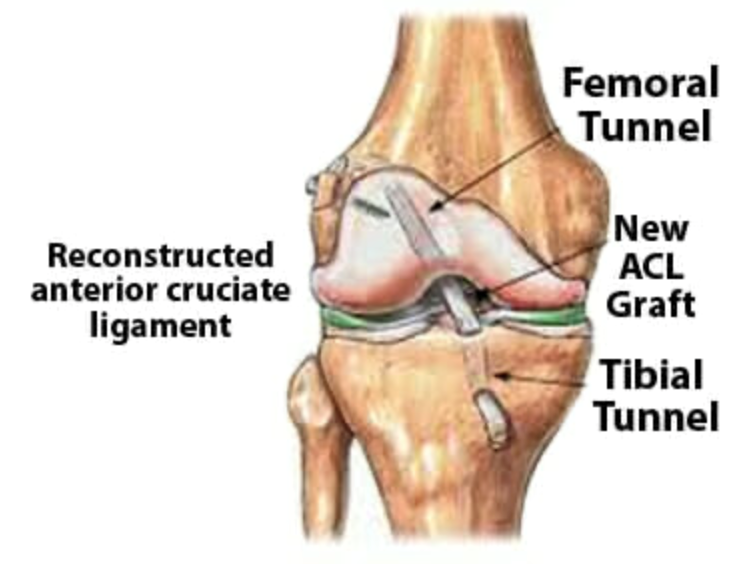

  Appendectomy section { margin-bottom: 20px; } table { border-collapse: collapse; } table, tr, th, td { border: 1px solid black; } h3, p, ol.custom-counter, li { margin: 0px; padding: 0px; } .text-red { color: red; } .text-black { color: black; } ul.custom-dash { list-style: none; padding-left: 0; margin: 0; } ul.custom-dash > li { display: flex; align-items: flex-start; } ul.custom-dash > li::before { content: "–"; margin-right: 0.5em; flex-shrink: 0; line-height: 1; } ul.custom-dash > li > \*:not(::before) { flex: 1; } ul.custom-dash > li.no-dash::before { content: ""; width: 1em; margin-right: 0.5em; flex-shrink: 0; } /\* Change the ol style \*/ ol.custom-counter { list-style: none; counter-reset: custom; padding-left: 0; } ol.custom-counter li { counter-increment: custom; margin-bottom: 5px; } ol.custom-counter li::before { content: counter(custom) ") "; font-weight: bold; } /\* This is just for this file \*/ ul.custom-bullet-arrow { list-style: none; padding-left: 0; margin: 0; } ul.custom-bullet-arrow > li { display: flex; align-items: flex-start; } ul.custom-bullet-arrow > li::before { content: "↑"; margin-right: 0.5em; flex-shrink: 0; } ul.custom-bullet-arrow > li.no-arrow::before { content: ""; width: 0.5em; margin-right: 0.5em; flex-shrink: 0; } ul.custom-bullet\_arrow ul { list-style-type: disc; padding-left: 1.5em; margin-top: 0.5em; } img.resized-200 { width: 200px; height: auto; } img.resized-400 { width: 400px; height: auto; } .mb-10px { margin-bottom: 10px; } .mb-20px { margin-bottom: 20px; } .reference-notes { font-size: 11px; } .text-indent-45px { text-indent: 45px; }

### ACL and/or MCL Knee Repair

**Anterior Cruciate Ligament (ACL)**

**Medial Collateral Ligament (MCL)**

-   Most of these procedures are performed on young, healthy athletes.
-   ACL and MCL tears are often performed together, along with the Lateral Meniscus repair.
-   The repair is usually done via knee arthroscopy.

-   A tissue (graft) will replace the damaged ligament.
-   The graft will be from either a cadaver (Donor Graft) or from one of the patient's own hamstring tendons (autograft).
-   The autograft appears to be more popular.
-   You need to find out ahead of time if the surgeon will be using an autograft instead of a donor graft.
-   Retrieving the patient's own hamstring tendon (autograft) may involve a larger incision and require an extra regional block pre-operatively for posterior knee pain.

**The Procedure:**

-   The torn ligament will be removed with a shaver or other instruments.
-   A new graft will replace the damaged ligament.
-   The surgeon makes tunnels in the bone to bring the new graft through.
-   This new graft will be placed in the same location as the old ligament.
-   The surgeon will then attach or anchor the new ligament graft to the bone with screws or other devices to hold it in place.
-   As it heals, the bone tunnels fill in.
-   This secures the new ligament.

**Types of Homografts:**

Bone-patella tendon-bone (BTB) graft

Semitendinosus (hamstring) from the gracilis muscle (ST-G) graft is a bit more popular.

**Optional regional blocks for knee surgery:**

**Abductor canal block (saphenous block) or Femoral nerve block.**

Many knee surgeons do not mind the postoperative quad weakness with femoral nerve blocks.

**When grafts are utilized:**

**Patella autograft:** No extra block needed.

**If autograft from hamstring:** Posterior knee pain will need covered.

**Sciatica block:** Covers posterior leg pain but may cause foot drop that increases fall risk.

**IPACK Block:** Covers the posterior knee.

**NOTE:** A tourniquet will be utilized.

The distribution of the nerve block may not cover some parts of the thigh, where the tight tourniquet may cause discomfort.

**Anesthesia:** General/ETT or LMA

**TIVA/ETT:** Propofol infusion and ETT are becoming very common.

**LMA-** Not as common and is acceptable if there is no aspiration risk.

Nasal cannula with low-dose Propofol infusion (combined with spinal/regional) is very rare.

You must consider duration, tourniquet time, and patient desires.

**Position:** Supine with arms out, leg placed in an arthroscopic leg holder.

**Duration:** 2-4 hours, depending on the surgeon

**IV Access:** 20G is acceptable

**EBL:** Minimal, a tourniquet is being used.

**Possible Complications:**

Embolus

Bleeding

Infection

Thrombophlebitis

**More Notes:**

-   The knee is continuously irrigated heavily by the surgeon.
-   Be aware of floor water (NS or LR) invading your area.
-   Just throw some blankets over the water.

An ACL injury is the over-stretching or tearing of the ACL.

It may be partial or complete.

**Four main ligaments connect these two bones:**

**Medial collateral ligament (MCL):** Runs along the inside of the knee and prevents the knee from bending out.

**Lateral collateral ligament (LCL):** Runs along the outside of the knee and prevents the knee from bending in.

**Anterior Cruciate Ligament (ACL):** In the middle of the knee. It prevents the tibia bone from sliding out in front of the femur.

**Posterior cruciate ligament (PCL):** Works with the ACL. It prevents the tibia from sliding backwards under the femur.

Women are more likely to have an ACL tear than men.

Boezaart, André P. _Anesthesia and Orthopaedic Surgery._ New York: McGraw-Hill Medical Pub. Division,

2006.

Jaffe, Richard A. _Anesthesiologist's Manual of Surgical Procedures.,_ 2012.

Macksey, Lynn Fitzgerald. _Surgical Procedures and Anesthetic Implications: A Handbook for Nurse Anesthesia_

_Practice._ Sudbury, MA: Jones & Bartlett Learning, 2012.

Miller, Mark D., Thompson, and Hart. _Review of Orthopaedics._ Philadelphia, PA: Saunders, 2012.