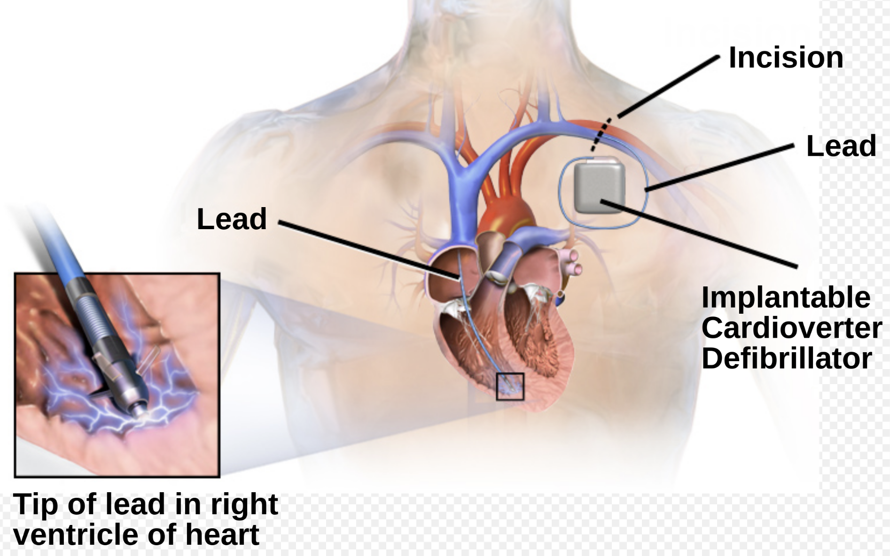

AICD Insertion    body {font-family: 'Open Sans', sans-serif;}

### AICD Insertion

****

This procedure is performed under fluoroscopy in the EP lab.  
You will need a lead apron.  
  
For an AICD insertion, the surgical procedure and anesthesia are similar to a pacemaker insertion.  
Unfortunately, many AICD recipients have a compromised ventricular function (low EF).  
It is not uncommon for your patient to have an EF of 20-30%  
  
**Indications for AICD from the American College of Cardiology (ACC)/American Heart Association (AHA) and European Society of Cardiology:**  
With Left Ventricular Ejection Fraction (LVEF) ≤ 35% due to prior Myocardial Infarction (MI) who are at least 40 days post-MI and are in NYHA Functional Class II or III.  
With Left Ventricular (LV) dysfunction due to prior MI, who are at least 40 days post-MI, have an LVEF ≤ 30%, and are in NYHA Functional Class I.  
With nonischemic Dilated cardiomyopathy (DCM) who have an LVEF ≤ 35% and who are in NYHA Functional Class II or III.  
With nonsustained VT due to prior MI, LVEF < 40%, and inducible VF or sustained VT at electrophysiological study.  
With structural heart disease and spontaneous sustained VT, whether hemodynamically stable or unstable.  
With syncope of undetermined origin with clinically relevant, hemodynamically significant sustained VT or VF induced at electrophysiological study.  
**Pre-op:**  
It would be best if you found out the patient’s EF.  
Most EF results can be found under the cardiologist’s notes.  
A low-dose infusion of norepinephrine among anesthesia providers is becoming more common as the rescue medication of choice for anesthesia-induced hypotension in these patients with a low EF.  
Norepinephrine infusion starting at 0.01-0.02 mcg/kg/min and titrate to effect is a common infusion dose for anesthesia providers.  
  
**Ask the patient about positioning.**  
Can the patient lie flat without getting dyspneic?  
If the patient has difficulty breathing while supine, consider intubating the patient.  
**  
Procedure:  
**A small incision approximately 2 inches long will be made in the upper chest below the clavicle.  
A subcutaneous pocket is made for the pacemaker.  
Through the pocket, the cardiologist locates the subclavian vein and inserts a guide wire down into the RV of the heart.  
At this time, you might see some PVCs from ventricular irritation on your monitor until the guide wires or leads are repositioned.  
  
Once the cardiologist starts to close the subcutaneous pocket (incision), you can stop sedation because the insertion area is already numb from the initial local injection.  
  
**Note:** Cardiologists are no longer testing the AICD after implantation prior to closing the subcutaneous pocket.  
  
Remember, patients with low CO and EF have a delay before the sedation doses take effect due to compromised circulation.  
So, it takes an extra minute or two to decrease their LOC.  
So don’t be impatient and end up administering too much sedation.**Anesthetic:** Usually a light MAC.  
**Duration:** 1-2 hours  
**Position:** Supine with arms tucked.  
**A-line:** Not required  
**IV access:** It is common for two IVs as both arms will be tucked, and one can be used as a backup.  
  
**Neosynephrine drip:** Administered as needed for anesthesia-induced hypotension for patients with a normal EF.  
**Pressors:** Ephedrine, epinephrine and norepinephrine should always be available for all EP lab procedures.  
**Low Dose Propofol infusion (50 mcg/kg/min):** This is a common dose after 50-100 mcg of fentanyl.**A higher dose of propofol, 100 -150 mcg/kg/min,** may be required when propofol is the sole sedation agent.  
  
**Propofol bolus:** A small bolus of 30-50 mcg of propofol is commonly administered just prior to local injection.  
  
**Remove the patient’s pillow and chin lift:** This maneuver may help open the airway of patients experiencing upper airway obstruction.**Oral airway:** This can be utilized, but the patient must be deep enough, or it will initiate coughing.  
  
**Nasal airways used orally:** Some anesthesia providers will pass a nasal airway just past the tongue (via orally, not nasally) as it is less stimulating than an oral airway.**EBL:** Minimal  
  
**ICD Surgical Complications:** 2-3%  
The mortality rate from an ICD insertion is <1%.  
**  
Possible Complications:**  
Bleeding  
Pneumothorax  
Infection  
Lead dislodgement  
Problems with the AICD working properly  
Cardiac Arrest and death.**  
More Notes:  
**The AICD leads can be placed in both ventricles (biventricular) depending on the patient's needs.  
By simultaneously pacing both ventricles, the AICD may restore normal heart synchronization.  
  
**Biventricular AICD:** When you find out the AICD insertion is a biventricular ICD, you know your patient’s heart is probably compromised with an EF < 20%.  
The patient may have a more severe history of heart failure than the regular AICD patient.  
  
Additionally, the physician may prefer that ICD patches be sewn onto the heart’s surface rather than placed internally using the venous approach.  
Sometimes, these devices are combined into an ICD-Bi-V pacemaker.  
When transvenous attempts fail or if the placements of patches on the heart are preferable to catheter leads, surgery is necessary.  
**Intubation equipment:** Always have it ready if the patient fails to return to a safe arrhythmia.  
This might be when the cardiologist calls a code!  
  
**Crash Cart:** The EP staff will connect the patient to the defibrillator before the procedure starts in case it is needed  

Cardiac Surgery Associates, SC. "Automatic Implantable Cardioverter Defibrillators."  
  
Jaffe, Richard A.  _Anesthesiologist's Manual of Surgical Procedures_ . Philadelphia, Pa.: Lippincott Williams & Wilkins, 2009.  
Macksey, Lynn Fitzgerald.  _Surgical Procedures and Anesthetic Implications: A Handbook for Nursing Practice_ . Sudbury, MA: Jones & Bartlett Learning, 2011.   
  
2012 ACCF/AHA/HRS Focused Update Incorporated Into the ACCF/AHA/HRS 2008 Guidelines for Device-Based Therapy of Cardiac Rhythm Abnormalities" .   
Journal of the American College of Cardiology. January 2013  
Tracy, Cynthia M.; Epstein, Andrew E.; Darbar, Dawood; DiMarco, John P.; Dunbar, Sandra B.; Estes, N.A. Mark; Ferguson, T. Bruce; Hammill, Stephen C.; Karasik, Pamela E.; Link, Mark S.; Marine, Joseph E.; Schoenfeld, Mark H.; Shanker, Amit J.; Silka, Michael J.; Stevenson, Lynne Warner; Stevenson, William G.; Varosy, Paul D.