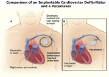

AICD Insertion     body {font-family: 'Open Sans', sans-serif;} img {max-width:500px; width:100%; min-height:200px;}

### AICD Insertion

A minimally invasive procedure that usually does not involve anesthesia unless the patient has a difficult-appearing airway or is a conscious sedation concern. Today, we have more complicated OSA or high-risk patients that require our service.

For an AICD insertion, the surgical procedure and anesthesia are similar to a pacemaker insertion. However, at the end of the case, the cardiologist will test the AICD by inducing either V-Tach or V-fib. It is our job to deepen the patient prior to defibrillation. Be careful not to administer too much medication because of the patient’s compromised EF; the patient might drop their BP precipitously.  
  
**Pre-op:** You need to find out the patient’s EF. You know it’s probably going to be low.  
Can the patient lie flat without getting dyspneic? If the patient looks terrible and working hard at breathing while lying flat, you may consider intubating.

**Procedure:**  
A small incision approximately 2 inches long will be made in the upper chest below the clavicle. A subcutaneous pocket is made for the pacemaker. Through the pocket, the cardiologist locates the subclavian vein and inserts a guide wire down into the RV of the heart. At this time you might see some PVCs from ventricular irritation on your monitor until the guide wires or leads are repositioned. This is all done under fluoroscopy, so you will need a lead apron.

Once the leads are in place, the cardiologist will warn you that he/she is ready to test the defibrillator. Assess your patient. Depending on your patient’s EF, etc., you can use a small bolus of Propofol or Amidate. I have also seen Precedex and Versed administered instead of Propofol or Amidate.

It sounds cruel, but our concern is that we don’t want the patient to remember! It’s OK if the patient responds with a grunt or a moan. As long as they don’t remember and you did not bottom out the patient’s BP, then you succeeded.

Once the cardiologist is satisfied, the generator unit is connected and placed in the patient’s subcutaneous pocket and sutured closed. You can stop sedation because the area of insertion is already numb from the initial local injection.

**Anesthetic:** Usually a light MAC. PEC I block is an option to decrease the level of needed sedation.

**Duration:** 1-2 hours  
**Position:** Supine with arms tucked.  
**A-line:** Not required  
**IV access:** 1or 2 lines, depending on the physical status of the patient.  
**Neosynephrine drip:** Usually ok, but some cardiologists do not want it given.  
**Diluted Ephedrine and Epi:** Yes, have some handy.  
**Low Dose Propofol or Etomidate:** Yes, to deepen the patient when needed. 30mg of Propofol is a popular dose.

Remember, these patients have a low CO and EF, so it takes an extra minute or two to decrease their LOC. So don’t be impatient and end up administering too much sedation.   
  
**Intubation equipment:** Always have it ready in case the patient fails to return to a safe arrhythmia. This might be when the cardiologist calls a code!  
  
**Crash Cart:** The EP staff will already have the patient connected to the defibrillator before AICD is tested. Unfortunately, many times the EP nurses do not have their emergency rescue meds drawn up.  This is why we have our emergency meds readily available.  
  
**EBL:** Minimal  

**More Notes:**  
Depending on the needs of the patient, the leads of an AICD can be placed in two of the ventricles depending on the needs of the patient. This is a Bi-ventricular ICD. By simultaneously pacing both ventricles, the AICD may restore normal heart synchronization. Most AICD candidates have a very sick heart with an EF around 20-30%.  
  
**Biventricular AICD -** When you find out the AICD insertion is a biventricular ICD, you know your patient’s heart is probably really sick with an EF < 20%. The patient may have a more severe history of heart failure than the regular AICD patient. So keep your guard up.

**ICD Indications** Initially, ICDs were placed for VT or VF. Currently, any patient with significant cardiomyopathy (EF ≤ 35%) will likely be a candidate for an ICD placement.

Additionally, the physician may prefer that ICD patches are sewn onto the heart’s surface rather than placed internally using the venous approach. Sometimes these devices are combined into an ICD-Bi-V pacemaker. When transvenous attempts fail or if the placements of patches on the heart are preferable to catheter leads, surgery is necessary.

**ICD Surgical Complications:** 2-3%  
The mortality rate from an ICD insertion is <1%.  

**Possible Complications:**   
Bleeding  
Pneumothorax  
Infection  
Lead dislodgement  
Problems with the AICD working properly  
Cardiac Arrest and death

Cardiac Surgery Associates, SC. "Automatic Implantable Cardioverter Defibrillators."

Jaffe, Richard A. _Anesthesiologist's Manual of Surgical Procedures_. Philadelphia, Pa.: Lippincott Williams & Wilkins, 2009.

Macksey, Lynn Fitzgerald. _Surgical Procedures and Anesthetic Implications: A Handbook for Nursing Practice_. Sudbury, MA: Jones & Bartlett Learning, 2011.