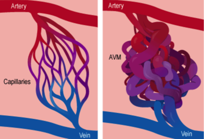

AVM Review Notes    body {font-family: 'Open Sans', sans-serif;}

### AVM (Arterio-Venous Malformation) Review Notes

_AVMs are the most dangerous of the congenital vascular malformations with the potential to rupture and cause intracranial hemorrhage and epilepsy in many cases._  
  
An AVM is an abnormal direct connection or connections between many arteries and veins without the arterioles, capillary bed and venules to buffer the pressure difference.  
They can be twisted and dilated. The portion that connects the artery to a vein is called a shunt. The increased flow of blood caused by the shunt weakens the blood vessels and may eventually rupture.  

****

  
An AVM is typically congenital and can develop anywhere in the body but occurs most often in the brain or spine. The AVM is adjacent to normal brain but does not contain brain cells within it, thus allowing removal by the surgeon.  
  
Because AVMs lack capillaries, they don’t supply the surrounding tissue with nutrients. The vascular area where all the twisted vessels are located is called a nidus (nest) of the AVM.  
  
AVMs also lack the normal cerebral blood flow mechanism of auto-regulation because it is impaired. A sudden engorgement in the AVM area can cause focal ischemia and ICP changes.  
  
Most patients, especially younger ones, do not know that they have an AVM because they can be asymptomatic. Some patients with AVMs have seizures or persistent headaches. With age, however, the risks of a rupture increase. The consequences of a rupture can be quite severe, causing a stroke and even death.  
  
Most AVMs a supratentorial.  
They are very rare and occur in less than 1% of the general population  
AVMs are associated with a 4-10% incidence of cerebral aneurysms.  
  
An AVM can put additional strain on the blood vessels and the surrounding tissues. The increased flow of blood caused by the shunt is what weakens the blood vessels.  
  
**Cause:** Unknown. Thought to be due to abnormal development of blood vessels in utero and may be present since birth.  
  
**Presentation of Brain AVM  
**Are present between the ages of 10 and 40 years.  
The patient’s age, as well as the size, location and vascular features of the AVM influence the clinical presentation which typically falls into one of four categories  
  
**Intracranial hemorrhage** (41 to 79 percent)  
Children are more likely to present with hemorrhage than adults  
Hemorrhages are usually intraparenchymal, but primary bleeding into the subarachnoid space is also common for superficial AVMs.  
  
**Seizure (11 to 33 percent)** AVMs are more likely to present with seizures.  
Epilepsy may also develop subsequent to presentation.  
treatment is offered is to try to prevent bleeding from the AVM. Bleeding may injure the surrounding brain resulting in a stroke , with possible permanent disability or even death. The risk of bleeding is 4% per year, which means that 4 out of every 100 people with an AVM will have a bleed (hemorrhage) during any one year. AVM's may also produce headaches, seizures and progressive paralysis, and the treatment may alleviate these symptoms.  
  
The AVMs formed by the great vein of Galen have the largest shunt, have the poorest prognosis, and are nearly always fatal without treatment.  
  
**AVM Hemorrhage**  
Annual hemorrhage rate of 3 percent  
The average annual mortality in patients with untreated brain AVMs ranged from 0.7 to 1.0 percent.  
**  
Rupture of Brain AVMs**  
Cause 1 to 2 percent of all strokes.  
Cause 3 percent of strokes in young adults.  
Cause 9 percent of subarachnoid hemorrhages.  
About 4% of people with AVMs experience initial bleeds each year.  
Larger AVMs occasionally may cause progressive neurological problems by putting pressure on the brain or by altering the blood flow.  
  
The risk of AVM bleeding is 4% per year, which means that 4 out of every 100 people with an AVM will have a bleed (hemorrhage) during any one year.  
AVM's may also produce headaches, seizures and progressive paralysis, and the treatment may alleviate these symptoms.  
  
**Ruptured versus unruptured AVM**  
Patients with a prior history of AVM rupture are at higher risk of subsequent hemorrhage than those without this history.  
Thus, while AVM treatment may be indicated for patients with a history of intracranial hemorrhage, particularly those with other risk factors, the available data suggest that treatment may not be indicated in most patients with unruptured AVMs, particularly those without other risk factors for hemorrhage.  
  
**Diagnosis of brain AVM  
**CT scan, MRI; Cerebral Angiography (Angiogram) is required to plan therapy  
A combination of MRI and angiography is often used to assess the likely success and risks of surgical, endovascular, or radiosurgical therapy.  
Treatment is offered is to try to prevent bleeding from the AVM.  
Bleeding may injure the surrounding brain resulting in a stroke , with possible permanent disability or even death.  
  
**Methods to Treat AVMs**  
Embolization  
Radiation  
Craniotomy  
Any combination of these methods  
  
For most cases, embolization is the safest and most effective procedure.  
  
**Embolization** (Embolotherapy or Endovascular therapy)  
This procedure involves the injection of glue or other non-reactive liquid adhesive material into the AVM in order to block it off. For this purpose, a small catheter is passed through a groin vessel all the way up into the blood vessels supplying the AVM.  
The endovascular technique carries a risk of 3-5% for a serious complication, however, it can make subsequent surgical removal of an AVM significantly safer, or can reduce the size of an AVM to a volume where radiosurgery carries a higher efficacy.  
  
**Surgical**  
Craniotomy-the surgeon goes in and clamps the feeding arteries.  
  
**Radiation**  
The radiation is focused radiation and it can be done with a Gamma Knife.  
An AVM does not grow back. The risk of bleeding is thus eliminated immediately after the surgery completely removes the AVM.  

A systematic review of the frequency and prognosis of arteriovenous malformations of the brain in adults.  
Brain 2001; 124:1900.  
Al-Shahi R, Warlow C.  
  
Clinical practice. Arteriovenous malformations of the brain.  
New England Journal of Medicine. 2007; 356:2704.  
Friedlander RM.  
  
Epileptic seizures at initial presentation in patients with brain arteriovenous malformation. Neurology 2012; 78:626.  
Garcin B, Houdart E, Porcher R, et al.  
  
Long-term hemorrhage risk in children versus adults with brain arteriovenous malformations. Stroke 2005; 36:2099.  
Fullerton HJ, Achrol AS, Johnston SC, et al  
  
The outlook for adults with epileptic seizure(s) associated with cerebral cavernous malformations or arteriovenous malformations.  
Epilepsia 2012; 53 Suppl 4:34.  
Al-Shahi Salman R.  
  
Cottrell, James E., and David S. Smith. _Anesthesia and Neurosurgery_ . St. Louis: Mosby, 2001.  
  
Fessler, Richard Glenn, and Laligam N. Sekhar, MD,FACS. _Atlas of Neurosurgical Techniques: Brain_ .  
New York: Thieme Medical, 2006.  
  
Hall, Brugge, Willinski, and Tomlinson. "Complications of Embolization of Arteriovenous Malformations of the Brain." _Journal of Neurosurgery_ 104 (2006): 226-32. No.2  
  
Newfield, Philippa, and James E. Cottrell. _Handbook of Neuroanesthesia_ . Philadelphia: Lippincott  
Williams & Wilkins, 2007.  
  
Takebayashi, Shigeo, Izumi Torimoto, and Kiyotaka Imoto. _Transcatheter Coil Embolization of Visceral  
Arterial Aneurysms_ . New York: Nova Biomedical, 2009.  
  
Natural history of cerebral arteriovenous malformations: a meta-analysis.  
Journal of Neurosurgery. 2013 Feb;118(2):437-43.  
Gross BA, Du R