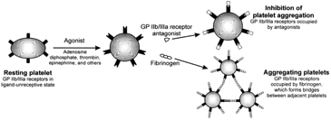

Abciximab (Reopro)    body {font-family: 'Open Sans', sans-serif;}

### Abciximab (Reopro)

**GP (Glycoprotein) IIb/IIIa Inhibitor** _Also, see “GP (Glycoprotein) IIb/IIIa Inhibitors” Link_  
  
An antigen-binding (Fab) fragment of the chimeric human-murine monoclonal antibody 7E3.  
  
**Mechanism of Action:  
**Binds to the platelet surface receptors GP IIb/IIIa and prevents he receptors from binding to fibrinogen. Inhibits platelet aggregation.  
  
**Note below on top right:** When the GPIIb/IIIa receptors are occupied, they are unable to bind to fibrinogen and other platelets.  
  
****  
  
**What are the GPIIb/IIIa receptors**  
The major platelet surface receptor for the binding of fibrinogen and von Willebrand factor. Fibrinogen needs to bind to the GPIIb/IIIa receptors to aggregate with other platelets.  
  
**Abciximab (Reopro®) is an** **“Irreversible” GP IIb/IIIa Inhibitor:** Once bound to the GP IIb/IIIa platelet receptor, it will remain bound for the life span of the platelets.  
  
**Platelets:** The general lifespan is about 8-10 days (literature varies). An average of 1011 platelets are produced daily in a healthy adult.  
  
**Indications:  
**Adjunct to Percutaneous coronary intervention (PCI)  
  
Abciximab is intended for coadministration with aspirin post-angioplasty and heparin infused and weight adjusted to maintain a therapeutic bleeding time (eg, ACT 300 to 500 seconds).**Optional Laboratory Tests:** (Platelet function should to be evaluated)  
VerifyNow IIb/IIIa test (platelet function assay)  
Multiplate (platelet function assay)  
PRP - Aggregation (platelet function test)  
PFA - 100/200 (platelet function assay)  
Whole blood aggregation (Platelet function assay)  
Plateletworks Assay (platelet function assay)  
  
Before infusion of Abciximab, platelet count, prothrombin time, ACT and APTT should be measured to identify pre-existing hemostatic abnormalities.  
  
When Abciximab is initiated 18 to 24 hours before percutaneous coronary intervention, the aPTT should be maintained between 60 and 85 seconds during the Abciximab and heparin infusion period.  
  
During percutaneous coronary intervention the ACT should be maintained between 200 and 300 seconds.  
  
If anticoagulation is continued in these patients following percutaneous coronary intervention, the aPTT should be maintained between 60 and 85 seconds.  
  
The aPTT or ACT should be checked prior to arterial sheath removal. The sheath should not be removed unless aPTT < 50 seconds or ACT < 175 seconds.  
  
**Doses for prevention of cardiac ischemic complications in patients undergoing PCI:  
**0.25 mg/kg IV bolus over at least 1 min, 10-60 min before start of PCI,  
THEN  
0.125 mcg/kg/min IV continuous infusion for 12 hr; not to exceed infusion rate of 10 mcg/min.  
  
**Unstable Angina**  
Indicated for prevention of cardiac complications in patients with unstable angina with PCI planned within 24 hours.  
0.25 mg/kg IV bolus over at least 1 minute,  
THEN  
0.125 mcg/kg/min IV continiuous infusion for 18-24 hr concluding 1 hour post-PCI; not to exceed 10 mcg/min.  
  
Stop continuous infusion of abciximab in patients with failed PCIs.  
  
_**Dosing: Renal Impairment:**_ _No dosage adjustments needed.__  
**Dosing: Hepatic Impairment:** No dosage needed._  
  
**Other GP IIb/IIIa Inhibitors  
**Eptifibatide (Integrillin®)  
Tirofiban (Aggrastat®)  
  
**Rapidly binds to Platelets**  
After an intravenous bolus, free plasma concentrations of abciximab decrease rapidly with an initial half‐life of less than 10 minutes and a second‐phase half‐life of 30 minutes, representing rapid binding to the platelet GP‐IIb/IIIa receptor. Maximal inhibition of platelet aggregation was observed when ≥ 80% of GPIIb/IIIa receptors are blocked by Abciximab.  
  
Low levels of GPIIb/IIIa receptor blockade are present for more than 10 days following cessation of the infusion.  
  
**Plasma half-life:** 30 minutes; is cleared through the reticuloendothelial system, but once bound to the platelet it remains nearly irreversibly bound and maintains some IIb/IIIa blockade for up to10 to 14 days.  
  
**Abciximab (Reopro) and Neuraxial or Deep Regional Block**

table.tableizer-table { font-size: 12px; border: 1px solid #CCC; font-family: Arial, Helvetica, sans-serif; } .tableizer-table td { padding: 4px; margin: 3px; border: 1px solid #CCC; } .tableizer-table th { background-color: #104E8B; color: #FFF; font-weight: bold; }

| Minimal Time  
between last dose and block | Can it be given with  
epidural catheter in place? | Minimal time Reopro  
can be restarted after  
catheter removal |
| --- | --- | --- |
| 24-48 hours | Contraindicated | 2 hours  
(see note below) |

**Restart Reopro after catheter removal:** ASRA has no recommendation  
**Remove catheter after last administration:** ASRA has no recommendations  
**Restart after operative procedure:** 4 weeks. If restarted postoperatively, patient’s  
neural status needs to be monitored for both motor and sensory deficits, changes in bowel and bladder function, and, less likely, back pain.  
  
Platelet function generally recovers over the course of 48 hours although Abciximab remains in the circulation for 15 days or more in a platelet-bound state.  
  
After discontinuation of Abciximab infusion, platelet function returns gradually to normal. Bleeding time returned to ≤ 12 minutes within 12 hours following the end of infusion in 15 of 20 patients (75%), and within 24 hours in 18 of 20 patients (90%).  
  
Platelet aggregation gradually returns to normal about 96 to 120 hours after discontinuation of the drug.  
  
**Cath Lab Note**  
The most useful application is the use of abciximab in ST-elevation myocardial infarction (STEMI) and high-risk patients. Abciximab has a better outcome on large clot burden in STEMI or high-risk PCI cases as compared to the other IIb/IIIa inhibitors. This has led to an increase of intracoronary administration of abciximab to reduce clot burden, which has shown a significant reduction of major adverse cardiac events (MACE) at 30 days in patients with TIMI 0/1 flow on initial angiogram.  
http://cathlabdigest.com/article/7665).  
  
_**Adverse Reactions**  
Hemostasis and bleeding  
Hemorrhage may occur at virtually any site.  
Risk is dependent on multiple variables, including the concurrent use of multiple agents which alter hemostasis and patient susceptibility._  
  
**\>10%:  
**Cardiovascular: Hypotension (14%), chest pain (11%)  
Gastrointestinal: Nausea (14%)  
Hematologic & oncologic: Minor hemorrhage (4% to 17%), major hemorrhage (1% to 14%)  
Neuromuscular & skeletal: Back pain (18%)  
Miscellaneous: Antibody development (HACA, first exposure: 6%; re-administration: 27%; four or more exposures: 44%)  
  
**1% to 10%:  
**Cardiovascular: Bradycardia (5%), peripheral edema (2%)  
Gastrointestinal: Abdominal pain (3%)  
Hematologic & oncologic: Thrombocytopenia: <100,000 cells/mm 3 (3% to 6%); <50,000 cells/mm 3 (0.4% to 2%)   
Local: Pain at injection site (4%).  

Drugs.com  
https://www.drugs.com/ppa/abciximab.html  
  
ReoPro (Abciximab) For intravenous administration  
https://www.accessdata.fda.gov/drugsatfda\_docs/label/1997/abcicen110597-lab.pdf  
ReoPro Label Januanry, 4, 1997 Guidelines for Neuraxial Anesthesia and Anticoagulation  
Developed by Anticoagulation Task Force and Anesthesia Development Team. P&T Approved February 2014. Last update July 2015.  
**https://kr.ihc.com/ext/Dcmnt?ncid=520499512&tfrm=default**  
  
Anticoagulation 3rd Edition  
_Regional Anesthesia and Pain Medicine_ :  
January/February 2010 - Volume 35 - Issue 1 - pp 64-101  
doi: 10.1097/AAP.0b013e3181c15c70  
Asra Practice Advisory  
  
British Journal of Anaesthesia 111 (S1): i96–i113 (2013) doi:10.1093/bja/aet401  
http://bja.oxfordjournals.org/content/111/suppl\_1/i96.full.pdf+html  
  
Regional anaesthesia in the patient receiving antithrombotic and antiplatelet therapyhttp://bja.oxfordjournals.org/content/107/suppl\_1/i96.full#ref-4  
  
T.T. Horlocker  
Department of Anesthesiology, Mayo Clinic, Rochester, MN 55905, USA  
  
Horlocker TT, Wedel DJ, Benzon H, et al. Regional anesthesia in the anticoagulated patient: defining the risks (the second ASRA Consensus Conference on Neuraxial Anesthesia and Anticoagulation). Reg Anesth Pain Med 2003;28:172-97  
  
PDR  
http://www.pdr.net/drug-summary/ReoPro-abciximab-1347  
  
Rxlist.com  
http://www.rxlist.com/reopro-drug/clinical-pharmacology.htm  
  
Clinical Anesthesia Fundamentals; 2015  
Barash, Cullen, Stoelting, Cahalan, Stock, Ortega and Sharar  
  
ANTICOAGULANTS: THE GUIDE TO REVERSAL  
OHSU Hospital and Clinics Department of Pharmacy Services Pharmacy and Therapeutics Committee October 2011.  
  
**Neurosurg Focus 34 (5):** E6, 2013 ©AANS, 2013  
The role of anticoagulants, antiplatelet agents, and their reversal strategies in the management of intracerebral hemorrhage  
_Division of Neurosurgery, Department of Surgery, East Carolina University Brody School of Medicine, Greenville, North Carolina; and Department of Neurosurgery, Virginia Commonwealth University School of Medicine, Richmond, Virginia_