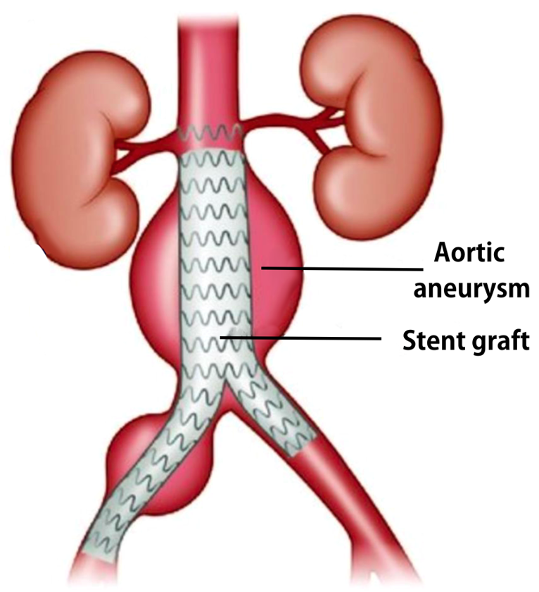
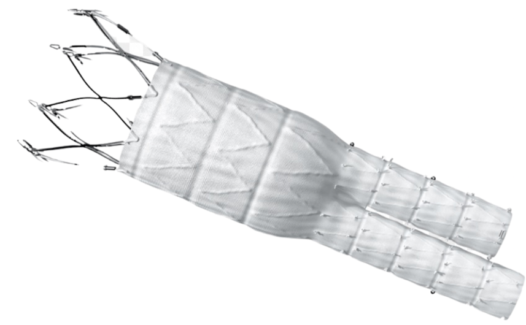
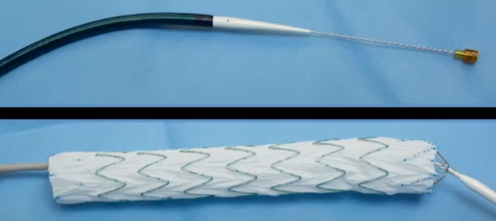
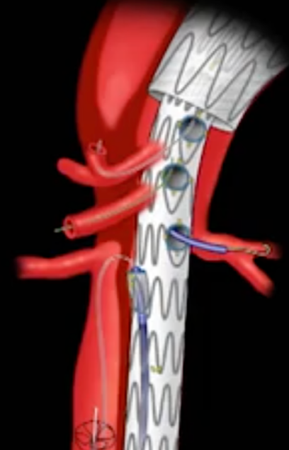

Endovascular Abdominal Aortic Aneurysm Repair (EVAR) Notes    body {font-family: 'Open Sans', sans-serif;}

### Endovascular Abdominal Aortic Aneurysm Repair (EVAR) Notes

The procedure involves inserting a self-expanding stent graft (a metal mesh tube covered with  
fabric) through the femoral artery and advanced into the abdominal aneurysm under fluoroscopic guidance.

****

**EVAR procedure:  
**EVAR is a minimally invasive surgical procedure to treat an abdominal aortic aneurysm.  
The initial part of the operation involves exposing both femoral arteries (with bilateral longitudinal groin incisions).  
Alternatively, only one artery is exposed surgically, with access to the other being carried out percutaneously.  
A self-expanding stent graft (a metal mesh tube covered with fabric) is advanced through the femoral artery and into the abdominal aneurysm under fluoroscopic guidance.  
The procedure is relatively pain-free.  
The patient is usually intubated as they are required to remain motionless.

****

****

  
EVAR has become a popular alternative to the conventional open repair of abdominal aortic aneurysms (AAA) because of its minimal invasiveness and improved mortality rates.  
  
**Abdominal aorta aneurysm review:**  
The average anteroposterior diameter of the abdominal aorta is 2cm (range 1.5-3 cm).  
It is considered to be aneurysmal when it reaches 3 cm in diameter.  
Review _“Endovascular Abdominal Aortic Aneurysm (EVAR) Review Notes”_ for details  
**Type of endovascular repairs:  
EVAR:** Endovascular Abdominal Aortic Aneurysm**TEVAR:** Thoracic endovascular aortic repair**FEVAR:** Fenestrated endovascular aneurysm repair-complex**AAA:** Abdominal aortic aneurysm  
  
**Elective surgery vs emergency:  
**\- Elective surgery has a much lower mortality and morbidity rate than an emergency EVAR.\- 7% for elective repair and 36-50% for emergency repair.**  
  
Simple infra-renal vs Complex supra-renal EVAR:  
**\- Most AAAs are infrarenal (simple)  
\- 80-90% involve either one or both iliac arteries.  
\- Suprarenal aneurysm repairs are more complex because they involve branching vessels.  
\- For this reason, stent-grafts must be designed specifically for the anatomy and, thus, a more complex procedure.  
\- Preoperatively, a distinction should be made between simple infrarenal EVAR (distal to the renal arteries) and complex suprarenal EVAR because a supra-renal has a higher perioperative risk.  
  
**FEVAR:**  
FEVAR is a specialized EVAR technique that repairs complex aneurysms.  
The fenestrated stent graft has additional small openings for the branches coming off the aorta.  
Using iliac bifurcated devices or complex fenestrated grafts may prolong surgical duration.

****

**Pre-op assessment:  
**Carefully evaluate associated co-existing medical conditions (cardiac, renal, respiratory, and other vascular pathology).  
**Assess for the common comorbidities:  
CAD:** Associated with 70% of patients with AAA.  
Cardiac clearance is usually needed.  
Cerebrovascular disease (assess for a history of CVA and symptoms)  
Diabetes Mellitus  
**History of smoking:** 4 times greater risk for AAA than non-smokers  
Hypertension  
**COPD:** O2 dependence, Rx regimen (Inhalers, etc.), and PFT results  
Inherited connective tissue diseases- Marfan or Ehlers-Danlos (type IV).  
Assess renal status: High risk for acute kidney injury postoperatively.  
Assess coagulation status and antiplatelet therapy  
  
**Pre-op labs/tests:**  
CBC  
BMP (know the patient’s creatinine level)  
Coags  
PFTs (COPD patients)  
  
**Room set-up:**  
Although conversion to open repair rates are low (<2%), the operating room must be prepared for open repair and massive bleeding.  
  
**There should be immediate access to the following:**  
Rapid infusion devices or  
Blood transfusion tubing  
Air warming devices  
IV fluid warmers  
PRBCs should be available in the room.  
**Note:** Anesthesia providers should have PRBs checked and available in the room.  
This will result in no delay for immediate blood transfusion if there is a life-threatening hemorrhage.  
However, this is rarely practiced as available PRBCs are usually on standby (not in the room) and may become a liability if a hemorrhage requires immediate transfusion.  
  
**Lead aprons and thyroid shields:** Yes, there is radiation exposure  
**IV tubing slack:** Yes, the bed sometimes slides to optimize fluoroscopy.  
  
**Monitoring:**  
Arterial line (usually the right radial)  
A 5-lead electrocardiogram should be applied to detect ischemic ST changes.  
Two large IVs should be inserted as there is potential for significant blood loss.  
**Foley catheter:** Hourly urine output  
  
Anesthesia management is similar to a carotid endarterectomy procedure because the most significant challenge may be preventing or limiting severe hypertension and hypotension episodes.  
  
**Anesthesia for EVAR:  
**There is minimal evidence on the best choice of anesthesia for standard EVAR.  
  
**General/ETT** \- most common  
**Note:** If an aneurysm rupture occurs during the procedure, the patient's airway is already secure.  
  
**Other options:** MAC, spinal, epidural, or combined spinal/epidural (CSE).  
**Induction:** Hypotension is common after induction of anesthesia.  
**Muscle relaxation:** Yes, no movement is imperative.  
**Surgical duration:** 1-4 hours (depends on the surgeon and complexity)  
**Fentanyl:** usually 100 mcg (surgical stimulation is minimal)  
**Precedex:** This may help avoid tachycardia and enhance a smooth emergence.  
**Heparin:** Yes  
Usually, recurrent doses of 3-5k units as needed per procedure duration and ACTs.  
  
**Position:** Supine with arms tucked  
**Incision:** Bilateral femoral cutdowns  
**Perioperative pain scale:** 3-4  
  
**Intraoperative patient breath holding:**  
The surgeon will frequently ask you to temporarily hold ventilation (apnea) while injecting the IV dye.  
This does not involve patent cooperation with an intubated patient.  
  
**Blood pressure control:  
**Ask the surgeon where they want the patient’s blood pressure.Most surgeons want the systolic BP to remain less than 180 mmHg.  
Severe hypertension increases the risk of rupturing the aneurysm.  
Tachycardia, severe hypertension, or hypotension should be avoided.  
**Optional rescue BP meds:**  
Neosynephrine infusion (connected) and diluted rescue syringe-common  
Nitroglycerine bottle and diluted rescue syringe- common or  
Cardene bag and diluted rescue syringe common or  
Nipride bag and diluted rescue syringe (rare)  
  
**Inotropes/pressors:** Epinephrine and Levophed should be readily available  
**  
Beta-blockers:**  
Esmolol  
Labetalol  
Beta-blockers are usually not administered with emergence.  
  
**Possible temporary hypertension with stent graft deployment:  
**During stent graft deployment, the aorta is temporarily occluded via the aortic occlusion balloon technique.  
This may result in hypertension.  
The surgeon will usually warn you.  
The newer stent grafts are more rapidly deployed, resulting in minimal hemodynamic changes.**  
  
Emergence:  
**Ask the surgeon where they want the patient’s blood pressure.Avoid hypertension as it becomes common with emergence.  
Consider beta blocking with emergence.  
Consider a Cardene continuous infusion with emergence and transporting the patient to the recovery room as hypertension becomes common postoperatively.  
Some institutions require a portable monitor when transporting patients to the recovery room.  
  
**EBL:** Minimal  
  
**Possible complication:  
**Aortic/aneurysm rupture or dissection (massive hemorrhage)  
Rupture of iliac artery  
Maldeployment or malposition of graft (it may occlude a branching artery)  
Delayed AAA rupture  
Stent-graft limb thrombosis leading to lower limb ischemia  
Kinking of the graft  
Post-implantation syndrome  
Thrombosis  
Graft migration (unusual with new stent grafts)  
Endoleak  
Ischemia of: the spinal cord, kidneys, liver, bowel, legs  
Graft infection (very rare)  
Paralysis (very rare)  
Myocardial ischemia  
Ischemia  
Reaction to contrast media  
Neurological deficit  
Renal failure  
Hypotension  
  
**Endoleak:** 10-30%  
  
Refer to _“Endovascular Abdominal Aortic Aneurysm Review Notes”_ for more details on complications.  
  
**Post-op:**  
These patients require continuous invasive blood pressure monitoring in an ICU setting.  
  

Anesthetic considerations for endovascular abdominal aortic aneurysm repairAnnals of Cardiac Anaesthesia. 2016 Jan-Mar; 19(1): 132–141.  
Harikrishnan Kothandan, Geoffrey Liew Haw Chieh, 1 Shariq Ali Khan, Ranjith Baskar Karthekeyan, and Shah Shitalkumar Sharad  
  
Endovascular Stent Grafting of Aortic Aneurysms  
Anesthesiologist’s Manual of Surgical Procedures 6 th Ed. 2020, pages 459-65  
Richard A Jaffe, Clifford A Schmiesing and Brenda Golianu  
Anesthesia for endovascular aortic repair  
UpToDate (accessed 01/20230  
E. Andrew Ochroch, MD, MSCE  
  
Perioperative Management of Endovascular Thoracoabdominal Aortic Aneurysm Repair.  
Journal of Cardiothoracic Vascular Anesthesia 2017; 31:1440.  
Fort ACP, Rubin LA, Meltzer AJ, et al.  
  
Endovascular vs. open repair of abdominal aortic aneurysms in the Medicare population.  
New England Journal of Medicine 2008; 358:464.  
Schermerhorn ML, O'Malley AJ, Jhaveri A, et al.  
Anaesthesia for Endovascular Aortic Aneurysm Repair (EVAR)  
  
World Federation of of Societies for Anesthesiologists (WFSA)  
Dr Gagan Atwal, Dr Sandi Wylie  
27TH JANUARY 2014  
  
Endovascular abdominal aortic aneurysm repair  
The British Journal of Anesthesia  
Continuing Education in Anaesthesia Critical Care & Pain, Volume 4, Issue 3, June 2004, Pages 91–94  
V Nataraj, MD FRCA, AJ Mortimer, BSc MD FRCA  
  
Endovascular Aneurysm Repair (EVAR)  
Cleveland Clinic (accessed 01/2023)  
https://my.clevelandclinic.org/health/treatments/22291-endovascular-aneurysm-repair