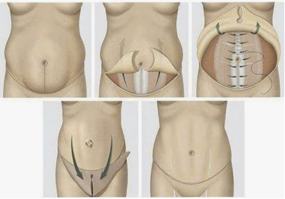

Abdominoplasty (“Tummy Tuck”)    body {font-family: 'Open Sans', sans-serif;}

### Abdominoplasty (“Tummy Tuck”)

The plastic surgeon removes excess fat and skin and in most cases, restores weakened or separated muscles, creating an abdominal profile that is smoother and firmer.  
  
Many health insurance companies will not cover an abdominoplasty or its complications  
because it is an elective cosmetic procedure.  
  
The average cost of a tummy tuck is $5,798, according to the American Society of Plastic Surgeons.  
  
Because this is an out of pocket procedure, it is unlikely for the patient to be indigent, have poor dental care and not be followed by a primary physician.  
  
Patients who seek body contouring following massive weight loss have a distinct set of criteria  
  
**Indications:  
(A loose and sagging or protruding abdomen)  
**Abdominal wall laxity  
Excess skin  
Striae, or diastasis of the rectus muscles  
A loose and sagging or protruding abdomen.  
  
**The most common causes of this include:  
**Aging  
Heredity  
Post pregnancy  
Prior surgery  
Significant fluctuations in weight  
  
**Common pre-op instructions for the patient from the surgeon**  
Stop smoking  
Avoid taking aspirin, anti-inflammatory drugs and herbal supplements as they can increase bleeding  
  
It is common for the plastic surgeon to prescribe multiple analgesics to limit narcotics.  
Celocoxib (Celebrex®), acetaminophen (Ofirmev®), and gabapentin are common preoperative analgesics.  
  
**Procedure:**  
An abdominoplasty is a surgery major procedure requiring extensive dissection, muscle tightening, and large amount of skin removal. The layer over the rectus muscle called the fascia is tightened in the midline as well  
  
A full abdominoplasty requires a horizontally-oriented incision in the area between the pubic hairline and umbilicus.  
  
The incision ultimately extends to the posterior flanks, how far posteriorly depends upon how much extra skin needs to be removed.  
This procedure is performed with the patient first supine, then after the front has been completed, the patient is turned on their right side, then onto the left side.  
  
The abdominal skin is elevated away from the abdominal wall revealing the abdominal musculature. Note that the umbilicus remains attached to the muscle in the midline. The area of surgical dissection extends to the flanks, further than during a standard abdominoplasty.  
  
The abdominal wall musculature is tightened using a special running suture. The muscles are brought together in the midline (rectus plication).  
  
The excess skin is elevated above the abdominal wall and pulled downward. The area of resection is indicated with a dotted line. The original umbilical region of the abdominal skin is below the line of resection and therefore is removed with the abdominal skin.  

****

  
A new opening for the umbilicus is created.  
The umbilicus is brought through to the surface and sutured into position.  
The surgeon will use sutures, skin adhesives, tapes or clips to close the skin incisions.  
Some surgeons may insert Jackson-Pratt drains to collect any excess blood or fluid that may collect.  
  
**Preoperative Assessments**  
Review the possible risk factors associated with obesity such as diabetes mellitus, hypertension, heart disease, sleep apnea, and occult liver disease.  
A thorough preoperative evaluation must rule out these occult risk factors prior to elective surgery.  
  
**Anesthetic:** Communicate with the surgeon to determine the anesthesia plan.  
**General endotracheal** is the most commonly used when a “rectus plication” is performed.  
It is sometimes necessary to remove tissue from the lower back (circumferential abdominoplasty) which requires the patient to be placed in prone position. In this situation, endotracheal intubation is necessary to protect the airway.  
  
**General using LMA** is frequently used if the surgeon is merely removing skin (dermolipectomy).  
  
**Deep IV sedation** is rare but still done in some offices.  
Deep IV sedation is challenging due to the duration of procedure the maintenance of a patent airway and keeping the patient adequately anesthetized during this stimulating procedure.  
  
**Regional anesthesia:** High epidural, spinal and TAP block have all been used but meet with limited acceptance. The advantage of regional anesthesia over general anesthesia is a decrease in DVTs.  
**  
For rectus application**  
If the surgeon plans on performing a rectus placation (tightening abdominal muscle), then intubation is carried out and a small dose of rocuronium or vecuronium administered just prior to the application.  
Regional anesthesia is another option.  
  
**Position:** Supine with arms abducted < 90 degrees and partially lateral to lateral depending on the surgeon.  
Prone position for circumferential abdominoplasty. Many surgeons prefer the backside first followed by anterior interventions in supine position.  
The table is partially flexed to decrease the tension of the rectus abdominis.  
  
**Duration:** 2-3 hours for basic abdominoplasty.  
Circumferential abdominoplasty: 5-6 hours  
  
**EBL:** 100 ml  
**IV Access:** 20g is acceptable. Avoid the antecubital area if the patient will be prone**A-line:** Usually not required**Age Range:** Usually adult 30-60**Gender:** Female > Male**Hydration:** Euvolemia**Emergence:** Deep extubation is preferred to prevent bucking.  
  
**Contraindications  
**Severe comorbid conditions: diabetes, morbid obesity, cigarette smoking.  
Right, left, or bilateral upper quadrant scars (relative);  
Future plans for pregnancy (relative);  
History of thromboembolic disease (relative);  
Unrealistic patient expectations.  
  
**Possible risks and complications:**  
Anesthesia risks  
Bleeding  
Infection  
Fluid accumulation (seroma)  
Poor wound healing  
Numbness or other changes in skin sensation  
Skin discoloration and/or prolonged swelling  
Unfavorable scarring  
Deep vein thrombosis, cardiac and pulmonary complications  
Persistent pain  

American Society of Plastic Surgeons  
Abdominoplasty  
https://www.plasticsurgery.org/cosmetic-procedures/tummy-tuck/recovery  
  
Anderson T, Gluud C (1984) Liver morphology in morbid obesity: a literature study. Int J Obesity 8:97 – 106  
  
Anesthesia for Liposuction and Abdominoplasty  
Gary Dean Bennett  
http://eknygos.lsmuni.lt/springer/21/29-54.pdf  
  
Journal of American Society of Plastic Surgeons, 2014, Vol. 134, pp. 122  
Plastic and Reconstructive Surhery  
Abdominoplasty under Epidural Anesthesia: Safer for the Patient, Easier for the Surgeon  
Ramon, Yitzchak MD; Yarhi, Danielle MD