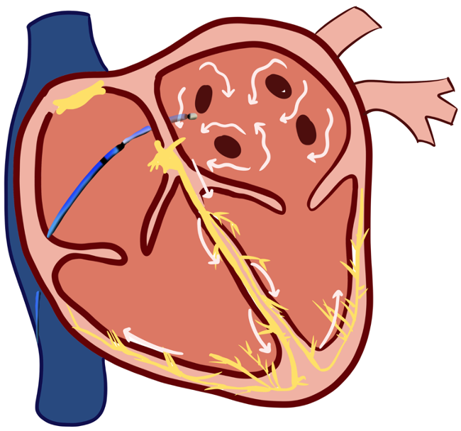
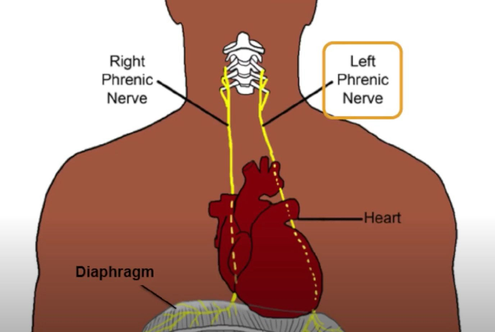

Atrial Ablation for A-Fib (AF)    body {font-family: 'Open Sans', sans-serif;}

### Atrial Ablation for A-Fib (AF)

The left atrium is being ablated.  
The procedure is performed in an electrophysiology (EP) lab by an EP MD (cardiologist).  
Left atrial access requires a transseptal puncture that is performed under fluoroscopic and intracardiac ultrasound guidance.Atrial fibrillation ablations and other left-sided atrial ablations are lengthier procedures (2–5 hours) that often require patient immobility in key portions of the procedure. General anesthesia and no movement are preferred.The anesthesia provider will require a lead apron and collar.  
  
**Atrial fib and antrum of the pulmonary veins**  
Most atrial ectopic foci appear to originate from the antrum or “os” of each pulmonary vein.  
Four pulmonary veins come off the left atria from the lungs.  
**Ectopic foci:** Abnormal pacemaker sites within the heart (outside the SA node) initiate automaticity.  
  
**Procedure goal:**  
Ablate the irritable ectopic atrial foci sites causing AF.

****

**Summary:**  
A bipolar radiofrequency ablator (long catheter inserted up the femoral vein) burns lesions in the AF conduction pathways, attempting to convert AF back to sinus rhythm.  
After the ablation (which creates a scar), the spontaneous electrical impulses originating from within any of the four pulmonary veins cannot propagate into the atrial body to initiate or trigger AF.  
**Note:** The scar tissue, which does not conduct electrical activity, blocks the abnormal electrical signals causing the arrhythmia.  
The scar tissue directs electric signals through a controlled path to the ventricles.  
  
**Most of these patients are healthy.**  
Many of these patients with AF are healthy and electively proceed with this procedure to prevent long-term requirements of anticoagulants.  
These patients usually arrive anticoagulated and will also be administered IV heparin throughout the procedure.  
If the patient has not been anticoagulated, a TEE is performed before the procedure to rule out any thrombus in the left atrial appendage.  
If an atrial thrombus is found, the procedure will be canceled.  
  
**The procedure in more detail:**  
A long catheter is threaded from the femoral vein **→** inferior vena cava **→** right atrium **→**  it crosses the atrial septum (transeptal) to enter the left atrium (LA).  
This is the risky point for a perforation.  
Once the catheter enters the LA, it will be mapped by a high-tech 3D mapping system or Intracardiac Electrogram, depending on the facility.  
This system offers the cardiologist an inner image of the atrium.  
Also, by utilizing Complex Fractionated Atrial Electrograms (CFAE) software, they could assist in locating the sites of fibrillatory impulses for catheter ablation.  
  
After the mapping is completed, the 3D image will be displayed on a screen, and the cardiologist will start ablating his targets and hoping for conversion to sinus rhythm.  
Communication is essential between the anesthesia provider and the cardiologist.  
Any drop in BP with or without an increased HR may indicate a tamponade, a prevalent complication.  
Inform the cardiologist immediately.  
  
**Intraoperative cardioversions:**  
Many patients will need to be cardioverted toward the end of the procedure if they remain in AF.  
  
**Anesthetic:** General/ETT  
**MAC or LMA:** Very rare  
**Muscle Relaxant:** Optional; prevent the patient from moving.  
No muscle relaxant during the period of phrenic nerve pacing!  
  
**Note:** The patient should not be paralyzed during ablation, particularly for balloon-based ablation technologies, because there is an increased risk for phrenic nerve injury.  
  
  
  
During laser or cryoballoon ablation of the right-sided pulmonary veins, a catheter is used to pace the right phrenic nerve, and diaphragmatic capture is palpated.  
Check with the EP staff or cardiologist prior to administering intermediate-lasting muscle relaxants.  
  
Additionally, a diaphragmatic potential can confirm capture and provide early warning of phrenic nerve injury if a modified surface lead I is positioned across the diaphragm on lead setup.  
  
**Duration:** 2-5 hours.  
**EBL:** Usually minimal  
**IV Access:** Preferably two 18g IVs in case of complications.  
The patient will also have venous introducers in place.  
  
**Foley:** Yes, the urine output is usually adequate.  
  
**Ventilation:  
**Avoid making tidal volume changes while the heart is being mapped or ablated because it will displace its position with ventilation.  
For that very reason, many cardiologists will request a small tidal volume (around 250 mL) with a respiratory rate in the 20s.  
  
**Hydration:** Normovolemic  
Discuss fluids with the the cardiologist.  
The patient may be vascularly dry or have a recent history of CHF.  
Patients typically receive 200 to 500 mLs of crystalloid through the venous sheaths.  
Be assertive, as some EP teams may give liters!  
**Arterial line:** Less common today with these procedures unless the patient’s heart is compromised.  
The cardiologist now inserts an **intracardiac echocardiography (ICE) catheter** that can closely assess the onset of cardiac tamponade.  
It sits in the right atrium and can be repositioned to assess for cardiac tamponade.  
**Noninvasive arterial monitoring:** These devices are becoming more popular in patients who are not hemodynamically compromised and without cardiac morbidities (other than AF).  
  
**Anticoagulation:** YesAfter the transseptal puncture, anticoagulation is achieved with a heparin bolus.  
The goal is an activated clotting time (ACT) of greater than 300 to 350 seconds, although many centers prefer to achieve a therapeutic ACT after venous access but before transseptal puncture.  
  
**Heparin bolus:** Usually around 150 units/kg.**Heparin infusion:** Usually.  
The EP staff usually provides you with heparin infusion.  
Have it primed and ready because at some locations, the cardiologist will ask for tubing to connect it to the central groin line before or after going transeptal (crossing the septum).  
  
**ACTs:** Maintain around 350 seconds as per MD request.  
ACTs can be drawn from the venous sheath or arterial line.  
**Protamine:** For the reversal of heparin.  
The cardiologist will give you the dose at the end of the case.  
  
**Esophageal Temp Probe:** Yes, some cardiologists prefer a pediatric temp probe.  
The anesthesia provider will be instructed to alert the cardiologist for any small temperature increases (while ablating the left posterior atrium).  
Alert the cardiologist with an increase of 0.3 - 0.5 C.  
  
**_Note:_** _The esophagus location relative to the left posterior atrium varies and can be as close as 1cm.  
Vigilantly monitoring the esophageal temperature can warn us of one of the FATAL complications- “atrio-esophageal fistula.”  
This is a result of overburning the atrium._  
**Phenylephrine Drip:** Yes, but be aware that phenylephrine may mask the initial drop in BP from a tamponade.  
Some cardiologists may request to avoid infusing phenylephrine for this reason.  
Inform the cardiologist when a pressor is being administered.  
  
**Isuprel Hcl (Isoproterenol) Infusion  
4 mcg/mL in mcg/min**  
Common mixture for arrhythmia induction with electrophysiology studies.  
**Mixture:** 0.2 mg in 50 mLs  
table.tableizer-table { font-size: 12px; border: 1px solid #CCC; font-family: Arial, Helvetica, sans-serif; } .tableizer-table td { padding: 4px; margin: 3px; border: 1px solid #CCC; } .tableizer-table th { background-color: #104E8B; color: #FFF; font-weight: bold; }

| Dose | Drip rate |
| --- | --- |
| 1 mcg/min | 15 cc/hr |
| 2 mcg/min | 30 cc/hr |
| 3 mcg/min | 45 cc/hr |
| 4 mcg/min | 60 cc/hr |
| 5 mcg/min | 75 cc/hr |
| 6 mcg/min | 90 cc/hr |
| 7 mcg/min | 105 cc/hr |
| 8 mcg/min | 120 cc/hr |
| 9 mcg/min | 135 cc/hr |
| 10 mcg/min | 150 cc/hr |
| 11 mcg/min | 165 cc/hr |
| 12 mcg/min | 180 cc/hr |
| 13 mcg/min | 195 cc/hr |
| 14 mcg/min | 210 cc/hr |
| 15 mcg/min | 225 cc/hr |

  
**Emergency Meds:**  
Diluted epinephrine and ephedrine are your choice drugs for cardiac tamponade.  
Have them accessible.  
  
**Norepinephrine infusion:** Consider having it readily available for patients with a low EF.  
Starting it at a very low dose is common when needed.  
**Vasopressin:** 1-2 unit boluses may be administered when the patient is refractory to phenylephrine.  
  
**Cardioversion for AF if the patient is becoming unstable.  
**When the patient’s BP becomes challenging to manage with an elevated HR, consider asking the cardiologists to cardiovert the patient out of persistent AF.  
The return of the atrial kick after converting back to a sinus rhythm can enhance the BP.  
  
**Foley:** Yes.  
**Emergence:** Normal, deep, or awake extubation.  
The anesthesia space is usually limited depending on your EP lab.  
  
**High dose of isoproterenol:  
**The cardiologist may request it.  
The EP nurses usually supply it.  
Have it primed through the infusion tubing, and the requested infusion dose should be set up in the pump and standby mode.  
The cardiologist will request the infusion immediately after the ablation to assess the likelihood of reoccurrence.  
  
**Adenosine:** May be administered by the cardiologist after the ablation to also assess for reoccurrence.  
  
**Possible Complications:  
**Aortic perforation  
Cardiac tamponade  
Air Embolus  
Atrio-esophageal fistula with related complications  
Inadvertent puncture of the femoral artery**  
  
Atrial perforation:**  
Atrial perforation with results in cardiac tamponade from over-burning the atrium.  
This may require the chest to be opened.  
Be prepared to transport the patient to an open-heart room if you are not already in one.  
  
**Cardiac Tamponade:** If you see your arterial waveform dampen with a drop in BP, immediately troubleshoot the A-line (if the patient has one) while you notify the cardiologist.  
The cardiologist will assess for a tamponade via ICE.  
  
**Cardiac tamponade treatment:**  
Don’t panic, and DON’T try to start additional IVs.  
Just open your fluids wide open.  
Treat the hypotension with your diluted ephedrine, epinephrine, or norepinephrine.  
Neosynephrine should NOT be administered for cardiac tamponade.  
The patient already has HUGE venous introducers in the two femoral veins (some are 8 Fr); they should be able to connect one and give volume as needed.  
  
**Pericardiocentesis and Cardiac Tamponade:  
**The cardiologist uses some large syringes and a stopcock with the pericardiocentesis kit and performs a pericardiocentesis.  
The aspirated blood will be re-injected directly into the large femoral line by simply turning a stopcock.  
You will be asked to give protamine to reverse the heparin, hoping the paper-thin perforated atrium will eventually clot.  
If the atrium continues to bleed, the patient will immediately be transported to the operating room for a thoracic surgeon to open the chest and repair the atrium.  
This occurs in less than 1-2% when expert cardiologists perform the procedure.  
While the surgeon has full access to the heart, a Maze Procedure can also be performed to treat the A-fib.  
The Maze procedure takes a few minutes.  
  
**Atrio-Esophageal Fistula:  
**This fistula is a rare but often fatal complication of atrial ablation to the posterior wall of the left atrium.  
Symptoms compatible with endocarditis will develop 3 to 5 days after the procedure. Emergency cardiac surgery is critical if the diagnosis is confirmed.  
An esophageal temp probe warns us when the ablating catheter may damage the posterior atrial wall.  
The use of general anesthesia increases the risk of esophageal damage from the ablation versus patients undergoing conscious sedation.  
  
**More Notes:  
**Permanent A-Fib is not usually treated with ablation.  
Radiofrequency applications are delivered with the maximal temperature of 55°C to 60°C at the catheter tip, and usually, a standard 4-mm tip catheter is used.  
  
The use of general anesthesia is associated with a higher cure rate with a single procedure.  
It seems to reduce the prevalence of pulmonary vein reconnection observed at the time of repeat ablation.  
  

Kaplan’s Essentials of Cardiac Anesthesia for Noncardiac Surgery 2019, pp. 395-96  
Joel Kaplan, Brett Cronin and Timothy M Maus  
Elsevier Inc.  
  
Anesthesiologist’s Manual of Surgical Procedures, Sixth ed. 2020, pages 1667-69  
Richard A Jaffe, Clifford A Schimiesing and Brenda Goliana  
  
Intracardiac Echocardiography in Catheter Ablation for Atrial Fibrillation: It Is Better to See What You Are Doing?  
Journal of Atrial Fibrillation 2015, April-May (7)6: 1215  
Taishi Kuwahara, MD, PhD  
  
Murgatroyd, Francis D., Andrew D. Krahn, Raymond Yee, and Allan Skanes. _Handbook of Cardiac Electrophysiology: A Practical Guide to Invasive EP Studies and Catheter Ablation_ . London: ReMEDICA Pub., 2002.  
Zimetbaum, Peter J., and Mark E. Josephson. _Practical Clinical Electrophysiology_ . Philadelphia: Wolters Kluwer Health/Lippincott Williams & Wilkins, 2009.