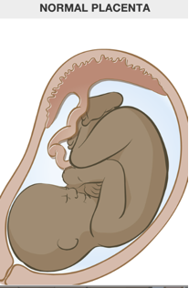
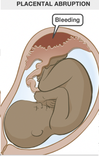

Placental Abruption    body {font-family: 'Open Sans', sans-serif;}

### Placental Abruption

Also referred to as abruptio placentae.  
A serious condition in which the placenta partially or completely prematurely separates after 20 weeks’ gestation and before birth.  
**Hemorrhage** into the decidua basalis occurs as the placenta separates from the uterus. Vaginal bleeding usually follows, although the presence of a concealed hemorrhage in which the blood pools behind the placenta is possible.  
  
**Hematoma** formation further separates the placenta from the uterine wall, causing compression of these structures and compromise of blood supply to the fetus.

****

****

In acute cases, loss of placental-uterine surface area reduces gas exchange and can result in distressed fetus and/or fetal asphyxia.  
As many as 90% of abruptions are mild to moderate without fetal compromise.  
The effects on the mother depend primarily on the severity of the abruption, while the effects on the fetus depend on both its severity and the gestational age at which it occurs._  
Placental abruption is still a significant contributor to maternal mortality worldwide.  
_**Etiology:** Unknown**Diagnosis:** Ultrasound can assist with the diagnosis, but it is not always reliable.  
  
**Statistics and facts:  
US prevalence rate of abruption:** 9.6/1,000, of which 2/3 of cases were classified as being severe (6.5/1,000).  
80% of cases occur prior to onset of delivery.  
14% occur before 32 weeks.  
40–60% occur before 37 weeks of gestation  
Incidence is increasing, particularly among Black women.  
**Possible presentation:  
Most common:** Bright red third trimester bleeding.  
**Classic triad:  
**Vaginal bleeding  
Contractions  
Abdominal pain, discomfort or pain between contractions, or contractions observed to be frequent or tetanic lasting > 60 seconds.  
May present in active labor or with rupture of membranes  
Back pain (especially for posterior placenta)  
Tachycardia, hypotension (a late sign)  
Uterine tenderness and uterine contractions  
Vaginal bleeding (not always present i.e., concealed abruption).  
Fetal distress or demise  
Preterm labor  
Fetal compromise evident on fetal heart rate (FHR).  
  
**Indications of significant separation:  
Abdominal pain:** The uterus has increased tone/rigidity and may be tender both during and between contractions.  
Hypotension  
Fetal heart rate abnormalities or fetal demise  
Maternal disseminated intravascular coagulation (DIC)  
  
**Note:** Significant separation may result in fetal death and severe maternal morbidity  
**  
Assess the following:**  
Recent trauma (accidental or physical abuse)  
Unexpected seat belt occurrence  
Cocaine and tobacco use  
Early trimester bleeding  
History of abruption in a prior pregnancy  
  
**Assess for associated risk factors of placental abruption:**  
Prior placental abruption increases risk by 15- to 20-fold  
Hypertensive disorders (chronic hypertension, preeclampsia, eclampsia)  
Increasing maternal age and parity  
Maternal smoking habit: dose–response relationship  
Uterine anomalies  
Multiple-gestation pregnancies  
1st- or 2nd-trimester bleeding  
Preterm rupture of membranes  
Polyhydramnios  
Severe small-for-gestational-age birth  
Blunt trauma/motor vehicle accident  
Chorioamnionitis  
Male infant  
Hospitalized for both acute and chronic respiratory diseases  
  
**Other risk factors:**  
Short umbilical cord  
Folate deficiency  
  
**Classifications of abruptio placentae:  
**Class 0 - Asymptomatic  
Class 1 - Mild (represents approximately 48% of all cases)  
Class 2 - Moderate (represents approximately 27% of all cases)  
Class 3 - Severe (represents approximately 24% of all cases)  
A diagnosis of class 0 is made retrospectively by finding an organized blood clot or a depressed area on a delivered placenta.  
  
**Class 1 characteristics:**  
No vaginal bleeding to mild vaginal bleeding  
Slightly tender uterus  
Normal maternal BP and heart rate  
No coagulopathy  
No fetal distress  
  
**Class 2 characteristics:**  
No vaginal bleeding to moderate vaginal bleeding  
Moderate to severe uterine tenderness with possible tetanic contractions.  
Maternal tachycardia with orthostatic changes in BP and HR.  
Fetal distress  
Hypofibrinogenemia (i.e., < 150 mg/dl)  
  
**Class 3 characteristics:**  
No vaginal bleeding to heavy vaginal bleeding  
Very painful tetanic uterus  
Maternal shock  
Hypofibrinogenemia (i.e., < 150 mg/dl)  
Coagulopathy  
Fetal death  
  
**Retroplacental abruption:** A collection of blood behind the placenta. It can be as much as 3 liters.  
**Subchorionic abruption:** Subchorionic bleeding with dissection along the chorion.  
**Preplacental Abruption:** Blood collection anterior to the placenta within the amnion and the chorion (sub-amniotic).  
  
**Placental abruption management:  
**Management depends on severity.  
Suspected parturient should be evaluated promptly on a labor and delivery unit to establish the diagnosis.  
Stable parturients with small abruption are still at risk because they may deteriorate if placental separation progresses.  
For this reason, these patients are prepared as for a a worst-case scenario.  
**  
Management includes:**  
Continuous fetal heart rate monitoring.  
Two wide-bore intravenous catheters.  
Administer a crystalloid, preferably lactated ringer's, to maintain urine output above 30 ml/hour.  
Closely monitor maternal hemodynamic status and watch for signs of a decrease in BP.  
If the mother and fetus are stable, vaginal delivery is appropriate.  
If severe, send for O negative blood (if other blood is not available).  
**  
Stat labs:  
**CBC  
Blood type and screen (crossmatch if transfusion is likely)  
Coagulation studies (fibrinogen concentration, prothrombin time, activated partial thromboplastin time)  
Liver chemistries should be checked in women with preeclampsia or HELLP syndrome (i.e., Hemolysis, Elevated Liver enzymes, Low Platelet count).  
Urine toxicology if substance abuse is suspected.  
Baseline BMP including creatinine because severe abruption often precipitates renal dysfunction.  
  
**Anesthetic:** Depends on the situation.  
Continuous vigilance and constant communication with the OB team is mandatory. Emergency intubation equipment and all the emergency medications should be readily available.  
  
Vaginal delivery is considered when the mother and fetus are stable.  
  
**Labor epidural may be considered when:  
**Mother is normotensive  
Coagulation studies are normal  
Fetal status is reassuring  
  
**For** **severe abruptio placentae:** An emergency C-Section is necessary.  
For details, refer to:  
“ **Postpartum Hemorrhage and “C-Section Emergency”** in Case Tips of the Mega App.  
**Common transfusion targets:  
**Hematocrit ≥25 to 30 percent  
Platelet count ≥75,000/microliter  
Fibrinogen ≥300 mg/dL  
Prothrombin and partial thromboplastin time <1.5 times control  
**  
Possible complications of Placental Abruption:**  
Uncontrolled hemorrhage  
Hematoma  
DIC (a major complication)  
Renal failure  
Transfusion reaction  
Ischemic necrosis of distal organs  
Hemorrhagic shock  
Uterine rupture  
Maternal and fetal death.  
  

_Chestnut's Obstetric Anesthesia: Principles and Practice_ . Philadelphia:  
Mosby/Elsevier, 2009.  
Chestnut, David H.  
  
Abruption and its association with hypertension and prolonged rupture of membranes: a methodologic review and meta-analysis.  
Obstetrics Gynecology 1996; 88:309.  
Ananth CV, Savitz DA, Williams MA. Placental  
  
Prediction of perinatal outcomes based on primary symptoms in women with placental abruption.  
Journal of Obstetrics and Gynaecology Research; 2015; 41:850.  
Kasai M, Aoki S, Ogawa M, et al.  
  
The 5-Minute Anesthesia Consult, 2013 pp. 666-67  
Nina Singh-Radcliff  
  
Clinical significance of primary symptoms in women with placental abruption.  
The Journal of Maternal- Fetal & Neonatal Medicine, 2018; 31:2446.  
Mei Y, Lin Y.  
  
Complications of the Placenta  
AboutKidsHealth (accessed 01/2021)  
https://www.aboutkidshealth.ca/Article?contentid=354&language=English  
  
Interventions for treating placental abruption.  
Cochrane Database of Systematic Reviews 2003.  
Neilson JP.  
  
Severe placental abruption: clinical definition and associations with maternal complications.  
American Journal of Obstetrics & Gynecology 2016; 214:272.  
Ananth CV, Lavery JA, Vintzileos AM, et al.  
  
Pregnancy outcome in severe placental abruption.  
British Journal of Obstetrics and Gynaecology; 2003; 110:679.  
Kayani SI, Walkinshaw SA, Preston C.  
  
Placental abruption.  
Obstetrics & Gynecology 2006; 108:1005.  
Oyelese Y, Ananth CV.  
  
_Surgical Procedures and Anesthetic Implications: A Handbook for Nurse  
Anesthesia Practice_ . Sudbury, MA: Jones & Bartlett Learning, 2012.  
Macksey, Lynn Fitzgerald.