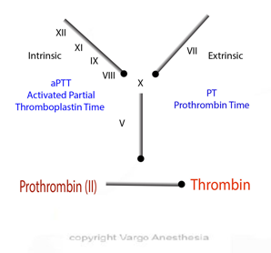

Activated Partial Thromboplastin Time (aPTT)    body {font-family: 'Open Sans', sans-serif;}

### Activated Partial Thromboplastin Time (aPTT)

**Trivia:** The aPTT was first described in 1953 at the University of North Carolina at Chapel Hill, explaining the Carolina blue Vacutainer tube top color.  
  
Measures the clotting time of plasma, from the activation of factor XII by a commercial biological aPTT reagent through the formation of the fibrin clot.  
  
The aPTT is the test of classic **INTRINSIC** and **COMMON** pathways of hemostasis.  
It measures the overall speed at which blood clots by means of intrinsic" (now referred to as the contact activation pathway) and common coagulation pathways.  
  
**aPTT measure effects of heparin**  
aPTT is widely used for measurement of the coagulation effects of unfractionated heparin (UFH).  
PT and INR assess the effects of warfarin.  
Measures the clotting time from the activation of factor XII through the formation of the fibrin clot.  
The aPTT test evaluates coagulation factors XII, XI, IX, VIII, X, V, II (prothrombin), and I (fibrinogen) as well as prekallikrein (PK) and high molecular weight kininogen (HK).  
  
**Why aPTT has largely replaced the older PTT  
**aPTT and PTT are essentially equivalent. Both are used to test for the same functions; however, in aPTT, an activator is added that speeds up the clotting time and results in a narrower reference range. The aPTT is considered a more sensitive version of the PTT and is used to monitor the patient’s response to heparin therapy.  
  
The reference range of the aPTT is 25-40 seconds.  
The reference range of the PTT is 60-70 seconds.  
  
**Abnormal aPTT**  
Abnormal aPTT reflects most of the coagulation factor deficiencies except factor VII.  
(Factor VII is part of the Extrinsic pathway.)  
  
**Most sensitive factors to aPTT**  
The aPTT is most sensitive to factor VIII and IX deficiencies.  

****

The factor concentrations must be reduced to roughly 30% of baseline values before the aPTT result becomes is prolonged.  
  
**The aPTT is prolonged in:  
**Factor deficiencies: VIII,VIII,IX and XI  
Presence of heparin  
Lupus anticoagulant  
Von Willebrand disease  
Presence of antibodies against coagulation factors (factor inhibitors)  
Specific factor inhibitors-newer anticoagulants-not accurately linear  
Fibrinogen degradation products (FDPs)  
Presence of antiphospholipid antibodies  
Sepsis — coagulation factor consumption  
Liver cirrhosis  
Hypofibrinoginemia  
Vitamin K deficiency  
DIC  
  
**aPTT shortened:  
**Early stages of DIC  
Extensive CA: ovarian. Pancreatic CA and colon cancer  
  
**aPTT, PT and ACT Test are measured together  
**aPTT and PT help differentiate among intrinsic, extrinsic, common and multiple pathway deficiencies. Together, these are the testing protocol of choice when testing for coagulation disorders.  
Activated Clotting Time (ACT) and aPTT both screen for defects in the intrinsic and common pathways, there are some important differences. _See ACT  
  
_**aPTT is used in conjunction with PT (Prothrombin Time)  
**PT measures **Extrinsic Pathway**  
When used in combination, the PT and aPTT results allow the practitioner to specifically isolate the location of the coagulation disorder to one or more of the three pathways. This can only be done when all three pathways are determined.  
  
**Factor VII** (tested by the PT test only) has the shortest half-life and is the first factor to decrease with vitamin K deficiency/antagonism.  
Factor VII deficiency/dysfunction would not be detected if only the ACT or aPTT tests are performed.  
  
**aPTT grossly prolonged > 120 seconds  
**More likely due to a contact factor deficiency than a deficiency of factor VIII or IX.  
  
**aPTT 70-80 seconds  
**Diagnosis level of severe hemophilia A or B rather than a contact factor deficiency.  
  
**Very high aPTT and unobtainable  
**During cardiopulmonary bypass with large doses of heparin. aPTT is unclottable, so the ACT is used.  
  
**More Notes  
**Historic name for aPTT is “kaolin cephalin clotting time (KccT).”  
**  
How aPTT is measured**  
A sample of the patient’s plasma is mixed with phospholipid, calcium and a contact activator (e.g. celite, kaolin, silica) and the time required for the clot formation is measured in seconds.  
  
Usually, 5 mL of citrated, platelet-poor plasma is prepared from 4.5 mL of peripheral venous blood collected via venipuncture and drawn directly into a blue-top tube that contains 0.5 mL of the anticoagulant sodium citrate at a ratio of 9:1.  
  

Medical Physiology-Principals of Clinical Medicine, 2013, p 185  
By Rodney A. Rhoades, David R. Bell  
Practical-Haemostasis.com  
  
A PRACTICAL GUIDE TO LABORATORY HAEMOSTASIS  
Data Interpretation: Screening Tests**  
http://www.practical-haemostasis.com/Data%20Interpretation/Data%20Questions/data\_interpretation\_screening\_tests.html  
  
**"KCCT - General Practice Notebook". GP Notebook. Oxbridge Solutions Ltd. Retrieved 2010-06-08.  
  
Langdell RD, Wagner RH, Brinkhous KM (1953). "Effect of antihemophilic factor on one-stage clotting tests; a presumptive test for hemophilia and a simple one-stage antihemophilic factor assy procedure". J. Lab. Clin. Med. **41** (4): 637–47.  
  
Slaughter TF. Coagulation. In: Miller RD, editor. Miller's Anesthesia. 7th Edition. California: Churchill Livingstone; 2010. pp. 1767–79.  
  
Adhikary SD, Jacob P. Peri-operative clinical tests of haemostasis and their implications. Indian J Anaesth. 2005;49:12–6.