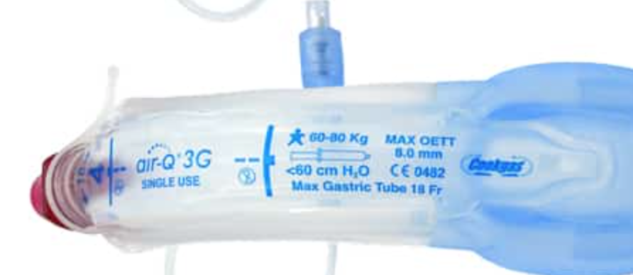
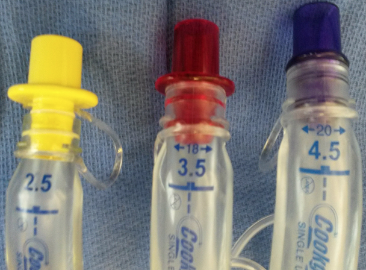
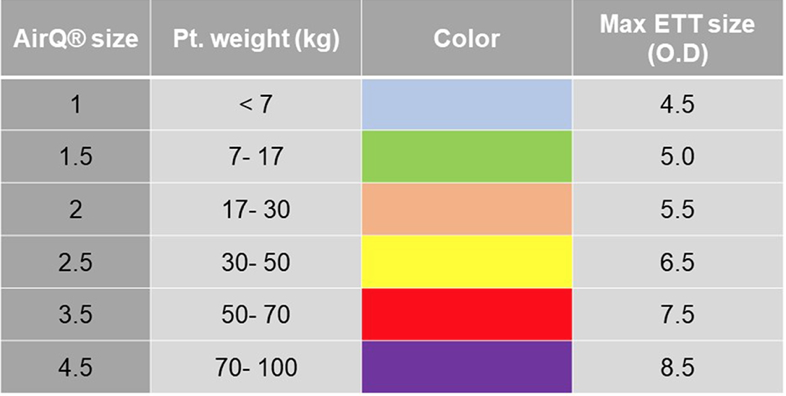

Air-Q LMA (SGA)    body {font-family: 'Open Sans', sans-serif;}

### Air-Q LMA (SGA)

Also called AirQ® SGA (supraglottic airway)  
The newer series Air-Q®3 are 2nd generation LMAs and have a gastric port.

****

Each Air-Q has the maximum sizes of ETTs and gastric tube sizes written on them.  
  
**They are designed for blind or endoscopically guided intubation.  
**\- However, the blind passage of an ETT through the AirQ® is not recommended.  
\- If the AirQ® is to be used as a conduit for intubation, use fiberoptic bronchoscope guidance!  
**  
Advantage:  
**\- It can be used as a conduit for endotracheal intubation with relatively large-diameter standard ETTs.  
\- The AirQ® has a much larger internal diameter than other LMAs and accommodates average ETT sizes, which other LMAs (including the i-gel) don’t.  
\- After intubation, it can be removed.  
\- Removal (after ETT is inserted) requires a pusher rod from the same manufacturer.  
\- More variety of sizes  
\- Color-coded 15 mm adaptors for ETT sizes.  
**Additional Models:  
Air-Q3G Features:  
**\- Extra wide gastric inlet access.  
\- Two gastric channels that accommodate NG tubes up to 18Fr.  
  
**Air-QSP3 Features:  
**\- Uses positive pressure ventilation to self-pressurize the cuff.  
\- Cuff pressure cycle between peak airway pressure and PEEP levels.  
  
**Air-Qsp3G Features:  
**\- Extra wide gastric inlet access  
\- Two gastric channels that accommodate NG tubes up to 18Fr.  
\- A self-pressurizing cuff that utilizes a positive-pressure ventilatory source.  
  
**The AirQ SGA has **two special design features:****\- Endotracheal tube 'ramp  
\- Detachable 15 mm connectors**  
  
Endotracheal tube 'ramp':  
****\- For ETT insertion  
****\- It is a ramp** integrated into the cuff part of this SGA, just beyond the distal tube opening.  
\- This plastic ridge is meant to help direct an ETT more anteriorly toward the larynx, facilitating tube advancement through the glottis into the trachea.**AirQ® SGAs color-coded **detachable 15 mm connectors:****  
\- The AirQ® SGAs adaptors are made to accommodate relatively large ET tubes, i.e., ones bigger than the inner diameter of a standard 15mm connector.  
\- One must remove the 15 mm adaptor before passing a larger ETT through the AirQ®.

****

**Sizes:  
**\- The adult size range is slightly different from most other LMAs.  
\- It has ‘half sizes’, i.e., 2.5, 3.5, and 4.5.  
\- The color-coding of the 15mm connector indicates the size.

****

  

Supraglottic Airways  
Medalliance group.com (accessed 02/2024)  
https://tinyurl.com/589d2yjz