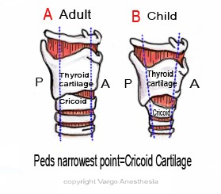

Airway Anatomical Differences vs Adults   

## Airway Anatomical Differences vs Adults

<table border="1" cellspacing="0" cellpadding="0"><tbody><tr><td width="197" valign="top">
<strong>Anatomy</strong>
</td><td width="197" valign="top">
<strong>Pediatric</strong>
</td><td width="197" valign="top">
<strong>Adult</strong>
</td></tr><tr><td width="197" valign="top">
Tongue
</td><td width="197" valign="top">
Large
</td><td width="197" valign="top">
Normal
</td></tr><tr><td width="197" valign="top">
Epiglottis Shape
</td><td width="197" valign="top">
Floppy, omega shaped
</td><td width="197" valign="top">
Firm, Flatter
</td></tr><tr><td width="197" valign="top">
Epiglottis Level
</td><td width="197" valign="top">
C3-C4
</td><td width="197" valign="top">
C5-C6
</td></tr><tr><td width="197" valign="top">
Trachea
</td><td width="197" valign="top">
Smaller, shorter
</td><td width="197" valign="top">
Wider, longer
</td></tr><tr><td width="197" valign="top">
Larynx Shape
</td><td width="197" valign="top">
Funnel shaped
</td><td width="197" valign="top">
Column
</td></tr><tr><td width="197" valign="top">
Larynx Position
</td><td width="197" valign="top">
Angles posteriorly away from the glottis
</td><td width="197" valign="top">
Straight up and down
</td></tr><tr><td width="197" valign="top">
Narrowest Point
</td><td width="197" valign="top">
Cricoid Ring (below the cords)
</td><td width="197" valign="top">
At level of cords
</td></tr><tr><td width="197" valign="top">
Lung Volume
</td><td width="197" valign="top">
250ml at birth
</td><td width="197" valign="top">
6,000ml as adult
</td></tr></tbody></table>

S. Kache, MD, Peds.stanford.edu

An important aspect of the narrow airway in children is that resistance is significantly increased. Remember Poiseuille’s law?  
Small changes in the airway radius will increase the resistance to the fourth power. Therefore, a small amount of post-extubation subglottic edema will significantly increase the work of breathing for an infant.

  
**Long Story Short**  
We know that the pediatric and neonatal airways are smaller, floppier, more prone to obstruction and have less developed musculature. During any airway stress, this allows for dynamic airway compression from a greater negative inspiratory force “sucking in” the floppy airway and decreases airway diameter. This in turn increases the work of breathing by increasing the negative inspiratory pressure generated

Due to some of these anatomical differences, Pediatric patients are often unable to manifest the basic adult signs of respiratory distress and may easily quickly desaturate before we see it coming.

**More Notes  
Thorax:** The infant or young child’s ribs are more horizontally oriented, making anterior- posterior displacement of the chest less during inspiration. This is loss of the “bucket- handle“ effect.  
  
**Rib cartilage:** The rib cartilage is more compliant than older children and adults. That’s why we may see their chest wall actually retract during respiratory distress. This may decrease the child’s ability to maintain functional residual capacity or increase their tidal volume.

**Intercostal muscles:** These muscles are not fully developed until school age, acting primarily to stabilize the chest wall. They do not have the leverage or the strength necessary to lift the ribs.

**The Diaphragm:** The diaphragm is the main muscle of respiration for the adult and child. In peds, the muscles of the diaphragm are inset horizontally to the ribs, as opposed to obliquely.

**_Note:_** Placing the infant/young child in a supine position may compromise diaphragmatic function, in that contraction may draw the ribs inwards rather than expand the chest out. This creates paradoxical chest movement.

**Head And Neck**  
Kids have a larger occiput. This naturally places the head (when looking straight forward) in the sniffing position. Even a small extension or flexion of the head can compromise their airway by making it more difficult to bag and mask ventilate the lungs.

**Airway Diameter  
**The small relative internal diameter of both the upper and lower airways predisposes the child to higher airway resistance.  
Any tiny bit of airway edema can decrease airway diameter as much as 60-70% neonates  
  
Obligate nose breathers until the age of 5

**Trachea  
**Trachea is only 4cm in length and only 6-8mm diameter for term infant.  
Don’t advance tube far past the cords-prone to bronchial intubation

  
**Airway Anatomy difference  
**The cricoid ring (subglottis) is the narrowest portion of the pediatric airway up to age 5.  
The airway itself is funnel shaped, as compared to the cylinder shape seen in the adult patient, with the cricoid ring being the narrowest point.  
Any subglottic partial airway obstruction is poorly tolerated when compared to an older patient.  
**Examples** : post extubation subglottic edema, foreign body aspiration, mass lesions inside the trachea.

**Epiglottis:** The infant and pediatric epiglottis is typically larger, floppier and articulates at a more acute angle with the larynx. This makes it more difficult to lift up with a curved (mac) blade. This is why a Miller or Wisconsin laryngoscope blade is popular for intubation, as the entire epiglottis is lifted out of the field of view.

**The Larynx:** The larynx is more anterior and cephalad, with the glottis being located at the level of C3-4, compared with C5 in the adult patient. This is why it is sometimes difficult to view the glottic inlet while performing laryngoscopy.  
Blind intubation can lodge OETT into the Anterior Commissure

**Vocal Cords:** Pediatric and neonatal vocal cords are more inclined (angled forward and downwards), versus flat in the adult patient. This is why an ETT may be difficult to pass though the glottic opening, as it may get “hung up” on the cords. Sometimes we must twist or rotate the ETT to facilitate the passage into the trachea.  
Glottis higher and more anterior

**Tongue:** Pediatrics have a larger tongue in comparison to their oropharyngeal space; therefore, a soft tissue airway obstruction from the tongue is always possible.  
A large tongue as with hypothyroidism, Down Syndrome or Beckwith-Wiedmann syndrome) can make intubation very difficult.

Infants and younger children are predominantly nose breathers.

**Jaw:** A small jaw (microagnathia) or a receding jaw (Oeirre-Robin or Treacher-Collins Syndromes) may make it more difficult or impossible to visualize the cords.  
In general, a small mandidle.

**Cleft Lip with or without a cleft palate  
**This is sometimes more difficult because it may be hard to fix the patient’s tongue against the palate with the laryngeal scope blade.

**Choanal Atresia  
**The mouth must be kept open or an oral airway should be inserted.  
Choanal atresia is usually diagnosed in the delivery room when the suction catheter cannot be passed through a nostril to the larynx.

RC Educational Consulting Services, Inc.  
http://www.rcecs.com/MyCE/PDFDocs/course/V7110.pdf