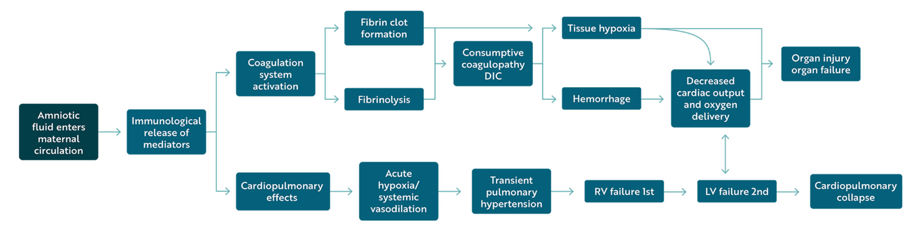

  Amniotic Fluid Embolism section { margin-bottom: 20px; } table { border-collapse: collapse; } table, tr, th, td { border: 1px solid black; } h3, p, ol.custom-counter, li { margin: 0px; padding: 0px; } .text-red { color: red; } .text-black { color: black; } ul.custom-dash { list-style: none; padding-left: 0; margin: 0; } ul.custom-dash > li { display: flex; align-items: flex-start; line-height: 1; } ul.custom-dash > li::before { content: "–"; margin-right: 0.5em; flex-shrink: 0; line-height: 1; } ul.custom-dash > li > \*:not(::before) { flex: 1; } ul.custom-dash > li.no-dash::before { content: ""; width: 1em; margin-right: 0.5em; flex-shrink: 0; } /\* Change the ol style \*/ ol.custom-counter { list-style: none; counter-reset: custom; padding-left: 0; } ol.custom-counter li { counter-increment: custom; margin-bottom: 5px; } ol.custom-counter li::before { content: counter(custom) ") "; font-weight: bold; } /\* This is just for this file \*/ ul.custom-bullet-arrow { list-style: none; padding-left: 0; margin: 0; } ul.custom-bullet-arrow > li { display: flex; align-items: flex-start; } ul.custom-bullet-arrow > li::before { content: "↑"; margin-right: 0.5em; flex-shrink: 0; } ul.custom-bullet-arrow > li.no-arrow::before { content: ""; width: 0.5em; margin-right: 0.5em; flex-shrink: 0; } ul.custom-bullet\_arrow ul { list-style-type: disc; padding-left: 1.5em; margin-top: 0.5em; } img.resized { width: 200px; height: auto; } .mb-10px { margin-bottom: 10px; } .mb-20px { margin-bottom: 20px; } .reference-notes { font-size: 11px; } .text-indent-45px { text-indent: 45px; }

### Amniotic Fluid Embolism (AFE)

AFE is a catastrophic complication from amniotic fluid entering the mother's circulatory system.

It is normal for amniotic fluid to enter the maternal bloodstream during the birthing process.

Thus, AFE is believed to be a maternal allergic reaction to the amniotic fluid that enters the mother's bloodstream.

AFE is believed to be a result of a cytokine storm from the antigen (being related to amniotic fluid contents), such as hair, meconium, skin cells, and gut mucin.

**Complications of AFE may vary from:**

Mild degree of organ dysfunction

Disseminated intravascular coagulation (DIC)

Cardiovascular collapse

Death

**Prognosis:** Overall mortality of approximately 20 percent.

Those who survive have significant morbidity, including neurologic injury due to cerebral hypoxia

**The two most common severe complications:**

**Cardiovascular collapse**

**DIC:** Occurs in 83% of cases either immediately following cardiovascular collapse or in the later phases of the syndrome.

**Occurrence and facts of AFE:**

-   Leading cause of death during labor or shortly after birth.
-   Mortality rate is around 10-50% within an hour of the onset of symptoms (literature varies).
-   Overall mortality rate is 20-60% (literature varies).
-   **Japan:** Accounts for 24.3% of maternal deaths.
-   **U.S.:** Occurs at approximately 7.7 per 100,000 births.
-   **Australia:** Leading direct cause of maternal mortality, affecting between 1 in 8000 and 1 in 80,000 deliveries.
-   85% of those who survive have permanent neurological impairment.
-   90% occurs during labor and delivery, or immediately postpartum.
-   70% of cases occurred during labor
-   11% after vaginal delivery
-   19% during cesarean delivery
-   AFE can occur up to 48 hours after delivery.

**Known factors that contribute to and/or increase the risk of AFE:**

-   **Placenta accreta spectrum (PAS) disorder:** Most strongly linked to AFE, carrying a 10-fold increased risk.
-   Amnioinfusion (a procedure) results in a 3-fold increase in AFE risk potentially due to increased uterine distension.
-   Asian and Black races
-   Maternal age (especially older than 35 to 40 years)
-   Grand multiparity
-   Male fetuses
-   Early gestational age
-   Cervical ripening
-   Polyhydramnios
-   Multiple gestation
-   Gestational diabetes
-   Operative delivery
-   Manual placental extraction
-   Regional disparities (western U.S.)
-   Asthma
-   Illicit substance use
-   Trauma

**Associated with AFE:**

-   Placenta previa
-   Eclampsia
-   Uterine rupture
-   Fetal growth restriction
-   Fetal death, placental abruption
-   Maternal renal disease
-   Peripartum cardiomyopathy
-   Postpartum hemorrhage.

If the fetus is alive at the time of the event, nearly 70% will survive delivery, but 50% of the surviving neonates will incur neurological damage.

**Early signs and symptoms of AFE develop suddenly and may include:**

**Up to 33% will experience:**

-   Impending sense of doom
-   Increased anxiety
-   Agitation
-   Nausea or vomiting
-   Chills
-   Confusion

**Simplified pathophysiology:**

**Amniotic fluid and fetal components getting into maternal circulation trigger an intense allergic reaction resulting in:**

Systemic vasodilation-severe hypotension

Bronchoconstriction-Hypoxia

Pulmonary vasoconstriction- Right heart failure, pulmonary edema, and

**Minutes to hours later:**

RV function improves

Left heart failure -Cardiopulmonary collapse

**DIC:**

The release of multiple inflammatory cytokines in response to foreign material activates the coagulation and fibrinolytic pathways, culminating in a DIC syndrome.

**More detailed pathophysiology:** Refer to “Amniotic Fluid Embolism Pathophysiology”

**If the patient survives the initial cardiorespiratory event,** noncardiogenic pulmonary edema often develops (worsening dyspnea and tachypnea, crackles) as left ventricular failure resolves..

**Hemorrhage – DIC causes hemorrhage in over 80 percent of patients with AFE**

-   After vaginal and cesarean delivery, bleeding is more likely to originate from the uterus and incision/laceration sites.
-   Spontaneous bleeding may also occur in the urinary and/or gastrointestinal tract.

**Tonic-clonic seizures and/or stroke: Rare, but documented**

**Diagnosis:** Based on criteria by the Society for Maternal-Fetal Medicine (SMFM) and the Amniotic Fluid Embolism Foundation.

**All must be present:**

1.  **Sudden cardiorespiratory arrest OR hypotension with respiratory compromise:**  
    SBP <90 mmHg  
    Dyspnea, cyanosis, or SaO2 <90%
2.  **Documentation of overt DIC using the point system established by the** Scientific and Standardization Committee on DIC of the International Society on Thrombosis and Hemostasis (ISTH) \[8\] modified for pregnancy.

**A score ≥3 is compatible with overt DIC.**

**Platelet count**

\>100,000/mL = 0 points

<100,000 = 1 point

<50,000 = 2 points

**Prolonged PT or INR ratio:**

< 25 percent increase = 0 points

25 to 50 percent increase = 1 point

\>50 percent increase = 2 points

**Fibrinogen level:**

\>200 mg/dL = 0 points

\>200 mg/dL = 1 point

Coagulopathy must be detected before hemorrhaging itself can account for dilutional or shock-related consumptive coagulopathy.

3.  **Clinical onset during labor or within 30 minutes of placental delivery.**
4.  **Absence of fever (≥138°C) during labor**

**Differential diagnosis:**

-   **Pulmonary embolism (PE):** However, PE lacks ongoing coagulopathy.
-   **Myocardial infarction-** May manifest with significant ST-T wave changes accompanied by predominant symptoms of left-sided congestive heart failure.
-   **Peripartum cardiomyopathy:** But lacks ongoing coagulopathy.
-   **Septic shock-** Classic symptoms, but unlikely to lead to sudden cardiovascular collapse.
-   **Venous air embolism (VAE):** However, a VAE usually presents with wheezing, gasping, and chest pain before cardiovascular collapse.
-   **Eclampsia:** It may be suggested by hypertension, edema, proteinuria, headaches, or seizures preceding the collapse.
-   **Aspiration:** Wheezing and desaturation, but should not result in cardiac collapse and DIC.
-   **Anaphylaxis:** Premonitory symptoms like wheezing, dyspnea, rash, urticaria, and a period of hypotension before cardiovascular decompensation.
-   **Obstetrical hemorrhage:** Causing coagulopathy and shock
-   **Cephalad spread of spinal anesthetic:** Will present with an elevated sensory level, weakness of the upper extremities, difficulty in speaking, dysphagia, and bradycardia.
-   **Magnesium toxicity**
-   **Air or cholesterol embolism**
-   **Toxic reaction to anesthetic medications**
-   **Aortic dissection**

**Management of AFE:**

_**At this point, anaphylaxis has NOT been ruled out.**_

**Emergency airway management:** 100% oxygen and RSI

**Manual chest percussions:** Include manual uterine displacement to avoid aortocaval compression.

-   Extra IV access above the diaphragm
-   Avoidance of alkalosis
-   Use lower-than-usual ventilation volumes
-   100% O2

**Hemodynamic support (fluids and vasopressors):**

-   Rapid administration of IV fluids to restore tissue perfusion.
-   Fluids should be administered until blood is available for transfusion.
-   Discontinue fluids when intravascular volume has been replenished or pulmonary edema becomes apparent.

**Vasopressors for circulatory shock:**

-   Epinephrine or Norepinephrine is typically the first choice.
-   Consider the addition of dobutamine or other inotropes for cardiogenic shock.
-   Phenylephrine (if tachyarrhythmia is an issue).
-   Many experts avoid **vasopressin** prior to delivery (increased uterine contractions) and **dopamine** (possible increased risk of death in sepsis patients).
-   Dobutamine
-   Milrinone

**For maternal hemorrhage:** Massive transfusion protocol

-   Methergine 0.2 mg IM
-   Pitocin 10-40 units in your 1 liter bag (if not contraindicated)
-   TXA 1 gram
-   Blood product administration should not be delayed while awaiting the results of laboratory tests.
-   Instead, early aggressive resuscitation with PRBCs, FFP, and platelets at a ratio of 1:1:1 (hemostatic resuscitation) results in improved outcomes.

**Management of coagulopathy:**

-   Prolonged PT, aPTT, fibrinogen <100 mg/dL → FFP and cryoprecipitate
-   Goal is normalization of INR and fibrinogen >100 mg/dL.
-   IF Platelet count <50,000K: 1 to 2 units of random donor platelets per 10 kg of body weight.
-   Consider other agents for cases refractory to standard DIC treatment measures.
-   Following cardiac arrest with amniotic fluid embolism, we recommend immediate delivery in the presence of a fetus ≥23 weeks of gestation (GRADE 2C).

**Deliver the fetus (with CV collapse)**

-   Consider cesarean delivery if spontaneous circulation has not returned within 4 minutes.
-   Delivery of the fetus should be completed within 5 minutes (known as the "4-minute rule" or the "5-minute rule").
-   Perimortem operative vaginal delivery with forceps or vacuum is appropriate if it can be achieved within this timeframe.
-   Delivery is preferably at the location of the arrest (often not an operating room).
-   Manage postdelivery uterine bleeding with standard methods (eg, uterotonic drugs, balloon tamponade or packing, hemostatic sutures).

**For refractory hypoxemia and/or pulmonary hypertension the following have been documented and successful:**

-   Extracorporeal membrane oxygenation (ECMO)
-   Inhaled nitric oxide or prostacyclin agonist
-   Ventricular assist devices as rescue measures

Amniotic Fluid embolism: diagnosis and management

American Journal of Obstetrics and Gynecology, 2016

Society of Maternal-Fetal Medicine (SFFM)

Luis D. Pacheco, MD; George Saade, MD;

Gary D. V. Hankins, MD; Steven L. Clark, MD

Society for Maternal-Fetal Medicine Clinical Guidelines #9: Amniotic fluid embolism: diagnosis and management

Society of Maternal-Fetal Medicine (accessed 08/2025)

SMFM, LD Pacheco, G Saade, GDV Hankins, SL Clark

Recognition and Management of Amniotic Fluid Embolism: A Critical Role for Anesthesia Professionals on Labor and Delivery

Anesthesia Patent Safety Foundation (APSF), Volume 37, No. 3, October 2022

Accessed 08/2025

David E Arnolds, MD, PhD

https://www.apsf.org/article/recognition-and-management-of-amniotic-fluid-embolism-a-critical-role-for-anesthesia-professionals-on-labor-and-delivery/

Amniotic fluid embolism

UpToDate July, 2025

Accessed 08.2025

Marie R Baldisseri, MD, FCCM and Steven Leigh Clark, MD

[HTTPS://WWW.UPTODATE.COM/CONTENTS/AMNIOTIC-FLUID-EMBOLISM](http://www.uptodate.com/contents/amntotic-fluid-embolism)

Amniotic Fluid Embolism

National Library of Medicine (NIH), January 10, 2024.

Accessed 08/2025

Anthony Haftel; Karen Carlson

https://www.ncbi.nlm.nih.gov/books/NBK559107/

Proposed diagnostic criteria for the case definition of amniotic fluid embolism in research studies.

American Journal of Obstetrics and Gynecolology. 2016;215(4):408

Clark SL, Romero R, Dildy GA, Callaghan WM, Smiley RM, Bracey AW, Hankins GD, D'Alton ME, Foley M, Pacheco LD, Vadhera RB, Herlihy JP, Berkowitz RL, Belfort MA

The scoring system of the Scientific and Standardisation Committee on Disseminated Intravascular Coagulation of the International Society on Thrombosis and Haemostasis: a 5-year overview.

The Journal of Thrombosis and Haemostasis 2007;5(3):604.

Toh CH and Hoots WK