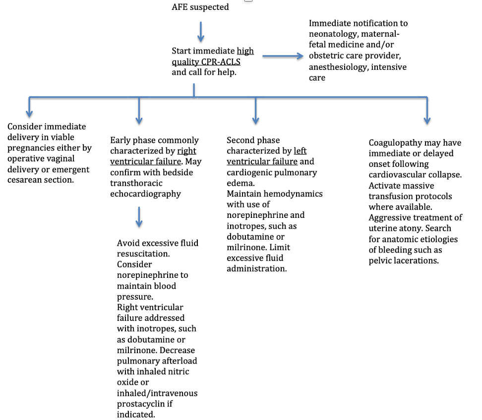

  Amniotic Fluid Embolism Management section { margin-bottom: 20px; } table { border-collapse: collapse; } table, tr, th, td { border: 1px solid black; } h3, p, ol, li { margin: 0px; padding: 0px; } .text-red { color: red; } .text-black { color: black; } ul.custom-dash { list-style: none; padding-left: 0; margin: 0; } ul.custom-dash > li { display: flex; align-items: flex-start; line-height: 1; } ul.custom-dash > li::before { content: "–"; margin-right: 0.5em; flex-shrink: 0; line-height: 1; } ul.custom-dash > li > \*:not(::before) { flex: 1; } ul.custom-dash > li.no-dash::before { content: ""; width: 1em; margin-right: 0.5em; flex-shrink: 0; } /\* Change the ol style \*/ ol.custom-counter { list-style: none; counter-reset: custom; padding-left: 0; } ol.custom-counter li { counter-increment: custom; margin-bottom: 5px; } ol.custom-counter li::before { content: counter(custom) ") "; font-weight: bold; } /\* This is just for this file \*/ ul.custom-bullet-arrow { list-style: none; padding-left: 0; margin: 0; } ul.custom-bullet-arrow > li { display: flex; align-items: flex-start; } ul.custom-bullet-arrow > li::before { content: "↑"; margin-right: 0.5em; flex-shrink: 0; } ul.custom-bullet-arrow > li.no-arrow::before { content: ""; width: 0.5em; margin-right: 0.5em; flex-shrink: 0; } ul.custom-bullet\_arrow ul { list-style-type: disc; padding-left: 1.5em; margin-top: 0.5em; } img.resized { width: 200px; height: auto; } .mb-10px { margin-bottom: 10px; } .mb-20px { margin-bottom: 20px; } .reference-notes { font-size: 11px; } .text-indent-45px { text-indent: 45px; }

### Amniotic Fluid Embolism Management

**Management of AFE:** Initially-ABC’s

**Emergency airway management:** 100% oxygen and RSI

**Manual chest percussions:** Include manual uterine displacement to avoid aortocaval compression.

-   Extra IV access above the diaphragm
-   Avoidance of alkalosis
-   Use lower than usual ventilation volumes
-   100% O2

**Hemodynamic support (fluids and vasopressors)**

-   Rapid administration of IV fluids to restore tissue perfusion.
-   Administer fluids until blood is available for transfusion.
-   Discontinue fluids when intravascular volume has been replenished or pulmonary edema becomes apparent.

**Vasopressors for circulatory shock:**

-   Epinephrine or Norepinephrine is typically the first choice.
-   You do not know if it is anaphylaxis at this point.
-   Consider the addition of dobutamine or other inotropes for cardiogenic shock
-   Phenylephrine (if tachyarrhythmia is an issue)
-   Many experts avoid **vasopressin** prior to delivery (increased uterine contractions) and **dopamine** (possible increased risk of death in sepsis patients)
-   Dobutamine
-   Milrinone

**For maternal hemorrhage:** Massive transfusion protocol

-   Methergine- 0.2 mg IM
-   Pitocin- 10-40 units in your 1 liter bag (if not contraindicated)
-   TXA- 1 gram
-   Blood product administration should NOT be delayed while awaiting the results of laboratory tests.
-   Instead, early aggressive resuscitation with PRBCs, FFP, and platelets at a ratio of 1:1:1 (hemostatic resuscitation) results in improved outcomes.

**Management of coagulopathy:**

**IF Platelet count <50,000K:** 1 to 2 units of random donor platelets per 10 kg of body weight.

-   Prolonged PT, aPTT, fibrinogen <100 mg/dL → FFP and cryoprecipitate
-   Goal is normalization of INR and fibrinogen >100 mg/dL.
-   Consider other agents for cases refractory to standard DIC treatment measures.

**Deliver the fetus (with CV collapse)**

-   Consider cesarean delivery if spontaneous circulation has not returned within 4 minutes.”
-   Delivery of the fetus should be completed within 5 minutes (known as the "4-minute rule" or the "5-minute rule").
-   Perimortem operative vaginal delivery with forceps or vacuum is appropriate if it can be achieved within this timeframe.
-   Delivery is preferably at the location of the arrest (often not an operating room).
-   Manage postdelivery uterine bleeding with standard methods (eg, uterotonic drugs, balloon tamponade or packing, hemostatic sutures).

**For refractory hypoxemia and/or pulmonary hypertension, the following have been documented and successful:**

-   Extracorporeal membrane oxygenation (ECMO)
-   Inhaled nitric oxide or prostacyclin agonist
-   Ventricular assist devices as rescue measures

**For the initial treatment of Pulmonary Hypertension:**

**Sildenafil** PO 20 mg TID or via NG tube

**Dobutamine:** 2.5-5 mcg/kg/min- Higher doses may compromise RV filling time caused by discontinuation

**Milrinone:** 0.25 -0.75 mcg/min/kg. The most common side effect is systemic hypotension.

**Norepinephrine:** .05-3.3 mcg/kg/min to counter hypotension

**Advanced treatment of pulmonary hypertension:**

**Inhaled nitric acid:** 5-40 ppm-Follow methemoglobin levels every 6 hours and avoid abrupt discontinuation

**Inhaled prostacyclin:** 10-50 ng/kg/min

**Intravenous prostacyclin:** Start at 1-2 ng/kg/min through a central line and titrate to effect.

Amniotic Fluid embolism: diagnosis and management

American Journal of Obstetrics and Gynecology, 2016

Society of Maternal-Fetal Medicine (SFFM)

Luis D. Pacheco, MD; George Saade, MD;

Gary D. V. Hankins, MD; Steven L. Clark, MD

Society for Maternal-Fetal Medicine Clinical Guidelines #9: Amniotic fluid embolism: diagnosis and management

Society of Maternal-Fetal Medicine (accessed 08/2025)

SMFM, LD Pacheco, G Saade, GDV Hankins, SL Clark

Recognition and Management of Amniotic Fluid Embolism: A Critical Role for Anesthesia Professionals on Labor and Delivery

Anesthesia Patent Safety Foundation (APSF), Volume 37, No. 3, October 2022

Accessed 08/2025

David E Arnolds, MD, PhD

https://www.apsf.org/article/recognition-and-management-of-amniotic-fluid-embolism-a-critical-role-for-anesthesia-professionals-on-labor-and-delivery/

Amniotic fluid embolism

UpToDate July, 2025

Accessed 08.2025

Marie R Baldisseri, MD, FCCM and Steven Leigh Clark, MD

[HTTPS://WWW.UPTODATE.COM/CONTENTS/AMNIOTIC-FLUID-EMBOLISM](http://www.uptodate.com/contents/amntotic-fluid-embolism)