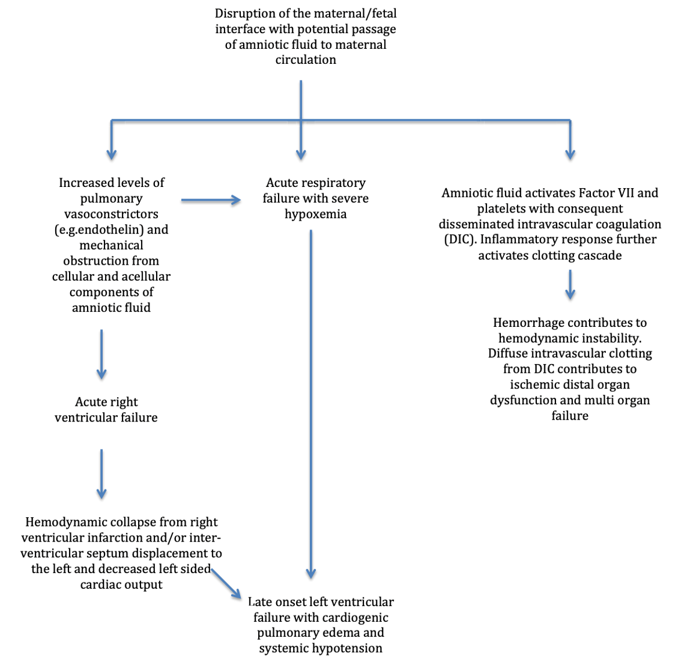

  Amniotic Fluid Embolism Pathophysiology section { margin-bottom: 20px; } table { border-collapse: collapse; } table, tr, th, td { border: 1px solid black; } h3, p, ol, li { margin: 0px; padding: 0px; } .text-red { color: red; } .text-black { color: black; } ul.custom-dash { list-style: none; padding-left: 0; margin: 0; } ul.custom-dash > li { display: flex; align-items: flex-start; line-height: 1; } ul.custom-dash > li::before { content: "–"; margin-right: 0.5em; flex-shrink: 0; line-height: 1; } ul.custom-dash > li > \*:not(::before) { flex: 1; } ul.custom-dash > li.no-dash::before { content: ""; width: 1em; margin-right: 0.5em; flex-shrink: 0; } /\* Change the ol style \*/ ol.custom-counter { list-style: none; counter-reset: custom; padding-left: 0; } ol.custom-counter li { counter-increment: custom; margin-bottom: 5px; } ol.custom-counter li::before { content: counter(custom) ") "; font-weight: bold; } /\* This is just for this file \*/ ul.custom-bullet-arrow { list-style: none; padding-left: 0; margin: 0; } ul.custom-bullet-arrow > li { display: flex; align-items: flex-start; } ul.custom-bullet-arrow > li::before { content: "↑"; margin-right: 0.5em; flex-shrink: 0; } ul.custom-bullet-arrow > li.no-arrow::before { content: ""; width: 0.5em; margin-right: 0.5em; flex-shrink: 0; } ul.custom-bullet\_arrow ul { list-style-type: disc; padding-left: 1.5em; margin-top: 0.5em; } img.resized { width: 200px; height: auto; } .mb-10px { margin-bottom: 10px; } .mb-20px { margin-bottom: 20px; } .reference-notes { font-size: 11px; } .text-indent-45px { text-indent: 45px; }

### Amniotic Fluid Embolism Pathophysiology

**Simplified pathophysiology:**

**Amniotic fluid and fetal components getting into maternal circulation trigger an intense allergic reaction resulting in:**

-   Systemic vasodilation-severe hypotension
-   Bronchoconstriction-Hypoxia
-   Pulmonary vasoconstriction- Pulmonary hypertension, right heart failure, and pulmonary edema

**Minutes to hours later:**

-   RV function improves
-   Left heart failure -Cardiopulmonary collapse

**DIC:**

The release of multiple inflammatory cytokines in response to amniotic material activates the coagulation and fibrinolytic pathways, culminating in a DIC syndrome.

**More detailed pathophysiology:**

**Initial phase:**

**Intense and transient pulmonary vasoconstriction, possibly coupled with bronchoconstriction. This results in:**

-   Acute pulmonary arterial obstruction
-   Dilation of the right ventricle and right atrium
-   Significant tricuspid regurgitation
-   Subsequently, hypoxia and right heart failure ensue

**Subsequent right ventricular (RV) enlargement:**

-   This RV enlargement causes the intraventricular septum to bow into the left ventricle (LV) resulting in obstruction and systolic dysfunction.
-   LV function will also experience significant depression from myocardial ischemia stemming from hypoxia or coronary artery spasm.

_**Note: Bedside echocardiography (TEE or TTE)** can aid in distinguishing AFE with the classic signs of:_

-   RV dilatation
-   Overload pattern
-   Septal bowing into the left ventricle

**Minutes to hours following the initial presentation:**

-   RV function usually improves
-   LV failure with cardiogenic pulmonary edema becomes prominent.

**Pulmonary hypertension:**

-   Pulmonary artery pressure (PAP) rises, and cardiac output decreases.
-   Ventricular fibrillation, asystole, and pulseless electrical activity have all been reported in association.
-   Survivors may result in hypoxic brain injuries or multisystem organ failure.

**Sudden cardiovascular collapse:**

The CV collapse is induced by hypoxemia and hypotension.

**The systemic exposure of amniotic fluid and fetal elements trigger the following inflammatory mediators:**

-   Including platelet-activating factor
-   Tissue necrosis factor-alpha (TNF-alpha)
-   Interleukin 6
-   Interleukin 1
-   Phospholipase A2
-   Endothelin, plasminogen activators
-   Thromboplastins
-   Complement factors

**The inflammatory mediators cause DIC:**

-   The inflammatory mediators above set off the coagulation cascade and fibrinolytic systems, resulting in DIC.
-   Amniotic fluid in the maternal circulation activates platelet factor III, leading to platelet aggregation and activation of clotting factor Xa.
-   Amniotic fluid and fetal elements may infiltrate the uterus, causing severe uterine atony and exacerbating hemorrhage.
-   The superimposed pathologic activation of the coagulation and fibrinolytic pathways results in severe coagulopathy, observed in approximately 80% of AFE patients.
-   The decrease in coagulation factors may occur either immediately at the time of cardiopulmonary collapse or in a delayed manner.
-   Bleeding can be severe, relentless, and fatal.
-   Autopsies on women succumbing to AFE reveal pulmonary edema, amniotic component emboli in the lungs, and alveolar hemorrhage.
-   Additional findings may include myocardial infarction, acute renal failure from acute tubular necrosis, and cerebral infarctions.

**Sudden cardiorespiratory failure and/or cardiac arrest.**

-   Decreased SaO2
-   Dyspnea, tachypnea, cyanosis, crackles, and, occasionally, wheeze.
-   Cardiac arrest is typically due to sustained pulseless ventricular tachycardia or ventricular fibrillation, but may be caused by a bradyarrhythmia and/or asystole.

Amniotic Fluid embolism: diagnosis and management

American Journal of Obstetrics and Gynecology, 2016

Society of Maternal-Fetal Medicine (SFFM)

Luis D. Pacheco, MD; George Saade, MD;

Gary D. V. Hankins, MD; Steven L. Clark, MD

Recognition and Management of Amniotic Fluid Embolism: A Critical Role for Anesthesia Professionals on Labor and Delivery

Anesthesia Patent Safety Foundation (APSF), Volume 37, No. 3, October 2022

Accessed 08/2025

David E Arnolds, MD, PhD

https://www.apsf.org/article/recognition-and-management-of-amniotic-fluid-embolism-a-critical-role-for-anesthesia-professionals-on-labor-and-delivery/

Amniotic fluid embolism

UpToDate July, 2025

Accessed 08.2025

Marie R Baldisseri, MD, FCCM and Steven Leigh Clark, MD

[HTTPS://WWW.UPTODATE.COM/CONTENTS/AMNIOTIC-FLUID-EMBOLISM](http://www.uptodate.com/contents/amntotic-fluid-embolism)