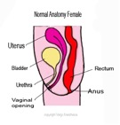
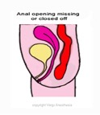
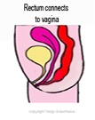
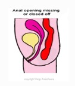

Anoplasty-Perineal for Imperforate Anus   

## Anoplasty - Perineal for Imperforate Anus

(It also helps to review Pull Through Procedure-PSARP, though it is a different procedure)  
_Edited by Anna Stone, CRNA and Heather J. Rankin, CRNA, DNP_  
  
Imperforate anus is a congenital defect in which the opening of the anus is missing or blocked.

**Several Forms**  
The rectum may end in a pouch that does not connect with the colon.  

The rectum may have openings to other structures.  
These may include the urethra, bladder, base of the penis or scrotum in boys, or vagina in girls.  
There may be narrowing (stenosis) of the anus or no anus.

Many forms of imperforate anus occur with other birth defects (VACTREL Associations).

  
  
  
  

**Now Just Remember**  
Imperforate Anus is just ONE form of an analrectal malformation. Analrectal malformations tend to be confusing because there are so many different malformations and repairing procedures for both male and female.In someway or another, most involve the distal anus and rectum as well as the urinary and genital tracts.  
**  
The anesthesia is usually the same.**  
What makes it worse, analrectal malformations tend to be associated with VACTREL anomalies, which may complicate the anesthesia.

A **Perineal Analplasty** is the FIRST stage and SOMETIMES the only procedure needed to repair an Imperforated Anus (Anal Atresia)  
  
**Quick Easy Review:**  
**3 Surgical goals with imperforate anus:**  
1\. If needed, detach the rectum from other structures, such as the urethra or vagina, and to repair these structures  
2\. To create an anus in the normal place on the outside of the body (Perineal Anoplasty).  
3\. To pull the rectum down to the new anus and connect it (Pull-through operation).  
  
After the initial diagnosis, the neonate is admitted to the NICU. They will immediately become NPO, receive an IV, NG Tube, and required fluids. Since anomalies are common for anal atresia, further diagnostic tests are preformed.  
You already know from the notes about (VACTREL).  
  
Your anesthesia plan may be altered by any VACTREL anomalies present.  
  
**Symptoms**  
Anal opening very near the vagina  
Not passing first stool within 24 - 48 hours after birth  
Missing or moved opening to the anus  
Stool passes out of the vagina, base of penis, scrotum, or urethra  
Distended abdomen  
  
**Anesthetic Concerns  
**Abdominal distention-aspiration riskPossible associated anomalies (VACTERL) that may that affect your anesthetic plan.  
There is always additional diagnostic testing done for possible anomalies prior to surgery.

**Pre-op:  
Labs**: Check results of BMP, CBC and T & C.  
Check for directed/parental donor blood availability  
**Versed:** 0.1mg/kg IV if administered. Versed is usually not required at this age. Most of us only give versed in children with separation anxiety, which is usually around age 1.  
  
If any VACTREL association is present, then there is around a 20% chance of a cardiac defect.  
These neonates are already admitted, have an IV and receiving IV Fluids.  
Check for NG tube, should already be in.  
Is there a cardiac consult?

**Anesthetic:** General/ETT/RSI  
**Regional:** Usually Caudal.  
Textbooks also say lumbar epidural, this is very rare.  
**Induction:** RSI. Some anesthesia providers prefer to suction out the belly despite having a flimsy replogle (also called repogle tube) already on place from the NICU. We usually pullout the replogle tube and suction out the belly orally with an OG tube.  
**Ventilation:** Intestinal obstruction can limit diaphragmatic excursion. Avoid elevated peak pressures.  
**Muscle Relaxant:** Check with surgeon, a muscle stimulator may be used.  
**NGT:** Should already have one, connect to suction  
**Nitrous Oxide:** Avoid-it may distend the bowel  
**IV: Access:** Should already have one. Always check patency upon receiving the patient. A second IV is usually started.  
  
**Hydration: 4:2:1 (below is just a common reference)**  
(Not an open belly case)  
Albumin dose for mild hypotension: 10cc/kg is recommended (<10kg wt)  
Albumin - more effective with its oncotic pull than crystalloids (<10kg wt)  
Crystalloid Bolus dose for mild hypotension: 5-10cc/kg (<10kg wt)  
Crystalloid Bolus dose for mild hypotension: 20cc/kg (>10kg wt)  
Crystalloid Bolus (emergency) for severe hypotension (20-50cc/kg)  
  
**Replacement of Insensible Fluid Loss (reference)**  
Minimally invasive (inguinal, laparoscopic)   0-2 cc/kg/hr  
Mildly invasive (ureteral reimplantation)   2-4 cc/kg/hr  
Moderately invasive (simple bowel cases)   4-8 cc/kg/hr  
Significantly invasive (NEC)   >10 cc/kg/hr  
**3rd Spacing:** 10mL/kg/h is standard for 3rd space fluid loss with an open belly case.  
  
**EBV (reference)**  
**Premature:** 90 - 100cc/kg  
**Newborn:** 80 - 90cc/kg  
**3mo-1 year:** 70 - 80cc/kg  
**1-4 years:** 70cc/kg  
**Adult:** 55 - 60cc/kg

**Duration:** 1-3 hours  
**Position:** Prone  
The neonate may be moved toward the foot of the bed. Protect your airway and make sure you have tubing slack.  
**Age Range:** newborn – 6 months  
**Supine for Colostomy:** Sometime a temporary colostomy is done if the malformation can not be repaired with one procedure.  
**EBL:** <5mls per kg  
Extubate: Yes  
  
**Possible Complications**  
Sricture of the anocutaneous anastomosis  
Rectourinary fistul  
Paralytic ileus  
Mucosal prolapsed  
Meconium peritonitis  
Incontinance

**More Notes  
**Defects range from the very minor and easily treated malformations (usually distal) with an excellent functional prognosis, to those that are complex, difficult to manage and have a poor functional prognosis (high level, supralaveter)  
  
Better imaging techniques (and knowledge of the anatomy and physiology of the pelvic structures at birth have improved diagnosis and initial management.Most of the distal malformations have excellent sphincter mechanisms and a normal sacrum, as opposed to the supralaveter (higher) lesions.  
  
Posterior sagittal approach (prone) allows surgeons to view the anatomy of these defects more clearly and to repair them under direct vision.

**Quick Basic Drug References  
****Propofol:** 2.5-3.5mg/kg IV  
**Succinylcholine:** <1 year: 3.0mg/kg  
\>1 year: 1.0-2.0mg/kg  
IM: 4-6mg/kg  
**Rocuronium:** <1 year: 0.25-0.5mg/kg  
1 year: 0.5-1.2mg/kg  
\>1 year: 0.5-1.3mg/kg  
**Vecuronium:** <1 year :0.05-0.1mg/kg  
\>1 year: 0.1mg/kg  
**Neostigmine:** 0.05-0.07mg/kg  
**Robinul:** 0.01mg/kg  
**Fentanyl:** 1-2mcg/kg  
**Morphine:** 0.05-0.15 mg/kg/dose IV q2-4h prn**Ofirmev:** \>2 years: 15mg/kg  
**Not FDA approved for < 2 years, but many still administer at 15mg/kg  
Toradol:** \>2 years: 0.5mg/kg  
**Precedex** (Emergence)**:** Slow push 0.5mcg/kg  
**Zofran:** 100mcg/kg (max 4mg)  
**Decadron:** 0.2-0.5mg/kg  
**Ancef:** 25mg/kg Q6h  
**Ampicillin:** 25-100mg/kg (max per day 100-400mg/kg)  
**Gentamycin:** 2-2.5 mg/kg/dose q8h (Max dose 80 mg)  
**Ceftriaxone (rocephin):** 50-75mg/kg  
**Clindamycin (cleocin):** 15-25mg/kg  
**Invanz** (ertapenem): (3 month -12 years): 15mg/kg  
**Vancomycin:** 10mg/kg slow IV

Warner BW. Pediatric surgery. In: Townsend CM, Beauchamp RD, Eyers BM, Mattox KL, eds. Sabiston Textbook of Surgery. 18th ed. Philadelphia, Pa: Saunders Elsevier; 2007:chap 71.  
Stafford SJ, Klein MD. Anus and rectum. In: Kliegman RM, Behrman RE, Jenson HB, Stanton BF, eds. Nelson Textbook of Pediatrics. 19th ed. Philadelphia, Pa: Saunders Elsevier; 2011:chap 336.  
Jaffe, Richard A. _Anesthesiologist's Manual of Surgical Procedures_. N.P.: n.p., 2012.  
Fleisher,Lee Roizen,Michael; Essence of Anesthesia Practice; 2010