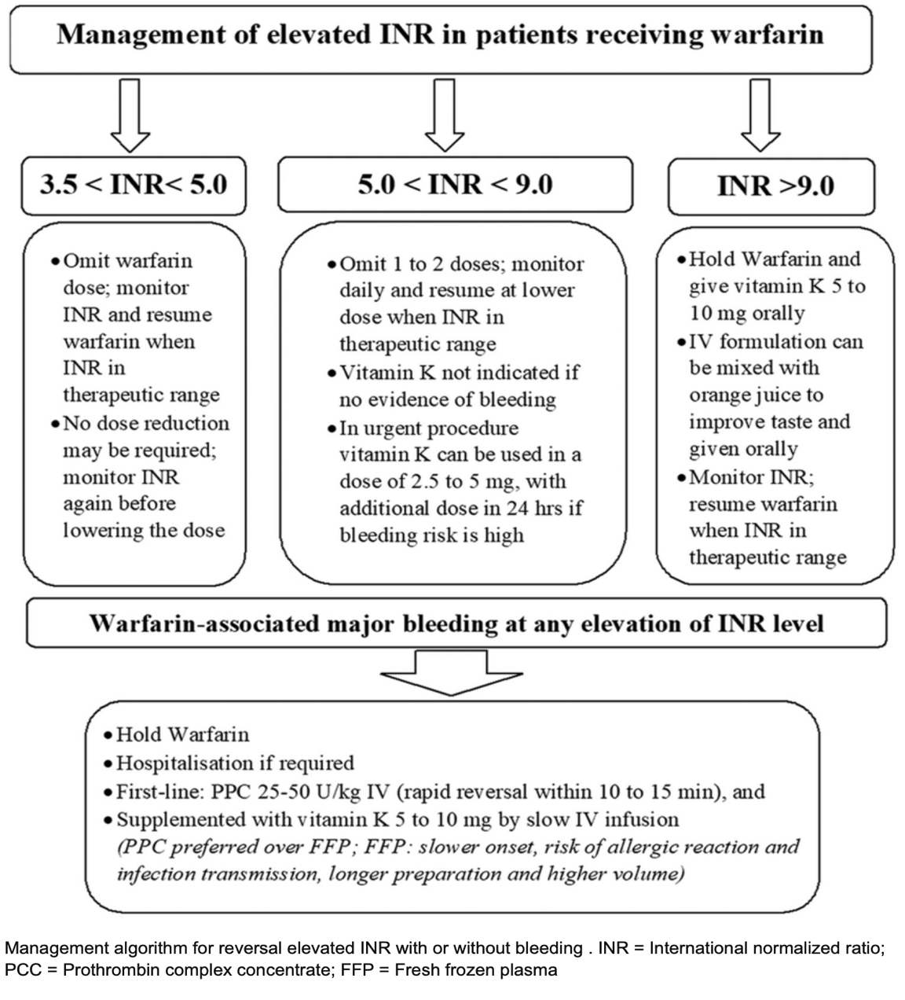

Anticoagulant Cheat Sheet    body {font-family: 'Open Sans', sans-serif;}

### Anticoagulant Cheat Sheet

table.tableizer-table { font-size: 12px; border: 1px solid #CCC; font-family: Arial, Helvetica, sans-serif; } .tableizer-table td { padding: 4px; margin: 3px; border: 1px solid #CCC; } .tableizer-table th { background-color: #104E8B; color: #FFF; font-weight: bold; }

| Drug | Mechanism | ½ life | Stop Before  
Neuraxial Procedure | Antidote and/or  
Management for non-severe bleed |
| --- | --- | --- | --- | --- |
| Aspirin  
(ASA) | COX  
Inhibition | 20 min | Continue | No antidote  
Desmopressin  
TXA  
Platelets |
|   |   |   |   |   |
| Clopidogrel  
(Plavix) | ADP receptor  
Inhibitor | 7 hours | 5-7 days | No antidote  
Desmopressin  
TXA  
Platelets |
| Prasugrel  
(Effient, Efient) | ADP receptor  
Inhibitor | 7 hours | 7-10 days | No antidote  
Desmopressin  
TXA  
Platelets |
| Ticlopidine  
(Ticlid) | ADP receptor  
Inhibitor | 4 days | 10 days | No antidote  
Desmopressin  
TXA  
Platelets |
| Ticagrelor  
(Brilinta) | ADP receptor  
Inhibitor | 8 hours | 5-7 days | No antidote  
Desmopressin  
TXA  
Platelets |
|   |   |   |   |   |
| Cilostazol  
(Pletal) | PDE Inhibitor | 12 hours | 2 days | No antidote  
Desmopressin  
TXA  
Platelets |
|   |   |   |   |   |
| Abciximab  
(Reopro) | GB F IIb-IIIa  
Inhibitor | 30 min | 24-48 hours | No antidote  
Desmopressin  
TXA  
Platelets |
| Eptifibatide  
(Integrilin) | GB F IIb-IIIa  
Inhibitor | 2.5 hours | 4-8 hours | No antidote  
Desmopressin  
TXA  
Platelets |
| Tirofiban  
(Aggrastat) | GB F IIb-IIIa  
Inhibitor | 2 hours | 4-8 hours | No antidote  
Desmopressin  
TXA  
Platelets |
|   |   |   |   |   |
| Heparin | F IIa > Xa  
Inhibition | 1.5 hours | 4-12 hours | Protamine |
| LMW Heparin  
Enoxaparin  
(Lovenox)  
Dalteparin  
(Fragmin) | F IIa > Xa  
Inhibition | 4.5 hours | 12-24 hours | Protamine |
| Fondaparinux  
(Arixtra) | F IIa > Xa  
Inhibition | 20 hours |   | No antidote |
|   |   |   |   |   |
| Rivaroxaban  
(Xarelto) | Direct F Xa  
Inhibition | 9 hours | 72 hours | Andexxa  
(Andexanet alpha) |
| Apixaban  
(Eliquis) | Direct F Xa  
Inhibition | 12 hours | 72 hours | Andexxa  
(Andexanet alpha) |
|   |   |   |   |   |
| Bivalirudin  
(Angiomax) | F IIa Inhibitor | 25 mins |   | No antidote  
Desmopressin  
TXA |
|   |
| Hirudin | F IIa Inhibitor | 1.5 hours |   | No antidote  
Desmopressin  
TXA |
| Argatroban  
(Acova) | F IIa Inhibitor | 45 min |   | No antidote  
Desmopressin  
TXA |
| Dabigatran  
(Pradaxa) | F IIa Inhibitor | 12 hours | 5 days | Praxbind  
Desmopressin  
TXA |
|   |   |   |   |   |
| Warfarin  
(Coumadin) | Vit K  
Antagonism | 2-4 days | 5 days | Vit K |

**Doses:  
Protamine:** 1-1.3 mg per 100 units of heparin (do not bolus).**Desmopressin (DDAVP):** 0.3 mcg/kg x1  
**Tranexamic Acid (TXA):** 1 gram loading dose over 10 minutes followed by 1 gram continuous  
Infusion over 1 hour.  
**  
Andexxa (Andexanet alpha):****Note:** _Andexxa alpha is usually not readily available in many medical facilities and is very expensive.Many healthcare providers resort to Kcentra._**  
Dosing:  
The recommended dose of Andexxa is based on the following:**  
The time of the last dose of (apixaban (Eliquis®) or rivaroxaban (Xarelto®).  
Which oral factor Xa inhibitor was involved?  
_Each vial of Andexxa contains 200mg in powder form._**  
  
Two types of doses for Andexxa:  
**Low dose  
High dose  
**Low dose (5 vials):  
Initial IV bolus:** 400 mg (2 vials) at a target of 30 mg/min, immediately followed by...  
**Continuous infusion of** 480 mg (3 vials) at 4 mg/min rate for up to 120 minutes.  
**High dose (9 vials):  
Initial IV bolus:** 800 mg (4 vials) at a target of 30 mg/min, immediately followed by...**Continuous infusion of** 960 mg (5 vials) at 8 mg/min for up to 120 minutes.  
**Recommended reversal doses for Rivaroxaban (Xarelto)** table.tableizer-table { font-size: 12px; border: 1px solid #CCC; font-family: Arial, Helvetica, sans-serif; } .tableizer-table td { padding: 4px; margin: 3px; border: 1px solid #CCC; } .tableizer-table th { background-color: #104E8B; color: #FFF; font-weight: bold; }

| Strength of the last dose | Time since last dose  
< 8 hours or unknown | Last dose > 8 hours |
| --- | --- | --- |
| ≤ 10 mg | Low dose | Low dose |
| \>10 mg or unknown | High dose | Low dose |

  
**Recommended reversal doses for apixaban (Eliquis** ® **)** table.tableizer-table { font-size: 12px; border: 1px solid #CCC; font-family: Arial, Helvetica, sans-serif; } .tableizer-table td { padding: 4px; margin: 3px; border: 1px solid #CCC; } .tableizer-table th { background-color: #104E8B; color: #FFF; font-weight: bold; }

| Strength of last dose | Time since last dose  
< 8 hours or unknown | Last dose > 8 hours |
| --- | --- | --- |
| ≤ 5 mg | Low dose | Low dose |
| \> 5 mg or unknown | High dose | Low dose |

**  
Reconstitution of Andexxa (200 mg vials):  
**Use sterile waterUse 20 mL or larger syringes and 20g or larger needles until the volume is achieved.**  
For continuous infusion:**  
Inject the mixed ANDEXXA solution from the syringe into an empty polyolefin or polyvinyl chloride IV bag with 250 mL or less volume.  
**  
Praxbind (idarucizumab):  
**_Praxbind is usually not readily available in many medical facilities and is very expensive.Many healthcare providers resort to Kcentra._  
**Dosing:**  
5 grams IV x 1, administered as 2 consecutive IV infusions of 2.5-gram vials over 5 minutes each.  
The second 2.5-gram vial must be administered within 15 minutes of the first vial.  
Recheck labs.  
FDA trials are currently underway for apixaban, rivaroxaban, and edoxaban.  
  
**Prothrombin Complex Concentrate (PCC):  
Kcentra:** 30 mg/kg slow push. May repeat in 4 hoursRefer to “Kcentra Prothrombin Complex Concentrate) (PCC,4F-PCC) (Octaplex)” in this App for details  
**Activated Prothrombin Complex (aPCC):  
FEIBA:** 100 units/kg may repeat in 6 hoursRefer to “FEIBA (Activated PCC or aPCC) Dosing” and Review in this App for more details**Vitamin K: for reversing Warfarin.  
_Note:_** _Literature varies on dosing; thus, always follow your medical institution’s protocols concerning vitamin K dosing for reversing warfarin.  
  
_**Warfarin and elevated INR for minor surgery  
**Anticoagulation reversal for minor procedures is generally unnecessary.There is little evidence that moderately elevated INR correlates with post-procedural bleeding after many procedures (e.g., ultrasound-guided central line placement or thoracentesis).  
  
**Intracranial hemorrhage with a patient on warfarin:  
**PCC should be given immediately without waiting for the INR to result.For urgent reversal, vitamin K administered alone is INSUFFICIENT  
The liver cannot quickly produce the lacking factors.  
In addition to Vitamin K, the missing factors must be replaced with either FFP or PPCs.  
  
**Reversal for hemorrhage:**  
(1) 10 mg IV vitamin K over 30 minutes \*plus\* PCC or FFP.  
(2) PCC or fresh frozen plasma:  
PCC is preferred  
**Alternative:** Four units of FFP  
**Urgent surgery:**  
Anticoagulation can be reversed with 2.5 to 5 mg of vitamin K administered IV in a patient taking warfarin who requires urgent surgery.  
This lower dose of vitamin K is especially important when anticoagulation needs to be resumed once hemostasis has been achieved after surgery.  
  
A common protocol:

****

  

Oral anticoagulants: Optimizing venous thromboembolism management  
Journal of Applied Hematology; October 2019  
Fahada S Aleidan  
  
Reversal of Anticoagulants at UCDMC  
Approved by UCDHS Pharmacy & Therapeutics Committee 3/2017.  
https://www.ucdmc.ucdavis.edu/anticoag/pdf/AnticoagReversal.pdf  
  
Perioperative Hemostasis – Coagulation for Anesthesiologist  
C. Marcucci and P. Schoettker; 2015; pp. 123.Anesthesia Secrets 6 th Ed. 202, page 14.  
Brian M. Keech and Ryan D. Laterza  
ANTICOAGULANTS: THE GUIDE TO REVERSAL  
OHSU Hospital and Clinics Department of Pharmacy Services Pharmacy and Therapeutics Committee October 2011.  
  
Guidelines for the Management of Anticoagulant and Anti-Platelet Agent Associated Bleeding Complications in Adults  
https://tinyurl.com/bdhj4wk5  
  
Regional anesthesia in the anticoagulated patient: defining the risks (the second ASRA Consensus Conference on Neuraxial Anesthesia and Anticoagulation).  
Reg Anesth Pain Med 2003;28:172-97  
Horlocker TT, Wedel DJ, Benzon H, et al.  
  
Anticoagulation Reversal and Treatment Strategies in Major Bleeding: Update 2016Steve Christos, DO, MS \*  and Robin Naples, MD †West J Emerg Med. 2016 May; 17(3): 264–270.  
  
The clinical use of prothrombin complex concentrate.   
Journal of Emergency Medicine. 2013;44(6):1201–10.  
Serreira J, DeLos Santos M.  
  
Oral anticoagulants: Optimizing venous thromboembolism managementJournal of Applied Hematology; October 2019  
Aleidan, FahadA  
  
2022 Guideline for the Management of Patients With Spontaneous Intracerebral Hemorrhage: A Guideline From the American Heart Association/American Stroke Association  
Stroke; 2022 Jul;53(7)  
Steven M Greenberg, Wendy C Ziai, Charlotte Cordonnier, Dar Dowlatshahi, Brandon Francis, Joshua N Goldstein, J Claude Hemphill 3rd, Ronda Johnson, Kiffon M Keigher, William J Mack, J Mocco, Eileena J Newton, Ilana M Ruff, Lauren H Sansing, Sam Schulman, Magdy H Selim, Kevin N Sheth, Nikola Sprigg, Katharina S Sunnerhagen; American Heart Association/American Stroke Association  
(UP Health System - Marquette Pharmacy and Therapeutics Committee Medication Guideline  
  
Dose of vitamin K in emergency reversal of warfarin anticoagulation  
Canadian Medical Association Journal 2011 Feb 22; 183(3): 349.  
Matthew D. Seftel, MBChB MPH  
Anticoagulant Reversal  
Internet Book For Critical Care (IBCC); September 25, 2021   
Josh Farkas (accessed 07/2024)  
https://emcrit.org/ibcc/reverse/