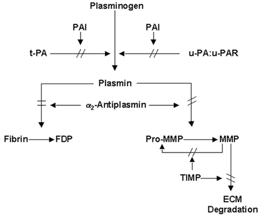

Antiplasmin (α2-antiplasmin)    body {font-family: 'Open Sans', sans-serif;}

### Antiplasmin (α2-antiplasmin)  
(AP, also referred to α2-antiplasmin, α2AP)

The plasma protein α2-antiplasmin (α2AP or α2PI) is a plasmin inhibitor.  
Do NOT confuse α2AP with plasma inhibitors 1 and II, even though they all inhibit fibrinolysis.  
  
It is the main physiological inhibitor of the serine protease plasmin, which is responsible for the dissolution of fibrin clots.  
  
α2AP acts by forming stable complexes with free plasmin.

****

  
α2AP’s terminal extension is rapidly cross-linked to fibrin during blood clotting by activated coagulation factor XIII, and, as a consequence, fibrin becomes more resistant to fibrinolysis with incorporation of antiplasmin into a clot as it is formed.  
  
It acts as a secondary backup inhibitor of activated FXI, activated protein C and trypsin.  
  
The amount of α2AP cross-linked to fibrin is a more important determinant of the rate of clot lysis than is the amount of free plasmin in the circulation (Coughlin, 2005a).  
  
Healthy neonates have approximately half the adult level of A2AP. The levels reach adult range in the first seven days of life. A2AP is reduced in consumptive states associated with plasminogen activation.  

Molecular Basis of Lipoprotein Disorders, Atherogenesis, and Thrombosis  
By JOSÉ MARÍN-GARCÍA M.D., in Post-Genomic Cardiology, 2007  
  
Hemostasis  
Patricia Gentry, ... Darren Wood, in Clinical Biochemistry of Domestic Animals (Sixth Edition), 2008