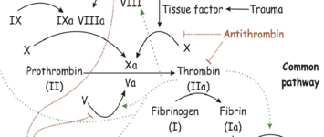

Antithrombin III    body {font-family: 'Open Sans', sans-serif;}

### Antithrombin III(AT III), a clotting inhibitor  
(Heparin accelerates its inhibition of clot formation)

Antithrombin I-IV originated in early studies. However, only AT III and possibly AT I are medically significant.  
Antithrombin III (ATIII) is a non-vitamin K-dependent protease.  
It inhibits coagulation by neutralizing thrombin (factors IIa, IXa, Xa), thus fibrinogen will not be converted to fibrin.

****

  
**Heparins potentiate antithrombin III up to 4,000 times**  
LMWH and Heparin potentiate antithrombin III thus preventing coagulation.  
Heparin POTENTIATES the activity of Antithrombin III by 2,000 - 4,000 times, leading to a risk increased bleeding.  
  
**Plasma half-life of Antithrombin III:** Around 3 days.  
  
**Antithrombin III deficiency:** May result in venous thrombosis and pulmonary embolism.  

Antithrombin III Deficiency; 2017  
By James L Harper, MD  
  
Bjork, I; Olson, JE (1997). _Antithrombin, A bloody important serpin (in Chemistry and Biology of Serpins)_ . Plenum Press. pp. 17–33  
  
Jordan RE, Oosta GM, Gardner WT, Rosenberg RD (1980). "The kinetics of hemostatic enzyme-antithrombin interactions in the presence of low molecular weight heparin". _J. Biol. Chem_ . **255** (21): 10081–10090.