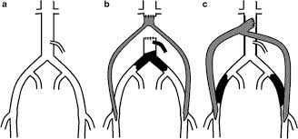

Aorta-Femoral Bypass     body {font-family: 'Open Sans', sans-serif;}

### Aorta-Femoral Bypass

**Also known as:**  
Bifemoral Bypass  
Aortobifemoral Bypass  
Descending Thoracic Aortobifemoral Bypass for Aortoiliac Occlusive Disease

****

For this surgery, an artificial graft is formed into a Y shape. The single end of the Y is sewn on the aorta. The two split ends of the Y are sewn below the blocked or narrowed areas of the femoral arteries. This allows the blood to travel around (bypass) the diseased areas.

This is similar to but much easier than an open AAA procedure. You will need heparin and prepare to monitor ACTs. There are still pressure issues with clamping/unclamping the aorta, but not as drastic as the open AAA because the clamping is lower down the vascular tree. The EBL and duration of procedure is usually surgeon dependent.

Mannitol and Lasix are not as common anymore in this procedure. Their administration depends on where the aorta is clamped and the surgeon’s preference.

**Alternative treatments:** Angioplasty, with or without stenting.

**Physical Examination:** Usually reveals absent or very weak femoral pulses.

**Concerns:** These patients usually have other issues of co-morbidity:    
PVD (possible CAD), HTN, DM and ESRD.  
Extremity ischemia.  
Many have poor medical compliance and/or abuse tobacco.

**Anesthetic:** General/ETT  
**Duration:** 3-6 hours; surgeon dependent.  
**Position:** Supine with arms out.  
Have a Neosynephrine drip ready because you are treating the patient like a CAD patient.

**A-line:** yes (mostly for ACTs) Arms out for easy access!

**Heparin/Protamine:** Yes.  
**Blood loss**: 400-1,000 mLs.

**IV Access:** 2 18 Gauge IVs

**Central Line necessity?**  Usually, but 2 18G IV will do fine.  
  
**Possible Complications:**  
I have read that 1 in 30 (3%) of these patients do not survive!  
Hemorrhage  
Hematoma and bleeding.  
Pneumonia/chest infection.   
Heart attack.    
Kidney failure usually recovers spontaneously. Rarely, renal dialysis is required long term.  
Wound infections.   
Bowel problems happen and include post-op ileus, lack of peristalsis.  
Stroke events are rare.  
Loss of blood supply to the legs may occur due to blockage of the graft or from dislodging loose material within the arteries that then passes down into the legs.  This is rare but may require further surgery. Rarely, amputation may be required.  
DVT   
Sexual dysfunction may occur in men due to nerves within the pelvis being unavoidably cut during the surgery.  
Infection of the Dacron graft tube. This is rare but very serious.  Usually requires removal of the synthetic tube.  
 

**More Notes:**

Grafting of just one iliac diseased vessel used to be common. Today aortobifemoral bypass is now currently preferred, since unilateral disease eventually becomes bilateral.

At present, laparoscopic aortic bifemoral bypass is performed only by a handful of surgeons from a few centers.

Long-term patency of aortic bifemoral bypass grafts ranges from 91% at 5 years to 80% at 10 years in one national study. Patency rates are lower if the procedure is performed in patients with ischemic rest pain, ulcerated toes, or coexisting distal disease.

"Aorto-bifemoral Bypass Surgery." _Leeds Vascular Institute_.   
http://www.leedsvascularinstitute.org/procedures\_bypass-aortobifem.php  
  
Jaffe, Richard A. _Anesthesiologist's Manual of Surgical Procedures_. 2012.  
  
Kalbande, Manohar B. _Vascular Surgery Made Easy_. 2013.  
  
Macksey, Lynn Fitzgerald. _Surgical Procedures and Anesthetic Implications: A Handbook for Nurse  
Anesthesia Practice_. Sudbury, MA: Jones & Bartlett Learning, 2012.