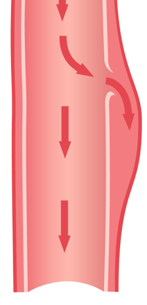

Aortic Dissection Notes     body {font-family: 'Open Sans', sans-serif;}

### Aortic Dissection Notes

An aortic dissection occurs when blood penetrates the aortic intima and forms an expanding hematoma within the vessel wall separating the intima and media. This creates a false lumen or a dissecting hematoma that can narrow or compress the vessel lumen. So a dissecting vessel can be narrowed, which is in contrast to an aneurysm, which involves the dilation of all the vessel’s three layers.   
 

Surgery is usually required for dissections that involve the aortic arch, while dissections further down away from the heart may be treated with lowering of the blood pressure.

**Facts:**  
Aortic dissections are rare and occur in 2–3.5 per 100,000 people every year.  
They are 1out of 10,000 hospital admissions.  
A dissection is found in 1out of every 600 autopsies.  
They may have caused 1% of the above autopsy cases.  
More common in males.  
Mean age at diagnosis is 63.  
40% of the cases of aortic dissection lead to death so rapidly that the person doesn't make it to the hospital in time.

**Conditions Predisposing Aortic Dissections:**

History of hypertension is present in approximately 90% of patients.  
Advanced age of >60 years.  
Males carry the preponderance numbers at the age of <60 years

Marfan syndrome and other connective tissue diseases.

Congenital heart disease: Coarctation of aorta, bicuspid aortic valve.  
Pregnancy: Has occurred but is extremely rare.  
  
The term **dissecting aneurysm,** although commonly used, is often a misnomer because it can occur with or without aneurysmal enlargement of the aorta.  
Dissection can lead to aneurysmal change and early or late rupture.  
**Chronic dissection:** Is when it is diagnosed more than 2 weeks after onset of symptoms.  
**The dissection can damage the branching arteries off the aorta:**  
The dissection can progress proximally to involve the aortic sinus, aortic valve, and coronary arteries.  
  
**DeBakey classification of dissections**: DeBakey postulated three different types, depending on where the intimal tear is located and which section of the aorta is involved.  
  
**Stanford (Daily) classification of dissections**: This classification is simpler than the DeBakey classification and has more clinical relevance.

Thoracic aortic untreated dissections have a high mortality rate.

**Possible Symptoms of Ascending Aortic Dissection Type A:**  
Anterior chest pain secondary to extension of dissection; patient may complain of a ripping or tearing sensation in their trunk, or have angina from a dissection of coronaries.  
CHF symptoms, from a murmur due to aortic valve insufficiency or narrowing of a true lumen leading to an increased afterload, systolic ejection murmur.

**BP:** Hypotension secondary to rupture into the retroperitoneum, intra-abdominal, intra-thoracic, or pericardial spaces.  
**Hypertension:** Hypertension secondary to pain and or anxiety.  
**Respiratory:** Hoarseness secondary to compression of recurrent laryngeal nerve.

Dyspnea and stridor due to tracheal compression.  
Hemoptysis due to erosion into trachea (chronic).  
Rales secondary to CHF.  
**Neurologic:** Hemiparesis or hemiplegia secondary to involvement of single carotid artery.  
**_Type A dissections may involve the entire aorta; therefore, symptoms of both ascending and descending pathology may be present._**

**Possible Symptoms of Descending Aortic Dissection Type B:**

Back pain Located in the mid-scapular region.  
Hypertension secondary to pain.  
Hypotension may occur if a rupture of dissection has occurred.  
**Respiratory:** Dyspnea due to left main stem bronchial obstruction or hemorrhagic pleural effusion.  
**GI:** These can mimic an acute abdomen: Pain, a rigid abdomen, nausea and vomiting and GI bleeding. Bowel ischemia may occur secondary to compression or dissection of mesenteric or celiac artery.

**Renal:** Ischemia may present due to involvement of renal arteries in dissection, infarction of renal flow, renal failure, or renal insufficiency.  
**Neurologic:** Paraparesis or paraplegia is possible secondary to occlusion of critical spinal cord blood flow.

Alessi, Rick, M.D., John E. Ellis, M.D., and Abraham C. Guapp, M.D. "OPEN REPAIR OF DESCENDING THORACIC (THORACOABDOMINAL) AORTIC ANEURYSM." N.p., n.d. Web. http://www.sarasotaanesthesia.com/pdf/TAA\_Alessi.pdf  
  
Cooper Jr., John R. "Ch. 24, Anesthetic Management for Thoracic Aneurysms and Dissections." _A  
 Practical Approach to Cardiac Anesthesia_. By Thomas M. Skeehan.  
  
Kalbande, Manohar B. _Vascular Surgery Made Easy_. 2013.