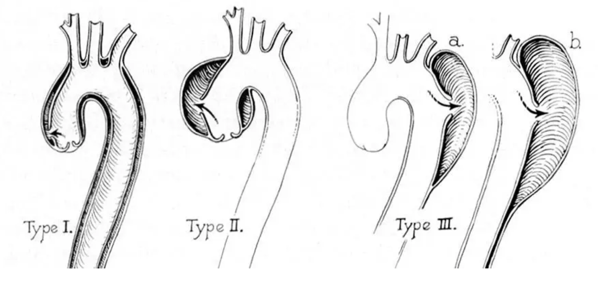
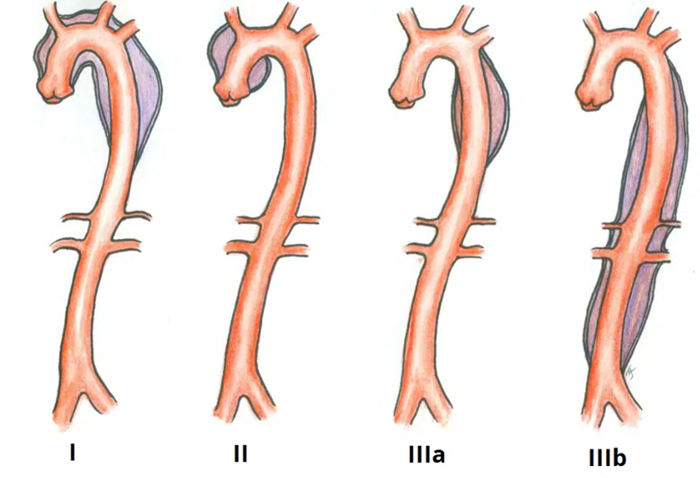

  Aortic Aneurysms-Types of Dissections section { margin-bottom: 20px; } h3, p { margin: 0px; padding: 0px; } img { width: 500px; height: auto; } .mb-10px { margin-bottom: 10px; }

### Types of Aortic Aneurysms Dissections

**Aortic dissection:** It is a life-threatening, catastrophic event.

Essentially, the inner layer of the aorta splits and creates a false channel for blood flow.

Without treatment, many patients will die within 48 hours.

The **DeBakey classification** groups aortic dissections anatomically.

**Type I:**

It originates in the ascending aorta and propagates at least to the aortic arch.

They are typically seen in patients under 65 years.

It has the highest mortality.

The surgery involves removing the ascending aorta (with or without the arch) and replacing it with a synthetic graft.

If the dissection has damaged the suspensory apparatus of the aortic valve, this will also require repair.

Any additional branches of the aortic arch involved will require reimplantation into the graft (e.g., brachiocephalic artery, left common carotid artery, left subclavian artery), and long Type A dissections involving the descending and possibly abdominal aorta may require staged procedures.

**Type II:**

Confined to the ascending aorta.

Classically in elderly patients with atherosclerotic disease and hypertension.

**Type III (IIIa or IIIb)**

Originates distal to the subclavian artery in the descending aorta

**IIIa:**

Extends distally to the diaphragm

**IIIb:**

Extends beyond the diaphragm into the abdominal aorta

  

Circulating Now

(accessed 9/2024)

Susan Green

https://circulatingnow.nlm.nih.gov/2020/02/13/the-development-of-the-debakey-classification-of-aortic-dissection/