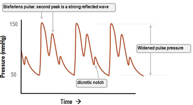

Aortic Regurgitation Notes    body {font-family: 'Open Sans', sans-serif;}

### Aortic Regurgitation Notes

Occurs when the aortic valve doesn't close tightly during diastole, permitting a backflow leak.  
The aortic valve has three leaflets.  
  
**Incidence of AR:** Most common cause worldwide is rheumatic fever.  
Congenital and degenerative valvular aortic disease are the most common causes in US.  
  
**Prevalence:** 13% in men and 8.5% in women in a Framingham study.  
In US, AR is less than 1%.  
Chronic AR more prevalent than acute AR.  
  
**Mortality  
Acute AR** has a higher mortality rate due to sudden uncompensated cardiovascular changes and requires surgical treatment.  
**Chronic AR** mortality comes from eventual decompensation of the left ventricle (LV) leading to a decreased LV function and low ejection fraction (EF).  
Prognosis is poor even following corrective surgery.  
  
**Yearly mortality risk related to NYHA classification for chronic AR.  
Asymptomatic:** 2.8%  
**NYHS Class I:** 3%  
**NYHA Class II:** 6.3 %**NYHA Class III-IV:** 24.6%  
  
Severe AR is most commonly diagnosed at age 60 and above.  
Risk is greater in males than in females.  
  
AR allows some of the blood that was previously pumped out of LV into the aorta to regurgitate back into the LV due to a pressure gradient between the left ventricle and the aorta.  
Regurgitant volume depends on the HR and the diastolic pressure gradient across the aortic valve.  
  
**With AR, blood is now entering the LV from 2 sources:  
**First, from the lungs via left atrium (LA).  
Second, regurgitant flow from the aorta via leaky aortic valve.  
  
**Acute AR  
The LV does not have time to compensate for the volume overload, resulting in:**  
Decreased aortic diastolic pressure (decreased forward flow due to reduced aortic elastic recoil).  
Decreased coronary perfusion pressure due to decreased aortic root pressure, leading to coronary ischemia.  
Increased myocardial oxygen demand.  
Rapid deterioration of LV function.  
Pulmonary edema, CHF and heart failure.  
Treatment requires emergent surgery.  
  
**Chronic AR**  
**Gradual, chronic increase in blood volume from the two sources permits the LV to compensate over time with:**  
LV dilation.  
Eccentric hypertrophy.  
Increased heart rate (HR).  
Decreased systemic vascular resistance (SVR).  
  
EF is maintained and may prevent symptoms with exertion and change of positioning.  
Chronic AR may be asymptomatic for decades.  
  
Eventually the LV wall becomes excessively thickened. This increases wall tension, which decreases myocardial perfusion. This results in a decrease in EF and CHF. It also results in end-organ hypoperfusion.  
The body compensates by increasing sympathetic tone (increasing SVR) to maintain pressure, but this eventually worsens the AR.  
LVEDP increases significantly, impairing myocardial contractility.  
The heart’s compensatory mechanisms are tachycardia and vasoconstriction.  
  
CHF, arrhythmias and sudden death may occur.  
Irreversible cardiac damage may occur without timely surgical intervention.  
  
**Causes of AR:  
**_Usually a result from endocarditis or aortic dissection_Bicuspid aortic valve (BAV).  
Anorexigenic drugs.  
Rheumatic fever: common.  
Rheumatoid arthritis.  
Endocarditis: common.  
Ankylosing spondylitis.  
Marfan syndrome.  
Ehlers-Danlos syndrome.  
Reiter syndrome: an arthritic disorder that affects adult males.  
Syphilis: less often, syphilis is transmitted from a pregnant woman to her baby. This form of syphilis is known as congenital syphilis.  
Systemic lupus erythematosus.  
Idiopathic aortic root dilation.  
Hypertension-induced aortic annular ectasia.  
  
Ventricular afterload is chronically reduced because of a low diastolic pressure reflecting a diastolic run-off.  
  
**Symptoms  
**Low diastolic pressure  
Cyanosis  
Syncope  
Fatigue, especially with increased activity.  
SOB with exertion or when the patient lies flat.  
Angina pectoris may occur in the absence of CAD.  
Arrhythmia.  
Decrescendo diastolic murmur.  
Heart palpitations.  
Swollen ankles and feet (pedal edema).  
Widened pulse reassure.  
Corrigan’s carotid pulse.  
Bounding peripheral pulses (Watson’s hammer pulse).  
Austin-Flint murmur.  
Pulmonary congestion can occur due to progressive increases in LVEDV.  
  
**Eccentric hypertrophy:** chamber size increases with ventricular wall thickness.  
The LV decompensates at later stages and LEDP and LVEDV rises.  
  
Symptomatic severe AR with below normal LV EF requires urgent treatment and has a poorer prognosis.  
**Arterial waveform with AR:** Bisferious (beating twice).  
Has a sharp rise and wide pulse pressure and a low diastolic pressure.  

****

From Bersten and Soni's "Oh's Intensive Care Manual", 6th Edition; plus McGhee and Bridges  
**_Monitoring Arterial Blood Pressure: What You May Not Know_**  
(Crit Care Nurse April 1, 2002 vol. 22 no. 2 60-79 )  
  
**Aortic Regurgitant Fraction**  
Normal to trivial <20%.  
Mild 20-30%.  
Moderate 30-55% (At 40%, the patient may still be asymptomatic).  
Severe > 55% (> 60 ml).**  
  
Color Doppler Aortic regurgitant vena Contracta  
**Mild AR < 0.3 cm.  
Moderate AR 0.3 - 0.6 cm.  
Severe AR > 0.6 cm.  
  
**Aortic regurgitation pressure half-time (PHT)  
**Mild AR > 550 msec.  
Moderate AR 300-550 msec.  
Severe AR < 300 msec.  
  
**Concomitant organ dysfunction  
**Dilated cardiomyopathy and diastolic dysfunction.  
Concomitant mitral stenosis and regurgitation in rheumatic heart disease.  
Pulmonary hypertension, congestion and pleural effusion.  
Renal insufficiency.  
Hypertension.  
  
**Surgery is recommended:**  
When EF < 55%  
When LV end-systolic volume > 55 ml.  

Barash, Paul G. _Clinical Anesthesia_ . Philadelphia, PA: Wolters Kluwer, 2009  
  
Stoelting’s Anesthesia and Coexisting Disease 7 th ed. 2018, pp.122-23.  
  
Cheng, Davy C. H., and Tirone E. David. _Perioperative Care in Cardiac Anesthesia and  
Surgery_ . Philadelphia: Lippincott Williams & Wilkins, 2006.  
  
The 5-Minute Anesthesia Consult, 2013  
Nina Singh-Radcliff  
  
Anesthesiology Core Review, Part Two: Advanced Exam, 2016, p. 4.  
B. Freeman and J. Berger Frank J.Domino