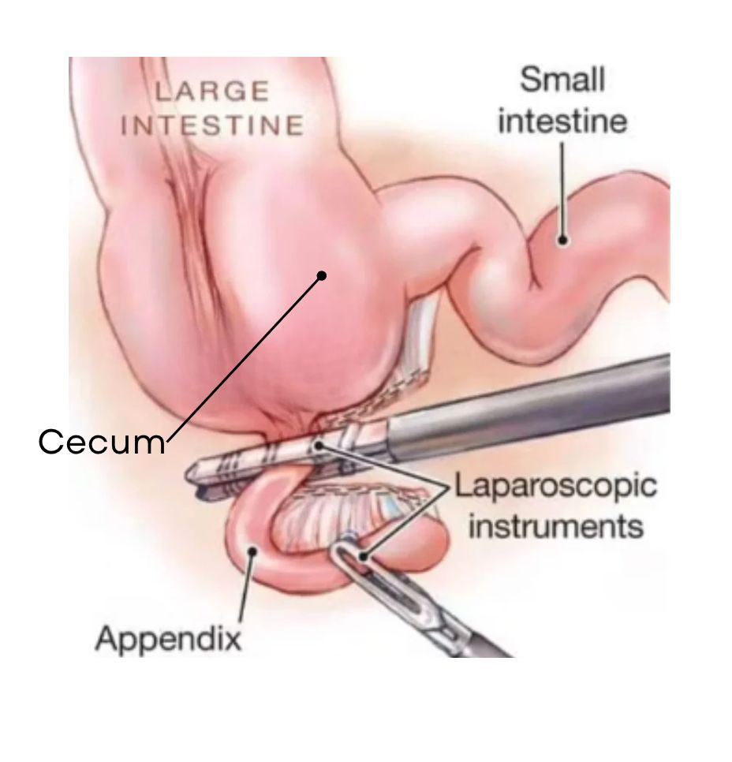

  Appendectomy section { margin-bottom: 20px; } table { border-collapse: collapse; } table, tr, th, td { border: 1px solid black; } h3, p, ol.custom-counter, li { margin: 0px; padding: 0px; } .text-red { color: red; } .text-black { color: black; } ul.custom-dash { list-style: none; padding-left: 0; margin: 0; } ul.custom-dash > li { display: flex; align-items: flex-start; } ul.custom-dash > li::before { content: "–"; margin-right: 0.5em; flex-shrink: 0; line-height: 1; } ul.custom-dash > li > \*:not(::before) { flex: 1; } ul.custom-dash > li.no-dash::before { content: ""; width: 1em; margin-right: 0.5em; flex-shrink: 0; } /\* Change the ol style \*/ ol.custom-counter { list-style: none; counter-reset: custom; padding-left: 0; } ol.custom-counter li { counter-increment: custom; margin-bottom: 5px; } ol.custom-counter li::before { content: counter(custom) ") "; font-weight: bold; } /\* This is just for this file \*/ ul.custom-bullet-arrow { list-style: none; padding-left: 0; margin: 0; } ul.custom-bullet-arrow > li { display: flex; align-items: flex-start; } ul.custom-bullet-arrow > li::before { content: "↑"; margin-right: 0.5em; flex-shrink: 0; } ul.custom-bullet-arrow > li.no-arrow::before { content: ""; width: 0.5em; margin-right: 0.5em; flex-shrink: 0; } ul.custom-bullet\_arrow ul { list-style-type: disc; padding-left: 1.5em; margin-top: 0.5em; } img.resized { width: 200px; height: auto; } .mb-10px { margin-bottom: 10px; } .mb-20px { margin-bottom: 20px; } .reference-notes { font-size: 11px; } .text-indent-45px { text-indent: 45px; }

### Appendectomy, Laparoscopic

Harrison’s Principles of Internal Medicine states that “Appendicitis” is the most common medical emergency in the US.

**Anatomy review and facts:**

-   The appendix is a narrow pouch of tissue about 4 inches long and resembles a worm.
-   That is how it got its name--Vermiform: worm-like appendix.
-   The appendix comes off the large intestine’s cecum.
-   The cecum connects the small intestine to the colon
-   9-10% of people have a lifetime risk of appendicitis
-   Most cases present between the ages of 10 and 20.

**Indications:**

Acute appendicitis

A ruptured (perforated) appendix can result in sepsis and death.

**Appendicitis:**

-   Commonly results from the blockage of the lumen inside the appendix.
-   The blockage leads to increased pressure, impaired blood flow, and inflammation.
-   If the blockage is not treated, gangrene and rupture of the appendix can result.

**Possible causes:**

-   Swelling of lymph nodes, which squeezes the appendix and causes obstruction.
-   Feces obstructing the inside of the appendix.
-   Bacterial or viral infections within the digestive tract.
-   Trauma and genetics.
-   Mild appendicitis may sometimes be cured with antibiotics.

**Ruptured appendix:**

-   Bacteria from the appendix can spread into the abdominal cavity, causing a severe infection (peritonitis).
-   Peritonitis is very painful.
-   The infection can then enter the bloodstream, resulting in sepsis.

**Appendicitis symptoms:**

Lower right abdominal pain

Fever

Nausea

Reduced appetite

**Laparoscopic or Open procedure:** Usually laparoscopic

**Anesthetic:** General/ETT

**Muscle relaxants:** Be cautious of administering a full dose of muscle relaxant because an experienced surgeon can perform this procedure in around 15 minutes.

**Duration:** 15-45 minutes

**IV Access:** 20G is acceptable

**EBL:** Minimal

**Position:** Supine, left arm is usually tucked.

Sometimes mild Trendelenburg if the patient has an elevated BMI.

Many of these patients are febrile and don’t require a warming blanket.

**Possible Complications:**

Wound infection

Hemorrhage-rare

Paralytic ileus- more common when the appendix has perforated

Hernia

Jaffe, Richard A. _Anesthesiologist's Manual of Surgical Procedures._ Philadelphia, Pa.:

Lippincott Williams & Wilkins, 2009.

Macksey, Lynn Fitzgerald. _Surgical Procedures and Anesthetic Implications: A Handbook for Nurse Anesthesia_

_Practice._ Sudbury, MA: Jones & Bartlett Learning, 2012.

Odze, Robert D., MD, FRCPC, and John R. Goldblum, MD,FCAP,FASCP, FACG. _Surgical Pathology of the GI_

_Tract, Liver, Biliary Tract, and Pancreas._ Philadelphia, PA: Saunders/Elsevier, 2009.