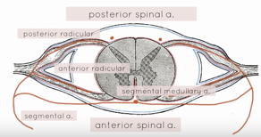
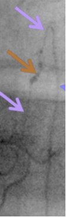
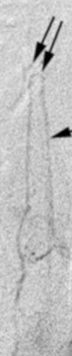
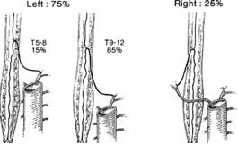

Artery of Adamkiewicz    body {font-family: 'Open Sans', sans-serif;}

### Artery of Adamkiewicz

_(Please review the Spinal Cord Blood Supply and images first)_  
  
The artery of Adamkiewicz has many anatomical variations and is often difficult to locate.  
Literature varies concerning its origin and the multiple names it is given.  
What we do know is the artery of Adamkiewicz provides the MAJOR blood supply to the lumbar and sacral segments of the ANTERIOR spinal cord.  
  
**Also known as:**  
Adamkiewicz artery  
Great radicular artery of Adamkiewicz  
Arteria radicularis anterior magna  
Artery of the lumbar enlargement  
Great anterior radiculomedullary artery  
Great anterior segmental medullary artery  
Greater anterior medullary artery  
  
The Polish pathologist Albert Wojciech Adamkiewicz in 1882 described the “ _magnus ramus radicularis anterior_ ” as the main feeding vessel to the lower spinal cord. It is considered the dominant thoracolumbar segmental artery that supplies the spinal cord.  
  
**Simple review of the spinal cord blood supply**  
The spinal cord receives most of its blood from 3 arteries that descend from the vertebral arteries; two posterior spinal arteries and one anterior spinal artery. The posterior portion of the spinal cord has great collateral circulation. The ANTERIOR central and lower part of the spinal cord is more dependent on the collateral circulation that originates from the thoracic, abdominal lumbar areas of the aorta. The cervical level of the spinal cord is better perfused because it receives an abundance of collateral circulation from the neck vessels.  
  
The ANTERIOR lower 2/3rds of the spinal cord. on the arteries running from the thoracic, abdominal and lumbar aortic levels. By the time these aortic collateral vessels further divide and reach the area of the spinal cord, they are referred to as “radicular arteries” and “segmental medullary arteries.”  

****

  
**Segmental arteries -** do one of two things:**1\.** Enter each intervertebral foramen bilaterally and divide into an anterior and posterior "radicular arteries" and feed directly into the spinal cord.  
**OR  
2\.** Become a **segmental medullary artery** that feeds directly into the anterior spinal artery. Unfortunately, segmental medullary arteries do not feed the anterior spinal artery at every level like the radicular arteries.  
  
**Radicular arteries:** arise from the segmental arteries and feed the spinal cord bilaterally via posterior and anterior radicular arteries at EVERY segmental level of the spinal cord.  
  
**Segmental medullary artery (or medullary artery):** Segmental arteries that anastomose with the anterior spinal artery, but NOT at every level.  
As many as 6-8 anterior medullary arteries contribute to the anterior spinal artery. Each takes the characteristic course that resembles a **"hairpin loop"** as they course medial to the vertebral pedicle-seen on angiography.  

 ********

  
**Note:** Artery of Adamkiewicz resembles a “Hairpin loop” **The artery of Adamkiewicz** is an anterior medullary artery, larger than all the other segmental medullary arteries. It is the major collateral vessel that directly connects to the anterior spinal artery and helps perfuse the lower two-thirds of the anterior spinal cord. Unfortunately, it has so many anatomical variations that it is difficult to locate.  
  
**Anatomical Variations of the Artery of Adamkiewicz  
**_(Origin of the artery of Adamkiewicz is quite variable and can extend from mid-thoracic to lumbar levels)_  
May arise from the intercostal branch of a right intercostobronchial trunk (ICBT) in 5 to 10% of patients. This becomes an issue with bronchial artery embolization procedures.  
  
Arise from T5-T8 in 15%.  
One article states that it arises between T9 and T12 in 75% of cases rather than T8-L1  
Arises from L1-L5 in 25% from a lumbar artery.  

****

  
Arises from the right side in 25% of people-literature varies.(above)  
  
In 75% of people, it originates from the LEFT side of the aorta between the T8 and L1 vertebral segments – literature varies.(above)  
  
Sometimes there are more than one artery of Adamkiewicz, one in the lumbar and thoracic area.  
  
It has a diameter of ~1 mm (range 0.8-1.3 mm)  
  
**Imaging and Scans**  
For certain high risk procedures some surgeons will preoperatively order computed tomographic, magnetic resonance, and aortographic tests to study a patient’s spinal cord blood supply and to attempt to identify the artery of Adamkiewicz that varies among patients. It can be identified as it ascends along the anterior surface of the spinal cord, usually less than two-and-a-half vertebral body lengths, with an identifying **"hairpin turn"** at its anastomosis with the anterior spinal artery. Has a straight course, compared to the anterior radiculomedullary vein, which is more tortuous.  
  
**The Artery of Adamkiewicz is Important**  
Blockage of a posterior spinal artery may have little effect on the posterior spinal cord perfusion because the posterior spinal cord receives extensive collateral circulation. The lower anterior section of the spinal cord does not receive an adequate amount of blood from the anterior spinal artery alone. Fortunately, for collateral circulation, the anastomoses between the anterior spinal artery and artery of Adamkiewicz compensate for the lack of perfusion to the lower anterior spinal cord. Occlusion of the artery of Adamkiewicz may result in “anterior spinal artery syndrome” and cause ischemia and infarction of the spinal cord resulting in flaccid paralysis and loss of pain and temperature sensation.  
  
The duration and location of aortic clamping is a key determinant of the risk of ASAS.  
  
**Anterior spinal artery syndrome (ASAS)  
**The areas of the spinal cord that are most vulnerable to deprivation of blood supply are T1-3, T5 and L1.Also also known as "anterior spinal cord syndrome" and is the most common form of spinal cord infarction.  
A condition in which blood flow from the anterior spinal artery is interrupted, causing ischemia or infarction of the anterior two-thirds of the spinal cord. It is characterized by loss of motor function below the level of injury, loss of sensations carried by the anterior columns of the spinal cord (pain and temperature), and preservation of sensations carried by the posterior columns (fine touch, vibration and proprioception). Proprioception sensation of movement within joints and of joint position.  
  
For this reason, the artery of Adamkiewicz is important in patients undergoing abdominal aortic clamping, which may result in spinal cord ischemia and post-op paraplegia or paraparesis.  
  
During certain operative procedures, interference with lower spinal cord blood supply from prolonged aortic cross clamping, intraoperative hypotension, aortic embolization, and even the interruption of internal iliac artery circulation have been suggested as possible causes of spinal cord ischemia. Many are believed to be from the result of altering blood flow through the artery of Adamkiewicz.  
  
**Collateral blood flow to the spinal cord may not be enough  
**In the event of spinal cord arterial blood supply being interrupted from the aorta (e.g. aortic clamping, trauma) collateral arterial blood flow to the spinal cord must come from the internal thoracic and lateral thoracic arteries, which anastomose with the posterior intercostal arteries.  
  
**More Notes  
Not a true Radicular Artery**  
By Referring Identifying the artery of Adamkiewicz as a “radicular” or “radicularis” artery, is anatomically incorrect. A true radicular artery arises from a segmental artery and enters the intervertebral foramen (along a nerve root) and becomes a radicular artery as it splits and connects to the spinal cord bilaterally.  
  
Early in embryologic development, each vertebral body level has paired medullary arteries supplying the cord. During development, most of these branches regress leaving adults with only six to eight arterial branches to the anterior spinal artery, which supplies the anterior 80% of the cord including the corticospinal tracts.  
  
Blood supply to the anterior spinal artery at the level of the bronchial arteries typically consists of a single T4 or T5 medullary artery that arises from a left intercostal artery.  
  
**_Anatomical Note:_** _The spinal cord is only about 18 inches long!_  

_Grecu L, Schonberger RB. Vascular Disease In: Barash PG, Cullen BF, Stoelting RK, Cahalan M, Stock MC, eds. Clinical Anesthesia, 6th ed. Philadelphia, PA: Lippincott, Williams and Wilkins; 2009: Ch. 8.  
  
Norris EJ. Anesthesia for Vascular Surgery. In: Miller RD, Eriksson LI, Fleisher L, Wiener-Kronish JP, Cohen NH. Miller’s Anesthesia, 8th ed. Philadelphia, PA: Elsevier Saunders; 2014: Ch. 69  
  
Open Anesthesia; Spinal anatomy: Anterior spinal artery syndrome  
  
Milen, Mark T.; Bloom, David A.; Culligan, J.; Murasko, K. (1999). "Albert Adamkiewicz (1850-1921) - his artery and its significance for the retroperitoneal surgeon". _World Journal of Urology_ **17** (3): 168–70.  
  
Koshino, T; Murakami, G; Morishita, K; Mawatari, T; Abe, T (1999). "Does the adamkiewicz artery originate from the larger segmental arteries?". _The Journal of Thoracic and Cardiovascular Surgery_ **117** (5): 898–905.  
  
Luyendijk W, Cohn B, Rejger V, Vielvoye GJ (1988). "The great radicular artery of Adamkiewicz in man. Demonstration of a possibility to predict its functional territory". _Acta neurochirurgica_ **95** (3–4): 143–6.  
  
Nijenhuis RJ, Mull M, Wilmink JT, Thron AK, Backes WH (2006). "MR angiography of the great anterior radiculomedullary artery (Adamkiewicz artery) validated by digital subtraction angiography". _AJNR_ **27** (7): 1565–72.  
  
Greathouse, David G.; Halle, John S.; Dalley, Arthur F. (2001). "Blood supply to the spinal cord". _Physical_ _therapy_ **81** (6): 1264–5.  
  
Takase, K.; Sawamura, Y.; Igarashi, K.; Chiba, Y.; Haga, K.; Saito, H.; Takahashi, S. (2002). "Demonstration of the Artery of Adamkiewicz at Multi- Detector Row Helical CT". _Radiology_ **223** (1): 39–45.  
  
Lazorthes, Guy; Gouaze, Andrè; Zadeh, Jean O.; Jacques Santini, Jean; Lazorthes, Yves; Burdin, Phillipe (1971). "Arterial vascularization of the spinal cord". _Journal of Neurosurgery_ **35** (3): 253–62.  
  
Wan, Innes Y. P.; Angelini, Gianni D.; Bryan, Alan J.; Ryder, Ian; Underwood, Malcolm J. (2001). "Prevention of spinal cord ischaemia during descending thoracic and thoracoabdominal aortic surgery". _European Journal of Cardio-Thoracic Surgery_ **19** (2): 203–13.  
  
Yoshioka, K.; Niinuma, H.; Ohira, A.; Nasu, K.; Kawakami, T.; Sasaki, M.; Kawazoe, K. (2003). "MR Angiography and CT Angiography of the Artery of Adamkiewicz: Noninvasive Preoperative Assessment of Thoracoabdominal Aortic Aneurysm". _Radiographics_ **23** (5): 1215–25. Lopez, January; Lee, Hsin-Yi (2006). "Bronchial Artery Embolization for Treatment of Life-Threatening Hemoptysis". _Seminars in Interventional Radiology_ **23** (3): 223–229.  
  
Kowalczyk, J (2002). "Albert Wojciech Adamkiewicz and his artery". _South African medical journal_ **92** (9): 702._