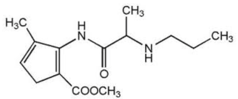

Articaine (Septocaine)    body {font-family: 'Open Sans', sans-serif;}

### Articaine Hydrochloride (Mainly used in dentistry)

**Amide** \- type local anesthetic**pKa:** 7.8  
(4% Articaine hydrochloride combined with epinephrine 1:1,000 is **Septocaine** )  
Articaine can be manufactured with a mixture of 1:100,000 or 1,200,000 epinephrine.  
  
Articaine has been found to be 3.81 times more likely than lidocaine to produce successful anesthesia when used for infiltration injections.  
  
**4% Articaine Doses**

table.tableizer-table { font-size: 12px; border: 1px solid #CCC; font-family: Arial, Helvetica, sans-serif; } .tableizer-table td { padding: 4px; margin: 3px; border: 1px solid #CCC; } .tableizer-table th { background-color: #104E8B; color: #FFF; font-weight: bold; }

| Procedure | Volume | Dose |
| --- | --- | --- |
| Infiltration | 0.5-2.5 mLs | 20-100 mg |
| Nerve Block | 0.5-3.4 mLs | 20-136mg |
| Surgery | 1.0-5.1 mLs | 40-204 mg |

**Other names for Septocaine  
**Ubistesin Forte,  
Ultracaine DSF  
Septanest SP  
Astracaine Forte  
Zorcaine  
OrablocArticaine has physicochemical properties similar to lidocaine, mepivacaine and prilocaine) with the exception of the aromatic ring and its degree of protein binding.  
  
**An Amide with an ester linkage**  
Articaine is the only amide local anesthetic that contains a thiophene ring. In addition, articaine is the only widely used amide local anesthetic that also contains an ester linkage. Fast onset with moderate duration.  
  
**4% Articaine is very potent with a low systemic toxicity risk because of:  
**

-   Low lipid solubility
-   High plasma protein binding rate
-   Fast metabolization
-   Fast elimination half time
-   Low blood level

****

Toxic reactions are usually due to an inadvertent intravascular injection or use of excessive dose.  
  
**Distribution:** Approximately 60 to 80% of articaine HCl is bound to human serum albumin and g-globulins at 37°C _in vitro._  
  
**Articaine is metabolized like an ester and amide.  
****Ester** local anesthetics (LAs) undergo metabolism (biotransformation, detoxification) as soon as the drug diffuses into capillaries and veins (hydrolysis by plasma esterase).  
  
**Amide** LAs enter the blood as still active drugs, circulating throughout the body until they enter the liver where they undergo metabolism by hepatic microsomal enzymes.  
  
Unlike the other amide local anesthetics that undergo metabolism in the liver, the biotransformation of **articaine** occurs in both the liver and in plasma.**Half-life:** The elimination of articaine is exponential with a half-life of 20 minutes.Isoenzyme system metabolizes approximately 5% to 10% of available articaine with nearly quantitative conversion to articainic acid.  
  
**Excretion:** Excreted primarily through urine.  
  
**Contraindications** Patients allergic to amide-type anesthetics  
Patients allergic to metabisulfites (preservative present in the formula to extend the life of the epinephrine). There is no cross-allergenicity between sulfites (preservatives), sulfur, and the "sulfa"-type antibiotics.  
Patients with idiopathic or congenital methemoglobinemia.  
Patients with hemoglobinopathies (sickle cell disease)Articaine is not contraindicated in patients with sulfa allergies; there is no cross-allergenicity. Between articaine's sulfur-bearing thiophene ring and sulfonamides.  
  
Methylparaben is no longer present in any dental local anesthetic formula available in North America.  
  
Methemoglobinemia is not a concern in dental practice, due to the small volumes of articaine used.  
  
Patients allergic to articaine likely would be allergic to lidocaine and the other amide local anesthetics.  

Georgian Med News. 2011 Jan;(190):15-23.  
**Articaine - the best choice of local anesthetic in contemporary dentistry.** Niharadze N, Mamaladze M , Chipashvili N , Vadachkoria D .  
  
Malamed SF. Handbook of local anaesthesia, p. 65, 6th ed. St. Louis, Mosby; 2013.  
  
Becker, DE; Reed, KL: Essentials of Local Anesthetic Pharmacology. _Anesth Prog_ 53:98-109 2006 Malamed SF. Handbook of local anaesthesia, p. 73, 5th ed. St. Louis, Mosby; 2004.  
  
Pogrel MA, Permanent nerve damage from inferior alveolar nerve blocks—an update to include articaine. J Calif Dent Assoc. 2007 Apr;35(4):271-3