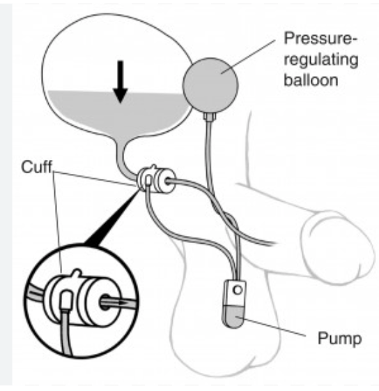

Artificial Urinary Sphincter (AUS) Insertion    body {font-family: 'Open Sans', sans-serif;}

### Artificial Urinary Sphincter (AUS) Insertion

An AUS is a device that closely simulates the function of a biological urinary sphincter.  
It is the gold standard treatment for severe stress incontinence that has failed conservative management.

****

**Procedure:**  
\- The patient is placed in lithotomy.  
\- A perineal incision is made.  
\- A pressure-regulated balloon is placed under the abdominal fascia.  
\- The pump is placed in the scrotum.  
\- The cuff is placed around the urethra.  
\- Post-placement cystourethroscopy is performed.  
  
 **Contraindications:**\- Urinary incontinence due to irreversibly obstructed lower urinary tract.\- Irreversible detrusor overactivity with urge incontinence, storage parameters creating a risk for upper tract deterioration.  
\- Bladder neck or vesicourethral anastomotic stricture.\- Active UTI.  
\- Recurrent disease (e.g., stone disease, bladder or ureteral tumors) that requires retrograde endoscopic instrumentation is a relative contraindication.  
  
**Anesthesia management:  
General:** usually LMA**Position:** Lithotomy**Duration:** 45-90 minutes  
**IV access:** 20g is acceptable  
**EBL:** Minimal  
  
**Possible complications:  
**Mechanical failure  
Urethra erosion  
AUS infection  
Suburethral atrophy  
  
_The long-term reoperation rate is about 20%._  

Artificial Urinary Sphincter after 40 Years of Use: Indications, Techniques and Outcomes  
UBC Urology rounds  
Accessed 12/2023  
https://www.youtube.com/watch?app=desktop&v=DVoTFHHmW8ASurgical and Patient Reported Outcomes of Artificial Urinary Sphincter Implantation: A Multicenter, Prospective, Observational Study  
Journal of Urology, 2018 Jan;199(1):245-250Yasuhiro Kaiho 1 , Hitoshi Masuda 2 , Mineo Takei 3 , Takahiro Hirayama 4 , Takahiko Mitsui 5 , Minato Yokoyama 2 , Takeya Kitta 5 , Naoki Kawamorita 6 , Haruo Nakagawa 6 , Masatsugu Iwamura 4 , Yoichi Arai 6  
  
Artificial Urinary Sphincter Placement  
Medscape (accessed 12/2023)  
Kamran P Sajadi, MD and Martha K Terris, MD, FACS  
https://emedicine.medscape.com/article/443737-overview