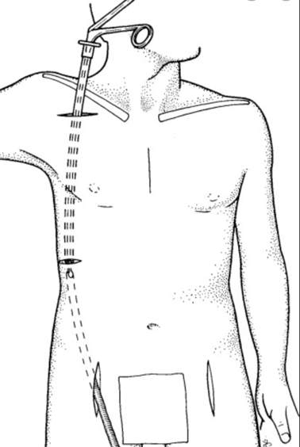

Axillofemoral or Axillobifemoral Bypass     body {font-family: 'Open Sans', sans-serif;}

### Axillofemoral or Axillobifemoral Bypass

A long synthetic graft is tunneled from a subclavian incision to the groin. This is done subcutaneously with a long hollow tunneler  
(on the same side) from the axillary to the femoral artery.  
**Goal:** So the blood supply to one arm will also provide the blood flow to one or both legs.

**Indications:** Restore circulation to the leg of a patient who is not a candidate for a transabdominal aorto-iliac surgery.

**Position:** Supine and the donor arm out <90 degrees  
**Anesthetic:** General/ETT  
**Duration:** 2-4 hours  
**IV Access:** Two 18G. Text book says no IVs in the surgical arm. Some people still use the wrist or hand because the surgeon may not prep that far down. Also consider the neck.  
**A-line:** Yes, on the nonsurgical arm. Use it for drawing ACTs.  
BP cuff, A-line and IV on the nonsurgical arm

**Heparin, Protamine and ACT machine:** Yes

Heparinize with 10k units right before or after the tunneling is complete.

**EBL:** 300-1,500 EBL. Depends on the surgeon

**Type and Crossed:** Yes, have 2 units available. You can lose blood pretty quick.

**Anesthetic Considerations:** When you see that hollow Trocar looking device (tunneler) make it to the surgeon’s hand, you better make sure your patient is deep. The tunneling is very stimulating.

**Possible Complications**  
Hemorrhage  
Brachial plexus injuries  
Axillary artery thrombosis  
Arterial steal  
Proximal anastomotic disruption  
Graft infection and seroma  
 

The axillary graft should be places on the side with the highest BP.

Jaffe, Richard A. _Anesthesiologist's Manual of Surgical Procedures_., 2012.

Kalbande, Manohar B. _Vascular Surgery Made Easy_. 2013.

Macksey, Lynn Fitzgerald. _Surgical Procedures and Anesthetic Implications: A Handbook for Nurse  
Anesthesia Practice_. Sudbury, MA: Jones & Bartlett Learning, 2012.

Moore, Wesley S., M.D. _Vascular and Endovascular Surgery: A Comprehensive Review Expert Consult:_2013