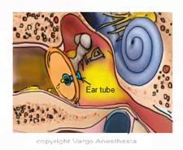

BMT (Bilateral Myringotomy) Review    body {font-family: 'Open Sans', sans-serif;}

### BMT (Bilateral Myringotomy) Review

**_Insertion of Ear Tubes_**  
  
These are very quick cases with quick turnovers.  
There is no time to appropriately prepare for the next case (like other procedures) during your down time, because there is NO down time.  
**  
Synopsis**  
After mask induction and the patient is deep enough, you will need to maintain spontaneous mask ventilation throughout the case.  
You will turn the patient’s head to the left and eventually to the right for the surgeon and simultaneously assist ventilation and chart with your free hand.  
Sometimes you will have 10 cases back to back so you will need to have your game on.  
  

****

**_Note:_** _We normally do not start IVs for these quick cases and just manually mask them very deep the entire case._  
  
Myringotomy is a surgical procedure of placing small ear tubes (tympanostomy tubes) in both tympanic membranes (bilateral) to allow the removal of infectious fluid build up.  
The surgeon (ENT doctor) makes a small incision in the inferior quadrant of the tympanic membrane, the mucus is suctioned from the ear and a tympanostomy tube is inserted at the myringotomy site.  
The surgeon avoids making an incision in the posterior quadrant of the tympanic membrane since there is a greater risk of injuring the ossicles.  
  
**Indication:** Chronic Otitis Media (OM)  
**Average age:** 6 months -2 years  
**  
Influencing Factors of Otitis Media:**  
Attendance at a group childcare  
Secondhand tobacco smoke exposure  
Taking a bottle to bed  
Down Syndrome  
Craniofacial anomalies-especially cleft palate  
Upper respiratory infections  
Small eustachian tubes - unable to clear mucus secreted in the middle ear ad mastoid process.  
**Pre-op  
Room Set up  
**You will need to arrive early and set up accordingly for age and amount of procedures you have for the day.**Ex.** If you have 6 kids, you will still need a warm IV bag and tubing primed ahead of time in case one or all of your patients need an IV. You will also need enough airway equipment (just in case).Appropriate sized ETTs for each case (just in case you need to intubate).  
Appropriate sized oral airways.  
Appropriate sized masks for your patients.  
**Emergency Meds:** With an IM needle on both.  
3cc Atropine  
5cc Succinylcholine  
Depending on your facility, many CRNAs do not actually draw up these meds due to cost purposes, but just make sure they are on your table top.  
  
_Some of these kids have had a previous BMT. Retrieving and reviewing their anesthesia record is very helpful.  
_  
Does your patient appear to have an active or recent upper respiratory tract infection (URI)?  
We all know that pediatrics with an active or recent URI (particularly less <1 year) have an increased risk of respiratory related adverse events during general anesthesia like laryngospasm, bronchospasm, and hypoxia.  
The 3 above can be successfully treated with positive pressure, bronchodilators, and oxygen respectively.  
Some patients may have a severe bronchospasm requiring post-op intubation and the need to be admitted.  
Any child scheduled for most surgeries showing signs of a recent URI is normally postponed up to 6 weeks from the onset of chest symptoms, productive cough with a fever.  
Generally, if there is NOT any chest symptoms or fever (just a runny nose), we will usually carefully proceed with this case. Keep in mind that some children have chronic URI and are rarely without symptoms.  
  
In general, if there are chest symptoms, productive cough and a fever is present, we almost always cancel the case.  
**  
Pre-chart  
**You should try and pre-chart as much as you can prior to taking the patient back to the operating room.  
  
**Anesthetic Plan:** General/mask with Sevoflurane the entire case.Always have the appropriate sized ETT, blade, masks, and oral airways on standby in case you lose the airway.  
Sometimes an LMA may be used. If using an LMA, start an IV first.  
**Pre-medication:** Consider PO midazolam, 0.5-1 mg/kg and/or weight-based PO Tylenol in the holding area  
**Induction:** Inhalation  
**Airway issues:** These kids usually have a hyperactive airway from a recent URI, so keep your guard up.  
Remember, these kids are having this procedure because of chronic otitis media and related URIs.  
  
**IV Access:** Usually not needed. Have an IV start kit available. 22g is the usual catheter size.  
**Note:** Consider starting an IV for a child with known or predicted difficult mask ventilation airway and craniofacial anomalies.  
**Hydration:** N/A-it’s a quick case-uses 4:2:1.  
_Make sure your patient is very deep before administering intranasal meds.  
_**Narcotics:** Intranasal Fentanyl 1-2 mcg/kg (rarely administered)  
**Analgesics:** **Rectal Tylenol** 30-40mg/kg is popular (once asleep)  
_(Inform the parents to not give their child Tylenol for 6 hours)_  
**IM Toradol** 1mg/kg is popular (once asleep is an option)  
**Intranasal Precedex** 1-2mcg/kg (is an option)  
(A dose of 2 mcg/kg Precedex intranasal may be equivalent to premedication to 0.5 mg/kg of PO versed).  
**Nitrous:** Not contraindicated  
**Regional:** Nerve block of the auricular branch of the vagus (nerve of Arnold).  
Injection of 0.2mLs of 25% bupivacaine behind the tragus for post op pain is very rarely preformed.  
  
**Mask Ventilation  
**Do not turn the patient’s head for the surgeon to start until you know your patient is deep enough.  
The surgeon almost always starts with the patient’s right ear.  
Make sure you are happy with the seal and handgrip with the mask.  
Once you turn the patient’s head to the left and the surgeon starts on the right ear, you will need to keep the head as motionless as possible.  
Simultaneously, you will assist ventilation and chart with your free hand as needed.  
When the surgeon is finished with the first ear, he/she will stand up and walk completely around the foot of the bed to the patient’s left side to insert the other tympanostomy tube.  
While he/she is relocating to the patient’s left side, you will then move the patient’s head to the patient’s right and regrip and seal the mask if you have to.  
Turn down the Sevoflurane to 1%.  
When the surgeon is placing drops in the left ear, immediately turn off your gas and you are done.  
**Muscle relaxation:** Not needed, plus an IV is not normally inserted.  
**Supine:** Supine, arms to the side, and head turned away from the surgeon.  
Make sure your hand and arm are comfortably positioned while not in the surgeon’s way.  
**Duration:** 10-20 minutes.**EBL:** none  
**Emergence:** Do not leave the OR unless you have a patent airway.  
Insert a proper size oral airway if needed.  
The child can wake up in the recovery room.  
Remember, you are expected to have a fast turnover.**  
Possible Complications  
**Bronchospasm  
Laryngospasm  
Hypoxia (desaturations)  
Requiring intubation  
Damage to the Ossicles  
Hearing damage or loss  
Continued ear infections  
Eardrum scarring and/or perforation  
Allergic reaction to the material makeup of the ear tube  
  
**More Notes:  
**It is not unusual for patients to have this procedure more than once in their lifetime.  
One half-million myringotomy surgeries are performed on children each year.  
Chronic fluid in the ears may cause hearing loss and balance challenges.  
  
Tympanostomy tubes are made of plastic, Teflon, or metal.  
Air is able to flow in through the tubes while liquids flow out releasing painful middle ear pressure.  
  
A tympanostomy tube looks like a tiny spool.  
They are so small that more than 25 of them could fit on the face of a dime.  
Tympanostomy tubes usually remain in the ear between 6 and 18 months, at which time they generally fall out on their own.  
If a tube remains in the eardrum for more than 2 or 3 years, it may need to be removed by the ENT doctor.   
  
The incisions in the ears also usually heal on their own, so no stitches are required.  
  

Houck, Hach’e and Sun; Handbook of Pediatric Aesthesia; 2015  
  
Gregory and Andropoulus; Gregory’s Pediatric Anesthesia ; Fifth Edition; 2012  
  
Litman; Basics of Pediatric Anesthesia ; 2013.  
  
Davis, Cladis and Motoyama; Smith's Anesthesia for Infants and Children , 8th Edition; 2011.