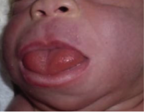

Beckwith-Wiedemann Syndrome (BWS)    body {font-family: 'Open Sans', sans-serif;}

### Beckwith-Wiedemann Syndrome (BWS)

BWS is a congenital overgrowth disorder that causes large body size, large organs, and other manifestations.  
Infants affected are considerably larger than average (macrosomia) and tend to be taller than their peers during childhood.  
Growth begins to slow by about age 8, and adults with this condition are not unusually tall.  
The signs and symptoms of BWS vary among affected individuals.  
  
**Neonatal anesthesia and surgical concerns:  
**Macroglossia (upper airway obstruction and difficult airway)  
Abdominal wall defects (omphalocele, large umbilical hernia)  
Hypoglycemia (usually only in ages 1 to 4 months)

****

**Childhood anesthesia and surgical concerns:**  
Mild mental retardation  
Significant risk of solid tumor  
Macroglossia  
  
**Statistics,** **facts, and associations:  
**Prevalence of 1 in 10,300 to 13,700, possibly higher as mild forms may not be diagnosed.  
Equal sex distribution  
85% non-inherited and 15% familial transmission.  
Prematurity 50%  
Macroglossia 92%  
Neonatal gigantism (macrosomia)  
Abdominal wall defect 68% (omphalocele and/or large umbilical hernia)  
High birth weight 68%  
Facial Abnormality 52%  
Ear creases and pits 30 %  
Visceromegaly (enlargement of the internal organs)Cardiac defects (cardiomegaly is most common)  
Cytomegaly of the fetal adrenal cortex  
Renal and pancreatic hyperplasia  
Facial - flame nevus  
Gonadal interstitial cell hyperplasia  
Cystic change in adrenal cortex  
Pituitary-amphiphile hyperplasia  
Peculiar facies, earlobe fissures  
Neonatal polycythemia  
Prominent occiputCryptorchidism  
Broad metaphysis, thickened cortex of long bones  
Posterior-diaphragmatic eventrationMild microcephaly with mild to moderate mental retardation  
Clitomegaly  
Hyperplastic uterus and bladder  
Ileal stenosis  
Pyloric stenosis  
Hypospadias  
Bicornuate uterus  
Polydactyly of toes  
Renal and ureteral malformation  
Hydrocephalus  
  
**Genetics:**  
BWS is caused by dysregulation of the expression of imprinted genes in the 11p15 chromosomal region.  
The phenotypic expression is variable, and diagnosis is based primarily on clinical signs.  
Increased frequency in female monozygotic twins versus male monozygotic twins  
  
**Patients with BWS have a predisposition for tumors.**  
Tumors develop in about 10% of BWS patients.  
Wilms' tumor is the most common cancer associated with BWS and hepatoblastoma.  
is the second most common.  
Wilms' tumor (nephroblastoma), a form of kidney cancer.  
**Other:** Adrenal carcinoma and rhabdomyosarcoma.  
  
**Cancer screening:**  
Until 4 years of age, ultrasounds are performed to view liver, kidneys, and other internal organs.  
After 4 years of age, renal ultrasounds with views of the adrenal glands should be performed until 7 years of age.  
  
**Measurement of blood alpha-fetoprotein (AFP) concentration:**  
Serum AFP should be performed every three months until 4 years of age.  
AFP is a protein released by immature or damaged liver cells, and it is released at higher levels by hepatoblastoma tumor cells.  
The AFP test is an extremely sensitive way to detect these cancers.  
  
**Hypoglycemia in the first four months of life is present in 30-50%.**  
Persistent hypoglycemia <5%; due to islet cell hyperplasia and hyperinsulinism, and usually responsive to medical therapy.  
Often resolves by 4 months of life.  
Frequent blood glucose testing is indicated.  
These patients may require a pancreatectomy when refractory to treatment.  
Infants with hypoglycemia and feeding difficulties resulting from severe macroglossia may require gastrostomy tube. placement until a glossal resection is performed.  
These patients may require a pancreatectomy when refractory to treatment.  
  
  
**Hemihyperplasia (30-35%):  
**Overgrowth of one side of the body compared to the other.  
All children with hemihyperplasia that appears isolated should be further evaluated.  
  
**Renal anomalies in as many as 59%:**Wilms' tumor, neuroblastoma, and adrenal carcinoma.  
Wilms' tumor (nephroblastoma), a form of kidney cancer, is more prevalent in BWS.  
**  
Diagnosis:**  
**Diagnosed or highly suspected when prenatal ultrasound demonstrates:**  
Polyhydramnios  
Macrosomia  
Macroglossia  
Renal anomalies  
Earlobe fissures  
Results above may prompt genetic testing.  
  
**Surgical procedures for BWS:  
**Surgical repair of omphalocele or large umbilical hernia.  
Partial glossectomy  
Gastrostomy tube placement  
Tumor resection  
  
**BWS anesthesia and surgical concerns:  
Pre-op:  
**ENT consult recommended when partial glossectomy is planned for potential post-surgical airway swelling potentially requiring a tracheostomy.  
Endocrinology consult for management of hypoglycemia.  
Cardiac workup  
Assess for genitourinary anomalies, especially in the presence of omphalocele.  
Pulmonary consult recommended for premature infants with a history of mechanical ventilation.  
Vigilant airway assessment  
**  
Potential airway issues:  
**MacroglossiaUpper airway obstruction  
Adenotonsillar hypertrophy  
Prognathism (jaw protrusion)  
  
**Testing:** CBC, BMP, CXR, ECHO  
**Assess for:**  
Hypoglycemia  
Polycythemia  
Hypothyroidism  
Hypocalcemia  
Hyperlipidemia  
  
Pretreat with antisialagogue (glycopyrrolate or atropine).  
  
Have management adjuncts for the management of difficult airway immediately available.  
  
Have appropriately sized nasopharyngeal and oral airways available, because mask ventilation will most likely be difficult.  
Most anesthesia providers start with a video laryngoscope (e.g., GlideScope®) with a fiberoptic bronchoscope prepared for immediate use.  
Consider a cuffed ETT, because appropriate tracheal size may not be predictable.  
Frequent blood sugar monitoring.  
  
**Emergence and extubation:  
**Awake  
For airway related procedures, an otolaryngologist should be available for emergency tracheostomy in the event of postoperative airway swelling and edema.  
  
Post-op and/or ICU  
Emergency airway and tracheostomy kit should be at bedside.  
  

Beckwith-Wiedemann syndrome.  
European Journal of Human Genetetics 2010; 18:8.  
Weksberg R, Shuman C, Beckwith JB.  
  
Beckwith-Wiedemann Syndrome  
Genetic Home Reference (accessed 09/2202)  
https://ghr.nlm.nih.gov/condition/beckwith-wiedemann-syndrome#genes  
  
Beckwith-Wiedemann Syndrome.  
Children's Hospital of Philadelphia (accessed 09/2020)  
  
Beckwith-Wiedemann Syndrome.  
orphaned (accessed 09/2020)  
Doctor Christine Gicquel, Doctor Sylvie Rossignol, Professor Yves Le Bouchttps://www.orpha.net/data/patho/Pro/en/BeckwithWiedemann-FRenPro260.pdf  
  
Beckwith-Wiedemann syndrome.  
Syndromes and Rare Diseases in Pediatrics: anesthesia (accessed 09/2020)  
https://sites.uclouvain.be/anesthweekly/MRP\_ENG/index.html?Beckwith-WiedemannSyndromeDe.html  
  
Essence of Anesthesia Practice 4 th Ed.; 2018, pp.47-48  
Arlyne, Thung nd Lee Fleisher  
L. Fleisher, M. Roizen, and J. Roizen.  
  
Anesthesia in Beckwitt-Wiedemann syndrome.  
Pediatric Anesthesia 2004; 14: 778-80.  
Celiker V, Basgul E, Karagoz AH.  
  
Anesthesia for a infant with Backwith-Wiedemann syndrome who underwent open heart surgery for complete atrioventricular canal defect.  
Pediatric Anesthesia2012; 22: 1139-40  
Choudhury M, Malik M, Singh P, Kiran U.  
  
Glidescope for airway management in patients with Beckwith-Wiedemann syndrome: an update.  
Pediatric Anesthesia 2016; 26: 222-3.  
Grim KJ, Aganga DO.  
  
Anesthetic considerations of two sisters with Beckwith-Wiedemann syndrome.  
Anesthesia Progress. 1996; 43(1): 24-28.  
Y. Kim, T. Shibutani, Y. Hirota, S. F. Mahbub, and H. Matsuura  
  
Perioperative airway management of a patient with Beckwith-Wiedemann syndrome  
Dental anesthesia ad Pain Medicine. 2016 Dec; 16(4): 313-316.  
Masanori Tsukamoto, Takashi Hitosugiand Takeshi Yokoyama