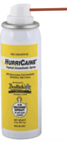
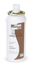
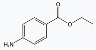

Benzocaine (Auralgan)    body {font-family: 'Open Sans', sans-serif;}

### Benzocaine (Auralgan)

**Ester**\-type local anesthetic  
**Topical:** For anesthesia or dental  
**pKa:** 2.5  
**Onset:** < 5 mins  
**Duration:** 15-45 mins  
  
Benzocaine is a topical anesthetic that is frequently used in metered or unmetered spray form to anesthetize the surfaces of the nasopharynx, oropharynx, laryngotracheal region, and airway.  
  
**Benzocaine may be in the form of:** cream, film, gel/jelly, gum, liquid, lotion, lozenge/troche, ointment, paste, powder for suspension, solution, spray, swab, tablet disintegrating.  
  
**Methemoglobinemia (MHb) and benzocaine  
**All the topical anesthetics can cause MHb, but there are more reports in the literature associated with benzocaine due to its widespread and long-standing use.**  
  
Indications for topical benzocaine  
Usually used as a lubricant and topical anesthetic on:**  
Esophagus  
Larynx- suppress gag reflex.  
Mouth  
Nasal cavity  
Rectum  
Respiratory tract or trachea  
Urinary tract  
Vagina  
  
**Anesthesia:  
Benzocaine spray:** Can be administered to blunt the patient’s response to:  
Awake intubation  
Endoscopy  
Bronchoscopy  
Other invasive procedures  
  
**Dental:** Saturating a small cotton ball and placed on a patient’s gum prior to local injection.  
  
**Benzocaine 20% topical sprays (2)  
Indications:** Topical anesthetic for mucous membrane (except eyes) just prior or during surgical or other procedures in the ear, nose, mouth pharynx, larynx, trachea, bronchi and esophagus.  
  
**Benzocaine Hurricane spray (20%)Dose:** Apply spray for ≤ 1 second  
1 second spray is designed to deliver 60mg of benzocaine  
**Onset:** 30 seconds  
**Duration:** 10-15 minutes  
**Adverse Effects:** Methemoglobinemia has been reported.  

****

  
**Warning:** a 1 second spray has been reported to deliver as much as 500-3,300 mg.  
_Toxicity and Methemoglobinemia has been observed with normal and excessive number of sprays with Hurricane._  
  
**Topex 20% Topical benzocaine spray – metered dose  
Dose:** 1 spray is designed to deliver 50 mg of benzocaine  
Delivers over 1,000 precise 50 mg doses  
**Metered Dose:** May decrease associated risks (methemoglobinemia) with longer sprays.  
**Onset:** 30 seconds  
**Duration:** 10-15 minutes  

****

  
**Only used topically.** Benzocaine is an ester of paraaminobenzoic acid, lacking the terminal diethylamino group of procaine, with anesthetic activity.Topical benzocaine products should NOT be used in children < 2 years old.  
**Topical/mucosal** (adults and children): Apply cream, ointment, topical solutions, or dental/oral products as needed. Lozenges may be used hourly (not to exceed 12 lozenges/day). Rectal products may be used twice daily.  

****

  
**Dosing:** Depends on indicationMay be applied topically 2-4 times daily; lozenge can be taken up to every 2 hours  
Always read instructions Well absorbed from mucous membranes  
  
**Skin absorption:  
**Little to no systemic absorption through the skin unless, skin is broken or damaged or if applied to mucous membranes, the topical anesthetics can be well absorbed systemically.  
Usually, up to 99% of the topical analgesic and anesthetic agent is cleared from the skin and only 1% is therapeutically active and only a very small portion of that, if any, is systemically absorbed.  
  
**Rectal absorption:** poor, if the skin is intact.  
**Metabolism:** Hepatic and plasma esterases.  
**Excretion:** Urine metabolites.  
  
**Possible Side effects:**  
Dermatitis  
Urticaria  
Burning and stinging  
EdemaCardiac - angioedema  
Methemoglobinemia  
  
20% Benzocaine for mucosal anesthesia has a higher risk of methemoglobinemia, especially with repeated doses.  
  
**Symptoms of methemoglobinemia  
**Patient exhibits a cyanotic appearance that does not respond to the administration of 100% oxygen.  
When methemoglobin levels are low, cyanosis can become apparent, but symptoms of nausea, sedation, seizures, and even coma may result when levels are very high (Wilburn-Goo, 1999).  
The clinical sign of cyanosis is observed as blood concentrations of methemoglobin reach 10% to 20%, whereas dyspnea and tachycardia emerge as methemoglobinemia concentrations reach 35% to 40%.  
  
Most reports of methemoglobinemia with prilocaine and benzocaine are associated with excessive doses (Moore, 1999).  
  
Interactions **Drug-drug:** Toxicity of ester-type agents may be increased by concurrent use of **cholinesterase inhibitors.  
  
Contraindications:** Open skin sore  
Methemoglobinemia  
Allergy to ester anesthetics < 2 years of age  
Contact dermatitis and/or hypersensitivity to benzocainePABA or related allergies.  
  
**More Notes**  
**Other benzocaine's  
Dibucaine**  
**Topical (adults and children):** Apply as needed (not to exceed 30 g/day in adults or 7.5 g/day in children). Can be used 3 – 4 times daily.  
**Dyclonine**  
**Mucosal** (Adults): 2- or 3-mg lozenge may be dissolved in the mouth q 2 hr (not to exceed 10 lozenges/day), or solution may be used 4 times daily.  
**Mucosal (children > 2 years):** 1.2-mg lozenge may be dissolved in mouth q 2 hr (not to exceed 10 lozenges/day).  
**Pramoxine  
  
Topical/mucosal** (adults): Topical products may be used q 3 hr as needed. Rectal products may be used up to 5 times daily.  
  
**Brand Names:** Americaine, Americaine Hemorrhoidal, Anacaine, Anbesol Gel, Anbesol Liquid, Babee Teething Lotion, Benzo-O-Stetic, Boil Ease Pain Relieving, Cepacol Dual Relief Sore Throat Cherry, Cepacol Dual Relief Sore Throat Mint, Cepacol Extra Strength, Cepacol Fizzlers, Cepacol Sensations Warming, Cepacol Sore Throat & Coating, Cepacol Ultra, Dent-O-Kain, Dermoplast, Detane, Hurricaine, Kank-a, Lanacane, Lanacane Maximum Strength, Medicone Maximum Strength, Numzident, Num-Zit, Orabase, Orabase Baby Teething Gel, Orabase Gel-B, Orabase Lip Healer, Orajel, Orajel Denture, Oral Pain Relief, OraMagic Plus, Outgro Pain Relief, Retre-Gel, Rid-A-Pain, Skeeter Stik, Solarcaine Aerosol, Sting-Kill, Topex, Trocaine, Vagisil Feminine Cream, Zilactin-B.  

Pubchem  
https://pubchem.ncbi.nlm.nih.gov/compound/benzocaine#section=Top  
  
RxList  
http://www.rxlist.com/americaine-drug.htm  
  
Wilburn-Goo D, Lloyd L. When patients become cyanotic:acquried methemoglobinemia. JADA 1999;130:826- 831.  
  
Ellids FD, Seiler JG, Palmore, MM. A complication after fiberoptic orotracheal intubation with benzocaine spray. A case report 1995;77-A(6):937-39.  
  
Khorasani A, Candido KD, Ghaleb AH, et al. Canister tip orientation and residual volume have significant impact on the dose of benzocaine delivered by hurricaine spray. Anesth Analg 2001;92:379-83.  
  
A Guidance on the Use of Topical Anesthetics for Naso/Oropharyngeal and Laryngotracheal Procedures.  
VHA Pharmacy Benefits Management Strategic Healthcare Group and the Medical Advisory Panel and the National Center for Patient Safety