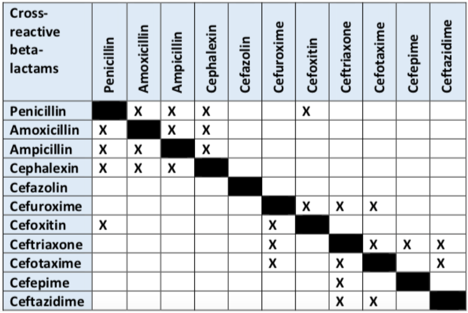

Beta-Lactam Allergy Cross-Reactivity Table    body {font-family: 'Open Sans', sans-serif; padding-left: 10px;}

### Beta-Lactam Allergy Cross-Reactivity Table

****

  
“X” indicates antibiotics with similar side chains that may exhibit cross-reactive allergic reactions.  
Utilize antibiotics that DO NOT share cross-reactivity due to side-chains.  

Beta-Lactam Allergy Cross-Reactivity Tips  
Emergency Medical Minute (accessed 11/2021)  
https://emergencymedicalminute.org/pharmacy-phriday-2-penicillin-and-cephalosporin-allergies/  
  
A real-time prospective evaluation of clinical pharmaco-economic impact of diagnostic label of ‘penicillin allergy’ in a UK teaching hospital.  
Journal of Clinical Pathology 2014; 67(12): 1088-92.  
Li M, Krishna MT, Razaq S, Pillay D.  
  
Cross-reactivity and tolerability of cephalosporins in patients with immediate hypersensitivity to penicillins.  
Annals of Internal Medicine 2004; 141(1): 16-22.  
Romano A, Gueant-Rodriguez RM, Viola M, Pettinato R, Gueant JL.  
  
Health care use and serious infection prevalence associated with penicillin “allergy” in hospitalized patients: A cohort study.  
Journal of Allergy and Clinical Immunology 2014; 133(3): 790-6  
Macy E, Contreras R.