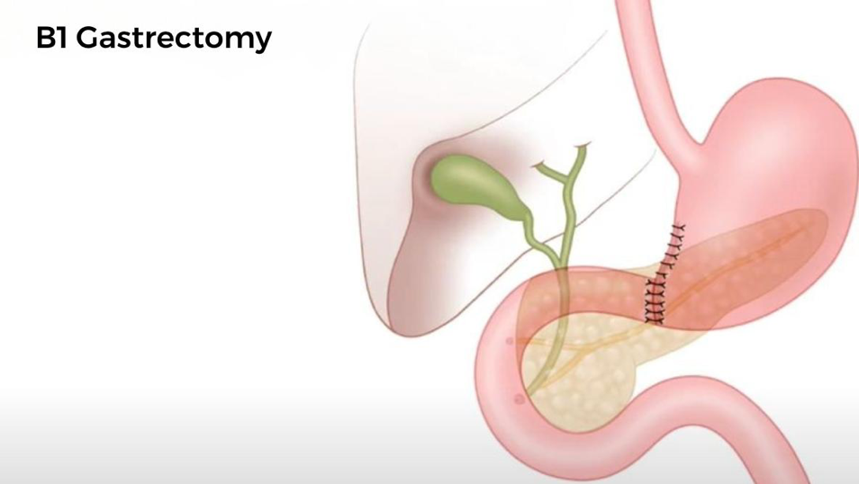
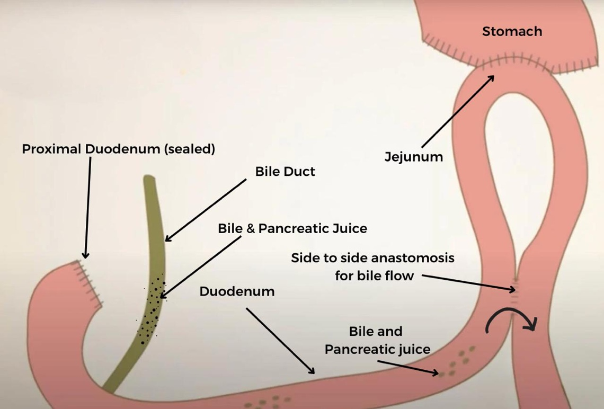

  Billroth I and Billroth II Procedures section { margin-bottom: 20px; } h3, p { margin: 0px; padding: 0px; } .text-red { color: red; } img { width: 400px; height: auto; } .mb-10px { margin-bottom: 10px; } .reference-notes { font-size: 11px; }

### Billroth I and Billroth II Procedures

Also known as B1 and B2.

Named after Dr. Billroth, who invented the procedures.

These procedures are performed with a gastrectomy.

The surgeon will anastomose the remaining portion of the stomach to the digestion system, which is either the duodenum or jejunum.

**Billroth I Gastrectomy:**

Also known as B1.

Performed with smaller distal tumors

The distal stomach is removed, and the remaining stomach is anastomosed to the duodenum (gastroduodenostomy).

Surgeons state this procedure is not easy as the duodenum is not easily stretched (has little slack) to anastomose the remaining stomach.

_This procedure is more susceptible to gastric outlet obstruction due to recurrent tumors or marginal ulcers._

**Billroth II Gastrectomy:**

Also known as B2

**It involves two anastomoses:**

**A:** The stomach is anastomosed to the jejunum (gastrojejunostomy)

First, the proximal end of the duodenum is closed off.

The distal stomach is then anastomosed to the proximal jejunum.

**B:** A side-to-side anastomosis is made between the jejunum and distal duodenum to facilitate the flow of bile and pancreatic juice.

The procedure can also involve removing the greater omentum and lymph nodes.

**Note:** The gastric remnant is anastomosed to the jejunum, just past the ligament of Treitz.

**A Roux-en-Y gastrojejunostomy:**

A Billroth II may be converted into a Roux-en-Y, if necessary.

**The Roux-en-Y** has a different configuration than a Billroth II gastrojejunostomy.

It is another reconstruction technique that can be used after a gastrectomy.

Some studies have found that patients with Roux-en-Y reconstruction had significantly improved quality of life compared to patients with Billroth I or Billroth II reconstruction.

**Possible complications:**

dumping syndrome

gastrojejunocolic fistula

afferent loop syndrome

increased risk of gastric adenocarcinoma, 15-20 years post-surgery

Gastric cancer surgery: Billroth I or Billroth II for distal gastrectomy?

BMC Cancer 2009 Dec 9;9:428

Birendra K Sah, Ming-Min Chen, Min Yan , Zheng-Gang Zhu

Billroth I vs. Billroth II vs. Roux-en-Y following distal gastrectomy: a meta-analysis based on 15 studies

Hepatogastroenterology. 2011 Jul-Aug;58(109):1413-24

Liang Zong ¹, Ping Chen

Stomach resection • Billroth II • Oncolex

**Institute for Cancer Genetics and Informatics**

**https://www.youtube.com/watch?v=7Ocfzer\_oi8**